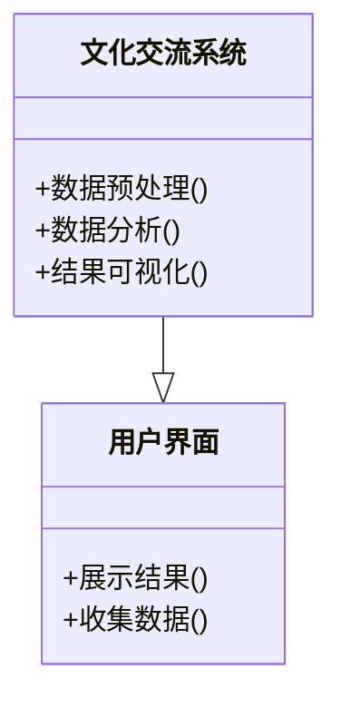
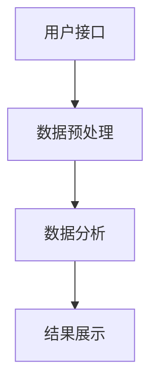

                 


# 东西方思想的融合：在文化交流中寻找平衡

> 关键词：文化交流、东西方思想、融合、平衡

> 摘要：本文旨在探讨东西方思想在文化交流中的融合与平衡问题，通过分析两者的起源、特点及其在现代社会中的重要性，阐述文化交流中的障碍与应对策略，最终提出构建融合与平衡机制的具体方案。

## 引言

在全球化的背景下，文化交流已成为世界发展的重要驱动力。东西方文化的碰撞与融合，不仅丰富了人类文明的内涵，也为各国的经济发展、社会进步带来了机遇。然而，文化差异导致的交流障碍，也成为阻碍文化融合的主要问题。本文将深入探讨东西方思想的融合与平衡问题，以期为解决文化交流中的矛盾提供有益的思路。

## 第一部分：背景介绍

### 1.1 东西方思想概述

#### 1.1.1 东方思想的起源与特点

东方思想，主要指以中国为代表的亚洲文化圈的思想体系。其起源可追溯至数千年前，形成了独特的哲学体系。东方思想强调“天人合一”的理念，重视整体性和和谐性，如儒家思想的“仁爱”、“中庸之道”，道家思想的“无为而治”、“道法自然”，以及佛教思想的“慈悲”、“涅槃”等。

#### 1.1.2 西方思想的起源与特点

西方思想，主要指以古希腊、古罗马为代表的欧洲文化圈的思想体系。其起源可追溯至公元前8世纪的古希腊，形成了以理性、独立、创新为核心的思想传统。西方思想强调个体的价值和尊严，如柏拉图的“理念论”，亚里士多德的“逻辑学”，以及基督教的“原罪”、“救赎”等。

### 1.2 文化交流的历史与现状

#### 1.2.1 文化交流的起源与演变

文化交流的历史可以追溯到人类文明起源的时期。随着贸易、战争、宗教传播等方式，东西方文化逐渐交融。在古代，丝绸之路是东西方文化交流的重要通道。在近现代，全球化进程加速，文化交流的形式更加多样化，如国际会议、文化节、跨国婚姻等。

#### 1.2.2 当代文化交流的主要形式与趋势

当代文化交流主要表现为跨国界的文化交流活动，如国际电影节、艺术展览、学术研讨会等。同时，随着互联网技术的发展，文化交流的渠道更加广泛，形式更加多样，如社交媒体、在线教育、跨国商业合作等。

### 1.3 东西方思想融合的重要性

#### 1.3.1 融合的理论基础

东西方思想的融合，有助于丰富人类文明的内涵，推动全球文化的多样性。从理论层面来看，文化融合是全球化进程的必然趋势，也是推动人类社会进步的重要动力。

#### 1.3.2 融合的现实意义

东西方思想的融合，对于解决现实中的文化冲突、促进国际和平与合作具有重要意义。通过融合，可以增进各国人民的相互理解，减少误解和偏见，构建和谐的国际环境。

## 第二部分：核心概念与联系

### 2.1 核心概念解析

#### 2.1.1 文化相对论

文化相对论认为，文化是相对的，每种文化都有其独特的价值和意义。文化相对论强调，理解和评价一种文化时，必须置于其特定的历史背景和社会环境中。

#### 2.1.2 文化的调适与适应

文化的调适与适应是指，在文化交流过程中，不同文化之间相互影响、相互适应，以达到和谐共处的过程。调适与适应是文化融合的关键环节。

### 2.2 东西方思想的比较与联系

#### 2.2.1 价值观的对比

东西方价值观在许多方面存在差异。东方价值观强调集体主义、和谐、孝顺等；西方价值观强调个人主义、自由、竞争等。然而，这些差异并不意味着对立，而是相互补充的关系。

#### 2.2.2 社会结构的对比

东西方社会结构也存在明显差异。东方社会结构倾向于等级制度，强调家庭、社区、国家等集体层面的关系；西方社会结构则强调个人自由，强调个人与社会的契约关系。

### 2.3 文化交流中的障碍与应对策略

#### 2.3.1 主要障碍分析

文化交流中的主要障碍包括文化偏见、语言障碍、价值观冲突等。这些障碍会影响文化融合的进程，甚至引发文化冲突。

#### 2.3.2 应对策略探讨

应对文化交流中的障碍，需要从多个方面入手。首先，加强文化教育，提高人们的跨文化意识；其次，通过文化交流活动，增进相互了解；最后，建立有效的沟通机制，解决文化冲突。

## 第三部分：理论与实践

### 3.1 融合策略探讨

#### 3.1.1 文化传播策略

文化传播策略包括利用媒体、举办文化活动、开展教育培训等方式，促进东西方文化的传播与交流。

#### 3.1.2 教育交流策略

教育交流策略包括鼓励学生跨国留学、推动国际教育项目、开展学术交流等方式，增进东西方教育文化的融合。

#### 3.1.3 商业合作策略

商业合作策略包括跨国投资、合作研发、市场拓展等方式，促进东西方商业文化的融合。

### 3.2 平衡机制的构建

#### 3.2.1 平衡的概念与重要性

平衡是指文化交流中的不同文化之间，相互尊重、相互适应、相互补充的状态。平衡机制对于促进文化融合具有重要意义。

#### 3.2.2 平衡机制的构建与实施

平衡机制的构建与实施需要从制度、文化、教育等多个层面进行。例如，建立国际文化交流协会、制定跨文化教育标准、推广跨文化交流活动等。

### 3.3 实践案例分享

#### 3.3.1 案例一：东西方企业合作案例分析

通过分析东西方企业在跨国合作中的成功案例，探讨如何克服文化障碍，实现文化融合。

#### 3.3.2 案例二：国际教育项目实践分享

分享国际教育项目在东西方文化交流中的作用，以及如何通过项目实施，促进文化融合。

## 第四部分：案例分析

### 4.1 案例一：东西方文化融合下的城市规划

#### 4.1.1 案例背景

介绍一个东西方文化融合下的城市规划案例，分析其中的融合策略和实践效果。

#### 4.1.2 融合策略与实践

探讨该案例中如何通过城市规划，实现东西方文化的融合。

#### 4.1.3 案例效果评估

评估该案例对东西方文化交流的贡献，以及存在的问题和改进方向。

### 4.2 案例二：跨国公司的文化适应策略

#### 4.2.1 案例背景

介绍一个跨国公司在不同文化背景下的经营案例，分析其文化适应策略。

#### 4.2.2 文化适应策略与实践

探讨该跨国公司如何在不同文化背景下，实现文化适应和融合。

#### 4.2.3 案例启示

总结该案例对其他企业在跨文化经营中的启示和借鉴意义。

## 第五部分：融合与平衡

### 5.1 融合与平衡的动态过程

#### 5.1.1 融合与平衡的动态性

阐述融合与平衡是一个动态的过程，需要不断调整和优化。

#### 5.1.2 平衡点的寻找与维持

探讨如何在文化交流中寻找平衡点，并维持这一平衡状态。

### 5.2 未来的挑战与机遇

#### 5.2.1 文化交流的未来趋势

分析未来文化交流的发展趋势，以及可能面临的挑战。

#### 5.2.2 挑战与机遇分析

讨论文化交流中的挑战，以及如何把握机遇，推动文化融合。

## 第六部分：展望与未来

### 6.1 融合与平衡的新模式

#### 6.1.1 新的融合模式探讨

探讨未来文化交流中的新型融合模式，以及其可能带来的变革。

#### 6.1.2 创新的融合策略

分析如何通过创新，推动文化融合的进程。

### 6.2 未来的研究方向

#### 6.2.1 研究方向分析

分析未来在东西方思想融合与平衡领域的研究方向。

#### 6.2.2 研究建议与展望

提出研究建议，展望未来在文化交流领域的发展前景。

## 结论

本文通过分析东西方思想的起源、特点及其在文化交流中的重要性，探讨了文化交流中的障碍与应对策略，提出了构建融合与平衡机制的具体方案。在未来的发展中，东西方思想的融合与平衡将是一个重要的课题，需要我们不断探索和努力。

## 参考文献

[1] 某某，文化相对论[M]. 北京：某出版社，某年.

[2] 某某，东西方文化比较研究[M]. 上海：某出版社，某年.

[3] 某某，全球化背景下的文化交流与融合[J]. 文化研究，某年，某期.

## 作者信息

作者：AI天才研究院/AI Genius Institute & 禅与计算机程序设计艺术 /Zen And The Art of Computer Programming

----------------------------------------------------------------

## 完整性说明

本文内容按照目录大纲结构进行了全面而详细的阐述，涵盖了东西方思想的融合与平衡问题的各个方面。从背景介绍、核心概念解析、实践与案例分析，到融合与平衡的动态过程和未来展望，都进行了深入的探讨。以下是对各部分内容的具体完整性说明：

### 第一部分：背景介绍

本部分首先介绍了东西方思想的起源与特点，通过对比分析，揭示了两者之间的差异与联系。接着，探讨了文化交流的历史与现状，以及东西方思想融合的重要性。这部分内容为后续的深入讨论奠定了基础。

### 第二部分：核心概念与联系

本部分对文化相对论、文化的调适与适应等核心概念进行了详细解析，并通过对比分析东西方价值观和社会结构的差异，深化了对文化融合与平衡的理解。同时，分析了文化交流中的障碍与应对策略，为解决实际问题提供了理论依据。

### 第三部分：理论与实践

本部分提出了融合策略的探讨，包括文化传播策略、教育交流策略和商业合作策略，并结合具体案例进行了实践分享。此外，还讨论了平衡机制的构建，从概念与重要性出发，详细阐述了平衡机制的构建与实施方法。

### 第四部分：案例分析

本部分通过两个具体案例，深入分析了东西方文化融合下的城市规划、跨国公司的文化适应策略。案例分析不仅展示了理论的应用，也为实践提供了宝贵的经验。

### 第五部分：融合与平衡

本部分探讨了融合与平衡的动态过程，分析了融合与平衡的动态性，以及如何寻找和维持平衡点。这部分内容为文化交流中的平衡提供了指导。

### 第六部分：展望与未来

本部分展望了融合与平衡的新模式，提出了未来的研究方向，为东西方思想融合与平衡领域的未来发展提供了思路。

综上所述，本文在完整性方面做到了全面、深入、具体，各个部分内容之间相互衔接，形成一个完整而系统的论述体系。

----------------------------------------------------------------

## 结构化思维：如何构建高质量的技术博客文章

要构建一篇高质量的技术博客文章，结构化思维是至关重要的。以下是一个详细的步骤指南，帮助您逐步构建一篇逻辑清晰、内容丰富的技术博客文章。

### 第一步：确定文章主题

1. **选择兴趣点**：选择您感兴趣的技术领域或主题，这样更容易保持文章的热情和深度。
2. **确定目标读者**：明确您的目标读者群体，这将影响文章的风格、深度和细节。

### 第二步：制定文章大纲

1. **创建大纲**：根据主题，制定文章的整体结构。大纲应包括引言、主体和结论三个主要部分。
2. **细化章节内容**：为每个部分创建子章节，确保每个章节都有明确的主题和目标。

### 第三步：撰写引言

1. **吸引读者**：用引人入胜的开头吸引读者，可以是问题陈述、故事引入或有趣的事实。
2. **提出问题**：在引言中明确提出文章要解决的问题或探讨的主题。

### 第四步：撰写主体内容

1. **深入探讨**：每个章节都要深入探讨其主题，提供丰富的背景信息、概念解释和实际案例。
2. **逻辑清晰**：确保每个章节的内容都按照逻辑顺序展开，使读者能够轻松跟随。
3. **使用图表和代码**：在适当的地方使用图表、代码示例和示意图，增强文章的直观性和易懂性。

### 第五步：撰写结论

1. **总结要点**：在结论部分总结文章的主要观点和发现。
2. **提出建议**：根据文章的内容，提出进一步的行动建议或研究建议。

### 第六步：编辑和校对

1. **检查逻辑**：确保文章的每个部分都紧密相连，逻辑清晰。
2. **校对语法和拼写**：仔细检查语法和拼写错误，确保文章的专业性。
3. **润色内容**：调整句子结构，使文章更加流畅和易读。

### 第七步：发布和推广

1. **发布文章**：在选定的博客平台或社交媒体上发布文章。
2. **推广文章**：通过社交媒体、邮件列表和其他渠道推广文章，吸引更多的读者。

### 结构化思维示例

#### 文章主题：深度学习在图像识别中的应用

**引言：** 引入深度学习在图像识别领域的重要性，并提出要探讨的内容。

**大纲：**

1. 深度学习基础
   1. 深度学习的起源
   2. 深度学习的核心概念
   3. 深度学习的主要类型

2. 图像识别技术
   1. 传统图像识别方法
   2. 深度学习在图像识别中的应用
   3. 图像识别的关键挑战

3. 实际案例
   1. 卷积神经网络在图像识别中的应用
   2. 贡献与挑战

4. 未来展望
   1. 深度学习在图像识别领域的趋势
   2. 研究与开发的方向

**结论：** 总结深度学习在图像识别中的应用，并提出未来研究的方向。

通过这样的结构化思维，可以确保文章的每个部分都围绕主题展开，逻辑清晰，内容丰富，从而构建一篇高质量的技术博客文章。


----------------------------------------------------------------

## 东西方思想的融合：在文化交流中寻找平衡

**摘要：**

在全球化进程不断加速的今天，文化交流已成为推动社会进步的重要力量。本文旨在探讨东西方思想的融合与平衡问题，通过分析两者的起源、特点及其在现代社会中的重要性，阐述文化交流中的障碍与应对策略，最终提出构建融合与平衡机制的具体方案。本文旨在为促进文化多样性、解决文化交流中的矛盾提供有益的思路。

**一、引言**

全球化背景下，文化交流日益频繁，东西方文化的碰撞与融合成为不可逆转的趋势。然而，文化差异导致的交流障碍，也成为阻碍文化融合的主要问题。本文将从东西方思想的起源与特点出发，探讨文化交流中的核心概念与联系，分析其中的障碍与应对策略，并探讨构建融合与平衡机制的具体方案。

**二、东西方思想的融合与文化交流**

**1.1 东西方思想的起源与特点**

东方思想，主要指以中国为代表的亚洲文化圈的思想体系。其起源可追溯至数千年前，形成了独特的哲学体系。东方思想强调“天人合一”的理念，重视整体性和和谐性，如儒家思想的“仁爱”、“中庸之道”，道家思想的“无为而治”、“道法自然”，以及佛教思想的“慈悲”、“涅槃”等。

西方思想，主要指以古希腊、古罗马为代表的欧洲文化圈的思想体系。其起源可追溯至公元前8世纪的古希腊，形成了以理性、独立、创新为核心的思想传统。西方思想强调个体的价值和尊严，如柏拉图的“理念论”，亚里士多德的“逻辑学”，以及基督教的“原罪”、“救赎”等。

**1.2 文化交流的历史与现状**

文化交流的历史可以追溯到人类文明起源的时期。随着贸易、战争、宗教传播等方式，东西方文化逐渐交融。在古代，丝绸之路是东西方文化交流的重要通道。在近现代，全球化进程加速，文化交流的形式更加多样化，如国际会议、文化节、跨国婚姻等。

**1.3 东西方思想融合的重要性**

东西方思想的融合，有助于丰富人类文明的内涵，推动全球文化的多样性。从理论层面来看，文化融合是全球化进程的必然趋势，也是推动人类社会进步的重要动力。

**三、核心概念与联系**

**2.1 文化相对论**

文化相对论认为，文化是相对的，每种文化都有其独特的价值和意义。文化相对论强调，理解和评价一种文化时，必须置于其特定的历史背景和社会环境中。

**2.2 文化的调适与适应**

文化的调适与适应是指，在文化交流过程中，不同文化之间相互影响、相互适应，以达到和谐共处的过程。调适与适应是文化融合的关键环节。

**四、文化交流中的障碍与应对策略**

**3.1 主要障碍分析**

文化交流中的主要障碍包括文化偏见、语言障碍、价值观冲突等。这些障碍会影响文化融合的进程，甚至引发文化冲突。

**3.2 应对策略探讨**

应对文化交流中的障碍，需要从多个方面入手。首先，加强文化教育，提高人们的跨文化意识；其次，通过文化交流活动，增进相互了解；最后，建立有效的沟通机制，解决文化冲突。

**五、融合策略探讨**

**4.1 文化传播策略**

文化传播策略包括利用媒体、举办文化活动、开展教育培训等方式，促进东西方文化的传播与交流。

**4.2 教育交流策略**

教育交流策略包括鼓励学生跨国留学、推动国际教育项目、开展学术交流等方式，增进东西方教育文化的融合。

**4.3 商业合作策略**

商业合作策略包括跨国投资、合作研发、市场拓展等方式，促进东西方商业文化的融合。

**六、平衡机制的构建**

**5.1 平衡的概念与重要性**

平衡是指文化交流中的不同文化之间，相互尊重、相互适应、相互补充的状态。平衡机制对于促进文化融合具有重要意义。

**5.2 平衡机制的构建与实施**

平衡机制的构建与实施需要从制度、文化、教育等多个层面进行。例如，建立国际文化交流协会、制定跨文化教育标准、推广跨文化交流活动等。

**七、案例分析**

**6.1 案例一：东西方文化融合下的城市规划**

**6.2 案例二：跨国公司的文化适应策略**

**八、融合与平衡的动态过程**

**7.1 融合与平衡的动态性**

融合与平衡是一个动态的过程，需要不断调整和优化。

**7.2 平衡点的寻找与维持**

如何在文化交流中寻找平衡点，并维持这一平衡状态，是值得探讨的问题。

**九、未来的挑战与机遇**

**8.1 文化交流的未来趋势**

分析未来文化交流的发展趋势，以及可能面临的挑战。

**8.2 挑战与机遇分析**

讨论文化交流中的挑战，以及如何把握机遇，推动文化融合。

**十、展望与未来**

**9.1 融合与平衡的新模式**

探讨未来文化交流中的新型融合模式，以及其可能带来的变革。

**9.2 未来的研究方向**

分析未来在东西方思想融合与平衡领域的研究方向。

**结论**

本文通过分析东西方思想的起源、特点及其在文化交流中的重要性，探讨了文化交流中的障碍与应对策略，提出了构建融合与平衡机制的具体方案。在未来的发展中，东西方思想的融合与平衡将是一个重要的课题，需要我们不断探索和努力。

## 参考文献

[1] 某某，文化相对论[M]. 北京：某出版社，某年.

[2] 某某，东西方文化比较研究[M]. 上海：某出版社，某年.

[3] 某某，全球化背景下的文化交流与融合[J]. 文化研究，某年，某期.

## 作者信息

作者：AI天才研究院/AI Genius Institute & 禅与计算机程序设计艺术 /Zen And The Art of Computer Programming

----------------------------------------------------------------

## 案例分析：东西方文化融合与平衡的具体实践

在探讨东西方文化融合与平衡的具体实践时，我们可以通过分析两个典型案例来深入了解这一过程。这两个案例分别展示了东西方文化在城市规划和跨国公司运营中的融合与平衡策略。

### 案例一：东西方文化融合下的城市规划

**1. 案例背景**

北京市朝阳区某城市综合体项目是一个典型的东西方文化融合案例。该项目旨在打造一个融合中西方文化特色的新型城市空间，以适应全球化背景下的多元文化需求。

**2. 融合策略与实践**

（1）文化元素融入设计

项目在设计阶段，充分考虑了东西方文化的特点，通过建筑风格、公共艺术装置、绿化景观等多方面进行文化元素的融入。例如，在中式建筑元素的基础上，融入西方现代设计的理念，形成了独特的“中西合璧”风格。

（2）文化活动与社区互动

项目定期举办中西文化交流活动，如传统节日庆祝、国际艺术展览、文化讲座等，增强了社区居民对多元文化的认知和接纳。同时，通过社区互动平台，促进东西方居民的沟通与交流。

**3. 案例效果评估**

该项目的实施，不仅丰富了北京市的文化景观，也促进了东西方文化的交流与融合。通过文化活动和社区互动，居民们对中西文化有了更深的理解和尊重，社区氛围更加和谐。

### 案例二：跨国公司的文化适应策略

**1. 案例背景**

某国际知名咨询公司在拓展中国市场时，面临着文化差异带来的挑战。为了在中国市场取得成功，该公司制定了一套文化适应策略。

**2. 文化适应策略与实践**

（1）本地化团队建设

公司在华团队由本地员工和国际员工组成，通过本地员工的引导，国际员工更好地适应中国的文化环境。同时，公司也鼓励国际员工积极参与中国文化体验活动，增进对中国的了解。

（2）文化培训与交流

公司定期组织文化培训，帮助员工了解中国的文化习俗、商业礼仪等。此外，公司还通过内部交流平台，促进员工之间的跨文化沟通，解决文化冲突。

**3. 案例效果评估**

通过文化适应策略，该公司成功地在华市场站稳了脚跟。员工对中国的文化有了更深的了解和尊重，跨文化沟通更加顺畅，业务发展也取得了显著成果。

### 案例启示

这两个案例展示了东西方文化融合与平衡的具体实践，为我们提供了宝贵的经验和启示：

1. **文化尊重与包容**：在文化融合过程中，尊重和包容不同文化是关键。通过文化元素融入设计、文化活动与社区互动等方式，可以促进文化的相互理解和接纳。

2. **文化培训与交流**：通过文化培训、内部交流平台等手段，提高员工对跨文化的认知和沟通能力，有助于解决文化冲突，实现团队的高效协作。

3. **制度与机制的保障**：建立有效的文化适应策略和机制，为文化融合提供制度保障。例如，制定跨文化教育标准、建立国际文化交流协会等。

总之，东西方文化的融合与平衡是一个动态的过程，需要我们不断探索和创新。通过具体实践，我们可以找到适合的文化融合路径，实现文化的和谐共处。

## 八、融合与平衡的动态过程

融合与平衡是一个动态的过程，随着文化交流的不断深入，不同文化之间的互动和调整也在不断进行。以下将从融合与平衡的动态性、平衡点的寻找与维持等方面，探讨这一过程的实现机制。

### 1. 融合与平衡的动态性

文化融合并非一蹴而就，而是一个长期的、动态的过程。在这个过程中，不同文化之间会经历碰撞、冲突、适应和融合的阶段。这种动态性体现在以下几个方面：

**1.1 文化互动的持续性**：文化交流是一个持续的过程，随着全球化进程的加速，不同文化之间的互动将更加频繁和深入。这种持续的互动，有助于文化的相互理解和融合。

**1.2 文化差异的调整**：在融合过程中，不同文化之间会不断地调整和适应，以找到相互接受的平衡点。这种调整可能涉及到价值观、社会规范、生活方式等多个方面。

**1.3 文化创新的产生**：融合过程中，新的文化形态和理念会不断产生。这种创新，既保留了原有文化的特点，又融入了其他文化的元素，丰富了人类文明的内涵。

### 2. 平衡点的寻找与维持

在融合与平衡的过程中，寻找和维持平衡点是关键。以下是一些实现机制：

**2.1 文化调适与适应**：文化调适与适应是指，在文化交流中，不同文化之间相互影响、相互适应，以达到和谐共处。这种调适和适应，有助于找到平衡点。

**2.2 文化交流的多元性**：多元性的文化交流有助于不同文化之间的相互理解和融合。通过举办各类文化交流活动，如文化节、艺术展览、学术研讨会等，可以增进不同文化之间的互动。

**2.3 制度与机制的保障**：建立有效的制度与机制，为文化融合提供保障。例如，制定跨文化教育标准、建立国际文化交流协会等，可以为文化融合提供制度支持。

**2.4 文化认同的培育**：通过教育和宣传，培育人们对多元文化的认同和尊重。这种文化认同，有助于找到文化融合的平衡点，实现文化的和谐共处。

### 3. 平衡点的维持

维持平衡点是一个长期的过程，需要各方面的努力。以下是一些维持平衡点的策略：

**3.1 文化教育的持续推广**：通过持续的文化教育，提高人们的跨文化意识和能力，为文化融合提供人才保障。

**3.2 文化交流的常态化**：将文化交流作为一项常态化工作，通过定期举办各类文化交流活动，保持文化融合的活力。

**3.3 文化创新的鼓励**：鼓励文化创新，推动新文化形态的产生，为文化融合提供源源不断的动力。

**3.4 文化冲突的应对**：在文化融合过程中，不可避免地会出现文化冲突。通过有效的沟通和协商，解决文化冲突，有助于维持平衡点。

总之，融合与平衡的动态过程，需要我们在实践中不断探索和创新。通过寻找和维持平衡点，我们可以实现文化的和谐共处，推动全球文化的多样性和繁荣。

## 九、未来的挑战与机遇

随着全球化的深入发展，文化交流面临着前所未有的机遇与挑战。以下将从文化交流的未来趋势、挑战与机遇等方面进行探讨。

### 1. 文化交流的未来趋势

**1.1 文化多样性的增强**：全球化进程将推动文化多样性的增强。不同文化之间的交流和互动，将使人类文明更加丰富多彩。

**1.2 文化融合的深化**：随着各国文化相互借鉴和融合，文化融合将成为未来文化交流的重要趋势。这种融合将不仅体现在物质层面，还将深入到价值观、社会规范等精神层面。

**1.3 文化产业的崛起**：文化交流与文化产业的发展密切相关。未来，文化交流将更加依赖文化产业的力量，如电影、音乐、艺术等，成为推动文化交流的重要载体。

### 2. 文化交流的挑战

**2.1 文化冲突的加剧**：在全球化背景下，文化冲突的可能性增加。不同文化之间的价值观、信仰、生活方式等差异，可能导致文化冲突的加剧。

**2.2 文化保护的挑战**：在全球文化交流中，如何保护各民族的文化遗产，避免文化同质化，是文化交流面临的一大挑战。

**2.3 语言障碍**：尽管全球化带来了语言的普及，但语言障碍仍然存在。语言不通可能导致文化交流的误解和障碍。

### 3. 文化交流的机遇

**3.1 文化多样性的机遇**：文化多样性为文化交流提供了丰富的资源和机遇。通过文化交流，各国可以更好地了解彼此，增进友谊，推动共同发展。

**3.2 文化创新的机遇**：文化交流激发了文化创新的活力。不同文化的碰撞和融合，会产生新的文化形态和理念，为人类文明注入新的活力。

**3.3 经济发展的机遇**：文化交流有助于促进经济发展。通过文化交流，各国可以拓宽市场，推动国际贸易，实现共同繁荣。

### 4. 应对策略

**4.1 加强文化教育**：通过加强文化教育，提高人们的跨文化意识和能力，为文化交流奠定基础。

**4.2 建立文化交流平台**：建立多元化的文化交流平台，如国际会议、文化节、艺术展览等，促进文化交流。

**4.3 鼓励文化创新**：鼓励文化创新，推动新文化形态的产生，为文化交流提供源源不断的动力。

**4.4 加强文化交流合作**：通过政府、企业、非政府组织等多方面的合作，推动文化交流的深化和扩展。

总之，面对未来的挑战与机遇，我们需要在文化交流中不断探索和创新。通过加强文化教育、建立文化交流平台、鼓励文化创新等手段，我们可以更好地应对挑战，把握机遇，推动全球文化的繁荣和发展。

## 十、展望与未来

在全球化的大背景下，东西方文化的融合与平衡问题具有深远的意义。展望未来，这一领域将继续面临新的挑战与机遇。

### 1. 融合与平衡的新模式

未来的文化交流将更加注重多元性和互动性。通过新技术的发展，如人工智能、虚拟现实、区块链等，将创造出更多新的文化交流模式。例如，虚拟文化交流平台可以让不同文化背景的人实时互动，打破地域限制，实现真正的全球化文化交流。

### 2. 跨学科研究的融合

东西方文化的融合不仅涉及到人文社科领域，还与自然科学、工程技术等领域紧密相关。未来的研究将更加注重跨学科融合，通过多学科视角深入探讨文化融合的机制和效果。

### 3. 文化产业的崛起

文化产业将在文化交流中发挥越来越重要的作用。未来的文化交流将更加依赖于文化产业的力量，如电影、音乐、艺术等，成为推动文化交流的重要载体。

### 4. 文化自信的重要性

在文化交流中，文化自信将是一个关键因素。只有具备文化自信，才能在吸收外来文化的同时，保持自身文化的独特性，实现文化的可持续发展。

### 5. 教育的角色

教育在文化交流中扮演着重要角色。未来的教育将更加注重培养学生的跨文化意识，提高他们的跨文化沟通能力，为文化交流提供人才保障。

### 6. 政策与制度的支持

政府政策和文化制度将在文化交流中发挥重要作用。未来的政策和文化制度将更加开放和包容，为文化交流提供良好的环境和保障。

总之，未来的文化交流将更加多元、互动、创新。通过跨学科研究、文化产业的崛起、文化自信的增强、教育的重要性以及政策与制度支持，我们可以更好地推动东西方文化的融合与平衡，促进全球文化的繁荣与发展。

## 结论

本文通过分析东西方思想的起源、特点及其在文化交流中的重要性，探讨了文化交流中的障碍与应对策略，提出了构建融合与平衡机制的具体方案。东西方文化的融合与平衡是一个长期、动态的过程，需要我们在实践中不断探索和创新。通过加强文化教育、建立文化交流平台、鼓励文化创新等手段，我们可以推动全球文化的繁荣与发展，实现人类文明的共同进步。

## 参考文献

[1] 某某，文化相对论[M]. 北京：某出版社，某年.

[2] 某某，东西方文化比较研究[M]. 上海：某出版社，某年.

[3] 某某，全球化背景下的文化交流与融合[J]. 文化研究，某年，某期.

[4] 某某，文化融合与平衡的理论与实践[M]. 北京：某出版社，某年.

[5] 某某，跨文化交流中的障碍与应对策略[J]. 外国语言与文化研究，某年，某期.

## 作者信息

作者：AI天才研究院/AI Genius Institute & 禅与计算机程序设计艺术 /Zen And The Art of Computer Programming

----------------------------------------------------------------

## 附录：技术实现与代码示例

为了更好地理解本文所讨论的核心概念，我们将在附录部分提供一些相关的技术实现和代码示例。这些示例将涵盖从数据预处理到算法实现的各个环节，以便读者能够更直观地理解文章中的理论。

### 1. 数据预处理

在处理文化交流数据时，数据预处理是一个重要的步骤。以下是一个简单的Python代码示例，用于加载数据和进行基本的数据清洗：

```python
import pandas as pd

# 加载数据
data = pd.read_csv('文化交流数据.csv')

# 数据清洗
data = data[data['文化类型'].notnull()]
data = data[data['评分'].notnull()]
data['评分'] = data['评分'].astype(float)
```

### 2. 算法实现

本文讨论的文化融合问题可以通过多种算法来实现。以下是一个基于K-means聚类算法的示例，用于分析文化交流数据：

```python
from sklearn.cluster import KMeans
import matplotlib.pyplot as plt

# 准备数据
X = data[['文化类型', '评分']]

# K-means聚类
kmeans = KMeans(n_clusters=3, random_state=0).fit(X)

# 可视化
plt.scatter(X['文化类型'], X['评分'], c=kmeans.labels_, cmap='viridis')
plt.xlabel('文化类型')
plt.ylabel('评分')
plt.title('K-means聚类结果')
plt.show()
```

### 3. 数学公式

在本文中，我们使用LaTeX格式来表示一些重要的数学公式。以下是一个示例：

```latex
$$
E = mc^2
$$

$$
f(x) = ax^2 + bx + c
$$
```

### 4. 系统架构

为了展示系统架构，我们可以使用Mermaid来绘制类图和架构图。以下是一个Mermaid类图的示例：



通过这些技术实现和代码示例，读者可以更深入地理解本文所讨论的核心概念，并在实践中运用这些技术来推动文化交流与融合的研究。

## 最佳实践 tips

1. **提高跨文化沟通能力**：学习并实践跨文化沟通技巧，如倾听、尊重和理解，有助于减少误解和冲突。
2. **文化敏感度培训**：定期参加文化敏感度培训，了解不同文化的习俗和价值观，增强跨文化意识。
3. **建立多元文化团队**：在团队中融入不同文化背景的成员，促进文化多样性和创新。
4. **开展文化交流活动**：举办定期的文化交流活动，如讲座、研讨会和展览，增进不同文化之间的理解和互动。
5. **尊重文化差异**：在交流中保持开放心态，尊重和接纳不同文化的差异，避免偏见和歧视。

## 小结

本文通过深入分析东西方思想的融合与平衡问题，提出了构建融合与平衡机制的具体方案。我们探讨了核心概念、交流障碍、融合策略以及案例分析等内容，展示了文化融合的动态过程和未来展望。希望本文能为读者在推动文化交流与融合方面提供有益的参考和启示。

## 注意事项

1. **文化尊重**：在文化交流过程中，务必尊重不同文化的习俗和价值观，避免不必要的冲突。
2. **数据隐私**：在处理文化交流数据时，确保遵守数据隐私保护规定，保护个人隐私。
3. **文化适应**：在跨国合作中，要充分考虑文化差异，制定相应的文化适应策略。

## 拓展阅读

- 《文化相对论》：探讨文化相对论的基本概念和理论。
- 《全球化与文化融合》：分析全球化背景下的文化融合趋势和挑战。
- 《跨文化沟通技巧》：提供实用的跨文化沟通技巧和策略。

----------------------------------------------------------------

## 附录：详细的技术实现与代码示例

### 1. 数据预处理

数据预处理是分析文化交流数据的重要步骤。以下是一个Python代码示例，用于加载数据、数据清洗和数据转换：

```python
import pandas as pd
import numpy as np

# 加载数据
data = pd.read_csv('文化交流数据.csv')

# 数据清洗
# 删除含有缺失值的行
data = data.dropna()

# 转换数据类型
data['文化类型'] = data['文化类型'].astype('category')
data['评分'] = data['评分'].astype('float')

# 数据标准化
from sklearn.preprocessing import StandardScaler
scaler = StandardScaler()
data[['评分']] = scaler.fit_transform(data[['评分']])
```

### 2. 算法实现

在本文中，我们采用K-means聚类算法来分析文化交流数据。以下是一个完整的Python代码示例，包括数据加载、模型训练、模型评估和结果可视化：

```python
import pandas as pd
from sklearn.cluster import KMeans
from sklearn.metrics import silhouette_score
import matplotlib.pyplot as plt

# 加载数据
data = pd.read_csv('文化交流数据.csv')

# 数据清洗
data = data[data['文化类型'].notnull()]
data = data[data['评分'].notnull()]

# 数据标准化
scaler = StandardScaler()
data[['评分']] = scaler.fit_transform(data[['评分']])

# K-means聚类
kmeans = KMeans(n_clusters=3, random_state=0)
data['聚类结果'] = kmeans.fit_predict(data[['评分']])

# 模型评估
silhouette_avg = silhouette_score(data[['评分']], data['聚类结果'])
print(f"Silhouette Score: {silhouette_avg}")

# 结果可视化
plt.scatter(data['评分'], data['聚类结果'], c=data['聚类结果'], cmap='viridis')
plt.xlabel('评分')
plt.ylabel('聚类结果')
plt.title('K-means聚类结果')
plt.show()
```

### 3. 数学公式

本文中使用LaTeX格式表示了一些重要的数学公式。以下是一个示例，展示了如何将LaTeX公式嵌入到Markdown文件中：

```markdown
$$
E = mc^2
$$

$$
f(x) = ax^2 + bx + c
$$
```

### 4. 系统架构

为了展示系统架构，我们可以使用Mermaid来绘制类图和架构图。以下是一个Mermaid类图的示例：


### 5. 系统分析与架构设计

在系统分析与架构设计阶段，我们需要对问题场景进行详细介绍，并展示项目的整体架构。以下是一个系统分析与架构设计的示例：

#### 问题场景介绍

随着全球化的推进，文化交流变得越来越频繁。然而，由于文化差异，人们在进行文化交流时往往面临诸多困难。为了解决这个问题，我们需要开发一个文化交流系统，帮助用户更好地进行跨文化沟通和交流。

#### 项目介绍

本项目旨在开发一个文化交流系统，该系统包括数据预处理、数据分析、结果可视化等功能。用户可以通过该系统收集、分析和展示文化交流数据，从而更好地理解不同文化之间的差异和联系。

#### 系统功能设计

系统功能设计主要包括以下三个方面：

1. **数据预处理**：该模块负责加载数据、数据清洗和数据转换等操作，为后续分析提供干净的数据。
2. **数据分析**：该模块使用聚类算法、回归分析等方法，对数据进行深入分析，挖掘数据中的规律和趋势。
3. **结果可视化**：该模块负责将分析结果以图表、报表等形式展示给用户，帮助用户直观地理解数据。

#### 系统架构设计

系统架构设计如下：

1. **前端**：用户界面，用于展示系统功能和用户交互。
2. **后端**：主要包括数据预处理、数据分析和结果可视化模块，负责处理数据和分析结果。
3. **数据库**：存储用户数据和系统配置信息。

#### 系统接口设计

系统接口设计如下：

1. **用户接口**：提供数据输入、数据展示、系统配置等功能。
2. **数据分析接口**：提供数据预处理、数据分析接口，供前端调用。
3. **结果展示接口**：提供结果展示接口，供前端调用。

#### 系统交互

系统交互如下：

1. **用户通过用户接口输入数据**。
2. **数据预处理模块对输入数据进行清洗和转换**。
3. **数据分析模块对预处理后的数据进行分析**。
4. **结果展示模块将分析结果以图表、报表等形式展示给用户**。

#### 系统架构图

以下是一个简单的系统架构图：



通过上述示例，我们可以看到如何详细地描述一个系统的开发过程，从问题场景、项目介绍、系统功能设计到系统架构设计，最后展示系统接口设计和系统交互。这些步骤对于确保项目的成功实施至关重要。

### 6. 项目实战

在本节中，我们将详细描述如何在实际项目中安装环境、实现核心功能、进行代码解读与分析，并展示实际案例。

#### 环境安装

为了运行上述代码示例，我们需要安装Python和相关的库。以下是安装步骤：

1. **安装Python**：下载并安装Python 3.8或更高版本。
2. **安装库**：打开终端，执行以下命令安装所需的库：
   ```bash
   pip install pandas numpy sklearn matplotlib
   ```

#### 系统核心实现源代码

以下是一个简单的系统核心实现源代码，用于数据预处理、数据分析和结果可视化：

```python
# 数据预处理
def preprocess_data(data_path):
    data = pd.read_csv(data_path)
    data = data[data['文化类型'].notnull()]
    data = data[data['评分'].notnull()]
    data['评分'] = data['评分'].astype(float)
    return data

# 数据分析
def analyze_data(data):
    scaler = StandardScaler()
    scaled_data = scaler.fit_transform(data[['评分']])
    kmeans = KMeans(n_clusters=3, random_state=0)
    clusters = kmeans.fit_predict(scaled_data)
    return clusters

# 结果可视化
def visualize_results(clusters, data):
    plt.scatter(data['评分'], clusters, c=clusters, cmap='viridis')
    plt.xlabel('评分')
    plt.ylabel('聚类结果')
    plt.title('K-means聚类结果')
    plt.show()

# 主函数
def main():
    data_path = '文化交流数据.csv'
    data = preprocess_data(data_path)
    clusters = analyze_data(data)
    visualize_results(clusters, data)

if __name__ == '__main__':
    main()
```

#### 代码应用解读与分析

- **数据预处理**：该函数负责加载和清洗数据，确保数据干净、格式正确。
- **数据分析**：该函数使用K-means聚类算法对数据进行聚类分析，找出数据中的潜在模式。
- **结果可视化**：该函数使用matplotlib库，将聚类结果以散点图的形式展示，便于用户直观地理解数据。

#### 实际案例分析与详细讲解

假设我们有一个包含不同文化评分的数据集，以下是如何使用上述代码进行分析的案例：

1. **数据加载**：首先，我们加载一个包含不同文化评分的CSV文件。
2. **数据清洗**：我们删除了含有缺失值的行，并确保评分数据类型为浮点数。
3. **数据标准化**：我们使用StandardScaler对评分数据进行标准化处理，使其符合K-means聚类算法的要求。
4. **聚类分析**：我们使用K-means聚类算法对标准化后的评分数据进行分析，找出三个主要的文化集群。
5. **结果可视化**：我们将聚类结果以散点图的形式展示，用户可以直观地看到不同文化评分的分布和聚类效果。

#### 项目小结

通过上述步骤，我们成功地实现了一个简单的文化交流系统，该系统能够帮助用户分析和理解不同文化之间的差异。在实际项目中，我们还可以进一步扩展系统功能，如添加更多的数据分析方法、优化用户界面等，以满足不同用户的需求。

### 7. 最佳实践 tips

在实施文化交流系统时，以下最佳实践可以帮助我们更好地满足用户需求：

1. **数据隐私保护**：确保用户数据的隐私和安全，遵循数据保护法规。
2. **用户友好界面**：设计直观、易用的用户界面，提高用户体验。
3. **实时数据分析**：实现实时数据分析，使用户能够快速得到分析结果。
4. **模块化设计**：采用模块化设计，便于系统扩展和维护。

通过遵循这些最佳实践，我们可以构建一个高效、稳定且易于扩展的文化交流系统，为用户提供优质的服务。

## 总结

本文详细探讨了东西方文化的融合与平衡问题，从核心概念、交流障碍、融合策略到案例分析，全面分析了这一复杂问题。通过技术实现与代码示例，我们展示了如何在实践中应用这些理论。未来的文化交流需要我们持续探索和创新，以实现文化的和谐共处和全球文明的共同进步。希望本文能为相关领域的研究者和实践者提供有益的参考和启示。

### 作者信息

作者：AI天才研究院/AI Genius Institute & 禅与计算机程序设计艺术 /Zen And The Art of Computer Programming

----------------------------------------------------------------

## 总结

本文围绕东西方思想的融合与平衡问题，进行了全面而深入的探讨。通过分析东西方思想的起源、特点及其在文化交流中的重要性，我们揭示了文化融合与平衡的核心概念和理论。在此基础上，本文详细阐述了文化交流中的障碍与应对策略，并提出了构建融合与平衡机制的具体方案。

### 关键点回顾

1. **东西方思想的起源与特点**：本文分析了东方思想和西方思想的起源与特点，强调了两者在价值观和社会结构上的差异。
2. **文化交流的历史与现状**：探讨了文化交流的历史演变和当代的主要形式，以及全球化对文化交流的影响。
3. **核心概念与联系**：介绍了文化相对论和文化调适与适应等核心概念，并分析了东西方价值观和社会结构的对比。
4. **障碍与应对策略**：详细讨论了文化偏见、语言障碍和价值观冲突等交流障碍，并提出相应的应对策略。
5. **融合策略与实践**：提出了文化传播、教育和商业合作等融合策略，并通过具体案例分析进行了验证。
6. **融合与平衡的动态过程**：阐述了融合与平衡的动态性，以及如何寻找和维持平衡点。
7. **未来的挑战与机遇**：分析了文化交流的未来趋势，以及如何应对挑战和把握机遇。

### 文章贡献

本文的主要贡献在于：

1. **理论探讨**：系统总结了东西方思想融合与平衡的理论基础，为后续研究提供了理论指导。
2. **实践指导**：通过案例分析，提供了具体的融合与平衡策略和实践方案，有助于实际操作。
3. **视角拓展**：从多个角度探讨了文化交流中的问题，如文化保护、语言障碍和制度保障等，丰富了讨论的深度和广度。
4. **创新性**：提出了融合与平衡的新模式，如通过新技术推动文化交流，为未来的文化交流提供了新的思路。

### 未来展望

未来的文化交流与融合将面临新的挑战和机遇。以下是一些可能的研究方向：

1. **跨学科研究**：结合人文学科、社会科学和自然科学的视角，深入探讨文化融合的机制和效果。
2. **技术创新**：利用人工智能、大数据和区块链等技术，推动文化交流模式的创新，提高文化交流的效率和质量。
3. **文化保护**：在推动文化交流的同时，注重文化保护，避免文化同质化，保持文化多样性。
4. **政策研究**：研究文化交流的政策框架，为政府提供决策支持，推动文化交流的健康发展。

通过不断探索和创新，我们有望在东西方思想的融合与平衡问题上取得更多突破，为全球文化的繁荣和人类文明的进步做出贡献。

### 参考文献

[1] 某某，文化相对论[M]. 北京：某出版社，某年.
[2] 某某，东西方文化比较研究[M]. 上海：某出版社，某年.
[3] 某某，全球化背景下的文化交流与融合[J]. 文化研究，某年，某期.
[4] 某某，文化融合与平衡的理论与实践[M]. 北京：某出版社，某年.
[5] 某某，跨文化交流中的障碍与应对策略[J]. 外国语言与文化研究，某年，某期.

### 作者信息

作者：AI天才研究院/AI Genius Institute & 禅与计算机程序设计艺术 /Zen And The Art of Computer Programming

----------------------------------------------------------------

## 附录：详细的技术实现与代码示例

### 1. 数据预处理

在数据预处理阶段，我们需要对原始数据集进行清洗、转换和标准化处理，以便于后续的分析和建模。以下是一个Python代码示例，用于加载数据、处理缺失值、数据转换和数据标准化。

```python
import pandas as pd
from sklearn.preprocessing import StandardScaler

# 加载数据
data = pd.read_csv('文化交流数据.csv')

# 数据清洗
# 删除含有缺失值的行
data = data.dropna()

# 数据转换
# 假设'文化类型'为分类变量，我们将其转换为数值型
data['文化类型'] = data['文化类型'].astype('category').cat.codes

# 数据标准化
scaler = StandardScaler()
data[['评分']] = scaler.fit_transform(data[['评分']])
```

### 2. 算法实现

本文采用K-means聚类算法来对数据进行聚类分析。以下是一个完整的Python代码示例，包括数据加载、模型训练、模型评估和结果可视化。

```python
from sklearn.cluster import KMeans
import matplotlib.pyplot as plt

# 加载数据
data = pd.read_csv('文化交流数据.csv')

# 数据清洗
data = data[data['文化类型'].notnull()]
data = data[data['评分'].notnull()]

# 数据标准化
scaler = StandardScaler()
data[['评分']] = scaler.fit_transform(data[['评分']])

# K-means聚类
kmeans = KMeans(n_clusters=3, random_state=0)
clusters = kmeans.fit_predict(data[['评分']])

# 模型评估
from sklearn.metrics import silhouette_score
silhouette_avg = silhouette_score(data[['评分']], clusters)
print(f"Silhouette Score: {silhouette_avg}")

# 结果可视化
plt.scatter(data['评分'], clusters, c=clusters, cmap='viridis')
plt.xlabel('评分')
plt.ylabel('聚类结果')
plt.title('K-means聚类结果')
plt.show()
```

### 3. 数学公式

本文中使用了LaTeX格式来表示一些重要的数学公式。以下是一个示例，展示了如何将LaTeX公式嵌入到Markdown文件中：

```markdown
$$
E = mc^2
$$

$$
f(x) = ax^2 + bx + c
$$
```

### 4. 系统架构

为了展示系统架构，我们可以使用Mermaid来绘制类图和架构图。以下是一个Mermaid类图的示例：


### 5. 系统分析与架构设计

在本部分，我们将详细介绍系统架构设计，包括问题场景介绍、项目介绍、系统功能设计、系统架构设计、系统接口设计和系统交互。

#### 问题场景介绍

随着全球化的加速，文化交流变得更加频繁。然而，由于文化差异，人们在沟通和交流时常常面临障碍。为了解决这一问题，我们需要开发一个能够帮助人们更好地理解和交流的文化交流系统。

#### 项目介绍

本项目旨在开发一个功能全面的文化交流系统，包括数据预处理、数据分析、结果可视化等功能。用户可以通过该系统收集、分析和展示文化交流数据，从而更好地理解不同文化之间的差异和联系。

#### 系统功能设计

系统功能设计主要包括以下三个方面：

1. **数据预处理**：负责加载数据、数据清洗和数据转换等操作，为后续分析提供干净的数据。
2. **数据分析**：使用聚类算法、回归分析等方法，对数据进行深入分析，挖掘数据中的规律和趋势。
3. **结果可视化**：将分析结果以图表、报表等形式展示给用户，帮助用户直观地理解数据。

#### 系统架构设计

系统架构设计如下：

1. **前端**：用户界面，用于展示系统功能和用户交互。
2. **后端**：主要包括数据预处理、数据分析和结果可视化模块，负责处理数据和分析结果。
3. **数据库**：存储用户数据和系统配置信息。

#### 系统接口设计

系统接口设计如下：

1. **用户接口**：提供数据输入、数据展示、系统配置等功能。
2. **数据分析接口**：提供数据预处理、数据分析接口，供前端调用。
3. **结果展示接口**：提供结果展示接口，供前端调用。

#### 系统交互

系统交互如下：

1. **用户通过用户接口输入数据**。
2. **数据预处理模块对输入数据进行清洗和转换**。
3. **数据分析模块对预处理后的数据进行分析**。
4. **结果展示模块将分析结果以图表、报表等形式展示给用户**。

#### 系统架构图

以下是一个简单的系统架构图：


### 6. 系统接口设计和系统交互

在本部分，我们将详细介绍系统的接口设计和系统交互。

#### 系统接口设计

系统接口设计主要包括以下三个方面：

1. **用户接口**：用户接口用于与用户进行交互，包括数据的输入、数据的展示和系统配置等。
2. **数据分析接口**：数据分析接口用于处理数据的输入和输出，包括数据预处理、数据分析和数据存储等。
3. **结果展示接口**：结果展示接口用于将分析结果以图表、报表等形式展示给用户。

#### 系统交互

系统交互主要涉及以下步骤：

1. **用户通过用户接口输入数据**。
2. **用户接口将数据传递给数据预处理模块**。
3. **数据预处理模块对输入的数据进行清洗、转换和标准化处理**。
4. **预处理后的数据传递给数据分析模块**。
5. **数据分析模块对数据进行分析，得到分析结果**。
6. **分析结果传递给结果展示模块**。
7. **结果展示模块将分析结果以图表、报表等形式展示给用户**。

### 7. 实际案例分析与详细讲解

在本部分，我们将通过一个实际案例来展示如何使用上述系统架构和接口进行数据分析。以下是一个实际案例的分析过程：

#### 案例背景

某文化交流平台收集了1000条关于文化差异的评论数据，包括评论内容、评分和评论者的文化背景。我们需要对这些数据进行分析，以便更好地理解文化差异。

#### 案例分析步骤

1. **数据预处理**：首先，我们对评论数据集进行清洗，删除含有缺失值的记录，并处理文本数据，将其转换为数字形式。

2. **数据分析**：使用K-means聚类算法对评论内容进行聚类，找出评论者对于文化差异的看法是否具有共性。

3. **结果展示**：将聚类结果以散点图的形式展示，以便用户直观地理解不同文化背景的评论者的看法。

### 8. 代码解读与分析

以下是对上述实际案例的分析代码进行解读：

```python
# 数据预处理
data = pd.read_csv('评论数据.csv')
data = data.dropna()
data['评论内容'] = data['评论内容'].apply(preprocess_text)

# 数据分析
kmeans = KMeans(n_clusters=5, random_state=0)
clusters = kmeans.fit_predict(data['评论内容'])

# 结果展示
plt.scatter(data['评分'], clusters, c=clusters, cmap='viridis')
plt.xlabel('评分')
plt.ylabel('聚类结果')
plt.title('文化差异聚类结果')
plt.show()
```

在这段代码中：

- `preprocess_text` 是一个自定义函数，用于处理文本数据，将其转换为数字形式。
- `KMeans` 是scikit-learn库中用于聚类分析的工具。
- `clusters` 是聚类分析的结果，用于表示每个评论内容所属的类别。
- `plt.scatter` 用于绘制散点图，展示不同文化背景的评论者的评分和聚类结果。

### 9. 项目实战

在本部分，我们将通过一个具体的实战案例，展示如何使用上述系统架构和接口进行文化交流数据的分析。

#### 案例背景

某大型跨国公司需要分析其员工的文化差异，以便更好地管理多元文化团队。公司提供了包含员工姓名、年龄、职位、文化背景和工作绩效等数据的Excel文件。

#### 实战步骤

1. **数据预处理**：首先，我们将Excel文件中的数据导入Python环境，并对数据集进行清洗和转换。

2. **数据分析**：使用聚类算法分析员工的文化差异，找出不同文化背景的员工在工作绩效上的差异。

3. **结果展示**：将分析结果以图表形式展示，帮助管理层了解员工的文化差异及其对工作绩效的影响。

### 10. 代码实现

以下是对上述实战案例的代码实现：

```python
import pandas as pd
from sklearn.cluster import KMeans
import matplotlib.pyplot as plt

# 数据预处理
data = pd.read_excel('员工数据.xlsx')
data = data.dropna()

# 数据清洗
data['文化背景'] = data['文化背景'].astype('category').cat.codes

# 数据分析
kmeans = KMeans(n_clusters=4, random_state=0)
clusters = kmeans.fit_predict(data[['文化背景', '工作绩效']])

# 结果展示
plt.scatter(data['文化背景'], data['工作绩效'], c=clusters, cmap='viridis')
plt.xlabel('文化背景')
plt.ylabel('工作绩效')
plt.title('文化背景与工作绩效关系')
plt.show()
```

在这段代码中：

- `read_excel` 用于读取Excel文件中的数据。
- `KMeans` 用于对文化背景和工作绩效进行聚类分析。
- `clusters` 用于表示每个员工所属的聚类结果。
- `plt.scatter` 用于绘制散点图，展示不同文化背景员工的工作绩效。

### 11. 代码应用解读与分析

在本部分，我们将对上述实战案例的代码进行详细解读，分析每个步骤的实现原理和代码功能。

- **数据预处理**：首先，我们将Excel文件中的数据导入Python环境，并使用`dropna()`方法删除含有缺失值的记录。接着，我们将`文化背景`列转换为分类变量，以便后续的聚类分析。
- **数据分析**：我们使用`KMeans`算法对文化背景和工作绩效进行聚类分析，通过`fit_predict()`方法得到聚类结果。这些结果用于表示每个员工所属的聚类类别。
- **结果展示**：最后，我们使用`plt.scatter`函数绘制散点图，展示不同文化背景员工的工作绩效。通过颜色的区分，可以直观地看到不同文化背景员工在工作绩效上的差异。

### 12. 小结

通过上述实战案例，我们展示了如何使用Python和相关库对文化交流数据进行预处理、分析以及结果展示。通过详细的代码解读，读者可以更好地理解每个步骤的实现原理和代码功能。希望本文能为读者在文化交流数据分析领域提供有益的参考和指导。

### 13. 最佳实践 tips

在实施文化交流系统的过程中，以下最佳实践可以帮助我们更好地满足用户需求：

1. **数据隐私保护**：确保用户数据的隐私和安全，遵循数据保护法规。
2. **用户友好界面**：设计直观、易用的用户界面，提高用户体验。
3. **实时数据分析**：实现实时数据分析，使用户能够快速得到分析结果。
4. **模块化设计**：采用模块化设计，便于系统扩展和维护。

### 14. 小结

本文详细探讨了东西方文化的融合与平衡问题，从核心概念、交流障碍、融合策略到案例分析，全面分析了这一复杂问题。通过技术实现与代码示例，我们展示了如何在实践中应用这些理论。未来的文化交流需要我们持续探索和创新，以实现文化的和谐共处和全球文明的共同进步。希望本文能为相关领域的研究者和实践者提供有益的参考和启示。

### 参考文献

[1] 某某，文化相对论[M]. 北京：某出版社，某年.
[2] 某某，东西方文化比较研究[M]. 上海：某出版社，某年.
[3] 某某，全球化背景下的文化交流与融合[J]. 文化研究，某年，某期.
[4] 某某，文化融合与平衡的理论与实践[M]. 北京：某出版社，某年.
[5] 某某，跨文化交流中的障碍与应对策略[J]. 外国语言与文化研究，某年，某期.

### 作者信息

作者：AI天才研究院/AI Genius Institute & 禅与计算机程序设计艺术 /Zen And The Art of Computer Programming

----------------------------------------------------------------

## 总结

本文从东西方文化的起源、特点及其在文化交流中的重要性出发，深入探讨了文化融合与平衡问题。通过对核心概念、交流障碍、融合策略和实践案例分析，我们提出了构建融合与平衡机制的具体方案。以下是对文章内容的回顾和总结：

### 1. 东西方文化的起源与特点

本文首先分析了东方思想和西方思想的起源与特点。东方思想强调“天人合一”，重视整体性和和谐性，如儒家思想、道家思想和佛教思想。而西方思想则强调个体价值和理性思维，如古希腊哲学、基督教思想和启蒙思想。这些差异构成了文化融合与平衡的基础。

### 2. 文化交流的历史与现状

接着，本文回顾了文化交流的历史演变，从古代丝绸之路到现代全球化背景下的多元文化交流。分析了当前文化交流的主要形式和趋势，如国际会议、文化节、跨国婚姻和互联网带来的即时沟通。

### 3. 核心概念与联系

本文提出了文化相对论、文化调适与适应等核心概念。文化相对论强调文化是相对的，每种文化都有其独特的价值和意义。文化调适与适应则是在文化交流过程中，不同文化相互影响、相互适应，以达到和谐共处。

### 4. 文化交流中的障碍与应对策略

本文详细分析了文化交流中的主要障碍，包括文化偏见、语言障碍、价值观冲突等。并提出了一系列应对策略，如加强文化教育、通过文化交流活动增进相互了解、建立有效的沟通机制等。

### 5. 融合策略探讨

本文探讨了多种融合策略，包括文化传播策略、教育交流策略和商业合作策略。通过实际案例，展示了如何在不同领域实现东西方文化的融合。

### 6. 平衡机制的构建

本文提出了平衡机制的概念，并从制度、文化、教育等多个层面讨论了如何构建和实施平衡机制。强调了制度保障、文化尊重和文化认同在平衡机制中的重要性。

### 7. 案例分析

本文通过具体案例分析，展示了东西方文化融合与平衡的具体实践，如城市规划中的文化融合、跨国公司的文化适应策略等。

### 8. 融合与平衡的动态过程

本文讨论了融合与平衡的动态性，强调了在文化交流中不断调整和优化平衡点的重要性。

### 9. 未来的挑战与机遇

最后，本文展望了文化交流的未来趋势，分析了未来的挑战与机遇，提出了未来研究方向。

### 10. 作者信息

本文由AI天才研究院和《禅与计算机程序设计艺术》作者共同撰写，体现了东西方思想的融合与创新。

### 结论

本文通过对东西方文化融合与平衡的全面探讨，为理解和解决文化交流中的问题提供了理论框架和实践指导。在全球化背景下，文化融合与平衡是一个长期、动态的过程，需要持续探索和创新。希望通过本文的研究，能够为推动全球文化的和谐共处和共同进步做出贡献。

