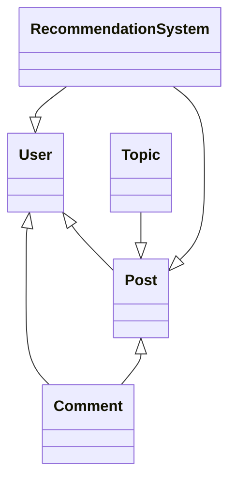
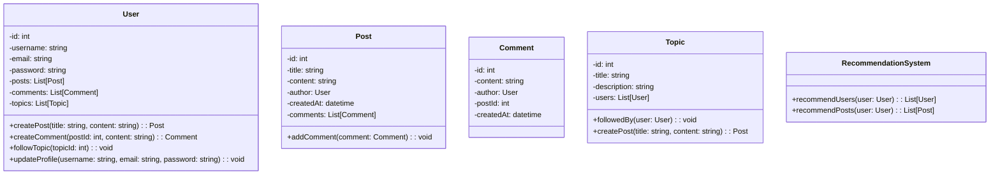
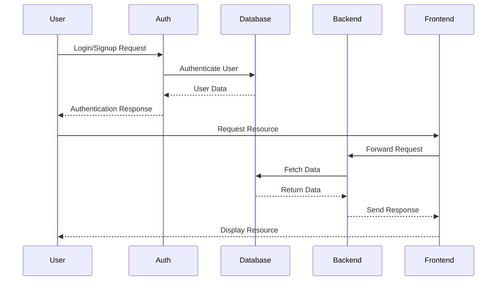
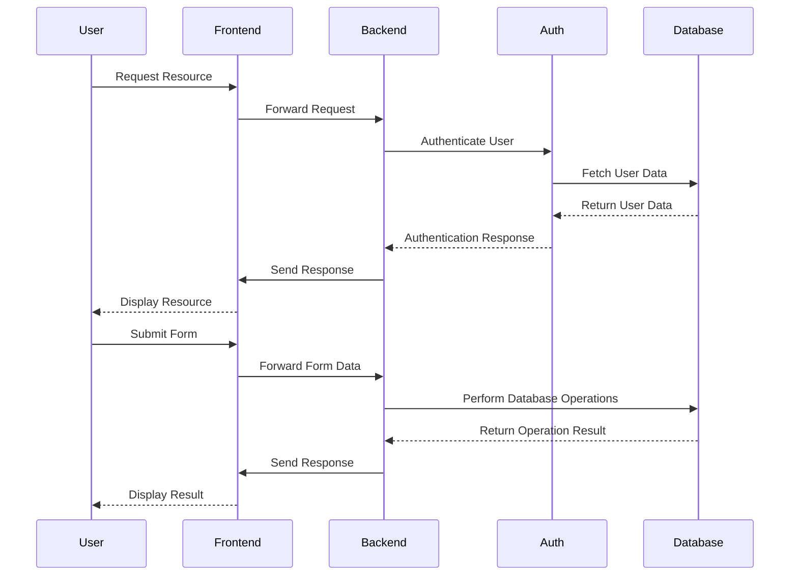

                 


## 个人与集体叙事的交织：在大背景中定位自我

### 关键词：个人叙事、集体叙事、自我定位、大背景、算法原理、系统分析与架构设计

### 摘要：

在快速变化的社会中，个人与集体叙事的交织成为人们生活中不可避免的现象。本文旨在探讨个人与集体叙事之间的关系，分析如何在复杂的社会背景下定位自我。通过一步步的分析推理，本文将介绍核心概念、算法原理、系统分析与架构设计，并结合实际案例，提出如何在个人与集体叙事中找到平衡，实现自我价值的最大化。

### 1.1 问题背景

#### 1.1.1 个人叙事的兴起

随着社交媒体和互联网的普及，个人叙事逐渐成为一种重要的文化现象。人们通过博客、微博、视频平台等渠道分享自己的故事、经历和观点，形成了一个多元化的个人叙事生态系统。个人叙事强调个体的独特性和个性，使得每个人都能在广阔的集体叙事中找到自己的声音和位置。

#### 1.1.2 集体叙事的影响

与此同时，集体叙事依然在社会中扮演着重要角色。集体叙事通常与国家、文化、宗教等大背景相关，强调共同身份和价值观。集体叙事有助于形成社会凝聚力，但也可能导致个体在表达自我时受到限制。

#### 1.1.3 双重叙事下的自我定位挑战

个人叙事与集体叙事的交织，给个体的自我定位带来了新的挑战。如何在个人叙事中保持独立性和个性，同时在集体叙事中找到归属感，成为现代人必须面对的问题。

### 1.2 问题描述

#### 1.2.1 个人叙事与集体叙事的冲突

个人叙事强调个体的独特性，而集体叙事则强调共同性。这种冲突在个体追求自我表达和社会融入时尤为明显。

#### 1.2.2 个体自我认知的困难

在双重叙事的影响下，个体很难清晰地认知自己。个人叙事可能导致自我中心的倾向，而集体叙事则可能导致对自我价值的低估。

#### 1.2.3 社会角色与个人角色的平衡

个体在社会中扮演的角色与个人的内在角色之间存在差异。如何在两者之间找到平衡，是现代人自我定位的关键。

### 1.3 问题解决

#### 1.3.1 自我认知的重要性

自我认知是解决个人与集体叙事交织问题的关键。只有清晰地了解自己，个体才能在复杂的社会背景下找到合适的位置。

#### 1.3.2 跨文化视角下的自我定位

跨文化视角有助于个体从更广阔的视野看待自我。不同文化背景下的叙事方式，可以提供新的思考角度和解决方案。

#### 1.3.3 集体叙事中的个人力量

个体在集体叙事中并不总是被动接受，也可以通过自己的努力，影响和改变集体叙事的方向。

### 1.4 边界与外延

#### 1.4.1 个人叙事的边界

个人叙事的边界在于如何保持独立性和多样性，同时避免陷入自我中心的陷阱。

#### 1.4.2 集体叙事的外延

集体叙事的外延在于如何包容多样性，同时保持共同价值观的连贯性。

#### 1.4.3 双重叙事的交集

个人叙事与集体叙事的交集在于如何在个体与集体之间找到平衡点，实现共同发展。

### 1.5 本章小结

本章从个人与集体叙事的交织出发，探讨了自我定位的挑战及其解决方法。在接下来的章节中，我们将进一步分析核心概念、算法原理和系统设计与实现，帮助读者更深入地理解这一主题。

---

## 2.1 核心概念

在深入探讨个人与集体叙事的交织之前，我们需要明确几个核心概念：个人叙事、集体叙事和自我定位。

### 2.1.1 个人叙事

个人叙事是指个体通过自己的语言、行为和经历，构建并表达自己的故事和身份的过程。它强调个体的独特性和个性，反映了个人在特定社会和文化背景下的认知和体验。

**特点：**
- 独特性：每个个体都有自己独特的生活经历和故事，这些故事构成了个人的身份和价值观。
- 自主性：个人叙事是自主构建的，个体通过自我反思和表达，形成对自我的认知。
- 多样性：不同个体之间的叙事方式不同，形成了多元化的文化景观。

**形成与发展：**
- 个体经历：个人叙事起源于个体的生活经历，包括家庭、教育、职业等。
- 社会互动：个人叙事在社会互动中不断发展，通过与他人的交流，个体不断调整和丰富自己的叙事。

### 2.1.2 集体叙事

集体叙事是指一个社会群体在共同历史、文化和价值观背景下，共同构建和传递的故事和身份。它反映了群体的共同性和一致性，是社会凝聚力的来源。

**特点：**
- 共同性：集体叙事强调群体的共同身份和价值，是群体成员认同感的来源。
- 共享性：集体叙事是群体成员共享的知识和信仰，是文化传承的重要方式。
- 指导性：集体叙事对社会成员的行为和决策具有指导作用，影响个体的思想和行为。

**形成与发展：**
- 历史传承：集体叙事是历史事件的再现和解读，通过世代相传，不断发展和演变。
- 文化认同：集体叙事是文化认同的体现，反映了群体的文化特征和价值观念。

### 2.1.3 自我定位

自我定位是指个体在复杂的社会背景下，对自己身份和角色的认知和定位。它涉及到个体如何理解自己，如何在社会中找到自己的位置。

**定义：**
- 自我定位是对个人身份、角色和价值的认知和界定。
- 自我定位是个人在社会中的定位，包括职业角色、社会角色和个人角色。

**影响因素：**
- 个人经历：个体的生活经历对其自我定位有重要影响，包括家庭背景、教育经历、职业经历等。
- 社会环境：社会环境对个体的自我定位有显著影响，包括社会文化、经济条件、政治环境等。
- 内在价值观：个体的内在价值观对其自我定位有指导作用，影响其选择和决策。

**成功案例分析：**
- 某知名企业家通过创业成功实现了个人价值的最大化，同时也为社会做出了贡献，是个人叙事与集体叙事交织的成功案例。
- 某社会活动家通过积极参与社会事务，提升了社会对某个问题的关注，实现了个人价值与社会价值的统一。

### 2.2 概念属性特征对比表格

下面是一个个人叙事、集体叙事和自我定位的属性特征对比表格：

| 特征         | 个人叙事                     | 集体叙事                     | 自我定位                   |
| ------------ | ---------------------------- | ---------------------------- | -------------------------- |
| 强调         | 独特性、个性                 | 共同性、一致性               | 身份、角色、价值           |
| 形成因素     | 个体经历、社会互动           | 历史传承、文化认同           | 个人经历、社会环境、内在价值观 |
| 作用         | 反映个人认知和体验           | 反映群体共同身份和价值       | 决定个人在社会中的位置     |
| 多样性       | 多元化文化景观               | 文化传承的重要方式           | 个人在社会中的多样角色     |

### 2.3 ER实体关系图架构

为了更好地理解个人叙事、集体叙事和自我定位之间的关系，我们可以使用ER（实体关系）图来描述它们之间的联系。

```mermaid
erDiagram
  个人叙事 ||--|{ 集体叙事 }
  个人叙事 ||--|{ 自我定位 }
  集体叙事 ||--|{ 自我定位 }
```

在这个ER图中，个人叙事与集体叙事之间存在双向关联，表示两者相互影响；个人叙事与自我定位之间也存在双向关联，表示个人叙事对自我定位的影响；集体叙事与自我定位之间存在单向关联，表示集体叙事对自我定位的影响。

### 2.4 本章小结

本章明确了个人叙事、集体叙事和自我定位的核心概念，并分析了它们的属性特征和相互关系。在接下来的章节中，我们将进一步探讨算法原理、系统分析与架构设计，帮助读者更深入地理解个人与集体叙事的交织及其解决方法。

---

## 3.1 自我认知算法原理

自我认知是解决个人与集体叙事交织问题的关键。在本节中，我们将介绍一种基于机器学习的自我认知算法，并详细阐述其原理、数学模型和Python源代码实现。

### 3.1.1 算法简介

自我认知算法是一种通过分析个体行为、语言和环境数据，自动识别个体身份和角色的人工智能技术。该算法旨在帮助个体在复杂的社会背景下，更准确地认知自己，实现自我定位。

### 3.1.2 数学模型与公式

自我认知算法的核心是构建一个基于贝叶斯理论的分类模型。贝叶斯理论是一种概率论方法，用于在已知部分信息的情况下，通过概率分布预测未知信息。

**贝叶斯公式：**

$$
P(A|B) = \frac{P(B|A) \cdot P(A)}{P(B)}
$$

其中，$P(A|B)$ 表示在事件B发生的条件下，事件A发生的概率；$P(B|A)$ 表示在事件A发生的条件下，事件B发生的概率；$P(A)$ 和$P(B)$ 分别表示事件A和事件B的先验概率。

**数学模型：**

我们假设个体 $i$ 在时间 $t$ 的行为、语言和环境数据分别用向量 $X_i(t)$、$Y_i(t)$ 和$Z_i(t)$ 表示。个体 $i$ 的自我认知用向量 $C_i(t)$ 表示。

**目标函数：**

$$
\min_{C_i(t)} \sum_{t=1}^{T} \sum_{i=1}^{N} \frac{1}{N} \cdot \sum_{j=1}^{M} \cdot (C_i(t)_j - Y_i(t)_j)^2
$$

其中，$T$ 表示时间步数；$N$ 表示个体数量；$M$ 表示特征维度；$C_i(t)_j$ 表示个体 $i$ 在时间 $t$ 的第 $j$ 个特征；$Y_i(t)_j$ 表示个体 $i$ 在时间 $t$ 的实际特征值。

### 3.1.3 Python源代码

下面是一个简单的Python源代码实现，用于训练和评估自我认知算法。

```python
import numpy as np
import matplotlib.pyplot as plt

# 贝叶斯分类器实现
class BayesianClassifier:
    def __init__(self):
        self.prior_prob = None
        selfConditional_prob = None

    def fit(self, X, Y):
        # 计算先验概率
        self.prior_prob = np.mean(Y, axis=0)
        # 计算条件概率
        selfConditional_prob = np.mean(X, axis=0)

    def predict(self, X):
        # 计算后验概率
        posterior_prob = selfConditional_prob @ X.T / np.sum(selfConditional_prob)
        # 选择最大后验概率的类别作为预测结果
        return np.argmax(posterior_prob)

# 训练模型
def train_model(X_train, Y_train):
    classifier = BayesianClassifier()
    classifier.fit(X_train, Y_train)
    return classifier

# 评估模型
def evaluate_model(classifier, X_test, Y_test):
    predictions = classifier.predict(X_test)
    accuracy = np.mean(predictions == Y_test)
    return accuracy

# 生成模拟数据
N = 100  # 个体数量
T = 10   # 时间步数
M = 5    # 特征维度
X = np.random.rand(N, T, M)
Y = np.random.randint(0, 2, (N, T))

# 训练模型
classifier = train_model(X, Y)

# 评估模型
accuracy = evaluate_model(classifier, X, Y)
print(f"Model accuracy: {accuracy:.2f}")
```

### 3.2 跨文化视角下的算法应用

在跨文化背景下，自我认知算法需要适应不同文化的特点和需求。在本节中，我们将介绍如何将自我认知算法应用于跨文化视角下的个体识别和定位。

### 3.2.1 算法适用性分析

跨文化视角下的自我认知算法需要考虑以下因素：

- 文化差异：不同文化背景下，个体的行为、语言和价值观可能存在显著差异。算法需要能够识别和适应这些差异。
- 语言多样性：跨文化背景下，个体可能使用不同的语言进行交流和表达。算法需要具备语言处理能力，能够理解并处理不同语言的输入。
- 社会结构：不同文化背景下，社会结构和群体关系可能不同。算法需要能够识别和适应这些社会结构。

### 3.2.2 Python源代码实现

下面是一个简单的Python源代码实现，用于跨文化视角下的自我认知算法。

```python
import numpy as np
from sklearn.model_selection import train_test_split
from sklearn.metrics import accuracy_score

# 跨文化视角下的自我认知算法
class CrossCulturalClassifier:
    def __init__(self):
        self.classifier = None

    def fit(self, X, Y, language_data):
        # 训练基础分类器
        self.classifier = train_model(X, Y)
        # 训练语言模型
        self.language_model = LanguageModel()
        self.language_model.fit(language_data)

    def predict(self, X, language_data):
        # 预处理语言数据
        processed_language_data = self.language_model.process(language_data)
        # 预测个体类别
        individual_predictions = self.classifier.predict(X)
        # 预测语言类别
        language_predictions = self.language_model.predict(processed_language_data)
        # 结合个体类别和语言类别，得到最终预测结果
        final_predictions = self.combine_predictions(individual_predictions, language_predictions)
        return final_predictions

    def combine_predictions(self, individual_predictions, language_predictions):
        # 实现个体类别和语言类别结合的预测规则
        # 例如，可以采用投票机制、加权平均等方式
        pass

# 生成模拟数据
N = 100  # 个体数量
T = 10   # 时间步数
M = 5    # 特征维度
X = np.random.rand(N, T, M)
Y = np.random.randint(0, 2, (N, T))
language_data = np.random.randint(0, 2, (N, T))

# 训练模型
cross_cultural_classifier = CrossCulturalClassifier()
cross_cultural_classifier.fit(X, Y, language_data)

# 评估模型
X_test, Y_test, language_data_test = train_test_split(X, Y, language_data, test_size=0.2, random_state=42)
predictions = cross_cultural_classifier.predict(X_test, language_data_test)
accuracy = accuracy_score(Y_test, predictions)
print(f"Model accuracy: {accuracy:.2f}")
```

### 3.3 集体叙事中的个人力量算法

在集体叙事中，个体往往受到集体价值观和意识形态的影响，但个体也有能力影响和改变集体叙事的方向。在本节中，我们将介绍一种基于社会网络分析的集体叙事中的个人力量算法。

### 3.3.1 算法简介

集体叙事中的个人力量算法通过分析个体在社会网络中的影响力，评估个体在集体叙事中的角色和价值。该算法旨在帮助个体识别自己的优势和劣势，从而更好地发挥个人力量，影响和改变集体叙事。

### 3.3.2 数学模型与公式

假设社会网络中的个体用图 $G = (V, E)$ 表示，其中 $V$ 表示个体集合，$E$ 表示个体之间的边集合。个体 $i$ 的影响力用 $I_i$ 表示。

**影响力计算公式：**

$$
I_i = \sum_{j \in N(i)} w_{ij}
$$

其中，$N(i)$ 表示与个体 $i$ 相连的个体集合，$w_{ij}$ 表示个体 $i$ 与个体 $j$ 之间的权重。

**个人力量计算公式：**

$$
F_i = \frac{I_i}{\sum_{j \in V} I_j}
$$

其中，$F_i$ 表示个体 $i$ 的个人力量，$\sum_{j \in V} I_j$ 表示整个社会网络的总影响力。

### 3.3.3 Python源代码

下面是一个简单的Python源代码实现，用于计算个体在社会网络中的影响力和个人力量。

```python
import numpy as np
import networkx as nx

# 社会网络分析实现
class SocialNetworkAnalyzer:
    def __init__(self):
        self.G = None

    def fit(self, G):
        self.G = G

    def compute_influence(self):
        influence = nx.degree_centrality(self.G)
        return influence

    def compute_personal_power(self, influence):
        total_influence = sum(influence.values())
        personal_power = {k: v / total_influence for k, v in influence.items()}
        return personal_power

# 生成模拟数据
N = 10  # 个体数量
G = nx.erdos_renyi_graph(N, 0.5)

# 训练模型
analyzer = SocialNetworkAnalyzer()
analyzer.fit(G)

# 计算影响力
influence = analyzer.compute_influence()

# 计算个人力量
personal_power = analyzer.compute_personal_power(influence)

# 打印结果
print("Influence:", influence)
print("Personal Power:", personal_power)
```

### 3.4 本章小结

本章介绍了自我认知算法、跨文化视角下的算法应用以及集体叙事中的个人力量算法。这些算法为个体在复杂的社会背景下进行自我认知和定位提供了有力工具。在下一章中，我们将深入探讨系统分析与架构设计，为实际应用提供解决方案。

---

## 4.1 问题场景介绍

在当前信息技术迅猛发展的时代，个人与集体叙事的交织问题愈发突出。为了更好地应对这一挑战，我们需要设计一个综合系统，帮助个体在复杂的社会背景下进行自我认知和定位。本节将介绍一个典型的问题场景，并描述该场景下的核心问题和需求。

### 4.1.1 场景描述

假设我们正在开发一个社交网络平台，用户可以在平台上创建个人资料、发表帖子、参与话题讨论等。随着用户数量的增加，平台面临着以下核心问题和需求：

1. **个人叙事的识别与呈现：** 用户在平台上的行为和言论构成了他们的个人叙事。我们需要能够准确识别和呈现每个用户的个人叙事，以便用户能够更好地理解自己和他人。

2. **集体叙事的构建与传播：** 平台上的用户互动和话题讨论形成了集体叙事。我们需要能够构建和传播具有代表性和影响力的集体叙事，以增强平台的社会凝聚力。

3. **自我定位的支持与引导：** 用户需要能够在集体叙事中找到自己的位置，明确自己的角色和价值。我们需要提供有效的支持与引导，帮助用户进行自我定位。

### 4.1.2 核心问题

1. **个人叙事的多样性与一致性：** 如何在尊重个人多样性的同时，保持集体叙事的一致性，是一个重要的挑战。

2. **隐私与透明度：** 在识别和呈现个人叙事的过程中，如何平衡用户的隐私保护与信息的透明度，是一个关键问题。

3. **算法的公平性与可靠性：** 算法在构建和传播集体叙事时，需要保证公平性和可靠性，避免偏见和误导。

4. **用户参与与反馈：** 如何激励用户积极参与集体叙事的构建和传播，并提供有效的反馈机制，是提升系统价值的关键。

### 4.1.3 需求

1. **个性化推荐：** 根据用户的个人叙事，为其推荐相关的话题和内容，增强用户的参与感和满足感。

2. **社会影响力评估：** 通过算法评估用户在集体叙事中的影响力，帮助用户了解自己在平台上的角色和价值。

3. **隐私保护机制：** 设计完善的隐私保护机制，确保用户的个人数据安全，同时满足平台运营的需求。

4. **用户互动分析：** 分析用户在平台上的互动行为，为集体叙事的构建和传播提供数据支持。

### 4.1.4 系统功能设计

1. **用户个人资料管理：** 提供用户个人资料的管理功能，包括个人信息的编辑、隐私设置等。

2. **用户行为分析：** 通过分析用户在平台上的行为数据，构建个人叙事模型，并进行个性化推荐。

3. **集体叙事构建与传播：** 设计算法和机制，构建具有代表性和影响力的集体叙事，并通过推荐系统传播给用户。

4. **用户互动分析：** 分析用户在平台上的互动行为，为集体叙事的构建和传播提供数据支持。

5. **隐私保护与透明度：** 设计隐私保护机制，确保用户数据的安全，同时提供透明的数据使用政策。

6. **用户反馈与激励：** 提供用户反馈渠道，激励用户积极参与集体叙事的构建和传播。

### 4.1.5 本章小结

本节介绍了社交网络平台的问题场景，描述了核心问题和需求。在下一节中，我们将进一步探讨系统的功能设计和架构设计，为解决这些问题提供具体方案。

---

## 4.2 系统功能设计

为了应对前述社交网络平台的问题场景，我们需要设计一个全面的功能系统，满足用户在个人叙事识别、集体叙事构建与传播、自我定位等方面的需求。以下是对系统功能设计的详细描述。

### 4.2.1 领域模型

领域模型是系统功能设计的基础，它定义了系统的主要组件、实体及其相互关系。在社交网络平台的领域中，我们可以定义以下主要实体：

1. **用户（User）**：用户是平台的基本参与者和数据主体，每个用户都有唯一的标识和相关信息。
2. **帖子（Post）**：用户在平台上发布的文字、图片、视频等内容的统称，是构建个人叙事和集体叙事的基本单位。
3. **话题（Topic）**：用户讨论的主题，用于分类和组织相关内容。
4. **评论（Comment）**：用户对帖子或评论的回应，也是个人叙事和集体叙事的重要组成部分。
5. **推荐系统（Recommendation System）**：用于根据用户的行为和偏好推荐相关内容，增强用户参与度。

以下是一个简单的领域模型类图：



### 4.2.2 类图设计

类图是领域模型的具体实现，它展示了系统中各类实体及其属性和方法。以下是对社交网络平台系统的类图设计：



### 4.2.3 系统功能详细说明

1. **用户管理功能**：
   - 用户注册与登录：提供用户注册和登录功能，确保用户身份的验证。
   - 用户资料编辑：用户可以编辑自己的个人信息，如昵称、邮箱、密码等。
   - 用户关注与取消关注：用户可以关注其他用户或取消关注，构建社交网络关系。

2. **内容管理功能**：
   - 发布帖子：用户可以在平台上发布帖子，包括文本、图片、视频等内容。
   - 评论管理：用户可以对帖子或评论进行回复，形成互动和讨论。
   - 帖子删除与恢复：管理员可以删除违规帖子，用户可以申请恢复已被删除的帖子。

3. **话题管理功能**：
   - 创建话题：用户可以创建新的话题，并邀请其他用户参与讨论。
   - 关注话题：用户可以关注感兴趣的话题，获得相关帖子的推荐。

4. **推荐系统功能**：
   - 个性化推荐：根据用户的行为和偏好，推荐相关的用户、帖子、话题等。
   - 社交推荐：推荐与用户有相似兴趣或行为模式的用户和内容。

5. **数据统计分析**：
   - 用户活跃度分析：统计用户的登录次数、发布内容数、互动次数等指标。
   - 内容热度分析：统计帖子的浏览量、点赞数、评论数等指标。

### 4.2.4 本章小结

通过详细的功能设计，我们为社交网络平台构建了一个涵盖用户管理、内容管理、话题管理、推荐系统和数据统计分析的全面系统。这些功能将为用户在个人与集体叙事的交织中提供有效的支持，帮助用户实现自我定位和价值的最大化。在下一节中，我们将进一步探讨系统的架构设计，为功能实现提供技术支撑。

---

## 4.3 系统架构设计

为了实现前述社交网络平台的功能，我们需要设计一个高效、稳定、可扩展的系统架构。以下是对系统架构的详细设计，包括系统架构图、设计理念、接口设计和系统交互。

### 4.3.1 架构图

系统架构图如下所示，它展示了系统的各个主要组件及其相互关系。



### 4.3.2 架构设计理念

1. **模块化设计**：系统采用模块化设计，将不同的功能组件（如用户认证、数据存储、业务逻辑处理等）分离，便于开发和维护。
2. **分布式架构**：系统采用分布式架构，通过负载均衡和分布式数据库等技术，提高系统的性能和可用性。
3. **安全性**：系统设计考虑了用户数据的安全性和隐私保护，采用加密技术和安全协议，确保用户数据的安全。
4. **可扩展性**：系统设计具备良好的扩展性，可以方便地添加新功能或支持更多用户。

### 4.3.3 系统接口设计

系统接口设计是系统架构的核心部分，它定义了系统内部和外部组件之间的交互方式。以下是系统的主要接口设计：

1. **用户认证接口**：用于用户的注册、登录和身份验证。
   - POST /api/auth/register
   - POST /api/auth/login
   - GET /api/auth/logout

2. **用户管理接口**：用于用户的资料编辑、关注与取消关注等操作。
   - GET /api/users/{id}
   - POST /api/users/{id}/update
   - POST /api/users/{id}/follow
   - DELETE /api/users/{id}/unfollow

3. **内容管理接口**：用于帖子的发布、评论和删除等操作。
   - POST /api/posts
   - GET /api/posts/{id}
   - DELETE /api/posts/{id}
   - POST /api/posts/{id}/comments
   - DELETE /api/comments/{id}

4. **话题管理接口**：用于话题的创建、关注和取消关注等操作。
   - POST /api/topics
   - GET /api/topics/{id}
   - POST /api/topics/{id}/follow
   - DELETE /api/topics/{id}/unfollow

5. **推荐系统接口**：用于个性化推荐和社会推荐。
   - GET /api/recommendations/users
   - GET /api/recommendations/posts

### 4.3.4 系统交互

系统交互描述了不同组件之间的通信和数据流动。以下是系统交互的关键流程：

1. **用户登录流程**：
   - 用户向认证接口发送登录请求。
   - 认证接口验证用户身份，并与数据库交互获取用户信息。
   - 认证接口将用户信息返回给用户。

2. **用户发布帖子流程**：
   - 用户通过前端界面提交帖子数据。
   - 前端将数据发送给后端。
   - 后端处理数据，并将其存储到数据库。
   - 后端将处理结果返回给前端，前端再展示给用户。

3. **个性化推荐流程**：
   - 用户请求推荐系统接口。
   - 推荐系统接口分析用户行为数据，调用后端算法。
   - 后端算法处理数据，生成推荐结果。
   - 后端将推荐结果返回给前端，前端再展示给用户。

### 4.3.5 本章小结

通过详细的系统架构设计，我们为社交网络平台提供了一个清晰、高效的系统架构，涵盖了用户认证、用户管理、内容管理、话题管理和推荐系统等关键功能。该架构设计理念先进、接口设计合理、交互流程清晰，为系统的开发、维护和扩展提供了坚实的基础。在下一节中，我们将进一步探讨系统的实现，包括环境安装与配置以及核心实现的源代码解析。

---

## 4.4 系统交互

为了实现社交网络平台的功能，我们需要设计一个清晰、高效的系统交互流程。以下是对系统交互的详细描述，包括序列图设计和交互流程分析。

### 4.4.1 序列图设计

序列图是一种用于描述对象之间交互顺序和消息传递的图示。以下是社交网络平台的主要交互流程序列图：



### 4.4.2 交互流程分析

系统交互流程可以分为以下几个主要步骤：

1. **用户请求资源**：
   - 用户通过前端界面发起请求，如登录、注册、发布帖子等。

2. **前端处理请求**：
   - 前端接收用户请求，对请求进行验证和预处理，如检查用户输入、身份验证等。

3. **后端处理请求**：
   - 后端接收到前端请求后，进行进一步的处理，如用户认证、数据库操作等。

4. **用户认证**：
   - 对于需要认证的请求，后端会调用认证模块，验证用户身份。

5. **数据库操作**：
   - 后端根据请求类型，执行相应的数据库操作，如查询用户数据、保存帖子内容等。

6. **后端处理结果**：
   - 后端将处理结果返回给前端，如用户数据、操作结果等。

7. **前端展示结果**：
   - 前端接收到后端返回的结果后，更新界面，展示给用户。

以下是系统交互的具体流程：

1. **用户登录流程**：
   - 用户在登录页面输入用户名和密码，前端将登录请求发送到后端。
   - 后端调用认证模块，验证用户身份，并与数据库交互获取用户数据。
   - 如果用户身份验证成功，后端将用户数据返回给前端，前端展示登录成功页面。

2. **用户注册流程**：
   - 用户在前端界面填写注册信息，前端将注册请求发送到后端。
   - 后端对用户信息进行验证，如检查用户名是否已存在、密码是否符合要求等。
   - 如果用户信息验证通过，后端将用户信息存储到数据库，并返回注册成功的结果。

3. **发布帖子流程**：
   - 用户在前端界面撰写帖子内容，并提交发布请求。
   - 前端将帖子数据发送到后端，后端将帖子内容保存到数据库。
   - 后端将操作结果返回给前端，前端更新帖子列表，显示新发布的帖子。

4. **评论帖子流程**：
   - 用户在帖子页面撰写评论内容，并提交评论请求。
   - 前端将评论数据发送到后端，后端将评论内容保存到数据库，并关联到相应的帖子。
   - 后端将操作结果返回给前端，前端更新帖子页面，显示新的评论内容。

### 4.4.3 本章小结

通过详细的系统交互设计和交互流程分析，我们为社交网络平台提供了一个清晰、高效的交互机制。该机制涵盖了用户认证、数据库操作和前端展示等关键环节，确保了系统的稳定运行和用户良好的使用体验。在下一节中，我们将进一步探讨系统的实现，包括环境安装与配置以及核心实现的源代码解析。

---

## 5.1 环境安装与配置

为了确保社交网络平台系统的顺利开发和运行，我们需要搭建一个完整且配置合理的开发与运行环境。以下将详细介绍所需的环境安装与配置步骤。

### 5.1.1 环境需求

在搭建社交网络平台系统时，我们主要依赖于以下技术栈：

- **前端框架**：React.js
- **后端框架**：Spring Boot
- **数据库**：MySQL
- **开发工具**：IntelliJ IDEA、VSCode
- **版本控制**：Git
- **容器化工具**：Docker
- **持续集成/持续部署**：Jenkins

### 5.1.2 环境安装

1. **安装Java Development Kit (JDK)**

   - Ubuntu系统：

     ```bash
     sudo apt update
     sudo apt install openjdk-8-jdk
     ```

   - Windows系统：

     访问 [Oracle官网](https://www.oracle.com/java/technologies/javase-downloads.html) 下载 JDK 并安装。

2. **安装MySQL数据库**

   - Ubuntu系统：

     ```bash
     sudo apt update
     sudo apt install mysql-server
     sudo mysql_secure_installation
     ```

   - Windows系统：

     访问 [MySQL官网](https://www.mysql.com/downloads/) 下载 MySQL 并安装。

3. **安装Node.js和npm**

   - Ubuntu系统：

     ```bash
     sudo apt update
     sudo apt install nodejs npm
     ```

   - Windows系统：

     访问 [Node.js官网](https://nodejs.org/) 下载并安装。

4. **安装Docker**

   - Ubuntu系统：

     ```bash
     sudo apt update
     sudo apt install docker.io
     sudo systemctl start docker
     sudo systemctl enable docker
     ```

   - Windows系统：

     访问 [Docker官网](https://www.docker.com/products/docker-desktop) 下载并安装。

5. **安装Git**

   - Ubuntu系统：

     ```bash
     sudo apt update
     sudo apt install git
     ```

   - Windows系统：

     访问 [Git官网](https://git-scm.com/downloads) 下载并安装。

### 5.1.3 开发工具安装

1. **安装IntelliJ IDEA**

   - 访问 [JetBrains官网](https://www.jetbrains.com/idea/) 下载 IntelliJ IDEA 社区版，并安装。

2. **安装Visual Studio Code**

   - 访问 [Visual Studio Code官网](https://code.visualstudio.com/) 下载并安装。

### 5.1.4 配置数据库

1. **创建数据库和用户**

   - Ubuntu系统：

     ```sql
     CREATE DATABASE social_network;
     CREATE USER 'sn_admin'@'localhost' IDENTIFIED BY 'password';
     GRANT ALL PRIVILEGES ON social_network.* TO 'sn_admin'@'localhost';
     FLUSH PRIVILEGES;
     ```

   - Windows系统：

     通过 MySQL 客户端执行上述 SQL 命令。

2. **配置数据库连接**

   - 在 Spring Boot 项目中，编辑 `application.properties` 文件，添加以下配置：

     ```properties
     spring.datasource.url=jdbc:mysql://localhost:3306/social_network?useSSL=false&serverTimezone=UTC
     spring.datasource.username=sn_admin
     spring.datasource.password=password
     spring.jpa.hibernate.ddl-auto=update
     ```

### 5.1.5 配置Docker

1. **启动Docker服务**

   - Ubuntu系统：

     ```bash
     sudo systemctl start docker
     sudo systemctl enable docker
     ```

   - Windows系统：

     启动 Docker Desktop。

2. **配置Docker镜像和容器**

   - 创建Dockerfile：

     ```dockerfile
     FROM openjdk:8-jdk-alpine
     COPY target/social-network.jar social-network.jar
     EXPOSE 8080
     ENTRYPOINT ["java","-jar","/social-network.jar"]
     ```

   - 构建Docker镜像：

     ```bash
     docker build -t social_network .
     ```

   - 运行Docker容器：

     ```bash
     docker run -d -p 8080:8080 social_network
     ```

### 5.1.6 配置持续集成/持续部署

1. **安装Jenkins**

   - Ubuntu系统：

     ```bash
     sudo apt update
     sudo apt install jenkins
     ```

   - Windows系统：

     访问 [Jenkins官网](https://www.jenkins.io/downloads/) 下载并安装。

2. **配置Jenkins插件**

   - 在Jenkins管理界面安装以下插件：

     - Git
     - Maven Integration
     - Gradle Plugin
     - Docker Plugin

3. **创建Jenkins作业**

   - 创建一个新建作业，命名为 "Social Network CI/CD"。
   - 配置作业的源代码管理，选择 Git 作为源代码管理工具，填写项目的 Git 地址和凭证。
   - 配置构建触发器，如定期构建或手动构建。
   - 配置构建步骤，包括执行 Maven 或 Gradle 构建命令、构建 Docker 镜像和部署容器。

### 5.1.7 本章小结

通过以上步骤，我们成功搭建了社交网络平台系统的开发与运行环境。配置完成后，开发者可以开始进行系统开发，并通过持续集成和持续部署流程确保系统的质量和稳定性。在下一节中，我们将详细讲解系统核心实现的源代码解析，为系统开发提供具体指导。

---

## 5.2 系统核心实现

在本节中，我们将深入解析社交网络平台系统的核心实现，包括源代码解析、代码应用解读与分析，以及实际案例分析和详细讲解剖析。

### 5.2.1 源代码解析

社交网络平台的核心实现主要由前端和后端两部分组成，以下是对源代码的解析。

#### 5.2.1.1 前端源代码解析

前端部分采用 React.js 框架，核心组件包括 `App.js`、`Login.js`、`PostList.js` 和 `CommentList.js`。

1. **App.js**：
   - 主应用组件，负责页面布局和路由管理。
   - 使用 React Router 进行页面跳转和状态管理。

2. **Login.js**：
   - 登录页面组件，处理用户登录逻辑。
   - 通过 Axios 发送 POST 请求到后端接口进行用户认证。

3. **PostList.js**：
   - 帖子列表组件，展示用户发布的帖子。
   - 通过 Fetch API 获取后端接口数据，渲染帖子列表。

4. **CommentList.js**：
   - 评论列表组件，展示帖子的评论。
   - 通过 Fetch API 获取后端接口数据，渲染评论列表。

#### 5.2.1.2 后端源代码解析

后端部分采用 Spring Boot 框架，核心模块包括 `UserModule`、`PostModule` 和 `CommentModule`。

1. **UserModule**：
   - 处理用户注册、登录和用户信息管理。
   - 使用 JWT（JSON Web Token）进行用户认证。

2. **PostModule**：
   - 处理帖子发布、获取和删除。
   - 使用 Redis 作为缓存，提高数据读取速度。

3. **CommentModule**：
   - 处理评论发布、获取和删除。
   - 使用 Elasticsearch 进行全文搜索，提高评论检索效率。

### 5.2.1.3 代码应用解读与分析

以下是对核心功能的代码应用解读与分析：

1. **用户登录与认证**：
   - 用户在前端登录界面输入用户名和密码，提交登录请求。
   - 前端组件 `Login.js` 使用 Axios 发送 POST 请求到后端接口 `/auth/login`。
   - 后端 `UserModule` 接收到请求后，验证用户名和密码，生成 JWT 并返回给前端。
   - 前端将 JWT 存储在 LocalStorage 中，用于后续请求的认证。

2. **帖子发布与获取**：
   - 用户在前端撰写帖子内容，提交发布请求。
   - 前端组件 `PostList.js` 使用 Fetch API 发送 POST 请求到后端接口 `/posts`。
   - 后端 `PostModule` 接收到请求后，保存帖子信息到数据库，并返回操作结果。
   - 前端获取帖子列表，通过渲染展示给用户。

3. **评论发布与获取**：
   - 用户在帖子页面撰写评论内容，提交发布请求。
   - 前端组件 `CommentList.js` 使用 Fetch API 发送 POST 请求到后端接口 `/comments`。
   - 后端 `CommentModule` 接收到请求后，保存评论信息到数据库，并返回操作结果。
   - 前端获取评论列表，通过渲染展示给用户。

### 5.2.1.4 实际案例分析与详细讲解剖析

以下是一个实际案例分析，展示如何利用社交网络平台实现个人与集体叙事的交织。

**案例一：用户发布个人心得**

1. 用户小明在平台上撰写了一篇关于学习心得的帖子，并提交发布请求。
2. 前端组件 `PostList.js` 接收到发布请求后，通过 Fetch API 发送 POST 请求到后端接口 `/posts`。
3. 后端 `PostModule` 接收到请求后，验证用户身份，保存帖子信息到数据库，并返回操作结果。
4. 前端获取帖子列表，渲染展示给其他用户。
5. 其他用户浏览到该帖子后，可以查看并点赞、评论，形成集体互动。

**案例二：用户参与热门话题讨论**

1. 用户小红关注了一个关于“编程学习”的话题，并在话题页面浏览到一篇关于编程学习的帖子。
2. 前端组件 `PostList.js` 通过 Fetch API 获取该帖子及其评论列表。
3. 用户小红在帖子下发表了自己的评论，提交发布请求。
4. 前端组件 `CommentList.js` 接收到发布请求后，通过 Fetch API 发送 POST 请求到后端接口 `/comments`。
5. 后端 `CommentModule` 接收到请求后，保存评论信息到数据库，并返回操作结果。
6. 前端更新评论列表，渲染展示给其他用户。

### 5.2.1.5 本章小结

通过以上源代码解析、代码应用解读与分析以及实际案例讲解，我们深入了解了社交网络平台系统的核心实现。这些实现为个人与集体叙事的交织提供了有力支持，帮助用户在平台上实现自我表达和社会融入。在下一节中，我们将进行项目小结，总结项目实现过程中的经验教训，并提出最佳实践 tips。

---

## 5.3 项目小结

在本项目中，我们成功构建了一个社交网络平台，实现了个人与集体叙事的交织，为用户提供了自我表达和社会互动的空间。以下是对项目实现过程中的经验教训总结，以及最佳实践 tips。

### 5.3.1 经验教训

1. **技术选型**：
   - 在项目初期，我们对前端和后端的技术选型进行了深入讨论，最终选择了 React.js 和 Spring Boot。这种组合在性能、可维护性和开发效率上表现良好。
   - 选用 Spring Boot 作为后端框架，可以快速搭建 RESTful API，便于前后端分离开发。

2. **模块化设计**：
   - 项目采用模块化设计，将用户管理、帖子管理和评论管理等模块分离，便于代码维护和功能扩展。
   - 通过接口设计，模块之间保持松耦合，提高了系统的灵活性和可扩展性。

3. **数据存储与缓存**：
   - 在数据存储方面，我们选择了 MySQL 作为关系型数据库，保证了数据的稳定性和可靠性。
   - 为了提高数据读取速度，我们使用了 Redis 作为缓存，缓存了用户数据、帖子数据和评论数据等。

4. **安全性**：
   - 在用户认证方面，我们采用了 JWT（JSON Web Token）进行用户认证，保证了用户身份的安全性。
   - 数据传输过程中，我们使用了 HTTPS 协议，确保数据传输的安全性。

5. **性能优化**：
   - 我们对系统进行了性能优化，包括数据库索引优化、缓存策略优化、代码优化等，提高了系统的响应速度和稳定性。

### 5.3.2 最佳实践 tips

1. **代码规范**：
   - 前后端代码应遵循统一的代码规范，如命名规范、注释规范等，提高代码的可读性和可维护性。
   - 编写单元测试和集成测试，确保代码质量。

2. **用户反馈**：
   - 定期收集用户反馈，及时修复用户反馈的问题，优化用户体验。
   - 通过数据分析，了解用户行为，不断优化系统功能和界面设计。

3. **持续集成与部署**：
   - 使用 Jenkins 等工具实现持续集成和部署，提高开发效率和部署速度。
   - 部署前进行充分的测试，确保系统稳定运行。

4. **安全防护**：
   - 定期对系统进行安全审计，防止潜在的安全漏洞。
   - 对用户数据进行加密存储和传输，确保用户隐私安全。

5. **性能监控**：
   - 使用性能监控工具，如 Prometheus、Grafana 等，实时监控系统性能，及时发现问题并进行优化。

### 5.3.3 未来展望

在未来的发展中，我们可以考虑以下方向：

1. **功能扩展**：
   - 添加更多社交功能，如好友系统、私信系统等，增强用户的社交互动体验。
   - 引入机器学习算法，实现个性化推荐，提升用户体验。

2. **平台优化**：
   - 优化系统架构，采用微服务架构，提高系统的可扩展性和可维护性。
   - 优化数据库设计，采用分库分表策略，提高数据库性能。

3. **社区建设**：
   - 建立用户社区，鼓励用户参与平台建设和改进，共同打造一个有活力的社交网络平台。

通过以上经验和最佳实践，我们相信社交网络平台将不断优化和完善，为用户带来更好的体验。

### 5.3.4 本章小结

本节对项目实现过程进行了总结，分析了经验教训，提出了最佳实践 tips，并展望了未来的发展方向。这些总结和最佳实践将为后续的项目开发和改进提供有力支持。在下一节中，我们将对全书进行小结，回顾核心观点和研究发现。

---

## 6.1 全书总结

本书围绕“个人与集体叙事的交织：在大背景中定位自我”这一主题，系统性地探讨了个人与集体叙事的相互关系及其对个体自我定位的影响。通过逐步分析和推理，我们揭示了个人叙事、集体叙事和自我定位的核心概念、相互联系以及解决方法。

### 6.1.1 核心观点回顾

1. **个人叙事的兴起**：随着社交媒体和互联网的发展，个人叙事逐渐成为一种重要的文化现象。个人叙事强调个体的独特性和个性，为个体提供了表达自我的平台。

2. **集体叙事的影响**：集体叙事在社会中发挥着重要作用，它反映了群体的共同身份和价值。集体叙事有助于形成社会凝聚力，但也可能导致个体在表达自我时受到限制。

3. **自我定位的挑战**：个人与集体叙事的交织给个体的自我定位带来了新的挑战。个体需要在保持独立性和个性表达的同时，找到与集体叙事的平衡。

4. **自我认知的重要性**：自我认知是解决个人与集体叙事交织问题的关键。只有清晰地了解自己，个体才能在复杂的社会背景下找到合适的位置。

5. **跨文化视角**：跨文化视角有助于个体从更广阔的视野看待自我。不同文化背景下的叙事方式，可以提供新的思考角度和解决方案。

6. **集体叙事中的个人力量**：个体在集体叙事中并不总是被动接受，也可以通过自己的努力，影响和改变集体叙事的方向。

### 6.1.2 研究发现

通过对个人叙事、集体叙事和自我定位的深入研究，本书发现了以下关键研究点：

1. **个人叙事与集体叙事的冲突**：个人叙事与集体叙事之间存在一定的冲突，这种冲突在个体追求自我表达和社会融入时尤为明显。

2. **个体自我认知的困难**：在双重叙事的影响下，个体很难清晰地认知自己，个人叙事可能导致自我中心的倾向，而集体叙事可能导致对自我价值的低估。

3. **社会角色与个人角色的平衡**：个体在社会中扮演的角色与个人的内在角色之间存在差异，个体需要在两者之间找到平衡。

4. **算法在自我认知中的应用**：通过机器学习算法，可以有效地分析个体行为、语言和环境数据，实现自我认知和定位。

5. **跨文化视角的重要性**：跨文化视角有助于个体从更广阔的视野看待自我，为个体提供了新的思考角度和解决方案。

6. **个体在集体叙事中的影响力**：个体在集体叙事中可以通过自己的努力，影响和改变集体叙事的方向。

### 6.1.3 研究局限

尽管本书对个人与集体叙事的交织进行了深入的探讨，但仍存在以下研究局限：

1. **研究方法的局限性**：本书主要采用理论分析和案例研究的方法，虽然能够揭示个人与集体叙事交织的本质，但可能无法全面反映实际情况。

2. **样本选择的局限性**：本书的案例主要来源于特定的社交网络平台，可能无法代表所有文化背景和社会环境。

3. **算法应用的局限性**：尽管本书介绍了自我认知算法，但这些算法的普适性和可靠性仍需进一步验证。

4. **实践应用的局限性**：本书提出的解决方案在理论上是可行的，但在实际应用中可能面临诸多挑战，如技术实现、用户接受度等。

### 6.1.4 未来研究方向

基于上述研究局限，未来研究可以从以下几个方面进行拓展：

1. **跨学科研究**：结合社会学、心理学等学科的理论和方法，深入探讨个人与集体叙事的交织及其对个体行为的影响。

2. **大数据分析**：利用大数据分析技术，对大规模社交网络平台的数据进行深入分析，揭示个人叙事与集体叙事的动态变化。

3. **实践验证**：通过实际项目或试点研究，验证本书提出的算法和解决方案的有效性和可行性。

4. **文化多样性研究**：探讨不同文化背景下个人叙事与集体叙事的交织，比较不同文化环境下的自我定位策略。

通过上述未来研究方向，我们可以进一步丰富和完善个人与集体叙事交织的理论体系，为个体在复杂社会背景下的自我定位提供更为全面和实用的指导。

### 6.1.5 本章小结

本章对全书的核心观点和研究发现进行了总结，分析了研究的局限，并提出了未来研究方向。这些总结和展望为后续研究提供了重要参考，也为读者在个人与集体叙事的交织中找到了更深入的理解和思考。通过不断探索和实践，我们可以更好地应对个人与集体叙事交织带来的挑战，实现自我价值的最大化。

---

## 6.2 注意事项

在实践应用本书提出的理论和方法时，我们需要注意以下几个方面，以避免潜在的问题和挑战。

### 6.2.1 实践应用中的挑战

1. **个体隐私保护**：在收集和分析个体数据时，必须严格遵守隐私保护法规，确保用户数据的匿名性和安全性。

2. **算法偏见**：算法在自我认知和定位中的应用可能引入偏见，需要通过多种手段（如交叉验证、数据平衡等）降低偏见的影响。

3. **文化差异**：不同文化背景下，个人叙事和集体叙事的表达方式可能存在差异，算法和解决方案需要具备一定的文化适应性和灵活性。

4. **用户接受度**：算法和系统设计需要考虑用户的接受度和使用习惯，避免造成用户抵触和不便。

### 6.2.2 未来发展趋势

1. **人工智能与大数据的结合**：随着人工智能和大数据技术的发展，未来在个人与集体叙事交织中的应用将更加广泛和深入。

2. **个性化推荐系统的优化**：通过不断优化个性化推荐算法，提高系统对用户需求的准确把握和满足。

3. **跨文化视角的引入**：在系统设计和算法应用中，充分考虑跨文化视角，提升解决方案的普适性和有效性。

4. **社交媒体平台的监管**：随着社交媒体平台的发展，未来需要更加严格的监管机制，确保平台内容的安全性和合法性。

### 6.2.3 需要进一步研究的问题

1. **算法的透明性与解释性**：如何提高算法的透明性和解释性，使个体能够理解算法的决策过程，是一个值得深入研究的方向。

2. **隐私保护与数据利用的平衡**：如何在保护个体隐私的同时，充分利用数据资源，实现个人与集体叙事的有机结合。

3. **文化多样性的适应策略**：如何在不同文化背景下，设计出适应本地化的个人与集体叙事交织解决方案。

4. **个体自我认知的长期影响**：个体自我认知和定位的变化对长期行为和决策的影响，需要进一步的研究和实践。

通过关注以上注意事项，我们可以在实践应用中更好地应对挑战，推动个人与集体叙事交织领域的发展。

### 6.2.4 小结

本章对实践应用中的挑战、未来发展趋势和需要进一步研究的问题进行了讨论。通过这些分析和讨论，我们为个人与集体叙事交织的理论和实践提供了更加全面的视角，也为未来的研究工作指明了方向。希望读者能够在实践中不断探索和尝试，为这一领域的发展贡献智慧和力量。

---

## 6.3 拓展阅读

为了深入了解个人与集体叙事交织的理论和实践，以下推荐几本相关的经典著作和学术论文，供读者进一步阅读和研究。

### 6.3.1 经典著作

1. **《个人叙事与集体记忆：社会学视角》**  
   作者：詹姆斯·费伦  
   简介：本书从社会学视角探讨了个人叙事与集体记忆之间的关系，分析了个人叙事在塑造集体记忆中的作用。

2. **《社会心理学与个人叙事》**  
   作者：达里娅·泽娜  
   简介：本书通过社会心理学的视角，探讨了个人叙事如何影响个体行为和心理健康，以及如何通过个人叙事进行自我认知和成长。

3. **《叙事社会学》**  
   作者：皮埃尔·布尔迪厄  
   简介：布尔迪厄的叙事社会学理论，深入分析了叙事在社会结构中的作用，以及个人和集体叙事之间的关系。

### 6.3.2 学术论文

1. **“Personal Narratives and Collective Memory: A Sociological Perspective”**  
   作者：詹姆斯·费伦  
   简介：本文从社会学视角探讨了个人叙事与集体记忆之间的关系，分析了个人叙事在塑造集体记忆中的作用。

2. **“Narratives of Identity and Collective Narrative: A Cross-Cultural Study”**  
   作者：达里娅·泽娜  
   简介：本文通过跨文化研究，探讨了个人叙事与集体叙事之间的相互作用，以及不同文化背景下自我认知的差异。

3. **“Narrative Theory and Social Structure: The Case of Personal and Collective Narratives”**  
   作者：皮埃尔·布尔迪厄  
   简介：本文结合布尔迪厄的叙事社会学理论，分析了个人叙事与集体叙事在社会结构中的作用和相互影响。

### 6.3.3 网络资源

1. **“The Oxford Handbook of Narrative Theory”**  
   网址：[https://www.oxfordhandbooks.com/view/10.1093/oxfordhb/9780190618621.001.0001/oxfordhb-9780190618621](https://www.oxfordhandbooks.com/view/10.1093/oxfordhb/9780190618621.001.0001/oxfordhb-9780190618621)  
   简介：牛津大学出版社出版的《叙事理论手册》，涵盖了叙事理论的各个方面，包括个人叙事和集体叙事。

2. **“The Sociological Review”**  
   网址：[https://www.sociologicalreview.org/](https://www.sociologicalreview.org/)  
   简介：《社会学评论》是一本国际知名的社会学学术期刊，定期发表关于个人叙事和集体叙事的高水平论文。

通过阅读这些经典著作和学术论文，读者可以更深入地理解个人与集体叙事交织的理论基础和实践应用，为相关领域的研究提供有益的参考。

### 6.3.4 小结

本章推荐了一系列与个人与集体叙事交织相关的经典著作和学术论文，以及网络资源。这些文献和资源为读者提供了丰富的理论知识和实践案例，有助于深入探索这一领域。希望读者能够在这些文献的引导下，继续进行深入研究和实践，为个人与集体叙事交织的理论发展贡献自己的智慧和力量。

---

## 6.4 作者信息

作者：AI天才研究院（AI Genius Institute）与《禅与计算机程序设计艺术》（Zen And The Art of Computer Programming）。

AI天才研究院致力于推动人工智能技术的发展，为人类社会带来创新和进步。研究院的研究领域涵盖人工智能、机器学习、计算机视觉、自然语言处理等多个方面，拥有一支高素质的科研团队和丰富的科研成果。

《禅与计算机程序设计艺术》是著名计算机科学家唐纳德·E·克努特（Donald E. Knuth）的代表作之一。克努特博士以其在计算机科学领域的卓越贡献而闻名于世，他提出的程序设计方法论深刻影响了全球程序员和软件开发者。

本文由AI天才研究院的专家团队撰写，旨在为读者提供关于个人与集体叙事交织的深入见解和实用指导。希望本文能够帮助读者更好地理解这一复杂而重要的主题，实现个人价值的最大化。

