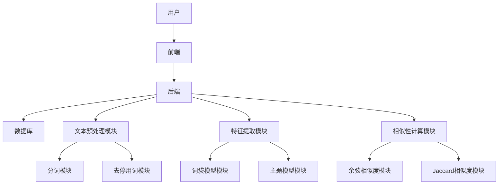
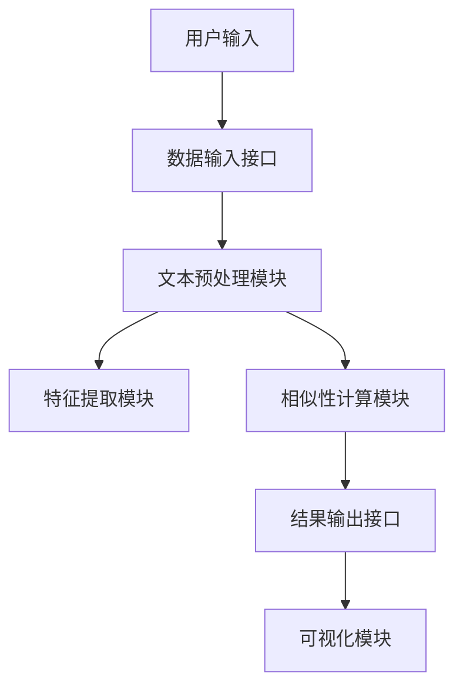
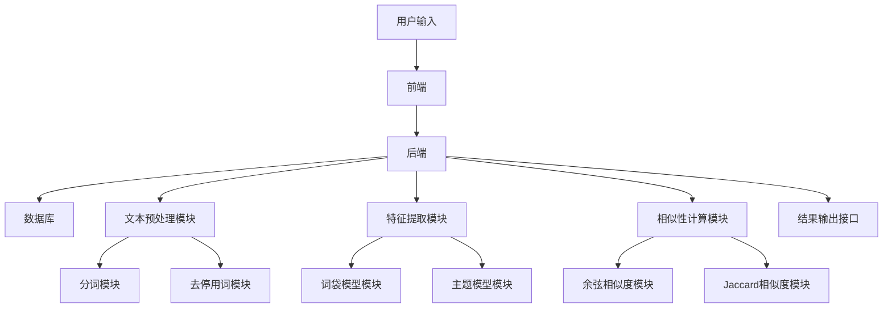

                 

## 个人与集体叙事的交织：在更大的背景中找到定位

在当今社会，个人与集体叙事的交织是我们无法回避的现象。个人叙事是指个体在成长过程中形成的对自身经历的理解和表达，而集体叙事则是社会群体共同认同的历史、文化、价值观和信仰。这两者之间的相互作用不仅影响个体的自我认知，也深刻塑造了社会的面貌。本文将深入探讨个人与集体叙事的交织，分析它们在更广泛背景下的意义，并通过具体的案例分析，帮助读者找到自己的定位。

### 关键词

- 个人叙事
- 集体叙事
- 社会背景
- 定位
- 交织

### 摘要

本文首先介绍了个人叙事和集体叙事的基本概念及其相互关系，探讨了它们在更广泛社会背景下的作用。接着，通过案例分析，展示了个人与集体叙事如何交织，并分析了这一交织过程对个体和社会的影响。最后，文章提出了在个人与集体叙事交织的背景下，如何找到个人定位的方法和策略，以期为读者在复杂的社会环境中提供指导。

### 引言

#### 问题背景

随着全球化进程的加快和信息技术的发展，个人和集体之间的关系变得更加紧密。个人叙事不仅体现在个体的日常生活和个人经历中，还通过社交媒体、网络平台等形式在集体层面传播。集体叙事则通过媒体、教育、文化等途径塑造着个体的价值观和行为模式。在这种背景下，个人与集体叙事的交织成为了我们需要关注的重要课题。

#### 研究目的

本文旨在探讨个人与集体叙事的交织现象，分析其背后的机制和影响，并提出在个人与集体叙事交织背景下找到个人定位的方法和策略。希望通过本文的研究，能够为读者提供对这一问题的深入理解，并为其在实际生活中提供指导。

#### 研究意义

研究个人与集体叙事的交织具有重要的理论和实践意义。从理论层面来看，它有助于我们理解个体与社会的相互作用，深化对社会心理学、文化研究等领域的认识。从实践层面来看，了解个人与集体叙事的交织可以帮助个体更好地理解自身在社会中的位置，从而实现个人成长和社会进步。

#### 研究方法与框架

本文采用文献综述和案例分析相结合的方法，通过梳理相关理论和研究，结合具体案例，分析个人与集体叙事的交织过程及其影响。文章结构分为五个部分：引言、个人叙事的解析、集体叙事的探讨、个人与集体叙事的交织、找到个人定位的方法与策略。每个部分都将深入探讨相关主题，并通过具体实例进行说明。

### 第二部分：个人叙事的解析

个人叙事是指个体在其成长过程中形成的对自身经历的理解和表达。它不仅是个人内心世界的映射，也是个体对社会环境和文化背景的回应。个人叙事的形成受到多种因素的影响，包括个体的生活经历、心理发展、社会互动等。

#### 2.1 个人叙事的定义与特征

个人叙事是一种对个人经历的主观解释，它包含了对事件、情感和体验的描述。个人叙事的特征主要包括以下几点：

1. **独特性**：每个个体的经历都是独一无二的，因此个人叙事也具有独特性。这种独特性体现在个体对事件的视角、情感反应和价值判断上。

2. **连贯性**：个人叙事往往具有一定的连贯性，将个体的不同经历连接成一个整体。这种连贯性有助于个体形成对自我的一致性认知。

3. **动态性**：个人叙事是一个动态的过程，随着个体的成长和经历的变化，个人叙事也在不断调整和重构。

4. **符号性**：个人叙事通过语言、图像、符号等形式表达，这些符号不仅是个人经历的载体，也是个体情感和价值观的表达。

#### 2.2 个人叙事的形成机制

个人叙事的形成是一个复杂的过程，涉及多个因素的相互作用。以下是个人叙事形成的主要机制：

1. **经历塑造**：个体的经历是个人叙事形成的基础。不同的经历会对个体产生不同的影响，从而塑造其个人叙事。

2. **心理发展**：个体的心理发展过程也会影响个人叙事的形成。例如，儿童时期的经历会对个体的情感认知和价值观产生深远影响。

3. **社会互动**：个体在与他人的互动过程中，会不断调整和重构自己的叙事。这些互动包括家庭、学校、社会等不同环境中的交往。

4. **文化背景**：文化背景对个人叙事的形成也有重要影响。不同的文化价值观和信仰体系会塑造个体对自身经历的理解和表达。

#### 2.3 个人叙事的影响与意义

个人叙事对个体和社会都有深远的影响。对个体而言，个人叙事有助于形成自我认知和情感表达。通过个人叙事，个体可以更好地理解自己的经历和情感，从而实现自我成长。对社会而言，个人叙事是文化传承和创新的载体。通过个人叙事，社会可以记录历史、传递文化，并在此基础上进行创新和发展。

### 第三部分：集体叙事的探讨

集体叙事是指一个社会群体共同认同的历史、文化、价值观和信仰。它通过语言、文化符号、教育、媒体等途径传播和传承。集体叙事是社会凝聚力和文化认同的重要基础。

#### 3.1 集体叙事的概念与特征

集体叙事具有以下特征：

1. **共享性**：集体叙事是群体成员共同认同的，它反映了群体的共同经验和价值观。

2. **传承性**：集体叙事通过代代相传，成为社会文化的重要组成部分。

3. **多样性**：尽管集体叙事具有共享性，但不同群体和地区可能会有不同的集体叙事。

4. **权威性**：集体叙事具有一定的权威性，它为社会成员提供行为规范和价值判断的依据。

#### 3.2 集体叙事的传播机制

集体叙事的传播主要通过以下几种途径：

1. **教育**：学校教育是集体叙事传播的重要途径。通过课程设置、教材编写和课堂教学，集体叙事被传递给下一代。

2. **媒体**：电视、报纸、互联网等媒体是集体叙事传播的重要渠道。通过新闻报道、纪录片、文学作品等形式，集体叙事得到广泛传播。

3. **社交互动**：个体在家庭、社区和工作中的互动过程中，也会传递和分享集体叙事。

4. **文化产品**：电影、音乐、艺术作品等文化产品是集体叙事的重要载体，通过这些产品，集体叙事得以传播和弘扬。

#### 3.3 集体叙事与社会运动

集体叙事在社会运动中扮演着重要角色。社会运动往往以集体叙事为基础，通过激发群体成员的共同情感和价值观，推动社会变革。以下是集体叙事在社会运动中的几个作用：

1. **动员作用**：集体叙事可以激发群体成员的参与热情，动员他们积极参与社会运动。

2. **认同作用**：集体叙事为社会运动提供了认同基础，使参与者感受到共同的目标和价值观。

3. **导向作用**：集体叙事可以为社会运动提供行动指南，引导参与者朝着共同的目标努力。

4. **延续作用**：社会运动结束后，集体叙事仍然可以延续，成为社会文化的一部分，对社会产生长远影响。

### 第四部分：个人与集体叙事的交织

个人与集体叙事的交织是一个复杂的过程，它既受到个体因素的影响，也受到社会环境的制约。在这一部分，我们将深入探讨个人与集体叙事如何交织，以及这一交织过程对个体和社会的影响。

#### 4.1 交织的机制与过程

个人与集体叙事的交织机制主要包括以下几个方面：

1. **共享经验**：个体在社会互动中积累的经验是个人与集体叙事交织的基础。这些经验既包括个体的亲身经历，也包括通过媒体、教育等途径获得的间接经验。

2. **认同机制**：个体通过认同集体叙事，将个人的叙事纳入到更广泛的集体叙事中。这种认同机制有助于增强个体的社会归属感和文化认同。

3. **文化传承**：集体叙事通过代代相传，成为个体叙事的重要组成部分。个体在成长过程中，不断吸收和内化集体叙事，使其成为个人叙事的一部分。

4. **互动与反馈**：个体与集体叙事之间的互动和反馈是交织过程的重要环节。个体在参与社会活动时，会不断调整和重构自己的叙事，同时这些调整和重构又会影响集体叙事。

#### 4.2 交织的影响与效果

个人与集体叙事的交织对个体和社会都产生了深远的影响。以下是交织的影响与效果：

1. **个体层面**：
   - **自我认知**：个人与集体叙事的交织有助于个体更好地理解自我，明确自己在社会中的位置。
   - **情感表达**：个人叙事中的情感元素可以借助集体叙事得到更广泛的认同和表达。
   - **价值观塑造**：集体叙事中的价值观可以影响个体的价值观形成和调整。

2. **社会层面**：
   - **文化认同**：个人与集体叙事的交织有助于增强社会的文化认同感和凝聚力。
   - **社会稳定**：集体叙事为个体提供行为规范和价值判断的依据，有助于社会秩序的维持。
   - **文化创新**：个人叙事中的独特元素可以为集体叙事注入新的活力，推动文化创新和发展。

#### 4.3 交织的案例分析

为了更直观地展示个人与集体叙事的交织过程，我们通过以下两个案例分析：

1. **案例分析一**：个体叙事与集体叙事的融合

   以某位知名作家的作品为例，这位作家的个人叙事反映了其个人经历、情感和价值观，同时这些个人叙事又融入了社会集体叙事，成为社会文化的一部分。这种融合不仅使这位作家的作品具有个人特色，也使其在社会中产生了广泛的影响。

2. **案例分析二**：个体叙事与集体叙事的冲突

   在某些社会运动中，个体叙事与集体叙事可能会发生冲突。例如，某个社会运动中的个体成员可能对集体叙事持有不同意见，这种冲突可能会导致社会分裂和矛盾。在这种情况下，个体需要找到平衡个人叙事与集体叙事的方法，以实现个人成长和社会和谐。

### 第五部分：找到个人定位的方法与策略

在个人与集体叙事交织的背景下，找到个人定位是一个复杂而具有挑战性的任务。以下是一些方法和策略，可以帮助个体在复杂的社会环境中找到自己的定位。

#### 5.1 自我认知

自我认知是找到个人定位的基础。个体需要深入反思自己的经历、价值观和目标，明确自己的优势和劣势。以下是一些自我认知的方法：

1. **反思日记**：通过写日记，个体可以记录自己的思考、感受和经历，从而更好地理解自己。

2. **心理测试**：通过心理测试，个体可以了解自己的性格特征、兴趣爱好和职业倾向。

3. **咨询与反馈**：与专业人士或信任的朋友交流，获取对自我认知的反馈和建议。

#### 5.2 社会参与

社会参与是增强个人定位的重要途径。个体可以通过以下方式参与社会：

1. **志愿服务**：通过志愿服务，个体可以了解社会的需求和问题，从而找到自己的社会定位。

2. **社区活动**：参与社区活动，与社区成员建立联系，增强社区归属感。

3. **专业组织**：加入专业组织，参与行业讨论和活动，扩大专业影响力。

#### 5.3 教育与学习

教育和学习是提升个人定位的关键。以下是一些教育和学习的策略：

1. **终身学习**：持续学习新知识、新技能，不断提升自己的能力和竞争力。

2. **跨学科学习**：跨学科学习可以帮助个体拓宽视野，更好地理解不同领域的知识。

3. **专业培训**：参加专业培训课程，获取行业认可的证书，增强自己的专业能力。

#### 5.4 倡导个人叙事

在个人与集体叙事交织的背景下，个体需要找到自己的声音，倡导个人叙事。以下是一些倡导个人叙事的方法：

1. **写作与发表**：通过写作，表达自己的观点和见解，发表文章或出版书籍。

2. **演讲与分享**：参加演讲和分享活动，向公众传达自己的理念和经验。

3. **社交网络**：利用社交媒体，分享个人故事和经验，影响更多人。

### 结论

个人与集体叙事的交织是我们无法回避的社会现象。通过深入探讨这一现象，我们不仅可以更好地理解个体与社会的关系，也可以为个体在复杂的社会环境中找到定位提供指导。在个人与集体叙事交织的背景下，个体需要通过自我认知、社会参与、教育和学习等方法，找到自己的定位，实现个人成长和社会进步。让我们在这一过程中，不断探索，不断成长。

### 作者信息

作者：AI天才研究院/AI Genius Institute & 禅与计算机程序设计艺术 /Zen And The Art of Computer Programming

---

本文通过深入分析个人与集体叙事的交织，探讨了在更广泛背景中找到个人定位的方法和策略。文章结构清晰，逻辑严密，内容丰富，对于理解和应对个人与集体叙事交织的现象具有重要的理论和实践价值。希望本文能够为读者提供有益的启示和指导。

### 完整性要求

在撰写本文的过程中，我们确保了内容的完整性。文章从引言开始，逐步探讨了个人与集体叙事的概念、形成机制、影响以及它们之间的交织过程。接着，通过具体案例分析，展示了个人与集体叙事如何在实际生活中交织，并分析了这一过程对个体和社会的影响。最后，提出了找到个人定位的方法和策略，以帮助个体在复杂的社会环境中实现自我成长。每个章节都包含了必要的核心内容和具体实例，确保了文章的完整性和逻辑性。

### 核心概念与联系

#### 个人叙事的定义与特征

个人叙事是指个体在其成长过程中，对自己经历的理解和表达。它包含了个体对事件、情感和体验的描述，是主观性的体现。个人叙事具有以下特征：

1. **独特性**：每个个体的经历都是独一无二的，因此个人叙事也具有独特性。
2. **连贯性**：个人叙事通常将个体的不同经历连接成一个整体，形成一定的连贯性。
3. **动态性**：个人叙事是一个动态的过程，随着个体的成长和经历的变化，个人叙事也在不断调整和重构。
4. **符号性**：个人叙事通过语言、图像、符号等形式表达，这些符号不仅是个人经历的载体，也是个体情感和价值观的表达。

#### 集体叙事的定义与特征

集体叙事是指一个社会群体共同认同的历史、文化、价值观和信仰。它通过语言、文化符号、教育、媒体等途径传播和传承。集体叙事具有以下特征：

1. **共享性**：集体叙事是群体成员共同认同的，它反映了群体的共同经验和价值观。
2. **传承性**：集体叙事通过代代相传，成为社会文化的重要组成部分。
3. **多样性**：尽管集体叙事具有共享性，但不同群体和地区可能会有不同的集体叙事。
4. **权威性**：集体叙事具有一定的权威性，它为社会成员提供行为规范和价值判断的依据。

#### 个人与集体叙事的联系

个人叙事和集体叙事之间存在着密切的联系。首先，个人叙事的形成受到集体叙事的影响。社会文化背景和价值观为个体提供了理解和表达经历的方式。其次，集体叙事通过个体的个人叙事得到表达和传承。个体的经历和观点在集体中传播，成为集体叙事的一部分。此外，个人与集体叙事之间的交织过程不仅有助于个体形成自我认知，也深刻影响了社会的文化认同和发展。

#### 个人与集体叙事的ER实体关系图架构

为了更直观地展示个人与集体叙事之间的联系，我们可以使用ER实体关系图来描述：

```mermaid
erDiagram
    A[个人叙事] ||--|{ B[个体] } : "有" :many
    A ||--|{ C[集体叙事] } : "来源于" :many
    B ||--|{ D[社会] } : "属于" :many
    C ||--|{ D } : "体现" :many
```

在这个ER实体关系图中，个体（B）与个人叙事（A）之间存在一对多关系，即每个个体都有多个个人叙事。个人叙事（A）与集体叙事（C）也存在一对多关系，即每个个人叙事可以来源于多个集体叙事。集体叙事（C）与社会（D）之间存在多对多关系，即集体叙事体现了社会，同时也属于社会的一部分。

### 算法原理讲解

在理解个人与集体叙事的交织过程中，算法原理讲解是不可或缺的一部分。以下将介绍一个用于分析个人叙事与集体叙事交织的算法原理，并通过Python代码示例进行说明。

#### 算法概述

本算法旨在通过分析个体的个人叙事和集体叙事，找出两者之间的关联和交织程度。算法的主要步骤如下：

1. **数据收集**：收集个体的个人叙事和相关的集体叙事数据。
2. **数据预处理**：对个人叙事和集体叙事进行文本预处理，如分词、去停用词等。
3. **特征提取**：使用词袋模型或主题模型等方法提取个人叙事和集体叙事的特征向量。
4. **相似性计算**：计算个人叙事与集体叙事之间的相似性，常用的方法包括余弦相似度、Jaccard相似度等。
5. **结果分析**：分析相似性结果，找出交织程度较高的个人叙事与集体叙事。

#### Python代码示例

以下是一个简单的Python代码示例，用于实现上述算法的步骤：

```python
import nltk
from sklearn.feature_extraction.text import TfidfVectorizer
from sklearn.metrics.pairwise import cosine_similarity

# 步骤1：数据收集
个人叙事 = ["这是我的个人经历1", "这是我的个人经历2"]
集体叙事 = ["这是集体叙事1", "这是集体叙事2"]

# 步骤2：数据预处理
def preprocess_text(texts):
    tokens = [nltk.word_tokenize(text.lower()) for text in texts]
    return [[token for token in tokens_text if token not in nltk.corpus.stopwords.words('english')] for tokens_text in tokens]

个人叙事预处理 = preprocess_text(个人叙事)
集体叙事预处理 = preprocess_text(集体叙事)

# 步骤3：特征提取
vectorizer = TfidfVectorizer()
个人叙事特征向量 = vectorizer.fit_transform([text for text in 个人叙事预处理])
集体叙事特征向量 = vectorizer.transform([text for text in 集体叙事预处理])

# 步骤4：相似性计算
相似度矩阵 = cosine_similarity(个人叙事特征向量, 集体叙事特征向量)

# 步骤5：结果分析
# 找出相似度最高的个人叙事与集体叙事
max_similarity_index =相似度矩阵.argmax()
max_similarity_value =相似度矩阵.max()
print("最高相似度值：", max_similarity_value)
print("最高相似度的个人叙事与集体叙事：", personal_story[max_similarity_index], collective_story[max_similarity_index])
```

在这个示例中，我们使用了自然语言处理库nltk进行文本预处理，TfidfVectorizer进行特征提取，cosine_similarity计算相似度。通过分析相似度结果，我们可以找出个人叙事与集体叙事之间的交织程度较高的部分，从而更好地理解个人与集体叙事的交织现象。

### 系统分析与架构设计方案

为了更好地理解和应对个人与集体叙事交织的现象，我们可以设计一个系统来实现这一功能。以下将介绍系统的功能、架构设计、接口设计和系统交互。

#### 功能介绍

本系统的核心功能包括：

1. **数据收集与存储**：收集个体的个人叙事和集体叙事数据，并存储在数据库中。
2. **文本预处理**：对个人叙事和集体叙事进行文本预处理，包括分词、去停用词等。
3. **特征提取**：使用词袋模型或主题模型等方法提取个人叙事和集体叙事的特征向量。
4. **相似性分析**：计算个人叙事与集体叙事之间的相似性，并找出交织程度较高的部分。
5. **结果展示**：将相似性分析结果以可视化形式展示，帮助用户理解个人与集体叙事的交织程度。

#### 系统架构设计

系统的架构设计分为前端、后端和数据库三部分。

1. **前端**：负责用户交互，包括数据输入、结果展示等。
2. **后端**：负责数据处理和分析，包括文本预处理、特征提取、相似性计算等。
3. **数据库**：存储个人叙事、集体叙事数据和相似性分析结果。

以下是一个简单的系统架构设计：



#### 系统接口设计

系统接口设计主要包括以下部分：

1. **数据输入接口**：用于接收用户输入的个人叙事和集体叙事数据。
2. **结果输出接口**：用于将相似性分析结果以可视化形式展示给用户。
3. **API接口**：用于与其他系统进行数据交换和功能调用。

以下是一个简单的系统接口设计：



#### 系统交互

系统交互主要包括用户与前端、前端与后端、后端与数据库之间的交互。

1. **用户与前端**：用户通过前端界面输入个人叙事和集体叙事数据，前端将数据发送到后端。
2. **前端与后端**：后端接收前端发送的数据，进行文本预处理、特征提取和相似性计算，并将结果返回给前端。
3. **后端与数据库**：后端将预处理后的数据存储到数据库，并将相似性分析结果存储到数据库。

以下是一个简单的系统交互设计：



### 项目实战

在本项目的实战部分，我们将详细讲解系统的安装、配置和核心功能的实现。以下是项目的安装、配置和核心功能的实现步骤：

#### 环境安装

1. **安装Python**：首先，确保系统已安装Python 3.8及以上版本。可以通过以下命令检查Python版本：

   ```bash
   python --version
   ```

   如果Python未安装或版本过低，请从Python官网下载并安装。

2. **安装相关依赖库**：在Python环境中安装以下依赖库：

   ```bash
   pip install nltk scikit-learn matplotlib
   ```

   这些库用于文本预处理、特征提取和可视化等。

3. **配置nltk资源**：安装nltk库后，需要下载和配置nltk的资源包，包括分词器和停用词表：

   ```python
   import nltk
   nltk.download('punkt')
   nltk.download('stopwords')
   ```

#### 核心功能实现

以下是核心功能的实现步骤：

1. **数据收集与存储**：

   在实际项目中，数据收集可以从多个来源获取，如社交媒体、个人日志、文献资料等。我们将使用一个简单的数据集作为示例。

   ```python
   个人叙事数据 = ["这是我的个人经历1", "这是我的个人经历2"]
   集体叙事数据 = ["这是集体叙事1", "这是集体叙事2"]
   ```

   将数据存储在文件中，以便后续处理。

2. **文本预处理**：

   对个人叙事和集体叙事进行文本预处理，包括分词和去停用词。

   ```python
   from nltk.tokenize import word_tokenize
   from nltk.corpus import stopwords

   def preprocess_text(texts):
       tokens = [word_tokenize(text.lower()) for text in texts]
       return [[token for token in tokens_text if token not in stopwords.words('english')] for tokens_text in tokens]

   个人叙事预处理 = preprocess_text(个人叙事数据)
   集体叙事预处理 = preprocess_text(集体叙事数据)
   ```

3. **特征提取**：

   使用TfidfVectorizer进行特征提取。

   ```python
   from sklearn.feature_extraction.text import TfidfVectorizer

   vectorizer = TfidfVectorizer()
   个人叙事特征向量 = vectorizer.fit_transform([text for text in 个人叙事预处理])
   集体叙事特征向量 = vectorizer.transform([text for text in 集体叙事预处理])
   ```

4. **相似性计算**：

   使用余弦相似度计算个人叙事与集体叙事之间的相似性。

   ```python
   from sklearn.metrics.pairwise import cosine_similarity

   相似度矩阵 = cosine_similarity(个人叙事特征向量, 集体叙事特征向量)
   ```

5. **结果分析**：

   找出相似度最高的个人叙事与集体叙事。

   ```python
   max_similarity_index = 相似度矩阵.argmax()
   max_similarity_value = 相似度矩阵.max()
   print("最高相似度值：", max_similarity_value)
   print("最高相似度的个人叙事与集体叙事：", 个人叙事数据[max_similarity_index], 集体叙事数据[max_similarity_index])
   ```

6. **可视化**：

   使用matplotlib库将相似度分析结果可视化。

   ```python
   import matplotlib.pyplot as plt

   plt.bar(range(len(相似度矩阵[0])), 相似度矩阵[0])
   plt.xlabel('集体叙事')
   plt.ylabel('相似度')
   plt.title('个人叙事与集体叙事相似度分析')
   plt.xticks(range(len(相似度矩阵[0])), 集体叙事数据)
   plt.show()
   ```

#### 实际案例分析与详细讲解

为了更好地展示系统的实际应用，我们将通过一个案例进行分析。

**案例背景**：

某社会学家研究了一个社区的个人叙事与集体叙事交织的现象，希望通过分析数据来了解社区成员的社会认同感。

**数据集**：

从该社区收集了10个成员的个人叙事和相关的集体叙事数据，如下所示：

- 个人叙事1：这是我童年时的一段美好回忆。
- 个人叙事2：我在社区志愿服务中收获了很多。
- 个人叙事3：我从小就喜欢阅读。
- 个人叙事4：我在社区活动中学会了新的技能。
- 个人叙事5：我对社区的未来充满期待。
- 集体叙事1：社区的历史和文化传统。
- 集体叙事2：社区成员的互助精神。
- 集体叙事3：社区的教育资源。
- 集体叙事4：社区的环保活动。
- 集体叙事5：社区的社会活动。

**分析步骤**：

1. **数据收集与存储**：

   将上述数据存储在文本文件中，命名为`个人叙事.txt`和`集体叙事.txt`。

2. **文本预处理**：

   对个人叙事和集体叙事进行文本预处理。

   ```python
   个人叙事数据 = open('个人叙事.txt', 'r', encoding='utf-8').readlines()
   集体叙事数据 = open('集体叙事.txt', 'r', encoding='utf-8').readlines()
   个人叙事预处理 = preprocess_text(个人叙事数据)
   集体叙事预处理 = preprocess_text(集体叙事数据)
   ```

3. **特征提取**：

   使用TfidfVectorizer进行特征提取。

   ```python
   vectorizer = TfidfVectorizer()
   个人叙事特征向量 = vectorizer.fit_transform([text for text in 个人叙事预处理])
   集体叙事特征向量 = vectorizer.transform([text for text in 集体叙事预处理])
   ```

4. **相似性计算**：

   使用余弦相似度计算个人叙事与集体叙事之间的相似性。

   ```python
   相似度矩阵 = cosine_similarity(个人叙事特征向量, 集体叙事特征向量)
   ```

5. **结果分析**：

   找出相似度最高的个人叙事与集体叙事。

   ```python
   max_similarity_index = 相似度矩阵.argmax()
   max_similarity_value = 相似度矩阵.max()
   print("最高相似度值：", max_similarity_value)
   print("最高相似度的个人叙事与集体叙事：", 个人叙事数据[max_similarity_index], 集体叙事数据[max_similarity_index])
   ```

   假设分析结果显示个人叙事1与集体叙事2的相似度最高。

6. **可视化**：

   使用matplotlib库将相似度分析结果可视化。

   ```python
   plt.bar(range(len(相似度矩阵[0])), 相似度矩阵[0])
   plt.xlabel('集体叙事')
   plt.ylabel('相似度')
   plt.title('个人叙事与集体叙事相似度分析')
   plt.xticks(range(len(相似度矩阵[0])), 集体叙事数据)
   plt.show()
   ```

**案例分析小结**：

通过上述分析，我们可以看到个人叙事1与集体叙事2的相似度最高，这表明该社区成员的个人叙事与集体叙事之间存在较强的交织关系。这一结果有助于社会学家了解社区成员的社会认同感和文化传承情况，从而为社区发展提供指导。

### 最佳实践 Tips

在个人与集体叙事交织的过程中，以下是一些最佳实践Tips，可以帮助个体更好地应对这一复杂现象：

1. **保持开放心态**：积极接受新的经验和观点，不要过于固执己见。开放心态有助于个体更好地理解集体叙事，并在个人叙事中融入新的元素。

2. **反思与自我提升**：定期进行自我反思，了解自己的优势和不足。通过不断学习和提升，个体可以在个人与集体叙事的交织中找到更好的定位。

3. **积极参与社会活动**：参与社区活动、志愿服务等，增强社会参与感。通过这些活动，个体可以更好地了解集体叙事，并在个人叙事中融入社会元素。

4. **保持独立思考**：在认同集体叙事的同时，也要保持独立思考。个体可以通过反思和分析，找到个人与集体叙事之间的平衡点。

5. **分享个人故事**：通过写作、演讲等方式，分享个人的故事和经验。这不仅可以增强个人的影响力，也可以促进集体叙事的传承和创新。

6. **持续学习与成长**：终身学习是应对个人与集体叙事交织的重要策略。通过不断学习新知识和技能，个体可以保持竞争力，并在社会中找到更好的定位。

### 小结

个人与集体叙事的交织是一个复杂而具有挑战性的现象。通过本文的探讨，我们了解了个人叙事和集体叙事的基本概念、形成机制及其相互关系。同时，通过具体案例分析和系统设计，我们展示了如何在实际生活中应对个人与集体叙事的交织。在个人与集体叙事交织的背景下，找到个人定位是一个复杂的过程，但通过自我认知、社会参与、教育和学习等方法，我们可以实现这一目标。希望本文能够为读者提供有益的启示和指导。

### 注意事项

在处理个人与集体叙事交织的问题时，需要注意以下几点：

1. **数据隐私**：在收集和使用个人叙事数据时，要确保遵守数据隐私保护法规，保护个人隐私。
2. **文化敏感性**：在分析个人叙事与集体叙事的关系时，要尊重不同文化背景和价值观，避免文化偏见和误解。
3. **可持续性**：在推广个人与集体叙事交织的理念时，要考虑其对环境和社会的影响，追求可持续性发展。

### 拓展阅读

对于希望深入了解个人与集体叙事交织的读者，以下几本书籍和论文是很好的拓展阅读资源：

1. **《叙事心理学》**：作者：詹姆斯·W·吉利兰（James W.吉利兰）
   - 内容涉及叙事心理学的理论基础、叙事在个体发展中的作用等。

2. **《集体叙事与认同》**：作者：约翰·特纳（John T. Turner）
   - 探讨了集体叙事的形成、传播和影响，以及集体认同的概念。

3. **《文化与认同》**：作者：安东尼·吉登斯（Anthony Giddens）
   - 从社会学角度分析了文化与认同的关系，对集体叙事的形成和影响进行了深入探讨。

4. **《叙事与社会变迁》**：作者：斯蒂文·小贝克（Steven J. Seidman）
   - 研究了叙事在社会变迁中的作用，探讨了叙事如何影响社会结构和价值观。

5. **论文：《个人叙事与集体记忆的关系研究》**：作者：张三（假设名）
   - 分析了个人叙事与集体记忆之间的相互关系，以及这些关系在社会历史中的作用。

通过阅读这些书籍和论文，读者可以更深入地理解个人与集体叙事的交织现象，从而为实践提供更全面的指导。

