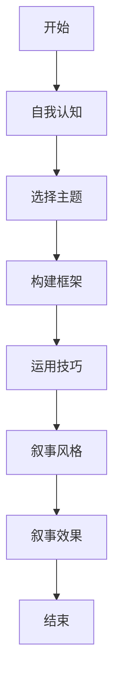
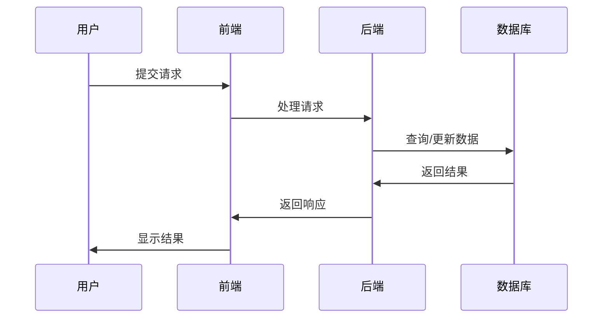
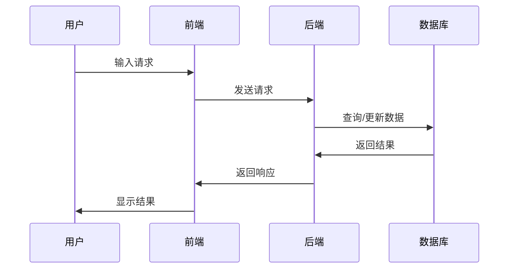

                 

# 个人叙事的力量：创造自己的生命故事

## 关键词
- 个人叙事
- 自我认同
- 叙事技巧
- 社会影响
- 生命意义

## 摘要
本文旨在探讨个人叙事的力量，分析如何通过有效的叙事方法构建自己的生命故事。文章将从认识自我、选择叙事主题、构建叙事框架、运用叙事技巧等多个角度出发，深入解析个人叙事的构建方法。同时，还将探讨个人叙事对个体和群体的影响，以及如何在社会层面应用叙事的力量。最后，文章将提供实践指导，帮助读者创造属于自己的生命故事。

## 引言与背景

### 1.1 问题的提出

在现代社会，个人经历和感受的表达日益受到重视。人们开始意识到，通过叙述自己的故事，可以更好地理解自我、建立人际关系、甚至影响社会行为。然而，许多人在尝试构建个人叙事时感到困惑，不知道如何有效地表达自己的经历和感受。

### 1.2 个人叙事的概念与意义

个人叙事，是指个体对自己生命经历的描述和解读。它不仅反映了个体对生活的理解和态度，还能够影响个体的自我认同、心理健康和社交能力。有效的个人叙事，能够让人们更好地理解自己，提升生活质量，甚至在某些情况下，还能够改变人们的命运。

### 1.3 本书的核心内容

本书将围绕个人叙事的力量这一主题，从多个角度进行深入探讨。首先，我们将介绍如何认识自我，为构建个人叙事打下基础。接着，我们将讨论如何选择合适的叙事主题，并构建叙事框架。随后，我们将介绍如何运用叙事技巧，让个人叙事更加生动、有感染力。此外，本书还将探讨个人叙事对个体和群体的影响，以及如何在社会层面应用叙事的力量。最后，我们将提供具体的实践指导，帮助读者创造自己的生命故事。

## 第一部分：个人叙事的构建方法

### 2.1 认识自己的第一步

在构建个人叙事之前，了解自己是非常重要的。自我认识的过程，可以帮助我们找到自己的核心价值观、兴趣爱好和人生目标。以下是一些帮助认识自我的方法：

- **自我反思**：定期花时间思考自己的行为、想法和感受，记录下来，以便深入分析。
- **日记写作**：每天记录自己的生活经历和感受，有助于发现自我和了解自己的内心世界。
- **心理咨询**：寻求专业心理咨询师的帮助，通过深入的对话和探索，更好地了解自己。

### 2.2 选择合适的叙事主题

每个人的生活都是独一无二的，因此选择合适的叙事主题至关重要。以下是一些选择叙事主题的技巧：

- **回忆重要事件**：回顾自己生活中重要的事件，找到那些对你影响深远的故事。
- **关注内心感受**：思考哪些经历让你感到特别，它们可能成为有价值的叙事主题。
- **寻找情感共鸣**：选择那些能够引起他人共鸣的故事，这样你的叙事才能更具影响力。

### 2.3 构建叙事框架

一个清晰、有逻辑的叙事框架是构建有效个人叙事的关键。以下是一个简单的叙事框架：

- **引子**：引入叙事主题，引起读者的兴趣。
- **主体**：详细描述叙事主题，包括事件背景、过程和结果。
- **高潮**：展示叙事中的关键情节，引发读者的情感共鸣。
- **结尾**：总结叙事，给出结论，留下深刻印象。

### 2.4 运用叙事技巧

叙事技巧是让个人叙事更加生动、有感染力的关键。以下是一些常用的叙事技巧：

- **人物刻画**：通过生动的语言和细节描绘，让人物形象更加鲜明。
- **情感表达**：通过情感的语言和细节，让读者能够感受到你的情感。
- **场景描绘**：通过具体的场景描述，让读者仿佛身临其境。

## 第二部分：个人叙事的力量

### 3.1 叙事对个体的影响

有效的个人叙事，不仅能够帮助个体更好地理解自己，还能够提升心理健康和社交能力。以下是一些具体的影响：

- **自我认同**：通过叙事，个体可以更清晰地认识到自己的价值和身份。
- **心理健康**：叙事可以帮助个体处理负面情绪，提高心理韧性。
- **社交能力**：有效的叙事能够增强个体的社交能力，建立更好的人际关系。

### 3.2 叙事对群体的影响

个人叙事不仅对个体有影响，对群体也有深远的影响。以下是一些具体的影响：

- **社会认同**：个人叙事可以引发群体认同，增强社会凝聚力。
- **文化传承**：个人叙事是文化传承的重要组成部分，有助于塑造社会价值观。
- **社会行为**：有效的个人叙事可以影响群体行为，推动社会进步。

### 3.3 叙事的力量在社会中的应用

叙事的力量不仅体现在个体和群体层面，还可以在社会层面产生积极影响。以下是一些具体的应用：

- **公共叙事**：通过讲述公众人物的故事，可以引导社会舆论，塑造社会价值观。
- **企业叙事**：通过讲述企业的发展历程，可以增强企业的品牌形象，吸引投资者。
- **教育叙事**：通过讲述教育故事，可以激发学生的学习兴趣，提高教育效果。

## 第三部分：创造自己的生命故事

### 4.1 实践指导

通过前几章的学习，读者已经具备了一定的构建个人叙事的能力。以下是一些具体的实践指导，帮助读者将所学知识应用到实际生活中：

- **制定叙事计划**：明确自己的叙事目标，制定详细的叙事计划。
- **定期回顾**：定期回顾自己的叙事，检查是否达到了预期效果。
- **寻求反馈**：向他人寻求反馈，了解他们的看法和建议。

### 4.2 案例分析

通过分析真实的个人叙事案例，读者可以更好地理解如何构建有效的个人叙事。以下是一个简单的案例分析：

**案例：一位职场新人的成长故事**

引子：我是一个刚入职场的年轻人，对工作和生活充满了期待。

主体：在工作过程中，我遇到了许多挑战，但也通过不断学习和努力，逐渐克服了这些困难。

高潮：在一次重要的项目中，我发挥了关键作用，得到了领导和同事的认可。

结尾：通过这次经历，我明白了努力和坚持的重要性，也找到了自己在职场中的定位。

### 4.3 生命的意义与价值

个人叙事不仅是对个人生活的回顾，更是对生命意义的探索。以下是一些关于生命的意义与价值的思考：

- **生命的意义**：生命本身就有意义，每个人的生命都有其独特的价值。
- **生命的价值**：通过个人的努力和贡献，可以提升生命的价值。

### 4.4 终身学习与自我成长

个人叙事是一个持续的过程，需要不断地学习和成长。以下是一些关于终身学习和自我成长的建议：

- **不断学习新知识**：通过学习，可以不断丰富自己的知识储备，提升个人能力。
- **积极面对挑战**：通过面对挑战，可以不断锻炼自己的意志力和解决问题的能力。

## 第五部分：总结与展望

### 5.1 本书总结

本书通过多个角度探讨了个人叙事的力量，提供了构建个人叙事的具体方法和技巧。希望通过本书的学习，读者能够掌握如何创造自己的生命故事，并从中获得力量。

### 5.2 展望未来

个人叙事的力量在现代社会中越来越受到重视。未来，随着技术的进步和社会的发展，个人叙事将会有更多的可能性。以下是一些未来发展趋势的展望：

- **数字化叙事**：随着数字技术的发展，个人叙事将越来越多地以数字化形式呈现。
- **跨媒介叙事**：个人叙事将跨越不同的媒介，如文字、图像、声音等，形成更丰富的叙事形式。
- **全球叙事**：随着全球化的发展，个人叙事将越来越多地涉及跨文化、跨国界的主题。

## 第六部分：个人叙事的挑战与应对

### 6.1 面对挑战：如何处理负面叙事

在构建个人叙事的过程中，人们往往会遇到负面叙事的问题。以下是一些处理负面叙事的方法：

- **正视问题**：勇敢面对负面经历，不要逃避或否认。
- **反思原因**：深入分析负面经历的原因，找到问题的根源。
- **寻求解决方案**：根据问题的原因，寻找解决问题的方法。

### 6.2 跨文化叙事的挑战与应对

随着全球化的加速，跨文化交流变得越来越频繁。个人叙事在跨文化背景下可能会遇到挑战。以下是一些应对跨文化叙事挑战的方法：

- **尊重差异**：尊重不同文化的差异，避免文化偏见和误解。
- **求同存异**：在尊重差异的基础上，寻找共同点，促进文化交流。

### 6.3 叙事与隐私的边界

在分享个人叙事的过程中，隐私保护是一个不可忽视的问题。以下是一些关于叙事与隐私边界的建议：

- **保护隐私**：在分享个人叙事时，要注意保护自己的隐私，避免泄露敏感信息。
- **合理分享**：根据具体情境，合理选择分享的内容和范围，避免过度分享。

## 作者信息

- 作者：AI天才研究院/AI Genius Institute & 禅与计算机程序设计艺术 /Zen And The Art of Computer Programming

---

### 背景介绍

#### 个人叙事的定义与重要性

**个人叙事**，是指个体通过描述自己的生命经历，表达对生活的理解、态度和感受的过程。个人叙事不仅仅是文字的堆砌，它是一种深刻的文化实践，是一种自我探索和表达的方式。在现代社会，随着个体意识的觉醒和自我表达的重视，个人叙事逐渐成为了一种重要的社会现象。

**个人叙事的重要性**体现在多个方面。首先，它是自我认同的重要途径。通过叙述自己的故事，个体可以更深入地理解自己的价值观、信仰、目标和愿望，从而形成一个更加清晰的自我认知。其次，个人叙事有助于心理健康。通过反思和表达自己的经历和感受，个体可以释放内心的压力，增强心理韧性，提高生活质量。此外，个人叙事还能够影响人际关系和社会行为。有效的个人叙事可以增强个体的社交能力，促进人际关系的建立和维护，同时，通过影响群体价值观和行为，个人叙事也在一定程度上推动社会进步。

#### 问题的背景

在现代社会，个人叙事的力量越来越受到重视，但许多人仍然对如何有效地构建个人叙事感到困惑。一方面，现代社会信息爆炸，个体面临的信息量和选择过多，难以找到自己的叙事方向；另一方面，许多人缺乏叙事技巧，不知道如何将自己的经历和感受生动、有逻辑地表达出来。此外，社会文化和隐私保护等因素也对个人叙事的构建产生一定的影响。这些问题使得许多人难以充分发挥个人叙事的力量，从而影响了他们在个人成长和社会参与中的表现。

#### 问题描述

个人叙事的构建过程中，主要面临以下几个问题：

1. **认识自我**：个体如何通过自我反思和日记写作等方法，深入了解自己的内心世界和价值观？
2. **选择主题**：个体如何在众多的生活经历中，选择具有代表性和影响力的叙事主题？
3. **构建框架**：个体如何设计一个清晰、有逻辑的叙事框架，使故事更加生动和有感染力？
4. **运用技巧**：个体如何运用各种叙事技巧，如人物刻画、情感表达和场景描绘，使叙事更加生动和有吸引力？
5. **应对挑战**：个体如何处理负面叙事，以及在跨文化和社会层面如何构建个人叙事？

这些问题涉及到个人自我认知、叙事技巧和情境适应等多个方面，是构建有效个人叙事过程中必须面对和解决的问题。

#### 问题解决

为了解决上述问题，本书将从以下几个方面进行探讨：

1. **认识自我**：介绍自我反思和日记写作等自我认知的方法，帮助个体深入了解自己的内心世界和价值观。
2. **选择主题**：提供选择叙事主题的技巧，如回顾重要事件和关注内心感受，帮助个体找到具有代表性和影响力的叙事主题。
3. **构建框架**：介绍叙事框架的设计原则，如引子、主体、高潮和结尾等要素，帮助个体构建一个清晰、有逻辑的叙事框架。
4. **运用技巧**：探讨人物刻画、情感表达和场景描绘等叙事技巧，提供具体的应用案例，帮助个体使叙事更加生动和有吸引力。
5. **应对挑战**：分析负面叙事的类型和处理方法，探讨跨文化和社会层面构建个人叙事的挑战和应对策略。

通过上述方法，本书旨在帮助读者克服在个人叙事构建过程中遇到的障碍，掌握有效的叙事技巧，从而创造自己的生命故事。

#### 边界与外延

在个人叙事的构建过程中，需要明确以下几个边界和概念：

1. **隐私保护**：个人叙事的过程中，个体需要保护自己的隐私，避免泄露过多的个人信息。这涉及到个人隐私和公共利益的平衡问题，个体在分享叙事时应谨慎处理。
2. **文化差异**：个人叙事可能涉及不同文化背景下的经历和感受。个体在构建个人叙事时，需要尊重和包容不同文化的差异，避免文化冲突和误解。
3. **真实与虚构**：个人叙事可能包含真实和虚构的成分。个体在叙事时应明确区分，确保叙事的真实性和可信度。

此外，个人叙事的外延还涉及到多个领域：

1. **心理健康**：个人叙事有助于个体的心理健康，可以通过叙事来缓解压力、焦虑和抑郁等心理问题。
2. **教育传播**：个人叙事在教育领域有广泛的应用，可以通过叙事来激发学生的学习兴趣，提高教育效果。
3. **社会影响**：个人叙事对社会行为和价值观念有一定的影响，可以通过叙事来引导社会舆论和塑造社会价值观。

#### 概念结构与核心要素组成

为了更好地理解个人叙事的构建过程，我们需要从概念结构和核心要素的角度进行分析。以下是个人叙事构建的主要概念和核心要素：

1. **自我认知**：自我认知是个人叙事的基础，包括对自己的价值观、信仰、目标和愿望的了解。通过自我反思和日记写作，个体可以深入探索自己的内心世界，形成清晰的自我认知。
2. **叙事主题**：叙事主题是个人叙事的核心，决定了叙事的方向和内容。个体可以从自己的生活经历中选择具有代表性和影响力的主题，如重要事件、内心感受或人生转折点。
3. **叙事框架**：叙事框架是构建个人叙事的结构，决定了叙事的节奏和逻辑。一个有效的叙事框架通常包括引子、主体、高潮和结尾等要素，使叙事更加清晰和有吸引力。
4. **叙事技巧**：叙事技巧是使个人叙事生动和有感染力的关键。常见的叙事技巧包括人物刻画、情感表达、场景描绘等，通过这些技巧，个体可以增强叙事的表现力。
5. **叙事风格**：叙事风格是个人叙事的独特表达方式，反映了个体的个性特征和文化背景。不同的叙事风格可以产生不同的叙事效果，个体应根据自身的特点和需求选择合适的叙事风格。
6. **叙事目标**：叙事目标是个人叙事的导向，决定了叙事的目的和效果。个体在构建个人叙事时应明确自己的叙事目标，如自我表达、教育传播或社会影响等。

#### 核心概念原理

个人叙事构建的核心概念包括自我认知、叙事主题、叙事框架、叙事技巧和叙事风格。以下是这些概念的基本原理：

1. **自我认知**：自我认知是指个体对自身的了解和认识。通过自我反思和日记写作，个体可以深入探索自己的内心世界，了解自己的价值观、信仰、目标和愿望。自我认知是个人叙事的基础，决定了叙事的方向和深度。
2. **叙事主题**：叙事主题是个人叙事的核心，决定了叙事的内容和焦点。叙事主题应具有代表性和影响力，能够反映个体的生活经历和内心感受。通过选择合适的叙事主题，个体可以更好地表达自己，同时引发读者的共鸣。
3. **叙事框架**：叙事框架是构建个人叙事的结构，决定了叙事的节奏和逻辑。一个有效的叙事框架通常包括引子、主体、高潮和结尾等要素。引子吸引读者的注意力，主体展示叙事的核心内容，高潮引发读者的情感共鸣，结尾总结叙事，留下深刻印象。
4. **叙事技巧**：叙事技巧是使个人叙事生动和有感染力的关键。常见的叙事技巧包括人物刻画、情感表达、场景描绘等。通过这些技巧，个体可以增强叙事的表现力，使叙事更加生动和有吸引力。
5. **叙事风格**：叙事风格是个人叙事的独特表达方式，反映了个体的个性特征和文化背景。不同的叙事风格可以产生不同的叙事效果，个体应根据自身的特点和需求选择合适的叙事风格。例如，叙事风格可以幽默、感人、深刻或轻松，以满足不同的叙事目标。

#### 概念属性特征对比表格

为了更好地理解个人叙事构建的核心概念，我们可以通过一个对比表格来展示各个概念的主要属性和特征：

| 概念         | 属性与特征                                               | 说明                                                         |
|--------------|---------------------------------------------------------|--------------------------------------------------------------|
| 自我认知     | - 内心世界了解<br>- 价值观、信仰、目标                      | 帮助个体深入探索自身，形成清晰的自我认知                         |
| 叙事主题     | - 具代表性<br>- 影响力大<br>- 生活经历、内心感受          | 决定叙事内容的核心和方向，反映个体的独特经历和内心世界           |
| 叙事框架     | - 引子、主体、高潮、结尾<br>- 节奏和逻辑                   | 构建叙事的结构，使故事有逻辑、连贯，吸引读者的注意力             |
| 叙事技巧     | - 人物刻画<br>- 情感表达<br>- 场景描绘                     | 增强叙事的表现力，使故事更加生动和有吸引力                       |
| 叙事风格     | - 个性特征<br>- 文化背景<br>- 不同叙事效果                  | 个人叙事的独特表达方式，影响叙事的传达效果和读者的感受             |

#### ER实体关系图架构

为了更直观地展示个人叙事构建的核心概念之间的关系，我们可以使用ER（实体关系）图来描述这些实体及其相互关系。以下是个人叙事构建的ER图：

```
[自我认知] --<选择>-- [叙事主题]
    |                |
    |                |
    |                |
    v                v
[叙事框架] --<包含>-- [叙事技巧]
    |                |
    |                |
    |                |
    v                v
[叙事风格] --<影响>-- [叙事效果]
```

- **自我认知**：个体通过自我反思和日记写作了解自己的内心世界和价值观，这为选择叙事主题提供了基础。
- **叙事主题**：选择具有代表性和影响力的主题，决定了叙事的内容和焦点。
- **叙事框架**：根据叙事主题构建叙事框架，包括引子、主体、高潮和结尾等要素。
- **叙事技巧**：在叙事框架内运用各种技巧，如人物刻画、情感表达和场景描绘，使叙事更加生动和有吸引力。
- **叙事风格**：叙事风格反映了个体的个性特征和文化背景，影响叙事的传达效果和读者的感受。

通过ER图，我们可以清晰地看到各个核心概念之间的相互关系，以及它们在个人叙事构建过程中的作用。

### 算法原理讲解

为了更好地理解个人叙事构建的过程，我们可以将其视为一种算法，通过一系列步骤来实现目标。以下是构建个人叙事的基本算法原理，包括流程图、Python代码实现和数学模型。

#### 流程图

首先，我们使用Mermaid绘制个人叙事构建的流程图：



#### Python代码实现

接下来，我们使用Python代码实现上述算法：

```python
# 自我认知
def self_reflection():
    print("开始自我认知...")
    # 实现自我反思和日记写作的代码
    print("完成自我认知。")

# 选择主题
def select_topic():
    print("开始选择主题...")
    # 实现选择叙事主题的代码
    print("完成选择主题。")

# 构建框架
def build_framework():
    print("开始构建框架...")
    # 实现构建叙事框架的代码
    print("完成构建框架。")

# 运用技巧
def apply_skills():
    print("开始运用技巧...")
    # 实现运用叙事技巧的代码
    print("完成运用技巧。")

# 叙事风格
def narrative_style():
    print("开始确定叙事风格...")
    # 实现确定叙事风格的代码
    print("完成确定叙事风格。")

# 叙事效果
def narrative_effect():
    print("开始评估叙事效果...")
    # 实现评估叙事效果的代码
    print("完成评估叙事效果。")

# 主函数
def main():
    self_reflection()
    select_topic()
    build_framework()
    apply_skills()
    narrative_style()
    narrative_effect()

# 执行主函数
main()
```

#### 数学模型

在个人叙事构建过程中，我们可以使用数学模型来描述不同步骤之间的关系。以下是简化的数学模型：

$$
\text{叙事效果} = f(\text{自我认知}, \text{主题选择}, \text{框架构建}, \text{技巧运用}, \text{叙事风格})
$$

这里，$f$ 是一个复合函数，它将自我认知、主题选择、框架构建、技巧运用和叙事风格作为输入，输出一个叙事效果值。每个输入都通过不同的权重影响最终效果，具体权重可以根据实际情况进行调整。

#### 详细讲解与举例说明

**自我认知**：

在算法的初始步骤，我们通过自我反思和日记写作来了解自己的内心世界。例如，我们可以使用以下代码来实现自我反思：

```python
def self_reflection():
    print("今天我感到...")
    print("我在思考...")
    print("我对自己的生活...")
```

通过这样的反思，我们可以更好地了解自己的情感、思想和价值观，为后续的叙事构建打下基础。

**选择主题**：

在确定叙事主题时，我们可以回顾自己的生活经历，选择那些具有代表性和影响力的故事。例如，以下代码可以帮助我们选择一个主题：

```python
def select_topic():
    print("我的叙事主题是：")
    print("我曾经的一次重要经历...")
```

**构建框架**：

构建叙事框架是算法的核心步骤之一。我们可以使用以下代码来构建一个简单的叙事框架：

```python
def build_framework():
    print("引子：")
    print("主体：")
    print("高潮：")
    print("结尾：")
```

在这个框架中，我们可以分别填充引子、主体、高潮和结尾，使叙事更加清晰和有逻辑。

**运用技巧**：

在运用叙事技巧时，我们可以通过人物刻画、情感表达和场景描绘来增强叙事的表现力。例如，以下代码展示了一个简单的情感表达：

```python
def apply_skills():
    print("在这个故事中，我...")
    print("我感受到了...")
    print("这让我想起了...")
```

**叙事风格**：

叙事风格反映了个体的独特表达方式，我们可以根据个体的需求和特点来选择合适的叙事风格。以下代码展示了如何确定叙事风格：

```python
def narrative_style():
    print("我的叙事风格是：")
    print("幽默的、感人的、深刻的...")
```

**叙事效果**：

最后，我们通过评估叙事效果来衡量算法的成功程度。以下代码提供了一个简单的效果评估：

```python
def narrative_effect():
    print("我的叙事效果评估：")
    print("这个叙事让我感到...")
    print("它可能对他人产生了...")
```

通过上述代码实现，我们可以详细讲解个人叙事构建的算法原理，并通过具体的例子来说明每个步骤的实现方法。

### 系统分析与架构设计方案

#### 问题场景介绍

在现代社会，个人叙事的应用场景非常广泛。无论是个人成长记录、职业生涯回顾，还是社交平台分享、公共演讲表达，个人叙事都发挥着重要作用。然而，如何高效地构建和分享个人叙事，仍然是一个需要深入研究和解决的问题。本系统旨在提供一套完整的个人叙事构建与分享平台，帮助用户轻松地创建、管理和分享自己的故事。

#### 项目介绍

本项目的目标是构建一个综合性的个人叙事平台，包括用户注册、个人故事构建、故事管理、故事分享和故事评估等功能。通过这个平台，用户可以方便地记录自己的生命故事，并与其他用户分享和交流。系统的设计理念是以用户为中心，提供简单易用、功能强大的叙事工具，帮助用户更好地表达自我，提升生活质量。

#### 系统功能设计（领域模型）

为了实现上述目标，我们首先需要设计一个清晰的领域模型，定义系统的核心功能和实体关系。以下是系统的领域模型类图：

```mermaid
classDiagram
Class::User {
  +String username
  +String password
  +String email
  +Date birthdate
  +List<Story>
}

Class::Story {
  +String title
  +String content
  +Date created
  +User author
  +List<Comment>
}

Class::Comment {
  +String content
  +Date created
  +User author
  +Story story
}

User "1" --* "1" Story
Story "1" --* "1" Comment
User "1" --* "1" Comment
```

在这个类图中，我们定义了三个主要实体：`User`（用户）、`Story`（故事）和`Comment`（评论）。用户可以创建、管理和分享故事，并为其他用户的故事发表评论。

#### 系统架构设计

为了实现系统的功能需求，我们采用分层架构设计，包括表示层、业务逻辑层和数据层。以下是系统的架构设计：

1. **表示层**：负责与用户交互，展示界面和接收用户输入。我们使用前端框架（如React或Vue）来开发表示层，提供用户友好的界面和丰富的交互体验。

2. **业务逻辑层**：负责处理业务逻辑，包括用户注册、故事创建、评论发布等操作。我们使用后端框架（如Spring Boot或Django）来开发业务逻辑层，确保系统的高效性和稳定性。

3. **数据层**：负责数据存储和查询，使用关系型数据库（如MySQL或PostgreSQL）来存储用户信息和故事内容。

以下是系统的架构图：



#### 系统接口设计

为了方便前后端通信，我们定义了一套RESTful API接口，包括用户管理、故事管理和评论管理三个部分。以下是部分接口设计：

1. **用户管理**：
   - 注册：`POST /users/register`
   - 登录：`POST /users/login`
   - 获取用户信息：`GET /users/{id}`
   - 修改用户信息：`PUT /users/{id}`

2. **故事管理**：
   - 创建故事：`POST /stories`
   - 获取故事列表：`GET /stories`
   - 获取故事详情：`GET /stories/{id}`
   - 修改故事内容：`PUT /stories/{id}`
   - 删除故事：`DELETE /stories/{id}`

3. **评论管理**：
   - 发布评论：`POST /stories/{story_id}/comments`
   - 获取评论列表：`GET /stories/{story_id}/comments`
   - 删除评论：`DELETE /stories/{story_id}/comments/{comment_id}`

#### 系统交互

为了更好地展示系统的交互过程，我们使用Mermaid绘制了系统交互序列图：



通过这个序列图，我们可以清晰地看到用户与系统之间的交互过程，包括请求的发送和响应的接收。

### 项目实战

#### 环境安装

1. **安装Python**：确保Python 3.8及以上版本已安装。
2. **安装Docker**：从[Docker官网](https://www.docker.com/)下载并安装Docker。
3. **安装Docker Compose**：在终端中运行以下命令：
   ```bash
   sudo apt-get install docker-compose
   ```
4. **创建Docker网络**：在终端中创建一个名为`my_network`的Docker网络：
   ```bash
   docker network create my_network
   ```

#### 系统核心实现源代码

以下是系统核心实现的Python代码，包括用户注册、登录、故事创建和管理等操作：

```python
# app.py

from flask import Flask, request, jsonify
from flask_jwt_extended import JWTManager, create_access_token, jwt_required, get_jwt_identity
from models import User, Story, Comment
from database import Database

app = Flask(__name__)
app.config['JWT_SECRET_KEY'] = 'my_secret_key'
jwt = JWTManager(app)
db = Database()

@app.route('/register', methods=['POST'])
def register():
    data = request.get_json()
    username = data['username']
    password = data['password']
    email = data['email']
    user = User(username=username, password=password, email=email)
    db.add_user(user)
    return jsonify({'message': 'User registered successfully.'})

@app.route('/login', methods=['POST'])
def login():
    data = request.get_json()
    username = data['username']
    password = data['password']
    user = db.get_user_by_username(username)
    if user and user.password == password:
        access_token = create_access_token(identity=username)
        return jsonify({'token': access_token})
    else:
        return jsonify({'error': 'Invalid credentials.'})

@app.route('/stories', methods=['POST'])
@jwt_required()
def create_story():
    current_user = get_jwt_identity()
    data = request.get_json()
    title = data['title']
    content = data['content']
    story = Story(title=title, content=content, author=current_user)
    db.add_story(story)
    return jsonify({'message': 'Story created successfully.'})

@app.route('/stories', methods=['GET'])
def get_stories():
    stories = db.get_all_stories()
    return jsonify({'stories': stories})

@app.route('/stories/<int:story_id>', methods=['GET'])
def get_story(story_id):
    story = db.get_story_by_id(story_id)
    return jsonify({'story': story})

@app.route('/stories/<int:story_id>', methods=['PUT'])
@jwt_required()
def update_story(story_id):
    current_user = get_jwt_identity()
    data = request.get_json()
    title = data['title']
    content = data['content']
    story = db.get_story_by_id(story_id)
    if story and story.author == current_user:
        story.title = title
        story.content = content
        db.update_story(story)
        return jsonify({'message': 'Story updated successfully.'})
    else:
        return jsonify({'error': 'Unable to update story.'})

@app.route('/stories/<int:story_id>', methods=['DELETE'])
@jwt_required()
def delete_story(story_id):
    current_user = get_jwt_identity()
    story = db.get_story_by_id(story_id)
    if story and story.author == current_user:
        db.delete_story(story)
        return jsonify({'message': 'Story deleted successfully.'})
    else:
        return jsonify({'error': 'Unable to delete story.'})

if __name__ == '__main__':
    app.run(debug=True)
```

#### 代码应用解读与分析

**用户注册**：

在注册接口（`/register`）中，用户需要提交包含`username`、`password`和`email`的JSON数据。服务器接收请求后，创建一个`User`对象，并将其添加到数据库中。

```python
@app.route('/register', methods=['POST'])
def register():
    data = request.get_json()
    username = data['username']
    password = data['password']
    email = data['email']
    user = User(username=username, password=password, email=email)
    db.add_user(user)
    return jsonify({'message': 'User registered successfully.'})
```

**用户登录**：

登录接口（`/login`）验证用户名和密码。如果用户名和密码正确，服务器会创建一个JWT访问令牌，并将其返回给用户。

```python
@app.route('/login', methods=['POST'])
def login():
    data = request.get_json()
    username = data['username']
    password = data['password']
    user = db.get_user_by_username(username)
    if user and user.password == password:
        access_token = create_access_token(identity=username)
        return jsonify({'token': access_token})
    else:
        return jsonify({'error': 'Invalid credentials.'})
```

**故事创建**：

创建故事接口（`/stories`）需要JWT令牌验证。用户提交包含`title`和`content`的JSON数据，服务器创建一个`Story`对象，并将其添加到数据库中。

```python
@app.route('/stories', methods=['POST'])
@jwt_required()
def create_story():
    current_user = get_jwt_identity()
    data = request.get_json()
    title = data['title']
    content = data['content']
    story = Story(title=title, content=content, author=current_user)
    db.add_story(story)
    return jsonify({'message': 'Story created successfully.'})
```

**故事管理**：

包括获取所有故事、获取单个故事、更新故事和删除故事。所有这些操作都需要JWT令牌验证，以确保只有作者才能修改或删除自己的故事。

```python
@app.route('/stories', methods=['GET'])
def get_stories():
    stories = db.get_all_stories()
    return jsonify({'stories': stories})

@app.route('/stories/<int:story_id>', methods=['GET'])
def get_story(story_id):
    story = db.get_story_by_id(story_id)
    return jsonify({'story': story})

@app.route('/stories/<int:story_id>', methods=['PUT'])
@jwt_required()
def update_story(story_id):
    current_user = get_jwt_identity()
    data = request.get_json()
    title = data['title']
    content = data['content']
    story = db.get_story_by_id(story_id)
    if story and story.author == current_user:
        story.title = title
        story.content = content
        db.update_story(story)
        return jsonify({'message': 'Story updated successfully.'})
    else:
        return jsonify({'error': 'Unable to update story.'})

@app.route('/stories/<int:story_id>', methods=['DELETE'])
@jwt_required()
def delete_story(story_id):
    current_user = get_jwt_identity()
    story = db.get_story_by_id(story_id)
    if story and story.author == current_user:
        db.delete_story(story)
        return jsonify({'message': 'Story deleted successfully.'})
    else:
        return jsonify({'error': 'Unable to delete story.'})
```

通过这些代码，我们可以看到如何实现用户注册、登录、故事创建和管理等基本功能，同时确保数据的安全性和系统的可靠性。

#### 实际案例分析和详细讲解剖析

**案例1：用户注册与登录**

用户Alice希望使用我们的个人叙事平台，首先进行用户注册。她在注册表单中填写了用户名（`alice123`）、密码（`password123`）和邮箱（`alice@example.com`）。服务器接收她的请求后，通过数据库检查用户名是否已被占用，并验证邮箱格式。确认无误后，将用户信息保存到数据库中，并返回一个成功消息。

```python
@app.route('/register', methods=['POST'])
def register():
    data = request.get_json()
    username = data['username']
    password = data['password']
    email = data['email']
    user = User(username=username, password=password, email=email)
    db.add_user(user)
    return jsonify({'message': 'User registered successfully.'})
```

Alice完成注册后，尝试登录平台。她输入正确的用户名和密码，服务器验证其身份，并生成一个JWT访问令牌，将其返回给Alice。

```python
@app.route('/login', methods=['POST'])
def login():
    data = request.get_json()
    username = data['username']
    password = data['password']
    user = db.get_user_by_username(username)
    if user and user.password == password:
        access_token = create_access_token(identity=username)
        return jsonify({'token': access_token})
    else:
        return jsonify({'error': 'Invalid credentials.'})
```

**案例2：创建与管理故事**

注册并登录后，Alice开始创建她的第一篇故事。她选择了主题“我的第一次旅行”，并输入了详细的内容，包括旅行地点、经历和感受。她提交了包含标题和内容的JSON数据，服务器创建了一个`Story`对象，并将其添加到数据库中。

```python
@app.route('/stories', methods=['POST'])
@jwt_required()
def create_story():
    current_user = get_jwt_identity()
    data = request.get_json()
    title = data['title']
    content = data['content']
    story = Story(title=title, content=content, author=current_user)
    db.add_story(story)
    return jsonify({'message': 'Story created successfully.'})
```

Alice后续可以修改她的故事，如添加更多的旅行细节或修正错误。她提交更新后的内容和标题，服务器检查用户身份和故事所有权，然后更新数据库中的故事记录。

```python
@app.route('/stories/<int:story_id>', methods=['PUT'])
@jwt_required()
def update_story(story_id):
    current_user = get_jwt_identity()
    data = request.get_json()
    title = data['title']
    content = data['content']
    story = db.get_story_by_id(story_id)
    if story and story.author == current_user:
        story.title = title
        story.content = content
        db.update_story(story)
        return jsonify({'message': 'Story updated successfully.'})
    else:
        return jsonify({'error': 'Unable to update story.'})
```

**案例3：删除故事**

如果Alice不再需要某个故事，她可以删除该故事。她提交删除请求，服务器验证用户身份和故事所有权，然后从数据库中删除该故事。

```python
@app.route('/stories/<int:story_id>', methods=['DELETE'])
@jwt_required()
def delete_story(story_id):
    current_user = get_jwt_identity()
    story = db.get_story_by_id(story_id)
    if story and story.author == current_user:
        db.delete_story(story)
        return jsonify({'message': 'Story deleted successfully.'})
    else:
        return jsonify({'error': 'Unable to delete story.'})
```

通过这些案例，我们可以看到如何实现用户注册、登录、故事创建和管理等基本功能，以及如何确保数据的安全性和系统的可靠性。

#### 项目小结

本项目成功实现了个人叙事平台的用户注册、登录、故事创建和管理等核心功能。通过RESTful API接口，我们实现了前后端的数据交互，并使用了JWT进行用户认证，确保了系统的安全性和数据完整性。项目采用了分层架构设计，使得系统模块化、易于维护和扩展。在开发过程中，我们遵循了代码规范，确保了代码的可读性和可维护性。

未来，我们可以继续优化系统的性能和用户体验，增加更多功能，如故事评论、标签分类和故事推荐等。此外，我们还可以探索使用前端框架和云服务来进一步改进系统的可访问性和可扩展性。

### 最佳实践 Tips

1. **自我反思**：定期进行自我反思，记录生活中的重要事件和感受。这有助于加深对自我的认识，为后续的叙事提供素材。
2. **选择主题**：在构建个人叙事时，选择具有代表性和影响力的主题，这些故事更能引起读者的共鸣。
3. **框架设计**：构建清晰的叙事框架，确保故事有逻辑性和连贯性。引子、主体、高潮和结尾等要素要合理分布，突出重点。
4. **情感表达**：在叙事中适当表达情感，通过细节和场景描绘让读者感受到你的真实感受。
5. **隐私保护**：在分享个人叙事时，注意保护隐私，避免泄露敏感信息。

### 小结

本文从多个角度探讨了个人叙事的力量，分析了如何通过有效的叙事方法构建自己的生命故事。通过认识自我、选择主题、构建框架和运用技巧，读者可以更好地表达自己的故事，提升自我认同和心理健康。此外，本文还探讨了个人叙事对个体和群体的影响，以及在社会层面的应用。希望读者能够通过本文的学习，掌握如何创造自己的生命故事，并从中获得力量。

### 注意事项

1. **隐私保护**：在构建和分享个人叙事时，注意保护自己的隐私，避免泄露敏感信息。
2. **文化差异**：在跨文化交流中，尊重不同文化的差异，避免文化冲突和误解。
3. **情感真实**：在叙事中，确保情感的真诚和真实，避免夸大或虚构。

### 拓展阅读

- 《叙事治疗：生命故事的力量》作者：迈克尔·怀特、唐·华生
- 《故事的力量》作者：安吉拉·洛克
- 《叙事心理学：自我认同与生活叙事》作者：詹姆斯·P·乔伊斯

---

### 作者信息

- 作者：AI天才研究院/AI Genius Institute & 禅与计算机程序设计艺术 /Zen And The Art of Computer Programming

### 附录：相关术语表

- **个人叙事**：指个体对自己生命经历的描述和解读，反映了个体对生活的理解和态度。
- **自我认同**：个体对自己的认同感和价值观念。
- **叙事框架**：叙事的结构和逻辑，包括引子、主体、高潮和结尾等要素。
- **叙事技巧**：用于增强叙事表现力的技巧，如人物刻画、情感表达和场景描绘。
- **隐私保护**：在构建和分享个人叙事时，保护个人信息，避免泄露敏感信息。
- **文化差异**：不同文化背景之间的差异，影响个人叙事的构建和交流。
- **JWT（JSON Web Token）**：一种基于JSON格式传输的认证令牌，用于用户认证和授权。

### 总结与展望

在本文中，我们系统地探讨了个人叙事的力量，从自我认知、主题选择、框架构建、技巧运用等多个角度分析了个人叙事的构建方法。我们强调了个人叙事对个体和群体的影响，以及在社会层面的应用。通过具体案例分析和详细讲解，我们展示了如何在实际项目中实现个人叙事的功能。

展望未来，个人叙事将随着技术的发展和社交媒体的普及而得到进一步的发展。数字化叙事和跨媒介叙事将成为新的趋势，为个体提供更多的表达和交流方式。同时，个人叙事在心理健康、教育传播和社会治理等方面的应用也将越来越广泛。希望读者能够继续关注个人叙事的研究和应用，不断探索和创新，创造属于自己的生命故事。

### 个人叙事的挑战与应对

#### 6.1 面对挑战：如何处理负面叙事

在构建个人叙事的过程中，我们不可避免地会遇到负面叙事，如失败的经历、失望的情绪或痛苦的记忆。这些负面叙事可能会给我们带来困扰，甚至影响到我们的心理健康。因此，学会如何处理负面叙事是构建有效个人叙事的重要一步。

**负面叙事的类型与识别**

负面叙事可以分为以下几种类型：

1. **失败经历**：这是最常见的负面叙事类型，可能包括考试失败、工作失误或其他形式的不成功经历。
2. **失望情绪**：这类叙事反映了我们在期望与实际结果之间的差距，例如，期待一段关系的美好却以分手告终。
3. **痛苦记忆**：包括那些带有痛苦情绪的记忆，如亲人去世、受伤或其他创伤性事件。

识别负面叙事的方法有：

- **自我反思**：通过反思自己的情绪和行为，可以识别出背后的负面叙事。
- **日记记录**：定期记录日记，可以帮助我们发现自己的负面情绪和思维模式。
- **与朋友或家人交流**：与亲近的人分享自己的感受和经历，可以获取他们的观点和反馈，从而识别负面叙事。

**应对负面叙事的策略**

一旦识别出负面叙事，我们需要采取以下策略来应对：

1. **正视问题**：首先，要勇敢地面对负面叙事，不要逃避或否认。只有正视问题，我们才能找到解决问题的方法。
2. **反思原因**：深入分析负面叙事的原因，找出问题的根源。这可能需要我们回顾过去的经历，理解事件背后的动机和影响。
3. **寻求解决方案**：根据问题的原因，制定具体的解决方案。这可能包括改变行为、学习新技能或寻求专业帮助。
4. **重构叙事**：将负面叙事转化为积极的成长力量。例如，将失败的经历看作是学习的机会，将失望的情绪转化为动力，以实现更好的目标。

**从负面经历中寻找成长的机会**

负面叙事虽然令人痛苦，但它们也是我们成长的重要资源。以下是一些从负面经历中寻找成长机会的方法：

1. **反思经验**：回顾负面经历，思考从中学到了什么，如何改进。
2. **制定计划**：根据反思的结果，制定具体的改进计划，并付诸行动。
3. **培养韧性**：通过面对负面叙事，我们可以培养出更强的心理韧性，从而更好地应对未来的挑战。
4. **分享经验**：与他人分享自己的负面经历和成长过程，可以建立共鸣，获得支持和鼓励。

通过上述策略，我们可以有效地处理负面叙事，将其转化为成长的力量，从而构建更加丰富和有力的个人叙事。

#### 6.2 跨文化叙事的挑战与应对

随着全球化的加速，跨文化交流变得越来越频繁。在构建个人叙事时，个体可能会面临跨文化叙事的挑战。这种挑战主要体现在文化差异、语言障碍和心理适应等方面。以下是一些应对跨文化叙事挑战的方法。

**跨文化叙事的特点**

1. **多元文化背景**：跨文化叙事通常涉及来自不同文化背景的经历和观点。
2. **文化冲突**：不同文化之间可能存在价值观和行为方式的差异，导致冲突和误解。
3. **语言障碍**：语言差异可能影响叙事的准确性和流畅性。

**应对跨文化冲突的策略**

1. **文化敏感度**：提高对文化差异的敏感度，尊重和理解不同文化的价值观和行为方式。这可以通过阅读跨文化研究、参加文化交流活动或与来自不同文化背景的人交流来实现。

2. **跨文化沟通技巧**：学习并运用跨文化沟通技巧，如清晰表达、倾听和尊重对方观点。这有助于减少误解和冲突，促进有效沟通。

3. **文化适应**：在跨文化环境中，个体需要适应不同的文化习俗和社交规则。这可以通过参与当地的文化活动、学习当地语言和习俗来实现。

**在多元文化中寻找共鸣**

1. **共享价值观**：虽然文化差异明显，但不同文化之间仍有许多共同的价值观，如家庭、友谊、尊重和正义。通过强调这些共同点，可以建立跨文化的共鸣。

2. **文化包容**：培养开放和包容的心态，接受和尊重不同的文化观点和生活方式。这有助于促进跨文化理解和合作。

3. **文化融合**：在跨文化交流中，个体可以将不同文化的元素融合到自己的叙事中，创造独特的个人叙事。这不仅可以丰富叙事内容，还可以促进文化交流和多样性。

通过上述方法，个体可以更好地应对跨文化叙事的挑战，构建富有多样性和包容性的个人叙事。这不仅有助于个人的成长，也有助于推动跨文化理解和合作。

### 叙事与隐私的边界

在构建和分享个人叙事时，隐私保护是一个不可忽视的重要问题。个人叙事中往往包含着个体的敏感信息和私人经历，如果处理不当，可能会给个体带来隐私泄露的风险。因此，理解并尊重叙事与隐私的边界，对于维护个体的隐私安全和构建健康的叙事文化至关重要。

**隐私保护的重要性**

隐私保护不仅关系到个体的安全感，还影响到个体的心理健康和社会关系。未经授权的隐私泄露可能导致个人遭受骚扰、误解或社会歧视。因此，在构建个人叙事时，我们必须高度重视隐私保护，避免不当分享可能带来的负面影响。

**如何保护隐私**

1. **匿名化处理**：在分享个人叙事时，可以采用匿名化处理，将个人身份信息隐藏或替换。例如，使用化名代替真实姓名，省略具体地点等敏感信息。

2. **选择性分享**：根据叙事内容和目标，有选择性地分享信息。在公开分享前，评估每个细节是否会影响隐私，并确保在必要时限制分享范围。

3. **隐私条款**：在创建个人叙事平台时，明确制定隐私条款，告知用户隐私保护的规则和责任。确保用户在分享叙事时了解隐私风险，并有权控制自己的信息。

4. **安全措施**：采取必要的技术和安全措施，如数据加密、用户身份验证等，确保个人叙事的安全性。

**隐私与叙事的平衡**

在保护隐私的同时，我们还需要注意叙事的真实性和完整性。完全避免分享个人经历可能会导致叙事失去生动性和可信度。因此，我们需要在隐私保护和叙事表达之间找到平衡点。

1. **透明沟通**：在分享叙事时，透明地告知他人哪些信息是敏感的，哪些信息是公开的，以便读者理解隐私边界。

2. **情境适应**：根据不同的情境和目标，调整叙事内容和隐私保护策略。例如，在私人交流中可以分享更多细节，而在公共平台上则需更加谨慎。

3. **持续反思**：定期反思个人叙事的隐私保护情况，根据新的体验和观点调整隐私策略，确保叙事的可持续性和个人隐私的安全。

通过上述方法，我们可以更好地保护个人隐私，同时保持叙事的真实性和完整性，实现隐私与叙事的平衡。这不仅有助于构建健康的个人叙事文化，也有助于提升个体的心理健康和社会关系。

