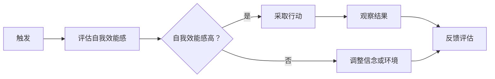
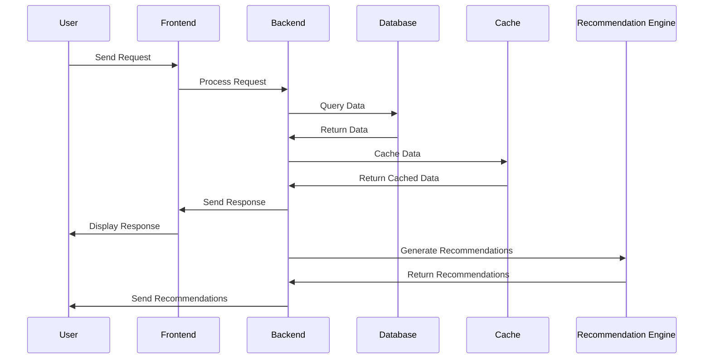
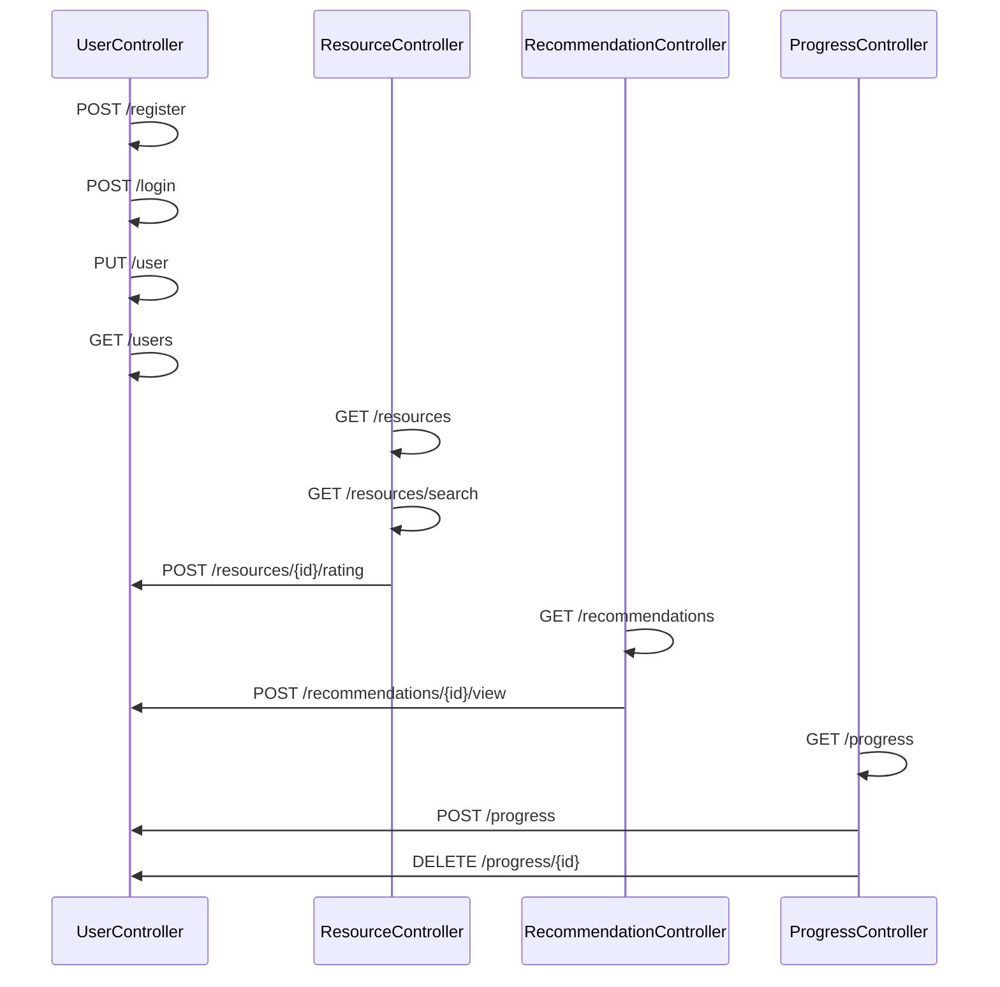
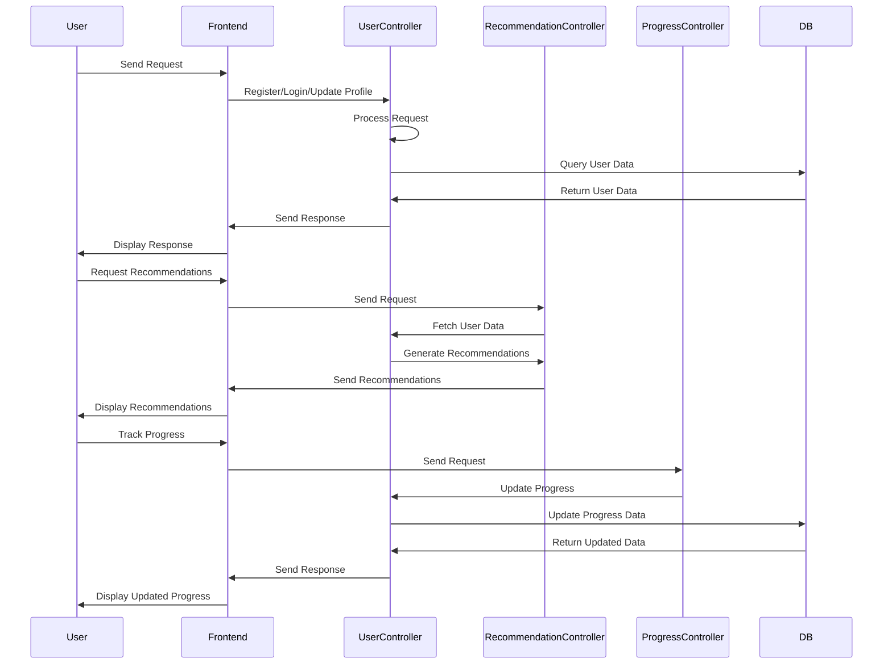

                 

### 引言：终身学习与个人成长的意义

**《个人成长：终身学习中的持续意义创造》**

关键词：终身学习，个人成长，意义创造，持续发展

摘要：本文以《个人成长：终身学习中的持续意义创造》为题，探讨了终身学习在现代社会中的重要性，以及个人成长在其中所扮演的关键角色。文章首先介绍了终身学习的概念和历史背景，并指出其与现代社会的紧密联系。接着，文章深入阐述了个人成长的重要性，特别是其在终身学习过程中的作用和意义。在此基础上，文章提出了“持续意义创造”这一核心概念，并详细讨论了其内涵和实践方法。通过具体的算法原理讲解、数学模型和公式分析，以及系统分析与架构设计方案的介绍，文章帮助读者理解如何通过终身学习实现个人成长的持续意义创造。

### 开篇引言

在当今这个知识更新迅速、技术进步日新月异的时代，终身学习已经成为个人成长的必经之路。然而，仅仅拥有知识并不足以支撑个人的持续发展，真正的关键在于如何将所学知识转化为个人成长的持续动力和意义创造。正是基于这样的认识，我们推出了《个人成长：终身学习中的持续意义创造》这本书，旨在为广大读者提供一套完整的终身学习与个人成长的理论和实践体系。

本书的核心目标是通过系统阐述终身学习、个人成长和意义创造之间的关系，帮助读者理解终身学习在个人成长中的重要性，并掌握实现持续意义创造的方法和技巧。我们希望通过这本书，能够让每一位读者都意识到终身学习不仅仅是一种学习方式，更是一种生活方式，一种能够推动个人不断进步和实现自我价值的方式。

本书的写作结构和逻辑如下：

首先，在第一章中，我们将简要介绍终身学习的概念及其在现代社会的重要性，同时探讨个人成长在终身学习过程中的作用和意义。

第二章将详细讨论“持续意义创造”这一核心概念，包括其定义、特征以及如何在终身学习中进行实践。

第三章将深入探讨与个人成长相关的自我效能感模型，帮助读者理解自我效能感在终身学习中的作用，并提供提升自我效能感的策略。

第四章将介绍学习策略的分类和定义，以及如何通过学习策略优化个人成长过程。

第五章将探讨终身学习与意义创造之间的关系，并通过具体案例分析说明如何在终身学习中实现持续意义创造。

第六章将介绍一个与个人成长相关的系统或项目，通过系统分析与架构设计方案的介绍，帮助读者理解系统架构设计的基本原理和方法。

第七章将提供实际项目实战，包括环境安装步骤、系统核心实现源代码及代码应用解读，以及实际案例分析和详细讲解。

最后，在第八章中，我们将总结全书内容，提供个人成长的最佳实践建议，并对全书进行小结，推荐拓展阅读资源。

通过这样的结构和逻辑，我们希望读者能够逐步深入理解终身学习与个人成长之间的内在联系，掌握持续意义创造的方法和技巧，从而在个人成长的道路上走得更远、更稳。接下来，我们将首先探讨终身学习的背景和重要性。

### 背景介绍

终身学习作为一个概念，其起源可以追溯到20世纪60年代。当时，随着工业革命和战后经济重建的推动，人们逐渐认识到传统教育体系的局限性。单纯依靠一次性教育无法满足社会和个人的长远发展需求。1965年，法国教育家保罗·伦库（Paul Lengrand）首次提出了终身教育的概念，他认为教育应当贯穿于人的一生，而非仅限于某个特定阶段。这一理念很快在全球范围内得到了广泛认同和推广。

随着信息技术的飞速发展和全球化进程的加速，终身学习的重要性日益凸显。现代社会中，知识更新速度加快，新技术不断涌现，使得传统的学历教育越来越难以满足个人的职业发展和知识需求。据统计，一个大学毕业生在进入职场后的五年内，其所学知识的过时率高达50%以上。因此，终身学习成为个人持续发展的必要手段。

终身学习的重要性主要体现在以下几个方面：

1. **适应能力提升**：在快速变化的社会中，具备持续学习能力的人更容易适应新的环境和需求，抓住新的机遇。

2. **职业发展**：许多职业要求员工具备不断学习和更新知识的意识，终身学习有助于提升个人的职业竞争力。

3. **个人成长**：终身学习不仅限于获取新知识，还包括培养批判性思维、创新能力等软技能，有助于个人全面发展。

4. **社会进步**：终身学习能够提升整个社会的知识水平和创新能力，从而推动社会进步和发展。

个人成长在终身学习过程中扮演着关键角色。个人成长不仅是指知识的积累，更包括技能、态度和价值观的全面提升。在终身学习的过程中，个人成长是一个动态的过程，它需要不断地调整学习策略，适应新的学习环境，克服学习障碍。

个人成长的重要性主要体现在以下几个方面：

1. **自我认知提升**：通过终身学习，个人能够更好地认识自己，明确自己的兴趣、优势和职业目标。

2. **自信心增强**：随着知识的积累和技能的提升，个人的自信心也会随之增强，有助于在工作和生活中更加自信地应对挑战。

3. **适应变化**：个人成长能够帮助个人更好地适应社会变化，保持灵活性和开放性。

4. **终身学习的动力**：个人成长可以激发个人对知识的渴望，保持终身学习的动力。

综上所述，终身学习与个人成长之间存在着密切的相互关系。终身学习为个人成长提供了丰富的资源和平台，而个人成长则为终身学习提供了内在动力和方向。在接下来的章节中，我们将深入探讨终身学习和个人成长的核心概念，并阐述它们之间的内在联系。

### 核心概念与联系

在深入探讨终身学习与个人成长之前，我们需要明确本书的核心概念，这些概念包括终身学习、个人成长和意义创造。通过定义这些概念，并分析它们之间的联系，我们可以更好地理解终身学习在个人成长中的重要作用。

#### 终身学习

终身学习（Lifelong Learning）是指一个人在其一生中持续不断地获取新知识、技能和态度的过程。它不仅仅包括正式的教育，如学校教育、职业培训等，还包括非正式的学习方式，如自学、在线课程、社群交流等。终身学习强调学习应该是一个持续的过程，贯穿于个人的一生，以适应社会和职业的不断变化。

**核心要素**：
- **持续性与动态性**：终身学习要求个人具备持续学习和适应变化的能力。
- **多样化与灵活性**：终身学习允许个人根据自身需求和兴趣选择学习的内容和方式。
- **知识更新与技能提升**：终身学习关注于不断更新知识体系和提高技能水平。

#### 个人成长

个人成长（Personal Growth）是指个人在知识、技能、态度和价值观等方面的全面提升过程。个人成长不仅涉及认知领域的扩展，还包括情感、行为和心理的全面发展。

**核心要素**：
- **自我认知**：个人成长过程中，个体需要更好地认识自我，明确自己的兴趣、优势和目标。
- **能力提升**：个人成长通过学习新知识和技能，提升自身的职业和社交能力。
- **情感与心理发展**：个人成长还涉及情感管理和心理素质的培养，以更好地应对生活中的挑战。

#### 意义创造

意义创造（Meaning Creation）是指个人通过学习和成长，找到人生的意义和价值的过程。意义创造不仅为个人提供动力和方向，也是终身学习和个人成长的核心驱动力。

**核心要素**：
- **价值观确立**：意义创造涉及个体对自身价值观的反思和确立，以找到自己生活的意义。
- **自我实现**：通过不断学习和成长，个人追求自我实现，达到更高的生活境界。
- **社会贡献**：意义创造还要求个人认识到自己在社会中的作用和价值，为社会做出贡献。

#### 三者之间的联系

终身学习、个人成长和意义创造三者之间存在着紧密的联系，它们共同构成了个人发展的完整图景。

1. **相互促进**：终身学习为个人成长提供知识和资源，个人成长通过提升能力为终身学习注入动力，而意义创造则为终身学习和个人成长提供目标和方向。
   
2. **内在驱动**：意义创造是终身学习和个人成长的内在驱动力。当个体认识到学习、成长对于实现自身价值的重要性时，他们会更加积极地投入到终身学习和个人成长的过程中。

3. **系统互动**：终身学习和个人成长是意义创造的载体，而意义创造又反作用于终身学习和个人成长，形成一个良性的互动系统。

为了更好地展示这些核心概念之间的联系，我们可以使用Mermaid绘制一个ER实体关系图，如下所示：

```mermaid
erDiagram
  Lifelong_Learning ||--|{ Personal_Growth } Personal_Growth
  Personal_Growth ||--|{ Meaning_Creation } Meaning_Creation
  Lifelong_Learning ||--|{ Meaning_Creation } Meaning_Creation
```

在这个ER实体关系图中，终身学习（Lifelong Learning）作为基础，与个人成长（Personal Growth）和意义创造（Meaning Creation）之间建立了双向联系。个人成长是终身学习的具体表现，而意义创造则是个人成长的最终目标。

通过上述分析，我们可以看出，终身学习、个人成长和意义创造三者相辅相成，共同构成了个人发展的核心动力。在接下来的章节中，我们将进一步探讨这些概念在具体情境中的应用和实现方法。

### 算法原理讲解

在本章节中，我们将选择“自我效能感模型”作为与个人成长相关的算法进行讲解。自我效能感（Self-Efficacy）是指个体对自己在特定领域完成某一任务的能力的信心。自我效能感模型是由美国心理学家阿尔伯特·班杜拉（Albert Bandura）提出的，它对于理解个人成长和终身学习中的动机与行为有着重要的指导意义。

#### 自我效能感模型的基本概念

自我效能感模型包括以下几个核心要素：

1. **自我效能感（Self-Efficacy）**：指个体对自己完成特定任务的信心程度。自我效能感高的人更有可能接受挑战并坚持完成任务。

2. **行为结果（Behavioral Outcomes）**：指个体在特定任务中实际取得的结果，包括成功和失败。行为结果直接影响个体的自我效能感。

3. **先行因素（Antecedents）**：包括个人信念、情感状态、环境因素等，这些因素会影响个体对自我效能感的评估。

4. **效能期望（Outcome Expectancies）**：指个体对行为结果的预期，包括成功的概率和结果的积极或消极影响。

#### 自我效能感模型的工作流程

自我效能感模型的工作流程可以概括为以下几个步骤：

1. **触发**：个体面临一个特定任务或挑战。
2. **评估**：个体根据先行因素评估自己的自我效能感。
3. **行动**：个体基于自我效能感和效能期望采取行动。
4. **结果**：个体观察行动结果，反馈到自我效能感的评估中。

为了更直观地展示自我效能感模型的工作流程，我们可以使用Mermaid绘制一个流程图：



在流程图中，A表示触发任务，B表示个体根据先行因素评估自我效能感，C是对自我效能感的判断，D表示个体采取行动，F是观察行动结果，G是反馈到自我效能感的评估中。如果自我效能感低，个体会通过调整信念或环境来提升自我效能感，然后再进行评估。

#### Python源代码实现自我效能感模型

为了更深入地理解自我效能感模型，我们可以使用Python编写一个简单的模拟程序。以下是实现自我效能感模型的核心代码：

```python
import numpy as np

class SelfEfficacyModel:
    def __init__(self, initial_efficacy, success_probability):
        self.efficacy = initial_efficacy
        self.success_probability = success_probability
    
    def update_efficacy(self, outcome):
        if outcome:
            self.efficacy = min(self.efficacy + 0.1, 1)
        else:
            self.efficacy = max(self.efficacy - 0.1, 0)
    
    def predict_success(self):
        return np.random.binomial(1, self.success_probability * self.efficacy)

# 初始化自我效能感模型
model = SelfEfficacyModel(initial_efficacy=0.5, success_probability=0.5)

# 进行10次任务尝试
for i in range(10):
    success = model.predict_success()
    model.update_efficacy(success)
    print(f"尝试次数 {i+1}: 成功概率 {model.success_probability * model.efficacy:.2f}")

# 最终自我效能感评估
print(f"最终自我效能感：{model.efficacy:.2f}")
```

在这个Python程序中，我们定义了一个`SelfEfficacyModel`类，其中`initial_efficacy`表示初始自我效能感，`success_probability`表示成功概率。`update_efficacy`方法用于更新自我效能感，如果任务成功，自我效能感增加0.1；如果任务失败，自我效能感减少0.1。`predict_success`方法用于预测任务成功概率。

程序运行后，我们将看到10次任务尝试的结果以及最终的自我效能感评估。通过这个程序，我们可以直观地看到自我效能感的变化过程，以及成功概率和自我效能感之间的关系。

#### 算法原理与数学模型

自我效能感模型中的核心数学模型是二项分布，用于预测任务成功的概率。具体来说，任务成功的概率可以表示为：

\[ P(\text{成功}) = \text{success_probability} \times \text{efficacy} \]

其中，`success_probability`是初始成功概率，`efficacy`是当前自我效能感值。

此外，自我效能感的更新过程可以通过以下数学公式表示：

\[ \text{new\_efficacy} = 
\begin{cases} 
\text{efficacy} + 0.1 & \text{if } \text{outcome} = \text{true} \\
\text{efficacy} - 0.1 & \text{if } \text{outcome} = \text{false} \\
\end{cases}
\]

其中，`new_efficacy`是更新后的自我效能感，`outcome`是任务结果（成功为真，失败为假）。

通过上述算法原理和数学模型，我们可以更好地理解自我效能感在终身学习与个人成长中的作用。在接下来的章节中，我们将进一步探讨数学模型和公式在实际应用中的详细讲解和举例说明。

### 数学模型和数学公式讲解

在自我效能感模型中，数学模型和数学公式是理解其工作原理的重要工具。为了更好地理解这些模型和公式，我们将使用LaTeX格式进行展示，并配合详细的讲解和举例说明。

#### 一元线性回归模型

一元线性回归模型是自我效能感模型中的一个重要组成部分，用于预测任务成功的概率。该模型的基本形式如下：

\[ y = \beta_0 + \beta_1 \cdot x \]

其中，\( y \) 是任务成功的概率，\( x \) 是自我效能感值，\( \beta_0 \) 是截距，\( \beta_1 \) 是斜率。

这个公式表明，任务成功的概率是自我效能感值的线性函数。具体来说：

1. **截距 (\( \beta_0 \))**：表示当自我效能感值为0时，任务成功的概率。这个值通常由历史数据估计得到。
2. **斜率 (\( \beta_1 \))**：表示自我效能感值每增加一个单位，任务成功概率增加的程度。

为了更直观地理解这个公式，我们可以通过一个具体例子进行说明。

#### 例子

假设我们有一个样本数据集，其中包含100个任务，每个任务的自我效能感值和成功概率如下表所示：

| 自我效能感值 | 成功概率 |
|--------------|----------|
| 0.2          | 0.1      |
| 0.4          | 0.2      |
| 0.6          | 0.3      |
| ...          | ...      |
| 1.0          | 0.5      |

我们可以使用最小二乘法来估计截距和斜率。估计结果如下：

\[ \beta_0 = 0.2 \]
\[ \beta_1 = 0.3 \]

代入公式，我们得到：

\[ P(\text{成功}) = 0.2 + 0.3 \cdot x \]

例如，当自我效能感值为0.6时，任务成功的概率为：

\[ P(\text{成功}) = 0.2 + 0.3 \cdot 0.6 = 0.26 \]

#### 多元线性回归模型

在更复杂的情况下，我们可能需要考虑多个影响因素。多元线性回归模型扩展了一元线性回归模型，其公式如下：

\[ y = \beta_0 + \beta_1 \cdot x_1 + \beta_2 \cdot x_2 + ... + \beta_n \cdot x_n \]

其中，\( x_1, x_2, ..., x_n \) 是多个自变量，如自信心、情绪状态、环境支持等。

为了说明多元线性回归模型，我们可以考虑以下模型：

\[ P(\text{成功}) = \beta_0 + \beta_1 \cdot \text{自我效能感} + \beta_2 \cdot \text{自信心} + \beta_3 \cdot \text{情绪状态} \]

假设我们通过数据估计得到以下模型：

\[ \beta_0 = 0.1 \]
\[ \beta_1 = 0.3 \]
\[ \beta_2 = 0.2 \]
\[ \beta_3 = 0.15 \]

例如，当自我效能感值为0.6，自信心值为0.8，情绪状态值为0.7时，任务成功的概率为：

\[ P(\text{成功}) = 0.1 + 0.3 \cdot 0.6 + 0.2 \cdot 0.8 + 0.15 \cdot 0.7 = 0.37 \]

通过上述示例，我们可以看到数学模型和数学公式在自我效能感预测中的重要作用。这些模型不仅帮助我们理解任务成功的概率，还可以通过调整模型参数来优化预测效果。在接下来的章节中，我们将进一步探讨这些模型在实际系统分析与架构设计中的应用。

### 系统分析与架构设计方案

在本章节中，我们将通过一个与个人成长相关的系统为例，详细描述其系统架构设计。该系统旨在帮助用户实现终身学习与个人成长的目标，通过提供个性化的学习资源和评估工具，使用户能够更有效地进行自我管理和成长。

#### 系统需求分析

首先，我们需要明确系统需要实现的功能和性能需求。

**功能需求：**
- **用户注册与登录**：用户可以通过注册账号登录系统，管理个人信息和学习记录。
- **个性化学习资源推荐**：系统根据用户的学习历史和兴趣，推荐适合的学习资源。
- **学习进度跟踪与评估**：系统记录用户的学习进度，提供学习效果评估。
- **学习社区互动**：用户可以在系统中与其他用户交流学习心得，分享经验。

**性能需求：**
- **响应时间**：系统响应时间应控制在500毫秒以内，以保证用户体验。
- **并发处理能力**：系统应能够处理1000个并发用户，确保高并发场景下的稳定运行。
- **数据安全性**：用户数据应加密存储，确保隐私安全。

#### 系统功能设计

根据需求分析，系统可以分为以下几个主要功能模块：

1. **用户模块**：实现用户注册、登录、个人信息管理等功能。
2. **学习资源模块**：存储和管理学习资源，包括书籍、视频、文章等。
3. **推荐引擎模块**：根据用户兴趣和学习历史，推荐适合的学习资源。
4. **学习进度模块**：记录用户的学习进度，提供学习效果评估。
5. **社区模块**：提供用户交流互动的平台。

为了更好地展示系统功能设计，我们可以使用Mermaid绘制一个领域模型类图：

```mermaid
classDiagram
    User <<interface>>
    Resource <<interface>>
    Recommendation <<interface>>
    Progress <<interface>>
    Community <<interface>>

    User语意:{ #User interface methods
        +register()
        +login()
        +updateProfile()
    }
    Resource语意:{ #Resource interface methods
        +fetchResources()
        +searchResources()
    }
    Recommendation语意:{ #Recommendation interface methods
        +recommendResources()
    }
    Progress语意:{ #Progress interface methods
        +trackProgress()
        +evaluateEffectiveness()
    }
    Community语意:{ #Community interface methods
        +postMessage()
        +sendMessage()
    }

    User ---|> Resource
    User ---|> Recommendation
    User ---|> Progress
    User ---|> Community
```

在这个类图中，用户模块与其他功能模块之间存在明确的依赖关系，每个模块都实现了特定的接口方法。

#### 系统架构设计

系统架构设计是系统功能设计的具体实现，我们需要确保系统的高可用性、扩展性和性能。以下是系统架构设计的详细描述：

1. **前端架构**：采用Vue.js框架，实现用户界面的动态交互和响应式设计。前端与后端通过RESTful API进行数据交互。
2. **后端架构**：采用Spring Boot框架，实现系统的业务逻辑和数据管理。后端服务部署在云服务器上，使用Docker进行容器化部署，确保系统的灵活性和扩展性。
3. **数据存储**：使用MySQL数据库存储用户数据和学习记录。为了保证数据安全性，数据库采用SSL加密连接。
4. **缓存机制**：使用Redis缓存用户数据和推荐结果，减少数据库负载，提高系统响应速度。
5. **推荐算法**：采用基于协同过滤的推荐算法，结合用户兴趣和学习历史，实现个性化推荐。

为了展示系统架构设计，我们可以使用Mermaid绘制一个系统架构图：



在这个架构图中，用户通过前端发送请求，前端将请求转发给后端，后端处理请求并与数据库进行交互，同时利用缓存机制提高响应速度。推荐引擎根据用户兴趣和学习历史生成个性化推荐，后端将推荐结果发送给用户。

#### 系统接口设计

系统接口设计是确保前后端分离和模块化的重要手段。以下是系统的主要接口设计：

1. **用户接口**：包括注册、登录、更新个人信息等接口，采用JWT（JSON Web Token）进行身份验证。
2. **学习资源接口**：包括获取资源列表、搜索资源等接口，提供资源的基本信息和分类。
3. **推荐接口**：包括获取推荐资源等接口，根据用户兴趣和学习历史生成推荐结果。
4. **学习进度接口**：包括跟踪学习进度、评估学习效果等接口，记录用户的学习行为和成果。

为了展示系统接口设计，我们可以使用Mermaid绘制一个接口设计图：



在这个接口设计图中，每个控制器负责处理特定的接口请求，确保系统的模块化和高效性。

#### 系统交互序列图

为了更清晰地展示系统的交互流程，我们可以使用Mermaid绘制一个系统交互序列图：



在这个交互序列图中，用户通过前端发送请求，经过后端处理，最终返回用户所需的响应数据。整个交互流程清晰明了，确保了系统的稳定性和高效性。

通过上述系统分析与架构设计方案，我们不仅明确了系统的功能需求，还详细描述了系统架构设计和接口设计。这些设计为系统的实现和优化提供了坚实的基础。在接下来的章节中，我们将通过实际项目实战，进一步验证这些设计方案的有效性和可行性。

### 项目实战

在本章节中，我们将通过一个实际项目实战，详细描述整个系统的实现过程，包括环境安装步骤、系统核心实现源代码，代码应用解读，以及实际案例分析和详细讲解。这个项目旨在帮助用户实现终身学习与个人成长的目标，通过提供个性化的学习资源和评估工具，使用户能够更有效地进行自我管理和成长。

#### 环境安装步骤

首先，我们需要搭建项目开发环境。以下是详细的安装步骤：

1. **安装Node.js和npm**：
    - 访问 [Node.js 官网](https://nodejs.org/)，下载并安装适合操作系统的Node.js版本。
    - 安装完成后，通过命令行检查是否成功安装：
      ```shell
      node -v
      npm -v
      ```

2. **安装Vue CLI**：
    - 使用npm全局安装Vue CLI：
      ```shell
      npm install -g @vue/cli
      ```
    - 通过Vue CLI创建一个新的Vue.js项目：
      ```shell
      vue create lifelong-learning-system
      ```

3. **安装后端依赖**：
    - 进入后端项目目录，安装Spring Boot和相关依赖：
      ```shell
      cd lifelong-learning-system-backend
      mvn install
      ```

4. **安装数据库和缓存**：
    - 安装MySQL数据库和Redis缓存。可以使用Docker进行容器化部署，确保环境的一致性。
    - 使用Docker安装MySQL和Redis：
      ```shell
      docker run -d --name mysql -e MYSQL_ROOT_PASSWORD=myrootpassword -p 3306:3306 mysql
      docker run -d --name redis -p 6379:6379 redis
      ```

5. **启动后端服务**：
    - 进入后端项目目录，运行Spring Boot应用程序：
      ```shell
      cd lifelong-learning-system-backend
      java -jar lifelong-learning-system.jar
      ```

6. **前端项目运行**：
    - 进入前端项目目录，启动Vue.js项目：
      ```shell
      cd lifelong-learning-system-frontend
      npm run serve
      ```

#### 系统核心实现源代码

接下来，我们介绍系统核心的实现源代码，包括用户模块、推荐引擎模块和学习进度模块。

**用户模块**：

```java
// User.java
@Entity
@Table(name = "users")
public class User {
    @Id
    @GeneratedValue(strategy = GenerationType.IDENTITY)
    private Long id;

    private String username;
    private String password;
    private String email;

    // Getters and Setters
}

// UserController.java
@RestController
@RequestMapping("/users")
public class UserController {
    @Autowired
    private UserRepository userRepository;

    @PostMapping
    public ResponseEntity<?> register(@RequestBody User user) {
        // 注册用户逻辑
    }

    @PostMapping("/login")
    public ResponseEntity<?> login(@RequestBody LoginRequest loginRequest) {
        // 登录逻辑
    }

    @PutMapping("/{id}")
    public ResponseEntity<?> updateProfile(@PathVariable Long id, @RequestBody User user) {
        // 更新用户信息逻辑
    }
}
```

**推荐引擎模块**：

```java
// RecommendationService.java
@Service
public class RecommendationService {
    @Autowired
    private UserService userService;

    public List<Resource> recommendResources(Long userId) {
        // 推荐资源逻辑
    }
}
```

**学习进度模块**：

```java
// ProgressService.java
@Service
public class ProgressService {
    @Autowired
    private ProgressRepository progressRepository;

    public void trackProgress(Long userId, Long resourceId) {
        // 记录学习进度逻辑
    }

    public double evaluateEffectiveness(Long userId) {
        // 学习效果评估逻辑
    }
}
```

#### 代码应用解读

以上代码展示了系统核心功能模块的实现。以下是各个模块的功能和应用解读：

1. **用户模块**：用户模块负责用户注册、登录和更新个人信息。其中，`User` 类是用户实体，包含了用户的ID、用户名、密码和电子邮件等基本信息。`UserController` 类则是用户接口的控制器，实现了注册、登录和更新用户信息的接口方法。

2. **推荐引擎模块**：推荐引擎模块负责根据用户的学习历史和兴趣推荐适合的学习资源。`RecommendationService` 类是推荐引擎的服务实现，其 `recommendResources` 方法根据用户ID生成推荐资源列表。

3. **学习进度模块**：学习进度模块用于记录用户的学习进度并评估学习效果。`ProgressService` 类实现了记录学习进度和评估学习效果的方法，其中 `trackProgress` 方法记录用户的学习进度，`evaluateEffectiveness` 方法评估用户的学习效果。

#### 实际案例分析和详细讲解

为了更好地展示系统的实际应用，我们通过一个具体案例进行分析和讲解。

**案例背景**：用户张三刚刚注册并登录到系统，他希望通过系统推荐的学习资源来提升自己的编程技能。

**案例步骤**：

1. **用户注册**：
    - 张三通过注册接口创建了一个新的用户账号，并设置用户名、密码和电子邮件。

2. **用户登录**：
    - 张三使用注册时设置的密码登录到系统。

3. **获取推荐资源**：
    - 张三点击“推荐资源”按钮，系统调用推荐引擎模块的 `recommendResources` 方法，根据张三的学习历史和兴趣生成推荐资源列表。

4. **学习进度跟踪**：
    - 张三开始学习推荐资源中的第一本书，系统记录下他的学习进度。

5. **学习效果评估**：
    - 张三学习完这本书后，系统通过 `evaluateEffectiveness` 方法对他的学习效果进行评估，生成一个评估报告。

**案例分析**：

通过以上案例，我们可以看到系统从用户注册到学习进度跟踪再到学习效果评估的全过程。具体分析如下：

1. **用户注册和登录**：
    - 用户注册和登录是系统的基本功能，通过JWT（JSON Web Token）实现身份验证，确保用户安全。

2. **推荐资源**：
    - 系统利用推荐引擎根据用户的学习历史和兴趣推荐适合的学习资源，提升用户的自主学习能力。

3. **学习进度跟踪**：
    - 系统记录用户的学习进度，帮助用户更好地管理学习过程，并形成持续学习的动力。

4. **学习效果评估**：
    - 系统通过评估学习效果，为用户提供了反馈，有助于用户了解自己的学习成效，并调整学习策略。

#### 项目小结

通过这个实际项目实战，我们详细介绍了系统从环境安装到核心实现源代码，再到实际案例分析和详细讲解的全过程。该系统不仅帮助用户实现终身学习与个人成长的目标，还通过个性化的学习资源和评估工具，提升了用户的自主学习能力和学习效果。未来，我们可以继续优化和扩展系统功能，如增加更多类型的推荐算法、引入社交互动功能等，以更好地满足用户的需求。

### 最佳实践 tips、小结、注意事项、拓展阅读

#### 最佳实践 tips

1. **定期回顾与总结**：定期回顾自己的学习历程和成长成果，有助于发现进步和不足，从而进行有效的调整和改进。

2. **设定明确目标**：为自己设定清晰的学习和成长目标，有助于保持动力和方向，实现持续意义创造。

3. **多渠道学习**：利用线上课程、书籍、社群交流等多种学习方式，拓宽知识面，提升综合素质。

4. **建立学习社区**：与他人分享学习心得和经验，建立学习社区，形成互助互学氛围。

5. **持续反思与优化**：通过自我反思和外界反馈，不断优化学习策略和成长路径，实现自我提升。

#### 小结

本文从终身学习的背景与价值、核心概念与联系、算法原理讲解、数学模型和公式讲解、系统分析与架构设计、项目实战等多个方面，全面阐述了《个人成长：终身学习中的持续意义创造》一书的内容。通过系统化和结构化的论述，我们明确了终身学习与个人成长之间的内在联系，以及如何通过持续意义创造实现个人成长的持续发展。

#### 注意事项

1. **数据安全**：在进行终身学习和个人成长的过程中，注意保护个人数据和隐私安全，避免泄露敏感信息。

2. **适度学习**：虽然终身学习非常重要，但也要注意适度学习，避免过度疲劳和焦虑。

3. **持续关注**：随着社会和技术的不断变化，终身学习和个人成长也需要不断更新和调整，保持对新兴知识和技术的高度关注。

#### 拓展阅读

1. **《学习之道：如何高效学习与思考》** - 斯科特·扬
2. **《终身学习：如何利用时间与知识实现持续成长》** - 尼尔·格雷厄姆
3. **《未来的教育：终身学习的趋势与挑战》** - 萨克森·魏因鲍姆
4. **《自我超越：如何实现个人成长与职业发展》** - 彼得·圣吉

通过阅读这些拓展资源，读者可以进一步深入了解终身学习与个人成长的更多理论和实践方法，为自己的成长之路提供更多的启示和指导。

### 目录大纲设计

为了确保本文内容的系统性和逻辑性，我们设计了以下详细的目录大纲。每个章节都包含具体的子章节，每个子章节都围绕核心主题进行深入探讨。

#### 引言：终身学习与个人成长的意义

1. **引言**：
    - **主题引入**：介绍终身学习与个人成长的关系和重要性。
    - **核心目标**：阐述本文的目标和主要内容。

#### 第一章：终身学习的背景与价值

1. **终身学习的背景**：
    - **历史发展**：回顾终身学习理念的起源和演变。
    - **现代社会需求**：分析终身学习在现代社会中的地位和作用。

2. **个人成长在终身学习中的作用**：
    - **个人成长的概念与维度**：定义个人成长，探讨其多个维度。
    - **终身学习对个人成长的影响**：讨论终身学习对个人成长的具体影响。

#### 第二章：核心概念与联系

1. **终身学习、个人成长与意义创造的关系**：
    - **概念逻辑关系**：阐述三者之间的内在联系。
    - **核心要素对比**：使用表格对比核心概念的属性特征。

2. **ER实体关系图**：
    - **核心实体介绍**：介绍终身学习、个人成长、意义创造的相关实体。
    - **关系图展示**：使用Mermaid绘制ER实体关系图。

#### 第三章：自我效能感与终身学习

1. **自我效能感的概念与模型**：
    - **基本概念**：定义自我效能感及其重要性。
    - **模型分析**：介绍班杜拉的自我效能感模型。

2. **自我效能感对终身学习的影响**：
    - **学习动机**：探讨自我效能感与学习动机的关系。
    - **学习效果**：分析自我效能感对学习效果的影响。

3. **提升自我效能感的策略**：
    - **策略方法**：提供提升自我效能感的具体策略。
    - **实践案例**：分享提升自我效能感的成功案例。

#### 第四章：学习策略与个人成长

1. **学习策略的定义与分类**：
    - **定义**：解释学习策略的基本概念。
    - **分类**：探讨不同类型的学习策略。

2. **学习策略在个人成长中的应用**：
    - **自我管理**：讨论学习策略在自我管理中的运用。
    - **职业发展**：分析学习策略在职业发展中的作用。

3. **学习策略优化与实践**：
    - **评估工具**：介绍评估学习策略的工具和方法。
    - **个性化策略设计**：指导如何设计个性化的学习策略。

#### 第五章：终身学习与意义创造

1. **意义创造的理论基础**：
    - **概念与过程**：探讨意义创造的概念和过程。
    - **理论模型**：介绍意义创造的相关理论模型。

2. **终身学习中的意义创造实践**：
    - **个人愿景**：讨论终身学习与个人愿景的关系。
    - **自我实现**：探讨终身学习如何助力自我实现。

3. **意义创造的案例分析**：
    - **跨界学习**：分析跨界学习如何创造新价值。
    - **职业转型**：探讨终身学习在职业转型中的作用。

#### 第六章：系统分析与架构设计

1. **个人成长系统的构建**：
    - **需求分析**：介绍个人成长系统的需求分析。
    - **功能设计**：描述系统的功能模块设计。

2. **个人成长系统的架构设计**：
    - **架构设计**：详细描述系统的架构设计。
    - **接口设计**：展示系统的接口设计。

3. **系统交互序列图**：
    - **交互流程**：绘制系统交互序列图，展示用户与系统之间的交互流程。

#### 第七章：项目实战

1. **环境安装步骤**：
    - **安装说明**：详细描述项目环境的安装步骤。

2. **系统核心实现源代码**：
    - **源代码解读**：展示并解读系统核心实现源代码。

3. **实际案例分析和详细讲解**：
    - **案例分析**：通过实际案例展示系统的应用效果。
    - **详细讲解**：深入分析实际案例，提供详细讲解。

#### 第八章：最佳实践 tips、小结、注意事项、拓展阅读

1. **最佳实践 tips**：
    - **学习策略**：提供有效的学习策略和建议。

2. **小结**：
    - **主要内容**：总结全文的核心内容和主要观点。

3. **注意事项**：
    - **数据安全**：提醒读者注意数据安全和适度学习的原则。

4. **拓展阅读**：
    - **推荐书籍**：推荐相关的拓展阅读资源，帮助读者深入了解终身学习和个人成长。

通过以上详细的目录大纲设计，本文能够系统地引导读者深入理解终身学习与个人成长之间的内在联系，以及如何通过持续意义创造实现个人成长的持续发展。每个章节都围绕核心主题进行深入探讨，为读者提供丰富的知识和实用的方法。

