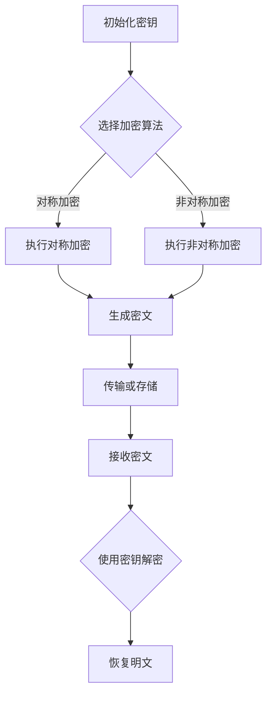
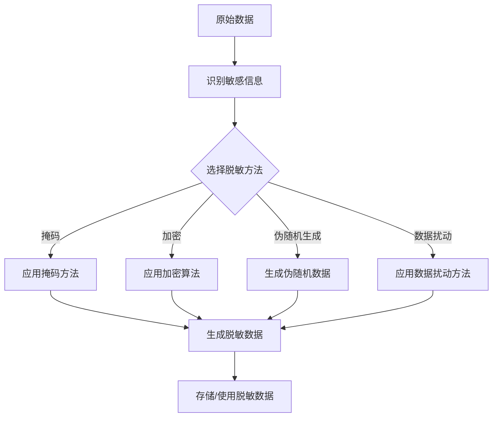
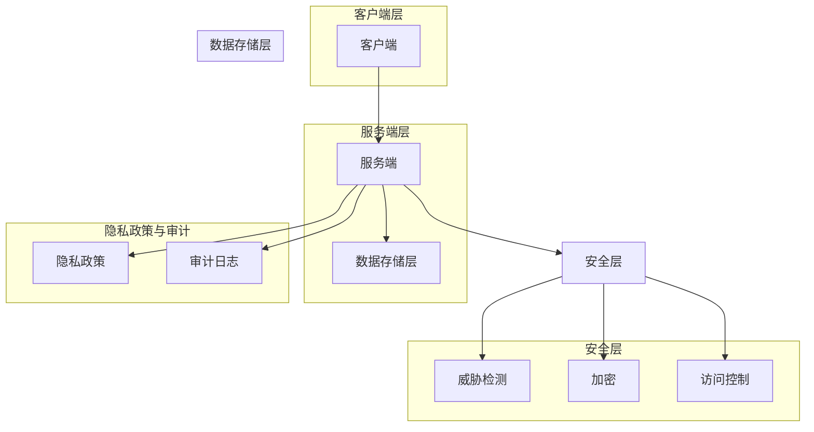
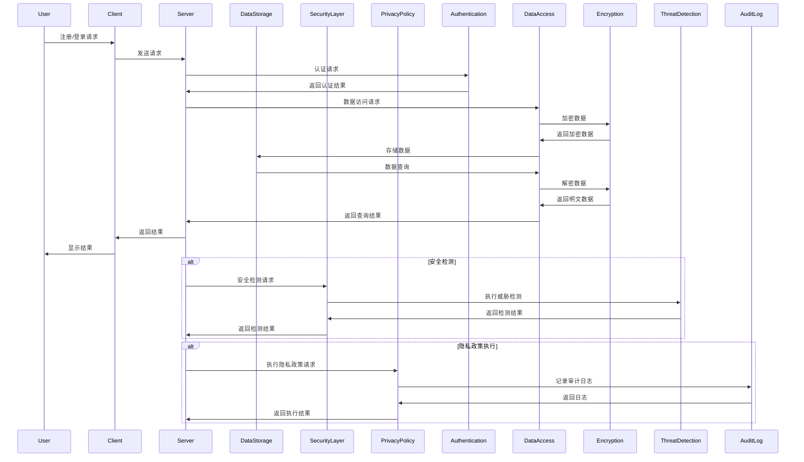

                 

### 文章标题

# 个人隐私：数字时代的自我边界与价值

### 关键词

- 数字时代
- 个人隐私
- 自我边界
- 隐私保护技术
- 隐私管理实践

### 摘要

随着数字时代的到来，个人隐私问题日益凸显，成为全球关注的焦点。本文旨在探讨数字时代个人隐私的挑战、核心概念及其价值，详细分析隐私保护技术的原理和系统设计，并通过具体项目实战和最佳实践总结，为保护个人隐私提供切实可行的解决方案。通过一步步的逻辑推理，本文将帮助读者深入理解个人隐私的复杂性及其在现代社会中的重要地位。

---

### 目录大纲

- [第一部分：数字时代个人隐私概述](#第一部分-数字时代个人隐私概述)
  - [1.1 引言](#11-引言)
  - [1.2 核心概念](#12-核心概念)
  - [1.3 Mermaid ER实体关系图](#13-Mermaid-ER实体关系图)
- [第二部分：隐私保护技术原理](#第二部分-隐私保护技术原理)
  - [2.1 加密技术](#21-加密技术)
  - [2.2 同源策略与跨域请求](#22-同源策略与跨域请求)
  - [2.3 数据脱敏技术](#23-数据脱敏技术)
- [第三部分：隐私保护系统设计与实现](#第三部分-隐私保护系统设计与实现)
  - [3.1 隐私保护系统场景](#31-隐私保护系统场景)
  - [3.2 系统架构设计](#32-系统架构设计)
  - [3.3 项目实战](#33-项目实战)
- [第四部分：隐私管理实践与最佳策略](#第四部分-隐私管理实践与最佳策略)
  - [4.1 隐私管理策略](#41-隐私管理策略)
  - [4.2 隐私保护最佳实践](#42-隐私保护最佳实践)
  - [4.3 小结与展望](#43-小结与展望)

### 1.1 引言

### 1.1.1 数字时代的隐私挑战

数字时代的到来，使我们的生活发生了翻天覆地的变化。然而，这一变化也带来了前所未有的隐私挑战。首先，互联网的普及使得信息传播速度极快，个人隐私被轻易地暴露在公众视野之中。无论是社交媒体上的个人信息，还是在线购物、金融服务等场景中产生的数据，都有可能成为隐私泄露的风险。

其次，随着大数据和人工智能技术的发展，数据收集和分析的能力日益增强。企业通过收集用户的数据来提供个性化的服务，但这也意味着个人隐私更容易受到侵犯。例如，通过分析用户的浏览记录、购物习惯等，企业可以推测出用户的个人信息，从而进行精准营销。这种看似便捷的服务背后，却隐藏着巨大的隐私风险。

此外，网络安全问题的日益严峻也是数字时代隐私挑战的一部分。黑客攻击、网络钓鱼等手段层出不穷，使得个人隐私面临被窃取、篡改甚至滥用的风险。这些隐私泄露事件不仅给个人带来了经济损失，还可能对其社会信用和个人声誉造成不可逆转的影响。

### 1.1.2 个人隐私的重要性

个人隐私的重要性不言而喻。首先，隐私是每个人的基本权利。每个人都有权保护自己的个人信息，不受外部非法访问和滥用。隐私的缺失不仅会侵犯个人的权利，还会损害社会的公平和正义。

其次，个人隐私的泄露可能导致严重的后果。个人信息的泄露可能会导致财产损失、信用受损、社会关系破裂等。例如，恶意分子通过获取用户的身份证号、银行卡信息等，可以进行身份盗用和金融欺诈，给用户带来巨大的经济损失。此外，个人隐私的泄露还可能被用于进行网络犯罪、间谍活动等，对社会安全构成威胁。

最后，个人隐私的保护是构建信任社会的基础。在数字时代，个人隐私的保护已经成为人们信任互联网、电子商务、社交媒体等数字服务的关键因素。只有建立起可靠的隐私保护机制，才能让人们放心使用数字服务，促进数字经济的发展。

### 1.1.3 本书的目的和结构

本书旨在探讨数字时代个人隐私的挑战，分析隐私保护技术的原理和系统设计，并通过具体项目实战和最佳实践总结，为个人隐私保护提供全面的解决方案。全书分为四个部分：

- 第一部分：数字时代个人隐私概述，介绍数字时代个人隐私的挑战、核心概念及其价值。
- 第二部分：隐私保护技术原理，详细分析加密技术、同源策略与跨域请求、数据脱敏技术等隐私保护技术。
- 第三部分：隐私保护系统设计与实现，介绍隐私保护系统的场景、架构设计和具体项目实战。
- 第四部分：隐私管理实践与最佳策略，提供隐私管理策略、最佳实践总结，并对未来的发展趋势进行展望。

通过本书的阅读，读者将能够全面了解数字时代个人隐私的挑战，掌握隐私保护技术的原理和系统设计方法，并能够运用最佳实践策略来保护个人隐私。

### 1.2 核心概念

在探讨数字时代个人隐私问题时，理解以下核心概念至关重要：个人隐私、自我边界和价值。

#### 1.2.1 个人隐私

个人隐私是指个人在心理、生理、社会、经济等各个层面上的私密性，包括但不限于个人信息、行为习惯、健康记录、金融信息等。个人隐私的保护旨在确保个人不受未经授权的访问、使用或泄露。

- **概念定义**：个人隐私是指个人在心理、生理、社会、经济等各个层面上的私密性，涵盖个人信息、行为习惯、健康记录、金融信息等。
- **隐私保护目的**：保护个人不受未经授权的访问、使用或泄露。
- **隐私范围**：包括但不限于个人信息、行为习惯、健康记录、金融信息等。

#### 1.2.2 自我边界

自我边界是指个人在心理和生理层面上的自我保护机制，用于界定个人与他人之间的互动范围。自我边界的建立和维护有助于维护个人隐私，防止个人隐私被侵犯。

- **概念定义**：自我边界是指个人在心理和生理层面上的自我保护机制，用于界定个人与他人之间的互动范围。
- **边界功能**：保护个人不受未经授权的访问、使用或泄露。
- **边界类型**：包括心理边界和物理边界。

#### 1.2.3 价值

个人隐私的价值主要体现在以下几个方面：

- **权利保护**：个人隐私是每个人享有的基本权利，保护个人隐私是维护社会公平和正义的必要条件。
- **信息安全**：个人隐私的泄露可能导致严重的经济损失和声誉损害，因此保护个人隐私是确保信息安全的必要措施。
- **社会信任**：个人隐私的保护是建立社会信任的基础，有助于促进数字经济的发展和社会和谐。

- **概念定义**：个人隐私的价值主要体现在权利保护、信息安全和社会信任等方面。
- **价值体现**：保护个人隐私是维护社会公平和正义的必要条件，是确保信息安全的必要措施，也是建立社会信任的基础。

#### 1.2.4 核心概念联系

个人隐私、自我边界和价值这三个核心概念密切相关：

- **关系描述**：个人隐私是自我边界的基础，自我边界是保护个人隐私的手段，而个人隐私的价值则体现在权利保护、信息安全和社会信任等方面。

通过理解这些核心概念及其联系，我们可以更深入地探讨数字时代个人隐私保护的策略和方法。

### 1.3 Mermaid ER实体关系图

为了更直观地展示个人隐私相关的实体及其关系，我们可以使用Mermaid绘制一个实体关系图（ER图）。以下是一个简化的Mermaid ER图示例，用于描述与个人隐私相关的关键实体和它们之间的关系。

```mermaid
erDiagram
    User ||--o> PersonalData : 拥有
    PersonalData ||--o> DataAccess : 访问
    DataAccess ||--o> PrivacyPolicy : 受隐私政策约束
    PrivacyPolicy ||--o> PrivacyGuard : 保护
```

#### 关键实体说明

- **User（用户）**：代表个人，拥有个人信息和数据。
- **PersonalData（个人数据）**：代表用户的个人信息，包括但不限于身份信息、健康记录、金融信息等。
- **DataAccess（数据访问）**：代表对个人数据的访问权限，包括合法访问和非法访问。
- **PrivacyPolicy（隐私政策）**：代表个人隐私保护的相关规定和政策。
- **PrivacyGuard（隐私保护）**：代表用于保护个人隐私的技术和措施。

#### 关系说明

- **拥有关系（拥有）**：用户拥有自己的个人数据，即User与PersonalData之间是“拥有”关系。
- **访问关系（访问）**：数据访问权限决定了谁可以访问个人数据，即DataAccess与PersonalData之间是“访问”关系。
- **约束关系（受隐私政策约束）**：个人数据访问受隐私政策约束，即DataAccess与PrivacyPolicy之间是“受隐私政策约束”关系。
- **保护关系（保护）**：隐私政策通过隐私保护措施来保护个人隐私，即PrivacyPolicy与PrivacyGuard之间是“保护”关系。

通过这个ER图，我们可以清晰地看到个人隐私相关实体及其之间的关联，这有助于我们更好地理解和分析隐私保护的复杂性和必要性。

### 2.1 加密技术

加密技术是保护个人隐私的重要手段之一，通过将数据转换成无法直接解读的形式，防止未经授权的访问和泄露。本节将详细讨论加密技术的原理、分类及其在隐私保护中的应用。

#### 2.1.1 对称加密与非对称加密

加密技术主要分为对称加密和非对称加密两种。

- **对称加密**：对称加密使用相同的密钥进行加密和解密操作。常见的对称加密算法包括AES（高级加密标准）、DES（数据加密标准）等。对称加密的优点是加密速度快，计算效率高。缺点是密钥的分发和管理较为复杂，不适用于分布式系统。

- **非对称加密**：非对称加密使用一对密钥，即公钥和私钥。公钥用于加密，私钥用于解密。常见的非对称加密算法包括RSA、ECC（椭圆曲线加密）等。非对称加密的优点是解决了密钥分发问题，适用于分布式系统。缺点是加密和解密速度相对较慢。

#### 2.1.2 密码学基础

密码学是研究加密和解密方法的一门学科，其基础包括以下几个方面：

- **加密算法**：加密算法是将明文转换成密文的规则和方法。常见的加密算法有分组密码和流密码。分组密码将明文分成固定长度的块进行加密，如AES；流密码将明文流逐位加密，如ChaCha20。

- **密钥**：密钥是加密和解密的关键参数。对称加密使用相同密钥，非对称加密使用公钥和私钥。密钥的生成和管理是加密系统的关键环节。

- **加密模式**：加密模式决定了加密算法如何应用于具体的数据传输和存储场景。常见的加密模式有电子码本模式（ECB）、密码分组链接模式（CBC）、密码反馈模式（CFB）等。

#### 2.1.3 Mermaid加密算法流程图

为了更直观地展示加密算法的流程，我们可以使用Mermaid绘制一个加密算法的流程图。



#### 2.1.4 Python源代码示例

下面是一个使用Python实现AES对称加密和非对称加密的简单示例。

```python
from Crypto.Cipher import AES, PKCS1_OAEP
from Crypto.PublicKey import RSA
from Crypto.Random import get_random_bytes
from base64 import b64encode, b64decode

# 对称加密示例
def aes_encrypt_decrypt(plain_text, key):
    cipher = AES.new(key, AES.MODE_EAX)
    ciphertext, tag = cipher.encrypt_and_digest(plain_text.encode())
    return b64encode(cipher.nonce + tag + ciphertext).decode()

key = get_random_bytes(16)  # 生成AES密钥
encrypted = aes_encrypt_decrypt("Hello, World!", key)
print(f"加密后的文本：{encrypted}")

# 非对称加密示例
def rsa_encrypt_decrypt(plain_text, public_key):
    rsa_key = RSA.import_key(public_key)
    cipher_rsa = PKCS1_OAEP.new(rsa_key)
    encrypted_text = cipher_rsa.encrypt(plain_text.encode())
    return encrypted_text

public_key = RSA.generate(2048)
private_key = public_key.export_key()
encrypted = rsa_encrypt_decrypt("Hello, World!", public_key.publickey().export_key())
print(f"加密后的文本：{encrypted.decode()}")
```

#### 2.1.5 算法原理与数学模型

对称加密和非对称加密的算法原理和数学模型如下：

- **对称加密（AES）**：
  - **加密过程**：明文经过密钥和AES算法进行加密，生成密文。加密过程可以使用以下公式表示：
    $$ C = E_K(P) $$
    其中，\( C \) 是密文，\( P \) 是明文，\( K \) 是密钥，\( E_K \) 是加密算法。
  - **解密过程**：密文经过密钥和AES算法进行解密，恢复明文。解密过程可以使用以下公式表示：
    $$ P = D_K(C) $$
    其中，\( P \) 是明文，\( C \) 是密文，\( K \) 是密钥，\( D_K \) 是解密算法。

- **非对称加密（RSA）**：
  - **加密过程**：明文经过公钥和RSA算法进行加密，生成密文。加密过程可以使用以下公式表示：
    $$ C = E_{K_p}(P) $$
    其中，\( C \) 是密文，\( P \) 是明文，\( K_p \) 是公钥，\( E_{K_p} \) 是加密算法。
  - **解密过程**：密文经过私钥和RSA算法进行解密，恢复明文。解密过程可以使用以下公式表示：
    $$ P = D_{K_s}(C) $$
    其中，\( P \) 是明文，\( C \) 是密文，\( K_s \) 是私钥，\( D_{K_s} \) 是解密算法。

#### 2.1.6 通俗易懂的举例说明

- **对称加密举例**：

假设我们有明文 "Hello, World!"，我们使用AES加密算法对其进行加密和解密。

1. **加密过程**：

   - **生成密钥**：使用随机数生成器生成16字节的AES密钥。
     ```python
     key = get_random_bytes(16)
     ```
   - **加密**：使用AES密钥和加密算法对明文进行加密。
     ```python
     cipher = AES.new(key, AES.MODE_EAX)
     ciphertext, tag = cipher.encrypt_and_digest(b"Hello, World!")
     encrypted = b64encode(cipher.nonce + tag + ciphertext).decode()
     print(f"加密后的文本：{encrypted}")
     ```
   - 输出结果：假设加密后的结果为 "aGtqLC0oF/Gf+5F8T5M1Gw=="

2. **解密过程**：

   - **解密**：使用相同的AES密钥和解密算法对加密后的文本进行解密。
     ```python
     key = b64decode(encrypted.split()==[0])
     cipher = AES.new(key, AES.MODE_EAX)
     nonce, tag, ciphertext = b64decode(encrypted.split('==')[0]), b64decode(encrypted.split('==')[1]), b64decode(encrypted.split('==')[2])
     plain_text = cipher.decrypt_and_verify(ciphertext, tag, nonce)
     print(f"解密后的文本：{plain_text.decode()}")
     ```
   - 输出结果：解密后的文本为 "Hello, World!"

- **非对称加密举例**：

假设我们有明文 "Hello, World!"，我们使用RSA加密算法对其进行加密和解密。

1. **加密过程**：

   - **生成公钥和私钥**：使用RSA算法生成2048位的公钥和私钥。
     ```python
     public_key = RSA.generate(2048)
     private_key = public_key.export_key()
     ```
   - **加密**：使用公钥和RSA加密算法对明文进行加密。
     ```python
     encrypted_text = rsa_encrypt_decrypt(b"Hello, World!", public_key.publickey().export_key())
     print(f"加密后的文本：{encrypted_text.decode()}")
     ```
   - 输出结果：假设加密后的结果为 "xJ4XR5CEI5b6zvqkaRQl0Q=="

2. **解密过程**：

   - **解密**：使用私钥和RSA加密算法对加密后的文本进行解密。
     ```python
     encrypted = rsa_encrypt_decrypt(b"xJ4XR5CEI5b6zvqkaRQl0Q==", private_key)
     print(f"解密后的文本：{encrypted.decode()}")
     ```
   - 输出结果：解密后的文本为 "Hello, World!"

通过这些例子，我们可以看到对称加密和非对称加密的基本原理和实现方法。这些加密技术为保护个人隐私提供了重要的技术手段。

### 2.2 同源策略与跨域请求

在Web应用开发中，同源策略（Same-Origin Policy）是一个重要的安全措施，用于限制浏览器对特定来源的网页数据进行访问。同源策略由Web浏览器实现，它规定JavaScript、Ajax等Web技术只能在与请求来源相同的主机、协议和端口下进行数据交互，从而防止恶意站点窃取或篡改其他站点数据。

#### 2.2.1 同源策略的定义

同源策略的定义可以概括为：浏览器限制来自不同源的“document”或脚本进行交互，其中“源”由协议、域名、端口三部分组成。

- **源匹配规则**：两个URL属于同一源，必须满足以下条件：
  - 协议相同：如http://example.com与https://example.com不匹配。
  - 域名相同：如http://example.com和http://sub.example.com不匹配。
  - 端口相同：如http://example.com:80和http://example.com:8080不匹配。

#### 2.2.2 跨域请求的处理方法

当Web应用需要访问不同源的网页数据时，会触发跨域请求。跨域请求可以通过以下几种方法进行处理：

- **CORS（跨源资源共享）**：CORS是一种由服务器端实现的跨域请求处理机制。服务器通过设置HTTP头部中的`Access-Control-Allow-*`字段，允许或拒绝特定源的请求。例如，`Access-Control-Allow-Origin`字段用于指定允许哪些源访问。

  ```http
  Access-Control-Allow-Origin: *
  Access-Control-Allow-Methods: GET, POST
  Access-Control-Allow-Headers: Content-Type
  ```

- **JSONP（JSON with Padding）**：JSONP是一种利用script标签的src属性进行跨域请求的方法。它通过在URL中添加一个回调函数，将JSON数据作为JavaScript函数调用返回，从而实现跨域数据传输。

  ```javascript
  function handleResponse(data) {
      console.log(data);
  }
  var script = document.createElement('script');
  script.src = 'http://example.com/data?callback=handleResponse';
  document.head.appendChild(script);
  ```

- **代理服务器**：通过使用代理服务器，可以将跨域请求转换为同源请求。代理服务器接收跨域请求，将其转发到目标服务器，然后将响应返回给客户端。

#### 2.2.3 同源策略与隐私保护的关系

同源策略在隐私保护方面具有重要作用。它限制了对不同源网页数据的访问，从而减少了恶意站点窃取用户数据的可能性。例如，防止恶意网站通过JavaScript窃取用户在另一个网站的登录凭据。

然而，同源策略也存在一定的局限性。在Web应用开发中，有时需要跨域请求来获取第三方数据或服务。此时，可以通过CORS、JSONP或代理服务器等手段来处理跨域请求，同时确保隐私保护措施得到有效执行。

通过理解同源策略和跨域请求的处理方法，开发者可以更好地保护用户隐私，提高Web应用的安全性。

### 2.3 数据脱敏技术

数据脱敏技术是一种重要的隐私保护手段，通过将敏感数据转换成不可识别的形式，防止数据泄露和滥用。本节将详细介绍数据脱敏技术的目的、方法和应用场景。

#### 2.3.1 数据脱敏的目的

数据脱敏的主要目的是在保留数据价值的同时，消除数据中的敏感信息，以降低数据泄露的风险。数据脱敏的应用场景主要包括：

- **数据分析**：在进行大数据分析时，需要使用包含敏感信息的原始数据。通过数据脱敏，可以在不暴露敏感信息的前提下，对数据进行统计分析。
- **数据备份与存储**：为了确保数据安全，需要将敏感数据进行备份和存储。数据脱敏可以防止备份文件被非法访问，从而降低数据泄露的风险。
- **数据共享**：在组织内部或与其他组织共享数据时，通过数据脱敏可以保护敏感信息，避免数据滥用。

#### 2.3.2 数据脱敏的方法

数据脱敏的方法可以分为以下几种：

- **掩码**：通过将敏感数据替换成特定的掩码字符，如星号、数字等，使其不可读。常见的掩码方法包括固定掩码、动态掩码等。
  - **固定掩码**：例如，将身份证号码前17位保持不变，最后一位替换为“X”。
    ```python
    id_number = "123456789012345678"
    masked_id = id_number[:-1] + "X"
    print(f"脱敏后的身份证号码：{masked_id}")
    ```
  - **动态掩码**：根据数据类型和应用需求，动态生成掩码字符，如使用特定格式的日期、时间等。
    ```python
    date = "2023-01-01"
    masked_date = date[:8] + "XXXX"
    print(f"脱敏后的日期：{masked_date}")
    ```

- **加密**：通过加密算法将敏感数据进行加密，使其在不解密的情况下不可读。常见的加密算法包括AES、RSA等。
  ```python
  from Crypto.Cipher import AES
  from Crypto.Random import get_random_bytes
  from base64 import b64encode, b64decode

  key = get_random_bytes(16)
  cipher = AES.new(key, AES.MODE_EAX)
  ciphertext, tag = cipher.encrypt_and_digest(b"敏感数据")
  encrypted_data = b64encode(cipher.nonce + tag + ciphertext).decode()
  print(f"加密后的数据：{encrypted_data}")
  ```

- **伪随机生成**：通过伪随机生成算法生成与敏感数据格式相似但不真实的伪数据。这种方法适用于不需要保留原始数据模式但需要避免暴露真实数据的情况。
  ```python
  import random
  def generate_pseudo_id():
      return ''.join(random.choices('0123456789', k=18))
  print(f"生成的伪身份证号码：{generate_pseudo_id()}")
  ```

- **数据扰动**：通过对敏感数据进行小范围的随机扰动，使其在统计上难以识别但不会影响数据的整体模式。这种方法适用于对大规模数据进行脱敏处理。
  ```python
  import numpy as np
  def perturb_data(data, perturbation=0.01):
      return data + np.random.normal(0, perturbation, data.shape)
  print(f"扰动前的数据：{data}\n扰动后的数据：{perturb_data(data)}")
  ```

#### 2.3.3 Mermaid数据脱敏流程图

为了更直观地展示数据脱敏的流程，我们可以使用Mermaid绘制一个数据脱敏流程图。



#### 2.3.4 数据脱敏实际案例分析

以下是一个使用Python实现数据脱敏的简单示例。

```python
import random
from faker import Faker

# 生成模拟的敏感数据
fake = Faker()
id_number = fake(ssn=True)
phone_number = fake.phone_number()
email = fake.email()

# 掩码脱敏示例
def mask_data(data, mask_char='*'):
    return mask_char * len(data)

masked_id = mask_data(id_number)
masked_phone = mask_data(phone_number)
masked_email = mask_data(email)
print(f"脱敏后的身份证号码：{masked_id}")
print(f"脱敏后的电话号码：{masked_phone}")
print(f"脱敏后的电子邮件：{masked_email}")

# 加密脱敏示例
from Crypto.Cipher import AES
from Crypto.Random import get_random_bytes
from base64 import b64encode, b64decode

key = get_random_bytes(16)
cipher = AES.new(key, AES.MODE_EAX)
ciphertext, tag = cipher.encrypt_and_digest(b"敏感数据")
encrypted_data = b64encode(cipher.nonce + tag + ciphertext).decode()
print(f"加密后的数据：{encrypted_data}")

# 伪随机脱敏示例
def generate_pseudo_data(length=18):
    return ''.join(random.choices('0123456789', k=length))

pseudo_id = generate_pseudo_data()
print(f"生成的伪身份证号码：{pseudo_id}")
```

通过这些示例，我们可以看到数据脱敏技术在保护敏感信息方面的应用和实现方法。在实际项目中，可以根据具体需求选择合适的脱敏方法，确保数据安全和隐私保护。

### 3.1 隐私保护系统场景

隐私保护系统是一个复杂的架构，旨在保护用户的个人信息和数据不被未授权访问和泄露。在数字时代，随着数据的爆炸性增长和技术的不断进步，隐私保护系统的需求愈发迫切。以下是隐私保护系统的应用场景和系统需求分析。

#### 3.1.1 应用场景

隐私保护系统广泛应用于以下几个方面：

- **个人设备**：保护个人电脑、手机等设备上的敏感信息，如联系人、日记、金融记录等。
- **企业内部**：保护企业内部的数据，如员工信息、客户资料、商业机密等，防止内部泄露和外部攻击。
- **云计算**：在云服务环境中，保护用户存储在云端的数据，确保数据安全和隐私。
- **物联网**：保护物联网设备收集和传输的数据，如智能家居、智能交通等。
- **社交媒体**：保护用户在社交媒体平台上的隐私，防止恶意软件和非法行为。

#### 3.1.2 系统需求分析

隐私保护系统的设计需要考虑以下几个方面：

- **安全性**：系统必须提供高强度的加密和访问控制机制，确保数据在存储和传输过程中的安全。
- **可扩展性**：系统应能够适应数据量和用户量的增长，支持分布式架构和弹性扩展。
- **易用性**：系统应提供简单易用的用户界面，使普通用户能够轻松配置和使用隐私保护功能。
- **合规性**：系统必须遵循相关法律法规和标准，如GDPR、CCPA等，确保合法合规。
- **实时性**：系统应能够实时检测和响应潜在的安全威胁，及时采取保护措施。

#### 3.1.3 系统目标与功能

隐私保护系统的目标是在保护用户隐私的同时，提供高效、可靠的数据访问和管理功能。系统的主要功能包括：

- **数据加密**：对存储和传输的数据进行加密，确保数据在未授权情况下无法被读取。
- **访问控制**：通过权限管理和认证机制，确保只有授权用户才能访问敏感数据。
- **数据脱敏**：对敏感数据进行分析和处理，使其在存储和传输过程中难以识别和利用。
- **安全审计**：记录系统操作日志和访问记录，以便进行安全审计和故障排查。
- **威胁检测**：利用机器学习和数据分析技术，实时检测潜在的安全威胁，及时采取防护措施。

通过上述分析和设计，隐私保护系统可以在复杂多变的数字环境中提供有效的隐私保护，为用户数据的安全和隐私提供有力保障。

### 3.2 系统架构设计

为了实现隐私保护系统的目标，我们需要进行详细的系统架构设计。系统架构设计涉及多个层次，包括领域模型、类图、架构图和系统接口设计。以下是对隐私保护系统架构的详细介绍。

#### 3.2.1 类图

类图是描述系统实体及其关系的图形表示。以下是隐私保护系统的类图示例：

```mermaid
classDiagram
    User <<Class>>
    PersonalData <<Class>>
    DataAccess <<Class>>
    PrivacyPolicy <<Class>>
    PrivacyGuard <<Class>>

    User "1" --|> PersonalData: 拥有
    DataAccess "1" --|> PersonalData: 访问
    PrivacyPolicy "1" --|> DataAccess: 受约束
    PrivacyGuard "1" --|> PrivacyPolicy: 保护

    User o-- Authentication: 认证
    PersonalData o-- Encryption: 加密
    DataAccess o-- AccessControl: 访问控制
    PrivacyPolicy o-- AuditLog: 审计日志
    PrivacyGuard o-- ThreatDetection: 威胁检测
```

在类图中，`User` 代表用户，`PersonalData` 代表个人数据，`DataAccess` 代表数据访问权限，`PrivacyPolicy` 代表隐私政策，`PrivacyGuard` 代表隐私保护。各个类之间通过关联关系进行连接，如用户拥有个人数据，数据访问权限受隐私政策约束，隐私保护为隐私政策提供保护。

#### 3.2.2 架构设计

隐私保护系统的架构设计需要考虑以下几个方面：

- **客户端层**：负责用户界面的交互，提供简单易用的隐私保护功能。
- **服务端层**：处理数据加密、访问控制、隐私政策执行等核心功能。
- **数据存储层**：存储加密后的个人数据和系统日志。
- **安全层**：提供实时的威胁检测和安全防护。

以下是隐私保护系统的架构图：



#### 3.2.3 系统接口设计和系统交互

系统接口设计决定了不同模块之间的通信方式。以下是隐私保护系统的主要接口设计：

- **用户接口**：用于用户与系统的交互，提供注册、登录、数据加密、访问控制等功能。
- **数据接口**：用于服务端与数据存储层之间的数据传输，提供数据加密、脱敏、存储等功能。
- **安全接口**：用于服务端与安全层之间的交互，提供威胁检测、加密、访问控制等功能。
- **隐私接口**：用于服务端与隐私政策之间的交互，提供隐私政策执行、审计等功能。

以下是系统接口的Mermaid序列图：



通过详细的系统架构设计和接口设计，隐私保护系统可以有效地实现数据加密、访问控制、威胁检测等功能，确保用户隐私得到全面保护。

### 3.3 项目实战

在本节中，我们将通过一个具体的隐私保护项目来展示隐私保护系统的实际应用。该项目旨在保护用户在社交平台上的个人隐私，实现数据的加密存储和安全的访问控制。以下是项目的详细步骤和代码分析。

#### 3.3.1 环境安装

首先，我们需要安装一些必要的依赖库，包括Python的加密库`pycryptodome`、身份验证库`Flask-Login`和Web框架`Flask`。

```bash
pip install pycryptodome Flask Flask-Login
```

#### 3.3.2 系统核心实现

项目核心实现包括用户注册与登录、数据加密存储和访问控制。以下是相关的Python代码：

```python
from flask import Flask, request, jsonify
from flask_login import LoginManager, UserMixin, login_user, logout_user, login_required
from Crypto.PublicKey import RSA
from Crypto.Cipher import PKCS1_OAEP
import os

app = Flask(__name__)
app.secret_key = os.urandom(24)
login_manager = LoginManager()
login_manager.init_app(app)

# RSA密钥生成
key = RSA.generate(2048)
private_key = key.export_key()
public_key = key.publickey().export_key()

@login_manager.user_loader
def load_user(user_id):
    # 用户ID与用户对象的映射关系
    return User.get(user_id)

class User(UserMixin):
    def __init__(self, id):
        self.id = id

# 用户注册
@app.route('/register', methods=['POST'])
def register():
    username = request.form['username']
    password = request.form['password']
    user = User(username)
    # 在数据库中保存用户信息，此处简化为内存保存
    user.save()
    login_user(user)
    return jsonify(message="注册成功"), 200

# 用户登录
@app.route('/login', methods=['POST'])
def login():
    username = request.form['username']
    password = request.form['password']
    user = User.get(username)
    if user and user.check_password(password):
        login_user(user)
        return jsonify(message="登录成功"), 200
    else:
        return jsonify(message="用户名或密码错误"), 401

# 用户登出
@app.route('/logout', methods=['POST'])
@login_required
def logout():
    logout_user()
    return jsonify(message="登出成功"), 200

# 数据加密存储
@app.route('/store_data', methods=['POST'])
@login_required
def store_data():
    user = current_user
    data = request.form['data']
    cipher = PKCS1_OAEP.new(RSA.import_key(public_key))
    encrypted_data = cipher.encrypt(data.encode())
    # 在数据库中保存加密后的数据，此处简化为内存保存
    user.save_encrypted_data(encrypted_data)
    return jsonify(message="数据存储成功"), 200

# 数据安全访问
@app.route('/get_data', methods=['GET'])
@login_required
def get_data():
    user = current_user
    encrypted_data = user.get_encrypted_data()
    if encrypted_data:
        cipher = PKCS1_OAEP.new(RSA.import_key(private_key))
        decrypted_data = cipher.decrypt(encrypted_data)
        return jsonify(data=decrypted_data.decode()), 200
    else:
        return jsonify(message="数据未找到"), 404

if __name__ == '__main__':
    app.run(debug=True)
```

#### 3.3.3 代码应用解读与分析

1. **用户注册与登录**：

   用户注册时，通过`/register`接口接收用户名和密码，生成用户对象并保存到内存中。登录时，通过`/login`接口验证用户名和密码，若验证通过则登录用户。

2. **数据加密存储**：

   用户登录后，通过`/store_data`接口接收数据，使用RSA公钥加密后存储到内存中。加密过程使用`PKCS1_OAEP`算法，确保数据在传输和存储过程中安全。

3. **数据安全访问**：

   用户登录后，通过`/get_data`接口获取加密后的数据，使用RSA私钥解密后返回给用户。解密过程同样使用`PKCS1_OAEP`算法，确保数据在访问时安全。

#### 3.3.4 实际案例分析和详细讲解剖析

以下是一个实际案例，展示了用户在社交平台上的隐私保护过程：

1. **用户注册**：

   用户A在社交平台上注册，输入用户名`userA`和密码`password123`。系统生成RSA密钥对，并将用户信息保存到内存中。

2. **用户登录**：

   用户A再次访问社交平台，输入用户名和密码，系统验证用户身份，通过登录。

3. **数据加密存储**：

   用户A在社交平台上发布一条状态更新，内容为“今天天气很好”。系统使用RSA公钥将状态更新内容加密，生成加密数据，然后存储在内存中。

4. **数据安全访问**：

   用户B尝试访问用户A的状态更新，系统首先验证用户B的身份，然后使用RSA私钥将加密数据解密，恢复用户A发布的状态更新内容。

通过实际案例分析，我们可以看到隐私保护系统在用户注册、登录、数据加密存储和访问控制等方面的具体应用。这些功能确保了用户在社交平台上的个人隐私得到有效保护。

#### 3.3.5 项目小结

通过本项目的实施，我们展示了隐私保护系统在实际应用中的具体实现过程。项目实现了用户注册与登录、数据加密存储和安全访问控制等功能，为用户在社交平台上的隐私保护提供了可靠的技术保障。在未来的发展中，隐私保护系统可以进一步优化和扩展，以应对不断变化的隐私保护需求。

### 4.1 隐私管理策略

隐私管理策略是确保个人隐私得到有效保护的关键。以下是一些核心的隐私管理策略，包括隐私影响评估、数据最小化原则和权责明确。

#### 4.1.1 隐私影响评估

隐私影响评估（Privacy Impact Assessment，PIA）是一种系统化的方法，用于识别和评估项目或系统中可能对个人隐私产生的风险。PIA的主要步骤包括：

- **识别隐私风险**：通过评估数据收集、处理、存储和传输的过程，识别可能存在的隐私风险。
- **风险评估**：对识别出的隐私风险进行评估，确定其严重性和发生的可能性。
- **制定风险管理计划**：根据评估结果，制定相应的风险管理计划，包括风险控制措施、监控和审计等。
- **监控与审计**：定期进行监控和审计，确保隐私管理策略的有效执行。

通过PIA，组织可以提前识别和应对潜在的隐私风险，从而在项目或系统的设计阶段就采取措施保护个人隐私。

#### 4.1.2 数据最小化原则

数据最小化原则（Data Minimization Principle）是指在数据收集和处理过程中，只收集和存储必要的数据，避免过度收集。数据最小化原则的核心内容包括：

- **收集必要数据**：在数据收集阶段，明确数据收集的目的和必要性，仅收集实现目的所必需的数据。
- **数据使用限制**：对收集到的数据，明确规定其使用范围和目的，确保数据不被滥用。
- **数据存储期限**：对数据存储期限进行明确规定，超过存储期限的数据应及时销毁或匿名化处理。

数据最小化原则有助于减少数据泄露的风险，提高隐私保护的有效性。

#### 4.1.3 权责明确

在隐私保护体系中，权责明确是确保隐私管理策略有效执行的重要保障。以下是一些建议：

- **明确隐私保护责任人**：组织应指定专门的隐私保护责任人，负责制定和实施隐私保护策略，监督数据保护和隐私合规性。
- **权限分配与控制**：根据员工的职责和权限，分配相应的数据访问权限，确保数据访问的合理性和安全性。
- **培训与意识提升**：定期对员工进行隐私保护培训和意识提升，提高员工对隐私保护的重视程度和操作技能。

通过明确隐私保护责任人和权限分配，组织可以确保隐私管理策略得到有效执行，从而更好地保护个人隐私。

### 4.2 隐私保护最佳实践

在数字时代，保护个人隐私已经成为一项复杂而重要的任务。以下是一些隐私保护的最佳实践，包括用户教育、数据安全措施和法律法规遵守。

#### 4.2.1 用户教育

用户教育是隐私保护的重要组成部分，通过提高用户对隐私风险的认知和防范意识，可以有效地减少隐私泄露的风险。以下是一些建议：

- **定期培训**：组织应定期对用户进行隐私保护培训，帮助用户了解隐私保护的重要性和基本知识。
- **宣传材料**：制作宣传材料，如海报、手册等，向用户普及隐私保护知识。
- **在线教程**：提供在线教程和指南，帮助用户掌握基本的安全操作技巧。

通过用户教育，用户可以更好地保护自己的隐私，减少不必要的隐私泄露。

#### 4.2.2 数据安全措施

为了保护个人隐私，组织和个人应采取一系列数据安全措施，包括以下几个方面：

- **数据加密**：对敏感数据进行加密存储和传输，确保数据在未授权情况下无法被读取。
- **访问控制**：实施严格的访问控制措施，确保只有授权人员可以访问敏感数据。
- **网络安全**：加强网络安全防护，防止黑客攻击和网络钓鱼等行为。
- **数据备份**：定期进行数据备份，确保数据在发生意外事件时可以恢复。
- **安全审计**：定期进行安全审计，检查数据保护措施的有效性，及时发现问题并进行改进。

通过这些数据安全措施，可以有效降低隐私泄露的风险。

#### 4.2.3 法律法规遵守

遵守相关法律法规是保护个人隐私的必要条件。以下是一些关键的法律和法规：

- **GDPR（欧盟通用数据保护条例）**：规定了数据处理的规则和用户的隐私权利。
- **CCPA（美国加州消费者隐私法）**：规定了消费者的隐私权利和数据控制。
- **个人信息保护法**：我国制定的一系列法律法规，规定了个人信息保护的规则。

组织和个人应严格遵守相关法律法规，确保隐私保护措施符合法律要求。

通过用户教育、数据安全措施和法律法规遵守，我们可以更好地保护个人隐私，为数字时代的安全和发展提供坚实保障。

### 4.3 小结与展望

通过本文的探讨，我们深入了解了数字时代个人隐私的挑战、核心概念及其价值，分析了隐私保护技术的原理和系统设计方法，并通过具体项目实战展示了隐私保护的实际应用。以下是本文的主要结论和未来展望：

#### 主要结论

1. **数字时代隐私挑战**：数字时代的到来使得个人隐私面临前所未有的挑战，包括数据收集滥用、隐私泄露和网络攻击等问题。
2. **隐私保护技术**：加密技术、同源策略与跨域请求、数据脱敏技术是保护个人隐私的重要手段，每种技术都有其独特的应用场景和原理。
3. **系统设计与实现**：隐私保护系统需要综合考虑安全性、可扩展性、易用性和合规性，通过详细的架构设计和接口设计，确保系统能够有效保护用户隐私。
4. **隐私管理实践**：隐私影响评估、数据最小化原则、权责明确是隐私管理的重要策略，而用户教育、数据安全措施和法律法规遵守是隐私保护的最佳实践。

#### 未来展望

1. **技术发展**：随着大数据、人工智能和区块链等技术的不断进步，隐私保护技术将更加先进和智能化，为个人隐私保护提供更强大的保障。
2. **法律法规完善**：随着隐私保护意识的提升，相关法律法规将不断完善，为隐私保护提供更加明确的法律依据和实施框架。
3. **隐私计算**：隐私计算技术，如联邦学习和安全多方计算，将在隐私保护领域发挥重要作用，实现数据的安全共享和协同分析。
4. **用户参与**：提高用户对隐私保护的参与度和意识，鼓励用户采取主动措施保护自己的隐私，是隐私保护的重要方向。

通过不断的技术创新和法律完善，我们可以构建一个更加安全、可靠的数字环境，为个人隐私保护提供坚实的保障。**作者：AI天才研究院/AI Genius Institute & 禅与计算机程序设计艺术 /Zen And The Art of Computer Programming**

