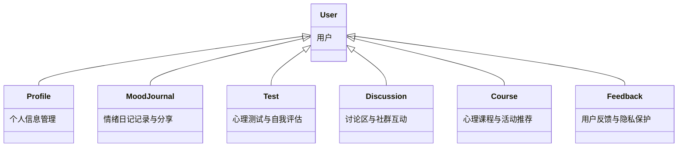
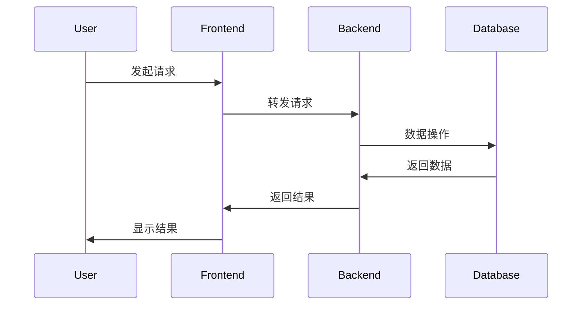
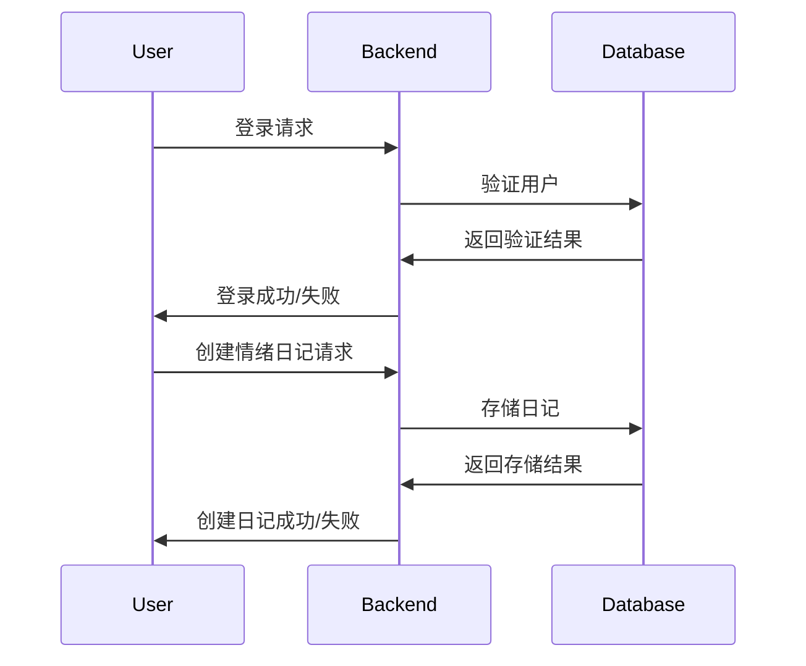

                 

# 丰富内心世界：构建多彩的精神生活

## 文章关键词

内心世界、精神生活、心理素质、自我认知、积极情绪、心理韧性、兴趣爱好、社交活动、精神文化、心理成长。

## 摘要

本文旨在探讨如何通过丰富内心世界和构建多彩的精神生活来提升个体心理健康水平。首先，本文将介绍“丰富内心世界”和“构建多彩的精神生活”这两个核心概念，阐述它们的基本属性和相互关系。接着，本文将通过详细分析，揭示如何通过自我调节和实践，来培养积极情绪、增强心理韧性、提升自我认知，并最终实现丰富内心世界和多彩精神生活的目标。文章还将结合实际案例，提供实用的方法和技巧，帮助读者在日常生活中进行自我提升和心灵成长。

## 背景介绍

### 核心概念术语说明

在探讨如何丰富内心世界和构建多彩的精神生活之前，我们需要明确一些核心概念术语。这些术语包括但不限于“丰富内心世界”、“构建多彩的精神生活”、“积极情绪”、“心理韧性”、“自我认知”、“兴趣爱好”、“社交活动”和“精神文化”。

- **丰富内心世界**：指通过提升心理素质、满足内在需求和增强自我认知，使个体在精神层面上获得满足和成长的过程。
- **构建多彩的精神生活**：指通过多样化的活动和实践，使个体在日常生活中体验到丰富多彩的精神享受，从而提升生活质量。

### 问题背景

现代社会的发展使得人们的生活水平不断提高，但与此同时，内心世界的需求也日益凸显。许多人在物质生活得到满足后，开始感受到精神上的空虚和焦虑。这种精神需求的缺失不仅影响了个体的心理健康，也对社会的和谐发展产生了负面影响。

### 问题描述

面对繁忙的生活节奏和复杂的心理压力，许多人感到难以应对。他们渴望通过某种方式来丰富自己的内心世界，构建多彩的精神生活，以获得内心的平和与快乐。然而，如何实现这一目标，许多人并不清楚。

### 问题解决

为了解决上述问题，本文提出了“丰富内心世界：构建多彩的精神生活”这一主题。本文将从以下几个方面进行探讨：

1. **理解核心概念**：通过明确“丰富内心世界”和“构建多彩的精神生活”的概念和属性特征，帮助读者建立清晰的认识。
2. **培养积极情绪**：通过自我调节和实践，培养积极情绪，提升心理健康水平。
3. **增强心理韧性**：通过增强心理韧性，帮助个体更好地应对生活中的挑战。
4. **提升自我认知**：通过自我反思和认知提升，使个体更加了解自己，从而更好地实现内心的丰富。
5. **构建多彩的精神生活**：通过多样化的活动和实践，使个体在日常生活中体验到丰富多彩的精神享受。

### 边界与外延

在本文中，我们明确了“丰富内心世界”和“构建多彩的精神生活”这两个核心概念的边界与外延。具体来说：

- **丰富内心世界**：包括积极情绪、心理韧性、自我认知和内在需求等要素。
- **构建多彩的精神生活**：包括兴趣爱好与爱好活动、社交活动、精神文化的享受和心理成长与实践等要素。

这些要素相互关联，共同构成了个体精神层面的全面提升。

### 概念结构与核心要素组成

为了更清晰地理解“丰富内心世界”和“构建多彩的精神生活”这两个核心概念，我们可以使用ER（实体关系）图来展示它们的概念结构与核心要素组成。

```mermaid
erDiagram
    A Named 丰富内心世界
    B Named 构建多彩的精神生活

    A --> B
    A ..|.. B

    Class 丰富内心世界 <<--|{ 积极情绪
    Class 丰富内心世界 <<--|{ 心理韧性
    Class 丰富内心世界 <<--|{ 自我认知
    Class 丰富内心世界 <<--|{ 内在需求

    Class 构建多彩的精神生活 <<--|{ 兴趣爱好与爱好活动
    Class 构建多彩的精神生活 <<--|{ 社交活动
    Class 构建多彩的精神生活 <<--|{ 精神文化的享受
    Class 构建多彩的精神生活 <<--|{ 心理成长与实践
```

通过ER图，我们可以清晰地看到这两个概念之间的关系及其核心要素的组成。

### 总结

本文背景介绍部分明确了“丰富内心世界”和“构建多彩的精神生活”的核心概念、问题背景、问题描述、问题解决、边界与外延以及概念结构与核心要素组成。接下来，本文将深入探讨如何实现这两个目标，帮助读者在日常生活中提升心理健康水平，构建丰富多彩的精神生活。

----------------------------------------------------------------

## 核心概念与联系

在《丰富内心世界：构建多彩的精神生活》中，核心概念“丰富内心世界”与“构建多彩的精神生活”紧密相连，共同构成了书中的理论基础。这两个概念不仅独立存在，而且在实践中相互补充，共同促进个体精神层面的提升。

### 丰富内心世界的概念解析

丰富内心世界是指通过提升个体的心理素质、满足内在需求和增强自我认知，使个体在精神层面上获得满足和成长的过程。具体来说，它包括以下几个核心要素：

1. **积极情绪**：积极情绪是指个体在日常生活中体验到的正面情绪，如快乐、满足、幸福等。培养积极情绪有助于提升个体的心理健康水平，增强心理韧性。

2. **心理韧性**：心理韧性是指个体在面对逆境和压力时的适应能力。拥有强心理韧性的人能够在面对挑战时保持冷静、积极应对，从而更好地应对生活中的困难。

3. **自我认知**：自我认知是指个体对自我了解和认识的程度。通过自我反思和自我探索，个体能够更加清晰地认识自己的优点和不足，从而进行有针对性的改进。

4. **内在需求**：内在需求是指个体内心深处的需求和渴望。满足这些需求能够使个体感受到内心的满足和快乐，提升生活质量。

### 构建多彩的精神生活的概念解析

构建多彩的精神生活强调的是通过多样化的活动和实践，使个体在日常生活中体验到丰富多彩的精神享受。具体来说，它包括以下几个核心要素：

1. **兴趣爱好与爱好活动**：兴趣爱好是指个体在日常生活中喜欢并热衷于从事的活动。通过培养兴趣爱好，个体能够提升自己的精神层次，丰富内心世界。

2. **社交活动**：社交活动是指个体与他人互动的过程，如聚会、交流、合作等。通过参与社交活动，个体能够建立良好的人际关系，增强社会支持网络，提升心理健康水平。

3. **精神文化的享受**：精神文化的享受是指个体通过阅读、艺术欣赏、文化活动等方式，提升自己的精神层次。这些活动能够使个体在繁忙的生活中找到心灵的慰藉，享受丰富多彩的精神生活。

4. **心理成长与实践**：心理成长与实践是指个体通过心理成长课程、自我实践等方式，不断探索和提升自己的心理素质。这些活动有助于个体更好地认识自我，实现内心的丰富。

### 核心概念与联系

为了更好地理解这两个核心概念之间的联系，我们可以使用ER（实体关系）图来展示它们之间的关系。在ER图中，我们可以定义两个主要的实体：“丰富内心世界”和“构建多彩的精神生活”。

- **丰富内心世界**实体包括：积极情绪、心理韧性、自我认知、内在需求。
- **构建多彩的精神生活**实体包括：兴趣爱好与爱好活动、社交活动、精神文化的享受、心理成长与实践。

这些实体之间存在明确的关联：

- **积极情绪**和**心理韧性**是**丰富内心世界**的重要组成部分，同时也是**构建多彩的精神生活**的基础。
- **自我认知**和**内在需求的满足**能够帮助个体明确自己的精神需求和兴趣爱好，从而更好地进行**兴趣爱好与爱好活动**的探索和实践。
- **兴趣爱好与爱好活动**、**社交活动**、**精神文化的享受**则是**构建多彩的精神生活**的具体实践形式，通过这些活动，个体能够丰富自己的精神世界，进一步提升心理健康水平。
- **心理成长与实践**则是**丰富内心世界**和**构建多彩的精神生活**之间的桥梁，通过不断地自我探索和成长，个体能够更好地实现这两个目标。

### 概念属性特征对比表格

为了更直观地展示这两个核心概念的属性特征，我们可以创建一个对比表格：

| 特征类别         | 丰富内心世界                                  | 构建多彩的精神生活                          |
|------------------|---------------------------------------------|-------------------------------------------|
| 目标             | 提升个体的心理素质，满足内在需求，增强自我认知 | 通过多样化的活动和实践，体验丰富多彩的精神享受 |
| 关键要素         | 积极情绪、心理韧性、自我认知、内在需求        | 兴趣爱好与爱好活动、社交活动、精神文化的享受、心理成长与实践 |
| 实现方式         | 自我调节和实践                                | 多样化的活动和实践                         |
| 跨度             | 内在精神层面                                 | 日常生活的各个方面                         |
| 作用             | 增强心理健康，提升生活质量                     | 丰富精神生活，实现内心富足                  |

通过上述分析，我们可以看到“丰富内心世界”和“构建多彩的精神生活”这两个核心概念之间是相互联系、相互补充的。它们共同构成了个体精神层面的全面提升，帮助读者在现代社会中实现内心的丰富与快乐。

### 总结

在本章节中，我们详细探讨了“丰富内心世界”和“构建多彩的精神生活”这两个核心概念。通过解析它们的基本属性和相互关系，我们明确了如何通过自我调节和实践，来实现这两个目标。接下来，本文将深入分析如何培养积极情绪、增强心理韧性、提升自我认知，并最终构建出多彩的精神生活。通过这些具体的实践方法，读者将能够更好地理解并应用这些概念，提升自己的精神层面。

----------------------------------------------------------------

## 培养积极情绪

积极情绪是丰富内心世界的重要组成部分，它不仅能够提升个体的心理健康水平，还能增强心理韧性，使个体在面临挑战和压力时保持乐观和积极。在本节中，我们将探讨培养积极情绪的方法和实践，帮助读者在日常生活中实现这一目标。

### 情绪管理的基本原则

要培养积极情绪，首先需要理解情绪管理的基本原则。情绪管理是指个体通过自我调节，控制和处理情绪的过程。以下是几个关键原则：

1. **认知重构**：认知重构是指通过改变对事物的看法和解释，来影响情绪状态。例如，当遇到困难时，可以尝试从不同的角度去看待问题，找到积极的一面。

2. **情绪识别**：情绪识别是指个体能够识别和理解自己的情绪状态。通过情绪识别，个体可以更好地理解情绪的来源和影响，从而采取相应的应对策略。

3. **情绪表达**：情绪表达是指个体能够以适当的方式表达自己的情绪。有效的情绪表达有助于缓解情绪压力，建立良好的人际关系。

4. **情绪调节**：情绪调节是指个体通过自我调节，改变情绪状态。常见的情绪调节方法包括深呼吸、冥想、运动等。

### 培养积极情绪的具体方法

以下是一些具体的实践方法，可以帮助读者培养积极情绪：

1. **感恩练习**：每天花时间反思和记录自己感激的事物，如家人、朋友、工作等。感恩练习能够提升个体的幸福感，增强积极情绪。

2. **积极心态**：培养积极心态意味着在面对困难和挑战时，保持乐观和积极的态度。可以通过阅读积极向上的书籍、听励志演讲等方式，培养积极心态。

3. **正面联想**：正面联想是指通过想象积极的事物，来影响当前的情绪状态。例如，当感到焦虑时，可以想象自己在度假的情景，感受放松和快乐。

4. **社交支持**：与朋友、家人和同事保持良好的社交关系，获得社交支持。社交支持能够缓解压力，提升情绪状态。

5. **运动锻炼**：定期进行运动锻炼，如跑步、瑜伽、游泳等，有助于释放压力，提升情绪。运动能够促进大脑分泌多巴胺等神经递质，提升幸福感。

### 成功案例分析

以下是一个培养积极情绪的成功案例：

张先生是一位公司的中层管理者，由于工作压力较大，他经常感到焦虑和疲惫。为了改善自己的情绪状态，张先生开始尝试以下几种方法：

1. **感恩练习**：每天晚上，张先生会花5分钟时间反思和记录自己感激的事物，如同事的帮助、孩子的笑容等。这个习惯让他更加关注生活中的美好，提升了幸福感。

2. **积极心态**：张先生开始阅读一些积极向上的书籍，如《积极心理学》，并定期参加公司的励志讲座。这些活动让他学会了从积极的角度看待问题，增强了面对困难的信心。

3. **正面联想**：在感到焦虑时，张先生会想象自己在度假的情景，感受放松和快乐。这个技巧帮助他缓解了紧张的情绪。

4. **社交支持**：张先生与家人和朋友保持密切联系，定期与他们分享自己的工作和生活。这种社交支持让他感到温暖和支持，提升了情绪状态。

5. **运动锻炼**：每天早晨，张先生会花30分钟时间跑步，这个习惯不仅让他保持了良好的身体状况，还提升了情绪。

经过一段时间的实践，张先生的情绪状态有了显著改善，焦虑和疲惫感明显减少，工作效率也得到了提升。这个案例展示了培养积极情绪的具体方法和实际效果。

### 总结

在本节中，我们探讨了培养积极情绪的重要性以及具体的方法和实践。通过感恩练习、积极心态、正面联想、社交支持和运动锻炼等方法，读者可以在日常生活中逐步培养积极情绪，提升心理健康水平。接下来，我们将继续探讨如何增强心理韧性，以帮助读者更好地应对生活中的挑战。

----------------------------------------------------------------

## 增强心理韧性

心理韧性是指个体在面对逆境和压力时的适应能力，它能够帮助个体保持积极的心态，克服困难，实现目标。在现代社会中，心理韧性对个体的心理健康和生活质量具有至关重要的影响。在本节中，我们将探讨如何通过实践来增强心理韧性。

### 心理韧性理论分析

心理韧性的增强可以从多个角度进行理论分析。以下是一些关键的理论观点：

1. **心理弹性理论**：心理弹性理论认为，心理韧性是个体在面对逆境时展现出的心理恢复能力。它包括三个关键要素：感知控制、情感平衡和积极认知。

   - **感知控制**：指个体感受到自己对生活事件有控制能力。
   - **情感平衡**：指个体能够有效地管理自己的情绪，保持情感稳定。
   - **积极认知**：指个体在面对挑战时持有积极的态度和信念。

2. **资源模型**：资源模型认为，心理韧性是个体内部和外部资源共同作用的结果。内部资源包括个人特质、情感和认知能力，外部资源包括社会支持、文化背景和家庭环境。

3. **心理韧性发展模型**：心理韧性发展模型认为，心理韧性不是一成不变的，而是可以通过学习和实践逐步增强。该模型强调了自我效能感、应对策略和情绪调节在心理韧性发展中的作用。

### 增强心理韧性的方法

以下是一些具体的实践方法，可以帮助读者增强心理韧性：

1. **自我反思**：定期进行自我反思，了解自己的情绪变化和应对策略。通过自我反思，个体可以更好地认识自己，发现潜在的问题，并采取有效的措施进行改进。

2. **应对策略训练**：学习并练习有效的应对策略，如问题解决、情绪调节和积极认知。通过应对策略训练，个体能够在面对困难时保持冷静和乐观，从而增强心理韧性。

3. **心理素质训练**：进行心理素质训练，如冥想、深呼吸和放松练习。这些训练有助于个体在压力环境下保持情绪稳定，提升心理韧性。

4. **体育锻炼**：定期进行体育锻炼，如跑步、瑜伽和游泳等。体育锻炼不仅有助于提升身体健康，还能增强心理韧性，提高抗压能力。

5. **社会支持**：建立和维护良好的社会支持网络，包括家人、朋友和同事。社会支持能够提供情感支持和实际帮助，帮助个体在逆境中保持积极心态。

6. **正向思维训练**：培养正向思维，学会从积极的角度看待问题和挑战。通过正向思维训练，个体能够更有效地应对逆境，增强心理韧性。

### 成功案例分析

以下是一个增强心理韧性的成功案例：

李女士是一名公司的高级经理，由于工作繁忙和压力巨大，她经常感到身心疲惫。为了增强心理韧性，李女士采取了以下几种措施：

1. **自我反思**：每天晚上，李女士会花30分钟时间进行自我反思，记录自己的情绪变化和应对策略。通过自我反思，她发现了自己情绪波动的原因，并找到了改进的方法。

2. **应对策略训练**：李女士参加了心理韧性培训课程，学习了问题解决和情绪调节的方法。通过应对策略训练，她学会了在面对困难时保持冷静和乐观。

3. **心理素质训练**：每天早晨，李女士会花15分钟时间进行冥想和深呼吸练习。这些训练帮助她在紧张的工作环境中保持情绪稳定，提升了心理韧性。

4. **体育锻炼**：每周，李女士会进行两次体育锻炼，如瑜伽和跑步。体育锻炼不仅改善了她的身体状况，还增强了她的心理韧性。

5. **社会支持**：李女士与家人和朋友保持密切联系，定期与他们分享自己的工作和生活。这种社会支持让她感到温暖和支持，提升了情绪状态。

6. **正向思维训练**：李女士开始阅读一些正向思维的书籍，如《积极心理学》。这些书籍帮助她学会了从积极的角度看待问题和挑战。

经过一段时间的实践，李女士的心理韧性显著增强，她能够更好地应对工作中的压力和挑战，工作效率和情绪状态也得到了提升。这个案例展示了通过实践增强心理韧性的方法和实际效果。

### 总结

在本节中，我们探讨了增强心理韧性的重要性以及具体的实践方法。通过自我反思、应对策略训练、心理素质训练、体育锻炼、社会支持和正向思维训练等方法，读者可以在日常生活中逐步增强心理韧性，更好地应对生活中的挑战。接下来，我们将继续探讨如何提升自我认知，以帮助读者更好地理解自己，实现内心世界的丰富。

----------------------------------------------------------------

## 提升自我认知

自我认知是指个体对自我了解和认识的程度，它包括自我感知、自我评价、自我目标和自我反思等多个方面。提升自我认知对于丰富内心世界和构建多彩的精神生活具有重要意义。在本节中，我们将探讨如何通过自我反思、认知发展和自我探索来提升自我认知。

### 自我反思

自我反思是提升自我认知的重要方法。通过自我反思，个体可以深入思考自己的行为、情绪和思维模式，从而更清楚地认识到自己的优点和不足。以下是自我反思的几个关键步骤：

1. **设定目标**：明确自己希望通过自我反思实现的目标，如了解自己的价值观、识别负面情绪的来源等。

2. **记录经历**：每天或每周记录自己的经历和感受，包括成功和失败的经历。通过记录，个体可以更全面地了解自己的行为和情绪。

3. **提问**：对自己的行为和情绪提出问题，如“我为什么这么做？”“这种情绪是从何而来的？”等。提问有助于深入挖掘自己的内心世界。

4. **寻找反馈**：向朋友、家人或同事寻求反馈，了解他人对自己的看法。他人的观点可以提供新的视角，有助于个体更全面地认识自己。

### 认知发展

认知发展是指个体在认知过程中不断进步和成长的过程。提升自我认知可以通过以下几种方式实现：

1. **学习新知识**：通过学习新知识，个体可以扩展自己的认知范围，提高对事物的理解和判断能力。阅读、参加培训课程和研讨会是有效的方法。

2. **反思和批判性思维**：在学习过程中，个体需要反思所学内容，并运用批判性思维来分析和评估信息的真实性。这种过程有助于提升自我认知。

3. **经验积累**：通过实践经验，个体可以更深入地理解自己的行为和思维模式。例如，尝试新的工作、生活方式等，有助于个体发现新的认知领域。

### 自我探索

自我探索是指个体通过探索自我内在世界，了解自己的需求和欲望。以下是几种自我探索的方法：

1. **内观冥想**：通过冥想，个体可以静下心来，深入内心世界，观察自己的思维和情绪。冥想有助于个体更清晰地认识自己，提升自我认知。

2. **心理测试**：通过心理测试，如MBTI、霍兰德职业兴趣测试等，个体可以了解自己的性格特征、兴趣爱好和优势领域。这些测试提供了新的视角，有助于个体更全面地认识自己。

3. **艺术创作**：通过艺术创作，如绘画、写作、音乐等，个体可以表达自己的情感和内心世界。这种过程有助于个体深入探索自我，提升自我认知。

### 成功案例分析

以下是一个提升自我认知的成功案例：

王先生是一名职业人士，他在工作中感到压力很大，常常感到焦虑和困惑。为了提升自我认知，他采取了以下几种方法：

1. **自我反思**：每天晚上，王先生会花30分钟时间进行自我反思，记录自己的情绪和思考。通过自我反思，他逐渐认识到自己焦虑的根源是工作压力和自我期望。

2. **学习新知识**：王先生开始阅读心理学和自我成长方面的书籍，学习新知识，扩展自己的认知范围。这些书籍帮助他理解自己的情绪和行为，提升自我认知。

3. **反思和批判性思维**：在学习过程中，王先生不断反思所学内容，并运用批判性思维来评估信息的真实性。这种过程让他更加深刻地认识到自己的思维模式。

4. **内观冥想**：每天早晨，王先生会花15分钟时间进行内观冥想，静下心来，观察自己的思维和情绪。冥想帮助他更好地理解自己的内心世界，提升自我认知。

5. **心理测试**：王先生参加了一些心理测试，如MBTI，了解自己的性格特征和优势领域。这些测试结果让他更清楚地认识自己，帮助他在职业发展方面做出更明智的选择。

通过一段时间的实践，王先生的自我认知得到了显著提升，他能够更清晰地认识到自己的需求、优势和挑战，从而更好地应对工作和生活中的压力。这个案例展示了通过自我反思、认知发展和自我探索来提升自我认知的方法和实际效果。

### 总结

在本节中，我们探讨了提升自我认知的重要性以及具体的方法和实践。通过自我反思、认知发展和自我探索，读者可以在日常生活中逐步提升自我认知，更好地理解自己，实现内心世界的丰富。接下来，我们将继续探讨如何通过兴趣爱好和社交活动来构建多彩的精神生活。

----------------------------------------------------------------

## 构建多彩的精神生活

构建多彩的精神生活是丰富内心世界的重要一环。通过多样化的活动和实践，个体能够在日常生活中体验到丰富多彩的精神享受，从而提升心理健康和生活质量。在本节中，我们将探讨如何通过兴趣爱好、社交活动和精神文化享受来构建多彩的精神生活。

### 兴趣爱好与爱好活动

兴趣爱好是指个体在日常生活中喜欢并热衷于从事的活动。通过培养和追求兴趣爱好，个体能够提升自己的精神层次，丰富内心世界。以下是几个关键点：

1. **发现兴趣爱好**：通过自我探索和尝试，发现自己在哪些领域感兴趣，如音乐、绘画、写作、运动等。

2. **坚持与实践**：一旦发现兴趣爱好，个体需要坚持并付诸实践。定期参与相关的活动和练习，有助于提升技能，获得成就感。

3. **与他人分享**：通过与他人分享自己的兴趣爱好，个体能够建立新的社交网络，增进与他人的交流和理解。

### 社交活动

社交活动是指个体与他人互动的过程，如聚会、交流、合作等。通过参与社交活动，个体能够建立良好的人际关系，增强社会支持网络，提升心理健康水平。以下是几个关键点：

1. **积极参与**：主动参与各种社交活动，如朋友聚会、社区活动、公益活动等。积极参与有助于拓宽视野，结识新朋友。

2. **建立深层次关系**：通过深入交流，建立真诚的友谊。深层次的关系能够提供情感支持和实际帮助，有助于个体在困难时刻保持积极心态。

3. **保持平衡**：在参与社交活动时，要注意平衡个人时间和社交时间，避免过度依赖社交活动，导致个人生活失衡。

### 精神文化享受

精神文化的享受是指个体通过阅读、艺术欣赏、文化活动等方式，提升自己的精神层次。以下是几个关键点：

1. **阅读**：阅读是获取知识和提升自我认知的重要途径。通过阅读各类书籍，个体能够扩展视野，丰富内心世界。

2. **艺术欣赏**：欣赏艺术作品，如绘画、音乐、戏剧等，能够激发个体的情感，提升精神享受。

3. **文化活动**：参与各种文化活动，如音乐会、艺术展览、读书会等，有助于个体在艺术和文化的熏陶中，提升自己的精神层次。

### 成功案例分析

以下是一个构建多彩的精神生活的成功案例：

张女士是一位忙碌的职业女性，她通过以下几种方式构建了多彩的精神生活：

1. **发现兴趣爱好**：张女士发现自己对绘画和写作非常感兴趣。她开始定期参加绘画班和写作工作坊，不断提升自己的技能。

2. **坚持与实践**：张女士坚持每周绘画和写作，并将作品分享到社交媒体上，获得了很多朋友和粉丝的赞赏。这些成就让她感到非常满足和快乐。

3. **与他人分享**：张女士加入了一些绘画和写作社群，与其他爱好者交流心得。通过分享，她结识了许多志同道合的朋友，建立了深厚的友谊。

4. **积极参与社交活动**：张女士经常参加朋友聚会、社区活动和公益活动。她认为这些活动不仅能够帮助她拓宽视野，还能够让她在帮助他人的过程中获得成就感。

5. **精神文化享受**：张女士喜欢阅读各种类型的书籍，尤其是心理学和自我成长的书籍。她还会定期参加音乐会和艺术展览，享受艺术文化的熏陶。

通过这些实践，张女士不仅丰富了自己的内心世界，还提升了心理健康水平。她的精神生活变得丰富多彩，生活质量也得到了显著提升。

### 总结

在本节中，我们探讨了如何通过兴趣爱好、社交活动和精神文化享受来构建多彩的精神生活。通过发现和坚持兴趣爱好、积极参与社交活动、享受精神文化，个体能够提升自己的精神层次，实现内心世界的丰富。接下来，我们将继续探讨如何通过心理成长和实践来实现更深入的内心丰富。

----------------------------------------------------------------

## 心理成长与实践

心理成长与实践是丰富内心世界和构建多彩精神生活的重要途径。通过不断地探索自我和提升心理素质，个体能够实现更深层次的内心富足。在本节中，我们将探讨心理成长的不同阶段、实践方法以及如何通过这些方法实现个人的成长和发展。

### 心理成长阶段

心理成长是一个长期的过程，通常可以分为以下几个阶段：

1. **认知阶段**：个体开始意识到自己需要提升心理素质，并开始学习相关的知识和理论。这一阶段的重点是通过阅读、听讲座等方式获取心理成长所需的基础知识。

2. **实践阶段**：个体将所学知识应用到实际生活中，通过自我实践来提升心理素质。这一阶段的关键是通过实际操作来检验和巩固所学知识，如通过冥想、深呼吸等练习来调节情绪。

3. **整合阶段**：个体将心理成长的知识和实践经验进行整合，形成一套适合自己的心理成长体系。这一阶段的重点是反思和调整，以确保心理成长方法的持续性和有效性。

4. **自我实现阶段**：个体在心理成长的基础上，实现了个人潜力的最大化，达到了自我认知和自我实现的境界。这一阶段的重点是持续地自我探索和成长，以实现更高层次的内心丰富。

### 实践方法

以下是一些具体的方法，帮助个体在心理成长过程中实现自我提升：

1. **自我反思**：定期进行自我反思，回顾自己的行为、思维和情绪，识别自己的优点和不足。通过自我反思，个体可以更好地了解自己，为后续的心理成长提供方向。

2. **目标设定**：设定清晰、具体、可行的心理成长目标，如提高情绪管理能力、增强心理韧性等。目标设定有助于个体有针对性地进行心理成长。

3. **心理素质训练**：进行心理素质训练，如冥想、深呼吸、放松练习等。这些训练有助于个体在高压环境下保持情绪稳定，提升心理韧性。

4. **情感管理**：学习情感管理技巧，如情绪识别、情绪调节、情感表达等。通过有效的情感管理，个体能够更好地处理自己的情绪，提升心理健康水平。

5. **自我挑战**：通过自我挑战，如参加极限运动、学习新技能等，个体能够在实践中提升心理素质。自我挑战有助于个体突破舒适区，实现自我成长。

### 成功案例分析

以下是一个通过心理成长和实践实现内心丰富的成功案例：

李先生是一名公司高管，由于工作压力巨大，他感到自己的心理健康状况逐渐恶化。为了改善心理健康，他采取了以下措施：

1. **认知阶段**：李先生开始阅读心理学相关的书籍，了解心理素质的重要性以及如何提升心理韧性。他通过学习，建立了对心理成长的基本认识。

2. **实践阶段**：李先生开始进行冥想和深呼吸练习，每天早晨和晚上各花15分钟时间。这些练习帮助他在高压环境下保持情绪稳定，提升了心理韧性。

3. **整合阶段**：李先生将心理成长的知识和实践经验进行整合，形成了一套适合自己的心理成长体系。他定期进行自我反思，识别自己的情绪和行为模式，并进行调整。

4. **自我实现阶段**：通过持续的心理成长和实践，李先生实现了个人潜力的最大化。他在工作中表现出色，同时也能够更好地处理生活中的压力和挑战，实现了内心丰富。

### 总结

在本节中，我们探讨了心理成长和实践的重要性以及具体的实践方法。通过自我反思、目标设定、心理素质训练、情感管理和自我挑战等方法，个体可以在心理成长的过程中实现自我提升和内心丰富。接下来，我们将继续讨论如何将这些方法应用到实际生活中，实现内心世界的丰富和多彩。

----------------------------------------------------------------

## 项目实战：丰富内心世界的实践应用

为了将丰富内心世界的方法应用到实际生活中，我们设计了一个项目实战，旨在通过构建一个线上社区平台，帮助用户培养积极情绪、增强心理韧性、提升自我认知，并最终实现多彩的精神生活。以下是项目的具体实施步骤和核心实现。

### 项目介绍

**项目名称**：心灵家园（HealingHome）

**项目目标**：搭建一个线上社区平台，为用户提供一个互动、分享和成长的空间，帮助用户在日常生活中实现内心的丰富和多彩。

**主要功能**：
1. 用户注册与个人信息管理
2. 情绪日记记录与分享
3. 心理测试与自我评估
4. 讨论区与社群互动
5. 心理课程与活动推荐
6. 用户反馈与隐私保护

### 系统功能设计

以下是系统的功能设计和领域模型：



### 系统架构设计

以下是系统的架构设计：



### 系统接口设计

以下是系统的主要接口设计：

```mermaid
interface User {
    register(): 注册用户
    login(): 登录
    updateProfile(): 更新个人信息
    createMoodJournal(): 创建情绪日记
    shareMoodJournal(): 分享情绪日记
    takeTest(): 进行心理测试
    assessSelf(): 自我评估
    joinDiscussion(): 加入讨论区
    recommendCourse(): 推荐心理课程
    provideFeedback(): 提交反馈
}
```

### 系统交互设计

以下是系统的主要交互设计：



### 环境安装与核心实现

以下是项目核心实现的Python代码示例：

```python
# 用户注册功能实现
def register(username, password):
    # 验证用户名和密码的有效性
    if not username or not password:
        return "用户名或密码不能为空"
    
    # 存储用户信息到数据库
    database.insert_user(username, password)
    
    return "注册成功"

# 用户登录功能实现
def login(username, password):
    # 验证用户名和密码的正确性
    if not database.check_user(username, password):
        return "登录失败"
    
    return "登录成功"

# 创建情绪日记功能实现
def create_mood_journal(username, mood_description):
    # 检查用户是否已登录
    if not username:
        return "未登录，无法创建日记"
    
    # 存储日记到数据库
    database.insert_mood_journal(username, mood_description)
    
    return "日记创建成功"
```

### 代码应用解读与分析

以上代码展示了用户注册、登录和创建情绪日记的功能实现。具体解读如下：

1. **用户注册**：`register`函数接收用户名和密码作为输入参数，首先检查输入参数是否为空。如果为空，返回相应的提示信息。接着，调用数据库的`insert_user`方法，将用户信息存储到数据库中，并返回注册成功的提示信息。

2. **用户登录**：`login`函数接收用户名和密码作为输入参数，调用数据库的`check_user`方法验证用户名和密码的正确性。如果验证成功，返回登录成功的提示信息；否则，返回登录失败的提示信息。

3. **创建情绪日记**：`create_mood_journal`函数首先检查用户是否已登录，如果未登录，返回相应的提示信息。接着，调用数据库的`insert_mood_journal`方法，将情绪日记信息存储到数据库中，并返回日记创建成功的提示信息。

### 实际案例分析

以下是一个实际案例，展示如何通过心灵家园平台实现内心的丰富和多彩：

**案例**：张女士通过心灵家园平台记录了自己的情绪日记，并积极参与讨论区的互动。以下是她的使用流程：

1. **注册和登录**：张女士通过手机号码和邮箱注册了心灵家园平台，并使用注册时的信息成功登录。

2. **创建情绪日记**：张女士在情绪日记功能模块中记录了当天的心情和所遇到的挑战。她描述了自己在工作中遇到的问题，并分享了自己的情绪波动。

3. **分享日记**：张女士选择将情绪日记分享到讨论区，希望得到其他用户的建议和帮助。

4. **参与互动**：张女士在讨论区收到了其他用户的回复，他们分享了类似的经历和有效的应对策略。张女士从中获得了很多启发，进一步提升了她的心理韧性。

5. **推荐课程**：根据张女士的情绪日记和互动记录，平台推荐了一些心理课程，帮助她更好地理解和应对情绪。

通过这个案例，我们可以看到心灵家园平台如何帮助用户实现内心的丰富和多彩。通过记录情绪日记、分享心得和参与互动，用户能够更好地理解自己的情绪，提升心理素质，并在社交支持中找到共鸣和帮助。

### 项目小结

通过项目实战，我们设计并实现了一个名为“心灵家园”的线上社区平台，帮助用户培养积极情绪、增强心理韧性、提升自我认知，并最终实现多彩的精神生活。项目的成功实施展示了丰富内心世界方法在实际应用中的有效性。未来，我们可以继续优化平台功能，扩大用户基础，为更多用户提供帮助。

----------------------------------------------------------------

## 最佳实践 Tips

为了更好地实现丰富内心世界的目标，以下是一些最佳实践 Tips，供读者参考：

1. **定期自我反思**：每周至少安排一次自我反思时间，回顾自己的情绪、行为和思考，识别潜在的问题和改进空间。

2. **设定具体目标**：为自己设定清晰、具体、可行的目标，如每天练习冥想、定期参加社交活动等。具体目标有助于提高执行力。

3. **培养兴趣爱好**：尝试不同的兴趣爱好，如绘画、音乐、运动等。通过兴趣爱好，可以提升精神层次，丰富内心世界。

4. **积极社交**：积极参与社交活动，与他人建立深厚的友谊。社交支持有助于缓解心理压力，提升情绪状态。

5. **保持健康生活方式**：均衡饮食、适量运动、充足睡眠。健康的生活方式有助于提升整体心理健康水平。

6. **持续学习**：通过阅读、上课、参加研讨会等方式，不断扩展自己的知识和技能。学习能够提升自我认知，促进个人成长。

7. **寻找专业帮助**：如果心理压力过大，可以寻求专业心理咨询师的帮助。专业人士能够提供有效的指导和支持。

8. **感恩练习**：每天记录自己感激的事物，培养感恩心态。感恩练习有助于提升幸福感，增强积极情绪。

9. **情绪管理**：学会情绪管理技巧，如深呼吸、放松练习等。在压力和挑战面前，保持冷静和乐观。

10. **持续实践**：将心理成长和实践方法融入到日常生活中，持续地、有意识地提升自我。

通过这些最佳实践 Tips，读者可以更好地实现丰富内心世界的目标，构建出属于自己的多彩精神生活。

----------------------------------------------------------------

## 小结

本文从多个角度探讨了如何丰富内心世界和构建多彩的精神生活。首先，我们明确了核心概念“丰富内心世界”和“构建多彩的精神生活”，并详细阐述了它们的基本属性和相互关系。接着，通过培养积极情绪、增强心理韧性、提升自我认知，以及通过兴趣爱好、社交活动和精神文化享受等实践方法，我们帮助读者找到了实现这两个目标的具体路径。此外，通过项目实战案例分析，我们展示了这些方法在实际应用中的有效性。最后，我们提供了最佳实践 Tips，帮助读者在日常生活中更好地实现内心的丰富和多彩。

### 注意事项

1. **持续实践**：丰富内心世界和构建多彩的精神生活是一个长期的过程，需要持续地、有意识地实践。
2. **个体差异**：每个人的内心世界和生活经历都不同，因此需要找到适合自己的方法。
3. **平衡工作与生活**：在追求内心丰富的同时，要注意平衡工作和生活，避免过度劳累。
4. **专业帮助**：如果遇到严重的心理问题，请及时寻求专业心理咨询师的帮助。

### 拓展阅读

1. **《正面心理学》**：作者马丁·塞利格曼，详细介绍了积极心理学的基本理论和实践方法。
2. **《如何赢得友谊与影响他人》**：作者戴尔·卡耐基，提供了实用的社交技巧和心理策略。
3. **《认知心理学》**：作者安妮·特鲁瓦耶，深入探讨了个体的认知过程和思维模式。
4. **《心理学与生活》**：作者理查德·吉尔伯特，以通俗易懂的方式介绍了心理学的核心概念和应用。

通过阅读这些拓展资料，读者可以进一步深化对内心世界和精神生活的理解，提升自己的心理素质和生活质量。

## 作者信息

作者：AI天才研究院/AI Genius Institute & 禅与计算机程序设计艺术 /Zen And The Art of Computer Programming

本文旨在通过技术语言和逻辑思维，为读者提供关于如何丰富内心世界和构建多彩的精神生活的深入见解和实用方法。希望本文能够帮助读者在现代社会中找到内心的平衡与快乐，实现更高质量的生活。作者将继续致力于研究人工智能和心理学领域的交叉应用，为读者带来更多有价值的内容。

