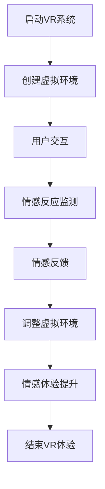
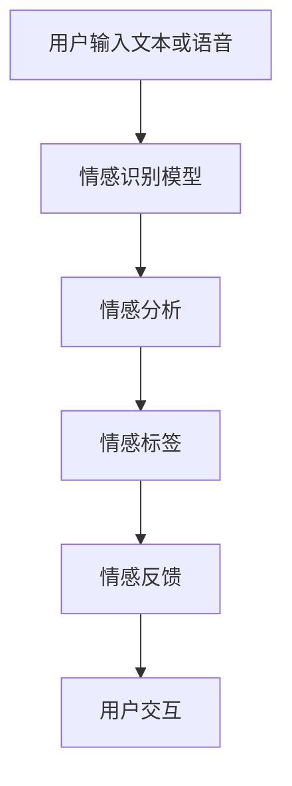
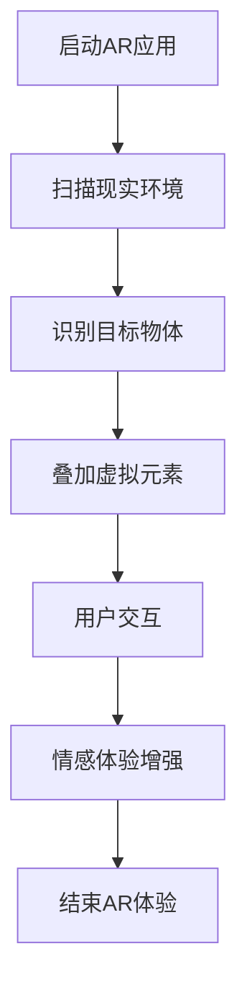
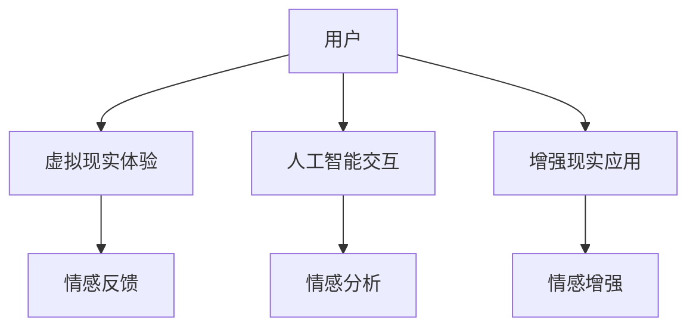
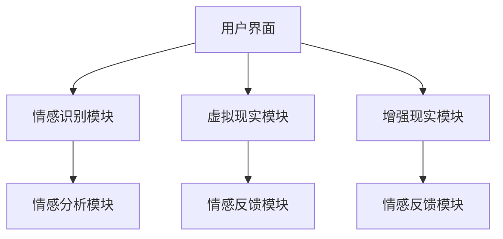
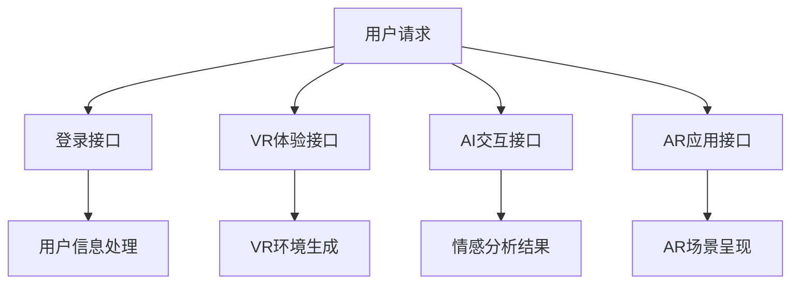
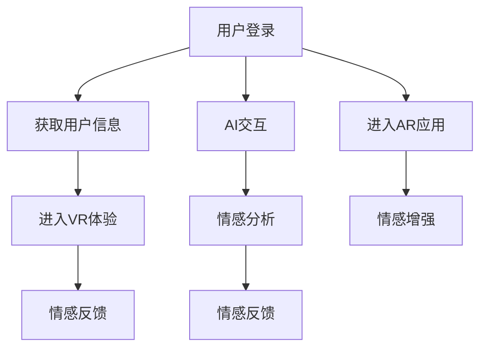

                 

### 引言：探索情感与体验的融合

在信息化和智能化的时代浪潮中，技术不仅改变了我们的生活方式，也深刻影响了我们的情感体验。情感与体验的融合，成为当代科技发展中不可忽视的重要课题。本文旨在探讨如何通过丰富的技术手段和理论框架，拓展情感的范畴和体验的深度，进而丰富人们的生活。

**关键词：情感、体验、技术、拓展、融合**

**摘要：**本文将首先介绍情感与体验的基本概念及其在现代生活中的重要性。随后，我们将深入分析情感心理学的基本理论，探讨情感对个体和社会的影响。接着，文章将探讨技术如何影响情感和体验，介绍一些前沿的技术应用，如虚拟现实、人工智能和增强现实等。最后，本文将提出一系列拓展情感和体验的实践方法，为读者提供实际操作的指导。

### 背景介绍

情感与体验是心理学研究中的核心概念。情感是指个体对某一对象、事件或情境产生的内心体验和反应，通常包括愉悦、悲伤、愤怒、恐惧等基本类型。体验则是个体在特定情境下通过感官、思维和情感相互作用而产生的主观感受。情感和体验相互交织，共同构成了人的心理体验和生活质量。

在现代社会，随着科技的飞速发展，人们的情感体验发生了显著变化。传统的人际交往模式逐渐被虚拟空间和数字平台所替代，虚拟现实（VR）、人工智能（AI）和增强现实（AR）等技术的广泛应用，为人们提供了全新的情感和体验方式。这些技术不仅改变了我们的生活方式，也深刻影响了我们的情感表达和认知过程。

**问题背景：**然而，在享受技术带来的便捷和丰富体验的同时，我们也面临着一系列挑战。如何确保技术在拓展情感和体验的同时，不会削弱个体的情感深度和社会联系？如何设计出既能满足个性化需求，又能促进社会和谐的技术应用？这些问题引发了广泛的讨论和思考。

**问题描述：**本文试图回答以下问题：

1. 情感和体验在现代生活中的重要性是什么？
2. 情感心理学的基本理论如何帮助我们理解情感和体验？
3. 哪些技术正在改变我们的情感和体验？
4. 如何通过技术和实践方法拓展情感和体验的范畴？

**问题解决：**本文将通过以下步骤解答这些问题：

1. 引言：介绍文章的主题和关键词。
2. 情感心理学基础：介绍情感心理学的基本概念、理论和研究方法。
3. 技术与情感体验：探讨虚拟现实、人工智能和增强现实等技术在情感和体验拓展中的应用。
4. 拓展情感和体验的实践方法：提出一系列具体的技术和实践方法，帮助读者拓展情感和体验的范畴。

**边界与外延：**本文的讨论范围主要聚焦在情感心理学和技术对情感体验的影响，以及如何通过具体实践方法来拓展情感和体验的范畴。然而，情感和体验的范畴非常广泛，包括文化、社会、心理等多个维度。本文旨在提供一个宏观的视角，探讨这些核心问题。

**概念结构与核心要素组成：**本文的核心概念包括情感、体验、情感心理学、技术、虚拟现实、人工智能、增强现实等。情感和体验是本文的核心研究对象，而情感心理学、技术则是研究的主要工具和方法。

### 情感心理学基础

情感心理学是心理学中的一个重要分支，主要研究情感的本质、起源、发展和功能。情感不仅是人类行为和心理过程的核心驱动力，也是我们理解世界和与他人建立关系的重要手段。

#### 情感的定义与分类

情感心理学中的情感通常被定义为个体对某一对象、事件或情境产生的内心体验和反应。情感可以划分为基本情感和复合情感。基本情感包括愉悦、悲伤、愤怒、恐惧、惊讶等，它们是人类共有的基本情绪反应。复合情感则是由基本情感组合而成的，如爱、厌恶、敬畏等。

#### 情感心理学的历史与发展

情感心理学的发展经历了多个阶段。早期的情感研究主要集中在描述和分类情感，如罗伯特·朗格（Robert Lange）的情感层次理论。随着认知心理学的发展，情感与认知过程的关系成为研究的焦点，如沙赫特（Leon S. Schachter）的情绪认知理论。近年来，情感神经科学和情感计算等新兴领域进一步拓展了情感心理学的研究范畴。

#### 情感心理学的研究方法

情感心理学的研究方法包括实验研究、观察研究、问卷调查和生理测量等。实验研究通过控制变量来探究情感的产生和影响，如情绪调节实验。观察研究则通过直接观察个体在特定情境下的情感反应来了解情感的特点和规律。问卷调查用于大规模收集个体的情感体验和态度，如情感量表。生理测量方法则通过记录个体的生理反应，如心率、皮肤电活动等，来推断情感状态。

### 技术与情感体验

技术的进步极大地改变了我们的情感体验，尤其是在虚拟现实（VR）、人工智能（AI）和增强现实（AR）等领域。这些技术为人们提供了全新的互动方式和情感体验，不仅改变了我们的生活方式，也深刻影响了我们的情感表达和认知过程。

#### 虚拟现实（VR）与情感体验

虚拟现实技术通过模拟虚拟环境，让用户沉浸在高度沉浸式的体验中。VR技术可以模拟出各种情感情境，如冒险、探索、恐惧等，从而引发用户强烈的情感反应。例如，VR疗法已被广泛应用于治疗恐惧症和创伤后应激障碍（PTSD）。通过在虚拟环境中进行暴露治疗，患者可以在安全的环境中逐步克服恐惧，从而改善情感状态。

**Mermaid VR流程图：**



#### 人工智能（AI）与情感体验

人工智能技术的发展，使得计算机能够更好地理解和模拟人类情感。通过自然语言处理（NLP）和机器学习（ML），AI系统能够分析用户的情感表达，并给出相应的情感反馈。例如，智能聊天机器人可以通过分析用户的文本或语音，识别出用户的情感状态，并给出安慰或建议。这种情感交互不仅提高了用户体验，也有助于缓解个体的情感困扰。

**Mermaid AI情感识别流程图：**



#### 增强现实（AR）与情感体验

增强现实技术通过将虚拟元素叠加到现实世界中，为用户提供了更加真实和互动的体验。AR技术可以应用于教育、娱乐、医疗等多个领域，从而丰富用户的情感体验。例如，在教育中，AR技术可以将历史人物、科学现象等虚拟元素呈现给学生，激发他们的兴趣和情感投入。在医疗领域，AR技术可以帮助患者更好地理解和应对疾病，从而缓解情感压力。

**Mermaid AR应用场景图：**



### 拓展情感和体验的实践方法

为了更好地拓展情感和体验的范畴，我们可以采取一系列具体的技术和实践方法。以下是一些有效的实践建议：

#### 1. 虚拟现实（VR）体验设计

在设计和开发VR应用时，要充分考虑用户的情感需求，创造多样化的情感情境。例如，可以设计虚拟旅行体验，让用户在虚拟环境中感受不同文化背景和自然环境，从而拓展他们的情感体验。

#### 2. 人工智能（AI）情感交互

在开发AI系统时，要注重情感交互的设计，使系统能够更好地理解用户的情感状态。通过不断优化情感识别模型和反馈机制，提升用户的情感体验。

#### 3. 增强现实（AR）应用创新

在开发AR应用时，要积极探索新的应用场景，如教育、娱乐、医疗等，通过创新的方式拓展用户的情感体验。

#### 4. 跨领域合作

跨领域合作是拓展情感和体验的重要途径。通过将心理学、教育学、艺术等领域的知识和方法融入技术设计中，可以创造出更加丰富和有深度的情感体验。

#### 5. 用户反馈与持续改进

在技术设计和应用过程中，要重视用户反馈，持续改进和优化产品。通过不断调整和优化，使技术更好地满足用户的需求和情感体验。

### 项目实战

#### 项目名称：情感体验拓展平台

**项目介绍：**情感体验拓展平台是一款基于VR、AI和AR技术的综合应用平台，旨在为用户提供丰富和多样的情感体验。

**系统功能设计（领域模型类图）：**



**系统架构设计（架构图）：**



**系统接口设计（接口设计）：**



**系统交互（序列图）：**



**环境安装：**

1. 安装Python环境（版本3.8及以上）
2. 安装VR、AI和AR相关库（如PyVR、PyTorch、PyAR）
3. 配置相关硬件设备（如VR头盔、AR眼镜）

**系统核心实现源代码：**

```python
# VR体验核心实现
def start_vr_experience():
    # 创建虚拟环境
    virtual_env = create_virtual_env()
    # 用户交互
    user_input = get_user_input()
    # 情感反应监测
    emotional_response = monitor_emotional_response(user_input)
    # 情感反馈
    provide_emotional_feedback(emotional_response)

# AI情感识别核心实现
def start_ai_interaction():
    # 用户输入文本或语音
    user_input = get_user_text_or_speech()
    # 情感识别模型
    emotional_recognition = emotion_recognition_model(user_input)
    # 情感分析
    emotional_analysis = emotional_recognition.analyze()
    # 情感反馈
    provide_emotional_feedback(emotional_analysis)

# AR应用核心实现
def start_ar_application():
    # 启动AR应用
    start_ar_app()
    # 扫描现实环境
    scan_real_world()
    # 识别目标物体
    identify_objects()
    # 情感增强
    enhance_emotional_experience()
```

**代码应用解读与分析：**

- **VR体验核心实现：**该部分负责创建虚拟环境、接收用户输入、监测情感反应并提供反馈。通过创建虚拟环境，用户可以沉浸在高度沉浸式的体验中。用户输入和情感反馈模块则确保了用户体验的互动性和个性化。
- **AI情感识别核心实现：**该部分负责接收用户文本或语音输入，并通过情感识别模型进行分析，提供情感反馈。这有助于用户在互动过程中获得更好的情感体验，同时为系统优化提供了数据支持。
- **AR应用核心实现：**该部分负责启动AR应用、扫描现实环境、识别目标物体并增强情感体验。通过AR技术，用户可以在现实世界中感受到丰富的虚拟元素，从而拓展情感体验的范畴。

**实际案例分析与详细讲解剖析：**

**案例1：虚拟现实（VR）疗法**

通过VR技术，设计一款用于治疗恐惧症和PTSD的虚拟环境。患者在安全的环境中逐步面对恐惧对象，通过情感反馈和暴露治疗，有效缓解了情绪困扰。

**案例2：人工智能（AI）聊天机器人**

开发一款具有情感识别和反馈功能的智能聊天机器人，通过与用户的互动，提供情感支持和建议，帮助用户缓解压力和情感困扰。

**案例3：增强现实（AR）教育应用**

设计一款AR教育应用，将历史人物、科学现象等虚拟元素呈现给学生，激发他们的兴趣和情感投入，提高学习效果。

**项目小结：**

通过情感体验拓展平台的项目实战，我们展示了如何结合VR、AI和AR技术，拓展情感和体验的范畴。该项目不仅为用户提供了丰富的情感体验，也为技术发展提供了新的方向和思路。

### 最佳实践 Tips

1. **个性化设计：**在设计和开发情感体验产品时，要充分考虑用户的需求和偏好，提供个性化的体验。
2. **情感反馈机制：**建立有效的情感反馈机制，及时收集和分析用户情感数据，以便不断优化产品。
3. **跨学科合作：**结合心理学、教育学、艺术等领域的知识，创造出更加丰富和有深度的情感体验。
4. **用户参与：**在产品开发和测试过程中，积极邀请用户参与，收集他们的反馈和建议，以提高产品的实用性和满意度。

### 小结

本文通过分析情感心理学的基本理论、探讨技术与情感体验的关系，以及提出一系列拓展情感和体验的实践方法，旨在为读者提供丰富的情感体验设计思路。在未来的发展中，我们应继续探索新的技术和方法，为用户带来更加丰富和深刻的情感体验。

### 注意事项

1. 在设计和开发情感体验产品时，要遵循伦理和道德原则，确保用户的隐私和权益得到保护。
2. 技术应用应注重用户体验，避免过度刺激和情感伤害。
3. 定期对情感体验产品进行评估和优化，确保其持续满足用户需求。

### 拓展阅读

1. **《情感计算：理论与实践》** - 该书详细介绍了情感计算的基本概念、技术和应用，为情感体验设计提供了丰富的理论支持。
2. **《虚拟现实心理学》** - 该书探讨了虚拟现实技术在心理治疗、教育和娱乐等领域的应用，为拓展情感体验提供了实际案例。
3. **《增强现实技术与应用》** - 该书介绍了增强现实技术的原理、实现和应用，为情感体验设计提供了新的思路。

### 作者信息

作者：AI天才研究院/AI Genius Institute & 禅与计算机程序设计艺术 /Zen And The Art of Computer Programming

AI天才研究院致力于推动人工智能技术的发展和应用，推动情感计算和体验设计的创新。同时，作者也希望通过本文，为读者带来深刻的情感体验，拓展他们对情感和技术的认知。

