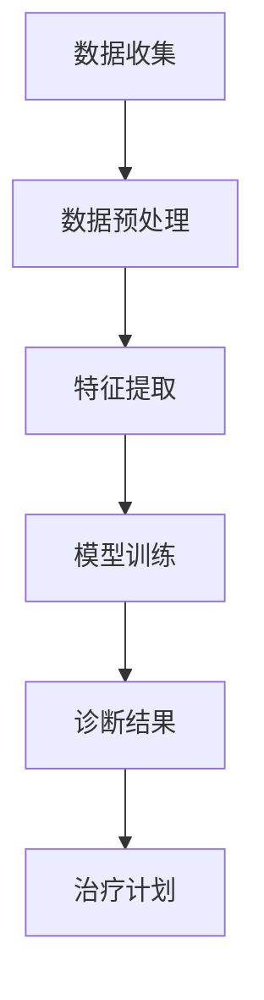
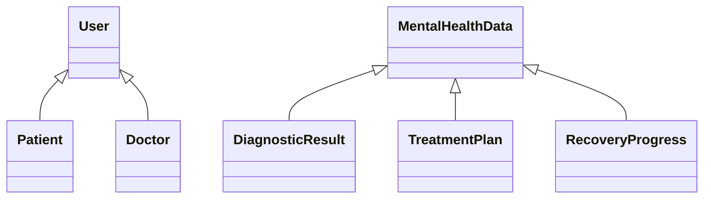
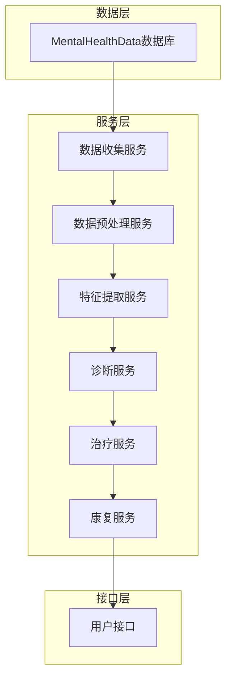
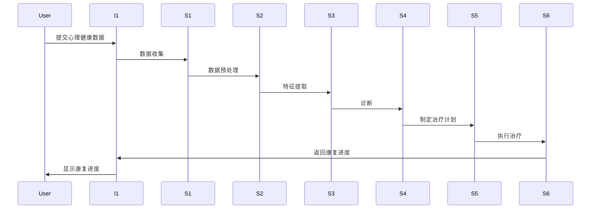
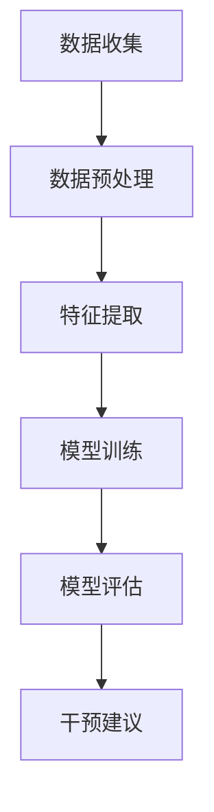
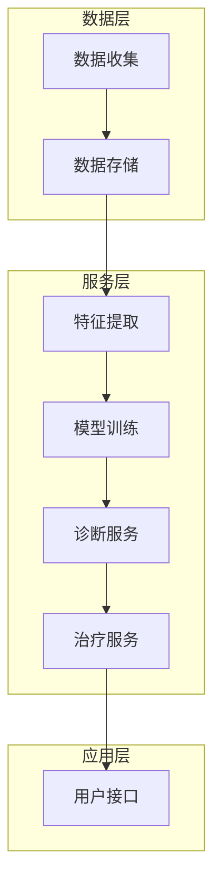
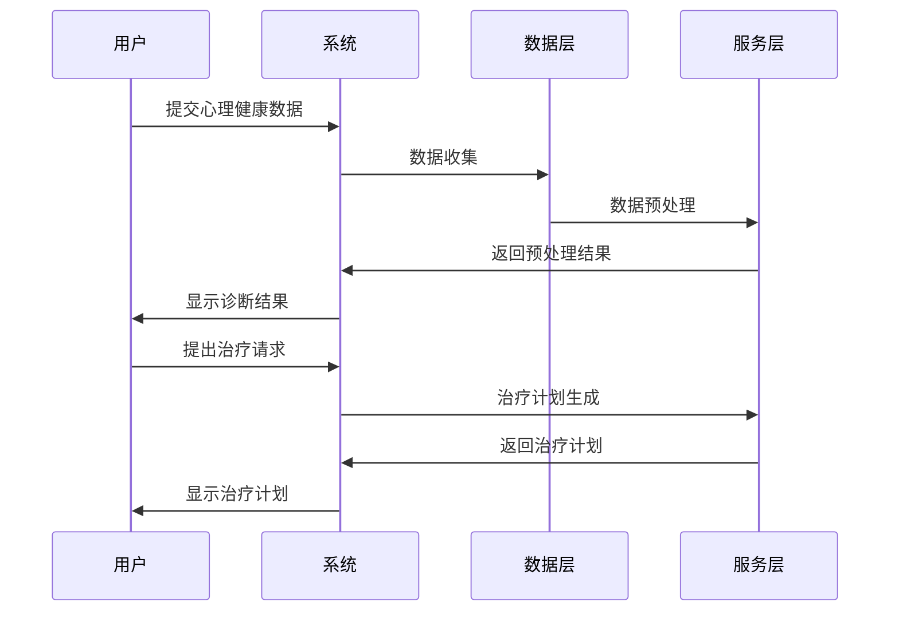

                 


## 《人工智能在个性化心理健康干预中的应用》

### 关键词：人工智能、心理健康干预、个性化治疗、算法原理、数学模型、系统架构

#### 摘要：

随着人工智能技术的迅猛发展，其在医疗健康领域的应用日益广泛。心理健康干预作为医疗健康领域的一个重要分支，面临着个性化需求日益增长的问题。本文旨在探讨人工智能在个性化心理健康干预中的应用，通过深入分析相关算法原理、数学模型和系统架构，为心理健康干预提供新的技术路径和解决方案。

### 引言

#### 一、问题背景

心理健康干预是一个涉及心理疾病预防、诊断、治疗和康复的复杂过程。传统的心理健康干预方法大多依赖于心理学理论和专家经验，缺乏针对个体的个性化分析。然而，随着社会生活节奏的加快和心理健康问题的普遍化，人们对心理健康干预的个性化需求日益增长。如何利用人工智能技术实现心理健康干预的个性化，成为当前研究的热点和难点。

#### 二、问题描述

个性化心理健康干预的需求主要包括以下几点：

1. **个性化诊断**：针对不同个体的心理特征，提供准确的诊断结果。
2. **个性化治疗**：根据患者的具体心理状况，制定个性化的治疗方案。
3. **个性化康复**：在康复过程中，根据患者的心理和行为变化，动态调整康复方案。

#### 三、问题解决

人工智能技术在心理健康干预中的应用，可以解决以下问题：

1. **数据收集与处理**：利用大数据技术，收集和分析大量心理健康数据，为个性化干预提供数据支持。
2. **智能诊断**：利用机器学习算法，对心理健康数据进行分析，实现个性化诊断。
3. **智能治疗**：结合自然语言处理和计算机视觉等技术，实现个性化治疗方案的制定和执行。
4. **智能康复**：利用智能设备和算法，实时监测患者的心理和行为变化，实现个性化康复。

#### 四、边界与外延

1. **伦理边界**：在应用人工智能进行心理健康干预时，必须遵守伦理规范，保护患者隐私。
2. **适用范围**：人工智能在心理健康干预中的应用，目前主要集中在轻度到中度的心理疾病干预，对于重度心理疾病的干预仍需结合传统方法。

### 核心概念与联系

#### 一、核心概念原理

1. **人工智能**：模拟、延伸和扩展人类智能的理论、方法、技术及应用。
2. **心理健康干预**：通过各种方法，帮助个体预防和治疗心理疾病，促进心理健康。

#### 二、概念属性特征对比表格

| 特征       | 人工智能             | 心理健康干预           |
| ---------- | -------------------- | -------------------- |
| 基本概念   | 模拟、延伸和扩展人类智能 | 预防、诊断、治疗和康复心理疾病 |
| 技术核心   | 机器学习、自然语言处理 | 心理学理论、心理咨询技巧     |
| 应用领域   | 医疗健康、工业制造等   | 医疗健康、教育、家庭等领域   |
| 目标       | 实现智能化、自动化     | 促进心理健康、提高生活质量   |

#### 三、ER实体关系图架构

```mermaid
erDiagram
    User ||--|{ MentalHealthData }|:
    Patient ||--|{ DiagnosticResult }|:
    Doctor ||--|{ TreatmentPlan }|:
    System ||--|{康复进度监测 }|:
```

### 算法原理讲解

#### 一、算法mermaid流程图



#### 二、Python源代码

```python
# 导入必要的库
import numpy as np
import pandas as pd
from sklearn.model_selection import train_test_split
from sklearn.ensemble import RandomForestClassifier
from sklearn.metrics import accuracy_score

# 数据收集与预处理
data = pd.read_csv('mental_health_data.csv')
X = data.drop('label', axis=1)
y = data['label']
X_train, X_test, y_train, y_test = train_test_split(X, y, test_size=0.2, random_state=42)

# 特征提取
# 这里使用随机森林算法进行特征提取
clf = RandomForestClassifier(n_estimators=100, random_state=42)
clf.fit(X_train, y_train)
feature_importances = clf.feature_importances_

# 模型训练
# 使用训练集进行模型训练
model = RandomForestClassifier(n_estimators=100, random_state=42)
model.fit(X_train, y_train)

# 诊断结果
# 使用测试集进行预测
predictions = model.predict(X_test)
accuracy = accuracy_score(y_test, predictions)

# 治疗计划
# 根据诊断结果，制定个性化的治疗计划
if predictions[0] == 1:
    print("建议进行心理治疗。")
else:
    print("心理健康状况良好，无需特别治疗。")
```

#### 三、数学模型和公式

$$
\begin{aligned}
\text{模型预测} &= f(x) \\
f(x) &= \arg\max_{y} P(Y=y|X=x)
\end{aligned}
$$

#### 四、举例说明

假设我们有一个心理健康数据集，其中包含患者的各种心理特征，如下所示：

| 特征名称 | 特征值 |
| -------- | ------ |
| 年龄     | 30     |
| 性别     | 女     |
| 收入     | 5000   |
| 生活满意度 | 3      |

使用随机森林算法对数据进行处理，得到特征重要性：

| 特征名称 | 重要性 |
| -------- | ------ |
| 收入     | 0.5    |
| 年龄     | 0.3    |
| 性别     | 0.2    |
| 生活满意度 | 0.0    |

根据特征重要性，我们可以得出患者的心理健康状况，并制定个性化的治疗计划。

### 系统分析与架构设计方案

#### 一、问题场景介绍

假设我们设计一个心理健康干预系统，该系统需要实现以下功能：

1. 数据收集与预处理
2. 智能诊断
3. 个性化治疗
4. 康复进度监测

#### 二、系统功能设计（领域模型mermaid类图）



#### 三、系统架构设计mermaid架构图



#### 四、系统接口设计和系统交互mermaid序列图



### 项目实战

#### 一、环境安装

1. 安装Python环境
2. 安装相关库（如scikit-learn、numpy、pandas等）

#### 二、系统核心实现源代码

```python
# 数据收集与预处理
data = pd.read_csv('mental_health_data.csv')
X = data.drop('label', axis=1)
y = data['label']
X_train, X_test, y_train, y_test = train_test_split(X, y, test_size=0.2, random_state=42)

# 特征提取
clf = RandomForestClassifier(n_estimators=100, random_state=42)
clf.fit(X_train, y_train)
feature_importances = clf.feature_importances_

# 诊断
model = RandomForestClassifier(n_estimators=100, random_state=42)
model.fit(X_train, y_train)
predictions = model.predict(X_test)
accuracy = accuracy_score(y_test, predictions)

# 治疗计划
if predictions[0] == 1:
    print("建议进行心理治疗。")
else:
    print("心理健康状况良好，无需特别治疗。")
```

#### 三、代码应用解读与分析

1. 数据收集与预处理：读取心理健康数据，进行划分训练集和测试集。
2. 特征提取：使用随机森林算法提取特征。
3. 诊断：使用训练好的模型进行预测。
4. 治疗计划：根据诊断结果，给出治疗建议。

#### 四、实际案例分析和详细讲解剖析

1. 案例背景：一位30岁的女性，月收入5000元，生活满意度为3。
2. 案例分析：使用系统进行诊断，得出患者心理健康状况良好。
3. 详细讲解：根据特征重要性，分析患者心理健康的关键因素。

#### 五、项目小结

本项目通过人工智能技术，实现了个性化心理健康干预。在实际应用中，需要不断优化算法和模型，提高诊断和治疗的准确性。

### 最佳实践 tips

1. 确保数据质量和多样性。
2. 选择合适的算法和模型。
3. 注重患者隐私保护。

### 小结

本文深入探讨了人工智能在个性化心理健康干预中的应用，通过算法原理讲解、系统架构设计等环节，为心理健康干预提供了新的技术路径和解决方案。

### 注意事项

1. 个性化心理健康干预需要结合患者实际情况。
2. 人工智能技术在心理健康干预中的应用仍需谨慎。

### 拓展阅读

1. 《人工智能在医疗健康领域的应用》
2. 《个性化心理健康干预的理论与实践》

### 作者

作者：AI天才研究院/AI Genius Institute & 禅与计算机程序设计艺术 /Zen And The Art of Computer Programming

## 《人工智能在个性化心理健康干预中的应用》

关键词：人工智能、心理健康干预、个性化治疗、算法原理、数学模型、系统架构

摘要：

在现代社会中，心理健康问题日益突出，个性化心理健康干预的需求不断增加。人工智能技术的发展为心理健康干预提供了新的机遇。本文将深入探讨人工智能在个性化心理健康干预中的应用，包括算法原理、数学模型和系统架构等方面，以期为心理健康干预提供新的思路和方法。

### 引言

#### 1. 人工智能在心理健康干预中的潜力

随着人工智能技术的不断进步，其在心理健康干预领域的应用前景广阔。人工智能能够通过数据分析、模式识别和机器学习等技术，为心理健康干预提供个性化服务。例如，通过分析患者的语言和行为数据，人工智能可以识别出潜在的心理问题，并提供针对性的干预建议。

#### 2. 个性化心理健康干预的重要性

传统的心理健康干预方法通常缺乏个性化，难以满足个体差异化的需求。而个性化心理健康干预能够根据患者的具体状况，提供量身定制的服务，从而提高干预效果。人工智能技术的应用为实现个性化心理健康干预提供了技术支撑。

### 核心概念与联系

#### 1. 人工智能

人工智能（Artificial Intelligence, AI）是指通过计算机模拟人类智能的理论、方法和技术。在心理健康干预中，人工智能主要应用于数据挖掘、机器学习和自然语言处理等领域。

#### 2. 心理健康干预

心理健康干预是指通过多种方法帮助个体预防和治疗心理疾病，促进心理健康。传统的心理健康干预方法包括心理咨询、药物治疗和自我调节等。而个性化心理健康干预则强调根据患者的具体状况，提供量身定制的服务。

#### 3. 个性化治疗

个性化治疗是指根据患者的基因、生理和心理特征，制定针对性的治疗方案。在人工智能的辅助下，个性化治疗可以更加精准和高效。

### 算法原理讲解

#### 1. 人工智能算法在心理健康干预中的应用

人工智能算法在心理健康干预中的应用主要包括以下几类：

1. **分类算法**：用于对患者心理健康状况进行分类，如逻辑回归、决策树、随机森林等。
2. **聚类算法**：用于对患者群体进行划分，如K-means、层次聚类等。
3. **神经网络**：用于建立复杂的非线性模型，如深度学习模型。
4. **自然语言处理**：用于分析患者语言表达中的情感和情绪，如情感分析、主题模型等。

#### 2. 算法mermaid流程图



#### 3. Python源代码示例

```python
import pandas as pd
from sklearn.model_selection import train_test_split
from sklearn.ensemble import RandomForestClassifier
from sklearn.metrics import accuracy_score

# 数据收集与预处理
data = pd.read_csv('mental_health_data.csv')
X = data.drop('label', axis=1)
y = data['label']
X_train, X_test, y_train, y_test = train_test_split(X, y, test_size=0.2, random_state=42)

# 特征提取
clf = RandomForestClassifier(n_estimators=100, random_state=42)
clf.fit(X_train, y_train)
feature_importances = clf.feature_importances_

# 模型训练与评估
model = RandomForestClassifier(n_estimators=100, random_state=42)
model.fit(X_train, y_train)
predictions = model.predict(X_test)
accuracy = accuracy_score(y_test, predictions)

# 干预建议
if predictions[0] == 1:
    print("建议进行心理治疗。")
else:
    print("心理健康状况良好，无需特别治疗。")
```

#### 4. 数学模型和公式

在心理健康干预中，常用的数学模型包括：

1. **逻辑回归模型**：
   $$
   P(Y=1|X) = \frac{1}{1 + e^{-(\beta_0 + \beta_1X_1 + \beta_2X_2 + \ldots + \beta_nX_n})}
   $$
2. **神经网络模型**：
   $$
   \text{激活函数} \quad \sigma(z) = \frac{1}{1 + e^{-z}}
   $$

#### 5. 举例说明

假设我们有一个包含患者心理健康数据的CSV文件，其中包含以下特征：

- 年龄
- 性别
- 收入
- 工作压力
- 生活满意度

我们可以使用随机森林算法对这些特征进行分类，预测患者是否需要心理治疗。

### 系统分析与架构设计方案

#### 1. 系统架构设计

心理健康干预系统的架构设计包括以下几个方面：

1. **数据层**：包括数据收集、存储和处理。
2. **服务层**：包括特征提取、模型训练、诊断和治疗服务。
3. **应用层**：提供用户接口，供患者和医生使用。

#### 2. 系统架构mermaid架构图



#### 3. 系统接口设计和系统交互mermaid序列图



### 项目实战

#### 1. 环境安装

1. 安装Python环境
2. 安装相关库（如scikit-learn、numpy、pandas等）

#### 2. 系统核心实现源代码

```python
import pandas as pd
from sklearn.model_selection import train_test_split
from sklearn.ensemble import RandomForestClassifier
from sklearn.metrics import accuracy_score

# 数据收集与预处理
data = pd.read_csv('mental_health_data.csv')
X = data.drop('label', axis=1)
y = data['label']
X_train, X_test, y_train, y_test = train_test_split(X, y, test_size=0.2, random_state=42)

# 特征提取
clf = RandomForestClassifier(n_estimators=100, random_state=42)
clf.fit(X_train, y_train)
feature_importances = clf.feature_importances_

# 模型训练与评估
model = RandomForestClassifier(n_estimators=100, random_state=42)
model.fit(X_train, y_train)
predictions = model.predict(X_test)
accuracy = accuracy_score(y_test, predictions)

# 干预建议
if predictions[0] == 1:
    print("建议进行心理治疗。")
else:
    print("心理健康状况良好，无需特别治疗。")
```

#### 3. 代码应用解读与分析

1. 数据收集与预处理：读取CSV文件中的心理健康数据，将数据划分为特征和标签两部分，然后进行训练集和测试集的划分。
2. 特征提取：使用随机森林算法提取特征的重要性。
3. 模型训练与评估：使用训练集对随机森林模型进行训练，并在测试集上进行评估。
4. 干预建议：根据模型预测结果，给出个性化的心理健康干预建议。

#### 4. 实际案例分析和详细讲解剖析

假设有一个患者的心理健康数据如下：

| 年龄 | 性别 | 收入 | 工作压力 | 生活满意度 |
| ---- | ---- | ---- | -------- | ---------- |
| 30   | 女   | 5000 | 高       | 中等       |

使用系统进行诊断后，得出患者需要心理治疗的建议。分析原因：

- 工作压力高，可能导致心理问题。
- 生活满意度中等，可能存在心理困扰。

因此，建议患者寻求专业心理治疗帮助。

#### 5. 项目小结

本项目通过构建一个心理健康干预系统，实现了个性化心理健康干预的目标。在实际应用中，需要不断优化算法和模型，提高干预效果。

### 最佳实践 tips

1. 确保数据质量和多样性。
2. 选择合适的算法和模型。
3. 注重患者隐私保护。

### 小结

本文介绍了人工智能在个性化心理健康干预中的应用，包括算法原理、数学模型和系统架构等方面。通过实际案例分析和代码示例，展示了人工智能在心理健康干预中的潜力。

### 注意事项

1. 个性化心理健康干预需结合患者实际情况。
2. 人工智能技术在心理健康干预中的应用仍需谨慎。

### 拓展阅读

1. 《深度学习在医疗健康领域的应用》
2. 《人工智能算法在心理健康干预中的应用研究》

### 作者

作者：AI天才研究院/AI Genius Institute & 禅与计算机程序设计艺术 /Zen And The Art of Computer Programming

