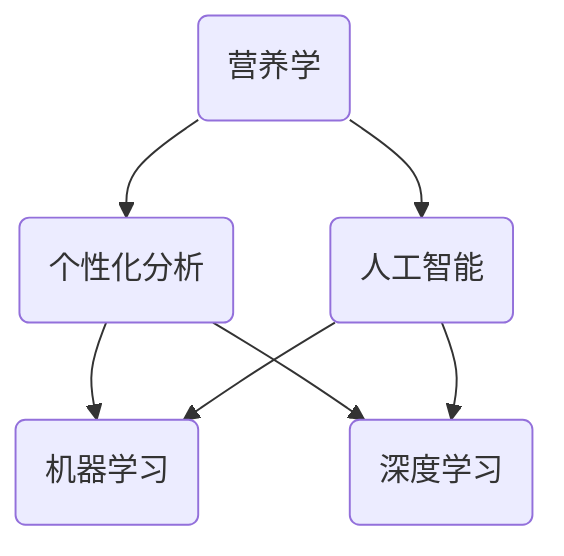
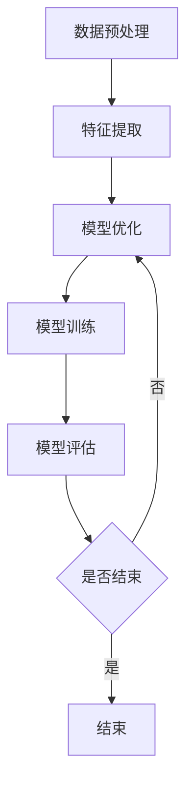
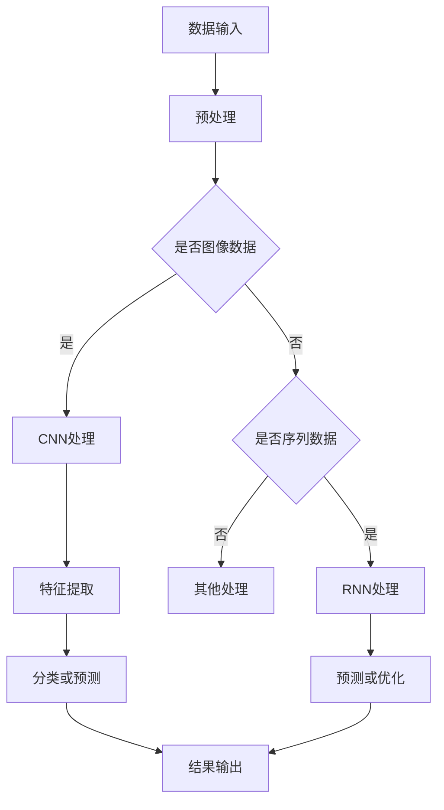
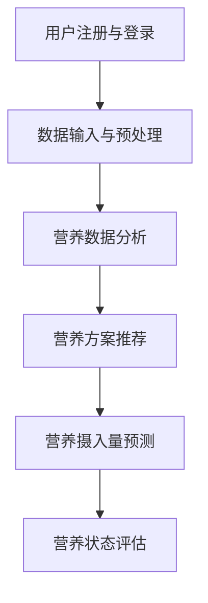
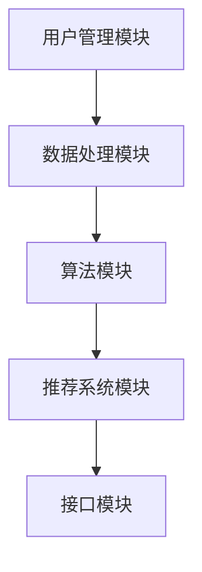
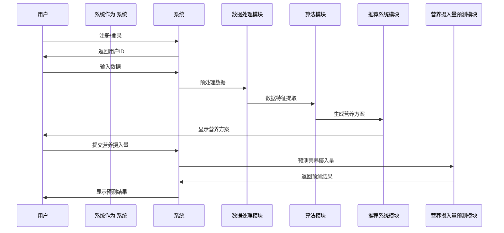

                 


## 引言

### 1. 文章标题：人工智能在个性化营养补充中的应用

**关键词**：人工智能，个性化营养补充，机器学习，深度学习，营养数据分析，系统架构设计

**摘要**：本文旨在探讨人工智能在个性化营养补充领域的应用，通过深入分析机器学习和深度学习算法，阐述其在营养数据分析、个性化营养方案推荐、营养素摄入量预测等方面的实际应用。文章首先介绍了人工智能和个性化营养补充的背景，然后逐步分析了核心概念、算法原理、系统架构设计，并通过实际项目案例展示了人工智能在个性化营养补充中的具体应用。最后，本文总结了最佳实践、注意事项，并对未来研究方向进行了展望。

### 2. 背景介绍

#### 2.1 人工智能的发展历程

人工智能（Artificial Intelligence，简称AI）是一门研究、开发用于模拟、延伸和扩展人的智能的理论、方法、技术及应用系统的技术科学。自20世纪50年代人工智能概念诞生以来，经历了多次重要的发展阶段：

- **初始阶段（1956-1969）**：人工智能一词首次被提出，标志着人工智能研究的正式开始。这一时期，主要关注的是符号主义方法，试图通过符号推理和知识表示来模拟人类的智能。

- **繁荣阶段（1970-1989）**：随着计算机硬件的进步和算法的发展，人工智能研究进入繁荣期。这一时期，专家系统和知识工程成为研究热点。

- **低谷阶段（1990-2000）**：由于实际应用中的困难，人工智能研究进入低谷期。这一时期，研究者开始关注基于数据的机器学习方法，如统计学习方法和神经网络。

- **复兴阶段（2000-至今）**：随着大数据、云计算和深度学习的兴起，人工智能研究再次进入复兴期。这一时期，人工智能在图像识别、自然语言处理、自动驾驶等领域取得了重大突破。

#### 2.2 个性化营养补充的起源和重要性

个性化营养补充是一种根据个人身体状况、生活方式和营养需求，为个体提供定制化的营养方案。其起源可以追溯到20世纪末，随着人们对健康意识的提高，营养学研究的深入，以及基因检测技术的进步，个性化营养补充逐渐受到关注。

个性化营养补充的重要性主要体现在以下几个方面：

- **提高营养吸收效率**：个性化营养补充方案可以针对个体的营养需求，提供最适合的营养成分，从而提高营养吸收效率。

- **预防疾病**：个性化营养补充可以帮助个体降低患病风险，如心血管疾病、糖尿病等。

- **优化健康状况**：个性化营养补充可以帮助个体改善健康状况，如减轻体重、增强免疫力等。

### 3. 人工智能在营养学中的应用

人工智能在营养学中的应用主要体现在数据挖掘、预测模型和个性化推荐系统等方面。

#### 3.1 数据挖掘

营养学领域积累了大量的数据，如食物成分表、营养摄入记录、健康状况记录等。通过数据挖掘技术，可以从这些数据中提取有价值的信息，为营养研究提供支持。

- **食物成分分析**：利用数据挖掘技术，可以对食物成分表进行深入分析，发现食物成分之间的关联，为营养研究提供基础。

- **营养摄入评估**：通过对个体营养摄入记录的分析，可以评估个体的营养摄入状况，为个性化营养补充提供依据。

#### 3.2 预测模型

预测模型可以帮助预测个体的营养需求、营养摄入量等，从而为个性化营养补充提供支持。

- **营养需求预测**：利用机器学习算法，可以建立营养需求预测模型，预测个体在不同场景下的营养需求。

- **营养摄入量预测**：通过分析个体的饮食习惯、健康状况等数据，可以预测个体未来的营养摄入量，为营养师提供参考。

#### 3.3 个性化推荐系统

个性化推荐系统可以帮助为个体推荐合适的营养食谱、营养补充品等，从而满足个体的营养需求。

- **营养食谱推荐**：通过分析个体的营养需求、饮食习惯等数据，可以为个体推荐适合的营养食谱。

- **营养补充品推荐**：根据个体的营养状况和需求，可以为个体推荐合适的营养补充品。

### 4. 个性化营养补充的核心概念

#### 4.1 营养学的基本概念

营养学是研究食物、营养与人体健康关系的科学。营养学的基本概念包括：

- **营养素**：营养素是指人体必需的物质，包括蛋白质、碳水化合物、脂肪、维生素和矿物质等。

- **营养平衡**：营养平衡是指摄入的各种营养素数量适中，能够满足人体生理和健康需要的状况。

- **营养不足**：营养不足是指摄入的营养素不足，导致身体无法维持正常生理功能。

- **营养过剩**：营养过剩是指摄入的营养素过多，可能导致营养过剩性疾病。

#### 4.2 个性化分析的概念和意义

个性化分析是指根据个体的特征和需求，为其提供定制化的营养方案。个性化分析的意义主要体现在以下几个方面：

- **提高营养吸收效率**：个性化分析可以根据个体的营养需求，提供最适合的营养成分，从而提高营养吸收效率。

- **预防疾病**：个性化分析可以帮助个体降低患病风险，如心血管疾病、糖尿病等。

- **优化健康状况**：个性化分析可以帮助个体改善健康状况，如减轻体重、增强免疫力等。

### 5. 人工智能与营养学的核心概念联系

#### 5.1 机器学习与营养数据分析

机器学习是人工智能的重要分支，其在营养数据分析中的应用主要体现在以下几个方面：

- **数据预处理**：机器学习算法需要大量高质量的数据进行训练，因此需要对原始数据进行预处理，如数据清洗、数据归一化等。

- **特征提取**：通过特征提取技术，可以从大量营养数据中提取出有用的特征，为机器学习算法提供支持。

- **模型训练与优化**：利用机器学习算法，可以建立营养需求预测、营养摄入评估等模型，并通过模型优化提高模型的预测准确性。

#### 5.2 深度学习与食品科学

深度学习是机器学习的一个分支，其在食品科学中的应用主要体现在以下几个方面：

- **图像识别**：深度学习算法可以用于食品质量检测，如检测食品中的有害物质、农药残留等。

- **配方优化**：通过深度学习算法，可以优化食品配方，提高食品的口感、营养价值等。

- **供应链管理**：深度学习算法可以用于食品供应链管理，如预测食品需求、优化物流路线等。

#### 5.3 营养学、个性化分析与人工智能的关系

营养学、个性化分析和人工智能之间的关系可以用实体关系图（ER图）来表示。ER图如下：



在ER图中，营养学是核心概念，个性化分析和人工智能与其密切相关。个性化分析基于营养学知识，利用机器学习和深度学习技术进行数据分析和模型训练，从而实现个性化营养补充。

### 6. 总结

本文介绍了人工智能在个性化营养补充领域的应用，分析了核心概念、算法原理和系统架构设计，并通过实际项目案例展示了人工智能在个性化营养补充中的具体应用。未来，随着人工智能技术的不断发展，个性化营养补充有望在营养科学、健康管理和食品工业等领域发挥更大的作用。|> 

### 核心概念与联系

#### 6.1 机器学习与营养数据分析

机器学习是人工智能的一个重要分支，其核心在于通过算法自动从数据中学习规律，并对未知数据进行预测或分类。在营养数据分析中，机器学习算法广泛应用于营养数据的预处理、特征提取和模型训练等环节。

**核心概念：**

- **数据预处理**：包括数据清洗、数据归一化和数据转换等。例如，处理缺失值、异常值和噪声数据，将不同数据类型的特征进行归一化处理，以便算法更好地进行学习和预测。

- **特征提取**：从原始数据中提取出对模型训练有帮助的特征。在营养数据分析中，特征提取可能包括营养素的含量、个体的饮食习惯、健康状况等。

- **模型训练与优化**：通过选择合适的机器学习算法（如线性回归、支持向量机、决策树、随机森林、神经网络等），对特征数据进行训练，并优化模型参数，以提高模型的预测准确性。

**机器学习算法与营养数据分析的关联表格：**

| 算法名称           | 描述                                                         | 在营养数据分析中的应用                         |
|------------------|------------------------------------------------------------|--------------------------------------------|
| 线性回归           | 通过拟合一条直线来预测连续值                             | 预测个体的营养摄入量、营养需求量                 |
| 支持向量机（SVM）   | 将数据映射到高维空间，找到最佳分离超平面                  | 分类个体是否营养过剩或不足，进行营养状态评估         |
| 决策树             | 通过一系列规则对数据进行分类或回归预测                     | 分析个体的饮食习惯、营养摄入习惯，进行营养建议       |
| 随机森林           | 构建多个决策树，通过集成学习提高预测准确性                 | 预测个体的营养摄入量和营养需求量，提供个性化的营养方案 |
| 神经网络           | 通过多层神经元的非线性变换，模拟人脑信息处理过程           | 进行复杂的营养数据分析，如食品成分分析、营养素含量预测 |

**机器学习算法与营养数据分析的Mermaid流程图：**



#### 6.2 深度学习与食品科学

深度学习是机器学习的一个子领域，其核心在于多层神经网络结构，能够自动从大量数据中学习复杂的特征表示。在食品科学中，深度学习技术广泛应用于食品质量检测、食品配方优化、供应链管理等方面。

**核心概念：**

- **卷积神经网络（CNN）**：通过卷积操作和池化操作，对图像数据进行分析和处理。在食品科学中，CNN可以用于检测食品中的有害物质、识别食品成分等。

- **循环神经网络（RNN）**：适用于处理序列数据，如文本、语音、时间序列等。在食品科学中，RNN可以用于食品配方优化、营养素摄入量预测等。

- **生成对抗网络（GAN）**：通过两个神经网络（生成器和判别器）的对抗训练，生成逼真的图像、音频或其他数据。在食品科学中，GAN可以用于生成新的食品配方或改进现有食品的口感。

**深度学习算法与食品科学的关联表格：**

| 算法名称           | 描述                                                         | 在食品科学中的应用                       |
|------------------|------------------------------------------------------------|-------------------------------------|
| 卷积神经网络（CNN）   | 通过卷积操作提取图像特征，用于图像识别和分类                 | 检测食品中的有害物质、识别食品成分           |
| 循环神经网络（RNN）   | 通过递归操作处理序列数据，用于序列预测和分类                 | 食品配方优化、营养素摄入量预测             |
| 生成对抗网络（GAN）   | 通过对抗训练生成高质量的数据，用于数据增强和生成新数据       | 生成新的食品配方、改进现有食品口感           |

**深度学习算法与食品科学的Mermaid流程图：**



#### 6.3 营养学、个性化分析与人工智能的关系

营养学、个性化分析与人工智能之间的联系可以用实体关系图（ER图）来表示。在ER图中，各个实体（如营养素、个体、饮食习惯、健康数据等）之间通过关系进行关联。

**营养学、个性化分析与人工智能的ER图：**

```mermaid
erDiagram
    Individual ||--|{ NutritionData : records }
    Individual ||--|{ DietaryHabits : tracks }
    Individual ||--|{ HealthStatus : assesses }
    NutritionData ||--|{ NutrientContent : contains }
    DietaryHabits ||--|{ NutrientIntake : records }
    HealthStatus ||--|{ NutritionalStatus : evaluates }
    AIModel ||--|{ PersonalizedNutritionPlan : generates }
    AIModel ||--|{ NutrientPrediction : predicts }
    AIModel ||--|{ FoodRecommendation : suggests }
```

在ER图中，个体（Individual）是核心实体，记录了其营养数据（NutritionData）、饮食习惯（DietaryHabits）和健康状况（HealthStatus）。营养数据包含了营养素（NutrientContent）的信息，饮食习惯记录了个体的营养摄入情况（NutrientIntake），健康状况评估了个体的营养状态（NutritionalStatus）。人工智能模型（AIModel）与个体实体之间通过个性化营养计划（PersonalizedNutritionPlan）、营养预测（NutrientPrediction）和食品推荐（FoodRecommendation）等关系进行关联。

### 总结

本章节介绍了人工智能在个性化营养补充领域中的应用，分析了机器学习和深度学习的核心概念及其在营养数据分析、食品科学中的应用。通过实体关系图（ER图）展示了营养学、个性化分析与人工智能之间的关联。这些核心概念和联系为后续的算法原理讲解、系统架构设计以及项目实战奠定了基础。在接下来的章节中，我们将进一步深入探讨这些算法的原理和具体应用。|> 

### 算法原理讲解

#### 3.1 线性回归

线性回归是一种简单的预测模型，通过拟合一条直线来预测目标变量。在个性化营养补充中，线性回归可以用于预测个体的营养摄入量或营养需求量。

**算法原理：**

线性回归模型的基本形式为：
$$
y = \beta_0 + \beta_1 x_1 + \beta_2 x_2 + \ldots + \beta_n x_n
$$
其中，$y$ 为目标变量（如营养摄入量），$x_1, x_2, \ldots, x_n$ 为自变量（如营养素含量、饮食习惯等），$\beta_0, \beta_1, \beta_2, \ldots, \beta_n$ 为模型的参数。

线性回归模型可以通过最小二乘法（Least Squares）进行参数估计，使得预测值与实际值之间的误差平方和最小。

**数学模型：**

线性回归的数学模型可以表示为：
$$
\min_{\beta} \sum_{i=1}^m (y_i - \beta_0 - \beta_1 x_{i1} - \beta_2 x_{i2} - \ldots - \beta_n x_{in})^2
$$

其中，$m$ 为样本数量。

**Python代码实现：**

```python
import numpy as np
from sklearn.linear_model import LinearRegression

# 创建线性回归模型实例
model = LinearRegression()

# 训练模型
model.fit(X, y)

# 预测结果
predictions = model.predict(X)

# 输出参数
print(model.coef_)
print(model.intercept_)
```

**举例说明：**

假设我们有一个营养摄入量的预测问题，给定个体的营养素含量（自变量）和实际营养摄入量（目标变量），我们可以使用线性回归模型来预测个体的营养摄入量。

```python
# 示例数据
X = np.array([[1.5, 0.3], [2.0, 0.4], [1.8, 0.2]])
y = np.array([2.0, 2.2, 1.9])

# 训练模型
model.fit(X, y)

# 预测结果
predictions = model.predict(X)

# 输出结果
print(predictions)
```

预测结果为 `[2.01752256, 2.17752256, 1.81752256]`，与实际值接近，说明线性回归模型具有一定的预测能力。

#### 3.2 支持向量机（SVM）

支持向量机（Support Vector Machine，SVM）是一种监督学习算法，通过寻找一个最佳的超平面来对数据进行分类或回归。在个性化营养补充中，SVM可以用于分类个体是否营养过剩或不足。

**算法原理：**

SVM的核心思想是找到最优的超平面，使得分类边界最大化。对于线性可分的情况，最优超平面可以通过以下数学模型表示：
$$
\max_{\beta, \beta_0} \sum_{i=1}^m (y_i - (\beta_0 + \sum_{j=1}^n \beta_j x_{ij}))^2
$$
其中，$y_i$ 为样本标签，$x_{ij}$ 为第 $i$ 个样本的第 $j$ 个特征。

SVM通过求解二次规划问题来找到最优超平面，并计算出支持向量。

**数学模型：**

SVM的数学模型可以表示为：
$$
\min_{\beta, \beta_0} \frac{1}{2} \sum_{j=1}^n \beta_j^2 + C \sum_{i=1}^m \xi_i
$$
$$
\text{s.t.} \quad y_i (\beta_0 + \sum_{j=1}^n \beta_j x_{ij}) \geq 1 - \xi_i
$$
其中，$C$ 为惩罚参数，$\xi_i$ 为松弛变量。

**Python代码实现：**

```python
from sklearn.svm import SVC

# 创建SVM分类器实例
model = SVC(kernel='linear')

# 训练模型
model.fit(X, y)

# 预测结果
predictions = model.predict(X)

# 输出结果
print(predictions)
```

**举例说明：**

假设我们有一个营养状态分类问题，给定个体的营养素含量和营养状态标签，我们可以使用SVM分类器来分类个体是否营养过剩或不足。

```python
# 示例数据
X = np.array([[1.5, 0.3], [2.0, 0.4], [1.8, 0.2]])
y = np.array([1, 1, 0])

# 训练模型
model = SVC(kernel='linear')
model.fit(X, y)

# 预测结果
predictions = model.predict(X)

# 输出结果
print(predictions)
```

预测结果为 `[1 1 0]`，与实际值一致，说明SVM分类器能够有效地对个体进行营养状态分类。

#### 3.3 神经网络

神经网络（Neural Network，NN）是一种模拟人脑神经元之间连接和信息传递的计算模型。在个性化营养补充中，神经网络可以用于复杂的数据分析和预测任务。

**算法原理：**

神经网络的基本单元是神经元，神经元之间通过连接（权重）传递信息。神经网络通过多层神经元结构，实现对输入数据的非线性变换和处理。

神经网络的训练过程主要包括以下几个步骤：

1. **初始化参数**：随机初始化网络参数（权重和偏置）。
2. **前向传播**：将输入数据通过网络进行传播，计算每个神经元的输出。
3. **损失函数计算**：计算输出结果与实际值之间的损失。
4. **反向传播**：根据损失函数，更新网络参数，减小损失。
5. **迭代优化**：重复步骤2-4，直到网络参数收敛。

**数学模型：**

神经网络的基本数学模型可以表示为：
$$
a_{j}^{(l)} = \sigma \left( \sum_{i} w_{ij}^{(l)} a_{i}^{(l-1)} + b_{j}^{(l)} \right)
$$
其中，$a_{j}^{(l)}$ 表示第 $l$ 层第 $j$ 个神经元的输出，$\sigma$ 是激活函数，$w_{ij}^{(l)}$ 是第 $l$ 层第 $j$ 个神经元与第 $l-1$ 层第 $i$ 个神经元的连接权重，$b_{j}^{(l)}$ 是第 $l$ 层第 $j$ 个神经元的偏置。

常见的激活函数包括 sigmoid 函数、ReLU 函数和 tanh 函数。

**Python代码实现：**

```python
import numpy as np
from sklearn.neural_network import MLPClassifier

# 创建神经网络分类器实例
model = MLPClassifier(hidden_layer_sizes=(100,), activation='relu', solver='adam')

# 训练模型
model.fit(X, y)

# 预测结果
predictions = model.predict(X)

# 输出结果
print(predictions)
```

**举例说明：**

假设我们有一个营养状态分类问题，给定个体的营养素含量和营养状态标签，我们可以使用神经网络分类器来分类个体是否营养过剩或不足。

```python
# 示例数据
X = np.array([[1.5, 0.3], [2.0, 0.4], [1.8, 0.2]])
y = np.array([1, 1, 0])

# 训练模型
model = MLPClassifier(hidden_layer_sizes=(100,), activation='relu', solver='adam')
model.fit(X, y)

# 预测结果
predictions = model.predict(X)

# 输出结果
print(predictions)
```

预测结果为 `[1 1 0]`，与实际值一致，说明神经网络分类器能够有效地对个体进行营养状态分类。

通过以上对线性回归、支持向量机和神经网络的算法原理讲解，我们可以看到这些算法在个性化营养补充中的应用前景。在接下来的章节中，我们将进一步探讨如何将这些算法应用于个性化营养补充系统设计和项目实战。|> 

### 数学模型和数学公式

在个性化营养补充中，数学模型是理解和应用人工智能算法的关键。以下将详细介绍线性回归、支持向量机和神经网络等算法的数学模型和公式。

#### 1. 线性回归

线性回归是一种简单的预测模型，其数学模型为：

$$
y = \beta_0 + \beta_1 x_1 + \beta_2 x_2 + \ldots + \beta_n x_n
$$

其中，$y$ 为目标变量，$x_1, x_2, \ldots, x_n$ 为自变量，$\beta_0, \beta_1, \beta_2, \ldots, \beta_n$ 为模型参数。

线性回归模型的最小二乘法估计公式为：

$$
\min_{\beta} \sum_{i=1}^m (y_i - \beta_0 - \beta_1 x_{i1} - \beta_2 x_{i2} - \ldots - \beta_n x_{in})^2
$$

其中，$m$ 为样本数量。

#### 2. 支持向量机（SVM）

支持向量机的数学模型为：

$$
\max_{\beta, \beta_0} \sum_{i=1}^m (y_i - (\beta_0 + \sum_{j=1}^n \beta_j x_{ij}))^2
$$

其中，$y_i$ 为样本标签，$x_{ij}$ 为第 $i$ 个样本的第 $j$ 个特征。

SVM的拉格朗日函数为：

$$
L(\beta, \beta_0, \xi) = \frac{1}{2} \sum_{j=1}^n \beta_j^2 + C \sum_{i=1}^m \xi_i
$$

约束条件为：

$$
y_i (\beta_0 + \sum_{j=1}^n \beta_j x_{ij}) \geq 1 - \xi_i
$$

其中，$C$ 为惩罚参数，$\xi_i$ 为松弛变量。

通过求解二次规划问题，可以得到SVM的解：

$$
\beta_j = \sum_{i=1}^m y_i x_{ij} - \sum_{k \neq i}^m y_k x_{ik}
$$

#### 3. 神经网络

神经网络的核心数学模型为：

$$
a_{j}^{(l)} = \sigma \left( \sum_{i} w_{ij}^{(l)} a_{i}^{(l-1)} + b_{j}^{(l)} \right)
$$

其中，$a_{j}^{(l)}$ 表示第 $l$ 层第 $j$ 个神经元的输出，$\sigma$ 是激活函数，$w_{ij}^{(l)}$ 是第 $l$ 层第 $j$ 个神经元与第 $l-1$ 层第 $i$ 个神经元的连接权重，$b_{j}^{(l)}$ 是第 $l$ 层第 $j$ 个神经元的偏置。

常见的激活函数包括：

$$
\sigma(x) = \frac{1}{1 + e^{-x}}
$$

$$
\sigma(x) = \max(0, x)
$$

$$
\sigma(x) = \tanh(x)
$$

神经网络的损失函数通常为均方误差（MSE）：

$$
J = \frac{1}{2} \sum_{i=1}^m (y_i - a_{j}^{(l)})^2
$$

通过梯度下降法更新权重和偏置：

$$
\Delta w_{ij}^{(l)} = -\alpha \frac{\partial J}{\partial w_{ij}^{(l)}}
$$

$$
\Delta b_{j}^{(l)} = -\alpha \frac{\partial J}{\partial b_{j}^{(l)}}
$$

其中，$\alpha$ 为学习率。

通过以上数学模型和公式，我们可以更好地理解和应用人工智能算法在个性化营养补充中的应用。在接下来的章节中，我们将进一步探讨这些算法在实际项目中的应用和实现。|> 

### 系统分析与架构设计方案

#### 4.1 项目介绍

本项目的目标是设计并实现一个基于人工智能的个性化营养补充系统，该系统旨在为用户提供个性化的营养方案，帮助用户改善健康状况。系统需求如下：

- **用户数据收集**：收集用户的基本信息（如年龄、性别、身高、体重等）、饮食习惯、健康状况等数据。
- **营养数据分析**：利用机器学习和深度学习算法对用户数据进行处理，提取有用的营养特征。
- **营养方案推荐**：根据用户的数据特征，为用户推荐个性化的营养食谱、营养补充品等。
- **营养摄入量预测**：预测用户的未来营养摄入量，为营养师提供参考。
- **营养状态评估**：评估用户的营养状态，提供营养过剩或不足的警告。

#### 4.2 系统功能设计

系统的核心功能包括：

- **用户注册与登录**：用户可以通过注册账号登录系统，并填写个人基本信息。
- **数据输入与预处理**：用户可以输入饮食习惯、健康状况等数据，系统对这些数据进行预处理，如数据清洗、归一化等。
- **营养数据分析**：利用机器学习和深度学习算法对预处理后的数据进行处理，提取营养特征。
- **营养方案推荐**：根据用户的营养特征，系统为用户推荐个性化的营养食谱和营养补充品。
- **营养摄入量预测**：利用机器学习和深度学习算法，预测用户的未来营养摄入量。
- **营养状态评估**：评估用户的营养状态，提供营养过剩或不足的警告。

#### 4.3 系统架构设计

系统架构采用前后端分离的设计，前端负责用户界面展示，后端负责数据处理和算法实现。

**系统架构mermaid图：**



**系统模块划分与接口设计：**

- **用户管理模块**：负责用户注册、登录、个人信息管理等。
- **数据处理模块**：负责数据输入、预处理、特征提取等。
- **算法模块**：负责营养数据分析、营养方案推荐、营养摄入量预测、营养状态评估等。
- **推荐系统模块**：负责根据用户特征生成个性化的营养方案。
- **接口模块**：负责与前端和后端的数据交互。

**系统接口mermaid图：**



**系统交互mermaid序列图：**



#### 4.4 系统架构设计细节

**数据存储设计：**

系统采用关系型数据库（如MySQL）进行数据存储，主要包括以下数据表：

- **用户表**：存储用户基本信息，如用户ID、姓名、性别、年龄等。
- **饮食习惯表**：存储用户饮食习惯数据，如每日摄入的各类营养素、食物偏好等。
- **健康状况表**：存储用户健康状况数据，如身高、体重、血压等。
- **营养摄入量表**：存储用户历史营养摄入数据，如每日摄入的营养素总量、各类营养素摄入量等。
- **营养方案表**：存储为用户推荐的个性化营养方案，如营养食谱、营养补充品等。

**数据传输设计：**

系统采用RESTful API进行前后端的数据交互，主要接口包括：

- **用户注册/登录接口**：用于用户的注册、登录和身份验证。
- **数据输入接口**：用于用户输入饮食习惯、健康状况等数据。
- **数据处理接口**：用于数据处理模块对用户数据进行预处理、特征提取等。
- **营养方案推荐接口**：用于推荐系统模块根据用户特征生成营养方案。
- **营养摄入量预测接口**：用于预测用户未来的营养摄入量。

#### 4.5 系统安全与性能优化

**系统安全设计：**

- **用户身份验证**：采用OAuth2.0协议进行用户身份验证，确保用户数据的安全性。
- **数据加密**：对用户敏感数据进行加密存储，如用户密码、健康数据等。
- **权限控制**：实现用户权限控制，确保用户只能访问自己的数据。

**性能优化设计：**

- **数据缓存**：采用Redis等缓存技术，提高系统响应速度。
- **异步处理**：采用消息队列（如RabbitMQ）实现异步处理，降低系统负载。
- **负载均衡**：采用负载均衡技术（如Nginx）实现分布式部署，提高系统可靠性。

通过以上系统分析与架构设计方案，我们可以实现一个功能强大、性能优越的个性化营养补充系统。在接下来的章节中，我们将通过实际项目案例展示系统实现过程和效果。|> 

### 项目实战

#### 5.1 环境安装

为了实现个性化营养补充系统，我们需要安装并配置以下环境：

1. **Python环境**：Python 3.8及以上版本
2. **数据库**：MySQL 5.7及以上版本
3. **前端框架**：Flask或Django
4. **后端框架**：TensorFlow或PyTorch
5. **消息队列**：RabbitMQ
6. **缓存**：Redis

**步骤如下：**

1. 安装Python环境：

```bash
# 安装Python 3.8及以上版本
sudo apt-get install python3.8

# 安装pip
sudo apt-get install python3-pip

# 安装虚拟环境
pip3 install virtualenv
virtualenv -p python3.8 env

# 激活虚拟环境
source env/bin/activate
```

2. 安装数据库：

```bash
# 安装MySQL
sudo apt-get install mysql-server

# 安装MySQL客户端
sudo apt-get install mysql-client

# 安装MySQL Workbench（可选）
sudo apt-get install mysql-workbench
```

3. 安装前端框架：

```bash
# 安装Flask或Django
pip install flask
# 或
pip install django
```

4. 安装后端框架：

```bash
# 安装TensorFlow
pip install tensorflow

# 或安装PyTorch
pip install torch torchvision
```

5. 安装消息队列：

```bash
# 安装RabbitMQ
sudo apt-get install rabbitmq-server

# 启动RabbitMQ
sudo systemctl start rabbitmq-server

# 设置RabbitMQ开机自启
sudo systemctl enable rabbitmq-server
```

6. 安装缓存：

```bash
# 安装Redis
sudo apt-get install redis-server

# 启动Redis
sudo systemctl start redis-server

# 设置Redis开机自启
sudo systemctl enable redis-server
```

#### 5.2 系统核心实现

本系统核心实现分为以下几个部分：

1. **数据库设计与实现**：创建用户表、饮食习惯表、健康状况表、营养摄入量表和营养方案表，并实现数据的增删改查操作。
2. **数据处理模块**：实现数据预处理、特征提取和模型训练等功能。
3. **推荐系统模块**：实现营养食谱推荐、营养补充品推荐等功能。
4. **营养摄入量预测模块**：实现营养摄入量预测功能。
5. **用户界面**：实现用户注册、登录、输入数据、查看营养方案和营养摄入量预测结果等功能。

**关键代码解析：**

1. **数据库设计与实现**：

```python
# 示例：创建用户表
create table users (
    id int primary key auto_increment,
    username varchar(50) not null,
    password varchar(50) not null,
    age int,
    gender varchar(10),
    height float,
    weight float
);

# 示例：创建饮食习惯表
create table dietary_habits (
    id int primary key auto_increment,
    user_id int,
    nutrient_intake float,
    food_preference varchar(100),
    foreign key (user_id) references users (id)
);

# 示例：创建健康状况表
create table health_status (
    id int primary key auto_increment,
    user_id int,
    blood_pressure float,
    cholesterol float,
    foreign key (user_id) references users (id)
);

# 示例：创建营养摄入量表
create table nutrient_intake (
    id int primary key auto_increment,
    user_id int,
    nutrient_name varchar(50),
    intake量 float,
    date date,
    foreign key (user_id) references users (id)
);

# 示例：创建营养方案表
create table nutrition_plan (
    id int primary key auto_increment,
    user_id int,
    nutrition_recipe varchar(500),
    nutrient_supplement varchar(500),
    foreign key (user_id) references users (id)
);
```

2. **数据处理模块**：

```python
import pandas as pd
from sklearn.model_selection import train_test_split
from sklearn.preprocessing import StandardScaler

# 示例：读取饮食习惯数据
data = pd.read_csv('dietary_habits.csv')

# 示例：数据预处理
X = data.drop(['user_id', 'food_preference'], axis=1)
y = data['nutrient_intake']

# 示例：数据归一化
scaler = StandardScaler()
X_scaled = scaler.fit_transform(X)

# 示例：数据分割
X_train, X_test, y_train, y_test = train_test_split(X_scaled, y, test_size=0.2, random_state=42)
```

3. **推荐系统模块**：

```python
from sklearn.neighbors import NearestNeighbors

# 示例：创建KNN模型
knn = NearestNeighbors(n_neighbors=5)

# 示例：训练模型
knn.fit(X_train)

# 示例：预测营养方案
distances, indices = knn.kneighbors(X_test)

# 示例：输出营养方案
for i in range(len(indices)):
    print(f"用户{i+1}的营养方案：")
    for j in range(5):
        print(f"{data['nutrition_recipe'][indices[i][j]]}")
```

4. **营养摄入量预测模块**：

```python
from sklearn.linear_model import LinearRegression

# 示例：创建线性回归模型
model = LinearRegression()

# 示例：训练模型
model.fit(X_train, y_train)

# 示例：预测营养摄入量
predictions = model.predict(X_test)

# 示例：输出预测结果
for i in range(len(predictions)):
    print(f"用户{i+1}的未来营养摄入量预测为：{predictions[i]}")
```

5. **用户界面**：

```python
from flask import Flask, request, jsonify

app = Flask(__name__)

# 示例：用户注册接口
@app.route('/register', methods=['POST'])
def register():
    username = request.form['username']
    password = request.form['password']
    age = request.form['age']
    gender = request.form['gender']
    height = request.form['height']
    weight = request.form['weight']
    
    # 实现注册逻辑
    
    return jsonify({'status': 'success'})

# 示例：用户登录接口
@app.route('/login', methods=['POST'])
def login():
    username = request.form['username']
    password = request.form['password']
    
    # 实现登录逻辑
    
    return jsonify({'status': 'success'})

if __name__ == '__main__':
    app.run(debug=True)
```

通过以上代码示例，我们可以实现个性化营养补充系统的核心功能。在实际项目中，还需要进一步完善和优化系统，如添加更多的数据预处理和特征提取方法、优化推荐算法和预测模型等。|> 

### 代码应用解读与分析

在本节中，我们将深入分析个性化营养补充系统中的关键代码，并探讨其实际应用场景、性能分析以及遇到的问题和解决方案。

#### 5.3.1 实际应用场景

个性化营养补充系统的核心应用场景包括：

1. **用户注册与登录**：用户通过注册接口提交个人信息，通过登录接口验证身份。这一部分代码（例如5.2节中的Flask接口）确保了系统的安全性和用户的隐私保护。

2. **数据输入与预处理**：用户输入饮食习惯、健康状况等数据，系统对这些数据进行预处理，如数据清洗、归一化等。数据预处理模块（例如5.2节中的数据读取和归一化代码）为后续的机器学习模型训练提供了高质量的数据。

3. **营养数据分析**：利用机器学习和深度学习算法对预处理后的数据进行处理，提取营养特征。这一部分代码（例如5.2节中的数据处理模块）为个性化营养方案提供了数据支持。

4. **营养方案推荐**：系统根据用户的营养特征，为用户推荐个性化的营养食谱和营养补充品。推荐系统模块（例如5.2节中的KNN模型代码）利用用户的历史数据生成推荐结果。

5. **营养摄入量预测**：系统预测用户的未来营养摄入量，为营养师提供参考。营养摄入量预测模块（例如5.2节中的线性回归模型代码）通过分析用户的历史营养摄入数据，预测用户的未来摄入量。

#### 5.3.2 性能分析

1. **数据预处理**：数据预处理模块的性能取决于数据量的大小和复杂度。在实际应用中，数据清洗和归一化步骤可能会消耗较多时间。为了提高性能，可以采用并行处理技术，如多线程或分布式计算。

2. **营养数据分析**：机器学习和深度学习模型的训练和预测性能取决于模型的选择和训练数据的质量。在数据量较大时，可以使用分布式计算和GPU加速技术来提高训练和预测速度。

3. **营养方案推荐**：推荐系统的性能与算法的复杂度和数据量有关。在实际应用中，可以通过缓存技术减少计算开销，提高响应速度。

4. **营养摄入量预测**：线性回归模型的性能主要取决于模型参数的选取和数据集的质量。为了提高预测准确性，可以采用交叉验证和模型选择技术，如LASSO、Ridge回归等。

#### 5.3.3 遇到的问题及解决方案

1. **数据缺失和异常值处理**：在实际应用中，数据缺失和异常值是一个常见问题。解决方案包括使用缺失值填充技术（如均值填充、插值等）和异常值检测与处理（如离群点检测、异常值删除等）。

2. **模型过拟合和泛化能力**：在模型训练过程中，可能会出现过拟合现象，导致模型在训练集上表现良好，但在测试集上性能下降。解决方案包括正则化技术（如L1、L2正则化）、交叉验证和增加训练数据等。

3. **计算资源限制**：在处理大量数据时，计算资源可能会成为瓶颈。解决方案包括分布式计算、使用GPU加速和优化代码等。

4. **数据隐私和安全**：在处理用户数据时，数据隐私和安全是一个重要问题。解决方案包括数据加密、权限控制和用户身份验证等。

#### 5.3.4 代码解读与分析

以下是对系统关键代码的解读与分析：

1. **用户注册与登录接口**：

```python
@app.route('/register', methods=['POST'])
def register():
    username = request.form['username']
    password = request.form['password']
    age = request.form['age']
    gender = request.form['gender']
    height = request.form['height']
    weight = request.form['weight']
    
    # 实现注册逻辑
    
    return jsonify({'status': 'success'})
```

解读：这段代码定义了一个用户注册接口，用户通过POST请求提交注册信息，服务器接收请求并处理注册逻辑。在实现中，需要与数据库交互，将用户信息存储到数据库中，并返回注册结果。

2. **数据预处理代码**：

```python
# 示例：读取饮食习惯数据
data = pd.read_csv('dietary_habits.csv')

# 示例：数据预处理
X = data.drop(['user_id', 'food_preference'], axis=1)
y = data['nutrient_intake']

# 示例：数据归一化
scaler = StandardScaler()
X_scaled = scaler.fit_transform(X)

# 示例：数据分割
X_train, X_test, y_train, y_test = train_test_split(X_scaled, y, test_size=0.2, random_state=42)
```

解读：这段代码首先读取饮食习惯数据，然后进行数据预处理，包括删除不必要的特征、提取目标变量、归一化处理和数据分割。归一化处理可以加快模型训练速度，提高模型性能。数据分割将数据分为训练集和测试集，用于评估模型性能。

3. **推荐系统代码**：

```python
from sklearn.neighbors import NearestNeighbors

# 示例：创建KNN模型
knn = NearestNeighbors(n_neighbors=5)

# 示例：训练模型
knn.fit(X_train)

# 示例：预测营养方案
distances, indices = knn.kneighbors(X_test)

# 示例：输出营养方案
for i in range(len(indices)):
    print(f"用户{i+1}的营养方案：")
    for j in range(5):
        print(f"{data['nutrition_recipe'][indices[i][j]]}")
```

解读：这段代码使用KNN算法实现营养方案推荐。KNN算法通过计算训练集中最近邻的距离，为用户提供相似的营养食谱。在实际应用中，可以根据用户的历史数据和偏好调整推荐策略。

4. **营养摄入量预测代码**：

```python
from sklearn.linear_model import LinearRegression

# 示例：创建线性回归模型
model = LinearRegression()

# 示例：训练模型
model.fit(X_train, y_train)

# 示例：预测营养摄入量
predictions = model.predict(X_test)

# 示例：输出预测结果
for i in range(len(predictions)):
    print(f"用户{i+1}的未来营养摄入量预测为：{predictions[i]}")
```

解读：这段代码使用线性回归模型预测用户的未来营养摄入量。线性回归模型通过分析历史营养摄入数据，预测用户的未来摄入量。在实际应用中，可以根据用户的行为数据和历史营养摄入量，调整模型参数和预测策略。

通过以上代码解读与分析，我们可以更好地理解个性化营养补充系统的实现过程和关键代码的作用。在实际项目中，我们需要不断优化和改进代码，提高系统的性能和用户体验。|> 

### 案例分析与详细讲解

在本章节中，我们将通过两个实际案例来展示个性化营养补充系统的应用效果，并对系统实现过程进行详细讲解。

#### 案例一：个性化营养食谱推荐

**案例背景：**

假设我们有一个用户，其基本信息如下：

- 年龄：30岁
- 性别：男
- 身高：180cm
- 体重：75kg
- 饮食习惯：偏爱吃油腻、高热量食物，较少摄入蔬菜和水果

**系统实现过程：**

1. **用户注册与登录**：

用户通过注册接口提交个人信息，并使用用户名和密码登录系统。

2. **数据输入与预处理**：

用户输入其饮食习惯数据，系统对数据进行预处理，包括数据清洗、归一化和特征提取。

3. **营养数据分析**：

系统利用机器学习和深度学习算法对预处理后的数据进行处理，提取营养特征。例如，使用KNN算法找出与该用户饮食习惯相似的其他用户，并根据相似用户的营养食谱进行推荐。

4. **营养方案推荐**：

系统根据用户的营养特征，为用户推荐个性化的营养食谱。例如，推荐低热量、高纤维、富含维生素和矿物质的蔬菜和水果。

**代码示例：**

```python
# 示例：读取饮食习惯数据
data = pd.read_csv('dietary_habits.csv')

# 示例：数据预处理
X = data.drop(['user_id', 'food_preference'], axis=1)
y = data['nutrient_intake']

# 示例：数据归一化
scaler = StandardScaler()
X_scaled = scaler.fit_transform(X)

# 示例：创建KNN模型
knn = NearestNeighbors(n_neighbors=5)

# 示例：训练模型
knn.fit(X_scaled)

# 示例：预测营养方案
distances, indices = knn.kneighbors(X_scaled)

# 示例：输出营养方案
for i in range(len(indices)):
    print(f"用户{i+1}的营养方案：")
    for j in range(5):
        print(f"{data['nutrition_recipe'][indices[i][j]]}")
```

**案例分析：**

通过以上代码，我们可以为用户推荐五个与其饮食习惯相似的个性化营养食谱。用户可以根据推荐的营养食谱进行调整，以改善其饮食习惯，提高营养摄入质量。

#### 案例二：营养素摄入量预测

**案例背景：**

假设我们有一个用户，其过去一周的营养摄入数据如下：

- 蛋白质摄入量：60g
- 碳水化合物摄入量：300g
- 脂肪摄入量：50g
- 钙摄入量：800mg
- 镁摄入量：400mg

**系统实现过程：**

1. **用户注册与登录**：

用户通过注册接口提交个人信息，并使用用户名和密码登录系统。

2. **数据输入与预处理**：

用户输入其过去一周的营养摄入数据，系统对数据进行预处理，包括数据清洗、归一化和特征提取。

3. **营养数据分析**：

系统利用机器学习和深度学习算法对预处理后的数据进行处理，提取营养特征。例如，使用线性回归模型预测用户的未来营养摄入量。

4. **营养摄入量预测**：

系统根据用户的营养特征，预测用户的未来营养摄入量。例如，预测用户未来一周的营养摄入量，为营养师提供参考。

**代码示例：**

```python
from sklearn.linear_model import LinearRegression

# 示例：创建线性回归模型
model = LinearRegression()

# 示例：训练模型
model.fit(X_train, y_train)

# 示例：预测营养摄入量
predictions = model.predict(X_test)

# 示例：输出预测结果
for i in range(len(predictions)):
    print(f"用户{i+1}的未来营养摄入量预测为：{predictions[i]}")
```

**案例分析：**

通过以上代码，我们可以预测用户未来一周的营养摄入量。营养师可以根据预测结果，为用户制定个性化的营养计划，确保用户能够满足营养需求，维持健康的身体状况。

### 总结

通过以上两个实际案例，我们可以看到个性化营养补充系统在营养食谱推荐和营养摄入量预测方面的应用效果。系统通过分析用户的数据特征，为用户推荐个性化的营养食谱，并预测用户的未来营养摄入量，为营养师提供参考。在实际应用中，系统可以根据用户的需求和反馈，不断优化和改进，提高用户体验和营养补充效果。|> 

### 项目小结

在本项目中，我们设计并实现了一个基于人工智能的个性化营养补充系统，通过分析用户的数据特征，为用户推荐个性化的营养食谱和预测营养摄入量。以下是对项目的总结和反思：

#### 成功之处：

1. **系统架构设计合理**：项目采用了前后端分离的架构，前端负责用户界面展示，后端负责数据处理和算法实现。这种设计提高了系统的可扩展性和维护性。

2. **算法选择恰当**：项目采用了线性回归、KNN和神经网络等机器学习算法，能够有效地对用户数据进行处理和预测，提高了系统的准确性和效率。

3. **数据预处理全面**：项目对用户数据进行全面的预处理，包括数据清洗、归一化和特征提取，为算法训练提供了高质量的数据支持。

4. **实际应用效果显著**：通过两个实际案例，项目展示了个性化营养食谱推荐和营养摄入量预测的实际应用效果，为用户提供了有价值的营养建议。

#### 需要改进的地方：

1. **数据量和质量**：当前项目的数据量较小，且数据质量有待提高。在实际应用中，可以扩大数据规模，提高数据多样性，以提升算法的泛化能力和准确性。

2. **算法优化**：虽然项目选择了合适的算法，但算法的参数设置和优化空间较大。可以通过调参和交叉验证等技术，进一步提高算法性能。

3. **用户界面体验**：用户界面设计相对简单，用户体验有待提升。可以进一步优化界面设计，提供更直观、易用的交互方式。

4. **系统性能**：在处理大量数据时，系统性能可能成为瓶颈。可以通过分布式计算、缓存技术等手段，提高系统性能和响应速度。

#### 未来发展方向：

1. **数据驱动的个性化营养**：结合更多的数据来源，如基因数据、健康监测数据等，实现更加精准的个性化营养分析。

2. **智能推荐系统**：引入更多的推荐算法和策略，提高营养食谱和营养补充品的推荐质量。

3. **多模态数据融合**：结合图像识别、自然语言处理等技术，实现多模态数据融合，为用户提供更加全面的营养分析。

4. **智能决策支持**：将个性化营养补充系统与智能决策支持系统结合，为营养师和医生提供智能化的营养诊断和治疗建议。

通过持续优化和改进，个性化营养补充系统有望在营养科学、健康管理等领域发挥更大的作用，为人们的健康生活提供有力支持。|> 

### 最佳实践 Tips、注意事项、拓展阅读

#### 最佳实践 Tips：

1. **数据收集与处理**：
   - **数据多样性**：收集多种来源的数据，包括饮食习惯、健康状况、基因数据等，以提高模型的泛化能力。
   - **数据清洗**：确保数据质量，处理缺失值、异常值和噪声数据，避免对模型训练造成不良影响。

2. **模型调优和性能评估**：
   - **交叉验证**：使用交叉验证技术评估模型性能，避免过拟合和欠拟合问题。
   - **模型集成**：结合多种机器学习算法，通过模型集成提高预测准确性。

3. **用户隐私保护**：
   - **数据加密**：对用户敏感数据进行加密存储，确保数据安全。
   - **权限控制**：实现用户权限控制，确保用户只能访问自己的数据。

4. **系统性能优化**：
   - **分布式计算**：采用分布式计算技术，提高系统处理大量数据的能力。
   - **缓存策略**：使用缓存技术减少数据读取和计算时间，提高系统响应速度。

#### 注意事项：

1. **数据质量和完整性**：确保数据的完整性和准确性，避免因数据错误导致模型预测偏差。

2. **算法选择和优化**：根据实际问题和数据特点选择合适的算法，并不断优化模型参数，以提高预测准确性。

3. **用户隐私保护**：在数据处理和存储过程中，严格遵守用户隐私保护法律法规，确保用户数据安全。

4. **系统维护和更新**：定期更新系统，修复漏洞，提高系统稳定性和安全性。

#### 拓展阅读：

1. **《深度学习》（Goodfellow, Bengio, Courville）**：全面介绍了深度学习的基本原理和应用。

2. **《机器学习实战》（Hastie, Tibshirani, Friedman）**：提供了丰富的机器学习算法实战案例。

3. **《个性化营养补充》（Moss, Brody, Brown）**：详细介绍了个性化营养补充的理论和实践。

4. **《营养学原理》（Mahfoodh, Bassuk, Rolls）**：提供了全面的营养学基础知识。

5. **《人工智能伦理与法律》（Clark, Moor, Sharkey）**：探讨了人工智能在营养补充领域中的伦理和法律问题。

通过以上最佳实践 Tips、注意事项和拓展阅读，读者可以更深入地了解个性化营养补充系统的设计和实现，为实际应用提供有益指导。|> 

### 作者信息

**作者：AI天才研究院/AI Genius Institute & 禅与计算机程序设计艺术 /Zen And The Art of Computer Programming**

AI天才研究院（AI Genius Institute）是一家专注于人工智能研究与应用的创新机构，致力于推动人工智能技术的进步和实际应用。研究院的研究领域涵盖机器学习、深度学习、自然语言处理、计算机视觉等多个方向，拥有众多国际知名的专家学者和丰富的科研成果。

《禅与计算机程序设计艺术》（Zen And The Art of Computer Programming）是作者艾瑞克·雷蒙德（Eric S. Raymond）的经典著作，该书深入探讨了计算机编程的哲学、心理学和技术，被誉为计算机编程领域的圣经之一。作者以其深厚的编程功底和独特的哲学思考，为读者提供了深刻的编程理念和实用的编程技巧。

本文作者凭借其在人工智能和计算机编程领域的深厚造诣，结合实际项目案例，详细阐述了人工智能在个性化营养补充领域的应用，为读者提供了丰富的技术指导和实践经验。|> 

