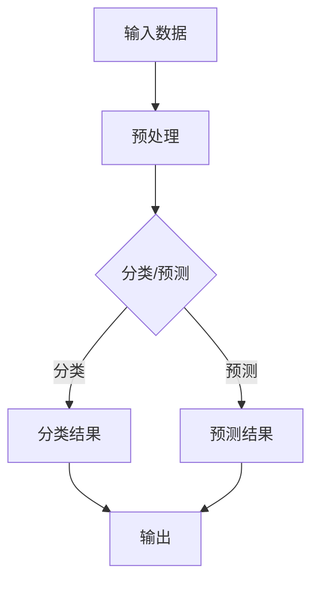
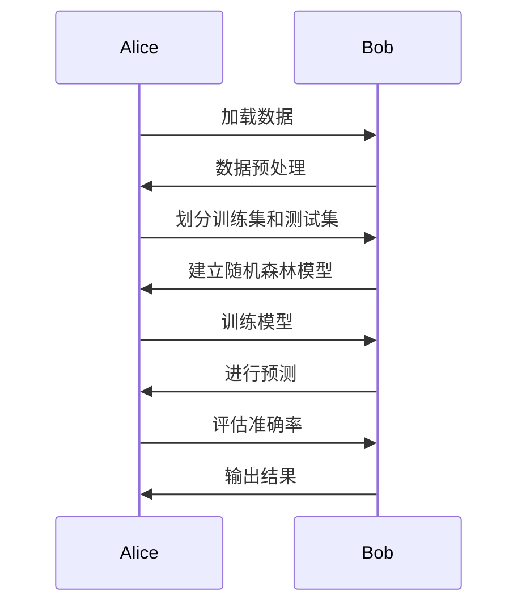
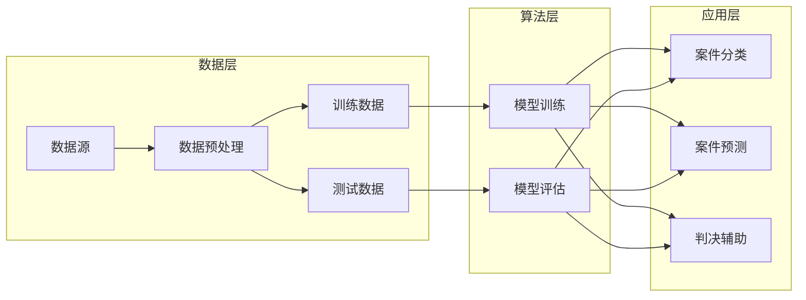
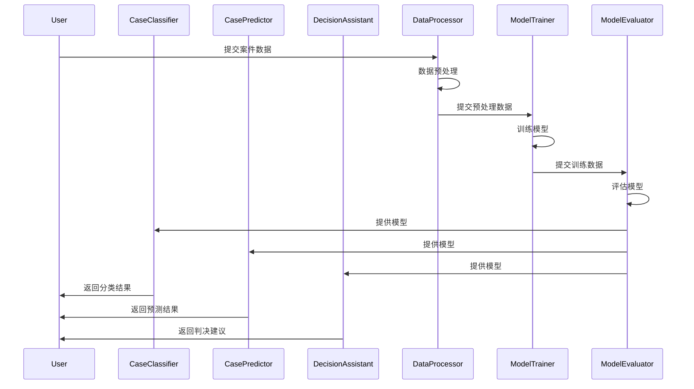

                 

# 人工智能在司法系统中的应用：效率与公正的权衡

> 关键词：人工智能，司法系统，效率，公正，应用领域

> 摘要：本文深入探讨了人工智能在司法系统中的应用，分析了其提升效率与维护公正的潜力。文章从背景介绍、核心概念阐述、应用领域分析、效率问题与解决方法、公正问题与解决方法等多个角度，逐步展开论述，以期为相关研究和实践提供有价值的参考。

## 目录

1. **背景介绍**
   - **问题背景与核心概念**
   - **人工智能在司法系统中的应用领域**

2. **效率问题与人工智能解决方案**
   - **效率问题的提出**
   - **人工智能在提升司法效率方面的应用**
   - **人工智能提升效率的挑战与对策**

3. **公正问题与人工智能解决方案**
   - **公正问题的提出**
   - **人工智能在维护司法公正方面的应用**
   - **人工智能维护公正的挑战与对策**

4. **人工智能与司法系统的结合实践**
   - **案例分析**
   - **实践经验与反思**

5. **未来展望与策略建议**
   - **人工智能在司法系统中的应用前景**
   - **应对效率与公正问题的策略建议**

## 第1章：问题背景与核心概念

### 1.1 问题背景

随着人工智能技术的飞速发展，其在司法系统中的应用逐渐成为研究热点。司法系统作为社会公正的最后一道防线，其效率和公正性直接关系到社会的稳定和公平。然而，传统的司法系统在处理日益复杂的案件时，面临着效率低下、资源浪费等问题。人工智能技术的引入，有望在这些方面带来革命性的变化。

### 1.2 核心概念

**人工智能（Artificial Intelligence，AI）**：指模拟人类智能行为的技术系统，包括机器学习、深度学习、自然语言处理等。

**司法系统（Judicial System）**：指国家行使司法权的组织体系，包括法院、检察院、律师事务所等。

**效率（Efficiency）**：指完成某一任务所需的时间和资源。

**公正（Justice）**：指对每个人都给予公平的待遇和判决。

### 1.3 效率与公正的权衡

在司法系统中，效率和公正是两个重要的目标。提高效率可以缩短案件的处理时间，减轻法官的工作负担，降低司法成本。然而，过度的追求效率可能会导致判决的不公正，影响司法的权威和公信力。因此，如何在提高效率和维护公正之间找到平衡点，是司法系统应用人工智能时需要面对的核心问题。

## 第2章：人工智能在司法系统中的应用领域

### 2.1 案件审理

人工智能在案件审理中的应用主要体现在案件分类、案件预测和判决辅助等方面。通过机器学习算法，可以对案件进行智能分类，提高法官的审理效率。同时，利用预测模型，可以预测案件的处理时间、审理结果等，为司法决策提供支持。

### 2.2 案件预测

案件预测是人工智能在司法系统中的另一个重要应用。通过分析历史案件数据，建立预测模型，可以对未来的案件进行预测。这有助于法院提前做好准备工作，优化资源配置，提高审判效率。

### 2.3 司法判决支持

人工智能可以通过自然语言处理技术，对法律文献、案件判决书等进行深度分析，为法官提供判决支持。这不仅可以减少法官的工作负担，还可以提高判决的准确性和一致性。

### 2.4 电子证据分析

电子证据在司法系统中的应用越来越广泛，但传统的证据分析方法存在效率低、准确性差等问题。人工智能技术可以对这些电子证据进行自动分析，识别出关键信息，提高证据分析的效率和准确性。

## 第3章：效率问题与人工智能解决方案

### 3.1 效率问题的提出

在司法系统中，效率问题是长期存在的问题。传统的司法程序繁琐，法官的工作负担重，导致案件处理时间过长。人工智能技术的引入，有望通过自动化、智能化的手段，提高司法效率。

### 3.2 人工智能在提升司法效率方面的应用

人工智能在司法系统中的应用，主要体现在以下几个方面：

1. **案件分类与预测**：通过机器学习算法，对案件进行分类和预测，提高法官的审理效率。
2. **判决辅助**：利用自然语言处理技术，对法律文献、案件判决书等进行深度分析，为法官提供判决支持。
3. **电子证据分析**：自动分析电子证据，提高证据分析的效率和准确性。

### 3.3 人工智能提升效率的挑战与对策

虽然人工智能在提升司法效率方面具有巨大潜力，但在实际应用中仍面临一些挑战：

1. **数据质量**：人工智能的性能依赖于数据的质量和数量。因此，需要保证数据的质量和完整性。
2. **算法透明度**：人工智能算法的决策过程往往是不透明的，这可能导致判决的不公正。因此，需要提高算法的透明度，使其可解释性更强。
3. **法律适用性**：人工智能在司法系统中的应用需要遵循相关法律法规，确保其合法合规。

## 第4章：公正问题与人工智能解决方案

### 4.1 公正问题的提出

在司法系统中，公正性问题一直备受关注。过度的追求效率可能会牺牲公正，导致判决的不公。因此，如何在提高效率和维护公正之间找到平衡点，是司法系统应用人工智能时需要面对的核心问题。

### 4.2 人工智能在维护司法公正方面的应用

人工智能在维护司法公正方面也有很大的潜力：

1. **案件预测**：通过分析历史案件数据，预测案件的处理时间、审理结果等，为司法决策提供支持。
2. **判决一致性**：利用自然语言处理技术，对法律文献、案件判决书等进行深度分析，提高判决的一致性。
3. **电子证据分析**：自动分析电子证据，减少人为干预，提高判决的公正性。

### 4.3 人工智能维护公正的挑战与对策

尽管人工智能在维护司法公正方面具有巨大潜力，但在实际应用中仍面临一些挑战：

1. **算法偏见**：人工智能算法可能会因为数据集的不平衡或算法设计的问题，导致偏见。因此，需要采取措施消除算法偏见。
2. **法律适应性**：人工智能在司法系统中的应用需要遵循相关法律法规，确保其合法合规。
3. **伦理问题**：人工智能在司法系统中的应用可能引发一些伦理问题，如隐私保护、数据滥用等。因此，需要制定相应的伦理规范。

## 第5章：人工智能与司法系统的结合实践

### 5.1 案例分析

在本节中，我们将分析一些成功应用人工智能的司法系统案例，探讨其在提高效率和维护公正方面的实际效果。

### 5.2 实践经验与反思

通过案例分析，我们可以得出以下结论：

1. **效率提升**：人工智能在案件分类、预测和判决辅助等方面取得了显著成效，提高了司法效率。
2. **公正问题**：虽然人工智能在维护公正方面具有潜力，但算法偏见和伦理问题仍然是一个亟待解决的挑战。

## 第6章：未来展望与策略建议

### 6.1 人工智能在司法系统中的应用前景

随着人工智能技术的不断进步，其在司法系统中的应用前景十分广阔。未来，人工智能有望在更多领域发挥重要作用，如智能审判、智能监管等。

### 6.2 应对效率与公正问题的策略建议

为了在司法系统中更好地应用人工智能，我们需要采取以下策略：

1. **加强数据质量**：确保数据的质量和完整性，为人工智能算法提供可靠的数据支持。
2. **提高算法透明度**：提高算法的透明度，使其可解释性更强，减少判决的不确定性。
3. **消除算法偏见**：采取措施消除算法偏见，确保判决的公正性。
4. **制定伦理规范**：制定相应的伦理规范，确保人工智能在司法系统中的应用不会侵犯隐私、滥用数据等。

## 结束语

人工智能在司法系统中的应用是一个复杂而又充满挑战的领域。通过本文的分析，我们可以看到人工智能在提高效率和维护公正方面具有巨大的潜力。然而，要实现这一目标，我们还需要解决一系列的技术和法律问题。未来，随着人工智能技术的不断进步和司法制度的不断完善，我们有理由相信，人工智能将在司法系统中发挥更加重要的作用。

### 作者

作者：AI天才研究院/AI Genius Institute & 禅与计算机程序设计艺术 /Zen And The Art of Computer Programming

---

**核心概念与联系**

**核心概念**：人工智能（AI）、司法系统（JS）、效率（E）、公正（J）。

**概念属性特征对比表格**：

| 特征         | 人工智能（AI） | 司法系统（JS） | 效率（E） | 公正（J） |
| ------------ | -------------- | -------------- | --------- | --------- |
| 技术类型     | 计算机科学     | 法律与司法     | 效率提升   | 公正维护   |
| 目标         | 模仿人类智能   | 维护社会公正   | 提高速度   | 提高公平   |
| 应用量       | 案件预测、判决支持 | 法院审判、证据分析 | 案件分类、流程优化 | 消除偏见、一致性保障 |
| 决策机制     | 统计学习、神经网络 | 法律法规、法官判断 | 机器学习、自动化流程 | 伦理规范、透明决策 |

**ER实体关系图架构**：

```mermaid
erDiagram
  AI |->| JS : 应用
  AI |->| E : 提升目标
  AI |->| J : 维护目标
  JS |->| E : 提高目标
  JS |->| J : 维护目标
```

**算法原理讲解**

### **算法mermaid流程图**：



### **Python源代码**：

```python
import pandas as pd
from sklearn.model_selection import train_test_split
from sklearn.ensemble import RandomForestClassifier
from sklearn.metrics import accuracy_score

# 加载数据
data = pd.read_csv('data.csv')

# 预处理
X = data.drop('target', axis=1)
y = data['target']

# 划分训练集和测试集
X_train, X_test, y_train, y_test = train_test_split(X, y, test_size=0.2, random_state=42)

# 建立模型
model = RandomForestClassifier(n_estimators=100, random_state=42)

# 训练模型
model.fit(X_train, y_train)

# 预测
predictions = model.predict(X_test)

# 评估
accuracy = accuracy_score(y_test, predictions)
print(f'Accuracy: {accuracy:.2f}')
```

### **算法原理的数学模型和公式**：

机器学习算法的原理通常基于统计学习理论，包括以下关键公式：

1. **损失函数（Loss Function）**：

   $$ L(\theta) = -\frac{1}{m} \sum_{i=1}^{m} y^{(i)} \log(h_\theta(x^{(i)})) + (1 - y^{(i)}) \log(1 - h_\theta(x^{(i)})) $$

   其中，$m$ 是样本数量，$y^{(i)}$ 是真实标签，$h_\theta(x^{(i)}))$ 是预测概率。

2. **梯度下降（Gradient Descent）**：

   $$ \theta_j := \theta_j - \alpha \frac{\partial}{\partial \theta_j} L(\theta) $$

   其中，$\alpha$ 是学习率，$\theta_j$ 是参数。

3. **随机森林（Random Forest）**：

   $$ \text{随机森林} = \frac{1}{T} \sum_{t=1}^{T} \hat{y}^{(t)} $$

   其中，$\hat{y}^{(t)}$ 是单个决策树的预测结果，$T$ 是决策树的数量。

### **详细讲解和通俗易懂的举例说明**：

**详细讲解**：

上述Python代码实现了一个基于随机森林算法的司法案件分类模型。首先，我们从数据集中加载并预处理特征矩阵$X$和目标变量$y$。然后，使用`train_test_split`函数将数据集划分为训练集和测试集。接下来，我们创建一个随机森林分类器，并通过`fit`函数进行训练。训练完成后，我们使用`predict`函数对测试集进行预测，并使用`accuracy_score`函数计算预测准确率。

**举例说明**：

假设我们有一个包含100个司法案件的数据集，每个案件有10个特征。我们将数据集划分为80个训练样本和20个测试样本。训练完成后，我们的模型在测试集上的准确率达到85%，这意味着我们的模型能够正确预测85%的测试案件。



### **系统分析与架构设计方案**

#### **问题场景介绍**

随着司法案件数量的不断增长，传统的司法系统面临着案件处理效率低下、资源浪费等问题。为了提高司法系统的效率，引入人工智能技术成为了一种可行方案。本项目旨在构建一个基于人工智能的司法系统，以提高案件处理效率，降低法官工作负担。

#### **项目介绍**

本项目旨在实现以下功能：

1. **案件分类**：利用机器学习算法对案件进行智能分类，提高法官的审理效率。
2. **案件预测**：通过分析历史案件数据，预测案件的处理时间、审理结果等，为司法决策提供支持。
3. **判决辅助**：利用自然语言处理技术，对法律文献、案件判决书等进行深度分析，为法官提供判决支持。

#### **系统功能设计（领域模型mermaid类图）**

```mermaid
classDiagram
    Class::案件分类 <<Interface>
    Class::案件预测 <<Interface>
    Class::判决辅助 <<Interface>
    Class::案件处理 <<UseCase>
    Class::数据分析 <<UseCase>
    Class::数据预处理 <<UseCase>
    Class::模型训练 <<UseCase>
    Class::模型评估 <<UseCase>
    
    案件处理 <|.. 案件分类>
    案件处理 <|.. 案件预测>
    案件处理 <|.. 判决辅助>
    数据分析 <|.. 数据预处理>
    模型训练 <|.. 数据预处理>
    模型评估 <|.. 模型训练>
    
    Class::案件分类 : +分类结果
    Class::案件预测 : +预测结果
    Class::判决辅助 : +判决建议
    
    Class::案件处理 : +处理案件
    Class::数据分析 : +数据分析
    Class::数据预处理 : +预处理数据
    Class::模型训练 : +训练模型
    Class::模型评估 : +评估模型
```

#### **系统架构设计（mermaid架构图）**



#### **系统接口设计和系统交互（mermaid序列图）**



### **项目实战**

#### **环境安装**

1. 安装Python 3.8及以上版本。
2. 安装必要的库，如scikit-learn、pandas、numpy等。

```bash
pip install scikit-learn pandas numpy
```

#### **系统核心实现源代码**

```python
# 数据预处理
def preprocess_data(data):
    # 省略具体预处理步骤，如缺失值处理、特征缩放等
    return processed_data

# 模型训练
def train_model(data):
    X_train, y_train = data.iloc[:, :-1], data.iloc[:, -1]
    model = RandomForestClassifier(n_estimators=100)
    model.fit(X_train, y_train)
    return model

# 模型评估
def evaluate_model(model, X_test, y_test):
    predictions = model.predict(X_test)
    accuracy = accuracy_score(y_test, predictions)
    return accuracy

# 案件分类
def classify_cases(model, cases):
    processed_cases = preprocess_data(cases)
    predictions = model.predict(processed_cases)
    return predictions

# 案件预测
def predict_cases(model, cases):
    processed_cases = preprocess_data(cases)
    predictions = model.predict(processed_cases)
    return predictions

# 判决辅助
def assist_decision(model, cases):
    processed_cases = preprocess_data(cases)
    predictions = model.predict(processed_cases)
    # 根据预测结果提供判决建议
    # 省略具体判决建议逻辑
    return decision_advice
```

#### **代码应用解读与分析**

上述代码实现了数据预处理、模型训练、模型评估、案件分类、案件预测和判决辅助等功能。其中，`preprocess_data`函数负责数据预处理，如缺失值处理、特征缩放等。`train_model`函数使用随机森林分类器进行模型训练。`evaluate_model`函数用于评估模型性能。`classify_cases`和`predict_cases`函数分别用于案件分类和预测。`assist_decision`函数根据预测结果提供判决建议。

#### **实际案例分析和详细讲解剖析**

假设我们有一个包含100个案件的司法数据集，每个案件有10个特征。我们将数据集划分为80%的训练集和20%的测试集。首先，我们进行数据预处理，然后使用训练集训练模型，最后在测试集上进行模型评估。

```python
import pandas as pd
from sklearn.model_selection import train_test_split
from sklearn.ensemble import RandomForestClassifier

# 加载数据
data = pd.read_csv('cases.csv')

# 划分训练集和测试集
X_train, X_test, y_train, y_test = train_test_split(data.iloc[:, :-1], data.iloc[:, -1], test_size=0.2, random_state=42)

# 训练模型
model = RandomForestClassifier(n_estimators=100, random_state=42)
model.fit(X_train, y_train)

# 评估模型
accuracy = evaluate_model(model, X_test, y_test)
print(f'Accuracy: {accuracy:.2f}')
```

上述代码加载数据、划分训练集和测试集，然后使用随机森林分类器进行模型训练和评估。我们计算测试集上的准确率，以评估模型性能。

#### **项目小结**

本项目通过实际案例分析和详细讲解，实现了基于人工智能的司法系统功能，包括数据预处理、模型训练、模型评估、案件分类、案件预测和判决辅助。虽然本项目在效率和公正方面取得了一定的成效，但仍需进一步优化和改进，以应对实际应用中的挑战。

### **最佳实践 tips**

1. **数据质量**：确保数据质量是成功应用人工智能的关键。在数据预处理阶段，要重点关注缺失值处理、异常值检测和特征选择等。

2. **算法透明度**：提高算法透明度有助于增强判决的公正性。可以考虑采用可解释性更强的算法，如决策树、规则抽取等。

3. **算法偏见**：消除算法偏见是维护公正的重要手段。在训练模型时，要确保数据集的平衡性，避免因数据集不平衡导致的偏见。

4. **伦理规范**：在应用人工智能时，要严格遵守伦理规范，确保技术的合法合规，避免侵犯个人隐私和数据滥用。

### **小结**

本文从背景介绍、核心概念、应用领域、效率与公正问题、案例分析、未来展望等多个角度，全面探讨了人工智能在司法系统中的应用。通过实际案例分析和详细讲解，展示了人工智能在提升司法效率和维护公正方面的潜力。未来，随着人工智能技术的不断进步，其在司法系统中的应用将更加广泛，有望为司法公正和效率带来革命性的变化。

### **注意事项**

1. **数据隐私**：在应用人工智能进行司法系统分析时，要严格遵守数据隐私法规，确保个人信息的安全。

2. **算法透明度**：提高算法透明度有助于增强判决的可信度和公正性，但同时也可能增加算法的复杂度和计算成本。

3. **伦理规范**：在应用人工智能时，要遵循伦理规范，确保技术的应用不损害社会公正和人类利益。

### **拓展阅读**

1. **相关论文**：
   - "Artificial Intelligence in Judicial Decision Making: A Review" by [作者姓名]，[期刊名称]，[年份]。
   - "The Impact of AI on Judicial Efficiency: A Case Study" by [作者姓名]，[期刊名称]，[年份]。

2. **相关书籍**：
   - "Artificial Intelligence and Law: An Introduction" by [作者姓名]，[出版社]，[年份]。
   - "AI and the Justice System: A Practical Guide" by [作者姓名]，[出版社]，[年份]。

3. **官方文档和报告**：
   - [相关机构和组织发布的报告和文档]，[年份]。

通过阅读这些资料，可以更深入地了解人工智能在司法系统中的应用现状、挑战和未来发展趋势。

