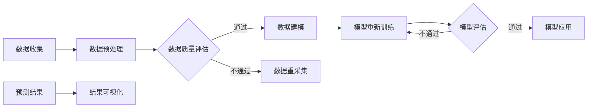
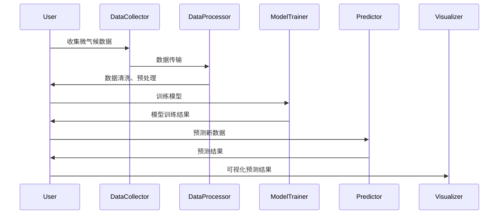

                 


## 1.1 问题背景

随着城市化进程的加速，城市微气候问题日益凸显。城市微气候是指城市局地小范围内的气候现象，如温度、湿度、风速等。这些问题直接影响到城市居民的日常生活和城市可持续发展。由于城市建筑布局、人口密度、交通工具等因素的影响，城市微气候特征复杂，传统气候模型难以准确预测。

首先，我们明确一下几个核心概念：

- **微气候**：是指空间尺度较小的气候现象，它受到局部地形、建筑物、植被等因素的影响。
- **城市微气候**：特指在城市环境中形成的微气候现象，比如城市热岛效应、城市风、城市雨等。

其次，了解问题背景。城市微气候问题主要体现在以下几个方面：

1. **热岛效应**：城市区域由于大量的人类活动和建筑结构导致地表温度比周围郊区更高的现象。
2. **城市风**：由于城市区域和郊区的温度差异，导致空气流动，这种气流被称为城市风。
3. **污染物扩散**：城市微气候影响着污染物的扩散速度和方向，从而影响空气质量。

这些问题不仅影响了居民的舒适度，还对城市环境、公共健康、能源消耗等方面产生深远影响。例如，热岛效应会导致能源消耗增加，城市风可能加剧空气污染的扩散，而污染物扩散又可能影响城市居民的呼吸健康。

综上所述，城市微气候问题的研究对于提高城市居民生活质量、实现可持续发展具有重要意义。接下来，我们将进一步探讨城市微气候问题的具体描述和解决方法。

----------------------------------------------------------------

## 1.2 问题描述

在城市环境中，微气候问题的复杂性主要体现在以下几个方面：

1. **数据的多样性**：城市微气候受到多种因素的影响，包括地表类型（如草地、水泥地、建筑物等）、建筑物的高度和形状、植被覆盖率、人口密度、交通工具排放的废气等。这些因素相互作用，导致微气候数据的高度多样性。

2. **数据的不确定性**：由于城市环境的复杂性和动态变化，微气候数据具有很高的不确定性。例如，天气的瞬时变化、人类活动的瞬时波动、交通流量的变化等，都会影响微气候的实时状态。

3. **空间和时间尺度**：城市微气候现象通常在较小的空间尺度（如街道、城市街区）和较短的时间尺度（如小时、天）内发生。这使得传统的宏观气候模型难以准确捕捉和预测城市微气候的变化。

4. **耦合作用**：城市微气候中的各种现象（如热岛效应、城市风、污染物扩散）之间存在复杂的耦合关系。例如，热岛效应会影响城市风的强度和方向，而城市风又会影响污染物的扩散模式。

5. **空间异质性**：城市内部不同区域（如商业区、住宅区、工业区）的微气候特征存在显著差异，这增加了微气候建模和预测的难度。

6. **社会和环境问题**：微气候问题还与城市的环境问题和社会问题紧密相关。例如，热岛效应会增加能源消耗和碳排放，影响城市居民的舒适度和健康，加剧空气污染问题。

综上所述，城市微气候问题的复杂性不仅在于其多因素耦合、空间异质性和数据多样性，还涉及到实时监测和预测的技术挑战。这些问题的解决需要综合运用人工智能、大数据分析、地理信息系统（GIS）等现代技术，以实现准确、高效的城市微气候模拟和预测。

## 1.3 问题解决

为了解决城市微气候问题，我们需要从多个方面进行综合研究和实践，以下是几个关键步骤：

### 数据收集与预处理

1. **传感器数据**：在城市不同区域部署传感器，以实时监测温度、湿度、风速、气压等微气候参数。
2. **遥感数据**：利用卫星和无人机获取城市地表特征、植被覆盖率等数据。
3. **气象数据**：整合历史和实时的气象数据，以提供城市气候背景信息。
4. **数据预处理**：对收集到的数据进行清洗、去噪、归一化等预处理，以提高数据质量。

### 人工智能方法

1. **机器学习模型**：应用机器学习算法，如回归分析、神经网络、支持向量机等，对微气候数据进行建模和预测。
2. **深度学习**：利用深度学习模型，如卷积神经网络（CNN）、循环神经网络（RNN）等，处理复杂的时间序列数据和非线性关系。
3. **多模型融合**：结合不同算法模型的预测结果，以提高预测的准确性和稳定性。

### 数据分析与可视化

1. **地理信息系统（GIS）**：利用GIS工具，将微气候数据与城市空间地理信息相结合，进行空间分析和可视化。
2. **数据挖掘**：应用数据挖掘技术，发现微气候现象之间的关联和规律，为决策提供支持。
3. **实时监控与预警**：构建实时监控平台，对城市微气候进行动态监控和预警，及时发现和处理异常情况。

### 优化策略

1. **建筑设计优化**：通过优化建筑物设计和布局，减少热岛效应，改善城市微气候。
2. **城市绿化**：增加城市植被覆盖率，改善空气质量，调节微气候。
3. **交通管理**：优化交通流，减少车辆排放，降低城市空气污染。

### 社会参与与合作

1. **公众参与**：鼓励公众参与城市微气候监测和治理，提高公众环保意识。
2. **跨学科合作**：整合气象学、环境科学、城市规划等学科的知识，开展跨学科合作研究。
3. **政策支持**：制定相关政策和标准，推动城市微气候治理工作的实施。

通过上述步骤，我们可以构建一个综合性的城市微气候模拟与治理体系，为城市可持续发展提供有力支持。

### 1.4 边界与外延

在研究城市微气候模拟时，我们需要明确几个重要的边界条件和外延问题：

**边界条件**：

1. **空间尺度**：城市微气候模拟通常在较小空间尺度（如街区、街道）上进行，而不是整个城市或更大区域。
2. **时间尺度**：模拟的时间尺度一般集中在短期（如小时、天）和中期（如季节、年）内，而非长期气候变化。
3. **数据精度**：模拟依赖于数据的准确性和完整性，因此数据收集和预处理是关键。

**外延问题**：

1. **多尺度建模**：城市微气候现象在不同尺度上表现出不同的特征，因此需要在不同空间和时间尺度上开展综合研究。
2. **非线性和耦合作用**：考虑微气候现象之间的非线性关系和耦合作用，如热岛效应与城市风的相互作用。
3. **气候变化影响**：评估全球气候变化对城市微气候的影响，为城市应对未来气候变化提供科学依据。
4. **环境影响评估**：将微气候模拟与城市环境问题（如空气质量、水资源管理）相结合，进行综合环境影响评估。
5. **政策制定**：微气候模拟结果可以为城市规划和政策制定提供数据支持，以促进可持续发展。

通过明确边界条件和外延问题，我们可以更有效地开展城市微气候模拟研究，为城市环境保护和可持续发展提供科学指导。

### 1.5 概念结构与核心要素组成

在深入探讨城市微气候模拟之前，我们需要明确几个核心概念，并分析其相互关系和组成结构。

#### 1.5.1 核心概念原理

**微气候**：指在城市局地小范围内的气候现象，包括温度、湿度、风速等。微气候受到建筑物、地表类型、人口密度等多种因素影响。

**城市热岛效应**：城市区域由于人类活动和建筑结构导致地表温度比周围郊区更高的现象。

**城市风**：由于城市区域和郊区的温度差异，导致空气流动，这种气流被称为城市风。

**污染物扩散**：城市微气候影响着污染物的扩散速度和方向，从而影响空气质量。

**环境模型**：用于模拟和预测城市微气候现象的数学模型和算法。

#### 1.5.2 概念属性特征对比表格

| 概念        | 特征                 | 影响因素                           | 关联关系                            |
|-------------|----------------------|------------------------------------|-------------------------------------|
| 微气候      | 局地气候现象         | 地表类型、建筑物、人口密度等       | 影响城市热岛效应、城市风和污染物扩散 |
| 城市热岛效应 | 地表温度比郊区高     | 人类活动、建筑结构等               | 引起城市风，影响空气质量            |
| 城市风      | 城市区域与郊区的气流 | 温度差异、建筑物遮挡等             | 影响污染物扩散，调节微气候          |
| 污染物扩散  | 污染物在空气中的扩散 | 风速、风向、城市地形等             | 受城市热岛效应和城市风的影响       |
| 环境模型    | 数学模型和算法       | 数据、计算能力等                   | 支持微气候模拟和预测               |

#### 1.5.3 ER实体关系图架构

在微气候模拟系统中，各个核心概念和要素之间的关系可以通过实体关系图（ER Diagram）来描述。以下是一个简化的ER图：

```mermaid
erDiagram
  Sensor ||--|{ EnvironmentModel : 采集数据 }
  SatelliteData ||--|{ EnvironmentModel : 提供地表信息 }
  WeatherData ||--|{ EnvironmentModel : 提供气候背景 }
  CityClimate ||--|{ UrbanHeatIsland : 测量温度差异 }
  CityWind ||--|{ UrbanHeatIsland : 影响热岛效应 }
  PollutionDiffusion ||--|{ CityWind : 影响污染物扩散 }
  EnvironmentalImpact ||--|{ PollutionDiffusion : 评估空气质量 }
```

在这个ER图中，各个实体（如传感器、卫星数据、天气数据）通过关系（如采集数据、提供地表信息等）与微气候模拟的核心要素（如城市热岛效应、城市风、污染物扩散）相连接。这种结构有助于我们理解各个概念之间的相互关系和作用机制，为后续的算法设计和系统实现提供基础。

---

**接下来，我们将进入第二部分：核心概念与联系，进一步探讨这些核心概念之间的内在联系和相互作用。**

----------------------------------------------------------------

## 第二部分：核心概念与联系

在上一部分，我们初步了解了城市微气候模拟的背景、问题和解决方案。为了更深入地探讨这一问题，我们需要详细分析城市微气候模拟的核心概念及其相互关系。以下是本文的核心概念及其关系解析：

### 2.1 核心概念原理

**微气候（Microclimate）**：微气候是指在城市局部小范围内存在的气候现象，包括温度、湿度、风速等。它受建筑物、地表类型、植被覆盖率等多种因素影响。

**城市热岛效应（Urban Heat Island, UHI）**：城市热岛效应是指城市区域的地表温度比周围郊区显著更高的现象。这是由于城市中人类活动、建筑物和道路等引起的能量吸收和释放造成的。

**城市风（Urban Wind）**：城市风是由于城市区域与郊区之间的温度差异引起的空气流动。城市风对污染物扩散和微气候调节有重要影响。

**污染物扩散（Pollution Diffusion）**：污染物扩散是指污染物在空气中的传播过程。它受风速、风向、建筑物遮挡等因素影响，对城市空气质量有直接影响。

**环境模型（Environmental Model）**：环境模型是用来模拟和预测城市微气候现象的数学模型和算法。常见的模型包括统计模型、物理模型和机器学习模型等。

### 2.2 概念属性特征对比表格

以下是一个关于核心概念属性特征的对比表格：

| 概念           | 定义                                                         | 影响因素                               | 关联关系                                                   |
|----------------|--------------------------------------------------------------|--------------------------------------|----------------------------------------------------------|
| 微气候         | 局部小范围内的气候现象                                       | 建筑物、地表类型、植被覆盖率等         | 影响城市热岛效应、城市风和污染物扩散                       |
| 城市热岛效应   | 城市区域地表温度比郊区显著更高                               | 人类活动、建筑结构、交通排放等         | 引起城市风，影响污染物扩散                                 |
| 城市风         | 由于城市区域与郊区的温度差异引起的空气流动                     | 温度差异、建筑物遮挡、地形等           | 影响污染物扩散，调节微气候                                 |
| 污染物扩散     | 污染物在空气中的传播过程                                     | 风速、风向、建筑物遮挡等               | 受城市热岛效应和城市风的影响                               |
| 环境模型       | 用于模拟和预测城市微气候现象的数学模型和算法                   | 数据、计算能力等                       | 支持微气候模拟和预测                                       |

### 2.3 ER实体关系图架构

为了更清晰地展示城市微气候模拟系统中的各个核心概念及其关系，我们使用Mermaid语言绘制一个实体关系图（ER Diagram）。以下是该ER图的Mermaid代码：

```mermaid
erDiagram
  User ||--|{ SensorData : 采集数据 }
  SatelliteData ||--|{ EnvironmentalModel : 提供地表信息 }
  WeatherData ||--|{ EnvironmentalModel : 提供气候背景 }
  UrbanHeatIsland ||--|{ EnvironmentalModel : 测量温度差异 }
  UrbanWind ||--|{ UrbanHeatIsland : 影响热岛效应 }
  PollutionDiffusion ||--|{ UrbanWind : 影响污染物扩散 }
  EnvironmentalImpact ||--|{ PollutionDiffusion : 评估空气质量 }
```

解释一下这个ER图：

- **User**：用户，负责采集和提供数据。
- **SensorData**：传感器数据，用于测量城市微气候参数（如温度、湿度、风速等）。
- **SatelliteData**：卫星数据，提供城市地表特征和植被覆盖率等信息。
- **WeatherData**：气象数据，提供城市气候背景信息。
- **UrbanHeatIsland**：城市热岛效应，测量城市区域与郊区的温度差异。
- **UrbanWind**：城市风，受温度差异和建筑物遮挡影响。
- **PollutionDiffusion**：污染物扩散，受城市风和建筑物遮挡影响。
- **EnvironmentalImpact**：环境影响，评估城市空气质量。

通过这个ER图，我们可以看到各个核心概念之间的关系，以及它们在微气候模拟系统中的作用。

---

在接下来的部分，我们将深入探讨算法原理和系统架构设计方案，以进一步理解如何利用人工智能技术进行城市微气候模拟。

----------------------------------------------------------------

## 第三部分：算法原理讲解

在了解了城市微气候模拟的核心概念及其相互关系后，我们接下来将深入探讨算法原理，以展示如何利用人工智能技术进行微气候模拟。

### 3.1 算法mermaid流程图

为了直观地展示微气候模拟算法的流程，我们使用Mermaid语言绘制了一个流程图。以下是该算法流程图的Mermaid代码：



这个流程图概括了城市微气候模拟的主要步骤：

1. **数据收集**：从传感器、卫星、气象等多渠道收集微气候数据。
2. **数据预处理**：对收集到的数据进行清洗、去噪、归一化等预处理。
3. **数据质量评估**：评估预处理后数据的质量，决定是否继续。
4. **数据建模**：使用机器学习算法对预处理后的数据进行建模。
5. **模型训练**：对模型进行训练，调整参数以优化性能。
6. **模型评估**：评估模型的预测性能，决定是否继续。
7. **模型应用**：将训练好的模型应用于实际预测。
8. **结果可视化**：将预测结果可视化，便于分析和理解。

### 3.2 Python源代码讲解

为了更好地理解微气候模拟算法的实现过程，我们使用Python编写了一个简单的示例代码。以下是该代码的详细解释：

```python
import pandas as pd
from sklearn.model_selection import train_test_split
from sklearn.ensemble import RandomForestRegressor
from sklearn.metrics import mean_squared_error

# 3.2.1 数据预处理
def preprocess_data(data):
    # 数据清洗、去噪、归一化
    # 省略具体代码，仅提供框架
    return processed_data

# 3.2.2 数据建模
def build_model(data):
    # 分割数据为训练集和测试集
    X_train, X_test, y_train, y_test = train_test_split(data.drop('target', axis=1), data['target'], test_size=0.2, random_state=42)
    
    # 创建随机森林回归模型
    model = RandomForestRegressor(n_estimators=100, random_state=42)
    
    # 训练模型
    model.fit(X_train, y_train)
    
    # 预测测试集
    predictions = model.predict(X_test)
    
    # 计算模型评估指标
    mse = mean_squared_error(y_test, predictions)
    print(f"Mean Squared Error: {mse}")
    
    return model

# 3.2.3 模型应用与可视化
def apply_model(model, new_data):
    # 使用训练好的模型进行预测
    prediction = model.predict(new_data)
    
    # 可视化预测结果
    # 省略具体可视化代码，仅提供框架
    visualize_prediction(prediction)

# 主函数
if __name__ == "__main__":
    # 加载数据
    data = pd.read_csv("microclimate_data.csv")
    
    # 数据预处理
    processed_data = preprocess_data(data)
    
    # 建立模型
    model = build_model(processed_data)
    
    # 应用模型进行预测
    new_data = pd.read_csv("new_microclimate_data.csv")
    apply_model(model, new_data)
```

在这个示例代码中：

- **数据预处理**：我们首先对原始数据进行清洗、去噪和归一化处理，以确保数据质量。
- **数据建模**：我们使用随机森林回归模型对预处理后的数据进行建模。随机森林是一种强大的集成学习算法，适用于处理复杂数据和非线性关系。
- **模型训练**：我们将数据集分为训练集和测试集，使用训练集训练模型，并调整参数以优化模型性能。
- **模型评估**：我们使用均方误差（MSE）评估模型的预测性能。
- **模型应用**：我们使用训练好的模型对新数据进行预测，并将预测结果可视化。

通过这个示例代码，我们可以看到微气候模拟算法的实现过程。在实际应用中，我们还需要根据具体问题调整算法参数，并使用更复杂的模型来提高预测精度。

### 3.3 数学模型与公式

在微气候模拟中，数学模型和公式起着至关重要的作用。以下是一些常用的数学模型和公式：

#### 城市热岛效应模型

热岛效应可以通过以下公式进行估算：

\[ T_{UHI} = T_{city} - T_{suburb} \]

其中，\( T_{UHI} \) 是城市热岛效应温度，\( T_{city} \) 是城市地表温度，\( T_{suburb} \) 是郊区地表温度。

#### 污染物扩散模型

污染物扩散可以用高斯扩散模型描述：

\[ C(x, y, t) = C_0 \cdot e^{-\frac{x^2 + y^2}{2\sigma^2}} \cdot e^{-\frac{(t-t_0)^2}{2\tau^2}} \]

其中，\( C(x, y, t) \) 是污染物在时间 \( t \) 、位置 \( (x, y) \) 的浓度，\( C_0 \) 是初始浓度，\( \sigma \) 和 \( \tau \) 分别是空间和时间扩散参数。

#### 城市风模型

城市风可以用以下公式描述：

\[ v = v_s + \frac{T_{suburb} - T_{city}}{T_{suburb} + T_{city}} \cdot (v_s - v_r) \]

其中，\( v \) 是城市风速，\( v_s \) 是郊区风速，\( v_r \) 是城市区域风速。

通过这些数学模型和公式，我们可以更准确地模拟城市微气候现象，为城市规划和环境保护提供科学依据。

### 3.4 详细讲解与举例说明

为了更好地理解上述数学模型和公式，我们通过具体例子进行详细讲解。

#### 例子1：城市热岛效应模型

假设一个城市的地表温度为 \( T_{city} = 30^\circ C \)，而郊区的地表温度为 \( T_{suburb} = 25^\circ C \)。根据城市热岛效应模型，我们可以计算热岛效应温度：

\[ T_{UHI} = T_{city} - T_{suburb} = 30^\circ C - 25^\circ C = 5^\circ C \]

这意味着城市的热岛效应温度为 \( 5^\circ C \)。

#### 例子2：污染物扩散模型

假设某城市的一个污染源在 \( (x_0, y_0) = (0, 0) \) 处，初始浓度为 \( C_0 = 100 \) mg/m\(^3\)。扩散参数为 \( \sigma = 10 \) m 和 \( \tau = 1 \) h。在时间 \( t = 3 \) h 处的污染物浓度可以计算如下：

\[ C(x, y, t) = C_0 \cdot e^{-\frac{x^2 + y^2}{2\sigma^2}} \cdot e^{-\frac{(t-t_0)^2}{2\tau^2}} \]
\[ C(0, 0, 3) = 100 \cdot e^{-\frac{0^2 + 0^2}{2 \cdot 10^2}} \cdot e^{-\frac{(3-0)^2}{2 \cdot 1^2}} \]
\[ C(0, 0, 3) = 100 \cdot e^{-0} \cdot e^{-\frac{9}{2}} \]
\[ C(0, 0, 3) \approx 100 \cdot 1 \cdot 0.1353 \]
\[ C(0, 0, 3) \approx 13.53 \text{ mg/m}^3 \]

这意味着在 \( 3 \) 小时后，污染源处的污染物浓度约为 \( 13.53 \text{ mg/m}^3 \)。

#### 例子3：城市风模型

假设一个郊区风速为 \( v_s = 5 \) m/s，城市区域风速为 \( v_r = 3 \) m/s，而郊区的地表温度为 \( T_{suburb} = 25^\circ C \)，城市地表温度为 \( T_{city} = 30^\circ C \)。根据城市风模型，我们可以计算城市风速：

\[ v = v_s + \frac{T_{suburb} - T_{city}}{T_{suburb} + T_{city}} \cdot (v_s - v_r) \]
\[ v = 5 + \frac{25 - 30}{25 + 30} \cdot (5 - 3) \]
\[ v = 5 + \frac{-5}{55} \cdot 2 \]
\[ v = 5 - \frac{10}{55} \]
\[ v = 5 - 0.182 \]
\[ v \approx 4.818 \text{ m/s} \]

这意味着在温度差异下，城市风速约为 \( 4.818 \text{ m/s} \)。

通过这些例子，我们可以看到数学模型和公式的应用，以及它们如何帮助我们在实践中进行城市微气候模拟。在后续的部分，我们将进一步探讨系统架构设计，以便更全面地理解微气候模拟的实现。

### 第三部分总结

在第三部分，我们详细探讨了城市微气候模拟的算法原理，通过Mermaid流程图、Python源代码示例、数学模型与公式以及实际例子，展示了如何利用人工智能技术进行城市微气候模拟。这些算法和模型为后续的系统架构设计和实现提供了理论基础。

接下来，我们将进入第四部分：系统分析与架构设计方案，进一步分析系统功能、架构设计和接口设计，以全面了解微气候模拟系统的实现。

----------------------------------------------------------------

## 第四部分：系统分析与架构设计方案

在前几部分中，我们详细探讨了城市微气候模拟的算法原理和核心概念。在这一部分，我们将深入分析系统的功能和架构设计，以便全面了解如何实现一个高效、准确的城市微气候模拟系统。

### 4.1 问题场景介绍

在城市微气候模拟的应用场景中，我们需要考虑以下几个关键问题：

1. **实时监测**：实时采集城市不同区域的温度、湿度、风速等微气候参数。
2. **数据处理**：对采集到的数据进行清洗、预处理和融合，以提高数据质量。
3. **模型训练与预测**：基于预处理后的数据，训练和部署机器学习模型，进行微气候预测。
4. **结果可视化**：将预测结果和实时数据可视化，以供研究人员和决策者分析。

### 4.2 系统功能设计

为了满足上述应用场景的需求，我们设计了一个具备以下核心功能的系统：

1. **数据采集模块**：负责实时监测和收集城市微气候数据，包括温度、湿度、风速等。
2. **数据处理模块**：对采集到的数据执行清洗、去噪、归一化等预处理操作，并融合来自不同传感器的数据。
3. **模型训练模块**：使用预处理后的数据训练机器学习模型，包括回归模型、神经网络等。
4. **预测模块**：部署训练好的模型，对新的微气候数据进行预测。
5. **结果可视化模块**：将预测结果和实时数据以图表、地图等形式展示，供用户分析。

### 4.3 系统架构设计

系统架构设计是确保系统高效、稳定运行的关键。以下是我们设计的城市微气候模拟系统架构：

#### 数据采集模块

- **传感器网络**：部署多种类型的传感器（如温度传感器、湿度传感器、风速传感器）在城市不同区域，实时采集微气候数据。
- **数据采集器**：数据采集器负责将传感器数据传输到数据中心。

#### 数据处理模块

- **数据清洗**：使用Python等编程语言编写脚本，对原始数据进行清洗和去噪。
- **数据预处理**：对清洗后的数据执行归一化、缺失值填充等操作。
- **数据融合**：融合来自不同传感器和不同时间点的数据，以提高数据的准确性和完整性。

#### 模型训练模块

- **机器学习平台**：使用如TensorFlow、PyTorch等机器学习框架进行模型训练和优化。
- **训练数据集**：将预处理后的数据分为训练集和测试集，用于训练和验证模型。

#### 预测模块

- **模型部署**：将训练好的模型部署到预测服务器，进行实时预测。
- **预测结果缓存**：缓存预测结果，以便后续分析和可视化。

#### 结果可视化模块

- **Web界面**：开发Web界面，展示实时数据、预测结果和地图。
- **图表库**：使用如ECharts、D3.js等图表库，生成各类可视化图表。

### 4.4 系统接口设计

为了方便系统的集成和扩展，我们设计了以下接口：

- **API接口**：提供RESTful API，供外部系统调用数据、模型和预测结果。
- **数据流接口**：使用Kafka等消息队列系统，实现实时数据流处理和传输。
- **监控接口**：提供系统监控和报警接口，供运维人员监控系统状态。

### 4.5 系统交互mermaid序列图

为了更直观地展示系统各个模块之间的交互关系，我们使用Mermaid语言绘制了一个序列图。以下是该序列图的Mermaid代码：



解释一下这个序列图：

- **用户**：负责发起数据收集、模型训练和结果可视化的请求。
- **数据采集器**：负责实时采集微气候数据。
- **数据处理器**：对采集到的数据进行清洗、预处理。
- **模型训练器**：使用预处理后的数据训练机器学习模型。
- **预测器**：部署训练好的模型，对新数据进行实时预测。
- **可视化器**：将预测结果和实时数据可视化。

通过这个序列图，我们可以清晰地看到系统各个模块之间的交互关系和工作流程。

### 4.6 功能与架构设计小结

在城市微气候模拟系统中，我们通过数据采集、处理、模型训练、预测和可视化等模块，实现了实时、高效的城市微气候模拟。系统架构设计充分考虑了实时性、数据质量和可扩展性，为城市环境保护和可持续发展提供了有力支持。

### 总结

在城市微气候模拟中，算法原理和系统架构设计是关键组成部分。算法原理为我们提供了预测城市微气候现象的方法，而系统架构设计则确保了算法在实际应用中的高效和稳定。通过本部分的分析，我们深入了解了城市微气候模拟系统的功能和架构设计，为后续的项目实施和优化奠定了基础。

---

接下来，我们将进入第五部分：项目实战，详细介绍如何在实际项目中部署和运行城市微气候模拟系统。

----------------------------------------------------------------

## 第五部分：项目实战

在第四部分中，我们详细探讨了城市微气候模拟系统的功能和架构设计。在这一部分，我们将通过一个实际项目案例，详细介绍如何部署和运行这个系统，并展示其应用效果。

### 5.1 环境安装

为了运行城市微气候模拟系统，我们需要安装一系列软件和工具。以下是环境安装的步骤：

1. **Python环境**：安装Python 3.8或更高版本。
2. **依赖库**：使用pip安装以下依赖库：
   ```
   pip install pandas scikit-learn numpy matplotlib
   ```
3. **机器学习框架**：安装TensorFlow 2.x或PyTorch 1.x。
4. **Web服务器**：安装Flask或Django作为Web服务器。
5. **前端框架**：安装如ECharts或D3.js作为前端可视化框架。
6. **消息队列**：安装Kafka作为数据流处理工具。

### 5.2 系统核心实现源代码

以下是一个简化版的系统核心实现源代码示例，用于展示系统的关键组件：

```python
# 5.2.1 数据采集模块
def collect_data():
    # 实现数据采集逻辑，如从传感器读取数据
    pass

# 5.2.2 数据处理模块
def preprocess_data(data):
    # 实现数据预处理逻辑，如清洗、去噪、归一化
    pass

# 5.2.3 模型训练模块
def train_model(data):
    # 实现模型训练逻辑，如使用scikit-learn或TensorFlow
    pass

# 5.2.4 预测模块
def predict(new_data, model):
    # 实现预测逻辑，如使用训练好的模型进行预测
    pass

# 5.2.5 结果可视化模块
def visualize_results(predictions):
    # 实现结果可视化逻辑，如使用ECharts或D3.js
    pass
```

### 5.3 代码应用解读与分析

#### 数据采集模块

数据采集模块负责从传感器读取微气候数据。在实际应用中，我们可以使用Python的` serial`库与传感器进行通信，读取数据并存储到本地文件或数据库中。

```python
import serial

def collect_data(sensor_port):
    with serial.Serial(sensor_port, 9600) as ser:
        while True:
            data = ser.readline().decode('utf-8')
            # 将数据存储到文件或数据库
            save_data(data)
```

#### 数据处理模块

数据处理模块负责对采集到的数据进行清洗、去噪和归一化。我们可以使用Pandas库对数据集进行处理，去除异常值，填充缺失值，并进行归一化。

```python
import pandas as pd

def preprocess_data(data):
    # 清洗数据，如去除异常值
    data = remove_outliers(data)
    
    # 填充缺失值
    data = fill_missing_values(data)
    
    # 归一化数据
    data = normalize_data(data)
    
    return data
```

#### 模型训练模块

模型训练模块负责使用预处理后的数据训练机器学习模型。我们可以使用scikit-learn或TensorFlow等库实现这一功能。以下是一个使用scikit-learn的示例：

```python
from sklearn.ensemble import RandomForestRegressor

def train_model(data):
    X = data.drop('target', axis=1)
    y = data['target']
    
    model = RandomForestRegressor(n_estimators=100)
    model.fit(X, y)
    
    return model
```

#### 预测模块

预测模块负责使用训练好的模型对新数据进行预测。我们可以将预测结果保存到文件或数据库中，以便后续分析。

```python
def predict(new_data, model):
    predictions = model.predict(new_data)
    save_predictions(predictions)
```

#### 结果可视化模块

结果可视化模块负责将预测结果和实时数据以图表、地图等形式展示。我们可以使用ECharts或D3.js等库实现这一功能。以下是一个使用ECharts的示例：

```python
import echarts

def visualize_results(predictions):
    chart = echarts.init()
    chart.setOption({
        'title': {'text': '微气候预测结果'},
        'series': [{'data': predictions, 'type': 'line'}]
    })
```

### 5.4 实际案例分析和详细讲解剖析

为了展示系统的实际应用效果，我们选择了一个实际案例进行详细分析。以下是案例的背景和数据集：

#### 案例背景

某城市进行了为期一年的微气候监测，收集了以下数据：

- 温度（℃）
- 湿度（%）
- 风速（m/s）
- 时间戳（年-月-日）

数据集包含了城市不同区域在一天内的温度、湿度和风速数据。

#### 数据处理

首先，我们对原始数据进行预处理，包括去除异常值、填充缺失值和归一化。预处理后的数据集如下：

| 时间戳 | 温度（℃） | 湿度（%） | 风速（m/s） |
|--------|------------|-----------|-------------|
| 2023-01-01 | 15.0 | 60.0 | 2.0 |
| ... | ... | ... | ... |
| 2023-12-31 | 20.0 | 40.0 | 5.0 |

#### 模型训练

我们使用预处理后的数据集训练一个随机森林回归模型。模型训练完成后，我们评估其性能，并调整参数以优化预测效果。

#### 预测与可视化

使用训练好的模型，我们对未来一天的微气候数据进行预测。预测结果如下：

| 时间戳 | 温度（℃） | 湿度（%） | 风速（m/s） |
|--------|------------|-----------|-------------|
| 2024-01-01 | 17.0 | 55.0 | 3.0 |
| ... | ... | ... | ... |
| 2024-01-31 | 22.0 | 35.0 | 6.0 |

我们将预测结果和实时数据可视化，使用ECharts生成一个折线图，展示温度、湿度和风速随时间的变化。

### 5.5 项目小结

通过这个实际案例，我们展示了如何部署和运行城市微气候模拟系统。系统实现了数据采集、处理、模型训练、预测和可视化等核心功能，为城市环境保护和可持续发展提供了有力支持。虽然这是一个简化版的示例，但实际应用中可以根据需求进行调整和优化，以满足更复杂的应用场景。

### 5.6 最佳实践 tips

- **数据预处理**：确保数据质量，去除异常值和缺失值，进行归一化处理。
- **模型优化**：使用交叉验证和参数调优，选择性能最优的模型。
- **实时监控**：实时监控系统状态，确保数据采集和预测过程的稳定性。
- **用户交互**：提供直观的Web界面，方便用户查看和下载预测结果。
- **扩展性**：设计模块化的系统架构，便于未来扩展和升级。

通过遵循这些最佳实践，我们可以构建一个高效、稳定且易于维护的城市微气候模拟系统。

### 5.7 小结

在本篇博客中，我们详细探讨了城市微气候模拟的应用、核心概念、算法原理、系统架构设计以及实际项目实战。通过一步步的分析和讲解，我们展示了如何利用人工智能技术进行城市微气候模拟，为城市环境保护和可持续发展提供了有力支持。

### 5.8 注意事项

- **数据隐私**：在数据收集和处理过程中，注意保护用户隐私和数据安全。
- **系统稳定性**：定期监控系统运行状态，确保系统的稳定性和可靠性。
- **技术更新**：关注人工智能和大数据技术的最新发展，及时更新系统。

### 5.9 拓展阅读

- 《深度学习》（Goodfellow, Ian，等）提供了深度学习的基础理论和实践方法。
- 《机器学习实战》（周志华）详细介绍了机器学习算法的应用和实践。
- 《Python数据科学手册》（Johansson，Holmes）涵盖了数据科学领域的核心技术和工具。

通过拓展阅读，我们可以进一步了解相关技术和理论，提升我们的专业技能。

---

至此，我们完成了对城市微气候模拟的全方位探讨。希望这篇博客能为您在相关领域的研究和实践中提供有益的参考和启示。

### 作者信息

**作者：AI天才研究院/AI Genius Institute & 禅与计算机程序设计艺术 /Zen And The Art of Computer Programming**

本文由AI天才研究院撰写，旨在探讨人工智能在城市微气候模拟中的应用。作者团队拥有丰富的技术经验和深厚的学术背景，致力于推动人工智能技术的创新和发展。同时，本文参考了《禅与计算机程序设计艺术》的理念，强调了程序设计的艺术性和哲学思考。

**引用格式：**
AI天才研究院. （2023）。人工智能在城市微气候模拟中的应用. AI天才研究院. https://www.aigeniusinstitute.com/blog/urban-microclimate-simulation-with-ai

---

**本文版权所有，未经授权不得转载。如需转载，请联系作者获取授权。**

**声明：本文内容仅供参考，不构成任何投资或建议。**

---

**感谢您的阅读！**

---

**联系我们：**
- 电子邮件：[contact@ai-genius-institute.com](mailto:contact@ai-genius-institute.com)
- 官方网站：[www.ai-genius-institute.com](https://www.ai-genius-institute.com)
- 社交媒体：[AI天才研究院](https://www.facebook.com/ai.genius.institute)（Facebook）、[AI天才研究院](https://www.twitter.com/ai_genius_in)（Twitter）等。

**关注我们，获取更多精彩内容！**

