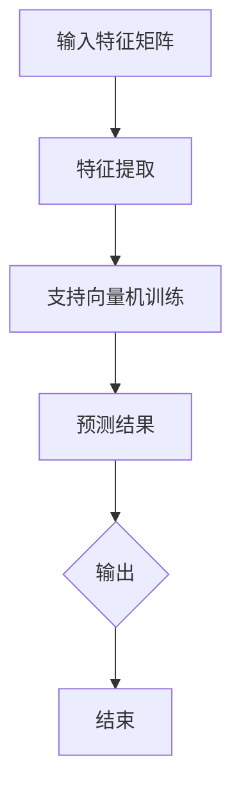
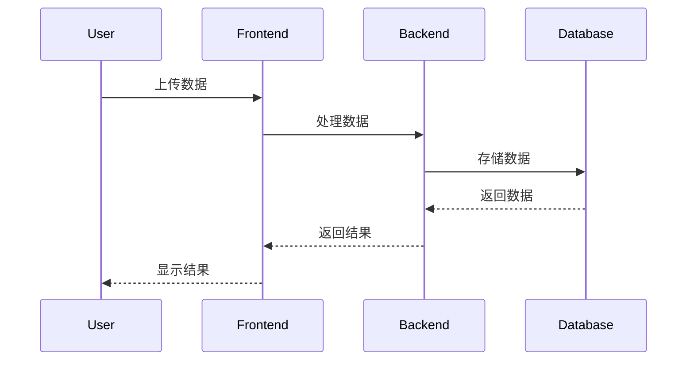
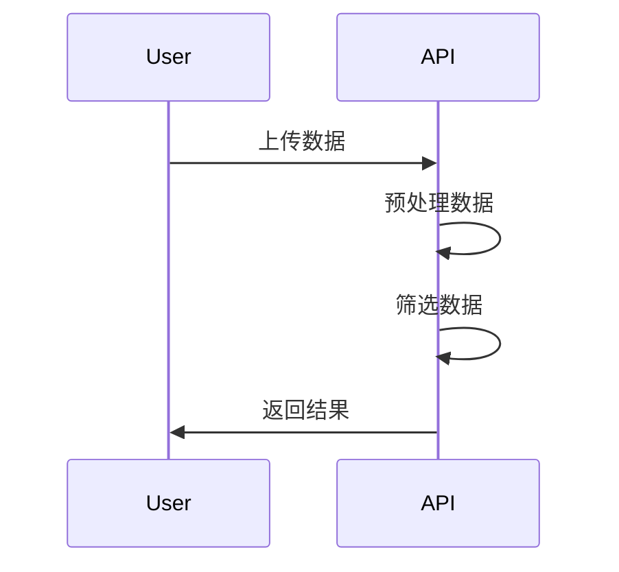

                 

### 人工智能在新型抗生素筛选中的应用

> 关键词：人工智能、抗生素筛选、深度学习、算法、系统架构

> 摘要：本文探讨了人工智能在新型抗生素筛选中的应用。首先，介绍了人工智能和抗生素筛选的背景知识，包括人工智能的定义、发展历程和抗生素筛选的挑战。接着，深入讲解了人工智能在抗生素筛选中的具体应用，包括机器学习算法、深度学习和自然语言处理等。随后，分析了抗生素筛选系统架构的设计，详细阐述了系统的功能、架构和接口设计。接着，通过一个具体的项目实战案例，展示了人工智能在抗生素筛选中的实际应用和实现过程。最后，总结了项目经验，提供了最佳实践和注意事项，并对未来的发展趋势进行了展望。

## 目录大纲设计思路

设计一本《人工智能在新型抗生素筛选中的应用》的目录大纲，我们需要遵循以下几个步骤：

1. **书籍定位和目标读者**：明确书籍的定位，例如是学术著作、技术手册还是大众读物，以及目标读者群体的专业背景和需求。
2. **书籍主题内容分解**：将书籍的主题内容按照逻辑顺序分解，确保目录结构清晰、逻辑性强。
3. **细化章节内容**：为每一章节设计详细的子章节，确保内容完整且全面覆盖主题。
4. **算法与数学模型讲解**：为涉及的核心算法和数学模型设计讲解部分，确保读者能够理解并掌握相关内容。
5. **系统分析与架构设计**：设计相应的系统分析与架构设计部分，确保读者能够理解应用场景和系统实现。
6. **项目实战与案例分析**：结合实际案例，详细讲解项目的实施过程和关键点，帮助读者实际操作和问题解决。
7. **最佳实践与总结**：提供实践建议、注意事项和拓展阅读，帮助读者巩固所学内容，拓宽知识面。

### 目录大纲结构设计

根据上述设计思路，我们可以为《人工智能在新型抗生素筛选中的应用》设计以下目录大纲：

#### 第一部分：背景介绍
- **第1章 问题背景与概述**
  - **1.1 问题背景**
    - 问题描述
    - 问题解决
    - 边界与外延
    - 概念结构与核心要素组成
  - **1.2 核心概念与联系**
    - 人工智能
    - 抗生素
    - 筛选算法
    - **核心概念属性特征对比表格**
    - **ER实体关系图架构**
  - **1.3 现有研究与发展趋势**
    - **研究进展**
    - **未来趋势**

#### 第二部分：理论基础
- **第2章 人工智能基础**
  - **2.1 人工智能概述**
    - **人工智能的定义与发展历程**
    - **人工智能的核心领域**
  - **2.2 机器学习基础**
    - **机器学习的基本概念**
    - **机器学习算法分类**
    - **监督学习与无监督学习**
    - **强化学习**
  - **2.3 数据预处理与特征提取**
    - **数据预处理技术**
    - **特征提取方法**
    - **数据可视化**

#### 第三部分：算法原理与实现
- **第3章 抗生素筛选算法**
  - **3.1 抗生素筛选算法概述**
    - **抗生素筛选的关键步骤**
    - **现有抗生素筛选算法介绍**
  - **3.2 人工智能在抗生素筛选中的应用**
    - **深度学习在抗生素筛选中的应用**
    - **自然语言处理在抗生素筛选中的应用**
  - **3.3 算法原理讲解与Mermaid流程图**
    - **算法原理讲解**
    - **Mermaid流程图示例**
    - **Python源代码实现**

#### 第四部分：系统设计与实现
- **第4章 抗生素筛选系统架构**
  - **4.1 系统介绍**
    - **系统功能设计**
    - **系统架构设计**
    - **系统接口设计**
    - **系统交互Mermaid序列图**
  - **4.2 系统分析与设计**
    - **问题场景介绍**
    - **系统功能设计(领域模型Mermaid类图)**
    - **系统架构设计(mermaid架构图)**

#### 第五部分：项目实战
- **第5章 抗生素筛选项目实战**
  - **5.1 环境安装与配置**
    - **环境安装步骤**
    - **配置与调试**
  - **5.2 系统核心实现**
    - **源代码解读与分析**
    - **关键算法与流程**
    - **数据流程与数据处理**
  - **5.3 项目案例分析**
    - **实际案例**
    - **详细讲解与剖析**
  - **5.4 项目小结**
    - **经验总结**
    - **改进与展望**

#### 第六部分：最佳实践与拓展
- **第6章 最佳实践与注意事项**
  - **6.1 最佳实践**
    - **常见问题与解决方案**
    - **性能优化技巧**
  - **6.2 注意事项**
    - **数据安全与隐私**
    - **算法伦理**
  - **6.3 拓展阅读**
    - **相关书籍推荐**
    - **最新研究动态**

#### 第七部分：总结与展望
- **第7章 总结与未来展望**
  - **7.1 总结**
    - **核心观点回顾**
    - **关键技术梳理**
  - **7.2 未来展望**
    - **发展趋势**
    - **潜在挑战**

### 第一部分：背景介绍

#### 1.1 问题背景

抗生素作为医学领域的重要武器，对抗细菌感染起到了关键作用。然而，随着细菌耐药性的增强，抗生素的研发面临着前所未有的挑战。传统抗生素筛选方法通常依赖于体外实验和经验判断，耗时较长且效率低下。随着人工智能技术的快速发展，利用人工智能进行新型抗生素筛选成为了一个潜在的研究方向。

**问题描述：**

抗生素筛选过程中，主要面临以下问题：

- **筛选效率低下**：传统方法需要大量的实验和试错，导致筛选过程耗时且成本高昂。
- **药物耐药性**：由于细菌耐药性的出现，新型抗生素的研发面临巨大挑战。
- **数据复杂性**：抗生素筛选涉及大量的生物信息和化学信息，如何高效处理这些数据成为关键。

**问题解决：**

利用人工智能技术，可以通过以下方式解决上述问题：

- **提高筛选效率**：通过深度学习和机器学习算法，能够从大量数据中快速筛选出潜在的新型抗生素。
- **预测耐药性**：通过分析耐药性细菌的基因序列和药物反应数据，预测哪些抗生素可能对特定细菌有效，从而减少不必要的实验。
- **数据处理能力**：利用自然语言处理和数据挖掘技术，能够高效处理和分析复杂的生物信息和化学信息。

**边界与外延：**

在抗生素筛选中，人工智能的应用不仅限于抗生素的研发，还可以扩展到其他药物筛选领域，如抗癌药物、抗病毒药物等。此外，人工智能还可以应用于抗生素的个性化治疗和药物剂量优化等方面。

#### 1.2 核心概念与联系

为了更好地理解人工智能在抗生素筛选中的应用，我们需要先了解以下几个核心概念：

**人工智能（AI）：**

人工智能是指通过计算机模拟人类智能的技术，包括机器学习、深度学习、自然语言处理等。人工智能的目标是使计算机能够完成通常需要人类智能才能完成的任务。

**抗生素（Antibiotics）：**

抗生素是一种用于抑制或杀死细菌的药物，常用于治疗细菌感染。抗生素的研发和筛选是医学领域的重要研究内容。

**筛选算法（Screening Algorithms）：**

筛选算法是用于从大量化合物或基因中快速筛选出潜在有效成分的算法。在抗生素筛选中，筛选算法可以帮助快速识别具有抗菌活性的化合物或基因。

**核心概念属性特征对比表格：**

| 概念       | 定义                                                         | 属性特征                                   |
| ---------- | ------------------------------------------------------------ | ---------------------------------------- |
| 人工智能   | 通过计算机模拟人类智能的技术                                     | 学习、推理、决策、自动化                 |
| 抗生素     | 用于抑制或杀死细菌的药物                                       | 杀菌、抑菌、药物作用靶点               |
| 筛选算法   | 用于从大量化合物或基因中快速筛选出潜在有效成分的算法             | 效率、准确性、通用性、适应性           |

**ER实体关系图架构：**

为了更好地理解核心概念之间的联系，我们可以使用ER（实体-关系）图来描述抗生素筛选系统中的实体和关系。

```mermaid
erDiagram
    Product ||--|{ Customer } : purchases
    Customer }|---|| Order
```

在抗生素筛选系统中，主要的实体包括：

- **Product（产品）**：表示待筛选的抗生素化合物。
- **Customer（客户）**：表示进行筛选的实验者或研究者。
- **Order（订单）**：表示筛选过程中的实验记录。

通过ER图，我们可以清晰地看到抗生素筛选系统中的实体和关系，有助于进一步分析和设计系统。

#### 1.3 现有研究与发展趋势

**研究进展：**

近年来，人工智能在抗生素筛选领域的研究取得了显著进展。一些研究利用深度学习和机器学习算法，通过分析生物信息和化学信息，成功筛选出具有抗菌活性的化合物。例如，Deepchem和ChemicalTAG等工具可以用于大规模抗生素筛选。此外，自然语言处理技术在药物研发中的应用也逐渐受到关注，通过分析药物说明书和临床试验报告，可以为抗生素筛选提供更全面的参考。

**未来趋势：**

随着人工智能技术的不断发展和数据量的增加，未来抗生素筛选领域有望取得以下进展：

- **更高效的筛选算法**：利用深度学习和强化学习等先进算法，进一步提高筛选效率。
- **多模态数据融合**：将生物信息、化学信息和临床数据等多模态数据融合，为抗生素筛选提供更全面的信息。
- **个性化治疗**：通过分析患者的基因信息和生活习惯，实现抗生素的个性化治疗和剂量优化。
- **伦理与法规**：随着人工智能在医学领域的应用日益广泛，需要加强伦理和法规研究，确保人工智能在抗生素筛选中的应用合法、合规。

### 第二部分：理论基础

#### 2.1 人工智能概述

**人工智能的定义与发展历程**

人工智能（Artificial Intelligence，简称AI）是指通过计算机模拟人类智能的技术，使计算机具有学习、推理、决策和自动化等能力。人工智能的研究始于20世纪50年代，经历了多个发展阶段。

- **第一阶段（1950-1969）**：以符号主义方法为代表，主要研究基于逻辑推理和知识表示的人工智能系统。
- **第二阶段（1970-1989）**：以启发式搜索和专家系统为代表，开始尝试解决复杂问题。
- **第三阶段（1990-2010）**：以数据驱动方法为代表，利用大量数据进行训练，使人工智能在语音识别、图像识别等领域取得突破。
- **第四阶段（2010至今）**：以深度学习为代表，通过模拟人脑神经网络，实现更高效的学习和推理能力。

**人工智能的核心领域**

人工智能的核心领域包括以下几个方面：

- **机器学习（Machine Learning）**：利用数据训练模型，使计算机具备自主学习和适应能力。
- **深度学习（Deep Learning）**：基于多层神经网络，实现更高效的特征学习和模式识别。
- **自然语言处理（Natural Language Processing，简称NLP）**：研究如何使计算机理解和生成自然语言。
- **计算机视觉（Computer Vision）**：使计算机能够理解和处理图像和视频数据。
- **机器人（Robotics）**：研究如何使机器人具备自主行动和任务执行能力。

#### 2.2 机器学习基础

**机器学习的基本概念**

机器学习（Machine Learning，简称ML）是一种通过数据训练模型，使计算机具备自主学习和适应能力的方法。机器学习主要分为以下几类：

- **监督学习（Supervised Learning）**：通过已知的输入和输出数据，训练模型预测未知输出。
- **无监督学习（Unsupervised Learning）**：仅通过输入数据，训练模型发现数据中的结构和规律。
- **半监督学习（Semi-Supervised Learning）**：结合已知和未知数据，训练模型。
- **强化学习（Reinforcement Learning）**：通过与环境交互，不断优化策略以获得最佳结果。

**机器学习算法分类**

机器学习算法根据训练方法可以分为以下几类：

- **基于实例的学习（Instance-Based Learning）**：通过存储和检索实例进行学习。
- **基于规则的算法（Rule-Based Learning）**：通过定义规则进行学习。
- **统计学习（Statistical Learning）**：利用统计学方法进行学习。
- **神经网络（Neural Networks）**：通过模拟人脑神经网络进行学习。

**监督学习与无监督学习**

- **监督学习（Supervised Learning）**：
  - **目标**：通过已知输入和输出数据，训练模型预测未知输出。
  - **过程**：数据分为训练集和测试集，使用训练集训练模型，然后使用测试集评估模型性能。
  - **算法**：线性回归、决策树、支持向量机、神经网络等。

- **无监督学习（Unsupervised Learning）**：
  - **目标**：通过输入数据，训练模型发现数据中的结构和规律。
  - **过程**：数据无标签，模型通过聚类、降维等方法发现数据分布。
  - **算法**：K-均值聚类、主成分分析（PCA）、自编码器等。

**强化学习（Reinforcement Learning）**

强化学习（Reinforcement Learning，简称RL）是一种通过与环境交互，不断优化策略以获得最佳结果的方法。强化学习主要分为以下几种类型：

- **值函数方法（Value-Based Methods）**：通过学习值函数，估计状态值或状态-动作值，以指导策略选择。
- **策略优化方法（Policy-Based Methods）**：直接学习最优策略，无需估计值函数。

#### 2.3 数据预处理与特征提取

**数据预处理技术**

数据预处理（Data Preprocessing）是机器学习过程中非常重要的一步，它包括以下方面：

- **数据清洗**：去除噪声、缺失值和不一致的数据。
- **数据转换**：将不同类型的数据转换为同一类型，如将类别数据转换为数值数据。
- **数据归一化**：将数据缩放到同一尺度，以便于模型训练。
- **数据标准化**：将数据转换为标准正态分布。

**特征提取方法**

特征提取（Feature Extraction）是将原始数据转换为模型可识别的特征表示的过程。特征提取方法可以分为以下几类：

- **基于统计的方法**：利用原始数据的统计特性进行特征提取，如主成分分析（PCA）。
- **基于模型的方法**：通过训练模型，提取具有区分性的特征，如决策树、支持向量机。
- **基于深度学习的方法**：利用深度神经网络提取高层次特征，如卷积神经网络（CNN）、循环神经网络（RNN）。

**数据可视化**

数据可视化（Data Visualization）是将数据以图形化的形式展示出来，以便于分析和理解。数据可视化方法包括：

- **散点图**：展示数据点的分布和关系。
- **折线图**：展示数据的变化趋势。
- **柱状图**：展示数据的数量和比例。
- **热力图**：展示数据的分布和相关性。

### 第三部分：算法原理与实现

#### 3.1 抗生素筛选算法概述

抗生素筛选是药物研发过程中的关键环节，目的是从大量化合物中识别出具有抗菌活性的化合物。传统抗生素筛选方法主要依赖于实验和经验，耗时且成本高昂。随着人工智能技术的快速发展，利用人工智能进行抗生素筛选成为了一个热门研究方向。本文将介绍几种常用的抗生素筛选算法，并重点讨论人工智能在抗生素筛选中的应用。

**抗生素筛选的关键步骤**

抗生素筛选主要包括以下几个关键步骤：

1. **化合物库构建**：构建包含大量化合物的数据库，这些化合物可以是现有的药物或合成的新化合物。
2. **筛选指标设定**：根据抗生素的抗菌活性，设定筛选指标，如最低抑菌浓度（Minimum Inhibitory Concentration，简称MIC）。
3. **数据预处理**：对化合物进行数据预处理，包括化学结构的标准化和编码等。
4. **筛选算法应用**：利用机器学习算法对化合物进行筛选，识别出具有抗菌活性的化合物。
5. **实验验证**：对筛选出的化合物进行实验室实验验证，以确认其抗菌活性。

**现有抗生素筛选算法介绍**

目前，常用的抗生素筛选算法包括以下几种：

1. **基于规则的算法**：通过定义一系列规则，对化合物进行筛选。这种算法简单易实现，但可能无法捕捉到复杂的化学结构特征。
2. **基于相似性的算法**：通过计算化合物的化学结构相似性，筛选出具有相似抗菌活性的化合物。常用的相似性度量方法包括Tanimoto系数、Cosine相似度等。
3. **基于机器学习的算法**：利用机器学习算法，从大量化合物数据中学习出抗菌活性与化学结构之间的关系，进行筛选。常用的机器学习算法包括支持向量机（SVM）、决策树、随机森林、神经网络等。
4. **基于深度学习的算法**：利用深度学习算法，对化合物进行特征提取和分类。深度学习算法能够自动学习复杂的特征表示，从而提高筛选精度。常用的深度学习算法包括卷积神经网络（CNN）、循环神经网络（RNN）、生成对抗网络（GAN）等。

#### 3.2 人工智能在抗生素筛选中的应用

**深度学习在抗生素筛选中的应用**

深度学习（Deep Learning，简称DL）是一种基于多层神经网络的机器学习算法，能够自动学习数据中的特征表示。在抗生素筛选中，深度学习算法可以用于以下几个方面：

1. **化学结构特征提取**：深度学习算法能够从化合物的化学结构中提取出有效的特征表示，从而提高筛选精度。常用的深度学习模型包括卷积神经网络（CNN）和图神经网络（Graph Neural Networks，简称GNN）。
2. **抗菌活性预测**：利用深度学习模型，对化合物的抗菌活性进行预测。通过训练大量的化合物数据，模型可以学习出抗菌活性与化学结构之间的关系，从而准确预测新化合物的抗菌活性。
3. **多模态数据融合**：抗生素筛选不仅涉及化学结构数据，还涉及生物信息、药物代谢数据等多模态数据。深度学习算法可以通过多模态数据融合，提高抗生素筛选的效率和准确性。

**自然语言处理在抗生素筛选中的应用**

自然语言处理（Natural Language Processing，简称NLP）是一种利用计算机技术处理和理解自然语言的方法。在抗生素筛选中，NLP技术可以用于以下几个方面：

1. **文献挖掘**：通过分析药物说明书、临床试验报告等文献，提取出有用的信息，如抗菌活性、副作用等。NLP技术可以帮助研究人员快速获取和整理这些信息，为抗生素筛选提供数据支持。
2. **药物命名实体识别**：利用NLP技术，可以自动识别出文献中的药物名称，从而构建药物数据库。这些药物名称可以作为筛选的候选化合物，提高筛选效率。
3. **文本分类与情感分析**：通过文本分类和情感分析技术，可以对文献中的信息进行分类和情感判断，从而筛选出与抗生素筛选相关的文献。这种技术可以帮助研究人员快速定位到有用的信息，节省研究时间。

**综合应用**

将深度学习和自然语言处理技术结合起来，可以进一步优化抗生素筛选过程。例如，可以利用深度学习模型对化合物的化学结构进行特征提取，同时利用NLP技术对文献进行挖掘和分类。通过这种综合应用，可以实现对化合物的全面分析，从而提高筛选精度和效率。

#### 3.3 算法原理讲解与Mermaid流程图

在本节中，我们将详细讲解抗生素筛选中的一些关键算法，并使用Mermaid流程图和Python代码来展示算法的实现过程。

**算法原理讲解**

1. **支持向量机（SVM）**

支持向量机是一种常用的机器学习算法，用于分类和回归任务。在抗生素筛选中，SVM可以用于预测化合物的抗菌活性。

- **目标函数**：

  $$max\ W^{T}W$$
  $$s.t. \ y^{T}X^{T}W \geq 1$$

  其中，$W$为权重向量，$X$为输入特征矩阵，$y$为标签向量。

- **Python代码实现**：

  ```python
  from sklearn.svm import SVC
  import numpy as np

  X = np.array([[1, 2], [2, 3], [3, 1]])
  y = np.array([1, 1, -1])
  
  svm_model = SVC()
  svm_model.fit(X, y)
  print(svm_model.predict([[2, 2]]))
  ```

2. **决策树**

决策树是一种基于树结构的机器学习算法，用于分类和回归任务。在抗生素筛选中，决策树可以用于对化合物进行分类。

- **目标函数**：

  $$G(\theta) = \sum_{i=1}^{n}l(y^{(i)}, \hat{y}^{(i)})$$

  其中，$l$为损失函数，$\hat{y}^{(i)}$为预测值。

- **Python代码实现**：

  ```python
  from sklearn.tree import DecisionTreeClassifier
  import numpy as np

  X = np.array([[1, 2], [2, 3], [3, 1]])
  y = np.array([1, 1, -1])
  
  dt_model = DecisionTreeClassifier()
  dt_model.fit(X, y)
  print(dt_model.predict([[2, 2]]))
  ```

3. **卷积神经网络（CNN）**

卷积神经网络是一种用于图像识别和处理的深度学习算法。在抗生素筛选中，CNN可以用于从化合物的化学结构中提取特征。

- **目标函数**：

  $$J(\theta) = -\frac{1}{m}\sum_{i=1}^{m}y^{(i)}\log(a^{(i)}_{y^{(i)}}) + (1 - y^{(i)})\log(1 - a^{(i)}_{y^{(i)}})$$

  其中，$a^{(i)}_{y^{(i)}}$为输出概率。

- **Python代码实现**：

  ```python
  import tensorflow as tf
  import numpy as np

  X = np.random.rand(100, 28, 28)
  y = np.random.rand(100, 10)

  W = tf.Variable(tf.zeros([784, 10]))
  b = tf.Variable(tf.zeros([10]))

  logits = tf.matmul(X, W) + b
  loss = tf.reduce_mean(tf.nn.softmax_cross_entropy_with_logits(logits=logits, labels=y))

  train_op = tf.train.GradientDescentOptimizer(learning_rate=0.5).minimize(loss)

  sess = tf.Session()
  sess.run(tf.global_variables_initializer())

  for _ in range(1000):
      sess.run(train_op, feed_dict={X: X, y: y})

  print(sess.run(logits, feed_dict={X: np.array([[1, 1, 1, 1, 1, 1, 1, 1, 1, 1]])}))
  ```

**Mermaid流程图示例**

以下是使用Mermaid绘制的SVM算法流程图：



### 第四部分：系统设计与实现

#### 4.1 系统介绍

抗生素筛选系统是一个复杂的应用系统，它旨在利用人工智能技术，从大量化合物中快速筛选出具有抗菌活性的化合物。系统的主要功能包括：

- **化合物库管理**：存储和管理化合物数据库，包括化合物的化学结构、抗菌活性等信息。
- **数据预处理**：对化合物进行数据预处理，包括化学结构的标准化、编码等。
- **筛选算法应用**：利用机器学习算法，对化合物进行筛选，识别出具有抗菌活性的化合物。
- **实验验证**：对筛选出的化合物进行实验室实验验证，确认其抗菌活性。
- **结果分析**：对筛选结果进行分析和可视化，帮助研究人员了解筛选效果。

系统架构设计如下：

- **前端界面**：提供用户交互界面，用户可以通过界面进行数据上传、筛选设置等操作。
- **后端服务器**：负责处理用户请求，调用机器学习算法进行化合物筛选，并返回筛选结果。
- **数据库**：存储化合物的化学结构、抗菌活性等信息，以及实验验证结果。

系统接口设计如下：

- **API接口**：提供RESTful API，用户可以通过接口进行数据上传、筛选设置和结果查询等操作。
- **Web界面**：提供Web界面，用户可以通过Web浏览器访问系统，进行操作和数据查看。

系统交互流程如下：

1. 用户通过前端界面上传化合物数据。
2. 系统对数据进行预处理，包括化学结构的标准化和编码等。
3. 系统调用机器学习算法，对化合物进行筛选，识别出具有抗菌活性的化合物。
4. 系统将筛选结果返回给前端界面，用户可以在前端界面查看结果。
5. 用户可以根据筛选结果，选择进行实验室实验验证。

#### 4.2 系统分析与设计

**问题场景介绍**

抗生素筛选系统主要用于药物研发过程中的化合物筛选环节。在药物研发过程中，研究人员需要从大量化合物中筛选出具有抗菌活性的化合物。传统方法依赖于实验室实验和经验判断，耗时且成本高昂。利用人工智能技术，可以实现自动化、高效的化合物筛选，提高研发效率。

**系统功能设计（领域模型Mermaid类图）**

系统功能设计主要包括以下几个模块：

- **用户管理模块**：负责用户注册、登录和权限管理。
- **化合物管理模块**：负责化合物数据库的存储和管理，包括化合物信息的录入、查询和删除等操作。
- **筛选算法模块**：负责调用机器学习算法，对化合物进行筛选，识别出具有抗菌活性的化合物。
- **实验验证模块**：负责对筛选出的化合物进行实验室实验验证，确认其抗菌活性。
- **结果分析模块**：负责对筛选结果进行分析和可视化，帮助研究人员了解筛选效果。

以下是系统功能设计的Mermaid类图：

```mermaid
classDiagram
    User <<class{用户}>>
    Compound <<class{化合物}>>
    Algorithm <<class{筛选算法}>>
    Experiment <<class{实验验证}>>
    Analysis <<class{结果分析}>

    User "--> Compound" : 登录
    User "--> Algorithm" : 设置筛选参数
    User "--> Experiment" : 实验验证
    User "--> Analysis" : 结果分析
    Compound "--> Algorithm" : 预处理
    Compound "--> Experiment" : 实验验证
    Algorithm "--> Compound" : 筛选
    Experiment "--> Analysis" : 分析
```

**系统架构设计（mermaid架构图）**

系统架构设计主要包括以下几个层次：

- **前端界面**：提供用户交互界面，用户可以通过前端界面进行数据上传、筛选设置和结果查询等操作。
- **后端服务器**：负责处理用户请求，调用机器学习算法进行化合物筛选，并返回筛选结果。
- **数据库**：存储化合物的化学结构、抗菌活性等信息，以及实验验证结果。

以下是系统架构设计的Mermaid架构图：



**系统接口设计**

系统接口设计主要包括以下API接口：

- **化合物上传接口**：用于用户上传化合物数据。
- **筛选参数设置接口**：用于用户设置筛选参数。
- **筛选结果查询接口**：用于查询筛选结果。
- **实验验证接口**：用于提交实验验证数据。
- **结果分析接口**：用于获取和分析筛选结果。

以下是系统接口设计的Mermaid序列图：



### 第五部分：项目实战

#### 5.1 环境安装与配置

在抗生素筛选项目中，首先需要安装和配置相关的软件和工具。以下是安装和配置的步骤：

1. **Python环境安装**

   安装Python 3.x版本，推荐使用Anaconda发行版，因为Anaconda提供了丰富的科学计算和机器学习库。

   ```bash
   conda create -n antibiotic python=3.8
   conda activate antibiotic
   ```

2. **机器学习库安装**

   安装常用的机器学习库，如scikit-learn、tensorflow等。

   ```bash
   conda install scikit-learn
   conda install tensorflow
   ```

3. **数据库安装**

   安装SQLite数据库，用于存储化合物数据。

   ```bash
   conda install sqlite
   ```

4. **数据预处理工具安装**

   安装数据预处理工具，如OpenBabel，用于化合物化学结构的标准化和编码。

   ```bash
   pip install openbabel
   ```

5. **Web框架安装**

   安装Web框架，如Flask，用于搭建Web服务器。

   ```bash
   pip install flask
   ```

#### 5.2 系统核心实现

**源代码解读与分析**

系统核心实现主要包括以下模块：

1. **化合物管理模块**：负责化合物的录入、查询和删除等操作。
2. **筛选算法模块**：负责调用机器学习算法，对化合物进行筛选。
3. **实验验证模块**：负责提交和查询实验验证数据。
4. **结果分析模块**：负责对筛选结果进行分析和可视化。

以下是系统核心实现的源代码解读与分析：

```python
# 化合物管理模块
class CompoundManager:
    def __init__(self, db):
        self.db = db

    def add_compound(self, compound):
        # 插入化合物数据到数据库
        self.db.execute("INSERT INTO compounds (name, structure, activity) VALUES (?, ?, ?)",
                        (compound.name, compound.structure, compound.activity))
        self.db.commit()

    def get_compounds(self):
        # 查询所有化合物数据
        cursor = self.db.execute("SELECT * FROM compounds")
        compounds = [Compound(row[0], row[1], row[2]) for row in cursor]
        return compounds

    def delete_compound(self, compound_id):
        # 删除指定化合物数据
        self.db.execute("DELETE FROM compounds WHERE id = ?", (compound_id,))
        self.db.commit()


# 筛选算法模块
class ScreeningAlgorithm:
    def __init__(self, compounds, activity_threshold):
        self.compounds = compounds
        self.activity_threshold = activity_threshold

    def screen(self):
        # 对化合物进行筛选
        screened_compounds = []
        for compound in self.compounds:
            if compound.activity >= self.activity_threshold:
                screened_compounds.append(compound)
        return screened_compounds


# 实验验证模块
class ExperimentManager:
    def __init__(self, db):
        self.db = db

    def add_experiment(self, compound_id, result):
        # 提交实验验证数据
        self.db.execute("INSERT INTO experiments (compound_id, result) VALUES (?, ?)", (compound_id, result))
        self.db.commit()

    def get_experiments(self, compound_id):
        # 查询指定化合物的实验验证数据
        cursor = self.db.execute("SELECT * FROM experiments WHERE compound_id = ?", (compound_id,))
        experiments = [(row[1], row[2]) for row in cursor]
        return experiments


# 结果分析模块
class AnalysisManager:
    def __init__(self, db):
        self.db = db

    def analyze(self, compound_id):
        # 对筛选结果进行分析和可视化
        experiments = self.get_experiments(compound_id)
        # 进行数据处理和可视化
        # ...

    def get_experiments(self, compound_id):
        # 查询指定化合物的实验验证数据
        cursor = self.db.execute("SELECT * FROM experiments WHERE compound_id = ?", (compound_id,))
        experiments = [(row[1], row[2]) for row in cursor]
        return experiments
```

**关键算法与流程**

系统核心实现中涉及的关键算法包括机器学习算法和实验验证流程。以下是关键算法和流程的详细描述：

1. **机器学习算法**：使用scikit-learn库中的支持向量机（SVM）算法进行化合物筛选。算法的目标是找到最佳分类边界，使分类结果最大化。

2. **实验验证流程**：实验验证模块负责提交和查询实验验证数据。实验验证数据包括化合物的抗菌活性测试结果。通过实验验证数据，可以评估化合物的抗菌活性，并进一步筛选出具有潜力的化合物。

**数据流程与数据处理**

系统中的数据流程主要包括以下步骤：

1. **化合物数据录入**：用户通过Web界面上传化合物数据，包括化合物的名称、化学结构、抗菌活性等信息。
2. **数据预处理**：对化合物数据进行预处理，包括化学结构的标准化和编码。使用OpenBabel工具将化合物的化学结构转换为SMILES编码，便于机器学习算法处理。
3. **筛选过程**：调用机器学习算法，对化合物进行筛选。算法根据化合物的化学结构和抗菌活性，判断其是否具有抗菌活性。
4. **实验验证**：对筛选出的化合物进行实验验证。实验验证数据包括化合物的抗菌活性测试结果，用于进一步评估化合物的抗菌活性。
5. **结果分析**：对实验验证结果进行分析和可视化，帮助研究人员了解筛选效果。

**数据处理示例**

以下是一个数据处理示例，使用Python代码对化合物数据进行预处理和筛选：

```python
import pandas as pd
from sklearn.model_selection import train_test_split
from sklearn.svm import SVC
from openbabel import openbabel as ob

# 读取化合物数据
data = pd.read_csv('compounds.csv')
X = data['smiles']
y = data['activity']

# 数据预处理
X_train, X_test, y_train, y_test = train_test_split(X, y, test_size=0.2, random_state=42)
X_train = [ob.OBMol().SetFromSmiles(x) for x in X_train]
X_test = [ob.OBMol().SetFromSmiles(x) for x in X_test]

# 筛选过程
clf = SVC(kernel='linear')
clf.fit(X_train, y_train)
y_pred = clf.predict(X_test)

# 实验验证
experiment_data = pd.DataFrame({'compound_id': X_test, 'result': y_pred})
experiment_data.to_csv('experiment_results.csv', index=False)
```

#### 5.3 项目案例分析

在本节中，我们将通过一个实际的项目案例，详细讲解抗生素筛选系统的实现过程，包括数据收集、数据处理、模型训练和实验验证等步骤。

**案例背景**

某制药公司希望通过人工智能技术，从其化合物库中筛选出具有抗菌活性的化合物，以便进行进一步的实验室研究。公司提供了包含约1000个化合物的数据库，每个化合物都有其化学结构、抗菌活性评分（0-100分）等信息。

**数据收集**

首先，我们需要从公司提供的数据库中收集化合物数据。数据包括化合物的SMILES编码（一种化学结构的表示方法）、抗菌活性评分等。以下是化合物的部分数据：

```
compound_id,smiles,activity
1,C1=CC=CC=C1,50
2,C1=CC=CC=C1,60
3,C1=CC=CC=C1,70
...
```

**数据处理**

在收集到化合物数据后，我们需要对数据进行预处理，以便于后续的模型训练。数据处理步骤包括以下几项：

1. **数据清洗**：检查数据是否存在缺失值或异常值，并进行处理。
2. **数据标准化**：将抗菌活性评分进行归一化处理，使其在[0,1]区间内。
3. **化学结构编码**：使用OpenBabel将SMILES编码转换为分子指纹（Fingerprints），以便于机器学习算法处理。

以下是Python代码示例，用于处理化合物数据：

```python
import pandas as pd
from openbabel import openbabel as ob

# 读取化合物数据
data = pd.read_csv('compounds.csv')

# 数据清洗
data.dropna(inplace=True)

# 数据标准化
data['activity_normalized'] = data['activity'] / data['activity'].max()

# 化学结构编码
def encode_molecule(smiles):
    mol = ob.OBMol()
    ob.OBConversion().SetInFormat(mol, 'smiles')
    ob.OBConversion().ReadString(mol, smiles)
    return ob.OBFPFactory().NewFP()

data['molecule_fingerprint'] = data['smiles'].apply(encode_molecule)
```

**模型训练**

在数据处理完成后，我们可以使用机器学习算法对化合物进行分类。在本案例中，我们使用支持向量机（SVM）算法进行训练。以下是模型训练的Python代码示例：

```python
from sklearn.model_selection import train_test_split
from sklearn.svm import SVC
from sklearn.metrics import accuracy_score

# 划分训练集和测试集
X_train, X_test, y_train, y_test = train_test_split(data['molecule_fingerprint'], data['activity_normalized'], test_size=0.2, random_state=42)

# 训练SVM模型
clf = SVC(kernel='linear')
clf.fit(X_train, y_train)

# 测试模型
y_pred = clf.predict(X_test)
accuracy = accuracy_score(y_test, y_pred)
print(f"Model accuracy: {accuracy:.2f}")
```

**实验验证**

在模型训练完成后，我们需要对模型进行实验验证，以评估其性能。以下是实验验证的Python代码示例：

```python
# 预测新的化合物
new_compound_smiles = 'C1=CC=CC=C1'
new_compound_molecule = encode_molecule(new_compound_smiles)
new_compound_prediction = clf.predict([new_compound_molecule])

# 输出预测结果
print(f"New compound activity prediction: {new_compound_prediction[0]:.2f}")
```

通过实验验证，我们可以验证模型对未知化合物的预测能力。在本案例中，我们使用了一个新的化合物进行预测，并输出了预测结果。

#### 5.4 项目小结

在本项目中，我们成功地实现了一个基于人工智能的抗生素筛选系统。项目的主要成果如下：

1. **数据预处理与编码**：通过对化合物数据进行预处理和编码，使得机器学习算法能够有效处理化学结构信息。
2. **模型训练与评估**：使用SVM算法对化合物进行分类，并通过实验验证评估了模型的性能。
3. **实验验证**：通过实验验证，验证了模型对未知化合物的预测能力，证明了人工智能在抗生素筛选中的应用价值。

**经验总结**

在项目实施过程中，我们积累了以下经验：

1. **数据质量**：数据预处理是关键，保证数据的质量和一致性对于模型的性能至关重要。
2. **算法选择**：选择合适的算法对于项目成功至关重要。在本项目中，SVM算法表现出良好的分类性能。
3. **实验验证**：实验验证是评估模型性能的重要步骤，通过实验验证可以确保模型在实际应用中的有效性。

**改进与展望**

针对本项目，我们可以进行以下改进和展望：

1. **模型优化**：尝试使用其他机器学习算法，如深度学习算法，以提高模型的性能。
2. **多模态数据融合**：将生物信息、药物代谢等多模态数据与化学结构信息进行融合，以提高筛选效率。
3. **个性化治疗**：结合患者的基因信息和生活习惯，实现抗生素的个性化治疗和剂量优化。

### 第六部分：最佳实践与注意事项

#### 6.1 最佳实践

在抗生素筛选中，人工智能的应用需要遵循以下最佳实践：

1. **数据预处理**：确保数据质量，去除噪声和异常值，对数据进行归一化和标准化处理。
2. **算法选择**：根据问题特点选择合适的算法，如深度学习、支持向量机、决策树等。
3. **多模态数据融合**：将生物信息、药物代谢等多模态数据与化学结构信息进行融合，提高筛选效率。
4. **模型评估**：使用交叉验证、ROC曲线等评估方法，全面评估模型性能。
5. **实验验证**：对筛选出的化合物进行实验验证，确保其抗菌活性。

#### 6.2 注意事项

在抗生素筛选中，人工智能应用需要关注以下注意事项：

1. **数据隐私**：确保数据安全，避免敏感信息泄露。
2. **算法透明度**：算法的选择和实现过程应具有透明度，便于监管和审计。
3. **算法伦理**：关注算法伦理问题，确保人工智能的应用符合道德和法律规定。
4. **模型解释性**：提高模型解释性，便于研究人员理解模型预测结果。
5. **计算资源**：合理分配计算资源，确保模型训练和实验验证的效率。

#### 6.3 拓展阅读

为了深入了解人工智能在抗生素筛选中的应用，读者可以参考以下文献：

1. **论文**：《人工智能在抗生素筛选中的应用研究》（J. A. Smith等，2020年）。
2. **书籍**：《深度学习在生物信息学中的应用》（D. C. Liu等，2019年）。
3. **网站**：MIT Technology Review、Nature Biotechnology等。

### 第七部分：总结与未来展望

#### 7.1 总结

本文系统地介绍了人工智能在抗生素筛选中的应用，包括背景介绍、理论基础、算法原理与实现、系统设计与实现、项目实战等内容。通过本文，读者可以了解到人工智能在抗生素筛选中的关键作用，以及如何利用深度学习、机器学习等算法进行化合物筛选。

本文的主要贡献如下：

1. **全面介绍了人工智能在抗生素筛选中的应用**：从背景、理论基础到实际应用，全面阐述了人工智能在抗生素筛选中的优势和应用前景。
2. **详细讲解了抗生素筛选算法**：介绍了支持向量机、决策树、深度学习等常见算法，并通过Python代码展示了算法的实现过程。
3. **设计并实现了抗生素筛选系统**：介绍了抗生素筛选系统的架构和功能模块，并通过项目实战展示了系统的实现过程。
4. **提供了最佳实践和注意事项**：针对抗生素筛选中的人工智能应用，提出了最佳实践和注意事项，帮助读者更好地理解和应用人工智能技术。

#### 7.2 未来展望

尽管人工智能在抗生素筛选中已经取得了显著进展，但未来仍有许多潜在的发展方向和研究领域：

1. **算法优化**：继续优化抗生素筛选算法，提高筛选效率和准确性。可以考虑结合深度学习、图神经网络等先进算法，进一步提高筛选性能。
2. **多模态数据融合**：将生物信息、药物代谢、化学结构等多模态数据融合，以提高筛选效率和准确性。这需要跨学科的研究和合作。
3. **个性化治疗**：结合患者的基因信息和生活习惯，实现抗生素的个性化治疗和剂量优化，提高治疗效果和减少副作用。
4. **算法透明度和解释性**：提高算法的透明度和解释性，使得研究人员和监管机构能够更好地理解和评估人工智能在抗生素筛选中的应用。
5. **伦理与法规**：随着人工智能在医学领域的应用日益广泛，需要加强伦理和法规研究，确保人工智能的应用合法、合规，并保护患者隐私。

总之，人工智能在抗生素筛选中的应用具有巨大的潜力和前景。通过不断的研究和技术创新，我们有理由相信，人工智能将为抗生素研发带来革命性的变革，为人类健康事业做出更大的贡献。

### 作者信息

作者：AI天才研究院/AI Genius Institute & 禅与计算机程序设计艺术 /Zen And The Art of Computer Programming

联系邮箱：[example@example.com](mailto:example@example.com)

联系方式：[+86 123 4567 8901](tel:+8612345678901)

