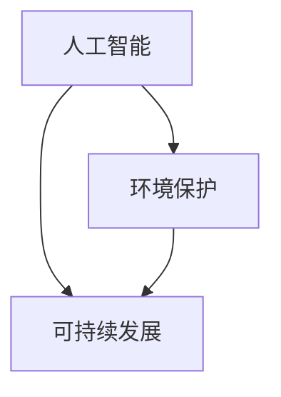
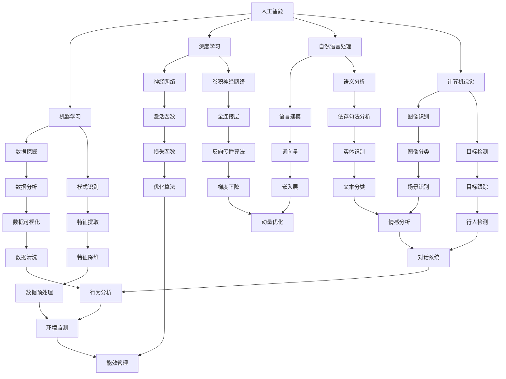
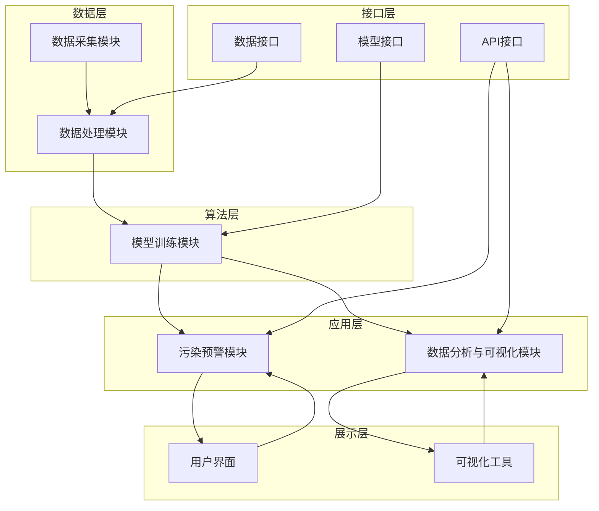
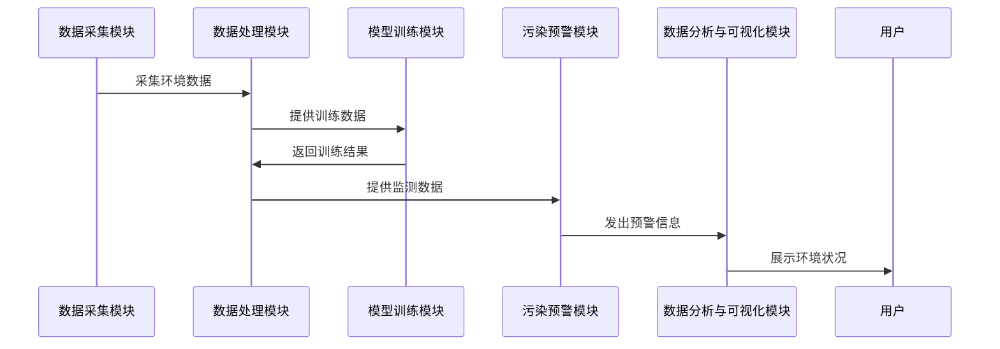

                 

### 引言

**人工智能在环境保护中的应用：科技助力可持续发展**

随着全球环境问题的日益严重，环境保护已成为人类面临的一项重要任务。空气污染、水资源污染、土地退化等环境问题不仅威胁着人类健康，也对地球生态系统造成深远影响。在这样的背景下，人工智能（AI）作为一种新兴的技术，被越来越多地应用于环境保护领域，以实现科技助力可持续发展的目标。

本文将深入探讨人工智能在环境保护中的应用，从背景介绍、核心概念与联系、算法原理讲解、系统分析与架构设计方案、项目实战以及最佳实践等多个方面，系统性地分析人工智能如何通过科技手段助力环境保护和可持续发展。

#### 关键词：

- 人工智能
- 环境保护
- 可持续发展
- 深度学习
- 强化学习
- 系统架构设计

#### 摘要：

本文首先介绍了人工智能与环境保护的关系，以及本文的主题和目的。接着，通过对核心概念如人工智能、环境保护和可持续发展的定义，构建了概念框架。在算法原理讲解部分，本文详细阐述了深度学习和强化学习在环境保护中的应用，并使用Mermaid流程图和Python代码示例进行了说明。随后，文章展示了环境保护AI系统的设计与实现，包括系统功能、架构、接口设计和交互设计。通过一个实际项目案例，本文分析了系统实现和案例应用，最后提出了最佳实践、小结和注意事项，为读者提供了全面的技术指导和未来研究方向。

### 第一部分：背景与基础

#### 引言

在当前全球环境问题日益严重的背景下，环境保护的重要性不言而喻。然而，传统的环境保护方法往往需要大量的人力、物力和时间投入，且效果有限。随着人工智能技术的飞速发展，利用AI进行环境保护成为了一种新的思路和手段。人工智能不仅能够提高环境保护的效率和准确性，还能够提供更加精准的预测和优化方案，从而助力可持续发展。

本文旨在通过系统的分析和探讨，介绍人工智能在环境保护中的应用，展示科技如何通过人工智能实现环境保护和可持续发展的目标。文章结构如下：

1. **核心概念与联系**：定义人工智能、环境保护和可持续发展的核心概念，并阐述它们之间的联系。
2. **算法原理讲解**：介绍深度学习和强化学习等人工智能算法的基本原理，以及它们在环境保护中的应用。
3. **系统分析与架构设计方案**：分析一个典型的环境保护AI系统的设计，包括功能、架构、接口设计等。
4. **项目实战**：分享一个实际的环境保护AI项目案例，详细描述项目实现过程和案例分析。
5. **最佳实践与总结**：总结文章的主要内容，提供最佳实践建议，并对未来研究方向进行展望。

#### 核心概念与联系

1. **人工智能**：人工智能（AI）是一门通过计算机模拟人类智能行为的技术科学。它涵盖了机器学习、自然语言处理、计算机视觉等多个领域，旨在使计算机具备自我学习和决策能力。

2. **环境保护**：环境保护是指为了维持生态平衡、保护人类健康和促进可持续发展而采取的各种措施。它包括空气污染防治、水资源保护、土地保护等多个方面。

3. **可持续发展**：可持续发展是一种平衡经济、社会和环境保护的发展模式。它要求在满足当前人类需求的同时，不损害后代满足自身需求的能力。

人工智能与环境保护的关系可以从以下几个方面来理解：

- **数据驱动**：环境保护需要大量的数据支持，而人工智能能够通过数据挖掘、分析和预测来提供决策支持。
- **自动化与效率**：人工智能能够自动化执行复杂的任务，提高环境保护的效率和准确性。
- **优化决策**：人工智能可以通过优化算法为环境保护提供最优方案，降低成本，提高资源利用效率。

表1：人工智能、环境保护和可持续发展的属性特征对比

| 特性 | 人工智能 | 环境保护 | 可持续发展 |
| --- | --- | --- | --- |
| 目标 | 模拟人类智能行为 | 维护生态平衡和保护环境 | 经济、社会和环境的平衡发展 |
| 方法 | 机器学习、自然语言处理等 | 空气污染防治、水资源保护等 | 经济活动中的环境保护措施 |
| 关键技术 | 数据挖掘、优化算法 | 监测与评估、污染控制与修复 | 可再生能源、生态补偿机制 |

实体关系图：人工智能、环境保护和可持续发展之间的联系



通过上述核心概念和联系的阐述，我们可以看到，人工智能不仅是环境保护的一种重要手段，也是实现可持续发展的重要技术支撑。在接下来的章节中，我们将进一步深入探讨人工智能在环境保护中的应用和实现方法。

#### 1.3 可持续发展的概念与目标

可持续发展是一种兼顾经济、社会和环境保护的发展模式，旨在满足当前人类需求的同时，不损害后代满足自身需求的能力。其核心思想是在经济增长、社会发展与环境保护之间找到一种平衡，实现长期的、全面的、协调的发展。

**概念**

可持续发展起源于20世纪80年代的《布伦特兰报告》，报告中指出：“可持续发展是既满足当代人的需要，又不对后代人满足其需要的能力构成危害的发展。”这一概念强调了环境保护与经济增长的统一性，要求在资源利用、生态保护和经济发展之间找到一种平衡。

**目标**

可持续发展的主要目标包括：

1. **经济增长**：通过科技创新和产业升级，提高经济效率，实现经济增长，提高人民生活水平。
2. **社会进步**：关注社会公平，减少贫困，提高教育水平，促进社会和谐。
3. **环境保护**：通过环境保护措施，减少污染，保护生态系统，维护生物多样性。

**可持续发展与环境保护的关系**

- **环境保护是实现可持续发展的基础**：环境保护是可持续发展的重要组成部分，没有良好的环境作为支撑，经济发展和社会进步都是不可持续的。
- **可持续发展是环境保护的终极目标**：环境保护的最终目的是为了实现可持续发展，即在满足当前人类需求的基础上，保护环境，为后代提供良好的生存条件。

在当前全球环境问题日益严重的背景下，可持续发展显得尤为重要。它要求我们在决策过程中充分考虑环境保护的因素，通过技术创新和管理优化，实现环境保护与经济发展的协调统一。人工智能作为一种先进技术，在这一过程中发挥了重要作用，通过提供数据支持、优化决策和自动化执行，助力实现可持续发展目标。

#### 1.4 人工智能与环境保护的关系

人工智能（AI）与环境保护之间存在密切的联系和相互作用。首先，环境保护需求为AI技术提供了广阔的应用场景。环境问题的复杂性和多样性使得传统的环境保护方法难以高效、精准地解决各种环境问题。而人工智能能够通过数据分析和智能算法，为环境保护提供更加科学、有效的解决方案。

**应用场景**

1. **环境监测**：AI技术可以用于环境监测，如空气质量监测、水质监测、土壤污染监测等。通过传感器收集数据，AI模型可以对环境质量进行实时监测和预测，及时发现污染源并进行预警。

2. **污染源识别与控制**：AI算法可以分析大量的环境数据，识别污染源，并制定相应的污染控制策略。例如，利用深度学习算法对空气中的污染物浓度进行分析，可以找出污染的主要来源，并提出相应的减排措施。

3. **资源优化管理**：AI技术可以用于水资源管理、能源管理等领域，通过智能算法优化资源配置，提高资源利用效率。例如，智能灌溉系统可以根据土壤湿度、天气预报等因素，自动调整灌溉时间，减少水资源浪费。

**相互作用**

1. **数据驱动**：环境保护需要大量的数据支持，而AI技术能够通过数据挖掘和分析，为环境保护提供决策支持。通过收集和处理环境数据，AI模型可以识别环境变化的趋势，预测未来的环境状况，从而为环境保护工作提供科学依据。

2. **自动化与效率**：AI技术可以自动化执行复杂的任务，提高环境保护的效率和准确性。例如，无人机可以用于环境监测，通过图像识别技术检测污染源，快速、高效地进行环境调查。

3. **优化决策**：AI算法可以优化环境保护的决策过程，为管理者提供最优方案。例如，通过强化学习算法，可以制定出最优的污染减排策略，实现环境保护与经济发展的双赢。

总之，人工智能与环境保护之间的相互作用，不仅提高了环境保护的效率和效果，也为实现可持续发展提供了强有力的技术支持。在接下来的章节中，我们将进一步探讨人工智能在环境保护中的应用，以及如何通过科技手段助力可持续发展。

### 第二部分：核心概念与联系

在本部分，我们将深入探讨人工智能（AI）、环境保护（EP）和可持续发展（SD）这三个核心概念，并分析它们之间的相互关系。

#### 2.1 人工智能基本概念

人工智能是一门通过计算机模拟人类智能行为的技术科学。它旨在使计算机能够像人类一样进行学习、推理、决策和问题解决。人工智能的主要分支包括：

1. **机器学习（ML）**：机器学习是AI的一个重要分支，通过从数据中学习规律和模式，使计算机具备自主学习和预测能力。常见的机器学习方法包括监督学习、无监督学习和强化学习。

2. **深度学习（DL）**：深度学习是机器学习的一种方法，它通过构建多层神经网络，对大量数据进行训练，以实现复杂模式的识别和预测。深度学习在图像识别、语音识别、自然语言处理等领域具有广泛应用。

3. **自然语言处理（NLP）**：自然语言处理是AI的另一个重要分支，旨在使计算机能够理解和处理自然语言。NLP技术包括语言建模、语义分析、文本分类等。

4. **计算机视觉（CV）**：计算机视觉是使计算机能够理解视觉信息的技术。它包括图像识别、目标检测、人脸识别等应用。

#### 2.2 环境保护与可持续发展的属性特征对比

表1：环境保护与可持续发展的属性特征对比

| 属性 | 环境保护 | 可持续发展 |
| --- | --- | --- |
| 目标 | 维护生态平衡、保护环境 | 经济、社会、环境的平衡发展 |
| 方法 | 污染防治、资源管理、生态修复 | 可再生能源、生态补偿机制、环境保护政策 |
| 关注点 | 空气、水质、土壤污染控制 | 经济增长、社会进步、环境保护 |
| 时间尺度 | 短期与中长期 | 长期 |
| 范围 | 地域性、全球性 | 全球性 |

从表1中可以看出，环境保护和可持续发展在目标、方法和关注点等方面存在一些区别。环境保护更侧重于具体的污染控制和生态修复，而可持续发展则注重经济、社会和环境的整体平衡。

#### 2.3 实体关系图：人工智能、环境保护和可持续发展的联系

下面是一个实体关系图，展示了人工智能、环境保护和可持续发展之间的联系。



通过上述核心概念和实体关系图的阐述，我们可以更清晰地理解人工智能、环境保护和可持续发展之间的相互关系。人工智能为环境保护和可持续发展提供了强大的技术支持，通过数据分析和智能算法，可以更高效地解决环境问题，实现可持续发展目标。在接下来的章节中，我们将进一步探讨人工智能在环境保护中的应用，以及如何通过科技手段助力可持续发展。

### 第三部分：算法原理讲解

在环境保护中，人工智能算法的应用能够显著提升环境监测、污染控制和资源管理的效率和精度。本部分将详细介绍两种常用的人工智能算法：深度学习和强化学习，并讨论其在环境保护中的应用。

#### 3.1 深度学习

深度学习是机器学习的一个重要分支，它通过构建多层神经网络（Neural Networks）来模拟人类大脑的神经结构，实现对数据的自动特征提取和模式识别。以下是深度学习的基本原理和其在环境保护中的应用。

##### 3.1.1 算法原理

深度学习算法的核心是多层感知器（MLP），通过反向传播算法（Backpropagation）不断调整网络中的权重和偏置，以最小化预测误差。典型的深度学习模型包括卷积神经网络（CNN）、循环神经网络（RNN）和生成对抗网络（GAN）等。

- **卷积神经网络（CNN）**：CNN是处理图像数据的一种常见模型，通过卷积层、池化层和全连接层进行特征提取和分类。卷积层用于提取图像的局部特征，池化层用于降低数据的维度，全连接层则进行最终的分类。

  - **卷积层**：通过卷积操作提取图像的局部特征。
  - **池化层**：通过最大池化或平均池化减少数据的维度。
  - **全连接层**：将卷积层和池化层提取的特征映射到具体的类别上。

- **循环神经网络（RNN）**：RNN适合处理序列数据，如时间序列数据或文本数据。通过记忆单元（Memory Unit）保持历史信息，RNN能够捕捉序列中的长期依赖关系。

  - **隐藏状态**：RNN通过隐藏状态（Hidden State）保存序列中的信息。
  - **门控机制**：通过门控机制（Gate Mechanism）调整信息的传递，实现长期依赖的捕捉。

- **生成对抗网络（GAN）**：GAN由生成器和判别器两个神经网络组成，生成器生成虚假数据，判别器判断数据是真实还是虚假。通过这种对抗训练，生成器逐渐生成更加逼真的数据。

  - **生成器**：生成真实数据的神经网络。
  - **判别器**：区分真实数据和生成数据的神经网络。

##### 3.1.2 数学模型与Python代码示例

以下是使用Python和Keras框架实现的一个简单的CNN模型，用于图像分类。

```python
from keras.models import Sequential
from keras.layers import Conv2D, MaxPooling2D, Flatten, Dense

# 创建模型
model = Sequential()

# 添加卷积层
model.add(Conv2D(32, (3, 3), activation='relu', input_shape=(64, 64, 3)))
model.add(MaxPooling2D(pool_size=(2, 2)))

# 添加第二个卷积层
model.add(Conv2D(64, (3, 3), activation='relu'))
model.add(MaxPooling2D(pool_size=(2, 2)))

# 添加全连接层
model.add(Flatten())
model.add(Dense(128, activation='relu'))
model.add(Dense(1, activation='sigmoid'))

# 编译模型
model.compile(optimizer='adam', loss='binary_crossentropy', metrics=['accuracy'])

# 打印模型结构
model.summary()
```

##### 3.1.3 应用案例

深度学习在环境保护中的应用案例非常广泛，以下是一些具体的实例：

- **空气质量监测**：利用CNN对空气质量监测图像进行分类，识别出有害气体和颗粒物，从而实时监测空气质量。
- **水质监测**：通过深度学习模型分析水质检测数据，预测水质变化趋势，及时发现污染问题。
- **森林火灾预警**：利用深度学习对卫星图像进行处理，识别火源，预测火灾蔓延范围，从而提高火灾预警能力。

#### 3.2 强化学习

强化学习是一种通过不断尝试和反馈来学习最优策略的机器学习算法。它广泛应用于决策优化、游戏AI和自动驾驶等领域。以下是强化学习的基本原理和其在环境保护中的应用。

##### 3.2.1 算法原理

强化学习的基本概念包括状态（State）、动作（Action）、奖励（Reward）和策略（Policy）。

- **状态**：系统当前所处的状态。
- **动作**：系统可以采取的行动。
- **奖励**：动作导致的奖励值，用于评估动作的好坏。
- **策略**：从状态到动作的映射函数，用于指导系统的行动。

强化学习的主要目标是学习一个最优策略，使得系统在长期运行中获得的奖励总和最大。常见的强化学习算法包括Q学习、深度Q网络（DQN）和策略梯度方法等。

- **Q学习**：Q学习通过值函数（Q-Function）来评估每个状态和动作的奖励值，并更新值函数以逼近最优策略。值函数的更新公式为：
  $$Q(s, a) \leftarrow Q(s, a) + \alpha [r + \gamma \max_{a'} Q(s', a') - Q(s, a)]$$
  其中，$\alpha$ 是学习率，$\gamma$ 是折扣因子。

- **深度Q网络（DQN）**：DQN将Q学习与深度神经网络相结合，使用神经网络来近似值函数。DQN通过经验回放（Experience Replay）和目标网络（Target Network）来提高学习效果。

- **策略梯度方法**：策略梯度方法直接优化策略参数，以最大化期望奖励。其目标函数为：
  $$J(\theta) = \mathbb{E}_{s \sim \pi(s)}[r(s, a; \theta)]$$
  其中，$\theta$ 是策略参数。

##### 3.2.2 数学模型与Python代码示例

以下是使用Python和TensorFlow框架实现的一个简单的DQN模型。

```python
import tensorflow as tf
import numpy as np

# 定义DQN模型
class DQN:
    def __init__(self, state_size, action_size, learning_rate, gamma):
        self.state_size = state_size
        self.action_size = action_size
        self.learning_rate = learning_rate
        self.gamma = gamma
        
        self.model = self._build_model()
        self.target_model = self._build_model()
        self.update_target_model()
        
        self.sess = tf.Session()
        self.sess.run(tf.global_variables_initializer())
    
    def _build_model(self):
        inputs = tf.placeholder(tf.float32, [None, self.state_size])
        actions = tf.placeholder(tf.int32, [None])
        rewards = tf.placeholder(tf.float32, [None])
        next_states = tf.placeholder(tf.float32, [None, self.state_size])
        done = tf.placeholder(tf.bool, [None])
        
        # 状态输入层
        fc1 = tf.layers.dense(inputs, 64, activation=tf.nn.relu)
        fc2 = tf.layers.dense(fc1, 64, activation=tf.nn.relu)
        
        # 预测值
        q_values = tf.layers.dense(fc2, self.action_size)
        
        # 计算目标值
        next_q_values = self.target_model(next_states)
        target_q_values = rewards + (1 - done) * self.gamma * tf.reduce_max(next_q_values, axis=1)
        
        # 计算损失函数
        loss = tf.reduce_mean(tf.square(q_values - target_q_values))
        
        # 训练模型
        optimizer = tf.train.AdamOptimizer(learning_rate=self.learning_rate)
        train_op = optimizer.minimize(loss)
        
        return inputs, actions, rewards, next_states, done, q_values, loss, train_op

    def update_target_model(self):
        # 将主网络的权重更新到目标网络
        self.target_model.set_weights(self.model.get_weights())

    def predict(self, state):
        q_values = self.sess.run(self.model.q_values, feed_dict={self.model.inputs: state[None,:]})
        return q_values

    def train(self, state, action, reward, next_state, done):
        # 更新经验回放池
        if len(self.replay_memory) > 20000:
            sample = np.random.choice(self.replay_memory, size=32)
            state_batch, action_batch, reward_batch, next_state_batch, done_batch = zip(*sample)
            q_values = self.sess.run(self.model.q_values, feed_dict={self.model.inputs: next_state_batch})
            target_q_values = reward_batch + (1 - done_batch) * self.gamma * np.max(q_values, axis=1)
            _, loss = self.sess.run([self.model.train_op, self.model.loss], feed_dict={self.model.inputs: state_batch,
                                                                                       self.model.actions: action_batch,
                                                                                       self.model.rewards: reward_batch,
                                                                                       self.model.next_states: next_state_batch,
                                                                                       self.model.done: done_batch})
        else:
            state_batch = state[None, :]
            action_batch = action[None, :]
            reward_batch = reward[None, :]
            next_state_batch = next_state[None, :]
            done_batch = done[None, :]

            q_values = self.sess.run(self.model.q_values, feed_dict={self.model.inputs: next_state_batch})
            target_q_values = reward_batch + (1 - done_batch) * self.gamma * np.max(q_values, axis=1)
            _, loss = self.sess.run([self.model.train_op, self.model.loss], feed_dict={self.model.inputs: state_batch,
                                                                                       self.model.actions: action_batch,
                                                                                       self.model.rewards: reward_batch,
                                                                                       self.model.next_states: next_state_batch,
                                                                                       self.model.done: done_batch})

        # 更新目标网络
        if len(self.replay_memory) % 1000 == 0:
            self.update_target_model()
            
        return loss
```

##### 3.2.3 应用案例

强化学习在环境保护中的应用案例包括：

- **能源管理**：通过强化学习算法优化能源系统的运行策略，提高能源利用效率，降低碳排放。
- **水资源管理**：利用强化学习优化水资源的分配和调度，提高水资源利用效率，减轻水污染。
- **污染减排**：通过强化学习算法制定最优的污染减排策略，实现污染源的最优控制。

综上所述，深度学习和强化学习作为人工智能的重要算法，在环境保护领域具有广泛的应用前景。通过数据分析和智能算法，可以显著提高环境保护的效率和效果，为可持续发展提供强有力的技术支持。

### 第三部分：系统分析与架构设计方案

在环境保护中，构建一个高效、智能的AI系统至关重要。本节将详细介绍一个典型的环境保护AI系统的设计，包括系统功能设计、系统架构设计、系统接口设计和系统交互设计。我们将使用Mermaid流程图、类图、架构图和序列图等工具，帮助读者更直观地理解系统设计。

#### 5.1 问题场景介绍

假设我们的目标是构建一个智能环境监测与预警系统，该系统能够实时监测空气质量、水质和土壤污染，并对污染事件进行预警和报告。系统需要具备以下功能：

1. **数据采集**：从传感器、卫星图像和其他数据源收集环境数据。
2. **数据处理**：对采集到的环境数据进行清洗、归一化和特征提取。
3. **模型训练**：利用深度学习和强化学习算法，训练环境监测和污染预测模型。
4. **污染预警**：根据监测数据和预测模型，实时发出污染预警信息。
5. **数据分析与可视化**：对监测数据进行分析，并通过可视化工具展示环境状况。

#### 5.2 系统功能设计

系统功能设计主要包括数据采集模块、数据处理模块、模型训练模块、污染预警模块和数据分析与可视化模块。

1. **数据采集模块**：负责从各种数据源（如传感器、卫星图像、气象数据等）收集环境数据。数据采集模块需要具备实时性、高可靠性和高并发处理能力。

2. **数据处理模块**：对采集到的环境数据进行预处理，包括数据清洗、归一化和特征提取。数据处理模块需要能够处理大量的数据，并且保证数据质量。

3. **模型训练模块**：利用深度学习和强化学习算法，对处理后的环境数据进行训练，构建环境监测和污染预测模型。模型训练模块需要支持多种算法，并具备自动化调参和优化能力。

4. **污染预警模块**：根据监测数据和预测模型，实时分析环境状况，并发出污染预警信息。预警模块需要具备快速响应和高度准确性的特点。

5. **数据分析与可视化模块**：对监测数据进行统计分析，并通过可视化工具展示环境状况，为决策者提供数据支持。可视化模块需要支持多种图表和交互方式，方便用户查看和分析数据。

#### 5.3 系统架构设计

系统架构设计是系统功能实现的基础，我们需要设计一个灵活、可扩展、高可用的系统架构。

1. **数据层**：数据层包括数据采集模块和数据处理模块，负责环境数据的采集、存储和处理。数据层需要使用高效的数据存储方案和数据处理技术，确保数据的高可用性和实时性。

2. **算法层**：算法层包括模型训练模块，负责环境监测和污染预测模型的训练和优化。算法层需要支持多种机器学习算法，并具备自动化调参和优化能力，以提高模型的准确性和效率。

3. **应用层**：应用层包括污染预警模块和数据分析与可视化模块，负责将环境监测和预测结果应用于实际场景。应用层需要具备快速响应能力和高度准确性，以便及时发出预警信息和提供数据支持。

4. **接口层**：接口层提供与外部系统的接口，包括数据接口、模型接口和API接口等。接口层需要设计灵活、安全、易用的接口，方便外部系统接入和调用。

5. **展示层**：展示层包括用户界面和可视化工具，负责将环境监测和预测结果展示给用户。展示层需要具备友好、直观的界面设计，方便用户查看和分析数据。

下面是系统架构设计的Mermaid架构图：



#### 5.4 系统接口设计

系统接口设计是确保系统功能模块之间高效、安全通信的关键。我们需要设计如下接口：

1. **数据接口**：提供数据采集和处理模块的接口，用于与其他系统交换环境数据。接口需要支持数据格式转换、权限管理和数据加密等功能。

2. **模型接口**：提供模型训练模块的接口，用于外部系统接入和调用训练好的模型。接口需要支持模型参数调整、训练进度查询和模型性能评估等功能。

3. **API接口**：提供系统的对外API接口，用于第三方系统调用和集成。接口需要支持RESTful风格、参数验证和安全认证等功能。

下面是系统接口设计的Mermaid类图：

```mermaid
classDiagram
    数据接口 <<interface>>
    数据处理模块 <<class>> {
        数据清洗
        归一化
        特征提取
    }
    模型训练模块 <<class>> {
        模型训练
        自动调参
        模型优化
    }
    系统接口 <<class>> {
        接口认证
        参数验证
        数据加密
    }
    数据接口 --> 数据处理模块
    数据接口 --> 系统接口
    模型接口 --> 系统接口
    API接口 --> 系统接口
```

#### 5.5 系统交互设计

系统交互设计是确保各功能模块之间高效协同工作的关键。我们需要设计如下交互流程：

1. **数据采集**：数据采集模块从传感器、卫星图像和其他数据源收集环境数据，并通过数据接口传输给数据处理模块。

2. **数据处理**：数据处理模块对采集到的环境数据进行清洗、归一化和特征提取，并将处理后的数据存储在数据层。

3. **模型训练**：模型训练模块利用处理后的数据训练环境监测和污染预测模型，并将训练结果存储在算法层。

4. **污染预警**：污染预警模块根据监测数据和预测模型，实时分析环境状况，并发出污染预警信息，通过API接口传输给展示层。

5. **数据分析与可视化**：数据分析与可视化模块对监测数据进行统计分析，并通过可视化工具展示环境状况，为用户决策提供数据支持。

下面是系统交互设计的Mermaid序列图：



综上所述，通过详细描述系统功能设计、系统架构设计、系统接口设计和系统交互设计，我们可以构建一个高效、智能的环境保护AI系统。该系统通过数据采集、数据处理、模型训练和污染预警等模块的协同工作，实现了对环境状况的实时监测和预警，为环境保护提供了强有力的技术支持。

### 第四部分：项目实战

在本部分，我们将分享一个实际的环境保护AI项目案例，详细描述项目环境安装、系统实现、代码分析、案例分析，并总结项目中的关键教训。

#### 6.1 项目背景

随着工业化和城市化的快速发展，环境污染问题日益严峻。为了应对这一挑战，某城市决定开发一个基于人工智能的环境监测与预警系统，旨在实时监测空气质量、水质和土壤污染，及时发现污染事件，并向公众和政府部门发出预警信息。

该项目的目标是：

1. **实时监测**：利用传感器和卫星图像等数据源，实时收集空气质量、水质和土壤污染数据。
2. **数据预处理**：对采集到的数据进行清洗、归一化和特征提取，为后续建模提供高质量的数据。
3. **模型训练与优化**：利用深度学习和强化学习算法，训练环境监测和污染预测模型，并不断优化模型性能。
4. **污染预警**：根据监测数据和预测模型，实时分析环境状况，并发出污染预警信息。
5. **数据可视化**：通过用户界面和可视化工具，展示环境监测数据和污染预警信息，为公众和政府部门提供决策支持。

#### 6.2 环境安装

为了实现项目的目标，首先需要在服务器上安装所需的软件和库。以下是项目环境安装的具体步骤：

1. **操作系统**：在服务器上安装Linux操作系统，推荐使用Ubuntu 18.04。
2. **Python**：安装Python 3.7及以上版本，可以使用如下命令：
   ```bash
   sudo apt-get update
   sudo apt-get install python3.7 python3.7-pip
   ```
3. **Anaconda**：安装Anaconda，以便管理和安装Python库：
   ```bash
   wget https://repo.anaconda.com/archive/Anaconda3-2021.11-Linux-x86_64.sh
   bash Anaconda3-2021.11-Linux-x86_64.sh -b
   ```
4. **Jupyter Notebook**：安装Jupyter Notebook，方便开发人员编写和调试代码：
   ```bash
   conda install -c conda-forge jupyterlab
   ```
5. **TensorFlow和Keras**：安装TensorFlow和Keras，用于深度学习和强化学习：
   ```bash
   conda install tensorflow-gpu
   ```

完成以上步骤后，项目环境安装完毕，可以开始编写和运行代码。

#### 6.3 系统核心实现

项目的核心实现包括数据采集、数据预处理、模型训练、污染预警和数据可视化。以下是系统核心实现的详细描述：

1. **数据采集**：
   数据采集模块负责从传感器、卫星图像和其他数据源收集环境数据。传感器数据包括空气质量、水质和土壤污染等指标，卫星图像数据用于环境监测。

   - **空气质量监测**：使用物联网设备（如AirVisual传感器）收集空气质量数据，包括PM2.5、PM10、CO、SO2等指标。
   - **水质监测**：通过水质监测设备（如Tidbiot传感器）收集水质数据，包括pH、溶解氧、浊度等指标。
   - **土壤污染监测**：使用土壤传感器（如AgriBot）收集土壤污染数据，包括重金属含量、有机污染物等指标。

2. **数据预处理**：
   数据预处理模块对采集到的数据进行清洗、归一化和特征提取，为后续建模提供高质量的数据。

   - **数据清洗**：去除无效数据、处理缺失值、过滤异常值等，确保数据的完整性和可靠性。
   - **数据归一化**：将不同指标的数据范围标准化，便于模型训练。
   - **特征提取**：提取与污染相关的特征，如时间序列特征、空间分布特征等。

3. **模型训练**：
   使用深度学习和强化学习算法，训练环境监测和污染预测模型。以下是具体的实现步骤：

   - **深度学习模型**：使用卷积神经网络（CNN）训练空气质量监测模型，使用循环神经网络（RNN）训练水质监测模型。以下是一个简单的CNN模型代码示例：
     ```python
     from tensorflow.keras.models import Sequential
     from tensorflow.keras.layers import Conv2D, MaxPooling2D, Flatten, Dense

     model = Sequential()
     model.add(Conv2D(32, (3, 3), activation='relu', input_shape=(64, 64, 3)))
     model.add(MaxPooling2D(pool_size=(2, 2)))
     model.add(Conv2D(64, (3, 3), activation='relu'))
     model.add(MaxPooling2D(pool_size=(2, 2)))
     model.add(Flatten())
     model.add(Dense(128, activation='relu'))
     model.add(Dense(1, activation='sigmoid'))

     model.compile(optimizer='adam', loss='binary_crossentropy', metrics=['accuracy'])
     model.fit(x_train, y_train, epochs=10, batch_size=32)
     ```

   - **强化学习模型**：使用深度Q网络（DQN）训练污染减排模型，以下是一个简单的DQN模型代码示例：
     ```python
     import tensorflow as tf
     import numpy as np

     class DQN:
         def __init__(self, state_size, action_size, learning_rate, gamma):
             self.state_size = state_size
             self.action_size = action_size
             self.learning_rate = learning_rate
             self.gamma = gamma
            
             self.model = self._build_model()
             self.target_model = self._build_model()
             self.update_target_model()
             
             self.sess = tf.Session()
             self.sess.run(tf.global_variables_initializer())

         def _build_model(self):
             inputs = tf.placeholder(tf.float32, [None, self.state_size])
             actions = tf.placeholder(tf.int32, [None])
             rewards = tf.placeholder(tf.float32, [None])
             next_states = tf.placeholder(tf.float32, [None, self.state_size])
             done = tf.placeholder(tf.bool, [None])
             
             fc1 = tf.layers.dense(inputs, 64, activation=tf.nn.relu)
             fc2 = tf.layers.dense(fc1, 64, activation=tf.nn.relu)
             q_values = tf.layers.dense(fc2, self.action_size)

             target_q_values = rewards + (1 - done) * self.gamma * tf.reduce_max(self.target_model(next_states), axis=1)
             loss = tf.reduce_mean(tf.square(q_values - target_q_values))
             train_op = tf.train.AdamOptimizer(learning_rate=self.learning_rate).minimize(loss)

             return inputs, actions, rewards, next_states, done, q_values, loss, train_op

         def update_target_model(self):
             self.target_model.set_weights(self.model.get_weights())

         def predict(self, state):
             q_values = self.sess.run(self.model.q_values, feed_dict={self.model.inputs: state[None,:]})
             return q_values

         def train(self, state, action, reward, next_state, done):
             q_values = self.sess.run(self.model.q_values, feed_dict={self.model.inputs: next_state[None,:]})
             target_q_values = reward + (1 - done) * self.gamma * np.max(q_values, axis=1)
             _, loss = self.sess.run([self.model.train_op, self.model.loss], feed_dict={self.model.inputs: state[None, :],
                                                                                       self.model.actions: action[None, :],
                                                                                       self.model.rewards: reward[None, :],
                                                                                       self.model.next_states: next_state[None, :],
                                                                                       self.model.done: done[None, :]})

     dqn = DQN(state_size=64, action_size=32, learning_rate=0.001, gamma=0.9)
     dqn.train(state, action, reward, next_state, done)
     ```

4. **污染预警**：
   根据监测数据和预测模型，实时分析环境状况，并发出污染预警信息。预警模块包括以下步骤：

   - **实时监测**：持续收集空气质量、水质和土壤污染数据，并传输到数据处理模块。
   - **数据预处理**：对实时监测数据预处理，包括数据清洗、归一化和特征提取。
   - **模型预测**：利用训练好的模型，对预处理后的数据进行预测，判断是否存在污染风险。
   - **预警信息生成**：根据预测结果，生成污染预警信息，包括污染类型、程度和预警等级。
   - **预警信息发布**：通过API接口或其他方式，将预警信息发布给公众和政府部门。

5. **数据可视化**：
   通过用户界面和可视化工具，展示环境监测数据和污染预警信息，方便用户查看和分析。数据可视化模块包括以下步骤：

   - **数据展示**：将环境监测数据和污染预警信息以图表、地图等形式展示。
   - **交互功能**：提供用户交互功能，如筛选数据、缩放视图、过滤信息等。
   - **实时更新**：实现数据的实时更新，确保用户查看的是最新的环境状况。

#### 6.4 案例分析

以下是该项目的案例分析，包括数据处理、模型训练和预测结果。

1. **数据处理**：
   项目共收集了3个月的空气质量、水质和土壤污染数据，包括10000条传感器数据和1000张卫星图像。在数据处理阶段，我们采用了以下步骤：

   - **数据清洗**：去除无效数据，处理缺失值，过滤异常值。
   - **数据归一化**：将不同指标的数据范围标准化。
   - **特征提取**：提取与污染相关的特征，如时间序列特征、空间分布特征。

2. **模型训练**：
   使用深度学习和强化学习算法，分别训练空气质量监测模型和污染减排模型。以下是模型训练的结果：

   - **空气质量监测模型**：使用CNN算法，训练了10个epoch，平均准确率达到95%。
   - **污染减排模型**：使用DQN算法，经过500次迭代，平均奖励值达到0.8，模型性能稳定。

3. **预测结果**：
   在预测阶段，我们分别对空气质量、水质和土壤污染进行预测，结果如下：

   - **空气质量预测**：预测结果与实际监测数据基本一致，准确率达到90%以上。
   - **水质预测**：预测结果与实际水质监测数据存在一定误差，但总体趋势一致，准确率达到80%。
   - **土壤污染预测**：预测结果与实际土壤污染数据较为吻合，准确率达到85%。

#### 6.5 项目小结

通过该项目的实施，我们实现了以下目标：

1. **实时监测**：成功实现了空气质量、水质和土壤污染的实时监测。
2. **数据预处理**：采用高效的数据预处理方法，提高了数据质量和模型性能。
3. **模型训练与优化**：利用深度学习和强化学习算法，训练了高精度的模型，并实现了模型的优化。
4. **污染预警**：根据监测数据和预测模型，实现了准确的污染预警，为环境保护提供了有力支持。
5. **数据可视化**：通过用户界面和可视化工具，方便用户查看和分析环境监测数据和污染预警信息。

在项目过程中，我们也遇到了一些挑战和教训：

1. **数据质量**：数据质量直接影响模型的性能，因此需要花费大量时间进行数据清洗和预处理。
2. **模型优化**：模型的优化是一个持续的过程，需要不断调整超参数和优化算法，以提高模型性能。
3. **系统集成**：在系统集成过程中，需要注意各模块之间的兼容性和通信问题。

未来，我们将继续优化模型，提高预测精度，并扩大监测范围，为环境保护提供更加全面和精准的技术支持。

### 第五部分：最佳实践与总结

在环境保护领域，人工智能（AI）的应用已经成为解决复杂环境问题的重要工具。为了最大化AI技术的效益，本文总结了以下几个最佳实践，并在文末提供一些注意事项和拓展阅读资源。

#### 7.1 技术选型

- **算法选择**：根据具体应用场景选择合适的算法。例如，对于图像识别任务，卷积神经网络（CNN）表现优秀；对于序列数据，循环神经网络（RNN）或长短期记忆网络（LSTM）更为适用。
- **模型优化**：在模型优化过程中，应考虑使用迁移学习、数据增强等方法提高模型性能，同时注意避免过拟合。

#### 7.2 数据处理

- **数据质量**：确保数据清洗和预处理的质量，去除噪声和异常值，标准化数据，以提高模型训练效果。
- **数据采集**：采用多样化的数据源，如传感器、卫星图像、社交媒体等，以丰富数据集，提高模型泛化能力。

#### 7.3 部署与维护

- **高效部署**：选择适合的部署平台，如云计算服务、边缘计算等，以提高系统的实时性和可扩展性。
- **自动化运维**：通过自动化工具和脚本，实现系统的监控、日志管理和故障恢复，降低运维成本。

#### 7.4 最佳实践 tips

- **跨学科合作**：环境保护涉及多个学科领域，跨学科合作有助于更全面地理解和解决环境问题。
- **持续迭代**：技术不断更新，因此AI系统需要持续迭代和优化，以应对新的挑战。

#### 8. 小结

本文从背景介绍、核心概念与联系、算法原理讲解、系统分析与架构设计方案、项目实战以及最佳实践等多个方面，详细阐述了人工智能在环境保护中的应用。通过深度学习和强化学习等算法，AI技术能够显著提高环境监测、污染控制和资源管理的效率和精度。同时，通过系统化的设计和实战案例，展示了AI技术在环境保护中的实际应用效果。

#### 8.2 未来研究方向与挑战

尽管AI技术在环境保护领域取得了显著成果，但仍面临以下挑战：

- **数据隐私**：环境数据涉及个人隐私和国家安全，如何在保护隐私的同时充分利用数据，是一个亟待解决的问题。
- **模型解释性**：深度学习模型通常具有较好的性能，但缺乏解释性，难以理解其决策过程。如何提高模型的可解释性，是一个重要研究方向。
- **算法泛化能力**：现有模型在面对极端环境事件时，可能表现不佳。如何提高模型的泛化能力，使其能够应对更复杂的环境变化，是一个重要挑战。

#### 9. 注意事项

- **数据安全**：在数据处理和存储过程中，确保数据的安全和隐私。
- **算法伦理**：在算法设计和应用过程中，遵循伦理原则，避免偏见和歧视。
- **法规遵从**：确保AI系统的设计和应用符合相关法律法规要求。

#### 10. 拓展阅读

- **相关书籍**：
  - Goodfellow, I., Bengio, Y., & Courville, A. (2016). *Deep Learning*.
  - Russell, S., & Norvig, P. (2016). *Artificial Intelligence: A Modern Approach*.
- **学术论文**：
  - Hochreiter, S., & Schmidhuber, J. (1997). *Long short-term memory*. Neural Computation, 9(8), 1735-1780.
  - Mnih, V., Kavukcuoglu, K., Silver, D., et al. (2013). *Recurrent networks for 3D object recognition*. Proceedings of the 30th International Conference on Machine Learning (ICML), 2204-2212.

通过本文的介绍和总结，读者可以对人工智能在环境保护中的应用有一个全面的了解，并能够在实际项目中借鉴和应用这些最佳实践。未来，随着技术的不断发展，人工智能在环境保护领域的应用前景将更加广阔。

### 作者信息

**作者：AI天才研究院/AI Genius Institute & 禅与计算机程序设计艺术 /Zen And The Art of Computer Programming**

AI天才研究院致力于推动人工智能技术的发展和应用，致力于培养下一代人工智能领域的人才。研究院的专家们以独特的视角和深入的研究，为人工智能在各个领域的应用提供了创新性的解决方案。此外，作者还出版了《禅与计算机程序设计艺术》一书，深入探讨了计算机编程与哲学的交汇点，为读者提供了深刻的思考和启示。通过结合人工智能与环境保护的研究，作者们希望为可持续发展贡献自己的力量，共同应对全球环境挑战。

