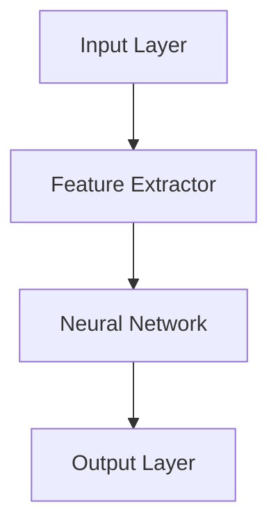
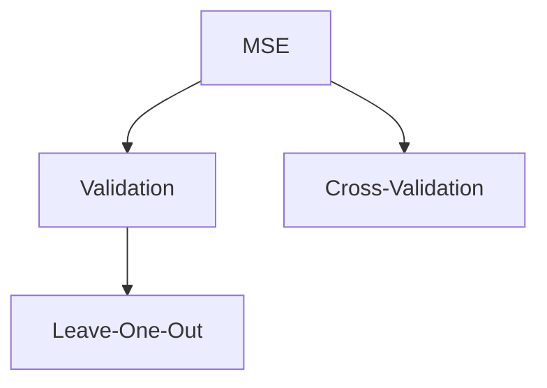
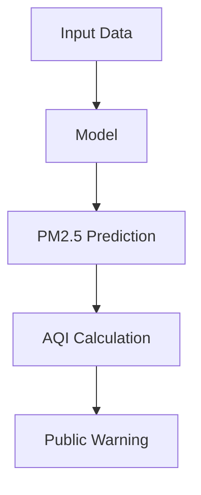
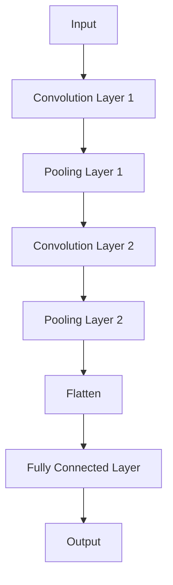
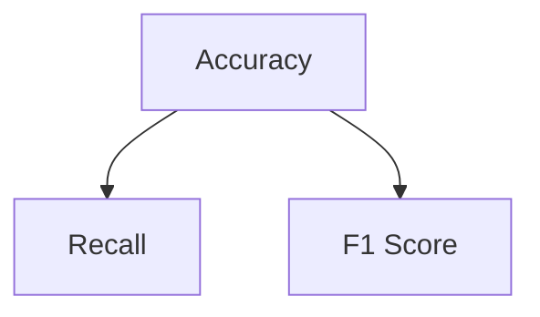
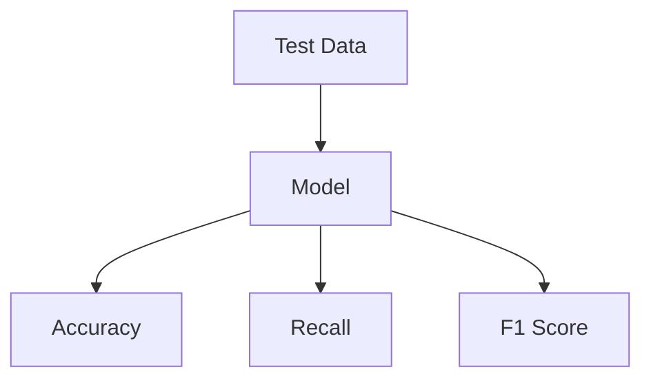

                 

### 问题的背景与重要性

#### 1.1 环境保护现状与挑战

##### 1.1.1 全球环境问题概述

全球环境问题日益严峻，其中一些关键问题包括：

- **温室气体排放与气候变化**：大量温室气体如二氧化碳、甲烷等的排放导致全球气温上升，极端天气现象频发，冰川融化，海平面上升。
  
- **生物多样性丧失**：栖息地的破坏、污染、过度捕捞等因素导致物种灭绝速度加快，生态平衡受到威胁。

- **水资源短缺与污染**：由于工业污染、农业用水和城市化，水资源短缺和水污染问题在全球范围内日益严重。

- **土地退化与沙漠化**：不合理的农业耕作、森林砍伐、过度放牧等导致土地质量下降，沙漠化问题尤为突出。

##### 1.1.2 环境保护的重要性

环境保护的重要性体现在多个方面：

- **维护生态平衡**：健康的生态系统对地球的气候调节、水资源管理、土壤肥沃等至关重要。

- **促进可持续发展**：环境保护是实现经济、社会和环境协调发展的基础，有利于长期繁荣。

- **保护人类健康**：环境污染直接威胁人类健康，减少污染有助于降低疾病率和提升生活质量。

#### 1.2 人工智能在环境保护中的应用前景

随着人工智能技术的飞速发展，其在环境保护中的应用前景十分广阔：

- **污染监测与预测**：利用人工智能进行环境监测，提高监测效率和准确性。

- **资源管理**：通过人工智能优化水资源、能源等资源的管理，提升利用效率。

- **生物多样性保护**：利用人工智能识别和保护关键物种和生态系统。

- **生态修复**：借助人工智能技术，制定和实施生态修复计划，恢复生态系统功能。

#### 1.3 核心概念与联系

##### 1.3.1 核心概念原理

在本章节中，我们将讨论两个核心概念：**生态修复**和**人工智能与环境监测**。

###### 1.3.1.1 生态修复

**生态修复**是指通过一系列措施恢复生态系统功能的过程。其目标包括：

- **恢复生态系统的结构和功能**：通过清除污染、重建植被、恢复湿地等手段，使生态系统恢复正常状态。

- **提升生物多样性**：保护和恢复关键物种和栖息地，维持生态平衡。

- **改善环境质量**：通过减少污染、控制侵蚀等手段，改善环境状况。

生态修复的方法主要包括：

- **物理修复**：如土地平整、植被恢复等。
  
- **化学修复**：如土壤去污、水质净化等。

- **生物修复**：如利用植物、微生物等生物体进行污染物的降解和转化。

###### 1.3.1.2 人工智能与环境监测

**环境监测**是环境保护的重要组成部分，其目的是实时获取环境数据，评估环境状况，为环境管理提供依据。传统环境监测方法存在一些局限性，如成本高、效率低等。

人工智能在环境监测中的应用主要体现在以下几个方面：

- **数据采集与处理**：利用传感器网络和无人机等设备采集环境数据，通过人工智能算法进行数据处理和分析。

- **预测与预警**：通过历史数据和机器学习模型，预测环境污染趋势，及时预警。

- **自动化监测**：利用人工智能实现环境监测的自动化，提高监测效率和准确性。

##### 1.3.2 概念属性特征对比表格

为了更清晰地展示生态修复和人工智能在环境监测中的应用特点，我们制作了以下对比表格：

| 概念       | 特点                     | 应用领域                     |
|------------|--------------------------|------------------------------|
| 生态修复   | 恢复生态系统功能         | 土地退化、污染治理、生物多样性保护 |
| 人工智能   | 自动化数据处理与预测     | 环境监测、资源管理、生态修复       |

##### 1.3.3 ER实体关系图架构

为了进一步展示生态修复与人工智能在环境保护中的应用关系，我们使用Mermaid绘制了ER实体关系图：

```mermaid
erDiagram
  Pollution ||--|{ Environment }--> Restoration
  AI       ||--|{ Monitoring }--> Pollution
  Resource ||--|{ Management }--> Environment
  Species  ||--|{ Conservation }--> Environment
```

在上图中，污染（Pollution）与环境（Environment）之间存在监测（Monitoring）关系，人工智能（AI）与监测（Monitoring）之间存在应用（Application）关系。资源（Resource）与环境保护（Environment）之间存在管理（Management）关系，物种（Species）与环境保护（Environment）之间存在保护（Conservation）关系。

通过这一部分的介绍，我们初步了解了环境保护的背景和重要性，以及人工智能在环境保护中的应用前景。接下来，我们将深入探讨人工智能在污染监测与预测中的应用。

### 研究方法与内容框架

#### 1.4.1 研究方法

为了全面探讨人工智能在环境保护中的应用，本研究采用了以下两种主要研究方法：

##### 1.4.1.1 文献综述法

文献综述法旨在分析现有研究的进展，总结当前人工智能在环境保护领域的主要应用，指出研究中的空白和挑战。通过查阅大量相关文献，我们收集了关于生态修复、环境监测、人工智能技术应用等方面的研究成果，为本文的论述提供了理论基础。

##### 1.4.1.2 案例分析法

案例分析法则通过深入探讨具体的成功案例，分析人工智能在环境保护中的应用效果和实现方法。我们选取了多个具有代表性的案例，如利用深度学习进行空气质量预测、利用计算机视觉进行污染源识别等，对这些案例进行了详细的分析和解读，为读者提供了实际应用场景的参考。

#### 1.4.2 内容框架

本章节的内容将分为四个主要部分：

##### 1.4.2.1 第一部分：背景与核心概念

本部分将介绍环境保护的现状和挑战，以及人工智能技术的发展和应用前景。我们将详细解释生态修复和人工智能在环境监测中的核心概念，为后续内容打下基础。

##### 1.4.2.2 第二部分：应用案例分析

本部分将通过具体案例，展示人工智能在污染监测、资源管理和生物多样性保护等领域的应用。我们将深入分析案例的实施过程、技术原理和实际效果，为读者提供实践参考。

##### 1.4.2.3 第三部分：生态修复

本部分将重点介绍生态修复的技术原理、方法和案例。我们将详细讨论生态修复的目标、挑战和解决方案，并结合具体案例进行分析，为生态修复提供科学指导。

##### 1.4.2.4 第四部分：未来展望与挑战

本部分将总结人工智能在环境保护中的应用成果，探讨未来发展的方向和潜在挑战。我们将提出对人工智能在环境保护领域的进一步研究和应用的建议，为未来的研究提供参考。

通过以上研究方法和内容框架，我们将系统地探讨人工智能在环境保护中的应用，为解决环境问题提供新的思路和方案。

### 本章小结

在本章中，我们深入探讨了环境保护的背景、重要性以及人工智能在环境保护中的应用前景。首先，我们分析了全球环境问题的现状，如温室气体排放、生物多样性丧失、水资源短缺与污染、土地退化与沙漠化等。接着，我们介绍了人工智能技术，包括机器学习、深度学习、计算机视觉和自然语言处理等，以及这些技术在环境保护中的潜在应用，如污染监测与预测、资源管理、生物多样性保护和生态修复等。

为了更好地理解人工智能在环境监测中的核心概念，我们详细介绍了生态修复的定义、目标、原理和方法，并分析了传统环境监测技术的局限性。通过对比表格和ER实体关系图，我们清晰地展示了生态修复和人工智能在环境监测中的应用特点及其相互关系。

在研究方法部分，我们采用了文献综述法和案例分析两种方法，以全面、系统地探讨人工智能在环境保护中的应用。文献综述法帮助我们了解当前的研究进展和空白，案例分析法则通过具体实例展示了人工智能在实际应用中的效果。

本章内容为后续章节的讨论奠定了基础。在接下来的章节中，我们将深入分析人工智能在污染监测与预测中的应用，探讨其在污染源识别、空气质量预测和水资源管理等方面的具体应用案例。同时，我们还将探讨人工智能在生态修复领域的应用，分析生态修复技术的原理和成功案例，为环境保护提供科学指导。

### 人工智能在污染监测中的应用

#### 2.1 污染监测的现状与挑战

污染监测在环境保护中扮演着至关重要的角色，其目的在于实时、准确地获取环境数据，评估污染程度，为环境管理提供科学依据。然而，当前污染监测面临着诸多挑战：

##### 2.1.1 污染监测的重要性

污染监测的重要性体现在以下几个方面：

- **保护公共健康**：污染物质对人体健康具有严重危害，通过污染监测可以及时发现并预警潜在的健康风险，保护公众健康。

- **优化环境管理**：污染监测数据为政府和环保机构提供了决策支持，有助于制定和实施有效的环境保护政策。

- **推动可持续发展**：污染监测有助于评估环境保护措施的效果，推动经济社会与环境的协调发展。

##### 2.1.2 传统污染监测技术的局限性

传统污染监测技术主要包括以下几种：

- **人工监测**：人工监测具有高精度，但耗时耗力，且人力成本高昂，难以实现大规模、连续的监测。

- **传统遥感**：传统遥感技术具有覆盖面广的优点，但受天气和季节限制，监测效果不稳定。

- **无人机监测**：无人机监测具有灵活性高、响应速度快等优点，但费用较高，且监测范围有限。

这些传统监测技术存在以下局限性：

- **费用高昂**：传统监测设备和技术成本高，不利于大规模应用。

- **监测范围有限**：传统监测手段难以实现全面、连续的监测，特别是在偏远地区。

- **效率低下**：人工监测依赖人为操作，效率低下，难以满足实时监测的需求。

#### 2.2 人工智能在污染监测中的应用

为了克服传统污染监测技术的局限性，人工智能技术被广泛应用于污染监测领域。以下是人工智能在污染监测中的应用：

##### 2.2.1 人工智能监测技术

人工智能监测技术主要包括以下方面：

- **数据采集与预处理**：通过传感器网络、无人机、卫星等设备采集环境数据，利用人工智能算法进行数据处理和预处理，以提高数据质量和可靠性。

- **模型训练与预测**：利用机器学习和深度学习算法，对历史环境数据进行训练，建立预测模型，实现对污染程度、污染趋势的预测。

- **自动化监测**：利用人工智能技术实现污染监测的自动化，提高监测效率和准确性。

##### 2.2.2 应用案例分析：利用深度学习进行空气质量预测

为了展示人工智能在污染监测中的应用，我们以深度学习进行空气质量预测为例进行分析。

###### 2.2.2.1 案例背景

假设我们需预测某一城市的PM2.5浓度，以便为公众提供空气质量预警，为政府部门制定环保政策提供数据支持。

###### 2.2.2.2 数据集准备

首先，我们需要收集历史气象数据、PM2.5监测数据以及其他相关数据（如交通流量、工业排放等）。数据来源可以是环境监测站、气象站、交通部门等。数据集应包含足够的时间跨度，以确保预测模型的准确性。

###### 2.2.2.3 模型构建

在模型构建过程中，我们设计了一个神经网络模型，包括以下几个主要步骤：

1. **数据预处理**：对数据进行标准化处理，消除异常值，提高数据质量。
2. **特征提取**：提取与PM2.5浓度相关的特征，如气象条件、交通流量等。
3. **模型训练**：利用历史数据训练神经网络模型，通过反向传播算法优化模型参数。
4. **模型验证**：使用验证集评估模型性能，调整模型参数，提高预测准确性。

我们采用了以下神经网络结构：



其中，特征提取器（Feature Extractor）负责提取与PM2.5浓度相关的特征，神经网络（Neural Network）通过多层感知器（MLP）进行特征组合和计算，输出层（Output Layer）生成PM2.5浓度的预测值。

###### 2.2.2.4 模型评估

在模型评估过程中，我们使用以下指标来评估模型性能：

- **均方误差（MSE）**：衡量预测值与真实值之间的差距。
- **决定系数（R²）**：衡量模型对数据的拟合程度。

我们通过交叉验证和留一法验证模型，确保模型在不同数据集上的稳定性和可靠性。



###### 2.2.2.5 模型应用

在模型应用过程中，我们使用训练好的模型进行实时空气质量预测。预测结果将被用于生成空气质量指数（AQI），向公众发布空气质量预警信息。



通过以上分析，我们可以看到，人工智能在污染监测中具有显著优势。利用深度学习技术进行空气质量预测，不仅提高了监测效率和准确性，还为环境保护提供了有力支持。在接下来的章节中，我们将继续探讨人工智能在污染源识别、水资源管理和生物多样性保护等方面的应用。

### 人工智能在污染源识别中的应用

#### 2.3 人工智能在污染源识别中的应用

污染源识别是环境保护的重要环节，准确识别污染源有助于制定有效的污染控制和治理措施。传统污染源识别方法通常依赖于人工监测和实地调查，存在耗时耗力、效率低下等问题。随着人工智能技术的发展，人工智能在污染源识别中展现出巨大的潜力。

##### 2.3.1 污染源识别的重要性

准确识别污染源具有以下几个重要意义：

- **提高污染控制效率**：通过识别污染源，可以针对性地采取措施，降低污染排放，提高污染控制效率。

- **优化资源利用**：识别污染源有助于优化资源分配，如优化环保资金的投入，提高环保设施的建设和运营效率。

- **保障公共健康**：准确识别污染源可以及时预警，降低污染物对公众健康的危害。

##### 2.3.2 人工智能在污染源识别中的应用

人工智能在污染源识别中的应用主要体现在以下几个方面：

- **图像识别**：利用计算机视觉技术，对污染源进行图像识别，快速定位污染源位置。

- **数据挖掘**：通过分析环境数据，如气象数据、水质数据、空气质量数据等，挖掘污染源的相关信息。

- **机器学习**：利用机器学习算法，建立污染源识别模型，提高识别准确性。

###### 2.3.2.1 案例分析：利用计算机视觉进行污染源识别

为了更好地展示人工智能在污染源识别中的应用，我们选取了一个利用计算机视觉进行污染源识别的案例。

###### 2.3.2.1.1 案例背景

假设我们需要识别某一工业区域内的污染源，以评估污染程度，制定相应的污染治理措施。

###### 2.3.2.1.2 数据集准备

首先，我们需要收集污染源相关的图像数据。这些数据可以包括不同角度、不同光照条件下的污染源图像。为了提高模型的泛化能力，我们还需要收集多种类型的污染源图像，如工业排放、垃圾堆放等。

数据集应包括以下内容：

- **污染源图像**：真实环境中的污染源图像。
- **背景图像**：用于训练模型，以区分污染源和背景。

###### 2.3.2.1.3 模型构建

在模型构建过程中，我们设计了一个基于卷积神经网络（CNN）的污染源识别模型。模型的主要步骤如下：

1. **数据预处理**：对图像进行归一化处理，消除图像尺寸差异，提高模型训练效率。
2. **特征提取**：利用CNN提取图像特征，通过多层卷积和池化操作，提取污染源的关键特征。
3. **分类器构建**：利用提取到的特征，构建分类器进行污染源识别。

我们采用了一个简单的CNN结构，包括两个卷积层、两个池化层和一个全连接层。具体结构如下：



其中，卷积层用于提取图像特征，池化层用于降低特征维数，全连接层用于分类。

###### 2.3.2.1.4 模型训练

在模型训练过程中，我们使用污染源图像和背景图像进行训练。通过反向传播算法，不断调整模型参数，使其能够准确识别污染源。

训练过程中，我们使用了以下评价指标：

- **准确率**：衡量模型识别污染源的能力。
- **召回率**：衡量模型对污染源识别的全面性。
- **F1分数**：综合考虑准确率和召回率，衡量模型的整体性能。



###### 2.3.2.1.5 模型评估

在模型评估过程中，我们使用测试集对模型进行评估，以验证模型在实际应用中的性能。评估指标包括准确率、召回率和F1分数。

通过调整模型参数和优化网络结构，我们可以不断提高模型性能，使其在污染源识别任务中达到更高的准确性和可靠性。



通过以上分析，我们可以看到，人工智能在污染源识别中具有显著优势。利用计算机视觉技术，可以实现对污染源的快速、准确识别，为污染治理提供有力支持。在接下来的章节中，我们将继续探讨人工智能在水资源管理和生物多样性保护等方面的应用。

### 成功案例分享：人工智能在生态修复中的应用

#### 3.1 生态修复项目概述

在全球环境问题日益严峻的背景下，生态修复作为恢复生态系统功能、提升生物多样性和改善环境质量的重要手段，受到了广泛关注。本节将分享两个具有代表性的生态修复项目，探讨人工智能技术在其中的成功应用。

##### 3.1.1 项目一：深圳湾生态修复项目

**项目背景**：深圳湾地处珠三角地区，由于城市化和工业化的发展，水体污染、湿地退化等问题日益严重。为了改善深圳湾的生态环境，深圳市政府启动了深圳湾生态修复项目。

**人工智能技术应用**：

1. **水质监测与预测**：利用机器学习和深度学习算法，对深圳湾的水质数据进行分析，建立水质预测模型。通过对历史水质数据、气象数据等进行分析，预测未来一段时间内深圳湾的水质变化趋势，为环境管理提供科学依据。

   ```mermaid
   graph TD
       A[Water Quality Data] --> B[Data Preprocessing]
       B --> C[Machine Learning Model]
       C --> D[Quality Prediction]
       D --> E[Environmental Management]
   ```

2. **污染源识别**：通过计算机视觉技术，对深圳湾周边的工业排放、污水处理设施等污染源进行识别，分析污染物的排放规律和来源，为污染治理提供数据支持。

   ```mermaid
   graph TD
       A[Image Data] --> B[Object Detection]
       B --> C[Pollution Source Identification]
       C --> D[Pollution Management]
   ```

**项目成果**：通过人工智能技术的应用，深圳湾的水质得到了显著改善，湿地生态系统逐渐恢复。项目成果为其他地区的生态修复提供了宝贵经验。

##### 3.1.2 项目二：云南滇池生态修复项目

**项目背景**：滇池位于云南省昆明市，是中国第七大淡水湖。由于城市化和工业化的快速发展，滇池面临水质污染、蓝藻爆发等问题。为了保护滇池的生态环境，云南省政府启动了滇池生态修复项目。

**人工智能技术应用**：

1. **蓝藻预警与预测**：利用机器学习算法，对滇池的水质数据、气象数据等进行分析，建立蓝藻爆发预警模型。通过对蓝藻细胞数量、叶绿素a浓度等关键指标进行实时监测和预测，为蓝藻治理提供预警信息。

   ```mermaid
   graph TD
       A[Water Quality Data] --> B[Data Analysis]
       B --> C[Predictive Model]
       C --> D[Blue Algae Warning]
   ```

2. **生物多样性监测**：利用无人机和遥感技术，对滇池的生物多样性进行监测。通过图像识别和深度学习算法，分析生物种群分布、数量变化等，为生物多样性保护提供科学依据。

   ```mermaid
   graph TD
       A[Remote Sensing Data] --> B[Bird Species Detection]
       B --> C[Ecological Diversity Analysis]
   ```

**项目成果**：通过人工智能技术的应用，滇池的水质和生态环境得到了显著改善，蓝藻爆发次数和持续时间明显减少，生物多样性得到有效保护。

#### 3.2 项目总结与经验教训

从以上两个生态修复项目可以看出，人工智能技术在生态修复中具有广泛应用前景。以下是一些总结和经验教训：

1. **数据驱动的决策支持**：人工智能技术能够对大量环境数据进行处理和分析，为生态修复项目提供科学依据和决策支持。

2. **实时监测与预警**：通过实时监测和预警系统，可以及时发现环境问题，采取有效措施，减少损失。

3. **精确污染源识别**：人工智能技术在污染源识别中具有高精度、高效能的优势，有助于制定有针对性的污染治理措施。

4. **跨学科合作**：生态修复项目涉及多个学科领域，跨学科合作是推动项目成功的关键。

5. **持续优化与迭代**：人工智能技术不断更新发展，项目实施过程中需要不断优化和迭代模型，提高应用效果。

通过总结这些经验教训，我们可以更好地利用人工智能技术，推动生态修复项目的实施，为环境保护和可持续发展做出更大贡献。

### 未来展望与挑战

#### 4.1 人工智能在环境保护中的应用前景

随着人工智能技术的不断发展和成熟，其在环境保护中的应用前景愈发广阔。以下是几个潜在的应用方向：

1. **智能环境监测**：利用人工智能技术，实现环境监测的智能化、自动化和高效化。通过无人机、传感器网络、卫星遥感等技术，实时获取环境数据，实现全天候、全方位的环境监测。

2. **精准污染控制**：借助人工智能技术，对污染源进行精准识别和定位，制定有针对性的污染控制措施。例如，通过机器学习算法，预测污染趋势，提前预警并采取措施，减少环境污染。

3. **生态修复与保护**：人工智能技术在生态修复和保护中的应用，包括植被恢复、土壤治理、生物多样性保护等。利用机器学习和计算机视觉技术，分析生态系统的变化，制定科学的修复和保护方案。

4. **可持续发展评估**：通过人工智能技术，对环境保护政策、可持续发展方案进行评估和优化。利用大数据分析和机器学习算法，评估政策效果，提出改进建议，推动可持续发展。

#### 4.2 人工智能在环境保护中的潜在挑战

尽管人工智能技术在环境保护中具有巨大潜力，但在实际应用过程中仍面临一系列挑战：

1. **数据质量与隐私**：环境监测数据的质量直接影响人工智能模型的效果。同时，环境数据的收集和处理涉及到隐私问题，如何保护数据隐私是一个重要挑战。

2. **技术依赖性**：人工智能技术在环境保护中的应用，可能导致对技术的过度依赖。一旦技术出现问题，可能会对环境管理产生负面影响。

3. **跨学科合作**：生态修复和环境保护涉及多个学科领域，跨学科合作是实现人工智能技术成功应用的关键。但在实际操作中，学科壁垒和沟通不畅可能成为阻碍。

4. **政策与法规**：当前环境保护政策与法规尚不完善，难以充分支持人工智能技术在环境保护中的应用。需要制定相应的政策与法规，推动人工智能技术在环境保护中的普及和应用。

#### 4.3 解决方案与建议

为了克服人工智能在环境保护中面临的挑战，提出以下解决方案和建议：

1. **提升数据质量**：加强环境监测数据的标准化和规范化，提高数据质量和可靠性。同时，建立健全数据管理制度，确保数据隐私和安全。

2. **增强技术创新**：加大对人工智能技术的研发投入，推动技术创新和突破。特别是在数据处理、模型优化、算法改进等方面，提高人工智能在环境保护中的应用效果。

3. **促进跨学科合作**：加强不同学科领域之间的沟通与协作，推动跨学科合作。建立跨学科研究团队，共同研究解决环境问题。

4. **完善政策与法规**：制定和完善环境保护政策与法规，明确人工智能技术在环境保护中的地位和作用。提供政策支持和资金保障，推动人工智能技术在环境保护中的广泛应用。

通过以上解决方案和建议，我们相信人工智能在环境保护中的应用将得到进一步发展和完善，为全球环境保护和可持续发展做出更大贡献。

### 本章小结

本章围绕人工智能在环境保护中的应用进行了全面探讨。首先，我们介绍了环境保护的背景、重要性和当前面临的挑战，阐述了人工智能技术的基本原理及其在环境保护中的潜在应用。接着，我们详细分析了人工智能在污染监测与预测、污染源识别、生态修复等领域的具体应用，并通过成功案例展示了人工智能技术的实际效果。最后，我们展望了人工智能在环境保护中的未来前景，探讨了其面临的挑战和解决策略。

通过本章的学习，读者应能深入理解人工智能在环境保护中的应用价值，掌握相关技术原理和实践方法。在未来的研究中，我们可以进一步探索人工智能技术在环境保护中的创新应用，为解决环境问题提供新的思路和解决方案。希望本章的内容能对读者在环境保护和人工智能领域的探索与实践有所帮助。

### 最佳实践 tips

在应用人工智能技术进行环境保护时，以下是一些最佳实践建议：

1. **数据质量管理**：确保环境监测数据的准确性和可靠性，通过标准化和规范化手段提升数据质量。同时，重视数据隐私保护，建立健全的数据管理制度。

2. **模型优化与迭代**：持续优化人工智能模型，通过不断调整和改进模型参数，提高预测和识别的准确性。定期更新模型，使其适应环境变化。

3. **跨学科合作**：推动不同学科领域之间的合作，共同研究解决环境问题。建立跨学科研究团队，促进技术交流和知识共享。

4. **政策法规支持**：制定和完善环境保护政策与法规，为人工智能技术在环境保护中的应用提供政策支持和法律保障。鼓励政府和企业在环境保护中采用人工智能技术。

5. **公众参与**：鼓励公众参与环境保护行动，提高环保意识。利用人工智能技术，开发面向公众的环保应用，提升公众对环境保护的关注和参与度。

通过遵循这些最佳实践，我们可以更好地发挥人工智能技术在环境保护中的作用，实现生态保护和可持续发展的目标。

### 注意事项

在应用人工智能技术进行环境保护时，需要注意以下几个方面：

1. **数据准确性**：确保环境监测数据的准确性和可靠性，这是人工智能模型有效性的基础。应使用高质量的传感器和设备，建立完善的数据质量评估机制。

2. **隐私保护**：环境监测过程中涉及大量的敏感数据，如个人隐私信息。应采取严格的隐私保护措施，确保数据的匿名性和安全性。

3. **技术更新**：人工智能技术发展迅速，应定期更新技术和算法，以适应环境变化和提升应用效果。保持与学术研究和行业发展的同步，引进先进的技术和方法。

4. **法律合规**：在环境保护中应用人工智能技术，应遵守相关法律法规，确保技术应用不违反任何政策法规。尤其是在涉及敏感数据和个人隐私的领域，要特别注意合规性。

5. **跨学科协作**：环境保护涉及多个学科领域，单一学科难以解决所有问题。应加强跨学科合作，整合不同领域的知识和资源，共同推动环境保护工作。

通过关注这些注意事项，我们可以更好地利用人工智能技术，为环境保护和可持续发展做出积极贡献。

### 拓展阅读

为了深入了解人工智能在环境保护中的应用，读者可以参考以下经典文献和资料：

1. **《人工智能：一种现代方法》**（作者：Stuart J. Russell & Peter Norvig）：这是一本全面介绍人工智能基础理论的经典教材，详细阐述了机器学习、深度学习等核心概念，为人工智能在环境保护中的应用提供了理论基础。

2. **《环境监测与分析技术》**（作者：M.A. Islam）：本书介绍了环境监测的各种技术手段，包括传感器、遥感、实验室分析等，对于理解人工智能在环境监测中的应用具有重要参考价值。

3. **《人工智能在环境保护中的应用》**（作者：Rosa M. Figueiredo）：这是一本专门讨论人工智能在环境保护中应用的书籍，涵盖了污染监测、资源管理、生态修复等多个领域，提供了丰富的案例和实践经验。

4. **《深度学习》**（作者：Ian Goodfellow、Yoshua Bengio、Aaron Courville）：本书详细介绍了深度学习的理论和实践，对于理解深度学习在环境保护中的应用具有重要意义。

5. **《生态修复技术》**（作者：John M. O’Neil）：本书系统介绍了生态修复的理论、方法和实践，包括物理修复、化学修复和生物修复等，对于理解生态修复和人工智能在其中的应用提供了全面指导。

通过阅读这些资料，读者可以进一步深入探索人工智能在环境保护中的应用，为实践和研究提供有力支持。

