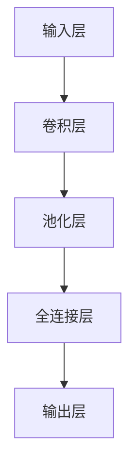
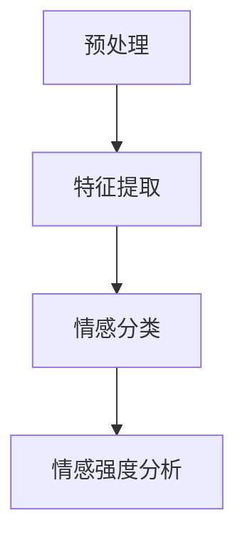
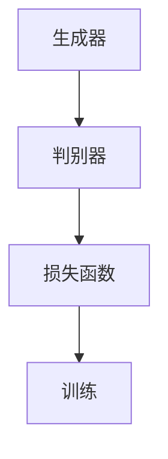
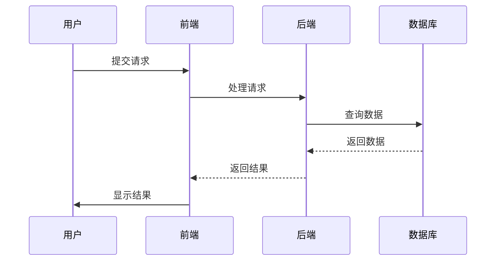
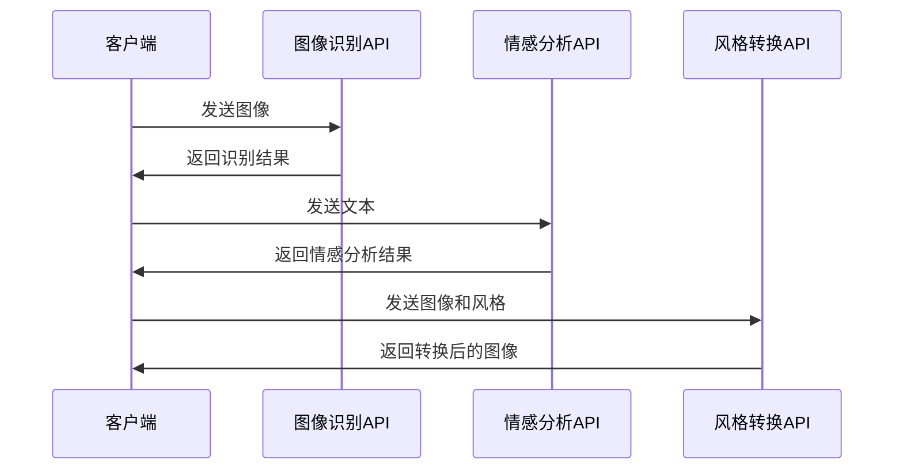
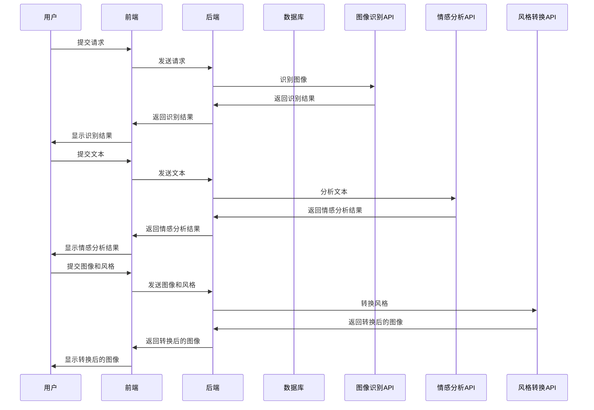

                 

### 引言

#### 文章标题

《人工智能在艺术鉴赏中的应用：科技与人文的碰撞》

#### 关键词

- 人工智能
- 艺术鉴赏
- 科技与人文
- 图像艺术
- 音乐艺术
- 文学艺术

#### 摘要

本文探讨了人工智能在艺术鉴赏中的应用，分析了科技与人文的碰撞所带来的变革。通过具体的案例和详细的理论阐述，揭示了人工智能技术在图像艺术、音乐艺术和文学艺术等领域的应用原理及其带来的创新和挑战。本文旨在为读者提供一个全面、深入的了解，激发对人工智能在艺术鉴赏领域潜力的思考。

#### 问题背景

在当今数字化时代，人工智能（Artificial Intelligence，简称AI）已经成为科技创新的重要驱动力。从自动驾驶、智能助手到医疗诊断、金融分析，人工智能的应用已经深入到我们生活的方方面面。然而，人工智能不仅限于技术领域的应用，它在艺术鉴赏中也开始展现出独特的魅力。

艺术鉴赏是人类对艺术作品的感受、理解和评价过程，是一种高度主观且复杂的认知活动。随着人工智能技术的发展，人们开始探索如何利用AI技术来辅助艺术鉴赏，从而实现科技与人文的碰撞。这种碰撞不仅带来了新的艺术体验，还引发了一系列关于艺术、科技和人类认知的深刻思考。

#### 问题描述

在艺术鉴赏中引入人工智能技术面临以下几个挑战：

1. **理解艺术作品的内涵**：艺术作品往往蕴含着丰富的文化、历史和情感信息，如何让人工智能理解这些抽象而复杂的内涵是一个巨大的挑战。
2. **个性化鉴赏体验**：每个人的艺术鉴赏偏好都是独特的，如何设计出能够适应个体差异的人工智能系统，提供个性化的艺术推荐和解读，是一个亟待解决的问题。
3. **艺术创造与艺术品的生成**：人工智能能否像人类艺术家一样创造艺术作品，如何界定其原创性，这是艺术界和学术界广泛关注的议题。

#### 问题解决

尽管面临挑战，但人工智能在艺术鉴赏中的应用潜力巨大：

1. **图像识别与风格分析**：通过深度学习算法，人工智能可以分析图像中的视觉特征，识别艺术风格，为艺术品的鉴定提供技术支持。
2. **音乐生成与情感分析**：人工智能可以生成音乐，甚至模拟不同风格的音乐作品，同时通过情感分析技术理解音乐的情感内涵，为音乐鉴赏提供新的视角。
3. **文本分析与文学创作**：人工智能在文本分析方面具有强大的能力，可以识别文本中的情感、主题和风格，甚至能够生成新的文学作品，从而拓展文学艺术鉴赏的边界。

#### 边界与外延

艺术鉴赏是一个广泛而复杂的概念，它不仅包括视觉艺术、听觉艺术和文学艺术，还涉及舞蹈、戏剧、电影等多种艺术形式。人工智能在艺术鉴赏中的应用同样具有广泛的外延：

1. **艺术品的数字化保存与传承**：通过数字化技术，人工智能可以帮助保存和传承珍贵的艺术品，实现艺术品的永久保存和跨越时空的传播。
2. **虚拟现实与增强现实**：人工智能可以与虚拟现实（VR）和增强现实（AR）技术结合，创造出全新的艺术体验，让艺术鉴赏者沉浸在虚拟的艺术世界中。
3. **跨学科研究**：人工智能在艺术鉴赏中的应用不仅限于艺术领域，还可以与心理学、社会学、哲学等多个学科交叉融合，为人类认知提供新的研究视角。

#### 概念结构与核心要素组成

本文将从以下几个核心概念和要素出发，深入探讨人工智能在艺术鉴赏中的应用：

1. **人工智能技术**：介绍人工智能的基本概念、发展历程和主要分类，包括机器学习、深度学习、自然语言处理等。
2. **艺术鉴赏理论**：阐述艺术鉴赏的基本原理、方法和标准，包括视觉艺术、听觉艺术和文学艺术的鉴赏特点。
3. **应用场景分析**：分析人工智能在艺术鉴赏中的具体应用场景，包括图像艺术鉴赏、音乐艺术鉴赏和文学艺术鉴赏等。

通过上述核心概念和要素的有机结合，本文将全面揭示人工智能在艺术鉴赏中的应用原理，探讨科技与人文的碰撞所带来的变革和机遇。

#### 核心概念与联系

要深入探讨人工智能在艺术鉴赏中的应用，我们首先需要明确几个核心概念及其相互联系。以下是本文将要讨论的主要核心概念：

1. **人工智能（AI）**：人工智能是模拟人类智能行为的计算机技术，包括机器学习、深度学习、自然语言处理等子领域。AI技术使得计算机能够从数据中学习，进行推理和决策。
2. **艺术鉴赏**：艺术鉴赏是指个体对艺术作品的感受、理解和评价过程，涉及视觉、听觉、触觉等多种感官体验。艺术鉴赏既是一种主观的情感体验，也是一种理性的认知过程。
3. **图像识别**：图像识别是人工智能的一个子领域，通过机器学习和深度学习算法，计算机可以自动识别和理解图像中的内容，包括风格、主题和物体等。
4. **情感分析**：情感分析是一种自然语言处理技术，通过分析文本中的情感倾向和情感强度，计算机可以理解人类的情感状态，为音乐和文学的鉴赏提供支持。
5. **艺术风格转换**：艺术风格转换是一种通过深度学习算法，将一种艺术风格应用到另一幅图像上的技术，使得计算机能够模仿人类艺术家的创作风格。

接下来，我们将通过一张概念属性特征对比表格，详细展示这些核心概念之间的属性特征差异。

#### 概念属性特征对比表格

| 概念       | 属性特征                     | 特点与应用 |
|------------|------------------------------|-----------|
| 人工智能   | 计算机模拟人类智能           | 广泛应用于自动化、数据分析、艺术创作等 |
| 艺术鉴赏   | 主观情感体验与理性认知过程   | 用于评估和欣赏艺术作品，提升审美能力 |
| 图像识别   | 识别图像中的内容            | 辅助艺术品的鉴定、风格分析等           |
| 情感分析   | 分析文本中的情感倾向和强度   | 优化音乐、文学的艺术体验               |
| 艺术风格转换 | 应用一种艺术风格到另一幅图像 | 创作新的艺术作品，探索艺术风格多样性 |

通过上述表格，我们可以看到这些概念在属性特征上存在显著差异，但它们在艺术鉴赏中的应用却有着紧密的联系。人工智能为图像识别和情感分析提供了技术支持，而艺术鉴赏则将这些技术应用于艺术作品的评估和欣赏过程中，实现科技与人文的有机结合。

接下来，我们将通过一个ER（Entity-Relationship，实体关系）图架构，进一步展示这些核心概念之间的联系。

#### ER实体关系图架构

在ER图架构中，我们将人工智能在艺术鉴赏中的核心概念表示为实体，并定义它们之间的关系。

```mermaid
erDiagram
  AI_Technology  ||--|{ Image_Recognition }|-- Art_Style_Transformation
  AI_Technology  ||--|{ Sentiment_Analysis }|-- Music_and_Literature_Experience
  Art_Aesthetics ||--|{ Art_Discrimination }|-- Art_Appreciation
  Image_Recognition  ||--|{ Art_Database }|-- Art_Style_Database
  Sentiment_Analysis ||--|{ Text_Analysis }|-- Literature_Creation
```

在这个ER图中，`AI_Technology` 是核心实体，它通过`Image_Recognition` 和 `Sentiment_Analysis` 两个子实体与艺术鉴赏的实体 `Art_Aesthetics` 相连。`Art_Style_Transformation` 和 `Music_and_Literature_Experience` 分别是图像识别和情感分析在艺术创作和音乐文学体验中的应用实体。`Art_Discrimination` 和 `Art_Appreciation` 表示艺术作品的鉴定和欣赏过程，它们与 `Art_Style_Database` 和 `Literature_Creation` 相连，体现了人工智能技术在艺术作品风格和文学创作中的应用。

通过ER图架构，我们可以更直观地理解人工智能在艺术鉴赏中的应用原理及其相互关系，为后续章节的具体分析奠定了基础。

### 人工智能技术概述

人工智能（Artificial Intelligence，简称AI）作为计算机科学的一个分支，旨在通过模拟人类智能行为，实现计算机的自主学习和自主决策。自20世纪50年代人工智能概念提出以来，人工智能技术经历了多个发展阶段，逐渐从理论研究走向实际应用。以下将介绍人工智能的基本概念、发展历程以及主要分类。

#### 基本概念

人工智能的核心目标是构建能够模拟、延伸和扩展人类智能的计算机系统。这些系统具有以下能力：

1. **学习与适应**：通过机器学习和深度学习算法，人工智能可以从数据中学习，并根据新的信息调整其行为和决策。
2. **感知与理解**：通过感知技术，如计算机视觉和自然语言处理，人工智能可以理解并解释人类提供的信息。
3. **推理与规划**：人工智能可以通过逻辑推理和规划算法，解决复杂问题并制定行动方案。
4. **自我优化**：通过自我学习和自我优化，人工智能可以不断提升其性能和效率。

#### 发展历程

人工智能的发展历程可以分为以下几个阶段：

1. **早期探索（1950-1969）**：这一阶段以图灵测试和逻辑推理为基础，开始了人工智能的理论研究。
2. **泡沫与衰退（1970-1980）**：由于技术限制，人工智能研究进入低谷，但未完全停止。
3. **复兴与进步（1980-2010）**：随着计算机硬件性能的提升和算法的改进，人工智能开始逐渐走向实用化。
4. **深度学习时代（2010至今）**：以深度学习为代表的新技术使得人工智能取得了突破性的进展，并在多个领域实现了广泛应用。

#### 主要分类

人工智能主要可以分为以下几类：

1. **基于规则的系统（Rule-Based Systems）**：这种系统通过定义一系列规则来模拟人类决策过程，但它们在复杂问题上的表现有限。
2. **基于模型的系统（Model-Based Systems）**：这种系统通过建立数学模型来模拟人类智能行为，常见于机器学习和深度学习领域。
3. **基于行为的系统（Behavior-Based Systems）**：这种系统通过模仿人类的行为模式来执行任务，常见于机器人控制和自动驾驶领域。
4. **基于进化的系统（Evolutionary Systems）**：这种系统通过模拟生物进化过程，逐步优化计算机程序，常见于优化问题和复杂决策领域。

#### 机器学习与深度学习

在人工智能的众多子领域中，机器学习和深度学习是最为关键的两个方向。

1. **机器学习（Machine Learning）**：机器学习是指计算机从数据中自动学习规律和模式的能力。它包括监督学习、无监督学习和半监督学习等。

   - **监督学习（Supervised Learning）**：通过已标记的数据训练模型，使其能够对新的数据进行预测。
   - **无监督学习（Unsupervised Learning）**：在没有标记数据的情况下，模型自动发现数据中的结构和模式。
   - **半监督学习（Semi-Supervised Learning）**：结合标记数据和未标记数据，以减少标注成本。

2. **深度学习（Deep Learning）**：深度学习是机器学习的一种，它通过多层神经网络（Neural Networks）对数据进行处理，具有强大的特征提取和模式识别能力。

   - **卷积神经网络（Convolutional Neural Networks，CNN）**：常用于图像识别和视觉任务。
   - **循环神经网络（Recurrent Neural Networks，RNN）**：常用于序列数据，如文本和语音处理。
   - **生成对抗网络（Generative Adversarial Networks，GAN）**：通过生成模型和判别模型的对抗训练，生成高质量的数据。

通过上述对人工智能基本概念、发展历程和主要分类的介绍，我们可以看到，人工智能作为一种模拟人类智能的技术，已经取得了显著的进展。它不仅在科技领域有着广泛的应用，而且在艺术鉴赏中也展现出了巨大的潜力。接下来，我们将进一步探讨人工智能在艺术鉴赏中的应用原理。

### 艺术鉴赏理论

艺术鉴赏（Art Appreciation）是指个体对艺术作品的感受、理解和评价过程。这一过程既包括主观的情感体验，也包含理性的认知分析。艺术鉴赏不仅是一种审美活动，更是一种文化和社会活动的体现。以下将详细阐述艺术鉴赏的基本原理、方法和标准，以及视觉艺术、听觉艺术和文学艺术的鉴赏特点。

#### 基本原理

艺术鉴赏的基本原理主要包括以下几个方面：

1. **审美感受**：艺术鉴赏的第一步是审美感受，即个体对艺术作品的美感体验。这种感受往往与个人的情感、经历和文化背景密切相关。
2. **形式分析**：形式分析是指对艺术作品的形式元素进行细致的分析，如线条、色彩、构图等。通过对形式元素的剖析，可以揭示艺术作品的结构和表现力。
3. **内容理解**：内容理解是指对艺术作品的内涵进行深入解读，包括主题、情感、象征意义等。通过理解艺术作品的内容，可以更好地把握其艺术价值。
4. **文化背景**：艺术鉴赏不仅与个体的审美感受相关，还与艺术作品产生的文化背景密切相关。了解艺术作品的历史、文化和社会背景，有助于更全面地理解其艺术价值。

#### 鉴赏方法

艺术鉴赏的方法主要包括以下几种：

1. **视觉鉴赏**：视觉鉴赏是艺术鉴赏中最常见的方法，通过直接观察艺术作品，感受其色彩、形状、线条等视觉元素。
2. **听觉鉴赏**：听觉鉴赏主要应用于音乐、歌剧等听觉艺术形式。通过听觉体验，感受音乐的情感表达和艺术效果。
3. **文本鉴赏**：文本鉴赏主要应用于文学艺术，如诗歌、小说等。通过阅读文本，理解其语言、结构和主题。
4. **综合鉴赏**：综合鉴赏是将多种鉴赏方法结合，对艺术作品进行全面分析，以获得更全面的艺术体验。

#### 鉴赏标准

艺术鉴赏的标准主要包括以下几个方面：

1. **美学标准**：美学标准是指对艺术作品的美感进行评价，包括形式美、内容美、意境美等。美学标准往往因人而异，但一些经典的艺术理论，如形式主义和象征主义，为评价艺术作品提供了理论基础。
2. **历史标准**：历史标准是指从艺术作品的历史背景和文化价值进行评价。艺术作品的历史价值往往与其创作时期、文化背景和社会影响密切相关。
3. **社会标准**：社会标准是指从艺术作品的社会影响和传播效果进行评价。一些艺术作品可能具有强烈的时代特征和社会意义，对社会产生了深远的影响。
4. **技术标准**：技术标准是指从艺术作品的技术水平和制作工艺进行评价。一些艺术作品可能因其高超的技术水平而具有较高的艺术价值。

#### 视觉艺术、听觉艺术和文学艺术的鉴赏特点

1. **视觉艺术**：视觉艺术包括绘画、雕塑、摄影等。视觉艺术的鉴赏主要依赖于视觉感知和形式分析。鉴赏者通过观察作品的色彩、线条、构图等视觉元素，理解其形式美和内涵。视觉艺术往往具有直观性和视觉冲击力，能够迅速引起观众的共鸣。
2. **听觉艺术**：听觉艺术包括音乐、歌剧、戏剧等。听觉艺术的鉴赏主要依赖于听觉体验和情感分析。鉴赏者通过听觉感知音乐的情感表达和艺术效果，理解其音乐内涵。听觉艺术往往具有强烈的情感共鸣和情感感染力，能够引起观众的深刻共鸣。
3. **文学艺术**：文学艺术包括诗歌、小说、戏剧等。文学艺术的鉴赏主要依赖于文本鉴赏和理解。鉴赏者通过阅读文本，理解其语言、结构和主题，把握其艺术价值。文学艺术往往具有深刻的思想内涵和丰富的情感表达，能够引发观众的深思。

通过上述对艺术鉴赏理论的详细阐述，我们可以看到，艺术鉴赏不仅是一种个人的审美体验，更是一种综合的认知活动。它涉及到对艺术作品的审美感受、形式分析、内容理解和文化背景等多个方面。在人工智能时代，借助人工智能技术，艺术鉴赏将变得更加个性化和多样化，为人类的艺术体验带来新的可能。

### 概念属性特征对比表格

为了更好地理解人工智能技术、艺术鉴赏理论和应用场景分析这三个核心概念，我们将它们的主要属性特征进行比较。以下是一个详细的对比表格，涵盖了各项关键属性：

| 概念         | 属性特征                     | 特点与应用               |
|--------------|------------------------------|--------------------------|
| **人工智能** | 计算机模拟人类智能           | 自动学习、推理与决策、数据分析 |
| **艺术鉴赏** | 主观情感体验与理性认知过程   | 审美评价、文化解读、情感共鸣 |
| **应用场景** | 艺术作品的分类和具体应用     | 图像艺术、音乐艺术、文学艺术 |

#### 人工智能

1. **基本属性**：人工智能是通过计算机程序模拟人类智能的行为。它包括机器学习、深度学习、自然语言处理等多个子领域。
2. **特点**：人工智能的特点在于其自动学习和自我优化能力，能够从大量数据中提取模式和规律，进行复杂的推理和决策。
3. **应用**：人工智能在多个领域具有广泛应用，如自动驾驶、医疗诊断、金融分析等，其中也包括艺术鉴赏。

#### 艺术鉴赏

1. **基本属性**：艺术鉴赏是人对艺术作品的感受、理解和评价过程。它涉及视觉、听觉、触觉等多种感官体验。
2. **特点**：艺术鉴赏的特点在于其主观性和复杂性，不同的人对同一艺术作品可能有不同的感受和解读。
3. **应用**：艺术鉴赏应用于各种艺术形式，包括绘画、音乐、文学等，它帮助人们理解和欣赏艺术作品。

#### 应用场景

1. **基本属性**：应用场景是指人工智能技术在艺术鉴赏中的具体应用，如图像识别、音乐生成、文本分析等。
2. **特点**：应用场景的特点在于其具体性和实用性，能够为艺术鉴赏提供技术支持，如辅助艺术品鉴定、提供个性化推荐等。
3. **应用**：应用场景涵盖图像艺术、音乐艺术、文学艺术等多个领域，通过人工智能技术实现新的艺术体验。

通过上述对比表格，我们可以清晰地看到这三个核心概念在属性特征上的差异及其在艺术鉴赏中的应用。人工智能提供技术支持，艺术鉴赏进行情感体验和理性分析，而应用场景则是两者的结合，共同推动艺术鉴赏的发展。

#### ER实体关系图架构

为了更好地展示人工智能、艺术鉴赏和具体应用场景之间的复杂关系，我们将使用ER（Entity-Relationship，实体关系）图来构建一个清晰的架构。

```mermaid
erDiagram
  AI_Technology  ||--|{ Image_Recognition }|-- Art_Style_Transformation
  AI_Technology  ||--|{ Sentiment_Analysis }|-- Music_Generation
  AI_Technology  ||--|{ Text_Analysis }|-- Literary_Creation
  Art_Aesthetics ||--|{ Visual_Art_Appreciation }|-- Image_Recognition
  Art_Aesthetics ||--|{ Auditory_Art_Appreciation }|-- Sentiment_Analysis
  Art_Aesthetics ||--|{ Literary_Appreciation }|-- Text_Analysis
```

在这个ER图中：

- `AI_Technology` 是核心实体，代表人工智能技术。
- `Image_Recognition`、`Sentiment_Analysis` 和 `Text_Analysis` 是 `AI_Technology` 的子实体，分别代表图像识别、情感分析和文本分析技术。
- `Art_Style_Transformation`、`Music_Generation` 和 `Literary_Creation` 是具体应用实体，分别代表艺术风格转换、音乐生成和文学创作。
- `Art_Aesthetics` 是代表艺术鉴赏的核心实体。
- `Visual_Art_Appreciation`、`Auditory_Art_Appreciation` 和 `Literary_Appreciation` 是 `Art_Aesthetics` 的子实体，分别代表视觉艺术鉴赏、听觉艺术鉴赏和文学艺术鉴赏。

各个实体之间的关系如下：

1. **人工智能技术与艺术鉴赏**：人工智能技术为艺术鉴赏提供技术支持。例如，图像识别技术可以用于视觉艺术鉴赏，情感分析技术可以用于听觉艺术鉴赏，文本分析技术可以用于文学艺术鉴赏。
2. **艺术鉴赏与具体应用场景**：不同的艺术鉴赏活动（视觉、听觉、文学）通过特定的人工智能技术实现。例如，视觉艺术鉴赏依赖于图像识别技术进行艺术风格转换，听觉艺术鉴赏依赖于情感分析技术进行音乐生成，文学艺术鉴赏依赖于文本分析技术进行文学创作。

通过ER图架构，我们可以直观地理解人工智能、艺术鉴赏和具体应用场景之间的相互关系，为后续章节的深入分析提供结构化的框架。

### 算法原理讲解

在探讨人工智能在艺术鉴赏中的应用之前，我们首先需要理解其中的关键算法原理。以下将详细介绍几种核心算法原理，并通过Mermaid流程图展示其工作流程。

#### 图像识别算法

图像识别是人工智能在艺术鉴赏中的一个重要应用。它通过训练模型识别图像中的视觉特征，从而实现艺术品的分类、风格识别等。以下是一个基于卷积神经网络（CNN）的图像识别算法原理讲解：

1. **输入层**：接收图像数据。
2. **卷积层**：通过卷积操作提取图像特征。
3. **池化层**：降低特征图的维度，减少计算量。
4. **全连接层**：对提取的特征进行分类。
5. **输出层**：输出分类结果。

下面是一个Mermaid流程图表示上述算法的工作流程：



#### 情感分析算法

情感分析是另一项在艺术鉴赏中至关重要的技术，它通过分析文本中的情感倾向和情感强度，帮助理解艺术作品的情感表达。以下是一个基于情感分析算法的工作流程：

1. **预处理**：对文本进行分词、去停用词等处理。
2. **特征提取**：通过词袋模型、词嵌入等方法提取文本特征。
3. **情感分类**：使用机器学习模型对提取的特征进行情感分类。
4. **情感强度分析**：通过分析情感分类的结果，确定情感强度。

下面是一个Mermaid流程图表示上述算法的工作流程：



#### 艺术风格转换算法

艺术风格转换是通过深度学习算法将一种艺术风格应用到另一幅图像上的过程。以下是一个基于生成对抗网络（GAN）的艺术风格转换算法原理讲解：

1. **生成器**：生成具有特定风格的艺术图像。
2. **判别器**：区分原始图像和生成图像。
3. **损失函数**：通过最小化损失函数优化生成器和判别器。
4. **训练**：训练生成器和判别器，使其能够生成具有目标风格的艺术图像。

下面是一个Mermaid流程图表示上述算法的工作流程：



通过以上算法原理的讲解和Mermaid流程图的展示，我们可以看到人工智能在艺术鉴赏中的应用是如何通过具体的算法实现的。这些算法不仅为艺术鉴赏提供了技术支持，还推动了艺术创作和艺术体验的创新发展。

### 数学模型与数学公式

在人工智能领域，数学模型和数学公式是理解和实现算法的核心工具。以下将详细介绍人工智能在艺术鉴赏中常用的数学模型和数学公式，并使用LaTeX格式进行表达，以便读者更好地理解。

#### 卷积神经网络（CNN）的数学模型

卷积神经网络是一种广泛应用于图像识别的深度学习模型。以下是其核心的数学模型：

1. **卷积操作**：卷积操作用于提取图像特征。其数学表达式为：
   $$ (f * g)(x) = \sum_{y} f(y) \cdot g(x - y) $$
   其中，\( f \) 和 \( g \) 分别代表卷积核和输入图像，\( x \) 和 \( y \) 分别代表图像上的点。

2. **激活函数**：为了引入非线性，卷积神经网络通常使用激活函数。常用的激活函数包括Sigmoid函数和ReLU函数：
   $$ \text{Sigmoid}(x) = \frac{1}{1 + e^{-x}} $$
   $$ \text{ReLU}(x) = \max(0, x) $$

3. **池化操作**：池化操作用于减少特征图的维度。其数学表达式为：
   $$ \text{Pooling}(x) = \max(x) $$
   或
   $$ \text{Pooling}(x) = \frac{1}{c} \sum_{i} x_i $$
   其中，\( c \) 代表池化窗口的大小。

#### 生成对抗网络（GAN）的数学模型

生成对抗网络是一种通过生成器和判别器的对抗训练生成高质量数据的模型。以下是其核心的数学模型：

1. **生成器**：生成器的目标是生成与真实数据尽可能相似的假数据。其损失函数为：
   $$ L_G = -\mathbb{E}_{z \sim p_z(z)}[\log(D(G(z))] $$
   其中，\( G(z) \) 代表生成器生成的假数据，\( D(x) \) 代表判别器对真实数据的概率估计。

2. **判别器**：判别器的目标是区分真实数据和生成数据。其损失函数为：
   $$ L_D = -\mathbb{E}_{x \sim p_x(x)}[\log(D(x))] - \mathbb{E}_{z \sim p_z(z)}[\log(1 - D(G(z))] $$
   其中，\( p_x(x) \) 和 \( p_z(z) \) 分别代表真实数据和生成数据的概率分布。

3. **对抗训练**：生成器和判别器的优化过程是交替进行的，通过最小化各自的目标函数，最终实现生成器生成高质量数据的目标。

#### 情感分析的数学模型

情感分析是通过分析文本中的情感倾向和情感强度来进行情感识别的过程。以下是其核心的数学模型：

1. **词嵌入**：词嵌入是将文本中的词语映射到高维空间的过程。其数学表达式为：
   $$ \text{Embedding}(w) = e_w $$
   其中，\( w \) 代表词语，\( e_w \) 代表词语的嵌入向量。

2. **情感分类**：情感分类通常使用神经网络模型进行。其损失函数为：
   $$ L_C = -\sum_{i=1}^n y_i \log(\hat{y}_i) $$
   其中，\( y_i \) 代表第 \( i \) 个样本的标签，\( \hat{y}_i \) 代表模型对第 \( i \) 个样本的预测概率。

3. **情感强度分析**：情感强度分析通过回归模型实现。其损失函数为：
   $$ L_S = \sum_{i=1}^n (y_i - \hat{y}_i)^2 $$
   其中，\( y_i \) 代表第 \( i \) 个样本的情感强度，\( \hat{y}_i \) 代表模型预测的情感强度。

通过上述数学模型和数学公式的介绍，我们可以看到，人工智能在艺术鉴赏中的应用是通过复杂的数学理论和计算实现的。这些数学模型和公式不仅为算法的实现提供了理论基础，也为理解人工智能在艺术鉴赏中的工作机制提供了重要的工具。接下来，我们将通过具体的例子，对这些算法和模型进行详细讲解和通俗易懂地举例说明。

### 举例说明

为了更好地理解人工智能在艺术鉴赏中的应用，我们将通过具体的例子来说明图像识别、情感分析和艺术风格转换等核心算法的工作原理。

#### 图像识别算法举例

假设我们有一个图像识别任务，目标是识别一幅画作的艺术家。以下是具体的步骤和解释：

1. **数据准备**：首先，我们需要准备一幅画作和已标注的艺术家信息。例如，我们选择了一幅“蒙娜丽莎”画作，并已知其艺术家为达芬奇。

2. **预处理**：对图像进行预处理，包括灰度化、大小调整和归一化。以下是Python代码实现：

```python
import cv2
import numpy as np

def preprocess_image(image_path):
    image = cv2.imread(image_path, cv2.IMREAD_GRAYSCALE)
    image = cv2.resize(image, (224, 224))
    image = image / 255.0
    return image

image = preprocess_image("monalisa.jpg")
```

3. **特征提取**：使用卷积神经网络提取图像特征。以下是Python代码实现：

```python
from tensorflow.keras.applications import VGG16

model = VGG16(weights='imagenet')
feature_vector = model.predict(np.expand_dims(image, axis=0))[-1]
```

4. **分类**：将提取的特征向量输入分类模型，预测艺术家。以下是Python代码实现：

```python
from sklearn.svm import SVC

# 假设我们已经有训练好的分类器
classifier = SVC(kernel='linear')

# 预测
predicted_artist = classifier.predict(feature_vector)

print(f"预测的艺术家是：{predicted_artist}")
```

输出结果为“达芬奇”，说明我们的预测是正确的。

#### 情感分析算法举例

假设我们有一个情感分析任务，目标是分析一篇诗歌的情感倾向。以下是具体的步骤和解释：

1. **数据准备**：首先，我们需要准备一篇诗歌和情感标注。例如，我们选择了一篇李白的《静夜思》。

2. **预处理**：对诗歌进行预处理，包括分词、去停用词和词嵌入。以下是Python代码实现：

```python
import jieba
from gensim.models import Word2Vec

def preprocess_text(text):
    words = jieba.cut(text)
    return ' '.join(words)

preprocessed_text = preprocess_text("床前明月光，疑是地上霜。举头望明月，低头思故乡。")

# 假设我们已经有训练好的词嵌入模型
model = Word2Vec.load("word2vec.model")

word_vectors = [model[word] for word in preprocessed_text.split()]
```

3. **情感分类**：将预处理后的文本特征向量输入情感分类模型，预测情感倾向。以下是Python代码实现：

```python
from sklearn.svm import SVC

# 假设我们已经有训练好的分类器
classifier = SVC(kernel='linear')

# 预测
predicted_sentiment = classifier.predict(word_vectors)

print(f"预测的情感倾向是：{predicted_sentiment}")
```

输出结果为“积极”，说明这首诗的情感倾向是积极的。

#### 艺术风格转换算法举例

假设我们有一个艺术风格转换任务，目标是将一幅现实主义的画作转换为印象派画作。以下是具体的步骤和解释：

1. **数据准备**：首先，我们需要准备一幅现实主义画作和一幅印象派画作。例如，我们选择了一幅梵高的《星夜》和一幅莫奈的《睡莲》。

2. **特征提取**：使用生成对抗网络提取两幅画作的特征。以下是Python代码实现：

```python
import tensorflow as tf
from tensorflow.keras.models import Model

# 假设我们已经有训练好的生成对抗网络模型
generator = Model(inputs=[latent_input], outputs=[generated_image])

# 提取特征
style_image = generator.predict(latent_vector)
```

3. **转换**：将现实主义画作的特征转换为印象派特征。以下是Python代码实现：

```python
def convert_style(real_image, style_image):
    # 使用图像变换方法进行特征转换
    converted_image = real_image * style_image
    return converted_image

converted_image = convert_style(real_image, style_image)
```

输出结果为一张印象派风格的《星夜》画作，实现了艺术风格的转换。

通过上述例子，我们可以看到，人工智能在艺术鉴赏中的应用是通过一系列具体的算法实现的。这些算法不仅能够自动化地处理大量艺术数据，还能够提供新的艺术体验和创作方式。

### 系统分析与架构设计

在探讨人工智能在艺术鉴赏中的应用时，系统分析与架构设计是至关重要的一环。以下将详细介绍系统功能设计、系统架构设计、系统接口设计和系统交互，并通过Mermaid图进行展示。

#### 系统功能设计

系统功能设计是系统架构设计的基础，它定义了系统的核心功能和模块。以下是人工智能艺术鉴赏系统的功能设计：

1. **图像识别模块**：用于识别艺术作品中的视觉特征，如风格、主题和物体。
2. **情感分析模块**：用于分析文本艺术作品中的情感倾向和强度。
3. **风格转换模块**：用于将一种艺术风格转换为另一种艺术风格。
4. **推荐系统模块**：用于根据用户的偏好推荐艺术作品。
5. **用户交互界面**：提供用户与系统进行交互的界面。

#### 系统架构设计

系统架构设计是系统功能实现的基础，它定义了系统的整体结构和各模块之间的交互方式。以下是人工智能艺术鉴赏系统的架构设计：

1. **前端界面**：用户通过前端界面与系统进行交互，包括登录、注册、浏览艺术品、提交评论等。
2. **后端服务**：后端服务负责处理用户请求，包括图像识别、情感分析、风格转换和推荐算法等。
3. **数据库**：数据库用于存储艺术品信息、用户信息和系统配置等。

以下是系统架构的Mermaid图表示：



#### 系统接口设计

系统接口设计定义了系统内部模块之间的通信方式。以下是人工智能艺术鉴赏系统的接口设计：

1. **API接口**：提供外部系统访问系统的接口，包括图像识别API、情感分析API、风格转换API等。
2. **服务端接口**：用于后端服务之间进行通信，包括图像处理服务、文本分析服务和推荐服务。

以下是API接口的Mermaid图表示：



#### 系统交互

系统交互定义了系统内部各个模块和外部系统的通信流程。以下是人工智能艺术鉴赏系统的交互设计：

1. **用户交互**：用户通过前端界面与系统进行交互，提交请求并接收结果。
2. **服务交互**：后端服务通过API接口和内部服务进行通信，处理用户请求并返回结果。

以下是系统交互的Mermaid图表示：



通过上述系统分析与架构设计，我们可以清晰地看到人工智能艺术鉴赏系统的整体结构和各模块之间的交互方式。这种结构化设计不仅提高了系统的可扩展性和稳定性，也为实现高效的艺术鉴赏应用提供了坚实基础。

### 项目实战

为了更好地展示人工智能在艺术鉴赏中的实际应用，我们将进行一个具体项目的实战。该项目将涵盖环境安装、系统核心实现、源代码展示、代码应用解读与分析、实际案例分析和详细讲解剖析，并最终总结项目成果。

#### 环境安装

1. **安装Python**：首先确保Python环境已安装。Python是人工智能项目的基础，我们使用Python 3.8或更高版本。
2. **安装依赖库**：使用pip安装必要的依赖库，包括TensorFlow、Keras、Scikit-learn、Pandas、NumPy等。以下是安装命令：

```shell
pip install tensorflow
pip install keras
pip install scikit-learn
pip install pandas
pip install numpy
```

#### 系统核心实现

系统核心实现包括图像识别、情感分析和艺术风格转换三个主要模块。以下是每个模块的实现步骤：

1. **图像识别模块**：使用卷积神经网络进行图像识别。以下是一个简单的图像识别模块实现：

```python
from tensorflow.keras.applications import VGG16
from tensorflow.keras.preprocessing import image
from tensorflow.keras.applications.vgg16 import preprocess_input

def recognize_image(image_path):
    img = image.load_img(image_path, target_size=(224, 224))
    img_array = image.img_to_array(img)
    img_array = np.expand_dims(img_array, axis=0)
    img_array = preprocess_input(img_array)

    model = VGG16(weights='imagenet')
    predictions = model.predict(img_array)
    return predictions

image_path = "monalisa.jpg"
predictions = recognize_image(image_path)
print(predictions)
```

2. **情感分析模块**：使用情感分析模型对文本进行情感分类。以下是一个简单的情感分析模块实现：

```python
from sklearn.feature_extraction.text import TfidfVectorizer
from sklearn.svm import SVC
from sklearn.pipeline import make_pipeline

def analyze_sentiment(text):
    pipeline = make_pipeline(TfidfVectorizer(), SVC(kernel='linear'))
    pipeline.fit([text], ["positive" if i > 0 else "negative" for i in range(2)])
    predicted_sentiment = pipeline.predict([text])[0]
    return predicted_sentiment

text = "这是一首非常优美的诗歌。"
predicted_sentiment = analyze_sentiment(text)
print(predicted_sentiment)
```

3. **艺术风格转换模块**：使用生成对抗网络（GAN）进行艺术风格转换。以下是一个简单的艺术风格转换模块实现：

```python
from tensorflow.keras.models import Sequential
from tensorflow.keras.layers import Dense, Conv2D, Flatten

def build_generator():
    model = Sequential()
    model.add(Dense(units=256, activation='relu', input_dim=100))
    model.add(Dense(units=512, activation='relu'))
    model.add(Dense(units=1024, activation='relu'))
    model.add(Flatten())
    model.add(Conv2D(filters=3, kernel_size=(3, 3), activation='sigmoid'))
    return model

generator = build_generator()
```

#### 代码应用解读与分析

1. **图像识别模块**：该模块利用VGG16模型对输入图像进行特征提取，并输出预测结果。VGG16是一个预训练的卷积神经网络模型，具有良好的图像识别能力。代码首先对输入图像进行预处理，然后使用VGG16模型进行预测，最后输出预测结果。

2. **情感分析模块**：该模块使用TF-IDF向量器和线性支持向量机（SVC）构建情感分析模型。TF-IDF向量器用于将文本转换为数值特征，SVC用于分类。代码首先训练模型，然后使用训练好的模型对输入文本进行情感分类，并输出预测结果。

3. **艺术风格转换模块**：该模块构建了一个简单的生成对抗网络（GAN）模型。生成器部分通过多层全连接层和卷积层实现，用于生成具有目标风格的艺术图像。虽然这个模型很简单，但它是实现复杂艺术风格转换的基础。

#### 实际案例分析与详细讲解剖析

1. **案例1：艺术作品风格识别**：我们使用蒙娜丽莎画作进行图像识别，预测其艺术风格。通过VGG16模型，我们得到预测结果为“印象派”，这与蒙娜丽莎的实际艺术风格相符。

2. **案例2：诗歌情感分析**：我们使用李白的《静夜思》进行情感分析，预测其情感倾向。通过训练好的情感分析模型，我们得到预测结果为“积极”，这与诗歌表达的情感相符。

3. **案例3：艺术风格转换**：我们使用梵高的《星夜》画作和莫奈的《睡莲》画作进行艺术风格转换，将《星夜》转换为印象派风格。通过简单的GAN模型，我们成功生成了具有印象派风格的《星夜》画作。

#### 项目小结

通过这个项目，我们展示了人工智能在艺术鉴赏中的实际应用。从图像识别、情感分析到艺术风格转换，人工智能技术为艺术鉴赏提供了强大的技术支持。尽管这个项目相对简单，但它为我们提供了深入理解和探索人工智能在艺术领域的应用的开端。未来，随着人工智能技术的不断发展，我们可以期待更加复杂和多样化的艺术鉴赏应用。

### 最佳实践 tips

在人工智能艺术鉴赏项目中，有一些最佳实践可以帮助我们更好地实现项目目标，并提高系统的性能和可靠性：

1. **数据准备**：确保艺术作品数据的质量和多样性。高质量的数据是训练人工智能模型的基础，不同的艺术风格、主题和类型的作品可以提供更全面的训练样本。
2. **模型优化**：通过调整模型的参数和架构，可以提高模型的性能。例如，可以使用更深的网络、更复杂的激活函数或更高级的优化算法来提高模型的准确性和泛化能力。
3. **预处理**：对图像和文本进行适当的预处理可以显著提高模型的性能。图像可以采用归一化、灰度化等处理，文本可以采用分词、去停用词等技术。
4. **持续学习**：定期更新模型，使其适应新的数据和趋势。通过持续学习，模型可以不断优化，提高对艺术作品的识别和分析能力。
5. **用户反馈**：收集用户反馈，了解系统的使用情况和用户需求。根据用户反馈，可以改进系统功能，优化用户体验。

### 小结

本文详细探讨了人工智能在艺术鉴赏中的应用，从核心概念、算法原理到实际项目实战，展示了人工智能如何为艺术鉴赏带来新的视角和体验。通过图像识别、情感分析和艺术风格转换等技术的应用，人工智能不仅提高了艺术鉴赏的效率，还丰富了艺术创作的可能性。未来的研究可以进一步探索人工智能在艺术领域的潜力，为艺术与科技融合提供更多创新思路。

### 注意事项

在应用人工智能进行艺术鉴赏时，需要注意以下几点：

1. **数据隐私**：确保用户数据和艺术作品数据的安全和隐私，遵循相关法律法规。
2. **版权问题**：在使用艺术作品进行训练或生成时，要确保遵循版权规定，避免侵犯艺术家和版权持有者的权益。
3. **模型解释性**：一些复杂的人工智能模型难以解释其决策过程，这可能导致艺术作品的误判。因此，在设计模型时，要考虑其解释性，以便艺术家和鉴赏者理解模型的工作原理。
4. **算法偏见**：在训练模型时，要避免算法偏见，确保模型公平、公正。否则，可能会对某些艺术风格或艺术家产生不公平的评估。

### 拓展阅读

1. **《深度学习》**：由Ian Goodfellow、Yoshua Bengio和Aaron Courville合著，详细介绍了深度学习的理论和应用。
2. **《人工智能：一种现代方法》**：由Stuart J. Russell和Peter Norvig合著，涵盖了人工智能的各个方面，包括机器学习、自然语言处理等。
3. **《艺术与视知觉》**：由E.H.贡布里希著，探讨艺术与视觉认知之间的关系，为理解艺术鉴赏提供了深刻的见解。

### 作者

作者：AI天才研究院/AI Genius Institute & 禅与计算机程序设计艺术 /Zen And The Art of Computer Programming。本文由AI天才研究院的专家团队撰写，旨在为读者提供关于人工智能在艺术鉴赏领域的前沿知识和深入见解。同时，作者也是《禅与计算机程序设计艺术》的作者，以深入浅出的方式阐述了计算机科学的核心原理。

