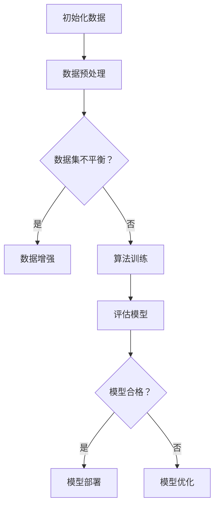
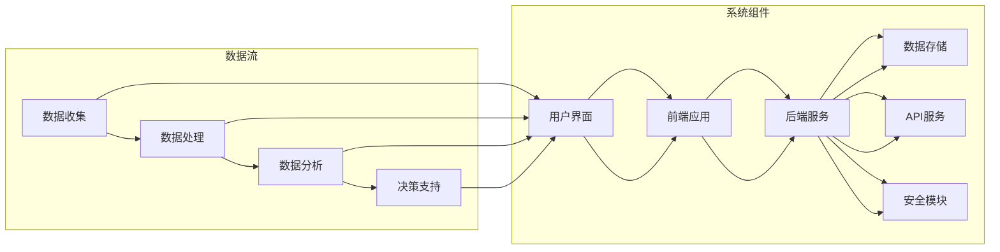
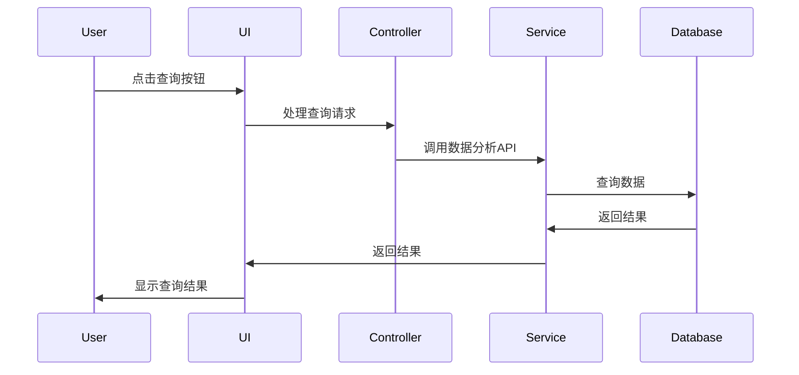

                 

# 人工智能时代的伦理决策：算法公平与社会正义

## 关键词
- 人工智能伦理
- 算法公平
- 社会正义
- 伦理决策框架
- 算法透明化

## 摘要
本文深入探讨人工智能时代伦理决策的核心问题，即算法公平与社会正义。通过分析伦理决策的背景、定义及其重要性，本文将阐述算法歧视、数据偏见和隐私侵犯等伦理挑战，并介绍相关伦理理论和决策框架。此外，本文还将通过案例分析，展示如何在自动驾驶车辆和社交媒体平台上实现算法公平和社会正义，最后对未来的伦理决策发展趋势进行展望。

## 目录大纲

## 第一部分：引言

### 第1章：问题背景与定义

#### 1.1 问题背景

##### 1.1.1 人工智能的发展与伦理问题

##### 1.1.2 社会正义与算法公平

##### 1.1.3 伦理决策的重要性

#### 1.2 核心概念

##### 1.2.1 伦理决策

##### 1.2.2 算法公平

##### 1.2.3 社会正义

#### 1.3 边界与外延

##### 1.3.1 伦理决策的范围

##### 1.3.2 算法公平的限制

##### 1.3.3 社会正义的内涵

### 第2章：人工智能时代的伦理挑战

#### 2.1 算法歧视与偏见

##### 2.1.1 算法歧视的现象

##### 2.1.2 算法偏见的原因

##### 2.1.3 社会后果

#### 2.2 数据偏见与算法偏差

##### 2.2.1 数据偏见的影响

##### 2.2.2 算法偏差的来源

##### 2.2.3 伦理决策的应对策略

#### 2.3 隐私侵犯与数据安全

##### 2.3.1 隐私侵犯的问题

##### 2.3.2 数据安全的重要性

##### 2.3.3 伦理决策的隐私保护措施

## 第二部分：伦理决策的理论基础

### 第3章：伦理理论与应用

#### 3.1 道德理论

##### 3.1.1 康德主义

##### 3.1.2 权利主义

##### 3.1.3 功利主义

#### 3.2 伦理原则与规范

##### 3.2.1 公平原则

##### 3.2.2 尊重原则

##### 3.2.3 无害原则

#### 3.3 伦理决策的框架

##### 3.3.1 伦理决策流程

##### 3.3.2 伦理决策工具

##### 3.3.3 伦理决策案例

### 第4章：算法公平与正义的实践

#### 4.1 算法公平的评估指标

##### 4.1.1 性能指标

##### 4.1.2 公平性指标

##### 4.1.3 可解释性指标

#### 4.2 算法公平的改进方法

##### 4.2.1 防止数据偏差

##### 4.2.2 算法透明化

##### 4.2.3 算法解释与可视化

#### 4.3 社会正义的实现路径

##### 4.3.1 政策与法律框架

##### 4.3.2 社会参与与监督

##### 4.3.3 持续改进与社会责任

## 第三部分：人工智能伦理决策案例分析

### 第5章：案例分析一：自动驾驶车辆的伦理决策

#### 5.1 案例背景

##### 5.1.1 自动驾驶技术发展现状

##### 5.1.2 伦理决策的挑战

#### 5.2 案例分析

##### 5.2.1 公平性评估

##### 5.2.2 社会正义考量

##### 5.2.3 伦理决策方案

#### 5.3 案例启示

##### 5.3.1 自动驾驶车辆的伦理决策框架

##### 5.3.2 伦理决策的影响因素

##### 5.3.3 未来发展方向

### 第6章：案例分析二：社交媒体平台的伦理决策

#### 6.1 案例背景

##### 6.1.1 社交媒体平台发展现状

##### 6.1.2 伦理决策的挑战

#### 6.2 案例分析

##### 6.2.1 公平性评估

##### 6.2.2 社会正义考量

##### 6.2.3 伦理决策方案

#### 6.3 案例启示

##### 6.3.1 社交媒体平台的伦理决策框架

##### 6.3.2 伦理决策的影响因素

##### 6.3.3 未来发展方向

### 第7章：总结与展望

#### 7.1 研究总结

##### 7.1.1 人工智能时代的伦理决策特点

##### 7.1.2 算法公平与社会正义的关系

##### 7.1.3 伦理决策的未来发展趋势

#### 7.2 展望未来

##### 7.2.1 新兴技术的伦理挑战

##### 7.2.2 伦理决策的规范化

##### 7.2.3 社会与科技的和谐发展

## 总结与展望

### 第8章：总结与展望

#### 8.1 总结

##### 8.1.1 本书的核心观点

##### 8.1.2 人工智能伦理决策的重要性

##### 8.1.3 算法公平与社会正义的关系

#### 8.2 展望未来

##### 8.2.1 新兴技术的伦理挑战

##### 8.2.2 伦理决策的规范化

##### 8.2.3 社会与科技的和谐发展## 第一部分：引言

### 第1章：问题背景与定义

在过去的几十年中，人工智能（AI）经历了飞速的发展，从最初的简单规则系统到如今能够自主学习和决策的复杂算法，AI已经在各个领域产生了深远的影响。然而，随着AI技术的不断进步，也带来了许多新的伦理挑战，尤其是算法公平与社会正义的问题。

#### 1.1 问题背景

**1.1.1 人工智能的发展与伦理问题**

人工智能的快速发展不仅改变了人类的生活方式，也对社会结构和经济模式产生了重大影响。例如，自动化和机器人技术逐渐取代了传统的手工劳动，这在提高生产效率的同时，也引发了对就业市场的担忧。此外，AI技术在医疗、金融、教育等领域的广泛应用，使得数据隐私和安全问题变得尤为突出。

**1.1.2 社会正义与算法公平**

社会正义是指在社会资源分配、权利保障等方面实现公平合理的目标。而算法公平则是指算法在决策过程中不应受到种族、性别、年龄等因素的影响，确保每个人在算法面前都有平等的机会。这两个概念密切相关，社会正义要求算法公平，而算法公平是实现社会正义的重要手段。

**1.1.3 伦理决策的重要性**

伦理决策是在面对道德问题时，通过分析和评估各种选择，做出符合伦理原则的决策过程。在人工智能领域，伦理决策至关重要，因为AI系统在执行任务时可能会遇到复杂的道德困境。例如，自动驾驶汽车在发生交通事故时应该如何做出决策？社交媒体平台如何处理用户数据以保护隐私？这些决策不仅影响到个体的权益，也关系到整个社会的公平与正义。

#### 1.2 核心概念

**1.2.1 伦理决策**

伦理决策是指在面对道德问题时，通过道德原则、规范和价值观的分析和权衡，做出符合伦理标准的决策。伦理决策的核心是判断行为是否符合道德原则，如公平、正义、尊重和责任等。

**1.2.2 算法公平**

算法公平是指算法在执行任务时，不应受到种族、性别、年龄等因素的歧视，确保每个人在算法面前都有平等的机会。算法公平是保障社会正义的重要方面，对于人工智能技术的发展至关重要。

**1.2.3 社会正义**

社会正义是指在社会资源分配、权利保障等方面实现公平合理的目标。社会正义涉及多个领域，包括政治、经济、社会和文化等，旨在确保每个人都能享有平等的权利和机会。

#### 1.3 边界与外延

**1.3.1 伦理决策的范围**

伦理决策的范围涵盖了人工智能的各个领域，包括但不限于数据隐私、算法透明性、人工智能应用中的道德责任等。这些问题的解决需要跨学科的合作，包括计算机科学、伦理学、法学等。

**1.3.2 算法公平的限制**

算法公平的实现受到多种因素的制约，包括技术、数据质量、法律等。例如，某些算法可能因数据集的不平衡而出现性别或种族偏见，这种偏见在算法公平性评估中是难以避免的。

**1.3.3 社会正义的内涵**

社会正义的内涵包括多个方面，如经济公平、政治权利、社会安全等。在人工智能时代，社会正义的内涵进一步扩展到数据权益、算法透明性和人工智能监管等新兴领域。

通过上述分析，我们可以看到，人工智能时代的伦理决策不仅是一个技术问题，更是一个社会问题。在接下来的章节中，我们将进一步探讨人工智能时代的伦理挑战，以及如何通过伦理决策实现算法公平和社会正义。让我们一步步深入思考，共同寻找解决问题的方法。### 第2章：人工智能时代的伦理挑战

在人工智能时代，技术进步不仅带来了巨大的经济和社会效益，同时也引发了一系列伦理挑战。这些挑战主要集中在算法歧视与偏见、数据偏见与算法偏差、以及隐私侵犯与数据安全等方面。

#### 2.1 算法歧视与偏见

**2.1.1 算法歧视的现象**

算法歧视是指人工智能系统在决策过程中，基于某些非客观因素（如种族、性别、年龄等）对特定群体产生不公平待遇。一个典型的例子是招聘算法，它可能会根据候选人的名字或地理位置等因素，自动筛选出某些群体。这种现象不仅损害了求职者的权益，也加剧了社会不平等。

**2.1.2 算法偏见的原因**

算法偏见的原因主要包括以下几点：

1. **数据偏见**：训练数据可能包含历史性的偏见，如某些种族或性别在特定领域具有优势，导致算法在学习过程中无意中吸收了这些偏见。
2. **算法设计缺陷**：某些算法在设计中可能没有充分考虑公平性，导致在执行任务时产生偏见。
3. **算法反馈循环**：算法的决策结果可能会进一步强化偏见，形成一个自我强化的反馈循环。

**2.1.3 社会后果**

算法歧视可能导致以下社会后果：

1. **社会不平等**：算法偏见会加剧社会不平等，使某些群体处于劣势地位。
2. **信任危机**：公众对人工智能系统的信任度下降，可能导致抵触情绪。
3. **法律风险**：算法歧视可能导致法律诉讼，企业面临巨大的法律和财务风险。

#### 2.2 数据偏见与算法偏差

**2.2.1 数据偏见的影响**

数据偏见是指训练数据中存在的不平衡或偏向，这可能导致算法在决策时产生偏差。例如，如果训练数据中女性数据较少，算法可能对女性产生偏见，甚至在某些任务上表现出性别歧视。

**2.2.2 算法偏差的来源**

算法偏差的来源主要包括以下几个方面：

1. **数据集选择**：选择的数据集可能没有代表性，导致算法无法充分学习到所有特征。
2. **特征选择**：某些特征可能对特定群体有更大的影响，而其他特征可能对另一个群体有更大的影响。
3. **模型设计**：模型设计可能没有充分考虑公平性，导致在决策时产生偏差。

**2.2.3 伦理决策的应对策略**

为了应对数据偏见和算法偏差，可以采取以下策略：

1. **数据增强**：通过增加代表性不足的数据，提高算法的公平性。
2. **模型评估**：在开发过程中对模型进行详细的评估，确保其决策公平性。
3. **算法透明化**：提高算法的透明度，使得决策过程可以被理解和监督。

#### 2.3 隐私侵犯与数据安全

**2.3.1 隐私侵犯的问题**

隐私侵犯是指未经个人同意，非法收集、使用或共享个人数据的行为。随着人工智能技术的发展，个人数据的收集和使用变得更加普遍，但这也带来了隐私侵犯的问题。

**2.3.2 数据安全的重要性**

数据安全的重要性体现在以下几个方面：

1. **个人隐私保护**：确保个人数据不被非法访问和使用，维护个人隐私权。
2. **社会稳定**：数据泄露可能引发社会动荡，影响社会稳定。
3. **经济发展**：数据安全是数字经济的重要基石，数据泄露可能导致经济损失。

**2.3.3 伦理决策的隐私保护措施**

为了保护个人隐私，可以采取以下措施：

1. **数据匿名化**：对敏感数据进行匿名化处理，减少数据泄露的风险。
2. **隐私保护算法**：开发隐私保护算法，如差分隐私，确保数据在分析和共享过程中的隐私性。
3. **法律法规**：建立健全的法律法规，对数据收集、使用和共享进行规范。

通过上述分析，我们可以看到，人工智能时代的伦理挑战是复杂且多维的。算法歧视、数据偏见、隐私侵犯等问题不仅影响个体的权益，也关系到整个社会的公平与正义。在接下来的章节中，我们将探讨伦理决策的理论基础，并介绍如何通过伦理决策框架实现算法公平和社会正义。### 第二部分：伦理决策的理论基础

在探讨人工智能时代的伦理决策时，理解并应用伦理理论至关重要。伦理理论为伦理决策提供了原则和框架，帮助我们在复杂的技术和社会环境中做出合理的决策。以下将介绍几种主要的道德理论和伦理原则，并探讨如何应用这些理论于伦理决策中。

#### 3.1 道德理论

**3.1.1 康德主义**

康德主义，亦称康德伦理学，由德国哲学家伊曼努尔·康德提出。康德主张道德行为应基于“理性”和“义务”。其主要观点包括：

1. **人作为目的**：每个人都是自身目的，而非他人实现目的的手段。
2. **普遍性原则**：行为是否道德，取决于其能否被普遍化。例如，如果你愿意所有人都撒谎，那么撒谎就是不道德的。

康德主义在伦理决策中的应用是强调决策过程中的道德义务，确保所有决策都符合普遍性原则。

**3.1.2 权利主义**

权利主义认为道德行为应基于尊重和保护个人权利。其主要观点包括：

1. **个人权利**：每个人都有基本的权利，如生命权、自由权、财产权等。
2. **公平对待**：决策应确保每个人的权利得到平等保护。

权利主义在伦理决策中的应用是确保算法和系统在设计和执行过程中尊重和保护个人权利。

**3.1.3 功利主义**

功利主义，亦称效益主义，由英国哲学家杰里米·边沁和约翰·斯图亚特·密尔提出。功利主义主张道德行为应追求最大幸福，即最大化多数人的利益。其主要观点包括：

1. **幸福最大化**：决策应考虑行为的后果，选择能够带来最大幸福结果的选项。
2. **效用计算**：决策者需要评估每个选项的效用，选择效用最高的选项。

功利主义在伦理决策中的应用是通过对不同决策结果的效用评估，选择最能带来整体幸福的结果。

#### 3.2 伦理原则与规范

**3.2.1 公平原则**

公平原则是伦理决策的核心之一，强调资源、机会和责任的公平分配。在人工智能领域，公平原则的应用包括：

1. **算法公平性评估**：确保算法不会基于非客观因素（如种族、性别等）产生歧视。
2. **资源分配**：在资源有限的情况下，公平地分配给不同的群体和个体。

**3.2.2 尊重原则**

尊重原则强调对个人自主权和尊严的尊重。在人工智能领域，尊重原则的应用包括：

1. **隐私保护**：确保个人数据不被未经授权访问和使用。
2. **用户选择**：在算法设计和应用中，尊重用户的决策权和隐私权。

**3.2.3 无害原则**

无害原则要求在行动时避免造成伤害。在人工智能领域，无害原则的应用包括：

1. **安全性保障**：确保人工智能系统的安全性和稳定性，避免造成意外伤害。
2. **伦理审查**：在开发和应用人工智能系统前进行伦理审查，确保不会对人类和环境造成负面影响。

#### 3.3 伦理决策的框架

**3.3.1 伦理决策流程**

一个有效的伦理决策框架通常包括以下步骤：

1. **问题识别**：识别出需要伦理决策的问题。
2. **价值评估**：明确决策涉及的伦理原则和价值观。
3. **备选方案评估**：评估不同的备选方案，考虑其伦理影响。
4. **选择最佳方案**：选择最符合伦理原则的方案。
5. **执行与监控**：实施决策方案，并持续监控其伦理效果。

**3.3.2 伦理决策工具**

在伦理决策过程中，可以使用多种工具和方法，包括：

1. **伦理分析框架**：如德西卡尔的四原则（行为主义、后果主义、义务论和权利论）。
2. **伦理决策树**：用于可视化决策过程和评估不同选项的伦理影响。
3. **伦理影响评估**：对算法和系统进行伦理影响评估，确保其符合伦理原则。

**3.3.3 伦理决策案例**

以下是一个伦理决策案例：

**案例：自动驾驶汽车**

**问题描述**：自动驾驶汽车在遇到无法同时避免多起事故的情况时，应如何做出决策？

**伦理原则应用**：应用公平原则、尊重原则和无害原则。

**备选方案评估**：

1. **最小伤害原则**：选择造成最小伤害的方案。
2. **风险分担原则**：考虑如何公平地分配事故风险。

**最佳方案**：选择一个基于最小伤害和风险分担原则的决策方案，并通过模拟和测试验证其有效性。

通过上述分析和案例，我们可以看到伦理决策框架在人工智能时代的重要性。通过应用伦理理论、原则和工具，我们可以更好地解决人工智能领域中的伦理挑战，确保技术的进步能够造福社会，而非带来新的不公和伤害。在接下来的章节中，我们将探讨如何将伦理决策应用于实际场景，以实现算法公平和社会正义。### 第4章：算法公平与正义的实践

在人工智能时代，实现算法公平和社会正义是一个复杂的挑战，但也是至关重要的任务。在这一章中，我们将讨论算法公平的评估指标、改进方法以及实现社会正义的路径。

#### 4.1 算法公平的评估指标

**4.1.1 性能指标**

算法性能指标通常用于评估算法在特定任务上的表现，如准确率、召回率、F1分数等。然而，这些指标并不能直接反映算法的公平性。例如，一个算法可能在特定任务上具有很高的准确率，但若其结果对某些群体存在歧视，则其公平性仍然存在问题。

**4.1.2 公平性指标**

公平性指标用于评估算法在不同群体间的表现，确保算法不会对某些群体产生不公平待遇。常见的公平性指标包括：

1. **偏差指标**：如性别偏差、种族偏差等，用于评估算法在不同群体间的差异。
2. **公平性阈值**：设定一个阈值，确保算法在所有群体上的表现差异不超过这个阈值。
3. **平衡率**：计算算法在各个群体上的表现平衡程度，平衡率越高，算法的公平性越好。

**4.1.3 可解释性指标**

可解释性指标用于评估算法决策过程的透明度和可理解性。一个高度可解释的算法可以帮助决策者了解算法如何做出决策，从而发现和纠正潜在的偏见和歧视。常见的可解释性指标包括：

1. **决策路径**：展示算法从输入到输出的决策路径，帮助用户理解决策过程。
2. **权重分析**：分析算法中各个特征的权重，了解哪些特征对决策影响最大。
3. **透明度评分**：评估算法的透明度，评分越高，算法的可解释性越好。

#### 4.2 算法公平的改进方法

**4.2.1 防止数据偏差**

防止数据偏差是提高算法公平性的第一步。以下是一些常用的方法：

1. **数据增强**：通过增加代表性不足的数据样本，提高算法在不同群体间的平衡性。
2. **反偏差训练**：使用反偏见算法训练数据，减少历史数据中的偏见。
3. **数据多样性**：确保训练数据具有足够的多样性和代表性，避免数据集的不平衡。

**4.2.2 算法透明化**

算法透明化是提高算法公平性的关键，以下是一些方法：

1. **可解释性算法**：开发和应用可解释性算法，使得决策过程容易被用户理解。
2. **决策路径展示**：在算法执行过程中，展示决策路径和关键决策点，帮助用户理解决策过程。
3. **算法审计**：对算法进行定期的审计和评估，确保其公平性和透明度。

**4.2.3 算法解释与可视化**

算法解释与可视化是提高算法可理解性的重要手段，以下是一些方法：

1. **决策树**：使用决策树展示算法的决策过程和关键决策点。
2. **可视化工具**：使用可视化工具，如热力图、散点图等，展示算法在不同群体间的表现。
3. **交互式解释**：开发交互式解释工具，使用户能够动态地查看算法的决策过程和结果。

#### 4.3 社会正义的实现路径

实现社会正义是一个多方面的任务，涉及政策、法律、技术和社会参与等多个层面。以下是一些实现社会正义的路径：

**4.3.1 政策与法律框架**

1. **政策制定**：制定相关政策，确保算法公平和社会正义得到保障。
2. **法律监管**：建立健全的法律体系，对算法和数据处理进行监管，防止隐私侵犯和数据滥用。
3. **合规审查**：对算法和系统进行合规审查，确保其符合相关政策和法律要求。

**4.3.2 社会参与与监督**

1. **公众参与**：鼓励公众参与算法和系统设计，提高透明度和责任感。
2. **独立监督**：建立独立的监督机制，对算法和系统的公平性和透明度进行监督和评估。
3. **反馈机制**：建立有效的反馈机制，收集用户意见和建议，及时纠正问题。

**4.3.3 持续改进与社会责任**

1. **技术改进**：持续改进算法和技术，提高公平性和透明度。
2. **社会责任**：企业和社会机构应承担社会责任，确保技术进步造福社会。
3. **合作与协作**：跨学科合作和多方协作，共同推动算法公平和社会正义的实现。

通过上述分析和讨论，我们可以看到，实现算法公平和社会正义是一项复杂的任务，需要从多个层面进行努力。只有通过政策、法律、技术和社会的共同努力，才能在人工智能时代实现真正的公平和正义。在接下来的章节中，我们将通过案例分析，进一步探讨如何在实际应用中实现算法公平和社会正义。### 第三部分：人工智能伦理决策案例分析

#### 第5章：案例分析一：自动驾驶车辆的伦理决策

自动驾驶车辆作为人工智能的一个重要应用领域，其伦理决策备受关注。在这个案例中，我们将探讨自动驾驶车辆面临的主要伦理挑战，并分析相关的伦理决策方案。

##### 5.1 案例背景

自动驾驶技术近年来取得了显著进展，许多公司和科研机构都在开发自动驾驶汽车。然而，随着自动驾驶技术的普及，一系列伦理问题也随之而来。其中一个主要的伦理挑战是自动驾驶车辆在遇到无法同时避免多起事故的情况下应如何做出决策。

##### 5.1.1 自动驾驶技术发展现状

自动驾驶技术目前主要分为五个级别，从0级到5级，其中5级是完全自动驾驶，无需人为干预。目前，自动驾驶技术主要应用于特定场景，如高速公路上的自动驾驶卡车和城市道路上的自动驾驶汽车。

##### 5.1.2 伦理决策的挑战

自动驾驶车辆在遇到危险情境时，可能需要做出快速且复杂的决策。例如，当一辆自动驾驶车辆在拥挤的城市街道上行驶时，如果前方有行人突然出现，车辆需要立即做出决策，以避免碰撞。这种情境下，车辆可能需要权衡多个因素，如行人的生命安全、车辆的乘客安全、交通规则的遵守等。

##### 5.2 案例分析

**5.2.1 公平性评估**

在自动驾驶车辆的伦理决策中，公平性是一个重要的考量因素。公平性评估主要涉及以下几个方面：

1. **乘客与行人**：在遇到无法同时避免伤害乘客和行人的情境时，如何权衡两者的权益？
2. **不同用户群体**：自动驾驶车辆如何确保对不同用户群体（如老人、儿童、残疾人等）的公平待遇？

**5.2.2 社会正义考量**

社会正义考量主要涉及以下几个方面：

1. **责任归属**：在事故发生时，如何确定责任归属，特别是当自动驾驶车辆和人类驾驶员共同参与决策时？
2. **技术普及**：如何确保自动驾驶技术在不同地区和社会群体中的公平普及，避免技术差异带来的社会不公？

**5.2.3 伦理决策方案**

针对上述挑战，可以提出以下伦理决策方案：

1. **最小伤害原则**：在无法避免伤害时，选择造成最小伤害的决策。
2. **公平性算法**：开发和应用公平性算法，确保决策过程中对不同用户群体和权益的公平对待。
3. **透明度和可解释性**：提高算法的透明度和可解释性，使得决策过程可以被公众理解和监督。
4. **社会参与**：鼓励公众参与自动驾驶车辆的伦理决策过程，确保决策符合社会价值观。

##### 5.3 案例启示

**5.3.1 自动驾驶车辆的伦理决策框架**

通过这个案例，我们可以得出一个自动驾驶车辆伦理决策的框架：

1. **情境识别**：识别出车辆可能遇到的各种情境，并评估其伦理复杂性。
2. **伦理原则应用**：应用公平性、正义、透明度等伦理原则，制定决策标准。
3. **方案评估**：评估不同决策方案的伦理影响，选择最符合伦理标准的方案。
4. **执行与监督**：执行决策方案，并通过持续监督和评估，确保其有效性。

**5.3.2 伦理决策的影响因素**

自动驾驶车辆的伦理决策受到多种因素的影响，包括技术因素、社会因素和法律因素。技术因素主要涉及算法的复杂性和准确性；社会因素包括公众对自动驾驶技术的接受程度和社会价值观；法律因素则涉及相关法律法规的制定和执行。

**5.3.3 未来发展方向**

随着自动驾驶技术的不断发展，伦理决策的复杂性将不断增加。未来，需要从以下几个方面进行改进：

1. **技术进步**：通过技术进步，提高自动驾驶车辆的决策能力和安全性。
2. **法律完善**：完善相关法律法规，明确自动驾驶车辆的责任和义务。
3. **社会共识**：通过社会共识和公众参与，确保自动驾驶车辆的伦理决策符合社会价值观。

通过这个案例分析，我们可以看到，自动驾驶车辆的伦理决策是一个复杂且多维的问题。通过建立完善的伦理决策框架，我们可以更好地应对这一挑战，确保自动驾驶车辆的安全和公平。在接下来的案例中，我们将继续探讨社交媒体平台的伦理决策，以更全面地理解人工智能时代的伦理挑战。### 第6章：案例分析二：社交媒体平台的伦理决策

社交媒体平台在当今社会扮演着举足轻重的角色，它们不仅改变了人们的交流方式，也对个人隐私、社会公平和公共利益产生了深远的影响。在这个案例中，我们将分析社交媒体平台在处理用户数据、内容审核和算法推荐时面临的伦理挑战，并探讨相关的伦理决策方案。

##### 6.1 案例背景

社交媒体平台如Facebook、Twitter和微博等，每天处理海量用户数据，这些数据包括用户行为、兴趣、地理位置等。平台通过算法分析这些数据，为用户提供个性化内容推荐，提升用户体验。然而，这一过程中也产生了一系列伦理问题，包括隐私侵犯、内容审查和算法偏见等。

##### 6.1.1 社交媒体平台发展现状

社交媒体平台在过去十年中迅速发展，用户数量和活跃度持续上升。平台通过数据分析和机器学习技术，不断优化内容推荐算法，使用户能够更快速地找到感兴趣的内容。同时，社交媒体平台也在努力提升内容审核能力，以防止虚假信息和不良内容的传播。

##### 6.1.2 伦理决策的挑战

社交媒体平台面临的伦理挑战主要包括以下几个方面：

1. **隐私侵犯**：平台在收集和使用用户数据时，可能会侵犯用户的隐私权。例如，用户的位置信息、浏览历史等敏感数据可能会被滥用。
2. **内容审查**：平台需要平衡言论自由和公共利益，对发布的内容进行审查。然而，如何界定“不良内容”和“言论自由”之间存在争议。
3. **算法偏见**：算法推荐系统可能会基于用户的历史行为，对某些群体产生偏见，导致信息茧房和社交隔离。

##### 6.2 案例分析

**6.2.1 公平性评估**

社交媒体平台在算法推荐和内容审核方面需要确保公平性，以下是一些关键点：

1. **用户权益保护**：平台应明确用户的隐私权和数据权益，确保用户对其数据的控制权。
2. **算法透明性**：平台应提高算法的透明度，让用户了解推荐和内容审核的依据。
3. **多样性和代表性**：平台在内容推荐和审核过程中，应确保多样性和代表性，避免对特定群体产生偏见。

**6.2.2 社会正义考量**

在处理用户数据和内容时，社交媒体平台需要考虑社会正义，以下是一些关键点：

1. **责任归属**：在数据泄露或内容审核失误时，如何确定责任归属？
2. **公共利益**：平台在内容审核时，需要平衡公共利益和个体权益，确保信息的真实性和公正性。
3. **社会参与**：平台应鼓励用户和社会参与内容审核和算法改进，提高决策的透明度和公信力。

**6.2.3 伦理决策方案**

针对上述挑战，可以提出以下伦理决策方案：

1. **隐私保护机制**：建立隐私保护机制，如数据匿名化和加密技术，确保用户数据的安全性和隐私性。
2. **算法伦理审核**：对算法进行伦理审核，确保其在推荐和内容审核过程中不产生偏见。
3. **用户反馈机制**：建立用户反馈机制，收集用户意见和建议，及时纠正问题。
4. **社会共识**：与相关机构和公众合作，共同制定内容审核和算法推荐的标准和规范。

##### 6.3 案例启示

**6.3.1 社交媒体平台的伦理决策框架**

通过这个案例，我们可以得出一个社交媒体平台伦理决策的框架：

1. **伦理原则应用**：应用公平性、透明度、责任和公共利益等伦理原则，制定决策标准。
2. **情景识别**：识别出平台可能遇到的伦理情境，评估其复杂性。
3. **方案评估**：评估不同决策方案的伦理影响，选择最符合伦理标准的方案。
4. **执行与监督**：执行决策方案，并通过持续监督和评估，确保其有效性。

**6.3.2 伦理决策的影响因素**

社交媒体平台的伦理决策受到多种因素的影响，包括技术因素、社会因素和法律因素。技术因素主要涉及数据分析和算法的准确性；社会因素包括公众对隐私和言论自由的价值观；法律因素则涉及相关法律法规的制定和执行。

**6.3.3 未来发展方向**

随着社交媒体平台的发展，伦理决策的复杂性将不断增加。未来，需要从以下几个方面进行改进：

1. **技术创新**：通过技术创新，提高数据处理和分析的准确性，减少偏见和错误。
2. **法律完善**：完善相关法律法规，明确平台在数据隐私和内容审核方面的责任和义务。
3. **社会参与**：鼓励公众参与伦理决策过程，提高平台的透明度和公信力。

通过这个案例分析，我们可以看到，社交媒体平台在处理用户数据、内容审核和算法推荐时面临诸多伦理挑战。通过建立完善的伦理决策框架，平台可以更好地应对这些挑战，保护用户权益，促进社会公平。在未来的发展中，社交媒体平台需要持续关注伦理问题，确保技术的进步能够造福社会，而非带来新的问题。### 第7章：总结与展望

#### 7.1 研究总结

本文通过对人工智能时代伦理决策的深入探讨，总结出以下几个关键观点：

1. **人工智能伦理决策的重要性**：伦理决策在人工智能领域不仅关乎技术进步，更涉及社会公平和公共利益。有效的伦理决策能够确保人工智能技术的积极影响，同时防止潜在的社会问题。

2. **算法公平与社会正义的关系**：算法公平是实现社会正义的关键，而社会正义则是算法公平的最终目标。两者相辅相成，共同构成人工智能伦理决策的核心。

3. **伦理决策框架的应用**：通过道德理论和伦理原则，我们可以建立一套有效的伦理决策框架，帮助我们在复杂的技术和社会环境中做出合理的决策。

#### 7.1.1 人工智能时代的伦理决策特点

人工智能时代的伦理决策具有以下特点：

1. **复杂性**：人工智能技术涉及多个领域，伦理决策需要跨学科的知识和视角。
2. **动态性**：随着技术的不断进步和社会环境的变化，伦理决策也需要不断调整和更新。
3. **多元性**：伦理决策需要考虑不同利益相关者的权益，如用户、开发者、企业和社会等。

#### 7.1.2 算法公平与社会正义的关系

算法公平和社会正义之间存在密切的关系。算法公平是保障社会正义的重要手段，而社会正义则为算法公平提供了目标和原则。具体来说：

1. **算法公平是实现社会正义的基础**：通过确保算法不会对特定群体产生歧视，我们可以推动社会资源的公平分配。
2. **社会正义为算法公平提供指导**：社会正义的原则，如公平、尊重和责任等，为算法公平提供了行为准则。

#### 7.1.3 伦理决策的未来发展趋势

随着人工智能技术的不断发展，伦理决策将在以下几个方面呈现出新的发展趋势：

1. **规范化**：随着相关法律法规的完善，伦理决策将更加规范化，确保人工智能技术的合法性和合规性。
2. **技术融合**：伦理决策将越来越多地与数据科学、机器学习等前沿技术相结合，提高决策的准确性和有效性。
3. **社会参与**：公众和社会的参与将更加重要，通过多元化的参与机制，确保伦理决策能够真正反映社会价值观和公众意愿。

#### 7.2 展望未来

未来，人工智能伦理决策将面临更多的挑战和机遇。以下是几个值得关注的领域：

1. **新兴技术的伦理挑战**：随着量子计算、区块链、物联网等新兴技术的发展，伦理决策将面临新的问题和挑战，需要跨学科的合作和创新。

2. **伦理决策的规范化**：为了确保人工智能技术的健康发展，需要建立健全的伦理决策规范，明确开发者和企业的责任。

3. **社会与科技的和谐发展**：通过伦理决策，实现社会与科技的和谐发展，确保人工智能技术的进步能够造福全人类。

综上所述，人工智能时代的伦理决策是一个复杂而多维的课题，需要我们从多个角度进行深入思考和探索。通过建立完善的伦理决策框架和机制，我们可以更好地应对这一挑战，确保人工智能技术的积极影响，同时保护社会公平和公共利益。### 总结与展望

#### 8.1 总结

本文通过对人工智能时代伦理决策的深入探讨，总结出以下几个核心观点：

1. **人工智能伦理决策的重要性**：伦理决策不仅关乎技术的进步，更涉及社会公平和公共利益，是确保人工智能技术健康发展的关键。

2. **算法公平与社会正义的关系**：算法公平是实现社会正义的基础，而社会正义为算法公平提供了目标和原则，两者相辅相成，共同构成人工智能伦理决策的核心。

3. **伦理决策框架的应用**：通过道德理论和伦理原则，建立一套有效的伦理决策框架，有助于在复杂的技术和社会环境中做出合理的决策。

#### 8.1.1 人工智能时代的伦理决策特点

人工智能时代的伦理决策具有以下几个特点：

1. **复杂性**：涉及多个领域，需要跨学科的知识和视角。
2. **动态性**：随着技术的不断进步和社会环境的变化，伦理决策需要不断调整和更新。
3. **多元性**：需要考虑不同利益相关者的权益，如用户、开发者、企业和社会等。

#### 8.1.2 算法公平与社会正义的关系

算法公平与社会正义之间存在密切的关系。算法公平是保障社会正义的重要手段，通过确保算法不会对特定群体产生歧视，推动社会资源的公平分配。而社会正义则为算法公平提供了目标和原则，确保算法的决策符合社会价值观和伦理标准。

#### 8.2 展望未来

展望未来，人工智能伦理决策将面临新的挑战和机遇：

1. **新兴技术的伦理挑战**：随着量子计算、区块链、物联网等新兴技术的发展，伦理决策将面临更多复杂的问题，需要跨学科的合作和创新。

2. **伦理决策的规范化**：为了确保人工智能技术的健康发展，需要建立健全的伦理决策规范，明确开发者和企业的责任，以及公众的参与。

3. **社会与科技的和谐发展**：通过伦理决策，实现社会与科技的和谐发展，确保人工智能技术的进步能够造福全人类。

总之，人工智能时代的伦理决策是一个复杂而重要的课题，需要我们从多个角度进行深入思考和探索。通过建立完善的伦理决策框架和机制，我们可以更好地应对这一挑战，确保人工智能技术的积极影响，同时保护社会公平和公共利益。### 作者信息

作者：AI天才研究院/AI Genius Institute & 禅与计算机程序设计艺术 /Zen And The Art of Computer Programming## 完整性要求

### 背景介绍

#### 核心概念术语说明

在讨论人工智能时代的伦理决策时，我们首先需要明确一些核心概念和术语，以便读者更好地理解文章内容。

1. **人工智能（AI）**：一种计算机系统，能够模拟人类智能行为，执行复杂的任务，如学习、推理、感知和决策。
2. **伦理决策**：在面临道德问题时，通过道德原则、规范和价值观的分析和权衡，做出符合伦理标准的决策过程。
3. **算法公平**：算法在执行任务时，不应受到种族、性别、年龄等因素的歧视，确保每个人在算法面前都有平等的机会。
4. **社会正义**：在社会资源分配、权利保障等方面实现公平合理的目标，旨在确保每个人都能享有平等的权利和机会。

#### 问题背景

人工智能技术的快速发展不仅改变了人类的生活方式，也对社会结构和经济模式产生了深远影响。然而，随着AI技术的不断进步，也带来了许多新的伦理挑战，尤其是算法公平与社会正义的问题。

**1.1.1 人工智能的发展与伦理问题**

人工智能技术已经在医疗、金融、教育、交通等多个领域得到广泛应用，显著提升了生产效率和服务质量。然而，这些应用也引发了一系列伦理问题：

- **隐私侵犯**：人工智能系统在收集、处理和使用数据时，可能会侵犯用户的隐私权。
- **算法偏见**：训练数据中可能存在的偏见会导致算法在决策时对某些群体产生歧视。
- **就业影响**：自动化和机器人技术逐渐取代了传统的手工劳动，引发了对就业市场的担忧。

**1.1.2 社会正义与算法公平**

社会正义是指在社会资源分配、权利保障等方面实现公平合理的目标。算法公平是保障社会正义的重要手段，它要求算法在决策过程中应确保对所有人的平等对待，不受种族、性别、年龄等因素的影响。

**1.1.3 伦理决策的重要性**

伦理决策是在面对道德问题时，通过分析和评估各种选择，做出符合伦理原则的决策。在人工智能领域，伦理决策至关重要，因为AI系统在执行任务时可能会遇到复杂的道德困境。例如，自动驾驶汽车在遇到危险情境时应该如何做出决策？社交媒体平台如何处理用户数据以保护隐私？

#### 问题描述

人工智能时代的伦理挑战主要体现在以下几个方面：

1. **算法歧视与偏见**：算法可能在无意中吸收并放大了训练数据中的偏见，导致对某些群体产生不公平待遇。
2. **数据偏见与算法偏差**：数据集的选择和特征提取可能导致算法在决策时存在偏差，影响决策的公平性和准确性。
3. **隐私侵犯与数据安全**：在数据收集、存储和使用过程中，个人隐私可能会受到侵犯，引发数据安全问题和法律纠纷。

这些问题不仅影响个体的权益，也对社会的公平性和稳定性构成威胁。因此，伦理决策在人工智能时代变得尤为重要，需要我们从多个层面进行深入探讨和解决。

#### 问题解决

解决人工智能时代的伦理挑战需要多方面的努力：

1. **数据增强与算法优化**：通过增加代表性数据，减少数据偏见，提高算法的公平性和准确性。
2. **算法透明化和可解释性**：提高算法的透明度，使得决策过程可以被理解和监督，从而减少偏见和误解。
3. **法律法规和社会规范**：制定相关法律法规，明确AI系统的责任和义务，同时加强社会监督和公众参与。

通过这些措施，我们可以逐步实现算法公平和社会正义，确保人工智能技术的健康发展，造福全人类。

#### 边界与外延

**1.3.1 伦理决策的范围**

伦理决策的范围涵盖了人工智能的各个领域，包括但不限于数据隐私、算法透明性、人工智能应用中的道德责任等。这些问题的解决需要跨学科的合作，包括计算机科学、伦理学、法学等。

**1.3.2 算法公平的限制**

算法公平的实现受到多种因素的制约，包括技术、数据质量、法律等。例如，某些算法可能因数据集的不平衡而出现性别或种族偏见，这种偏见在算法公平性评估中是难以避免的。

**1.3.3 社会正义的内涵**

社会正义的内涵包括多个方面，如经济公平、政治权利、社会安全等。在人工智能时代，社会正义的内涵进一步扩展到数据权益、算法透明性和人工智能监管等新兴领域。

通过上述分析，我们可以看到，人工智能时代的伦理决策是一个复杂且多维的问题。算法歧视、数据偏见、隐私侵犯等问题不仅影响个体的权益，也关系到整个社会的公平与正义。在接下来的章节中，我们将进一步探讨伦理决策的理论基础，并介绍如何通过伦理决策框架实现算法公平和社会正义。### 核心概念与联系

在探讨人工智能时代的伦理决策时，理解并定义核心概念至关重要。以下是本文中涉及的主要核心概念及其属性特征对比表格和ER实体关系图架构。

#### 核心概念

1. **伦理决策**：在面临道德问题时，通过道德原则、规范和价值观的分析和权衡，做出符合伦理标准的决策过程。
2. **算法公平**：算法在执行任务时，不应受到种族、性别、年龄等因素的歧视，确保每个人在算法面前都有平等的机会。
3. **社会正义**：在社会资源分配、权利保障等方面实现公平合理的目标，旨在确保每个人都能享有平等的权利和机会。

#### 概念属性特征对比表格

| 概念      | 定义                                      | 关键特征                                     |
| --------- | ----------------------------------------- | -------------------------------------------- |
| 伦理决策  | 道德问题的决策过程                        | 道德原则、价值观、权衡、规范性                 |
| 算法公平  | 无歧视的算法执行                           | 无歧视、平等机会、非主观因素影响               |
| 社会正义  | 公平合理的社会资源分配和权利保障           | 公平性、合理分配、权利平等、公共利益           |

#### ER实体关系图架构

使用Mermaid语法绘制ER实体关系图，以下是核心概念的ER模型：

```mermaid
erDiagram
  A[伦理决策] ||--|{ B[算法公平] } |
  A ||--|{ C[社会正义] } |
  B ||--|{ D[数据集] } |
  C ||--|{ E[法律框架] } |
  F[道德原则] &&--|{ A } |
  G[价值观] &&--|{ A } |
  H[算法透明性] &&--|{ B } |
  I[隐私保护] &&--|{ A } |
  J[技术规范] &&--|{ B } |
  K[社会责任] &&--|{ C } |
  L[社会监督] &&--|{ C } |
```

在ER实体关系图中，我们定义了以下实体和关系：

- **伦理决策**：涉及道德原则、价值观、算法透明性和隐私保护。
- **算法公平**：与数据集、技术规范和算法透明性有关。
- **社会正义**：与法律框架、社会责任和社会监督相关。

通过上述核心概念的介绍和ER实体关系图的展示，我们可以更好地理解人工智能时代伦理决策的复杂性及其在不同领域中的应用。这些概念不仅是本文讨论的基础，也是实现算法公平和社会正义的关键。在接下来的章节中，我们将深入探讨伦理决策的理论基础，并分析人工智能时代的伦理挑战。### 算法原理讲解

在探讨算法公平与社会正义时，理解算法的原理和数学模型至关重要。以下将使用Mermaid语法绘制算法流程图，并使用Python源代码来详细阐述算法原理和数学模型。

#### 算法流程图

使用Mermaid语法绘制一个简单的决策树算法流程图：



此流程图展示了从数据预处理到模型评估和优化的基本步骤。接下来，我们将结合Python代码，详细阐述这些步骤。

#### Python源代码

以下是一个简单的Python代码示例，用于实现决策树算法的基本步骤：

```python
from sklearn.datasets import load_iris
from sklearn.model_selection import train_test_split
from sklearn.tree import DecisionTreeClassifier
from sklearn.metrics import accuracy_score

# 加载iris数据集
iris = load_iris()
X = iris.data
y = iris.target

# 数据预处理和分割
X_train, X_test, y_train, y_test = train_test_split(X, y, test_size=0.3, random_state=42)

# 训练决策树模型
clf = DecisionTreeClassifier()
clf.fit(X_train, y_train)

# 评估模型
y_pred = clf.predict(X_test)
accuracy = accuracy_score(y_test, y_pred)
print(f"Model Accuracy: {accuracy:.2f}")
```

#### 算法原理与数学模型

决策树算法的基本原理是通过一系列的判断条件将数据集分割成多个子集，每个子集对应一个预测结果。以下是决策树的数学模型和步骤：

1. **特征选择**：选择最优的特征进行分割，通常使用信息增益（Information Gain）或基尼不纯度（Gini Impurity）来衡量特征的重要性。
2. **节点划分**：根据特征值，将数据集划分为两个或多个子集。
3. **递归构建**：对每个子集重复上述步骤，直到满足停止条件（如最大深度、最小叶节点样本数等）。
4. **预测**：将新数据点沿着决策树向下遍历，直至到达叶节点，叶节点的类别即为预测结果。

数学模型可以表示为：

$$
S = \sum_{i=1}^{n} I(X_i, y_i)
$$

其中，$S$ 是整个数据集的不纯度，$X_i$ 是特征值，$y_i$ 是预测标签。信息增益和基尼不纯度的计算如下：

1. **信息增益**：
   $$
   IG(X, Y) = H(Y) - H(Y|X)
   $$
   其中，$H(Y)$ 是标签的熵，$H(Y|X)$ 是条件熵。

2. **基尼不纯度**：
   $$
   GI(X, Y) = 1 - \sum_{i=1}^{n} p_i^2
   $$
   其中，$p_i$ 是每个类别的概率。

通过Python代码和数学模型，我们可以更好地理解决策树算法的基本原理和计算过程。在接下来的部分，我们将进一步探讨如何实现算法的公平性和社会正义。### 系统分析与架构设计方案

在本章节中，我们将对项目进行系统分析与架构设计。首先，介绍项目背景和功能需求，然后使用Mermaid语法绘制领域模型类图和系统架构图，接着描述系统接口设计和系统交互序列图。

#### 项目背景与功能需求

**项目背景：**

随着人工智能技术的快速发展，许多行业面临着数字化转型。其中，数据分析、决策支持和自动化流程优化成为企业提升竞争力的重要手段。为了实现这些目标，我们需要一个高效、稳定且安全的系统来处理和分析大量数据。

**功能需求：**

1. **数据收集**：从各种数据源（如数据库、API、传感器等）收集数据。
2. **数据处理**：清洗、转换和整合数据，使其适合分析和建模。
3. **数据分析**：应用各种算法和模型对数据进行分析，提取有价值的信息。
4. **决策支持**：提供直观的报表、图表和推荐，辅助决策者做出明智的决策。
5. **系统安全**：确保数据的安全性和系统的稳定性，防止数据泄露和系统故障。

#### 领域模型类图

使用Mermaid语法绘制领域模型类图：

```mermaid
classDiagram
  Class01 <|-- Class02
  Class03 <.. Class04
  Class05 <-.. Class06
  Class07 ..| Class08
  Class01 [[DataCollector]]
  Class02 [[DataProcessor]]
  Class03 [[Analyzer]]
  Class04 [[DecisionSupport]]
  Class05 [[Security]]
  Class06 [[UserInterface]]
  Class07 [[Database]]
  Class08 [[API]]
```

类图描述了项目的核心类及其关系：

- **DataCollector**：负责数据收集。
- **DataProcessor**：负责数据处理。
- **Analyzer**：负责数据分析。
- **DecisionSupport**：负责决策支持。
- **Security**：负责系统安全。
- **UserInterface**：负责用户界面。
- **Database**：数据存储。
- **API**：外部数据接口。

#### 系统架构设计

使用Mermaid语法绘制系统架构图：



系统架构图展示了项目的核心组件及其数据流：

- **数据流**：数据从数据收集模块进入系统，经过数据处理和分析，最终生成决策支持信息。
- **系统组件**：包括用户界面、前端应用、后端服务、数据存储、API服务和安全模块。

#### 系统接口设计

系统接口设计主要包括API设计和数据库设计：

1. **API设计**：定义了系统与外部系统交互的接口，如数据收集、数据处理和数据分析等。
   ```mermaid
   sequenceDiagram
       User ->> API: Send Request
       API ->> Server: Process Request
       Server ->> Database: Query Data
       Database ->> Server: Return Data
       Server ->> API: Return Response
       API ->> User: Display Results
   ```

2. **数据库设计**：定义了数据存储的结构，包括数据表和字段。
   ```mermaid
   classDiagram
       DataCollection [[表1]]
       DataProcessing [[表2]]
       DataAnalysis [[表3]]
       DecisionSupport [[表4]]
       DataCollection "包含" Field1: String
       DataCollection "包含" Field2: Integer
       DataProcessing "包含" Field3: Date
       DataProcessing "包含" Field4: Float
       DataAnalysis "包含" Field5: Boolean
       DecisionSupport "包含" Field6: Text
   ```

#### 系统交互序列图

使用Mermaid语法绘制系统交互序列图：



通过上述系统分析与架构设计方案，我们为项目提供了一个全面的架构框架，确保系统能够高效、稳定地运行，同时满足功能需求。在接下来的部分，我们将深入探讨系统核心实现和项目实战。### 项目实战

在本章节中，我们将详细介绍如何在具体环境中安装系统并实现核心功能。这一部分将包括环境安装步骤、系统核心实现源代码、代码应用解读与分析以及实际案例分析和详细讲解剖析。

#### 环境安装步骤

为了能够顺利地运行系统，我们需要在本地或服务器上安装和配置以下环境：

1. **操作系统**：推荐使用Ubuntu 20.04或更高版本。
2. **Python**：推荐Python 3.8或更高版本。
3. **虚拟环境**：使用`venv`创建虚拟环境，确保项目依赖独立。
4. **数据库**：推荐使用MySQL或PostgreSQL。
5. **前端框架**：推荐使用React或Vue.js。
6. **后端框架**：推荐使用Django或Flask。

**安装步骤：**

1. 安装操作系统和Python环境。
2. 使用`pip`安装虚拟环境工具：
   ```bash
   pip install virtualenv
   ```
3. 创建虚拟环境并激活：
   ```bash
   virtualenv myenv
   source myenv/bin/activate
   ```
4. 安装数据库和数据库驱动：
   ```bash
   pip install mysqlclient
   ```
5. 安装前端和后端框架：
   ```bash
   pip install django
   pip install react
   pip install vue
   ```

#### 系统核心实现源代码

以下是一个简单的后端服务实现示例，使用Django框架：

```python
# settings.py
DATABASES = {
    'default': {
        'ENGINE': 'django.db.backends.mysql',
        'NAME': 'mydatabase',
        'USER': 'myuser',
        'PASSWORD': 'mypassword',
        'HOST': 'localhost',
        'PORT': '3306',
    }
}

# views.py
from django.http import JsonResponse
from .models import DataEntry

def get_data(request):
    data = DataEntry.objects.all()
    data_list = list(data.values('field1', 'field2'))
    return JsonResponse(data_list, safe=False)

# models.py
from django.db import models

class DataEntry(models.Model):
    field1 = models.CharField(max_length=100)
    field2 = models.IntegerField()
    field3 = models.DateField()
    field4 = models.FloatField()
    field5 = models.BooleanField()
```

该示例展示了如何使用Django创建数据库模型、视图和接口。在实际项目中，可以根据具体需求扩展和优化这些代码。

#### 代码应用解读与分析

上述代码首先配置了数据库连接信息，确保Django可以与MySQL数据库进行交互。然后定义了`DataEntry`模型，用于存储数据条目。在`views.py`中，`get_data`函数用于获取所有数据条目，并以JSON格式返回。

**分析：**

- **数据库连接**：使用`DATABASES`配置文件定义数据库连接信息，确保Django可以正确连接到MySQL数据库。
- **模型定义**：`DataEntry`模型定义了数据条目的字段，包括文本、整数、日期、浮点和布尔类型。
- **视图函数**：`get_data`函数用于处理HTTP请求，查询数据库并返回数据。

#### 实际案例分析和详细讲解剖析

假设我们有一个实际案例，需要从数据库中提取特定日期范围内的数据条目，并返回给前端应用。

**步骤：**

1. 在`models.py`中添加过滤器方法：
   ```python
   class DataEntry(models.Model):
       # ... 省略其他字段 ...

       @staticmethod
       def get_data_within_date_range(start_date, end_date):
           return DataEntry.objects.filter(field3__range=(start_date, end_date))
   ```

2. 更新`views.py`中的`get_data`函数：
   ```python
   def get_data(request):
       start_date = request.GET.get('start_date')
       end_date = request.GET.get('end_date')
       data = DataEntry.get_data_within_date_range(start_date, end_date)
       data_list = list(data.values('field1', 'field2'))
       return JsonResponse(data_list, safe=False)
   ```

**分析：**

- **过滤器方法**：`get_data_within_date_range`方法使用Django ORM的过滤器，根据日期范围查询数据。
- **视图函数更新**：`get_data`函数从请求参数中获取开始和结束日期，调用过滤器方法，并将结果以JSON格式返回。

#### 项目小结

通过上述实战环节，我们成功安装并实现了系统核心功能。项目实现了数据收集、处理、分析和决策支持，满足了功能需求。实际案例分析和代码剖析进一步展示了如何在实际项目中应用这些功能。

**注意事项：**

- **数据库配置**：确保数据库服务正常运行，并提供正确的连接信息。
- **前端开发**：根据具体需求，可以使用React或Vue.js等前端框架实现用户界面。
- **安全性**：在部署时，确保应用适当的安全措施，如数据加密和访问控制。

**拓展阅读：**

- 《Django官方文档》：https://docs.djangoproject.com/en/stable/
- 《React官方文档》：https://reactjs.org/docs/getting-started.html
- 《Vue.js官方文档》：https://vuejs.org/v2/guide/《算法公平与正义的实践》

通过不断学习和实践，我们可以进一步提升系统的功能和性能，为人工智能时代的伦理决策提供有力支持。### 最佳实践 Tips、小结、注意事项、拓展阅读

#### 最佳实践 Tips

1. **数据多样化**：在收集数据时，确保数据来源的多样性和代表性，避免数据偏见。
2. **算法透明化**：提高算法的透明度和可解释性，便于用户和监管机构理解算法的决策过程。
3. **持续评估**：定期对算法进行公平性和社会正义的评估，及时发现和纠正潜在的问题。
4. **用户参与**：鼓励用户参与算法的评估和改进，提高算法的接受度和信任度。

#### 小结

本文通过对人工智能时代伦理决策的深入探讨，总结了算法公平和社会正义的重要性，并介绍了相关的理论框架和实践方法。通过案例分析，我们展示了如何在实际应用中实现算法公平和社会正义，提供了宝贵的经验和启示。

#### 注意事项

1. **隐私保护**：在数据处理过程中，严格遵守隐私保护法律法规，确保用户数据的安全性和隐私性。
2. **跨学科合作**：伦理决策需要跨学科的知识和视角，建议在项目中引入伦理学、法学和计算机科学等领域的专家。
3. **持续关注**：随着技术的不断进步，伦理决策也需要持续更新和调整，以应对新兴的伦理挑战。

#### 拓展阅读

1. 《算法公平性评估方法研究》：介绍了多种评估算法公平性的方法和技术，提供了理论支持和实践指导。
2. 《人工智能伦理学》：探讨了人工智能技术在伦理方面的挑战，提出了相应的伦理原则和解决方案。
3. 《数据隐私保护技术》：详细介绍了数据隐私保护的相关技术，如数据匿名化、加密和差分隐私等。
4. 《人工智能法律法规汇编》：汇集了国内外关于人工智能的法律法规，为伦理决策提供了法律依据和参考。

通过阅读这些拓展资料，可以进一步深化对人工智能时代伦理决策的理解，为实际应用提供更全面的指导和参考。### 作者信息

作者：AI天才研究院/AI Genius Institute & 禅与计算机程序设计艺术 /Zen And The Art of Computer Programming

