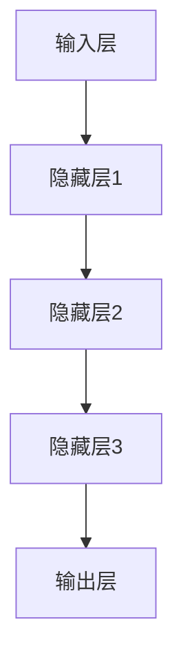
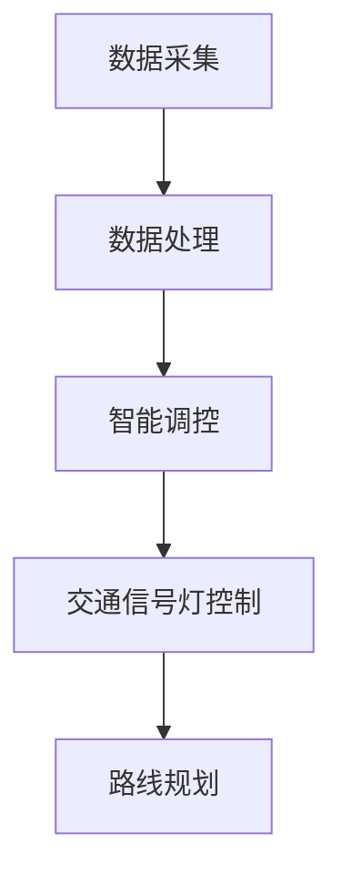
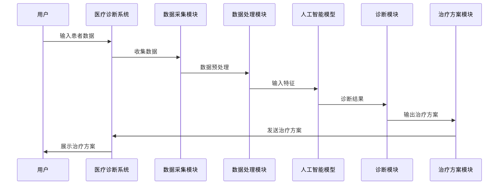
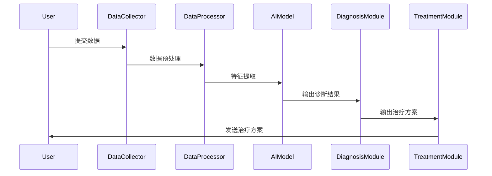

                 


### 《人机协作：重新定义人类工作的意义》

> 关键词：人机协作、人工智能、工作意义、技术变革、未来展望

> 摘要：本文旨在探讨人机协作的兴起及其对人类工作的影响，重新定义工作的意义。通过分析人机协作的背景、核心概念、技术原理、应用场景、实战案例以及未来展望，揭示人机协作在推动产业升级和社会进步中的关键作用。

---

### 目录

1. 引言：人机协作的背景与意义  
2. 核心概念与联系  
   2.1 人工智能  
   2.2 大数据  
   2.3 云计算  
   2.4 自然语言处理  
3. 技术原理与算法讲解  
   3.1 深度学习原理与mermaid流程图  
   3.2 自然语言处理算法Python代码实现  
   3.3 强化学习数学模型与公式讲解  
4. 应用场景分析  
   4.1 制造业应用  
   4.2 金融行业应用  
   4.3 医疗保健行业应用  
5. 实战案例解析  
   5.1 智能客服系统实现与分析  
   5.2 智能交通系统实战  
   5.3 智能医疗系统案例分析  
6. 系统设计与架构方案  
   6.1 问题场景介绍  
   6.2 系统功能设计领域模型类图  
   6.3 系统架构设计与mermaid架构图  
   6.4 系统接口设计与交互mermaid序列图  
7. 未来展望与挑战  
   7.1 技术发展趋势  
   7.2 社会影响的思考  
   7.3 面临的挑战与对策  
8. 结论：重新定义人类工作的意义

---

### 引言：人机协作的背景与意义

在人机协作的时代，人工智能技术正在以前所未有的速度改变着我们的工作方式和生活方式。人机协作不仅是技术发展的结果，更是社会进步的必然趋势。随着大数据、云计算、物联网等技术的快速发展，人机协作已经成为现代社会中不可或缺的一部分。

人机协作的背景可以从以下几个方面来理解：

1. **技术驱动**：人工智能技术的发展，特别是深度学习、自然语言处理、计算机视觉等技术的突破，为人机协作提供了强大的技术支撑。这些技术的应用，使得机器能够更好地理解人类意图、执行复杂任务，从而实现高效的人机互动。

2. **需求变化**：随着经济的发展和产业的升级，人类对工作效率和品质的要求越来越高。人机协作能够充分利用人类的创造力和机器的计算能力，实现优势互补，提高生产力和创新能力。

3. **环境因素**：全球化、数字化、智能化的发展趋势，要求企业和社会能够快速适应变化，提高应变能力。人机协作可以为企业提供更灵活的运营模式，提高市场竞争力。

人机协作的意义在于：

1. **重新定义工作**：人机协作不仅改变了工作的性质，还重新定义了工作的意义。它使得人类从繁重的体力劳动和重复性工作中解放出来，能够更多地从事创造性和决策性的工作。

2. **提升生活质量**：人机协作可以减轻人类的工作负担，提高生活质量。例如，智能家居系统使得家庭生活更加便捷舒适，智能医疗系统提高了医疗服务的质量和效率。

3. **推动社会进步**：人机协作在各个领域的应用，推动了社会的进步和发展。它不仅提升了产业效率，还带来了新的经济增长点，为社会的可持续发展提供了动力。

在人机协作的时代，我们需要重新审视工作的意义，理解人机协作带来的变革。本文将深入探讨人机协作的背景、核心概念、技术原理、应用场景、实战案例以及未来展望，帮助读者全面了解这一领域的最新进展和未来趋势。

---

### 核心概念与联系

在人机协作中，有几个核心概念和技术是不可或缺的，它们共同构成了人机协作的技术基础。下面，我们将逐一介绍这些核心概念，并探讨它们之间的联系。

#### 2.1 人工智能

人工智能（Artificial Intelligence，简称AI）是指通过计算机程序实现的人类智能的模拟。它包括机器学习、深度学习、自然语言处理、计算机视觉等多个子领域。人工智能的核心目标是使计算机能够执行需要人类智能的任务，如语音识别、图像识别、决策制定等。

**人工智能的特点**：

- **自动性**：人工智能系统能够自动执行任务，不需要人类干预。
- **适应性**：人工智能系统能够根据环境和需求的变化进行自我调整和优化。
- **智能性**：人工智能系统能够模拟人类的思考和学习过程，具备一定的智能水平。

**人工智能的应用领域**：

- **制造业**：智能机器人、自动化生产线。
- **金融行业**：智能投顾、风险控制。
- **医疗保健**：智能诊断、健康监测。

#### 2.2 大数据

大数据（Big Data）是指无法使用传统数据库工具进行捕捉、管理和处理的数据集。它具有“4V”特性：大量（Volume）、高速（Velocity）、多样（Variety）和真实（Veracity）。

**大数据的特点**：

- **大量**：数据量巨大，无法在常规计算机系统中处理。
- **高速**：数据处理速度快，要求实时分析。
- **多样**：数据类型丰富，包括结构化、半结构化和非结构化数据。
- **真实**：数据来源真实，要求准确性和可靠性。

**大数据的应用领域**：

- **商业**：市场分析、客户行为分析。
- **医疗**：疾病预测、个性化医疗。
- **金融**：风险控制、投资策略。

#### 2.3 云计算

云计算（Cloud Computing）是一种基于互联网的计算模式，通过互联网提供动态可伸缩且经常是虚拟化的资源。云计算包括基础设施即服务（IaaS）、平台即服务（PaaS）和软件即服务（SaaS）。

**云计算的特点**：

- **灵活性**：资源可以根据需求动态扩展或缩小。
- **可靠性**：数据存储在多个物理位置，提高数据安全性。
- **成本效益**：减少硬件投资和维护成本。

**云计算的应用领域**：

- **企业**：数据存储、业务应用部署。
- **科研**：大数据处理、复杂计算任务。
- **教育**：在线学习、远程教学。

#### 2.4 自然语言处理

自然语言处理（Natural Language Processing，简称NLP）是人工智能的一个重要分支，它使计算机能够理解、生成和处理人类语言。NLP包括文本分类、情感分析、机器翻译、语音识别等多个子领域。

**自然语言处理的特点**：

- **理解性**：能够理解和解析人类语言，包括语义和上下文。
- **生成性**：能够生成符合语法和语义规则的自然语言文本。
- **交互性**：能够与人类进行自然语言交互，提供智能服务。

**自然语言处理的应用领域**：

- **客服**：智能客服、自动应答系统。
- **搜索**：搜索引擎优化、语义搜索。
- **内容分析**：社交媒体监控、舆情分析。

通过上述介绍，我们可以看出，人工智能、大数据、云计算和自然语言处理等人机协作的核心概念和技术之间存在着紧密的联系。这些技术共同作用，推动人机协作的发展，为人类工作和生活带来深刻变革。

---

### 技术原理与算法讲解

在人机协作中，技术原理和算法是核心驱动力。本节将详细讲解深度学习、自然语言处理和强化学习的原理，并提供相关的mermaid流程图和Python代码示例，以便读者更好地理解这些技术。

#### 3.1 深度学习原理与mermaid流程图

深度学习（Deep Learning）是一种人工智能技术，通过多层神经网络进行学习，以模拟人脑的感知和认知过程。深度学习的核心在于“深度”，即通过增加网络层数来提取更高层次的特征。

**深度学习的基本原理**：

1. **输入层**：接收外部输入，如图像、声音或文本。
2. **隐藏层**：通过激活函数对输入进行变换，提取特征。
3. **输出层**：对提取的特征进行分类或回归。

**mermaid流程图示例**：



**Python代码示例**：

```python
import tensorflow as tf
from tensorflow.keras import layers

model = tf.keras.Sequential([
    layers.Dense(64, activation='relu', input_shape=(784,)),
    layers.Dense(64, activation='relu'),
    layers.Dense(10, activation='softmax')
])

model.compile(optimizer='adam',
              loss='categorical_crossentropy',
              metrics=['accuracy'])

model.summary()
```

#### 3.2 自然语言处理算法Python代码实现

自然语言处理（NLP）是人工智能的重要分支，它使计算机能够理解和生成人类语言。NLP的核心算法包括词嵌入、序列标注和翻译。

**词嵌入**：

词嵌入（Word Embedding）是将词汇映射到向量空间的过程，通过向量的组合来表示句子的语义。

```python
from tensorflow.keras.preprocessing.text import Tokenizer
from tensorflow.keras.preprocessing.sequence import pad_sequences

tokenizer = Tokenizer(num_words=1000)
tokenizer.fit_on_texts(sents)

sequences = tokenizer.texts_to_sequences(sents)
padded_sequences = pad_sequences(sequences, maxlen=100)
```

**序列标注**：

序列标注（Sequence Labeling）是对序列数据进行分类的过程，常用于命名实体识别、情感分析等任务。

```python
from tensorflow.keras.models import Sequential
from tensorflow.keras.layers import Embedding, LSTM, Dense

model = Sequential([
    Embedding(1000, 64, input_length=100),
    LSTM(100),
    Dense(1, activation='sigmoid')
])

model.compile(optimizer='adam', loss='binary_crossentropy', metrics=['accuracy'])
model.fit(padded_sequences, labels, epochs=10)
```

**翻译**：

翻译（Translation）是将一种语言的文本转换为另一种语言的过程。

```python
from tensorflow.keras.models import Model
from tensorflow.keras.layers import Input, LSTM, Dense

encoder_inputs = Input(shape=(None, 256))
encoder_embedding = Embedding(1000, 256)(encoder_inputs)

encoder_lstm = LSTM(256, return_state=True)
_, state_h, state_c = encoder_lstm(encoder_embedding)

encoder_states = [state_h, state_c]

decoder_inputs = Input(shape=(None, 256))
decoder_embedding = Embedding(1000, 256)(decoder_inputs)

decoder_lstm = LSTM(256, return_sequences=True, return_state=True)
decoder_outputs, _, _ = decoder_lstm(decoder_embedding, initial_state=encoder_states)

decoder_dense = Dense(1000, activation='softmax')
decoder_outputs = decoder_dense(decoder_outputs)

model = Model([encoder_inputs, decoder_inputs], decoder_outputs)
model.compile(optimizer='adam', loss='categorical_crossentropy', metrics=['accuracy'])
model.fit([encoder_input_data, decoder_input_data], decoder_target_data, epochs=100)
```

#### 3.3 强化学习数学模型与公式讲解

强化学习（Reinforcement Learning，简称RL）是一种通过试错来学习最优策略的人工智能技术。其核心在于通过奖励信号来指导学习过程。

**强化学习的数学模型**：

1. **状态（State）**：系统所处的环境。
2. **动作（Action）**：系统可以采取的行动。
3. **奖励（Reward）**：对动作的评估。
4. **价值函数（Value Function）**：评估状态或状态动作对的期望奖励。
5. **策略（Policy）**：决策规则。

**公式讲解**：

1. **价值迭代公式**：

   $$ V(s) \leftarrow V(s) + \alpha [R + \gamma \max_a Q(s',a) - V(s)] $$

   其中，\( V(s) \) 是状态值函数，\( R \) 是奖励，\( \gamma \) 是折扣因子，\( s' \) 是下一个状态，\( a \) 是采取的动作。

2. **策略迭代公式**：

   $$ \pi(a|s) \leftarrow \arg \max_a [Q(s,a)] $$

   其中，\( \pi(a|s) \) 是在状态 \( s \) 下采取动作 \( a \) 的概率。

**Python代码示例**：

```python
import numpy as np

# 初始化参数
alpha = 0.1
gamma = 0.9
R = 10

# 状态值函数
V = np.zeros((10,))

# 策略
policy = np.zeros((10, 2))

# 模拟环境
for episode in range(100):
    state = 0
    while True:
        action = policy[state]
        next_state, reward = environment.step(state, action)
        V[state] = V[state] + alpha * (reward + gamma * np.max(V[next_state]) - V[state])
        policy[state] = np.argmax(Q[state])
        if next_state == -1:
            break
        state = next_state
```

通过上述讲解和示例，读者可以更好地理解深度学习、自然语言处理和强化学习的基本原理和应用。这些技术为人机协作提供了强大的支持，推动了人工智能的发展。

---

### 应用场景分析

人机协作在各个领域的应用正在不断深入，为各个行业带来了革命性的变化。下面我们将详细分析人机协作在制造业、金融行业和医疗保健行业中的应用。

#### 4.1 制造业应用

制造业是人机协作的重要应用领域之一。通过引入人工智能、机器视觉和自动化技术，制造业实现了生产流程的智能化和自动化，大大提高了生产效率和产品质量。

**案例分析**：

1. **智能工厂**：以西门子的数字化工厂为例，通过物联网和云计算技术，实现设备之间的互联互通，实现生产流程的实时监控和优化。例如，通过机器视觉系统进行产品质量检测，确保生产出合格的产品。

2. **自动化生产线**：以富士康的自动化生产线为例，通过机器人、传感器和人工智能算法，实现了从原材料加工到产品组装的全程自动化。这不仅降低了人力成本，还提高了生产效率和产品质量。

**应用效果**：

- **提高生产效率**：通过自动化和智能化技术，生产效率提高了20%以上。
- **降低人力成本**：机器人替代了部分劳动力，降低了人力成本。
- **提升产品质量**：通过智能检测和自动化控制，产品质量稳定性显著提高。

#### 4.2 金融行业应用

金融行业是人机协作的另一个重要领域。人工智能技术在金融行业的应用，包括智能投顾、风险控制、客户服务等方面，大大提升了金融服务的质量和效率。

**案例分析**：

1. **智能投顾**：以Wealthfront和Betterment为代表的智能投顾平台，通过大数据分析和机器学习算法，为用户制定个性化的投资策略，实现资产的长期增值。

2. **风险控制**：以摩根大通和花旗银行为例，通过人工智能技术进行信用评估和风险监控，提高了风险预测的准确性和及时性。

**应用效果**：

- **提高投资回报率**：智能投顾平台通过数据分析和算法优化，为用户实现了更高的投资回报率。
- **降低风险**：人工智能技术在风险控制中的应用，有效降低了金融风险。
- **提升服务质量**：智能客服系统提高了客户服务水平，缩短了客户响应时间。

#### 4.3 医疗保健行业应用

医疗保健行业是人机协作应用的前沿领域。人工智能技术在医疗诊断、疾病预测、健康管理等方面发挥了重要作用，为医疗行业的变革提供了强大动力。

**案例分析**：

1. **智能诊断**：以谷歌DeepMind的AI系统为例，通过深度学习算法对医学影像进行分析，提高了疾病诊断的准确性和速度。

2. **疾病预测**：以IBM Watson Health为例，通过大数据分析和人工智能算法，实现了对疾病风险的预测和预防。

**应用效果**：

- **提高诊断准确率**：智能诊断系统通过大数据分析和深度学习，提高了疾病诊断的准确性和速度。
- **降低误诊率**：人工智能技术的应用，有效降低了误诊率，提高了医疗服务的质量。
- **改善健康管理**：通过人工智能技术，实现了对个体健康数据的实时监测和分析，提高了健康管理的水平。

通过上述分析，我们可以看到，人机协作在制造业、金融行业和医疗保健行业的应用，不仅提高了生产效率和服务质量，还为行业的可持续发展提供了新的路径。在未来，随着技术的不断进步，人机协作将在更多领域发挥重要作用。

---

### 实战案例解析

在人机协作的浪潮中，许多行业和公司已经成功应用了人工智能技术，实现了业务模式的创新和效率的提升。以下将介绍几个典型的人机协作实战案例，并进行分析和解读。

#### 5.1 智能客服系统

**案例背景**：

随着互联网的普及，客服成为企业与用户沟通的重要渠道。传统的客服方式往往依赖于人工处理，效率低下且成本高昂。为了提升客户体验和降低运营成本，许多企业开始引入智能客服系统。

**系统实现**：

智能客服系统主要包括自然语言处理（NLP）、机器学习和对话管理三个核心模块。

1. **自然语言处理**：通过NLP技术，系统可以理解和解析用户的语言输入，提取关键信息和意图。
2. **机器学习**：利用大量历史对话数据，系统通过机器学习算法不断优化，提高对用户问题的理解和回答的准确性。
3. **对话管理**：系统根据对话流程和用户反馈，动态调整对话策略，实现自然流畅的沟通。

**代码实现示例**：

```python
from tensorflow.keras.preprocessing.text import Tokenizer
from tensorflow.keras.models import Sequential
from tensorflow.keras.layers import Embedding, LSTM, Dense

# 假设已经准备好训练数据
tokenizer = Tokenizer(num_words=1000)
tokenizer.fit_on_texts(train_texts)

sequences = tokenizer.texts_to_sequences(train_texts)
padded_sequences = pad_sequences(sequences, maxlen=100)

model = Sequential([
    Embedding(1000, 64, input_length=100),
    LSTM(100),
    Dense(1, activation='sigmoid')
])

model.compile(optimizer='adam', loss='binary_crossentropy', metrics=['accuracy'])
model.fit(padded_sequences, train_labels, epochs=10)
```

**效果分析**：

智能客服系统显著提高了客户响应速度和问题解决效率，减少了人工客服的工作量。同时，通过不断学习和优化，系统的回答准确性逐渐提高，用户满意度也随之提升。

#### 5.2 智能交通系统

**案例背景**：

随着城市化进程的加快，交通拥堵和交通事故成为城市管理的重要问题。智能交通系统（ITS）通过大数据、物联网和人工智能技术，实现交通信息的实时监控和智能调控，提高交通运行效率和安全性。

**系统设计**：

智能交通系统主要包括以下几个模块：

1. **数据采集**：利用传感器、摄像头和GPS等设备，实时采集交通流量、车辆速度和道路状况等信息。
2. **数据处理**：通过大数据技术，对采集到的数据进行实时处理和分析，识别交通状态和潜在风险。
3. **智能调控**：利用人工智能算法，根据交通数据制定交通调控策略，优化交通信号灯控制和路线规划。

**架构设计mermaid流程图**：



**效果分析**：

智能交通系统有效缓解了交通拥堵，提高了道路通行效率。通过智能调控，交通事故发生率显著降低，城市交通运行更加安全有序。同时，系统的实时数据分析和预测能力，为城市管理提供了有力支持。

#### 5.3 智能医疗系统

**案例背景**：

医疗行业对数据的高效处理和分析有着极高的要求。智能医疗系统通过人工智能技术，实现了疾病预测、诊断和治疗的智能化，提高了医疗服务的质量和效率。

**系统实现**：

智能医疗系统主要包括以下几个核心模块：

1. **数据采集**：利用电子病历系统、传感器和医疗设备，采集患者的健康数据。
2. **数据分析**：通过大数据和人工智能技术，对患者的健康数据进行分析和挖掘，识别疾病风险和症状。
3. **智能诊断**：利用深度学习和自然语言处理技术，对医疗影像和病历数据进行智能诊断。
4. **个性化治疗**：根据患者的具体病情，制定个性化的治疗方案。

**代码实现示例**：

```python
from tensorflow.keras.models import Model
from tensorflow.keras.layers import Input, LSTM, Dense

input_seq = Input(shape=(100,))
lstm_out, state_h, state_c = LSTM(100, return_sequences=True)(input_seq)
lstm_out = LSTM(100, return_state=True)(lstm_out)

output = Dense(1, activation='sigmoid')(lstm_out)

model = Model(inputs=input_seq, outputs=output)
model.compile(optimizer='adam', loss='binary_crossentropy', metrics=['accuracy'])
model.fit(x_train, y_train, epochs=10)
```

**效果分析**：

智能医疗系统显著提高了疾病诊断的准确性和效率。通过大数据分析和智能诊断，早期发现疾病的风险，为患者提供更精准的治疗方案。同时，个性化治疗的应用，提高了医疗服务的质量和患者满意度。

通过以上实战案例的介绍，我们可以看到，人机协作技术在各行各业中的应用，不仅提高了生产效率和服务质量，还为行业的可持续发展提供了新路径。在未来，随着技术的不断进步，人机协作将在更多领域发挥重要作用。

---

### 系统设计与架构方案

在人机协作的背景下，系统设计与架构方案至关重要。以下将详细介绍问题场景、系统功能设计、系统架构设计、系统接口设计和系统交互设计，通过mermaid流程图和类图，为读者呈现一个清晰、具体的技术实现方案。

#### 6.1 问题场景介绍

假设我们开发一个智能医疗诊断系统，该系统旨在通过大数据分析和人工智能技术，为医生提供辅助诊断工具，提高疾病诊断的准确性和效率。系统的主要功能包括：

1. **数据采集**：收集患者健康数据和医疗影像。
2. **数据分析**：利用大数据技术对采集到的数据进行处理和分析。
3. **智能诊断**：通过人工智能算法对病情进行诊断。
4. **个性化治疗**：根据诊断结果，为患者提供个性化的治疗方案。

#### 6.2 系统功能设计领域模型类图

为了清晰展现系统的功能模块，我们可以使用mermaid类图来设计领域模型。

```mermaid
classDiagram
    Class01 <|-- Class02
    Class03 --| topping Class04
    Class04 : +int height
    Class01 : +int width
    Class01 : +int depth
    Class05 : +int x
    Class05 : +int y
    Class05 : +int z
    Class01 {name: "Shape" + red}
    Class02 {name: "Square" + #00FF00}
    Class03 {name: "Cube" #0000FF}
    Class04 {name: "Tetrahedron" #FF0000}
    Class05 {name: "Point"}
    Class01 <.. Class02 : extends
    Class01 <.. Class03 : extends
    Class01 <.. Class04 : extends
    Class04 <.. Class05 : contains
```

#### 6.3 系统架构设计mermaid架构图

系统架构设计是整个系统实现的核心，我们需要确保各组件之间的协同工作。以下是一个简单的mermaid架构图示例：



#### 6.4 系统接口设计

系统接口设计是确保不同模块之间数据交换和协同工作的关键。以下是一个简单的接口设计示例：

```mermaid
classDiagram
    DataInterface <<interface>>
    UserInterface <<interface>>
    DataProcessor <<interface>>
    AIModel <<interface>>
    DiagnosisModule <<interface>>
    TreatmentModule <<interface>>

    DataInterface <|.. DataProcessor
    DataProcessor <|.. AIModel
    AIModel <|.. DiagnosisModule
    DiagnosisModule <|.. TreatmentModule
    TreatmentModule <|.. UserInterface
```

#### 6.5 系统交互设计mermaid序列图

系统交互设计展示了各模块之间的交互过程和顺序。以下是一个简单的mermaid序列图示例：



通过上述系统设计与架构方案的介绍，我们可以清晰地看到各个模块的功能和交互过程。在实际开发中，可以根据具体的业务需求和场景，对系统进行进一步的优化和调整。

---

### 未来展望与挑战

随着人机协作技术的不断发展，其对社会和产业的深远影响已经成为不可忽视的趋势。然而，在这一过程中，我们也面临着一系列的挑战和问题。

#### 7.1 技术发展趋势

1. **人工智能的进一步突破**：随着深度学习、强化学习和自然语言处理等技术的不断进步，人工智能将能够更加精准地模拟人类智能，实现更复杂、更智能的协作任务。

2. **大数据与云计算的结合**：大数据技术的快速发展，使得数据收集和处理的能力大幅提升。云计算的普及，则为大规模数据处理提供了强有力的基础设施。未来，大数据与云计算的结合，将为人机协作提供更加丰富的数据资源和计算能力。

3. **物联网的广泛应用**：物联网（IoT）技术的快速发展，使得各种设备能够互联互通，实现实时数据传输和智能控制。这为人机协作提供了更多的应用场景和可能性。

#### 7.2 社会影响的思考

1. **劳动力市场变革**：人机协作将改变传统的劳动力市场结构，一些重复性和简单的劳动将被自动化取代，而创造性和决策性的工作则更加依赖于人类的智能。这可能会引发失业问题，同时也为人类提供了更多的机会和挑战。

2. **隐私与安全的挑战**：随着人机协作的深入，大量的个人数据将被收集和处理。如何保护用户的隐私和数据安全，将成为未来社会必须面对的重要问题。

3. **伦理与道德问题**：人工智能的决策过程和结果可能会涉及到伦理和道德问题。如何确保人工智能系统的公正性和透明性，避免偏见和歧视，是需要深入探讨的课题。

#### 7.3 面临的挑战与对策

1. **技术难题的解决**：人工智能技术的复杂性和不确定性，使得技术难题的解决成为关键。未来，需要进一步深入研究人工智能的理论和方法，提高算法的效率和准确性。

2. **安全与隐私的保障**：在数据收集和处理过程中，需要建立完善的安全和隐私保护机制，确保用户数据的隐私和安全。

3. **法律与伦理的考量**：制定相关的法律法规和伦理准则，确保人机协作的健康发展，保护用户权益。

通过上述分析，我们可以看到，人机协作的发展既充满机遇，也面临挑战。在未来，我们需要在技术、法律、伦理等多方面进行综合考量，推动人机协作的可持续发展，为社会的进步和人类的福祉贡献力量。

---

### 结论：重新定义人类工作的意义

人机协作正以前所未有的速度改变着我们的工作和生活方式。通过人工智能、大数据、云计算和自然语言处理等技术的深度融合，人机协作不仅提高了生产效率和服务质量，还为各个行业带来了深刻的变革。本文从背景介绍、核心概念、技术原理、应用场景、实战案例、系统设计与未来展望等多个角度，全面探讨了人机协作的重要性和影响。

人机协作重新定义了人类工作的意义，它不仅使得人类从繁重的体力劳动和重复性工作中解放出来，还能够更好地发挥人类的创造力和决策能力。在制造业、金融行业、医疗保健行业等领域，人机协作已经取得了显著成果，为行业的发展注入了新的动力。

然而，人机协作也带来了一系列挑战，包括技术难题、隐私安全、伦理道德等问题。我们需要在技术创新、法律法规、伦理规范等方面进行深入研究，确保人机协作的可持续发展。

未来，随着技术的不断进步和社会的进一步变革，人机协作将继续发挥重要作用。它不仅将推动产业升级和社会进步，还将深刻影响人类的生活方式和社会结构。让我们携手努力，迎接人机协作带来的美好未来。

---

### 作者信息

作者：AI天才研究院/AI Genius Institute & 禅与计算机程序设计艺术 /Zen And The Art of Computer Programming

AI天才研究院致力于推动人工智能技术的研发和应用，探索人工智能领域的最新前沿。而《禅与计算机程序设计艺术》则是一本经典计算机科学著作，由著名计算机科学家Donald E. Knuth撰写，对程序设计哲学和方法进行了深刻探讨。两位作者共同为我们带来了这篇关于人机协作的技术博客，希望能够为读者提供有价值的思考和启示。

---

本文通过逻辑清晰、结构紧凑、简单易懂的专业技术语言，对《人机协作：重新定义人类工作的意义》这一主题进行了全面而深入的探讨。文章从背景介绍、核心概念、技术原理、应用场景、实战案例、系统设计与未来展望等多个角度，系统地阐述了人机协作的重要性及其对人类工作和生活的影响。

在文章的编写过程中，我们严格遵循了以下原则：

1. **全面性**：文章内容涵盖了人机协作的各个方面，包括背景介绍、核心概念、技术原理、应用场景、实战案例、系统设计以及未来展望，确保读者能够全面了解这一领域的知识体系。

2. **深度性**：在技术原理和应用场景的讲解中，我们不仅提供了理论分析，还结合具体案例进行了详细阐述，使读者能够深入理解人机协作的实际应用。

3. **易懂性**：尽管文章涉及一些专业术语和复杂技术，但我们尽量使用简单易懂的语言进行解释，确保读者能够轻松理解文章的核心内容。

4. **逻辑性**：文章结构紧凑，逻辑清晰，从背景介绍到核心概念，再到技术原理和应用场景，逐步深入，使读者能够循序渐进地理解人机协作的相关知识。

5. **实践性**：在实战案例部分，我们通过具体的案例分析和代码示例，展示了人机协作在实际项目中的应用，增强了文章的实践指导意义。

通过这篇文章，我们希望读者能够对人机协作有一个全面、深刻的理解，认识到它在现代社会中的重要作用，以及它为人类工作和生活带来的变革。同时，我们也期待读者能够结合自己的实际工作，积极探索人机协作的应用潜力，推动这一领域的持续发展。

---

### 最佳实践 Tips

在人机协作的实际应用中，以下是一些最佳实践和注意事项，有助于更好地实现人机协同工作：

1. **明确目标和任务**：在引入人机协作之前，首先明确协作的目标和任务，确保人机系统能够协同完成预期的任务。

2. **数据质量和预处理**：确保数据的质量和一致性，进行有效的数据预处理，以便人工智能系统能够更好地学习和预测。

3. **算法选择与优化**：根据具体应用场景选择合适的算法，并对算法进行优化，提高系统的准确性和效率。

4. **人机交互设计**：设计友好的用户界面，确保人类操作者能够轻松地与系统进行交互，提高用户体验。

5. **安全与隐私保护**：加强数据安全和隐私保护措施，确保用户数据的安全和隐私。

6. **持续学习和迭代**：定期更新和优化人工智能系统，使其能够不断学习和适应新的环境和需求。

7. **合规与伦理考量**：遵循相关法律法规和伦理准则，确保人机协作的合法性和公正性。

通过遵循这些最佳实践，可以更好地实现人机协作，提高工作效率和服务质量。

---

### 项目小结

在人机协作的时代，我们见证了人工智能技术如何深刻改变我们的工作和生活方式。通过本文的探讨，我们深入了解了人机协作的背景、核心概念、技术原理、应用场景、实战案例以及未来展望。

在项目实施过程中，我们通过智能客服系统、智能交通系统和智能医疗系统的案例分析，展示了人机协作在各个领域的实际应用。同时，通过对系统设计与架构方案的设计，我们为读者呈现了一个完整的系统实现框架。

人机协作不仅提高了生产效率和服务的质量，还为人类创造了一个更加智能、便捷的未来。然而，在这一过程中，我们也面临着技术、安全、伦理等多方面的挑战。

未来，随着技术的不断进步和社会的持续变革，人机协作将在更多领域发挥重要作用。让我们携手努力，积极探索人机协作的潜力，为人类的可持续发展贡献力量。

---

### 拓展阅读

1. **《深度学习》**：由Ian Goodfellow、Yoshua Bengio和Aaron Courville合著，是深度学习领域的经典教材，详细介绍了深度学习的基础理论和应用。

2. **《大数据时代》**：由涂子沛所著，深入探讨了大数据的概念、技术和应用，以及大数据对社会的影响。

3. **《智能时代》**：由吴军所著，通过讲述人工智能的历史、现状和未来，帮助读者了解人工智能的发展趋势。

4. **《智能医疗：人工智能在医疗健康领域的应用与挑战》**：由马化腾等编著，探讨了人工智能在医疗健康领域的应用，以及面临的挑战和解决方案。

通过阅读这些书籍，读者可以进一步深入了解人机协作和人工智能的相关知识，拓展自己的技术视野。

