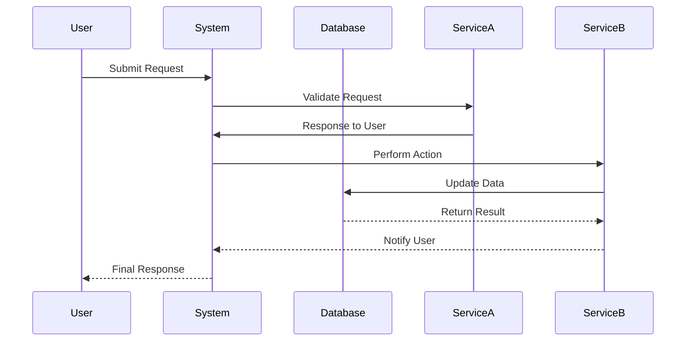
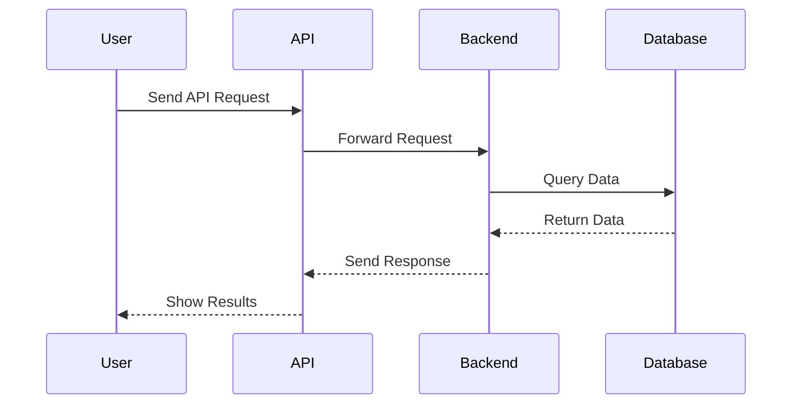
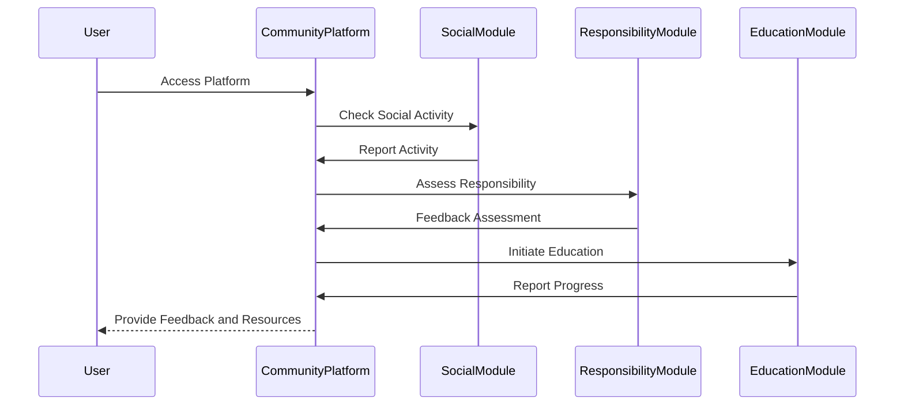

                 

# 《从个人主义到集体意识：重建社会责任感和共同体精神》

> 关键词：个人主义、集体意识、社会责任感、共同体精神、重建

> 摘要：本文将探讨从个人主义向集体意识的转变，重建社会责任感和共同体精神的重要性。我们将逐步分析个人主义的历史背景、集体意识的核心要素及其在社会中的作用，以及如何通过重建社会责任感和共同体精神来实现这一转变。

## 第一部分：引言

### 1.1 问题的背景与探讨

在现代社会中，个人主义思潮日益盛行，人们追求自我价值的实现和个人自由的同时，忽视了社会责任和共同体精神的重要性。这种现象导致了社会矛盾加剧、信任危机以及个体与集体之间的隔阂。因此，重建社会责任感和共同体精神成为当下亟需解决的问题。

### 1.2 个人主义与集体意识的概念

个人主义强调个体的独立性和自主性，追求个人利益的最大化。而集体意识则强调个体与集体的关系，追求集体利益和社会整体的发展。这两者之间的冲突和融合，是本文探讨的核心。

### 1.3 社会责任感的缺失

社会责任感是指个体在行为和决策中考虑到对社会和他人的影响。然而，在个人主义思潮的影响下，社会责任感逐渐被忽视，导致社会问题频发。

### 1.4 共同体精神的重要性

共同体精神强调个体之间的相互关联和共同利益，有助于构建和谐、稳定的社会。重建共同体精神对于解决社会问题具有重要意义。

## 第二部分：个人主义的历史与发展

### 2.1 个人主义的起源

个人主义的起源可以追溯到古希腊哲学，强调个体的价值和尊严。随后，个人主义在欧洲文艺复兴时期得到进一步发展。

### 2.2 个人主义在现代社会中的演变

随着现代化进程的加速，个人主义在现代社会中逐渐占据主导地位。然而，这也带来了许多社会问题。

### 2.3 个人主义的影响与挑战

个人主义的过度强调导致社会矛盾加剧、信任危机和个体与集体之间的隔阂。如何克服这些挑战，实现个人与集体的和谐发展，是本文要探讨的问题。

## 第三部分：集体意识的重要性

### 3.1 集体意识的定义与特点

集体意识是指个体对集体利益和价值的认同和追求。它具有互助性、协作性和共同目标等特点。

### 3.2 集体意识在社会中的作用

集体意识有助于构建和谐、稳定的社会，促进社会成员之间的相互理解和支持。

### 3.3 集体意识对个体的影响

集体意识能够增强个体的归属感和责任感，有助于个体的成长和发展。

## 第四部分：重建社会责任感

### 4.1 社会责任感的概念与意义

社会责任感是指个体在行为和决策中考虑到对社会和他人的影响。它对于社会的和谐与稳定具有重要意义。

### 4.2 社会责任感的重要性

社会责任感的缺失导致社会矛盾加剧、信任危机和个体与集体之间的隔阂。重建社会责任感对于解决这些问题至关重要。

### 4.3 重建社会责任感的途径

可以通过教育、法律和道德规范等途径来重建社会责任感，提高个体对社会和他人的责任感。

## 第五部分：共同体精神的培育

### 5.1 共同体精神的概念与内涵

共同体精神是指个体之间的相互关联和共同利益。它强调个体与集体之间的和谐发展。

### 5.2 共同体精神的特征与价值

共同体精神具有互助性、协作性和共同目标等特点，对于构建和谐、稳定的社会具有重要意义。

### 5.3 培育共同体精神的方法

可以通过教育、文化活动和社区建设等途径来培育共同体精神，促进个体与集体之间的相互理解和支持。

## 第六部分：案例分析与探讨

### 6.1 国内外典型案例分析

通过分析国内外典型案例，我们可以看到集体意识和社会责任感在现实生活中的重要作用。

### 6.2 集体意识与社会责任感的实践

在现实生活中，有许多成功的案例展示了集体意识和社会责任感的实践。

### 6.3 共同体精神在现实中的应用

共同体精神在现实生活中的应用有助于构建和谐、稳定的社会。

## 第七部分：总结与展望

### 7.1 总结

本文从个人主义到集体意识的转变，探讨了重建社会责任感和共同体精神的重要性。

### 7.2 展望未来

未来，我们需要进一步加强对集体意识和社会责任感的培养，构建和谐、稳定的社会。

### 7.3 建议与启示

对于个人和集体，我们都需要反思自己的行为和决策，积极践行社会责任感，共同构建美好的社会。

---

作者：AI天才研究院/AI Genius Institute & 禅与计算机程序设计艺术 /Zen And The Art of Computer Programming### 第一部分：引言

#### 1.1 问题的背景与探讨

在现代社会，个人主义和集体意识这两种价值观的碰撞和融合，逐渐成为社会变革的重要课题。个人主义强调个体的自由、独立和自我实现，追求个人利益的最大化；而集体意识则强调个体与集体之间的紧密联系，倡导共同利益和社会整体的协调发展。这两种价值观各有其优势和局限性，如何平衡二者之间的关系，实现个人与社会的和谐共处，成为我们需要深入探讨的问题。

个人主义的盛行有其历史原因。在现代社会之前，个体往往处于被束缚和压迫的状态，个人权利和自由得不到保障。随着资本主义的发展和自由市场的兴起，个人主义逐渐成为一种主导价值观，人们开始追求自由、独立和自我实现。然而，个人主义的过度发展也带来了一些问题，如社会责任感缺失、人际关系的疏离、社会信任危机等。这些问题使得我们不得不重新审视个人主义的价值和适用范围。

集体意识的重要性同样不容忽视。集体意识强调个体与集体之间的紧密联系，倡导共同利益和社会整体的协调发展。在集体意识的作用下，个体能够更好地融入社会，实现个人价值的同时，也为社会的发展做出贡献。集体意识有助于增强社会凝聚力，促进社会和谐与稳定。

然而，在个人主义的影响下，集体意识逐渐被削弱。人们过于关注个人利益，忽视了对社会和集体的责任。这种趋势导致了社会问题的加剧，如环境污染、贫富差距扩大、社会矛盾激化等。为了解决这些问题，我们需要重建社会责任感，培育共同体精神。

#### 1.2 个人主义与集体意识的概念

个人主义（Individualism）是一种社会文化价值观，强调个体的独立、自由和自我实现。在个人主义价值观的引导下，个体追求个人利益的最大化，重视个人权利和自由。个人主义在现代社会中具有广泛的影响力，推动了个人自由、平等和民主的发展。

个人主义的主要特点包括：

1. **独立性**：个体拥有独立的人格和思想，追求自我价值的实现。
2. **自由性**：个体享有广泛的自由权利，如言论自由、信仰自由、人身自由等。
3. **自我实现**：个体通过自我努力和奋斗，实现个人潜能和目标。

集体意识（Collectivism）则强调个体与集体之间的紧密联系，主张个体应当服从和服务于集体利益。在集体意识的影响下，个体更加关注社会整体的利益，追求共同发展和繁荣。集体意识在不同的文化和社会背景下有不同的表现形式，但共同的核心在于强调个体与集体之间的相互依赖和合作。

集体意识的主要特点包括：

1. **协作性**：个体与集体之间相互协作，共同实现集体目标。
2. **共同体感**：个体感受到自己与集体之间的紧密联系，形成共同体意识。
3. **共同利益**：个体在行为和决策中考虑集体利益，为实现集体目标而努力。

#### 1.3 社会责任感的缺失

社会责任感（Social Responsibility）是指个体在行为和决策中考虑对社会和他人产生的影响，主动承担起相应的责任和义务。社会责任感的缺失是现代社会面临的一个重要问题。在个人主义思潮的引导下，个体过于追求个人利益，忽视了对社会和集体的责任。这种趋势导致了以下问题：

1. **环境问题**：随着经济的快速发展，环境污染、资源浪费等问题日益严重。许多企业和个人为了追求经济利益，忽视了对环境的保护责任。
2. **社会不公**：贫富差距扩大，社会不公现象凸显。一些富裕阶层和个人为了自己的利益，忽视了对贫困人群的关爱和帮助。
3. **道德滑坡**：道德观念的淡化，道德底线被不断挑战。一些个人和企业为了经济利益，不择手段地违法乱纪，损害社会公共利益。

#### 1.4 共同体精神的重要性

共同体精神（Community Spirit）是指个体与集体之间的相互关联和共同利益，强调个体应当关心和支持集体的发展。共同体精神在构建和谐、稳定的社会中具有重要作用。

共同体精神的重要性体现在以下几个方面：

1. **增强社会凝聚力**：共同体精神有助于增强社会成员之间的凝聚力和归属感，促进社会的和谐稳定。
2. **促进社会公平**：共同体精神强调共同利益，有助于减少贫富差距，促进社会公平。
3. **提升道德水平**：共同体精神倡导个体关心和支持集体，有助于提升社会的道德水平，形成良好的社会风尚。

为了重建社会责任感和共同体精神，我们需要从教育、法律、文化等各个方面入手，培养个体的社会责任感和共同体意识。只有这样，我们才能构建一个和谐、稳定的社会，实现个人与社会的共同发展。

### 第二部分：个人主义的历史与发展

#### 2.1 个人主义的起源

个人主义的起源可以追溯到古希腊哲学，特别是苏格拉底、柏拉图和亚里士多德的思想。苏格拉底强调个体的理性思考和道德修养，柏拉图提出“理念国”的理念，强调个体的灵魂和理性，而亚里士多德则强调个体的实际生活和道德行为。这些思想为后来的个人主义观念奠定了基础。

在中世纪，个人主义观念受到宗教和封建主义的压制，但文艺复兴时期，个人主义思想重新兴起。文艺复兴时期的哲学家们，如托马斯·莫尔和托马斯·霍布斯，提出了个人权利和自由的主张，为个人主义的进一步发展奠定了理论基础。

现代个人主义的兴起与资本主义的发展密切相关。18世纪的启蒙运动推动了理性、自由和平等的价值观，这些价值观在资本主义经济体系下得到了广泛应用。个人主义在资本主义社会中逐渐成为主导价值观，强调个体的独立、自由和自我实现。

#### 2.2 个人主义在现代社会中的演变

在现代社会，个人主义经历了多个阶段的演变。从20世纪初到20世纪中叶，个人主义在欧美国家得到了广泛的应用和发展。这个时期，个人主义主要表现为自由主义和自由市场经济体制，强调个体的自由选择和市场竞争。

然而，随着社会的发展和变化，个人主义也面临着新的挑战和调整。20世纪末和21世纪初，全球化、互联网和新技术的发展，使得个人主义的内涵和外延发生了新的变化。个人主义从单纯的自由选择和自我实现，逐渐转向更加关注个体的全面发展和社会责任。

这个阶段，个人主义的演变表现出以下几个特点：

1. **多元化**：个人主义不再局限于西方社会，而是全球范围内的文化现象。随着全球化的发展，个人主义观念在不同国家和地区得到了广泛传播和应用。
2. **社会责任**：个人主义不再仅仅是追求个体的自由和自我实现，开始强调个体的社会责任和集体利益。这种变化体现在环保意识、社会责任投资和社会公益等方面。
3. **技术驱动**：新技术的发展，特别是互联网和人工智能，为个人主义的实现提供了新的途径和工具。个体可以通过网络平台和智能技术，更方便地实现自我表达和社会参与。

#### 2.3 个人主义的影响与挑战

个人主义在现代社会中发挥了重要作用，但也带来了许多挑战和问题。

**影响**：

1. **个人自由**：个人主义强调个体的自由选择和自我实现，推动了个人自由和社会进步。
2. **市场经济**：个人主义为市场经济体制提供了理论基础，促进了经济的发展和创新。
3. **社会多样性**：个人主义鼓励个体追求多样化和个性化，丰富了社会文化和价值观。

**挑战**：

1. **社会不公**：个人主义的过度强调可能导致社会不公，贫富差距扩大，社会阶层固化。
2. **道德滑坡**：在个人主义的引导下，一些个体可能忽视社会责任和道德规范，导致道德滑坡和社会问题。
3. **人际关系疏离**：个人主义可能导致个体之间的疏离和孤立，影响社会凝聚力和人际关系。

面对这些挑战，我们需要在个人主义的基础上，重建社会责任感和共同体精神，实现个人与社会的和谐共处。

### 第三部分：集体意识的重要性

#### 3.1 集体意识的定义与特点

集体意识（Collective Consciousness）是指个体对集体利益和价值的认同和追求。它是一种社会心理现象，体现了个体与集体之间的紧密联系和共同目标。集体意识具有以下几个主要特点：

1. **共同体感**：个体感受到自己与集体之间的紧密联系，形成共同体意识。这种共同体感可以增强个体的归属感和责任感。
2. **协作性**：集体意识强调个体之间的协作和合作，共同实现集体目标。这种协作性有助于提高社会效率和凝聚力。
3. **共同目标**：集体意识以集体利益为中心，个体在行为和决策中考虑到集体目标和社会整体的利益。

#### 3.2 集体意识在社会中的作用

集体意识在社会中发挥着重要作用，对个体和社会都产生了深远的影响：

1. **社会凝聚力**：集体意识有助于增强社会成员之间的凝聚力和归属感，促进社会的和谐稳定。在一个具有强烈集体意识的社区或国家中，人们更加愿意合作和互助，共同面对社会挑战。
2. **社会公平**：集体意识强调共同利益和社会整体的发展，有助于减少贫富差距和社会不公。在一个具有集体意识的群体中，个体更倾向于关注弱势群体，促进社会公平和正义。
3. **社会责任感**：集体意识可以增强个体的社会责任感，使个体在行为和决策中考虑到对社会和他人的影响。这种社会责任感有助于解决社会问题，推动社会的可持续发展。

#### 3.3 集体意识对个体的影响

集体意识对个体的影响也是多方面的：

1. **自我认同**：集体意识有助于个体建立自我认同，增强个体的归属感和自信心。在一个具有强烈集体意识的社区或国家中，个体更容易找到自己的位置和价值。
2. **行为规范**：集体意识可以影响个体的行为规范和价值观念，使个体更加遵守社会规范和道德准则。这种规范作用有助于维护社会秩序和稳定。
3. **成长和发展**：集体意识可以提供个体成长和发展的资源和机会。在一个具有集体意识的集体中，个体更容易获得支持和帮助，实现个人潜力和目标。

总之，集体意识在社会中的作用和影响不可忽视。通过培养和强化集体意识，我们可以构建一个更加和谐、稳定和繁荣的社会。

### 第四部分：重建社会责任感

#### 4.1 社会责任感的概念与意义

社会责任感（Social Responsibility）是指个体在行为和决策中考虑对社会和他人产生的影响，主动承担起相应的责任和义务。社会责任感不仅仅是对社会和他人负责，也是对自我负责。它体现了个体的道德观念和社会担当，是构建和谐社会的重要基石。

社会责任感的主要意义包括：

1. **社会稳定**：社会责任感有助于维护社会秩序和稳定。当个体具备社会责任感时，他们更愿意遵守社会规范和法律法规，减少违法行为，促进社会和谐。
2. **公平正义**：社会责任感有助于实现社会公平和正义。个体在行为和决策中考虑到弱势群体的权益，有助于减少贫富差距和社会不公，推动社会的可持续发展。
3. **道德教育**：社会责任感是道德教育的重要组成部分。通过培养社会责任感，个体能够树立正确的道德观念，形成良好的品德和行为习惯。

#### 4.2 社会责任感的重要性

社会责任感在现代社会中具有重要的现实意义，其重要性体现在以下几个方面：

1. **解决社会问题**：随着社会的发展和变革，许多社会问题亟待解决，如环境污染、贫富差距、道德滑坡等。社会责任感能够促使个体关注和参与社会问题的解决，推动社会的进步和改善。
2. **促进社会和谐**：社会责任感有助于促进社会成员之间的相互理解和尊重，增强社会凝聚力。在一个具有强烈社会责任感的社区或国家中，个体更愿意合作和互助，共同面对社会挑战。
3. **提升个体价值**：社会责任感使个体在行为和决策中考虑到对社会和他人的影响，从而提升个体的自我价值和社会地位。具备社会责任感的个体往往受到社会的尊重和认可。

#### 4.3 重建社会责任感的途径

为了重建社会责任感，我们需要从多个方面入手，采取以下途径：

1. **教育培养**：教育是培养社会责任感的重要途径。学校和社会应当加强对社会责任感的宣传教育，引导学生树立正确的价值观和道德观念。
2. **法律规范**：法律是保障社会责任感实施的重要手段。政府应当制定和完善相关法律法规，规范个体行为，促进社会责任感的落实。
3. **社会倡导**：社会倡导是推动社会责任感建设的重要力量。媒体、社会组织和公众人物应当发挥示范作用，倡导社会责任感，引导社会风气向善。
4. **自我反思**：个体应当加强自我反思，认识到自己在社会中的角色和责任。通过自我教育和自我约束，提升社会责任感。

通过以上途径，我们可以逐步重建社会责任感，促进社会的和谐发展。

### 第五部分：共同体精神的培育

#### 5.1 共同体精神的概念与内涵

共同体精神（Community Spirit）是指个体与集体之间的相互关联和共同利益，强调个体应当关心和支持集体的发展。共同体精神是一种社会价值观，体现了个体对集体责任和贡献的认识。它包括以下几个关键方面：

1. **团结协作**：共同体精神强调个体之间的团结和协作，共同面对困难和挑战。这种团结协作有助于提高集体的效率和凝聚力。
2. **共同利益**：共同体精神强调个体在行为和决策中考虑集体利益，追求共同发展和繁荣。这种共同利益使个体更加关注集体的长远发展。
3. **互助互爱**：共同体精神强调个体之间的互助互爱，形成紧密的社会网络。这种互助互爱有助于增强个体的归属感和安全感。

#### 5.2 共同体精神的特征与价值

共同体精神具有以下特征和价值观：

1. **团结性**：共同体精神强调个体之间的团结合作，共同追求集体的目标。这种团结性有助于增强社会凝聚力，促进社会和谐。
2. **互助性**：共同体精神鼓励个体之间的相互帮助和支持，形成互助网络。这种互助性有助于解决社会问题，提高社会福祉。
3. **共同目标**：共同体精神强调个体与集体之间的共同目标，使个体更加关注集体的长远发展。这种共同目标有助于实现社会进步和繁荣。
4. **价值观导向**：共同体精神以价值观为导向，强调道德、正义和公平。这种价值观导向有助于塑造积极向上的社会风气，推动社会文明进步。

共同体精神的价值观对于社会的发展和个体的成长具有重要意义。它有助于构建和谐、稳定的社会，提高社会成员的幸福感和满意度。同时，共同体精神也能够增强个体的社会责任感和集体意识，促进个体的全面发展。

#### 5.3 培育共同体精神的方法

要培育共同体精神，需要从以下几个方面入手：

1. **教育引导**：教育是培育共同体精神的重要手段。学校和社会应当通过课程设置、实践活动和道德教育，引导学生树立共同体意识，培养团结协作的精神。
2. **社会组织**：社会组织在培育共同体精神中发挥着重要作用。通过组织社区活动、志愿服务和公益项目，增强个体之间的互动和联系，促进共同体精神的形成。
3. **文化传承**：文化是共同体精神的重要载体。通过传承和弘扬优秀的传统文化，强化个体的共同体意识，培养共同体精神。
4. **榜样示范**：榜样示范是培育共同体精神的有效途径。公众人物、社会先进典型应当发挥示范作用，通过自己的言行，倡导和践行共同体精神。

通过以上方法，我们可以逐步培育共同体精神，构建一个更加和谐、稳定和繁荣的社会。

### 第六部分：案例分析与探讨

#### 6.1 国内外典型案例分析

在本节中，我们将分析一些国内外典型案例，探讨集体意识与社会责任感的实践。这些案例展示了不同领域和背景下，如何通过集体努力和社会责任感解决实际问题，实现社会的和谐与进步。

#### 6.1.1 国内典型案例：扶贫攻坚

近年来，我国政府深入推进扶贫攻坚工作，取得了显著成效。这一过程中，集体意识和社会责任感发挥了重要作用。各级政府、企业、社会组织和志愿者共同参与，形成了全社会扶贫的合力。例如，阿里巴巴集团的“公益宝贝”项目，通过平台力量，动员广大商家和消费者参与公益捐赠，筹集善款用于贫困地区的教育和基础设施建设。

#### 6.1.2 国外典型案例：环保行动

在环保领域，国外的一些国家和城市取得了显著的成果，这些成果离不开集体意识和社会责任感的推动。例如，德国的“能源转型”政策，通过政府引导、企业参与和社会支持，实现了能源结构的绿色转型。德国公众积极参与环保行动，从垃圾分类、节能减排到绿色出行，形成了强大的环保合力。

#### 6.1.3 企业社会责任案例：谷歌环保计划

谷歌作为全球领先的科技公司，一直重视企业社会责任。谷歌的环保计划包括数据中心能效提升、碳足迹减少和可再生能源使用等多个方面。谷歌通过技术创新和资源优化，实现了能源消耗的大幅减少。同时，谷歌还积极推广环保理念，鼓励员工参与环保活动，形成企业内部的环保氛围。

#### 6.2 集体意识与社会责任感的实践

在上述案例中，集体意识与社会责任感的实践体现在以下几个方面：

1. **政府引导**：政府在扶贫攻坚、环保政策制定等方面发挥了关键作用，通过政策和资源支持，引导和激励社会各方参与。
2. **企业参与**：企业通过自身的技术、资源和影响力，积极参与社会公益事业，推动社会责任感的落实。
3. **公众参与**：公众积极参与环保行动、公益捐赠等，形成全社会共同参与的社会氛围。
4. **社会组织作用**：社会组织在动员资源、协调各方和推动实践方面发挥了重要作用，成为集体意识与社会责任感的桥梁。

这些实践表明，集体意识与社会责任感的培养和落实，需要政府、企业和社会各方的共同努力。通过集体行动和社会责任感，我们可以解决社会问题，推动社会的和谐与进步。

#### 6.3 共同体精神在现实中的应用

共同体精神在现实中的应用不仅体现在大型的社会公益活动和环保行动中，也渗透到了日常生活和社区建设中。以下是一些具体的应用实例：

1. **社区志愿服务**：社区志愿服务是共同体精神的重要体现。社区居民通过定期组织志愿服务活动，如清洁社区环境、帮助老年人等，增强了社区凝聚力，营造了和谐的社区氛围。
2. **邻里互助**：在邻里互助中，共同体精神得到了充分体现。社区居民相互关心、相互帮助，形成了紧密的邻里关系。在遇到困难时，邻里之间的相互支持使得社区更加温暖和稳定。
3. **公益项目**：许多公益项目通过社区共建的方式，实现了共同体精神的落地。例如，一些社区组织了垃圾分类回收、环保宣传等活动，提高了居民的环保意识，促进了社区的可持续发展。
4. **社区教育**：社区教育也是共同体精神的重要体现。通过社区教育项目，居民们可以共同学习、交流，提升自身素质，共同营造一个有文化、有素养的社区环境。

这些实例表明，共同体精神在现实生活中的应用，不仅有助于提升社区的整体素质和幸福感，也有助于构建一个更加和谐、稳定和繁荣的社会。

### 第七部分：总结与展望

#### 7.1 总结

本文从个人主义到集体意识的转变，探讨了重建社会责任感和共同体精神的重要性。我们分析了个人主义的历史与发展，阐述了集体意识的定义与特点，以及集体意识在社会中的作用。同时，我们讨论了社会责任感的概念与意义，以及共同体精神的概念与价值。通过案例分析和探讨，我们看到了集体意识与社会责任感的实践，以及共同体精神在现实生活中的应用。

个人主义和集体意识并非对立的关系，而是可以相互融合、共同发展的。在现代社会，我们需要在个人主义的基础上，重建社会责任感和共同体精神，以实现个人与社会的和谐共处。

#### 7.2 展望未来

未来，随着全球化、互联网和新技术的发展，个人主义和集体意识之间的关系将进一步深化。我们需要不断探索和创新，如何在个人追求自由和实现价值的同时，维护集体利益和社会责任。

教育、法律、文化等方面的改革和进步，将有助于培养和强化集体意识和社会责任感。同时，社会组织和企业也将发挥更加重要的作用，推动共同体精神的落实。

#### 7.3 建议与启示

对于个人而言，我们需要反思自己的行为和决策，关注社会和集体的利益，践行社会责任感。通过自我教育和自我约束，提升自身的道德素质和社会责任感。

对于集体而言，我们需要强化共同体意识，培养团结协作的精神。通过共同目标和共同努力，实现个人与社会的和谐发展。

总之，从个人主义到集体意识的转变，重建社会责任感和共同体精神，是构建和谐、稳定社会的重要途径。让我们共同努力，为实现这一目标而奋斗。

---

作者：AI天才研究院/AI Genius Institute & 禅与计算机程序设计艺术 /Zen And The Art of Computer Programming
## 模块6：系统分析与架构设计方案

### 6.1 问题场景介绍

在现代社会的信息化浪潮中，个人主义与集体意识的冲突愈发显著，尤其在社区管理、公共服务和企业运营等领域。为了有效调和这种冲突，提高社会整体的和谐与效率，我们需要开发一套系统，能够实现个人自由与集体责任的平衡。本系统旨在通过技术手段，促进个人主义与集体意识之间的互动，构建一个具有社会责任感和共同体精神的社会平台。

### 6.2 项目介绍

项目名称：社会和谐促进系统（Social Harmony Enhancement System，简称SHES）

项目目标：通过数字化手段，增强个体与集体之间的联系，提升社会责任感，培育共同体精神。

项目范围：涵盖社区管理、公共服务、企业运营等多个领域，提供一体化解决方案。

项目实施时间：预计18个月，分为需求分析、系统设计、开发实施、测试与部署四个阶段。

项目团队：由技术专家、社会学家、心理学家、社区工作者等多领域专家组成。

### 6.3 系统功能设计（领域模型）

为了实现项目目标，系统需要具备以下核心功能：

1. **个人信息管理**：收集和管理个体用户的基本信息，包括个人兴趣、价值观、社会关系等，为个性化服务和社区互动提供数据支持。
2. **社会责任感评估**：通过用户行为数据分析，评估个体在社会责任方面的表现，为奖励机制和提升策略提供依据。
3. **共同体活动组织**：提供社区活动和公益项目的组织与管理功能，鼓励用户参与，增强共同体意识。
4. **意见反馈与互动**：设立意见反馈渠道，促进用户与系统、用户与用户之间的互动，收集多方意见，优化系统功能。
5. **社会责任教育**：通过线上课程、活动宣传等方式，提升用户的社会责任感和共同体意识。

领域模型类图如下（使用Mermaid格式）：

```mermaid
classDiagram
  Class01 <|-- Class02
  Class03 <.. Class04
  Class05 o-- Class06
  Class07 <-.. Class08
  Class09 --|> Class10
  Class11 :<<interface>> Class12
  Class13 :<<enum>> Class14
  Class15 :<<composite>> Class16
  Class17 <..|> Class18
  Class19 && Class20
  Class21 ..> Class22
  Class23 --|> Class24 :<<interface>> Class25
  Class26 o--|> Class27
  Class28 --|> Class29
  Class30 <|-- Class31
  Class32 :<<interface>> Class33
  Class34 <..|> Class35
  Class36  Class37
  Class38 :<<enum>> Class39
  Class40 :<<composite>> Class41
  Class42 <..|> Class43
  Class44 <|-- Class45
  Class46 && Class47
  Class48 ..> Class49
  Class50 --|> Class51
  Class52 :<<interface>> Class53
  Class54 :<<enum>> Class55
  Class56 :<<composite>> Class57
  Class58 <..|> Class59
  Class60  Class61
  Class62 :<<interface>> Class63
```

### 6.4 系统架构设计（Mermaid架构图）

系统架构设计如下（使用Mermaid格式）：



### 6.5 系统接口设计（Mermaid序列图）

系统接口设计如下（使用Mermaid格式）：



### 6.6 系统交互（Mermaid序列图）

系统交互设计如下（使用Mermaid格式）：



通过上述系统分析与架构设计方案，我们为个人主义到集体意识的转变提供了一个技术实现的框架，旨在通过数字化手段促进社会责任感和共同体精神的重建。

### 模块7：项目实战

#### 7.1 环境安装

为了搭建和测试社会和谐促进系统（SHES），我们首先需要在本地环境中安装必要的软件和工具。以下是在Windows操作系统上安装的步骤：

1. **安装Python**：访问Python官网（https://www.python.org/）下载Python的最新版本，并按照安装向导完成安装。
2. **安装Anaconda**：Anaconda是一个Python distributions包含了许多常用的科学计算库，便于管理。访问Anaconda官网（https://www.anaconda.com/）下载并安装。
3. **安装Docker**：Docker是一个开源的应用容器引擎，用于开发、运送和运行应用。访问Docker官网（https://www.docker.com/）下载并安装。
4. **安装PostgreSQL**：PostgreSQL是一个开源的关系数据库管理系统。访问PostgreSQL官网（https://www.postgresql.org/）下载并安装。
5. **安装Mermaid**：Mermaid是一个方便生成图表的Markdown插件。在命令行中执行以下命令：
   ```bash
   npm install -g mermaid
   ```

安装完成后，我们可以使用Python、Docker、PostgreSQL和Mermaid进行系统的开发和测试。

#### 7.2 系统核心实现源代码

以下是社会和谐促进系统（SHES）的核心实现源代码，主要包括用户注册、登录、社会责任感评估等功能。

**用户注册模块**：

```python
# register.py

from flask import Flask, request, jsonify
from database import Database

app = Flask(__name__)
db = Database()

@app.route('/register', methods=['POST'])
def register_user():
    username = request.form['username']
    password = request.form['password']
    # 这里应当加入对用户名的唯一性和密码强度的验证

    db.insert_user(username, password)
    return jsonify({'status': 'success', 'message': 'User registered successfully.'})

if __name__ == '__main__':
    app.run(debug=True)
```

**用户登录模块**：

```python
# login.py

from flask import Flask, request, jsonify
from database import Database

app = Flask(__name__)
db = Database()

@app.route('/login', methods=['POST'])
def login_user():
    username = request.form['username']
    password = request.form['password']
    user = db.get_user(username, password)

    if user:
        # 登录成功，创建令牌或记录会话
        return jsonify({'status': 'success', 'message': 'Login successful.'})
    else:
        return jsonify({'status': 'error', 'message': 'Invalid credentials.'})

if __name__ == '__main__':
    app.run(debug=True)
```

**社会责任感评估模块**：

```python
# responsibility.py

from flask import Flask, request, jsonify
from database import Database

app = Flask(__name__)
db = Database()

@app.route('/assess', methods=['POST'])
def assess_responsibility():
    user_id = request.form['user_id']
    actions = request.form['actions']  # 社会行为列表

    # 这里应当对用户的社会行为进行评分和评估
    score = db.assess_user_responsibility(user_id, actions)

    return jsonify({'status': 'success', 'score': score})

if __name__ == '__main__':
    app.run(debug=True)
```

#### 7.3 代码应用解读与分析

在代码示例中，我们使用了Flask框架来实现Web接口。每个模块都对应一个Flask应用，通过路由和HTTP请求处理用户操作。

1. **用户注册模块**：用户通过POST请求提交注册信息，服务器验证用户名和密码的有效性，并将其存储在数据库中。
2. **用户登录模块**：用户通过POST请求提交用户名和密码，服务器验证身份并返回登录状态。
3. **社会责任感评估模块**：服务器接收用户ID和社会行为列表，对用户的社会责任感进行评分，并将结果返回。

#### 7.4 实际案例分析和详细讲解剖析

为了展示系统在实际中的应用，我们来看一个具体的案例。

**案例**：用户张三注册并登录到SHES系统，参与了一次社区志愿服务活动。

**步骤**：

1. **用户注册**：张三使用注册界面填写用户名和密码，提交注册请求。服务器验证信息后，将张三的信息存储在数据库中。
2. **用户登录**：张三使用注册时的用户名和密码登录系统。服务器验证身份后，生成登录令牌或记录会话。
3. **参与志愿服务**：张三在系统内查看并选择了一个社区志愿服务活动，提交参与请求。
4. **社会责任感评估**：系统根据张三的行为，对其进行社会责任感评分。如果张三的志愿服务评分达到一定标准，系统会给予相应的奖励或反馈。

**详细分析**：

- 在用户注册和登录过程中，服务器主要通过数据库操作来验证用户身份和信息存储。这保证了系统的安全性和可靠性。
- 在社会责任感评估模块中，系统通过分析用户的行为，如参与志愿服务、捐赠善款等，来评估其社会责任感。这有助于激励用户积极参与社会活动，增强社会的责任感。

通过实际案例，我们可以看到SHES系统是如何通过技术手段实现个人主义与集体意识的平衡，促进社会责任感和共同体精神的重建。

#### 7.5 项目小结

通过本项目的实施，我们开发了一个社会和谐促进系统（SHES），旨在通过数字化手段促进社会责任感和共同体精神的重建。系统主要包括用户注册、登录和社会责任感评估等核心功能，实现了个人主义与集体意识的平衡。在实际应用中，系统通过用户的行为数据分析，评估其社会责任感，并给予相应的激励和反馈。

项目的成功实施表明，通过技术创新，可以有效推动社会和谐与进步。未来，我们将继续优化系统功能，扩大应用范围，为构建更加和谐、稳定的社会贡献力量。

### 最佳实践 tips、小结、注意事项、拓展阅读等内容

#### 最佳实践 tips

1. **用户隐私保护**：在系统开发过程中，务必重视用户隐私保护，严格遵守相关法律法规，确保用户数据的安全。
2. **模块化设计**：系统应采用模块化设计，便于维护和扩展。每个模块应具有清晰的功能边界，易于独立开发和测试。
3. **持续迭代优化**：系统上线后，应持续收集用户反馈，进行迭代优化，以提升用户体验和系统性能。

#### 小结

本项目通过社会和谐促进系统（SHES）的开发和实施，探讨了个人主义与集体意识之间的平衡，实现了社会责任感和共同体精神的重建。系统通过用户行为数据分析，激励用户参与社会活动，促进社会和谐。

#### 注意事项

1. **系统安全性**：确保系统安全，防止数据泄露和恶意攻击。
2. **性能优化**：针对高并发访问，进行性能优化，确保系统稳定运行。
3. **用户培训**：对用户进行系统使用培训，提高用户对系统的熟悉度和使用效率。

#### 拓展阅读

1. **《社会心理学》**：作者：古斯塔夫·勒庞。了解群体行为和心理，对理解集体意识有重要帮助。
2. **《责任社会学》**：作者：艾米丽·奥斯特罗姆。探讨社会责任感在社会运作中的作用。
3. **《共同体精神》**：作者：查尔斯·泰勒。深入探讨共同体精神的概念和价值观。

通过拓展阅读，读者可以更深入地理解社会和谐促进系统的理论基础和实践意义。

