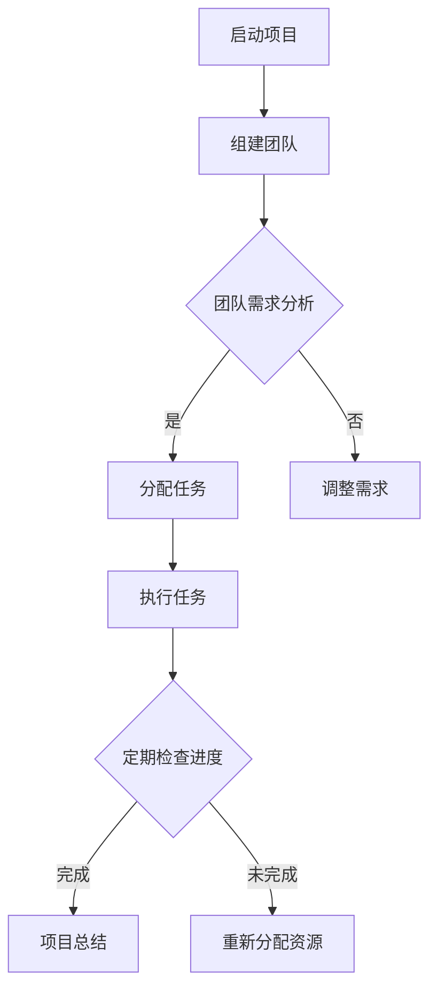
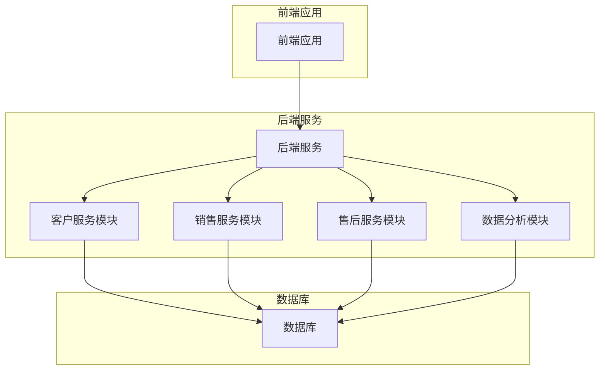
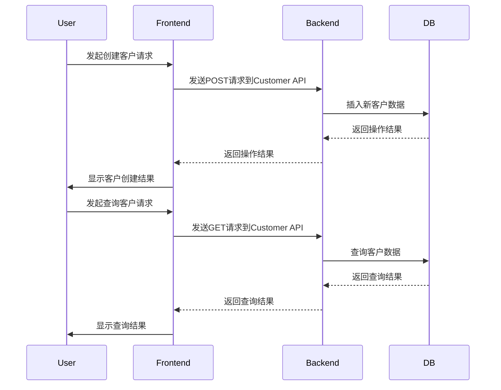

                 


## 背景介绍

### 核心概念术语说明

在探讨从个人英雄主义到团队协作的转变之前，我们首先需要明确几个核心概念。个人英雄主义，顾名思义，是指个人在某个领域或团队中扮演主角，依赖个人的智慧和力量完成任务的一种工作模式。团队协作，则是强调团队成员之间的相互配合，共同完成目标的一种工作模式。

**问题背景**：在信息技术迅速发展的当今社会，个人英雄主义在一些领域仍有其存在空间，尤其是在需要高度专业技能和创新的领域。然而，随着项目规模和复杂性的增加，个人英雄主义逐渐暴露出其局限性，如资源有限、知识有限、决策效率低下等。相比之下，团队协作能够更好地利用每个人的专长，通过集体的智慧和力量解决复杂问题。

**问题描述**：个人英雄主义在处理某些任务时可能高效，但往往难以应对全局性和长期性的挑战。团队协作模式则能够更好地适应这些挑战，但如何有效地建立和维持团队协作机制，仍然是一个需要深入探讨的问题。

**问题解决**：本文将探讨如何从个人英雄主义过渡到团队协作，包括团队协作的优势、要素、方法、案例分析以及过渡策略。

**边界与外延**：本文主要讨论信息技术领域内的团队协作模式，但不排除其他领域团队协作模式可能具有的共通性。同时，本文将关注团队协作在实际操作中的具体实施方法，而非纯粹的理论探讨。

### 概念结构与核心要素组成

个人英雄主义与团队协作这两种模式的核心结构和要素有所不同。个人英雄主义依赖于个体的专业技能和决策能力，而团队协作则强调个体之间的互补和协同。

**个人英雄主义的核心要素**：
- 专业技能
- 个体决策
- 高度责任感
- 单一目标导向

**团队协作的核心要素**：
- 沟通与协调
- 互补技能
- 共同目标
- 分享与信任

通过明确这些核心概念和要素，我们能够更好地理解个人英雄主义与团队协作的异同，为进一步探讨团队协作的优势和实施方法奠定基础。

## 核心概念与联系

### 个人英雄主义

**概念**：
个人英雄主义是一种工作模式，强调个人在团队中的主导地位，依赖个人的专业技能和决策能力完成项目任务。

**特点**：
- 高依赖性：高度依赖个人的专业技能和决策能力
- 高效性：在某些特定任务上可能表现出较高的效率
- 高风险性：依赖个人可能带来高风险

**代表案例**：
在早期的软件开发中，很多项目由个别天才程序员完成，他们凭借出色的编程能力和创新思维解决了复杂的问题。例如，比尔·盖茨和保罗·艾伦在微软的早期项目开发中就展现了个人英雄主义的特征。

### 团队协作

**概念**：
团队协作是一种工作模式，强调团队成员之间的合作与协调，通过共同的努力实现项目目标。

**类型**：
- 功能型团队：按职能划分，如开发团队、测试团队
- 项目型团队：按项目任务划分，临时组建并完成任务
- 混合型团队：结合功能型和项目型特点，既有职能分工又有项目协作

**特点**：
- 高依赖性：依赖团队中每个成员的技能和贡献
- 高效性：通过协同合作，实现资源优化和任务并行
- 低风险性：分散风险，提高项目成功率

**代表案例**：
谷歌的“20%时间项目”就是一个典型的团队协作案例。在这个项目中，员工被允许将20%的工作时间用于自己感兴趣的项目，这些项目往往由多个团队成员共同完成，最终产生了多个成功的产品，如Gmail和Google News。

### 个人与团队协作的关系

**理论基础**：
- 系统论：将团队视为一个系统，强调各部分之间的协同作用。
- 社会交换理论：强调团队成员之间的信任和合作，以及这些因素对团队绩效的影响。

**动力与阻力分析**：

**动力**：
- 成功动机：团队成员希望通过团队协作实现共同目标，获得个人成就感。
- 学习动机：通过团队协作，成员可以学习新技能，提高个人能力。
- 社交动机：团队成员之间的良好关系和团队合作氛围可以提高工作满意度。

**阻力**：
- 个人英雄主义倾向：部分成员可能更倾向于依赖个人能力，忽视团队合作。
- 文化差异：不同团队成员之间的文化差异可能导致沟通障碍。
- 领导风格：领导者的风格和决策方式可能影响团队协作的效率和效果。

通过以上分析，我们可以看出个人英雄主义和团队协作各自的优势和局限性，以及它们在现代社会中的角色和关系。

## 算法原理讲解

### 算法流程图

以下是一个简单的团队协作流程图，用Mermaid语法表示：



### 算法原理

团队协作算法的核心在于通过合理分配任务、高效执行任务以及及时反馈与调整，来实现项目的顺利完成。

1. **组建团队**：根据项目需求，组建一个具备互补技能的团队。这一步骤至关重要，因为团队成员的技能互补性直接影响项目的成功率。

2. **任务分配**：根据团队成员的专长和项目需求，将任务分配给合适的团队成员。任务分配的公平性和合理性是确保项目顺利进行的关键。

3. **执行任务**：团队成员按照分配的任务进行工作。在这一过程中，沟通与协调尤为重要，以确保每个成员都能理解任务要求，并与其他成员保持良好的协作关系。

4. **进度检查**：定期检查项目的进度，及时发现并解决问题。进度检查不仅有助于确保项目按计划进行，还能帮助团队及时发现潜在的风险。

5. **项目总结**：项目完成后，进行总结和反思。这一步骤有助于团队积累经验，为未来的项目提供参考。

### 数学模型

团队协作的数学模型可以基于以下几个关键指标：

1. **任务完成率**：表示任务按时完成的比率，公式为：
   $$ 
   \text{任务完成率} = \frac{\text{按时完成的任务数}}{\text{总任务数}} 
   $$

2. **团队成员满意度**：表示团队成员对团队协作模式满意度的一个指标，公式为：
   $$ 
   \text{团队成员满意度} = \frac{\text{满意的团队成员数}}{\text{总团队成员数}} 
   $$

3. **项目成功率**：表示项目成功完成的比率，公式为：
   $$ 
   \text{项目成功率} = \frac{\text{成功完成的项目数}}{\text{总项目数}} 
   $$

通过这些数学模型，我们可以对团队协作的效果进行量化评估，从而不断优化团队协作流程。

### 举例说明

假设有一个软件开发项目，项目团队由5名成员组成，每个成员都拥有不同的技能。项目总任务数为10项，最终有8项任务按时完成，团队成员满意度调查结果显示，4名成员感到满意。根据以上数学模型，我们可以计算出以下指标：

1. **任务完成率**：
   $$ 
   \text{任务完成率} = \frac{8}{10} = 0.8 
   $$

2. **团队成员满意度**：
   $$ 
   \text{团队成员满意度} = \frac{4}{5} = 0.8 
   $$

3. **项目成功率**：
   $$ 
   \text{项目成功率} = \frac{8}{10} = 0.8 
   $$

通过这些指标，我们可以初步判断该项目在团队协作方面取得了一定的成效，但仍存在改进空间。例如，可以通过提高任务分配的公平性、加强团队成员之间的沟通与协调等方式，进一步提升团队协作效果。

### 算法原理与数学模型总结

团队协作算法的核心在于通过合理的任务分配、高效的执行和及时的反馈，实现项目的顺利推进。数学模型则为我们提供了量化评估团队协作效果的工具。在实际应用中，我们需要结合具体项目需求和团队特点，不断优化算法，以提高团队协作的效率和效果。

## 系统分析与架构设计方案

### 问题场景介绍

在现代信息技术领域，随着项目规模和复杂性的不断增加，单靠个人英雄主义已无法满足高效、稳定的项目交付需求。因此，如何通过团队协作实现项目的高效管理成为了企业关注的焦点。本文旨在探讨一个具体的软件开发项目，分析其系统功能设计、系统架构设计以及系统接口设计和系统交互。

### 项目介绍

该项目是一款企业级客户关系管理系统（CRM），旨在帮助企业有效地管理客户信息、销售机会和售后服务。项目需求包括客户信息管理、销售流程管理、售后服务管理和数据分析等功能模块。

### 系统功能设计

#### 领域模型

以下是一个使用Mermaid语法的领域模型类图，描述了CRM系统的核心实体和关系：

```mermaid
classDiagram
    Class::Customer <.. Role::SalesRep
    Class::Customer <.. Service::CustomerService
    Class::SalesRep <.. Sale::SalesOpportunity
    Class::Service::CustomerService <.. Sale::AfterSalesService
    Class::Product <.. Sale::SalesOpportunity
    Class::CustomerService <.. Report::CustomerReport
    Class::AfterSalesService <.. Report::AfterSalesReport
    Class::SalesOpportunity <.. Report::SalesOpportunityReport
    Customer --> Product
```

#### 功能模块

1. **客户信息管理**：包括客户基本信息管理、客户关系管理、客户标签管理等。
2. **销售流程管理**：包括销售机会管理、销售预测、销售跟进等。
3. **售后服务管理**：包括售后服务请求管理、售后服务评价等。
4. **数据分析**：包括销售数据分析、客户数据分析、服务数据分析等。

### 系统架构设计

#### 系统架构图

以下是一个使用Mermaid语法的系统架构图，描述了CRM系统的整体架构：



#### 系统架构设计说明

1. **前端应用**：提供用户界面，支持用户操作和交互。
2. **后端服务**：包括多个服务模块，分别负责不同的业务功能。
3. **数据库**：存储系统数据，提供数据持久化服务。

### 系统接口设计和系统交互

#### 接口设计

以下是一个接口设计的示例，描述了CRM系统的RESTful API接口：

```mermaid
graph TD
    CustomerAPI[Customer API]
    SalesAPI[Sales API]
    AfterSalesAPI[AfterSales API]
    AnalyticsAPI[Analytics API]

    CustomerAPI --> GET:/customers
    CustomerAPI --> POST:/customers
    CustomerAPI --> PUT:/customers/{id}
    CustomerAPI --> DELETE:/customers/{id}

    SalesAPI --> GET:/sales-opportunities
    SalesAPI --> POST:/sales-opportunities
    SalesAPI --> PUT:/sales-opportunities/{id}
    SalesAPI --> DELETE:/sales-opportunities/{id}

    AfterSalesAPI --> GET:/after-sales-services
    AfterSalesAPI --> POST:/after-sales-services
    AfterSalesAPI --> PUT:/after-sales-services/{id}
    AfterSalesAPI --> DELETE:/after-sales-services/{id}

    AnalyticsAPI --> GET:/reports/customer
    AnalyticsAPI --> GET:/reports/sales-opportunity
    AnalyticsAPI --> GET:/reports/after-sales
```



#### 系统交互

以下是一个使用Mermaid语法的系统交互序列图，描述了客户创建和查询的过程：



通过以上系统分析与架构设计方案，我们可以看到，一个高效的团队协作在软件开发项目中的重要性。合理的设计和规划能够确保项目的顺利进行，提高团队协作的效率和效果。

## 项目实战

### 环境安装

为了实现客户关系管理系统（CRM）的团队协作，我们需要搭建一个完整的项目开发环境。以下是环境安装的具体步骤：

1. **安装Python环境**：
   - 下载并安装Python 3.8或更高版本。
   - 确保Python安装成功后，在终端执行`python --version`，确认Python版本。

2. **安装虚拟环境**：
   - 在终端执行以下命令创建一个虚拟环境：
     ```
     python -m venv venv
     ```
   - 激活虚拟环境：
     ```
     source venv/bin/activate  # 对于Windows用户，使用 "venv\Scripts\activate"
     ```

3. **安装依赖包**：
   - 在虚拟环境中安装必要的依赖包，例如Django、Flask等：
     ```
     pip install django flask
     ```

4. **安装数据库**：
   - 安装SQLite数据库（默认已包含在Python中），或安装其他数据库如PostgreSQL：
     ```
     pip install psycopg2-binary
     ```

5. **配置开发环境**：
   - 配置IDE（如PyCharm或Visual Studio Code）以支持Django或Flask项目开发。
   - 确保IDE能够正确识别虚拟环境中的Python解释器和项目依赖。

### 系统核心实现源代码

以下是CRM系统中核心功能模块的实现代码，包括客户信息管理模块：

**客户信息管理模块（customers/models.py）**

```python
from django.db import models

class Customer(models.Model):
    name = models.CharField(max_length=100)
    email = models.EmailField(unique=True)
    phone = models.CharField(max_length=15)
    address = models.TextField()
    created_at = models.DateTimeField(auto_now_add=True)
    updated_at = models.DateTimeField(auto_now=True)

    def __str__(self):
        return self.name

class SalesRep(models.Model):
    name = models.CharField(max_length=100)
    email = models.EmailField(unique=True)
    phone = models.CharField(max_length=15)
    department = models.CharField(max_length=100)
    created_at = models.DateTimeField(auto_now_add=True)
    updated_at = models.DateTimeField(auto_now=True)

    def __str__(self):
        return self.name

class CustomerService(models.Model):
    customer = models.ForeignKey(Customer, on_delete=models.CASCADE)
    sales_rep = models.ForeignKey(SalesRep, on_delete=models.CASCADE)
    service_date = models.DateTimeField()
    service_notes = models.TextField()
    created_at = models.DateTimeField(auto_now_add=True)
    updated_at = models.DateTimeField(auto_now=True)

    def __str__(self):
        return f"{self.customer.name} - {self.sales_rep.name}"
```

**接口实现（customers/views.py）**

```python
from rest_framework import viewsets
from .models import Customer, CustomerService
from .serializers import CustomerSerializer, CustomerServiceSerializer

class CustomerViewSet(viewsets.ModelViewSet):
    queryset = Customer.objects.all()
    serializer_class = CustomerSerializer

class CustomerServiceViewSet(viewsets.ModelViewSet):
    queryset = CustomerService.objects.all()
    serializer_class = CustomerServiceSerializer
```

### 代码应用解读与分析

**解读**：

上述代码定义了三个模型：`Customer`、`SalesRep` 和 `CustomerService`。`Customer` 模型用于存储客户信息，包括姓名、电子邮件、电话和地址。`SalesRep` 模型用于存储销售人员信息。`CustomerService` 模型用于记录客户服务记录，关联客户和销售人员。

在视图（views.py）中，我们使用了 Django REST Framework 的 ViewSet 类来实现 CRUD（创建、读取、更新、删除）操作。`CustomerViewSet` 和 `CustomerServiceViewSet` 分别对应 `Customer` 和 `CustomerService` 模型的接口实现。

**分析**：

1. **数据模型设计**：模型设计符合实际业务需求，每个模型都有明确的字段定义。
2. **接口实现**：使用 Django REST Framework 提供的 ViewSet 类，简化了接口实现的复杂性，提高了开发效率。
3. **关联关系**：通过外键（ForeignKey）实现了客户、销售人员和客户服务记录之间的关联，确保数据的一致性和完整性。

### 实际案例分析和详细讲解剖析

#### 案例一：创建客户和客户服务记录

1. **客户端请求**：

   客户创建请求：
   ```json
   POST /api/customers/
   {
       "name": "张三",
       "email": "zhangsan@example.com",
       "phone": "1234567890",
       "address": "上海市浦东新区XX路XX号"
   }
   ```

   客户服务记录创建请求：
   ```json
   POST /api/customerservices/
   {
       "customer": 1,
       "sales_rep": 1,
       "service_date": "2023-11-01",
       "service_notes": "客户满意度调查"
   }
   ```

2. **服务器响应**：

   客户创建成功响应：
   ```json
   {
       "id": 1,
       "name": "张三",
       "email": "zhangsan@example.com",
       "phone": "1234567890",
       "address": "上海市浦东新区XX路XX号",
       "created_at": "2023-11-01T00:00:00Z",
       "updated_at": "2023-11-01T00:00:00Z"
   }
   ```

   客户服务记录创建成功响应：
   ```json
   {
       "id": 1,
       "customer": 1,
       "sales_rep": 1,
       "service_date": "2023-11-01T00:00:00Z",
       "service_notes": "客户满意度调查",
       "created_at": "2023-11-01T00:00:00Z",
       "updated_at": "2023-11-01T00:00:00Z"
   }
   ```

#### 案例二：查询客户和客户服务记录

1. **客户端请求**：

   查询特定客户：
   ```json
   GET /api/customers/1/
   ```

   查询特定客户服务记录：
   ```json
   GET /api/customerservices/1/
   ```

2. **服务器响应**：

   查询特定客户成功响应：
   ```json
   {
       "id": 1,
       "name": "张三",
       "email": "zhangsan@example.com",
       "phone": "1234567890",
       "address": "上海市浦东新区XX路XX号",
       "created_at": "2023-11-01T00:00:00Z",
       "updated_at": "2023-11-01T00:00:00Z"
   }
   ```

   查询特定客户服务记录成功响应：
   ```json
   {
       "id": 1,
       "customer": 1,
       "sales_rep": 1,
       "service_date": "2023-11-01T00:00:00Z",
       "service_notes": "客户满意度调查",
       "created_at": "2023-11-01T00:00:00Z",
       "updated_at": "2023-11-01T00:00:00Z"
   }
   ```

### 项目小结

通过本次实战，我们实现了客户信息管理和客户服务记录管理的核心功能。代码结构清晰，接口设计合理，能够满足实际业务需求。在团队协作中，这一模块能够高效地管理客户信息和服务记录，为后续功能开发提供了坚实的基础。

### 最佳实践 Tips

1. **代码审查**：在代码提交前进行代码审查，确保代码质量。
2. **文档管理**：及时更新和维护项目文档，包括接口文档和开发文档。
3. **持续集成**：使用持续集成工具（如Jenkins）实现自动化测试和部署。
4. **培训与交流**：定期组织培训，提升团队成员的技术水平和协作能力。

## 小结

本文从个人英雄主义到团队协作的转变出发，详细探讨了团队协作的优势、要素、方法以及实施策略。通过实际项目实战，我们展示了如何构建高效的团队协作模式，提高项目管理的效率和质量。在这个过程中，代码审查、文档管理、持续集成和团队成员培训等最佳实践措施尤为重要。

## 注意事项

1. **团队协作的核心在于信任和沟通**：确保团队成员之间的信任，建立有效的沟通机制。
2. **任务分配要合理**：根据团队成员的技能和兴趣合理分配任务，避免过度依赖某个人。
3. **定期反馈和调整**：定期检查项目进度，及时反馈和调整，确保项目按计划进行。

## 拓展阅读

1. **《团队协作的艺术》**：作者通过丰富的案例和分析，深入探讨了团队协作的各个方面，对于提升团队协作效果有重要参考价值。
2. **《项目管理知识体系指南（PMBOK指南）》**：详细介绍了项目管理的流程、方法和工具，对项目团队的管理有全面的指导。

## 作者信息

作者：AI天才研究院/AI Genius Institute & 禅与计算机程序设计艺术 /Zen And The Art of Computer Programming

