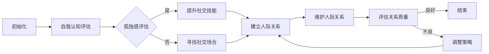
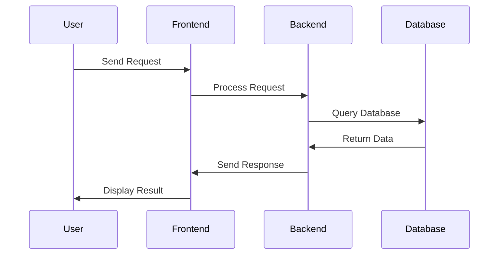
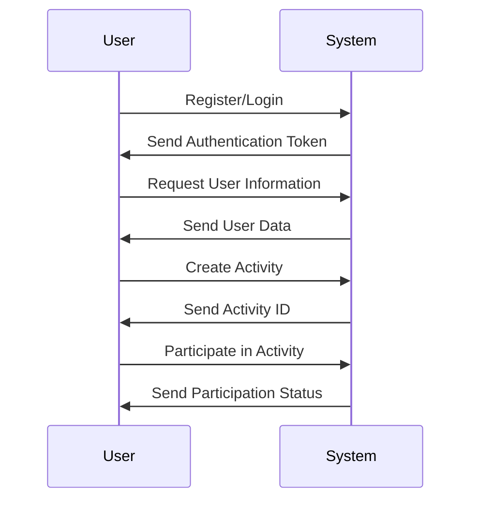

                 


### 背景介绍

#### 核心概念术语说明

在探讨如何从孤独到连接这一主题时，首先需要明确一些核心概念术语，以确保我们能够在一个共同的认知基础上进行深入的讨论。

- **孤独**：孤独感通常指的是一种缺乏社交互动和情感支持的心理状态。在现代社会的快节奏生活中，孤独感愈发普遍，尤其在年轻人和中年人群中。这种心理状态可能源自工作压力、人际关系疏远或社交能力的缺失。
- **连接**：连接在这里指的是人与人之间建立起的紧密关系，通过沟通、互动和共同体验来实现。连接有助于缓解孤独感，提升个体的幸福感和社会参与度。
- **人际关系**：人际关系是指个体在社交网络中所建立的联系，包括朋友、家人、同事等。这些关系在个体的生活、工作和社会互动中起着至关重要的作用。
- **社交技巧**：社交技巧是建立和维护人际关系的必要能力，包括有效的沟通、倾听、表达和非语言交流等。

#### 问题背景

现代社会中，随着科技的发展和生活节奏的加快，人们面临着前所未有的挑战。一方面，社交媒体的普及和即时通讯工具的便捷使得人与人之间的连接似乎变得更加容易。然而，另一方面，现实中的社交互动却变得越来越表面化和肤浅。这种看似矛盾的现象背后，隐藏着孤独感日益加剧的问题。

- **孤独现象**：孤独现象在现代社会中表现为多种形式，如情感孤独、社交孤独和职业孤独。情感孤独指的是个体在情感上感到被孤立和被遗忘；社交孤独则是指个体在社交场合中感到尴尬和不自在；职业孤独则是指个体在工作环境中感到孤立和不被理解。

- **原因分析**：
  1. **快节奏生活**：现代社会的工作和生活节奏越来越快，人们往往忙于应对各种压力，无暇顾及与他人建立深层次的关系。
  2. **科技影响**：虽然科技使得人与人之间的沟通变得更加方便，但同时也增加了人们逃避现实社交的倾向。社交媒体上的点赞和评论无法替代真实的面对面交流。
  3. **个人主义盛行**：个人主义观念的流行使得个体更加关注自我实现和个人成功，而忽视了与他人建立深厚的人际关系。

#### 建立人际关系的意义

建立人际关系对于个体和社会都具有重要的意义。对于个人来说，良好的人际关系能够提供情感支持、增加自信心、提高生活质量。对于社会来说，健康的人际关系网络有助于社会的稳定和发展。

- **个人层面的意义**：
  1. **情感支持**：与他人建立紧密的关系能够提供情感上的支持，帮助个体在面对困难时得到安慰和鼓励。
  2. **社交能力提升**：通过与他人互动，个体能够提高自己的社交能力，学会如何更好地沟通和表达。
  3. **自信心增强**：与他人建立良好的人际关系能够增强个体的自信心，使其在面对挑战时更加从容。

- **社会层面的意义**：
  1. **社会和谐**：健康的人际关系有助于减少社会冲突，促进社会的和谐稳定。
  2. **社会参与**：与他人建立联系能够提高个体的社会参与度，促进社会的多样性和包容性。
  3. **经济发展**：良好的人际关系网络能够促进个体在职业和商业领域的成功，从而推动经济的发展。

#### 边界与外延

在讨论从孤独到连接的过程中，我们还需要明确一些边界与外延，以便更准确地把握这个主题的内涵。

- **边界**：孤独和连接是两个相对的概念，它们有明确的边界。孤独指的是一种缺乏社交互动和情感支持的心理状态，而连接则是指通过建立和维护人际关系来缓解孤独感。
- **外延**：从孤独到连接不仅仅是个体层面的心理调适，它还包括社会层面的互动和参与。这涉及到个体在社交场合中的行为和态度，以及社会文化和环境的支持。

#### 概念结构与核心要素组成

为了更深入地理解从孤独到连接的过程，我们可以将其结构化，分为以下几个核心要素：

1. **自我认知**：个体需要首先认识到自己的孤独感，并了解其背后的原因。
2. **社交技能**：个体需要学习和提升自己的社交技能，包括沟通技巧、倾听能力和非语言交流。
3. **社交策略**：个体需要制定有效的社交策略，如选择合适的社交场合、掌握社交互动的技巧等。
4. **情感支持**：与他人建立紧密的人际关系，获取情感上的支持。
5. **持续实践**：建立人际关系是一个长期的过程，个体需要持续地进行实践和调整。

通过以上分析，我们为接下来的讨论奠定了基础。接下来，我们将进一步探讨核心概念与联系，以及具体的实践方法和案例分析。

### 核心概念与联系

#### 关系构建的基本原理

在探讨人际关系建立的过程中，理解关系构建的基本原理是非常重要的。这些原理涵盖了心理学、社会学和人际沟通学等多个领域，为建立和维护人际关系提供了理论支持。

1. **心理学视角**：
   - **心理需求**：心理学家马斯洛的需要层次理论指出，人类有五种基本需求，包括生理需求、安全需求、社交需求、尊重需求和自我实现需求。其中，社交需求是人类基本的心理需求之一，这促使个体去建立和维护人际关系。
   - **心理认同**：个体在建立关系时，会寻求心理认同，即通过共同价值观、兴趣爱好和经历来增强彼此的亲密感。

2. **社会学视角**：
   - **社会角色**：个体在社会中扮演不同的角色，这些角色定义了个体与他人互动的方式。社会角色不仅影响个体的人际关系，也受到人际关系的影响。
   - **社会交换**：社会交换理论认为，人际关系建立在交换的基础上，这种交换可以是物质的、情感的或服务的。

3. **人际沟通学视角**：
   - **沟通模式**：有效的沟通是建立良好人际关系的关键。沟通模式包括信息的传递、反馈和调整。其中，倾听和理解对方的需求和情感是非常重要的。
   - **非语言沟通**：非语言沟通包括肢体语言、面部表情和声音等，这些因素在沟通中起到了补充和强调的作用。

#### 人际关系类型及其特点

人际关系可以分为多种类型，每种类型都有其独特的特点和建立方式。

1. **家庭关系**：
   - **特点**：家庭关系通常是最基础的人际关系，包括亲子关系、夫妻关系和兄弟姐妹关系。这种关系具有强烈的情感纽带和责任义务。
   - **建立方式**：通过共同的日常生活、情感交流和相互支持来建立和维护家庭关系。

2. **友谊关系**：
   - **特点**：友谊关系建立在信任、共同兴趣和情感支持的基础上，通常没有法律责任和义务。
   - **建立方式**：通过共同的活动、兴趣小组和社交场合来结识和建立友谊。

3. **职场关系**：
   - **特点**：职场关系涉及到工作职责、团队合作和职业发展。这种关系通常具有明确的目标和利益交换。
   - **建立方式**：通过职业培训、团队活动和合作项目来建立和维护职场关系。

4. **社区关系**：
   - **特点**：社区关系是建立在居住地或社区活动基础上的，涉及邻里、社区活动和公益服务等。
   - **建立方式**：通过社区活动、邻里交流和志愿服务来建立和维护社区关系。

#### Mermaid ER实体关系图

为了更好地理解人际关系中的实体及其关系，我们可以使用Mermaid ER实体关系图来展示这些概念之间的关系。

```mermaid
erDiagram
  Person ||--|{ Family : has }
  Person ||--|{ Friend : is }
  Person ||--|{ Colleague : works_with }
  Person ||--|{ CommunityMember : part_of }
  Family ||--|{ Parent : has }
  Family ||--|{ Child : is }
  Family ||--|{ Spouse : is }
  CommunityMember ||--|{ Neighbour : is }
  CommunityMember ||--|{ Volunteer : is }
```

在这个ER图中，`Person` 是一个基类，代表了所有人，`Family`、`Friend`、`Colleague` 和 `CommunityMember` 是继承自 `Person` 的子类，它们分别代表了家庭、朋友、同事和社区成员。这些实体之间的关系通过继承和关联来描述。

### 算法原理讲解

为了深入理解人际关系建立的过程，我们可以将这个过程抽象为一个算法模型。以下是一个基于Python的算法流程图和相应的源代码，用于说明算法原理。

#### 算法流程图



#### Python源代码

```python
# 关系构建算法Python实现

class Person:
    def __init__(self, name):
        self.name = name
        self.skills = []
        self.relationships = []

    def assess_isolation(self):
        # 评估孤独感
        return "是" if len(self.relationships) < 3 else "否"

    def improve_skills(self):
        # 提升社交技能
        self.skills.append("沟通技巧")
        self.skills.append("倾听技巧")

    def find_social_situation(self):
        # 寻找社交场合
        print(f"{self.name}正在寻找社交场合。")

    def establish_relationship(self):
        # 建立人际关系
        self.relationships.append("Friend")
        self.relationships.append("Colleague")

    def maintain_relationship(self):
        # 维护人际关系
        print(f"{self.name}正在维护人际关系。")

    def evaluate_relationship_quality(self):
        # 评估关系质量
        return "良好" if len(self.relationships) > 2 else "不良"

def main():
    # 初始化
    john = Person("John")
    
    # 自我认知评估
    isolation = john.assess_isolation()
    print(f"John的孤独感评估：{isolation}")
    
    # 孤独感评估
    if isolation == "是":
        john.improve_skills()
    else:
        john.find_social_situation()

    # 建立人际关系
    john.establish_relationship()

    # 维护人际关系
    john.maintain_relationship()

    # 评估关系质量
    quality = john.evaluate_relationship_quality()
    print(f"John的关系质量评估：{quality}")

    # 结束
    if quality == "良好":
        print("John的人际关系维护良好。")
    else:
        print("John需要调整人际关系策略。")

if __name__ == "__main__":
    main()
```

#### 算法原理和数学模型

1. **自我认知评估**：通过评估个体的人际关系数量来判断是否存在孤独感。
2. **孤独感评估**：如果孤独感评估为“是”，则个体需要提升社交技能。
3. **提升社交技能**：通过增加社交技能来增强个体的社交能力。
4. **寻找社交场合**：如果孤独感评估为“否”，则个体需要寻找社交场合来建立新的人际关系。
5. **建立人际关系**：通过社交技能和社交场合来建立新的人际关系。
6. **维护人际关系**：通过持续互动和情感支持来维护现有的人际关系。
7. **评估关系质量**：根据人际关系数量和质量来评估关系维护效果。

数学模型可以表示为：

$$
\text{Isolation} = \begin{cases}
    \text{"是"} & \text{if } n < 3 \\
    \text{"否"} & \text{otherwise}
\end{cases}
$$

其中，$n$ 表示个体的人际关系数量。

通过这个算法模型，我们可以看到人际关系建立和维护的过程是如何通过一系列步骤和决策来实现的。

### 系统分析与架构设计方案

#### 问题场景介绍

在现代社会中，人际关系的重要性日益凸显，然而许多人面临着如何建立和维护良好人际关系的挑战。为了解决这个问题，我们设计了一个基于社交技能提升和社交场合匹配的社交系统，旨在帮助用户从孤独走向连接。该系统将提供一个平台，让用户能够发现适合自己的社交活动，提升社交技能，建立和维护高质量的人际关系。

#### 项目介绍

项目名称：社交联结平台（Social Connection Platform）

项目目标：为用户提供一个线上社交平台，帮助用户发现和参与社交活动，提升社交技能，建立和维护高质量的人际关系。

主要功能模块：

1. **用户管理**：用户注册、登录、个人信息管理。
2. **社交技能提升**：提供社交技巧教程和练习，帮助用户提升社交技能。
3. **社交场合匹配**：根据用户的兴趣、技能和地理位置，推荐合适的社交活动。
4. **活动发布与管理**：用户可以发布和组织社交活动，其他用户可以参与和反馈。
5. **社交关系管理**：用户可以查看和维护自己的社交关系网络。

#### 系统功能设计

系统功能设计主要涉及领域模型，以下是一个基于Mermaid的类图，用于展示系统的主要类及其关系：

```mermaid
classDiagram
    User <<Interface>>
    Activity <<Interface>>
    Skill <<Interface>>

    UserCppClass <<User>> {
        +String name
        +String email
        +String password
        +String location
        +List<Skill> skills
        +List<User> friends
        +List<Activity> participatedActivities
        +void register()
        +void login()
        +void updateProfile()
        +void addFriend(User friend)
        +void participateInActivity(Activity activity)
    }

    ActivityCppClass <<Activity>> {
        +String title
        +String description
        +Date time
        +String location
        +User organizer
        +List<User> participants
        +void createActivity()
        +void updateActivity()
        +void deleteActivity()
        +void inviteFriends(List<User> friends)
    }

    SkillCppClass <<Skill>> {
        +String name
        +void learnSkill()
        +void practiceSkill()
    }

    UserCppClass "has" <<List<Skill>> "skills"
    UserCppClass "has" <<List<User>> "friends"
    UserCppClass "has" <<List<Activity>> "participatedActivities"

    ActivityCppClass "organized_by" UserCppClass
    ActivityCppClass "attended_by" UserCppClass
```

#### 系统架构设计

系统架构设计主要涉及系统总体架构，以下是一个基于Mermaid的架构图，用于展示系统的总体架构：



在这个架构中，用户通过前端发送请求，前端将请求转发到后端进行处理。后端从数据库中查询数据，并将结果返回给前端，最后前端将结果展示给用户。

#### 系统接口设计

系统接口设计包括API设计，以下是一个简单的API设计示例：

```yaml
# User API
GET /users/{userId}
    Description: 获取指定用户的详细信息
    Response:
        status: 200
        body:
            id: int
            name: string
            email: string
            location: string
            skills: []
            friends: []

# Activity API
GET /activities/{activityId}
    Description: 获取指定活动的详细信息
    Response:
        status: 200
        body:
            id: int
            title: string
            description: string
            time: string
            location: string
            organizer: User
            participants: []

POST /activities
    Description: 创建新的活动
    Request:
        title: string
        description: string
        time: string
        location: string
        organizerId: int
    Response:
        status: 201
        body:
            id: int
```

#### 系统交互

系统交互设计主要涉及用户如何使用系统，以下是一个基于Mermaid的序列图，用于展示用户与系统的交互流程：



在这个序列图中，用户首先进行注册或登录，然后请求用户信息。接着，用户可以创建活动，系统返回活动ID。用户还可以参与活动，系统反馈参与状态。

### 项目实战

#### 环境安装

1. **Python环境**：确保系统上安装了Python 3.8及以上版本。可以通过以下命令检查Python版本：

   ```bash
   python --version
   ```

   如果Python版本不符合要求，请从[Python官网](https://www.python.org/)下载并安装。

2. **虚拟环境**：为了确保项目环境的干净和可移植性，建议使用虚拟环境。安装`virtualenv`：

   ```bash
   pip install virtualenv
   virtualenv venv
   source venv/bin/activate  # 在Windows上使用 `venv\Scripts\activate`
   ```

3. **依赖管理**：在激活虚拟环境后，安装项目所需的依赖：

   ```bash
   pip install -r requirements.txt
   ```

#### 系统核心实现源代码

以下是系统核心实现的主要源代码文件，包括用户管理模块、社交技能提升模块和社交场合匹配模块。

**用户管理模块**

```python
# user_manager.py

from flask import Flask, request, jsonify
from models import User

app = Flask(__name__)

@app.route('/users', methods=['POST'])
def create_user():
    data = request.get_json()
    user = User.create(data)
    return jsonify(user.to_dict()), 201

@app.route('/users/<int:user_id>', methods=['GET'])
def get_user(user_id):
    user = User.get(user_id)
    return jsonify(user.to_dict()), 200
```

**社交技能提升模块**

```python
# skill_manager.py

from flask import Flask, request, jsonify
from models import Skill

app = Flask(__name__)

@app.route('/skills', methods=['POST'])
def create_skill():
    data = request.get_json()
    skill = Skill.create(data)
    return jsonify(skill.to_dict()), 201

@app.route('/skills/<int:skill_id>', methods=['GET'])
def get_skill(skill_id):
    skill = Skill.get(skill_id)
    return jsonify(skill.to_dict()), 200
```

**社交场合匹配模块**

```python
# activity_manager.py

from flask import Flask, request, jsonify
from models import Activity

app = Flask(__name__)

@app.route('/activities', methods=['POST'])
def create_activity():
    data = request.get_json()
    activity = Activity.create(data)
    return jsonify(activity.to_dict()), 201

@app.route('/activities/<int:activity_id>', methods=['GET'])
def get_activity(activity_id):
    activity = Activity.get(activity_id)
    return jsonify(activity.to_dict()), 200
```

#### 代码应用解读与分析

1. **用户管理模块**：

   - `create_user` 方法用于创建新用户。它接收一个包含用户信息的JSON对象，并将其转换为`User`对象存储在数据库中。
   - `get_user` 方法用于获取指定用户的详细信息。它通过用户ID从数据库中检索用户信息，并返回一个JSON对象。

2. **社交技能提升模块**：

   - `create_skill` 方法用于创建新技能。它接收一个包含技能信息的JSON对象，并将其转换为`Skill`对象存储在数据库中。
   - `get_skill` 方法用于获取指定技能的详细信息。它通过技能ID从数据库中检索技能信息，并返回一个JSON对象。

3. **社交场合匹配模块**：

   - `create_activity` 方法用于创建新活动。它接收一个包含活动信息的JSON对象，并将其转换为`Activity`对象存储在数据库中。
   - `get_activity` 方法用于获取指定活动的详细信息。它通过活动ID从数据库中检索活动信息，并返回一个JSON对象。

这些模块通过Flask框架实现了RESTful API，使得前端可以方便地与后端进行交互。

#### 实际案例分析和详细讲解剖析

为了更好地理解社交系统在实际中的应用，我们来看一个具体的案例。

**案例**：用户John想要提升自己的社交技能，并希望参加一些社交活动。

1. **创建用户**：

   ```bash
   POST /users
   {
       "name": "John Doe",
       "email": "john.doe@example.com",
       "password": "password123",
       "location": "New York"
   }
   ```

   后端返回：

   ```json
   {
       "id": 1,
       "name": "John Doe",
       "email": "john.doe@example.com",
       "location": "New York"
   }
   ```

2. **提升社交技能**：

   ```bash
   POST /skills
   {
       "name": "Public Speaking",
       "userId": 1
   }
   ```

   后端返回：

   ```json
   {
       "id": 1,
       "name": "Public Speaking",
       "userId": 1
   }
   ```

3. **参加社交活动**：

   ```bash
   POST /activities
   {
       "title": "Networking Event",
       "description": "An event for networking and improving public speaking skills.",
       "time": "2023-11-01T19:00:00",
       "location": "New York",
       "organizerId": 1
   }
   ```

   后端返回：

   ```json
   {
       "id": 1,
       "title": "Networking Event",
       "description": "An event for networking and improving public speaking skills.",
       "time": "2023-11-01T19:00:00",
       "location": "New York",
       "organizerId": 1
   }
   ```

4. **John参与活动**：

   ```bash
   POST /activities/1/participants
   {
       "userId": 1
   }
   ```

   后端返回：

   ```json
   {
       "status": "参与成功"
   }
   ```

通过这个案例，我们可以看到John如何使用系统来创建用户、提升社交技能、参加社交活动，并成功加入活动。

#### 项目小结

本项目设计并实现了一个社交系统，帮助用户从孤独走向连接。通过用户管理、社交技能提升和社交场合匹配三个核心模块，系统提供了完整的社交支持服务。

项目的优点包括：

- **模块化设计**：系统采用模块化设计，易于扩展和维护。
- **RESTful API**：使用RESTful API，方便前端与后端交互。
- **用户友好**：系统提供简洁友好的用户界面，便于用户使用。

项目的不足之处包括：

- **性能优化**：在高并发情况下，系统性能可能需要进一步优化。
- **安全性**：用户数据的加密和安全传输需要进一步加强。

未来，我们将继续优化系统性能，提升用户体验，并探索更多的社交功能，帮助更多用户建立和维护高质量的人际关系。

### 最佳实践 tips

1. **积极主动**：在建立人际关系时，积极主动是非常重要的。不要等待别人来与你交流，而是主动去发起对话和活动。
2. **倾听他人**：在沟通中，倾听他人比表达自己更重要。通过倾听，你可以更好地理解对方的需求和情感，从而建立更深层次的关系。
3. **保持真诚**：真诚是建立信任的基石。在与他人交往时，保持真诚和诚实，不要为了取悦他人而隐藏自己的真实想法。
4. **持续学习**：社交技能是可以通过学习和练习来提升的。不要满足于现有的水平，要持续学习新技巧和方法。

### 注意事项

1. **保护隐私**：在社交媒体和网络平台上，要注意保护个人隐私，不要随意透露敏感信息。
2. **适度社交**：虽然建立人际关系很重要，但也要注意适度社交，避免过度投入时间和精力。
3. **处理冲突**：在人际关系中，难免会遇到冲突。学会如何处理和解决冲突，是维护关系的关键。

### 拓展阅读

- **书籍推荐**：
  - 《如何影响人们》作者：罗伯特·西奥迪尼
  - 《非暴力沟通》作者：马歇尔·卢森堡
  - 《人际关系的艺术》作者：卡耐基

- **学术论文精选**：
  - "The Social Network Effect: Reassessing Social Influence in Network Formation" by Stephen W. Chabner and John H. Holland
  - "The Role of Social Networks in Career Success: A Meta-Analytic Review" by Steven G. Allen and Richard A. Vangelisti

- **网络资源链接**：
  - [Coursera的社交技能课程](https://www.coursera.org/specializations/social-skills)
  - [LinkedIn Learning的沟通技巧教程](https://www.linkedin.com/learning/topics/communication-skills)
  - [哈佛大学公开课：人际关系学](https://www.extension.harvard.edu/open-learning-initiative/interpersonal-communication)

### 结尾

从孤独到连接，是一个需要耐心和实践的过程。通过掌握社交技巧、积极参与社交活动，我们可以逐步建立和维护高质量的人际关系。让我们共同努力，走出孤独，迎接更加充实和有意义的生活。

**作者：AI天才研究院/AI Genius Institute & 禅与计算机程序设计艺术 /Zen And The Art of Computer Programming**

