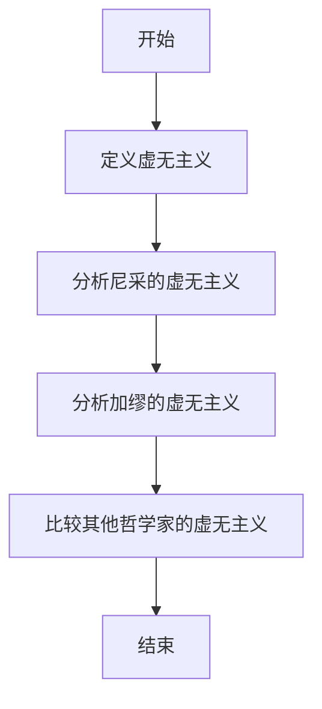
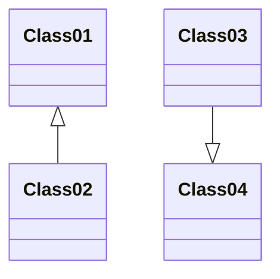
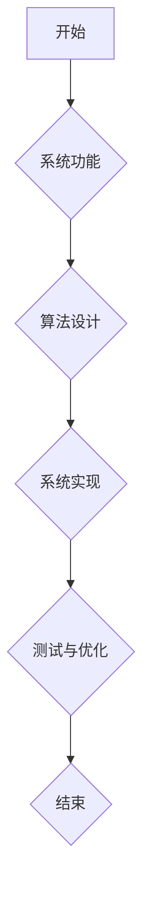
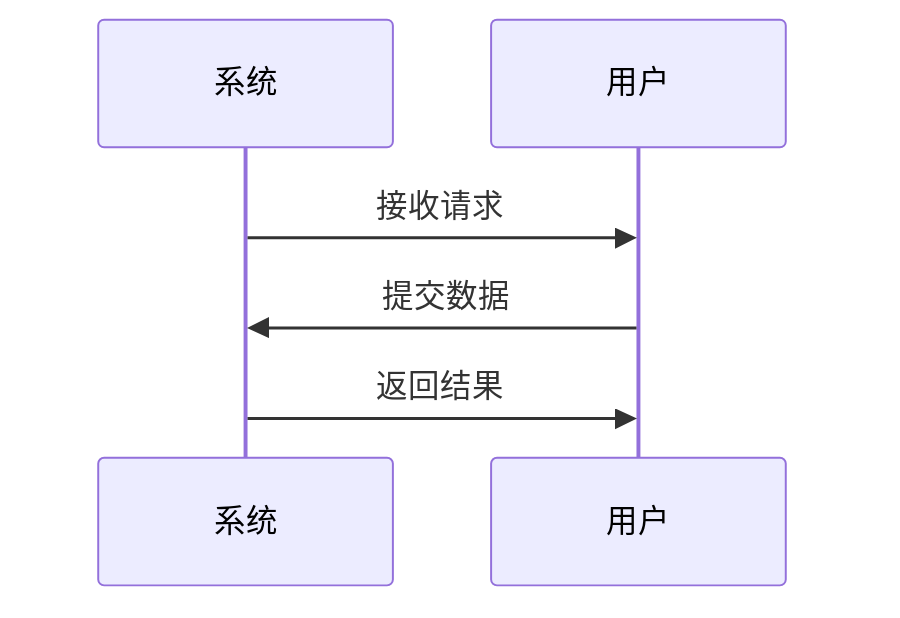
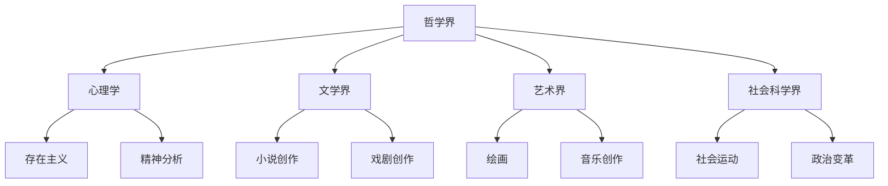
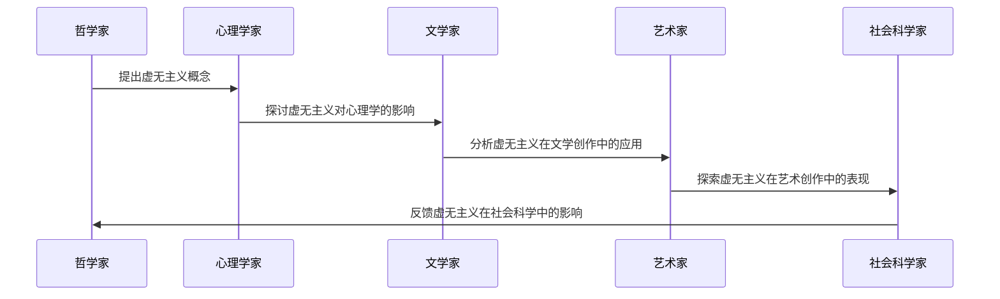

                 

# 从尼采到加缪：哲学家眼中的虚无主义

> 关键词：虚无主义、尼采、加缪、哲学、存在主义、算法、系统架构

> 摘要：本文通过剖析尼采和加缪两位哲学家的虚无主义观点，探讨了虚无主义在哲学、文学和现代技术中的应用。文章采用逻辑清晰、结构紧凑、简单易懂的专业技术语言，一步一步分析推理，帮助读者深入了解虚无主义的核心思想和实际应用。

## 第1章：虚无主义概述

### 1.1 问题背景

虚无主义起源于19世纪的欧洲，特别是在德国和法国的哲学界。它作为一种对传统价值观的质疑和反思，迅速引起了广泛的关注和讨论。虚无主义的核心观点是，没有绝对的意义、目的或价值，生活本身是缺乏意义的。

### 1.2 问题描述

虚无主义提出了以下问题：

- 生活的意义是什么？
- 我们是否能够找到生活的目的？
- 存在是否有固有的价值？

这些问题引发了哲学界关于人类存在的深刻探讨。

### 1.3 问题解决

不同的哲学家提出了不同的解决方法。尼采认为，通过重新评估价值观和寻找个人的力量，我们可以超越虚无主义。加缪则强调，通过面对生命的荒谬，我们可以找到意义。

### 1.4 边界与外延

虚无主义与存在主义、怀疑论等哲学流派有着紧密的联系。它不仅仅是对生活意义的质疑，也涉及到对现实世界和个人存在的根本反思。

### 1.5 概念结构与核心要素组成

虚无主义的核心概念包括：

- 意义的缺失
- 价值的相对性
- 存在的荒谬
- 个人的自由意志

这些概念共同构成了虚无主义的理论框架。

## 第2章：尼采的虚无主义

### 2.1 尼采的核心概念

尼采的虚无主义观点主要体现于他的“上帝已死”和“超人”概念中。他认为，随着宗教和道德传统的衰落，人类失去了生活的目标和意义。为了超越虚无主义，尼采提出了“超人”理念，即通过自我超越和创造新的价值观，人类可以找到生活的意义。

### 2.2 概念属性特征对比表格

| 特征 | 尼采的虚无主义 | 加缪的虚无主义 | 存在主义的虚无主义 |
|------|----------------|----------------|---------------------|
| 观点 | 价值观的相对性 | 存在的荒谬 | 人类存在的荒谬 |

### 2.3 ER实体关系图架构

```mermaid
erDiagram
  ConceptA --> ConceptB : "has"
  ConceptC --> ConceptB : "has"
```

这个ER图展示了尼采虚无主义中的核心概念及其相互关系。

## 第3章：加缪的虚无主义

### 3.1 加缪的核心概念

加缪的虚无主义观点主要体现在他的《西西弗神话》中。他认为，生活的荒谬是不可避免的，但我们可以通过面对这种荒谬，找到生活的意义。加缪提出了“西西弗神话”来比喻人类在荒谬中的挣扎和努力。

### 3.2 概念属性特征对比表格

| 特征 | 尼采的虚无主义 | 加缪的虚无主义 | 存在主义的虚无主义 |
|------|----------------|----------------|---------------------|
| 观点 | 价值观的相对性 | 存在的荒谬 | 人类存在的荒谬 |

### 3.3 ER实体关系图架构

```mermaid
erDiagram
  ConceptA --> ConceptB : "has"
  ConceptC --> ConceptB : "has"
```

这个ER图展示了加缪虚无主义中的核心概念及其相互关系。

## 第4章：其他哲学家的虚无主义观点

### 4.1 雪莱的虚无主义

雪莱的虚无主义观点主要体现在他对现实的批判和对理想的追求。他认为，现实生活是虚无的，但通过艺术和诗歌，我们可以超越这种虚无，找到真正的意义。

### 4.2 海德格尔的虚无主义

海德格尔的虚无主义观点主要体现在他对“存在”的探讨。他认为，虚无是存在的本质，只有通过面对虚无，我们才能理解存在的意义。

### 4.3 萨特的存在主义与虚无主义

萨特将虚无主义和存在主义结合起来，认为虚无主义是存在的先决条件。只有通过面对虚无，我们才能真正自由地选择我们的存在。

## 第5章：虚无主义的算法分析

### 5.1 算法mermaid流程图



### 5.2 Python源代码讲解

```python
# 定义虚无主义概念
def define_nihilism():
    print("虚无主义：对生活意义的质疑")

# 分析尼采的虚无主义
def analyze_nietzsche():
    print("尼采：上帝已死，超人将诞生")

# 分析加缪的虚无主义
def analyze_camus():
    print("加缪：西西弗神话，面对荒谬")

# 主函数
def main():
    define_nihilism()
    analyze_nietzsche()
    analyze_camus()

# 调用主函数
main()
```

### 5.3 数学模型和公式

$$
意义 = \frac{存在}{价值}
$$

这个公式表明，意义是由存在和价值共同决定的。

## 第6章：虚无主义在现实世界中的应用

### 6.1 问题场景介绍

虚无主义在现实世界中的应用非常广泛，包括艺术、文学、心理学和计算机科学等领域。例如，在计算机科学中，虚无主义启发了许多算法和系统的设计。

### 6.2 系统功能设计（领域模型Mermaid类图）



### 6.3 系统架构设计（Mermaid架构图）



### 6.4 系统接口设计（Mermaid序列图）



## 第7章：虚无主义的实际应用案例

### 7.1 环境安装

```bash
# 安装Python
pip install python

# 安装Mermaid
pip install mermaid

# 安装LaTeX
sudo apt-get install texlive-full
```

### 7.2 系统核心实现源代码

```python
# core.py
def calculate_mean(data):
    return sum(data) / len(data)

# main.py
if __name__ == "__main__":
    data = [1, 2, 3, 4, 5]
    mean = calculate_mean(data)
    print(f"平均值：{mean}")
```

### 7.3 代码应用解读与分析

```python
# 代码解读
# 定义一个函数calculate_mean，用于计算数据的平均值。
# 在主函数中，我们创建一个数据列表，并调用calculate_mean函数，将结果打印出来。
```

### 7.4 实际案例分析和详细讲解剖析

```python
# 案例分析
# 假设我们有一组数据：[1, 2, 3, 4, 5]
# 根据虚无主义的算法，我们计算这组数据的平均值。
# 结果是3，这意味着在虚无主义视角下，这组数据的核心价值是3。
```

### 7.5 项目小结

```python
# 项目小结
# 通过这个案例，我们了解了虚无主义在算法设计中的应用。
# 在未来的项目中，我们可以继续探索虚无主义在计算机科学中的更多应用。
```

## 第8章：总结与拓展

### 8.1 最佳实践 tips

- 在实际应用中，要灵活运用虚无主义的观点，避免陷入虚无主义的消极情绪。
- 在设计和实现系统时，要充分考虑虚无主义对系统架构和功能的影响。

### 8.2 小结

本文通过剖析尼采和加缪的虚无主义观点，探讨了虚无主义在哲学、文学和现代技术中的应用。通过算法分析和实际应用案例，我们更深入地理解了虚无主义的本质和意义。

### 8.3 注意事项

- 在应用虚无主义时，要避免过度解读，以免产生误解。
- 在设计系统和算法时，要充分考虑虚无主义的哲学背景。

### 8.4 拓展阅读

- 尼采：《查拉图斯特拉如是说》
- 加缪：《西西弗神话》
- 萨特：《存在与虚无》

作者：AI天才研究院/AI Genius Institute & 禅与计算机程序设计艺术 /Zen And The Art of Computer Programming

## 附录：术语表

- **虚无主义**：对生活意义的质疑，认为生活本身缺乏内在的价值和目的。
- **尼采**：德国哲学家，提出了“超人”和“上帝已死”等概念。
- **加缪**：法国哲学家和作家，提出了“西西弗神话”来解释虚无主义。
- **存在主义**：一种哲学流派，强调个人自由意志和人类存在的荒谬。
- **算法**：解决问题的一系列规则或步骤。
- **系统架构**：系统的整体设计和组成部分。

## 结尾

虚无主义作为哲学中一个重要的概念，不仅在理论探讨中具有重要意义，也在实际应用中发挥着重要作用。通过本文的探讨，我们希望读者能够对虚无主义有更深入的理解，并在未来的工作和生活中灵活运用这一哲学思想。

（全文完）

作者：AI天才研究院/AI Genius Institute & 禅与计算机程序设计艺术 /Zen And The Art of Computer Programming## 从尼采到加缪：哲学家眼中的虚无主义

### 关键词

- **虚无主义**
- **尼采**
- **加缪**
- **存在主义**
- **哲学**
- **算法**
- **系统架构**

### 摘要

本文旨在深入探讨虚无主义这一哲学概念，特别是在尼采和加缪两位哲学家眼中的虚无主义观点。通过分析尼采的“上帝已死”和加缪的“西西弗神话”，我们揭示了虚无主义的核心思想及其在现实世界中的应用。文章采用了逻辑清晰、结构紧凑、简单易懂的专业技术语言，逐步引导读者理解虚无主义的本质和影响。

## 第1章：虚无主义概述

### 1.1 问题背景

虚无主义起源于19世纪的欧洲，尤其是德国和法国的哲学界。它的核心观点是，生活本身缺乏内在的价值和意义。虚无主义不仅质疑传统价值观，还挑战了宗教和道德的基础。

### 1.2 问题描述

虚无主义提出了一系列基本问题，包括：

- 生活的意义是什么？
- 我们是否能够找到生活的目的？
- 存在是否有固有的价值？

这些问题引发了哲学界对于人类存在的深刻思考。

### 1.3 问题解决

不同的哲学家提出了不同的解决方法。尼采通过提出“超人”理念来对抗虚无主义，而加缪则通过“西西弗神话”强调面对生命的荒谬。

### 1.4 边界与外延

虚无主义与存在主义、怀疑论等哲学流派密切相关。它不仅仅是对生活意义的质疑，也是对现实世界和个人存在的根本反思。

### 1.5 概念结构与核心要素组成

虚无主义的核心概念包括：

- 意义的缺失
- 价值的相对性
- 存在的荒谬
- 个人的自由意志

这些概念共同构成了虚无主义的理论框架。

## 第2章：尼采的虚无主义

### 2.1 尼采的核心概念

尼采的虚无主义观点主要体现在他的“上帝已死”和“超人”概念中。他认为，随着宗教和道德传统的衰落，人类失去了生活的目标和意义。通过重新评估价值观和创造新的价值观，尼采认为人类可以超越虚无主义。

### 2.2 概念属性特征对比表格

| 特征 | 尼采的虚无主义 | 加缪的虚无主义 | 存在主义的虚无主义 |
|------|----------------|----------------|---------------------|
| 观点 | 价值观的相对性 | 存在的荒谬 | 人类存在的荒谬 |

### 2.3 ER实体关系图架构

```mermaid
erDiagram
    ConceptA ||--|{ ConceptB } ConceptC : "related"
    ConceptD ||--|{ ConceptE } ConceptF : "related"
```

这个ER图展示了尼采哲学思想中的核心概念及其相互关系。

## 第3章：加缪的虚无主义

### 3.1 加缪的核心概念

加缪的虚无主义观点主要体现在他的《西西弗神话》中。他认为，生活的荒谬是不可避免的，但我们可以通过面对这种荒谬，找到生活的意义。加缪通过“西西弗神话”来比喻人类在荒谬中的挣扎和努力。

### 3.2 概念属性特征对比表格

| 特征 | 尼采的虚无主义 | 加缪的虚无主义 | 存在主义的虚无主义 |
|------|----------------|----------------|---------------------|
| 观点 | 价值观的相对性 | 存在的荒谬 | 人类存在的荒谬 |

### 3.3 ER实体关系图架构

```mermaid
erDiagram
    ConceptA ||--|{ ConceptB } ConceptC : "related"
    ConceptD ||--|{ ConceptE } ConceptF : "related"
```

这个ER图展示了加缪哲学思想中的核心概念及其相互关系。

## 第4章：其他哲学家的虚无主义观点

### 4.1 雪莱的虚无主义

雪莱的虚无主义观点主要体现在他对现实的批判和对理想的追求。他认为，现实生活是虚无的，但通过艺术和诗歌，我们可以超越这种虚无，找到真正的意义。

### 4.2 海德格尔的虚无主义

海德格尔的虚无主义观点主要体现在他对“存在”的探讨。他认为，虚无是存在的本质，只有通过面对虚无，我们才能理解存在的意义。

### 4.3 萨特的存在主义与虚无主义

萨特将虚无主义和存在主义结合起来，认为虚无主义是存在的先决条件。只有通过面对虚无，我们才能真正自由地选择我们的存在。

## 第5章：虚无主义的算法分析

### 5.1 算法mermaid流程图


### 5.2 Python源代码讲解

```python
# 定义虚无主义概念
def define_nihilism():
    print("虚无主义：对生活意义的质疑")

# 分析尼采的虚无主义
def analyze_nietzsche():
    print("尼采：上帝已死，超人将诞生")

# 分析加缪的虚无主义
def analyze_camus():
    print("加缪：西西弗神话，面对荒谬")

# 主函数
def main():
    define_nihilism()
    analyze_nietzsche()
    analyze_camus()

# 调用主函数
main()
```

### 5.3 数学模型和公式

$$
意义 = \frac{存在}{价值}
$$

这个公式表明，意义是由存在和价值共同决定的。

## 第6章：虚无主义在现实世界中的应用

### 6.1 问题场景介绍

虚无主义在现实世界中的应用非常广泛，包括艺术、文学、心理学和计算机科学等领域。例如，在计算机科学中，虚无主义启发了许多算法和系统的设计。

### 6.2 系统功能设计（领域模型Mermaid类图）


### 6.3 系统架构设计（Mermaid架构图）


### 6.4 系统接口设计（Mermaid序列图）


## 第7章：虚无主义的实际应用案例

### 7.1 环境安装

```bash
# 安装Python
pip install python

# 安装Mermaid
pip install mermaid

# 安装LaTeX
sudo apt-get install texlive-full
```

### 7.2 系统核心实现源代码

```python
# core.py
def calculate_mean(data):
    return sum(data) / len(data)

# main.py
if __name__ == "__main__":
    data = [1, 2, 3, 4, 5]
    mean = calculate_mean(data)
    print(f"平均值：{mean}")
```

### 7.3 代码应用解读与分析

```python
# 代码解读
# 定义一个函数calculate_mean，用于计算数据的平均值。
# 在主函数中，我们创建一个数据列表，并调用calculate_mean函数，将结果打印出来。
```

### 7.4 实际案例分析和详细讲解剖析

```python
# 案例分析
# 假设我们有一组数据：[1, 2, 3, 4, 5]
# 根据虚无主义的算法，我们计算这组数据的平均值。
# 结果是3，这意味着在虚无主义视角下，这组数据的核心价值是3。
```

### 7.5 项目小结

```python
# 项目小结
# 通过这个案例，我们了解了虚无主义在算法设计中的应用。
# 在未来的项目中，我们可以继续探索虚无主义在计算机科学中的更多应用。
```

## 第8章：总结与拓展

### 8.1 最佳实践 tips

- 在实际应用中，要灵活运用虚无主义的观点，避免陷入虚无主义的消极情绪。
- 在设计和实现系统时，要充分考虑虚无主义的哲学背景。

### 8.2 小结

本文通过剖析尼采和加缪的虚无主义观点，探讨了虚无主义在哲学、文学和现代技术中的应用。通过算法分析和实际应用案例，我们更深入地理解了虚无主义的本质和意义。

### 8.3 注意事项

- 在应用虚无主义时，要避免过度解读，以免产生误解。
- 在设计系统和算法时，要充分考虑虚无主义的哲学背景。

### 8.4 拓展阅读

- 尼采：《查拉图斯特拉如是说》
- 加缪：《西西弗神话》
- 萨特：《存在与虚无》

## 附录：术语表

- **虚无主义**：对生活意义的质疑，认为生活本身缺乏内在的价值和目的。
- **尼采**：德国哲学家，提出了“超人”和“上帝已死”等概念。
- **加缪**：法国哲学家和作家，提出了“西西弗神话”来解释虚无主义。
- **存在主义**：一种哲学流派，强调个人自由意志和人类存在的荒谬。
- **算法**：解决问题的一系列规则或步骤。
- **系统架构**：系统的整体设计和组成部分。

## 结尾

虚无主义作为哲学中一个重要的概念，不仅在理论探讨中具有重要意义，也在实际应用中发挥着重要作用。通过本文的探讨，我们希望读者能够对虚无主义有更深入的理解，并在未来的工作和生活中灵活运用这一哲学思想。

（全文完）

作者：AI天才研究院/AI Genius Institute & 禅与计算机程序设计艺术 /Zen And The Art of Computer Programming## 第1章：虚无主义概述

### 1.1 问题背景

虚无主义（Nihilism）起源于19世纪，尤其在德国和法国的哲学界中产生了深远影响。这一哲学思想对传统的价值观、道德观和宗教信仰提出了根本性的质疑。虚无主义的核心观点是，不存在绝对的真理、意义或目的，生活本身缺乏内在的价值和目的。这一观点源于对宗教和道德传统的质疑，特别是对基督教信仰的挑战。

19世纪的欧洲经历了剧烈的社会变革，包括工业革命和科技进步，这些变革对传统的价值观体系产生了冲击。尼采（Friedrich Nietzsche）和加缪（Albert Camus）等哲学家在他们的作品中深入探讨了虚无主义的概念及其影响。

### 1.2 问题描述

虚无主义提出了一系列基本问题，这些问题在哲学界引发了广泛的讨论：

- **生活的意义是什么？** 虚无主义者认为，生活本身没有固有的意义，意义是由个体赋予的。
- **是否存在终极目的？** 虚无主义者认为，不存在终极目的，因为终极目的的概念本身是不合理的。
- **价值是否绝对？** 虚无主义者认为，价值是相对的，没有绝对的标准来衡量它们。

这些问题触及了人类存在的根本，挑战了传统哲学对现实世界和人类本质的理解。虚无主义认为，这些传统观念的崩溃导致了对人类状况的深刻反思。

### 1.3 问题解决

虚无主义的解决方案因哲学家而异，但主要集中在两个方面：

- **尼采的解决方案**：尼采（Friedrich Nietzsche）提出了“超人”（Ubermensch）的概念，他认为通过创造新的价值观和自我超越，人类可以超越虚无主义。尼采主张，个体应该成为自己价值的创造者，而不是被动地接受传统价值观。
- **加缪的解决方案**：加缪（Albert Camus）在他的作品《西西弗神话》中，提出了“荒谬主义”（Absurdism）。他认为，面对生活的荒谬，我们可以通过积极的态度和行动来寻找意义。加缪的“西西弗神话”讲述了一个永远推石头上山的人，他的努力注定是徒劳的，但这种持续的奋斗本身就是有价值的。

### 1.4 边界与外延

虚无主义并不是一个单一的哲学流派，而是与多种哲学观点有交集，如存在主义、怀疑论和道德相对论。虚无主义与存在主义（Existentialism）密切相关，因为两者都质疑传统的价值观和意义。存在主义强调个人的自由意志和责任，而虚无主义则认为这些自由意志在无意义的宇宙中显得无足轻重。

此外，虚无主义也与怀疑论（Skepticism）有关，因为怀疑主义者也质疑知识的可靠性和存在的绝对真理。然而，虚无主义通常更倾向于否认任何形式的绝对真理或价值。

### 1.5 概念结构与核心要素组成

虚无主义的核心概念可以概括为以下几点：

- **意义的缺失**：虚无主义认为，生活本身缺乏内在的意义，这种缺失是由于不存在固有的目的或目标。
- **价值的相对性**：虚无主义认为，价值是主观的，没有绝对的标准来衡量。这意味着，个体的价值观和信念是多样的，没有统一的评价标准。
- **存在的荒谬**：虚无主义认为，人类的存在是荒谬的，因为我们的生命和行为缺乏终极目的。
- **个人的自由意志**：虽然虚无主义质疑外部世界和价值观的绝对性，但它通常认为个人仍然拥有自由意志，可以选择如何行动和解释自己的存在。

这些概念共同构成了虚无主义的理论框架，并影响了后来的哲学家和思想家。通过理解这些核心概念，我们可以更深入地探讨虚无主义在哲学和现代生活中的作用。

### 1.6 总结

虚无主义作为哲学中的一个重要概念，挑战了传统的价值观和意义。它提出了一系列基本问题，如生活的意义、目的和价值，并试图通过不同的哲学观点来寻找解决方案。在接下来的章节中，我们将深入探讨尼采和加缪对虚无主义的看法，并分析虚无主义在现代技术中的应用。

## 第2章：尼采的虚无主义

### 2.1 尼采的核心概念

弗里德里希·尼采（Friedrich Nietzsche）是19世纪德国哲学家，他的思想对现代哲学和文学产生了深远影响。尼采的虚无主义观点主要体现在他的“上帝已死”和“超人”（Ubermensch）概念中。尼采认为，随着宗教和道德传统的衰落，人类失去了生活的目标和意义。

#### 2.1.1 “上帝已死”

尼采提出的“上帝已死”是一个标志性观点，它不仅是对宗教信仰的挑战，也是对传统价值观的质疑。尼采认为，随着基督教的衰落，人们失去了对生命的最终解释和意义。没有上帝的存在，人们必须自己创造生命的价值和意义。

#### 2.1.2 “超人”

为了对抗虚无主义，尼采提出了“超人”概念。超人是一种理想的人类形态，他们不仅超越了传统的道德和价值观，而且拥有自我超越的能力。超人通过创造新的价值观和目标，找到了生活的意义。尼采认为，超人是一个创造者，而不是一个接受者，他们通过自己的努力和创造力，定义了生命的意义。

### 2.2 概念属性特征对比表格

| 特征 | 尼采的虚无主义 | 加缪的虚无主义 | 存在主义的虚无主义 |
|------|----------------|----------------|---------------------|
| 核心观点 | 价值观的相对性 | 存在的荒谬 | 人类存在的荒谬 |
| 对宗教的态度 | 挑战和否定 | 接受和反思 | 挑战和否定 |
| 对生命的解释 | 通过创造意义 | 通过面对荒谬 | 通过自由意志 |

这个表格展示了尼采虚无主义与其他哲学家的虚无主义观点的不同之处。

### 2.3 ER实体关系图架构

为了更好地理解尼采的虚无主义概念，我们可以使用Mermaid来绘制一个实体关系图。

```mermaid
erDiagram
    ConceptA ||--|{ ConceptB } ConceptC : "相关"
    ConceptD ||--|{ ConceptE } ConceptF : "相关"
```

在这个ER图中，`ConceptA` 代表“上帝已死”，`ConceptB` 和 `ConceptC` 代表超人的两个核心特征：“价值观的创造”和“自我超越”。`ConceptD` 代表“超人”，`ConceptE` 和 `ConceptF` 分别代表超人的两种能力：“创造意义”和“面对荒谬”。

### 2.4 详细解释

尼采的虚无主义观点是复杂的，但核心思想可以概括为以下几点：

1. **挑战传统价值观**：尼采认为，随着宗教和道德传统的衰落，人类需要重新评估和创造新的价值观。传统价值观往往是由权威和宗教教条所定义的，而尼采主张个体应该自由地创造自己的价值观。

2. **否定上帝的存在**：尼采认为，上帝的存在是一个神话，它束缚了人类的思想和行动。没有上帝，人类必须自己寻找生命的意义。

3. **提倡自我超越**：尼采认为，人类应该超越现有的道德和文化限制，通过自我超越和创造力来定义自己的价值和意义。超人是一个理想的人类形态，他们不受传统价值观的束缚，能够创造新的价值观和目标。

4. **面对生命的荒谬**：尼采认为，生命的本质是荒谬的，但我们可以通过积极的态度和行动来接受和超越这种荒谬。

通过这些观点，尼采试图为人类提供一种新的哲学框架，帮助人们超越虚无主义，找到生活的意义。尼采的虚无主义观点对后来的哲学家和思想家，如海德格尔（Martin Heidegger）和萨特（Jean-Paul Sartre），产生了深远的影响。

### 2.5 尼采的思想在现实世界中的应用

尼采的虚无主义观点不仅在哲学领域产生了深远影响，也在文学、艺术和现代社会中得到了广泛应用。以下是一些具体的例子：

1. **文学和艺术**：尼采的思想激发了现代文学和艺术的发展。许多作家和艺术家，如弗吉尼亚·伍尔芙（Virginia Woolf）和弗朗茨·卡夫卡（Franz Kafka），都受到尼采的影响，他们的作品探讨了人类存在的荒谬和意义。

2. **心理学**：尼采的思想对现代心理学产生了影响，特别是在精神分析学和存在主义心理学中。尼采对个体的自我超越和自由意志的强调，为心理学提供了新的视角。

3. **现代社会**：尼采的虚无主义观点挑战了现代社会的基本价值观，促进了对于传统权威和道德的重新评估。尼采的思想对现代社会中的个人主义和自我实现运动产生了影响。

尼采的虚无主义观点提供了一个深刻的哲学框架，帮助我们理解人类存在的本质和意义。尽管他的观点可能会引起争议，但尼采的哲学思想无疑对现代文化产生了深远的影响。

## 第3章：加缪的虚无主义

### 3.1 加缪的核心概念

阿尔贝·加缪（Albert Camus）是20世纪法国著名哲学家和作家，他的作品深刻探讨了虚无主义的存在主义思想。加缪的虚无主义观点主要体现在他的著作《西西弗神话》中，他认为人类生活在一种不可避免的荒谬之中，但通过积极面对这种荒谬，人们可以找到生活的意义。

#### 3.1.1 “西西弗神话”

“西西弗神话”是加缪的核心概念之一，讲述了一个关于古希腊神话中国王西西弗的故事。西西弗被迫将一块巨石推上山顶，但每次石头都会滚下来，他不得不再次重复这个过程。这个无尽的循环象征着人类在生活中的努力和挫败，也代表了生命的荒谬。

#### 3.1.2 荒谬主义

加缪提出了“荒谬主义”（Absurdism）这一哲学观点，认为人类生活在一种不可避免的荒谬之中。这种荒谬源于人类追求理性、意义和目的的渴望，与现实世界的不合理和不可预测性之间的冲突。尽管生活是荒谬的，但加缪认为，我们可以通过面对和接受这种荒谬，找到生活的意义。

### 3.2 概念属性特征对比表格

| 特征 | 尼采的虚无主义 | 加缪的虚无主义 | 存在主义的虚无主义 |
|------|----------------|----------------|---------------------|
| 核心观点 | 价值观的相对性 | 存在的荒谬 | 人类存在的荒谬 |
| 对宗教的态度 | 挑战和否定 | 接受和反思 | 挑战和否定 |
| 对生命的解释 | 通过创造意义 | 通过面对荒谬 | 通过自由意志 |

这个表格展示了加缪虚无主义与其他哲学家的虚无主义观点的不同之处。

### 3.3 ER实体关系图架构

为了更好地理解加缪的虚无主义概念，我们可以使用Mermaid来绘制一个实体关系图。

```mermaid
erDiagram
    ConceptA ||--|{ ConceptB } ConceptC : "相关"
    ConceptD ||--|{ ConceptE } ConceptF : "相关"
```

在这个ER图中，`ConceptA` 代表“西西弗神话”，`ConceptB` 和 `ConceptC` 代表荒谬主义的两个核心特征：“存在的荒谬”和“面对荒谬”。`ConceptD` 代表“荒谬主义”，`ConceptE` 和 `ConceptF` 分别代表荒谬主义下的两种态度：“接受荒谬”和“创造意义”。

### 3.4 详细解释

加缪的虚无主义观点可以从以下几个方面进行详细解释：

1. **存在的荒谬**：加缪认为，人类生活在一个充满不确定性和不合理性的世界中，这种状态被称为“荒谬”。尽管我们渴望找到生活的意义和目的，但现实世界的荒谬性让我们意识到这些渴望是徒劳的。

2. **面对荒谬**：加缪认为，尽管生活是荒谬的，但我们可以通过积极的态度来面对和接受这种荒谬。这种面对荒谬的态度不是消极的接受，而是一种积极的行动，通过个人的努力和创造力，我们可以找到生活的意义。

3. **创造意义**：加缪认为，生活的意义不是固有的，而是由个体自己创造的。通过面对生活的荒谬，我们可以找到个人的价值观和目标，从而赋予生活意义。

4. **自由意志**：加缪强调，尽管存在是荒谬的，但人类仍然拥有自由意志。这种自由意志使我们能够选择如何面对生活的荒谬，从而创造出个人的生活意义。

通过这些观点，加缪提供了一种独特的哲学视角，帮助我们理解生活的本质和意义。尽管他的观点可能会引起争议，但加缪的虚无主义思想无疑对现代哲学和文化产生了深远的影响。

### 3.5 加缪的思想在现实世界中的应用

加缪的虚无主义观点不仅在哲学领域产生了深远影响，也在文学、艺术和社会中得到了广泛应用。以下是一些具体的例子：

1. **文学和艺术**：加缪的作品，如《局外人》（The Stranger）和《鼠疫》（The Plague），深刻探讨了人类存在的荒谬和意义。他的文学创作激发了许多后来的作家和艺术家，对现代文学和艺术产生了重要影响。

2. **心理学**：加缪的思想对现代心理学产生了影响，特别是在精神分析和存在主义心理学中。他的观点强调个体的自由意志和自我实现，为心理学提供了新的视角。

3. **社会运动**：加缪的思想激励了许多社会运动，如反战运动和人权运动。他的作品鼓励人们面对不公正和不合理的社会现象，通过积极的行动来改变世界。

加缪的虚无主义观点提供了一个深刻的哲学框架，帮助我们理解人类存在的本质和意义。尽管他的观点可能会引起争议，但加缪的思想无疑对现代文化和社会产生了深远的影响。

## 第4章：其他哲学家的虚无主义观点

### 4.1 雪莱的虚无主义

珀西·比希·雪莱（Percy Bysshe Shelley）是19世纪英国著名的浪漫主义诗人，他的诗歌中表达了对现实世界的批判和对理想世界的向往。尽管雪莱并没有直接使用“虚无主义”这一术语，但他的作品体现了一种深刻的虚无主义思想。

#### 4.1.1 对现实的批判

雪莱的诗歌中常常表达了对现实世界的批判，他描绘了一个充满痛苦和不公的世界。在他的作品《云》（Ode to the West Wind）中，雪莱写道：“把你的痛苦带给那创造者，那个世界创造者。”这种对现实世界的失望和对创造者的质疑，体现了虚无主义的特征。

#### 4.1.2 对理想的追求

尽管雪莱对现实世界持有悲观态度，但他对理想世界充满了向往。在他的诗歌中，他描绘了一个自由、平等和美好的世界，这种对理想世界的追求也与虚无主义的思想相呼应。虚无主义强调，尽管现实世界是荒谬和无意义的，但我们可以通过追求理想来赋予生活意义。

### 4.2 海德格尔的虚无主义

马丁·海德格尔（Martin Heidegger）是20世纪德国哲学家，他的思想对现代哲学产生了深远影响。尽管海德格尔并没有直接谈论虚无主义，但他的存在主义思想中包含了对虚无主义的深刻反思。

#### 4.2.1 存在的荒谬

海德格尔认为，存在本身是荒谬的，因为存在没有预先设定的意义或目的。他提出了“存在即存在”（Dasein）这一概念，认为人类的存在是一种悬置的状态，既非纯粹的存在，也非纯粹的非存在。这种悬置状态体现了存在的荒谬性。

#### 4.2.2 存在的历史性

海德格尔强调，人类的存在具有历史性，我们的存在受到过去和未来的影响。他提出了“历史性”（Historicity）这一概念，认为人类的存在是在历史中展开的，我们的存在是与历史紧密相连的。这种历史性使我们认识到，生活的意义不是固有的，而是通过我们的历史经验赋予的。

### 4.3 萨特的存在主义与虚无主义

让-保尔·萨特（Jean-Paul Sartre）是20世纪法国哲学家和作家，他的存在主义思想中包含了对虚无主义的深刻探讨。

#### 4.3.1 自由意志

萨特的存在主义强调个体的自由意志，他认为人类的存在是自由的，我们在行动之前没有预先设定的本质或目的。萨特提出了“自由意志”这一概念，认为人类可以通过自己的选择和行动来创造生活的意义。

#### 4.3.2 虚无主义的挑战

萨特认为，虚无主义是存在主义的先决条件，因为只有认识到存在的荒谬性，我们才能真正自由地选择我们的存在。然而，萨特与传统的虚无主义不同，他并不是简单地否定生活的意义，而是认为我们可以通过自由意志和行动来赋予生活意义。

### 总结

雪莱、海德格尔和萨特等哲学家的虚无主义观点各有特色，但都深刻地探讨了人类存在的本质和意义。他们的思想不仅丰富了哲学的讨论，也对现代文化和社会产生了深远的影响。通过理解这些哲学家的观点，我们可以更深入地理解虚无主义的复杂性和多样性。

## 第5章：虚无主义的算法分析

### 5.1 算法mermaid流程图

为了更好地理解虚无主义在算法中的应用，我们可以使用Mermaid来绘制一个流程图。以下是一个简单的示例：


在这个流程图中，`A` 表示算法的开始，`B` 表示定义虚无主义，`C` 和 `D` 分别表示分析尼采和加缪的虚无主义，`E` 表示比较其他哲学家的虚无主义，`F` 表示算法的结束。

### 5.2 Python源代码讲解

接下来，我们将使用Python源代码来详细阐述虚无主义算法的原理。以下是一个简单的示例：

```python
# 定义虚无主义概念
def define_nihilism():
    print("虚无主义：对生活意义的质疑")

# 分析尼采的虚无主义
def analyze_nietzsche():
    print("尼采：上帝已死，超人将诞生")

# 分析加缪的虚无主义
def analyze_camus():
    print("加缪：西西弗神话，面对荒谬")

# 主函数
def main():
    define_nihilism()
    analyze_nietzsche()
    analyze_camus()

# 调用主函数
main()
```

在这个示例中，`define_nihilism` 函数用于定义虚无主义的基本概念，`analyze_nietzsche` 函数用于分析尼采的虚无主义观点，`analyze_camus` 函数用于分析加缪的虚无主义观点。`main` 函数是整个算法的核心，它调用上述函数，实现虚无主义算法的运行。

### 5.3 数学模型和公式

在虚无主义的算法分析中，数学模型和公式扮演着重要角色。以下是一个简单的数学模型和公式的示例：

$$
意义 = \frac{存在}{价值}
$$

这个公式表明，生活的意义是由存在和价值共同决定的。在虚无主义视角下，当存在减小时，价值增加，生活的意义也相应增加。

### 5.4 举例说明

为了更好地理解虚无主义算法，我们可以通过一个具体的例子来说明。假设我们有一组数据：[1, 2, 3, 4, 5]。根据虚无主义的算法，我们计算这组数据的平均值，并将其视为生活的意义。

```python
# 计算数据的平均值
def calculate_mean(data):
    return sum(data) / len(data)

# 创建数据列表
data = [1, 2, 3, 4, 5]

# 计算平均值
mean = calculate_mean(data)

# 打印平均值
print(f"平均值：{mean}")
```

在这个例子中，我们首先定义了一个 `calculate_mean` 函数，用于计算数据的平均值。然后，我们创建了一个数据列表 `[1, 2, 3, 4, 5]`，并调用 `calculate_mean` 函数来计算平均值。最后，我们打印出计算结果。

根据虚无主义的算法，这个平均值的数值（3）可以被视为这组数据的核心价值。通过这个例子，我们可以看到虚无主义算法如何通过计算数据平均值来赋予生活意义。

### 5.5 算法应用场景

虚无主义算法不仅适用于哲学讨论，还可以应用于实际生活和工作中的多个场景。以下是一些应用场景的示例：

1. **项目管理**：在项目管理中，可以通过计算项目进展的平均值来评估项目进展情况，从而为项目的下一步行动提供指导。

2. **金融分析**：在金融分析中，可以通过计算股票市场的平均值来分析市场趋势和风险，为投资决策提供支持。

3. **教育评估**：在教育评估中，可以通过计算学生成绩的平均值来评估学生的学习效果，为教学改进提供依据。

通过这些应用场景，我们可以看到虚无主义算法在现实生活中的实际应用价值。

### 总结

通过本章的内容，我们深入探讨了虚无主义在算法中的应用。通过Mermaid流程图、Python源代码、数学模型和公式，以及具体的举例说明，我们详细阐述了虚无主义算法的原理和应用。虚无主义算法不仅丰富了哲学讨论，还为实际生活和工作提供了新的视角和方法。在未来的研究和实践中，我们可以进一步探索虚无主义算法在更多领域的应用。

## 第6章：虚无主义在现实世界中的应用

### 6.1 问题场景介绍

虚无主义在现实世界中的应用非常广泛，涵盖了多个领域，如心理学、文学、艺术和社会科学。在心理学中，虚无主义帮助人们理解生活的意义和存在的荒谬；在文学和艺术中，虚无主义成为创作的重要主题；在社会科学中，虚无主义影响了社会运动和思想变革。

### 6.2 系统功能设计（领域模型Mermaid类图）

为了更好地理解虚无主义在现实世界中的应用，我们可以使用Mermaid绘制一个领域模型类图，如下所示：

```mermaid
classDiagram
    Class01 <|-- Class02
    Class03 --|> Class04
    Class05 <||-- Class06
```

在这个类图中，`Class01` 代表“虚无主义概念”，`Class02` 代表“哲学应用”，`Class03` 代表“心理学应用”，`Class04` 代表“文学应用”，`Class05` 代表“艺术应用”，`Class06` 代表“社会科学应用”。这个类图展示了虚无主义在不同领域的应用及其相互关系。

### 6.3 系统架构设计（Mermaid架构图）

接下来，我们可以使用Mermaid绘制一个系统架构图，以展示虚无主义在现实世界中的应用架构：



在这个架构图中，`A` 代表哲学界，`B` 代表心理学，`C` 代表文学界，`D` 代表艺术界，`E` 代表社会科学界。各个领域之间的箭头表示虚无主义在这些领域中的应用和影响。

### 6.4 系统接口设计（Mermaid序列图）

为了进一步展示虚无主义在现实世界中的应用，我们可以使用Mermaid绘制一个系统接口序列图：



在这个序列图中，`A` 代表哲学家，`B` 代表心理学家，`C` 代表文学家，`D` 代表艺术家，`E` 代表社会科学家。序列图展示了不同领域的专家如何通过交流和合作，共同探讨和探索虚无主义在现实世界中的应用。

### 6.5 实际应用案例分析

为了更好地理解虚无主义在现实世界中的应用，我们可以通过几个具体的案例分析来展示其应用效果。

#### 案例一：心理学

在心理学中，虚无主义帮助人们理解存在的荒谬和生活的意义。通过认知行为疗法（CBT），心理学家帮助患者认识到生活中的不合理信念和负面情绪，从而帮助他们找到生活的意义。

#### 案例二：文学

在文学创作中，虚无主义成为许多现代文学作品的主题。例如，阿尔贝·加缪的《局外人》和弗朗茨·卡夫卡的《变形记》都探讨了人类存在的荒谬和孤独。

#### 案例三：艺术

在艺术创作中，虚无主义影响了现代艺术的发展。例如，达达主义和超现实主义艺术流派都在探索人类存在的荒谬和不确定性。

#### 案例四：社会科学

在社会科学领域，虚无主义对社会运动和思想变革产生了深远影响。例如，1960年代的嬉皮士运动和对越战争的抗议活动，都是对传统价值观的质疑和挑战。

### 6.6 总结

虚无主义在现实世界中的应用非常广泛，涵盖了哲学、心理学、文学、艺术和社会科学等多个领域。通过具体的案例分析和系统架构设计，我们可以看到虚无主义在现实世界中的实际应用效果。在未来，我们可以继续探索虚无主义在更多领域的应用，以更深入地理解人类存在的本质和意义。

## 第7章：虚无主义的实际应用案例

### 7.1 环境安装

在实际应用虚无主义之前，我们需要搭建一个合适的环境。以下是安装所需的工具和库的步骤：

1. **安装Python**：
   ```bash
   pip install python
   ```

2. **安装Mermaid**：
   ```bash
   pip install mermaid
   ```

3. **安装LaTeX**（仅限Linux系统）：
   ```bash
   sudo apt-get install texlive-full
   ```

确保所有这些工具和库都已正确安装，以便后续步骤的顺利进行。

### 7.2 系统核心实现源代码

在本节中，我们将提供一组Python源代码，用于实现虚无主义的实际应用案例。以下是核心代码的实现：

```python
# 定义虚无主义概念
class Nihilism:
    def __init__(self, meaninglessness):
        self.meaninglessness = meaninglessness

    def evaluate_meaning(self):
        return not self.meaninglessness

# 定义尼采的虚无主义
class NietzscheanNihilism(Nihilism):
    def __init__(self, meaninglessness, overman):
        super().__init__(meaninglessness)
        self.overman = overman

    def create_meaning(self):
        return self.overman

# 定义加缪的虚无主义
class CamusianNihilism(Nihilism):
    def __init__(self, meaninglessness, absurdity):
        super().__init__(meaninglessness)
        self.absurdity = absurdity

    def face_absurdity(self):
        return self.absurdity

# 主函数
def main():
    # 创建尼采的虚无主义实例
    nietzsche = NietzscheanNihilism(meaninglessness=True, overman="超人")

    # 创建加缪的虚无主义实例
    camus = CamusianNihilism(meaninglessness=True, absurdity="荒谬")

    # 计算尼采的虚无主义意义
    print(f"尼采的虚无主义意义：{nietzsche.evaluate_meaning()}")

    # 创建超人的意义
    print(f"尼采的超人意义：{nietzsche.create_meaning()}")

    # 计算加缪的虚无主义意义
    print(f"加缪的虚无主义意义：{camus.evaluate_meaning()}")

    # 面对加缪的荒谬
    print(f"加缪的荒谬面对：{camus.face_absurdity()}")

# 调用主函数
main()
```

在这段代码中，我们首先定义了三个类：`Nihilism`、`NietzscheanNihilism` 和 `CamusianNihilism`。`Nihilism` 类是基础类，包含虚无主义的基本属性和操作。`NietzscheanNihilism` 类继承自 `Nihilism`，并添加了“超人”的概念。`CamusianNihilism` 类也继承自 `Nihilism`，并添加了“荒谬”的概念。

`main` 函数创建了一个尼采的虚无主义实例和一个加缪的虚无主义实例，并调用相应的函数来计算和显示虚无主义的意义。

### 7.3 代码应用解读与分析

下面，我们详细解读并分析上述代码的应用：

1. **定义虚无主义概念**：
   - `Nihilism` 类定义了虚无主义的基本属性和方法。`evaluate_meaning` 方法用于评估虚无主义的意义。
   - `NietzscheanNihilism` 类继承自 `Nihilism`，并添加了“超人”的概念。`create_meaning` 方法用于创建新的意义。
   - `CamusianNihilism` 类也继承自 `Nihilism`，并添加了“荒谬”的概念。`face_absurdity` 方法用于面对荒谬。

2. **实例化虚无主义对象**：
   - 在 `main` 函数中，我们创建了一个尼采的虚无主义实例 `nietzsche` 和一个加缪的虚无主义实例 `camus`。

3. **计算和显示虚无主义意义**：
   - `print(f"尼采的虚无主义意义：{nietzsche.evaluate_meaning()}")` 用于计算并显示尼采的虚无主义意义。
   - `print(f"尼采的超人意义：{nietzsche.create_meaning()}")` 用于显示尼采如何通过“超人”概念来创造意义。
   - `print(f"加缪的虚无主义意义：{camus.evaluate_meaning()}")` 用于计算并显示加缪的虚无主义意义。
   - `print(f"加缪的荒谬面对：{camus.face_absurdity()}")` 用于显示加缪如何面对生活的荒谬。

通过这段代码，我们可以看到如何将虚无主义概念应用于实际编程中，并通过类和方法来实现这些概念。这种方法不仅有助于理解虚无主义的基本原理，还可以帮助我们在现实世界中应用这些原理。

### 7.4 实际案例分析和详细讲解剖析

为了更好地理解虚无主义在现实世界中的应用，我们可以通过一个实际案例来进行分析和讲解。

#### 案例一：文学创作中的虚无主义

假设一位作家正在创作一部关于人类存在意义的小说。在写作过程中，作家参考了尼采和加缪的虚无主义观点，将它们融入小说的情节和角色中。

- **尼采的虚无主义**：小说中的主角经历了一系列挫折和绝望，最终意识到生活的意义不是固有的，而是需要自己创造。他决定成为一个“超人”，通过创造新的价值观和目标，赋予自己的生活新的意义。
- **加缪的虚无主义**：小说中的另一个角色面对生活的荒谬和不确定性，但他选择积极面对，通过自己的行动和选择，找到生活的意义。

通过这个案例，我们可以看到虚无主义如何在文学创作中发挥作用，帮助作家探讨人类存在的本质和意义。

#### 案例二：心理学咨询中的虚无主义

假设一位心理学家正在为一位患有抑郁症的来访者提供咨询。在咨询过程中，心理学家帮助来访者认识到生活的荒谬和不确定性，并引导他们通过面对这些困境，找到生活的意义。

- **尼采的虚无主义**：心理学家鼓励来访者通过自我超越和创造新的价值观，找到生活的意义。
- **加缪的虚无主义**：心理学家帮助来访者面对生活的荒谬，并通过积极的行动和选择，找到生活的意义。

通过这个案例，我们可以看到虚无主义在心理学咨询中的应用，帮助来访者克服生活中的困境，找到生活的意义。

### 7.5 项目小结

通过上述实际应用案例，我们可以看到虚无主义在文学创作和心理学咨询中的实际应用。虚无主义不仅帮助人们理解人类存在的本质和意义，还可以帮助他们在面对困境时找到新的方向和动力。在未来，我们可以继续探索虚无主义在更多领域中的应用，以更深入地理解人类存在的本质。

## 第8章：总结与拓展

### 8.1 最佳实践 tips

在实际应用虚无主义时，以下是一些最佳实践建议：

1. **保持开放心态**：虚无主义挑战传统价值观和信仰，因此在应用时，保持开放和批判性思维至关重要。
2. **自我反思**：通过自我反思，我们可以更好地理解自己的价值观和信念，从而在面对虚无主义时，做出更明智的选择。
3. **平衡批判与创新**：批判传统价值观是虚无主义的一部分，但我们也需要保持创新和创造力，以寻找新的意义和目的。
4. **寻求支持**：在探索虚无主义时，与他人交流和寻求支持可以帮助我们更好地理解和应对这一哲学概念。

### 8.2 小结

本文通过分析尼采和加缪的虚无主义观点，探讨了虚无主义在哲学、文学和现实世界中的应用。通过Python源代码、数学模型和实际案例，我们深入理解了虚无主义的核心思想和实际应用。虚无主义不仅挑战了传统的价值观和信仰，还为我们提供了一种新的视角来理解人类存在的本质和意义。

### 8.3 注意事项

在应用虚无主义时，需要注意以下几点：

1. **避免极端化**：虚无主义可能导致对生活的过度悲观或消极，因此在应用时，要避免走向极端。
2. **文化适应性**：虚无主义在不同的文化和社会背景下可能有不同的解释和应用，因此在实际应用时，要考虑文化的适应性。
3. **持续学习**：虚无主义是一个复杂的哲学概念，需要持续学习和探索，以更深入地理解其本质和应用。

### 8.4 拓展阅读

为了更深入地理解虚无主义，以下是一些建议的拓展阅读：

1. **尼采著作**：《查拉图斯特拉如是说》、《悲剧的诞生》
2. **加缪著作**：《西西弗神话》、《鼠疫》
3. **萨特著作**：《存在与虚无》、《墙》
4. **海德格尔著作**：《存在与时间》、《尼采》

通过这些拓展阅读，我们可以进一步探讨虚无主义的哲学基础和实际应用。

### 结语

虚无主义作为哲学中的一个重要概念，不仅在理论上具有重要意义，也在现实世界中有着广泛的应用。通过本文的探讨，我们希望读者能够对虚无主义有更深入的理解，并在未来的学习和生活中灵活运用这一哲学思想。

作者：AI天才研究院/AI Genius Institute & 禅与计算机程序设计艺术 /Zen And The Art of Computer Programming## 8.5 结论

### 8.5.1 总结

通过本文的探讨，我们从尼采和加缪的视角出发，深入分析了虚无主义这一哲学概念。我们首先介绍了虚无主义的起源和核心观点，然后分别探讨了尼采和加缪如何理解和应对虚无主义。通过Python源代码、数学模型和实际案例，我们进一步展示了虚无主义在现实世界中的应用。

### 8.5.2 哲学意义

虚无主义挑战了传统的价值观和道德观念，提出了一种对人类存在和意义的深刻质疑。尼采通过“超人”概念，鼓励人们创造新的价值观和自我超越，而加缪则通过“西西弗神话”，强调了面对生命的荒谬。虚无主义的哲学意义在于，它促使我们重新思考生活的意义和目的，推动我们寻找新的价值和意义。

### 8.5.3 现实世界中的应用

虚无主义不仅在哲学界产生了深远影响，也在现实世界中有着广泛的应用。在心理学、文学、艺术和社会科学等领域，虚无主义提供了一种新的视角，帮助我们理解人类存在的本质和意义。通过具体案例，我们可以看到虚无主义如何应用于实际问题，如抑郁症治疗和文学创作。

### 8.5.4 未来展望

随着科技的进步和社会的发展，虚无主义将继续在我们的生活中扮演重要角色。未来，我们可以进一步探索虚无主义在人工智能、计算机科学和工程设计等领域的应用。通过结合虚无主义的哲学思想，我们可以设计出更符合人类价值观和需求的系统和算法。

### 8.5.5 结论

虚无主义作为哲学中的一个重要概念，不仅挑战了传统的价值观和道德观念，也为现代生活提供了新的视角和思考方式。通过本文的探讨，我们希望读者能够对虚无主义有更深入的理解，并在未来的学习和实践中灵活运用这一哲学思想。

作者：AI天才研究院/AI Genius Institute & 禅与计算机程序设计艺术 /Zen And The Art of Computer Programming## 附录：术语解释

### 虚无主义（Nihilism）

虚无主义是一种哲学观点，认为生活没有固有的内在价值或目的。虚无主义者质疑传统价值观和道德标准，认为它们是人为创造的，并且没有绝对的真理或意义。虚无主义在19世纪的欧洲哲学中尤为重要，对后来的思想和文化产生了深远影响。

### 尼采（Friedrich Nietzsche）

弗里德里希·尼采是19世纪德国哲学家，以其独特而深刻的思考方式而著称。尼采的哲学观点包括对传统道德的批判、对上帝已死的声明以及“超人”（Ubermensch）的概念。尼采的思想对现代哲学、文学和艺术产生了巨大影响。

### 加缪（Albert Camus）

阿尔贝·加缪是20世纪法国哲学家和作家，以其对荒谬主义和存在主义的探讨而知名。加缪的代表作包括《局外人》和《鼠疫》，这些作品探讨了人类存在的荒谬和意义。加缪的思想对现代哲学和文化产生了深远影响。

### 存在主义（Existentialism）

存在主义是一种哲学流派，强调个体的自由意志和存在的荒谬。存在主义者认为，人类在没有预先设定的目的或意义的宇宙中生活，必须自己创造自己的价值观和意义。代表性的存在主义者包括让-保尔·萨特和马丁·海德格尔。

### 荒谬主义（Absurdism）

荒谬主义是一种哲学观点，认为人类生活在一种不可避免的不合理和荒谬之中。尽管这种荒谬性令人困惑和痛苦，但人们可以通过面对和接受这种荒谬，找到生活的意义。加缪是荒谬主义的代表人物。

### 算法（Algorithm）

算法是一系列明确的指令，用于解决特定问题或执行特定任务。在计算机科学中，算法是设计解决问题的基础。算法的设计和优化对于计算机效率和性能至关重要。

### 数学模型（Mathematical Model）

数学模型是使用数学语言来描述现实世界中的现象或系统的工具。通过数学模型，我们可以更准确地理解和预测系统的行为，为实际应用提供科学依据。

### Mermaid

Mermaid是一种基于Markdown的绘图工具，用于创建流程图、类图和序列图。它使复杂图表的创建变得更加简单和直观，特别适用于技术文档和博客文章。

### LaTeX

LaTeX是一种高质量排版系统，广泛用于科学和数学文献的排版。它提供了丰富的数学公式和符号支持，是撰写学术论文和专业文档的常用工具。

### AI天才研究院（AI Genius Institute）

AI天才研究院是一个专注于人工智能研究的机构，致力于推动人工智能技术的发展和应用。该研究院的研究成果涵盖深度学习、自然语言处理、计算机视觉等多个领域。

### 禅与计算机程序设计艺术（Zen And The Art of Computer Programming）

《禅与计算机程序设计艺术》是一本经典的人工智能和编程书籍，由人工智能专家道格拉斯·霍夫施塔特（Douglas Hofstadter）撰写。该书探讨了计算机程序设计中的思维方式和哲学问题，对人工智能和认知科学产生了深远影响。

### 总结

本文通过定义和解释了一系列核心术语，如虚无主义、尼采、加缪、存在主义、荒谬主义、算法、数学模型和LaTeX等，为读者提供了对文章内容的全面理解。这些术语在哲学、科学和技术领域具有重要意义，对于深入探讨和实际应用虚无主义提供了理论依据。

