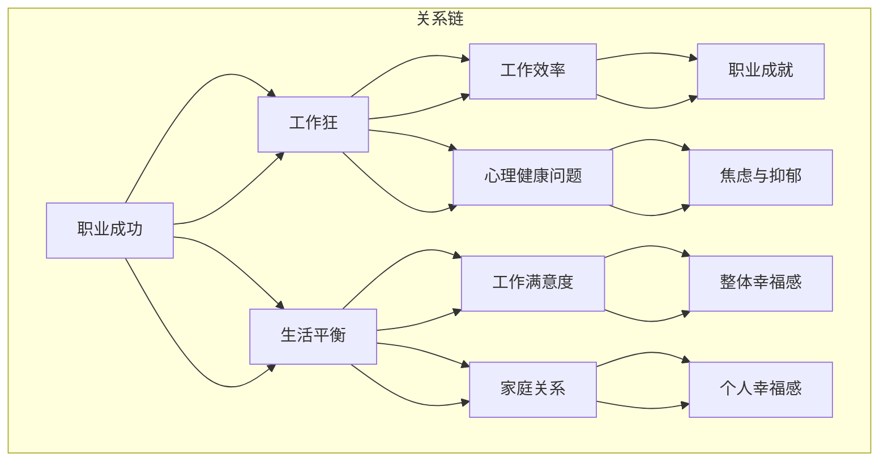

                 

### 1.1 问题背景

在当今社会，快节奏的生活方式和高度竞争的工作环境使得许多人成为“工作狂”。他们为了追求职业成功，不惜牺牲个人生活和健康。然而，这种过度专注工作的现象带来的负面影响逐渐显现。工作与个人生活的冲突成为许多职场人士面临的严峻挑战。为了解决这一问题，我们需要重新审视职业成功的定义，并建立健康的生活方式。

首先，现代社会的快节奏生活使人们面临越来越多的压力。在信息技术、金融、医疗等高竞争行业，加班、熬夜成为常态。这种高强度的工作状态不仅影响了员工的身心健康，还可能导致家庭关系紧张，个人幸福感下降。因此，如何在工作与个人生活之间找到平衡点，成为每个职场人士都需要认真思考的问题。

其次，工作狂现象的普遍存在，揭示了现代社会对职业成功的传统观念。长期以来，人们普遍认为，职业成功与高薪资、高职位、高成就密不可分。然而，这种观念忽略了工作与生活的平衡，导致许多人在追求职业成功的道路上，忽视了个人幸福和健康。这种单一的追求方式，不仅无法带来长久的幸福，反而可能引发各种心理和生理问题。

因此，我们需要重新定义职业成功的内涵，强调个人成长、工作满意度以及工作与生活的平衡。这不仅有助于提高员工的幸福感和工作积极性，也有助于企业的长远发展。在本文中，我们将通过一系列的分析和实例，探讨如何实现从工作狂到生活平衡的转型，重新定义职业成功和个人幸福。

### 1.2 问题描述

工作狂现象是指那些过度专注于工作，将大量时间和精力投入职业发展，而忽视个人生活和其他方面需求的人群。他们通常表现出以下特征：

1. **工作时间过长**：工作狂往往会牺牲个人休息时间，长时间工作，甚至在周末和节假日也坚持工作。
2. **缺乏休息和娱乐**：他们很少进行娱乐活动，忽视与家人、朋友的交流，导致社交关系紧张。
3. **忽视健康**：长时间工作导致身体疲劳，缺乏运动和健康饮食，进而引发各种健康问题。
4. **心理健康问题**：工作压力过大可能引发焦虑、抑郁等心理问题，影响个人的情绪状态和生活质量。

这些特征不仅对个人健康和生活质量产生负面影响，还可能导致工作效率下降，家庭关系破裂，甚至产生职业倦怠。长期处于工作狂状态的人群，往往难以在职业和个人生活之间找到平衡，陷入不断追求职业成功的恶性循环。

职业成功与个人幸福的平衡问题体现在以下几个方面：

1. **职业成就与个人幸福感的关系**：传统观念认为，职业成功是个人幸福的基石。然而，过度追求职业成就可能导致个人幸福感的下降。研究表明，工作满意度、工作与生活的平衡、个人成就感等因素对个人幸福感有显著影响。

2. **工作压力与身心健康**：长时间的工作和高压环境可能导致身体疲劳、失眠、焦虑等健康问题。长期处于这种状态，不仅影响个人的生活质量，还可能导致工作效率的下降，甚至影响职业生涯的发展。

3. **家庭与个人生活的冲突**：工作狂往往忽视了与家人和朋友的交流，导致家庭关系紧张，个人生活质量下降。这种冲突不仅影响个人的心理健康，还可能对下一代的教育和成长产生负面影响。

4. **职业发展中的机会与挑战**：在追求职业成功的过程中，工作狂可能面临各种机遇和挑战。如何在保持职业发展的同时，实现个人生活与工作的平衡，是每个职场人士都需要面对的问题。

因此，重新定义职业成功，强调工作与生活的平衡，不仅有助于提高个人幸福感，也有助于企业的长远发展。本文将探讨如何实现这一目标，并提供具体的策略和实践方法。

### 1.3 问题解决

要解决工作狂现象及其带来的负面影响，我们需要从重新定义职业成功的内涵和建立健康的生活方式两个方面入手。

首先，重新定义职业成功。传统的职业成功观念侧重于成就和财富，而忽略了个人成长和幸福。现代观念认为，职业成功不仅仅是职位晋升和薪资增加，更重要的是工作满意度、个人成就感以及工作与生活的平衡。具体来说：

1. **个人成长**：职业成功不仅仅在于工作表现，更在于个人在职业生涯中的成长和进步。这包括技能的提升、知识面的扩展以及个人素质的提高。

2. **工作满意度**：工作满意度是指员工对工作的总体满意程度。提高工作满意度可以通过改善工作环境、提供更多发展机会、建立良好的企业文化等方式实现。

3. **工作与生活的平衡**：工作与生活的平衡意味着在工作时间和生活时间之间找到合适的比例，确保两者都能得到充分的关注。这不仅有助于提高个人幸福感，也有助于保持良好的工作状态。

其次，建立健康的生活方式。健康的生活方式不仅包括身体上的健康，还包括心理上的健康。以下是一些具体的建议：

1. **工作时间管理**：制定合理的工作计划，避免工作时间的无限延长。通过设置明确的任务和时间表，提高工作效率，确保工作与个人生活之间的平衡。

2. **个人时间管理**：增加休息和娱乐时间，保持健康的生活习惯。例如，定期锻炼、保持良好的饮食习惯、确保充足的睡眠等。

3. **心理健康**：应对工作压力，保持积极的心态。可以通过心理辅导、冥想、瑜伽等方式缓解压力，提高心理 resilience（抗压力）。

4. **家庭关系**：保持与家人和朋友的交流，建立和维护良好的社交关系。这不仅有助于缓解工作压力，还能提高个人幸福感。

最后，管理层在企业中扮演着重要的角色。为了促进员工的工作与生活平衡，管理层可以采取以下措施：

1. **提供灵活的工作安排**：例如，远程办公、弹性工作时间等，以满足员工的不同需求。

2. **鼓励员工追求个人生活**：通过设立奖励机制，鼓励员工在工作之余，投入更多时间和精力到个人生活中。

3. **建立支持工作与生活平衡的企业文化**：通过宣传和培训，提高员工对工作与生活平衡的认识，并在企业内部营造支持这一理念的氛围。

通过重新定义职业成功的内涵和建立健康的生活方式，我们可以实现工作与生活的平衡，从而提高个人幸福感和工作积极性。这不仅有助于员工个人的全面发展，也有利于企业的长远发展。在接下来的章节中，我们将进一步探讨如何实现这一目标的具体策略和实践方法。

### 1.4 边界与外延

在工作与生活的平衡中，我们不仅要关注工作时间的合理安排，还要明确其边界与外延，以实现真正的职业成功和个人幸福。以下是对边界与外延的详细探讨：

首先，**工作与生活的平衡**是指在工作和个人生活之间找到一种和谐的关系，使两者都能得到适当的关注和发展。这种平衡不仅仅是时间上的分配，更是一种心理上的平衡，即在工作时能集中精力，而在休息时能完全放松。为了实现这种平衡，以下是一些关键点：

1. **明确工作边界**：设定明确的工作时间和休息时间，避免工作时间的无限延长。这可以通过制定工作计划和时间表来实现，确保工作有始有终，不会侵占个人时间。

2. **管理工作优先级**：在工作中，识别并处理最重要的任务，避免琐碎事务占用大量时间。通过优先级管理，可以确保工作的高效和有序。

3. **灵活应对变化**：工作环境和需求随时可能发生变化，因此需要具备灵活应对的能力。这包括适应不同的工作任务、调整工作节奏以及应对突发事件。

其次，**职业发展中的挑战与机遇**是工作与生活平衡的重要组成部分。在职业发展过程中，平衡工作与生活不仅是个人责任，也是企业支持的重要目标。以下是一些职业发展中的挑战与机遇：

1. **职业发展的挑战**：职业发展过程中，可能会遇到工作压力、职位晋升、项目管理等挑战。这些挑战要求员工具备良好的时间管理能力、沟通能力和解决问题的能力。同时，还需要具备应对工作与生活冲突的韧性。

2. **职业发展的机遇**：随着工作经验的增加，员工可能会获得更多的职业发展机会，如项目负责、团队领导等。这些机遇不仅能够提升个人能力，还有助于实现工作与生活的平衡。例如，通过有效的项目管理，可以更好地平衡工作与个人生活。

为了应对这些挑战与机遇，以下是一些策略：

1. **建立职业发展计划**：明确个人的职业目标，制定可行的职业发展计划，并定期评估和调整。

2. **持续学习和提升**：通过不断学习和提升，增强个人能力，以应对职业发展中的各种挑战。

3. **寻求支持和帮助**：在企业中，管理层和同事的支持对于应对职业挑战至关重要。通过建立良好的人际关系网络，可以获得必要的支持和帮助。

最后，**实现工作与生活平衡**不仅需要个人的努力，还需要企业文化的支持。以下是一些企业可以采取的措施：

1. **提供灵活的工作安排**：如远程办公、弹性工作时间等，以满足员工的不同需求。

2. **建立健康的企业文化**：鼓励员工追求个人生活，并通过奖励机制激发员工的工作积极性。

3. **关注员工福利**：提供完善的员工福利，如健康保险、培训机会等，以提升员工的生活质量。

通过明确工作与生活的边界与外延，以及应对职业发展中的挑战与机遇，我们可以更好地实现工作与生活的平衡，从而提高个人幸福感和职业成就感。这不仅有助于员工的个人发展，也有利于企业的长远繁荣。在接下来的章节中，我们将进一步探讨如何通过具体策略和实践方法，实现这一目标。

### 2.1 核心概念

在本节中，我们将介绍“工作狂”和“生活平衡”这两个核心概念，并详细描述其定义、特征以及二者之间的关系。

#### 工作狂

**定义**：工作狂是指那些对工作高度专注，愿意牺牲个人生活和其他方面需求，以实现职业目标的人群。他们通常表现出强烈的工作动机和长时间的工作习惯。

**特征**：

1. **长时间工作**：工作狂倾向于长时间工作，甚至牺牲休息和娱乐时间。
2. **缺乏休息和娱乐**：他们很少参与娱乐活动，忽视与家人、朋友的交流。
3. **工作至上**：工作狂将工作视为生活的核心，忽视了其他生活领域的重要性。
4. **工作成就感驱动**：他们的成就感主要来源于工作表现和职业成就。

**影响**：

1. **身体健康问题**：长时间的工作可能导致身体疲劳、健康问题，如失眠、高血压等。
2. **心理健康问题**：工作压力过大可能引发焦虑、抑郁等心理问题。
3. **家庭关系紧张**：忽视家庭生活和社交活动可能导致家庭关系紧张。

#### 生活平衡

**定义**：生活平衡是指在工作与个人生活之间找到合适的平衡点，确保两者都能得到充分的发展。它不仅仅是时间上的分配，更是一种心理上的和谐。

**特征**：

1. **工作与休息相结合**：工作狂注重工作，但生活平衡强调在工作与休息之间找到合适的比例。
2. **多样化的生活**：生活平衡鼓励参与多种活动，如娱乐、家庭、社交等。
3. **个人成长**：生活平衡关注个人成长，包括职业技能、健康、心理等。
4. **整体幸福感**：生活平衡旨在提高整体幸福感，而不仅仅是职业成就。

**影响**：

1. **提高工作效率**：通过合理的休息和娱乐，可以更好地恢复精力，提高工作效率。
2. **增强心理健康**：合理的压力管理和放松活动有助于缓解焦虑和抑郁。
3. **家庭和社交关系的改善**：充足的休息时间和参与家庭、社交活动有助于改善人际关系。

#### 关系

**工作狂与生活平衡的关系**：

1. **互为补充**：工作狂注重职业成就，但可能忽视个人生活；生活平衡则强调在工作与个人生活之间找到平衡，以实现整体幸福感。
2. **相互影响**：工作狂的状态可能影响生活平衡，反之亦然。良好的生活平衡有助于提高工作满意度，减少职业倦怠，从而改善工作狂现象。
3. **动态调整**：随着工作环境和个人需求的变化，工作狂和生活平衡需要不断调整和优化。这种动态调整是实现长期平衡的关键。

通过理解工作狂和生活平衡的定义、特征以及它们之间的关系，我们可以更好地认识到工作与生活平衡的重要性，并为实现这一目标制定具体的策略和实践方法。在接下来的章节中，我们将进一步探讨如何实现工作与生活的平衡，以及其在职业成功和个人幸福中的重要作用。

### 2.2 概念属性特征对比表

在探讨“工作狂”与“生活平衡”这两个核心概念时，通过对比它们的属性特征，可以帮助我们更清晰地理解二者的区别与联系。以下是一个详细的对比表格，列出这两个概念的定义、特征以及它们对社会和个人生活的影响。

| 概念 | 定义 | 特征 | 社会影响 | 个人生活影响 |
|------|-----|-----|--------|------------|
| 工作狂 | 对工作高度专注，牺牲个人生活 | 工作时间过长，缺乏休息和娱乐 | 社会上形成加班文化，员工心理健康问题增多 | 个人生活质量下降，家庭关系紧张，心理健康问题加剧 |
| 生活平衡 | 在工作与个人生活之间找到平衡点 | 工作与休息相结合，多样化的生活 | 鼓励健康的生活方式，减少职业倦怠 | 提高工作效率，增强心理健康，改善家庭关系 |

通过上述对比表格，我们可以看到工作狂与生活平衡在多个维度上的差异。工作狂注重职业成就，忽视个人生活的需求，导致社会上的加班文化和心理健康问题；而生活平衡则强调工作与休息的平衡，通过多样化的生活提高个人幸福感和工作效率。这种对比有助于我们深入理解两个概念的本质特征，并为实现工作与生活的平衡提供指导。

### 2.3 ER实体关系图

为了更清晰地展示“工作狂”与“生活平衡”这两个概念之间的关系，我们可以使用ER（实体-关系）图来描述。以下是一个简化的ER图，用于说明这两个概念在职业成功和个人幸福中的交互作用。

在这个ER图中：

- **A（职业成功）**：表示职业成功是工作狂和生活平衡的共同目标。
- **B（工作狂）**：表示工作狂通过长时间工作和牺牲个人生活来实现职业成功，但可能导致心理健康问题和工作效率下降。
- **C（生活平衡）**：表示生活平衡通过平衡工作和个人生活，提高工作满意度和家庭关系，从而促进整体幸福感和职业成就。
- **D（工作效率）**：表示工作效率是工作狂和生活平衡的重要衡量标准。
- **E（心理健康问题）**：表示工作狂可能导致焦虑和抑郁等心理健康问题。
- **F（工作满意度）**：表示工作满意度是生活平衡的重要目标之一。
- **G（家庭关系）**：表示家庭关系是生活平衡的重要组成部分。
- **H（职业成就）**：表示职业成就是工作狂和生活平衡的共同目标。
- **I（焦虑与抑郁）**：表示心理健康问题对生活平衡的负面影响。
- **J（整体幸福感）**：表示整体幸福感是生活平衡的重要成果。
- **K（个人幸福感）**：表示个人幸福感是生活平衡的直接体现。

通过这个ER图，我们可以直观地看到工作狂和生活平衡之间的关系以及它们在职业成功和个人幸福中的角色。这种结构化的描述有助于我们深入理解这两个概念，并为实现工作与生活的平衡提供理论基础。

### 3.1 职业成功的传统观念

在传统观念中，职业成功往往被定义为一系列外在成就的集合，这些成就主要体现在以下几个方面：

**成就导向**：传统的职业成功观念强调个人在职业生涯中取得的成就，如职位晋升、薪资水平、业绩指标等。这种观念认为，一个人的职业价值主要体现在他在组织中的地位和贡献上。因此，许多人为了追求这些成就，愿意付出大量的时间和精力，甚至不惜牺牲个人生活。

**薪资待遇**：薪资水平是衡量职业成功的一个重要指标。在传统观念中，高薪资被认为是职业成功的象征。人们往往通过薪资水平来评价一个人的职业成就，从而激励他们在工作中不断努力，追求更高的薪资待遇。

**职位晋升**：职位晋升是职业成功的重要标志。在组织中，职位越高，通常意味着个人能力越强、贡献越大。因此，许多人将职位晋升视为职业成功的重要目标，通过不断提高自己的能力和业绩，争取晋升的机会。

然而，这种传统观念在现代社会中逐渐受到质疑。尽管这些外在成就能够在一定程度上体现个人的职业价值，但它们往往忽视了工作本身带来的内在满足感和个人的幸福感。在追求这些外在成就的过程中，许多人陷入了“工作狂”的状态，导致身心健康问题、家庭关系紧张，甚至影响长期职业生涯的发展。

为了更全面地理解职业成功，我们需要从传统观念中走出来，探索现代观念对职业成功的重新定义。这种新的定义将更加注重个人成长、工作满意度和工作与生活的平衡，从而实现真正的职业成功和个人幸福。

### 3.2 职业成功的现代观念

随着社会的进步和人们价值观的转变，职业成功的现代观念逐渐形成，并强调个人成长、工作满意度和工作与生活的平衡。这种新的观念不仅仅关注外在成就，更注重内在满足和整体幸福感。

**个人成长**：在现代观念中，职业成功不再仅仅是一个人职位的高低或者薪资的多少，而是个人在职业生涯中的持续成长和进步。这包括技能的提升、知识面的扩展、人际交往能力的增强以及个人素质的提高。个人成长是职业成功的核心，它不仅能够提升个人的职业竞争力，还能带来内在的满足感和成就感。

**工作满意度**：工作满意度是指员工对工作的总体满意程度。现代观念认为，一个成功的职业不仅仅是外在的成就，更重要的是工作本身的满意度。这涉及到工作环境、同事关系、工作内容、晋升机会等多个方面。当员工对自己的工作感到满意时，他们会更加投入，工作效率也会相应提高。因此，提升工作满意度是职业成功的重要组成部分。

**工作与生活的平衡**：现代观念强调，职业成功不仅仅是工作本身的成功，还与个人的整体生活紧密相关。工作与生活的平衡意味着在工作时间和个人时间之间找到合适的比例，确保两者都能得到充分的关注和发展。这种平衡不仅有助于提高个人幸福感，还能促进工作的高效和有序。

**整体幸福感**：职业成功的现代观念强调，职业成就只是整体幸福感的一部分。一个成功的职业生涯应该能够带来整体的幸福感，包括身心健康、家庭关系、个人成长等多个方面。当一个人的职业能够与他的生活其他方面协调一致时，他才能够体验到真正的幸福和满足。

这些现代观念与传统观念有显著区别。传统观念侧重于外在成就和物质回报，而现代观念更加关注内在成长和整体幸福感。这种转变反映了人们对职业和生活质量的更高要求，也促使企业在管理和激励机制上进行变革，以更好地适应现代员工的期望和需求。

通过重新定义职业成功，我们可以更加全面和深入地理解职业发展的意义，从而实现真正的职业成功和个人幸福。

### 3.3 职业成功与个人幸福的联系

职业成功和个人幸福之间存在着密切的联系，二者相辅相成，共同构成了一个人职业生涯的完整画卷。以下是详细探讨这两种关系及其相互影响的步骤。

**步骤一：职业成就对个人幸福的影响**

1. **正面影响**：职业成就在一定程度上能够提升个人的幸福感。当一个人在职业生涯中取得显著成就，如晋升、获得重要项目或者被认可时，会感受到成就感和自豪感，这些正面的情感体验有助于提升个人的幸福指数。此外，职业成就还可能带来经济上的回报，如更高的薪资、更好的福利待遇等，从而改善个人的生活质量。

2. **负面影响**：然而，如果一个人过度追求职业成就，忽视个人幸福，可能会导致一系列负面后果。例如，长时间的工作和高压环境可能导致身心健康问题，如焦虑、抑郁、失眠等。这些健康问题会直接影响个人的幸福感和生活质量，甚至可能对职业生涯产生负面影响，因为身心健康是高效工作的重要基础。

**步骤二：个人幸福对职业成就的促进作用**

1. **正面影响**：个人幸福能够显著促进职业成就。一个幸福的人通常拥有积极的心态和良好的心理状态，这使得他们在工作中更加专注和高效。幸福感还能带来更高的工作满意度，激励员工更加投入工作，从而提高工作效率和质量。此外，幸福的人通常拥有更好的社交关系，这有助于他们在职场中建立良好的人际网络，获得更多的职业机会。

2. **负面影响**：相反，如果一个人缺乏幸福感，可能会在职业中表现出消极情绪和行为。例如，情绪低落、缺乏动力、工作效率下降等。这些问题不仅会影响个人的职业发展，还可能影响团队的整体表现，从而对企业的长远发展产生不利影响。

**步骤三：平衡职业成功与个人幸福**

1. **寻找平衡点**：为了实现职业成功与个人幸福的平衡，个体需要找到适合自己的工作与生活节奏。这可以通过合理规划工作时间、确保充足的休息和娱乐时间、培养健康的生活习惯等方式实现。例如，通过设定明确的工作目标和时间表，确保工作的高效完成，从而为个人生活留出更多的时间和空间。

2. **心理调适**：通过心理调适和自我管理，个体可以更好地应对工作中的压力和挑战。例如，通过冥想、瑜伽、心理咨询等方式缓解压力，保持良好的心理状态。此外，培养良好的情绪管理能力，学会积极应对负面情绪，也是实现工作与生活平衡的重要一环。

3. **企业支持**：企业可以通过提供灵活的工作安排、健康的工作环境、完善的福利制度等措施，支持员工实现工作与生活的平衡。例如，提供远程办公、弹性工作时间、健康保险等福利，有助于减轻员工的工作压力，提高他们的幸福感。

通过上述步骤，我们可以更好地理解职业成功与个人幸福之间的联系及其相互影响。实现二者的平衡不仅有助于提高个人的生活质量和工作效率，也有利于企业的长远发展。在接下来的章节中，我们将进一步探讨如何通过具体策略和实践方法，实现这一目标。

### 4.1 工作时间管理

在工作与生活的平衡中，合理的工作时间管理至关重要。以下是几个关键步骤，帮助职场人士优化工作时间，提高工作效率。

**第一步：设定明确的工作目标**

为了高效利用工作时间，首先需要设定明确的工作目标。这可以通过以下步骤实现：

1. **分解任务**：将大任务分解成小任务，明确每个任务的优先级和完成时间。
2. **制定计划**：根据任务的优先级，制定详细的工作计划，包括每日、每周和每月的工作目标。
3. **设定期限**：为每个任务设定明确的完成期限，以确保工作进度可控。

**第二步：使用时间管理工具**

利用时间管理工具，如日程表、任务管理软件、时间追踪器等，有助于更好地规划和管理工作时间。以下是一些常用的工具：

1. **日程表**：使用电子或纸质日程表记录每日、每周和每月的工作安排，确保不会遗漏重要任务。
2. **任务管理软件**：例如Trello、Asana等，可以创建任务列表、设置优先级和提醒，帮助团队协作和管理项目进度。
3. **时间追踪器**：如RescueTime、Focus@Will等，可以监控和记录工作时间，分析工作效率，帮助调整工作节奏。

**第三步：避免工作时间的无限延长**

长时间工作不仅会影响工作效率，还可能对身体健康和心理健康产生负面影响。以下是一些策略，帮助避免工作时间的无限延长：

1. **设定工作时间**：每天设定固定的工作时间，包括工作时间、休息时间和下班时间。确保在工作时间内外，都有明确的界限。
2. **定期休息**：每隔一段时间，进行短暂的休息，如站立休息、深呼吸、伸展运动等，以缓解身体和心理的压力。
3. **避免加班文化**：鼓励员工在规定的工作时间内完成任务，避免无限制的加班。通过优化工作流程和提高工作效率，减少加班的需要。

**第四步：灵活调整工作时间**

为了更好地平衡工作与生活，可以根据个人需求和团队情况，灵活调整工作时间。以下是一些灵活工作时间的建议：

1. **弹性工作时间**：允许员工在规定的工作时间内，根据自己的需求灵活安排工作，如早上提前到岗、下午晚下班等。
2. **远程办公**：在条件允许的情况下，提供远程办公的选项，使员工能够在家或任何地方工作，提高工作效率和灵活性。
3. **轮班制度**：对于需要24小时工作支持的岗位，可以实施轮班制度，确保员工有足够的时间休息和恢复。

通过以上步骤，职场人士可以更有效地管理工作时间，提高工作效率，同时确保个人生活的质量。这不仅有助于实现工作与生活的平衡，也有助于提升个人的职业成就和幸福感。

### 4.2 个人时间管理

在追求工作与生活的平衡过程中，个人时间管理显得尤为重要。以下是几个关键步骤，帮助职场人士优化个人时间，提高生活质量。

**第一步：明确时间管理目标**

要优化个人时间管理，首先需要明确目标。以下步骤可以帮助设定合理的目标：

1. **自我评估**：评估当前的时间使用情况，包括工作、休闲、家庭等各个方面，找出时间浪费的主要环节。
2. **制定计划**：根据评估结果，制定具体的时间管理计划。包括设定每日、每周、每月的时间目标和任务安排。
3. **设定优先级**：明确任务的重要性和紧急性，优先处理重要且紧急的任务，避免时间浪费在次要任务上。

**第二步：使用时间管理工具**

利用时间管理工具，可以更有效地规划和追踪时间使用情况。以下是一些实用的工具：

1. **日程表**：使用电子或纸质日程表记录每日、每周和每月的活动安排，确保不会遗漏重要事件。
2. **任务管理软件**：如Trello、Asana等，可以帮助创建任务列表、分配任务、跟踪进度，提高团队协作效率。
3. **时间追踪器**：如RescueTime、Toggl等，可以监控和记录工作时间的使用情况，分析工作效率，帮助调整时间分配。

**第三步：合理分配时间**

合理分配时间，确保工作、休息、娱乐和家庭生活都能得到充分的关注。以下是一些建议：

1. **工作与休息相结合**：确保工作时间内高效完成任务，并设定休息时间，如短暂休息、锻炼或与家人朋友交流。
2. **休息与娱乐**：在工作日中，定期安排休息和娱乐时间，如阅读、运动、看电影等，以缓解工作压力，提升生活质量。
3. **家庭时间**：确保每天都有时间与家人相处，如共进晚餐、陪伴孩子等，增强家庭关系。

**第四步：灵活调整时间**

根据个人需求和实际情况，灵活调整时间分配。以下是一些建议：

1. **弹性工作时间**：与雇主沟通，争取弹性工作时间，如早上提前到岗、下午晚下班等，以适应个人生活需求。
2. **远程办公**：在条件允许的情况下，尝试远程办公，使工作地点更灵活，节省通勤时间。
3. **轮班制度**：对于需要轮班的工作，合理安排轮班时间，确保员工有足够的休息时间。

通过以上步骤，职场人士可以更科学地管理个人时间，提高生活质量，实现工作与生活的平衡。这不仅有助于提升个人幸福感，也有利于长期职业生涯的发展。

### 4.3 心理健康

在实现工作与生活的平衡过程中，心理健康扮演着至关重要的角色。以下是一些策略，帮助职场人士应对工作压力，保持积极的心态。

**第一步：认识压力源**

要有效应对工作压力，首先需要识别压力源。职场人士可以从以下几个方面着手：

1. **工作负荷**：评估当前的工作负荷是否合理，是否超过了个人的承受能力。
2. **人际关系**：分析工作中的冲突和矛盾，特别是与同事、上级或下属的关系。
3. **工作环境**：考虑工作环境的因素，如工作条件、企业文化等，是否对心理健康有负面影响。

**第二步：制定压力管理策略**

一旦明确了压力源，接下来是制定具体的压力管理策略：

1. **时间管理**：通过合理规划工作时间，避免过度加班，确保有足够的休息和放松时间。
2. **任务分解**：将大任务分解成小任务，逐步完成，减轻单次工作压力。
3. **优先级设定**：明确任务的优先级，集中精力处理重要且紧急的任务，避免因琐事而分散注意力。

**第三步：心理调适方法**

以下是一些有效的心理调适方法，帮助职场人士缓解压力：

1. **冥想**：通过冥想练习，放松身心，减少焦虑和压力。每天花几分钟进行冥想，有助于提升心理韧性。
2. **运动**：定期进行有氧运动，如跑步、游泳、瑜伽等，有助于释放压力，提高心情。
3. **心理咨询**：如果压力过大，可以寻求专业心理咨询师的帮助，通过谈话和指导，找到解决问题的方法。

**第四步：保持积极心态**

保持积极的心态对心理健康至关重要。以下是一些建议：

1. **正面思考**：培养积极的思维方式，将挑战视为成长的机会，而不是负担。
2. **感恩练习**：每天花时间反思并感谢生活中的美好事物，这有助于提升幸福感。
3. **自我激励**：设定小目标，并在达成后给予自己奖励，以保持动力和积极性。

通过上述策略，职场人士可以更好地应对工作压力，保持心理健康，实现工作与生活的平衡。这不仅有助于提升个人幸福感，也有利于长期职业生涯的发展。

### 5.1 管理层的角色与责任

在促进员工的工作与生活平衡中，管理层扮演着至关重要的角色。以下从提供灵活的工作安排、员工激励与反馈以及企业文化建设三个方面，探讨管理层如何发挥重要作用。

**1. 提供灵活的工作安排**

为了帮助员工实现工作与生活的平衡，管理层可以采取以下灵活的工作安排措施：

1. **弹性工作时间**：允许员工在规定的工作时间内自主安排工作，如早上提前到岗、下午晚下班等。这种安排有助于员工根据个人需求调整工作节奏，减少通勤时间，从而有更多时间照顾家庭和个人生活。

2. **远程办公**：在条件允许的情况下，推行远程办公政策。这不仅有助于减轻员工的通勤压力，还能提高工作效率。通过使用视频会议、协作工具等，远程办公可以确保团队协作和沟通的顺畅。

3. **调休制度**：为员工提供调休制度，如带薪休假、年假等，使员工能够在工作之余，有充足的时间进行休息和放松。

**2. 员工激励与反馈**

激励和反馈是促进员工工作与生活平衡的重要手段。以下是一些具体措施：

1. **绩效考核**：制定合理的绩效考核标准，鼓励员工在完成工作任务的同时，注重个人成长和生活质量。通过绩效考核，给予优秀员工适当的奖励和晋升机会，从而激励员工不断提升自我。

2. **奖励机制**：设立各种奖励机制，如优秀员工表彰、团队建设活动等，使员工感受到企业的关怀和认可。这些奖励不仅能够提高员工的积极性，还能增强团队的凝聚力。

3. **反馈与沟通**：定期与员工进行沟通和反馈，了解他们在工作和生活中的需求和困难，提供必要的支持和帮助。通过有效的沟通，管理层可以及时发现问题，并采取相应的措施，促进员工的工作与生活平衡。

**3. 企业文化建设**

企业文化的建设对于员工的工作与生活平衡具有深远影响。以下是一些关键点：

1. **倡导健康工作观念**：通过内部宣传和培训，倡导健康的工作观念，强调工作与生活的平衡对个人和企业的重要性。鼓励员工在工作时全力以赴，但在休息时间充分放松，享受生活。

2. **营造支持性环境**：建立支持性工作环境，如提供健康饮食、健身设施等，使员工在工作场所能够保持身心健康。此外，提供心理咨询和健康管理等服务，帮助员工应对工作压力，提高心理健康水平。

3. **关注员工福利**：关注员工的福利需求，提供全面的员工福利，如健康保险、培训机会、家庭支持计划等。这些福利措施不仅能提高员工的生活质量，还能增强员工对企业的归属感和忠诚度。

通过以上措施，管理层可以有效地促进员工的工作与生活平衡，提高员工的工作满意度和幸福感，从而实现企业的长远发展。在接下来的章节中，我们将通过具体的实践案例，进一步探讨如何在实际工作中实现这一目标。

### 5.2 员工激励与反馈

为了确保员工在工作与生活之间找到平衡，管理层的激励与反馈机制至关重要。以下是一些具体的策略和方法，帮助管理层有效地激励员工并给予及时反馈。

**1. 设定明确的绩效目标和期望**

管理层应当与员工共同设定明确的绩效目标和期望。这些目标不仅要与公司的整体战略相一致，还要考虑到员工的个人发展需求。通过设定明确的绩效指标，管理层可以更准确地评估员工的工作表现，并为员工提供有针对性的反馈。

**2. 多样化的激励措施**

不同的员工有不同的激励需求，因此，管理层应该采取多样化的激励措施，以适应不同员工的偏好。以下是一些常见的激励措施：

- **奖励和奖金**：根据员工的工作表现和贡献，提供奖励和奖金。这些奖励可以包括现金奖励、股票期权、奖金等形式。
- **职业发展机会**：提供职业发展机会，如培训、进修、轮岗等，帮助员工不断提升自身能力和职业素养。
- **认可与表彰**：定期对表现出色的员工进行认可和表彰，如举办年度优秀员工评选、颁发荣誉证书等，以增强员工的荣誉感和归属感。
- **工作环境改善**：改善工作环境，如提供舒适的办公空间、配备先进的办公设备等，以提高员工的工作体验。

**3. 定期进行绩效反馈**

有效的绩效反馈是激励员工的关键。以下是一些关键的反馈步骤：

- **即时反馈**：在员工表现优异或需要改进时，及时给予反馈。这样可以帮助员工迅速纠正错误或保持良好的工作状态。
- **定期反馈**：定期进行绩效评估，如季度评估、年度评估等，与员工详细讨论他们的工作表现和未来发展方向。
- **建设性反馈**：提供建设性的反馈，不仅要指出问题，还要提供具体的改进建议和资源支持，帮助员工不断提升。

**4. 强化员工参与感和责任感**

通过增强员工的参与感和责任感，可以激发他们的工作热情和创造力。以下是一些方法：

- **项目参与**：让员工参与到重要的项目中，使他们感受到自己的价值和重要性。
- **团队协作**：鼓励团队合作，通过团队活动、团队建设等，增强员工的团队意识和归属感。
- **决策参与**：让员工参与决策过程，如部门预算、项目规划等，提高他们的参与感和责任感。

**5. 关注员工心理健康**

工作压力和心理健康问题可能会影响员工的工作表现和生活质量。管理层应该关注员工的心理健康，提供必要的支持。以下是一些具体措施：

- **心理健康咨询**：为员工提供心理健康咨询服务，帮助他们应对压力和心理健康问题。
- **压力管理培训**：定期组织压力管理培训，教授员工应对压力的技巧和方法。
- **弹性工作安排**：提供灵活的工作安排，如弹性工作时间、远程办公等，帮助员工更好地平衡工作和生活。

通过上述激励与反馈机制，管理层可以有效地提高员工的工作满意度和幸福感，从而实现工作与生活的平衡，促进企业的长远发展。

### 5.3 倡导健康的工作生活观念

企业文化建设在促进员工工作与生活平衡中扮演着关键角色。以下是一些具体措施，帮助企业倡导健康的工作生活观念，并建立支持这一理念的企业文化。

**1. 建立明确的企业价值观**

企业应当明确其价值观，并将其贯穿于企业的各个层面。例如，将“健康生活、快乐工作”作为企业核心价值观之一，强调员工在工作中的身心健康和幸福感。这种价值观应该体现在企业的日常运营和决策中，成为全体员工的共同信念。

**2. 强化内部宣传**

通过内部宣传渠道，如企业内部网站、邮件、会议等，持续宣传健康的工作生活观念。具体可以包括：

- **成功案例分享**：分享那些在工作与生活之间取得良好平衡的员工的成功故事，激励其他员工效仿。
- **健康知识普及**：定期发布关于健康生活方式、心理健康、压力管理等方面的文章或视频，提高员工的认识和意识。
- **健康主题活动**：组织各种健康主题活动，如健身挑战、心理健康讲座等，鼓励员工参与，增强对健康生活的重视。

**3. 提供健康福利**

为了支持员工的健康生活方式，企业可以提供一系列健康福利：

- **健康体检**：定期为员工提供免费的健康体检，帮助员工及早发现潜在的健康问题。
- **健身房会员**：与健身房合作，为员工提供免费或优惠的健身房会员服务，鼓励员工锻炼身体。
- **心理健康服务**：提供专业的心理健康咨询服务，如心理咨询、心理测评等，帮助员工缓解工作压力，保持心理健康。

**4. 实施灵活的工作安排**

灵活的工作安排是支持员工工作与生活平衡的重要措施。企业可以：

- **弹性工作时间**：允许员工在规定的工作时间内自主安排工作，以适应个人生活需求。
- **远程办公**：在条件允许的情况下，推行远程办公政策，使员工能够在家或任何舒适的地方工作，提高工作效率和生活质量。
- **休假政策**：提供灵活的休假政策，如带薪休假、年假等，使员工能够在工作之余，有充足的时间休息和放松。

**5. 强化领导力培训**

企业的领导层应当认识到工作与生活平衡的重要性，并积极倡导和实践这一理念。通过领导力培训，帮助管理层了解如何支持员工的健康生活方式，并在实际工作中加以实施。具体可以包括：

- **领导力发展课程**：提供领导力发展课程，强调领导者在促进员工工作与生活平衡中的作用。
- **领导力实践**：通过领导力实践，如导师制、员工辅导等，帮助员工在工作与生活中遇到困难时提供支持和指导。
- **领导力反馈**：定期收集员工对管理层工作与生活平衡的支持程度的反馈，以持续改进和优化管理方式。

通过上述措施，企业可以建立支持工作与生活平衡的企业文化，帮助员工实现职业成功和个人幸福，从而促进企业的长远发展。

### 6.1 案例一：成功的工作与生活平衡

#### 案例背景

小明是一名软件工程师，就职于一家知名互联网公司。在过去的工作中，他一直以工作狂著称，每天加班到深夜，周末也经常在公司度过。虽然他的工作效率很高，项目完成得也非常出色，但他的身体状况和心理状态逐渐出现问题。长期的高强度工作让他感到疲惫不堪，家庭关系也开始紧张。

#### 实践方法

意识到问题的严重性后，小明开始尝试调整自己的工作和生活平衡。以下是他的具体实践方法：

1. **设定工作时间**：小明决定每天只工作8小时，不加班，并在周末完全休息，不再处理工作事务。

2. **时间管理**：他利用时间管理工具，如Trello和Google Calendar，制定每日、每周的工作计划，确保工作的高效完成。

3. **健康习惯**：他每天早上进行晨跑，保持健康的饮食习惯，保证充足的睡眠。

4. **家庭时间**：他每天晚上固定时间与家人共进晚餐，每周安排一次家庭活动，如看电影、散步等。

5. **心理调适**：他定期进行心理咨询，学习冥想和呼吸练习，以缓解压力，保持心理健康。

#### 成效评估

经过一段时间的实践，小明的身体状况和心理状态显著改善。以下是他实践后的成效评估：

1. **工作效率**：由于设定了明确的工作时间，小明在工作时间内更加专注，工作效率反而提高了。

2. **身体健康**：通过保持健康的生活习惯，小明的身体状况得到了显著改善，他不再感到疲劳，精力更加充沛。

3. **心理健康**：定期进行心理调适，使小明能够更好地应对工作中的压力，保持积极的心态。

4. **家庭关系**：通过增加与家人的互动时间，小明的家庭关系更加融洽，夫妻之间的沟通也变得更加顺畅。

#### 结论

通过小明的案例，我们可以看到，实现工作与生活平衡不仅有助于提高工作效率和身体健康，还能改善心理健康和家庭关系。对于职场人士来说，找到适合自己的工作与生活平衡点，是实现长期职业成功和个人幸福的关键。

### 6.2 案例二：工作狂的转型之路

#### 案例背景

李华是一名资深的技术经理，一直在科技行业中取得了显著的成就。然而，他的职业生涯却以高强度的工作压力为代价。每天加班到深夜，几乎没有个人时间，甚至长期熬夜导致身体健康严重受损。这种工作模式让李华感到疲惫不堪，家庭关系也日益紧张，但他始终认为这是职业成功的必要代价。

#### 转型过程

意识到问题的严重性后，李华开始思考如何从工作狂转型为平衡的工作者。以下是他的具体转型过程：

1. **重新审视职业目标**：李华首先重新审视了自己的职业目标，意识到职业成功不仅仅在于职位的高低，更在于工作与生活的平衡和个人幸福。

2. **设定合理的工作时间**：李华决定每天只工作8小时，不加班，确保有充足的休息时间。他还为自己设定了每周的工作计划，以确保工作的高效完成。

3. **优先级管理**：李华学会了优先处理重要且紧急的任务，将次要的任务交由团队成员完成，从而减少自己的工作负担。

4. **健康管理**：他开始注重身体健康，每天早晨进行锻炼，保持健康的饮食习惯，并定期进行体检。

5. **家庭时间**：李华与家人制定了每周的共同活动计划，如晚餐、周末短途旅行等，以增强家庭关系。

6. **心理调适**：他参加了心理辅导课程，学习如何应对工作压力，保持积极的心态。

#### 转型成效

经过一段时间的转型，李华的生活发生了显著变化。以下是他转型后的成效评估：

1. **工作效率**：由于设定了合理的工作时间，李华在工作时间内更加专注，工作效率得到了显著提高。

2. **身体健康**：通过保持健康的生活习惯，李华的身体状况得到了显著改善，他不再感到疲劳，精力更加充沛。

3. **心理健康**：通过心理调适，李华能够更好地应对工作中的压力，保持积极的心态，减少了焦虑和抑郁。

4. **家庭关系**：通过增加与家人的互动时间，李华的家庭关系更加融洽，夫妻之间的沟通也变得更加顺畅。

#### 结论

李华的转型案例表明，从工作狂到平衡工作者的转变是可行的，也是必要的。通过重新审视职业目标、设定合理的工作时间、优先级管理、健康管理、家庭时间管理和心理调适，职场人士可以实现工作与生活的平衡，提高工作效率和幸福感。这对个人的长期职业发展和整体幸福感都具有重要意义。

### 7.1 总结

通过本文的探讨，我们深入分析了从工作狂到生活平衡的转变对于重新定义职业成功和个人幸福的重要性。我们首先介绍了现代社会中工作狂现象的背景和特征，以及工作与生活平衡的重要性。接着，我们探讨了职业成功的传统观念与现代观念的区别，强调了个人成长、工作满意度和工作与生活的平衡对职业成功的重要性。通过具体的策略和实践方法，如工作时间管理、个人时间管理、心理健康维护等，我们展示了如何实现工作与生活的平衡。

工作与生活的平衡不仅有助于提高个人的幸福感，还能提高工作效率和职业成就。管理层在这一过程中扮演着关键角色，通过提供灵活的工作安排、激励和反馈机制，以及建立支持健康工作生活的企业文化，可以有效地促进员工的平衡。案例分析和实际应用进一步验证了这些方法的有效性。

未来，随着社会的发展和人们价值观的变化，工作与生活的平衡将越来越受到重视。我们呼吁更多的职场人士和管理者关注这一议题，通过持续的学习和实践，实现真正的职业成功和个人幸福。让我们共同努力，创造一个更加健康和谐的工作环境。

### 7.2 展望

随着科技的不断进步和人们价值观的演变，未来工作与生活平衡的趋势将呈现出以下几个方向：

**1. 灵活工作模式普及**

远程办公、弹性工作时间等灵活工作模式的普及，将使员工能够更好地平衡工作与个人生活。这种模式不仅提高了工作效率，还增强了员工的工作满意度和幸福感。企业将更加重视提供灵活的工作安排，以满足员工的不同需求。

**2. 心理健康重视程度提高**

心理健康将成为企业和员工关注的重要议题。随着对心理健康问题认识的深入，企业将更加重视员工的身心健康，提供心理咨询、健康管理等支持服务。员工也将更加注重心理调适，学会有效地应对工作压力，保持积极的心态。

**3. 家庭与工作融合**

未来，家庭与工作的融合将成为趋势。企业将更加鼓励员工在工作之余投入家庭生活，通过家庭活动、亲子时间等方式，增强家庭关系。这种融合不仅有助于提高个人幸福感，还能提升员工的整体工作效率。

**4. 全方位健康管理体系**

企业将建立更加完善的健康管理体系，包括身体健康、心理健康、生活习惯等多个方面。通过定期的健康体检、健康讲座、健身设施等，企业将致力于提升员工的健康水平，从而实现长期的工作与生活平衡。

**5. 新型职业成功观念**

随着社会的进步，职业成功的观念将发生根本性转变。人们将更加注重个人成长、工作满意度和工作与生活的平衡，而不仅仅追求外在的成就和物质回报。这种新型职业成功观念将有助于实现更加健康、可持续的职业发展。

**对读者的建议**

1. **重新审视职业目标**：思考自己的职业目标，是否真正符合自己的内心需求和生活理念。
2. **学会时间管理**：通过合理规划时间，提高工作效率，确保工作与个人生活的平衡。
3. **关注心理健康**：定期进行心理调适，学会应对工作压力，保持积极的心态。
4. **平衡工作与家庭**：在工作之余，投入家庭生活，维护良好的家庭关系。
5. **持续学习和成长**：不断学习新知识和技能，提升个人能力，实现职业和个人生活的双重进步。

通过以上建议，读者可以更好地实现工作与生活的平衡，追求真正的职业成功和个人幸福。希望本文能够为您的职业生涯提供有益的启示和指导。

