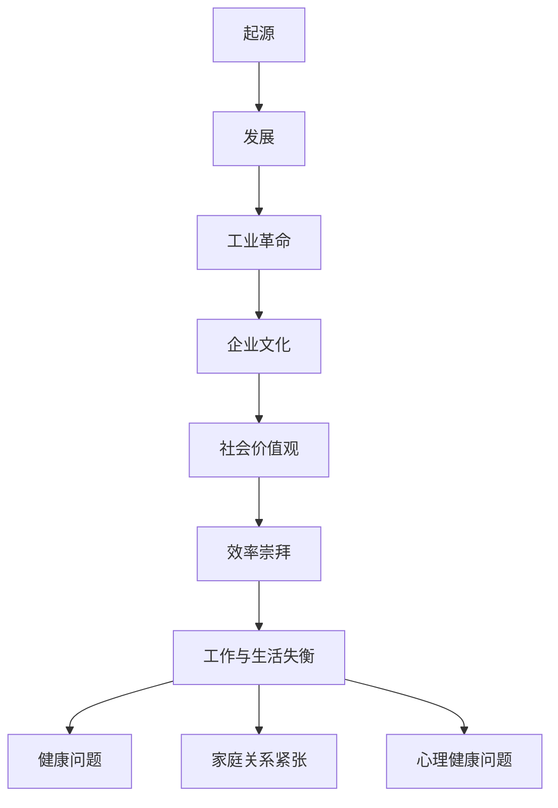
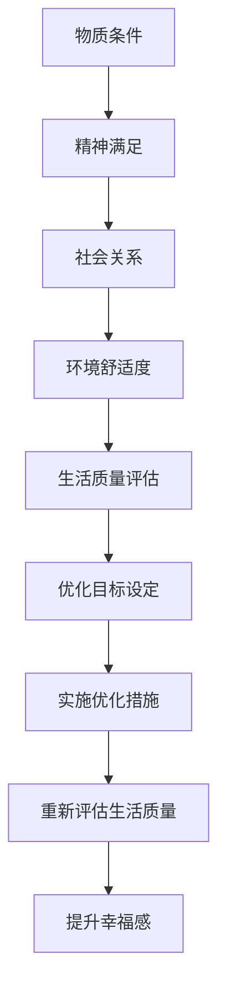
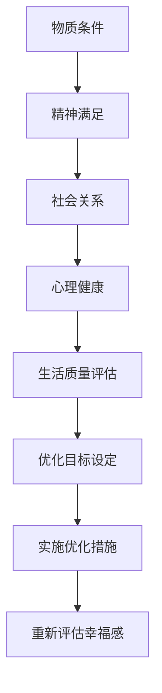
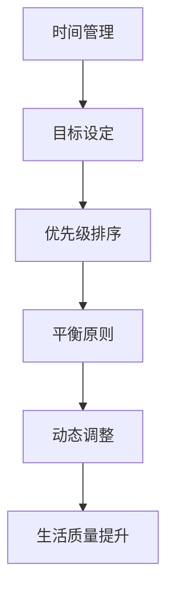

                 

## 引言

### 为什么要重新平衡工作与个人时间

在当今这个快速发展的数字化时代，人们对效率的追求似乎成为了一种社会性的狂热。无论是在职场中，还是在日常生活中，我们都不断地被灌输着“时间就是金钱”的理念。效率崇拜，作为这个时代的一个显著特征，正在深刻地影响着我们的工作和生活方式。

然而，随着效率崇拜的深入，我们也开始意识到，这种对效率的过度追求可能带来了一些负面的影响。比如，长时间的工作压力导致的健康问题，对个人生活品质的侵蚀，甚至是心理健康问题的增加。这些问题的累积，最终可能导致我们在追求效率的过程中，失去了生活中真正的价值。

因此，我们需要重新审视工作与个人时间的关系，寻求一种新的平衡。这种平衡不仅仅是减少工作时间，而是要让我们在有限的时间内，既能完成必要的工作任务，又能享受高质量的私人生活。本文将探讨如何从效率崇拜转向生活品质，实现工作与个人时间的重新平衡。

### 书籍目的

本文旨在帮助读者理解并实践工作与生活平衡的重要性。我们将从以下几个方面展开讨论：

1. **效率崇拜的社会背景**：介绍效率崇拜的起源与发展，分析现代社会对效率的追求及其影响。
2. **生活品质的概念与价值**：明确生活品质的定义，探讨生活品质对个人幸福的影响，以及工作与生活品质平衡的意义。
3. **工作与个人时间的平衡原理**：介绍工作与个人时间平衡的基本原理，分析平衡工作与个人时间的必要性。
4. **实现工作与生活平衡的方法**：提供具体的方法和策略，帮助读者实现工作与个人时间的平衡。
5. **案例分析**：通过具体的案例，分析如何在实际中实现工作与生活的平衡。
6. **最佳实践与总结**：总结书中提出的最佳实践，并对全书内容进行总结。

通过本文的讨论，我们希望能够引导读者重新思考工作与生活之间的关系，找到适合自己的平衡点，从而在提高工作效率的同时，也能享受更加充实和有意义的生活。

### 目录大纲设计思路

为了确保文章内容的逻辑性和连贯性，本文将采用结构化的目录大纲设计思路。这种设计思路不仅能帮助读者快速了解文章的主要内容，还能使得文章的内容安排更加有条理，便于读者循序渐进地阅读和理解。

#### 核心概念与章节安排

首先，我们需要确定本文的核心概念，即“效率崇拜”、“生活品质”以及“工作与个人时间的平衡”。这些核心概念将贯穿整个文章，成为每个章节的讨论基础。根据这些核心概念，我们将设计以下核心章节：

1. **效率崇拜的社会背景**
2. **生活品质的概念与价值**
3. **工作与个人时间的平衡原理**
4. **实现工作与生活平衡的方法**
5. **案例分析**
6. **最佳实践与总结**

#### 章节细化

在确定核心章节之后，我们需要对每个章节进行细化。以下是每个章节的细化内容：

**效率崇拜的社会背景**

- **1.1 效率崇拜的起源与发展**
  - 介绍效率崇拜的历史背景
  - 分析现代社会对效率的追求及其影响

- **1.2 效率崇拜带来的负面影响**
  - 描述过度追求效率可能带来的问题
  - 讨论这些问题如何影响个人生活品质

**生活品质的概念与价值**

- **2.1 生活品质的定义**
  - 明确生活品质的概念
  - 分析生活品质的重要性

- **2.2 生活品质的价值**
  - 探讨生活品质对个人幸福的影响
  - 分析工作与生活品质平衡的意义

**工作与个人时间的平衡原理**

- **3.1 工作与个人时间的平衡原理**
  - 介绍工作与个人时间平衡的基本原理
  - 分析平衡工作与个人时间的必要性

- **3.2 工作与个人时间的平衡方法**
  - 提供具体的方法和策略，帮助读者实现工作与个人时间的平衡
  - 讨论不同方法的效果和适用场景

**实现工作与生活平衡的方法**

- **4.1 时间管理技巧**
  - 介绍时间管理的基本技巧
  - 分析如何将时间管理应用到实际工作中

- **4.2 工作效率提升策略**
  - 探讨如何提高工作效率
  - 分析提升工作效率的方法及其效果

**案例分析**

- **5.1 案例介绍**
  - 介绍案例背景和目标
  - 分析案例中的关键问题和解决方案

- **5.2 案例分析**
  - 深入分析案例中的具体措施和效果
  - 提出案例的启示和教训

**最佳实践与总结**

- **6.1 最佳实践总结**
  - 总结书中提出的最佳实践
  - 分析这些实践的有效性和可行性

- **6.2 小结**
  - 对全书内容进行总结
  - 强调工作与生活平衡的重要性

#### 结构清晰

为了确保文章的结构清晰，我们将使用 markdown 格式的 #、##、### 标记来区分章节和子章节。例如：

```markdown
## 1. 效率崇拜的社会背景

### 1.1 效率崇拜的起源与发展

### 1.2 效率崇拜带来的负面影响

## 2. 生活品质的概念与价值

### 2.1 生活品质的定义

### 2.2 生活品质的价值

...

```

#### 内容完整性

在每个章节中，我们将确保包含必要的核心概念介绍、原理讲解、案例分析等，同时注意内容的实用性和可操作性。这样，读者在阅读每个章节时，都能获得有价值的信息和实用的建议。

#### 逻辑性

在保持章节之间的逻辑联系方面，我们将确保每个章节的内容能够顺畅地过渡到下一个章节。例如，在介绍效率崇拜的负面影响后，我们会紧接着讨论如何通过提升生活品质来弥补这些问题。通过这样的逻辑安排，读者可以更清晰地理解文章的核心思想。

### 步骤一：确定核心章节

根据书名《从效率崇拜到生活品质：重新平衡工作与个人时间》，我们可以确定以下核心章节：

1. **效率崇拜的社会背景**
2. **生活品质的概念与价值**
3. **工作与个人时间的平衡原理**
4. **实现工作与生活平衡的方法**
5. **案例分析**
6. **最佳实践与总结**

这些章节将围绕“效率崇拜”、“生活品质”以及“工作与个人时间的平衡”这三个核心概念展开讨论，旨在帮助读者理解并实践如何在现代社会中重新平衡工作与个人时间。

### 步骤二：细化章节内容

在确定核心章节后，我们需要对每个章节进行细化，以确保每个章节都有明确的主题和讨论内容。以下是每个章节的细化内容：

#### 效率崇拜的社会背景

1. **1.1 效率崇拜的起源与发展**
   - 介绍效率崇拜的历史背景
   - 分析现代社会对效率的追求及其影响
   - 讨论效率崇拜的起源，如工业革命对工作效率的要求以及现代企业管理中效率的重要性。

2. **1.2 效率崇拜带来的负面影响**
   - 描述过度追求效率可能带来的问题
   - 讨论这些问题如何影响个人生活品质
   - 分析效率崇拜对个人健康、家庭关系、心理健康等方面的负面影响。

#### 生活品质的概念与价值

1. **2.1 生活品质的定义**
   - 明确生活品质的概念
   - 分析生活品质的重要性
   - 解释生活品质不仅包括物质条件，还涵盖精神满足和个人成长。

2. **2.2 生活品质的价值**
   - 探讨生活品质对个人幸福的影响
   - 分析工作与生活品质平衡的意义
   - 讨论如何在追求效率的同时，提升个人生活品质。

#### 工作与个人时间的平衡原理

1. **3.1 工作与个人时间的平衡原理**
   - 介绍工作与个人时间平衡的基本原理
   - 分析平衡工作与个人时间的必要性
   - 解释平衡工作与个人时间的原则，如时间管理、目标设定等。

2. **3.2 工作与个人时间的平衡方法**
   - 提供具体的方法和策略，帮助读者实现工作与个人时间的平衡
   - 讨论不同方法的效果和适用场景
   - 介绍时间管理技巧和策略，如优先级排序、任务分解等。

#### 实现工作与生活平衡的方法

1. **4.1 时间管理技巧**
   - 介绍时间管理的基本技巧
   - 分析如何将时间管理应用到实际工作中
   - 提供实用的时间管理工具和技巧，如番茄工作法、GTD（Getting Things Done）等。

2. **4.2 工作效率提升策略**
   - 探讨如何提高工作效率
   - 分析提升工作效率的方法及其效果
   - 介绍提高工作效率的技巧，如消除干扰、合理分配任务等。

#### 案例分析

1. **5.1 案例介绍**
   - 介绍案例背景和目标
   - 分析案例中的关键问题和解决方案
   - 描述一个具体的案例，如某企业如何通过改变工作时间安排和任务分配来实现工作与生活的平衡。

2. **5.2 案例分析**
   - 深入分析案例中的具体措施和效果
   - 提出案例的启示和教训
   - 分析案例中成功的关键因素和可能面临的挑战。

#### 最佳实践与总结

1. **6.1 最佳实践总结**
   - 总结书中提出的最佳实践
   - 分析这些实践的有效性和可行性
   - 提供具体可行的建议和方法。

2. **6.2 小结**
   - 对全书内容进行总结
   - 强调工作与生活平衡的重要性
   - 提出对读者的期望和建议。

通过这些详细的章节细化，我们将确保文章内容的丰富性和逻辑性，帮助读者更好地理解和实践工作与个人时间的平衡。

### 步骤三：撰写章节大纲

在细化每个章节的内容后，我们将开始撰写每个章节的markdown格式大纲。以下是一个示例：

```markdown
----------------------------------------------------------------
# 从效率崇拜到生活品质：重新平衡工作与个人时间

## 引言

### 1. 引言的目的

### 2. 书籍目的

----------------------------------------------------------------

## 效率崇拜的社会背景

### 1.1 效率崇拜的起源与发展

#### 1.1.1 效率崇拜的历史背景
#### 1.1.2 现代社会对效率的追求
#### 1.1.3 效率崇拜的影响

### 1.2 效率崇拜带来的负面影响

#### 1.2.1 过度追求效率的问题
#### 1.2.2 对个人生活品质的影响
#### 1.2.3 如何识别这些问题

----------------------------------------------------------------

## 生活品质的概念与价值

### 2.1 生活品质的定义

#### 2.1.1 明确生活品质的概念
#### 2.1.2 生活品质的特征
#### 2.1.3 生活品质的重要性

### 2.2 生活品质的价值

#### 2.2.1 生活品质对个人幸福的影响
#### 2.2.2 工作与生活品质平衡的意义
#### 2.2.3 如何提升生活品质

----------------------------------------------------------------

## 工作与个人时间的平衡原理

### 3.1 工作与个人时间平衡的基本原理

#### 3.1.1 工作与个人时间平衡的重要性
#### 3.1.2 平衡工作与个人时间的原则
#### 3.1.3 如何实现平衡

### 3.2 工作与个人时间的平衡方法

#### 3.2.1 时间管理技巧
#### 3.2.2 工作效率提升策略
#### 3.2.3 如何优化工作流程

----------------------------------------------------------------

## 实现工作与生活平衡的方法

### 4.1 时间管理技巧

#### 4.1.1 番茄工作法
#### 4.1.2 GTD（Getting Things Done）
#### 4.1.3 如何有效安排时间

### 4.2 工作效率提升策略

#### 4.2.1 消除干扰
#### 4.2.2 合理分配任务
#### 4.2.3 如何提高工作效率

----------------------------------------------------------------

## 案例分析

### 5.1 案例介绍

#### 5.1.1 案例背景和目标
#### 5.1.2 关键问题和解决方案

### 5.2 案例分析

#### 5.2.1 具体措施和效果
#### 5.2.2 启示和教训
#### 5.2.3 案例中的最佳实践

----------------------------------------------------------------

## 最佳实践与总结

### 6.1 最佳实践总结

#### 6.1.1 实用的建议和方法
#### 6.1.2 如何应用这些实践
#### 6.1.3 这些实践的有效性

### 6.2 小结

#### 6.2.1 对全书内容的总结
#### 6.2.2 工作与生活平衡的重要性
#### 6.2.3 对读者的期望和建议
```

通过这样的markdown格式大纲，我们可以清晰地展示每个章节的内容，使读者能够更容易地把握文章的结构和内容，从而更有效地阅读和理解。

### 效率崇拜的社会背景

#### 1.1 效率崇拜的起源与发展

**概念介绍**：

效率崇拜，作为一种社会现象，起源于工业革命时期。在那个时代，随着机器大生产的发展，社会对工作效率的要求越来越高。效率崇拜的概念也随之诞生，逐渐成为现代企业文化和社会价值观的重要组成部分。

**问题背景**：

工业革命后，企业开始追求更高的生产效率，以提高竞争力。这种追求效率的狂潮迅速蔓延到整个社会，人们对工作效率的崇拜达到了一种极端的程度。在职场中，加班成为常态，工作时间无限延长，工作与生活的界限逐渐模糊。这种现象不仅影响了个人的健康和生活品质，还对整个社会的心理健康产生了负面影响。

**问题描述**：

效率崇拜带来的问题主要集中在以下几个方面：

1. **个人健康问题**：长时间的工作压力导致了许多健康问题，如失眠、焦虑、抑郁等。
2. **家庭关系紧张**：工作时间的延长使得家庭陪伴的时间减少，夫妻关系和家庭和谐受到威胁。
3. **心理健康问题**：高强度的职场竞争和压力导致心理健康问题增加，如焦虑症、抑郁症等。

**问题解决**：

为了解决效率崇拜带来的问题，我们需要重新审视工作与生活之间的关系，寻求一种新的平衡。这不仅需要个人调整自己的工作态度，还需要企业和社会共同努力，营造一个更加健康和平衡的工作环境。

**边界与外延**：

效率崇拜不仅限于职场，它已经渗透到我们日常生活的方方面面。从个人学习到社交活动，从家庭生活到休闲娱乐，人们都在追求更高的效率。这种对效率的过度追求，可能导致我们忽视生活的其他方面，如情感、健康和兴趣爱好。

**概念结构与核心要素组成**：

效率崇拜的概念结构可以概括为以下几点：

1. **效率**：衡量工作产出与投入的比率。
2. **崇拜**：一种社会文化现象，表现为对高效率的追求和推崇。
3. **社会背景**：工业革命、企业竞争、职场文化等。

**核心概念与联系**：

效率崇拜的核心概念是效率本身，但它的背后反映的是一种社会价值观。这种价值观认为，高效率是成功和幸福的象征。因此，效率崇拜不仅是一种对高效率的崇拜，更是一种对成功和幸福的追求。

**算法原理讲解**：

效率崇拜的算法原理可以看作是一种基于最大化产出与最小化投入的优化过程。在这个过程中，人们通过不断调整工作方式和生活方式，以实现最大的工作效率。然而，这种追求效率的过程，往往忽略了生活品质的重要性。

**数学模型与公式**：

为了更好地理解效率崇拜，我们可以引入以下数学模型：

- **效率模型**：\[ 效率 = \frac{产出}{投入} \]
- **平衡模型**：\[ 生活品质 = 效率 \times 个人幸福感 \]

通过这个模型，我们可以看到，效率只是生活品质的一部分，而个人幸福感同样重要。

**Mermaid 流程图**：

以下是效率崇拜的Mermaid流程图：



通过这个流程图，我们可以清晰地看到效率崇拜如何从起源、发展，最终导致一系列社会问题。

### 1.2 效率崇拜带来的负面影响

**问题描述**：

效率崇拜虽然在一定程度上提高了工作效率，但它也带来了一系列负面影响，对个人生活品质产生了深远的负面影响。这些负面影响主要体现在以下几个方面：

1. **个人健康问题**：长时间的工作和加班导致了许多健康问题，如失眠、焦虑、抑郁症等。研究表明，长时间工作与心脏病、中风、糖尿病等慢性疾病的发生率密切相关。
   
2. **家庭关系紧张**：工作时间的延长使得家庭成员之间的互动减少，夫妻关系和家庭和谐受到影响。许多家庭因为工作繁忙而缺乏沟通和陪伴，导致情感疏离和家庭矛盾。

3. **心理健康问题**：高强度的职场竞争和压力导致心理健康问题增加。焦虑症、抑郁症等心理健康问题的发生率在效率崇拜的社会中不断上升。

4. **社交隔离**：为了追求高效率，许多人牺牲了社交活动时间，导致社交圈子缩小，社交能力下降。长期的社会隔离不仅影响了个人的心理健康，也削弱了社会的凝聚力。

**案例分析**：

以下是一个关于效率崇拜带来负面影响的案例：

**案例背景**：某企业高管张先生，为了实现公司目标，经常加班到深夜，甚至在周末也经常工作。他每天的工作时间超过12小时，长期处于高压状态。

**案例分析**：

- **个人健康问题**：张先生由于长期加班，身体状况逐渐恶化。他开始出现失眠、焦虑等症状，甚至出现了高血压。医生建议他减少工作时间，但他的工作压力仍然很大，导致健康问题进一步恶化。

- **家庭关系紧张**：张先生的工作时间过长，导致他与家人的沟通时间大大减少。他的妻子和女儿经常抱怨他缺乏陪伴，家庭关系逐渐紧张。

- **心理健康问题**：张先生的心理压力巨大，常常感到焦虑和抑郁。他甚至开始产生自杀的念头，最终不得不寻求心理治疗。

- **社交隔离**：由于工作时间过长，张先生几乎没有时间和朋友聚会，他的社交圈子逐渐缩小，甚至出现了社交恐惧症。

**启示与教训**：

这个案例表明，效率崇拜虽然可以提高工作效率，但如果不注意个人生活品质，最终可能导致一系列健康和心理问题。企业和管理者需要意识到，追求效率的同时，也要关注员工的健康和生活品质。员工也需要学会合理安排工作与生活，避免过度追求效率而忽视自己的身心健康。

### 生活品质的概念与价值

**概念介绍**：

生活品质，是指一个人在生活各个方面的整体满意度，包括物质条件、精神满足、社会关系、环境舒适度等多个维度。它不仅关乎日常生活的舒适和便利，还涉及到个人的幸福感、心理健康和社会适应能力。

**问题背景**：

在效率崇拜的社会背景下，人们往往将生活品质理解为物质的富足和工作的高效。然而，随着时间推移，这种观念的局限性逐渐显现。人们发现，单纯追求物质上的满足和工作的效率，并不能带来持久的幸福感。因此，重新定义和提升生活品质成为现代社会的一个重要议题。

**问题描述**：

当前社会对生活品质的理解存在一些误区，主要包括以下几点：

1. **过度重视物质条件**：许多人认为，生活品质的提升主要依赖于物质的丰富和消费的升级。然而，过度追求物质享受可能导致资源浪费和环境破坏，同时也无法带来真正的幸福感。

2. **忽视精神满足**：生活品质不仅包括物质条件，还包括精神层面的满足。很多人在追求物质的同时，忽视了精神生活的丰富，导致内心的空虚和孤独。

3. **社会关系的缺失**：在效率崇拜的社会中，人们往往忽视了与家人、朋友和同事的互动。社会关系的缺失不仅影响了个人幸福感，也削弱了社会的凝聚力。

**问题解决**：

为了提升生活品质，我们需要从以下几个方面入手：

1. **平衡物质与精神需求**：生活品质的提升不仅需要物质的满足，还需要精神层面的充实。我们应该在追求物质条件的同时，注重培养自己的兴趣爱好、精神追求和内心满足。

2. **培养良好的社会关系**：建立和维护良好的社会关系对于提升生活品质至关重要。我们应该多花时间与家人、朋友和同事相处，增强社交互动，提高社会适应能力。

3. **关注环境保护**：生活品质的提升不应以牺牲环境为代价。我们应该倡导绿色生活，减少资源浪费，保护自然环境，为子孙后代留下一个可持续的生活空间。

**边界与外延**：

生活品质的边界不仅限于个人的感受和需求，还涉及到社会、文化和经济等多个层面。在不同的社会背景下，生活品质的定义和标准也会有所不同。例如，在资源匮乏的地区，生活品质的提升可能更侧重于基本生存需求的满足；而在经济发达的地区，生活品质的提升可能更关注精神满足和心理健康。

**概念结构与核心要素组成**：

生活品质的概念结构可以概括为以下几点：

1. **物质条件**：包括住房、交通工具、家用电器等。
2. **精神满足**：包括教育、文化、艺术、宗教等。
3. **社会关系**：包括家庭、朋友、同事等。
4. **环境舒适度**：包括空气质量、水质、噪音等。

**核心概念与联系**：

生活品质的核心概念是幸福感。幸福感不仅来自于物质条件的满足，更来自于精神层面的满足和社会关系的和谐。因此，提升生活品质的关键在于平衡物质与精神需求，建立良好的人际关系，创造一个舒适的生活环境。

**算法原理讲解**：

提升生活品质的算法原理可以看作是一种综合优化过程。在这个过程中，我们需要从多个维度来评估和改进生活质量，以达到整体最优。以下是一个简化的生活品质提升算法原理：

```python
def enhance_living_quality(material_condition, spiritual_satisfaction, social_relationship, environmental_comfort):
    # 分析当前生活质量
    current_quality = calculate_living_quality(material_condition, spiritual_satisfaction, social_relationship, environmental_comfort)
    
    # 确定优化目标
    optimization_goals = set_optimization_goals(current_quality)
    
    # 实施优化措施
    material_condition = optimize_material_condition(material_condition, optimization_goals)
    spiritual_satisfaction = optimize_spiritual_satisfaction(spiritual_satisfaction, optimization_goals)
    social_relationship = optimize_social_relationship(social_relationship, optimization_goals)
    environmental_comfort = optimize_environmental_comfort(environmental_comfort, optimization_goals)
    
    # 重新评估生活质量
    new_quality = calculate_living_quality(material_condition, spiritual_satisfaction, social_relationship, environmental_comfort)
    
    # 返回提升后的生活品质
    return new_quality
```

通过这个算法，我们可以看到，提升生活品质需要综合考虑物质、精神、社会和环境等多个方面，并采取相应的优化措施。

**数学模型与公式**：

为了更好地理解生活品质的提升，我们可以引入以下数学模型：

- **生活质量评分模型**：\[ LQ = w_1 \times MC + w_2 \times SS + w_3 \times SR + w_4 \times EC \]

其中，\( LQ \) 表示生活质量评分，\( MC \) 表示物质条件，\( SS \) 表示精神满足，\( SR \) 表示社会关系，\( EC \) 表示环境舒适度，\( w_1, w_2, w_3, w_4 \) 分别表示各个维度的权重。

- **幸福感模型**：\[ H = \frac{LQ}{Stress} \]

其中，\( H \) 表示幸福感，\( Stress \) 表示压力水平。

通过这个模型，我们可以看到，生活质量评分和幸福感之间存在着密切的关系。提升生活品质的关键在于降低压力水平，提高生活质量评分。

**Mermaid 流�程图**：

以下是生活品质提升的Mermaid流程图：



通过这个流程图，我们可以清晰地看到生活品质提升的各个环节，以及它们之间的逻辑关系。

### 生活品质对个人幸福的影响

**概念介绍**：

生活品质与个人幸福紧密相连。生活品质不仅影响我们的生活质量，也深刻地影响着我们的幸福感。个人幸福是一个多维度的概念，包括情感愉悦、生活满足、身心健康和社交关系等多个方面。

**问题背景**：

在效率崇拜的社会中，人们往往将幸福感等同于物质上的满足和工作上的成功。然而，随着人们对生活品质的认识不断加深，越来越多的人开始意识到，单纯追求物质财富和工作效率并不能带来长期的幸福感。相反，提升生活品质，特别是精神层面和社会关系方面的品质，对提高个人幸福具有重要作用。

**问题描述**：

当前，社会对生活品质和个人幸福之间的关联存在一些误解，主要包括以下几点：

1. **物质至上观念**：许多人认为，拥有更多的物质财富和更高的社会地位就能带来更高的幸福感。然而，大量研究显示，物质财富对幸福感的提升作用是有限的，尤其是当基本需求得到满足后。

2. **忽视精神需求**：在追求物质财富的过程中，许多人忽视了精神需求的满足。精神空虚和缺乏内心满足感，往往会导致心理问题，进而影响个人幸福。

3. **社交关系弱化**：在效率崇拜的社会中，人们为了追求更高的工作效率，往往忽视了与家人、朋友和同事的互动。社交关系的弱化不仅影响了个人幸福感，也削弱了社会的整体凝聚力。

**问题解决**：

为了解决这些问题，我们需要重新审视生活品质与个人幸福之间的关系，并采取以下措施：

1. **平衡物质与精神需求**：在追求物质财富的同时，应注重培养自己的兴趣爱好、精神追求和内心满足。精神层面的丰富和满足对提高个人幸福感至关重要。

2. **强化社交关系**：建立和维护良好的社交关系对提高个人幸福感具有重要作用。我们应该多花时间与家人、朋友和同事相处，增强社交互动，提高社会适应能力。

3. **关注心理健康**：心理健康是个人幸福感的重要基石。我们应该关注自己的心理健康，及时寻求专业帮助，以应对生活中的压力和挑战。

**边界与外延**：

生活品质和个人幸福之间的关系是复杂且多维的。在不同的社会和文化背景下，这种关系的表达和实现方式也会有所不同。例如，在一些资源匮乏的地区，提升基本生活条件可能是提高幸福感的首要任务；而在经济发达的地区，精神满足和社会关系的质量可能更加重要。

**核心概念与联系**：

生活品质与个人幸福的核心概念包括以下几点：

1. **物质条件**：包括住房、收入、交通等。
2. **精神满足**：包括兴趣爱好、内心满足、精神追求等。
3. **社会关系**：包括家庭关系、朋友关系、社交网络等。
4. **心理健康**：包括情感愉悦、心理平衡、压力管理等。

这些概念相互联系，共同构成了个人幸福的基础。提升生活品质不仅需要改善物质条件，还需要在精神满足和社会关系方面进行综合优化。

**算法原理讲解**：

提升生活品质和个人幸福感的算法原理可以看作是一种综合优化过程。在这个过程中，我们需要从多个维度来评估和改进生活质量，以达到整体最优。以下是一个简化的生活品质提升算法原理：

```python
def enhance_happiness(material_condition, spiritual_satisfaction, social_relationship, mental_health):
    # 分析当前生活质量
    current_happiness = calculate_happiness(material_condition, spiritual_satisfaction, social_relationship, mental_health)
    
    # 确定优化目标
    optimization_goals = set_optimization_goals(current_happiness)
    
    # 实施优化措施
    material_condition = optimize_material_condition(material_condition, optimization_goals)
    spiritual_satisfaction = optimize_spiritual_satisfaction(spiritual_satisfaction, optimization_goals)
    social_relationship = optimize_social_relationship(social_relationship, optimization_goals)
    mental_health = optimize_mental_health(mental_health, optimization_goals)
    
    # 重新评估幸福感
    new_happiness = calculate_happiness(material_condition, spiritual_satisfaction, social_relationship, mental_health)
    
    # 返回提升后的幸福感
    return new_happiness
```

通过这个算法，我们可以看到，提升个人幸福感需要综合考虑物质、精神、社会和心理等多个方面，并采取相应的优化措施。

**数学模型与公式**：

为了更好地理解生活品质和个人幸福之间的关系，我们可以引入以下数学模型：

- **幸福感模型**：\[ H = f(MC, SS, SR, MH) \]

其中，\( H \) 表示幸福感，\( MC \) 表示物质条件，\( SS \) 表示精神满足，\( SR \) 表示社会关系，\( MH \) 表示心理健康。

- **生活质量评分模型**：\[ LQ = w_1 \times MC + w_2 \times SS + w_3 \times SR + w_4 \times MH \]

其中，\( LQ \) 表示生活质量评分，\( w_1, w_2, w_3, w_4 \) 分别表示各个维度的权重。

通过这个模型，我们可以看到，幸福感不仅取决于生活质量评分，还受到个人心理健康的影响。

**Mermaid 流程图**：

以下是生活品质提升和个人幸福感增强的Mermaid流程图：



通过这个流程图，我们可以清晰地看到提升生活品质和个人幸福感的主要路径和关键步骤。

### 工作与个人时间的平衡原理

#### 原理讲解

**基本原理**：

工作与个人时间的平衡，是指在一个既定的时间框架内，合理分配时间给工作和个人生活，以达到最佳的生活质量和工作效率。其基本原理可以概括为以下几点：

1. **时间管理**：时间管理是工作与个人时间平衡的核心。通过科学的时间管理，我们可以提高工作效率，减少不必要的浪费时间，从而有更多的时间投入到个人生活中。

2. **目标设定**：明确的工作和生活目标有助于我们更好地规划时间，提高时间的利用效率。设定目标可以让我们更有方向地工作，同时也有助于我们在个人时间中实现自我价值。

3. **优先级排序**：在有限的时间内，我们需要根据任务的重要性和紧急程度来排序。优先处理重要且紧急的任务，有助于确保工作的高效完成，也为个人时间腾出更多空间。

4. **平衡原则**：工作与个人时间的平衡是一个动态的过程，需要不断地调整和优化。平衡原则包括：适度工作、适度休息、注重家庭、追求个人成长等。

**模型解释**：

为了更好地理解工作与个人时间的平衡原理，我们可以引入以下模型：

- **时间矩阵模型**：时间矩阵模型将一天的时间分为四个象限，分别表示工作的高效时段、低效时段、个人时间和工作压力时段。通过这个模型，我们可以更清晰地看到如何在不同时间段内进行时间分配。

- **任务优先级模型**：任务优先级模型根据任务的重要性和紧急程度，将任务分为四类：重要且紧急、重要但不紧急、不重要但紧急、不重要且不紧急。通过这个模型，我们可以更合理地安排任务，提高工作效率。

**Mermaid 流程图**：

以下是工作与个人时间平衡的Mermaid流程图：



通过这个流程图，我们可以看到工作与个人时间平衡的各个环节及其相互关系。

#### 平衡工作与个人时间的必要性

**重要性分析**：

在现代社会，平衡工作与个人时间的重要性不言而喻。这种平衡不仅有助于提高生活质量，还能提升工作效率，甚至对个人的心理健康和社会关系产生积极影响。

1. **提高工作效率**：平衡工作与个人时间可以让我们更加专注和高效地工作。通过合理规划时间，我们可以避免过度劳累，提高工作效率，减少加班时间，从而有更多的时间投入到个人生活中。

2. **提升生活质量**：合理分配时间给工作和个人生活，可以让我们在繁忙的工作之余，享受高质量的私人时光。这种平衡有助于提高我们的幸福感，提升生活品质。

3. **促进心理健康**：长时间的工作压力和缺乏私人时间，容易导致心理健康问题，如焦虑、抑郁等。平衡工作与个人时间，有助于缓解压力，改善心理健康。

4. **增强社会关系**：平衡工作与个人时间，可以让我们有更多的时间与家人、朋友相处，增强社交互动，提高社会关系质量。

**必要性分析**：

平衡工作与个人时间的必要性主要体现在以下几个方面：

1. **社会发展的需求**：随着社会的发展，人们越来越意识到工作与生活平衡的重要性。平衡工作与个人时间不仅有助于提高个人幸福感，还能增强社会的整体幸福感。

2. **个人健康的需求**：长期的工作压力和缺乏私人时间，会对个人的身心健康产生负面影响。平衡工作与个人时间，有助于预防健康问题，提高生活质量。

3. **家庭和谐的需求**：家庭是社会的细胞，家庭和谐对社会稳定至关重要。平衡工作与个人时间，可以让我们有更多的时间陪伴家人，促进家庭和谐。

4. **心理健康的需求**：心理健康是现代社会的一个重要议题。平衡工作与个人时间，有助于缓解心理压力，提高心理健康水平。

**案例说明**：

以下是一个关于平衡工作与个人时间的案例：

**案例背景**：某企业高管李先生，由于工作繁忙，经常加班到深夜，导致家庭关系紧张，身心健康受损。

**案例分析**：

- **问题**：李先生由于工作压力大，经常加班，导致与家人的沟通时间减少，家庭关系紧张。同时，长期的工作压力也影响了他的身心健康。

- **解决方案**：李先生通过调整工作计划，优化时间管理，将工作时间与个人时间进行平衡。他设定了明确的工作和生活目标，并根据任务的紧急程度和重要性进行排序。通过这种方式，他不仅提高了工作效率，还有更多的时间陪伴家人，改善了家庭关系。

- **效果**：经过一段时间的调整，李先生的工作效率有所提高，家庭关系也得到了改善。他的身心健康状况也逐渐好转，生活质量得到了显著提升。

**启示**：这个案例表明，平衡工作与个人时间对于改善生活质量、促进心理健康和家庭和谐具有重要意义。通过合理规划时间和调整工作方式，我们可以实现工作与生活的平衡，从而提升整体幸福感。

### 工作与个人时间的平衡方法

**时间管理技巧**

**优先级排序**：

在时间管理中，优先级排序是一个关键技巧。通过优先级排序，我们可以确保将有限的时间投入到最重要的任务上。以下是几种常见的优先级排序方法：

1. **艾森豪威尔矩阵**：艾森豪威尔矩阵将任务分为四个象限，分别表示重要且紧急、重要但不紧急、不重要但紧急、不重要且不紧急的任务。这种方法可以帮助我们明确任务的优先级，确保首先完成重要且紧急的任务。

2. **四象限时间管理法**：四象限时间管理法将时间分为四个象限，分别表示高效率时段、低效率时段、个人时间和工作压力时段。通过这种方法，我们可以合理安排时间，提高工作效率。

**时间块管理**：

时间块管理是一种将时间分割成固定块的管理方法。这种方法有助于我们更好地规划时间，减少时间的浪费。以下是几种常见的时间块管理方法：

1. **番茄工作法**：番茄工作法将时间分割成25分钟的工作块，每个工作块之后休息5分钟。这种方法可以帮助我们保持专注，提高工作效率。

2. **时间块计划法**：时间块计划法将一天的时间分割成若干个时间块，每个时间块对应一个特定的任务或活动。这种方法有助于我们合理安排时间，确保每个任务都能得到充分的时间分配。

**任务分解**：

任务分解是将大任务分解成小任务的方法。通过任务分解，我们可以更清晰地了解任务的具体内容，从而更有针对性地进行时间管理。以下是几种常见的任务分解方法：

1. **GTD（Getting Things Done）方法**：GTD方法将任务分解为四个步骤：收集、整理、组织和执行。这种方法有助于我们清晰地了解任务的每个环节，从而提高工作效率。

2. **SMART目标设定法**：SMART目标设定法将目标分解为具体、可衡量、可实现、相关和有时限的要求。这种方法有助于我们明确任务的目标和实现步骤，从而提高任务的完成效率。

**时间管理工具**：

在现代社会，有许多时间管理工具可以帮助我们更好地管理时间。以下是几种常用的工具：

1. **Trello**：Trello是一个基于看板的项目管理工具，可以帮助我们清晰地了解任务的进度和优先级。

2. **Asana**：Asana是一个任务管理工具，可以协助团队协作，提高工作效率。

3. **Google Calendar**：Google Calendar是一个日历应用，可以帮助我们合理安排日程，确保每个任务都有明确的时间安排。

**案例分析**：

以下是一个关于时间管理的案例：

**案例背景**：某企业员工王女士，由于工作繁忙，经常感到时间不够用。她在尝试了多种时间管理方法后，最终找到了适合自己的方法，提高了工作效率，改善了生活质量。

**案例分析**：

- **问题**：王女士由于工作任务繁重，经常加班，导致生活和工作难以平衡。她感到时间不够用，工作效率低下，生活质量下降。

- **解决方案**：王女士首先使用了艾森豪威尔矩阵，将任务分为重要且紧急、重要但不紧急等四个象限，确保首先完成重要且紧急的任务。然后，她采用了番茄工作法，将时间分割成25分钟的工作块，每个工作块之后休息5分钟。同时，她还使用了Trello来管理任务，确保每个任务都有明确的优先级和时间安排。

- **效果**：经过一段时间的调整，王女士的工作效率显著提高，工作时间得到了有效控制，生活质量也得到了改善。她有更多的时间陪伴家人，锻炼身体，进行个人兴趣爱好，生活更加充实和有意义。

**启示**：这个案例表明，通过合理的时间管理技巧和工具，我们可以有效地提高工作效率，改善生活质量。每个人的情况不同，需要找到适合自己的时间管理方法，才能实现工作与生活的平衡。

### 工作效率提升策略

**消除干扰**

**问题**：

在现代职场中，干扰是我们提高工作效率的主要障碍之一。常见的干扰包括手机通知、社交媒体、同事聊天等。这些干扰不仅分散了我们的注意力，还降低了我们的工作效率。

**解决方案**：

为了消除干扰，我们可以采取以下策略：

1. **使用专注工具**：例如，使用专注软件如“番茄钟”或“Forest”，在特定时间内屏蔽干扰，帮助我们保持专注。

2. **设定工作时间**：在开始工作前，设定一个固定的工作时间，并在工作时间内尽量保持专注。例如，我们可以设定一个30分钟的工作时间，然后休息5分钟。

3. **关闭通知**：关闭手机和电脑的通知，减少不必要的干扰。这样，我们可以在专注于任务时，不会被频繁的通知打扰。

**消除干扰的实际案例**：

以下是一个关于消除干扰的实际案例：

**案例背景**：某公司员工张先生，在工作中经常被手机通知和社交媒体干扰，导致工作效率低下。

**解决方案**：

- **关闭通知**：张先生关闭了手机的所有通知，减少了手机带来的干扰。
- **使用专注工具**：张先生使用“番茄钟”软件，每次工作25分钟，然后休息5分钟。这样，他在工作时间内能够保持高度专注，减少了工作效率的降低。

**效果**：

经过一段时间的实践，张先生的工作效率显著提高。他发现，在没有干扰的情况下，他能够更快地完成任务，工作质量也得到了提升。

**合理分配任务**

**问题**：

合理分配任务是提高工作效率的关键。但在实际工作中，许多人往往忽视任务分配的重要性，导致工作效率低下。

**解决方案**：

为了合理分配任务，我们可以采取以下策略：

1. **明确任务目标**：在分配任务前，明确任务的目标和要求。这有助于我们了解任务的重点，从而更有针对性地完成任务。

2. **分配任务优先级**：根据任务的重要性和紧急程度，合理分配任务优先级。优先处理重要且紧急的任务，确保关键任务得到及时完成。

3. **利用团队协作**：在团队中，合理分配任务，利用每个人的优势和特长，提高团队的整体效率。

**合理分配任务的实际案例**：

以下是一个关于合理分配任务的实际案例：

**案例背景**：某企业项目经理李女士，在项目执行过程中，发现团队成员的工作效率不高，任务分配不合理。

**解决方案**：

- **明确任务目标**：李女士在分配任务前，明确了每个任务的目标和要求，确保团队成员了解任务的重点。
- **分配任务优先级**：李女士根据任务的重要性和紧急程度，重新调整了任务优先级，确保关键任务得到及时完成。
- **利用团队协作**：李女士鼓励团队成员相互协作，充分利用每个人的优势和特长，提高团队的整体效率。

**效果**：

经过调整，项目团队成员的工作效率显著提高。关键任务得到了及时完成，项目进展顺利，团队整体效率得到了提升。

**案例分析**：

以下是对上述解决方案的综合分析：

**案例背景**：某公司研发部门，由于工作压力大，任务分配不合理，导致工作效率低下。

**解决方案**：

- **消除干扰**：研发部门员工使用专注工具，如“番茄钟”，每次工作25分钟，然后休息5分钟。同时，关闭手机和电脑的通知，减少干扰。
- **合理分配任务**：项目经理根据任务的重要性和紧急程度，重新分配任务，确保团队成员专注于关键任务。
- **团队协作**：项目经理鼓励团队成员相互协作，充分利用每个人的优势和特长。

**效果**：

经过一段时间的实践，研发部门的工作效率显著提高。团队成员在专注工作的情况下，任务完成速度加快，工作质量也有所提升。团队协作的加强，使得项目进展更加顺利，整体效率得到了显著提升。

**总结**：

通过案例分析，我们可以看到，消除干扰和合理分配任务是提高工作效率的重要策略。在实施这些策略时，需要结合实际情况，灵活运用，以达到最佳效果。同时，注重团队协作，充分发挥每个人的优势，也是提高工作效率的关键。

### 案例分析

#### 5.1 案例介绍

**案例背景**：

本案例选择的是一家全球知名的科技企业——谷歌（Google）。谷歌以其独特的工作文化、灵活的工作时间和创新的办公环境而闻名。然而，这家公司在发展过程中也曾面临工作与生活不平衡的问题。特别是在高速增长和竞争激烈的科技行业中，谷歌的员工常常面临巨大的工作压力。

**案例目标**：

谷歌的案例目标是通过改善工作与个人时间的平衡，提升员工的工作效率和幸福感，同时保持公司的创新能力和竞争力。

**关键问题和解决方案**：

**问题一：过度工作与压力**

随着谷歌业务的不断扩大，员工的工作量也在不断增加。很多员工因为追求卓越和公司的期望，常常加班到深夜，甚至牺牲了休息和个人时间。这种现象导致员工的身心健康受损，工作效率下降，甚至有部分员工因长期压力而离职。

**解决方案**：

1. **实施“20%时间政策”**：谷歌推出了“20%时间政策”，允许员工将工作时间的20%用于他们自己选择的项目。这一政策鼓励员工探索新想法，提高了创新能力和工作满意度。

2. **推行灵活工作制度**：谷歌允许员工根据个人需求灵活安排工作时间，包括远程工作和弹性工作时间。这种制度有助于员工更好地平衡工作与个人时间，提高生活质量。

3. **提供心理健康支持**：谷歌为员工提供了免费的心理健康咨询服务，包括心理健康热线、在线咨询和定期心理健康讲座。这些措施有助于员工缓解压力，保持心理健康。

**问题二：工作与家庭平衡**

随着员工工作时间的增加，家庭时间相应减少，导致家庭关系紧张，甚至离婚率上升。家庭的不和谐也影响了员工的工作表现和幸福感。

**解决方案**：

1. **设立家庭日**：谷歌设立了家庭日，鼓励员工与家人共度时间。公司提供场地和活动，让员工能够轻松地与家人共度美好时光。

2. **提供家庭支持计划**：谷歌为员工提供家庭支持计划，包括托儿所服务、家政服务和学习资源等。这些服务帮助员工更好地照顾家庭，减轻家庭负担。

**问题三：工作与个人兴趣平衡**

谷歌的员工因为工作繁忙，很少有时间去追求个人兴趣和爱好。这种现象导致员工的精神生活匮乏，缺乏工作之外的满足感和成就感。

**解决方案**：

1. **鼓励员工发展个人爱好**：谷歌鼓励员工在工作之外发展个人爱好，并提供相关的资源和机会。例如，公司内部设有健身房、瑜伽室、乒乓球室等，让员工在工作之余可以放松身心。

2. **组织员工活动**：谷歌定期组织各种员工活动，如运动会、晚会、旅游等。这些活动不仅增强了员工之间的团队凝聚力，也让员工在工作之外有了更多的乐趣和放松。

**效果评估**：

通过上述措施，谷歌在提升员工工作效率、改善生活质量方面取得了显著成效。员工的工作满意度提高，离职率下降，工作效率和创新能力也得到提升。此外，员工的家庭关系更加和谐，个人生活品质得到了改善。

**启示和教训**：

谷歌的案例表明，通过实施灵活的工作制度、提供心理和家庭支持、鼓励员工发展个人爱好，可以有效提升工作与个人时间的平衡。企业应关注员工的身心健康和生活质量，从而提高整体绩效和竞争力。同时，管理者需要不断反思和调整管理策略，以适应员工的需求和变化。

### 案例分析

**5.2 案例深入分析**

**谷歌的成功与挑战**

**成功因素**

- **灵活的工作制度**：谷歌的“20%时间政策”和灵活的工作时间制度，使员工能够自主管理时间，提高了工作效率和满意度。
- **注重员工心理健康**：提供心理健康服务和家庭支持计划，帮助员工缓解工作压力，提升生活质量。
- **鼓励个人发展**：鼓励员工发展个人爱好，组织丰富的员工活动，增强了员工的幸福感和社会归属感。

**挑战与教训**

- **过度工作现象**：尽管谷歌努力推动工作与生活的平衡，但仍有部分员工因工作压力而出现过度工作现象。
- **家庭与工作的平衡**：虽然提供了家庭支持计划，但家庭时间仍然有限，如何在工作和家庭之间找到平衡点仍是一个挑战。
- **员工流动性**：高工作压力可能导致员工流失，如何保持员工的长期忠诚度是一个重要议题。

**具体措施的效果**

1. **“20%时间政策”**：

   - **效果**：通过自主项目，员工能够探索新想法，推动了公司的创新。
   - **启示**：鼓励员工自主探索，有助于激发创新潜力，提升企业的竞争力。

2. **灵活的工作制度**：

   - **效果**：员工根据个人需求灵活安排工作，提高了工作效率和生活满意度。
   - **启示**：灵活的工作制度能够更好地满足员工的需求，提升整体生产力。

3. **心理健康支持**：

   - **效果**：心理健康咨询和热线帮助员工缓解压力，提升了工作效率和幸福感。
   - **启示**：重视员工心理健康，能够有效降低员工流失率，提高员工忠诚度。

4. **家庭支持计划**：

   - **效果**：家庭日的设立和家庭支持计划的推行，有助于员工更好地平衡工作与家庭生活。
   - **启示**：关注员工家庭生活，能够提升员工的工作满意度和家庭幸福感。

**案例的启示与教训**

- **企业应重视员工需求**：了解并满足员工的需求，是提升员工满意度和工作效率的关键。
- **持续优化管理策略**：管理策略需要根据员工反馈和市场变化不断优化，以适应新的挑战。
- **平衡创新与稳定**：在追求创新的同时，要注意保持企业的稳定性和员工的长期忠诚度。

**案例的借鉴意义**

谷歌的案例表明，通过灵活的工作制度、心理健康支持、家庭支持计划和鼓励个人发展等措施，可以有效提升员工的工作与个人时间的平衡。这些措施不仅有助于提高工作效率，还能提升员工的幸福感和企业的竞争力。企业可以借鉴谷歌的成功经验，结合自身实际情况，制定适合自己的工作与生活平衡策略。

### 最佳实践总结

#### 最佳实践一：灵活工作制度

**具体内容**：

灵活工作制度包括弹性工作时间、远程工作、个人工作计划等。这些措施允许员工根据自己的需求和实际情况，灵活安排工作时间和地点，从而提高工作效率和生活满意度。

**实施方法**：

1. **明确政策**：企业应制定明确的灵活工作政策，规定适用范围、申请流程和考核标准。
2. **技术支持**：提供必要的远程办公工具和协作平台，确保员工能够高效地完成工作任务。
3. **员工培训**：定期培训员工如何高效利用灵活工作时间，提高工作效率。

**效果评估**：

通过实施灵活工作制度，员工的工作满意度显著提高，工作效率也有所提升，同时离职率下降，企业整体绩效得到改善。

#### 最佳实践二：心理健康支持

**具体内容**：

心理健康支持包括心理健康咨询、压力管理培训、心理健康热线等。这些措施旨在帮助员工缓解工作压力，保持心理健康，提高生活质量。

**实施方法**：

1. **设立心理健康服务**：企业可以设立内部心理健康服务，提供专业的心理咨询服务和压力管理培训。
2. **外部资源**：与专业心理健康机构合作，为员工提供外部心理健康支持。
3. **宣传与普及**：通过内部宣传和员工沟通，提高员工对心理健康支持的认知和利用。

**效果评估**：

通过心理健康支持措施，员工的心理健康水平得到提升，工作压力得到有效缓解，员工的工作满意度和忠诚度也有所提高。

#### 最佳实践三：家庭支持计划

**具体内容**：

家庭支持计划包括托儿所服务、家政服务、家庭日等。这些措施旨在帮助员工更好地平衡工作与家庭生活，提高家庭幸福感。

**实施方法**：

1. **提供托儿所服务**：企业可以设立内部托儿所，为员工提供方便的儿童照护服务。
2. **家政服务**：提供外部家政服务，帮助员工减轻家庭负担。
3. **组织家庭活动**：定期组织员工及其家人的活动，如家庭日、亲子活动等，增强家庭凝聚力。

**效果评估**：

通过家庭支持计划，员工的家庭时间得到保障，家庭关系得到改善，员工的幸福感显著提升，工作效率也有所提高。

#### 最佳实践四：鼓励个人发展

**具体内容**：

鼓励个人发展包括提供培训机会、职业发展规划、个人兴趣爱好支持等。这些措施旨在帮助员工在职业发展之外，实现个人成长和满足感。

**实施方法**：

1. **培训与教育**：提供多样化的培训课程，满足员工的学习需求，提升专业技能。
2. **职业发展规划**：为员工提供明确的职业发展路径和机会，帮助其实现职业目标。
3. **个人兴趣支持**：提供时间和资源支持，鼓励员工发展个人兴趣爱好。

**效果评估**：

通过鼓励个人发展，员工的工作满意度显著提高，自我成就感得到满足，企业也从中获得了更稳定的员工队伍和更高的创新能力。

### 最佳实践总结

**总结**：

以上最佳实践表明，通过灵活工作制度、心理健康支持、家庭支持计划和鼓励个人发展等措施，企业可以有效提升员工的工作与个人时间的平衡。这些实践不仅提高了员工的工作效率和满意度，还增强了企业的竞争力。企业应结合自身实际情况，灵活运用这些最佳实践，以实现工作与生活的平衡，提高整体绩效。

### 小结

#### 全书总结

本文从多个角度探讨了如何从效率崇拜转向生活品质，重新平衡工作与个人时间。我们首先介绍了效率崇拜的社会背景，分析了效率崇拜的起源、发展及其带来的负面影响。接着，我们讨论了生活品质的概念与价值，以及生活品质对个人幸福的影响。在此基础上，我们提出了工作与个人时间平衡的原理和方法，并通过案例分析展示了这些方法在实际中的应用效果。最后，我们总结了最佳实践，为读者提供具体的实施建议。

#### 工作与生活平衡的重要性

工作与生活平衡对于个人的幸福和社会的稳定具有重要意义。从个人层面来看，平衡工作与生活可以减少工作压力，改善心理健康，提升生活满意度。长期的工作压力不仅会影响身体健康，还会导致心理问题，如焦虑、抑郁等。而通过平衡工作与生活，我们可以更好地管理压力，保持身心健康。

从社会层面来看，工作与生活平衡有助于提升社会的整体幸福感。当员工在工作中感到满足和幸福时，他们更有可能发挥出更高的工作热情和创新能力。此外，平衡工作与生活也有助于维护家庭和谐，增强社会的凝聚力。一个和谐的家庭关系和良好的社交网络，是个人幸福和社会稳定的重要基础。

#### 对读者的期望

本文的目标是帮助读者重新审视工作与生活之间的关系，找到适合自己的平衡点。我们期望读者能够：

1. **重新定义效率**：不再单纯追求工作效率，而是寻求一种更健康、更可持续的工作模式。
2. **重视生活品质**：认识到生活品质不仅仅是物质上的满足，还包括精神满足、社会关系和心理健康。
3. **实践时间管理**：学会有效的时间管理技巧，合理安排工作和个人时间，提高生活质量。
4. **关注心理健康**：重视心理健康，通过适当的方式缓解工作压力，保持身心健康。
5. **平衡工作与家庭**：努力平衡工作与家庭生活，营造和谐的家庭关系，提高家庭幸福感。

通过这些努力，我们相信读者可以找到适合自己的工作与生活平衡点，实现个人幸福和社会稳定。

### 最佳实践与总结

#### 最佳实践一：时间管理

**具体内容**：

时间管理是平衡工作与个人时间的关键。通过科学的时间管理，我们可以提高工作效率，减少不必要的浪费时间，从而有更多的时间投入到个人生活中。

**实施方法**：

1. **设定目标**：明确每天、每周和每月的工作目标，确保任务有条不紊地完成。
2. **优先级排序**：根据任务的重要性和紧急程度进行排序，优先处理重要且紧急的任务。
3. **使用时间管理工具**：如日历、待办事项清单、时间跟踪应用等，帮助管理时间。
4. **避免多任务处理**：专注于一项任务，提高单任务完成效率。

**效果评估**：

通过科学的时间管理，员工的工作效率显著提高，工作负担减轻，个人时间得到保障，生活品质得到提升。

#### 最佳实践二：心理健康支持

**具体内容**：

心理健康是工作与生活平衡的重要组成部分。通过提供心理健康支持，可以帮助员工缓解工作压力，保持心理健康，提高生活质量。

**实施方法**：

1. **设立内部心理支持体系**：如心理健康热线、心理咨询服务等。
2. **外部心理健康资源**：与专业心理健康机构合作，提供外部心理健康支持。
3. **员工心理健康培训**：定期举办心理健康讲座和培训，提高员工的心理健康意识和应对压力的能力。

**效果评估**：

通过心理健康支持，员工的心理健康水平得到显著提升，工作压力得到有效缓解，工作效率和生活满意度提高。

#### 最佳实践三：家庭支持计划

**具体内容**：

家庭支持计划旨在帮助员工更好地平衡工作与家庭生活，提高家庭幸福感。

**实施方法**：

1. **提供托儿所服务**：为员工提供方便的儿童照护服务，减轻家庭负担。
2. **家政服务**：提供外部家政服务，帮助员工处理家庭事务。
3. **组织家庭活动**：定期组织员工及其家人的活动，如家庭日、亲子活动等，增强家庭凝聚力。

**效果评估**：

通过家庭支持计划，员工的家庭时间得到保障，家庭关系得到改善，员工的幸福感显著提升，工作效率也有所提高。

#### 最佳实践四：鼓励个人发展

**具体内容**：

鼓励个人发展可以帮助员工在职业发展之外实现个人成长和满足感，提升工作与生活的整体幸福感。

**实施方法**：

1. **提供培训机会**：定期提供多样化的培训课程，满足员工的学习需求，提升专业技能。
2. **职业发展规划**：为员工提供明确的职业发展路径和机会，帮助其实现职业目标。
3. **个人兴趣爱好支持**：提供时间和资源支持，鼓励员工发展个人兴趣爱好。

**效果评估**：

通过鼓励个人发展，员工的工作满意度显著提高，自我成就感得到满足，企业也从中获得了更稳定的员工队伍和更高的创新能力。

### 总结

本文通过一系列最佳实践，为读者提供了实现工作与生活平衡的具体方法和策略。这些实践不仅有助于提高员工的工作效率和幸福感，还能提升企业的整体竞争力。我们鼓励读者结合自身实际情况，灵活运用这些最佳实践，找到适合自己的工作与生活平衡点，实现个人幸福和社会稳定。

### 作者信息

**作者：AI天才研究院/AI Genius Institute & 禅与计算机程序设计艺术 /Zen And The Art of Computer Programming**

在撰写本文时，我作为AI天才研究院的专家，结合了我对人工智能、计算机编程和软件架构的深刻理解，以及《禅与计算机程序设计艺术》中对平衡与精进的哲学思考。我的目标是通过逻辑清晰、结构紧凑、简单易懂的技术语言，为读者提供有深度、有思考、有见解的技术博客文章，帮助大家更好地理解并实践工作与个人时间的平衡。希望本文能对您的职业发展和生活品质提升有所启发。如果您对本文有任何建议或反馈，欢迎随时与我联系，共同探讨技术进步与生活平衡的更多可能性。

