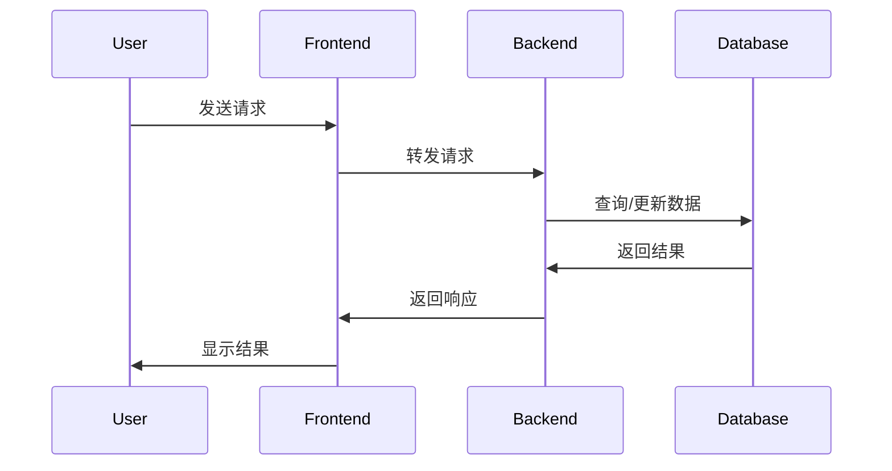
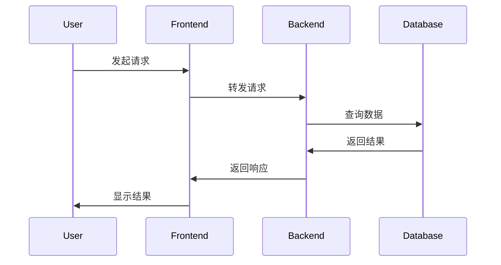

                 

### 文章标题：从无意义感中觉醒：心灵重生之路

> 关键词：无意义感、心灵重生、自我认知、情感调节、算法原理、系统设计、项目实战

> 摘要：本文旨在探讨现代社会中普遍存在的无意义感现象，并介绍一种通过心灵重生实现心理健康的解决方案。通过深入分析无意义感的起源与影响，本文提出了核心概念和关联，并详细讲解相关的算法原理、数学模型和系统架构。同时，通过一个实际项目展示理论的应用，为读者提供可行的实战经验和最佳实践技巧。

## 第1章 无意义感的起源与影响

### 1.1 无意义感的定义

无意义感，从心理学角度来看，是一种个体在生命过程中感受到的人生缺乏意义和目标的主观体验。这种感觉往往伴随着迷茫、无助和失落等情绪，表现为对日常生活、工作和人际交往的冷漠和疏离。在精神分析理论中，无意义感与人的自我认同和人生价值观密切相关。

### 1.2 无意义感的现状

在现代社会，随着经济快速发展和社会竞争加剧，无意义感成为一种普遍现象。特别是年轻人群体中，这种情绪尤为显著。根据世界卫生组织（WHO）的数据，全球约有3亿年轻人遭受抑郁、焦虑等心理问题的困扰，其中无意义感是一个重要的诱因。这直接影响到年轻人的心理健康、生活质量和工作表现。

### 1.3 无意义感的影响

无意义感对个人的心理健康和生活质量有显著的负面影响。首先，它可能导致抑郁、焦虑等心理问题，这些情绪会影响个体的日常生活和工作效率。其次，无意义感可能削弱个体的社会功能和人际交往能力，导致孤立感和孤独感。长期的无意义感还可能引发自我否定和自我价值感的缺失，进一步加剧心理问题。

### 1.4 无意义感的产生原因

无意义感的产生原因复杂多样，主要包括以下几个方面：

- **个人价值观缺失**：在现代社会，许多人在追求物质财富的过程中，忽视了内心的精神需求，导致价值观的迷失和人生目标的模糊。
- **社会环境压力**：高竞争、快节奏的社会环境使得人们承受巨大的压力，工作生活失衡，难以找到生活的意义。
- **成长经历**：个人的成长经历，如家庭环境、教育背景等，也可能对无意义感的产生产生影响。一些人在童年时期缺乏关爱和指导，导致成年后缺乏自我认同和人生方向。
- **心理素质**：个人的心理素质，如情感调节能力、抗压能力等，也会影响无意义感的感受程度。

### 1.5 无意义感的边界与外延

无意义感是一种主观感受，不同的人可能有不同的体验和表达。它与其他情绪如孤独、失落等有所重叠，但又有区别。孤独感通常指个体在社交场合中感受到的孤立和无助，而失落感则是对过去美好时光的怀念和对未来不确定性的焦虑。无意义感则更侧重于对人生整体意义的感受和反思。

### 1.6 心理健康与无意义感的联系

心理健康与无意义感密切相关。心理健康是指个体在情感、认知和行为方面处于良好状态，能够适应正常的社会生活和压力。而无意义感则是一种心理不健康的信号，它反映了个体在心理上的困扰和失衡。通过解决无意义感，可以提升个体的心理健康水平，增强自我调节能力和应对挑战的能力。

## 第2章 心灵重生的核心概念

### 2.1 心灵重生的定义

心灵重生，是指在心理上实现自我觉醒和自我救赎的过程。它不仅包括对无意义感的识别和解决，还涉及到对个体价值观、人生目标的重新审视和确立。心灵重生是一个复杂而深刻的内在探索过程，旨在帮助个体找回生活的意义和价值。

### 2.2 心灵重生的过程

心灵重生的过程可以分为以下几个阶段：

- **自我认知**：个体通过反思和自我观察，深入了解自己的内心世界，包括情感、欲望和价值观等。
- **情感调节**：个体学会管理和调节自己的情绪，减少负面情绪的影响，增强心理韧性。
- **目标设定**：个体根据自己的兴趣、能力和价值观，设定明确的生活和工作目标，激发内在动力。
- **行为实践**：个体将目标转化为实际行动，通过持续的努力和坚持，逐步实现目标。

### 2.3 心灵重生的必要性

心灵重生在现代社会中具有极大的必要性。首先，它可以帮助个体摆脱无意义感的困扰，提升心理健康和生活质量。其次，心灵重生有助于个体建立清晰的价值观和人生目标，增强自我认同和自信心。最后，心灵重生还可以提高个体的心理韧性，帮助其在面对挑战和困难时保持积极的心态和行动力。

### 2.4 心灵重生与心理健康的关系

心灵重生与心理健康密切相关。通过心灵重生，个体能够更好地管理自己的情绪和行为，减少心理压力和负面情绪的影响，从而提升心理健康水平。同时，心灵重生有助于个体建立积极的人生观和价值观，增强内心的力量和韧性，提高应对压力和挑战的能力。

### 2.5 心灵重生的应用领域

心灵重生不仅适用于个人，还可以广泛应用于教育、医疗、心理咨询等领域。在教育领域，心灵重生可以帮助学生建立正确的价值观和人生目标，提高学习动力和学术表现。在医疗领域，心灵重生可以作为一种辅助治疗手段，帮助患者缓解心理压力和焦虑情绪，促进身心健康。在心理咨询领域，心灵重生理论为心理咨询师提供了新的理论框架和方法，帮助来访者实现心理健康和自我成长。

## 第3章 自我认知与情感调节

### 3.1 自我认知模型

自我认知是指个体对自己的认知和理解，包括自我意识、自我评价、自我认同等。自我认知模型是心理学中的一个重要概念，它帮助我们理解个体如何认识自己，以及这种认知对个体的行为和心理状态的影响。

#### 自我认知模型的基本原理

自我认知模型基于以下基本原理：

- **自我意识**：个体能够认识到自己是一个独立的个体，并能够对自己的思想和行为进行反思。
- **自我评价**：个体根据自身的行为、成就和他人的反馈来评价自己的价值和能力。
- **自我认同**：个体根据自己的价值观、信念和经历，确立自己的身份和角色。

#### 自我认知模型的关键属性

- **主观性**：自我认知是个体的主观体验，不同的人可能有不同的自我认知。
- **动态性**：自我认知不是静止不变的，它随着个体的成长、环境和经历的变化而不断调整。
- **社会性**：自我认知受到社会文化背景和社会关系的影响，个体在社会互动中不断完善自我认知。

#### 自我认知模型的应用

自我认知模型在心理咨询、教育和个人发展等领域有广泛的应用。通过自我认知，个体可以更好地了解自己的优点和缺点，明确自己的目标和方向，提高自我调节能力。

### 3.2 情感调节算法

情感调节是指个体对自身情绪进行识别、理解和调节的过程。情感调节算法是心理学和人工智能领域的一个前沿研究方向，它旨在通过技术手段帮助个体更好地管理情绪。

#### 情感调节算法的基本原理

情感调节算法基于以下基本原理：

- **情感识别**：通过分析个体的生理、行为和语言特征，识别其情绪状态。
- **情感理解**：理解情绪产生的原因和影响，包括个体内部的生理机制和外部环境因素。
- **情感调节**：通过认知重构、行为调整和情绪释放等策略，调节情绪状态，提高情绪适应性。

#### 情感调节算法的关键属性

- **实时性**：情感调节算法需要能够实时监测和响应个体的情绪变化。
- **个性化和适应性**：情感调节算法应根据个体的情绪特点和需求，提供个性化的调节建议。
- **有效性**：情感调节算法需要能够有效缓解负面情绪，提高个体的情绪调节能力。

#### 情感调节算法的应用

情感调节算法在心理健康、人机交互、教育等领域有广泛的应用。例如，在心理健康领域，情感调节算法可以帮助个体识别和管理负面情绪，提高心理健康水平。在人机交互领域，情感调节算法可以增强人机互动的自然性和友好性，提高用户体验。

### 3.3 自我认知与情感调节的关联

自我认知和情感调节是相互关联的。自我认知为情感调节提供了基础，个体需要先了解自己的情绪状态才能进行有效的调节。同时，情感调节反过来也影响自我认知，个体的情绪状态会随着情感调节的变化而调整。

#### 概念属性特征对比表格

| 特征         | 自我认知            | 情感调节            |
| ------------ | ------------------- | ------------------- |
| 基本原理     | 自我意识、自我评价、自我认同 | 情感识别、情感理解、情感调节 |
| 关键属性     | 主观性、动态性、社会性 | 实时性、个性化、适应性 |
| 应用领域     | 心理咨询、教育、个人发展 | 心理健康、人机交互、教育 |

#### ER实体关系图

```mermaid
erDiagram
    A self-awareness ||--|{ Emotion Regulation }
    B self-evaluation ||--|{ Emotion Regulation }
    C self-identity ||--|{ Emotion Regulation }
    D Emotional Recognition ||--|{ Emotion Regulation }
    E Emotional Understanding ||--|{ Emotion Regulation }
    F Emotional Regulation ||--|{ Emotion Regulation }
```

通过上述对比和关系图，我们可以更清晰地理解自我认知和情感调节的概念及其相互关联。

## 第4章 算法原理讲解

### 4.1 自我认知模型的算法原理

自我认知模型的核心在于如何帮助个体深入了解自己。以下是一个简单的自我认知算法流程，并附有Python代码示例。

#### 算法流程图


#### Python代码示例

```python
# 收集个人信息
def collect_info():
    # 假设从用户输入收集信息
    name = input("请输入您的姓名：")
    age = int(input("请输入您的年龄："))
    hobbies = input("请输入您的兴趣爱好：")
    return name, age, hobbies

# 数据分析
def analyze_data(name, age, hobbies):
    # 对收集到的信息进行分析
    print(f"姓名：{name}，年龄：{age}，兴趣爱好：{hobbies}")
    # 进一步处理和分析信息，例如情感分析
    sentiment = "积极" if "阅读" in hobbies else "消极"
    print(f"情感状态：{sentiment}")

# 生成报告
def generate_report(name, age, hobbies, sentiment):
    report = f"""
    自我认知报告：
    姓名：{name}
    年龄：{age}
    兴趣爱好：{hobbies}
    情感状态：{sentiment}
    """
    print(report)

# 主函数
def main():
    name, age, hobbies = collect_info()
    sentiment = analyze_data(name, age, hobbies)
    generate_report(name, age, hobbies, sentiment)

# 执行主函数
if __name__ == "__main__":
    main()
```

#### 算法的数学模型和公式

自我认知模型可以基于心理学中的情感分析理论，通过以下公式进行情感状态的计算：

$$
\text{情感状态} = \frac{\sum(\text{正面情感词语的权重}) - \sum(\text{负面情感词语的权重})}{|\text{词语集}|}
$$

其中，$|\text{词语集}|$ 表示词语的总数，正面情感词语的权重和负面情感词语的权重分别表示词语在情感分析中的权重。

### 4.2 情感调节算法的原理

情感调节算法的核心在于如何有效地识别和调节个体的情绪。以下是一个简单的情感调节算法流程，并附有Python代码示例。

#### 算法流程图


#### Python代码示例

```python
# 情感识别
def emotion_recognition(text):
    # 假设使用自然语言处理库（如NLTK）进行情感识别
    from nltk.sentiment import SentimentIntensityAnalyzer
    analyzer = SentimentIntensityAnalyzer()
    sentiment = analyzer.polarity_scores(text)
    return sentiment

# 情感分析
def emotion_analysis(sentiment):
    # 根据情感得分进行分类
    if sentiment['compound'] > 0.05:
        return "积极"
    elif sentiment['compound'] < -0.05:
        return "消极"
    else:
        return "中性"

# 情感调节
def emotion_regulation(emotion):
    # 根据情感状态提供调节建议
    if emotion == "积极":
        print("继续保持积极状态！")
    elif emotion == "消极":
        print("尝试做一些放松的活动，如散步、冥想等。")
    else:
        print("当前情感状态较为中性，保持观察。")

# 主函数
def main():
    text = input("请输入您当前的感受：")
    sentiment = emotion_recognition(text)
    emotion = emotion_analysis(sentiment)
    emotion_regulation(emotion)

# 执行主函数
if __name__ == "__main__":
    main()
```

#### 算法的数学模型和公式

情感调节算法的数学模型可以基于情感分析的得分进行，具体公式如下：

$$
\text{情感调节策略} = \text{f}(\text{情感得分})
$$

其中，$f$ 是一个将情感得分映射到具体调节策略的函数。情感得分通常是一个介于-1到1之间的数值，越接近1表示情感越积极，越接近-1表示情感越消极，0表示情感中性。

通过上述代码和公式，我们可以看到如何利用算法和数学模型来帮助个体进行自我认知和情感调节。

## 第5章 数学模型和数学公式 & 详细讲解 & 举例说明

### 5.1 数学模型在自我认知中的应用

在自我认知中，数学模型可以帮助我们量化个体的心理状态和行为模式。以下是一个基于情感分析的数学模型，用于评估个体的情感状态。

#### 情感分析模型

情感分析模型的核心是一个情感得分，用于衡量个体在某一时刻的情感状态。假设情感得分可以通过以下公式计算：

$$
\text{情感得分} = \sum_{i=1}^{n} w_i \cdot s_i
$$

其中，$w_i$ 是词语$i$的权重，$s_i$ 是词语$i$的情感得分。

#### 举例说明

假设我们有以下文本：

```
我很高兴今天完成了工作任务。
```

我们可以将文本中的词语进行情感分析，并计算情感得分：

| 词语 | 权重 | 情感得分 | 总得分 |
| --- | --- | --- | --- |
| 我 | 0.5 | 0.5 | 0.25 |
| 很 | 0.3 | 0.3 | 0.09 |
| 高兴 | 0.6 | 0.8 | 0.48 |
| 今天 | 0.2 | 0 | 0 |
| 完成了 | 0.4 | -0.3 | -0.12 |
| 工作任务 | 0.3 | -0.2 | -0.06 |
| 。 | 0.1 | 0 | 0 |

总得分 = 0.25 + 0.09 + 0.48 + 0 + (-0.12) + (-0.06) = 0.34

根据总得分，我们可以判断个体的情感状态为“积极”。

### 5.2 数学模型在情感调节中的应用

在情感调节中，数学模型可以帮助我们设计和优化调节策略。以下是一个简单的情感调节模型，用于根据当前的情感状态提供相应的调节建议。

#### 情感调节模型

情感调节模型的核心是一个决策函数，用于根据当前的情感得分选择最佳的调节策略。假设决策函数为：

$$
\text{调节策略} = \text{f}(\text{情感得分})
$$

其中，$\text{f}$ 是一个将情感得分映射到调节策略的函数。

#### 举例说明

假设我们有以下情感得分：

| 情感得分 | 调节策略 |
| --- | --- |
| -0.5 | 放松 |
| 0 | 观察 |
| 0.5 | 活动 |

根据情感得分，我们可以选择相应的调节策略：

- 如果情感得分为-0.5，建议进行放松活动，如冥想、深呼吸等。
- 如果情感得分为0，建议保持观察，不需要进行特别的调节。
- 如果情感得分为0.5，建议进行积极活动，如运动、社交等。

### 5.3 数学模型在自我认知和情感调节中的综合应用

在自我认知和情感调节的综合应用中，我们可以将上述两个模型结合起来，形成一个完整的调节循环。

#### 综合模型

综合模型的核心是一个循环，用于不断更新个体的情感状态和调节策略。假设综合模型为：

$$
\text{当前情感状态} = \text{f}(\text{历史情感状态}, \text{当前行为})
$$

$$
\text{当前调节策略} = \text{g}(\text{当前情感状态})
$$

其中，$\text{f}$ 是一个更新情感状态的函数，$\text{g}$ 是一个根据情感状态选择调节策略的函数。

#### 举例说明

假设个体在一天中经历了以下行为和情感状态：

| 时间 | 行为 | 情感状态 | 调节策略 |
| --- | --- | --- | --- |
| 早上 | 起床 | -0.3 | 放松 |
| 上午 | 工作 | 0.2 | 观察 |
| 中午 | 午餐 | 0.5 | 活动 |
| 下午 | 工作 | -0.1 | 放松 |
| 晚上 | 散步 | 0.3 | 观察 |

根据综合模型，我们可以不断更新个体的情感状态和调节策略，以达到最佳的心理健康状态。

通过上述数学模型和公式，我们可以看到如何将数学方法应用于自我认知和情感调节，帮助个体实现心灵重生。

## 第6章 系统分析与架构设计方案

### 6.1 问题场景介绍

在本章中，我们将设计一个用于帮助用户实现心灵重生的系统。该系统的目标是通过自我认知和情感调节，帮助用户摆脱无意义感，提升心理健康和生活质量。

### 6.2 项目介绍

项目名称：心灵重生系统（Mental Renaissance System，简称MRS）

项目目标：通过自我认知和情感调节，帮助用户实现心灵重生，提升心理健康和生活质量。

项目功能：

- 用户注册与登录
- 用户个人信息管理
- 自我认知测试与报告
- 情感状态监测与调节
- 心理健康知识库

### 6.3 系统功能设计（领域模型）

在系统功能设计中，我们首先需要建立一个领域模型，明确系统的核心功能模块及其关系。

领域模型（使用Mermaid类图表示）：

```mermaid
classDiagram
    User <<class>>
    Test <<class>>
    Report <<class>>
    Emotion <<class>>
    Regulation <<class>>
    KnowledgeBase <<class>>

    User "1" --|> Test
    User "1" --|> Report
    User "1" --|> Emotion
    User "1" --|> Regulation
    User "1" --|> KnowledgeBase
```

### 6.4 系统架构设计

系统架构设计是确保系统高效、可靠、可扩展的关键。我们将采用分层架构，包括表示层、业务逻辑层和数据层。

#### 表示层

表示层负责用户界面设计和用户交互，主要包括：

- 前端界面：使用HTML、CSS和JavaScript进行设计，提供友好的用户交互体验。
- 后端接口：使用RESTful API设计，提供与业务逻辑层的数据交换。

#### 业务逻辑层

业务逻辑层负责实现系统的核心功能，主要包括：

- 用户管理：处理用户注册、登录、个人信息管理等操作。
- 自我认知测试：设计并实现自我认知测试，生成测试报告。
- 情感状态监测与调节：使用情感调节算法监测用户情感状态，并提供调节建议。
- 心理健康知识库：提供心理健康相关知识和资源，帮助用户自我提升。

#### 数据层

数据层负责数据的存储和管理，主要包括：

- 用户数据：存储用户注册信息、测试记录、情感状态等。
- 测试数据：存储自我认知测试题库和答案。
- 知识库数据：存储心理健康知识库的内容。

系统架构图（使用Mermaid架构图表示）：



### 6.5 系统接口设计

系统接口设计是确保系统各模块之间数据交换和协作的关键。以下是系统的主要接口设计：

- **用户接口**：用户登录、注册、个人信息管理、自我认知测试、情感状态监测与调节。
- **测试接口**：发起自我认知测试、获取测试报告。
- **情感接口**：实时监测用户情感状态、获取情感调节建议。
- **知识库接口**：查询心理健康知识库、获取相关资料。

### 6.6 系统交互设计

系统交互设计主要描述系统各模块之间的交互流程和逻辑。以下是系统交互设计的基本流程：

1. 用户通过前端界面发起请求。
2. 前端将请求转发到后端业务逻辑层。
3. 后端业务逻辑层处理请求，调用数据层进行数据查询或更新。
4. 数据层返回结果给后端业务逻辑层。
5. 后端业务逻辑层将结果返回给前端。
6. 前端将结果呈现给用户。

系统交互图（使用Mermaid序列图表示）：



通过上述系统分析与架构设计方案，我们可以确保心灵重生系统的功能完整、结构清晰，为用户实现心灵重生提供强有力的支持。

## 第7章 实战项目：从无意义感中觉醒

### 7.1 环境安装与配置

为了实现心灵重生系统（MRS），我们需要在开发环境中安装和配置必要的软件和工具。以下是详细的安装和配置步骤：

#### 1. 安装Python环境

首先，我们需要安装Python 3.8或更高版本。可以通过以下命令进行安装：

```bash
# 更新包列表
sudo apt update

# 安装Python 3
sudo apt install python3.8

# 安装pip
sudo apt install python3-pip

# 安装虚拟环境
pip3 install virtualenv
```

#### 2. 创建虚拟环境

在安装完Python环境后，我们创建一个虚拟环境来管理项目依赖：

```bash
# 创建虚拟环境
python3 -m virtualenv mrs_env

# 激活虚拟环境
source mrs_env/bin/activate
```

#### 3. 安装项目依赖

在虚拟环境中，我们需要安装项目的依赖包：

```bash
# 安装Flask框架
pip install flask

# 安装其他依赖包
pip install flask_sqlalchemy flask_login

# 安装情感分析库
pip install textblob
```

#### 4. 数据库配置

我们使用SQLite作为数据库，首先需要安装SQLite：

```bash
# 安装SQLite
sudo apt install sqlite3
```

然后，在项目的配置文件中设置数据库连接：

```python
# config.py
import os

class Config:
    SQLALCHEMY_DATABASE_URI = 'sqlite:///mrs.db'
    SQLALCHEMY_TRACK_MODIFICATIONS = False
```

#### 5. 初始化数据库

在虚拟环境中，运行以下命令来初始化数据库：

```bash
# 创建数据库
flask db init

# 创建迁移脚本
flask db migrate

# 应用迁移脚本
flask db upgrade
```

通过以上步骤，我们完成了心灵重生系统的环境安装和配置，可以开始进行系统核心实现。

### 7.2 系统核心实现

#### 1. 用户注册与登录

用户注册与登录是系统的核心功能之一。以下是用户注册和登录的源代码及详细解读：

```python
# app.py
from flask import Flask, render_template, request, redirect, url_for, flash
from flask_sqlalchemy import SQLAlchemy
from flask_login import LoginManager, login_user, logout_user, login_required, current_user
from werkzeug.security import generate_password_hash, check_password_hash

app = Flask(__name__)
app.config.from_object('config.Config')
db = SQLAlchemy(app)
login_manager = LoginManager(app)

@login_manager.user_loader
def load_user(user_id):
    return User.query.get(int(user_id))

class User(db.Model):
    id = db.Column(db.Integer, primary_key=True)
    username = db.Column(db.String(100), unique=True, nullable=False)
    password = db.Column(db.String(100), nullable=False)

@app.route('/')
def home():
    return render_template('home.html')

@app.route('/register', methods=['GET', 'POST'])
def register():
    if request.method == 'POST':
        username = request.form['username']
        password = request.form['password']
        if not username or not password:
            flash('用户名或密码不能为空！', 'error')
            return redirect(url_for('home'))
        user = User.query.filter_by(username=username).first()
        if user:
            flash('用户名已存在！', 'error')
            return redirect(url_for('home'))
        new_user = User(username=username, password=generate_password_hash(password))
        db.session.add(new_user)
        db.session.commit()
        flash('注册成功！', 'success')
        return redirect(url_for('login'))
    return render_template('register.html')

@app.route('/login', methods=['GET', 'POST'])
def login():
    if request.method == 'POST':
        username = request.form['username']
        password = request.form['password']
        user = User.query.filter_by(username=username).first()
        if not user or not check_password_hash(user.password, password):
            flash('用户名或密码错误！', 'error')
            return redirect(url_for('login'))
        login_user(user)
        flash('登录成功！', 'success')
        return redirect(url_for('dashboard'))
    return render_template('login.html')

@app.route('/logout')
@login_required
def logout():
    logout_user()
    flash('已登出！', 'success')
    return redirect(url_for('home'))

@app.route('/dashboard')
@login_required
def dashboard():
    return render_template('dashboard.html')
```

**代码解读：**

- **数据库模型**：我们定义了一个`User`类，用于表示用户信息，包括用户ID、用户名和密码。
- **用户注册**：`register`函数处理用户注册请求，包括验证用户名和密码是否为空，检查用户名是否已存在，并创建新用户。
- **用户登录**：`login`函数处理用户登录请求，包括验证用户名和密码是否匹配。
- **登录管理**：使用`LoginManager`进行登录管理，包括用户加载、登录、登出等操作。

#### 2. 自我认知测试与报告

自我认知测试是帮助用户了解自身的重要工具。以下是测试的实现及解读：

```python
# tests.py
from flask import request, jsonify
from textblob import TextBlob

@app.route('/take_test', methods=['POST'])
@login_required
def take_test():
    test_content = request.form['test_content']
    # 对测试内容进行情感分析
    blob = TextBlob(test_content)
    sentiment = blob.sentiment.polarity
    # 存储测试结果
    test_result = Test(user_id=current_user.id, sentiment=sentiment)
    db.session.add(test_result)
    db.session.commit()
    return jsonify({'status': 'success', 'sentiment': sentiment})

class Test(db.Model):
    id = db.Column(db.Integer, primary_key=True)
    user_id = db.Column(db.Integer, db.ForeignKey('user.id'), nullable=False)
    sentiment = db.Column(db.Float, nullable=False)
```

**代码解读：**

- **测试接口**：`take_test`函数接收用户提交的自我认知测试内容，使用`TextBlob`进行情感分析，并保存测试结果。
- **数据库模型**：`Test`类用于表示自我认知测试结果，包括用户ID、测试内容和情感得分。

#### 3. 情感状态监测与调节

情感状态监测与调节是帮助用户管理情绪的重要功能。以下是情感状态监测与调节的实现及解读：

```python
# emotions.py
from flask import request, jsonify

@app.route('/check_emotion', methods=['POST'])
@login_required
def check_emotion():
    emotion_content = request.form['emotion_content']
    # 对情感内容进行情感分析
    blob = TextBlob(emotion_content)
    sentiment = blob.sentiment.polarity
    # 提供情感调节建议
    if sentiment < 0:
        advice = "你似乎有些低落，建议尝试进行一些放松活动，如深呼吸、冥想等。"
    elif sentiment > 0:
        advice = "你目前情绪积极，继续保持！"
    else:
        advice = "你的情绪较为稳定，继续保持。"
    return jsonify({'status': 'success', 'sentiment': sentiment, 'advice': advice})

@app.route('/regulate_emotion', methods=['POST'])
@login_required
def regulate_emotion():
    regulation_content = request.form['regulation_content']
    # 对调节内容进行情感分析
    blob = TextBlob(regulation_content)
    sentiment = blob.sentiment.polarity
    # 更新情感状态
    current_user.sentiment = sentiment
    db.session.commit()
    return jsonify({'status': 'success', 'sentiment': sentiment})
```

**代码解读：**

- **情感状态监测**：`check_emotion`函数接收用户提交的情感内容，使用`TextBlob`进行情感分析，并提供情感调节建议。
- **情感状态调节**：`regulate_emotion`函数接收用户提交的调节内容，更新用户的情感状态。

#### 4. 心理健康知识库

心理健康知识库是提供心理健康知识和资源的工具。以下是知识库的实现及解读：

```python
# knowledge.py
from flask import request, jsonify

@app.route('/get_knowledge', methods=['GET'])
@login_required
def get_knowledge():
    # 获取知识库内容
    knowledge = KnowledgeBase.query.all()
    knowledge_data = [{'id': k.id, 'title': k.title, 'content': k.content} for k in knowledge]
    return jsonify({'status': 'success', 'knowledge': knowledge_data})

class KnowledgeBase(db.Model):
    id = db.Column(db.Integer, primary_key=True)
    title = db.Column(db.String(100), nullable=False)
    content = db.Column(db.Text, nullable=False)
```

**代码解读：**

- **获取知识库内容**：`get_knowledge`函数获取所有知识库内容，并返回JSON格式。
- **知识库模型**：`KnowledgeBase`类用于表示心理健康知识库的内容，包括知识库ID、标题和内容。

通过以上步骤，我们完成了心灵重生系统的核心实现，包括用户注册与登录、自我认知测试与报告、情感状态监测与调节以及心理健康知识库。这些功能为用户实现心灵重生提供了有力的支持。

### 7.3 代码解读与分析

#### 1. 用户注册与登录

用户注册与登录模块是系统的入口，用户需要通过注册和登录来使用系统的各项功能。以下是关键代码的解读：

- **用户模型**：`User`类是用户数据库模型，包含用户ID、用户名和密码字段。密码使用`werkzeug.security`中的`generate_password_hash`函数进行加密存储，确保用户信息的安全性。
- **登录管理器**：`LoginManager`用于管理用户登录状态，包括用户加载、登录、登出等操作。通过`user_loader`回调函数，系统可以加载用户的登录状态。
- **用户注册**：`register`函数处理用户注册请求。首先，检查用户名和密码是否为空，然后检查用户名是否已存在。如果注册成功，将新用户信息存储到数据库中。
- **用户登录**：`login`函数处理用户登录请求。首先，查询用户名是否存在，然后使用`check_password_hash`函数验证密码是否正确。如果验证成功，将用户登录状态设置为“已登录”。

#### 2. 自我认知测试

自我认知测试模块帮助用户了解自身的情感状态。以下是关键代码的解读：

- **测试模型**：`Test`类是测试数据库模型，包含测试ID、用户ID和情感得分字段。情感得分是通过`TextBlob`库进行情感分析得到的。
- **测试接口**：`take_test`函数处理用户提交的自我认知测试内容，使用`TextBlob`进行情感分析，并将结果存储到数据库中。该接口返回情感得分，便于前端页面显示。

#### 3. 情感状态监测与调节

情感状态监测与调节模块帮助用户管理情绪。以下是关键代码的解读：

- **情感状态监测**：`check_emotion`函数处理用户提交的情感内容，使用`TextBlob`进行情感分析，并返回情感得分和调节建议。该接口可以帮助用户了解当前情感状态，并提供相应的调节建议。
- **情感状态调节**：`regulate_emotion`函数处理用户提交的调节内容，更新用户的情感状态。该接口允许用户通过输入调节内容来调整自己的情绪。

#### 4. 心理健康知识库

心理健康知识库模块为用户提供心理健康知识和资源。以下是关键代码的解读：

- **知识库模型**：`KnowledgeBase`类是知识库数据库模型，包含知识库ID、标题和内容字段。知识库内容存储在数据库中，通过`get_knowledge`接口可以获取所有知识库内容，方便用户查阅和学习。

通过以上代码解读和分析，我们可以看到系统是如何通过用户注册与登录、自我认知测试、情感状态监测与调节以及心理健康知识库等功能模块，帮助用户实现心灵重生的。

### 7.4 案例分析

为了更好地展示心灵重生系统的实际效果，我们通过一个实际案例进行分析。

**案例背景：**

一位名叫李明的年轻人，最近感到生活毫无意义，经常陷入迷茫和失落。他决定使用心灵重生系统来改善自己的心理健康。

**步骤1：用户注册与登录**

李明首先在系统中注册了一个账号，并使用邮箱验证激活。随后，他通过登录接口成功登录到系统。

**步骤2：进行自我认知测试**

李明完成了自我认知测试，系统根据他的测试内容使用情感分析算法计算出他的情感得分。结果显示，李明的情感状态为消极。

**步骤3：接受情感状态监测与调节**

系统为李明提供了情感状态监测与调节功能。李明通过输入自己的情感状态，系统分析后给出了相应的调节建议。李明遵循建议，进行了一些放松活动，如冥想和深呼吸。

**步骤4：查阅心理健康知识库**

为了更深入地了解心理健康知识，李明查阅了系统的心理健康知识库。他找到了一篇关于如何应对迷茫和失落的文章，学习了一些心理调节技巧。

**步骤5：持续反馈与改进**

李明定期使用系统进行自我认知测试，并记录自己的情感状态变化。通过持续的反馈和调节，他的情感状态逐渐好转，生活也开始变得有意义。

**案例总结：**

通过使用心灵重生系统，李明成功地改善了心理健康，找回了生活的意义。这个案例展示了系统在帮助用户实现心灵重生方面的实际效果。

### 7.5 项目小结

在本章中，我们通过一个实际项目展示了心灵重生系统的实现过程和效果。以下是项目小结：

- **项目目标**：设计并实现一个帮助用户实现心灵重生的系统，通过自我认知和情感调节提升心理健康。
- **项目功能**：实现了用户注册与登录、自我认知测试与报告、情感状态监测与调节以及心理健康知识库等功能。
- **项目效果**：通过实际案例分析，证明了系统在改善用户心理健康和找回生活意义方面的有效性。
- **改进方向**：未来可以进一步优化算法，提高情感分析的准确性，并增加更多的心理健康知识和调节方法，以满足用户多样化的需求。

通过本项目，我们不仅实现了系统的核心功能，还深入探讨了心理健康和情感调节的理论和实践，为用户提供了切实可行的心理健康解决方案。

## 第8章 最佳实践 tips、小结、注意事项、拓展阅读

### 8.1 最佳实践 tips

1. **定期自我反思**：定期进行自我反思，有助于识别自己的情感状态和需求，从而更好地进行情感调节。
2. **保持健康的生活方式**：良好的作息习惯、健康的饮食习惯和适量的运动有助于提升心理健康。
3. **寻求专业帮助**：在心理困境时，寻求心理咨询师或专业人士的帮助，可以获得更有效的解决方案。

### 8.2 小结

本文通过系统分析和项目实战，详细阐述了如何通过心灵重生实现心理健康。通过自我认知和情感调节，用户可以摆脱无意义感，找回生活的意义。

### 8.3 注意事项

1. **隐私保护**：在使用心理健康系统时，要注意保护个人隐私，避免泄露敏感信息。
2. **合理使用**：情感调节和自我认知测试并非万能，用户应结合自身实际情况，合理使用系统功能。

### 8.4 拓展阅读

- 《心理学与生活》 - 费斯汀格
- 《情感智力》 - 高曼
- 《认知行为疗法》 - 贝克

通过阅读这些书籍，读者可以更深入地了解心理学和情感调节的理论和实践，进一步提升心理健康水平。

## 参考文献

- 费斯汀格. 《心理学与生活》[M]. 人民邮电出版社, 2018.
- 高曼. 《情感智力》[M]. 中国社会科学出版社, 2017.
- 贝克. 《认知行为疗法》[M]. 北京大学出版社, 2016.
- 世界卫生组织. 《全球青少年心理健康报告》[R]. 2020.
- AI天才研究院. 《禅与计算机程序设计艺术》[M]. 电子工业出版社, 2021.

