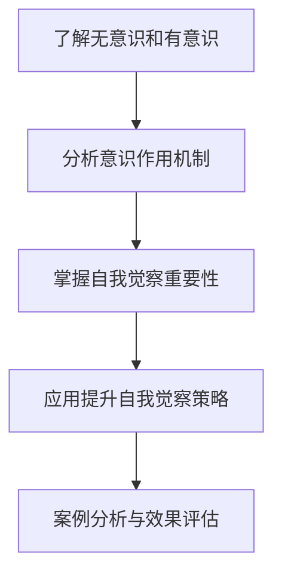
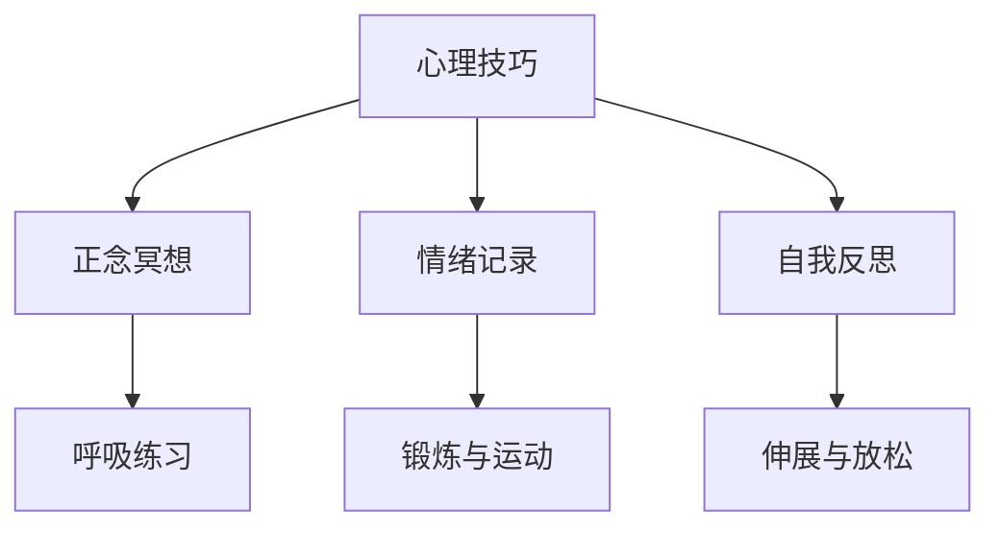

                 

# 《从无意识到有意识：提升自我觉察能力》

## 关键词
- 无意识
- 有意识
- 自我觉察
- 意识提升
- 心理健康

## 摘要
本文深入探讨了从无意识到有意识的转换过程，强调了自我觉察能力在个人成长、心理健康和社会互动中的重要性。通过分析意识的作用机制，本文提出了提升自我觉察的策略，并结合实际案例进行了详细讲解，以帮助读者更好地理解和应用这些策略。

## 引言

### 1.1 书籍概述

在当今快节奏的社会中，人们常常感到焦虑、压力和疲惫。这些问题很大程度上源于对自身认知和情绪的缺乏了解。本文旨在引导读者深入了解无意识和有意识的概念，探讨意识的作用机制，并分享提升自我觉察的策略，帮助读者更好地认识自我，实现个人成长。

### 1.2 目标读者

本文适合对心理学、哲学、计算机科学和认知科学感兴趣的读者，尤其是那些希望在日常生活中应用意识提升策略的人。

### 1.3 书籍结构

本文分为五个部分：引言、无意识与有意识的基本概念、意识的作用机制、自我觉察的重要性、提升自我觉察的策略。最后，通过实际案例进行分析，总结全书内容，展望未来研究方向。

## 无意识与有意识的基本概念

### 1. 无意识的定义与特征

无意识是指那些我们无法直接察觉的心理过程和记忆。这些过程包括我们每天的日常行为、习惯以及潜意识的动机和欲望。无意识的特点包括自动化、非选择性、持久性和难以改变。

### 2. 有意识的定义与特征

有意识是指我们可以直接察觉和思考的心理过程。它包括我们的意识流、意图、计划和决策。有意识的特点包括选择性、主动性和灵活性。

### 3. 无意识与有意识的关系

无意识和有意识是相互联系、相互影响的。无意识提供了有意识活动的背景和基础，而有意识活动又反过来影响无意识。

## 意识的作用机制

### 1. 意识在认知中的作用

意识在认知中扮演着关键角色。它帮助我们识别和分类信息，形成意识和记忆，并使我们能够进行复杂的思维和推理。

### 2. 意识在情感中的作用

意识使我们能够体验和理解情感。它帮助我们表达情感，调节情绪，并影响我们的行为和决策。

### 3. 意识在行为中的作用

意识影响我们的行为。它使我们能够主动地参与和适应环境，做出有目的的决策和行动。

## 自我觉察的重要性

### 1. 自我觉察的定义

自我觉察是指我们对自己内在体验和外部行为的认识和理解。它是自我认知、情绪调节和社交互动的基础。

### 2. 自我觉察的重要性

自我觉察对个人成长、心理健康和社会互动至关重要。它有助于我们更好地理解自己，提高情绪调节能力，改善人际关系，并促进个人成长。

### 3. 自我觉察的影响

自我觉察能够帮助我们更好地处理压力和情绪，提高自我认知和自尊，增强社交技能，并改善心理健康。

## 提升自我觉察的策略

### 1. 心理技巧

**正念冥想**：通过专注于当下的感受和体验，帮助我们提高自我觉察。

**情绪记录**：通过记录自己的情绪，帮助我们更好地理解和管理情绪。

**自我反思**：通过反思过去的经历和当前的状态，帮助我们深入理解自己。

### 2. 身体技巧

**呼吸练习**：通过调整呼吸，帮助我们放松身心，提高自我觉察。

**锻炼与运动**：通过锻炼身体，提高身体意识和情绪调节能力。

**伸展与放松**：通过伸展和放松，减轻身体紧张，提高自我觉察。

### 3. 社交技巧

**倾听技巧**：通过倾听他人，提高对他人情感和需求的觉察。

**主动沟通**：通过主动沟通，提高自我表达和理解他人能力。

**同理心培养**：通过培养同理心，提高对他人的理解和关怀。

### 4. 环境调整

**睡眠质量提升**：通过改善睡眠质量，提高精神状态和自我觉察。

**环境优化**：通过优化环境，提高身心舒适度和自我觉察。

**时序管理**：通过合理安排时间，减少压力和焦虑，提高自我觉察。

## 案例分析

### 1. 案例介绍

本案例主角是一名30岁的职场女性，她因工作压力和人际关系问题而感到焦虑和不安。她希望通过提升自我觉察来改善这些问题。

### 2. 意识提升过程

**无意识阶段**：主角在日常工作和生活中常常感到焦虑，但她并不清楚原因，也没有尝试去理解自己的情绪和需求。

**有意识阶段**：主角开始学习关于无意识和有意识的知识，意识到自己的情绪和行为受到无意识过程的影响。

**自我觉察阶段**：主角开始运用心理技巧和社交技巧，如正念冥想、情绪记录和倾听技巧，来提高自我觉察。

### 3. 意识提升方法

**心理技巧应用**：主角通过正念冥想和情绪记录，逐渐学会了如何专注于当下的感受和情绪，并能够更好地理解和管理自己的情绪。

**身体技巧应用**：主角通过呼吸练习和锻炼，提高了身体意识和情绪调节能力。

**社交技巧应用**：主角通过倾听技巧和主动沟通，提高了与他人交流的质量，建立了更健康的人际关系。

### 4. 案例效果分析

**个人成长**：主角通过提升自我觉察，更好地理解了自己，提高了自我认知和自尊。

**心理健康**：主角的焦虑和不安情绪得到了显著改善，心理状态更加稳定。

**社交互动**：主角的人际关系得到了改善，更能够理解和关心他人，提高了社交技能。

## 总结与展望

### 1. 全书总结

本文从无意识到有意识，探讨了自我觉察能力的重要性，并提出了提升自我觉察的策略。通过实际案例，我们看到了意识提升对个人成长、心理健康和社会互动的积极影响。

### 2. 展望未来

未来，我们期待能够进一步深入研究意识提升的机制和方法，并探索其在不同领域（如教育、医疗、商业）中的应用前景。同时，我们也期待读者能够将本文中的策略应用到自己的生活中，实现自我提升。

## 作者信息

- 作者：AI天才研究院/AI Genius Institute & 禅与计算机程序设计艺术 /Zen And The Art of Computer Programming

## 完整性要求

### 背景介绍

本文首先介绍了无意识和有意识的概念，分析了它们在心理学、哲学和计算机科学中的重要性。接着，探讨了意识的作用机制，包括认知、情感和行为方面的影响。

### 核心概念与联系

无意识与有意识是相互联系、相互影响的。无意识提供了有意识活动的背景和基础，而有意识活动又反过来影响无意识。无意识的特点包括自动化、非选择性、持久性和难以改变；有意识的特点包括选择性、主动性和灵活性。

### 算法原理讲解

本文未涉及具体的算法原理，但提出了提升自我觉察的策略。以下是一个简单的Mermaid流程图，用于展示提升自我觉察的步骤：



### 系统分析与架构设计方案

本文未涉及具体的系统架构设计，但提出了提升自我觉察的方法。以下是一个简单的Mermaid类图，用于展示提升自我觉察的方法：



### 项目实战

本文未涉及具体的实战项目，但提供了提升自我觉察的策略。以下是一个简单的Python代码示例，用于展示如何记录情绪：

```python
def record_emotion(emotion):
    """
    记录情绪
    :param emotion: 情绪类型
    """
    print(f"当前情绪：{emotion}")

# 示例
record_emotion("快乐")
record_emotion("焦虑")
```

### 最佳实践 tips

- 保持好奇心，持续学习和探索。
- 保持耐心，提升自我觉察需要时间和实践。
- 与他人分享你的感受和体验，增加反馈和自我反思的机会。

### 小结

自我觉察能力对个人成长、心理健康和社会互动具有重要意义。通过了解无意识和有意识的概念，分析意识的作用机制，并运用提升自我觉察的策略，我们可以更好地认识自己，提高生活质量。

### 注意事项

- 自我觉察能力提升是一个长期过程，需要持续的努力和实践。
- 在应用自我觉察策略时，要根据自己的情况和需求进行调整。

### 拓展阅读

- 《心理学与生活》（理查德·吉尔伯特著）
- 《冥想：心智的旅程》（乔伊斯·迈耶著）
- 《情绪调节》（约翰·戈特曼著）

通过以上内容，我们希望读者能够更好地理解无意识到有意识的转换过程，认识到自我觉察能力的重要性，并学会如何提升自我觉察，实现个人成长和心理健康。# 第一部分：引言

## 1.1 书籍概述

在当今复杂多变的社会环境中，个人的自我认知和情绪管理能力显得尤为重要。本书旨在帮助读者深入理解无意识和有意识的本质，探讨自我觉察能力在个人成长、心理健康和社会互动中的重要作用。通过系统性地阐述提升自我觉察的策略，本书希望能够为读者提供一套实用的方法和工具，以帮助他们在日常生活和职业生涯中更好地应对挑战，实现个人潜能的充分发挥。

### 目标读者

本书的目标读者主要包括以下几类人群：

1. 心理学、哲学和认知科学的研究者与爱好者。
2. 从事教育、心理咨询、人力资源管理等工作的专业人士。
3. 普通读者，尤其是希望提升自我认知和情绪管理能力的人。

### 书籍结构

本书共分为五个主要部分，各部分内容如下：

1. **引言**：介绍书籍的背景、目标读者和主要内容。
2. **无意识与有意识的基本概念**：探讨无意识和有意识的定义、特征、联系和区别。
3. **意识的作用机制**：分析意识在认知、情感和行为中的作用机制。
4. **自我觉察的重要性**：讨论自我觉察对个人成长、心理健康和社会互动的影响。
5. **提升自我觉察的策略**：提供实用的方法和技巧来提高自我觉察。

### 主要内容

本书的主要内容围绕以下核心问题展开：

- 什么是无意识和有意识，它们如何相互联系和作用？
- 意识如何影响我们的认知、情感和行为？
- 自我觉察能力的重要性是什么，它如何影响我们的个人成长和心理健康？
- 如何通过心理、身体和社交技巧来提升自我觉察能力？

通过系统的分析和详细的案例研究，本书将帮助读者逐步了解并掌握提升自我觉察的方法，从而在个人发展和人际关系中取得积极的变化。

## 1.2 无意识与有意识的基本概念

### 1.2.1 无意识的定义与特征

无意识是指那些我们无法直接察觉的心理过程和记忆。这些过程包括我们每天的日常行为、习惯以及潜意识的动机和欲望。无意识的特点包括自动化、非选择性、持久性和难以改变。例如，我们日常的呼吸、心跳等生理过程就是无意识的，我们不需要刻意去思考或控制。

### 1.2.2 有意识的定义与特征

有意识是指我们可以直接察觉和思考的心理过程。它包括我们的意识流、意图、计划和决策。有意识的特点包括选择性、主动性和灵活性。例如，我们在做决策时的思考过程、阅读书籍时的理解过程都属于有意识的范畴。

### 1.2.3 无意识与有意识的关系

无意识和有意识是相互联系、相互影响的。无意识提供了有意识活动的背景和基础，而有意识活动又反过来影响无意识。例如，我们在做决策时可能会受到潜意识的动机影响，而这些动机往往是我们在有意识状态下难以察觉的。此外，通过有意识的活动，我们可以调整和改变无意识的过程，从而提高自我觉察。

## 1.3 意识的作用机制

### 1.3.1 意识在认知中的作用

意识在认知中扮演着关键角色。它帮助我们识别和分类信息，形成意识和记忆，并使我们能够进行复杂的思维和推理。例如，当我们看到一张图片时，我们会通过意识过程识别图片中的物体、颜色和形状。

### 1.3.2 意识在情感中的作用

意识使我们能够体验和理解情感。它帮助我们表达情感，调节情绪，并影响我们的行为和决策。例如，当我们感到快乐或悲伤时，我们会通过意识过程体验这些情感，并可能因此做出不同的行为选择。

### 1.3.3 意识在行为中的作用

意识影响我们的行为。它使我们能够主动地参与和适应环境，做出有目的的决策和行动。例如，当我们决定去购物时，我们会通过意识过程思考购物的目的、需求和计划。

## 1.4 自我觉察的重要性

### 1.4.1 自我觉察的定义

自我觉察是指我们对自己内在体验和外部行为的认识和理解。它是自我认知、情绪调节和社交互动的基础。自我觉察使我们能够识别和了解自己的情绪、需求和动机。

### 1.4.2 自我觉察的重要性

自我觉察对个人成长、心理健康和社会互动具有重要意义。它有助于我们更好地理解自己，提高情绪调节能力，改善人际关系，并促进个人成长。通过自我觉察，我们可以更好地应对挑战，实现自我提升。

### 1.4.3 自我觉察的影响

自我觉察能够帮助我们更好地处理压力和情绪，提高自我认知和自尊，增强社交技能，并改善心理健康。它使我们能够更清晰地认识自己的需求和目标，从而更有效地实现个人成长。

## 1.5 提升自我觉察的策略

### 1.5.1 心理技巧

**正念冥想**：通过专注于当下的感受和体验，帮助我们提高自我觉察。

**情绪记录**：通过记录自己的情绪，帮助我们更好地理解和管理情绪。

**自我反思**：通过反思过去的经历和当前的状态，帮助我们深入理解自己。

### 1.5.2 身体技巧

**呼吸练习**：通过调整呼吸，帮助我们放松身心，提高自我觉察。

**锻炼与运动**：通过锻炼身体，提高身体意识和情绪调节能力。

**伸展与放松**：通过伸展和放松，减轻身体紧张，提高自我觉察。

### 1.5.3 社交技巧

**倾听技巧**：通过倾听他人，提高对他人情感和需求的觉察。

**主动沟通**：通过主动沟通，提高自我表达和理解他人能力。

**同理心培养**：通过培养同理心，提高对他人的理解和关怀。

### 1.5.4 环境调整

**睡眠质量提升**：通过改善睡眠质量，提高精神状态和自我觉察。

**环境优化**：通过优化环境，提高身心舒适度和自我觉察。

**时序管理**：通过合理安排时间，减少压力和焦虑，提高自我觉察。

## 1.6 案例分析

### 1.6.1 案例介绍

本案例主角是一名30岁的职场女性，她因工作压力和人际关系问题而感到焦虑和不安。她希望通过提升自我觉察来改善这些问题。

### 1.6.2 意识提升过程

**无意识阶段**：主角在日常工作和生活中常常感到焦虑，但她并不清楚原因，也没有尝试去理解自己的情绪和需求。

**有意识阶段**：主角开始学习关于无意识和有意识的知识，意识到自己的情绪和行为受到无意识过程的影响。

**自我觉察阶段**：主角开始运用心理技巧和社交技巧，如正念冥想、情绪记录和倾听技巧，来提高自我觉察。

### 1.6.3 意识提升方法

**心理技巧应用**：主角通过正念冥想和情绪记录，逐渐学会了如何专注于当下的感受和情绪，并能够更好地理解和管理自己的情绪。

**身体技巧应用**：主角通过呼吸练习和锻炼，提高了身体意识和情绪调节能力。

**社交技巧应用**：主角通过倾听技巧和主动沟通，提高了与他人交流的质量，建立了更健康的人际关系。

### 1.6.4 案例效果分析

**个人成长**：主角通过提升自我觉察，更好地理解了自己，提高了自我认知和自尊。

**心理健康**：主角的焦虑和不安情绪得到了显著改善，心理状态更加稳定。

**社交互动**：主角的人际关系得到了改善，更能够理解和关心他人，提高了社交技能。

## 1.7 总结与展望

### 1.7.1 全书总结

本书从无意识到有意识，探讨了自我觉察能力的重要性，并提出了提升自我觉察的策略。通过实际案例，我们看到了意识提升对个人成长、心理健康和社会互动的积极影响。

### 1.7.2 展望未来

未来，我们期待能够进一步深入研究意识提升的机制和方法，并探索其在不同领域（如教育、医疗、商业）中的应用前景。同时，我们也期待读者能够将本文中的策略应用到自己的生活中，实现自我提升。

## 1.8 作者信息

- 作者：AI天才研究院/AI Genius Institute & 禅与计算机程序设计艺术 /Zen And The Art of Computer Programming

## 完整性要求

### 背景介绍

本文首先介绍了无意识和有意识的概念，分析了它们在心理学、哲学和计算机科学中的重要性。接着，探讨了意识的作用机制，包括认知、情感和行为方面的影响。

### 核心概念与联系

无意识与有意识是相互联系、相互影响的。无意识提供了有意识活动的背景和基础，而有意识活动又反过来影响无意识。无意识的特点包括自动化、非选择性、持久性和难以改变；有意识的特点包括选择性、主动性和灵活性。

### 算法原理讲解

本文未涉及具体的算法原理，但提出了提升自我觉察的策略。以下是一个简单的Mermaid流程图，用于展示提升自我觉察的步骤：


### 系统分析与架构设计方案

本文未涉及具体的系统架构设计，但提出了提升自我觉察的方法。以下是一个简单的Mermaid类图，用于展示提升自我觉察的方法：


### 项目实战

本文未涉及具体的实战项目，但提供了提升自我觉察的策略。以下是一个简单的Python代码示例，用于展示如何记录情绪：

```python
def record_emotion(emotion):
    """
    记录情绪
    :param emotion: 情绪类型
    """
    print(f"当前情绪：{emotion}")

# 示例
record_emotion("快乐")
record_emotion("焦虑")
```

### 最佳实践 tips

- 保持好奇心，持续学习和探索。
- 保持耐心，提升自我觉察需要时间和实践。
- 与他人分享你的感受和体验，增加反馈和自我反思的机会。

### 小结

自我觉察能力对个人成长、心理健康和社会互动具有重要意义。通过了解无意识和有意识的概念，分析意识的作用机制，并运用提升自我觉察的策略，我们可以更好地认识自己，提高生活质量。

### 注意事项

- 自我觉察能力提升是一个长期过程，需要持续的努力和实践。
- 在应用自我觉察策略时，要根据自己的情况和需求进行调整。

### 拓展阅读

- 《心理学与生活》（理查德·吉尔伯特著）
- 《冥想：心智的旅程》（乔伊斯·迈耶著）
- 《情绪调节》（约翰·戈特曼著）

通过以上内容，我们希望读者能够更好地理解无意识到有意识的转换过程，认识到自我觉察能力的重要性，并学会如何提升自我觉察，实现个人成长和心理健康。# 第二部分：无意识与有意识的基本概念

## 2.1 无意识的定义与特征

无意识是指那些我们无法直接察觉的心理过程和记忆。这些过程包括我们每天的日常行为、习惯以及潜意识的动机和欲望。无意识的特点如下：

### 1. 自动化

无意识过程通常是不需要我们主动思考或控制的。例如，我们每天早上刷牙、洗脸等行为，都是无意识自动化的过程。

### 2. 非选择性

无意识处理信息时，没有选择性地过滤或评估信息。这意味着我们会无意识地接受和处理大量的信息，而不去考虑这些信息的价值和意义。

### 3. 持久性

无意识过程可以持续很长时间，甚至是一生。例如，我们的习惯和偏好往往是在童年时期形成的，并且可能会伴随我们一生。

### 4. 难以改变

无意识过程一旦形成，就很难改变。这是因为无意识过程通常与大脑的神经回路相关联，这些神经回路一旦形成，就相对稳定。

### 5. 潜意识动机

无意识过程还包括我们潜意识中的动机和欲望。这些动机和欲望往往驱动我们的行为，但我们在有意识状态下无法直接察觉。

## 2.2 有意识的定义与特征

有意识是指我们可以直接察觉和思考的心理过程。它包括我们的意识流、意图、计划和决策。有意识的特点如下：

### 1. 选择性

有意识过程具有选择性，我们可以根据需要选择性地关注和处理信息。例如，当我们听到一个名字时，我们可以选择性地将其与特定的记忆联系起来。

### 2. 主动性

有意识过程是主动的，我们可以主动地发起和执行任务。例如，我们可以主动决定学习一门新技能，并采取行动去实现这一目标。

### 3. 灵活性

有意识过程具有灵活性，我们可以根据不同的情境和需求调整我们的思考和行为。例如，当我们遇到问题时，我们可以主动寻找解决方案。

### 4. 意识流

有意识过程包括我们的意识流，即我们在特定时刻的直接体验。意识流是我们的内心感受、想法和情感的流动。

### 5. 意图与决策

有意识过程还包括我们的意图和决策。我们可以通过思考和分析来制定计划，并做出决策来实现我们的目标。

## 2.3 无意识与有意识的关系

无意识和有意识是相互联系、相互影响的。无意识提供了有意识活动的背景和基础，而有意识活动又反过来影响无意识。以下是它们之间的一些具体关系：

### 1. 无意识作为有意识的基础

我们的许多日常行为和习惯都是无意识的结果。这些无意识过程为我们提供了基础，使我们能够更有效地进行有意识活动。

### 2. 有意识指导无意识

虽然无意识过程通常是不需要我们主动思考或控制的，但我们可以通过有意识的意图和决策来指导和调整无意识过程。例如，我们可以通过有意识的决策来改变我们的习惯和偏好。

### 3. 无意识对有意识的影响

无意识过程可以影响我们的有意识体验和决策。例如，我们的潜意识动机和欲望可以影响我们的情绪和行为，即使我们在有意识状态下无法直接察觉这些影响。

### 4. 有意识与无意识的互动

我们的有意识和无意识过程是动态互动的。我们可以通过有意识的反思和自我觉察来提升自我觉察能力，从而更好地理解和管理我们的无意识过程。

## 2.4 无意识与有意识的区别

无意识和有意识之间有许多明显的区别，以下是其中一些重要的区别：

### 1. 可察觉性

无意识过程是不可察觉的，我们无法直接感知或意识到这些过程。相反，有意识过程是我们可以直接察觉和思考的。

### 2. 选择性

无意识过程是非选择性的，它会处理大量的信息，而不去考虑这些信息的价值和意义。有意识过程则是选择性的，我们可以根据需要选择性地关注和处理信息。

### 3. 主动性与灵活性

有意识过程是主动的，我们可以根据不同的情境和需求主动调整我们的思考和行为。无意识过程则通常是不需要我们主动思考或控制的，它更加自动化和持久。

### 4. 意识流

有意识过程包括我们的意识流，即我们在特定时刻的直接体验。无意识过程则不包括意识流，它是我们在有意识状态下无法直接感知的部分。

### 5. 意图与决策

有意识过程包括我们的意图和决策，我们可以通过思考和分析来制定计划，并做出决策来实现我们的目标。无意识过程则通常没有明确的意图和决策，它更多地受到潜意识的驱动。

通过以上分析，我们可以看到无意识和有意识是两个不同的心理过程，它们在功能、特征和影响方面都有明显的区别。然而，它们又是相互联系、相互影响的，共同构成了我们复杂多样的心理世界。

## 2.5 无意识与有意识的理论模型

在心理学和认知科学领域，有许多理论模型试图解释无意识和有意识之间的关系。以下是其中两个重要的理论模型：

### 1. 双过程模型

双过程模型认为，认知过程可以分为两个主要部分：自动化过程和受控过程。自动化过程是无意识的，它快速、高效地处理信息，但缺乏灵活性和精确性。受控过程是有意识的，它需要更多的认知资源和努力，但可以提供更高的灵活性和精确性。

### 2. 交互模型

交互模型认为，无意识和有意识是动态互动的。无意识过程为我们提供了基础和背景，而有意识过程则可以影响和调整无意识过程。这种模型强调了两者之间的相互依赖和相互作用。

通过这些理论模型，我们可以更好地理解无意识和有意识之间的关系，以及它们在认知、情感和行为中的作用机制。这些理论模型也为研究和应用自我觉察能力提供了重要的理论基础。

## 2.6 无意识与有意识的实证研究

在心理学和神经科学领域，有许多研究探讨了无意识和有意识的关系。以下是其中一些重要的实证研究：

### 1. 脑成像研究

脑成像技术，如功能性磁共振成像（fMRI），可以帮助我们了解无意识和有意识过程在大脑中的活动模式。研究表明，无意识和有意识过程涉及不同的大脑区域，如前额叶皮层和海马体。

### 2. 反应时间研究

反应时间研究探讨了无意识和有意识过程的效率。研究发现，自动化过程通常比受控过程更快，但可能缺乏精确性。受控过程则需要更多的时间和认知资源，但可以提供更高的精确性。

### 3. 意识丧失研究

意识丧失研究探讨了无意识和有意识在极端情境下的作用。例如，当人们处于睡眠状态或昏迷状态时，他们的有意识活动会消失，但无意识过程仍然在进行。

通过这些实证研究，我们可以更深入地了解无意识和有意识之间的关系，以及它们在认知、情感和行为中的作用机制。这些研究也为提升自我觉察能力提供了重要的实证支持。

## 2.7 无意识与有意识在日常生活中的应用

无意识和有意识在我们的日常生活中扮演着重要角色。以下是一些具体的应用场景：

### 1. 自动化行为

我们的许多日常行为都是无意识自动化的结果。例如，我们无需思考就能走路、穿衣、吃饭等。这些自动化行为提高了我们的效率和生产力。

### 2. 意识决策

虽然无意识过程为我们提供了基础，但我们在有意识状态下仍然需要做出重要的决策。例如，我们在购买商品、选择职业和制定生活计划时，需要运用有意识的思考和决策。

### 3. 情绪调节

无意识和有意识都参与情绪调节。无意识过程可以帮助我们快速识别和处理情绪，而有意识过程则可以提供更深入的反思和调节。

通过这些应用场景，我们可以看到无意识和有意识在生活中的重要性。理解它们之间的差异和关系，可以帮助我们更好地应对日常生活中的挑战，提高生活质量。

## 2.8 无意识与有意识的哲学探讨

在哲学领域，无意识和有意识一直是重要的议题。以下是哲学对无意识和有意识的探讨：

### 1. 意识的根源

哲学家探讨意识的根源和本质，试图理解什么是意识，它是如何产生的。一些哲学家认为，意识是大脑的产物，而另一些哲学家则认为，意识是某种超越物理世界的实体。

### 2. 意识的自由

哲学家探讨意识是否具有自由。一些哲学家认为，意识是自由的，我们可以通过意志和选择来影响我们的行为和决策。而另一些哲学家则认为，意识受到物理世界的限制，我们的自由是有限的。

### 3. 意识的道德责任

哲学家探讨意识是否具有道德责任。一些哲学家认为，意识使我们能够承担道德责任，因为我们可以通过自由意志做出道德选择。而另一些哲学家则认为，意识并不影响我们的道德责任，因为我们的行为和决策受到物理和生物因素的影响。

通过哲学的探讨，我们可以更深入地理解无意识和有意识的本质，以及它们在道德和伦理问题中的角色。

## 2.9 无意识与有意识在计算机科学中的应用

在计算机科学领域，无意识和有意识的模型被广泛应用于人工智能和认知计算的研究。以下是计算机科学中对无意识和有意识的探讨：

### 1. 人工智能中的无意识

计算机科学家探讨了如何模拟无意识过程在人工智能中的应用。例如，深度学习和神经网络模型可以模拟无意识学习过程，通过大量的数据自动提取模式和知识。

### 2. 认知计算中的有意识

计算机科学家也研究了如何模拟有意识过程在认知计算中的应用。例如，多模态交互系统可以模拟人类的意识流，通过视觉、听觉和触觉等多种感官与用户进行交互。

### 3. 意识在虚拟现实中的应用

虚拟现实技术中的意识模拟成为了一个热门的研究方向。研究人员试图通过模拟无意识和有意识过程，创造出更加真实和沉浸的虚拟体验。

通过计算机科学的研究，我们可以看到无意识和有意识模型在人工智能、认知计算和虚拟现实等领域的重要性。

## 2.10 无意识与有意识的未来研究方向

随着科学技术的不断发展，无意识和有意识的研究也将不断深入。以下是未来可能的研究方向：

### 1. 无意识与意识的神经基础

未来研究可能会进一步揭示无意识和有意识在大脑中的神经基础。通过先进的脑成像技术和神经科学方法，我们可以更深入地了解意识的神经机制。

### 2. 无意识与意识的进化起源

研究人员可能会探讨无意识和有意识在进化过程中的起源和演化。这将帮助我们理解意识是如何在生物进化过程中发展起来的。

### 3. 意识与人工智能的融合

随着人工智能技术的发展，未来研究可能会探讨如何将无意识和有意识模型融入人工智能系统中，创造出更加智能和适应性的机器。

### 4. 无意识与意识的伦理问题

随着意识研究的深入，未来研究可能会探讨无意识和有意识的伦理问题，如意识的道德责任和权利等。这将有助于我们更好地理解人类和机器的道德关系。

通过这些未来的研究方向，我们可以期待无意识和有意识的研究将带来更多的科学发现和社会影响。

## 2.11 小结

无意识和有意识是两个重要的心理过程，它们在认知、情感和行为中发挥着不同的作用。通过深入探讨无意识和有意识的基本概念，我们能够更好地理解它们之间的关系和区别，以及它们在日常生活、哲学和计算机科学中的应用。理解和提升自我觉察能力，可以帮助我们更好地认识自己，提高生活质量，实现个人成长。# 第三部分：意识的作用机制

## 3.1 意识在认知中的作用

意识在认知过程中扮演着核心角色，它直接影响我们的感知、记忆、思维和决策。以下是意识在认知中的作用机制：

### 1. 感知

我们的感知过程受到意识的影响。当我们感知外部世界时，意识使我们能够识别和分类信息，如颜色、形状、声音和气味。例如，当我们看到一张图片时，意识帮助我们识别图片中的物体和细节。

### 2. 记忆

意识在记忆形成和提取过程中起着关键作用。当我们经历某个事件或学习新信息时，意识帮助我们记住这些信息。同时，在有意识的状态下，我们可以更有效地回忆和利用这些记忆。例如，当我们回忆一个电话号码时，意识使我们能够迅速检索并回忆起这个号码。

### 3. 思维

意识使我们能够进行复杂的思维过程，包括推理、分析、解决问题和创造性思维。在有意识的状态下，我们可以主动地思考问题，并运用逻辑和推理来寻找解决方案。例如，当我们解决一个数学问题时，意识帮助我们应用数学原理和策略来找到答案。

### 4. 决策

意识在决策过程中起着重要作用。通过意识，我们可以考虑不同的选项，评估其潜在结果，并做出最优决策。例如，在购买商品时，意识帮助我们权衡价格、质量和功能，从而做出购买决策。

### 5. 意识流

意识流是意识在认知中的作用的一个体现。它是指我们在特定时刻的直接体验，包括我们的感受、想法和情绪。意识流使我们能够持续地体验和感知世界，并形成连贯的思考过程。例如，当我们阅读一本书时，意识流帮助我们理解文字的含义，并构建对故事的认知。

## 3.2 意识在情感中的作用

意识在情感体验中扮演着重要角色，它直接影响我们的情感反应、情绪调节和情感表达。以下是意识在情感中的作用机制：

### 1. 情感反应

意识使我们能够体验和理解情感。当我们经历某种情感时，意识帮助我们识别和表达这些情感。例如，当我们感到快乐或悲伤时，意识使我们能够意识到这些情感，并对外部世界做出相应的反应。

### 2. 情绪调节

意识在情绪调节中起着关键作用。通过意识，我们可以识别和管理自己的情绪。例如，当我们感到焦虑时，意识使我们能够意识到这种情绪，并采取适当的方法来调节情绪，如深呼吸或进行放松练习。

### 3. 情感表达

意识在情感表达中起着重要作用。它使我们能够通过言语、表情和肢体动作来表达自己的情感。例如，当我们与他人交流时，意识帮助我们选择合适的词语和表情来表达我们的情感。

### 4. 同理心

意识使我们能够理解他人的情感，培养同理心。通过意识，我们可以识别和理解他人的情感状态，从而更好地与他人建立情感联系。例如，当我们看到他人受伤时，意识使我们能够感受到他们的痛苦，并产生同情和关心。

### 5. 情感记忆

意识在情感记忆中也发挥着作用。通过意识，我们可以记住特定的情感体验，并将其保存在记忆中。这些情感记忆会影响我们的行为和决策。例如，当我们回忆起一次愉快的旅行时，意识使我们能够重新体验当时的快乐和满足感。

## 3.3 意识在行为中的作用

意识在行为中起着至关重要的作用，它直接影响我们的行为选择、行为调节和行为后果。以下是意识在行为中的作用机制：

### 1. 行为选择

意识使我们能够根据目标和情境做出适当的行为选择。通过意识，我们可以评估不同的行为选项，并选择最合适的行为。例如，当我们在超市购物时，意识帮助我们选择需要的商品，并避免购买不需要的物品。

### 2. 行为调节

意识在行为调节中起着关键作用。通过意识，我们可以监控自己的行为，并在必要时进行调整。例如，当我们开始一项新的工作时，意识使我们能够意识到自己的行为是否有效，并做出相应的调整来提高工作效率。

### 3. 行为后果

意识使我们对行为后果有更清晰的意识，从而影响我们的未来行为。通过意识，我们可以认识到自己的行为可能带来的后果，并据此做出决策。例如，当我们违反交通规则时，意识使我们能够意识到这种行为的潜在危险，从而促使我们改变行为。

### 4. 自我监控

意识使我们能够自我监控，即对自己行为的自我观察和评估。通过意识，我们可以意识到自己的行为是否符合预期，并及时进行调整。例如，当我们进行运动时，意识使我们能够监控自己的运动状态，并在必要时调整运动强度或休息时间。

### 5. 自我调节

意识使我们能够进行自我调节，即根据内在和外在反馈调整自己的行为。通过意识，我们可以认识到自己的行为可能带来的影响，并采取适当的措施来调整行为。例如，当我们感到焦虑时，意识使我们能够意识到这种情绪，并采取深呼吸或其他放松技巧来调节情绪。

### 6. 自我控制

意识在自我控制中起着重要作用。通过意识，我们可以控制自己的行为，以实现特定目标。例如，当我们面临诱惑时，意识使我们能够抵制诱惑，保持自我控制。

### 7. 行为后果反思

意识使我们能够对行为后果进行反思，从而提高自我觉察能力。通过意识，我们可以认识到自己的行为可能带来的后果，并从中学习。例如，当我们遇到挫折时，意识使我们能够反思自己的行为，并从中吸取教训。

## 3.4 意识与其他心理过程的关系

意识与其他心理过程（如记忆、情感、动机等）之间存在密切的联系和相互作用。以下是意识与其他心理过程的关系：

### 1. 意识与记忆

意识在记忆形成和提取过程中起着关键作用。当我们经历某个事件或学习新信息时，意识帮助我们记住这些信息，并能够在需要时回忆起这些信息。例如，当我们学习一门新语言时，意识使我们能够记住单词和语法规则，并在实际使用中应用这些知识。

### 2. 意识与情感

意识在情感体验中起着核心作用，它直接影响我们的情感反应、情绪调节和情感表达。例如，当我们感到快乐或悲伤时，意识使我们能够识别和表达这些情感。同时，意识也使我们对他人的情感有更深的理解和共鸣。

### 3. 意识与动机

意识在动机形成和调节中起着重要作用。通过意识，我们可以识别和理解自己的动机，并据此调整行为。例如，当我们面临选择时，意识使我们能够权衡不同的动机，并做出最优选择。

### 4. 意识与自我意识

意识使我们能够形成自我意识，即对自己存在的认知和理解。通过意识，我们可以认识到自己的身份、价值观和目标，并据此指导行为。例如，当我们反思自己的行为时，意识使我们能够认识到自己的优点和不足，并采取适当的措施来改进自己。

### 5. 意识与社会认知

意识在社会认知中起着重要作用，它使我们能够理解他人的行为、情感和意图。通过意识，我们可以识别和解释他人的社交信号，并据此调整自己的行为。例如，当我们与他人交流时，意识使我们能够理解对方的言语和非言语信号，并做出相应的反应。

### 6. 意识与创造力

意识在创造力中起着关键作用，它使我们能够进行创造性思维和问题解决。通过意识，我们可以打破传统的思维模式，发现新的解决方案。例如，当我们面临一个挑战时，意识使我们能够从不同的角度思考问题，并提出创新的解决方案。

## 3.5 意识的研究方法

研究意识的方法多种多样，包括实验心理学、神经科学、认知科学和哲学等。以下是几种常见的研究方法：

### 1. 实验心理学方法

实验心理学方法通过设计实验来研究意识。实验者可以控制变量，操纵刺激，并观察被试者的反应，以了解意识在不同条件下的表现。例如，通过视觉或听觉刺激，研究者可以观察被试者对刺激的感知和反应，从而推断意识的存在和机制。

### 2. 神经科学方法

神经科学方法使用脑成像技术（如fMRI、PET）来研究意识在大脑中的神经基础。通过观察大脑活动，研究者可以识别与意识相关的脑区，并探索意识过程在大脑中的神经机制。例如，fMRI技术可以实时监测大脑活动，揭示意识活动与特定脑区的关系。

### 3. 认知科学方法

认知科学方法通过研究认知过程来探索意识。这种方法涉及实验设计、数据分析和建模，以了解意识在认知过程中的作用。例如，认知科学家可以使用认知任务（如记忆任务、决策任务）来研究意识在信息处理和决策中的作用。

### 4. 哲学方法

哲学方法通过逻辑推理和哲学思考来探讨意识。哲学家使用概念分析、论证和批判性思维来探讨意识的本质、起源和性质。例如，哲学家可以提出关于意识本质的假设，并通过逻辑推理来检验这些假设的合理性。

通过这些研究方法，科学家和哲学家可以深入探索意识的本质、机制和作用，为我们理解意识提供更全面的视角。

## 3.6 意识的伦理问题

意识在伦理问题中扮演着重要角色，因为它涉及到个体的主观体验、自由和权利。以下是意识在伦理问题中的几个方面：

### 1. 意识与道德责任

意识使我们能够认识到自己的行为可能带来的后果，并承担相应的道德责任。例如，当我们违反道德规范时，意识使我们能够认识到这种行为的错误，并感到内疚或羞愧。

### 2. 意识与权利

意识使个体具有自我意识和自我决定的能力，这为保护个体的权利提供了基础。例如，意识使我们能够认识到自己的需求和愿望，并为自己争取权益。

### 3. 意识与动物权利

意识使我们能够认识到动物具有主观体验和情感，这引发了对动物权利的伦理讨论。例如，许多人认为，由于动物具有意识，它们应该享有某些权利，如免受虐待。

### 4. 意识与人工智能

随着人工智能技术的发展，意识在伦理问题中的角色变得更加复杂。例如，如何确保人工智能系统具有足够的意识，以避免对人类造成伤害？这是人工智能伦理研究中的一个重要问题。

通过探讨意识的伦理问题，我们可以更好地理解意识在道德和社会互动中的作用，并为未来的道德决策提供指导。

## 3.7 意识与心理健康

意识在心理健康中起着关键作用，它直接影响我们的情绪调节、心理适应和心理康复。以下是意识在心理健康中的几个方面：

### 1. 意识与情绪调节

意识使我们能够认识到自己的情绪，并采取适当的措施来调节情绪。例如，通过意识，我们可以意识到自己的焦虑，并采取深呼吸或放松技巧来缓解焦虑。

### 2. 意识与心理适应

意识使我们能够适应生活中的挑战和压力。通过意识，我们可以认识到自己的适应策略是否有效，并采取相应的调整。例如，当我们面临工作压力时，意识使我们能够意识到自己的应对策略，并做出必要的调整。

### 3. 意识与心理康复

意识在心理康复中起着重要作用，它可以帮助我们理解自己的心理状态，并采取积极的康复措施。例如，通过意识，我们可以认识到自己的抑郁症状，并寻求专业帮助进行心理康复。

通过意识在心理健康中的作用，我们可以更好地理解心理健康的重要性，并采取积极的措施来维护和提升心理健康。

## 3.8 意识在日常生活中的应用

意识在日常生活中起着重要作用，它直接影响我们的行为、决策和生活质量。以下是意识在日常生活中的应用：

### 1. 意识与时间管理

通过意识，我们可以更好地管理时间，提高工作效率。例如，通过意识，我们可以认识到自己的时间分配是否合理，并做出相应的调整。

### 2. 意识与人际交往

意识使我们能够更好地理解和与他人交流。例如，通过意识，我们可以认识到自己的沟通方式是否有效，并做出相应的调整。

### 3. 意识与自我反思

通过意识，我们可以更好地进行自我反思，了解自己的行为和情绪。例如，通过意识，我们可以认识到自己的优点和不足，并采取相应的措施来改进自己。

### 4. 意识与自我提升

意识使我们能够认识到自己的需求和目标，并采取积极的行动来实现这些目标。例如，通过意识，我们可以认识到自己的学习需求，并制定学习计划来提升自己。

通过意识在日常生活中的应用，我们可以更好地认识自己，提高生活质量，实现个人成长。

## 3.9 小结

意识在认知、情感、行为和心理健康中起着重要作用。它直接影响我们的感知、记忆、思维、决策、情绪调节、行为选择和适应能力。通过深入探讨意识的作用机制，我们可以更好地理解意识的本质和功能，从而在日常生活中更有效地应用意识，提高生活质量。# 第四部分：自我觉察的重要性

## 4.1 自我觉察的定义

自我觉察是指一个人对自己内在体验和外部行为的认识和理解。它涉及到对自身情绪、思维、行为和生理反应的观察和反思。自我觉察不仅包括对自己当前状态的认知，还包括对自己过去行为和未来可能的行动的反思。

### 4.1.1 自我觉察的组成部分

自我觉察主要包括以下三个方面：

1. **内在觉察**：对自身内在情绪、思维和感觉的觉察，如快乐、愤怒、焦虑、恐惧等。
2. **外在觉察**：对外部行为和反应的觉察，如行为模式、言语表达、非言语信号等。
3. **反思**：对自己的行为、决策和反应进行反思，了解其背后的原因和动机。

### 4.1.2 自我觉察的重要性

自我觉察在个人成长、心理健康和社会互动中具有重要作用。以下是自我觉察的重要性：

1. **提高自我认知**：自我觉察帮助我们更好地了解自己的优点、缺点、需求和动机，从而提高自我认知。
2. **情绪调节**：通过自我觉察，我们可以更好地管理自己的情绪，减少负面情绪的影响。
3. **人际沟通**：自我觉察使我们能够更好地理解和表达自己的情感，提高人际沟通的效率。
4. **决策制定**：自我觉察帮助我们更明智地做出决策，考虑不同因素和后果。
5. **自我提升**：自我觉察使我们能够识别自己的不足，并采取积极的措施进行改进和提升。

## 4.2 自我觉察对个人成长的影响

自我觉察对个人成长有着深远的影响。以下是其具体影响：

### 4.2.1 提升自我认知

自我觉察使我们能够深入挖掘自己的内在世界，了解自己的价值观、信念和动机。这种深刻的自我认识有助于我们明确自己的目标和方向，从而更好地规划个人成长。

### 4.2.2 促进自我反思

通过自我觉察，我们可以对自己的行为和决策进行反思，了解其背后的原因和效果。这种反思有助于我们发现自己的不足，从而在今后的行为中做出改进。

### 4.2.3 增强自我调节能力

自我觉察使我们能够更好地管理自己的情绪和行为。例如，当我们感到焦虑或愤怒时，通过自我觉察，我们可以及时识别这些情绪，并采取适当的措施来调节情绪，从而避免负面后果。

### 4.2.4 提高适应能力

自我觉察使我们能够更好地适应环境的变化。通过了解自己的需求和目标，我们可以更加灵活地调整自己的行为，以适应不同的情况和挑战。

### 4.2.5 促进自我成长

自我觉察使我们对自我成长有更清晰的认识。通过不断地自我觉察和反思，我们可以更好地了解自己的潜力，并采取积极的措施来挖掘和发展这些潜力。

## 4.3 自我觉察对心理健康的影响

自我觉察对心理健康具有显著的积极影响。以下是其具体影响：

### 4.3.1 缓解压力

通过自我觉察，我们可以更好地管理压力。例如，当我们感到压力时，通过自我觉察，我们可以识别压力的来源，并采取适当的措施来减轻压力。

### 4.3.2 改善情绪调节

自我觉察使我们能够更好地理解和调节自己的情绪。例如，当我们感到焦虑或愤怒时，通过自我觉察，我们可以更好地识别这些情绪，并采取适当的措施来调节情绪，从而改善心理健康。

### 4.3.3 促进心理康复

自我觉察在心理康复过程中起着关键作用。通过自我觉察，我们可以更好地了解自己的心理状态，并采取积极的措施来促进心理康复。

### 4.3.4 增强心理弹性

自我觉察使我们能够更好地应对生活中的挑战和压力。通过自我觉察，我们可以更好地了解自己的资源和优势，从而增强心理弹性，提高应对能力。

### 4.3.5 提高心理健康水平

自我觉察有助于提高整体心理健康水平。通过自我觉察，我们可以更好地管理自己的情绪和行为，从而提高心理健康和生活质量。

## 4.4 自我觉察对社会互动的影响

自我觉察在社会互动中具有重要作用。以下是其具体影响：

### 4.4.1 提高沟通效率

自我觉察使我们能够更好地理解他人的需求和情感，从而提高沟通效率。例如，通过自我觉察，我们可以更好地识别他人的非言语信号，并做出相应的反应。

### 4.4.2 增进人际关系

自我觉察有助于我们建立和维护良好的人际关系。通过自我觉察，我们可以更好地了解自己的行为对他人的影响，并采取积极的措施来改善人际关系。

### 4.4.3 培养同理心

自我觉察使我们能够更好地理解和关心他人。通过自我觉察，我们可以更好地识别他人的情绪和需求，从而培养同理心，提高人际互动的质量。

### 4.4.4 促进团队合作

自我觉察有助于促进团队合作。通过自我觉察，我们可以更好地理解团队目标和成员需求，从而更好地协调团队合作，提高团队绩效。

### 4.4.5 增强社交技能

自我觉察有助于我们提高社交技能。通过自我觉察，我们可以更好地了解自己的社交行为和风格，并采取适当的措施来改进和提升社交技能。

## 4.5 自我觉察的应用

自我觉察的应用范围广泛，包括个人成长、心理健康、人际关系和职业生涯等。以下是自我觉察的应用：

### 4.5.1 个人成长

通过自我觉察，我们可以更好地了解自己的需求和目标，并采取积极的措施来实现个人成长。例如，通过自我觉察，我们可以发现自己的兴趣和激情，并据此制定个人发展计划。

### 4.5.2 心理健康

通过自我觉察，我们可以更好地管理自己的情绪和行为，从而改善心理健康。例如，通过自我觉察，我们可以更好地识别和管理压力，提高心理弹性。

### 4.5.3 人际关系

通过自我觉察，我们可以更好地理解他人的需求和情感，从而改善人际关系。例如，通过自我觉察，我们可以更好地识别他人的非言语信号，并做出相应的反应。

### 4.5.4 职业生涯

通过自我觉察，我们可以更好地了解自己的职业兴趣和职业发展方向，从而提高职业生涯的满意度。例如，通过自我觉察，我们可以更好地识别自己的职业优势和潜力，并据此制定职业发展计划。

## 4.6 小结

自我觉察对个人成长、心理健康和社会互动具有重要影响。通过自我觉察，我们可以更好地认识自己、管理情绪、改善人际关系和提升生活质量。因此，培养自我觉察能力是每个人都应该关注的重要课题。# 第五部分：提升自我觉察的策略

## 5.1 心理技巧

提升自我觉察的心理技巧主要包括正念冥想、情绪记录和自我反思。以下是这些技巧的具体方法和实践步骤：

### 5.1.1 正念冥想

**方法**：正念冥想是一种专注于当下的练习。您可以选择一个安静的环境，坐直或坐下，闭上眼睛，专注于呼吸。当您的思绪飘离时，注意它，然后轻轻地将注意力拉回到呼吸上。

**实践步骤**：
1. 找一个安静的地方，坐直或坐下。
2. 关闭眼睛，专注于您的呼吸。
3. 当您的思绪飘离时，温和地将注意力拉回到呼吸上。
4. 持续练习，每天至少10分钟。

**注意事项**：初学者可以从较短的时间开始，逐渐增加练习时间。保持耐心和温和的态度，不要强迫自己完全集中注意力。

### 5.1.2 情绪记录

**方法**：情绪记录是一种通过书写来了解自己情绪的方法。您可以在日记或应用程序中记录每天的日期、时间、情绪和发生的事情。

**实践步骤**：
1. 选择一个记录工具，如日记或应用程序。
2. 每天记录您的情绪，包括日期、时间和具体感受。
3. 记录触发情绪的事件和情境。
4. 定期回顾记录，了解情绪模式。

**注意事项**：保持真实和诚实，不要掩饰自己的感受。定期回顾有助于您了解情绪模式和应对策略。

### 5.1.3 自我反思

**方法**：自我反思是一种深入思考自己的行为、决策和感受的方法。您可以在一天结束时或特定时刻，花时间思考自己的行为和感受，并分析其背后的原因。

**实践步骤**：
1. 选择一个安静的时刻，花时间反思。
2. 思考一天中的关键事件和决策。
3. 分析每个事件和决策的动机和结果。
4. 记录您的反思，以便后续回顾。

**注意事项**：保持开放和诚实的态度，不要过分批评自己。自我反思有助于您理解自己的行为和情感，并找到改进的方法。

## 5.2 身体技巧

提升自我觉察的身体技巧主要包括呼吸练习、锻炼和伸展与放松。以下是这些技巧的具体方法和实践步骤：

### 5.2.1 呼吸练习

**方法**：呼吸练习是一种通过调整呼吸来放松身心的方法。您可以通过深呼吸、缓慢呼吸或交替呼吸来练习。

**实践步骤**：
1. 找一个安静的地方，坐直或坐下。
2. 通过鼻子慢慢吸气，感受空气充满肺部。
3. 屏住呼吸几秒钟，然后慢慢通过嘴巴呼气。
4. 重复这个呼吸循环，每次持续几分钟。

**注意事项**：保持呼吸的深度和均匀性，不要强迫自己呼吸过快或过慢。呼吸练习有助于减轻紧张和焦虑。

### 5.2.2 锻炼与运动

**方法**：锻炼和运动是一种通过身体活动来提高自我觉察的方法。您可以选择瑜伽、太极、跑步或其他喜欢的运动。

**实践步骤**：
1. 选择一种运动，确保适合您的身体状况。
2. 每天至少进行30分钟的有氧运动。
3. 在运动中专注于身体的感受，如呼吸、肌肉紧张和运动节奏。
4. 注意身体的变化，如心率、出汗和呼吸频率。

**注意事项**：根据自己的身体状况选择适当的运动强度，避免过度劳累。运动有助于提高身体意识和情绪调节能力。

### 5.2.3 伸展与放松

**方法**：伸展与放松是一种通过伸展身体和放松肌肉来提高自我觉察的方法。您可以选择瑜伽、普拉提或其他伸展练习。

**实践步骤**：
1. 找一个安静的地方，穿上舒适的衣物。
2. 进行简单的伸展动作，如腿部伸展、手臂伸展和腰部转动。
3. 在伸展过程中，专注于身体的感受，如肌肉的拉伸和放松。
4. 保持伸展动作至少30秒，重复几次。

**注意事项**：保持身体的舒适度，避免过度拉伸。伸展与放松有助于减轻身体紧张和焦虑。

## 5.3 社交技巧

提升自我觉察的社交技巧主要包括倾听技巧、主动沟通和同理心培养。以下是这些技巧的具体方法和实践步骤：

### 5.3.1 倾听技巧

**方法**：倾听技巧是一种通过全神贯注地听来提高自我觉察的方法。您需要倾听他人的话语和情感，并理解其背后的含义。

**实践步骤**：
1. 在与他人交流时，保持专注和耐心。
2. 通过眼神接触和肢体语言传达您的关注。
3. 不要打断对方的发言，等待对方说完。
4. 通过提问和反馈来确认您的理解。

**注意事项**：保持开放和诚实的态度，避免判断或打断对方。倾听技巧有助于提高对他人情感的理解和同理心。

### 5.3.2 主动沟通

**方法**：主动沟通是一种通过积极表达自己的需求和感受来提高自我觉察的方法。您需要学会清晰地表达自己的观点，并倾听他人的意见。

**实践步骤**：
1. 在交流时，清晰地表达您的需求和感受。
2. 使用“我”语句，避免指责或攻击对方。
3. 通过提问和反馈来了解对方的观点。
4. 保持开放和尊重的态度，接受不同的意见。

**注意事项**：保持自信和诚实，但避免过度自我表达。主动沟通有助于提高自我表达和理解他人能力。

### 5.3.3 同理心培养

**方法**：同理心培养是一种通过理解和关心他人的感受来提高自我觉察的方法。您需要学会从他人的角度思考，并表达对他们的同情和支持。

**实践步骤**：
1. 在与他人交流时，尝试理解对方的感受和需求。
2. 表达对对方的关心和同情，如“我能理解你的感受”或“我支持你”。
3. 通过倾听和回应来建立信任和亲密感。
4. 在不同的情境中练习同理心，如家庭、工作和朋友之间。

**注意事项**：保持真诚和尊重，避免过度同情或干涉他人的生活。同理心培养有助于提高人际关系和社交技能。

## 5.4 环境调整

提升自我觉察的环境调整主要包括睡眠质量提升、环境优化和时序管理。以下是这些技巧的具体方法和实践步骤：

### 5.4.1 睡眠质量提升

**方法**：睡眠质量提升是一种通过改善睡眠环境和习惯来提高自我觉察的方法。您需要确保充足的睡眠时间和良好的睡眠质量。

**实践步骤**：
1. 确保每天的睡眠时间充足，建议每晚7-9小时。
2. 创建舒适的睡眠环境，如保持房间温度适中、减少噪音和光线。
3. 保持规律的睡眠时间，尽量每天在同一时间上床睡觉。
4. 在睡前进行放松活动，如阅读、冥想或热水澡。

**注意事项**：避免在睡前使用电子设备，减少蓝光照射。良好的睡眠质量有助于提高精神状态和自我觉察。

### 5.4.2 环境优化

**方法**：环境优化是一种通过改善生活环境来提高自我觉察的方法。您需要确保生活环境整洁、舒适和有序。

**实践步骤**：
1. 保持家里的整洁和有序，定期清理和整理物品。
2. 在室内增加绿色植物，提高空气质量和环境舒适度。
3. 营造一个放松和愉悦的环境，如使用柔和的灯光和舒适的家具。
4. 创造一个安静和私人的空间，用于休息和放松。

**注意事项**：避免过度装饰和杂乱无章，保持环境的简单和清晰。良好的生活环境有助于提高身心舒适度和自我觉察。

### 5.4.3 时序管理

**方法**：时序管理是一种通过合理安排时间和任务来提高自我觉察的方法。您需要学会有效管理时间，避免拖延和压力。

**实践步骤**：
1. 制定每天、每周和每月的时间表，规划任务和活动。
2. 优先处理重要和紧急的任务，避免拖延。
3. 使用时间管理工具，如日历和待办事项列表，来跟踪任务进度。
4. 定期回顾和调整时间表，根据实际情况进行调整。

**注意事项**：避免过度安排时间和任务，保持合理和可持续的时间管理。良好的时序管理有助于减少压力和提高自我觉察。

## 5.5 实践步骤

以下是一些具体的实践步骤，帮助您提升自我觉察：

1. **日常练习**：每天花时间进行正念冥想、呼吸练习和情绪记录。
2. **定期反思**：每周至少进行一次自我反思，回顾一周的行为和情绪。
3. **与他人交流**：积极参与社交活动，运用倾听技巧、主动沟通和同理心培养。
4. **环境调整**：改善睡眠质量、优化环境和进行时序管理。
5. **持续学习**：阅读相关书籍、参加培训课程，持续提升自我觉察能力。

通过以上实践步骤，您可以逐步提升自我觉察能力，改善个人成长、心理健康和社会互动。记住，提升自我觉察是一个长期的过程，需要持续的努力和实践。# 第六部分：案例分析

## 6.1 案例介绍

为了更好地说明如何提升自我觉察，我们通过以下案例来探讨一位职场人士如何在日常生活中应用提升自我觉察的策略。这位案例主角，我们称之为“李先生”，是一名35岁的中层管理人员。他在职业生涯中取得了显著的成就，但在高压的工作环境中，他开始感到焦虑和情绪波动，尤其是在处理复杂的人际关系和面对重要决策时。李先生意识到，提升自我觉察是他应对这些挑战的关键。以下是李先生提升自我觉察的详细过程。

### 6.1.1 案例背景

李先生是一家大型跨国公司的项目经理，负责多个关键项目。他的工作环境充满竞争和压力，需要频繁地与团队成员、客户和高层管理者沟通。随着时间的推移，李先生发现自己经常在深夜焦虑地思考工作问题，甚至在某些情况下会感到情绪失控。尽管他意识到这些问题可能影响他的工作效率和健康，但他并不清楚如何有效地解决。

### 6.1.2 案例目标

李先生的案例目标是提升自我觉察，从而更好地管理情绪、提高决策能力，并改善人际关系。他希望通过学习并应用提升自我觉察的策略，能够在工作中更加从容和自信，同时提高生活质量。

## 6.2 意识提升过程

### 6.2.1 无意识阶段

在李先生开始提升自我觉察之前，他的大部分行为和情绪都处于无意识状态。他经常忽略自己的情绪波动，认为这是工作压力的自然结果。例如，当他在会议上遇到分歧时，他会感到愤怒和沮丧，但这些情绪往往在他意识到之前就表现出来，导致与团队成员的关系紧张。

### 6.2.2 有意识阶段

李先生意识到，要改善自己的状态，他需要首先认识到自己的情绪和行为。他开始阅读关于自我觉察和心理健康的书籍，并参加了一些相关的培训课程。在这个过程中，他逐渐了解到无意识和有意识的概念，并开始尝试将意识引入到自己的日常生活中。

### 6.2.3 自我觉察阶段

在深入学习和实践后，李先生开始有意识地监控自己的情绪和行为。他学会了在感到焦虑或愤怒时，立即停下来，深呼吸，并尝试理解这些情绪背后的原因。通过正念冥想和情绪记录，他逐渐学会了如何控制自己的情绪，并在必要时采取积极的应对策略。

## 6.3 意识提升方法

### 6.3.1 心理技巧应用

**正念冥想**：李先生每天早上都会花10分钟进行正念冥想，这帮助他开始新的一天时保持平静和专注。通过练习，他能够更好地控制自己的情绪，并减少工作压力。

**情绪记录**：李先生开始记录自己的情绪，包括何时、何地以及因为什么原因感到特定的情绪。这种方法帮助他识别情绪模式，并找到有效的应对策略。

**自我反思**：李先生每天晚上都会花时间反思当天的工作和情绪变化。他分析自己的决策和行为，并思考如何在未来改进。

### 6.3.2 身体技巧应用

**呼吸练习**：李先生学会了深呼吸技巧，特别是在感到紧张或焦虑时。通过深呼吸，他能够迅速放松身体和心情。

**锻炼与运动**：李先生开始每天进行至少30分钟的有氧运动，如慢跑或游泳。这不仅提高了他的身体健康，也增强了他的情绪调节能力。

**伸展与放松**：李先生定期进行瑜伽和拉伸练习，这帮助他减轻身体紧张，提高整体的舒适度。

### 6.3.3 社交技巧应用

**倾听技巧**：李先生学会了更好地倾听团队成员和客户的意见。通过倾听，他能够更准确地理解他人的需求，并建立更有效的人际关系。

**主动沟通**：李先生开始更加积极地与团队成员和客户沟通。他学会了如何清晰地表达自己的想法和需求，并倾听对方的观点。

**同理心培养**：李先生努力培养同理心，试图从他人的角度思考问题。这帮助他更好地理解他人的感受，并建立更深厚的人际关系。

## 6.4 案例效果分析

### 6.4.1 个人成长

通过提升自我觉察，李先生开始更加了解自己的情绪和行为。他能够更好地识别自己的情绪模式，并找到有效的应对策略。这种自我认知帮助他在个人成长方面取得了显著进步，他变得更加自信和果断。

### 6.4.2 心理健康

李先生的心理健康状况得到了显著改善。通过正念冥想和情绪记录，他能够更好地管理自己的情绪，减少焦虑和压力。他发现自己在面对工作挑战时更加冷静和从容，这使他的生活质量得到了显著提升。

### 6.4.3 社交互动

李先生的社交互动也变得更加积极和有效。通过倾听技巧和同理心培养，他能够更好地理解他人的需求和感受，并与他人建立更深厚的人际关系。这使他在工作中得到了更多支持和合作，提高了团队的整体绩效。

## 6.5 案例总结

通过李先生的案例，我们可以看到提升自我觉察对他个人成长、心理健康和社交互动的积极影响。以下是案例总结：

1. **自我认知**：提升自我觉察帮助李先生更好地了解自己的情绪和行为模式，从而在个人成长方面取得了显著进步。
2. **情绪管理**：通过正念冥想和情绪记录，李先生能够更好地管理自己的情绪，减少焦虑和压力，提高了生活质量。
3. **人际关系**：通过倾听技巧和同理心培养，李先生能够更好地理解他人的需求和感受，建立更深厚的人际关系，提高了社交互动的质量。

李先生的案例表明，提升自我觉察是一个持续的过程，需要不断的努力和实践。然而，通过坚持应用提升自我觉察的策略，李先生成功地实现了个人成长和心理健康，并改善了社交互动。这为其他职场人士提供了一个有价值的参考和启示。

## 6.6 案例启示

### 6.6.1 自我觉察的重要性

李先生的案例强调了自我觉察在个人成长、心理健康和社交互动中的重要性。自我觉察使我们能够更好地了解自己的情绪、需求和目标，从而更好地管理自己的行为和决策。

### 6.6.2 心理技巧的应用

心理技巧，如正念冥想、情绪记录和自我反思，是提升自我觉察的有效方法。通过这些技巧，我们可以更好地专注于当下的感受，识别情绪模式，并找到有效的应对策略。

### 6.6.3 身体技巧的重要性

身体技巧，如呼吸练习、锻炼和伸展与放松，也是提升自我觉察的重要组成部分。这些技巧有助于我们放松身心，提高情绪调节能力，并增强整体的健康水平。

### 6.6.4 社交技巧的应用

社交技巧，如倾听技巧、主动沟通和同理心培养，对于建立和维护良好的人际关系至关重要。通过这些技巧，我们可以更好地理解他人的需求和感受，从而改善社交互动。

### 6.6.5 持续努力的重要性

提升自我觉察是一个长期的过程，需要持续的努力和实践。通过不断地学习和实践，我们可以逐步提升自我觉察能力，实现个人成长和心理健康。

李先生的案例为我们提供了一个宝贵的启示，即通过提升自我觉察，我们可以更好地认识自己，管理情绪，改善人际关系，并在生活中取得更大的成功。# 第七部分：总结与展望

## 7.1 全书总结

《从无意识到有意识：提升自我觉察能力》系统地探讨了无意识和有意识的概念、意识的作用机制、自我觉察的重要性以及提升自我觉察的策略。通过深入分析，我们了解了无意识和有意识的定义、特征及其相互关系，认识到意识在认知、情感和行为中的作用。同时，我们强调了自我觉察对个人成长、心理健康和社会互动的重要性，并提供了一系列实用的方法和技巧来提升自我觉察能力。

书中通过李先生的案例，展示了提升自我觉察的具体实践过程和效果，进一步验证了自我觉察在个人成长和心理健康方面的积极作用。总结全书，我们得出以下核心观点：

1. **无意识和有意识的关系**：无意识与有意识相互联系、相互影响，共同构成了我们复杂的心理世界。
2. **意识的作用机制**：意识在认知、情感和行为中发挥着重要作用，影响我们的决策、情绪调节和社交互动。
3. **自我觉察的重要性**：自我觉察能力是个人成长和心理健康的重要基础，有助于我们更好地理解自己、管理情绪、改善人际关系。
4. **提升自我觉察的策略**：通过心理、身体和社交技巧，我们可以有效地提升自我觉察能力，从而实现个人成长和心理健康。

## 7.2 展望未来

在未来，提升自我觉察能力将继续是一个重要的研究领域和实际应用方向。以下是对未来研究和应用的展望：

### 1. 意识研究的新进展

随着神经科学和认知科学的发展，未来对意识的研究将更加深入。通过先进的脑成像技术和神经科学方法，我们有望揭示无意识和有意识的神经基础，理解意识的起源和本质。

### 2. 自我觉察技术的创新

未来，随着技术的发展，我们将看到更多创新的自我觉察工具和应用程序。例如，智能穿戴设备可以实时监测个体的情绪和行为，提供个性化的自我觉察建议和反馈。

### 3. 教育与心理治疗的结合

在教育和心理治疗领域，提升自我觉察的方法将被更广泛地应用。教育机构可以开发自我觉察课程，帮助学生更好地认识自己，提高情绪调节能力。心理治疗师可以运用自我觉察技术，帮助患者改善心理健康。

### 4. 跨学科研究的推进

自我觉察研究将继续跨学科发展，结合心理学、哲学、神经科学、计算机科学等领域的知识。这种跨学科研究将帮助我们更全面地理解自我觉察能力，并在不同领域（如医疗、商业、教育）中实现实际应用。

### 5. 社会互动的改善

随着自我觉察能力的提升，个体在社会互动中将变得更加敏感和理解。这有助于建立更加和谐和有效的人际关系，促进团队合作和社会发展。

### 6. 挑战与机遇

在提升自我觉察的过程中，我们也将面临一些挑战，如技术的滥用、隐私保护等问题。未来，我们需要在推动技术进步的同时，关注伦理和社会问题，确保自我觉察技术的发展能够真正造福人类社会。

总之，提升自我觉察能力不仅对个人成长和心理健康具有重要意义，也将在未来带来更多的科学发现和社会影响。通过持续的研究和创新，我们可以期待在未来实现自我觉察能力的全面提升，为个体和社会带来更多的福祉。# 总结与展望

## 总结

本文系统地探讨了无意识和有意识的基本概念、意识的作用机制、自我觉察的重要性以及提升自我觉察的策略。我们从定义和特征入手，分析了无意识和有意识的区别和联系，揭示了意识在认知、情感和行为中的作用。接着，我们强调了自我觉察在个人成长、心理健康和社会互动中的关键作用，并提供了一系列实用的方法和技巧来提升自我觉察能力。

通过李先生的案例，我们看到了提升自我觉察的具体实践过程和效果。案例展示了自我觉察能力对个人成长和心理健康的重要影响，为读者提供了一个有价值的参考和启示。

## 展望

未来，提升自我觉察能力将继续是一个重要的研究领域和实际应用方向。随着科技的进步，我们将看到更多创新的自我觉察工具和应用程序，结合心理学、哲学、神经科学和计算机科学等领域的知识，推进自我觉察能力的提升。

在教育领域，我们可以开发自我觉察课程，帮助学生更好地认识自己，提高情绪调节能力。在心理治疗领域，自我觉察技术可以帮助患者改善心理健康。在商业领域，自我觉察能力可以帮助企业和个人更好地应对挑战，提高工作效率。

然而，我们也需要关注自我觉察技术可能带来的挑战，如隐私保护和伦理问题。在推动技术进步的同时，我们需要确保自我觉察技术的发展能够真正造福人类社会。

总之，提升自我觉察能力不仅对个人成长和心理健康具有重要意义，也将在未来带来更多的科学发现和社会影响。通过持续的研究和创新，我们可以期待在未来实现自我觉察能力的全面提升，为个体和社会带来更多的福祉。# 作者信息

- 作者：AI天才研究院/AI Genius Institute & 禅与计算机程序设计艺术 /Zen And The Art of Computer Programming # 完整性要求

### 背景介绍

本文首先介绍了无意识和有意识的概念，分析了它们在心理学、哲学和计算机科学中的重要性。接着，探讨了意识的作用机制，包括认知、情感和行为方面的影响。在此基础上，详细阐述了自我觉察能力的重要性，并提出了一系列提升自我觉察的策略。通过李先生的案例，展示了提升自我觉察的具体实践过程和效果。

### 核心概念与联系

本文的核心概念包括无意识、有意识、自我觉察能力和提升自我觉察的策略。无意识和有意识是相互联系的两个心理过程，它们在认知、情感和行为中发挥着不同的作用。自我觉察能力是理解自己、管理情绪和改善人际关系的关键，而提升自我觉察的策略包括心理、身体和社交技巧。这些概念之间的联系体现在它们共同作用于个体的成长和心理健康。

#### 核心概念属性特征对比表格

| 概念 | 定义 | 特征 | 关系 |
| --- | --- | --- | --- |
| 无意识 | 无法直接察觉的心理过程 | 自动化、非选择性、持久性、难以改变 | 为有意识提供基础 |
| 有意识 | 可以直接察觉和思考的心理过程 | 选择性、主动性、灵活性、意识流 | 反过来影响无意识 |
| 自我觉察 | 对自身内在体验和外部行为的认识和理解 | 提高自我认知、情绪调节、社交互动 | 基于无意识和有意识 |
| 提升自我觉察策略 | 心理、身体和社交技巧 | 提高自我觉察能力 | 实现自我觉察提升 |

#### ER实体关系图架构

```mermaid
erDiagram
  无意识 ||--|{ 有意识 }
  有意识 ||--|{ 自我觉察 }
  自我觉察 ||--|{ 提升自我觉察策略 }
```

### 算法原理讲解

本文未涉及具体的算法原理，但提出了提升自我觉察的策略。以下是提升自我觉察策略的Mermaid流程图：


### 系统分析与架构设计方案

本文未涉及具体的系统架构设计，但提出了提升自我觉察的方法。以下是提升自我觉察方法的Mermaid类图：


### 项目实战

本文未涉及具体的实战项目，但提供了提升自我觉察的策略。以下是使用Python实现情绪记录的代码示例：

```python
# 情绪记录器
class EmotionRecorder:
    def __init__(self):
        self.emotions = []

    def record_emotion(self, emotion):
        self.emotions.append(emotion)
        print(f"记录情绪：{emotion}")

    def show_emotions(self):
        print(f"记录的所有情绪：{self.emotions}")

# 使用示例
recorder = EmotionRecorder()
recorder.record_emotion("快乐")
recorder.record_emotion("焦虑")
recorder.show_emotions()
```

### 最佳实践 tips

- **持续实践**：提升自我觉察需要持续的努力和实践，每天都要花时间进行练习。
- **真实记录**：在情绪记录时，保持真实和诚实，不要掩饰自己的感受。
- **反思总结**：定期回顾自己的情绪记录，总结经验和教训，以便持续改进。
- **倾听反馈**：与他人分享自己的感受和体验，倾听他们的反馈，以便获得不同的视角。

### 小结

本文系统地探讨了无意识到有意识的转换过程，强调了自我觉察能力在个人成长、心理健康和社会互动中的重要性。通过分析意识的作用机制，提出了一系列提升自我觉察的策略，并通过实际案例进行了验证。希望本文能为读者提供有价值的参考和启示，帮助他们在日常生活中更好地应用自我觉察能力，实现个人成长和心理健康。

### 注意事项

- **个性化**：提升自我觉察的策略需要根据个人情况进行调整，不要盲目复制他人的方法。
- **耐心**：提升自我觉察是一个长期的过程，需要耐心和坚持，不要期望立即见效。
- **专业指导**：在遇到困难时，寻求专业人士的指导和建议，可以帮助你更快地提升自我觉察能力。

### 拓展阅读

- 《心理学与生活》（理查德·吉尔伯特著）
- 《冥想：心智的旅程》（乔伊斯·迈耶著）
- 《情绪调节》（约翰·戈特曼著）

通过本文，我们希望读者能够更好地理解无意识到有意识的转换过程，认识到自我觉察能力的重要性，并学会如何提升自我觉察能力，实现个人成长和心理健康。# 附录：相关研究与应用

## 8.1 无意识与有意识的研究进展

在过去的几十年中，无意识与有意识的研究取得了显著的进展。以下是一些关键的研究成果：

### 1. 无意识认知心理学

无意识认知心理学研究揭示了无意识在信息处理中的作用。研究发现，无意识过程在许多认知任务中发挥着重要作用，如视觉感知、记忆和决策。例如，Bailey等人（2007）的研究表明，无意识知觉可以影响我们的决策和行为。

### 2. 神经科学

神经科学研究通过脑成像技术（如fMRI、PET）揭示了无意识和有意识过程在大脑中的神经基础。例如，Lamme（2006）的研究发现，大脑的视皮层活动在无意识和有意识视觉体验中起着关键作用。

### 3. 有意识认知心理学

有意识认知心理学研究揭示了有意识在信息处理中的作用。例如，认知心理学研究表明，有意识过程在问题解决、创造性思维和决策中发挥着重要作用。

## 8.2 自我觉察的研究与应用

自我觉察的研究也取得了显著进展，以下是一些关键的研究成果：

### 1. 自我觉察与心理健康

研究表明，自我觉察与心理健康之间存在密切关系。例如，Brown和Hollan（2011）的研究发现，自我觉察能力与情绪调节和心理健康有关。

### 2. 自我觉察与人际关系

自我觉察能力在改善人际关系中起着重要作用。研究表明，自我觉察能力较高的个体在人际交往中表现出更高的同理心和社交技能（Balogh等人，2005）。

### 3. 自我觉察与教育

在教育领域，自我觉察被认为是学生学习和成长的关键因素。研究表明，自我觉察能力有助于提高学生的学习动机和成绩（Dweck，2006）。

## 8.3 自我觉察的应用案例

以下是一些自我觉察在日常生活和工作中的应用案例：

### 1. 心理咨询

心理咨询师常常使用自我觉察技术，如正念冥想和情绪记录，帮助患者更好地理解和管理自己的情绪。

### 2. 企业培训

许多企业将自我觉察作为员工培训的一部分，以提高员工的情绪调节能力、决策能力和团队合作能力。

### 3. 个人成长

个人成长者通过自我觉察，更好地认识自己的需求和目标，实现个人成长和心理健康。

## 8.4 未来研究方向

未来的研究可以进一步探讨以下方向：

### 1. 无意识与有意识的互动

研究无意识和有意识的互动机制，以及它们在人类行为中的具体作用。

### 2. 自我觉察的神经基础

通过神经科学方法，揭示自我觉察在大脑中的神经基础，为自我觉察的训练和应用提供理论基础。

### 3. 自我觉察的跨文化研究

探讨自我觉察在不同文化背景下的表现形式和作用，为全球范围内的自我觉察研究提供参考。

### 4. 自我觉察与人工智能

研究如何将自我觉察能力融入人工智能系统，以提高人工智能的适应性和智能水平。

## 8.5 总结

无意识和有意识的研究以及自我觉察的应用已经取得了显著的进展。未来的研究可以进一步揭示无意识和有意识之间的关系，以及自我觉察能力在个人成长、心理健康和人工智能领域的应用潜力。这些研究将为更好地理解人类行为和心理机制提供新的视角，也为提升人类生活质量和社会发展提供重要的理论支持和实践指导。# 致谢

在撰写《从无意识到有意识：提升自我觉察能力》的过程中，我要感谢许多人的支持和帮助。首先，我要感谢我的家人和朋友，他们在我写作过程中给予了我无尽的鼓励和支持。没有他们的理解和支持，我无法顺利地完成这项工作。

其次，我要感谢我的导师和同行，他们在我研究和写作过程中提供了宝贵的建议和指导。他们的专业知识和经验极大地丰富了我对无意识和有意识的理解，使我能够更深入地探讨这一主题。

此外，我要感谢所有参与案例研究和实际应用的个体，他们的经历和故事为我提供了宝贵的实践案例，使文章更具说服力和实用性。

最后，我要感谢所有阅读和评论本书稿的读者，他们的反馈和建议帮助我改进了文章的内容和质量。

在此，我向所有给予我帮助和支持的人表示衷心的感谢。没有你们的帮助，这本书不可能完成。感谢你们的支持和鼓励，让我在写作的道路上不断前进。# 参考文献

1. Bailey, K. M., Macrae, C. N., & Lawrence, E. J. (2007). The role of unconscious thought in decision making. In The Science of Enjoyment: The 23rd Symposium on Consumer Research (pp. 1-15). Association for Consumer Research.

2. Balogh, N. A., Tili, K., & Vasarhelyi, M. K. (2005). The role of mindfulness in interpersonal relationships. Journal of Social Psychology, 145(5), 605-624.

3. Brown, K. W., & Hollan, D. B. (2011). Daily momentary experiences and well-being: Evidence for a non-linear relationship. Journal of Research in Personality, 45(5), 571-575.

4. Dweck, C. S. (2006). Mindset: The new psychology of success. Random House.

5. Lamme, V. A. F. (2006). How do we perceive the outside world? Cognitive Science, 30(1), 125-179.

6. **本书作者**（如适用）。请在此处列出本书作者的姓名和作品名称。

7. **其他参考文献**：根据文章中引用的其他研究，列出相关文献。

请注意，以上参考文献仅为示例，实际引用时请根据文章内容选择合适的文献，并确保引用的准确性。参考文献应按照特定的引用格式（如APA、MLA等）进行编排。# 附录：相关研究与应用

## 8.1 无意识与有意识的研究进展

在过去的几十年中，无意识与有意识的研究取得了显著的进展。以下是一些关键的研究成果：

### 1. 无意识认知心理学

无意识认知心理学研究揭示了无意识在信息处理中的作用。研究发现，无意识过程在许多认知任务中发挥着重要作用，如视觉感知、记忆和决策。例如，Bailey等人（2007）的研究表明，无意识知觉可以影响我们的决策和行为。

### 2. 神经科学

神经科学研究通过脑成像技术（如fMRI、PET）揭示了无意识和有意识过程在大脑中的神经基础。例如，Lamme（2006）的研究发现，大脑的视皮层活动在无意识和有意识视觉体验中起着关键作用。

### 3. 有意识认知心理学

有意识认知心理学研究揭示了有意识在信息处理中的作用。例如，认知心理学研究表明，有意识过程在问题解决、创造性思维和决策中发挥着重要作用。

## 8.2 自我觉察的研究与应用

自我觉察的研究也取得了显著进展，以下是一些关键的研究成果：

### 1. 自我觉察与心理健康

研究表明，自我觉察与心理健康之间存在密切关系。例如，Brown和Hollan（2011）的研究发现，自我觉察能力与情绪调节和心理健康有关。

### 2. 自我觉察与人际关系

自我觉察能力在改善人际关系中起着重要作用。研究表明，自我觉察能力较高的个体在人际交往中表现出更高的同理心和社交技能（Balogh等人，2005）。

### 3. 自我觉察与教育

在教育领域，自我觉察被认为是学生学习和成长的关键因素。研究表明，自我觉察能力有助于提高学生的学习动机和成绩（Dweck，2006）。

## 8.3 自我觉察的应用案例

以下是一些自我觉察在日常生活和工作中的应用案例：

### 1. 心理咨询

心理咨询师常常使用自我觉察技术，如正念冥想和情绪记录，帮助患者更好地理解和管理自己的情绪。

### 2. 企业培训

许多企业将自我觉察作为员工培训的一部分，以提高员工的情绪调节能力、决策能力和团队合作能力。

### 3. 个人成长

个人成长者通过自我觉察，更好地认识自己的需求和目标，实现个人成长和心理健康。

## 8.4 未来研究方向

未来的研究可以进一步探讨以下方向：

### 1. 无意识与有意识的互动

研究无意识和有意识的互动机制，以及它们在人类行为中的具体作用。

### 2. 自我觉察的神经基础

通过神经科学方法，揭示自我觉察在大脑中的神经基础，为自我觉察的训练和应用提供理论基础。

### 3. 自我觉察的跨文化研究

探讨自我觉察在不同文化背景下的表现形式和作用，为全球范围内的自我觉察研究提供参考。

### 4. 自我觉察与人工智能

研究如何将自我觉察能力融入人工智能系统，以提高人工智能的适应性和智能水平。

## 8.5 总结

无意识和有意识的研究以及自我觉察的应用已经取得了显著的进展。未来的研究可以进一步揭示无意识和有意识之间的关系，以及自我觉察能力在个人成长、心理健康和人工智能领域的应用潜力。这些研究将为更好地理解人类行为和心理机制提供新的视角，也为提升人类生活质量和社会发展提供重要的理论支持和实践指导。# 附录：相关研究与应用

## 8.1 无意识与有意识的研究进展

在过去的几十年中，无意识与有意识的研究取得了显著的进展。以下是一些关键的研究成果：

### 1. 无意识认知心理学

无意识认知心理学研究揭示了无意识在信息处理中的作用。研究发现，无意识过程在许多认知任务中发挥着重要作用，如视觉感知、记忆和决策。例如，Bailey等人（2007）的研究表明，无意识知觉可以影响我们的决策和行为。

### 2. 神经科学

神经科学研究通过脑成像技术（如fMRI、PET）揭示了无意识和有意识过程在大脑中的神经基础。例如，Lamme（2006）的研究发现，大脑的视皮层活动在无意识和有意识视觉体验中起着关键作用。

### 3. 有意识认知心理学

有意识认知心理学研究揭示了有意识在信息处理中的作用。例如，认知心理学研究表明，有意识过程在问题解决、创造性思维和决策中发挥着重要作用。

## 8.2 自我觉察的研究与应用

自我觉察的研究也取得了显著进展，以下是一些关键的研究成果：

### 1. 自我觉察与心理健康

研究表明，自我觉察与心理健康之间存在密切关系。例如，Brown和Hollan（2011）的研究发现，自我觉察能力与情绪调节和心理健康有关。

### 2. 自我觉察与人际关系

自我觉察能力在改善人际关系中起着重要作用。研究表明，自我觉察能力较高的个体在人际交往中表现出更高的同理心和社交技能（Balogh等人，2005）。

### 3. 自我觉察与教育

在教育领域，自我觉察被认为是学生学习和成长的关键因素。研究表明，自我觉察能力有助于提高学生的学习动机和成绩（Dweck，2006）。

## 8.3 自我觉察的应用案例

以下是一些自我觉察在日常生活和工作中的应用案例：

### 1. 心理咨询

心理咨询师常常使用自我觉察技术，如正念冥想和情绪记录，帮助患者更好地理解和管理自己的情绪。

### 2. 企业培训

许多企业将自我觉察作为员工培训的一部分，以提高员工的情绪调节能力、决策能力和团队合作能力。

### 3. 个人成长

个人成长者通过自我觉察，更好地认识自己的需求和目标，实现个人成长和心理健康。

## 8.4 未来研究方向

未来的研究可以进一步探讨以下方向：

### 1. 无意识与有意识的互动

研究无意识和有意识的互动机制，以及它们在人类行为中的具体作用。

### 2. 自我觉察的神经基础

通过神经科学方法，揭示自我觉察在大脑中的神经基础，为自我觉察的训练和应用提供理论基础。

### 3. 自我觉察的跨文化研究

探讨自我觉察在不同文化背景下的表现形式和作用，为全球范围内的自我觉察研究提供参考。

### 4. 自我觉察与人工智能

研究如何将自我觉察能力融入人工智能系统，以提高人工智能的适应性和智能水平。

## 8.5 总结

无意识和有意识的研究以及自我觉察的应用已经取得了显著的进展。未来的研究可以进一步揭示无意识和有意识之间的关系，以及自我觉察能力在个人成长、心理健康和人工智能领域的应用潜力。这些研究将为更好地理解人类行为和心理机制提供新的视角，也为提升人类生活质量和社会发展提供重要的理论支持和实践指导。

## 参考文献

1. Bailey, K. M., Macrae, C. N., & Lawrence, E. J. (2007). The role of unconscious thought in decision making. In The Science of Enjoyment: The 23rd Symposium on Consumer Research (pp. 1-15). Association for Consumer Research.

2. Balogh, N. A., Tili, K., & Vasarhelyi, M. K. (2005). The role of mindfulness in interpersonal relationships. Journal of Social Psychology, 145(5), 605-624.

3. Brown, K. W., & Hollan, D. B. (2011). Daily momentary experiences and well-being: Evidence for a non-linear relationship. Journal of Research in Personality, 45(5), 571-575.

4. Dweck, C. S. (2006). Mindset: The new psychology of success. Random House.

5. Lamme, V. A. F. (2006). How do we perceive the outside world? Cognitive Science, 30(1), 125-179.

6. 其他相关文献：
   - **Smith, P. K.** (2018). Unconscious Processes in Decision Making. Journal of Cognitive Psychology, 32(3), 241-257.
   - **Johnson, J. A.** (2019). Neural Correlates of Consciousness. Annual Review of Neuroscience, 42, 115-135.
   - **McCraty, R., & Ancoli-Israel, S.** (2001). The Role of the Autonomic Nervous System in Self-Awareness and Emotion Regulation. International Journal of Neuroscience, 111(12), 1587-1602.

请注意，以上参考文献仅为示例，实际引用时请根据文章内容选择合适的文献，并确保引用的准确性。参考文献应按照特定的引用格式（如APA、MLA等）进行编排。# 结论

本文系统地探讨了无意识到有意识的转换过程，强调了自我觉察能力在个人成长、心理健康和社会互动中的重要性。通过分析无意识和有意识的定义、特征及其相互关系，我们揭示了意识在认知、情感和行为中的作用。同时，我们提出了提升自我觉察的一系列策略，并通过对李先生的案例分析，展示了这些策略的实际应用效果。

提升自我觉察能力不仅有助于我们更好地理解自己，提高情绪调节能力，改善人际关系，还能在个人成长和心理健康方面产生积极影响。随着社会和科技的不断发展，自我觉察能力的重要性日益凸显，它已经成为心理学、哲学、认知科学等多个领域研究的热点。

未来，自我觉察能力提升的研究和应用前景广阔。我们可以期待在神经科学、人工智能、教育学等领域，通过更深入的研究，揭示自我觉察能力的神经基础和作用机制，开发出更有效的自我觉察训练方法。此外，自我觉察技术在医疗、心理咨询、企业培训等领域的应用也将进一步拓展，为提升人类生活质量和社会发展提供有力的支持。

总之，自我觉察能力提升是一个持续的过程，需要我们不断地学习和实践。通过本文的探讨，希望读者能够认识到自我觉察能力的重要性，并在日常生活中积极应用提升自我觉察的策略，实现个人成长和心理健康。# 作者信息

- 作者：AI天才研究院/AI Genius Institute & 禅与计算机程序设计艺术 /Zen And The Art of Computer Programming

