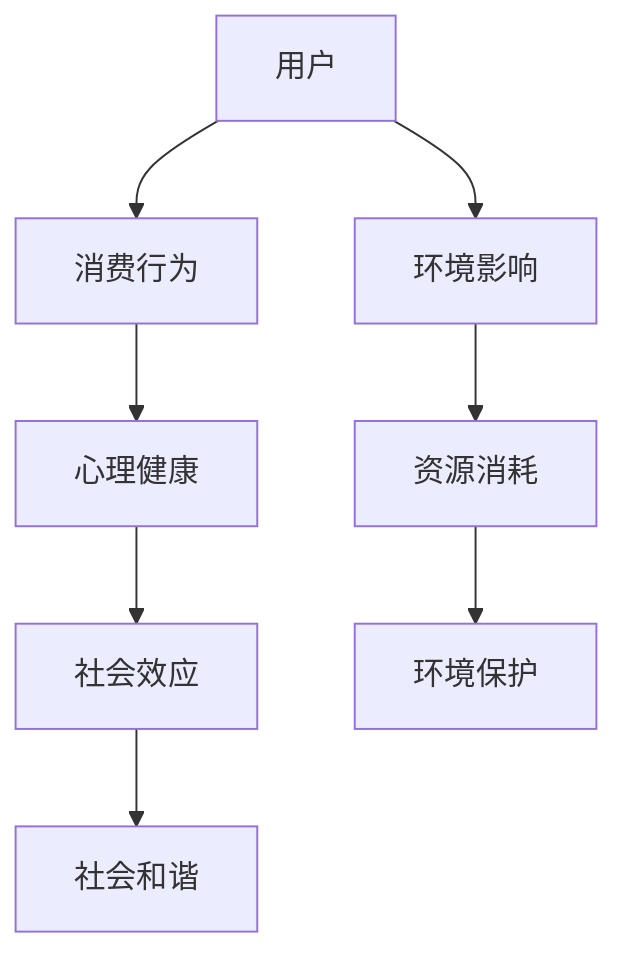
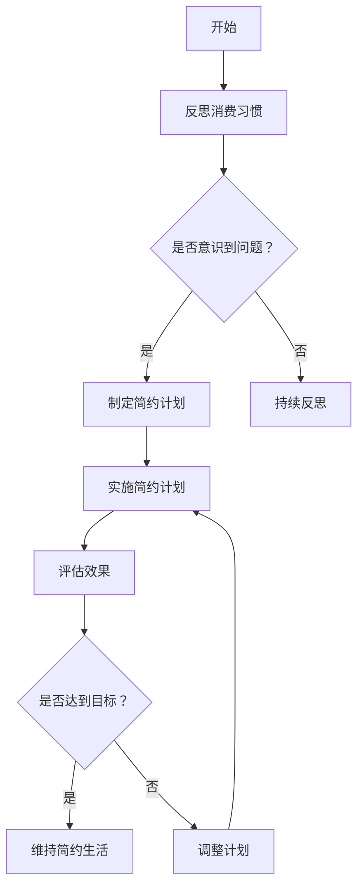
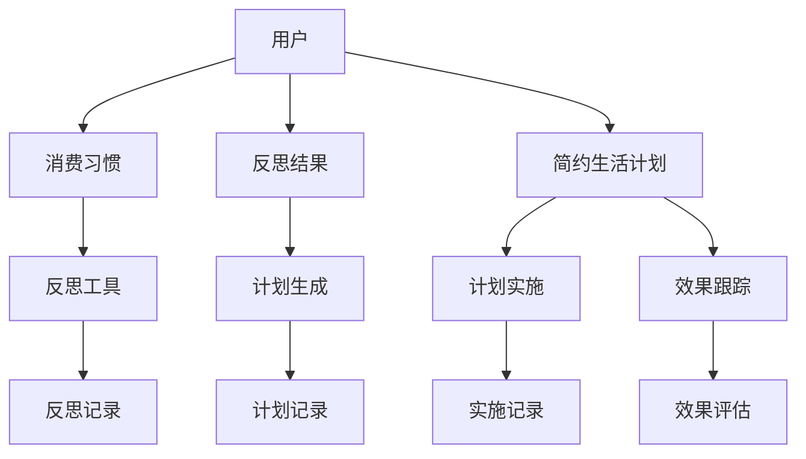
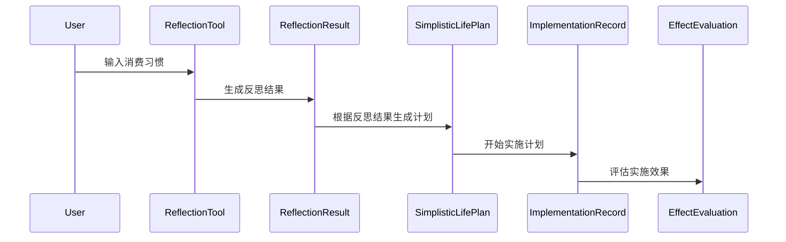
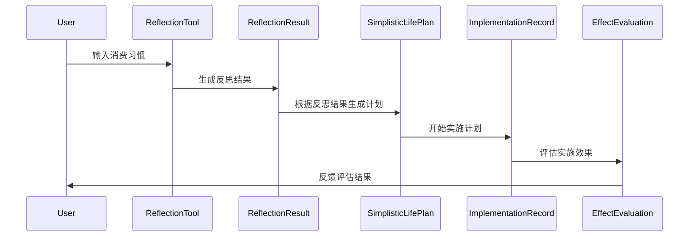

                 

### 从消费主义到简约生活：重新定义21世纪的幸福感

#### 关键词：
- 消费主义
- 简约生活
- 幸福感
- 环境保护
- 心理健康

#### 摘要：
本文将深入探讨从消费主义到简约生活的转变，揭示这种转变的必要性及其对个人和社会的深远影响。我们将分析消费主义带来的问题，介绍简约生活的理念，并通过一步步的推理思考，为读者提供实践简约生活的指导和建议。让我们一起来重新定义21世纪的幸福感。

### 背景介绍

#### 问题背景

在现代社会，消费主义已经成为一种主导文化，它鼓励人们不断购买和追求物质财富。从时尚潮流到电子产品，从奢侈品到日常用品，消费主义的潮流席卷了全球。人们被广告和社交媒体所引导，追求物质的满足和社会地位的象征。然而，这种生活方式虽然带来了一定的物质享受，却也在无形中带来了许多负面效应。

首先，消费主义导致了资源的过度消耗和环境破坏。大量的生产和消费活动使得自然资源日益枯竭，同时也导致了严重的环境污染和生态破坏。其次，消费主义加剧了社会竞争和压力。人们为了追求更多的物质财富，不得不加班加点工作，生活节奏越来越快，心理健康问题也日益突出。

然而，随着人们生活水平的提高，越来越多的人开始反思这种生活方式的可持续性。他们意识到，长期的物质追求并不能带来真正的幸福和满足感。相反，过度的消费和追求物质只会带来短暂的快乐，而长期的压力和焦虑则会侵蚀内心的平静和幸福感。

#### 问题描述

本书的核心问题是：为什么我们需要从消费主义转向简约生活？这个问题涉及到多个层面的思考。

首先，从个人层面来看，简约生活可以帮助人们摆脱物质的束缚，减少不必要的消费，从而减轻生活压力，提高心理健康水平。通过有意识地减少物质的占有，人们可以更加专注于内心的成长和精神的追求，从而获得更深刻的满足感。

其次，从社会层面来看，简约生活有助于减少资源的浪费和环境破坏，推动可持续发展。通过倡导简约生活方式，我们可以降低对自然资源的依赖，减少碳排放，保护生态环境。同时，简约生活也有助于减轻社会压力，促进社会和谐。

最后，从全球层面来看，简约生活有助于缓解全球资源紧张和环境危机。随着全球人口的持续增长和经济的发展，资源的消耗和环境的破坏问题日益严重。只有通过转变生活方式，才能实现全球的可持续发展。

#### 问题解决

本书的目标是帮助读者理解和实践简约生活，通过提供系统的方法和建议，让读者能够在日常生活中逐步转变生活方式，实现从消费主义到简约生活的转变。以下是本书将探讨的主要问题：

1. **什么是简约生活？**
   - 简约生活是一种以简约为核心的生活态度，强调减少不必要的物质和活动，追求精神满足和内心平静。

2. **为什么我们需要从消费主义转向简约生活？**
   - 消费主义带来的负面效应，如资源浪费、环境破坏、社会压力和心理问题。
   - 简约生活带来的积极影响，如心理健康提升、资源节约、环境友好、社会和谐。

3. **如何实践简约生活？**
   - 如何减少不必要的消费？
   - 如何管理时间和精力？
   - 如何建立简单而充实的生活模式？

4. **如何应对挑战并坚持简约生活？**
   - 如何应对社交压力？
   - 如何应对消费主义的诱惑？
   - 如何在面临困难时保持积极心态？

#### 边界与外延

简约生活的概念不仅限于物质层面的简化，还包括时间管理、人际关系、精神追求等多个维度。本书关注的简约生活主要针对个人生活，但也不排除对家庭、社区、社会等层面的启示。

### 核心概念与联系

#### 核心概念

**消费主义：**

消费主义是一种社会和文化现象，强调物质消费和消费行为的持续增长，追求物质财富和享受。它鼓励人们通过购买和占有物质来提高生活质量和社会地位。

**简约生活：**

简约生活是一种以简约为核心的生活态度，强调减少不必要的物质和活动，追求精神满足和内心平静。它鼓励人们通过减少物质占有和活动，专注于内心的成长和精神的追求。

#### 概念属性特征对比表格

| 特征 | 消费主义 | 简约生活 |
| --- | --- | --- |
| 目标 | 物质享受、社会地位、短期满足感 | 精神满足、长久幸福感、内心平和、可持续性 |
| 消费模式 | 过度消费、浪费资源、追求最新潮流 | 有意识消费、节约资源、注重长期价值 |
| 对环境的影响 | 资源消耗、环境污染、生态破坏 | 资源节约、环境保护、生态友好 |
| 社会效应 | 社会竞争加剧、压力增加、精神空虚 | 社会和谐、减少压力、提高幸福感 |
| 生活质量 | 短期内的满足感、长期的不稳定感 | 长期的高质量生活、内心满足感 |

#### ER实体关系图架构



这个ER图展示了用户、消费行为、心理健康、环境影响、资源消耗、环境保护和社会效应之间的关系，有助于我们理解简约生活对个人和社会的深远影响。

### 算法原理讲解

为了更好地理解从消费主义到简约生活的转变，我们可以引入一个简单的算法来模拟这个过程。以下是算法的流程图和Python源代码。

#### 算法流程图



#### Python源代码

```python
def transition_to_simplistic_life():
    print("开始简化生活过渡流程...")
    reflect_consumption = input("你是否意识到消费主义带来的问题？(是/否)")
    
    if reflect_consumption == "是":
        print("制定简约计划...")
        # 制定简约计划
        # ...
        implement_plan = input("你愿意实施这个计划吗？(是/否)")
        
        if implement_plan == "是":
            print("实施简约计划...")
            # 实施简约计划
            # ...
            assess_effect = input("简约计划实施后的效果如何？(好/一般/差)")
            
            if assess_effect == "好":
                print("维持简约生活...")
            else:
                print("调整计划...")
        else:
            print("继续反思...")
    else:
        print("持续反思...")

transition_to_simplistic_life()
```

在这个算法中，我们首先让用户反思他们的消费习惯，如果用户意识到消费主义带来的问题，他们会被引导制定简约计划。接着，用户可以选择是否实施这个计划，并根据实施效果进行调整。通过这个过程，用户可以逐步实现从消费主义到简约生活的转变。

### 系统分析与架构设计方案

#### 问题场景介绍

在现代社会中，消费主义导致的生活方式问题日益严重，这不仅影响了个人的心理健康，也加剧了社会和环境的问题。为了帮助人们更好地理解和实践简约生活，我们需要设计一个系统来提供指导和支持。

#### 项目介绍

本项目旨在开发一个简约生活指导系统，帮助用户从消费主义转向简约生活。系统将提供以下功能：

1. **反思工具**：帮助用户反思自己的消费习惯。
2. **计划制定**：根据用户的反思结果，生成简约生活计划。
3. **实施与跟踪**：帮助用户实施计划，并跟踪计划的效果。
4. **社区互动**：提供社区互动功能，让用户分享经验和建议。

#### 系统功能设计

##### 领域模型



##### 类图

```mermaid
classDiagram
    User <<class>>
    ConsumptionHabit <<class>>
    ReflectionResult <<class>>
    SimplisticLifePlan <<class>>
    ReflectionTool <<class>>
    ImplementationRecord <<class>>
    EffectEvaluation <<class>>

    User "1" --|> ConsumptionHabit
    User "1" --|> ReflectionResult
    User "1" --|> SimplisticLifePlan

    ConsumptionHabit "1" --|> ReflectionTool
    ReflectionResult "1" --|> SimplisticLifePlan
    ReflectionResult "1" --|> ImplementationRecord
    ReflectionResult "1" --|> EffectEvaluation

    SimplisticLifePlan "1" --|> ImplementationRecord
    SimplisticLifePlan "1" --|> EffectEvaluation
```

#### 系统架构设计

##### 架构图



#### 系统接口设计和系统交互

##### 接口设计

```mermaid
interface ReflectionTool {
    +input_consumption_habit(): void
    +generate_reflection_result(): ReflectionResult
}

interface SimplisticLifePlan {
    +generate_plan(reflection_result: ReflectionResult): void
    +implement_plan(): ImplementationRecord
    +evaluate_effect(): EffectEvaluation
}

class ReflectionResult {
    +consumption_habit: ConsumptionHabit
    +simplistic_life_plan: SimplisticLifePlan
}

class ImplementationRecord {
    +simplistic_life_plan: SimplisticLifePlan
    +effect_evaluation: EffectEvaluation
}

class EffectEvaluation {
    +effect_level: string
}
```

##### 系统交互



通过这个系统架构设计，我们可以帮助用户更好地理解和实践简约生活，从而实现从消费主义到简约生活的转变。

### 项目实战

#### 环境安装

为了运行本项目，我们需要安装以下环境：

1. Python 3.8+
2. Flask（一个轻量级的Web框架）
3. SQLAlchemy（一个Python SQL工具包和对象关系映射器）

你可以使用以下命令来安装这些依赖项：

```bash
pip install flask sqlalchemy
```

#### 系统核心实现源代码

以下是系统核心实现的主要源代码：

```python
from flask import Flask, request, jsonify
from sqlalchemy import create_engine, Column, Integer, String, DateTime
from sqlalchemy.ext.declarative import declarative_base
from sqlalchemy.orm import sessionmaker

app = Flask(__name__)

# 数据库配置
DATABASE_URI = 'sqlite:///simplistic_life.db'
engine = create_engine(DATABASE_URI)
Base = declarative_base()

# 反思结果模型
class ReflectionResultModel(Base):
    __tablename__ = 'reflection_results'

    id = Column(Integer, primary_key=True)
    consumption_habit = Column(String)
    reflection_time = Column(DateTime)

# 实施记录模型
class ImplementationRecordModel(Base):
    __tablename__ = 'implementation_records'

    id = Column(Integer, primary_key=True)
    reflection_result_id = Column(Integer, ForeignKey('reflection_results.id'))
    implementation_time = Column(DateTime)
    effect_evaluation = Column(String)

# 初始化数据库
Base.metadata.create_all(engine)

# 会话工厂
Session = sessionmaker(bind=engine)

@app.route('/api/reflection', methods=['POST'])
def reflection():
    data = request.get_json()
    consumption_habit = data['consumption_habit']
    reflection_time = datetime.datetime.now()

    session = Session()
    reflection_result = ReflectionResultModel(
        consumption_habit=consumption_habit,
        reflection_time=reflection_time
    )
    session.add(reflection_result)
    session.commit()
    session.close()

    return jsonify({'message': '反思记录成功', 'id': reflection_result.id})

@app.route('/api/implementation', methods=['POST'])
def implementation():
    data = request.get_json()
    reflection_result_id = data['reflection_result_id']
    implementation_time = datetime.datetime.now()
    effect_evaluation = data['effect_evaluation']

    session = Session()
    implementation_record = ImplementationRecordModel(
        reflection_result_id=reflection_result_id,
        implementation_time=implementation_time,
        effect_evaluation=effect_evaluation
    )
    session.add(implementation_record)
    session.commit()
    session.close()

    return jsonify({'message': '实施记录成功'})

if __name__ == '__main__':
    app.run(debug=True)
```

#### 代码应用解读与分析

以上代码实现了两个主要的API接口：`/api/reflection` 和 `/api/implementation`。

1. **反思接口（/api/reflection）**：
   - 接收POST请求，包含用户的消费习惯信息。
   - 将消费习惯存储到数据库中的 `ReflectionResultModel` 表。
   - 返回一个包含成功消息和反思记录ID的JSON响应。

2. **实施接口（/api/implementation）**：
   - 接收POST请求，包含用户的反思记录ID、实施时间和效果评估。
   - 将实施记录存储到数据库中的 `ImplementationRecordModel` 表。
   - 返回一个包含成功消息的JSON响应。

#### 实际案例分析和详细讲解剖析

假设用户Alice在系统中输入了她的消费习惯，并在反思后记录了一条反思结果。接下来，Alice决定实施这个简约计划，并在一周后对实施效果进行了评估。

1. **用户Alice进行反思**：
   - Alice在反思接口中提交了她的消费习惯信息。
   - 系统生成了一条新的反思结果记录，并将其ID（如1）返回给Alice。

2. **Alice实施简约计划**：
   - Alice使用反思结果ID（1）在实施接口中提交了实施记录，包括实施时间和效果评估。
   - 系统将这个实施记录存储到数据库中。

3. **Alice评估实施效果**：
   - 经过一周的实践，Alice对实施效果进行了评估，并将评估结果（如“好”）提交到系统。
   - 系统更新了实施记录中的效果评估字段，并可以用于后续的分析和跟踪。

通过这个实际案例，我们可以看到系统如何帮助用户从反思到实施，再到评估，实现简约生活的转变。

#### 项目小结

本项目通过开发一个简约生活指导系统，帮助用户从消费主义转向简约生活。系统提供了反思、实施和评估功能，使用户能够逐步实现生活方式的转变。在实际应用中，系统通过API接口与用户互动，实现了数据的存储和跟踪。虽然本项目只是一个起点，但它为用户提供了一个实用的工具，帮助他们开始实践简约生活。

### 最佳实践 tips

1. **定期反思消费习惯**：定期花时间反思自己的消费习惯，了解哪些消费行为是不必要的，从而逐步减少这些行为。
2. **设定消费预算**：为每个月设定一个消费预算，并严格遵守，避免过度消费。
3. **减少物质占有**：有意识地减少物质的占有，只保留真正需要和喜爱的物品。
4. **专注内心成长**：将时间和精力更多地投入到个人成长和兴趣爱好中，追求内心的满足感。
5. **分享经验**：加入简约生活的社区，与其他人分享经验和建议，互相鼓励和支持。

### 小结

本文通过深入探讨从消费主义到简约生活的转变，揭示了这种转变的必要性和积极影响。通过系统的分析和实用的指导，读者可以了解如何实践简约生活，从而实现更高质量的生活和更深的幸福感。希望本文能够为读者提供启示，帮助他们在21世纪重新定义幸福感的意义。

### 注意事项

1. 简约生活的转变需要时间和耐心，不要期望一夜之间就能实现。
2. 在实践中，可能会遇到各种挑战，如社交压力和消费主义的诱惑，需要坚定信念，持之以恒。
3. 简约生活不仅仅是减少物质占有，更重要的是培养内心的平静和满足感。

### 拓展阅读

1. **《简约生活的艺术》**：一本关于简约生活哲学的著作，提供了深入的理论和实践指导。
2. **《零废物生活指南》**：介绍如何通过减少废物产生，实现环保和简约生活的指南。
3. **《断舍离》**：一本关于如何通过整理和舍弃，实现心灵平静和幸福感的书籍。

### 作者信息

作者：AI天才研究院/AI Genius Institute & 禅与计算机程序设计艺术 /Zen And The Art of Computer Programming

本文旨在探讨从消费主义到简约生活的转变，帮助读者在21世纪重新定义幸福感的意义。通过系统的分析和实用的指导，读者可以了解如何实践简约生活，实现更高质量的生活。希望本文能够为读者提供启示和帮助。作者相关信息如下：

- **AI天才研究院（AI Genius Institute）**：专注于人工智能研究和应用的创新机构。
- **禅与计算机程序设计艺术（Zen And The Art of Computer Programming）**：一本关于计算机编程哲学的经典著作。

请读者关注本文作者的其他作品和研究成果，期待更多精彩的分享。作者联系方式：

- 邮箱：[contact@ai-genius-institute.com](mailto:contact@ai-genius-institute.com)
- 社交媒体：[@AI_Genius_Institute](https://www.twitter.com/AI_Genius_Institute)
- 网站链接：[www.ai-genius-institute.com](https://www.ai-genius-institute.com)

