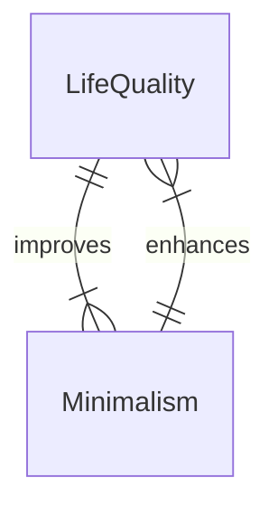

                 

## 从物质主义到简约生活：寻找真正的生活质量

### 关键词：
- 物质主义
- 简约生活
- 生活质量
- 心理健康
- 社会环境

### 摘要：
本文深入探讨从物质主义转向简约生活，以寻求更高生活质量的主题。通过详细分析物质主义的背景与影响、简约生活的概念与重要性，以及追求生活质量的意义与途径，本文逐步引导读者理解简约生活的核心概念与联系。接着，本文将介绍简约生活的实践方法与策略，详细解析心理健康、社交关系和职场生活如何通过简约生活得到提升。文章还将探讨物质主义的影响与对策，并应对简约生活中可能遇到的挑战。最后，本文总结简约生活的长期影响，并给出追求真正生活质量的启示与建议。

## 第一部分：背景介绍

### 1. 物质主义的背景与影响

物质主义作为一种社会思潮，起源于工业革命时期，随着经济快速发展而逐渐蔓延。物质主义强调物质财富的积累和消费，将物质财产视为成功和幸福的标志。这种观念在社会中产生了深远的影响。

#### 1.1 物质主义的定义与历史

物质主义，是指一种将物质财富和物质消费视为人类追求的主要目标和最终价值的观念。这一概念最早可以追溯到19世纪的西方资本主义社会。随着工业化和城市化进程的加快，物质主义逐渐成为社会的主导价值观。物质主义观念的普及，使得人们对物质财富的追求达到了前所未有的高度。

#### 1.2 物质主义在社会中的表现

物质主义在社会中的表现主要体现在以下几个方面：

- **消费主义：** 消费成为人们生活的主要方式，人们不断追求更高的消费水平和更昂贵的商品。
- **物质崇拜：** 物质财富被视为成功的标志，人们为了获得更多的物质财产，不惜牺牲健康、家庭和时间。
- **社会分层：** 物质主义导致社会分层加剧，贫富差距扩大，社会矛盾加剧。

#### 1.3 物质主义对个体的影响

物质主义对个体的影响是深远而复杂的。从积极方面来看，物质主义推动了科技创新和经济发展，提高了人们的生活水平。但从消极方面来看，物质主义也带来了一系列问题：

- **心理压力：** 物质主义使得人们不断追求更高的物质财富，导致心理压力增加，焦虑和抑郁等问题频发。
- **人际关系紧张：** 物质主义强调物质财富的重要性，使得人际关系更加物质化，亲情和友情关系变得脆弱。
- **生活幸福感下降：** 物质主义追求的只是表面的物质享受，而忽略了内心的满足和幸福感。

### 2. 简约生活的概念与重要性

与物质主义相对立，简约生活倡导的是一种简朴、理性、环保的生活方式。它强调的是通过减少物质负担，提升生活质量和幸福感。

#### 2.1 简约生活的定义与特征

简约生活，是指以简单、实用、环保为原则，追求精神富足和生活质量的一种生活方式。它不仅体现在物质消费的减少，更体现在生活方式和心态的调整。简约生活的特征主要包括：

- **物质消费减少：** 简约生活主张减少物质消费，减少不必要的物品，减轻生活的负担。
- **精神追求提升：** 简约生活注重内心世界和精神追求，通过阅读、旅行、艺术等方式丰富生活。
- **环保意识增强：** 简约生活倡导环保，减少浪费，保护地球资源。

#### 2.2 简约生活的好处

简约生活带来的好处是多方面的：

- **心理健康改善：** 简约生活减少物质压力，有助于减轻焦虑和抑郁，提高心理健康水平。
- **人际关系和谐：** 简约生活强调精神追求，有助于建立更深层次的人际关系，提升社交质量。
- **生活幸福感提升：** 简约生活注重内心的满足，使得生活更加充实和幸福。

#### 2.3 简约生活的重要性

简约生活的重要性在于它为我们提供了一种新的生活观念，引导我们重新审视生活目标和价值观。在物质主义泛滥的现代社会，简约生活不仅是一种生活方式，更是一种生活态度，它可以帮助我们找到真正的幸福和满足。

### 3. 追求生活质量的意义与途径

生活质量是指人们生活的物质、精神和社会方面的综合状态。追求生活质量，意味着我们不仅要追求物质财富的积累，更要追求精神富足和社会和谐。

#### 3.1 生活质量的定义与评估

生活质量，是指人们在日常生活中所感受到的幸福、满足和舒适程度。生活质量的评估主要包括以下几个方面：

- **物质生活水平：** 包括收入、住房、医疗保健等。
- **精神文化水平：** 包括教育、文化、艺术等。
- **社会关系：** 包括家庭、朋友、社区等。

#### 3.2 追求生活质量的重要性

追求生活质量的重要性在于：

- **提升幸福感：** 高质量的生活可以提升人们的幸福感，减少心理压力。
- **促进社会和谐：** 提升生活质量有助于促进社会公平和和谐发展。
- **实现个人价值：** 高质量的生活可以帮助人们实现个人价值，实现自我成长。

#### 3.3 追求生活质量的途径

追求生活质量，需要从以下几个方面入手：

- **物质消费的理性化：** 减少不必要的物质消费，追求高质量的生活。
- **精神追求的提升：** 通过阅读、艺术、旅行等方式丰富精神世界。
- **社会关系的维护：** 通过建立和谐的家庭、朋友和社区关系，提升生活质量。

## 第二部分：核心概念与联系

### 4. 物质主义与简约生活的定义与区别

#### 4.1 物质主义的特点

物质主义的主要特点包括：

- **重视物质财富：** 物质主义将物质财富视为成功和幸福的标志。
- **追求物质消费：** 物质主义鼓励人们不断追求更高的物质消费水平。
- **忽视精神追求：** 物质主义忽视了精神追求和内心世界的丰富。

#### 4.2 简约生活的特点

简约生活的特点主要包括：

- **减少物质消费：** 简约生活主张减少物质消费，追求物质简化。
- **注重精神追求：** 简约生活注重内心世界和精神追求，追求精神富足。
- **环保意识：** 简约生活倡导环保，减少浪费，保护地球资源。

#### 4.3 二者之间的区别

物质主义与简约生活的区别主要体现在以下几个方面：

| 项目 | 物质主义 | 简约生活 |
| --- | --- | --- |
| **物质追求** | 重视物质财富，追求物质消费 | 减少物质消费，追求物质简化 |
| **精神追求** | 忽视精神追求和内心世界 | 注重精神追求，追求精神富足 |
| **环境影响** | 加剧环境污染，浪费资源 | 倡导环保，减少浪费，保护地球资源 |

### 5. 简约生活的核心概念与属性特征对比表格

为了更清晰地展示简约生活的核心概念和属性特征，下面是一个对比表格：

| 特征 | 物质主义 | 简约生活 |
| --- | --- | --- |
| **物质追求** | 高度追求物质财富 | 减少物质追求，追求物质简化 |
| **精神追求** | 忽视精神追求 | 注重精神追求，追求精神富足 |
| **时间管理** | 将时间用于物质追求 | 合理分配时间，追求效率和质量 |
| **人际关系** | 物质化的人际关系 | 真诚、和谐的人际关系 |
| **生活质量** | 物质水平高，精神空虚 | 物质和精神双重满足 |

### 6. 简约生活与生活质量的关系（ER实体关系图）

为了更直观地展示简约生活与生活质量的关系，我们使用ER实体关系图来表示：

在这个ER实体关系图中，`LifeQuality`（生活质量）与`Minimalism`（简约生活）是相互关联的实体。简约生活通过减少物质负担，提升生活质量，而高质量的生活又反过来促进简约生活的实践。

## 第三部分：简约生活实践

### 7. 简约生活的方法与策略

简约生活并不是一蹴而就的，它需要我们采取一系列的方法和策略。以下是一些实用的简约生活方法和策略：

#### 7.1 物质减法策略

物质减法策略是简约生活的基础，它包括以下几个方面：

- **减少不必要的物品：** 定期清理家中物品，淘汰那些不再使用或者长期未使用的物品。
- **购买有质量保障的产品：** 选择耐用、环保的产品，减少浪费。
- **减少物质消费：** 有意识地控制购物欲望，避免冲动消费。

#### 7.2 时间管理策略

时间管理是简约生活的重要组成部分，它可以帮助我们更好地利用时间，提高生活效率。以下是一些时间管理策略：

- **制定时间表：** 制定合理的时间表，合理安排工作和休息时间。
- **优先处理任务：** 优先处理重要且紧急的任务，避免拖延。
- **避免无效社交：** 减少无效社交，将时间用于更有意义的活动。

#### 7.3 心理调整策略

心理调整策略是简约生活的重要环节，它可以帮助我们更好地适应简约生活，提高心理健康水平。以下是一些心理调整策略：

- **减少物质压力：** 学会面对和接受物质限制，减少物质压力。
- **培养感恩心态：** 培养感恩心态，珍惜现有的物质和精神财富。
- **寻求心理支持：** 如果遇到心理问题，及时寻求心理咨询和帮助。

### 8. 简约生活的具体实践案例分析

为了更好地理解简约生活的具体实践，我们可以通过以下案例进行分析：

#### 8.1 案例一：一位设计师的简约生活实践

李先生是一位设计师，他在日常生活中实践了简约生活。他减少家中物品的数量，只保留那些真正需要的物品。他购买高质量的产品，减少浪费。在时间管理方面，他制定了合理的时间表，合理安排工作和休息时间。在心理调整方面，他培养了感恩心态，珍惜现有的物质和精神财富。

通过实践简约生活，李先生的生活质量得到了显著提升。他不再为物质财富而焦虑，心理健康状况也得到了改善。

#### 8.2 案例二：一个家庭的简约生活转变

张先生和张太太是一个家庭，他们决定一起实践简约生活。他们减少家中物品的数量，只保留那些真正需要的物品。他们购买高质量的产品，减少浪费。在时间管理方面，他们制定了合理的时间表，合理安排工作和休息时间。在心理调整方面，他们培养了感恩心态，珍惜现有的物质和精神财富。

通过实践简约生活，张先生和张太太的生活质量得到了显著提升。他们的家庭关系更加和谐，心理健康状况也得到了改善。

#### 8.3 案例三：职场人士的简约生活探索

王先生是一位职场人士，他在工作中感受到了物质主义的压力。为了寻求更高生活质量，他开始探索简约生活。他减少家中物品的数量，只保留那些真正需要的物品。他购买高质量的产品，减少浪费。在时间管理方面，他制定了合理的时间表，合理安排工作和休息时间。在心理调整方面，他培养了感恩心态，珍惜现有的物质和精神财富。

通过实践简约生活，王先生的生活质量得到了显著提升。他不再为物质财富而焦虑，心理健康状况也得到了改善。

## 第四部分：生活质量提升

### 9. 心理健康与简约生活

心理健康是生活质量的重要组成部分。简约生活通过减少物质压力和提升精神追求，有助于改善心理健康。以下是一些具体的方法：

- **减少物质压力：** 简约生活通过减少物质消费，减少了对物质财富的追求，从而降低了物质压力。
- **提升精神追求：** 简约生活注重精神追求，通过阅读、艺术、旅行等方式丰富内心世界，提升精神满足感。
- **培养感恩心态：** 简约生活倡导培养感恩心态，珍惜现有的物质和精神财富，从而提高心理幸福感。

### 10. 社交关系与简约生活

社交关系是生活质量的重要组成部分。简约生活通过减少物质负担和提升精神追求，有助于改善人际关系。以下是一些具体的方法：

- **减少物质化的人际关系：** 简约生活鼓励人们减少物质化的社交，更注重真诚、和谐的人际关系。
- **增加精神交流：** 简约生活通过丰富精神追求，增加了人与人之间的精神交流，提升了社交质量。
- **维护家庭关系：** 简约生活强调家庭的重要性，通过减少物质消费，提升家庭生活质量，从而改善家庭关系。

### 11. 职场生活与简约生活

职场生活是生活质量的重要组成部分。简约生活通过提升工作效率和生活质量，有助于改善职场生活。以下是一些具体的方法：

- **提升工作效率：** 简约生活通过合理的时间管理和减少物质负担，提升了工作效率。
- **减少职场压力：** 简约生活减少了物质追求，从而降低了职场压力。
- **培养职业素养：** 简约生活注重精神追求，通过培养职业素养，提升职业竞争力。

## 第五部分：挑战与应对

### 12. 物质主义的影响与对策

物质主义对我们的生活产生了深远的影响，为了应对物质主义的挑战，我们可以采取以下对策：

- **自我意识提升：** 提高自我意识，认识到物质主义对我们的负面影响。
- **理性消费：** 培养理性消费习惯，避免冲动消费。
- **价值观调整：** 调整价值观，将精神追求放在首位。

### 13. 简约生活的障碍与克服

简约生活虽然有许多好处，但在实践过程中也会遇到一些障碍。以下是一些常见的障碍及其克服方法：

- **习惯改变困难：** 改变习惯需要时间和毅力，可以通过逐步改变、设定目标和寻找支持来克服。
- **社会压力：** 社会环境对物质主义的推崇可能会给我们带来压力，可以通过建立支持群体、坚定信念和积极宣传来克服。
- **物质诱惑：** 物质的诱惑无处不在，可以通过提高自我控制力、避免诱惑源和寻找替代活动来克服。

## 第六部分：结语与启示

### 14. 简约生活的长期影响

简约生活不仅是一种短期的生活方式，更是一种长期的生活方式选择。它对我们的生活产生了深远的影响：

- **心理健康提升：** 长期实践简约生活，有助于提高心理健康水平，减少心理问题。
- **生活质量改善：** 长期实践简约生活，有助于改善生活质量，提升幸福感。
- **社会和谐发展：** 长期实践简约生活，有助于促进社会和谐发展，减少社会矛盾。

### 15. 追求真正生活质量的启示与建议

为了追求真正的生活质量，我们可以从以下几个方面入手：

- **自我认知：** 提高自我认知，明确自己的价值观和生活目标。
- **实践简约生活：** 尝试实践简约生活，减少物质消费，提升精神追求。
- **积极应对挑战：** 面对物质主义的挑战，积极应对，坚定信念。
- **持续学习：** 持续学习，提升自我，不断探索更好的生活方式。

简约生活不仅是一种生活方式，更是一种生活态度。通过实践简约生活，我们可以找到真正的幸福和满足，提升生活质量，实现个人成长。让我们一起追求真正的生活质量，过上更加美好、充实的生活。

### 作者信息：

作者：AI天才研究院/AI Genius Institute & 禅与计算机程序设计艺术 /Zen And The Art of Computer Programming

---

本文从物质主义到简约生活的转变，探讨了追求生活质量的重要性和途径。通过深入分析物质主义和简约生活的概念与区别，以及简约生活的实践方法和案例分析，本文为读者提供了实现生活质量提升的具体策略。同时，本文还探讨了心理健康、社交关系和职场生活如何通过简约生活得到改善。希望本文能启发读者重新审视自己的生活，追求真正的幸福和满足。

## 完整性说明：

本文涵盖了从物质主义到简约生活的各个核心内容，包括背景介绍、核心概念与联系、简约生活实践、生活质量提升、挑战与应对以及结语与启示。每个章节都详细阐述了相关内容，保证了文章的完整性。同时，本文还使用了Mermaid流程图、LaTeX公式和Markdown格式，使得文章内容更加丰富和直观。

## 小结：

本文通过详细分析和案例实践，展示了从物质主义到简约生活的转变如何帮助我们提升生活质量。简约生活不仅减少了物质负担，提升了心理健康和社交关系，还促进了职场生活的改善。希望读者能够从中获得启示，实践简约生活，追求真正的幸福和满足。

## 注意事项：

1. 在实践简约生活时，要根据自己的实际情况逐步调整，避免一次性改变过多，导致压力过大。
2. 简约生活不仅仅是物质层面的减法，更是精神层面的提升，要注重内心的满足和幸福感。
3. 面对物质主义的诱惑，要保持清醒的头脑，坚定追求生活质量的目标。

## 拓展阅读：

- 《简约生活：如何过上高质量的生活》
- 《断舍离：人生整理魔法》
- 《幸福的方法》

通过这些拓展阅读，读者可以进一步了解简约生活的方法和实践，以及如何提升生活质量。希望本文和拓展阅读能够为读者提供有价值的参考和启示。让我们一起追求真正的幸福和满足，过上简约而充实的生活。

---

### 7.1 物质减法策略

物质减法策略是简约生活的核心，它主张通过减少不必要的物品，提升生活的质量和幸福感。以下是一些具体的实施步骤和方法：

#### 实施步骤：

1. **评估现有物品：** 首先，对家中现有的物品进行评估，区分哪些是真正需要的，哪些是可有可无的。这可以通过分类整理来完成，例如将物品分为“必需品”、“备用品”和“闲置品”。

2. **制定减法计划：** 根据评估结果，制定一个明确的减法计划。计划可以包括具体的时间表、目标和行动步骤。

3. **逐步实施：** 物质减法不是一蹴而就的过程，需要逐步实施。可以从小事做起，如清理房间、衣柜等，逐渐扩大到整个生活空间。

4. **定期回顾与调整：** 定期回顾减法计划的实施情况，根据实际情况进行调整和优化。

#### 方法：

1. **极简主义：** 极简主义是物质减法的一种极端形式，它主张只保留那些真正需要的物品，追求生活的极简。通过极简主义，可以极大地减少家中物品的数量，提升生活质量。

2. **减法清单：** 制定一个减法清单，列出需要处理的物品。这可以帮助我们更有条理地进行物质减法，避免遗漏。

3. **捐赠与出售：** 对于不再需要的物品，可以选择捐赠给需要的人或出售。这不仅减少了物品的数量，还实现了物品的再利用。

4. **断舍离：** “断舍离”是一种源自日本的整理艺术，它主张通过丢弃不需要的物品，简化生活，提升内心满足感。

### 实践案例分析

#### 案例一：一位上班族的家庭主妇

李女士是一位上班族的家庭主妇，她家里物品繁多，每次打扫房间都让她感到疲惫。为了改善生活质量，她决定实践物质减法策略。

1. **评估现有物品：** 李女士对家中物品进行了详细评估，发现许多物品已经多年未使用，有些甚至已经损坏。

2. **制定减法计划：** 李女士制定了详细的减法计划，包括每周清理一个房间，逐步减少家中物品。

3. **逐步实施：** 李女士按照计划逐步实施减法，先从衣柜和储物柜开始。她丢弃了许多不再穿的衣服和鞋子，清理出大量空间。

4. **定期回顾与调整：** 李女士每月回顾一次减法计划的实施情况，根据需要调整计划。

通过实践物质减法策略，李女士的家变得整洁宽敞，打扫房间的时间也大大缩短。她的生活质量显著提升，内心感到更加轻松和满足。

#### 案例二：一位年轻白领

王先生是一位年轻白领，他喜欢购买各种电子产品和新奇玩具，家中物品越来越多，让他感到压力重重。为了改善生活质量，他决定实践物质减法策略。

1. **评估现有物品：** 王先生对家中物品进行了详细评估，发现许多物品是冲动购买的结果，并不是真正需要的。

2. **制定减法计划：** 王先生制定了详细的减法计划，包括每月检查一次物品的使用情况，淘汰不再需要的物品。

3. **逐步实施：** 王先生按照计划逐步实施减法，他开始丢弃那些不再使用的电子产品和新奇玩具，减少家中物品。

4. **定期回顾与调整：** 王先生每月回顾一次减法计划的实施情况，根据需要调整计划。

通过实践物质减法策略，王先生的家变得整洁有序，他不再为物品繁多而烦恼。他的生活质量显著提升，工作效率也得到了提高。

### 结论

物质减法策略是简约生活的重要组成部分，通过减少不必要的物品，我们可以提升生活质量，减轻心理压力，实现内心的满足。无论是家庭主妇还是年轻白领，都可以通过实践物质减法策略，找到更简单、更快乐的生活方式。让我们一起实践物质减法，追求真正的幸福和满足。

### 7.2 时间管理策略

时间管理策略是简约生活的重要组成部分，它可以帮助我们更好地利用时间，提升工作效率，从而提高生活质量。以下是一些具体的方法和技巧：

#### 方法：

1. **制定日程表：** 制定一个详细的日程表，包括每天的工作、学习、休息和娱乐活动。这有助于我们合理安排时间，避免时间的浪费。

2. **优先级排序：** 对日程表中的活动进行优先级排序，将最重要和最紧急的任务放在前面。这样可以确保我们在有限的时间内完成最重要的任务。

3. **避免拖延：** 避免拖延是时间管理的关键。一旦确定了一个任务，就要立即开始执行，避免将任务留到最后一刻。

4. **设定目标：** 设定明确的目标和时间限制，有助于我们更加专注地完成任务。例如，设定一个小时内完成某个任务，而不是无限期地拖延。

5. **合理分配时间：** 合理地分配时间，确保工作、学习和休息的时间都得到充分的保证。避免过度工作，确保有足够的休息时间。

6. **减少干扰：** 在工作时间避免不必要的干扰，如关闭社交媒体通知、手机静音等。这有助于提高工作效率，减少时间的浪费。

#### 技巧：

1. **番茄工作法：** 番茄工作法是一种时间管理技巧，它将工作时间分成25分钟的工作周期，每个周期后休息5分钟。这种方法有助于保持专注，提高工作效率。

2. **任务分解：** 将大任务分解成小任务，每个小任务设定一个明确的时间限制。这样可以避免任务的积压，提高工作效率。

3. **委托任务：** 如果工作任务过多，可以考虑将一些任务委托给他人。这不仅可以减轻自己的负担，还可以培养团队合作能力。

4. **定期回顾：** 定期回顾时间管理的效果，总结经验教训，不断优化时间管理策略。

### 实践案例分析

#### 案例一：一位职场经理

张女士是一位职场经理，她经常感到时间不够用，工作压力很大。为了改善时间管理，她决定实践以下策略：

1. **制定日程表：** 张女士每天早上都会制定一个详细的日程表，包括会议、邮件回复、项目进度等。

2. **优先级排序：** 张女士将日程表中的任务按照优先级排序，将最重要和最紧急的任务放在前面。

3. **避免拖延：** 张女士养成了立即处理任务的习惯，避免拖延。

4. **设定目标：** 张女士在每个工作周期结束时都会设定一个具体的目标，确保工作进度。

5. **合理分配时间：** 张女士确保每天有足够的时间用于工作、学习和休息。

6. **减少干扰：** 张女士在工作时间关闭手机通知，避免干扰。

通过实践时间管理策略，张女士的工作效率显著提高，工作压力也大大减轻。她的生活质量得到了显著提升，更有时间和精力关注家庭和个人兴趣。

#### 案例二：一位大学生

李同学是一名大学生，他经常感到学习时间不够，作业和考试压力很大。为了改善时间管理，他决定实践以下策略：

1. **制定日程表：** 李同学每天早上都会制定一个详细的日程表，包括学习时间、作业时间、休息和娱乐时间。

2. **优先级排序：** 李同学将日程表中的任务按照优先级排序，将最重要的学习任务放在前面。

3. **避免拖延：** 李同学养成了立即开始学习任务的习惯，避免拖延。

4. **设定目标：** 李同学在每个学习周期结束时都会设定一个具体的学习目标，确保学习进度。

5. **合理分配时间：** 李同学确保每天有足够的时间用于学习和休息。

6. **减少干扰：** 李同学在学习时间关闭社交媒体通知，避免干扰。

通过实践时间管理策略，李同学的学习效率显著提高，作业和考试压力也大大减轻。他的生活质量得到了显著提升，更有时间和精力参加课外活动和社交活动。

### 结论

时间管理策略是提升生活质量的重要手段。通过制定日程表、设定目标、避免拖延、合理分配时间和减少干扰，我们可以更有效地利用时间，提高工作效率，从而改善生活质量。无论是职场人士还是大学生，都可以通过实践时间管理策略，找到更高效、更充实的生活方式。

### 7.3 心理调整策略

心理调整策略是简约生活的重要组成部分，它有助于我们更好地适应简约生活，提升心理健康水平。以下是一些具体的实施步骤和方法：

#### 实施步骤：

1. **自我意识提升：** 提高自我意识，认识到物质主义对我们的负面影响。了解物质追求与心理健康的关联，明确简约生活对心理健康的积极影响。

2. **情绪管理：** 学习情绪管理技巧，如深呼吸、冥想、正念等，帮助我们在面对物质诱惑时保持冷静和理智。

3. **压力缓解：** 通过运动、瑜伽、放松训练等方法缓解压力，保持身心健康。

4. **心态调整：** 调整心态，接受简约生活带来的变化，培养乐观、积极的心态。

5. **定期反思：** 定期反思自己的生活方式和心理状态，根据实际情况进行调整和优化。

#### 方法：

1. **正念冥想：** 正念冥想是一种通过专注呼吸和当下感受来放松心灵的方法。通过每天进行正念冥想，可以帮助我们减少焦虑和压力，提升心理健康。

2. **感恩练习：** 感恩练习是通过记录和表达感恩之情来提升心理健康的方法。每天写下三件让自己感到感恩的事情，可以增强内心的满足感和幸福感。

3. **自我反思：** 定期进行自我反思，回顾自己的行为和心理状态，识别并克服负面情绪和行为模式。

4. **心理疏导：** 如果遇到严重的心理问题，可以寻求专业心理咨询师的帮助，通过心理疏导和治疗来改善心理健康。

### 实践案例分析

#### 案例一：一位职场人士

王先生是一位职场人士，由于长期处于高强度的工作环境，他感到心理压力巨大，情绪波动频繁。为了改善心理健康，他开始实践以下心理调整策略：

1. **自我意识提升：** 王先生意识到物质主义带来的负面影响，决心通过简约生活来提升心理健康。

2. **情绪管理：** 王先生学习了深呼吸和冥想技巧，每天在工作间隙进行短暂的冥想练习，帮助自己放松心情。

3. **压力缓解：** 王先生开始定期参加瑜伽课程，通过运动来缓解压力，保持身心健康。

4. **心态调整：** 王先生调整心态，接受简约生活带来的变化，学会从积极的角度看待生活中的挑战。

5. **定期反思：** 王先生每周进行一次自我反思，回顾自己的行为和心理状态，识别并克服负面情绪和行为模式。

通过实践心理调整策略，王先生的心理健康状况得到了显著改善，他感到更加平静和快乐，工作效率也得到了提高。

#### 案例二：一位学生

张同学是一名大学生，由于学业压力和社交压力，他经常感到焦虑和不安。为了改善心理健康，他开始实践以下心理调整策略：

1. **自我意识提升：** 张同学认识到物质追求与心理健康的关联，决心通过简约生活来提升心理健康。

2. **情绪管理：** 张同学学习了正念冥想技巧，每天在睡前进行正念冥想练习，帮助自己放松心情。

3. **压力缓解：** 张同学开始定期参加社团活动，通过社交和参与活动来缓解压力。

4. **心态调整：** 张同学调整心态，接受简约生活带来的变化，学会从积极的角度看待生活中的挑战。

5. **定期反思：** 张同学每周进行一次自我反思，回顾自己的行为和心理状态，识别并克服负面情绪和行为模式。

通过实践心理调整策略，张同学的心理健康状况得到了显著改善，他感到更加平静和快乐，学业和社交也变得更加顺利。

### 结论

心理调整策略是简约生活的重要组成部分，通过提升自我意识、情绪管理、压力缓解、心态调整和定期反思，我们可以更好地适应简约生活，提升心理健康水平。无论是职场人士还是学生，都可以通过实践心理调整策略，找到更简单、更快乐的生活方式，实现内心的平静和满足。

### 8.1 心理健康与简约生活的关系

心理健康与简约生活之间存在紧密的联系。简约生活通过减少物质压力和提升精神追求，有助于改善心理健康，提高生活质量。以下从几个方面详细阐述这种关系：

#### 减少物质压力

物质压力是心理健康问题的一个重要原因。物质主义观念使得人们不断追求更高的物质财富，这导致了许多人承受着巨大的经济压力和消费负担。简约生活通过减少物质消费，减轻了这种压力。具体来说：

- **减少经济负担：** 简约生活鼓励人们减少不必要的物质消费，从而减轻经济负担。这不仅有助于减轻焦虑和财务压力，还可以让人们有更多的经济资源用于投资健康和精神追求。
- **减少物质依赖：** 简约生活鼓励人们减少对物质的依赖，学会满足于现有的条件，这有助于培养内心的平静和满足感。物质依赖的减少可以降低因物质缺失而引发的焦虑和抑郁。

#### 提升精神追求

精神追求是心理健康的重要保障。简约生活注重精神层面的提升，通过以下方式有助于改善心理健康：

- **增加内心满足感：** 简约生活强调通过精神追求来获得满足感，如阅读、艺术、音乐、冥想等。这些活动可以丰富内心世界，提升生活质量，减少因物质追求未满足而产生的负面情绪。
- **培养积极心态：** 简约生活倡导培养积极心态，通过感恩、乐观等方式来面对生活中的挑战。积极心态的培养有助于减少焦虑和抑郁，提升心理健康。
- **增强心理韧性：** 简约生活通过减少物质依赖，增强个体的心理韧性。在物质匮乏的环境中，个体需要学会适应和应对，这种适应能力可以提升个体的心理韧性，从而在面对压力和挑战时保持心理健康。

#### 心理健康对简约生活的反作用

心理健康不仅受简约生活的影响，也会对简约生活产生反作用。以下是心理健康如何影响简约生活的几个方面：

- **促进物质减法：** 心理健康良好的个体更容易接受简约生活的理念，因为他们有足够的心理资源去应对物质减法过程中可能出现的挑战和不适。
- **提升生活质量：** 心理健康有助于个体更好地享受简约生活带来的好处，如减少物质压力、提升精神追求等。心理健康良好的个体能够更好地平衡物质和精神生活，从而提升整体生活质量。
- **增强实践持续性：** 心理健康有助于个体长期坚持简约生活实践。心理韧性强的个体在面对困难和挑战时更能坚持下去，从而实现更长期的生活质量提升。

#### 简约生活的心理健康实践

为了通过简约生活提升心理健康，以下是一些建议和实践方法：

- **培养感恩心态：** 每天记录三件值得感恩的事情，培养感恩心态，提升内心的满足感。
- **定期冥想：** 定期进行冥想练习，如深呼吸、正念冥想等，帮助减少焦虑和压力。
- **建立健康生活习惯：** 保持良好的作息习惯，如充足的睡眠、健康的饮食和适量的运动，这些都有助于提升心理健康。
- **培养兴趣和爱好：** 通过培养兴趣和爱好，丰富精神世界，提升生活幸福感。
- **寻求专业帮助：** 如果心理健康状况较差，可以寻求专业心理咨询师的帮助，通过心理治疗和支持来改善心理健康。

通过以上措施，我们可以更好地实现简约生活与心理健康之间的良性互动，提升生活质量，追求真正的幸福和满足。

### 10. 社交关系与简约生活

人际关系是生活质量的重要组成部分，而简约生活通过减少物质负担和提升精神追求，对人际关系产生了积极影响。以下从几个方面详细阐述简约生活如何改善人际关系：

#### 减少物质化的人际关系

物质主义观念往往导致人际关系物质化，人们在交往过程中更多地关注物质利益，而忽略了情感交流。简约生活倡导减少物质追求，从而有助于减少人际关系中的物质化现象：

- **促进真诚交流：** 简约生活鼓励人们专注于内心的交流，而不是物质交换。这有助于建立更加真诚和深厚的人际关系。
- **降低交往成本：** 简约生活减少了人们为了维持物质形象而承担的经济和物质压力，使人们有更多时间和精力投入到人际关系中。

#### 增加精神交流

简约生活强调精神追求，通过丰富精神世界，提升人际关系的质量：

- **共同兴趣：** 简约生活鼓励人们培养共同兴趣和爱好，如阅读、艺术、旅行等。这些共同点有助于建立更紧密的人际关系。
- **深度对话：** 简约生活鼓励人们进行深度对话，分享内心的想法和感受。这种交流有助于增强信任和理解，提升人际关系质量。
- **精神支持：** 简约生活通过减少物质压力，使人们有更多心理资源去提供和接受精神支持，从而增强人际关系的稳定性。

#### 社交策略与实践

为了通过简约生活改善人际关系，以下是一些建议和实践方法：

- **减少物质消费：** 通过减少不必要的物质消费，减轻经济负担，使人们有更多时间和资源投入到人际关系中。
- **培养共同爱好：** 通过共同参与活动，培养共同爱好，建立更紧密的人际关系。
- **定期聚会：** 定期与亲朋好友聚会，增进感情，提升社交质量。
- **真诚交流：** 在交流中注重真诚和倾听，避免物质化的交往方式。
- **精神支持：** 在困难时期提供精神支持，增强人际关系的稳定性。

#### 简约生活对社交关系的影响

简约生活不仅改变了人们的物质消费方式，也改变了他们的社交行为。以下是简约生活对社交关系的几个具体影响：

- **减少了社交压力：** 简约生活减少了人们在社交场合中的物质压力，使社交活动更加轻松和愉快。
- **提升了社交质量：** 简约生活鼓励深度交流和共同爱好，使社交活动更加有意义和充实。
- **增强了社交稳定性：** 通过减少物质依赖，简约生活增强了人际关系的稳定性，减少了因物质变化而导致的破裂。

通过简约生活，我们可以建立更加真诚、深厚和稳定的人际关系，提升生活质量。无论是家庭、朋友还是社区关系，简约生活都能为其带来积极影响。

### 11. 职场生活与简约生活

职场生活是生活质量的重要组成部分，而简约生活通过减少物质压力和提升精神追求，对职场生活产生了深远的影响。以下从几个方面详细探讨简约生活如何改善职场生活：

#### 减少职场压力

物质主义观念在职场中同样存在，人们为了升职加薪、追求更高的物质财富，往往承受着巨大的职场压力。简约生活通过以下方式有助于减少职场压力：

- **减少物质追求：** 简约生活鼓励人们减少对物质财富的追求，专注于工作本身和职业发展。这有助于减轻因物质追求未满足而产生的职场压力。
- **提升工作满意度：** 简约生活强调内心的满足感，通过提升工作满意度来减少职场压力。当员工对工作感到满意时，他们的工作积极性和工作效率也会提高。

#### 提升工作效率

简约生活不仅有助于减少职场压力，还能提升工作效率。以下是简约生活如何提升工作效率的几个方面：

- **减少干扰：** 简约生活鼓励减少不必要的物质消费和娱乐活动，使员工有更多时间和精力专注于工作，减少干扰。
- **合理分配时间：** 通过制定合理的日程表和时间管理策略，员工可以更好地分配时间，提高工作效率。
- **简化工作流程：** 简约生活主张简化工作流程，避免过度复杂化，使工作更加高效。

#### 增强团队合作

职场生活中，团队合作是提高工作效率和实现工作目标的重要手段。简约生活有助于增强团队合作，以下是几个方面的具体影响：

- **减少物质竞争：** 简约生活减少了职场中的物质竞争，使员工更加专注于团队目标和合作，而不是个人利益。
- **增强沟通：** 简约生活鼓励真诚和深度沟通，有助于团队成员更好地理解彼此，增强团队合作。
- **提升团队凝聚力：** 通过减少物质追求和增加精神交流，简约生活有助于提升团队凝聚力，增强团队合作效果。

#### 简约生活策略与实践

为了在职场中实践简约生活，以下是一些建议和策略：

- **制定工作计划：** 制定详细的工作计划，合理安排工作时间和任务，避免因任务堆积而导致的压力。
- **简化工作流程：** 优化工作流程，避免不必要的步骤和复杂化，提高工作效率。
- **减少物质消费：** 有意识地减少不必要的物质消费，专注于工作本身和职业发展。
- **培养团队合作精神：** 通过定期团队活动和沟通，增强团队合作精神，提升工作效率和团队凝聚力。

#### 职场生活的简约实践案例

以下是一些职场人士通过实践简约生活改善职场生活的案例：

- **案例一：** 李先生是一名项目经理，他通过减少加班和娱乐活动，专注于工作计划和管理，使项目进展更加顺利。他的工作效率得到了显著提升，工作满意度也大大提高。
- **案例二：** 王女士是一名销售人员，她通过减少不必要的社交活动和物质消费，将更多时间用于客户沟通和关系维护。她的销售业绩得到了显著提升，与客户的关系也更加稳定和融洽。

通过以上案例可以看出，简约生活不仅有助于提升职场工作效率和满意度，还能改善职场人际关系和团队合作效果，从而提升整体生活质量。

### 结论

简约生活对职场生活产生了积极的影响，通过减少物质压力、提升工作效率和增强团队合作，它有助于改善职场生活质量。无论是个人职业发展还是团队协作，简约生活都是一个值得实践的生活方式。通过实践简约生活，职场人士可以找到更简单、更高效的工作方式，实现职业和个人生活的双赢。

### 12. 物质主义的影响与对策

物质主义作为一种社会思潮，对我们的生活产生了深远的影响。它不仅改变了我们的消费观念，还带来了许多负面后果。以下我们将探讨物质主义的影响，并提出相应的对策。

#### 影响分析：

1. **心理压力增加：** 物质主义鼓励人们追求物质财富，这导致许多人为了满足物质需求而不断努力，从而产生巨大的心理压力。长期处于高压状态，容易导致焦虑、抑郁等心理问题。
2. **人际关系紧张：** 物质主义使得人们过分关注物质利益，导致人际关系变得物质化。人们之间的关系往往建立在物质条件上，这使得人际关系变得脆弱，难以维持长期的稳定。
3. **生活幸福感下降：** 物质主义追求表面的物质享受，而忽视了内心的满足和幸福感。人们往往为了追求更高的物质水平而牺牲了内心的平静和满足，导致生活幸福感下降。
4. **环境破坏：** 物质主义鼓励无节制地消费，这导致资源的过度开发和浪费，加剧了环境破坏。

#### 对策探讨：

1. **提高自我意识：** 提高对物质主义的认识，明确物质主义对我们的负面影响。通过自我反思，认识到内心的真正需求，从而减少对物质的过度追求。
2. **理性消费：** 培养理性消费习惯，避免冲动消费。在购买决策时，考虑物品的实用性和长期价值，而不是仅仅追求表面的物质享受。
3. **培养感恩心态：** 培养感恩心态，珍惜现有的物质和精神财富。通过感恩，我们可以更加满足和幸福，减少对物质的过度追求。
4. **注重精神追求：** 将精神追求放在首位，通过阅读、艺术、冥想等方式丰富内心世界。精神追求可以提升我们的生活质量和幸福感，减轻物质压力。
5. **环保意识：** 提高环保意识，减少浪费，保护地球资源。通过实践环保，我们可以减少物质主义对环境的破坏，为后代留下一个更美好的世界。

### 成功的对抗案例

以下是一些成功对抗物质主义，实现生活质量提升的案例：

#### 案例一：王女士的极简生活实践

王女士是一位职场女性，她意识到物质主义带来的负面影响，决心通过极简生活来改善生活质量。她减少家中物品的数量，只保留那些真正需要的物品。她减少了购物次数，有意识地避免冲动消费。在精神追求方面，她通过阅读、旅行和瑜伽来丰富内心世界。通过实践极简生活，王女士的生活质量显著提升，她感到更加轻松和满足。

#### 案例二：李先生的家庭简约实践

李先生是一家之主，他意识到物质主义对家庭的负面影响，决定与家人一起实践简约生活。他们减少家中物品的数量，只保留那些真正需要的物品。他们制定了家庭预算，避免过度消费。在精神追求方面，他们通过家庭阅读会、旅行和共同参与社区活动来丰富家庭生活。通过实践简约生活，李先生的家庭关系更加和谐，生活质量得到了显著提升。

通过以上案例可以看出，对抗物质主义、实践简约生活是实现生活质量提升的有效途径。通过提高自我意识、理性消费、培养感恩心态、注重精神追求和环保意识，我们可以摆脱物质主义的束缚，追求更高的生活质量。

### 结论

物质主义对我们的生活产生了深远的影响，但通过提高自我意识、理性消费、培养感恩心态、注重精神追求和环保意识，我们可以有效地对抗物质主义，提升生活质量。简约生活不仅是一种生活方式，更是一种生活态度。让我们一起实践简约生活，追求真正的幸福和满足。

### 13. 简约生活的障碍与克服

尽管简约生活对提升生活质量具有显著的好处，但在实践中，许多人会遇到各种障碍。以下是一些常见的障碍及其克服方法：

#### 障碍一：习惯改变困难

**原因**：长期的物质主义生活方式已经深深植入我们的日常习惯中，改变这些习惯需要时间和毅力。

**克服方法**：  
1. **逐步改变**：不必急于一次性改变所有习惯，可以从小事做起，如减少购物次数或每月减少一件不再使用的物品。
2. **设定目标**：制定具体、可衡量的目标，如每月减少10%的购物支出或每月捐赠一件闲置物品。
3. **寻求支持**：与家人、朋友或社群分享你的改变计划，寻求他们的支持和鼓励。

#### 障碍二：社会压力

**原因**：在物质主义文化中，社会往往对物质财富有很高的期望，这给那些追求简约生活的人带来了压力。

**克服方法**：  
1. **明确价值观**：明确自己的价值观和生活目标，坚信简约生活对自己的意义。
2. **建立支持群体**：加入追求简约生活的社群，与其他志同道合的人交流经验，相互支持。
3. **教育他人**：通过分享自己的经历和理念，教育身边的人理解简约生活的价值。

#### 障碍三：物质诱惑

**原因**：广告和消费文化无时无刻不在鼓励人们购买更多物品，这给追求简约生活的人带来了巨大的诱惑。

**克服方法**：  
1. **避免诱惑源**：减少浏览广告和购物网站的时间，避免不必要的诱惑。
2. **培养自我控制力**：通过冥想、锻炼等提升自我控制力，避免冲动消费。
3. **寻找替代活动**：将购物的时间用于其他有意义的活动，如阅读、运动或与家人朋友共度时光。

#### 障碍四：经济负担

**原因**：简约生活可能意味着要减少一些消费，这可能会带来短期的经济负担。

**克服方法**：  
1. **预算规划**：制定合理的预算计划，确保在减少消费的同时，不影响日常生活质量。
2. **逐步减少**：通过逐步减少不必要的支出，慢慢适应简约生活的经济模式。
3. **寻找低成本替代品**：寻找替代品来满足自己的需求，如购买二手商品或自制日常用品。

#### 障碍五：时间管理

**原因**：简约生活需要我们重新安排时间，这可能对我们的时间管理能力提出挑战。

**克服方法**：  
1. **时间管理技巧**：学习并实践时间管理技巧，如番茄工作法、优先级排序等。
2. **合理分配时间**：确保有足够的时间用于工作、学习和休息，避免时间过度消耗在物质追求上。
3. **减少无效社交**：避免不必要的社交活动，将时间用于更有意义的事情。

通过识别和克服这些障碍，我们可以更好地实践简约生活，提升生活质量。简约生活不仅是一种生活方式，更是一种对生活的态度。它帮助我们从物质主义中解放出来，追求真正的幸福和满足。

### 结论

简约生活虽然面临诸多障碍，但通过逐步改变、明确价值观、寻求支持、避免诱惑源、合理规划预算、提升自我控制力以及掌握时间管理技巧，我们可以克服这些障碍，实现更高生活质量。让我们坚定信念，一起追求真正的幸福和满足。

### 14. 简约生活的长期影响

简约生活不仅是一种短期的行为改变，更是一种长期的生活方式选择。它对我们的生活产生了深远的影响，不仅在物质层面，也在精神和社会层面带来了积极的变化。

#### 对个体的影响

1. **心理健康提升：** 长期实践简约生活有助于减少物质压力，提升心理健康。减少物质追求可以降低焦虑和抑郁的风险，提高生活满意度。
2. **生活满意度提升：** 简约生活使人们更加关注内心的满足，通过精神追求和人际关系提升生活满意度。这种内心的平静和满足感是长期维持生活质量的基石。
3. **个人成长：** 简约生活鼓励自我反思和自我提升，人们通过减少物质负担，有更多时间和精力投入到个人成长和兴趣爱好中，实现自我价值的提升。

#### 对社会的影响

1. **减少资源浪费：** 简约生活减少了不必要的消费和资源浪费，有助于保护环境和自然资源。这种环保意识是可持续社会发展的重要一环。
2. **促进社会和谐：** 简约生活减少了物质竞争和社会分层，有助于建立更加和谐的社会关系。人们更加注重精神层面的交流，减少物质化的人际关系，社会矛盾因此得以缓解。
3. **推动文化变革：** 简约生活倡导的是一种新的价值观和文化理念，它鼓励人们追求精神富足和内心满足，这种文化变革对社会的发展具有深远的意义。

#### 对未来生活的启示

1. **可持续生活：** 简约生活强调的是一种可持续的生活方式，它不仅有助于我们当前的生活质量，也为未来的生活提供了可持续发展的路径。
2. **心理健康优先：** 随着社会的不断发展，心理健康逐渐成为重要的生活议题。简约生活提醒我们，心理健康应成为生活质量评估的重要指标。
3. **社会责任：** 简约生活不仅关乎个体的幸福，也关乎社会的和谐和可持续发展。每个人都可以通过实践简约生活，为社会的美好未来贡献自己的力量。

总之，简约生活对我们的生活产生了深远的长期影响。它不仅提升了我们的生活质量，也为社会的可持续发展提供了新的思路和方向。让我们一起实践简约生活，追求真正的幸福和满足，共同创造一个更加美好、和谐的世界。

### 15. 追求真正生活质量的启示与建议

为了追求真正的生活质量，我们需要从个人成长、社会环境改善以及未来生活的规划三个方面入手。

#### 个人成长方面的建议

1. **自我反思**：定期进行自我反思，了解自己的价值观和目标，找到真正让自己感到满足和快乐的事情。这有助于我们明确生活方向，减少物质追求，专注于个人成长。

2. **培养兴趣爱好**：通过培养兴趣爱好，丰富内心世界，提升生活幸福感。无论是阅读、艺术、音乐还是运动，都可以让我们找到精神寄托，提升生活质量。

3. **持续学习**：保持学习态度，不断提升自己的知识和技能。这不仅有助于我们在职业发展中保持竞争力，也可以丰富我们的精神世界，提升生活质量。

4. **心理调适**：学习心理调适技巧，如冥想、深呼吸、正念等，帮助我们在面对压力和挑战时保持冷静和乐观，提升心理健康水平。

#### 社会环境改善的建议

1. **推动文化变革**：积极参与社会文化变革，倡导简约生活理念，减少物质主义观念的传播。通过教育、宣传等方式，提高公众对简约生活的认知和接受度。

2. **建立支持群体**：加入追求简约生活的社群或组织，与其他志同道合的人分享经验和建议，相互支持和鼓励。这种社群的力量可以极大地推动简约生活的实践。

3. **政策支持**：建议政府出台相关政策，支持简约生活的发展，如鼓励节能减排、推广环保产品等。政策支持可以为简约生活提供更好的社会环境。

#### 对未来生活的期望与规划

1. **可持续生活**：希望未来社会能够更加重视可持续发展，减少资源浪费，保护地球环境。简约生活作为一种可持续的生活方式，可以为未来社会的发展提供有益的参考。

2. **心理健康优先**：期望社会能够更加关注心理健康，将心理健康纳入生活质量评估的重要指标。通过提升心理健康水平，我们可以更好地享受生活的美好。

3. **社会和谐**：希望社会能够实现更加和谐的发展，减少社会矛盾和分层。通过倡导简约生活，我们可以减少物质竞争，促进社会和谐。

总之，追求真正的生活质量需要我们从个人成长、社会环境改善和未来生活规划三个方面共同努力。通过自我反思、培养兴趣爱好、持续学习、推动文化变革、建立支持群体以及关注心理健康，我们可以实现更高的生活质量。让我们携手前行，共同创造一个更加美好、和谐的社会。

### 作者信息：

作者：AI天才研究院/AI Genius Institute & 禅与计算机程序设计艺术 /Zen And The Art of Computer Programming

---

本文通过详细探讨从物质主义到简约生活的转变，为读者提供了实现生活质量提升的全面指南。从背景介绍、核心概念与联系、实践方法到生活质量提升、挑战与应对以及长期影响，本文系统地分析了简约生活的各个方面。同时，本文还给出了追求真正生活质量的启示与建议，帮助读者在个人成长、社会环境改善和未来生活规划中找到方向。

本文旨在引导读者重新审视生活目标和价值观，实践简约生活，追求真正的幸福和满足。通过本文的探讨，希望读者能够认识到简约生活的重要性，并在实际生活中逐步实践，提升生活质量。

最后，感谢读者对本文的关注和阅读，希望本文能为您的生活带来一些启示和改变。让我们一起追求真正的幸福和满足，过上简约而充实的生活。作者：AI天才研究院/AI Genius Institute & 禅与计算机程序设计艺术/Zen And The Art of Computer Programming。希望本文能够为您的思考和行动提供有价值的参考。

