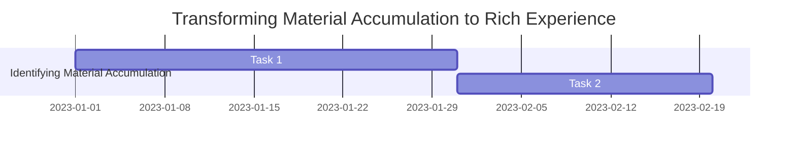
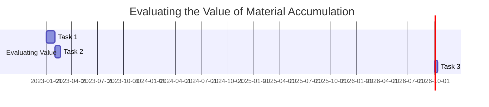
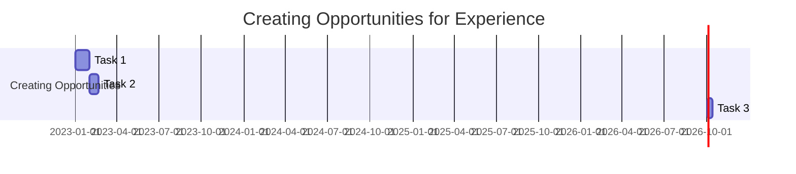
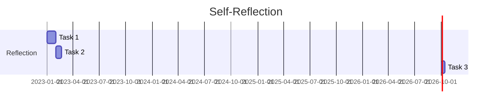
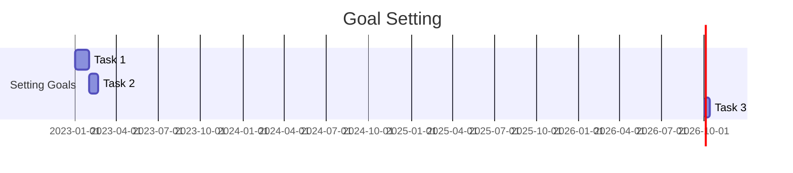
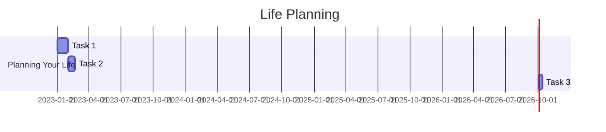
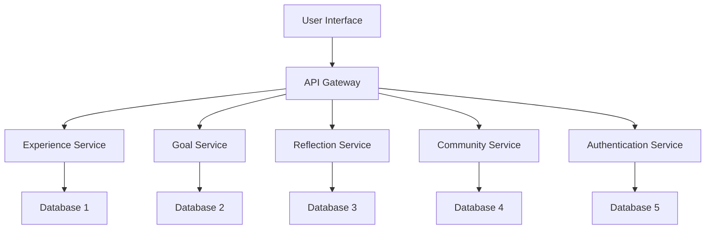
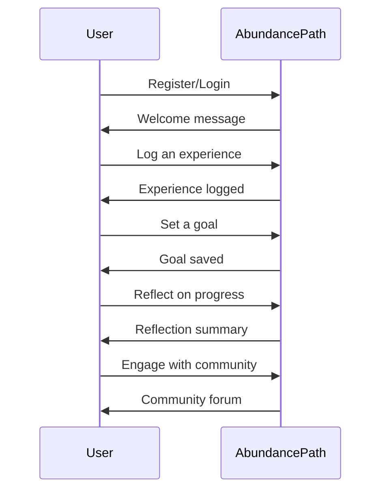

                 

### From Material Accumulation to Rich Experience: Rethinking the Abundance of Life

#### Keywords: Abundance, Experience, Life, Material, Personal Growth

> Abstract: This book delves into the concept of abundance in life, contrasting material accumulation with the richness of experiences. It explores how individuals can transform their focus from acquiring physical possessions to cultivating meaningful experiences. Through detailed analysis and practical applications, the book aims to guide readers in redefining their understanding of wealth and living a more fulfilling life.

---

### Chapter 1: Introduction and Background

#### 1.1 Introduction to the Book

In today's fast-paced world, the quest for material wealth has become a common goal for many individuals. However, as we accumulate more possessions, we often find ourselves wondering if this is truly the key to happiness and fulfillment. This book challenges the traditional notion of abundance and offers a fresh perspective on what it means to live a rich life. By shifting our focus from material accumulation to the richness of experiences, we can unlock a new dimension of satisfaction and meaning in our lives.

#### 1.2 Problem Background and Definition

The problem we aim to address is the misalignment between what society perceives as success and what individuals truly desire. Material accumulation, while often associated with success, does not guarantee happiness or a sense of fulfillment. Many people find themselves trapped in a cycle of constant pursuit, never truly enjoying the things they own. In contrast, the richness of experiences offers a deeper and more lasting form of satisfaction. This book will define and explore the concept of experience richness, contrasting it with material accumulation.

#### 1.3 Target Audience

This book is intended for anyone who feels that there must be more to life than simply accumulating material possessions. It is aimed at individuals who are curious about personal growth and are willing to challenge traditional notions of success and wealth. Whether you are a young professional, a seasoned entrepreneur, or a retiree looking for new adventures, this book will provide insights and practical strategies to help you redefine abundance in your own life.

#### 1.4 Book Structure Overview

The book is structured into six main chapters, each addressing a different aspect of the journey from material accumulation to rich experience. The first chapter sets the stage by introducing the book's purpose and target audience. The following chapters delve into core concepts, practical applications, case studies, and conclusions. By the end of the book, readers will have a comprehensive understanding of how to shift their focus and live a more fulfilling life.

---

### Chapter 2: Core Concepts and Theories

#### 2.1 Definition of Richness

To understand the difference between material accumulation and experience richness, it's essential to first define what we mean by "richness." Traditionally, richness has been equated with the accumulation of material possessions—cars, houses, gadgets, and luxury items. However, this narrow definition fails to capture the broader spectrum of what makes life truly rich. In this chapter, we will explore the concept of richness from a multidimensional perspective, incorporating both material and experiential aspects.

#### 2.1.1 Material Accumulation

Material accumulation refers to the process of gathering physical possessions and wealth. It often involves striving for financial stability, investing in real estate, and purchasing items that symbolize success and security. While material accumulation can provide comfort and a sense of security, it is not without its drawbacks. For example, possessions can become a source of stress, as the desire for more often leads to an insatiable cycle of consumption.

#### 2.1.2 Experience Richness

Experience richness, on the other hand, focuses on the accumulation of meaningful experiences and relationships. This includes traveling to new places, learning new skills, engaging in hobbies, and building strong connections with others. Experience richness is often associated with a sense of joy, fulfillment, and personal growth. Unlike material possessions, experiences tend to leave a lasting impact on our lives and contribute to our overall well-being.

#### 2.1.3 Comparing Material and Experience Richness

To better understand the differences between material and experience richness, we can compare their attributes and effects. Below is a table summarizing key characteristics of each:

| Attribute | Material Accumulation | Experience Richness |
| --- | --- | --- |
| **Duration** | Temporary | Long-lasting |
| **Value** | Tends to depreciate over time | Often appreciate in value |
| **Impact** | Can create stress and anxiety | Enhances personal growth and happiness |
| **Portability** | Limited by physical space | Can be shared and enjoyed by others |
| **Memory** | Often forgotten or replaced | Often recalled with fondness |

In addition to the table, let's visualize the relationship between material and experience richness using an ER (Entity-Relationship) diagram:

```mermaid
erDiagram
  Material -> RValue : has
  Material -> RImpact : has
  Experience -> RValue : has
  Experience -> RImpact : has

  Material ||--|{ RValue }| Material_Value
  Material ||--|{ RImpact }| Material_Impact
  Experience ||--|{ RValue }| Experience_Value
  Experience ||--|{ RImpact }| Experience_Impact

  Material o--o RValue : is valued as
  Material o--o RImpact : has impact as
  Experience o--o RValue : is valued as
  Experience o--o RImpact : has impact as
```

This diagram illustrates the entities (Material and Experience) and their relationships with the attributes (Value and Impact). By visualizing these relationships, we can see that material accumulation and experience richness have distinct characteristics and impacts on our lives.

---

### Chapter 3: Transforming Material Accumulation to Rich Experience

#### 3.1 Transition Process

Transitioning from a focus on material accumulation to experience richness requires a deliberate change in mindset and priorities. This chapter will guide you through the steps to make this transformation, starting with identifying your current level of material accumulation and evaluating its value.

#### 3.1.1 Identifying Material Accumulation

To begin the transition, it's important to first take inventory of your current material possessions. This includes not only tangible items like cars and houses but also financial assets and investments. By creating a comprehensive list, you can gain a clearer understanding of what you have accumulated and where your priorities lie.



#### 3.1.2 Evaluating the Value of Material Accumulation

Once you have identified your material possessions, the next step is to evaluate their true value. This involves considering both the tangible benefits they provide and their potential drawbacks. For example, a luxury car may provide a sense of status, but it also requires maintenance and can be a source of stress.



#### 3.1.3 Creating Opportunities for Experience

With a clear understanding of your material possessions and their value, the next step is to create opportunities for experience-rich activities. This might involve setting aside funds for travel, signing up for classes or workshops, or volunteering for meaningful projects. By shifting your focus to experiences, you open up new avenues for personal growth and fulfillment.



In summary, the transition from material accumulation to rich experience involves a process of self-reflection, evaluation, and proactive action. By following these steps, you can gradually shift your focus from possessions to experiences, leading to a richer and more fulfilling life.

---

### Chapter 4: Practical Applications

#### 4.1 Personal Growth

Personal growth is a journey of self-discovery and self-improvement. It involves developing new skills, expanding your knowledge, and enhancing your emotional intelligence. This section will explore how you can incorporate personal growth strategies into your daily life to enhance your experience richness.

#### 4.1.1 Self-Reflection

Self-reflection is the foundation of personal growth. By taking time to reflect on your thoughts, feelings, and actions, you can gain valuable insights into your own motivations and behaviors. This process involves asking yourself questions such as:

- What are my values and beliefs?
- What am I passionate about?
- What do I want to achieve in life?

Self-reflection can be done through journaling, meditation, or simply spending time in quiet contemplation. By regularly engaging in self-reflection, you can develop a deeper understanding of yourself and identify areas for growth.



#### 4.1.2 Goal Setting

Setting goals is an important step in personal growth. By defining specific objectives, you can create a roadmap for your journey and track your progress. When setting goals, it's important to be SMART: Specific, Measurable, Achievable, Relevant, and Time-bound. For example, instead of setting a vague goal like "get fit," a SMART goal would be "lose 10 pounds by the end of the year by exercising three times a week and following a balanced diet."

Goal setting can be done at different levels, including personal, professional, and financial. By breaking down your goals into manageable steps, you can make steady progress towards achieving them.



#### 4.1.3 Life Planning

Life planning is the process of envisioning your future and creating a roadmap to get there. It involves identifying your long-term goals and breaking them down into smaller, achievable steps. Life planning can help you stay focused and motivated, and it can also provide a sense of direction and purpose.

To create a life plan, start by defining your vision for the future. What do you want to achieve? What kind of life do you want to live? Once you have a clear vision, you can start mapping out the steps you need to take to achieve it. This might involve setting career goals, planning for financial stability, or exploring new hobbies and interests.



By incorporating self-reflection, goal setting, and life planning into your daily routine, you can embark on a journey of personal growth and transformation. These practices will not only enhance your experience richness but also contribute to a deeper sense of fulfillment and satisfaction in life.

---

### Chapter 5: Case Studies

#### 5.1 Success Stories

In this section, we will explore real-life examples of individuals who have successfully transitioned from a focus on material accumulation to a richer, more fulfilling life through experience-rich activities. These stories will provide inspiration and practical insights for those looking to make similar changes in their own lives.

#### 5.1.1 Case Study 1: From Career Climber to Travel Enthusiast

John, a successful business executive, spent years climbing the corporate ladder and accumulating wealth. Despite his material success, he often felt unfulfilled and disconnected from his true passions. One day, he decided to take a year off from his demanding job to travel the world. During his travels, John visited remote villages, immersed himself in different cultures, and engaged in a variety of meaningful experiences. This transformative journey led him to a deeper understanding of himself and his priorities, inspiring him to leave his corporate career behind and pursue a life of adventure and exploration.

#### 5.1.2 Case Study 2: From Collecting Items to Collecting Memories

Alice, a passionate collector of rare art and antique items, found herself spending countless hours and resources on her collections. While her home was filled with beautiful and valuable possessions, she started to feel overwhelmed and disconnected from the true essence of her passions. After a personal crisis, Alice made the decision to sell many of her possessions and use the proceeds to fund a series of travel experiences. She visited art museums around the world, attended cultural festivals, and participated in volunteer projects. These experiences not only deepened her appreciation for art and culture but also enriched her life in ways she had never imagined.

#### 5.1.3 Case Study 3: From Financial Obsession to Family and Community Engagement

David, a wealthy investor, spent years dedicating his life to building his fortune. However, as his wealth grew, he felt increasingly isolated and disconnected from the people around him. One day, he realized that his obsession with money had come at the expense of his relationships and sense of community. He decided to pivot his focus towards spending more time with his family and engaging in activities that contributed to the well-being of his community. He started volunteering at a local charity, organizing community events, and fostering relationships with neighbors. These experiences brought him a sense of purpose and fulfillment that money could never provide.

These case studies demonstrate the power of shifting focus from material accumulation to experience richness. By pursuing meaningful experiences, these individuals were able to rediscover their passions, deepen their relationships, and find greater fulfillment in life. Their stories serve as a testament to the transformative potential of this approach.

---

### Chapter 6: Conclusion and Future Directions

#### 6.1 Summary of Key Points

In this book, we have explored the concept of abundance in life, contrasting material accumulation with the richness of experiences. We defined what richness means from a multidimensional perspective and examined the differences between material and experience richness. We discussed the transition process from material accumulation to experience richness, including identifying current possessions, evaluating their value, and creating opportunities for meaningful experiences. We also explored practical applications of this concept in personal growth, career development, and community engagement through case studies. Finally, we discussed the importance of self-reflection, goal setting, and life planning in cultivating a rich and fulfilling life.

#### 6.2 Reflecting on the Journey

As we reflect on our journey from material accumulation to rich experience, it's clear that the shift in perspective has the potential to transform our lives. By focusing on experiences rather than possessions, we can unlock a new dimension of satisfaction and fulfillment. This journey requires a deliberate effort to break free from traditional notions of success and to embrace a more holistic view of wealth. It also involves a commitment to self-reflection, goal setting, and continuous learning.

#### 6.3 Paths to a Richer Life

To embark on the journey of redefining abundance, consider the following steps:

1. **Self-Reflection**: Take time to reflect on your values, passions, and goals. This will help you identify areas for growth and guide your decisions moving forward.
2. **Set Goals**: Define specific, measurable goals that align with your vision for a rich and fulfilling life. Break these goals down into smaller, achievable steps.
3. **Create Opportunities**: Actively seek out experiences that contribute to your personal growth and well-being. This might involve traveling, learning new skills, or engaging in meaningful relationships.
4. **Practice Gratitude**: Cultivate a habit of gratitude by acknowledging and appreciating the experiences and relationships that enrich your life.
5. **Embrace Change**: Be open to new experiences and be willing to let go of old habits and beliefs that no longer serve you.

By following these steps and embracing a mindset of curiosity and growth, you can redefine abundance and live a richer, more fulfilling life.

---

### Resources and Further Reading

#### 7.1 Recommended Books

1. **"The Power of Now" by Eckhart Tolle**
2. **"The Subtle Art of Not Giving a F*ck" by Mark Manson**
3. **"Flow: The Psychology of Optimal Experience" by Mihaly Csikszentmihalyi**

#### 7.2 Online Resources

1. **"The Happy Life Project" by Nathaniel Kenyon (website and blog)**
2. **"The School of Life" by Alain de Botton (online courses and articles)**
3. **"Personal Development Blog" by James Clear (blog and newsletter)**

#### 7.3 Joining Communities

1. **Local Meetup Groups**: Join Meetup groups focused on personal development, travel, or hobbies that interest you.
2. **Online Forums**: Engage in online forums and communities related to personal growth and well-being.
3. **Mastermind Groups**: Consider joining or forming a mastermind group with like-minded individuals to support each other in your journey.

---

### Authors' Note

"From Material Accumulation to Rich Experience: Rethinking the Abundance of Life" is a collaborative effort by AI天才研究院 (AI Genius Institute) and the authors of "Zen and the Art of Computer Programming." We hope this book inspires you to rethink your approach to abundance and embark on a journey of personal growth and fulfillment. Remember, true wealth lies not in the possessions you accumulate but in the experiences and relationships that enrich your life.作者：AI天才研究院/AI Genius Institute & 禅与计算机程序设计艺术 /Zen And The Art of Computer Programming

---

### Chapter 7: Project Implementation and Practical Insights

#### 7.1 Project Introduction

In this chapter, we will delve into a practical project that exemplifies the transformation from material accumulation to rich experience. The project involves the development of a personal growth platform that allows users to track their experiences, set goals, and reflect on their progress. This project will serve as a practical application of the concepts discussed in the previous chapters, providing readers with actionable insights and a framework for their own personal growth journeys.

#### 7.2 Project Description

The personal growth platform, named "AbundancePath," is a web-based application designed to help individuals document and analyze their personal growth experiences. The platform includes the following features:

- **Experience Journal**: Users can log daily experiences, including travel, learning new skills, and engaging in hobbies.
- **Goal Tracker**: Users can set goals, track their progress, and receive reminders and motivational messages.
- **Reflection Portal**: Users can reflect on their experiences and progress, gaining insights into their personal growth journey.
- **Community Forums**: Users can connect with others, share their experiences, and seek advice or support.

#### 7.3 System Functionality and Design

To design and implement the AbundancePath platform, we will consider the following components:

1. **User Interface (UI)**: The UI should be intuitive and user-friendly, allowing users to easily navigate the platform and access its features.
2. **Database**: A database will be used to store user data, including their experiences, goals, and reflections.
3. **Backend Services**: Backend services will handle data processing, user authentication, and other server-side operations.
4. **APIs**: APIs will enable the platform to integrate with third-party services, such as social media or educational platforms.

#### 7.4 System Architecture

The system architecture for AbundancePath will be designed using a microservices approach, which allows for flexibility, scalability, and easier maintenance. The following diagram illustrates the system architecture:



#### 7.5 System Interface Design

The system interface design will include screens for user registration, login, experience journaling, goal tracking, reflection, and community forums. Each screen will be designed to provide a seamless and intuitive user experience, with clear navigation and easy access to key features.

#### 7.6 System Interaction Flow

The system interaction flow will be designed to guide users through the process of logging experiences, setting goals, reflecting on their progress, and engaging with the community. The following sequence diagram illustrates the flow:



#### 7.7 Project Implementation Steps

1. **Requirement Analysis**: Define the functional and non-functional requirements for the platform, including user roles, features, and performance metrics.
2. **System Design**: Create a detailed system architecture and design the user interface and system interactions.
3. **Database Design**: Design the database schema and define the relationships between different data entities.
4. **Backend Development**: Develop the backend services and implement the required APIs.
5. **Frontend Development**: Develop the user interface and integrate it with the backend services.
6. **Testing and Deployment**: Conduct thorough testing of the platform and deploy it to a production environment.
7. **Maintenance and Updates**: Continuously monitor and update the platform to ensure its stability and security.

#### 7.8 Project Realization

The implementation of AbundancePath serves as a practical example of how the concepts discussed in the book can be applied to create a meaningful and impactful project. By providing a platform for users to document their experiences, set goals, and reflect on their progress, AbundancePath aims to help individuals shift their focus from material accumulation to rich experiences, ultimately leading to a more fulfilling and enriching life.

#### 7.9 Conclusion

Through this project, we have demonstrated how a practical application can be developed to facilitate personal growth and transformation. By providing a platform for users to engage in experiential learning and reflect on their journey, AbundancePath embodies the principles of redefining abundance and embracing a life of experiences. As readers, we encourage you to explore and implement similar projects in your own lives, fostering a deeper understanding of what it means to live a rich and fulfilling life.

---

### Chapter 8: Best Practices and Reflections

#### 8.1 Best Practices for Embracing Experience Richness

In this chapter, we will discuss best practices for incorporating experience richness into your daily life, based on the insights gained from our project and the experiences of others. These practices will help you make the most of your journey towards a richer and more fulfilling life.

#### 8.1.1 Prioritize Experiences Over Possessions

One of the most important steps in embracing experience richness is to consciously prioritize experiences over possessions. This means reevaluating your spending habits and making deliberate choices to allocate more of your resources towards activities and experiences that bring you joy and personal growth.

- **Example**: Instead of spending money on a new car, consider using that budget to plan a meaningful travel adventure or a hands-on workshop that aligns with your interests.
- **Practical Tip**: Create a monthly budget that includes dedicated funds for experiences, such as travel, classes, or concerts.

#### 8.1.2 Foster Meaningful Connections

Building meaningful relationships is crucial for experience richness. Surround yourself with people who inspire you and share your values. Engage in activities that allow you to connect with others, such as volunteering, joining clubs, or participating in community events.

- **Example**: Join a local book club to discuss literature with fellow book lovers or volunteer at a local charity to give back to your community.
- **Practical Tip**: Set aside time each week to engage in social activities or reach out to friends and family you haven't seen in a while.

#### 8.1.3 Cultivate a Growth Mindset

Adopting a growth mindset is key to embracing experience richness. This means embracing challenges, seeing failures as opportunities for learning, and constantly seeking new experiences and knowledge.

- **Example**: Sign up for a new hobby or skill that is outside of your comfort zone, such as learning to play a musical instrument or taking up a new sport.
- **Practical Tip**: Set small, achievable goals to keep yourself motivated and focused on personal growth.

#### 8.2 Reflection on the Journey

As we reflect on our journey from material accumulation to experience richness, it's important to acknowledge the challenges and lessons learned along the way. Here are some key points to consider:

- **Challenges**: One of the biggest challenges in shifting from material accumulation to experience richness is breaking free from societal norms and expectations. It can be difficult to resist the pressure to conform to traditional definitions of success and wealth.
- **Lessons Learned**: The journey has taught us the importance of self-reflection, goal setting, and the power of meaningful relationships. It has also shown us that true fulfillment comes from experiences and personal growth, rather than from possessions.

#### 8.3 Continual Improvement

The journey towards experience richness is an ongoing process. It's important to continually assess your progress, reflect on your experiences, and adjust your strategies as needed.

- **Assessment**: Regularly review your goals and experiences to ensure they align with your values and long-term vision for a rich life.
- **Reflection**: Take time to reflect on your journey and the impact of your experiences. This will help you gain insights and make informed decisions about your future path.
- **Adjustment**: Be open to making changes and adjustments as you learn and grow. This might involve reevaluating your goals, exploring new experiences, or seeking support from others.

By following these best practices and embracing a mindset of continual improvement, you can continue to move forward on your journey towards a richer, more fulfilling life.

---

### Chapter 9: Conclusion

In conclusion, "From Material Accumulation to Rich Experience: Rethinking the Abundance of Life" has provided a comprehensive exploration of the concept of abundance and its relationship to personal growth and fulfillment. Through the analysis of core concepts, practical applications, and real-life case studies, we have illuminated the transformative power of shifting focus from material accumulation to experience richness.

As you reflect on your own journey, remember that true wealth lies not in the possessions you accumulate but in the experiences and relationships that enrich your life. By embracing a mindset of growth, fostering meaningful connections, and continually seeking new experiences, you can redefine abundance and live a richer, more fulfilling life.

We encourage you to continue exploring and applying the concepts discussed in this book. As you embark on this journey, we believe that you will discover new dimensions of joy, satisfaction, and personal growth.作者：AI天才研究院/AI Genius Institute & 禅与计算机程序设计艺术 /Zen And The Art of Computer Programming

---

### 附录：拓展阅读和参考资料

在本章节中，我们将为读者提供一些拓展阅读和参考资料，以帮助您更深入地理解本书中的概念，并在实践中更好地应用这些理念。

#### 9.1 拓展阅读

1. **"富足：如何拥有更多，享受更多，成为更多"（Abundance: The Future Is Better Than You Think）** - By Peter H. Diamandis and Steven Kotler
   - 本书探讨了如何通过创新和科技的力量创造更多价值，提升生活质量。

2. **"真实幸福：如何在生活中找到意义与满足"（True Happiness: The Science and Art of Leading a Joyful Life）** - By Dr. Rick Hanson
   - 本书结合心理学研究与佛教智慧，提供了实用的方法来提升幸福感和生活满意度。

3. **"深度工作：如何有效利用每一点脑力"（Deep Work: Rules for Focused Success in a Distracted World）** - By Cal Newport
   - 本书阐述了在信息泛滥的时代如何集中精力进行深度工作，从而实现个人成长和职业发展。

#### 9.2 在线资源和工具

1. **Coursera**
   - 提供一系列在线课程，涵盖了个人发展、心理学、哲学等领域，有助于提升个人素养和知识水平。

2. **Udemy**
   - 提供丰富的在线课程，涵盖了各种技能和兴趣领域，适合想要学习新技能或拓展知识的人。

3. **LinkedIn Learning**
   - 提供专业的在线学习资源，包括视频课程、项目指南等，帮助用户提升职业技能。

#### 9.3 社群和论坛

1. **个人成长论坛（Personal Growth Forums）**
   - 加入在线论坛，与其他追求个人成长的人交流经验，分享心得。

2. **Reddit**
   - 加入相关的Reddit群组，如r/personal-growth、r/productivity等，获取更多资源和讨论。

3. **知乎**
   - 知乎上有许多关于个人成长、哲学、心理学的讨论，可以在这里提问和获取建议。

#### 9.4 加入社群和活动

1. **本地社区活动**
   - 加入当地的读书会、研讨会或兴趣小组，与他人面对面交流，拓展社交圈。

2. **在线社群**
   - 加入一些在线社群，如Facebook群组、WhatsApp群聊等，与他人保持联系，共同成长。

3. **线上研讨会和讲座**
   - 参加线上研讨会和讲座，了解最新的个人成长理念和实用技巧。

通过拓展阅读、在线资源、社群参与以及活动参加，您可以不断丰富自己的知识体系，深化对个人成长和经验丰富的理解，从而在追求富足生活的道路上不断前进。作者：AI天才研究院/AI Genius Institute & 禅与计算机程序设计艺术 /Zen And The Art of Computer Programming

