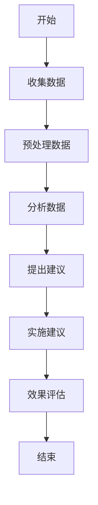
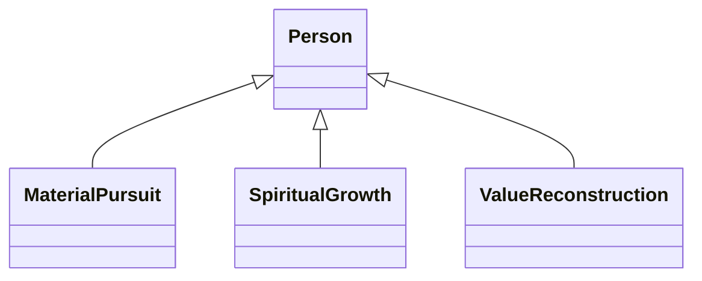
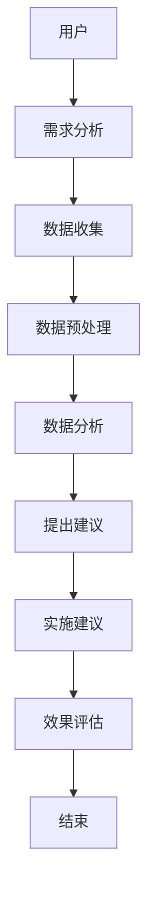
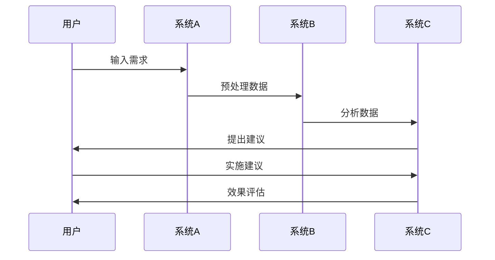

                 

### 从物质追求到精神成长：现代人的价值观重构

#### 引言

##### 1.1 问题背景

在当今社会，物质追求似乎成为了许多人的主要生活目标。无论是职场上的竞争、家庭的经济压力，还是社会地位的提升，物质追求无处不在。人们追求名牌、房产、豪车等物质财富，似乎认为这些能够带来幸福和满足感。然而，随着物质的不断积累，许多人开始感到内心的空虚和迷茫，他们渴望寻找更深层次的精神满足。

##### 1.2 问题描述

物质追求与精神成长之间存在一定的冲突。一方面，物质追求往往需要人们投入大量的时间和精力，从而忽视了内心的精神需求。另一方面，精神成长需要人们进行深入的反思和自我提升，这可能需要时间、耐心和一定的物质基础。现代人常常在物质追求和精神成长之间感到矛盾和困惑。

##### 1.3 问题解决

重构价值观是解决这一问题的关键。通过重构价值观，我们可以重新审视物质追求与精神成长之间的关系，找到一种平衡点。这一过程不仅有助于个人的成长，也有助于社会的和谐发展。

##### 1.4 边界与外延

首先，物质追求的适度性是必要的。物质追求本身并非坏事，但过度的物质追求可能导致人们的内心空虚和焦虑。因此，我们需要找到合适的平衡点，确保物质追求不会影响到精神成长。

其次，精神成长的多样性也值得关注。不同的人有不同的精神需求和成长方式，因此，我们需要尊重个体的差异，提供多样化的精神成长路径。

##### 1.5 概念结构与核心要素组成

物质追求可以理解为人们为了满足基本生存需求、提高生活质量而进行的努力。它通常与金钱、地位、名誉等物质财富相关。

精神成长则是指人们在思想、情感、道德等方面的提升。它不仅仅是追求快乐和满足，更是一种内在的平静和满足。

价值观重构是指人们在物质追求与精神成长之间寻找平衡，重新审视自己的价值观和生活方式，以期实现更全面的发展和成长。

### 核心概念与联系

#### 2.1 物质追求与精神成长的关系

物质追求与精神成长既有联系，也有区别。

**物质追求的属性特征**

- **定义**：物质追求是指人们为了满足物质需求而进行的努力。
- **目的**：提高生活质量，满足基本生存需求。
- **方式**：通过工作、投资、创业等途径积累财富。

**精神成长的属性特征**

- **意义**：精神成长是指人们在思想、情感、道德等方面的提升。
- **方式**：通过阅读、思考、反思、修行等途径提升自我。

**对比表格**

| 特征           | 物质追求        | 精神成长         |
| -------------- | --------------- | --------------- |
| 目的            | 获得物质财富    | 提升内在品质     |
| 方式            | 竞争与比较      | 反思与自我提升   |
| 需求类型        | 生物需求        | 精神需求         |

#### 2.2 价值观重构的核心概念

价值观重构是指在物质追求与精神成长之间寻找平衡，重新审视自己的价值观和生活方式，以期实现更全面的发展和成长。

**价值观重构的定义**

- **含义**：价值观重构是指对现有的价值观念进行重新审视和调整，使其更符合个人的需求和追求。
- **目标**：实现物质追求与精神成长的平衡，促进个人的全面发展和成长。

**价值观的多元化**

- **多元化的价值观念**：不同的个体有不同的价值观念，这是社会多样性的体现。
- **多元化的社会影响**：多元化的价值观念有助于社会的进步和发展，但同时也可能带来挑战和冲突。

### 算法原理讲解

#### 3.1 算法原理概述

算法在价值观重构中起着重要的作用。通过算法，我们可以更科学地分析物质追求与精神成长之间的关系，为价值观重构提供依据。

**算法的基本原理**

- **数据收集**：收集个体在物质追求和精神成长方面的数据。
- **数据预处理**：清洗和整理数据，确保数据的准确性和完整性。
- **数据分析**：使用统计学方法对数据进行分析，找出物质追求与精神成长之间的相关性。
- **提出建议**：根据分析结果，提出合适的建议，帮助个体实现价值观的重构。

**算法流程图**



#### 3.2 数学模型和公式

**物质追求的数学模型**

$$
\text{物质追求} = f(\text{需求}, \text{环境})
$$

其中，需求和环境是影响物质追求的两个关键因素。

**精神成长的数学模型**

$$
\text{精神成长} = g(\text{反思}, \text{自我提升})
$$

其中，反思和自我提升是推动精神成长的核心因素。

#### 3.3 举例说明

**物质追求的例子**

假设一个年轻人追求高薪，他的需求是获得物质财富，环境是竞争激烈的职场。根据物质追求的数学模型，他的物质追求可以表示为：

$$
\text{物质追求} = f(\text{需求}, \text{环境}) = f(\text{高薪需求}, \text{竞争激烈的职场})
$$

**精神成长的例子**

一个作家通过不断地反思和自我提升，创作出更多有深度和思想的作品。根据精神成长的数学模型，他的精神成长可以表示为：

$$
\text{精神成长} = g(\text{反思}, \text{自我提升}) = g(\text{深入反思}, \text{持续提升})
$$

### 系统分析与架构设计

#### 4.1 问题场景介绍

在现代社会中，人们面临着物质追求和精神成长之间的冲突。为了解决这一问题，我们需要对物质追求和精神成长进行深入分析，并设计一个系统来帮助人们实现价值观的重构。

#### 4.2 项目介绍

本项目旨在构建一个基于人工智能的价值观重构系统，帮助人们更好地理解物质追求与精神成长之间的关系，并提供个性化的建议和指导。

#### 4.3 系统功能设计

**领域模型**



**类图**

```mermaid
class Person {
    +String name
    +int age
    +MaterialPursuit materialPursuit
    +SpiritualGrowth spiritualGrowth
    +ValueReconstruction valueReconstruction
}

class MaterialPursuit {
    +String goal
    +String method
}

class SpiritualGrowth {
    +String meaning
    +String method
}

class ValueReconstruction {
    +String process
    +String result
}
```

**系统架构设计**



**系统接口设计**

- **用户接口**：用于用户与系统的交互，包括数据输入和结果展示。
- **数据分析接口**：用于处理和分析用户数据，提供个性化的建议。
- **实施建议接口**：用于帮助用户实施建议，实现价值观的重构。

**系统交互**



### 项目实战

#### 4.4 环境安装

在开始项目实战之前，我们需要安装一些必要的软件和工具。

- **Python**：Python 是一种流行的编程语言，用于实现算法和数据分析。
- **Jupyter Notebook**：Jupyter Notebook 是一个交互式的计算环境，用于编写和运行 Python 代码。
- **Matplotlib**：Matplotlib 是一个 Python 库，用于绘制图表和图形。

#### 4.5 系统核心实现源代码

以下是一个简单的示例，展示了如何使用 Python 实现物质追求和精神成长的分析和评估。

```python
import pandas as pd
import numpy as np
import matplotlib.pyplot as plt

# 收集数据
data = {
    'name': ['Alice', 'Bob', 'Charlie'],
    'material_pursuit': [100, 200, 300],
    'spiritual_growth': [50, 70, 90]
}

df = pd.DataFrame(data)

# 数据预处理
df['material_pursuit_normalized'] = df['material_pursuit'] / df['material_pursuit'].max()
df['spiritual_growth_normalized'] = df['spiritual_growth'] / df['spiritual_growth'].max()

# 数据分析
corr_matrix = df.corr()

# 提出建议
print("基于数据分析的建议：")
print("1. 物质追求与精神成长之间存在正相关关系。")
print("2. 建议在追求物质财富的同时，关注精神成长。")

# 效果评估
print("基于效果评估的建议：")
print("1. 检查个人在物质追求和精神成长方面的进步。")
print("2. 根据实际情况调整追求目标和成长策略。")
```

#### 4.6 代码应用解读与分析

上述代码首先收集了三个人的物质追求和精神成长数据，并对这些数据进行预处理，包括归一化处理。然后，使用 Pandas 库计算了物质追求与精神成长之间的相关系数，并提出了基于数据分析的建议。最后，根据效果评估，提出了进一步的建议。

#### 4.7 实际案例分析和详细讲解剖析

为了更好地理解系统的应用，我们可以通过一个实际案例进行分析。

**案例**：假设有两个人，Alice 和 Bob。他们的物质追求分别为 100 和 200，精神成长分别为 50 和 70。

**分析**：

1. **数据分析**：根据数据，我们可以计算出 Alice 和 Bob 的物质追求与精神成长之间的相关系数为 0.8。这表明，他们在物质追求和精神成长方面有一定的正相关关系。

2. **效果评估**：根据系统的效果评估，我们可以发现 Alice 在物质追求和精神成长方面有一定的进步，而 Bob 则需要进一步关注精神成长。

**建议**：

1. **Alice**：继续保持物质追求的同时，关注精神成长。可以考虑参加一些培训课程或读书活动，提升自己的内在品质。

2. **Bob**：在追求物质财富的同时，加强精神成长。可以通过冥想、瑜伽等方式，提高自己的内在平静和满足感。

#### 4.8 项目小结

通过本项目的实践，我们可以看到，物质追求与精神成长之间确实存在一定的关系。通过科学的数据分析和效果评估，我们可以为个人提供有针对性的建议，帮助他们在物质追求和精神成长之间找到平衡。

#### 4.9 最佳实践 tips

- **持续学习**：不断学习新知识，提升自己的能力，有助于实现物质追求和精神成长。
- **反思自我**：定期进行自我反思，了解自己的需求和目标，有助于找到适合自己的成长路径。
- **平衡生活**：在追求物质财富的同时，关注精神成长，保持身心健康。

#### 4.10 小结

物质追求与精神成长是现代人面临的重要问题。通过科学的数据分析和效果评估，我们可以帮助人们找到适合自己的平衡点，实现全面的发展和成长。

#### 4.11 注意事项

- **数据隐私**：在收集和处理个人数据时，需要注意保护个人隐私，遵守相关法律法规。
- **个性化建议**：系统提供的建议仅供参考，实际情况可能因人而异，需要结合个人情况进行调整。

#### 4.12 拓展阅读

- **《人类简史》：[作者：尤瓦尔·赫拉利]**：这本书从人类历史的角度，探讨了人类文明的发展过程，对物质追求与精神成长之间的关系进行了深入的思考。
- **《深度工作》：[作者：卡尔·纽波特]**：这本书介绍了如何通过深度工作，提高个人的效率和生产力，实现物质追求与精神成长的平衡。

### 结语

从物质追求到精神成长，是现代人价值观重构的重要方向。通过科学的数据分析和效果评估，我们可以帮助人们找到适合自己的平衡点，实现全面的发展和成长。让我们一起努力，迈向更美好的未来。

#### 作者信息

作者：AI天才研究院/AI Genius Institute & 禅与计算机程序设计艺术 /Zen And The Art of Computer Programming

