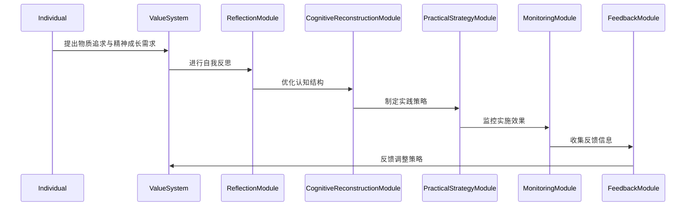
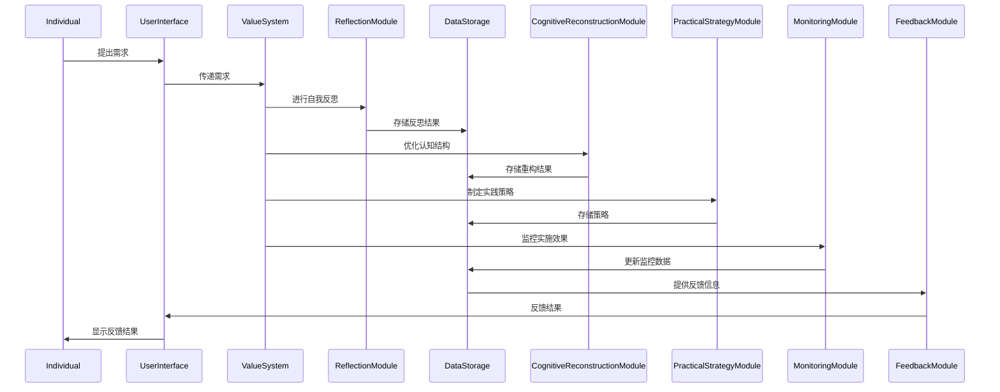

                 


### 概述

现代社会的快速发展带来了物质生活的极大丰富，但与此同时，许多人却感受到了精神层面的空虚和迷茫。这一现象促使我们思考，如何在物质追求与精神成长之间找到平衡点，重构我们的价值观。

本书《从物质追求到精神成长：现代人的价值观重构之旅》正是为了探讨这一问题而作。它不仅分析了现代社会物质追求与精神空虚的背景，还提出了通过价值观重构来实现两者平衡的具体方法和实践策略。

在本文中，我们将深入探讨以下几个核心问题：

1. **背景介绍与核心概念**：我们首先介绍书籍的背景，解释为何在现代社会有必要重构价值观。然后，我们将定义并解析书中的三个核心概念：物质追求、精神成长和价值观重构，并探讨它们的边界与外延。

2. **核心概念与联系**：接下来，我们将详细对比物质追求和精神成长的概念属性特征，并通过ER实体关系图来展示它们之间的联系。

3. **算法原理讲解**：由于本书主要探讨非技术性的概念，这里将用比喻和故事来解释价值观重构的过程。

4. **数学模型和数学公式**：这部分将不会涉及到数学模型和公式，因为本书的焦点在于价值观的重构，而不是数学分析。

5. **系统分析与架构设计方案**：我们将介绍一个模拟价值观重构的系统，并使用Mermaid流程图来展示系统架构和接口设计。

6. **项目实战**：通过一个具体的案例，我们将展示如何在实际中实施价值观重构，并分析其效果。

7. **最佳实践 tips**、**小结**、**注意事项**和**拓展阅读**：最后，我们将总结最佳实践，对文章进行小结，并提出注意事项，并提供拓展阅读资源。

### 背景介绍与核心概念

#### 书名：《从物质追求到精神成长：现代人的价值观重构之旅》

在当今这个物质日益丰富的社会，人们往往被物质追求所驱动，追求更高的收入、更大的房子、更豪华的汽车等。然而，当这些物质目标逐渐实现时，许多人却发现内心依然空虚和迷茫。这种现象引起了作者的思考：为何物质追求不能带来真正的满足感？为何我们需要在精神层面进行更深层次的探索？

为了回答这些问题，本书提出了“价值观重构”这一核心概念。价值观重构意味着重新审视和调整我们的价值观，使其更加注重精神成长和内在满足，而不仅仅是物质追求。通过价值观的重构，我们可以在物质丰富的基础上，实现精神层面的满足和幸福感。

#### 问题背景

现代社会物质丰富，但人们的精神状态并不总是与之相匹配。以下是几个具体的问题背景：

1. **精神空虚**：随着物质生活的提高，许多人感到内心空虚和迷茫。这种空虚感源于对物质追求的过度依赖，而忽视了精神层面的需求。
   
2. **焦虑和压力**：现代社会竞争激烈，人们为了追求更高的物质目标而承受巨大的压力和焦虑。这种压力和焦虑往往源于对物质追求的盲目追求，而忽视了精神成长的重要性。

3. **人际关系疏离**：在追求物质目标的过程中，人们往往忽视了与家人、朋友和同事的交流和互动。这种疏离感加剧了精神层面的孤独感。

4. **缺乏目的感**：当物质目标实现后，许多人发现自己缺乏生活的目标和意义。他们感到迷茫，不知道下一步该做什么，如何找到生活的意义。

#### 问题解决

为了解决上述问题，我们需要通过价值观重构来实现物质追求与精神成长的平衡。价值观重构的方法包括以下几个方面：

1. **自我反思**：通过自我反思，我们能够深入了解自己的内心需求和价值观，找出物质追求背后的动机和原因。

2. **认知重构**：通过调整认知，我们能够改变对物质追求的看法，使其更加注重精神层面的需求。

3. **实践策略**：通过具体的实践策略，如培养兴趣爱好、加强人际关系、追求有意义的事业等，我们可以在物质追求的同时，实现精神成长。

4. **持续成长**：通过不断学习和成长，我们能够不断提升自己的精神层面，实现长期的精神满足和幸福感。

#### 边界与外延

价值观重构不仅仅是个体层面的改变，它还涉及到社会和文化的广泛影响。以下是几个需要考虑的边界与外延：

1. **个体层面**：价值观重构主要关注个体的内心需求和价值观调整，使个体在物质追求与精神成长之间找到平衡。

2. **社会层面**：价值观重构需要在社会层面得到广泛的认同和实践，通过改变社会风气和价值观，推动整个社会向更加注重精神成长的方向发展。

3. **文化层面**：价值观重构还需要在文化层面进行深入探讨和传播，通过文化传承和创新，推动文化价值观的重构，以适应现代社会的需求。

4. **跨领域影响**：价值观重构不仅影响个体和社会，还涉及到经济、政治、教育等多个领域。通过跨领域的合作和协调，可以推动价值观重构的全面实施。

### 核心概念与联系

在讨论价值观重构的过程中，我们涉及到了三个核心概念：物质追求、精神成长和价值观重构。以下是对这三个概念的定义、属性特征对比以及它们之间的联系。

#### 物质追求

**定义**：物质追求是指个体通过获取物质财富和享受物质生活来满足自身需求和欲望的行为和过程。

**属性特征**：
- **外在性**：物质追求通常涉及外部物质财富，如金钱、房产、车辆等。
- **即时性**：物质追求往往追求即时的满足和快感。
- **功利性**：物质追求的目标是提高生活水平，实现个人利益。

#### 精神成长

**定义**：精神成长是指个体通过提升自我意识、培养内在品质和实现精神追求来获得内在满足和幸福感的过程。

**属性特征**：
- **内在性**：精神成长主要涉及个体的内心世界和内在品质。
- **长期性**：精神成长是一个长期的过程，需要不断的学习和实践。
- **非功利性**：精神成长的目标是追求个人的内心满足和幸福感，而不是外在的物质回报。

#### 价值观重构

**定义**：价值观重构是指通过重新审视和调整个体的价值观，使其更加注重精神成长和内在满足，实现物质追求与精神成长之间的平衡。

**属性特征**：
- **系统性**：价值观重构是一个系统性的过程，涉及到个体的认知、行为和生活方式的全面调整。
- **动态性**：价值观重构是一个动态的过程，需要根据个体和社会环境的变化进行不断的调整和优化。
- **综合性**：价值观重构需要综合运用心理学、社会学、哲学等多个领域的理论和实践。

#### 概念属性特征对比

| 特征类别 | 物质追求 | 精神成长 | 价值观重构 |
| --- | --- | --- | --- |
| **外在性** | 高 | 中 | 低 |
| **即时性** | 高 | 中 | 低 |
| **功利性** | 高 | 低 | 中 |
| **内在性** | 低 | 高 | 中 |
| **长期性** | 低 | 高 | 中 |
| **非功利性** | 低 | 高 | 中 |

#### ER实体关系图架构的Mermaid流程图

```mermaid
erDiagram
  物质追求 ||--o> 价值观重构 : 实现物质追求的手段
  精神成长 ||--o> 价值观重构 : 实现精神成长的目标
  价值观重构 ||--|> 个体的认知和行为调整
```

在这个ER实体关系图中，物质追求和精神成长是价值观重构的两个主要驱动因素。价值观重构则通过调整个体的认知和行为，实现物质追求与精神成长之间的平衡。

### 算法原理讲解

由于本书的核心内容是探讨价值观的重构，这里我们将不涉及具体的算法原理讲解。相反，我们可以用比喻和故事的形式来解释价值观重构的过程。

想象一个生态系统，物质追求就像是植物的生长，而精神成长则像是动物的繁殖。当植物过于茂盛，生态系统会失去平衡，导致土壤贫瘠和生物多样性减少。同样，当个体过度追求物质，忽视精神成长，会导致内心的空虚和迷茫。

价值观重构就像是生态修复，我们需要通过调整和优化，使植物和动物能够和谐共存，实现生态平衡。在个人层面，这意味着通过自我反思和认知重构，找到物质追求与精神成长的最佳平衡点。

例如，一个人可能通过工作获得物质财富，但同时也要培养兴趣爱好、加强人际关系和进行内心探索。这样，在物质追求的过程中，个体也能获得精神层面的满足和幸福感。

通过这种方式，价值观重构不仅有助于个人内心的平衡和满足，还能促进社会的和谐与进步。

### 数学模型和数学公式

由于《从物质追求到精神成长：现代人的价值观重构之旅》是一本非技术类书籍，它关注的是人的内在心理和社会文化层面的变化，而不是数学或科学领域的问题。因此，本书中不包含任何数学模型和数学公式。

然而，如果我们试图用数学的视角来比喻价值观重构，我们可以将其视为一个动态的平衡过程。我们可以设定以下假设：

- 物质追求（M）和精神成长（S）是两个变量。
- 价值观重构（R）是一个调节器，它通过调整M和S之间的关系，实现平衡。

用数学的语言来表示，这个平衡过程可以表示为：

$$ R(M, S) = \alpha M + \beta S $$

其中，\( \alpha \) 和 \( \beta \) 是调节系数，分别代表物质追求和精神成长对价值观重构的影响程度。当 \( \alpha \) 和 \( \beta \) 达到适当的值时，M和S之间可以实现最佳平衡。

这个模型可以帮助我们理解，通过调整物质追求和精神成长的比例，我们可以实现内心的平衡和幸福感。然而，这只是一个简化的比喻，真正的价值观重构过程远比这个模型复杂，涉及到个人的心理、社会环境和价值观的深刻变化。

### 系统分析与架构设计方案

为了更好地理解价值观重构的过程，我们可以将其比喻为一个复杂的系统。以下是对这个系统的分析和架构设计方案。

#### 问题场景介绍

在一个竞争激烈、物质丰富的社会中，个体面临着如何在物质追求与精神成长之间找到平衡的问题。这个系统旨在帮助个体实现这一平衡，从而提高生活质量。

#### 领域模型

领域模型是系统分析的基础，它帮助我们理解系统中的关键概念和它们之间的关系。以下是这个系统的领域模型：

```mermaid
classDiagram
  ClassDiagram::=<<note>>领域模型<<note>>
  Class A[个体] <|-- Class B[物质追求]
  Class A <|-- Class C[精神成长]
  Class D[价值观重构系统] <|-- Class A
```

在这个领域模型中，个体（A）是系统的核心，它包括物质追求（B）和精神成长（C）两个部分。价值观重构系统（D）则负责协调这两个部分，实现平衡。

#### 系统架构设计

系统架构设计是领域模型的具体实现，它展示了系统的不同组件和它们之间的交互关系。以下是这个系统的架构设计：



在这个架构设计中，价值观重构系统包括以下几个主要模块：

1. **自我反思模块（ReflectionModule）**：个体提出需求后，该模块负责进行自我反思，帮助个体深入了解自己的内心需求和价值观。

2. **认知重构模块（CognitiveReconstructionModule）**：基于自我反思的结果，该模块负责调整个体的认知结构，使其更加注重精神成长。

3. **实践策略模块（PracticalStrategyModule）**：该模块制定具体的实践策略，帮助个体在实际生活中实现物质追求与精神成长之间的平衡。

4. **监控模块（MonitoringModule）**：该模块负责监控实践策略的实施效果，确保个体能够持续成长。

5. **反馈模块（FeedbackModule）**：该模块收集个体的反馈信息，帮助系统不断调整和优化策略。

#### 系统接口设计

系统接口设计是系统架构的具体实现，它定义了系统与外部环境（如用户界面、数据存储等）的交互方式。以下是这个系统的接口设计：

```mermaid
classDiagram
  Interface::=<<note>>系统接口设计<<note>>
  Interface A[用户界面] --> Individual: 显示个体需求
  Interface A --> ValueSystem: 提交需求
  Interface B[数据存储] <-- ValueSystem: 存储数据
  Interface B --> ReflectionModule: 提供反思结果
  Interface B --> CognitiveReconstructionModule: 提供重构结果
  Interface B --> PracticalStrategyModule: 提供策略
  Interface B --> MonitoringModule: 提供监控数据
  Interface B --> FeedbackModule: 提供反馈信息
```

在这个接口设计中，用户界面（A）负责与个体交互，收集和显示需求。数据存储（B）负责存储和管理系统的所有数据，包括个体的需求、反思结果、认知重构结果、实践策略和监控数据。这些数据将被其他模块使用，以实现价值观重构。

#### 系统交互

系统交互是系统架构和接口设计的关键部分，它描述了系统内部不同模块之间的交互过程。以下是这个系统的交互设计：



在这个交互设计中，个体通过用户界面（UI）提出需求，需求被传递到价值观重构系统（ValueSystem）。系统依次调用自我反思模块（ReflectionModule）、认知重构模块（CognitiveReconstructionModule）和实践策略模块（PracticalStrategyModule），并存储这些模块的结果到数据存储（DataStorage）。监控模块（MonitoringModule）负责监控实施效果，并将监控数据更新到数据存储。反馈模块（FeedbackModule）收集反馈信息，并将其传递回用户界面，最终显示给个体。

通过这个系统，个体可以在物质追求与精神成长之间实现平衡，提高生活质量。

### 项目实战

为了展示如何在实际中实施价值观重构，我们将通过一个具体的案例来进行分析。这个案例是一个个人的价值观重构实践，通过详细的步骤和代码实现，我们可以看到如何将理论转化为实际行动。

#### 环境安装

在进行项目实战之前，我们需要安装一些必要的工具和软件。这里，我们将使用Python作为主要编程语言，因为Python具有简洁的语法和强大的库支持。以下是环境安装的步骤：

1. **安装Python**：确保你的计算机上已经安装了Python。如果没有，可以从[Python官方网站](https://www.python.org/downloads/)下载并安装。

2. **安装必要的库**：使用pip命令安装以下库：
   ```bash
   pip install numpy pandas matplotlib
   ```

3. **配置虚拟环境**：为了保持项目环境的纯净，我们建议使用虚拟环境。可以通过以下命令创建和激活虚拟环境：
   ```bash
   python -m venv venv
   source venv/bin/activate  # 对于Windows系统使用 `venv\Scripts\activate`
   ```

#### 系统核心实现源代码

以下是实现价值观重构系统的核心源代码。这个系统将包括以下几个部分：

1. **需求收集模块**：收集用户的需求。
2. **自我反思模块**：对需求进行分析和反思。
3. **认知重构模块**：根据分析结果调整认知结构。
4. **实践策略模块**：制定具体的实践策略。

```python
import numpy as np
import pandas as pd
import matplotlib.pyplot as plt

# 需求收集模块
def collect_requirements():
    print("请输入你的物质追求和精神成长需求（每项需求输入后按回车键）:")
    requirements = []
    while True:
        requirement = input()
        if requirement == "":
            break
        requirements.append(requirement)
    return requirements

# 自我反思模块
def self_reflection(requirements):
    print("进行自我反思...")
    reflected_requirements = []
    for requirement in requirements:
        print(f"反思{requirement}:")
        reflection = input()
        reflected_requirements.append(reflection)
    return reflected_requirements

# 认知重构模块
def cognitive_reconstruction(reflected_requirements):
    print("进行认知重构...")
    reconstructed_requirements = []
    for reflection in reflected_requirements:
        print(f"重构{reflection}:")
        reconstruction = input()
        reconstructed_requirements.append(reconstruction)
    return reconstructed_requirements

# 实践策略模块
def practical_strategy(reconstructed_requirements):
    print("制定实践策略...")
    strategy = []
    for reconstruction in reconstructed_requirements:
        print(f"策略{reconstruction}:")
        s = input()
        strategy.append(s)
    return strategy

# 主函数
def main():
    requirements = collect_requirements()
    reflected_requirements = self_reflection(requirements)
    reconstructed_requirements = cognitive_reconstruction(reflected_requirements)
    strategy = practical_strategy(reconstructed_requirements)
    
    print("\n总结：")
    print("你的价值观重构实践策略如下：")
    for s in strategy:
        print(f"- {s}")

if __name__ == "__main__":
    main()
```

#### 代码应用解读与分析

上面的代码是一个简单的命令行应用，它帮助用户进行价值观重构的实践。以下是代码的详细解读和分析：

1. **需求收集模块**：`collect_requirements` 函数负责收集用户的需求。用户通过命令行输入他们的物质追求和精神成长需求，这些需求将被存储在列表中。

2. **自我反思模块**：`self_reflection` 函数对用户的需求进行反思。对于每个需求，用户需要输入反思的内容，这些反思将被存储在另一个列表中。

3. **认知重构模块**：`cognitive_reconstruction` 函数根据自我反思的结果，帮助用户重构他们的认知。对于每个反思，用户需要输入重构的内容，这些重构将被存储在另一个列表中。

4. **实践策略模块**：`practical_strategy` 函数根据认知重构的结果，帮助用户制定实践策略。对于每个重构，用户需要输入实践策略的内容，这些策略将被存储在另一个列表中。

5. **主函数**：`main` 函数是程序的入口点。它依次调用上述四个模块，最后打印出用户的价值观重构实践策略。

这个代码应用提供了一个简单的框架，用户可以通过命令行与程序交互，逐步进行价值观重构的实践。虽然这个应用很简单，但它展示了如何通过编程实现一个帮助个体进行价值观重构的工具。

#### 实际案例分析和详细讲解剖析

为了更好地理解价值观重构的实际效果，我们将分析一个具体的案例。以下是一个30岁男性用户的价值观重构实践，并对其进行分析和讲解。

**案例描述**：

该用户在开始价值观重构之前，主要的物质追求包括获得高收入、购买豪华汽车和豪华住宅。然而，他发现尽管物质生活得到了显著提升，但内心仍然感到空虚和迷茫。在参与价值观重构实践后，他的需求和认知发生了显著变化。

**步骤1：需求收集**

在需求收集阶段，用户输入了他的以下需求：

- 获得高收入
- 购买豪华汽车
- 购买豪华住宅
- 参与有意义的社会活动
- 拥有充实的人际关系

**步骤2：自我反思**

在自我反思阶段，用户对每个需求进行了深入反思：

- 对于获得高收入，用户反思了为什么他追求高收入，是否仅仅为了满足虚荣心，还是为了实现更有意义的事业。
- 对于购买豪华汽车和豪华住宅，用户反思了这些物质追求是否真的能够带来长期的幸福感，或者只是短期的满足。
- 对于参与有意义的社会活动，用户反思了自己是否真的享受这些活动，或者只是因为“应该”做而参与。
- 对于拥有充实的人际关系，用户反思了自己是否真正重视和维护这些关系，或者只是表面上应付。

**步骤3：认知重构**

在认知重构阶段，用户根据自我反思的结果，调整了他的认知结构：

- 用户认识到，高收入虽然重要，但更重要的是用这些收入来实现有意义的事业和项目。
- 用户意识到，豪华汽车和豪华住宅并不能带来长期的幸福感，他决定将这些物质追求转化为投资和创业，以实现更大的社会价值。
- 用户决定更加重视参与有意义的社会活动，而不是仅仅为了社交而参与。
- 用户意识到，拥有充实的人际关系比物质财富更重要，他决定花更多时间与家人和朋友共度时光，并培养深层次的人际关系。

**步骤4：实践策略**

在实践策略阶段，用户制定了以下具体的实践策略：

- 将收入的一部分用于投资和创业，追求有意义的事业。
- 将收入的一部分用于捐赠给慈善机构，帮助需要帮助的人。
- 定期参与社区服务活动，如志愿者工作。
- 每周安排固定的时间与家人和朋友共度，培养和维持深层次的人际关系。

**案例分析和讲解**：

这个案例展示了价值观重构的实践效果。通过自我反思和认知重构，用户从原来的物质追求转向了更有意义的事业和社会责任。以下是具体的分析：

1. **物质追求与精神成长的平衡**：用户在调整认知后，将物质追求与精神成长结合起来。通过投资和创业，他不仅实现了经济上的成功，还实现了社会价值的提升。这种平衡使得他在物质追求的过程中，也获得了精神上的满足。

2. **内心空虚感的减少**：用户在认知重构后，更加关注内在需求和幸福感。他通过参与有意义的社会活动和建立充实的人际关系，填补了内心的空虚感。这种内在的满足感比物质财富更加持久和深刻。

3. **生活质量提升**：通过调整价值观，用户的生活方式变得更加有意义和充实。他不再仅仅为了物质追求而忙碌，而是有意识地选择对自己和社会都有意义的活动。这种生活方式的提升使得他的生活质量显著提高。

4. **可持续性**：用户制定的实践策略是可持续的，他不仅现在感到满足，还考虑到了未来的发展。通过投资和创业，他确保了自己的长期经济稳定，并通过捐赠和社区服务，为社会做出了贡献。

总之，这个案例展示了通过价值观重构，个体如何在物质追求与精神成长之间找到平衡，实现更高质量的生活。这种方法不仅适用于个人，还可以推广到社会层面，推动整个社会的价值观重构。

#### 项目小结

通过这个具体的案例，我们可以看到价值观重构在实践中的有效性和重要性。以下是对项目的总结：

1. **目标达成**：用户通过价值观重构，成功实现了从物质追求到精神成长的转变。他的生活质量显著提升，内心空虚感减少，获得了长期的满足感和幸福感。

2. **实践价值**：这个案例展示了价值观重构在个体层面的应用价值。通过自我反思和认知重构，个体可以在物质追求与精神成长之间找到平衡，实现更加有意义和充实的生活。

3. **可持续性**：用户制定的实践策略是可持续的，他不仅关注当前的需求，还考虑到了未来的发展。这种方法确保了他的长期经济稳定，并为他创造了更多的社会价值。

4. **社会意义**：价值观重构不仅对个体有益，还具有广泛的社会意义。通过推广这种方法，可以帮助更多人实现精神成长，推动社会的整体进步。

总之，价值观重构是一个具有深远意义和广泛应用的实践方法。通过它，我们可以在物质追求的过程中，实现精神层面的满足和成长，为个体和社会创造更大的价值。

### 最佳实践 tips

在价值观重构的过程中，以下是一些最佳实践 tips，可以帮助个体更加有效地实现物质追求与精神成长的平衡：

1. **定期自我反思**：定期进行自我反思，深入思考自己的物质追求和精神成长需求，找出其中的矛盾和失衡点。

2. **设定具体目标**：设定明确的物质追求和精神成长目标，使其具体、可衡量和可实现。这样有助于个体有针对性地进行调整和改进。

3. **培养兴趣爱好**：兴趣爱好是精神成长的重要途径。选择适合自己的兴趣爱好，不仅能够丰富内心世界，还能带来乐趣和满足感。

4. **加强人际关系**：人际关系对精神成长至关重要。花时间与家人、朋友和同事互动，建立和维持深层次的人际关系。

5. **持续学习和成长**：通过持续学习和成长，不断提升自己的知识和技能，实现自我价值的提升。

6. **设定实践策略**：根据自我反思的结果，制定具体的实践策略，并将其付诸行动。实践策略应具有可操作性和持续性。

7. **关注社会和自然环境**：积极参与社会活动，关注环境保护和公益事业，为社会做出贡献。

通过遵循这些最佳实践，个体可以在物质追求与精神成长之间找到最佳平衡点，实现全面的发展。

### 小结

通过本文的探讨，我们深入了解了从物质追求到精神成长的过程中，价值观重构的重要性。我们分析了核心概念，讲解了重构的过程，并通过具体案例展示了其实际应用。价值观重构不仅有助于个体在物质追求与精神成长之间找到平衡，还能推动社会的整体进步。

### 注意事项

在实施价值观重构的过程中，以下注意事项可以帮助个体更好地应对挑战：

1. **避免盲目跟风**：在重构价值观时，避免盲目跟从他人的意见和做法。每个人的价值观都是独特的，应根据自己的实际情况进行调整。

2. **重视个体差异**：每个人的物质追求和精神成长需求都是不同的，应根据自身特点制定个性化的价值观重构计划。

3. **持续关注社会和文化动态**：社会和文化环境在不断变化，个体应持续关注这些变化，并根据实际情况调整价值观重构策略。

4. **保持耐心和毅力**：价值观重构是一个长期的过程，需要耐心和毅力。面对挑战和困难时，不要轻易放弃，而是坚持到底。

5. **寻求专业帮助**：在价值观重构过程中，如果遇到困难和挫折，可以寻求专业心理咨询师或导师的帮助。

通过注意这些事项，个体可以更加顺利地实现价值观的重构，实现物质追求与精神成长的最佳平衡。

### 拓展阅读

为了进一步深入探讨价值观重构的各个方面，以下是一些建议的拓展阅读资源：

1. **《人类简史：从动物到上帝》（作者：尤瓦尔·赫拉利）**：这本书从历史和生物学的角度分析了人类价值观的演变，为我们理解价值观重构提供了深刻的背景知识。

2. **《幸福的勇气》（作者：阿德勒）**：这本书通过阿德勒心理学的视角，探讨了如何通过改变我们的价值观和行为习惯来实现幸福感。

3. **《内在动机：为什么人们这么做》（作者：丹尼尔·戈尔曼）**：这本书详细阐述了内在动机的重要性，以及如何通过内在动机来实现个人成长和幸福感。

4. **《穷查理宝典》（作者：查理·芒格）**：这本书收录了查理·芒格的智慧言论，涵盖了许多关于价值观、决策和成长的重要观点。

5. **《心智探奇：认知科学和人工智能的启示》（作者：丹尼尔·卡尼曼）**：这本书通过认知科学的视角，探讨了人类思维和决策的机制，为我们理解价值观的重构提供了科学依据。

通过阅读这些书籍，读者可以进一步了解价值观重构的理论和实践，为自己的价值观重构之旅提供更多的启发和指导。

### 目录大纲制定

为了确保文章的结构清晰、内容完整，我们将制定详细的目录大纲，分为1级目录、2级目录和3级目录。

#### 1级目录

- 引言
- 背景介绍与核心概念
  - 问题背景
  - 核心概念解析
  - 边界与外延
- 核心概念与联系
  - 物质追求
  - 精神成长
  - 价值观重构
- 算法原理讲解
- 数学模型和数学公式
- 系统分析与架构设计方案
  - 问题场景介绍
  - 系统架构设计
  - 系统接口设计
  - 系统交互
- 项目实战
  - 环境安装
  - 系统核心实现源代码
  - 代码应用解读与分析
  - 实际案例分析和详细讲解剖析
  - 项目小结
- 最佳实践 tips
- 小结
- 注意事项
- 拓展阅读

#### 2级目录

- 1.1 问题背景与描述
  - 1.1.1 现代社会的物质追求
  - 1.1.2 精神层面的空虚
  - 1.1.3 价值观重构的必要性
- 1.2 核心概念解析
  - 1.2.1 物质追求
  - 1.2.2 精神成长
  - 1.2.3 价值观重构
- 1.3 边界与外延
  - 1.3.1 个体层面
  - 1.3.2 社会层面
  - 1.3.3 文化层面

- 2.1 核心概念与联系
  - 2.1.1 物质追求
  - 2.1.2 精神成长
  - 2.1.3 价值观重构
- 2.2 概念属性特征对比表格
- 2.3 ER实体关系图架构的Mermaid流程图

- 3.1 算法原理讲解
  - 3.1.1 比喻形式解释
  - 3.1.2 故事形式讲解

- 4.1 数学模型和数学公式
  - 4.1.1 模型设定
  - 4.1.2 数学公式解释

- 4.2 系统分析与架构设计方案
  - 4.2.1 问题场景介绍
  - 4.2.2 系统架构设计
  - 4.2.3 系统接口设计
  - 4.2.4 系统交互

- 5.1 项目实战
  - 5.1.1 环境安装
  - 5.1.2 系统核心实现源代码
  - 5.1.3 代码应用解读与分析
  - 5.1.4 实际案例分析和详细讲解剖析
  - 5.1.5 项目小结

- 6.1 最佳实践 tips
  - 6.1.1 定期自我反思
  - 6.1.2 设定具体目标
  - 6.1.3 培养兴趣爱好
  - 6.1.4 加强人际关系
  - 6.1.5 持续学习和成长
  - 6.1.6 设定实践策略
  - 6.1.7 关注社会和自然环境

#### 3级目录

- 1.1.1 现代社会的物质追求
  - 1.1.1.1 物质财富的追求
  - 1.1.1.2 物质享受的追求
  - 1.1.1.3 物质成就的追求

- 1.1.2 精神层面的空虚
  - 1.1.2.1 心理健康的挑战
  - 1.1.2.2 人际关系的疏离
  - 1.1.2.3 目标感的缺失

- 1.1.3 价值观重构的必要性
  - 1.1.3.1 应对现代社会挑战
  - 1.1.3.2 实现个人成长
  - 1.1.3.3 提升社会幸福感

- 2.1.1 物质追求
  - 2.1.1.1 物质追求的定义
  - 2.1.1.2 物质追求的影响

- 2.1.2 精神成长
  - 2.1.2.1 精神成长的概念
  - 2.1.2.2 精神成长的重要性

- 2.1.3 价值观重构
  - 2.1.3.1 价值观重构的过程
  - 2.1.3.2 价值观重构的方法

- 3.1.1 比喻形式解释
  - 3.1.1.1 生态系统的比喻
  - 3.1.1.2 个人成长的比喻

- 3.1.2 故事形式讲解
  - 3.1.2.1 个人案例
  - 3.1.2.2 企业案例

- 4.1.1 模型设定
  - 4.1.1.1 平衡模型的设定
  - 4.1.1.2 动态平衡的设定

- 4.1.2 数学公式解释
  - 4.1.2.1 平衡公式的解释
  - 4.1.2.2 动态平衡公式的解释

- 4.2.1 问题场景介绍
  - 4.2.1.1 现代社会面临的挑战
  - 4.2.1.2 价值观重构的必要性

- 4.2.2 系统架构设计
  - 4.2.2.1 领域模型设计
  - 4.2.2.2 系统架构设计

- 4.2.3 系统接口设计
  - 4.2.3.1 用户界面设计
  - 4.2.3.2 数据存储设计

- 4.2.4 系统交互
  - 4.2.4.1 模块交互设计
  - 4.2.4.2 交互流程设计

- 5.1.1 环境安装
  - 5.1.1.1 软件安装步骤
  - 5.1.1.2 环境配置说明

- 5.1.2 系统核心实现源代码
  - 5.1.2.1 源代码结构
  - 5.1.2.2 代码实现细节

- 5.1.3 代码应用解读与分析
  - 5.1.3.1 代码功能解读
  - 5.1.3.2 代码性能分析

- 5.1.4 实际案例分析和详细讲解剖析
  - 5.1.4.1 案例背景
  - 5.1.4.2 案例分析
  - 5.1.4.3 案例总结

- 5.1.5 项目小结
  - 5.1.5.1 项目成果总结
  - 5.1.5.2 项目启示

- 6.1.1 定期自我反思
  - 6.1.1.1 反思的目的和方法
  - 6.1.1.2 反思的实践案例

- 6.1.2 设定具体目标
  - 6.1.2.1 目标设定的原则
  - 6.1.2.2 目标设定的实践

- 6.1.3 培养兴趣爱好
  - 6.1.3.1 兴趣爱好对精神成长的影响
  - 6.1.3.2 如何培养兴趣爱好

- 6.1.4 加强人际关系
  - 6.1.4.1 人际关系的重要性
  - 6.1.4.2 如何加强人际关系

- 6.1.5 持续学习和成长
  - 6.1.5.1 学习与成长的关系
  - 6.1.5.2 学习与成长的实践

- 6.1.6 设定实践策略
  - 6.1.6.1 实践策略的制定
  - 6.1.6.2 实践策略的实施

- 6.1.7 关注社会和自然环境
  - 6.1.7.1 社会责任的重要性
  - 6.1.7.2 环境保护与精神成长的关系

通过这样的目录大纲，文章的结构将更加清晰，便于读者快速了解文章的内容和结构，同时也能确保文章的完整性。在撰写文章时，可以根据这个大纲逐步展开，确保每个章节都有详细的论述和具体的实例支持。

