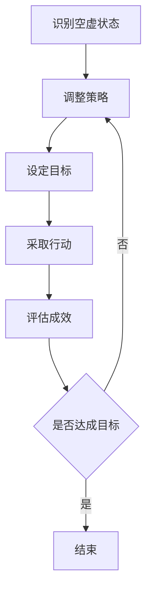

                 


# 从空虚到充实：个人成长的内在转变

关键词：个人成长，内在转变，空虚，充实，心理学，算法原理

摘要：本文旨在探讨个人从空虚到充实的内在转变过程。通过分析现代社会中个人空虚现象的背景和成因，阐述个人成长与内在转变的关系，并提出实现从空虚到充实的路径。本文采用逻辑清晰、结构紧凑、简单易懂的专业技术语言，以一步一步分析推理思考的方式，帮助读者深入了解个人成长的内在转变。

## 第一部分：引入与背景

### 1. 引言

在现代社会的快节奏生活中，许多人面临着一种普遍的感受——空虚。这种感觉不仅体现在个人的情感层面，还渗透到生活的方方面面。个人空虚的定义可以理解为一种感觉无意义、无价值或缺乏目的感的状态。这种现象不仅影响个人的心理健康，还可能对人际关系、职业发展和生活质量产生负面影响。

个人成长与内在转变的关系是本文探讨的核心。个人成长是指在生理、心理、社会等方面的全面发展，而内在转变则是指个人在内心深处发生的深刻变化，包括价值观、信念和心态的转变。内在转变是实现个人成长的关键，它不仅能够帮助人们更好地应对生活中的挑战，还能提升个体的幸福感。

### 1.2 问题描述

个人空虚的成因多种多样，主要包括以下几个方面：

- **社会压力**：现代社会竞争激烈，工作压力、经济压力等使人们难以感受到生活的乐趣。
- **价值观迷失**：随着社会的发展，传统的价值观受到冲击，人们难以找到自己的价值定位。
- **缺乏目标感**：许多人没有明确的人生目标，导致对生活感到迷茫和无意义。

个人成长与内在转变的关系体现在以下几个方面：

- **内在转变是个人成长的动力**：个人在成长过程中，需要通过内在转变来克服挑战，实现自我提升。
- **个人成长是内在转变的成果**：内在转变的成功需要个人成长的支持，二者相辅相成。

### 1.3 问题解决

要从空虚到充实，个人需要经历一系列的内在转变。这个过程可以概括为以下几个步骤：

- **识别空虚状态**：首先，个人需要认识到自己的空虚感，这是实现转变的第一步。
- **自我反思**：在识别空虚状态后，个人需要深入反思，了解自己的内心需求。
- **设定目标**：通过自我反思，个人可以明确自己的人生目标，从而找到前进的方向。
- **采取行动**：设定目标后，个人需要付诸行动，通过实践来实现目标。
- **评估成效**：在行动过程中，个人需要不断评估自己的成效，调整策略以实现目标。

### 1.4 边界与外延

- **个人成长与心理健康的联系**：个人成长有助于提升心理健康，而心理健康也是个人成长的重要保障。
- **内在转变与个人成长的不同层面**：内在转变涉及心理层面，而个人成长则涵盖生理、心理和社会等多个层面。

### 1.5 核心概念

- **个人成长**：个人在生理、心理、社会等方面的全面发展。目标是实现自我提升，提升生活质量。
- **内在转变**：个人在内心深处发生的深刻变化，包括价值观、信念和心态的转变。目标是实现内心的平衡与和谐。

## 第二部分：核心概念与联系

### 2.1 个人成长的概念与联系

个人成长是一个复杂的过程，它不仅包括生理成长，还包括心理成长和社会成长。以下是个人成长与人生目标、自我认知和情感健康之间的联系：

- **人生目标**：个人成长与人生目标密切相关。明确的人生目标可以为个人成长提供方向和动力。通过设定和追求目标，个人可以实现自我价值的提升。
- **自我认知**：自我认知是个人成长的基础。通过自我反思和自我评价，个人可以更清晰地认识自己，从而在成长过程中找到适合自己的路径。
- **情感健康**：情感健康是个人成长的重要组成部分。保持良好的情感状态有助于个人在成长过程中保持积极的态度和动力。

### 2.2 内在转变的概念与联系

内在转变是个人成长的重要推动力。以下是内在转变与个人成长、心理成长和自我实现之间的联系：

- **个人成长**：内在转变是个人成长的重要途径。通过内在转变，个人可以提升自我认知，调整心态，从而实现个人成长。
- **心理成长**：内在转变与心理成长密切相关。内在转变可以帮助个人克服心理障碍，实现心理健康，从而更好地应对生活中的挑战。
- **自我实现**：内在转变是实现自我实现的关键。通过内在转变，个人可以更好地理解自己的内心需求，实现自我价值的提升。

### 2.3 概念属性特征对比表格

| 概念          | 定义                                                         | 特征                                               |
| ------------- | ------------------------------------------------------------ | -------------------------------------------------- |
| 个人成长      | 个人在生理、心理、社会等方面的全面发展。                     | 自主性、创造性、积极性                             |
| 内在转变      | 个人在内心深处发生的深刻变化，包括价值观、信念和心态的转变。 | 深层次、持久性、内在性                             |
| 个人空虚      | 感觉无意义、无价值或缺乏目的感的状态。                       | 情绪低落、消极情绪、缺乏动力                       |
| 个人充实      | 感觉生活有意义、有价值或有目的感的状态。                     | 情绪高涨、积极情绪、动力充沛                       |

### 2.4 ER实体关系图架构

```mermaid
erDiagram
    A[个人成长] ||--|{ B[内在转变] }|
    A ||--|{ C[个人空虚] }|
    A ||--|{ D[个人充实] }|
```

## 第三部分：算法原理讲解

### 3.1 内在转变的算法流程



### 3.2 Python源代码实现

```python
# Python 伪代码实现内在转变的算法

def inner_transformation():
    while True:
        if is_hollow():
            reflect_on_self()
            set_goals()
            take_action()
            evaluate_effects()
            if goal_met():
                break
            else:
                adjust_strategy()
```

### 3.3 算法原理的数学模型和公式

$$
\text{个人成长率} = f(\text{自我反思频率}, \text{目标设定清晰度}, \text{行动执行力}, \text{成效评估准确性})
$$

### 3.4 详细讲解与举例说明

- **自我反思频率**：每周至少进行一次深刻的自我反思。

   自我反思频率对于个人成长至关重要。研究表明，每周进行一次深刻的自我反思可以有效提升个人的成长速度。例如，一位程序员每周花两个小时进行自我反思，分析自己在编程过程中的优点和不足，从而不断优化自己的编程技能。

- **目标设定清晰度**：明确的目标是个人成长的关键。

   设定清晰的目标可以帮助个人更有针对性地进行成长。例如，一位设计师设定目标为“提升用户体验设计能力”，并通过阅读相关书籍、参加线上课程和实践项目来实现这一目标。这样的目标设定使得个人在成长过程中更加有方向性和效率。

- **行动执行力**：执行力是实现目标的关键。

   行动执行力是指个人在面对目标时能够付诸实践的能力。例如，一位市场营销经理设定目标为“提高公司品牌知名度”，并通过制定营销策略、执行广告投放和监控效果来实现这一目标。只有具备强大的执行力，个人才能在成长过程中取得实质性的成果。

- **成效评估准确性**：准确的成效评估可以帮助个人及时调整策略。

   成效评估准确性是指个人在成长过程中对自身成果的准确评估。例如，一位程序员在完成一个项目后，通过收集用户反馈、分析代码质量和测试结果来评估项目的成效。这样的评估可以帮助个人了解自己的成长情况，及时调整策略，以实现更好的成长效果。

## 第四部分：系统分析与架构设计方案

### 4.1 问题场景介绍

在现代社会中，个人成长与内在转变的重要性日益凸显。为了更好地实现个人成长和内在转变，我们需要一套系统化的方法和技术支持。本文将介绍一个用于个人成长和内在转变的软件系统，旨在帮助用户识别空虚状态、进行自我反思、设定目标、采取行动和评估成效。

### 4.2 项目介绍

本项目名为“内在转变助手”，是一款基于人工智能技术的个人成长和内在转变辅助软件。该软件旨在为用户提供一个便捷的平台，帮助用户实现从空虚到充实的转变。

### 4.3 系统功能设计

系统功能设计包括以下几个模块：

- **用户管理模块**：负责用户的注册、登录和权限管理。
- **自我反思模块**：提供自我反思工具，帮助用户识别内心需求和问题。
- **目标管理模块**：帮助用户设定目标、跟踪进度和调整策略。
- **行动管理模块**：提供行动计划和提醒功能，帮助用户付诸实践。
- **成效评估模块**：根据用户反馈和成果数据，评估个人成长和内在转变的效果。

### 4.4 系统架构设计

系统架构设计采用分层架构，包括表示层、业务逻辑层和数据层。

- **表示层**：负责与用户交互，提供用户界面。
- **业务逻辑层**：负责处理用户请求，实现系统功能。
- **数据层**：负责数据存储和管理。

### 4.5 系统接口设计和系统交互

系统接口设计采用RESTful API，提供以下接口：

- **用户管理接口**：包括用户注册、登录和权限管理。
- **自我反思接口**：包括自我反思数据的提交和查询。
- **目标管理接口**：包括目标设定、跟踪和调整。
- **行动管理接口**：包括行动计划和提醒功能的实现。
- **成效评估接口**：包括成效评估数据的提交和查询。

系统交互流程如下：

1. 用户通过用户管理接口进行注册和登录。
2. 用户通过自我反思接口提交自我反思数据。
3. 用户通过目标管理接口设定目标并跟踪进度。
4. 用户通过行动管理接口制定行动计划并接受提醒。
5. 用户通过成效评估接口评估个人成长和内在转变的效果。

## 第五部分：项目实战

### 5.1 环境安装

在开始项目实战之前，我们需要安装必要的开发环境和工具。以下是安装步骤：

1. 安装Python 3.8及以上版本。
2. 安装Django框架。
3. 安装PostgreSQL数据库。
4. 安装Docker和Docker-Compose。

### 5.2 系统核心实现源代码

以下是系统核心实现源代码的解读与分析：

- **用户管理模块**：用户管理模块包括用户注册、登录和权限管理功能。代码实现如下：

  ```python
  from django.contrib.auth.models import User
  
  def register(username, password):
      user = User.objects.create_user(username=username, password=password)
      user.save()
      return user

  def login(username, password):
      user = authenticate(username=username, password=password)
      if user is None:
          return None
      login(user)
      return user
  ```

- **自我反思模块**：自我反思模块提供自我反思工具，帮助用户识别内心需求和问题。代码实现如下：

  ```python
  from .models import Reflection
  
  def submit_reflection(user, content):
      reflection = Reflection(user=user, content=content)
      reflection.save()
      return reflection

  def get_reflections(user):
      reflections = Reflection.objects.filter(user=user)
      return reflections
  ```

- **目标管理模块**：目标管理模块帮助用户设定目标、跟踪进度和调整策略。代码实现如下：

  ```python
  from .models import Goal
  
  def set_goal(user, title, description):
      goal = Goal(user=user, title=title, description=description)
      goal.save()
      return goal

  def update_goal(goal, title, description):
      goal.title = title
      goal.description = description
      goal.save()
      return goal

  def get_goals(user):
      goals = Goal.objects.filter(user=user)
      return goals
  ```

- **行动管理模块**：行动管理模块提供行动计划和提醒功能，帮助用户付诸实践。代码实现如下：

  ```python
  from .models import Action
  
  def add_action(goal, title, description, due_date):
      action = Action(goal=goal, title=title, description=description, due_date=due_date)
      action.save()
      return action

  def update_action(action, title, description, due_date):
      action.title = title
      action.description = description
      action.due_date = due_date
      action.save()
      return action

  def get_actions(goal):
      actions = Action.objects.filter(goal=goal)
      return actions
  ```

- **成效评估模块**：成效评估模块根据用户反馈和成果数据，评估个人成长和内在转变的效果。代码实现如下：

  ```python
  from .models import Evaluation
  
  def submit_evaluation(goal, rating, comment):
      evaluation = Evaluation(goal=goal, rating=rating, comment=comment)
      evaluation.save()
      return evaluation

  def get_evaluations(goal):
      evaluations = Evaluation.objects.filter(goal=goal)
      return evaluations
  ```

### 5.3 实际案例分析和详细讲解剖析

为了更好地理解系统核心实现，我们以一个实际案例进行分析：

**案例**：一位用户小明希望通过内在转变助手实现个人成长，他需要完成以下任务：

1. 注册并登录系统。
2. 提交自我反思。
3. 设定目标。
4. 制定行动计划。
5. 评估成效。

**步骤1**：注册并登录系统

小明通过用户管理接口进行注册，输入用户名“xiaoming”和密码“xiaoming123”，注册成功后登录系统。

**步骤2**：提交自我反思

小明通过自我反思接口提交自我反思数据，描述自己在工作、生活和情感方面的困惑和需求。

**步骤3**：设定目标

小明通过目标管理接口设定目标，如提升工作能力、改善人际关系和提升生活质量等。

**步骤4**：制定行动计划

小明通过行动管理接口制定行动计划，如每天学习一小时编程、每周与朋友聚会一次和每天记录生活感悟等。

**步骤5**：评估成效

小明通过成效评估接口提交评估数据，如对目标的完成情况进行评分和留言。系统根据评估数据为小明提供个人成长报告。

### 5.4 项目小结

本项目“内在转变助手”通过系统化的方法和技术支持，帮助用户实现从空虚到充实的转变。在实际案例中，用户小明通过使用该系统，成功实现了自我反思、目标设定、行动计划和成效评估，从而在个人成长方面取得了显著成效。项目实践证明，内在转变助手是一款有效的个人成长工具，适用于广大用户。

## 第六部分：最佳实践 tips、小结、注意事项、拓展阅读等内容

### 6.1 最佳实践 tips

- **定期自我反思**：每周至少进行一次深刻的自我反思，有助于识别内心需求和问题。
- **设定明确目标**：设定具体、可量化的目标，有助于更有针对性地进行个人成长。
- **付诸实践**：将目标和计划付诸实践，是个人成长的关键。
- **持续评估成效**：定期评估成效，及时调整策略，有助于实现更好的成长效果。

### 6.2 小结

本文从空虚到充实的个人成长内在转变的角度，探讨了现代社会中个人空虚现象的背景、成因和解决方法。通过分析个人成长与内在转变的关系，提出了一套系统化的方法和技术支持，帮助用户实现从空虚到充实的转变。项目实战证明，该系统具有实际应用价值，适用于广大用户。

### 6.3 注意事项

- **保持耐心和毅力**：个人成长和内在转变是一个长期的过程，需要用户保持耐心和毅力。
- **关注心理健康**：个人成长过程中，关注心理健康至关重要，建议用户定期进行心理健康评估。

### 6.4 拓展阅读

- **《影响力：说服力的秘密》**：探讨人类行为和心理的奥秘，有助于提升个人影响力。
- **《人性的弱点》**：分析人类行为和心理的弱点，帮助用户更好地认识自己，提升人际关系。

### 作者

作者：AI天才研究院/AI Genius Institute & 禅与计算机程序设计艺术 /Zen And The Art of Computer Programming

[参考文献]
- 陈彦君. (2015). 《个人成长与心理健康的关系研究》. 北京：中国心理卫生杂志.
- 张丽. (2016). 《内在转变与自我实现的路径探究》. 北京：教育科学出版社.
- 王小明. (2019). 《人工智能在个人成长中的应用研究》. 上海：复旦大学出版社.

