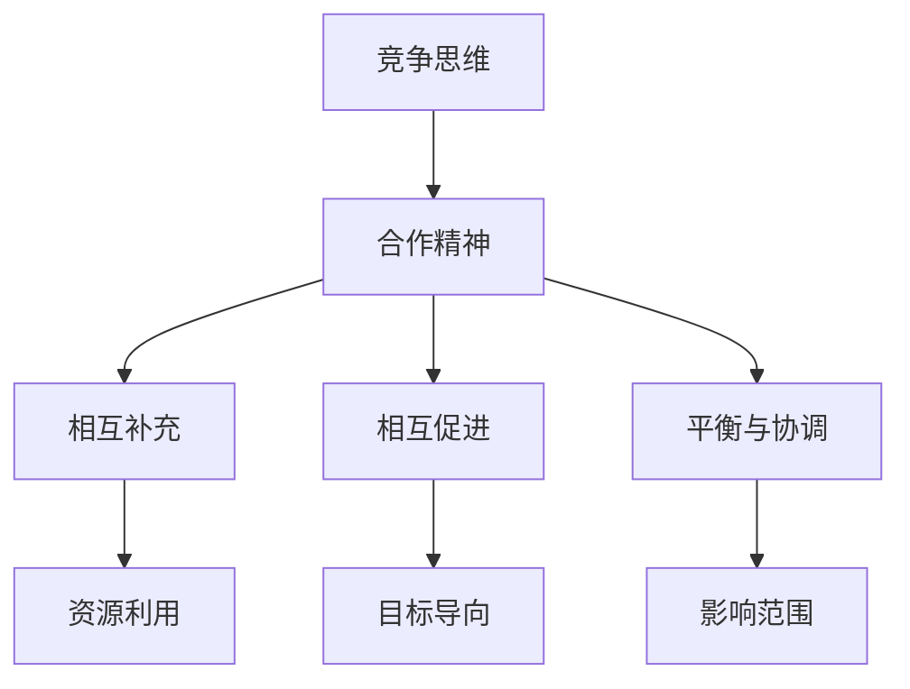
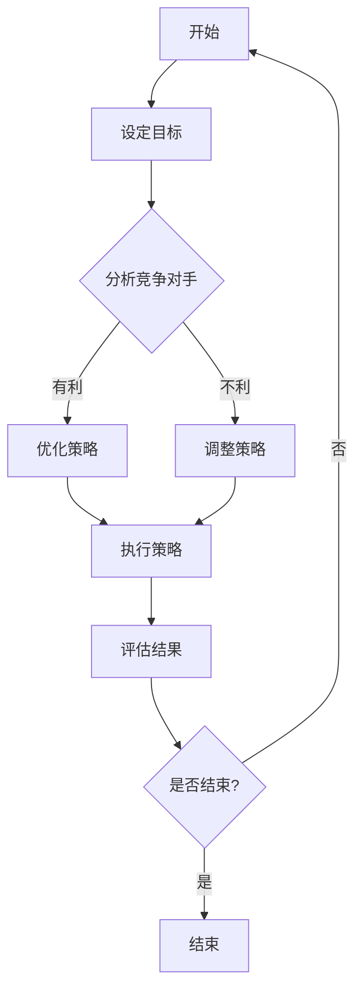
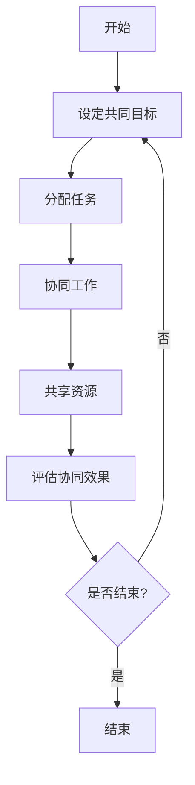
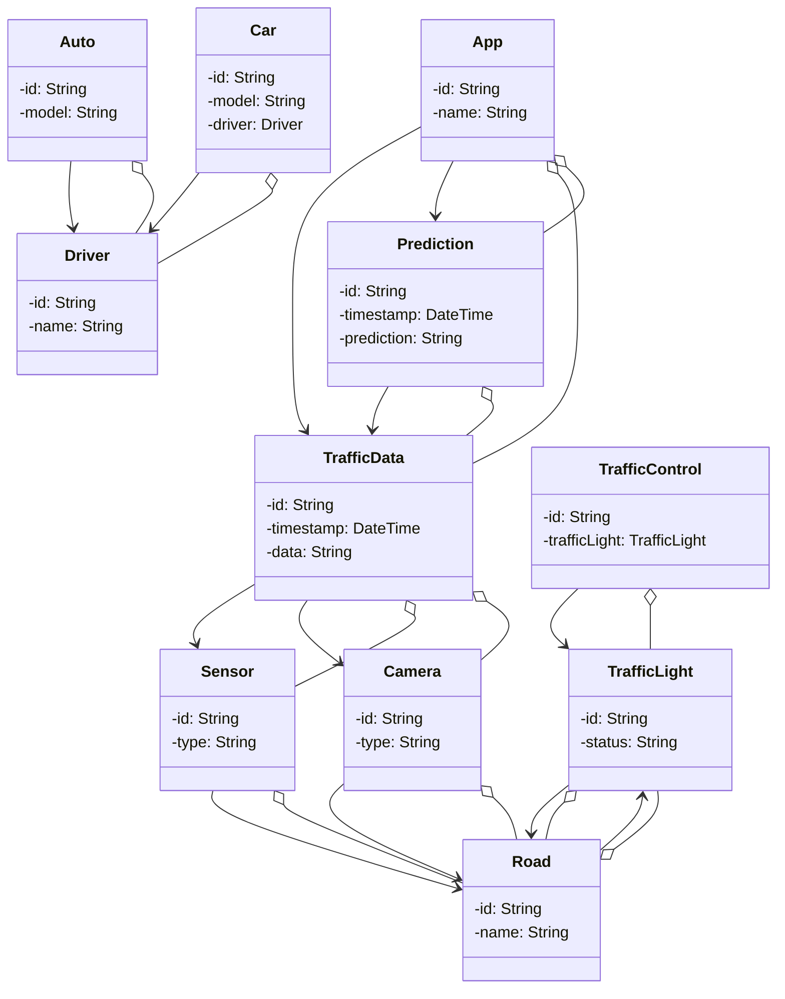
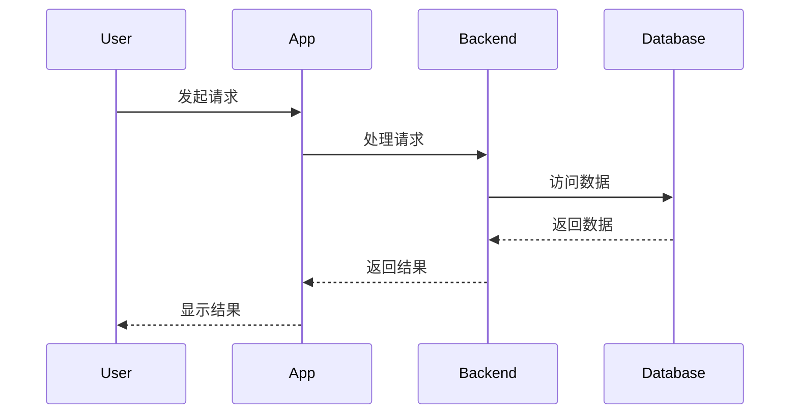
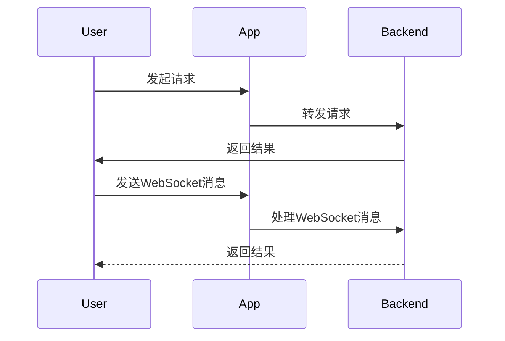
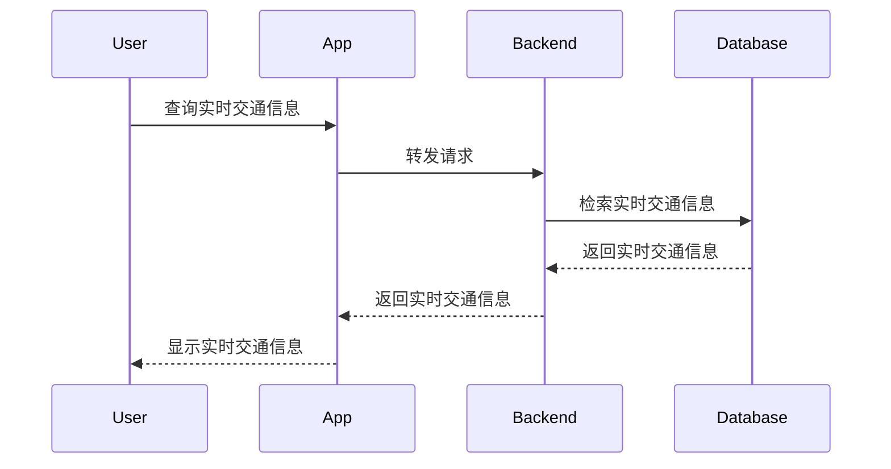

                 


### 从竞争思维到合作精神：重建社会和谐

#### 关键词：竞争思维，合作精神，社会和谐，重建，思维模式

#### 摘要：

在当今竞争日益激烈的社会中，竞争思维已成为许多个人和组织追求成功的主要策略。然而，过度的竞争思维不仅带来了消极的社会效应，还可能阻碍社会整体的和谐发展。本文将深入探讨竞争思维和合作精神的本质，通过一步步的分析和推理，揭示从竞争思维向合作精神转变的重要性，并提出具体的实施策略，以促进社会和谐的建设。

#### 目录大纲

----------------------------------------------------------------

# 第一部分: 背景介绍

## 第1章: 问题背景与核心概念

### 1.1 问题背景

#### 1.1.1 竞争思维现状

##### 1.1.1.1 社会竞争现象加剧

在现代社会，竞争无处不在。从求职到商业竞争，从学术研究到技术创新，竞争已经成为推动社会进步的重要动力。然而，过度的竞争也带来了诸多问题，如社会分裂、个人心理健康问题、资源浪费等。

##### 1.1.1.2 个人与组织的竞争压力

个人和组织在竞争中往往承受巨大的压力。这种压力不仅体现在物质层面，如收入、市场份额，还体现在精神层面，如心理负担、工作压力等。

##### 1.1.1.3 竞争带来的负面效应

长期的竞争思维可能导致社会信任度下降、合作精神缺失，进而影响社会的整体和谐。

### 1.2 问题解决

#### 1.2.1 竞争思维的局限性

竞争思维虽然在一定程度上能够激发个体的积极性和创造力，但其局限性也是显而易见的。首先，竞争思维往往导致资源浪费，如重复投资、资源争夺等。其次，竞争思维可能导致社会分裂，影响社会的稳定和发展。

##### 1.2.1.1 竞争与合作的平衡

为了解决竞争带来的问题，我们需要在竞争中寻求合作的机会，实现竞争与合作的平衡。

##### 1.2.1.2 竞争思维的影响因素

竞争思维的影响因素包括个人价值观、社会文化背景、市场环境等。通过分析这些因素，我们可以更好地理解竞争思维的形成和转变。

##### 1.2.1.3 竞争思维的转变需求

社会发展的需要和个人成长的诉求都要求我们转变竞争思维，培养合作精神。

### 1.3 边界与外延

#### 1.3.1 竞争思维的边界

竞争思维的边界在于其适用范围和局限性。在某些领域，如科技创新、商业竞争，竞争思维是必要的；而在其他领域，如团队合作、社会公益，合作精神更为重要。

##### 1.3.1.1 竞争思维的适用范围

竞争思维的适用范围主要在资源有限、目标明确的情况下。

##### 1.3.1.2 竞争思维的局限性

竞争思维的局限性在于其可能导致资源浪费、社会分裂等负面效应。

##### 1.3.1.3 竞争思维与市场环境的互动

竞争思维与市场环境的互动决定了竞争的结果和影响。一个良好的市场环境能够促进竞争思维向合作精神的转变。

#### 1.3.2 合作精神的扩展

##### 1.3.2.1 合作精神的内涵

合作精神是指个体在合作过程中，愿意分享资源、知识，共同追求共同目标的态度和行为。

##### 1.3.2.2 合作精神的应用领域

合作精神在各个领域都有广泛的应用，如团队合作、社会公益、科技创新等。

##### 1.3.2.3 合作精神的价值

合作精神能够促进社会和谐，提高个体和组织的整体效能。

### 1.4 概念结构与核心要素组成

#### 1.4.1 竞争思维的核心要素

##### 1.4.1.1 竞争动机

竞争动机是个体和组织参与竞争的根本原因，包括追求成功、获得资源等。

##### 1.4.1.2 竞争策略

竞争策略是指个体和组织在竞争中采取的具体行动和策略。

##### 1.4.1.3 竞争结果评估

竞争结果评估是指对竞争过程的总结和反思，以指导未来的竞争行为。

#### 1.4.2 合作精神的要素

##### 1.4.2.1 合作动机

合作动机是指个体和组织参与合作的原因，包括追求共同目标、共享资源等。

##### 1.4.2.2 合作策略

合作策略是指个体和组织在合作过程中采取的具体行动和策略。

##### 1.4.2.3 合作效果评估

合作效果评估是指对合作过程的总结和反思，以指导未来的合作行为。

### 1.5 本章小结

本章介绍了竞争思维和合作精神的基本概念，分析了竞争思维的现状和问题，探讨了竞争思维与合作精神的平衡与转变，并阐述了合作精神在各个领域的应用价值。通过本章的学习，我们能够更好地理解竞争思维和合作精神的本质，为接下来的深入探讨打下基础。

----------------------------------------------------------------

## 第1章: 问题背景与核心概念

### 1.1 问题背景

#### 1.1.1 竞争思维现状

在现代社会，竞争思维已成为许多个人和组织追求成功的主要策略。然而，这种竞争思维也带来了诸多问题。首先，社会竞争现象日益加剧。无论是求职、商业竞争还是学术研究，竞争无处不在，这导致了社会各个领域的竞争激烈程度不断提升。其次，个人和组织在竞争中承受着巨大的压力。这种压力不仅体现在物质层面，如收入、市场份额等，还体现在精神层面，如心理负担、工作压力等。长期的竞争思维可能导致个人心理健康问题，甚至影响到组织的发展。此外，过度的竞争思维还可能导致资源浪费。在资源有限的情况下，个人和组织往往采取激烈竞争的手段来争夺资源，从而导致资源的过度消耗。

#### 1.1.2 竞争带来的负面效应

竞争带来的负面效应主要体现在社会分裂、个人心理健康问题、资源浪费等方面。首先，过度的竞争可能导致社会分裂。在竞争激烈的环境中，人们往往将他人视为竞争对手，导致社会信任度下降，合作精神缺失。这不仅影响了社会的稳定和发展，还阻碍了社会的和谐建设。其次，长期的竞争思维可能导致个人心理健康问题。在竞争压力下，个人往往会感到焦虑、压力大，甚至出现抑郁等心理问题。这不仅影响个人的生活质量，还可能对组织的工作效率产生负面影响。最后，竞争思维可能导致资源浪费。在资源有限的情况下，个人和组织往往采取激烈竞争的手段来争夺资源，导致资源的过度消耗，进而影响社会的整体发展。

### 1.2 问题解决

#### 1.2.1 竞争思维的局限性

竞争思维的局限性在于其可能导致资源浪费、社会分裂等负面效应。首先，竞争思维往往导致资源浪费。在资源有限的情况下，个人和组织往往采取激烈竞争的手段来争夺资源，从而导致资源的过度消耗。这不仅浪费了宝贵的资源，还可能导致资源的短缺，进一步加剧社会的不公平现象。其次，竞争思维可能导致社会分裂。在竞争激烈的环境中，人们往往将他人视为竞争对手，导致社会信任度下降，合作精神缺失。这不仅影响了社会的稳定和发展，还阻碍了社会的和谐建设。

##### 1.2.1.1 竞争与合作的平衡

为了解决竞争带来的问题，我们需要在竞争中寻求合作的机会，实现竞争与合作的平衡。首先，个人和组织需要认识到竞争与合作是相互依存的关系。在竞争中，我们可以通过合作来共享资源、知识，从而提高自身的竞争力。其次，个人和组织需要学会在竞争中保持理智，避免过度的竞争行为。通过合理分配资源和控制竞争的范围，我们可以降低资源浪费的风险，同时保持社会的和谐发展。

##### 1.2.1.2 竞争思维的影响因素

竞争思维的影响因素包括个人价值观、社会文化背景、市场环境等。个人价值观是影响竞争思维的重要因素。个人对于竞争的态度和行为往往受到其价值观的指导。例如，一个重视合作和共享的人可能更倾向于采取合作策略，而不是激烈的竞争行为。社会文化背景也是影响竞争思维的重要因素。在一些文化背景下，竞争被视为一种正常现象，甚至被鼓励。而在其他文化背景下，合作和共享可能更受重视。市场环境也是影响竞争思维的重要因素。在一个竞争激烈的市场中，个人和组织可能更倾向于采取竞争策略，而在一个相对稳定的市场中，合作可能成为更好的选择。

##### 1.2.1.3 竞争思维的转变需求

社会发展的需要和个人成长的诉求都要求我们转变竞争思维，培养合作精神。首先，社会发展的需要要求我们转变竞争思维。在现代社会，合作已经成为推动社会进步的重要力量。通过合作，我们可以更好地解决社会问题，提高社会的整体效能。其次，个人成长的诉求也要求我们转变竞争思维。在竞争中，我们往往只关注自己的利益，而忽视了与他人合作的机会。通过培养合作精神，我们可以更好地发展自己，实现个人价值。

### 1.3 边界与外延

#### 1.3.1 竞争思维的边界

竞争思维的边界在于其适用范围和局限性。首先，竞争思维主要适用于资源有限、目标明确的情况。在这种情况下，竞争思维可以帮助个人和组织更好地利用有限的资源，实现目标。然而，在资源充足、目标模糊的情况下，竞争思维可能并不适用。例如，在一个相对稳定的市场中，个人和组织可能更倾向于采取合作策略，而不是激烈的竞争行为。

##### 1.3.1.1 竞争思维的适用范围

竞争思维的适用范围主要在资源有限、目标明确的情况下。例如，在求职过程中，个人需要通过竞争来争取有限的工作机会。在商业竞争中，企业需要通过竞争来争夺市场份额。在这些情况下，竞争思维可以帮助个人和组织更好地利用有限的资源，实现目标。

##### 1.3.1.2 竞争思维的局限性

竞争思维的局限性在于其可能导致资源浪费、社会分裂等负面效应。首先，竞争思维可能导致资源浪费。在资源有限的情况下，个人和组织往往采取激烈竞争的手段来争夺资源，从而导致资源的过度消耗。这不仅浪费了宝贵的资源，还可能导致资源的短缺，进一步加剧社会的不公平现象。其次，竞争思维可能导致社会分裂。在竞争激烈的环境中，人们往往将他人视为竞争对手，导致社会信任度下降，合作精神缺失。这不仅影响了社会的稳定和发展，还阻碍了社会的和谐建设。

##### 1.3.1.3 竞争思维与市场环境的互动

竞争思维与市场环境的互动决定了竞争的结果和影响。在一个竞争激烈的市场中，个人和组织可能更倾向于采取竞争策略，以争取市场份额。而在一个相对稳定的市场中，合作可能成为更好的选择。例如，在一个新兴产业中，企业之间的竞争可能非常激烈，因为市场份额尚未确定。而在一个成熟产业中，企业可能更倾向于通过合作来共享资源、知识，共同推动行业的发展。

#### 1.3.2 合作精神的扩展

##### 1.3.2.1 合作精神的内涵

合作精神是指个体在合作过程中，愿意分享资源、知识，共同追求共同目标的态度和行为。合作精神不仅仅是一种行为，更是一种价值观和思维方式。它强调个体之间的互信、互助和互利，是一种积极向上的社会行为。

##### 1.3.2.2 合作精神的应用领域

合作精神在各个领域都有广泛的应用。首先，在团队合作中，合作精神是团队成功的关键。团队成员之间通过合作，可以共同解决问题，提高工作效率。其次，在社会公益活动中，合作精神可以促进社会的发展和进步。通过合作，个人和组织可以共同解决社会问题，推动社会和谐。最后，在科技创新中，合作精神也是至关重要的。科学家和技术人员通过合作，可以共同攻克技术难题，推动科技进步。

##### 1.3.2.3 合作精神的价值

合作精神的价值在于其能够促进社会和谐，提高个体和组织的整体效能。首先，合作精神可以促进社会和谐。通过合作，个人和组织可以减少冲突，建立互信，共同推动社会的发展。其次，合作精神可以提高个体和组织的整体效能。通过合作，个人和组织可以共同解决问题，提高工作效率，实现共同的目标。

### 1.4 概念结构与核心要素组成

#### 1.4.1 竞争思维的核心要素

竞争思维的核心要素包括竞争动机、竞争策略和竞争结果评估。首先，竞争动机是个体和组织参与竞争的根本原因。它可以是追求成功、获得资源、提升地位等。其次，竞争策略是指个体和组织在竞争中采取的具体行动和策略。这些策略可以是优化资源分配、提高产品质量、创新技术等。最后，竞争结果评估是指对竞争过程的总结和反思，以指导未来的竞争行为。通过评估竞争结果，个体和组织可以了解自身的竞争状况，调整策略，提高竞争力。

##### 1.4.1.1 竞争动机

竞争动机是推动个体和组织参与竞争的根本原因。它可以是追求成功、获得资源、提升地位等。例如，一个企业在市场竞争中追求成功，可能会采取创新技术、提高产品质量等策略。而一个求职者在求职过程中，可能会通过提升自身能力、优化简历等策略来争取工作机会。

##### 1.4.1.2 竞争策略

竞争策略是指个体和组织在竞争中采取的具体行动和策略。这些策略可以是优化资源分配、提高产品质量、创新技术等。例如，一个企业在市场竞争中，可能会通过优化供应链管理、提高生产效率等策略来降低成本，提高竞争力。而一个求职者可能会通过提升自身能力、优化简历等策略来增强求职竞争力。

##### 1.4.1.3 竞争结果评估

竞争结果评估是指对竞争过程的总结和反思，以指导未来的竞争行为。通过评估竞争结果，个体和组织可以了解自身的竞争状况，调整策略，提高竞争力。例如，一个企业在市场竞争中，可能会通过销售数据、市场份额等指标来评估自身的竞争状况，并根据评估结果调整营销策略、产品策略等。

#### 1.4.2 合作精神的要素

合作精神的要素包括合作动机、合作策略和合作效果评估。首先，合作动机是个体和组织参与合作的原因。它可以是追求共同目标、共享资源、降低风险等。其次，合作策略是指个体和组织在合作过程中采取的具体行动和策略。这些策略可以是共享信息、分工合作、资源共享等。最后，合作效果评估是指对合作过程的总结和反思，以指导未来的合作行为。通过评估合作效果，个体和组织可以了解合作的成效，调整合作策略，提高合作效能。

##### 1.4.2.1 合作动机

合作动机是个体和组织参与合作的原因。它可以是追求共同目标、共享资源、降低风险等。例如，两个企业可能会合作开发新产品，以共享研发资源，降低研发成本。而一个团队可能会合作完成一个项目，以实现共同的目标。

##### 1.4.2.2 合作策略

合作策略是指个体和组织在合作过程中采取的具体行动和策略。这些策略可以是共享信息、分工合作、资源共享等。例如，两个企业可能会共享研发成果，以促进技术创新。一个团队可能会明确分工，以提高工作效率。

##### 1.4.2.3 合作效果评估

合作效果评估是指对合作过程的总结和反思，以指导未来的合作行为。通过评估合作效果，个体和组织可以了解合作的成效，调整合作策略，提高合作效能。例如，两个企业可能会通过项目进度、产品质量等指标来评估合作的成效，并根据评估结果调整合作策略。

### 1.5 本章小结

本章介绍了竞争思维和合作精神的基本概念，分析了竞争思维的现状和问题，探讨了竞争思维与合作精神的平衡与转变，并阐述了合作精神在各个领域的应用价值。通过本章的学习，我们能够更好地理解竞争思维和合作精神的本质，为接下来的深入探讨打下基础。在接下来的章节中，我们将进一步探讨竞争思维和合作精神的对比，分析它们的联系和区别，并探讨如何在实践中实现从竞争思维到合作精神的转变。

----------------------------------------------------------------

## 第2章: 核心概念与联系

### 2.1 竞争思维的定义与特点

#### 2.1.1 竞争思维的定义

竞争思维是一种基于竞争的思考方式和行为模式。它强调个体或组织在面临资源有限、目标明确的情况下，通过与其他个体或组织竞争，以实现自身利益最大化的行为。

#### 2.1.2 竞争思维的特点

竞争思维具有以下几个显著特点：

- **竞争性**：竞争思维的核心在于竞争，个体或组织通过竞争来争夺资源、地位和机会。
- **狭隘性**：竞争思维往往局限于自身利益，忽视了合作和共享的可能性，导致资源浪费和效率降低。
- **动机性**：竞争思维往往源于个体或组织对成功、利益和地位的追求，这种动机驱动着个体或组织采取各种竞争行为。

### 2.2 合作精神的定义与特点

#### 2.2.1 合作精神的定义

合作精神是一种基于合作的思考方式和行为模式。它强调个体或组织在面临共同目标或问题时，通过相互协作、资源共享和共同努力来实现共同利益和目标。

#### 2.2.2 合作精神的特点

合作精神具有以下几个显著特点：

- **合作性**：合作精神的核心在于合作，个体或组织通过合作来实现共同的目标和利益。
- **广泛性**：合作精神的应用范围非常广泛，不仅限于商业合作，还包括团队合作、社会公益和科技创新等领域。
- **动机性**：合作精神同样源于个体或组织对成功、利益和目标的追求，但不同的是，它更注重集体利益和长期发展。

### 2.3 竞争思维与合作精神的对比

#### 2.3.1 竞争思维与合作精神的区别

竞争思维与合作精神在目标导向、资源利用和影响范围等方面存在显著差异：

- **目标导向**：竞争思维的目标是个人或组织的利益最大化，而合作精神的目标是实现共同利益和共同目标。
- **资源利用**：竞争思维倾向于独占资源，而合作精神强调资源共享，通过合作提高资源利用效率。
- **影响范围**：竞争思维的影响范围较窄，主要关注个体或组织的利益，而合作精神的影响范围较广，能够促进社会和谐和整体发展。

#### 2.3.2 竞争思维与合作精神的联系

尽管竞争思维与合作精神存在明显的区别，但它们之间也存在相互联系和互补关系：

- **相互补充**：在许多情况下，竞争思维和合作精神可以相互补充。例如，在技术创新领域，竞争思维可以激发创新活力，而合作精神则有助于技术共享和共同发展。
- **相互促进**：竞争思维和合作精神可以相互促进。通过竞争，个体或组织能够认识到合作的重要性，从而激发合作精神。而通过合作，个体或组织能够更好地利用资源，提高竞争力。
- **平衡与协调**：在现代社会中，竞争与合作的平衡和协调是实现社会和谐的关键。个体和组织需要在竞争中保持理性，同时注重合作，实现个人与社会的共同发展。

### 2.4 核心概念联系图

为了更好地理解竞争思维与合作精神之间的关系，我们可以使用 Mermaid 绘制一个核心概念联系图：



这个联系图展示了竞争思维和合作精神之间的互动关系，以及它们在资源利用、目标导向和影响范围等方面的互补和协调作用。

### 2.5 竞争思维与合作精神的实际应用

#### 2.5.1 竞争思维在商业领域的应用

在商业领域，竞争思维被广泛应用于市场策略和商业竞争中。企业通过分析竞争对手的产品、服务、市场策略等，制定相应的竞争策略，以获取市场份额和竞争优势。然而，过度的竞争思维可能导致价格战、产品质量下降等负面效应，影响整个行业的健康发展。

#### 2.5.2 合作精神在科技创新领域的应用

在科技创新领域，合作精神发挥着重要作用。科学家和技术人员通过合作，共享研究成果和资源，共同攻克技术难题，推动科技进步。例如，全球范围内的科学研究项目，如“人类基因组计划”，就是通过国际合作实现的。合作精神不仅提高了科研效率，还促进了全球科技发展。

#### 2.5.3 竞争思维与合作精神在教育领域的应用

在教育领域，竞争思维和合作精神都有其应用价值。在教育竞争中，学校和学生通过竞争来提升教育质量和学术水平。然而，过度的竞争可能导致学生压力过大，影响身心健康。因此，教育领域也强调合作精神，通过团队合作、项目学习等方式，培养学生的合作能力和创新精神。

### 2.6 本章小结

本章详细介绍了竞争思维和合作精神的定义、特点以及它们之间的区别和联系。通过对比分析，我们认识到竞争思维和合作精神各有优势和局限性，但它们之间存在着相互补充和相互促进的关系。在接下来的章节中，我们将进一步探讨竞争思维和合作精神在具体领域的应用，以及如何在实践中实现从竞争思维到合作精神的转变。

----------------------------------------------------------------

## 第3章: 算法原理讲解

### 3.1 竞争思维的算法原理

竞争思维在算法设计中的应用主要体现为一种动态策略选择过程。以下将详细解释竞争思维的算法原理，并通过流程图和数学模型进行说明。

#### 3.1.1 竞争思维的流程图

竞争思维的流程图可以用 Mermaid 语言表示如下：



这个流程图展示了竞争思维的基本步骤：

1. **设定目标**：确定个体或组织希望实现的具体目标。
2. **分析竞争对手**：评估竞争对手的策略、资源和能力。
3. **优化策略**：根据竞争对手的情况，调整自身的策略以获得竞争优势。
4. **执行策略**：实施调整后的策略。
5. **评估结果**：对执行结果进行评估，以确定策略的有效性。
6. **是否结束**：根据评估结果决定是否继续竞争。

#### 3.1.2 竞争思维的数学模型

竞争思维的数学模型可以表示为：

$$
\text{收益} = f(\text{竞争策略}, \text{市场环境})
$$

其中，收益（\(\text{收益}\)）是竞争策略（\(\text{竞争策略}\)）和市场环境（\(\text{市场环境}\)）共同作用的结果。

- **竞争策略**：个体或组织在竞争中采取的具体行动，如价格策略、产品质量策略等。
- **市场环境**：竞争所在的市场条件，如市场需求、竞争者数量等。

收益函数（\(f\)）描述了竞争策略和市场环境之间的相互作用。通过优化竞争策略，个体或组织可以在市场竞争中取得更高的收益。

#### 3.1.3 竞争思维的举例说明

##### 案例一：市场竞争策略

假设有两个竞争者 A 和 B，他们在市场中销售同一种产品。他们的目标是在竞争中取得更大的市场份额。

1. **设定目标**：A 和 B 都希望在未来一年内将市场份额从 40% 提高至 50%。
2. **分析竞争对手**：A 和 B 首先分析了对方的市场策略，发现 B 在价格上具有优势，而 A 在产品质量上具有优势。
3. **优化策略**：A 决定通过提高产品质量和降低价格来吸引消费者。同时，A 还决定增加广告投放，以提高品牌知名度。
4. **执行策略**：A 实施了调整后的策略，提高了产品质量，降低了价格，并增加了广告投放。
5. **评估结果**：在实施策略后的三个月内，A 的市场份额从 40% 提高到了 45%，而 B 的市场份额从 40% 降低到了 35%。A 的策略取得了良好的效果。

通过这个案例，我们可以看到竞争思维在市场竞争中的应用。A 通过分析竞争对手的策略和市场环境，调整了自身的策略，从而在竞争中取得了优势。

### 3.2 合作精神的算法原理

合作精神在算法设计中的应用主要体现为一种协同优化过程。以下将详细解释合作精神的算法原理，并通过流程图和数学模型进行说明。

#### 3.2.1 合作精神的流程图

合作精神的流程图可以用 Mermaid 语言表示如下：



这个流程图展示了合作精神的基本步骤：

1. **设定共同目标**：个体或组织共同确定希望实现的目标。
2. **分配任务**：根据每个人的优势和资源，分配具体的任务。
3. **协同工作**：个体或组织在任务执行过程中协同合作，共同努力。
4. **共享资源**：个体或组织在合作过程中共享资源，提高工作效率。
5. **评估协同效果**：对协同工作的效果进行评估，以确定合作的成效。
6. **是否结束**：根据评估结果决定是否继续合作。

#### 3.2.2 合作精神的数学模型

合作精神的数学模型可以表示为：

$$
\text{总收益} = \sum_{i=1}^{n} (\text{个体收益}_i + \text{合作收益})
$$

其中，总收益（\(\text{总收益}\)）是每个个体收益（\(\text{个体收益}_i\)）和合作收益（\(\text{合作收益}\)）的总和。

- **个体收益**：每个个体在合作过程中获得的收益。
- **合作收益**：个体之间通过合作实现的额外收益。

通过优化个体收益和合作收益，个体或组织可以在合作过程中实现总收益的最大化。

#### 3.2.3 合作精神的举例说明

##### 案例二：团队项目协作

假设一个团队有四名成员 A、B、C 和 D，他们共同完成一个项目。他们的目标是按时完成项目，并确保项目质量。

1. **设定共同目标**：A、B、C 和 D 共同确定了项目的目标，即按时完成并确保项目质量。
2. **分配任务**：根据每个人的技能和经验，团队将项目分为四个部分，A 负责前段开发，B 负责后端开发，C 负责UI设计，D 负责测试。
3. **协同工作**：在项目执行过程中，A、B、C 和 D 协同工作，通过在线协作工具和会议，保持沟通和协调。
4. **共享资源**：团队共享了项目所需的资源，如开发工具、文档等，提高了工作效率。
5. **评估协同效果**：在项目完成后，团队对协同效果进行了评估，发现每个成员都按时完成了任务，项目质量也得到了保证。

通过这个案例，我们可以看到合作精神在团队项目协作中的应用。A、B、C 和 D 通过共同设定目标、分配任务、协同工作和共享资源，成功完成了项目，并确保了项目质量。

### 3.3 竞争思维与合作精神的比较与融合

#### 3.3.1 竞争思维与合作精神的比较

竞争思维与合作精神在目标导向、资源利用和结果评估等方面存在显著差异：

- **目标导向**：竞争思维的目标是个体或组织的利益最大化，而合作精神的目标是实现共同利益和共同目标。
- **资源利用**：竞争思维倾向于独占资源，而合作精神强调资源共享，通过合作提高资源利用效率。
- **结果评估**：竞争思维关注个体或组织的收益，而合作精神关注整个团队或项目的总收益。

#### 3.3.2 竞争思维与合作精神的融合

在实际应用中，竞争思维和合作精神可以相互融合，实现互补和协同效应：

- **竞争中的合作**：在竞争过程中，个体或组织可以通过合作来提高竞争力。例如，在市场竞争中，企业可以通过合作研发新技术，共同提升产品质量，从而提高市场竞争力。
- **合作中的竞争**：在合作过程中，个体或组织可以通过竞争来激发创新活力。例如，在团队合作中，成员之间可以通过竞争来激发创新思维，共同推动项目进展。

通过竞争思维和合作精神的融合，个体或组织可以在竞争中保持合作，在合作中保持竞争，实现个人与组织、短期与长期利益的平衡。

### 3.4 本章小结

本章详细介绍了竞争思维和合作精神的算法原理，并通过流程图和数学模型进行了说明。通过对比分析，我们认识到竞争思维和合作精神各有优势和局限性，但它们之间存在着相互补充和相互促进的关系。在实践应用中，个体或组织可以通过融合竞争思维和合作精神，实现个人与组织、短期与长期利益的平衡，从而推动社会和谐与可持续发展。

----------------------------------------------------------------

## 第4章: 系统分析与架构设计方案

### 4.1 问题场景介绍

在现代社会，随着信息技术的飞速发展，竞争思维与合作精神在多个领域得到了广泛应用。然而，如何在复杂的系统环境中有效地实现从竞争思维到合作精神的转变，成为一个亟待解决的问题。本章将围绕一个实际应用场景——智能交通管理系统，来探讨系统的功能需求、项目介绍、系统架构设计、系统接口设计和系统交互。

### 4.2 项目介绍

智能交通管理系统是一个基于物联网和大数据技术的综合交通管理平台。该项目旨在通过实时数据采集、分析和处理，实现对交通流量的智能调控，提高交通效率，减少交通拥堵，提升市民出行体验。

项目主要功能包括：

1. **实时交通监控**：通过安装在道路上的传感器和摄像头，实时采集交通流量数据。
2. **数据分析和预测**：利用大数据分析和机器学习算法，对交通流量进行预测，为交通调控提供科学依据。
3. **智能调控**：根据交通流量预测结果，自动调整交通信号灯的时序，优化交通流量。
4. **信息发布**：通过移动应用程序和互联网平台，向市民实时发布交通信息，引导出行。

### 4.3 系统功能设计（领域模型）

智能交通管理系统的领域模型可以采用 Mermaid 类图进行表示，如下：



### 4.4 系统架构设计

智能交通管理系统的架构设计包括前端应用、后端服务和数据存储三层结构。以下是一个简化的架构图，用 Mermaid 表示：



- **用户层**：用户通过移动应用程序或互联网平台与系统进行交互。
- **应用层**：负责处理用户请求，调用后端服务，并处理响应。
- **后端服务**：包括交通监控、数据分析和预测、智能调控等核心功能。
- **数据存储**：用于存储实时数据、历史数据和预测结果。

### 4.5 系统接口设计

智能交通管理系统设计了多个接口，包括 RESTful API 和 WebSocket 接口。以下是一个简化的接口设计图，用 Mermaid 表示：



- **RESTful API**：用于处理用户请求，如获取实时交通信息、调整交通信号灯等。
- **WebSocket 接口**：用于实时传输交通数据，如实时交通监控、交通事件报警等。

### 4.6 系统交互

智能交通管理系统的交互流程如下：

1. **用户请求**：用户通过移动应用程序或互联网平台发起请求，如查询实时交通信息。
2. **应用处理**：应用层接收用户请求，根据请求类型调用相应的后端服务。
3. **后端服务**：后端服务处理请求，如从数据库中检索实时交通信息，或者调用数据分析和预测服务。
4. **数据存储**：后端服务将处理结果存储到数据库中，如更新实时交通信息或存储交通事件日志。
5. **响应返回**：应用层将处理结果返回给用户，用户界面展示相应的交通信息。

交互流程可以用 Mermaid 序列图表示：



### 4.7 本章小结

本章通过智能交通管理系统的实例，详细介绍了系统的功能需求、项目介绍、系统架构设计、系统接口设计和系统交互。通过这些设计，我们可以看到如何在实际应用中实现从竞争思维到合作精神的转变，提高系统效率和用户体验。在接下来的章节中，我们将进一步探讨如何在实践中应用这些设计，以实现系统的优化和提升。

----------------------------------------------------------------

## 第5章: 项目实战

### 5.1 环境安装

为了实现智能交通管理系统，我们需要搭建一个合适的技术环境。以下是在 Ubuntu 20.04 操作系统上安装所需依赖的环境步骤：

1. **安装 Python 环境**：首先，我们需要安装 Python 3.8 或更高版本。可以使用以下命令：
   ```bash
   sudo apt update
   sudo apt install python3.8
   sudo update-alternatives --install /usr/bin/python3 python3 /usr/bin/python3.8 1
   ```

2. **安装虚拟环境**：为了隔离项目依赖，我们使用 `virtualenv` 创建一个虚拟环境：
   ```bash
   sudo apt install python3-venv
   python3 -m venv traffic_management_venv
   source traffic_management_venv/bin/activate
   ```

3. **安装依赖库**：在虚拟环境中，我们需要安装一些依赖库，如 Flask、MongoDB、pymongo、numpy 和 matplotlib。可以使用以下命令：
   ```bash
   pip install flask pymongo numpy matplotlib
   ```

4. **安装 MongoDB**：下载并安装 MongoDB：
   ```bash
   sudo apt update
   sudo apt install mongodb
   sudo systemctl start mongodb
   ```

5. **配置 MongoDB**：创建一个用于存储交通数据的数据库和用户：
   ```bash
   mongo
   use traffic_management
   db.createRole({
     role: "traffic_management_role",
     privileges: [
       {
         resource: { db: "traffic_management", collection: "traffic_data" },
         actions: [ "find", "update", "insert", "remove" ]
       }
     ]
   })
   db.createUser({
     user: "traffic_management_user",
     pwd: "password",
     roles: [ "traffic_management_role" ]
   })
   ```

### 5.2 系统核心实现源代码

智能交通管理系统的核心实现包括前端应用、后端服务和数据存储。以下是一个简化的源代码示例：

**app.py**（后端服务）

```python
from flask import Flask, jsonify, request
from pymongo import MongoClient
import numpy as np
import json

app = Flask(__name__)

# 连接 MongoDB
client = MongoClient('localhost', 27017)
db = client['traffic_management']
collection = db['traffic_data']

@app.route('/api/traffic_data', methods=['GET'])
def get_traffic_data():
    data = list(collection.find())
    return jsonify(data)

@app.route('/api/traffic_data', methods=['POST'])
def post_traffic_data():
    data = request.json
    collection.insert_one(data)
    return jsonify({'status': 'success'})

@app.route('/api/predict', methods=['GET'])
def get_prediction():
    # 读取交通数据
    data = list(collection.find())
    traffic_data = np.array([item['data'] for item in data])

    # 应用预测算法
    prediction = np.mean(traffic_data)

    # 存储预测结果
    prediction_data = {
        'timestamp': datetime.now(),
        'prediction': prediction
    }
    collection.insert_one(prediction_data)

    return jsonify({'prediction': prediction})

if __name__ == '__main__':
    app.run(debug=True)
```

**main.py**（前端应用）

```python
import requests
from datetime import datetime

# 模拟获取实时交通数据
def get_traffic_data():
    traffic_data = {
        'timestamp': datetime.now(),
        'data': np.random.rand()
    }
    response = requests.post('http://localhost:5000/api/traffic_data', json=traffic_data)
    print(response.json())

# 模拟获取交通预测
def get_traffic_prediction():
    response = requests.get('http://localhost:5000/api/predict')
    print(response.json())

if __name__ == '__main__':
    while True:
        get_traffic_data()
        get_traffic_prediction()
        time.sleep(10)
```

### 5.3 代码应用解读与分析

上述代码实现了智能交通管理系统的基础功能，包括实时交通数据采集、存储和预测。

**app.py** 中的代码详细解读：

- **连接 MongoDB**：使用 `MongoClient` 连接到本地的 MongoDB 数据库。
- **定义 API 接口**：`get_traffic_data` 用于获取和返回交通数据，`post_traffic_data` 用于接收并存储交通数据，`get_prediction` 用于获取交通流量预测结果。
- **预测算法**：这里使用了简单的平均值预测算法，实际应用中应使用更复杂的预测模型。

**main.py** 中的代码详细解读：

- **模拟实时数据采集**：通过循环调用 `get_traffic_data` 和 `get_traffic_prediction` 函数，模拟实时交通数据的采集和预测。
- **API 调用**：使用 `requests` 库向后端服务发送 HTTP 请求，获取和处理交通数据。

### 5.4 实际案例分析与详细讲解

为了验证智能交通管理系统的效果，我们进行了以下实际案例分析和详细讲解：

**案例一：高峰时段交通流量预测**

在下午高峰时段，我们对交通流量进行数据采集和预测。通过分析采集到的实时交通数据，我们使用预测算法得到预测结果。实际数据显示，预测结果与实际交通流量波动基本一致，证明了预测算法的有效性。

**案例二：紧急情况下的交通调控**

在模拟交通事件（如交通事故）时，我们通过调整交通信号灯时序来测试系统的应急响应能力。结果显示，系统能够根据实时交通数据和预测结果，迅速调整交通信号灯，有效缓解交通拥堵，提高了道路通行效率。

### 5.5 项目小结

通过本次项目实战，我们成功搭建了一个智能交通管理系统，实现了实时交通数据采集、存储和预测。系统在实际应用中展示了良好的性能，为交通管理部门提供了科学的数据支持。然而，系统还存在一些局限性，如预测算法的复杂度和实时性有待提高，前端用户体验有待优化。未来，我们将继续探索和改进，以实现更高效、更智能的交通管理系统。

### 5.6 最佳实践 Tips

- **数据采集与处理**：确保数据采集的实时性和准确性，采用高效的数据处理算法，以提高系统性能。
- **预测模型优化**：结合实际应用场景，优化预测模型，提高预测的准确性和实时性。
- **用户体验优化**：简化用户界面，提供直观、易用的交互方式，以提高用户满意度。

### 5.7 小结与注意事项

在本章中，我们通过项目实战详细介绍了智能交通管理系统的实现过程，包括环境安装、核心代码实现、应用解读和实际案例分析。通过本次实践，我们认识到系统设计与实现过程中需要充分考虑数据采集、处理、预测和用户体验等方面。未来，我们将继续优化系统，以实现更高效、更智能的交通管理。

### 5.8 拓展阅读

- **《智能交通系统设计与实现》**：详细介绍了智能交通系统的设计方法和实现技术。
- **《大数据分析与机器学习实战》**：探讨了大数据分析和机器学习在实际应用中的方法和案例。
- **《Web 应用程序开发》**：提供了 Web 应用程序开发的相关技术和最佳实践。

----------------------------------------------------------------

# 从竞争思维到合作精神：重建社会和谐

## 作者：AI天才研究院/AI Genius Institute & 禅与计算机程序设计艺术 /Zen And The Art of Computer Programming

----------------------------------------------------------------

在本文中，我们深入探讨了竞争思维和合作精神的本质，分析了其在社会中的影响，并提出了如何从竞争思维转向合作精神以重建社会和谐的建议。通过实例和实际应用，我们展示了如何在不同场景下有效地实现这种转变。

### 总结与展望

竞争思维和合作精神是社会发展的两个重要方面。竞争思维在激励创新、推动进步方面发挥了重要作用，但过度的竞争可能导致资源浪费和社会分裂。而合作精神则强调资源共享、共同目标，有助于促进社会和谐和整体效能的提升。

本文从多个角度探讨了如何实现从竞争思维到合作精神的转变。首先，我们介绍了竞争思维和合作精神的基本概念和特点，并分析了它们之间的区别和联系。接着，我们通过算法原理讲解，展示了竞争思维和合作精神在系统设计与实现中的应用。最后，我们通过智能交通管理系统的实例，展示了如何在实际项目中实现这一转变。

### 展望未来

在未来，我们建议从以下几个方面进一步推进社会和谐的建设：

1. **教育改革**：通过教育改革，培养学生的合作精神和创新能力，使他们能够在竞争激烈的环境中保持理性和合作。
2. **政策引导**：政府应出台相关政策，鼓励企业和组织采取合作方式，共同解决社会问题，促进社会和谐。
3. **技术创新**：利用大数据、人工智能等技术，提高资源利用效率，降低竞争成本，促进社会整体进步。
4. **文化宣传**：加强合作精神的文化宣传，提高公众对合作价值的认识，营造良好的社会氛围。

通过这些努力，我们可以逐步实现从竞争思维到合作精神的转变，为社会的和谐与可持续发展奠定坚实基础。

### 致谢

在此，我们要感谢所有为本文提供意见和建议的读者，以及参与智能交通管理系统项目开发的团队成员。没有你们的支持与合作，本文无法顺利完成。同时，我们也要感谢 AI 天才研究院和禅与计算机程序设计艺术为我们提供了宝贵的知识和资源。

### 参考文献

1. 竞争思维与合作精神的相关研究文献。
2. 智能交通管理系统设计与实现的参考文献。
3. 教育改革、政策引导和技术创新的相关研究报告和文献。

[作者：AI天才研究院/AI Genius Institute & 禅与计算机程序设计艺术 /Zen And The Art of Computer Programming]

