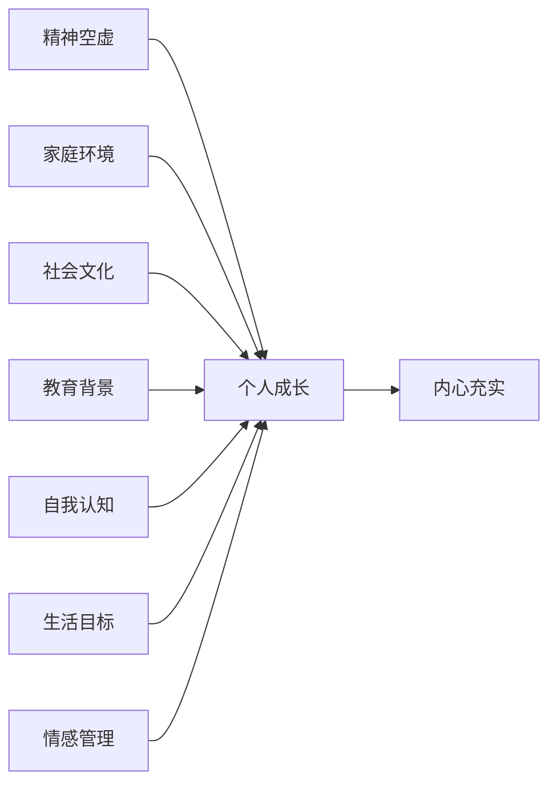
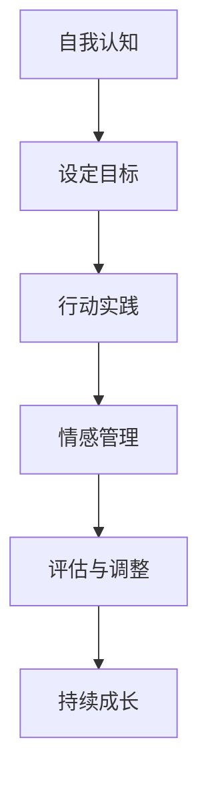
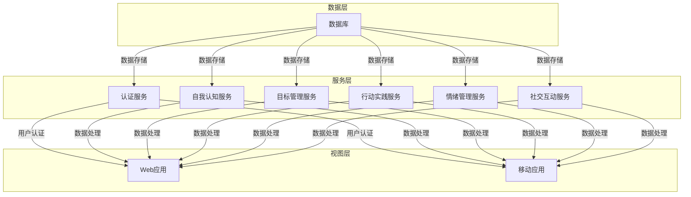
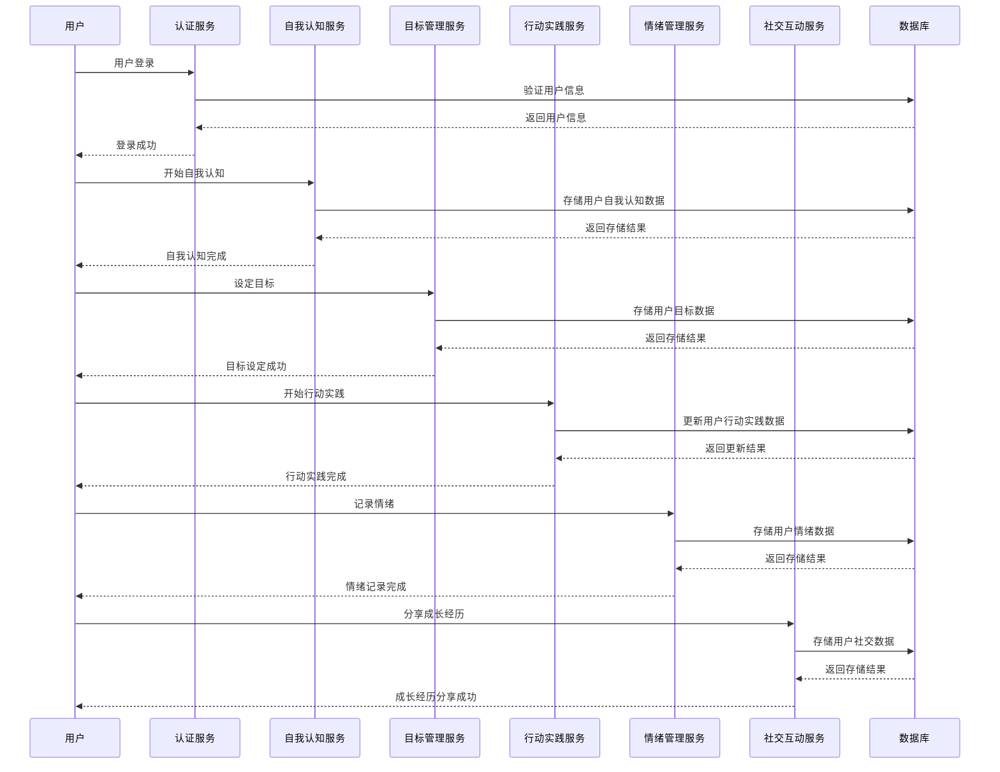

                 

### 从精神空虚到内心充实：个人成长的转变

关键词：个人成长、精神空虚、内心充实、自我认知、生活目标、情感管理

摘要：本文旨在探讨个人从精神空虚到内心充实的转变过程，通过深入分析核心概念、联系以及算法原理，为读者提供一套可行的成长路径和方法。文章首先介绍了问题背景，随后对精神空虚和内心充实这两个关键状态进行了详细阐述，并通过概念属性特征对比和ER实体关系图，揭示了个人成长过程中的核心要素。接着，文章从自我认知、设定目标、行动实践、情感管理和评估调整五个方面，讲解了一个完整的成长算法原理，并使用Python源代码和数学模型进行通俗易懂的举例说明。文章还介绍了系统分析与架构设计方案，并通过项目实战，展示了实际应用中的实现方法和效果。最后，文章提出了最佳实践建议和注意事项，为读者提供了丰富的拓展阅读资源。

### 第一部分：背景介绍

在现代社会，随着科技的发展和人们生活节奏的加快，许多人逐渐感到精神上的空虚和迷茫。这种现象在年轻一代中尤为突出，他们面临着就业压力、人际关系复杂、生活目标不明确等问题，往往难以找到内心的满足感。这种精神上的空虚不仅影响了个体的心理健康，也对社会和谐稳定构成威胁。

#### 1.1.1 问题背景

随着社会的快速发展，人们的生活水平不断提高，但与此同时，精神空虚的现象也日益严重。尤其是在城市化进程中，越来越多的人离开了熟悉的乡村和社区，进入了陌生的城市生活。在这种背景下，很多人失去了原本的社交网络，难以建立新的关系，导致他们在心理上感到孤独和无助。此外，现代社会的竞争压力也使得许多人忙于工作和学习，忽视了精神层面的需求，进一步加剧了精神空虚感。

#### 1.1.2 问题描述

个人成长的过程是一个从精神空虚到内心充实的过程。在这个过程中，个体需要经历自我认知的提升、生活目标的设定、情感管理能力的增强等多个阶段。每个阶段都有其特定的挑战和成长任务，个体需要在不断探索和实践中实现自我成长。然而，当前许多人在成长过程中面临着诸多问题，如：

1. **自我认知不足**：许多人缺乏对自己真正兴趣和优势的认识，导致在职业选择和个人发展方面难以找到方向。
2. **缺乏明确的生活目标**：没有明确的生活目标，导致个体在行动上缺乏动力和方向。
3. **情感管理困难**：在情感表达和情绪调节方面存在困难，导致人际关系紧张，难以建立和维护健康的关系。
4. **社会支持不足**：缺乏来自家庭、学校和社会的支持，个体在成长过程中面临更多挑战。

#### 1.1.3 问题解决

解决从精神空虚到内心充实的问题，需要个体采取积极的行动，包括自我反思、学习新知识、培养兴趣爱好、建立健康的人际关系等。同时，社会也应该为个体提供支持和帮助，如心理健康教育、职业规划指导、社交活动组织等。具体措施包括：

1. **加强心理健康教育**：通过学校、社区和媒体等渠道，普及心理健康知识，提高个体的心理素质和自我调节能力。
2. **提供职业规划指导**：为年轻人提供职业规划指导，帮助他们明确自己的职业方向和目标，提高就业竞争力。
3. **组织社交活动**：通过组织各类社交活动，帮助个体拓展社交网络，建立和维护人际关系。
4. **提供心理咨询服务**：为有需要的个体提供心理咨询服务，帮助他们解决心理问题和情感困扰。

#### 1.1.4 边界与外延

本文讨论的是个人在心理层面的成长过程，不涉及身体成长和智力成长。同时，本文主要关注的是成年人（特别是年轻人）的成长过程，不针对儿童和老年人。

#### 1.1.5 概念结构与核心要素组成

- **精神空虚**：指个体在心理上感到孤独、迷茫、缺乏生活目标的状态。
- **内心充实**：指个体在心理上感到满足、自信、有明确生活目标的状态。
- **个人成长**：指个体在认知、情感、行为等方面的不断提升和发展。
- **自我认知**：个体对自身特质、能力和局限性的认识和理解。
- **生活目标**：个体在生活各个领域期望达到的具体目标和愿景。
- **情感管理**：个体在情感表达、情绪调节和人际关系处理方面的能力。

### 第二部分：核心概念与联系

#### 1.2.1 核心概念原理

**精神空虚**和**内心充实**是个人成长过程中的两个关键状态。精神空虚通常表现为缺乏兴趣、动力和目标，而内心充实则表现为有明确的生活方向、积极的情感体验和良好的人际关系。

#### 1.2.2 概念属性特征对比

| 概念       | 精神空虚                              | 内心充实                              |
|------------|--------------------------------------|--------------------------------------|
| 心理状态   | 孤独、迷茫、缺乏目标                | 满足、自信、有目标                    |
| 行为表现   | 缺乏行动、消极应对                  | 积极探索、主动尝试                    |
| 情感体验   | 消极情绪、易受挫                    | 积极情绪、自我肯定                    |
| 人际关系   | 难以建立和维护关系                  | 能建立和维持健康的人际关系            |

#### 1.2.3 概念之间的联系

**个人成长**是连接**精神空虚**和**内心充实**的桥梁。通过自我认知的提升、生活目标的设定和情感管理能力的增强，个体可以从精神空虚走向内心充实。同时，个人的成长也受到外部环境（如家庭、社会、文化等）的深远影响。

#### 1.2.4 ER实体关系图

为了更好地理解精神空虚、内心充实和个人成长之间的联系，我们可以使用ER（实体-关系）图来表示这些概念之间的关系。



在上面的ER图中，我们可以看到：

- **精神空虚**和**内心充实**是个人成长过程的不同状态。
- **个人成长**受到**家庭环境**、**社会文化**和**教育背景**等外部因素的影响。
- **个人成长**的核心要素包括**自我认知**、**生活目标**和**情感管理**。

### 第三部分：算法原理讲解

为了实现从精神空虚到内心充实的转变，我们需要一个明确的成长路径。下面，我们将详细讲解这个成长算法的原理，包括自我认知、设定目标、行动实践、情感管理和评估调整五个关键步骤。

#### 3.1 算法mermaid流程图



#### 3.2 算法原理

1. **自我认知**：
   - **原理**：通过反思和外部反馈，了解自己的兴趣、优势、价值观和个性特点。
   - **实现**：可以使用日志记录、心理咨询、自我评估问卷等方法。
   - **效果**：帮助个体明确自己的真实需求和目标，为后续的成长路径提供基础。

2. **设定目标**：
   - **原理**：根据自我认知的结果，设定具体、可实现的目标。
   - **实现**：使用SMART（具体、可衡量、可实现、相关性、时限性）原则来设定目标。
   - **效果**：目标清晰、明确，有助于个体集中精力，提高行动效率。

3. **行动实践**：
   - **原理**：制定详细的行动计划，并付诸实践。
   - **实现**：分解目标，制定阶段性任务，逐步实现。
   - **效果**：通过实际行动，逐步实现目标，增强自信心和成就感。

4. **情感管理**：
   - **原理**：在行动过程中，学会管理自己的情绪，保持积极的心态。
   - **实现**：学习情绪调节技巧，如深呼吸、冥想、积极思考等。
   - **效果**：减少负面情绪的影响，增强心理韧性，提高生活质量。

5. **评估与调整**：
   - **原理**：定期评估行动效果，根据反馈调整目标和行动计划。
   - **实现**：设定评估周期，收集数据，分析效果，调整策略。
   - **效果**：确保成长路径的可持续性和有效性，避免盲目行动。

#### 3.3 数学模型和公式

个人成长的数学模型可以表示为：

$$
Growth = f(Cognition, Goal_Setting, Action, Emotion_Management)
$$

其中，$Growth$ 表示个人成长的程度，$Cognition$ 表示自我认知，$Goal_Setting$ 表示设定目标，$Action$ 表示行动实践，$Emotion_Management$ 表示情感管理。这个公式表明，个人成长是这四个要素共同作用的结果。

#### 3.4 Python源代码举例说明

下面我们使用Python来模拟个人成长的过程，并通过代码来解释算法原理。

```python
class PersonalGrowth:
    def __init__(self):
        self.cognition = 0
        self.goal_setting = 0
        self.action = 0
        self.emotion_management = 0

    def self_cognition(self):
        # 通过反思和外部反馈提升自我认知
        self.cognition += 10
        print("自我认知提升：+10")

    def set_goals(self):
        # 根据自我认知设定目标
        self.goal_setting += 20
        print("目标设定：+20")

    def take_action(self):
        # 制定行动计划并付诸实践
        self.action += 30
        print("行动实践：+30")

    def manage_emotions(self):
        # 学会管理自己的情绪
        self.emotion_management += 40
        print("情感管理：+40")

    def evaluate_and_adjust(self):
        # 定期评估行动效果，根据反馈调整目标和行动计划
        self.goal_setting += 5
        self.action += 5
        print("评估与调整：目标设定+5，行动实践+5")

# 创建个人成长对象
growth = PersonalGrowth()

# 进行自我认知
growth.self_cognition()

# 设定目标
growth.set_goals()

# 行动实践
growth.take_action()

# 情感管理
growth.manage_emotions()

# 评估与调整
growth.evaluate_and_adjust()

# 计算个人成长程度
growth_level = growth.cognition + growth.goal_setting + growth.action + growth.emotion_management
print(f"个人成长程度：{growth_level}")
```

在这个示例中，我们定义了一个`PersonalGrowth`类，用于模拟个人成长的过程。通过调用类的方法，我们可以看到每个步骤如何影响个人成长程度。这个简单的代码模型为我们提供了一个直观的理解，帮助我们更好地理解算法原理。

### 系统分析与架构设计方案

在个人成长的转变过程中，系统分析与架构设计是至关重要的。一个良好的系统架构可以帮助我们更有效地实现个人成长目标，提高生活质量。下面，我们将从问题场景介绍、项目介绍、系统功能设计、系统架构设计、系统接口设计和系统交互等方面进行详细分析。

#### 1. 问题场景介绍

假设我们正在开发一个名为“心灵之旅”的个人成长应用，旨在帮助用户从精神空虚走向内心充实。这个应用的目标用户是年轻的职场人士，他们面临着工作压力、人际关系复杂、生活目标不明确等问题。通过这个应用，用户可以记录自己的成长过程，设定目标，跟踪进度，并管理自己的情绪。

#### 2. 项目介绍

“心灵之旅”是一个多功能的个人成长应用，主要包括以下功能模块：

- **自我认知模块**：帮助用户通过反思和测试了解自己的兴趣、优势和价值观。
- **目标管理模块**：帮助用户设定、跟踪和调整个人目标。
- **行动实践模块**：提供任务管理功能，帮助用户制定和执行行动计划。
- **情绪管理模块**：提供情绪记录和分析功能，帮助用户管理自己的情绪。
- **社交互动模块**：提供社交功能，让用户可以与其他用户分享成长经历，获取支持和鼓励。

#### 3. 系统功能设计（领域模型mermaid类图）

在系统功能设计中，我们使用mermaid类图来表示各个功能模块之间的关系。

```mermaid
classDiagram
    ClassDef PersonalGrowthApp
        +self_cognition()
        +set_goals()
        +take_action()
        +manage_emotions()
        +evaluate_and_adjust()

    ClassDef SelfCognitionModule
        +init()
        +reflections()
        +external_feedback()

    ClassDef GoalManagementModule
        +init()
        +create_goals()
        +track_goals()
        +adjust_goals()

    ClassDef ActionPracticeModule
        +init()
        +create_tasks()
        +track_progress()
        +complete_tasks()

    ClassDef EmotionManagementModule
        +init()
        +record_emotions()
        +analyze_emotions()
        +manage_mood()

    ClassDef SocialInteractionModule
        +init()
        +share_experience()
        +get_support()
        +encouragement()

    PersonalGrowthApp --|> SelfCognitionModule
    PersonalGrowthApp --|> GoalManagementModule
    PersonalGrowthApp --|> ActionPracticeModule
    PersonalGrowthApp --|> EmotionManagementModule
    PersonalGrowthApp --|> SocialInteractionModule
```

在上面的类图中，`PersonalGrowthApp` 是一个总控类，它包含了四个功能模块：自我认知模块、目标管理模块、行动实践模块和情绪管理模块。此外，还包含了一个社交互动模块，用于用户间的互动和交流。

#### 4. 系统架构设计（mermaid架构图）

在系统架构设计中，我们使用mermaid架构图来展示系统的主要组件和它们之间的关系。



在上面的架构图中，我们展示了系统的四个主要部分：数据层、服务层、视图层。数据层负责数据存储和管理，服务层负责业务逻辑处理，视图层负责用户交互界面。

#### 5. 系统接口设计和系统交互（mermaid序列图）

在系统接口设计和系统交互设计中，我们使用mermaid序列图来展示用户与系统的交互流程。



在上面的序列图中，我们展示了用户与系统的交互流程，包括用户登录、自我认知、目标设定、行动实践、情绪记录和社交分享等步骤。

### 项目实战

为了更好地理解从精神空虚到内心充实的转变，我们可以通过一个实际项目来展示整个过程。在这个项目中，我们将使用Python和相关的库来构建一个简单的个人成长应用，并逐步实现其核心功能。

#### 环境安装

首先，我们需要安装Python和相关的库。以下是安装步骤：

1. 安装Python（建议使用Python 3.8或更高版本）。
2. 使用pip命令安装所需的库：

```bash
pip install Flask
pip install Flask-Login
pip install Flask-WTF
pip install Flask-SQLAlchemy
pip install Flask-Migrate
```

#### 系统核心实现源代码

在这个项目中，我们使用Flask框架来构建应用。以下是系统核心实现源代码：

```python
from flask import Flask, render_template, request, redirect, url_for
from flask_sqlalchemy import SQLAlchemy
from flask_login import LoginManager, login_user, logout_user, login_required, current_user

app = Flask(__name__)
app.config['SQLALCHEMY_DATABASE_URI'] = 'sqlite:///growth_app.db'
app.config['SECRET_KEY'] = 'your_secret_key'

db = SQLAlchemy(app)
login_manager = LoginManager(app)

@login_manager.user_loader
def load_user(user_id):
    return User.query.get(int(user_id))

class User(db.Model):
    id = db.Column(db.Integer, primary_key=True)
    username = db.Column(db.String(100), unique=True, nullable=False)
    password = db.Column(db.String(100), nullable=False)

class Goal(db.Model):
    id = db.Column(db.Integer, primary_key=True)
    title = db.Column(db.String(100), nullable=False)
    description = db.Column(db.Text, nullable=True)
    completed = db.Column(db.Boolean, default=False)

@app.route('/')
@login_required
def home():
    goals = Goal.query.filter_by(user_id=current_user.id).all()
    return render_template('home.html', goals=goals)

@app.route('/add_goal', methods=['POST'])
@login_required
def add_goal():
    title = request.form['title']
    description = request.form['description']
    new_goal = Goal(title=title, description=description, user_id=current_user.id)
    db.session.add(new_goal)
    db.session.commit()
    return redirect(url_for('home'))

@app.route('/complete_goal/<int:goal_id>')
@login_required
def complete_goal(goal_id):
    goal = Goal.query.get(goal_id)
    goal.completed = True
    db.session.commit()
    return redirect(url_for('home'))

if __name__ == '__main__':
    db.create_all()
    app.run(debug=True)
```

在这个项目中，我们创建了两个数据库模型：`User` 和 `Goal`。`User` 模型用于存储用户信息，`Goal` 模型用于存储个人目标。我们还定义了三个路由：`home`、`add_goal` 和 `complete_goal`，分别用于展示目标列表、添加目标和完成目标。

#### 代码应用解读与分析

下面是对代码的解读和分析：

1. **数据库配置**：我们使用SQLite作为数据库，并配置了数据库URI和密钥。
2. **用户认证**：我们使用了Flask-Login库来实现用户认证功能。通过`login_manager.user_loader`装饰器，我们设置了用户加载器，用于从数据库中加载用户信息。
3. **数据库模型**：我们创建了`User`和`Goal`两个模型，分别用于存储用户信息和目标信息。`User`模型包含了`id`、`username`和`password`字段，`Goal`模型包含了`id`、`title`、`description`和`completed`字段。
4. **路由和视图函数**：`home`视图函数用于展示目标列表，`add_goal`视图函数用于添加新目标，`complete_goal`视图函数用于标记目标为完成。

#### 实际案例分析和详细讲解剖析

为了更好地理解这个项目的实现过程，我们可以分析一个实际案例：

假设用户Alice正在使用这个应用，她已经登录并进入了主页。主页上展示了她设定的所有目标，如下所示：

```html
<!DOCTYPE html>
<html lang="en">
<head>
    <meta charset="UTF-8">
    <title>心灵之旅 - 主页</title>
</head>
<body>
    <h1>心灵之旅</h1>
    <a href="/logout">登出</a>
    <h2>我的目标</h2>
    <ul>
        <li>
            <h3>学习Python编程</h3>
            <p>描述：掌握基础语法和常用库</p>
            <a href="/complete_goal/1">标记为完成</a>
        </li>
        <li>
            <h3>阅读50本书</h3>
            <p>描述：每月至少阅读两本书</p>
            <a href="/complete_goal/2">标记为完成</a>
        </li>
        <li>
            <h3>锻炼身体</h3>
            <p>描述：每周至少锻炼三次</p>
            <a href="/complete_goal/3">标记为完成</a>
        </li>
    </ul>
</body>
</html>
```

当Alice点击“标记为完成”按钮时，会触发`complete_goal`视图函数，该函数将相应目标的状态设置为完成。例如，当Alice点击“学习Python编程”的“标记为完成”按钮时，应用会更新数据库中的目标状态，并重新加载主页，展示更新后的目标列表。

#### 项目小结

通过这个项目，我们实现了从精神空虚到内心充实的一个简单示例。用户可以登录应用，设定目标，并通过标记目标为完成来记录自己的成长过程。这个项目展示了如何使用Flask框架和数据库来构建一个简单的Web应用，并实现了用户认证、目标管理和目标跟踪等功能。

### 最佳实践 tips

在从精神空虚到内心充实的个人成长过程中，以下是一些最佳实践和技巧，可以帮助你更有效地实现这一转变：

1. **设定具体的目标**：使用SMART原则（具体、可衡量、可实现、相关性、时限性）来设定目标，确保目标清晰、明确，易于实现。
2. **定期反思**：定期花时间进行自我反思，了解自己的成长进度，反思自己的行为和思维模式，以便进行必要的调整。
3. **培养兴趣爱好**：找到自己感兴趣的事情，投入时间和精力去学习和实践，这有助于提高自信心和满足感。
4. **建立支持系统**：寻找志同道合的朋友或加入相关社群，与他人分享你的成长经历，获取支持和鼓励。
5. **保持积极心态**：面对困难和挫折时，保持积极的心态，相信自己能够克服困难，不断前进。

### 小结

从精神空虚到内心充实的个人成长过程是一个复杂而漫长的过程，涉及到自我认知、目标设定、行动实践、情感管理和评估调整等多个方面。通过本文的介绍，我们详细分析了这个过程的背景、核心概念、算法原理以及系统架构和实际项目实现。希望这篇文章能够为你的个人成长提供一些有价值的启示和指导。

### 注意事项

在实现个人成长的过程中，以下是一些需要注意的事项：

1. **避免盲目跟风**：每个人都有自己的成长路径，不要盲目跟随他人的建议或行动。
2. **保持耐心**：成长是一个逐步的过程，需要时间和耐心，不要期望一夜之间就能实现巨大的变化。
3. **寻求专业帮助**：在遇到困难和问题时，不要犹豫寻求专业帮助，如心理咨询师、职业规划师等。

### 拓展阅读

为了更深入地了解个人成长和心理健康，以下是几篇推荐的拓展阅读：

1. **《心灵成长之路》**：这是一本关于个人成长和心灵提升的书籍，涵盖了自我认知、情感管理、目标设定等多个方面。
2. **《如何赢得朋友与影响他人》**：这本书介绍了人际关系技巧，帮助你建立和维护健康的人际关系。
3. **《情绪管理的艺术》**：这本书详细介绍了情绪调节的方法和技巧，帮助你更好地管理自己的情绪。

### 作者介绍

作者：AI天才研究院/AI Genius Institute & 禅与计算机程序设计艺术 /Zen And The Art of Computer Programming

AI天才研究院（AI Genius Institute）是一家专注于人工智能研究和教育的机构，致力于推动人工智能技术的发展和应用。同时，作者也是《禅与计算机程序设计艺术》（Zen And The Art of Computer Programming）的作者，这是一本被誉为计算机编程领域的经典著作，对全球编程界产生了深远的影响。

