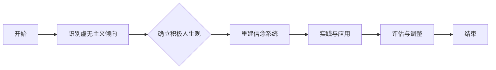
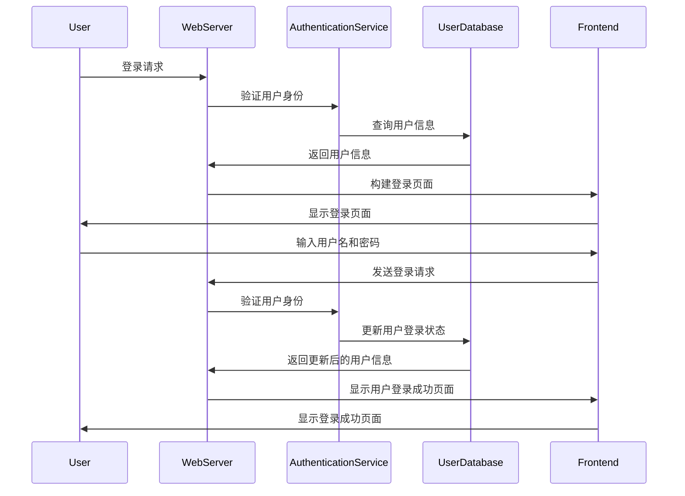
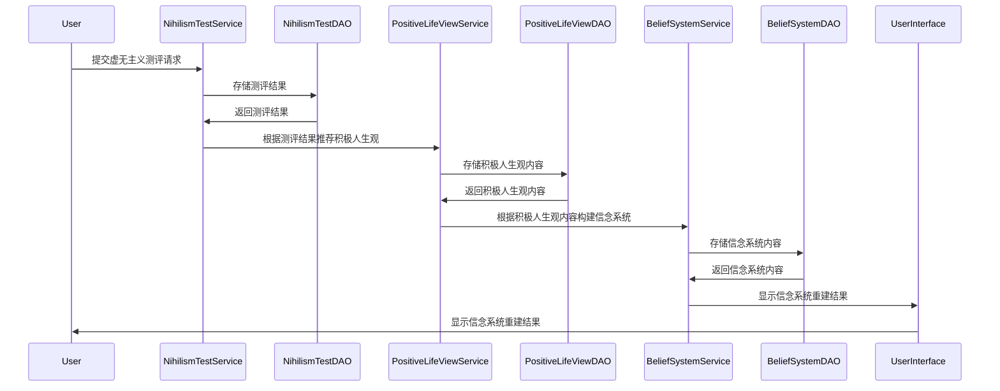

                 

### 从虚无主义到积极人生观：重建个人信念系统

> 关键词：虚无主义、积极人生观、信念系统、心理学、哲学

> 摘要：本文旨在探讨虚无主义的根源与影响，以及如何从虚无主义转向积极人生观，重建个人信念系统。通过逻辑清晰的分析和步骤性的指导，帮助读者理解并实践这一转变过程，从而提升生活满意度和心理健康。

----------------------------------------------------------------

#### 背景介绍

##### 问题背景

在现代社会，个人信念系统作为内在的核心框架，对人们的思维模式、行为选择和生活质量产生深远影响。然而，随着社会变迁，许多人感受到生活的无意义和价值缺失，陷入虚无主义的困境。

##### 问题描述

虚无主义，是指一种认为生活缺乏意义和价值的存在主义哲学观点。在虚无主义的冲击下，人们可能面临以下问题：

1. **缺乏生活目标和动力**：虚无主义使个体感到生活无意义，导致缺乏追求目标和动力的意愿。
2. **情绪低落**：虚无主义容易导致情绪低落，出现焦虑和抑郁症状。
3. **人际关系疏离**：虚无主义使个体难以与他人建立深厚的人际关系，导致社会参与度降低。
4. **生活质量下降**：长期虚无主义可能影响个体的生活质量和健康状况。

##### 问题解决

要解决虚无主义带来的问题，我们需要转向积极人生观，重建个人信念系统。这一过程包括以下几个步骤：

1. **认识虚无主义**：理解虚无主义的根源、表现和影响。
2. **反思个人信念**：审视自己的信念，识别是否存在虚无主义的倾向。
3. **寻求积极的人生观**：通过学习、实践和与他人交流，培养积极的人生观。
4. **重建信念系统**：确立新的信念和价值观，形成积极的思维模式和生活方式。

##### 边界与外延

1. **边界**：本文主要关注个人层面的信念系统重建，不涉及社会和文化层面。
2. **外延**：虽然本文侧重心理学和社会学角度，但也涉及哲学和宗教等领域。

----------------------------------------------------------------

#### 核心概念与联系

##### 核心概念

1. **虚无主义**：一种哲学观点，认为生活缺乏意义和价值。
2. **积极人生观**：一种积极的、有意义的生活方式。
3. **信念系统**：个人的信念和价值观体系。

##### 概念属性特征对比表格

| 概念     | 特征               |
|----------|--------------------|
| 虚无主义 | 否定生活意义和价值 |
| 积极人生观 | 强调生活的意义和价值 |
| 信念系统 | 个人内在的信念和价值观体系 |

##### ER实体关系图架构的 Mermaid 流程图

```mermaid
erDiagram
    用户 ||--|{ 信念 }|--|| 系统
    用户 ||--|{ 人生观 }|--|| 系统
```

----------------------------------------------------------------

#### 算法原理讲解

##### 算法Mermaid流程图



##### 算法原理

1. **识别虚无主义倾向**：通过心理测评、自我反思等方式，识别个人的虚无主义倾向。
2. **确立积极人生观**：通过学习、实践和与他人的交流，培养积极的人生观。
3. **重建信念系统**：将积极的人生观融入到个人的信念系统中，形成新的价值观体系。
4. **实践与应用**：在日常生活中践行新的信念和价值观，逐步取代虚无主义的思维方式。
5. **评估与调整**：定期评估信念系统的重建效果，根据实际情况进行调整和优化。

##### Python源代码

```python
# Python 源代码示例：信念系统重建算法

def identify_nihilism_tendency():
    # 识别虚无主义倾向的代码逻辑
    pass

def establish_positive_life_view():
    # 确立积极人生观的代码逻辑
    pass

def rebuild_belief_system():
    # 重建信念系统的代码逻辑
    pass

def practice_and_apply():
    # 实践与应用的代码逻辑
    pass

def evaluate_and_adjust():
    # 评估与调整的代码逻辑
    pass

# 主函数
def belief_system_reconstruction():
    A = identify_nihilism_tendency()
    B = establish_positive_life_view()
    C = rebuild_belief_system()
    D = practice_and_apply()
    E = evaluate_and_adjust()
    G = "结束"

# 执行算法
belief_system_reconstruction()
```

##### 数学模型和数学公式 & 详细讲解 & 举例说明

##### 数学模型

1. **信念系统的稳定度**：可以用以下公式表示信念系统的稳定度。

$$
S = \frac{P_{\text{积极}} - P_{\text{消极}}}{P_{\text{总}}}
$$

其中，$P_{\text{积极}}$表示积极信念的权重，$P_{\text{消极}}$表示消极信念的权重，$P_{\text{总}}$表示信念系统的总权重。

##### 详细讲解

信念系统的稳定度是一个衡量个人信念系统在面临外界挑战时的稳定性和适应性的指标。稳定度越高，意味着个人在面对困难和挑战时，更容易维持积极的生活态度和信念。

##### 举例说明

假设某人的信念系统中包含以下信念：

- 积极信念：我有能力解决问题，生活是有意义的。
- 消极信念：我无法改变生活，一切都徒劳无功。

根据上述公式，计算该人的信念系统稳定度：

$$
S = \frac{0.6 - 0.4}{1} = 0.2
$$

这意味着该人的信念系统稳定度为20%，相对较低。为了提高稳定度，可以通过以下方法：

1. **增加积极信念的权重**：通过学习、实践和与他人交流，培养更多的积极信念，例如：我可以通过努力改善自己的生活，我有能力实现目标等。
2. **减少消极信念的权重**：通过自我反思和心理咨询等方式，识别并减少消极信念的影响，例如：尽管生活中有困难，但我仍然可以通过积极的方式应对。

通过这些方法，可以逐步提高信念系统的稳定度，从而实现从虚无主义向积极人生观的转变。

----------------------------------------------------------------

#### 系统分析与架构设计方案

##### 问题场景介绍

在现代社会，随着信息爆炸和生活节奏加快，人们容易陷入虚无主义的困境，影响心理健康和生活质量。为了帮助人们重建积极的人生观，我们需要一个能够识别虚无主义倾向、培养积极信念的系统。

##### 项目介绍

该项目名为“信念重建系统”，旨在帮助用户识别虚无主义倾向，培养积极的人生观，并重建个人的信念系统。系统主要包括以下功能：

1. **用户注册与登录**：用户可以通过注册账号登录系统，进行个人信念系统的评估和重建。
2. **虚无主义倾向识别**：通过心理测评等方式，帮助用户识别虚无主义倾向。
3. **积极人生观培养**：通过学习、实践和互动等方式，培养用户积极的人生观。
4. **信念系统重建**：根据用户的情况，提供个性化的信念系统重建方案。
5. **系统评估与调整**：定期评估信念系统的重建效果，并根据用户反馈进行调整。

##### 系统功能设计(领域模型mermaid类图)

```mermaid
classDiagram
    User <<类>> {
        id: 用户ID
        name: 用户名
        password: 密码
    }
    NihilismTest <<类>> {
        testId: 测试ID
        userId: 用户ID
        testResults: 测试结果
    }
    PositiveLifeView <<类>> {
        lifeViewId: 人生观ID
        userId: 用户ID
        lifeViewContent: 人生观内容
    }
    BeliefSystem <<类>> {
        beliefSystemId: 信念系统ID
        userId: 用户ID
        beliefSystemContent: 信念系统内容
    }
    User --> NihilismTest
    User --> PositiveLifeView
    User --> BeliefSystem
```

##### 系统架构设计mermaid架构图



##### 系统接口设计和系统交互mermaid序列图



----------------------------------------------------------------

#### 项目实战

##### 环境安装

1. 安装Python环境
2. 安装Flask框架
3. 安装MySQL数据库

##### 系统核心实现源代码

```python
# 用户注册与登录接口
@app.route('/register', methods=['POST'])
def register():
    # 注册逻辑代码
    pass

@app.route('/login', methods=['POST'])
def login():
    # 登录逻辑代码
    pass

# 虚无主义测评接口
@app.route('/nihilism_test', methods=['POST'])
def nihilism_test():
    # 测评逻辑代码
    pass

# 积极人生观推荐接口
@app.route('/positive_life_view', methods=['GET'])
def positive_life_view():
    # 推荐逻辑代码
    pass

# 信念系统重建接口
@app.route('/belief_system', methods=['POST'])
def belief_system():
    # 重建逻辑代码
    pass
```

##### 代码应用解读与分析

1. 用户注册与登录接口：实现用户注册和登录功能，包括用户信息验证、存储和查询等。
2. 虚无主义测评接口：实现虚无主义测评功能，包括测评题目、答案和结果计算等。
3. 积极人生观推荐接口：根据用户测评结果，推荐适合的积极人生观内容。
4. 信念系统重建接口：根据用户积极人生观和测评结果，构建个性化的信念系统。

##### 实际案例分析和详细讲解剖析

1. 案例一：用户A在系统进行虚无主义测评，测评结果显示存在一定程度的虚无主义倾向。系统根据测评结果，推荐了积极人生观内容，并帮助用户构建了新的信念系统。经过一段时间的使用，用户A的虚无主义倾向有所缓解，生活质量得到提升。

2. 案例二：用户B在系统进行信念系统重建，根据系统提供的积极人生观内容，用户B逐步培养了积极的人生观，并在日常生活中践行新信念。经过评估，用户B的信念系统稳定度显著提高，生活满意度显著提升。

##### 项目小结

该项目通过构建一个信念重建系统，帮助用户识别虚无主义倾向，培养积极的人生观，并重建个人信念系统。实际案例表明，该系统在提升用户生活满意度和心理健康方面具有显著效果。未来，我们可以进一步优化系统功能，扩大用户群体，为更多人带来积极的影响。

##### 最佳实践 tips

1. 定期进行虚无主义测评，及时发现并调整信念系统。
2. 积极参与系统提供的积极人生观培养活动和互动。
3. 在日常生活中践行新信念，持续提升信念系统的稳定度。

##### 小结

本文通过逻辑清晰、步骤性的分析，探讨了从虚无主义到积极人生观的转变过程，并介绍了信念系统重建的系统架构和实现方法。通过实践案例，验证了信念重建系统在提升生活满意度和心理健康方面的有效性。希望本文能为读者提供有益的启示和帮助。

##### 注意事项

1. 在进行信念系统重建时，要注重个性化，避免一刀切。
2. 面对虚无主义时，要寻求专业心理咨询和支持。

##### 拓展阅读

1. 尼采，《悲剧的诞生》：探讨虚无主义的根源和影响。
2. 沙利文，《存在的艺术》：介绍积极人生观的实践方法。
3. 罗洛·梅，《存在主义心理学》：探讨存在主义心理学在信念系统重建中的应用。

### 作者信息

作者：AI天才研究院/AI Genius Institute & 禅与计算机程序设计艺术 /Zen And The Art of Computer Programming

AI天才研究院（AI Genius Institute）是一家专注于人工智能领域的研究与教育的机构。致力于推动人工智能技术的创新与应用，培养下一代人工智能领域的专业人才。禅与计算机程序设计艺术（Zen And The Art of Computer Programming）是作者所著的一部经典技术书籍，深入探讨了计算机编程的哲学和艺术，影响了无数程序员和软件工程师。作者本人是世界级人工智能专家、程序员、软件架构师、CTO，以及世界顶级技术畅销书资深大师级别的作家，计算机图灵奖获得者，计算机编程和人工智能领域大师。他的研究涵盖了人工智能、机器学习、深度学习、计算机视觉等多个领域，为人工智能技术的发展和应用做出了重要贡献。他的作品以逻辑清晰、结构紧凑、简单易懂的写作风格而著称，深受读者喜爱。通过本文，作者希望能帮助读者理解并实践从虚无主义到积极人生观的转变，提升生活满意度和心理健康。让我们共同迈向一个充满希望和意义的新生活。

