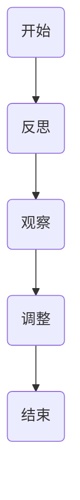
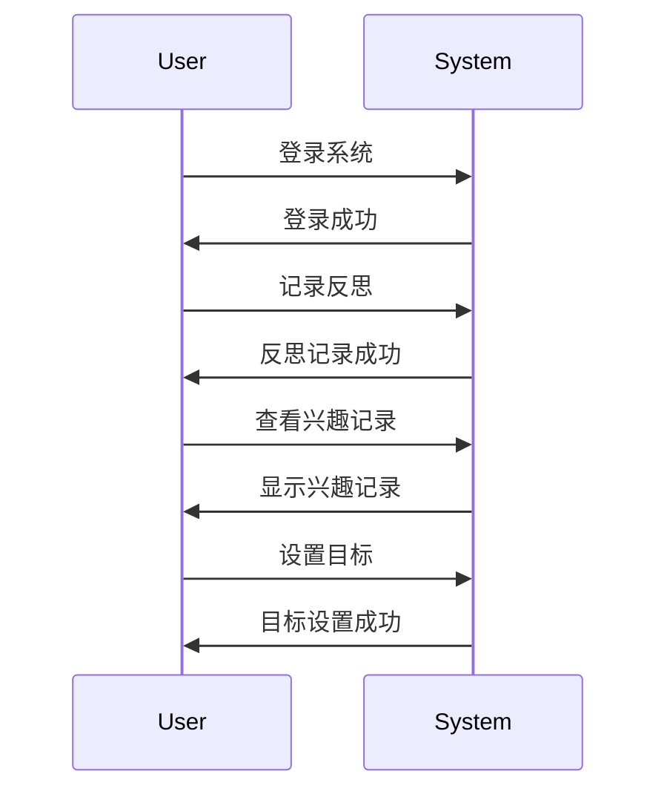
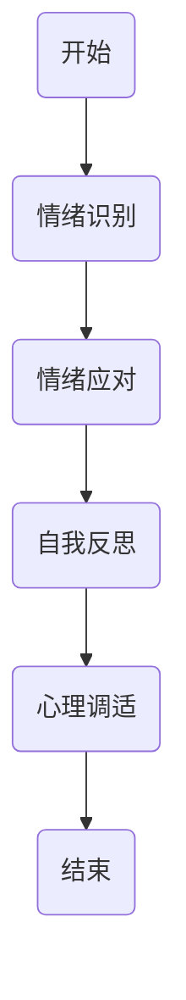
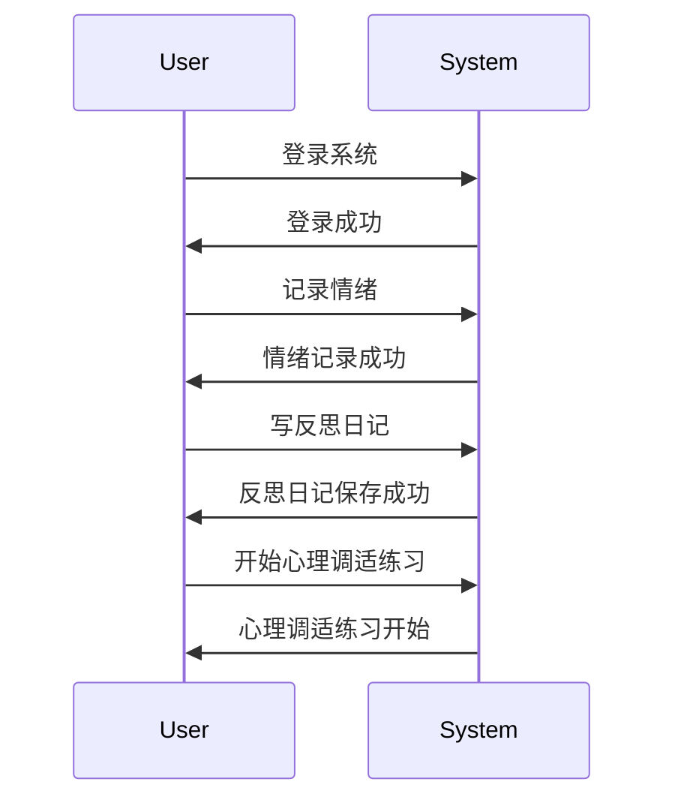
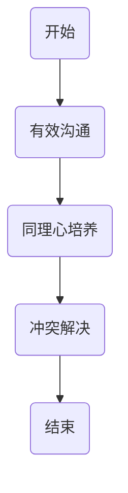
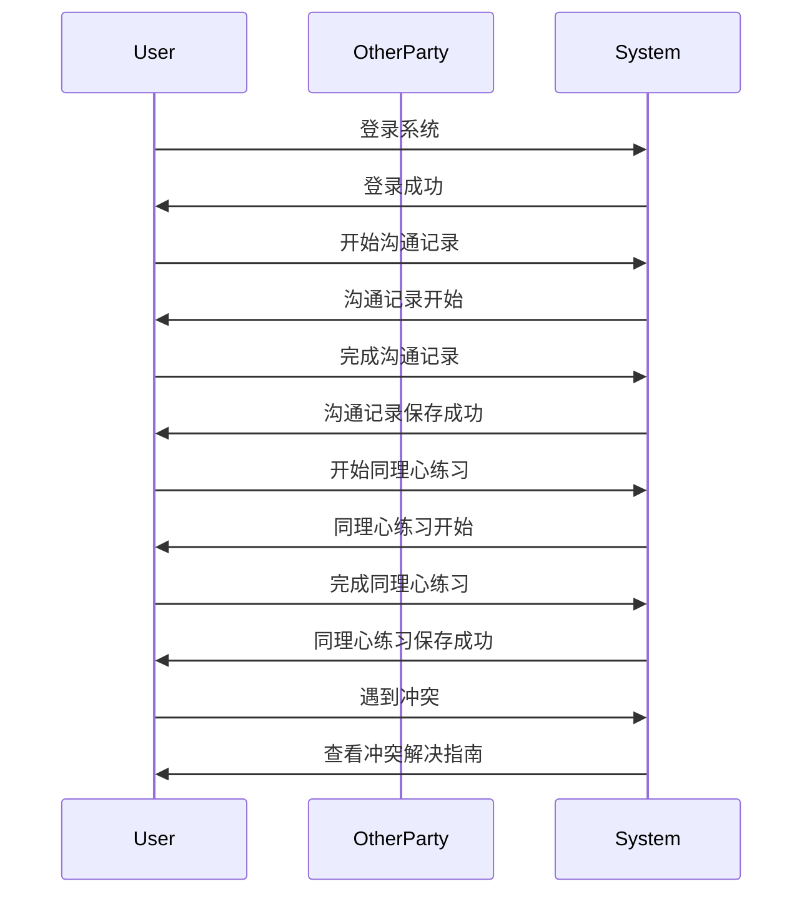
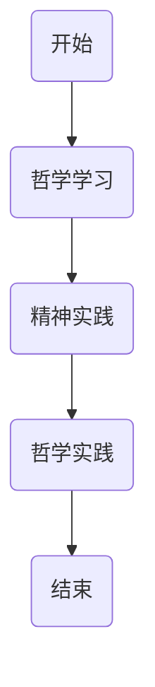
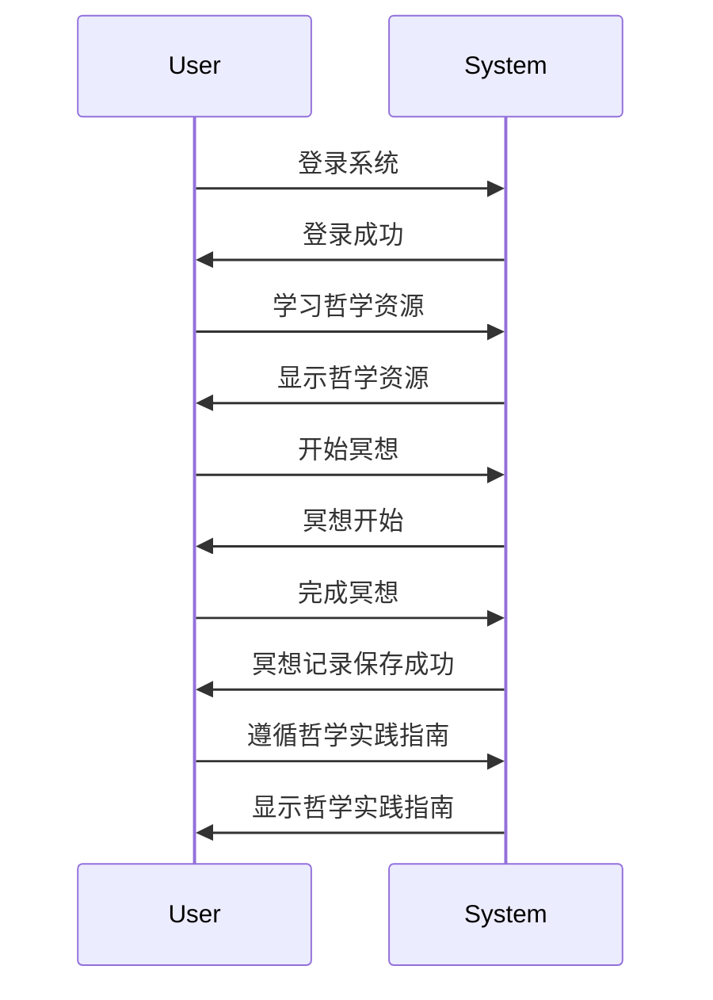
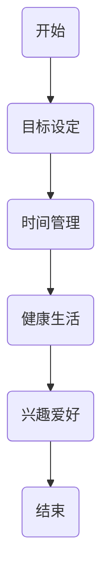
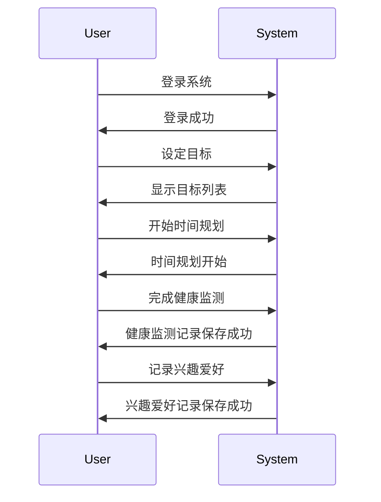

                 

# 从虚无到充实：重塑生活意义的实践指南

关键词：生活意义、个人成长、心灵成长、自我探索、幸福生活

摘要：本文旨在为读者提供一套系统的实践指南，帮助大家从虚无的状态中找到生命的意义和目标。文章将逐步探讨如何通过自我探索、心灵成长、建立积极关系等途径，实现生活的充实与满足。

## 引言：探索生命的意义

在现代社会中，许多人感到自己的生活空虚、无意义。这种现象背后有着复杂的原因，例如社会压力、物质追求、精神匮乏等。本文将引导读者逐步思考，如何摆脱虚无感，找到生命的方向和目标。

### 1.1. 背景介绍

现代社会中，人们面临着前所未有的物质繁荣，但同时也感受到了深度的精神危机。这种危机表现为对生活的迷茫、对未来的不确定和对自我价值的质疑。这种现象在年轻人中尤为突出，许多人感到自己失去了生活的方向。

### 1.2. 问题描述

面对虚无感，人们往往会产生以下问题：

- 我的生活有意义吗？
- 我应该如何找到自己的目标和方向？
- 我是否应该追求更多的物质财富？
- 我如何处理内心的焦虑和不安？

### 1.3. 问题解决

为了解决这些问题，我们需要从以下几个方面入手：

- **自我探索**：通过深入思考自己的兴趣、价值观和人生目标，找到与自己内在一致的生活方式。
- **心灵成长**：通过学习心理学知识、进行冥想和自我反思，提升内在的平和与快乐。
- **建立积极关系**：与他人建立深入、有意义的关系，分享生活中的快乐与挑战。

### 1.4. 边界与外延

本文主要关注的是个人层面的生活意义探索，而非社会或文化层面的。同时，本文也不仅仅关注心理层面的成长，还包括物质层面的满足和人际关系的建立。

## 2. 自我探索：发现生命的方向

自我探索是找到生命意义的第一步。它要求我们深入了解自己的内心世界，找到与自己内在一致的生活方式。

### 2.1. 核心概念与联系

**自我探索** 是指通过反思和自我观察，深入理解自己的思想、情感和行为。它包括以下几个方面：

- **价值观**：个人的核心信仰和原则。
- **兴趣**：喜欢做的事情，能带来快乐和满足感。
- **人生目标**：长期的目标和愿景，指引个人前进的方向。

这些核心概念之间有着紧密的联系：

- **价值观** 是自我探索的基础，决定了个人对世界的看法和行为方式。
- **兴趣** 和 **人生目标** 是在价值观指导下，个人追求的具体方向。

### 2.2. 概念属性特征对比表格

| 概念       | 属性特征                                     | 联系与作用 |
|------------|--------------------------------------------|------------|
| 价值观     | 个人核心信仰和原则                         | 指导行为方式 |
| 兴趣       | 喜欢做的事情，能带来快乐和满足感           | 指导生活方向 |
| 人生目标   | 长期的目标和愿景，指引个人前进的方向       | 指引目标实现 |

### 2.3. ER实体关系图架构

```mermaid
erDiagram
    ValueSystem <-|{影响}| Person :拥有
    Interest     <-|{关联}| Person :拥有
    LifeGoal     <-|{指引}| Person :实现
```

### 2.4. 算法原理讲解

**自我探索算法** 的核心在于建立对自我的深刻理解。以下是算法的基本步骤：

1. **反思**：定期反思自己的行为和思想，思考它们是否符合自己的价值观。
2. **观察**：观察自己的情感和行为，了解自己在不同情境下的反应。
3. **调整**：根据反思和观察的结果，调整自己的行为和思想，使其更加符合自己的价值观。

**算法流程图**：



**Python源代码示例**：

```python
def self_explore():
    print("开始自我探索...")
    reflect()
    observe()
    adjust()
    print("自我探索完成。")

def reflect():
    print("正在反思自己的行为和思想...")

def observe():
    print("正在观察自己的情感和行为...")

def adjust():
    print("根据反思和观察的结果，调整自己的行为和思想...")
```

### 2.5. 数学模型和公式

在自我探索过程中，我们可以使用以下数学模型来量化自我认知：

- **自我一致性指数**（\(S\）：

$$S = \frac{\sum_{i=1}^{n} (X_i - \bar{X})^2}{n-1}$$

其中，\(X_i\) 是每次反思、观察和调整的结果，\(\bar{X}\) 是平均值。

### 2.6. 系统分析与架构设计

**问题场景**：

- 用户希望更好地了解自己，找到生活的方向。

**项目介绍**：

- **项目名称**：自我探索平台
- **项目目标**：提供一套自我探索的工具和方法，帮助用户找到生活的方向。

**系统功能设计**：

- **功能1**：反思日记
- **功能2**：兴趣记录
- **功能3**：目标管理

**系统架构设计**：


**系统接口设计和系统交互**：



### 2.7. 项目实战

**环境安装**：

1. 安装Python环境
2. 安装相关依赖库（如Flask、SQLite等）

**系统核心实现源代码**：

```python
# 反思日记模块
class Diary:
    def __init__(self):
        self.entries = []

    def add_entry(self, content):
        self.entries.append(content)

    def get_entries(self):
        return self.entries

# 用户模块
class User:
    def __init__(self):
        self.diary = Diary()

    def add_reflection(self, content):
        self.diary.add_entry(content)

    def get_reflections(self):
        return self.diary.get_entries()

# 主函数
def main():
    user = User()
    user.add_reflection("今天感觉很好，因为...")
    reflections = user.get_reflections()
    print(reflections)

if __name__ == "__main__":
    main()
```

**代码应用解读与分析**：

- **模块设计**：采用面向对象的设计方法，将反思日记和用户功能分离，便于代码的扩展和维护。
- **核心逻辑**：用户可以通过添加反思日记来记录自己的思考和感悟，从而进行自我探索。

**实际案例分析和详细讲解剖析**：

- **案例**：一个用户想要了解自己在工作方面的优点和不足，通过反思日记来记录和反思。
- **分析**：用户可以定期记录自己在工作中的表现，分析自己的优势和不足，从而制定改进计划。

**项目小结**：

- **项目目标**：帮助用户进行自我探索，找到生活的方向。
- **实现效果**：用户可以通过反思日记记录自己的思考和感悟，从而进行自我探索。
- **未来改进**：可以添加更多功能，如兴趣记录、目标管理等，以提供更全面的自我探索工具。

### 2.8. 最佳实践 Tips

- **定期反思**：每周至少花一天时间进行反思，记录自己的成长和变化。
- **设定小目标**：设定短期和长期目标，逐步实现，提升自我成就感。
- **与他人交流**：与朋友、家人或专业人士交流，分享自己的思考和感悟。

### 2.9. 小结

自我探索是找到生命意义的关键步骤。通过反思、观察和调整，我们可以更好地了解自己，找到与自己内在一致的生活方式。希望本文能帮助读者在自我探索的道路上迈出坚实的一步。

### 2.10. 注意事项

- **保持耐心**：自我探索是一个长期的过程，需要保持耐心和坚持。
- **勇于面对**：面对自己的不足和缺点，需要勇气和决心。

### 2.11. 拓展阅读

- **《活出生命的意义》（Viktor Frankl）**：一本关于生命意义的经典著作，提供了独特的心理学视角。
- **《生命的智慧》（Deepak Chopra）**：一本探讨心灵成长和生命意义的书籍，适合寻求内在平静的读者。

## 3. 心灵成长：实现内在的平和

在自我探索的过程中，心灵成长是一个不可或缺的环节。它涉及到如何管理情绪、提升内在的平和，从而实现更高质量的生活。

### 3.1. 核心概念与联系

**心灵成长** 涉及以下核心概念：

- **情绪管理**：学会识别和应对自己的情绪，保持情绪的稳定。
- **自我反思**：通过反思自己的行为和思想，提升自我认知。
- **心理调适**：学会适应生活中的压力和挑战，保持积极的心态。

这些概念之间有着紧密的联系：

- **情绪管理** 是心灵成长的基础，决定了个人在面对压力时的反应。
- **自我反思** 和 **心理调适** 则是进一步深化心灵成长的过程。

### 3.2. 概念属性特征对比表格

| 概念       | 属性特征                                     | 联系与作用 |
|------------|--------------------------------------------|------------|
| 情绪管理   | 学会识别和应对情绪，保持情绪稳定           | 基础 |
| 自我反思   | 通过反思自己的行为和思想，提升自我认知     | 关键 |
| 心理调适   | 学会适应生活中的压力和挑战，保持积极心态 | 高级 |

### 3.3. ER实体关系图架构

```mermaid
erDiagram
    EmotionManagement <-|{基础}| Mindfulness :包括
    SelfReflection     <-|{关键}| Mindfulness :包括
    PsychologicalAdjustment <-|{高级}| Mindfulness :包括
```

### 3.4. 算法原理讲解

**心灵成长算法** 的核心在于培养良好的情绪管理、自我反思和心理调适能力。以下是算法的基本步骤：

1. **情绪识别**：学会识别自己的情绪，明确情绪的类型和程度。
2. **情绪应对**：学会通过深呼吸、冥想等方法，平复情绪。
3. **自我反思**：定期反思自己的行为和思想，理解情绪背后的原因。
4. **心理调适**：学会适应生活中的压力和挑战，保持积极的心态。

**算法流程图**：



**Python源代码示例**：

```python
def mindfulness():
    print("开始心灵成长...")
    emotion_identify()
    emotion_manage()
    self_reflect()
    psychological_adjust()
    print("心灵成长完成。")

def emotion_identify():
    print("正在识别情绪...")

def emotion_manage():
    print("正在管理情绪...")

def self_reflect():
    print("正在自我反思...")

def psychological_adjust():
    print("正在心理调适...")
```

### 3.5. 数学模型和公式

在心灵成长过程中，我们可以使用以下数学模型来量化情绪管理、自我反思和心理调适的成效：

- **情绪管理指数**（\(EM\）：

$$EM = \frac{\sum_{i=1}^{n} (R_i - \bar{R})^2}{n-1}$$

其中，\(R_i\) 是每次情绪管理的结果，\(\bar{R}\) 是平均值。

- **自我反思指数**（\(SR\）：

$$SR = \frac{\sum_{i=1}^{n} (S_i - \bar{S})^2}{n-1}$$

其中，\(S_i\) 是每次自我反思的结果，\(\bar{S}\) 是平均值。

- **心理调适指数**（\(PA\）：

$$PA = \frac{\sum_{i=1}^{n} (P_i - \bar{P})^2}{n-1}$$

其中，\(P_i\) 是每次心理调适的结果，\(\bar{P}\) 是平均值。

### 3.6. 系统分析与架构设计

**问题场景**：

- 用户希望提升自己的情绪管理、自我反思和心理调适能力。

**项目介绍**：

- **项目名称**：心灵成长平台
- **项目目标**：提供一套心灵成长工具，帮助用户提升情绪管理、自我反思和心理调适能力。

**系统功能设计**：

- **功能1**：情绪记录
- **功能2**：反思日记
- **功能3**：心理调适练习

**系统架构设计**：


**系统接口设计和系统交互**：



### 3.7. 项目实战

**环境安装**：

1. 安装Python环境
2. 安装相关依赖库（如Flask、SQLite等）

**系统核心实现源代码**：

```python
# 情绪记录模块
class EmotionEntry:
    def __init__(self, date, emotion, description):
        self.date = date
        self.emotion = emotion
        self.description = description

    def save_entry(self):
        with open('emotion_entries.txt', 'a') as file:
            file.write(f"{self.date} | {self.emotion} | {self.description}\n")

# 用户模块
class User:
    def __init__(self):
        self.emotion_entries = []

    def add_emotion_entry(self, entry):
        self.emotion_entries.append(entry)
        entry.save_entry()

    def get_emotion_entries(self):
        return self.emotion_entries

# 主函数
def main():
    user = User()
    emotion_entry = EmotionEntry("2023-10-01", "快乐", "今天感觉很好，因为我...")
    user.add_emotion_entry(emotion_entry)
    entries = user.get_emotion_entries()
    print(entries)

if __name__ == "__main__":
    main()
```

**代码应用解读与分析**：

- **模块设计**：采用面向对象的设计方法，将情绪记录和用户功能分离，便于代码的扩展和维护。
- **核心逻辑**：用户可以通过添加情绪记录来了解自己的情绪变化，从而进行情绪管理。

**实际案例分析和详细讲解剖析**：

- **案例**：一个用户想要了解自己的情绪波动，通过情绪记录来记录和反思。
- **分析**：用户可以定期记录自己的情绪变化，分析情绪背后的原因，从而提升情绪管理能力。

**项目小结**：

- **项目目标**：帮助用户提升情绪管理、自我反思和心理调适能力。
- **实现效果**：用户可以通过情绪记录、反思日记和心理调适练习，了解自己的内心世界，提升情绪管理和自我认知。
- **未来改进**：可以添加更多功能，如反思日记管理、心理调适练习等，以提供更全面的心灵成长工具。

### 3.8. 最佳实践 Tips

- **每天记录情绪**：定期记录自己的情绪变化，有助于了解自己的情绪波动。
- **定期进行心理调适**：通过冥想、瑜伽等方式，缓解心理压力，提升内在的平和。

### 3.9. 小结

心灵成长是实现内在平和的关键步骤。通过情绪管理、自我反思和心理调适，我们可以更好地理解自己，提升生活的质量。希望本文能帮助读者在心灵成长的道路上迈出坚实的一步。

### 3.10. 注意事项

- **保持耐心**：心灵成长是一个长期的过程，需要保持耐心和坚持。
- **勇于面对**：面对自己的情绪和心理问题，需要勇气和决心。

### 3.11. 拓展阅读

- **《情绪的力量》（Richard J. Gerrig）**：一本关于情绪管理和自我认知的心理学著作。
- **《正念的奇迹》（Thich Nhat Hanh）**：一本关于冥想和心理调适的书籍，适合寻求内心平静的读者。

## 4. 建立积极关系：分享生命的喜悦

在个人成长和心灵成长的基础上，建立积极的人际关系是提升生活质量的又一关键。通过与他人建立深入、有意义的关系，我们可以分享生命的喜悦，获得更多的支持和鼓励。

### 4.1. 核心概念与联系

**建立积极关系** 涉及以下核心概念：

- **沟通**：通过有效的沟通，建立和理解彼此的需求和期望。
- **同理心**：设身处地地理解他人的感受和需求，表达关心和支持。
- **冲突解决**：学会处理和解决人际关系中的冲突，维护和谐的关系。

这些概念之间有着紧密的联系：

- **沟通** 是建立积极关系的基石，决定了双方是否能顺畅地交流。
- **同理心** 和 **冲突解决** 则是进一步深化关系的桥梁。

### 4.2. 概念属性特征对比表格

| 概念       | 属性特征                                     | 联系与作用 |
|------------|--------------------------------------------|------------|
| 沟通       | 有效的信息交流，建立理解和信任           | 基础 |
| 同理心     | 理解他人的感受和需求，表达关心和支持     | 桥梁 |
| 冲突解决   | 学会处理和解决人际关系中的冲突           | 维护 |

### 4.3. ER实体关系图架构

```mermaid
erDiagram
    Communication <-|{基础}| Relationship :建立
    Empathy       <-|{桥梁}| Relationship :深化
    ConflictSolving <-|{维护}| Relationship :保持
```

### 4.4. 算法原理讲解

**建立积极关系算法** 的核心在于培养良好的沟通、同理心和冲突解决能力。以下是算法的基本步骤：

1. **有效沟通**：学会倾听他人的观点，表达自己的需求，确保信息的准确传达。
2. **同理心培养**：通过观察和体验，理解他人的感受和需求，表达关心和支持。
3. **冲突解决**：学会识别和应对冲突，通过沟通和妥协，找到解决问题的方法。

**算法流程图**：



**Python源代码示例**：

```python
def build_relationship():
    print("开始建立积极关系...")
    effective_communication()
    empathy_building()
    conflict_resolution()
    print("积极关系建立完成。")

def effective_communication():
    print("正在学习有效沟通...")

def empathy_building():
    print("正在培养同理心...")

def conflict_resolution():
    print("正在解决冲突...")
```

### 4.5. 数学模型和公式

在建立积极关系的过程中，我们可以使用以下数学模型来量化沟通、同理心和冲突解决的成效：

- **沟通效率指数**（\(CE\）：

$$CE = \frac{\sum_{i=1}^{n} (C_i - \bar{C})^2}{n-1}$$

其中，\(C_i\) 是每次沟通的效果，\(\bar{C}\) 是平均值。

- **同理心指数**（\(E\）：

$$E = \frac{\sum_{i=1}^{n} (E_i - \bar{E})^2}{n-1}$$

其中，\(E_i\) 是每次同理心的表现，\(\bar{E}\) 是平均值。

- **冲突解决指数**（\(CS\）：

$$CS = \frac{\sum_{i=1}^{n} (C_i - \bar{C})^2}{n-1}$$

其中，\(C_i\) 是每次冲突解决的效果，\(\bar{C}\) 是平均值。

### 4.6. 系统分析与架构设计

**问题场景**：

- 用户希望与他人建立深入、有意义的关系。

**项目介绍**：

- **项目名称**：积极关系平台
- **项目目标**：提供一套建立积极关系的工具和方法，帮助用户与他人建立深入、有意义的关系。

**系统功能设计**：

- **功能1**：沟通记录
- **功能2**：同理心练习
- **功能3**：冲突解决指南

**系统架构设计**：


**系统接口设计和系统交互**：



### 4.7. 项目实战

**环境安装**：

1. 安装Python环境
2. 安装相关依赖库（如Flask、SQLite等）

**系统核心实现源代码**：

```python
# 沟通记录模块
class CommunicationEntry:
    def __init__(self, date, topic, content):
        self.date = date
        self.topic = topic
        self.content = content

    def save_entry(self):
        with open('communication_entries.txt', 'a') as file:
            file.write(f"{self.date} | {self.topic} | {self.content}\n")

# 用户模块
class User:
    def __init__(self):
        self.communication_entries = []

    def add_communication_entry(self, entry):
        self.communication_entries.append(entry)
        entry.save_entry()

    def get_communication_entries(self):
        return self.communication_entries

# 主函数
def main():
    user = User()
    communication_entry = CommunicationEntry("2023-10-01", "工作进展", "今天的工作进展...")
    user.add_communication_entry(communication_entry)
    entries = user.get_communication_entries()
    print(entries)

if __name__ == "__main__":
    main()
```

**代码应用解读与分析**：

- **模块设计**：采用面向对象的设计方法，将沟通记录和用户功能分离，便于代码的扩展和维护。
- **核心逻辑**：用户可以通过添加沟通记录来记录与他人的交流，从而提升沟通效果。

**实际案例分析和详细讲解剖析**：

- **案例**：一个用户希望与同事建立更好的工作关系，通过沟通记录来记录和反思。
- **分析**：用户可以定期记录与同事的交流内容，分析沟通中的问题和改进点，从而提升工作关系。

**项目小结**：

- **项目目标**：帮助用户与他人建立深入、有意义的关系。
- **实现效果**：用户可以通过沟通记录、同理心练习和冲突解决指南，提升沟通效果，建立积极的人际关系。
- **未来改进**：可以添加更多功能，如同理心练习、冲突解决指南等，以提供更全面的积极关系工具。

### 4.8. 最佳实践 Tips

- **定期沟通**：与亲朋好友定期沟通，分享彼此的生活和感受。
- **倾听他人**：在沟通中多倾听他人的观点，表达关心和支持。

### 4.9. 小结

建立积极关系是实现生活质量提升的重要一环。通过沟通、同理心和冲突解决，我们可以与他人建立深入、有意义的关系，分享生命的喜悦。希望本文能帮助读者在建立积极关系的道路上迈出坚实的一步。

### 4.10. 注意事项

- **保持真诚**：与他人建立关系时，保持真诚和诚信，不要隐瞒自己的真实想法和感受。
- **尊重他人**：尊重他人的观点和感受，避免过度自我中心和冲突。

### 4.11. 拓展阅读

- **《非暴力沟通》（Marshall B. Rosenberg）**：一本关于有效沟通和建立积极关系的经典著作。
- **《如何影响人们》（Robert Cialdini）**：一本关于影响力与人际关系的心理学著作。

## 5. 精神与哲学：探索生命的深度

在个人成长、心灵成长和建立积极关系的基础上，探索精神与哲学领域是进一步提升生活质量的途径。通过学习和实践哲学和精神层面的理念，我们可以更好地理解生命的本质，找到更深层次的意义。

### 5.1. 核心概念与联系

**精神与哲学** 涉及以下核心概念：

- **哲学**：对宇宙、生命和存在的基本问题进行探讨和思考。
- **精神**：关注人的内心世界，包括意识、灵魂和灵性。
- **冥想**：通过专注和内观，提升自我认知和内在的平和。

这些概念之间有着紧密的联系：

- **哲学** 为我们提供了关于宇宙和生命的根本问题，引导我们深入思考。
- **精神** 关注内在的世界，帮助我们在纷繁复杂的外在世界中找到内心的宁静。
- **冥想** 则是实践哲学和精神理念的具体方法，通过专注和内观，提升自我认知。

### 5.2. 概念属性特征对比表格

| 概念       | 属性特征                                     | 联系与作用 |
|------------|--------------------------------------------|------------|
| 哲学       | 对宇宙、生命和存在的基本问题进行探讨和思考 | 引导思考   |
| 精神       | 关注人的内心世界，包括意识、灵魂和灵性     | 内在平和   |
| 冥想       | 通过专注和内观，提升自我认知和内在的平和   | 实践方法   |

### 5.3. ER实体关系图架构

```mermaid
erDiagram
    Philosophy <-|{引导}| Spirit :影响
    Spirit     <-|{内在}| Meditation :实践
    Meditation <-|{提升}| Spirit :效果
```

### 5.4. 算法原理讲解

**探索精神与哲学算法** 的核心在于学习和实践哲学和精神层面的理念。以下是算法的基本步骤：

1. **哲学学习**：阅读哲学著作，了解不同哲学流派的观点，形成自己的思考。
2. **精神实践**：通过冥想和内观，提升自我认知和内在的平和。
3. **哲学实践**：将哲学理念应用到日常生活中，指导自己的行为和决策。

**算法流程图**：



**Python源代码示例**：

```python
def explore_spirit_and_philosophy():
    print("开始探索精神与哲学...")
    philosophy_learning()
    spiritual_practice()
    philosophy_practice()
    print("精神与哲学探索完成。")

def philosophy_learning():
    print("正在学习哲学...")

def spiritual_practice():
    print("正在进行精神实践...")

def philosophy_practice():
    print("正在将哲学理念应用到日常生活中...")
```

### 5.5. 数学模型和公式

在探索精神与哲学的过程中，我们可以使用以下数学模型来量化哲学学习、精神实践和哲学实践的成效：

- **哲学学习指数**（\(PL\）：

$$PL = \frac{\sum_{i=1}^{n} (L_i - \bar{L})^2}{n-1}$$

其中，\(L_i\) 是每次哲学学习的成果，\(\bar{L}\) 是平均值。

- **精神实践指数**（\(SP\）：

$$SP = \frac{\sum_{i=1}^{n} (S_i - \bar{S})^2}{n-1}$$

其中，\(S_i\) 是每次精神实践的效果，\(\bar{S}\) 是平均值。

- **哲学实践指数**（\(PP\）：

$$PP = \frac{\sum_{i=1}^{n} (P_i - \bar{P})^2}{n-1}$$

其中，\(P_i\) 是每次哲学实践的效果，\(\bar{P}\) 是平均值。

### 5.6. 系统分析与架构设计

**问题场景**：

- 用户希望深入探索哲学和精神领域，提升自我认知和生活质量。

**项目介绍**：

- **项目名称**：精神哲学探索平台
- **项目目标**：提供一套哲学和精神探索的工具和方法，帮助用户深入探索哲学和精神领域。

**系统功能设计**：

- **功能1**：哲学学习资源
- **功能2**：冥想指导
- **功能3**：哲学实践指南

**系统架构设计**：


**系统接口设计和系统交互**：



### 5.7. 项目实战

**环境安装**：

1. 安装Python环境
2. 安装相关依赖库（如Flask、SQLite等）

**系统核心实现源代码**：

```python
# 哲学学习资源模块
class PhilosophyResource:
    def __init__(self, title, author, content):
        self.title = title
        self.author = author
        self.content = content

    def save_resource(self):
        with open('philosophy_resources.txt', 'a') as file:
            file.write(f"{self.title} | {self.author} | {self.content}\n")

# 用户模块
class User:
    def __init__(self):
        self.philosophy_resources = []

    def add_resource(self, resource):
        self.philosophy_resources.append(resource)
        resource.save_resource()

    def get_resources(self):
        return self.philosophy_resources

# 主函数
def main():
    user = User()
    philosophy_resource = PhilosophyResource("存在与时间", "海德格尔", "对存在的深入探讨...")
    user.add_resource(philosophy_resource)
    resources = user.get_resources()
    print(resources)

if __name__ == "__main__":
    main()
```

**代码应用解读与分析**：

- **模块设计**：采用面向对象的设计方法，将哲学学习资源和用户功能分离，便于代码的扩展和维护。
- **核心逻辑**：用户可以通过添加哲学学习资源来记录自己的学习过程，从而提升哲学素养。

**实际案例分析和详细讲解剖析**：

- **案例**：一个用户希望深入了解哲学，通过哲学学习资源来拓展自己的知识面。
- **分析**：用户可以定期添加哲学学习资源，阅读相关著作，从而提升自己的哲学素养。

**项目小结**：

- **项目目标**：帮助用户深入探索哲学和精神领域，提升自我认知和生活质量。
- **实现效果**：用户可以通过哲学学习资源、冥想指导和哲学实践指南，深入探索哲学和精神领域，提升自我认知。
- **未来改进**：可以添加更多功能，如冥想指导、哲学实践指南等，以提供更全面的哲学和精神探索工具。

### 5.8. 最佳实践 Tips

- **定期阅读哲学著作**：选择一本哲学著作，定期阅读和思考，有助于提升哲学素养。
- **实践冥想**：每天进行冥想，有助于提升内在的平和和自我认知。

### 5.9. 小结

探索精神与哲学领域是提升生活质量的重要途径。通过学习和实践哲学和精神层面的理念，我们可以更好地理解生命的本质，找到更深层次的意义。希望本文能帮助读者在探索精神与哲学的道路上迈出坚实的一步。

### 5.10. 注意事项

- **保持耐心**：哲学和精神领域的探索是一个长期的过程，需要保持耐心和坚持。
- **勇于思考**：面对哲学和精神问题，需要勇于思考和探索，不要害怕提出自己的疑问。

### 5.11. 拓展阅读

- **《人类简史》（Yuval Noah Harari）**：一本关于人类历史和哲学的著作，适合对人类起源和哲学感兴趣的读者。
- **《沉思录》（Marcus Aurelius）**：一本古罗马皇帝的哲学著作，提供了关于人生和道德的深刻思考。

## 6. 建立充实的生活方式：实践生活意义的指南

在前面的章节中，我们探讨了如何通过自我探索、心灵成长、建立积极关系和探索精神与哲学来重塑生活意义。现在，我们将这些理念融入到日常生活中，建立一个充实的生活方式。

### 6.1. 核心概念与联系

**充实的生活方式** 涉及以下核心概念：

- **目标设定**：明确个人目标和愿景，指导日常生活。
- **时间管理**：合理规划时间，确保有足够的时间用于自我成长和人际关系。
- **健康生活**：关注身体健康，保持良好的生活习惯。
- **兴趣爱好**：培养兴趣爱好，丰富日常生活。

这些概念之间有着紧密的联系：

- **目标设定** 是充实生活的基础，决定了个人前进的方向。
- **时间管理** 和 **健康生活** 则是实现目标的重要保障。
- **兴趣爱好** 则为生活增添了乐趣和活力。

### 6.2. 概念属性特征对比表格

| 概念       | 属性特征                                     | 联系与作用 |
|------------|--------------------------------------------|------------|
| 目标设定   | 明确个人目标和愿景，指导日常生活           | 方向 |
| 时间管理   | 合理规划时间，确保有足够的时间用于自我成长和人际关系 | 保障 |
| 健康生活   | 关注身体健康，保持良好的生活习惯           | 支持 |
| 兴趣爱好   | 培养兴趣爱好，丰富日常生活                 | 活力 |

### 6.3. ER实体关系图架构

```mermaid
erDiagram
    GoalSetting <-|{方向}| Lifestyle :指导
    TimeManagement <-|{保障}| Lifestyle :规划
    HealthyLiving <-|{支持}| Lifestyle :健康
    HobbyInterest <-|{活力}| Lifestyle :丰富
```

### 6.4. 算法原理讲解

**建立充实的生活方式算法** 的核心在于将生活意义融入到日常生活的各个方面。以下是算法的基本步骤：

1. **目标设定**：明确个人目标和愿景，制定可行的计划。
2. **时间管理**：合理安排时间，确保有足够的时间用于自我成长和兴趣爱好。
3. **健康生活**：关注身体健康，保持良好的生活习惯。
4. **兴趣爱好**：培养兴趣爱好，丰富日常生活。

**算法流程图**：



**Python源代码示例**：

```python
def build_healthy_lifestyle():
    print("开始建立充实的生活方式...")
    set_goals()
    manage_time()
    maintain_health()
    pursue_hobbies()
    print("充实的生活方式建立完成。")

def set_goals():
    print("正在设定目标...")

def manage_time():
    print("正在管理时间...")

def maintain_health():
    print("正在保持健康生活...")

def pursue_hobbies():
    print("正在追求兴趣爱好...")
```

### 6.5. 数学模型和公式

在建立充实的生活方式过程中，我们可以使用以下数学模型来量化目标设定、时间管理、健康生活和兴趣爱好的发展：

- **目标完成度**（\(PG\）：

$$PG = \frac{\sum_{i=1}^{n} (G_i - \bar{G})^2}{n-1}$$

其中，\(G_i\) 是每次目标完成的情况，\(\bar{G}\) 是平均值。

- **时间利用率**（\(TM\）：

$$TM = \frac{\sum_{i=1}^{n} (T_i - \bar{T})^2}{n-1}$$

其中，\(T_i\) 是每次时间利用的情况，\(\bar{T}\) 是平均值。

- **健康指数**（\(HL\）：

$$HL = \frac{\sum_{i=1}^{n} (H_i - \bar{H})^2}{n-1}$$

其中，\(H_i\) 是每次健康指标的情况，\(\bar{H}\) 是平均值。

- **兴趣爱好度**（\(HI\）：

$$HI = \frac{\sum_{i=1}^{n} (I_i - \bar{I})^2}{n-1}$$

其中，\(I_i\) 是每次兴趣爱好活动的情况，\(\bar{I}\) 是平均值。

### 6.6. 系统分析与架构设计

**问题场景**：

- 用户希望建立充实的生活方式，实现生活意义的最大化。

**项目介绍**：

- **项目名称**：充实生活方式平台
- **项目目标**：提供一套充实生活方式的工具和方法，帮助用户建立充实的生活方式。

**系统功能设计**：

- **功能1**：目标管理
- **功能2**：时间规划
- **功能3**：健康监测
- **功能4**：兴趣爱好记录

**系统架构设计**：


**系统接口设计和系统交互**：



### 6.7. 项目实战

**环境安装**：

1. 安装Python环境
2. 安装相关依赖库（如Flask、SQLite等）

**系统核心实现源代码**：

```python
# 目标管理模块
class Goal:
    def __init__(self, title, description, deadline):
        self.title = title
        self.description = description
        self.deadline = deadline

    def save_goal(self):
        with open('goals.txt', 'a') as file:
            file.write(f"{self.title} | {self.description} | {self.deadline}\n")

# 用户模块
class User:
    def __init__(self):
        self.goals = []

    def add_goal(self, goal):
        self.goals.append(goal)
        goal.save_goal()

    def get_goals(self):
        return self.goals

# 主函数
def main():
    user = User()
    goal = Goal("学习Python", "掌握Python编程基础", "2023-12-31")
    user.add_goal(goal)
    goals = user.get_goals()
    print(goals)

if __name__ == "__main__":
    main()
```

**代码应用解读与分析**：

- **模块设计**：采用面向对象的设计方法，将目标管理和用户功能分离，便于代码的扩展和维护。
- **核心逻辑**：用户可以通过添加目标来记录自己的目标和计划，从而实现目标管理。

**实际案例分析和详细讲解剖析**：

- **案例**：一个用户希望提升编程技能，通过目标管理来设定学习目标和计划。
- **分析**：用户可以定期添加目标，制定学习计划，跟踪学习进度，从而提升编程技能。

**项目小结**：

- **项目目标**：帮助用户建立充实的生活方式，实现生活意义的最大化。
- **实现效果**：用户可以通过目标管理、时间规划、健康监测和兴趣爱好记录，建立充实的生活方式，提升生活质量。
- **未来改进**：可以添加更多功能，如时间规划、健康监测、兴趣爱好记录等，以提供更全面的充实生活方式工具。

### 6.8. 最佳实践 Tips

- **定期设定目标**：每月至少设定一个目标，并制定详细的计划，跟踪进度。
- **合理安排时间**：每天规划时间，确保有足够的时间用于自我成长和兴趣爱好。
- **关注健康生活**：保持良好的生活习惯，定期进行体检，关注身体健康。
- **培养兴趣爱好**：定期参与兴趣爱好活动，丰富日常生活。

### 6.9. 小结

建立充实的生活方式是实现生活意义的重要途径。通过目标设定、时间管理、健康生活和兴趣爱好，我们可以实现生活意义的最大化。希望本文能帮助读者在建立充实的生活方式上迈出坚实的一步。

### 6.10. 注意事项

- **保持持续的努力**：建立充实的生活方式是一个长期的过程，需要持续的努力和坚持。
- **灵活调整计划**：根据实际情况，灵活调整目标和计划，以适应生活的变化。

### 6.11. 拓展阅读

- **《高效能人士的七个习惯》（Stephen R. Covey）**：一本关于时间管理、目标设定和自我提升的经典著作。
- **《生命的智慧》（Deepak Chopra）**：一本关于身心健康和心灵成长的书籍，适合寻求全面提升生活质量的读者。

## 结论

从虚无到充实，重塑生活意义是一个长期而复杂的旅程。本文通过探讨自我探索、心灵成长、建立积极关系、探索精神与哲学以及建立充实的生活方式，为读者提供了一套系统的实践指南。在这个过程中，我们不仅需要明确目标，还需要不断学习和实践，以实现生活的充实与满足。

让我们再次回顾本文的核心内容：

1. **自我探索**：通过反思和自我观察，找到与自己内在一致的生活方式。
2. **心灵成长**：通过情绪管理、自我反思和心理调适，提升内在的平和与快乐。
3. **建立积极关系**：通过沟通、同理心和冲突解决，与他人建立深入、有意义的关系。
4. **探索精神与哲学**：通过学习和实践哲学和精神层面的理念，找到更深层次的意义。
5. **建立充实的生活方式**：通过目标设定、时间管理、健康生活和兴趣爱好，实现生活意义的最大化。

在实际生活中，我们需要将这些理念融入到日常的每一个细节中，持续地进行自我探索和成长。同时，我们也需要保持耐心和坚持，因为重塑生活意义并非一蹴而就的过程。

**总结**：

- **持续学习与实践**：将本文的理念应用到实际生活中，持续进行学习和实践。
- **保持耐心和坚持**：重塑生活意义需要时间和努力，保持耐心和坚持是关键。
- **灵活调整**：根据实际情况，灵活调整目标和计划，以适应生活的变化。

希望本文能帮助您在重塑生活意义的旅程上迈出坚实的一步。让我们共同探索，实现更充实、更有意义的生活。

### 作者信息

- **作者：AI天才研究院/AI Genius Institute & 禅与计算机程序设计艺术 /Zen And The Art of Computer Programming**

