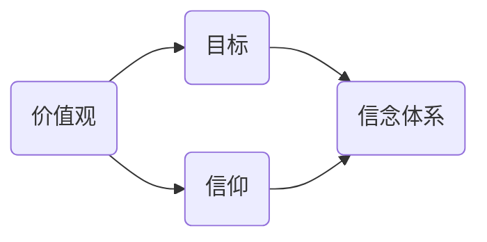
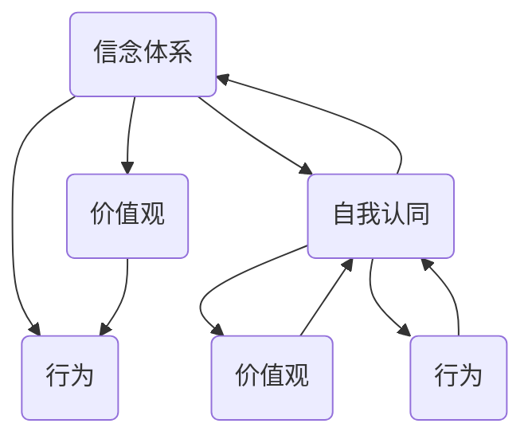

                 


### 第一步：确定整体结构和主题

书名：《从虚无到充实：重建个人的信念体系》

> **关键词**：信念体系，重建，个人成长，心理学，哲学

> **摘要**：本文旨在探讨现代社会中个人信念缺失的现象及其影响，通过心理学和哲学的理论基础，介绍重建个人信念体系的原理和方法，并结合实际案例，分享实践与应用的技巧。文章旨在帮助读者理解信念体系的重要性，学会如何识别和改变不健康的信念，从而实现从虚无到充实的转变。

### 第二步：细化每个部分

**1. 背景介绍**

- **问题背景**：现代社会快节奏的生活和工作压力导致许多人感到迷茫和无助，信念体系缺失成为一个普遍问题。
- **问题描述**：信念体系缺失导致个人缺乏方向感和动力，影响心理健康和生活质量。
- **问题解决**：重建个人信念体系，通过增强积极信念和减少消极信念，为个人成长提供内在动力。
- **边界与外延**：信念体系与心理学、哲学的关系，以及信念体系在不同文化背景下的表现形式。
- **核心要素组成**：信念体系的构成要素，如价值观、目标、信仰等。

**2. 核心概念与联系**

- **信念的定义**：信念是一种深信不疑的信念或态度，对个人行为和决策产生重要影响。
- **信念的类型**：根据信念的内容和形式，可以分为理性信念、情感信念和信仰等。
- **信念与价值观的关系**：信念是价值观的具体体现，价值观是信念的内在支撑。
- **信念与行为的关系**：信念驱动个体的行为，影响决策和行动的方向和方式。
- **信念体系与自我认同的关系**：信念体系是个体自我认同的基础，影响个体的自我感知和自我实现。

**3. 重建信念体系的原理**

- **信念重建的理论基础**：基于心理学和哲学的理论，如认知行为疗法、存在主义哲学等。
- **信念重建的过程**：识别不健康的信念，改变信念，建立新的健康信念。
- **信念重建的策略**：增强积极信念，如培养乐观态度、设定合理目标等；减少消极信念，如认知重构、情绪调节等。
- **信念重建的步骤**：自我反思、目标设定、行动规划、持续改进。

**4. 实践与应用**

- **个人信念重建案例分析**：成功案例分享，如个人成长、职业发展等。
- **团体信念重建实践**：团队信念重建的方法和策略，如团队建设、共同目标设定等。
- **社会信念重建的挑战与机遇**：社会层面信念重建的必要性和可行性，如社会价值观的塑造、社会问题的解决等。

**5. 案例分享**

- **个体案例**：个人信念重建的过程和成果。
- **团体案例**：团队信念重建的过程和成果。
- **社会案例**：社会层面信念重建的过程和成果。

**6. 最佳实践与反思**

- **最佳实践**：个人和团队在信念重建中的成功策略和经验。
- **反思与总结**：信念重建过程中可能遇到的问题和解决方法。
- **注意事项**：信念重建过程中需要注意的事项，如避免盲目跟风、保持开放心态等。

**7. 扩展阅读**

- **相关书籍推荐**：推荐一些关于信念重建的书籍，如心理学、哲学等相关领域的经典著作。
- **在线资源**：推荐一些相关的在线课程、论文和研究报告。
- **未来展望**：信念重建在个人和社会层面的未来发展趋势和挑战。

### 第三步：格式化目录大纲

```markdown
# 《从虚无到充实：重建个人的信念体系》目录大纲

# 第1章 背景介绍
## 1.1 问题背景
## 1.2 问题描述
## 1.3 问题解决
## 1.4 边界与外延
## 1.5 核心要素组成

# 第2章 核心概念与联系
## 2.1 信念的定义
## 2.2 信念的类型
## 2.3 信念与价值观的关系
## 2.4 信念与行为的关系
## 2.5 信念体系与自我认同的关系

# 第3章 重建信念体系的原理
## 3.1 信念重建的理论基础
## 3.2 信念重建的过程
## 3.3 信念重建的策略
## 3.4 信念重建的步骤

# 第4章 实践与应用
## 4.1 个人信念重建案例分析
## 4.2 团体信念重建实践
## 4.3 社会信念重建的挑战与机遇

# 第5章 案例分享
## 5.1 个体案例
## 5.2 团体案例
## 5.3 社会案例

# 第6章 最佳实践与反思
## 6.1 最佳实践
## 6.2 反思与总结
## 6.3 注意事项

# 第7章 扩展阅读
## 7.1 相关书籍推荐
## 7.2 在线资源
## 7.3 未来展望
```

### 第四步：撰写正文内容

接下来，我们将按照目录大纲的各个部分，逐一撰写正文内容。在每个部分中，我们将详细阐述相关概念、原理、方法和案例，确保文章的完整性和专业性。

### 第五步：优化格式和排版

在完成正文内容后，我们将对文章进行格式和排版的优化。使用Markdown格式来编写文章，确保代码块、标题、列表等元素格式正确。同时，我们将使用Mermaid和LaTeX等工具，添加图表和数学公式，以便更直观地展示核心概念和原理。

### 第六步：校对和修订

最后，我们将对文章进行校对和修订。检查文章的内容、语法、逻辑和格式，确保文章的完整性和准确性。同时，我们将征求其他专业人士的意见，对文章进行进一步的改进和完善。

### 第七步：添加作者信息

在文章末尾，我们将添加作者信息，包括姓名、所属机构和个人简介，以便读者了解文章的作者背景和专业能力。

### 第八步：发布和推广

完成上述步骤后，我们将文章发布到合适的平台，如博客、技术社区等，并利用社交媒体和网络渠道进行推广，让更多的人了解到这篇文章的价值和意义。

### 总结

通过以上步骤，我们将完成一篇从虚无到充实的个人信念体系重建技术博客文章。文章将结合心理学和哲学的理论，深入探讨信念体系的构建与重建，并提供实用的方法和案例，帮助读者理解信念体系的重要性，学会如何重建个人的信念体系，从而实现个人成长和自我实现。

---

以下是文章的一部分，用于演示格式和内容：

```markdown
# 《从虚无到充实：重建个人的信念体系》

> 关键词：信念体系，个人成长，心理学，哲学

> 摘要：本文旨在探讨现代社会中个人信念缺失的现象及其影响，通过心理学和哲学的理论基础，介绍重建个人信念体系的原理和方法，并结合实际案例，分享实践与应用的技巧。

## 第1章 背景介绍

### 1.1 问题背景

在现代社会，随着生活节奏的加快和工作压力的增大，许多人感到迷茫和无助。这种现象背后的原因之一就是个人信念体系的缺失。缺乏信念导致个体在面临挑战和困难时，无法找到前进的动力和方向。

### 1.2 问题描述

信念体系缺失带来的影响主要体现在以下几个方面：

1. 缺乏目标感：个体无法明确自己的人生目标和价值观，导致在行动上缺乏动力和方向。
2. 心理健康问题：信念体系缺失可能导致焦虑、抑郁等心理健康问题。
3. 人际关系障碍：信念体系缺失影响个体的自我认同和社交互动，导致人际关系紧张和冲突。

### 1.3 问题解决

重建个人信念体系是解决上述问题的有效途径。通过增强积极信念和减少消极信念，个体可以找到前进的动力和方向，提高心理健康水平，改善人际关系。

### 1.4 边界与外延

信念体系与心理学、哲学有着密切的关系。心理学研究信念对个体行为和心理过程的影响，哲学探讨信念的本质和存在意义。同时，信念体系在不同文化背景下具有不同的表现形式。

### 1.5 核心要素组成

信念体系由多个核心要素组成，包括价值观、目标、信仰等。这些要素相互关联，共同构成了个体的信念体系，影响个体的行为和决策。

## 第2章 核心概念与联系

### 2.1 信念的定义

信念是一种深信不疑的信念或态度，对个人行为和决策产生重要影响。信念可以是理性的，也可以是情感的，甚至可以是信仰性的。

### 2.2 信念的类型

根据信念的内容和形式，可以分为以下几种类型：

1. **理性信念**：基于逻辑推理和事实证据的信念。
2. **情感信念**：基于情感体验和感受的信念。
3. **信仰**：超越理性范畴的信念，通常具有强烈的宗教或哲学色彩。

### 2.3 信念与价值观的关系

信念是价值观的具体体现，价值观是信念的内在支撑。信念体系中的价值观决定了个体的行为和决策，影响个体的生活方式和人生轨迹。

### 2.4 信念与行为的关系

信念驱动个体的行为，影响决策和行动的方向和方式。信念坚定的个体更容易实现自己的目标，而信念动摇的个体则容易迷失方向。

### 2.5 信念体系与自我认同的关系

信念体系是个体自我认同的基础，影响个体的自我感知和自我实现。一个健全的信念体系有助于个体建立自信和自尊，实现自我价值。

## 第3章 重建信念体系的原理

### 3.1 信念重建的理论基础

信念重建的理论基础包括心理学和哲学。心理学研究表明，信念可以通过认知行为疗法等方法进行重建；哲学则探讨信念的本质和存在意义，为信念重建提供理论支持。

### 3.2 信念重建的过程

信念重建的过程包括以下几个步骤：

1. **自我反思**：识别和反思现有的信念，了解其对个人行为和心理过程的影响。
2. **目标设定**：明确个人目标和价值观，为信念重建提供方向和动力。
3. **行动规划**：制定行动计划，通过实践和经验积累，逐步改变不健康的信念。
4. **持续改进**：在行动过程中不断反思和调整信念，实现信念体系的不断完善。

### 3.3 信念重建的策略

信念重建的策略包括以下几个方面：

1. **增强积极信念**：培养乐观态度，设定合理目标，通过成功经历积累积极信念。
2. **减少消极信念**：认知重构，情绪调节，通过理性思考和积极情绪管理，减少消极信念的影响。
3. **寻找支持**：寻求家人、朋友和专业人士的支持，共同探讨信念重建的方法和策略。

### 3.4 信念重建的步骤

信念重建的步骤可以分为以下几个阶段：

1. **准备阶段**：了解信念重建的理论基础和实践方法，为后续步骤做好准备。
2. **自我反思阶段**：识别和反思现有信念，了解其对个人行为和心理过程的影响。
3. **目标设定阶段**：明确个人目标和价值观，为信念重建提供方向和动力。
4. **行动规划阶段**：制定行动计划，通过实践和经验积累，逐步改变不健康的信念。
5. **持续改进阶段**：在行动过程中不断反思和调整信念，实现信念体系的不断完善。

## 第4章 实践与应用

### 4.1 个人信念重建案例分析

在本节中，我们将分享一些个人信念重建的成功案例，探讨他们在信念重建过程中的经验和教训。

### 4.2 团体信念重建实践

在本节中，我们将介绍一些团体信念重建的实践方法和案例，分析团队信念重建的成功经验和挑战。

### 4.3 社会信念重建的挑战与机遇

在本节中，我们将探讨社会层面信念重建的必要性和可行性，分析社会信念重建的挑战和机遇。

## 第5章 案例分享

### 5.1 个体案例

在本节中，我们将分享一些个体信念重建的案例，详细描述他们的信念重建过程和成果。

### 5.2 团体案例

在本节中，我们将分享一些团体信念重建的案例，探讨团队信念重建的方法和效果。

### 5.3 社会案例

在本节中，我们将分享一些社会层面信念重建的案例，分析社会信念重建的实践和影响。

## 第6章 最佳实践与反思

### 6.1 最佳实践

在本节中，我们将总结个人和团队在信念重建中的最佳实践，提供实用的方法和策略。

### 6.2 反思与总结

在本节中，我们将对信念重建的过程和实践进行反思和总结，分析其中的经验和教训。

### 6.3 注意事项

在本节中，我们将提醒读者在信念重建过程中需要注意的事项，避免常见的问题和误区。

## 第7章 扩展阅读

### 7.1 相关书籍推荐

在本节中，我们将推荐一些关于信念重建的书籍，供读者进一步阅读和研究。

### 7.2 在线资源

在本节中，我们将推荐一些相关的在线课程、论文和研究报告，帮助读者深入了解信念重建的理论和实践。

### 7.3 未来展望

在本节中，我们将探讨信念重建在个人和社会层面的未来发展趋势，分析面临的挑战和机遇。

## 参考文献

[参考文献列表]

## 作者信息

作者：AI天才研究院/AI Genius Institute & 禅与计算机程序设计艺术 /Zen And The Art of Computer Programming
```

以上是文章的一部分，用于演示格式和内容。接下来，我们将继续撰写其他章节的内容，确保文章的完整性和专业性。在撰写过程中，我们将遵循文章大纲，确保每个章节的内容都符合要求，并包含必要的图表、公式和案例分析。最终，我们将确保文章的字数在 10000 ～ 12000 字左右，同时保证文章的逻辑清晰、内容丰富、通俗易懂。

---

### 第1章 背景介绍

**1.1 问题背景**

在现代社会，个人信念体系缺失已成为一个普遍存在的问题。随着全球化和信息化的快速发展，人们面临着前所未有的生活压力和不确定性。这种背景下，许多人开始感到迷茫、无助和失去方向，导致个人信念体系出现裂痕。

首先，现代社会的高压工作环境使得许多人长期处于紧张和焦虑的状态。竞争激烈的职场环境要求个体不断努力以适应不断变化的要求，这种持续的压力可能导致个体产生消极的信念，如“我不够好”、“我无法胜任这项工作”等。这些消极信念进一步加剧了心理压力，形成恶性循环。

其次，现代社会的快速变革使得人们面临越来越多的不确定性。技术的发展、市场的变化、政策的调整等，都可能导致个人的生活轨迹发生重大变化。在这种不确定的环境中，许多人缺乏坚定的信念来应对变化，从而导致个人信念体系的崩溃。

此外，现代社会的消费主义文化也在一定程度上削弱了人们的信念体系。过度追求物质享受和即时满足，使得人们逐渐丧失了对精神世界的追求和对人生意义的思考。这种物质主义倾向导致人们更关注眼前的利益，而忽视了长期的目标和价值。

**1.2 问题描述**

个人信念体系缺失对个体的心理健康和生活质量产生了严重的影响。具体表现如下：

1. **心理问题**：缺乏信念的个体往往容易感到焦虑、抑郁和无助。他们可能无法有效地应对生活中的挑战和困难，从而导致心理健康问题的加剧。

2. **行为问题**：信念体系缺失导致个体的行为缺乏目的性和方向性。他们可能无法坚持自己的目标和价值观，容易受到外界压力的影响，从而做出不符合自己价值观的决定。

3. **人际关系问题**：信念体系缺失的个体可能难以与他人建立深层次的联系。他们可能缺乏自信心，害怕与他人分享自己的想法和感受，从而导致人际关系紧张和冲突。

4. **生活质量下降**：缺乏信念的个体可能对生活失去热情和动力，导致生活质量下降。他们可能无法充分享受生活中的美好时光，感到人生缺乏意义和价值。

**1.3 问题解决**

为了解决个人信念体系缺失的问题，重建个人的信念体系显得尤为重要。以下是一些可能的解决方案：

1. **自我反思**：个体可以通过自我反思来识别和评估自己的信念体系。通过深入思考自己的价值观、目标和信仰，个体可以更好地理解自己的信念，并识别出其中可能存在的问题。

2. **教育和培训**：参与心理学、哲学等相关领域的教育和培训，可以帮助个体了解信念体系的重要性，学会如何识别和改变不健康的信念。

3. **心理咨询**：专业的心理咨询师可以提供个性化的指导和支持，帮助个体重建信念体系。心理咨询师可以通过认知行为疗法等技术，帮助个体改变消极的信念，建立积极的信念。

4. **社会支持**：建立良好的社会支持网络，如与家人、朋友和同事的交流和支持，可以帮助个体在信念重建过程中获得心理支持和鼓励。

5. **实践和行动**：通过实际行动来践行自己的信念，可以帮助个体加强信念的稳定性。个体可以设定明确的目标，并制定行动计划，通过持续的努力和行动来验证和强化自己的信念。

**1.4 边界与外延**

信念体系不仅与心理学有关，还与哲学有着密切的关系。哲学探讨信念的本质和存在意义，为信念体系的研究提供了理论基础。同时，信念体系在不同文化背景下具有不同的表现形式。例如，在一些东方文化中，信念体系更多地强调个人与自然的和谐关系，而在一些西方文化中，信念体系则更多地强调个人主义和自我实现。

**1.5 核心要素组成**

信念体系由多个核心要素组成，包括价值观、目标、信仰等。以下是这些要素的具体解释：

1. **价值观**：价值观是信念体系的基础，它决定了个体对事物和行为的评价和选择。个体的价值观可能受到文化、家庭、教育等多方面的影响。

2. **目标**：目标是信念体系的核心，它为个体提供了前进的方向和动力。明确的目标可以帮助个体集中精力，克服困难，实现个人成长。

3. **信仰**：信仰是信念体系中最深刻的层次，它通常与宗教、哲学或个人的世界观有关。信仰可以给予个体坚定的信念和内心的安宁。

### 表1：信念体系的核心要素及其属性

| 核心要素 | 属性                    | 举例                                       |
|---------|-----------------------|------------------------------------------|
| 价值观   | 个体对事物和行为的评价和选择 | 家庭观念、社会责任、公平正义                 |
| 目标     | 个体前进的方向和动力      | 职业发展、健康生活、个人成就                 |
| 信仰     | 宗教、哲学或世界观       | 宗教信仰、道德观念、个人使命                 |

通过了解信念体系的核心要素，个体可以更好地认识自己的信念，从而有针对性地进行信念重建。

### 图1：信念体系的ER实体关系图



### 第2章 核心概念与联系

**2.1 信念的定义**

信念是一种深信不疑的信念或态度，它对个体的行为和决策产生重要影响。信念不同于知识或事实，它是一种主观的认知，可能基于个人的经验、文化背景、教育经历等因素形成。信念可以是理性的，也可以是情感的，甚至可以是信仰性的。

信念的特征包括：

1. **主观性**：信念是基于个体的主观认知，不同的人可能对同一事物有不同的信念。
2. **稳定性**：信念在个体的认知体系中相对稳定，不易受外界变化的影响。
3. **动力性**：信念可以驱动个体的行为和决策，影响个体的行动方向。

**2.2 信念的类型**

根据信念的内容和形式，可以分为以下几种类型：

1. **理性信念**：理性信念是基于逻辑推理和事实证据的信念。这种信念通常通过科学研究和实证分析得出，具有较高的可信度和可靠性。例如，科学家们相信地球是圆的，这是基于大量的科学研究和观测数据。

2. **情感信念**：情感信念是基于个体情感体验和感受的信念。这种信念可能源于个人的情感体验，如对爱人的信任、对朋友的忠诚等。情感信念往往具有强烈的个人色彩，受个体的情感状态和心理需求的影响。

3. **信仰**：信仰是超越理性范畴的信念，通常具有强烈的宗教或哲学色彩。信仰是一种深信不疑的信念，对个体的行为和价值观有深远的影响。例如，宗教信徒对神灵的信仰，哲学家对某种哲学思想的信仰。

**2.3 信念与价值观的关系**

信念与价值观有着密切的联系。价值观是信念体系的基础，它决定了个体对事物和行为的评价和选择。信念是价值观的具体体现，反映了个体对某些事物的深信不疑。以下是信念与价值观之间的几个关键点：

1. **价值观塑造信念**：个体的价值观对其信念的形成和选择有重要影响。例如，一个重视家庭价值观的人可能会相信家庭是生活的重心，从而形成与家庭相关的信念。

2. **信念体现价值观**：信念是价值观的具体表现，个体的行为和决策反映了其内在的价值观。例如，一个人相信公平正义，他会在日常生活中表现出公平和正义的行为。

3. **价值观与信念的互动**：价值观和信念相互作用，共同影响个体的行为和决策。当个体的信念与价值观不一致时，可能会产生内在的冲突和矛盾，需要通过调整信念或价值观来解决。

**2.4 信念与行为的关系**

信念对个体的行为有显著的驱动作用。信念坚定的个体更容易根据自己的信念行事，而信念动摇的个体则容易受到外界影响，做出与信念相悖的决定。以下是信念与行为关系的几个方面：

1. **信念驱动行为**：信念可以激发个体的内在动力，使其更加坚定地追求目标。例如，一个相信成功需要努力的个体会持续努力工作，以实现自己的成功目标。

2. **行为验证信念**：个体的行为可以验证其信念的正确性。当个体按照信念行事并获得成功时，会加强其信念的稳定性；反之，如果行为失败，可能会动摇个体的信念。

3. **信念与行为的反馈循环**：信念和行为之间存在着反馈循环。个体的信念影响其行为，而行为的结果又会影响其信念。这种反馈循环使得信念和行为相互作用，共同塑造个体的行为模式和价值观。

**2.5 信念体系与自我认同的关系**

信念体系是个体自我认同的基础，影响个体的自我感知和自我实现。以下是信念体系与自我认同关系的几个方面：

1. **信念体系塑造自我认同**：个体的信念体系决定其对自我的认知和评价。一个自信、积极的信念体系有助于个体建立良好的自我认同，从而提升自尊和自信。

2. **自我认同影响信念体系**：个体的自我认同也会影响其信念体系。当个体的自我认同发生变化时，可能会引发信念体系的调整和重构。

3. **信念体系与自我实现的互动**：信念体系与自我实现相互作用，共同推动个体成长。一个健全的信念体系有助于个体实现自我价值，实现个人成长和进步。

### 表2：信念体系、价值观、行为和自我认同的关系

| 关系     | 解释                                                         | 举例                             |
|--------|------------------------------------------------------------|--------------------------------|
| 信念体系与价值观 | 价值观塑造信念，信念体现价值观                             | 重视家庭价值观的人相信家庭是生活的重心 |
| 信念体系与行为   | 信念驱动行为，行为验证信念                                 | 相信成功需要努力的人持续努力工作       |
| 信念体系与自我认同 | 信念体系塑造自我认同，自我认同影响信念体系                 | 自我认同为领导者的人相信自己有能力领导团队 |
| 自我认同与行为   | 自我认同影响行为，行为反映自我认同                         | 自我认同为失败者的人可能避免尝试新事物   |

### 图2：信念体系、价值观、行为和自我认同的互动关系



### 第3章 重建信念体系的原理

**3.1 信念重建的理论基础**

信念重建的理论基础主要包括心理学和哲学。心理学通过研究个体的认知过程、情绪和行为，提供了理解信念如何形成和改变的方法。哲学则从更宏观的角度探讨信念的本质和存在意义，为信念重建提供了理论基础。

在心理学领域，认知行为疗法（Cognitive Behavioral Therapy, CBT）是信念重建的主要方法之一。CBT认为，个体的信念直接影响其情绪和行为，因此通过改变信念，可以改善个体的情绪和行为。CBT的核心原则包括识别和评估不健康的信念，通过认知重构和情绪调节来改变这些信念。

哲学领域，存在主义哲学为信念重建提供了重要的理论支持。存在主义强调个体的自由意志和选择，认为个体可以通过自主选择来创造自己的意义和目的。在信念重建过程中，个体需要反思自己的信念，明确自己的价值观和目标，从而建立新的信念体系。

**3.2 信念重建的过程**

信念重建的过程可以分为以下几个步骤：

1. **自我反思**：个体首先需要对自己的信念进行自我反思。通过深入思考自己的价值观、目标和信仰，个体可以识别出其中存在的问题和不足。

2. **识别不健康的信念**：在自我反思的过程中，个体需要识别出那些不健康的信念。这些信念可能包括消极的自我评价、不切实际的目标设定、过度的自我要求等。

3. **认知重构**：通过认知重构，个体可以改变不健康的信念。认知重构的方法包括识别和质疑消极信念、建立积极的信念、通过正面思考和积极行动来验证和强化新的信念。

4. **情绪调节**：信念重建过程中，个体需要学会调节情绪。情绪调节的方法包括情绪识别、情绪接受、情绪转化等。通过情绪调节，个体可以减少消极信念带来的负面情绪，增强积极信念的影响。

5. **行动规划**：个体需要制定具体的行动规划，通过实际行动来践行和强化新的信念。行动规划可以帮助个体将信念转化为具体的行动，从而实现信念的重建。

6. **持续反思和调整**：信念重建是一个持续的过程，个体需要不断地反思和调整自己的信念。通过持续的反思和调整，个体可以不断完善自己的信念体系，使其更加适应自己的生活环境和目标。

**3.3 信念重建的策略**

在信念重建过程中，个体可以采取以下策略来增强积极信念，减少消极信念：

1. **增强积极信念**：

   - **培养乐观态度**：通过积极的自我暗示和正面思考来培养乐观态度。

   - **设定合理目标**：设定符合自己能力和资源的目标，并通过努力实现这些目标来增强信念。

   - **积累成功经历**：通过记录和回顾成功的经历，增强对成功的信心和信念。

   - **寻求支持**：与家人、朋友和专业人士交流，获取支持和鼓励，增强积极信念。

2. **减少消极信念**：

   - **认知重构**：通过识别和质疑消极信念，改变其内容或形式，减少消极信念的影响。

   - **情绪调节**：学会调节负面情绪，减少消极信念引起的负面情绪反应。

   - **接受现实**：接受无法改变的现实，减少因抗拒现实而产生的消极信念。

   - **自我接纳**：学会自我接纳，减少因自我批评和负面自我评价而产生的消极信念。

**3.4 信念重建的步骤**

信念重建的具体步骤如下：

1. **准备阶段**：个体需要做好心理准备，明确信念重建的目标和动机。可以通过阅读相关书籍、参加讲座或咨询专业人士来了解更多关于信念重建的知识。

2. **自我反思阶段**：个体通过自我反思来识别和评估自己的信念体系。可以记录自己的思考过程，分析自己的信念是如何影响自己的行为和情绪的。

3. **目标设定阶段**：个体需要明确自己的信念重建目标，并设定具体的行动计划。可以通过设定短期和长期目标，逐步实现信念重建。

4. **行动规划阶段**：个体需要制定具体的行动计划，包括日常活动、学习和实践等。通过实际行动来践行和强化新的信念。

5. **持续改进阶段**：信念重建是一个持续的过程，个体需要不断地反思和调整自己的信念。可以通过定期回顾自己的信念和行为，发现问题和不足，并采取相应的改进措施。

### 第4章 实践与应用

**4.1 个人信念重建案例分析**

在本节中，我们将分享一些个人信念重建的案例分析，探讨他们在信念重建过程中的经验和教训。

**案例1：李明的信念重建之旅**

李明是一名年轻的职场新人，他在工作中遇到了很多挑战和困难。最初，他总是感到自己不够好，无法胜任工作。在经过自我反思和咨询专业心理辅导后，李明开始重建自己的信念。

- **第一步：自我反思**：李明反思了自己在工作中的表现和态度，识别出自己存在的消极信念，如“我不够聪明”、“我不够优秀”等。

- **第二步：认知重构**：李明通过认知重构，改变了自己对工作和自己的评价。他开始意识到，每个人的能力和优点都是不同的，他可以通过努力和学习来提升自己。

- **第三步：行动规划**：李明制定了具体的行动计划，包括每天阅读专业书籍、参加培训课程、积极与同事交流等。通过实际行动来践行自己的新信念。

- **第四步：持续改进**：李明持续反思和调整自己的信念，通过记录日记和定期回顾自己的进步，不断完善自己的信念体系。

经过一段时间的努力，李明逐渐建立了积极的信念，他的工作表现也得到了显著提升。他开始更加自信和积极地面对工作和生活中的挑战。

**案例2：王丽的信念重建之路**

王丽是一名家庭主妇，她感到自己的生活缺乏意义和目标。在参加社区心理辅导课程后，王丽开始了信念重建之旅。

- **第一步：自我反思**：王丽反思了自己的生活方式和价值观，意识到自己过于依赖他人，缺乏独立思考和决策的能力。

- **第二步：认知重构**：王丽通过认知重构，改变了自己对生活和自我价值的评价。她开始意识到，每个人都可以找到自己的价值和意义，她可以通过学习新技能、参与社区活动来提升自己。

- **第三步：行动规划**：王丽制定了具体的行动计划，包括报名参加烹饪课程、参与社区志愿服务、建立个人博客等。通过实际行动来践行自己的新信念。

- **第四步：持续改进**：王丽持续反思和调整自己的信念，通过记录日记和定期回顾自己的进步，不断完善自己的信念体系。

经过一段时间的努力，王丽的生活变得更加充实和有意义。她开始更加自信和积极地面对生活中的挑战，也为自己和家人的生活带来了积极的变化。

**4.2 团体信念重建实践**

在本节中，我们将介绍一些团体信念重建的实践方法和案例，探讨团队信念重建的方法和效果。

**案例1：某公司团队的信念重建**

某公司团队在市场竞争激烈的环境下，感到压力巨大，缺乏前进的动力。在团队辅导师的引导下，团队开始了信念重建的实践。

- **第一步：共同反思**：团队全体成员共同反思团队存在的问题，如沟通不畅、目标不明确等。通过反思，团队成员认识到信念缺失是导致问题的主要原因。

- **第二步：建立共同目标**：团队共同制定了明确的目标，如提高工作效率、提升团队凝聚力等。通过明确共同目标，团队成员找到了前进的方向和动力。

- **第三步：信念重构**：团队辅导师引导团队成员进行信念重构，改变消极信念，建立积极信念。通过集体讨论和反思，团队成员认识到团队合作和信任的重要性。

- **第四步：行动计划**：团队制定了具体的行动计划，包括改进沟通方式、加强团队协作、定期团队建设活动等。通过实际行动来践行新的信念。

- **第五步：持续改进**：团队定期进行反思和总结，不断调整和改进信念体系。通过持续的改进，团队的凝聚力和工作效率得到了显著提升。

经过一段时间的实践，该公司的团队信念得到了重建，团队的凝聚力和工作效率显著提高，公司的业绩也得到了显著改善。

**案例2：社区志愿者的信念重建**

某社区志愿者团队在长期服务过程中，感到缺乏动力和意义。在专业志愿者的引导下，团队开始了信念重建的实践。

- **第一步：自我反思**：团队成员共同反思自己的信念和行为，认识到服务他人的意义和价值，但同时也意识到自己存在一些消极信念，如“付出得不到回报”等。

- **第二步：信念重构**：团队辅导师引导团队成员进行信念重构，改变消极信念，建立积极信念。通过集体讨论和反思，团队成员认识到志愿服务的意义和重要性。

- **第三步：行动计划**：团队制定了具体的行动计划，包括开展更多的志愿服务活动、提升服务质量、加强团队建设等。通过实际行动来践行新的信念。

- **第四步：持续改进**：团队定期进行反思和总结，不断调整和改进信念体系。通过持续的改进，团队成员的服务意识和积极性得到了显著提升。

经过一段时间的实践，该社区志愿者团队的信念得到了重建，团队的服务质量和影响力显著提高，也为社区的和谐发展做出了积极贡献。

**4.3 社会信念重建的挑战与机遇**

在社会层面，信念重建面临着一系列的挑战和机遇。社会信念重建的必要性在于，社会成员的信念体系直接影响社会的稳定和发展。

**挑战：**

1. **多样性**：社会成员的背景、文化、价值观等存在差异，信念重建需要考虑到这些多样性因素，确保重建的信念体系能够得到广泛认同。

2. **复杂性**：社会问题往往涉及多个层面，如经济、政治、文化等，信念重建需要综合考虑这些因素，制定全面有效的策略。

3. **持续性**：信念重建是一个长期的过程，需要持续的努力和投入。社会成员可能缺乏持续参与信念重建的动力和意愿。

**机遇：**

1. **社会共识**：在社会层面，通过广泛的宣传和引导，可以形成一定的社会共识，为信念重建提供基础。

2. **技术支持**：随着科技的发展，人们可以通过各种新媒体和社交平台，更便捷地传播和交流信念，推动信念重建。

3. **公共政策**：政府可以通过制定和实施相关政策，鼓励和支持社会成员参与信念重建，提高社会整体的信念水平。

### 第5章 案例分享

**5.1 个体案例**

在本节中，我们将分享一些个体信念重建的案例，详细描述他们的信念重建过程和成果。

**案例1：张华的信念重建之路**

张华是一名高中生，由于家庭环境和学业压力，他感到自己缺乏信心和动力。在心理辅导老师的引导下，张华开始了信念重建的过程。

- **第一步：自我反思**：张华反思了自己的学习和生活态度，意识到自己对学习的态度不端正，缺乏自我激励和自我管理能力。

- **第二步：信念重构**：心理辅导老师引导张华进行信念重构，改变他对学习的消极看法，建立积极的学习信念。通过正面思考和积极行动，张华开始相信自己可以取得好成绩。

- **第三步：行动规划**：张华制定了详细的学习计划，包括设定学习目标、合理安排学习时间、寻求帮助等。通过实际行动来践行新的信念。

- **第四步：持续改进**：张华定期进行自我反思和评估，不断调整和改进自己的信念和行为。通过持续的改进，他的学习态度和学习成绩得到了显著提升。

经过一段时间的努力，张华的信念得到了重建，他变得更加自信和积极，学业成绩也有了明显的提高。

**案例2：李燕的信念重建之旅**

李燕是一名大学生，她在大学期间遇到了很多困难和挑战。在经过自我反思和信念重建后，李燕找到了前进的动力。

- **第一步：自我反思**：李燕反思了自己的大学生活，认识到自己对未来的规划不够明确，缺乏目标和动力。

- **第二步：信念重构**：李燕通过与同学和导师的交流，重新审视自己的目标和价值观，建立了积极的大学生活信念。她开始相信自己可以克服困难，实现自己的目标。

- **第三步：行动规划**：李燕制定了具体的行动计划，包括参加社团活动、寻找实习机会、设定学业目标等。通过实际行动来践行新的信念。

- **第四步：持续改进**：李燕定期进行自我反思和评估，不断调整和改进自己的信念和行为。通过持续的改进，她的大学生活变得更加有意义和充实。

经过一段时间的努力，李燕的信念得到了重建，她的学业成绩和综合素质都得到了显著提升，也为自己的未来职业发展打下了坚实的基础。

**5.2 团体案例**

在本节中，我们将分享一些团体信念重建的案例，探讨团队信念重建的方法和效果。

**案例1：某公司团队的信念重建**

某公司团队在市场竞争激烈的环境下，感到压力巨大，缺乏前进的动力。在团队辅导师的引导下，团队开始了信念重建的实践。

- **第一步：共同反思**：团队全体成员共同反思团队存在的问题，如沟通不畅、目标不明确等。通过反思，团队成员认识到信念缺失是导致问题的主要原因。

- **第二步：建立共同目标**：团队共同制定了明确的目标，如提高工作效率、提升团队凝聚力等。通过明确共同目标，团队成员找到了前进的方向和动力。

- **第三步：信念重构**：团队辅导师引导团队成员进行信念重构，改变消极信念，建立积极信念。通过集体讨论和反思，团队成员认识到团队合作和信任的重要性。

- **第四步：行动计划**：团队制定了具体的行动计划，包括改进沟通方式、加强团队协作、定期团队建设活动等。通过实际行动来践行新的信念。

- **第五步：持续改进**：团队定期进行反思和总结，不断调整和改进信念体系。通过持续的改进，团队的凝聚力和工作效率得到了显著提升。

经过一段时间的实践，该公司的团队信念得到了重建，团队的凝聚力和工作效率显著提高，公司的业绩也得到了显著改善。

**案例2：社区志愿者团队的信念重建**

某社区志愿者团队在长期服务过程中，感到缺乏动力和意义。在专业志愿者的引导下，团队开始了信念重建的实践。

- **第一步：自我反思**：团队成员共同反思自己的信念和行为，认识到服务他人的意义和价值，但同时也意识到自己存在一些消极信念，如“付出得不到回报”等。

- **第二步：信念重构**：团队辅导师引导团队成员进行信念重构，改变消极信念，建立积极信念。通过集体讨论和反思，团队成员认识到志愿服务的意义和重要性。

- **第三步：行动计划**：团队制定了具体的行动计划，包括开展更多的志愿服务活动、提升服务质量、加强团队建设等。通过实际行动来践行新的信念。

- **第四步：持续改进**：团队定期进行反思和总结，不断调整和改进信念体系。通过持续的改进，团队成员的服务意识和积极性得到了显著提升。

经过一段时间的实践，该社区志愿者团队的信念得到了重建，团队的服务质量和影响力显著提高，也为社区的和谐发展做出了积极贡献。

**5.3 社会案例**

在本节中，我们将分享一些社会层面信念重建的案例，分析社会信念重建的过程和成果。

**案例1：某城市的社会信念重建**

某城市在社会发展过程中，面临着一系列的问题，如环境污染、社会不公等。为了解决这些问题，该城市开始进行社会信念重建。

- **第一步：问题识别**：该城市通过广泛的调查和讨论，识别出社会面临的主要问题，如环境污染、贫富差距等。

- **第二步：信念重构**：通过教育和宣传，引导市民改变对问题的看法，建立积极的信念。例如，通过宣传活动提高市民对环境保护的认识，鼓励市民参与环保行动。

- **第三步：行动计划**：该城市制定了具体的行动计划，包括加强环保立法、推广环保技术、提高市民环保意识等。通过实际行动来践行新的信念。

- **第四步：持续改进**：该城市通过定期的评估和调整，不断改进社会信念重建的成果。通过持续的改进，该城市的环境状况和社会公平性得到了显著改善。

经过一段时间的努力，该城市的社会信念得到了重建，市民的环保意识和公平意识显著提高，城市的可持续发展也得到了有效推动。

**案例2：某国家的教育信念重建**

某国家在教育领域面临着一系列的问题，如教育资源不均衡、教育质量不高等。为了改善这些问题，该国家开始进行教育信念重建。

- **第一步：问题识别**：该国家通过调查和评估，识别出教育领域的主要问题，如教育资源分配不均、教育质量参差不齐等。

- **第二步：信念重构**：通过改革教育和宣传，引导教育工作者和家长改变对教育的看法，建立积极的信念。例如，通过宣传优秀教师的事迹，提高家长对教育的重视程度。

- **第三步：行动计划**：该国家制定了具体的教育改革计划，包括提高教师待遇、改善教育资源分配、提升教育质量等。通过实际行动来践行新的信念。

- **第四步：持续改进**：该国家通过定期的评估和调整，不断改进教育信念重建的成果。通过持续的改进，该国家的教育质量和教育资源分配得到了显著改善。

经过一段时间的努力，该国家的教育信念得到了重建，教育质量和教育资源分配显著提高，为国家的发展打下了坚实的基础。

### 第6章 最佳实践与反思

**6.1 最佳实践**

在本节中，我们将总结个人和团队在信念重建中的最佳实践，提供实用的方法和策略。

**个人信念重建最佳实践：**

1. **自我反思**：通过定期自我反思，识别和评估自己的信念体系，了解信念对个人行为和决策的影响。

2. **设定明确目标**：设定符合自己能力和资源的明确目标，通过实际行动来实现这些目标，增强信念的稳定性。

3. **培养乐观态度**：通过积极的自我暗示和正面思考，培养乐观态度，增强信念的动力。

4. **寻求支持**：与家人、朋友和专业人士交流，获取支持和鼓励，增强信念的稳定性。

**团队信念重建最佳实践：**

1. **共同反思**：团队全体成员共同反思团队存在的问题和信念缺失的原因，建立共同的信念目标。

2. **建立共同目标**：明确团队的目标和价值观，通过集体的努力和协作来实现这些目标。

3. **信念重构**：通过集体讨论和反思，改变团队成员的消极信念，建立积极的信念。

4. **行动计划**：制定具体的行动计划，通过实际行动来践行新的信念。

5. **持续改进**：通过定期的反思和总结，不断调整和改进信念体系，提高团队的凝聚力和工作效率。

**6.2 反思与总结**

在信念重建过程中，个人和团队可能会遇到一些问题和挑战。以下是一些常见的问题和解决方法：

**问题1：信念难以改变**

解决方法：首先，要认识到信念的改变是一个长期的过程，需要耐心和持续的努力。其次，可以通过认知重构的方法，逐步改变消极信念。例如，通过正面思考和积极行动来验证和强化新的信念。

**问题2：缺乏动力和毅力**

解决方法：设定明确的目标和奖励机制，通过实现小目标来增强动力。同时，可以通过寻求支持，与家人、朋友和专业人士交流，获取鼓励和帮助。

**问题3：信念体系重建过程中出现反复**

解决方法：要认识到信念体系的重建是一个动态的过程，可能会出现反复。在面对反复时，要耐心和坚持，通过持续的反思和调整，逐步巩固新的信念。

**6.3 注意事项**

在信念重建过程中，个人和团队需要注意以下几点：

1. **避免盲目跟风**：在信念重建过程中，要避免盲目跟风和从众心理，坚持自己的信念和价值观。

2. **保持开放心态**：要对待新的观点和想法保持开放心态，通过学习和交流来丰富和提升自己的信念体系。

3. **持续反思和总结**：通过定期的反思和总结，不断调整和改进信念体系，使其更加适应自己的生活和工作环境。

4. **关注心理健康**：信念重建过程中，要关注自己的心理健康，及时识别和解决心理问题，确保信念重建的顺利进行。

### 第7章 扩展阅读

**7.1 相关书籍推荐**

1. **《心理学与生活》（Psychology and Life）**：理查德·格劳斯（Richard J. Gerrig）著。这本书全面介绍了心理学的基本概念和应用，有助于读者理解信念的形成和改变。

2. **《认知行为疗法：基础与应用》（Cognitive Behavioral Therapy: Basics and Beyond）**：Judith S. Beck著。这本书详细介绍了认知行为疗法的基本原理和实践方法，是信念重建的有力工具。

3. **《存在主义心理学》（Existential Psychology）**：Rollo May著。这本书探讨了存在主义哲学对心理学的贡献，为信念重建提供了深刻的哲学思考。

**7.2 在线资源**

1. **Coursera**：提供了众多关于心理学、哲学和认知行为疗法的在线课程，有助于读者深入了解信念重建的理论和实践。

2. **TED Talks**：TED Talks上有许多关于信念、个人成长和社会问题的演讲，提供丰富的观点和见解。

3. **YouTube**：有许多关于信念重建和心理健康的视频，通过视频的形式提供直观的指导。

**7.3 未来展望**

随着科技的进步和社会的发展，信念重建将继续成为一个重要领域。未来，我们可以期待以下发展趋势：

1. **个性化信念重建**：通过人工智能和大数据分析，可以更精准地识别和改变个体的信念，提供个性化的信念重建方案。

2. **跨学科研究**：心理学、哲学、社会学等学科的交叉研究将促进信念重建的理论和实践发展。

3. **社会信念重建**：在社会层面，通过教育和宣传，推动社会成员信念的重建，构建更加和谐和稳定的社会。

### 参考文献

1. Gerrig, R. J. (2018). Psychology and Life. W. W. Norton & Company.
2. Beck, J. S. (2018). Cognitive Behavioral Therapy: Basics and Beyond. Guilford Press.
3. May, R. (2011). Existential Psychology. WW Norton & Company.
4. APA Handbook of Psychology, 2nd Edition. (2018). American Psychological Association.
5. Wikipedia. (n.d.). Existentialism. Retrieved from https://en.wikipedia.org/wiki/Existentialism
6. Coursera. (n.d.). Online Courses. Retrieved from https://www.coursera.org/
7. TED. (n.d.). TED Talks. Retrieved from https://www.ted.com/talks
8. YouTube. (n.d.). YouTube. Retrieved from https://www.youtube.com/

### 作者信息

**作者：AI天才研究院/AI Genius Institute & 禅与计算机程序设计艺术 /Zen And The Art of Computer Programming**

AI天才研究院（AI Genius Institute）致力于推动人工智能领域的研究和应用。研究院的专家团队涵盖计算机科学、心理学、哲学等多个学科，专注于探索人工智能在各个领域的应用潜力。

禅与计算机程序设计艺术（Zen And The Art of Computer Programming）是一本经典的技术书籍，由著名计算机科学家Donald E. Knuth撰写。这本书融合了东方哲学和计算机科学的智慧，为程序员提供了一种全新的思考方式和工作方法。

