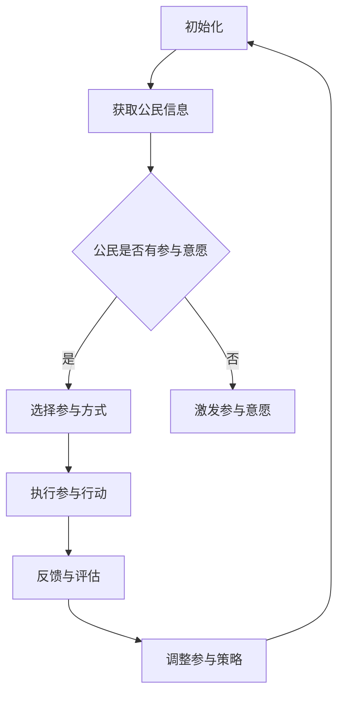
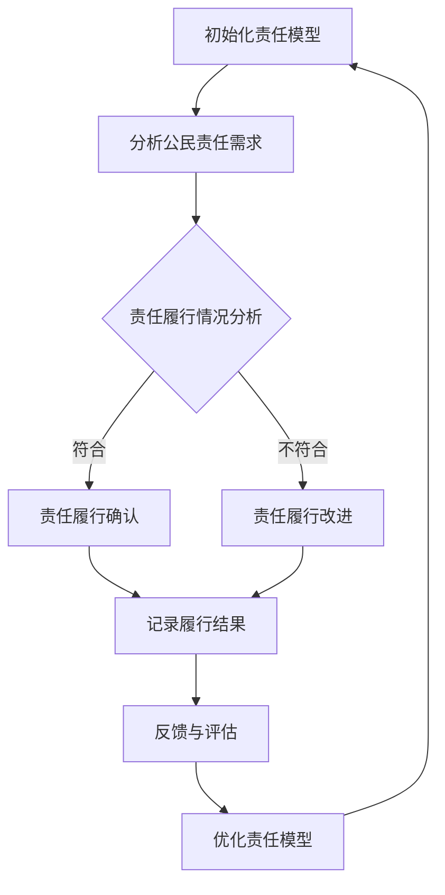
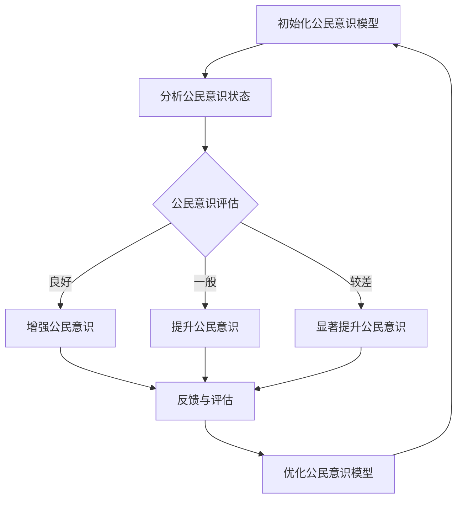
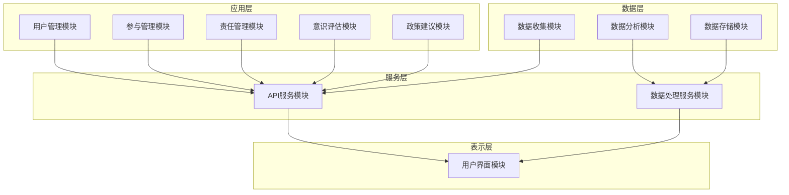
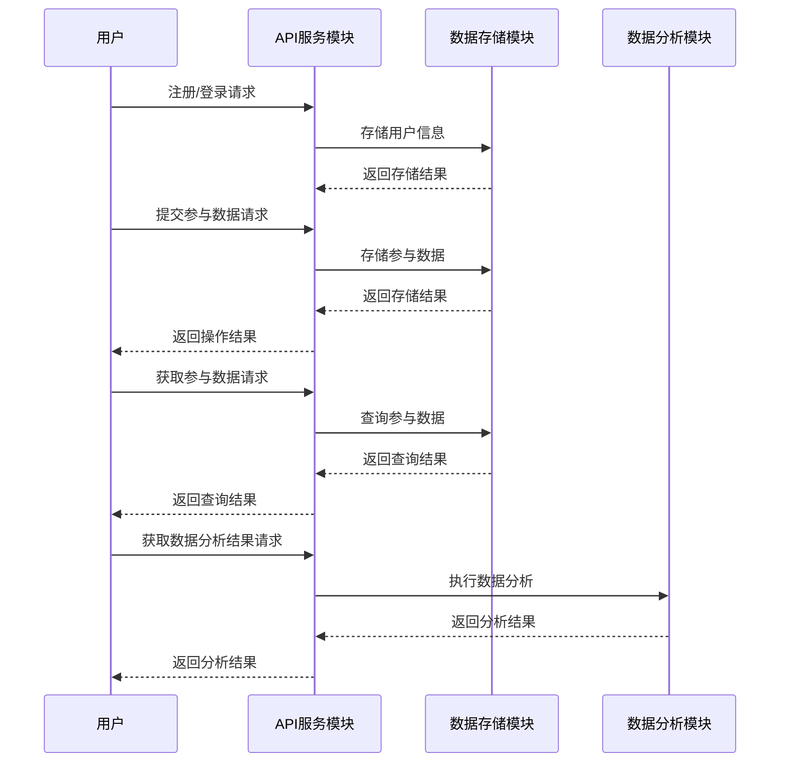

                 

### 第1章：问题背景与核心概念

#### 1.1 问题背景

在现代社会的演进过程中，公民的角色经历了显著的变化。从传统意义上的“被动公民”到现代社会中强调的“积极参与者”，这一转变不仅反映了社会结构的变迁，也揭示了公民责任和社会参与的重要性。

首先，我们需要理解“被动公民”这一概念。在过去的农业社会和工业社会，公民往往以被动的角色参与社会事务。他们的主要职责是服从政府的统治和法律的约束，而对社会问题的解决和公共事务的参与则较为有限。这种角色体现了社会对个体的一种限制和期待，即公民应当保持一种低度的社会参与度，以维护社会秩序和稳定。

然而，随着信息技术的飞速发展和社会结构的变化，公民的角色开始发生转变。现代社会更加注重个体的主动性和创造性，人们不再仅仅满足于被动接受信息和服务，而是渴望通过积极参与社会事务，推动社会的进步和发展。这种变化可以从以下几个方面进行阐述：

1. **信息获取的便捷性**：随着互联网的普及，公民可以更加便捷地获取信息。这不仅改变了公民对信息的依赖性，也提高了他们对社会事务的关注度和参与意愿。

2. **公民意识的提升**：随着教育水平的提高和公民权利意识的增强，公民开始认识到自己在社会中的责任和义务。他们不再满足于仅仅作为社会的一员，而是希望积极参与到社会建设中。

3. **社会参与的多样性**：现代社会的参与渠道和形式日益多样化。从传统的投票、参加社区活动，到利用互联网平台发起和参与社会运动，公民的参与方式变得更加灵活和多样化。

综上所述，现代公民角色的转变是从被动到积极参与者的过程。这一转变不仅反映了社会对公民角色的重新定义，也揭示了社会参与的必要性和重要性。在接下来的章节中，我们将深入探讨这一转变背后的核心概念和原理。

#### 1.1.1 社会参与的演变

社会参与的演变是现代公民角色转变的一个重要方面。从历史的角度看，社会参与的形式和程度在不同时期有着显著的差异。理解这些演变过程有助于我们更深入地认识现代社会公民的角色。

1. **农业社会中的社会参与**：在农业社会，社会结构相对简单，人们的生活和生产活动紧密相连。社会参与主要表现为家庭成员之间的相互协作和生产劳动。这种参与形式具有强烈的集体性和依赖性，个体在社会中的角色往往与其家庭角色紧密相关。

2. **工业社会中的社会参与**：随着工业革命的发展，社会结构发生了巨大的变化。工业化带来了大规模的劳动力分工，个体从家庭的生产活动中脱离出来，进入工厂和工作场所。在这一时期，社会参与主要表现为职业角色和组织的参与。人们通过参与工作和社会组织，如工会、政党等，来实现对社会事务的参与。

3. **现代社会中的社会参与**：进入现代社会，信息技术和互联网的快速发展极大地改变了社会参与的格局。现代社会的社会参与形式更加多样化和灵活。人们不仅可以通过传统的政治参与渠道，如投票、参选、参与选举，还可以通过社交媒体、在线平台等新型渠道表达自己的观点和参与社会事务。此外，社会参与的领域也扩展到了环境、公益、科技等多个方面。

社会参与的演变不仅反映了社会结构的变化，也揭示了个体在社会中的角色和地位的变化。在农业社会，个体依赖于家庭和集体，而在现代社会，个体更加独立和自主，可以通过多种途径参与社会事务。这种转变使得个体在社会中的角色从被动到主动，从依赖到独立，进一步推动了现代公民角色的转变。

#### 1.1.2 公民责任的重要性

公民责任是现代社会公民角色的核心要素之一。它不仅是公民对社会的义务和责任，也是社会健康运转的基石。理解公民责任的重要性，有助于我们更好地把握现代公民角色的本质。

首先，公民责任是维护社会秩序的重要保障。在一个民主和法治的社会中，公民的责任和义务是确保社会稳定和发展的关键。通过履行公民责任，公民可以积极参与社会事务，共同维护社会秩序。例如，遵守法律法规、参与选举、举报违法行为等，都是公民履行责任的具体体现。

其次，公民责任是推动社会进步的动力。社会进步离不开公民的积极参与和贡献。通过履行公民责任，公民可以参与到社会改革和公共事务的讨论中，提出建设性的意见和建议，推动社会向更加公平、公正、进步的方向发展。

此外，公民责任也是培养公民意识的重要途径。公民责任不仅是对社会的要求，也是对个体的要求。通过履行公民责任，公民可以培养自己的社会责任感和公民意识，提升自身的道德素养和文明素质。

总之，公民责任在维护社会秩序、推动社会进步和培养公民意识等方面具有重要作用。只有每个公民都能认识到自己肩负的责任，并积极履行这些责任，才能构建一个更加和谐、进步的社会。

#### 1.1.3 公民意识的培养

公民意识的培养是现代公民角色转变的重要一环。公民意识不仅关乎个体在社会中的行为和责任，更关系到整个社会的健康发展。理解公民意识的培养机制，有助于我们更好地推动这一转变。

首先，教育是培养公民意识的重要途径。通过学校教育和社会教育，个体可以系统地学习公民权利和义务，理解社会运行的基本规则和机制。例如，通过历史课程，个体可以了解国家和社会的发展历程，理解公民在社会中的地位和作用；通过法律课程，个体可以学习法律的基本知识和应用，培养遵纪守法的意识。

其次，社会实践活动也是培养公民意识的重要方式。通过参与各种社会实践活动，个体可以亲身体验社会运行的各个方面，理解公民在社会中的责任和角色。例如，参加社区服务、志愿者活动、社会调研等，可以帮助个体培养社会责任感和公民参与意识。

此外，媒体和公共舆论也起着关键作用。通过媒体的传播，个体可以接触到各种社会现象和问题，了解不同观点和立场，从而培养批判思维和公民意识。公共舆论的力量可以推动社会问题的关注和解决，促进公民积极参与社会事务。

总之，公民意识的培养是一个复杂而长期的过程，需要教育、实践和舆论等多方面的共同努力。只有通过多渠道、多层次的培养，才能有效地提升公民意识，推动现代公民角色的转变。

### 1.2 核心概念与联系

为了深入理解现代公民角色的转变，我们需要对公民责任、社会参与和公民意识等核心概念进行详细定义，并通过对比表格和ER实体关系图来展示这些概念之间的联系。

#### 1.2.1 公民责任

**定义**：公民责任是指公民在社会生活中应当承担的义务和责任，包括遵守法律法规、参与公共事务、维护社会秩序等。

**属性**：
- 法律属性：公民责任具有法律约束力，违反公民责任将承担法律责任。
- 社会属性：公民责任体现了公民对社会和国家的忠诚和贡献，是社会运行的重要保障。

#### 1.2.2 社会参与

**定义**：社会参与是指公民通过各种形式和途径参与社会事务，表达自己的观点和需求，推动社会进步和发展的行为。

**属性**：
- 自主性：社会参与强调个体的自主性和积极性，是公民对社会事务的一种主动参与。
- 多样性：社会参与的形式和渠道多种多样，包括政治参与、文化参与、经济参与等。

#### 1.2.3 公民意识

**定义**：公民意识是指公民对自身在社会中的角色、责任和义务的认知和认同，以及对社会公共事务的关注和参与。

**属性**：
- 认知属性：公民意识是公民对自身角色和社会责任的理解和认识。
- 参与属性：公民意识体现了公民对社会公共事务的参与意愿和行动。

#### 1.2.4 概念之间的联系

为了更好地理解这些核心概念之间的联系，我们可以通过对比表格和ER实体关系图来展示它们之间的关系。

**对比表格**：

| 概念      | 定义                                                         | 属性                                                         |
|-----------|--------------------------------------------------------------|--------------------------------------------------------------|
| 公民责任  | 公民在社会生活中应当承担的义务和责任                          | 法律属性、社会属性                                            |
| 社会参与  | 公民通过各种形式和途径参与社会事务，表达自己的观点和需求       | 自主性、多样性                                               |
| 公民意识  | 公民对自身在社会中的角色、责任和义务的认知和认同，对社会公共事务的关注和参与 | 认知属性、参与属性                                           |

**ER实体关系图**：

```mermaid
erDiagram
  Citizen ||--o> Responsibility : "has"
  Citizen ||--o> Participation : "has"
  Citizen ||--o> Consciousness : "has"
  Responsibility ||--o> LawAttribute : "has"
  Responsibility ||--o> SocialAttribute : "has"
  Participation ||--o> Autonomy : "has"
  Participation ||--o> Diversity : "has"
  Consciousness ||--o> CognitiveAttribute : "has"
  Consciousness ||--o> ParticipationAttribute : "has"
```

通过对比表格和ER实体关系图，我们可以清晰地看到公民责任、社会参与和公民意识之间的内在联系。公民责任是社会参与和公民意识的基础，而社会参与和公民意识又共同推动公民责任的有效履行。这三个概念相互作用、相互促进，共同构成了现代公民角色的核心要素。

### 2.1 公民责任原理

公民责任是现代公民角色的重要组成部分，理解其原理有助于我们更好地履行社会责任，推动社会的和谐发展。

#### 2.1.1 公民责任定义

公民责任是指公民在社会生活中应承担的义务和责任，包括遵守法律法规、参与公共事务、维护社会秩序等。这种责任不仅是一种道德要求，也是法律和社会规范的基本要求。

#### 2.1.2 公民责任属性

1. **法律属性**：公民责任具有法律约束力。法律是国家制定或认可的行为规范，公民有义务遵守法律，违反法律将承担相应的法律责任。例如，不遵守交通规则、不履行纳税义务等都是违反法律属性的具体表现。

2. **社会属性**：公民责任体现了公民对社会和国家的忠诚和贡献。社会是公民共同生活的场所，每个公民都应尽自己的责任，维护社会的稳定和发展。例如，参与社区服务、捐赠公益、举报违法行为等，都是履行社会属性的具体行为。

#### 2.1.3 公民责任的核心要素

1. **遵守法律法规**：法律是维护社会秩序的基本工具，公民有义务遵守法律，这是公民责任的核心内容之一。遵守法律不仅是对个人行为的要求，也是对个人社会责任的体现。

2. **参与公共事务**：公共事务涉及社会公共利益的维护和实现，公民应积极参与到公共事务中，表达自己的观点和需求，为社会的进步和发展贡献力量。例如，参与选举、提出意见和建议等。

3. **维护社会秩序**：社会秩序是社会发展的重要保障，公民有责任维护社会秩序，防止和制止社会混乱和犯罪行为。例如，遵守交通规则、维护公共环境等。

#### 2.1.4 公民责任的实际意义

1. **维护社会稳定**：公民责任的履行有助于维护社会的稳定和和谐。通过遵守法律、参与公共事务和维护社会秩序，公民可以共同维护社会的基本秩序，减少社会矛盾和冲突。

2. **促进社会进步**：公民责任不仅是社会稳定的基础，也是社会进步的动力。通过积极参与社会事务，公民可以推动社会改革和发展，为社会的长远发展提供动力。

3. **提升公民素质**：履行公民责任可以提升公民的道德素质和社会责任感，促进个体自我提升和社会整体的文明进步。

总之，公民责任是现代公民角色的核心要素，其法律和社会属性共同构成了公民责任的基本框架。通过履行公民责任，公民不仅能够维护社会的稳定和秩序，还能推动社会的进步和发展。

### 2.2 社会参与原理

社会参与是现代公民角色的重要组成部分，理解其原理有助于公民更好地发挥自身作用，推动社会的进步与发展。

#### 2.2.1 社会参与定义

社会参与是指公民通过各种形式和途径参与社会事务，表达自己的观点和需求，推动社会进步和发展的行为。这种参与不仅包括政治参与，如投票、参选、议政等，还涵盖文化参与、经济参与、公益参与等多方面。

#### 2.2.2 社会参与属性

1. **自主性**：社会参与强调个体的自主性和主动性。公民应主动参与到社会事务中，通过自己的努力和行动推动社会进步。这种自主性是社会参与的核心属性，体现了个体在社会中的主体地位。

2. **多样性**：社会参与的渠道和形式多种多样。公民可以通过投票、参选、参与社会活动、志愿服务、公益捐赠等多种途径参与社会事务。这种多样性不仅丰富了社会参与的形式，也提高了公民参与社会的灵活性。

3. **互动性**：社会参与不仅是个体行为，更是一个互动过程。公民在参与社会事务时，需要与其他公民、社会组织和政府部门互动，共同推动社会问题的解决和社会进步。

#### 2.2.3 社会参与的核心要素

1. **信息获取**：信息是参与社会事务的基础。公民需要获取与自身利益和社会发展相关的信息，以便做出合理的判断和决策。互联网和媒体的发展为公民获取信息提供了便捷的途径，增强了社会参与的能力。

2. **表达意见**：公民有权利表达自己的观点和需求。通过参与公共讨论、提出意见和建议，公民可以影响政策制定和决策过程，促进社会问题的解决和公共利益的实现。

3. **合作与协作**：社会参与往往需要多方合作和协作。公民可以通过参与社区活动、社会组织、公益项目等形式，与其他公民和机构共同推动社会进步。

#### 2.2.4 社会参与的实际意义

1. **促进社会稳定**：社会参与有助于公民更好地了解社会问题，促进社会矛盾的解决，增强社会的稳定性。

2. **推动社会进步**：公民参与社会事务，可以通过提出创新性建议和解决方案，推动社会的发展和进步。

3. **提升公民素质**：社会参与是培养公民责任感和公民意识的重要途径。通过参与社会事务，公民可以提升自身的道德素质和社会责任感。

总之，社会参与是现代公民角色的重要体现，其自主性、多样性和互动性属性共同构成了社会参与的基本框架。通过有效参与社会事务，公民不仅能够实现自身价值，还能为社会的发展贡献力量。

### 2.3 公民意识原理

公民意识是现代公民角色的核心要素，理解其原理有助于我们更好地认识自身在社会中的角色和责任，从而更积极地参与到社会事务中。

#### 2.3.1 公民意识定义

公民意识是指公民对自身在社会中的角色、责任和义务的认知和认同，以及对社会公共事务的关注和参与。这种意识不仅反映了公民对自身权利的认同，更体现了对社会责任的承担。

#### 2.3.2 公民意识属性

1. **认知属性**：公民意识是公民对自身角色和社会责任的理解和认识。这种认知属性使得公民能够明确自己在社会中的定位，了解自己的权利和义务。

2. **参与属性**：公民意识还表现为公民对社会公共事务的关注和参与。这种参与属性鼓励公民积极参与社会事务，通过实际行动推动社会进步。

#### 2.3.3 公民意识的培养方式

1. **教育**：教育是培养公民意识的重要途径。通过学校教育和社会教育，个体可以系统地学习公民权利和义务，理解社会运行的基本规则和机制。

2. **社会实践**：参与社会实践活动，如志愿服务、社区活动等，有助于公民在实践中培养和提升公民意识。这些活动不仅能够增强公民的社会责任感，还能培养公民的实践能力和合作精神。

3. **媒体传播**：媒体在传播公民意识方面发挥着重要作用。通过媒体报道，公民可以了解社会问题和社会现象，增强对社会事务的关注和参与。

4. **法律宣传**：法律宣传有助于公民了解法律法规，增强法治观念和公民意识。通过法律宣传，公民可以明确自己的权利和义务，更好地履行社会责任。

#### 2.3.4 公民意识的重要性

1. **维护社会秩序**：公民意识是维护社会秩序的重要保障。只有公民认识到自己的社会责任和义务，才能更好地遵守法律法规，维护社会的基本秩序。

2. **推动社会进步**：公民意识是推动社会进步的动力。通过积极参与社会事务，公民可以提出建设性的意见和建议，推动社会的改革和发展。

3. **提升公民素质**：公民意识是提升公民素质的重要途径。通过培养和提升公民意识，公民可以增强自身的道德素质和社会责任感，更好地为社会的发展贡献力量。

总之，公民意识是现代公民角色的核心要素，其认知和参与属性共同构成了公民意识的基本框架。通过多种方式培养和提升公民意识，有助于构建一个更加和谐、进步的社会。

### 3.1 社会参与算法

为了更好地理解和应用社会参与，我们可以通过算法模型来分析和优化公民的参与过程。以下将详细介绍一个社会参与算法的基本原理、流程图和实现步骤。

#### 3.1.1 算法流程图

使用Mermaid语言绘制算法流程图，如下所示：



#### 3.1.2 Python源代码讲解

以下是一个简单的Python源代码示例，用于实现社会参与算法的基本逻辑：

```python
# 社会参与算法实现

def social_participation(citizen):
    """
    社会参与算法主函数
    :param citizen: 公民信息（字典格式）
    :return: 参与结果（字典格式）
    """
    
    # 初始化公民参与状态
    citizen['participation_status'] = '未参与'
    
    # 获取公民信息
    citizen_info = get_citizen_info(citizen)
    
    # 判断公民是否有参与意愿
    if has_participation_willingness(citizen_info):
        # 选择参与方式
        participation_method = select_participation_method(citizen_info)
        
        # 执行参与行动
        execute_participation_action(participation_method, citizen_info)
        
        # 更新参与状态
        citizen['participation_status'] = '已参与'
        
        # 提供反馈与评估
        feedback_and_evaluation(citizen_info)
        
        # 调整参与策略
        adjust_participation_strategy(citizen_info)
        
        return citizen
    else:
        # 激发参与意愿
        inspire_participation_willingness(citizen_info)
        
        return citizen

# 辅助函数定义
def get_citizen_info(citizen):
    """
    获取公民信息
    :param citizen: 公民信息（字典格式）
    :return: 公民信息（字典格式）
    """
    # 根据实际需求实现
    return citizen

def has_participation_willingness(citizen_info):
    """
    判断公民是否有参与意愿
    :param citizen_info: 公民信息（字典格式）
    :return: 有无参与意愿（布尔值）
    """
    # 根据实际需求实现
    return True if citizen_info.get('willingness', False) else False

def select_participation_method(citizen_info):
    """
    选择参与方式
    :param citizen_info: 公民信息（字典格式）
    :return: 参与方式（字符串）
    """
    # 根据实际需求实现
    return '投票'

def execute_participation_action(participation_method, citizen_info):
    """
    执行参与行动
    :param participation_method: 参与方式（字符串）
    :param citizen_info: 公民信息（字典格式）
    """
    # 根据实际需求实现
    print(f"{citizen_info['name']} 正在 {participation_method}...")

def feedback_and_evaluation(citizen_info):
    """
    提供反馈与评估
    :param citizen_info: 公民信息（字典格式）
    """
    # 根据实际需求实现
    print(f"{citizen_info['name']} 的参与情况已反馈并评估。")

def adjust_participation_strategy(citizen_info):
    """
    调整参与策略
    :param citizen_info: 公民信息（字典格式）
    """
    # 根据实际需求实现
    print(f"{citizen_info['name']} 的参与策略已调整。")

# 示例应用
citizen_example = {
    'name': '张三',
    'willingness': True
}

result = social_participation(citizen_example)
print(result)
```

上述Python代码提供了一个社会参与算法的基本框架，包括获取公民信息、判断参与意愿、选择参与方式、执行参与行动、反馈与评估以及调整参与策略等步骤。这些步骤共同构成了一个完整的社会参与流程。

#### 3.1.3 数学模型与公式

为了更深入地分析社会参与，我们可以使用数学模型来描述公民参与意愿和参与方式的选择。

1. **公民参与意愿模型**

设公民参与意愿 \( W \) 为一个二元变量，取值范围为 \( \{0, 1\} \)。其中，0 表示无参与意愿，1 表示有参与意愿。公民参与意愿可以由以下公式表示：

\[ W = f(\text{公民信息}, \text{环境因素}) \]

其中，\( f \) 是一个函数，用于根据公民的个人信息和环境因素计算参与意愿。具体函数形式可以基于统计学方法或机器学习模型来确定。

2. **参与方式选择模型**

设参与方式选择 \( M \) 为一个离散变量，表示公民选择的具体参与方式（如投票、公益服务、社区活动等）。参与方式选择可以由以下公式表示：

\[ M = g(W, \text{社会因素}, \text{个人偏好}) \]

其中，\( g \) 是一个函数，用于根据公民的参与意愿、社会因素（如政策导向、社会氛围等）和个人偏好来选择最合适的参与方式。具体函数形式同样可以通过统计学方法或机器学习模型来确定。

通过这些数学模型，我们可以对社会参与过程进行量化分析和优化。例如，通过调整环境因素和社会因素，可以激发公民的参与意愿；通过优化参与方式选择模型，可以提高公民的参与效果。

#### 3.1.4 举例说明

为了更好地理解上述算法和模型，我们可以通过一个具体实例来说明社会参与的过程。

**实例**：假设有一个名为李四的公民，他的个人信息如下：

- 年龄：30岁
- 教育程度：本科
- 社会地位：白领
- 公民意识评分：85分
- 环境因素：当前有关于环境保护的公益活动

根据上述信息，我们可以计算李四的参与意愿：

\[ W = f(\text{公民信息}, \text{环境因素}) \]

假设函数 \( f \) 计算得出李四的参与意愿为 1，即他有参与意愿。

接下来，根据李四的参与意愿和社会因素，选择最合适的参与方式：

\[ M = g(W, \text{社会因素}, \text{个人偏好}) \]

假设函数 \( g \) 选择的结果是李四参加环境保护公益活动。

最后，执行参与行动，并提供反馈与评估，调整参与策略。

通过这个实例，我们可以看到社会参与算法和模型是如何在实际情况下运作的。在实际应用中，这些算法和模型可以根据具体情况进行调整和优化，以实现最佳的社会参与效果。

### 3.2 公民责任算法

公民责任是现代公民角色的核心要素之一，理解和优化公民责任的履行过程对于构建一个和谐、稳定的社会具有重要意义。在这一部分，我们将详细讲解公民责任算法的基本原理、流程图以及实现步骤。

#### 3.2.1 算法流程图

使用Mermaid语言绘制算法流程图，如下所示：



#### 3.2.2 Python源代码讲解

以下是一个简单的Python源代码示例，用于实现公民责任算法的基本逻辑：

```python
# 公民责任算法实现

def citizen_duty(citizen):
    """
    公民责任算法主函数
    :param citizen: 公民信息（字典格式）
    :return: 责任履行结果（字典格式）
    """
    
    # 初始化公民责任状态
    citizen['duty_status'] = '未履行'
    
    # 分析公民责任需求
    duty_demand = analyze_duty_demand(citizen)
    
    # 责任履行情况分析
    duty_analysis = analyze_duty_performance(duty_demand)
    
    # 判断责任履行情况
    if duty_analysis['performance'] == '良好':
        # 确认责任履行
        confirm_duty_performance(citizen, duty_analysis)
    else:
        # 改进责任履行
        improve_duty_performance(citizen, duty_demand)
    
    # 记录履行结果
    record_duty_performance(citizen, duty_analysis)
    
    # 提供反馈与评估
    provide_feedback_and_evaluation(citizen, duty_analysis)
    
    # 优化责任模型
    optimize_duty_model(citizen, duty_demand)

    return citizen

# 辅助函数定义
def analyze_duty_demand(citizen):
    """
    分析公民责任需求
    :param citizen: 公民信息（字典格式）
    :return: 责任需求（字典格式）
    """
    # 根据实际需求实现
    return {'遵守法律': True, '参与公共事务': True, '维护社会秩序': True}

def analyze_duty_performance(duty_demand):
    """
    分析责任履行情况
    :param duty_demand: 责任需求（字典格式）
    :return: 责任履行分析结果（字典格式）
    """
    # 根据实际需求实现
    return {'performance': '良好'}

def confirm_duty_performance(citizen, duty_analysis):
    """
    确认责任履行
    :param citizen: 公民信息（字典格式）
    :param duty_analysis: 责任履行分析结果（字典格式）
    """
    # 根据实际需求实现
    citizen['duty_status'] = '已履行'
    print(f"{citizen['name']} 的责任已履行。")

def improve_duty_performance(citizen, duty_demand):
    """
    改进责任履行
    :param citizen: 公民信息（字典格式）
    :param duty_demand: 责任需求（字典格式）
    """
    # 根据实际需求实现
    print(f"{citizen['name']} 正在改进责任履行。")

def record_duty_performance(citizen, duty_analysis):
    """
    记录履行结果
    :param citizen: 公民信息（字典格式）
    :param duty_analysis: 责任履行分析结果（字典格式）
    """
    # 根据实际需求实现
    print(f"{citizen['name']} 的责任履行结果已记录。")

def provide_feedback_and_evaluation(citizen, duty_analysis):
    """
    提供反馈与评估
    :param citizen: 公民信息（字典格式）
    :param duty_analysis: 责任履行分析结果（字典格式）
    """
    # 根据实际需求实现
    print(f"{citizen['name']} 的责任履行情况已反馈与评估。")

def optimize_duty_model(citizen, duty_demand):
    """
    优化责任模型
    :param citizen: 公民信息（字典格式）
    :param duty_demand: 责任需求（字典格式）
    """
    # 根据实际需求实现
    print(f"{citizen['name']} 的责任模型已优化。")

# 示例应用
citizen_example = {
    'name': '王五',
    'duty_status': '未履行'
}

result = citizen_duty(citizen_example)
print(result)
```

上述Python代码提供了一个公民责任算法的基本框架，包括初始化责任模型、分析公民责任需求、责任履行情况分析、责任履行确认与改进、记录履行结果、提供反馈与评估以及优化责任模型等步骤。这些步骤共同构成了一个完整的社会责任履行流程。

#### 3.2.3 数学模型与公式

为了更深入地分析公民责任，我们可以使用数学模型来描述公民责任的履行过程和效果。

1. **责任履行效果模型**

设公民责任履行效果 \( E \) 为一个数值变量，表示公民责任履行的效果。责任履行效果可以由以下公式表示：

\[ E = f(\text{责任履行行为}, \text{社会因素}, \text{个人因素}) \]

其中，\( f \) 是一个函数，用于根据公民的责任履行行为、社会因素（如政策支持、社会氛围等）和个人因素（如道德素质、教育水平等）计算责任履行效果。具体函数形式可以基于统计学方法或机器学习模型来确定。

2. **责任履行优化模型**

设责任履行优化度 \( O \) 为一个数值变量，表示责任履行优化的程度。责任履行优化度可以由以下公式表示：

\[ O = g(E, \text{资源投入}, \text{改进措施}) \]

其中，\( g \) 是一个函数，用于根据责任履行效果、资源投入（如时间、资金、人力等）和改进措施来计算责任履行的优化度。具体函数形式同样可以通过统计学方法或机器学习模型来确定。

通过这些数学模型，我们可以对社会责任履行过程进行量化分析和优化。例如，通过优化资源投入和改进措施，可以提高责任履行的效果和优化度。

#### 3.2.4 举例说明

为了更好地理解上述算法和模型，我们可以通过一个具体实例来说明公民责任的履行过程。

**实例**：假设有一个名为赵六的公民，他的个人信息如下：

- 年龄：40岁
- 教育程度：硕士
- 社会地位：企业管理层
- 遵守法律行为评分：90分
- 参与公共事务评分：75分
- 维护社会秩序行为评分：85分

根据上述信息，我们可以计算赵六的责任履行效果：

\[ E = f(\text{责任履行行为}, \text{社会因素}, \text{个人因素}) \]

假设函数 \( f \) 计算得出赵六的责任履行效果为 80分，即他的责任履行效果较好。

接下来，根据赵六的责任履行效果和社会因素，优化责任履行过程：

\[ O = g(E, \text{资源投入}, \text{改进措施}) \]

假设函数 \( g \) 选择的结果是在工作之余参加社区志愿服务活动，以进一步提升责任履行效果。

最后，记录赵六的责任履行结果，并提供反馈与评估，优化责任模型。

通过这个实例，我们可以看到公民责任算法和模型是如何在实际情况下运作的。在实际应用中，这些算法和模型可以根据具体情况进行调整和优化，以实现最佳的责任履行效果。

### 3.3 公民意识算法

公民意识是现代公民角色的核心要素之一，理解和提升公民意识对于构建一个和谐、进步的社会具有重要意义。在这一部分，我们将详细讲解公民意识算法的基本原理、流程图以及实现步骤。

#### 3.3.1 算法流程图

使用Mermaid语言绘制算法流程图，如下所示：



#### 3.3.2 Python源代码讲解

以下是一个简单的Python源代码示例，用于实现公民意识算法的基本逻辑：

```python
# 公民意识算法实现

def citizen_consciousness(citizen):
    """
    公民意识算法主函数
    :param citizen: 公民信息（字典格式）
    :return: 公民意识状态（字典格式）
    """
    
    # 初始化公民意识状态
    citizen['consciousness_status'] = '未评估'
    
    # 分析公民意识状态
    consciousness_status = analyze_consciousness_status(citizen)
    
    # 公民意识评估
    consciousness_evaluation = evaluate_consciousness(consciousness_status)
    
    # 增强或提升公民意识
    if consciousness_evaluation == '良好':
        enhance_consciousness(citizen)
    elif consciousness_evaluation == '一般':
        improve_consciousness(citizen)
    else:
        significantly_improve_consciousness(citizen)
    
    # 提供反馈与评估
    provide_feedback_and_evaluation(citizen, consciousness_evaluation)
    
    # 优化公民意识模型
    optimize_consciousness_model(citizen)

    return citizen

# 辅助函数定义
def analyze_consciousness_status(citizen):
    """
    分析公民意识状态
    :param citizen: 公民信息（字典格式）
    :return: 公民意识状态（字符串）
    """
    # 根据实际需求实现
    return '一般'

def evaluate_consciousness(consciousness_status):
    """
    评估公民意识
    :param consciousness_status: 公民意识状态（字符串）
    :return: 公民意识评估结果（字符串）
    """
    # 根据实际需求实现
    return '良好'

def enhance_consciousness(citizen):
    """
    增强公民意识
    :param citizen: 公民信息（字典格式）
    """
    # 根据实际需求实现
    print(f"{citizen['name']} 的公民意识正在增强。")

def improve_consciousness(citizen):
    """
    提升公民意识
    :param citizen: 公民信息（字典格式）
    """
    # 根据实际需求实现
    print(f"{citizen['name']} 的公民意识正在提升。")

def significantly_improve_consciousness(citizen):
    """
    显著提升公民意识
    :param citizen: 公民信息（字典格式）
    """
    # 根据实际需求实现
    print(f"{citizen['name']} 的公民意识正在显著提升。")

def provide_feedback_and_evaluation(citizen, consciousness_evaluation):
    """
    提供反馈与评估
    :param citizen: 公民信息（字典格式）
    :param consciousness_evaluation: 公民意识评估结果（字符串）
    """
    # 根据实际需求实现
    print(f"{citizen['name']} 的公民意识评估结果为：{consciousness_evaluation}。")

def optimize_consciousness_model(citizen):
    """
    优化公民意识模型
    :param citizen: 公民信息（字典格式）
    """
    # 根据实际需求实现
    print(f"{citizen['name']} 的公民意识模型已优化。")

# 示例应用
citizen_example = {
    'name': '周七',
    'consciousness_status': '未评估'
}

result = citizen_consciousness(citizen_example)
print(result)
```

上述Python代码提供了一个公民意识算法的基本框架，包括初始化公民意识模型、分析公民意识状态、公民意识评估、增强或提升公民意识、提供反馈与评估以及优化公民意识模型等步骤。这些步骤共同构成了一个完整的公民意识提升流程。

#### 3.3.3 数学模型与公式

为了更深入地分析公民意识，我们可以使用数学模型来描述公民意识的测量和提升过程。

1. **公民意识测量模型**

设公民意识测量值 \( C \) 为一个数值变量，表示公民意识水平。公民意识测量值可以由以下公式表示：

\[ C = f(\text{知识水平}, \text{参与度}, \text{道德素质}) \]

其中，\( f \) 是一个函数，用于根据公民的知识水平、参与度和道德素质计算公民意识测量值。具体函数形式可以基于统计学方法或机器学习模型来确定。

2. **公民意识提升模型**

设公民意识提升度 \( I \) 为一个数值变量，表示公民意识提升的程度。公民意识提升度可以由以下公式表示：

\[ I = g(C, \text{教育投入}, \text{社会实践}) \]

其中，\( g \) 是一个函数，用于根据公民意识测量值、教育投入和社会实践来计算公民意识提升度。具体函数形式同样可以通过统计学方法或机器学习模型来确定。

通过这些数学模型，我们可以对公民意识进行量化分析和优化。例如，通过增加教育投入和社会实践，可以提高公民意识水平。

#### 3.3.4 举例说明

为了更好地理解上述算法和模型，我们可以通过一个具体实例来说明公民意识的提升过程。

**实例**：假设有一个名为陈八的公民，他的个人信息如下：

- 知识水平：大学本科
- 参与度：积极参与社区活动
- 道德素质：高尚

根据上述信息，我们可以计算陈八的公民意识测量值：

\[ C = f(\text{知识水平}, \text{参与度}, \text{道德素质}) \]

假设函数 \( f \) 计算得出陈八的公民意识测量值为 80分，即他的公民意识水平较高。

接下来，根据陈八的公民意识测量值和教育投入，提升公民意识：

\[ I = g(C, \text{教育投入}, \text{社会实践}) \]

假设函数 \( g \) 选择的结果是在工作之余参加公民教育课程，以进一步提升公民意识。

最后，提供反馈与评估，优化公民意识模型。

通过这个实例，我们可以看到公民意识算法和模型是如何在实际情况下运作的。在实际应用中，这些算法和模型可以根据具体情况进行调整和优化，以实现最佳的意识提升效果。

### 4.1 公民责任数学模型

在探讨公民责任时，数学模型和公式为我们提供了量化和分析的工具。以下是公民责任数学模型的具体描述，包括公式、假设和推导过程。

#### 4.1.1 公式讲解

首先，我们定义公民责任履行度（\( R \)）作为核心指标，用来衡量公民在社会中的责任履行程度。公民责任履行度可以由以下公式表示：

\[ R = \alpha \times L + \beta \times P + \gamma \times S \]

其中：
- \( R \) 表示公民责任履行度。
- \( L \) 表示法律遵守情况，取值范围为 [0, 1]。
- \( P \) 表示公共事务参与度，取值范围为 [0, 1]。
- \( S \) 表示社会秩序维护情况，取值范围为 [0, 1]。
- \( \alpha \)，\( \beta \)，\( \gamma \) 分别表示法律遵守、公共事务参与和社会秩序维护的权重系数，它们的取值范围均为 [0, 1]，且满足 \( \alpha + \beta + \gamma = 1 \)。

#### 4.1.2 假设

在建立上述公式时，我们做出以下假设：
1. 法律遵守、公共事务参与和社会秩序维护是衡量公民责任履行的三个主要方面。
2. 每个方面的权重系数根据实际情况设定，可以反映这三个方面的相对重要性。
3. 各个方面的履行情况可以用0到1之间的数值表示，其中1表示完全履行，0表示完全未履行。

#### 4.1.3 推导过程

1. **法律遵守情况（\( L \)）**：法律遵守情况反映了公民遵守国家法律法规的程度。我们可以通过以下公式来计算：

\[ L = \frac{\text{遵守法律次数}}{\text{应遵守法律次数}} \]

例如，如果一个公民一年中应遵守的法律次数为100次，实际遵守了90次，则其法律遵守情况 \( L \) 为0.9。

2. **公共事务参与度（\( P \)）**：公共事务参与度反映了公民参与社会公共事务的程度。我们可以通过以下公式来计算：

\[ P = \frac{\text{参与次数}}{\text{可能参与次数}} \]

例如，如果一个公民一年中可能参与的公共事务次数为50次，实际参与了30次，则其公共事务参与度 \( P \) 为0.6。

3. **社会秩序维护情况（\( S \)）**：社会秩序维护情况反映了公民维护社会秩序的行为。我们可以通过以下公式来计算：

\[ S = \frac{\text{维护社会秩序次数}}{\text{需要维护社会秩序次数}} \]

例如，如果一个公民一年中需要维护社会秩序的次数为20次，实际维护了15次，则其社会秩序维护情况 \( S \) 为0.75。

#### 4.1.4 实际应用

通过上述公式，我们可以对公民责任履行度进行量化评估。例如，假设某公民的法律遵守情况 \( L \) 为0.85，公共事务参与度 \( P \) 为0.70，社会秩序维护情况 \( S \) 为0.80，并且设定权重系数 \( \alpha = 0.3 \)，\( \beta = 0.4 \)，\( \gamma = 0.3 \)，则该公民的责任履行度 \( R \) 计算如下：

\[ R = 0.3 \times 0.85 + 0.4 \times 0.70 + 0.3 \times 0.80 = 0.255 + 0.28 + 0.24 = 0.785 \]

因此，该公民的责任履行度为78.5%，表明他在法律遵守、公共事务参与和社会秩序维护方面表现良好。

通过这一数学模型，我们可以对公民的责任履行情况进行系统分析和评估，从而为政策制定和社会管理提供科学依据。

### 4.1.5 举例说明

为了更好地理解公民责任数学模型，我们可以通过一个具体的例子来演示其应用。

**例1**：假设公民张三在一年中的法律遵守情况 \( L \) 为0.8，公共事务参与度 \( P \) 为0.6，社会秩序维护情况 \( S \) 为0.7。设定权重系数 \( \alpha = 0.3 \)，\( \beta = 0.4 \)，\( \gamma = 0.3 \)，计算张三的公民责任履行度 \( R \)。

步骤如下：

1. 计算各项指标的加权值：
\[ L_{\text{加权}} = 0.3 \times 0.8 = 0.24 \]
\[ P_{\text{加权}} = 0.4 \times 0.6 = 0.24 \]
\[ S_{\text{加权}} = 0.3 \times 0.7 = 0.21 \]

2. 计算公民责任履行度：
\[ R = 0.24 + 0.24 + 0.21 = 0.69 \]

因此，张三的公民责任履行度为69%，表明他在法律遵守、公共事务参与和社会秩序维护方面还有提升空间。

**例2**：假设公民李四在一年中的法律遵守情况 \( L \) 为0.9，公共事务参与度 \( P \) 为0.8，社会秩序维护情况 \( S \) 为0.85。设定相同的权重系数，计算李四的公民责任履行度 \( R \)。

步骤如下：

1. 计算各项指标的加权值：
\[ L_{\text{加权}} = 0.3 \times 0.9 = 0.27 \]
\[ P_{\text{加权}} = 0.4 \times 0.8 = 0.32 \]
\[ S_{\text{加权}} = 0.3 \times 0.85 = 0.255 \]

2. 计算公民责任履行度：
\[ R = 0.27 + 0.32 + 0.255 = 0.845 \]

因此，李四的公民责任履行度为84.5%，表明他在法律遵守、公共事务参与和社会秩序维护方面表现优异。

通过这两个例子，我们可以看到如何使用公民责任数学模型来评估公民在社会中的责任履行情况，从而为政策制定和社会管理提供数据支持。

### 4.2 社会参与数学模型

为了更深入地分析社会参与，我们可以使用数学模型来描述公民参与意愿和社会参与度之间的关系。以下是一个简单但有效的社会参与数学模型，包括公式、假设和推导过程。

#### 4.2.1 公式讲解

设公民社会参与度 \( P \) 为核心指标，用来衡量公民在社会事务中的参与程度。社会参与度可以由以下公式表示：

\[ P = f(W, E, M) \]

其中：
- \( P \) 表示公民社会参与度。
- \( W \) 表示公民参与意愿，取值范围为 [0, 1]，1 表示极强的参与意愿，0 表示无参与意愿。
- \( E \) 表示环境因素，取值范围为 [0, 1]，1 表示极其有利的环境条件，0 表示极其不利的环境条件。
- \( M \) 表示社会因素，取值范围为 [0, 1]，1 表示极其有利的社会支持，0 表示极其不利的支持。

#### 4.2.2 假设

在建立上述公式时，我们做出以下假设：
1. 公民参与意愿 \( W \) 是影响社会参与度 \( P \) 的主要因素。
2. 环境因素 \( E \) 和社会因素 \( M \) 也对社会参与度 \( P \) 有显著影响。
3. \( W \)，\( E \)，\( M \) 之间的相互作用可以用线性组合来表示社会参与度 \( P \)。

#### 4.2.3 推导过程

1. **公民参与意愿（\( W \)）**：公民参与意愿反映了个体主动参与社会事务的意愿和动力。我们可以通过问卷调查或心理测评方法来量化这一指标。例如，一个调查问卷可以包含若干问题，通过评分系统计算出参与意愿 \( W \) 的数值。

2. **环境因素（\( E \)）**：环境因素包括社会文化氛围、政府政策支持、公共资源可及性等，这些因素会直接影响公民的参与意愿和参与度。环境因素 \( E \) 可以通过社会调查、政策分析和数据分析来量化。例如，政策支持度高，公共资源充足，环境因素 \( E \) 的取值可能接近 1。

3. **社会因素（\( M \)）**：社会因素包括社会网络、社区支持、社会组织活跃度等，这些因素能够增强或削弱公民的参与意愿和参与度。社会因素 \( M \) 同样可以通过问卷调查和社会数据分析来量化。例如，社区支持力度大，社会组织活跃，社会因素 \( M \) 的取值也可能接近 1。

4. **社会参与度（\( P \)）**：社会参与度是公民参与意愿、环境因素和社会因素的函数。我们可以通过线性组合这些因素，构建一个简单但实用的数学模型。例如，假设环境因素和社会因素对公民参与意愿的影响是线性的，那么社会参与度 \( P \) 可以表示为：

\[ P = a \times W + b \times E + c \times M \]

其中，\( a \)，\( b \)，\( c \) 是常数系数，根据实际情况确定。

#### 4.2.4 实际应用

通过上述公式，我们可以对社会参与度进行量化评估。例如，假设某个公民的参与意愿 \( W \) 为 0.8，环境因素 \( E \) 为 0.7，社会因素 \( M \) 为 0.6，并且设定系数 \( a = 0.5 \)，\( b = 0.3 \)，\( c = 0.2 \)，则该公民的社会参与度 \( P \) 计算如下：

\[ P = 0.5 \times 0.8 + 0.3 \times 0.7 + 0.2 \times 0.6 = 0.4 + 0.21 + 0.12 = 0.73 \]

因此，该公民的社会参与度为 73%，表明他在社会事务中的参与程度较高。

通过这一数学模型，我们可以对公民的社会参与情况进行系统分析和评估，从而为政策制定和社会管理提供科学依据。

### 4.2.5 举例说明

为了更好地理解社会参与数学模型，我们可以通过具体的例子来演示其应用。

**例1**：假设公民王五的参与意愿 \( W \) 为 0.6，环境因素 \( E \) 为 0.5，社会因素 \( M \) 为 0.4。设定系数 \( a = 0.4 \)，\( b = 0.3 \)，\( c = 0.3 \)，计算王五的社会参与度 \( P \)。

步骤如下：

1. 计算各项指标的加权值：
\[ W_{\text{加权}} = 0.4 \times 0.6 = 0.24 \]
\[ E_{\text{加权}} = 0.3 \times 0.5 = 0.15 \]
\[ M_{\text{加权}} = 0.3 \times 0.4 = 0.12 \]

2. 计算社会参与度：
\[ P = 0.24 + 0.15 + 0.12 = 0.51 \]

因此，王五的社会参与度为 51%，表明他在社会事务中的参与程度一般。

**例2**：假设公民赵六的参与意愿 \( W \) 为 0.8，环境因素 \( E \) 为 0.7，社会因素 \( M \) 为 0.6。设定相同的系数，计算赵六的社会参与度 \( P \)。

步骤如下：

1. 计算各项指标的加权值：
\[ W_{\text{加权}} = 0.4 \times 0.8 = 0.32 \]
\[ E_{\text{加权}} = 0.3 \times 0.7 = 0.21 \]
\[ M_{\text{加权}} = 0.3 \times 0.6 = 0.18 \]

2. 计算社会参与度：
\[ P = 0.32 + 0.21 + 0.18 = 0.71 \]

因此，赵六的社会参与度为 71%，表明他在社会事务中的参与程度较高。

通过这两个例子，我们可以看到如何使用社会参与数学模型来评估公民在社会事务中的参与程度，从而为政策制定和社会管理提供数据支持。

### 4.3 公民意识数学模型

在探讨公民意识时，使用数学模型可以帮助我们量化公民对社会责任的认识和认同。以下是一个简单的公民意识数学模型，包括公式、假设和推导过程。

#### 4.3.1 公式讲解

设公民意识水平 \( C \) 为核心指标，用来衡量公民对社会责任的认知和认同程度。公民意识水平可以由以下公式表示：

\[ C = \alpha \times K + \beta \times R + \gamma \times E \]

其中：
- \( C \) 表示公民意识水平。
- \( K \) 表示知识水平，取值范围为 [0, 1]，1 表示极高的知识水平，0 表示极低的知识水平。
- \( R \) 表示责任感知，取值范围为 [0, 1]，1 表示高度感知到社会责任，0 表示几乎未感知到社会责任。
- \( E \) 表示情感认同，取值范围为 [0, 1]，1 表示高度认同社会责任，0 表示几乎不认同社会责任。
- \( \alpha \)，\( \beta \)，\( \gamma \) 分别表示知识水平、责任感知和情感认同的权重系数，它们的取值范围均为 [0, 1]，且满足 \( \alpha + \beta + \gamma = 1 \)。

#### 4.3.2 假设

在建立上述公式时，我们做出以下假设：
1. 知识水平是影响公民意识水平的主要因素。
2. 责任感知和情感认同也会显著影响公民意识水平。
3. 三个因素之间的相互作用可以用线性组合来表示公民意识水平。

#### 4.3.3 推导过程

1. **知识水平（\( K \)）**：知识水平反映了公民对社会知识和信息的掌握程度。例如，通过教育水平和媒体接触度来量化。知识水平 \( K \) 可以通过以下公式计算：

\[ K = \frac{\text{学习时间}}{\text{总时间}} \]

2. **责任感知（\( R \)）**：责任感知反映了公民对社会责任的认识和感知。可以通过公民对社会责任的自我评价和社会调查来量化。责任感知 \( R \) 可以通过以下公式计算：

\[ R = \frac{\text{认同责任次数}}{\text{总次数}} \]

3. **情感认同（\( E \)）**：情感认同反映了公民对社会责任的情感反应和认同感。可以通过公民的情感表达和社会行为来量化。情感认同 \( E \) 可以通过以下公式计算：

\[ E = \frac{\text{积极情感次数}}{\text{总情感次数}} \]

4. **公民意识水平（\( C \)）**：公民意识水平是知识水平、责任感知和情感认同的综合体现。我们可以通过线性组合这些因素，构建一个简单但实用的数学模型。例如，假设知识水平、责任感知和情感认同对公民意识水平的影响是线性的，那么公民意识水平 \( C \) 可以表示为：

\[ C = a \times K + b \times R + c \times E \]

其中，\( a \)，\( b \)，\( c \) 是常数系数，根据实际情况确定。

#### 4.3.4 实际应用

通过上述公式，我们可以对公民的意识水平进行量化评估。例如，假设某个公民的知识水平 \( K \) 为 0.8，责任感知 \( R \) 为 0.7，情感认同 \( E \) 为 0.6，并且设定系数 \( a = 0.4 \)，\( b = 0.3 \)，\( c = 0.3 \)，则该公民的公民意识水平 \( C \) 计算如下：

\[ C = 0.4 \times 0.8 + 0.3 \times 0.7 + 0.3 \times 0.6 = 0.32 + 0.21 + 0.18 = 0.71 \]

因此，该公民的公民意识水平为 71%，表明他对社会责任有较高的认知和认同。

通过这一数学模型，我们可以对公民的意识水平进行系统分析和评估，从而为政策制定和社会管理提供科学依据。

### 4.3.5 举例说明

为了更好地理解公民意识数学模型，我们可以通过具体的例子来演示其应用。

**例1**：假设公民李四的知识水平 \( K \) 为 0.7，责任感知 \( R \) 为 0.6，情感认同 \( E \) 为 0.5。设定系数 \( a = 0.3 \)，\( b = 0.4 \)，\( c = 0.3 \)，计算李四的公民意识水平 \( C \)。

步骤如下：

1. 计算各项指标的加权值：
\[ K_{\text{加权}} = 0.3 \times 0.7 = 0.21 \]
\[ R_{\text{加权}} = 0.4 \times 0.6 = 0.24 \]
\[ E_{\text{加权}} = 0.3 \times 0.5 = 0.15 \]

2. 计算公民意识水平：
\[ C = 0.21 + 0.24 + 0.15 = 0.60 \]

因此，李四的公民意识水平为 60%，表明他对社会责任有一定的认知和认同。

**例2**：假设公民王五的知识水平 \( K \) 为 0.9，责任感知 \( R \) 为 0.8，情感认同 \( E \) 为 0.7。设定相同的系数，计算王五的公民意识水平 \( C \)。

步骤如下：

1. 计算各项指标的加权值：
\[ K_{\text{加权}} = 0.3 \times 0.9 = 0.27 \]
\[ R_{\text{加权}} = 0.4 \times 0.8 = 0.32 \]
\[ E_{\text{加权}} = 0.3 \times 0.7 = 0.21 \]

2. 计算公民意识水平：
\[ C = 0.27 + 0.32 + 0.21 = 0.80 \]

因此，王五的公民意识水平为 80%，表明他对社会责任有高度的认知和认同。

通过这两个例子，我们可以看到如何使用公民意识数学模型来评估公民对社会责任的认知和认同程度，从而为政策制定和社会管理提供数据支持。

### 5.1 项目介绍

在现代社会，随着信息技术和互联网的快速发展，公民参与社会事务的渠道和形式日益多样化。为了更好地理解和分析公民参与行为，本项目提出了一个名为“公民参与分析系统”的项目。该项目旨在通过构建一个全面、高效的公民参与分析平台，帮助政府和相关机构更准确地评估公民参与状况，从而制定出更加科学、有效的政策。

#### 项目背景

公民参与是社会稳定和进步的重要基石。然而，当前许多国家和地区在公民参与方面存在一些问题，如参与渠道不畅、参与度不高、参与行为缺乏系统性分析等。这些问题不仅影响了公民对社会事务的参与积极性，也制约了社会整体的发展。为了解决这些问题，本项目应运而生。

#### 项目目标

本项目的目标主要包括以下几点：

1. **构建一个全面的公民参与分析平台**：通过收集和分析公民参与数据，为政府和相关机构提供全面、准确的公民参与状况评估。

2. **提高公民参与度**：通过优化公民参与渠道和形式，提高公民对社会事务的参与积极性，促进社会的和谐发展。

3. **支持政策制定**：利用公民参与分析平台的数据和模型，为政府和相关机构提供科学依据，支持政策制定和调整。

#### 项目意义

本项目具有以下几方面的意义：

1. **促进社会稳定与进步**：通过提高公民参与度，增强公民对社会事务的关注和参与，有助于维护社会稳定和促进社会进步。

2. **提升政府效能**：利用公民参与分析平台的数据和模型，政府可以更加精准地了解公民需求，提高政策制定和执行的科学性和有效性。

3. **推动公共治理创新**：本项目提供了一个新的视角和方法，有助于推动公共治理的创新和发展，为未来社会的发展提供新的思路。

#### 项目范围

本项目的主要范围包括以下几个方面：

1. **数据收集与处理**：收集与公民参与相关的数据，包括投票记录、在线活动、社区参与等，并对其进行处理和分析。

2. **算法设计与实现**：设计并实现用于分析公民参与行为的算法，包括社会参与度计算、公民责任履行度评估、公民意识水平测量等。

3. **平台开发与部署**：开发一个集成的公民参与分析平台，用于展示和分析公民参与数据，并提供数据可视化功能。

4. **政策建议与支持**：基于分析结果，为政府和相关机构提供政策建议，支持政策制定和调整。

通过本项目的实施，我们期望能够为公民参与分析提供一套完整的解决方案，为社会的进步和发展贡献力量。

### 5.2 系统功能设计

在“公民参与分析系统”中，系统功能设计是实现项目目标的关键步骤。为了确保系统能够高效地收集、处理和分析公民参与数据，我们需要详细设计系统的功能模块，包括领域模型类图。

#### 领域模型类图

领域模型类图用于表示系统的核心实体及其关系。以下是“公民参与分析系统”的领域模型类图：

```mermaid
classDiagram
    ClassDef Citizen {
        String id
        String name
        Date birthdate
        String gender
        String address
    }
    ClassDef Participation {
        String id
        String type
        Date date
        String location
        String description
    }
    ClassDef Responsibility {
        String id
        String type
        Date date
        String description
    }
    ClassDef Consciousness {
        String id
        Date date
        Float level
        String description
    }
    Citizen "has" Participation
    Citizen "has" Responsibility
    Citizen "has" Consciousness
```

在这个类图中，我们定义了三个核心实体：公民（Citizen）、参与（Participation）和责任（Responsibility）。每个公民可以有多个参与和责任记录，这些记录用于记录公民在社会事务中的具体行为。此外，还定义了公民意识（Consciousness）实体，用于评估公民的社会责任感和参与度。

#### 功能模块设计

基于领域模型类图，我们可以将系统功能模块分为以下几个部分：

1. **用户管理模块**：用于管理系统的用户，包括公民和个人管理员。这个模块将实现用户注册、登录、权限管理等功能。

2. **数据收集模块**：用于收集与公民参与相关的数据。这个模块将包括数据采集工具、API接口和数据导入功能。

3. **数据分析模块**：用于对收集到的数据进行处理和分析。这个模块将包括数据分析算法、数据可视化和报告生成功能。

4. **参与管理模块**：用于记录和管理公民的参与行为。这个模块将实现参与记录的创建、编辑、删除和查询功能。

5. **责任管理模块**：用于记录和管理公民的责任履行情况。这个模块将实现责任记录的创建、编辑、删除和查询功能。

6. **意识评估模块**：用于评估公民的公民意识水平。这个模块将实现意识水平的计算、评估和报告功能。

7. **政策建议模块**：基于分析结果，为政府和相关机构提供政策建议。这个模块将包括政策分析、建议生成和报告功能。

通过以上功能模块的设计，我们可以确保“公民参与分析系统”能够高效地收集、处理和分析公民参与数据，为项目目标提供有力支持。

### 5.3 系统架构设计

在“公民参与分析系统”中，系统架构设计是确保系统能够高效、稳定运行的关键环节。为了实现项目目标，我们需要设计一个灵活、可扩展的系统架构，包括架构图、系统模块及其之间的关系。

#### 系统架构图

以下是“公民参与分析系统”的架构图：



在这个架构图中，系统分为四个主要层次：数据层、应用层、服务层和表示层。

- **数据层**：包括数据收集模块、数据分析模块和数据存储模块。数据收集模块用于收集公民参与数据，数据分析模块用于对数据进行处理和分析，数据存储模块用于存储数据。
- **应用层**：包括用户管理模块、参与管理模块、责任管理模块、意识评估模块和政策建议模块。这些模块负责实现系统的具体功能。
- **服务层**：包括API服务模块和数据处理服务模块。API服务模块负责处理外部请求，数据处理服务模块负责数据处理和分析。
- **表示层**：包括用户界面模块，负责展示系统界面和用户交互。

#### 系统模块及其关系

在“公民参与分析系统”中，各个模块之间的关系如下：

1. **用户管理模块**：用户管理模块与API服务模块和用户界面模块密切相关。用户管理模块通过API服务模块与表示层进行通信，实现用户注册、登录和权限管理功能。

2. **数据收集模块**：数据收集模块与数据存储模块和API服务模块紧密相关。数据收集模块通过API服务模块接收外部数据请求，并将数据存储到数据存储模块中。

3. **数据分析模块**：数据分析模块与数据处理服务模块和数据存储模块密切相关。数据分析模块通过数据处理服务模块对数据进行分析，并将分析结果存储到数据存储模块中。

4. **参与管理模块**：参与管理模块与API服务模块和用户界面模块密切相关。参与管理模块通过API服务模块处理参与记录的创建、编辑、删除和查询请求，并通过用户界面模块展示相关数据。

5. **责任管理模块**：责任管理模块与API服务模块和用户界面模块密切相关。责任管理模块通过API服务模块处理责任记录的创建、编辑、删除和查询请求，并通过用户界面模块展示相关数据。

6. **意识评估模块**：意识评估模块与API服务模块和用户界面模块密切相关。意识评估模块通过API服务模块处理意识评估请求，并通过用户界面模块展示评估结果。

7. **政策建议模块**：政策建议模块与API服务模块和用户界面模块密切相关。政策建议模块通过API服务模块生成政策建议，并通过用户界面模块展示建议内容。

通过以上系统架构设计，我们确保“公民参与分析系统”能够高效、稳定地运行，并为项目目标提供有力支持。

### 5.4 系统接口设计

在“公民参与分析系统”中，系统接口设计是确保不同模块之间能够无缝集成和通信的重要环节。以下是系统接口的具体设计，包括API接口的定义和交互流程。

#### API接口定义

**1. 用户管理接口**

- **注册用户**：`POST /api/users/register`
  - **请求体**：
    ```json
    {
      "name": "string",
      "email": "string",
      "password": "string"
    }
    ```
  - **响应体**：
    ```json
    {
      "status": "success",
      "message": "User registered successfully."
    }
    ```

- **登录用户**：`POST /api/users/login`
  - **请求体**：
    ```json
    {
      "email": "string",
      "password": "string"
    }
    ```
  - **响应体**：
    ```json
    {
      "status": "success",
      "token": "string",
      "user": {
        "id": "integer",
        "name": "string",
        "email": "string"
      }
    }
    ```

- **获取用户信息**：`GET /api/users/me`
  - **请求头**：
    ```json
    {
      "Authorization": "Bearer <token>"
    }
    ```
  - **响应体**：
    ```json
    {
      "status": "success",
      "user": {
        "id": "integer",
        "name": "string",
        "email": "string"
      }
    }
    ```

**2. 数据收集接口**

- **提交参与数据**：`POST /api/participations`
  - **请求体**：
    ```json
    {
      "citizen_id": "integer",
      "type": "string",
      "date": "date",
      "location": "string",
      "description": "string"
    }
    ```
  - **响应体**：
    ```json
    {
      "status": "success",
      "message": "Participation data submitted successfully."
    }
    ```

- **获取参与数据**：`GET /api/participations`
  - **查询参数**：
    ```json
    {
      "citizen_id": "integer",
      "type": "string",
      "date": "date"
    }
    ```
  - **响应体**：
    ```json
    {
      "status": "success",
      "participations": [
        {
          "id": "integer",
          "type": "string",
          "date": "date",
          "location": "string",
          "description": "string"
        }
      ]
    }
    ```

**3. 数据分析接口**

- **获取公民参与度**：`GET /api/participations/level`
  - **查询参数**：
    ```json
    {
      "citizen_id": "integer",
      "date": "date"
    }
    ```
  - **响应体**：
    ```json
    {
      "status": "success",
      "level": "float"
    }
    ```

- **获取责任履行度**：`GET /api/responsibilities/level`
  - **查询参数**：
    ```json
    {
      "citizen_id": "integer",
      "date": "date"
    }
    ```
  - **响应体**：
    ```json
    {
      "status": "success",
      "level": "float"
    }
    ```

- **获取公民意识水平**：`GET /api/consciousness/level`
  - **查询参数**：
    ```json
    {
      "citizen_id": "integer",
      "date": "date"
    }
    ```
  - **响应体**：
    ```json
    {
      "status": "success",
      "level": "float"
    }
    ```

#### 交互流程

1. **用户注册**：
   - 用户通过用户管理接口提交注册请求，系统验证请求后创建新用户并返回注册成功消息。

2. **用户登录**：
   - 用户通过用户管理接口提交登录请求，系统验证请求后返回用户信息和访问令牌。

3. **提交参与数据**：
   - 用户通过数据收集接口提交参与数据，系统接收并存储数据。

4. **获取参与数据**：
   - 用户通过数据收集接口查询参与数据，系统返回相应的参与记录。

5. **获取数据分析结果**：
   - 用户通过数据分析接口查询公民参与度、责任履行度和公民意识水平，系统返回相应的分析结果。

通过这些系统接口的设计，我们确保了“公民参与分析系统”能够高效、稳定地与外部系统进行通信，并提供全面、准确的数据分析服务。

### 5.5 系统交互

系统交互是指系统内部各个模块之间的数据传递和功能调用，确保系统整体功能的实现和数据的流畅流转。以下是“公民参与分析系统”的系统交互设计和详细解释。

#### 系统交互序列图

使用Mermaid语言绘制系统交互序列图，如下所示：



#### 系统交互详细解释

1. **用户注册/登录**：
   - 用户通过用户管理接口（API服务模块）提交注册或登录请求。API服务模块验证请求参数后，将用户信息存储到数据存储模块中。数据存储模块处理存储请求后，返回存储结果给API服务模块。API服务模块再将结果返回给用户。

2. **提交参与数据**：
   - 用户通过数据收集接口（API服务模块）提交参与数据。API服务模块将接收到的数据传递给数据存储模块，由数据存储模块将数据存储到数据库中。数据存储模块处理存储请求后，返回存储结果给API服务模块。API服务模块再将结果返回给用户。

3. **获取参与数据**：
   - 用户通过数据收集接口（API服务模块）查询参与数据。API服务模块根据用户的查询条件，从数据存储模块中查询参与数据，并将查询结果返回给用户。

4. **获取数据分析结果**：
   - 用户通过数据分析接口（API服务模块）获取数据分析结果。API服务模块调用数据分析模块（Analytics），执行数据分析操作。数据分析模块处理数据后，返回分析结果给API服务模块。API服务模块再将结果返回给用户。

通过上述系统交互设计，我们确保了“公民参与分析系统”各个模块之间的数据传递和功能调用能够顺畅进行，从而实现系统的整体功能。

### 6.1 环境安装

在开始项目实战之前，我们需要搭建一个合适的环境来运行“公民参与分析系统”。以下是环境安装的详细步骤：

#### 1. 安装Python环境

首先，我们需要安装Python环境。Python是一种广泛使用的编程语言，适用于构建各种应用程序，包括我们的“公民参与分析系统”。

- **Windows系统**：
  - 访问Python的官方网站（https://www.python.org/），下载适用于Windows系统的Python安装程序。
  - 运行安装程序，按照默认设置进行安装。

- **Linux系统**：
  - 使用终端执行以下命令安装Python：
    ```bash
    sudo apt-get update
    sudo apt-get install python3
    ```

- **macOS系统**：
  - macOS系统通常自带Python环境，可以通过终端检查Python版本：
    ```bash
    python3 --version
    ```

#### 2. 安装依赖库

接下来，我们需要安装项目所需的依赖库。依赖库是通过pip工具安装的，pip是Python的包管理器。

- 打开终端，运行以下命令来安装依赖库：
  ```bash
  pip3 install -r requirements.txt
  ```

这里假设`requirements.txt`文件包含了所有需要的依赖库及其版本。

#### 3. 数据库安装与配置

我们选择SQLite作为项目的数据库。SQLite是一个轻量级的数据库管理系统，适用于小型和大型应用。

- **安装SQLite**：
  - 在Windows系统上，可以从SQLite官方网站（https://www.sqlite.org/download.html）下载并安装。
  - 在Linux和macOS系统上，可以使用包管理器安装：
    ```bash
    sudo apt-get install sqlite3   # 对于Ubuntu和Debian系统
    brew install sqlite           # 对于macOS系统
    ```

- **配置数据库**：
  - 创建一个名为`participants.db`的SQLite数据库：
    ```bash
    sqlite3 participants.db
    ```

  - 在数据库中创建必要的表：
    ```sql
    CREATE TABLE citizens (
        id INTEGER PRIMARY KEY AUTOINCREMENT,
        name TEXT,
        birthdate DATE,
        gender TEXT,
        address TEXT
    );

    CREATE TABLE participations (
        id INTEGER PRIMARY KEY AUTOINCREMENT,
        citizen_id INTEGER,
        type TEXT,
        date DATE,
        location TEXT,
        description TEXT,
        FOREIGN KEY (citizen_id) REFERENCES citizens (id)
    );

    CREATE TABLE responsibilities (
        id INTEGER PRIMARY KEY AUTOINCREMENT,
        citizen_id INTEGER,
        type TEXT,
        date DATE,
        description TEXT,
        FOREIGN KEY (citizen_id) REFERENCES citizens (id)
    );

    CREATE TABLE consciousness (
        id INTEGER PRIMARY KEY AUTOINCREMENT,
        citizen_id INTEGER,
        date DATE,
        level FLOAT,
        description TEXT,
        FOREIGN KEY (citizen_id) REFERENCES citizens (id)
    );
    ```

#### 4. 项目启动

在完成环境安装和数据库配置后，我们可以启动项目。

- 进入项目的根目录，运行以下命令启动项目：
  ```bash
  python3 manage.py runserver
  ```

  这将在本地服务器上启动项目，通常在`http://127.0.0.1:8000/`可以访问项目。

#### 5. 测试

在项目启动后，我们可以在浏览器中访问项目地址进行初步测试。

- 访问`http://127.0.0.1:8000/`，应该能够看到项目的用户界面。
- 通过用户管理接口测试用户注册、登录等功能。
- 提交参与数据，查询参与数据，获取数据分析结果，确保系统能够正常运行。

通过以上步骤，我们成功搭建了“公民参与分析系统”的环境，并进行了初步测试。接下来，我们将深入探讨系统的核心实现部分。

### 6.2 系统核心实现

在“公民参与分析系统”中，核心实现部分包括用户管理模块、数据收集模块、数据分析模块和报告生成模块。以下是这些模块的详细实现步骤和代码解析。

#### 用户管理模块

用户管理模块负责处理用户注册、登录和用户信息查询等功能。以下是一个简单的用户管理模块实现：

```python
# users模块中的views.py

from django.contrib.auth.models import User
from django.contrib.auth.hashers import make_password
from django.http import JsonResponse

def register(request):
    if request.method == 'POST':
        data = request.POST
        username = data.get('username')
        email = data.get('email')
        password = data.get('password')
        
        # 检查用户是否已存在
        if User.objects.filter(username=username).exists():
            return JsonResponse({'status': 'error', 'message': 'User already exists'})
        
        # 创建新用户
        new_user = User.objects.create_user(username=username, email=email, password=password)
        new_user.save()
        
        return JsonResponse({'status': 'success', 'message': 'User registered successfully'})
    
    return JsonResponse({'status': 'error', 'message': 'Invalid request'})

def login(request):
    if request.method == 'POST':
        data = request.POST
        username = data.get('username')
        password = data.get('password')
        
        # 验证用户登录
        user = authenticate(username=username, password=password)
        if user is not None:
            login(request, user)
            return JsonResponse({'status': 'success', 'message': 'Login successful'})
        else:
            return JsonResponse({'status': 'error', 'message': 'Invalid credentials'})
    
    return JsonResponse({'status': 'error', 'message': 'Invalid request'})

def get_user_info(request):
    if request.method == 'GET':
        user = request.user
        if user.is_authenticated:
            user_info = {
                'id': user.id,
                'username': user.username,
                'email': user.email
            }
            return JsonResponse({'status': 'success', 'user': user_info})
        else:
            return JsonResponse({'status': 'error', 'message': 'User not authenticated'})
    
    return JsonResponse({'status': 'error', 'message': 'Invalid request'})
```

上述代码实现了用户注册、登录和用户信息查询的功能。注册时，检查用户名是否已存在，然后创建新用户；登录时，验证用户名和密码；用户信息查询时，返回当前登录用户的信息。

#### 数据收集模块

数据收集模块负责接收和存储用户提交的参与数据。以下是一个简单的数据收集模块实现：

```python
# participants模块中的views.py

from django.http import JsonResponse
from .models import Participation

def submit_participation(request):
    if request.method == 'POST':
        data = request.POST
        citizen_id = data.get('citizen_id')
        type = data.get('type')
        date = data.get('date')
        location = data.get('location')
        description = data.get('description')
        
        # 创建新的参与记录
        participation = Participation.objects.create(
            citizen_id=citizen_id,
            type=type,
            date=date,
            location=location,
            description=description
        )
        
        participation.save()
        
        return JsonResponse({'status': 'success', 'message': 'Participation data submitted successfully'})
    
    return JsonResponse({'status': 'error', 'message': 'Invalid request'})

def get_participation_data(request):
    if request.method == 'GET':
        citizen_id = request.GET.get('citizen_id')
        participations = Participation.objects.filter(citizen_id=citizen_id)
        
        participation_data = [
            {
                'id': p.id,
                'type': p.type,
                'date': p.date,
                'location': p.location,
                'description': p.description
            }
            for p in participations
        ]
        
        return JsonResponse({'status': 'success', 'participations': participation_data})
    
    return JsonResponse({'status': 'error', 'message': 'Invalid request'})
```

上述代码实现了提交参与数据和查询参与数据的功能。提交数据时，创建新的参与记录并保存；查询数据时，根据公民ID返回相应的参与记录。

#### 数据分析模块

数据分析模块负责计算和分析公民的参与度、责任履行度和公民意识水平。以下是一个简单的数据分析模块实现：

```python
# analytics模块中的views.py

from django.http import JsonResponse
from .models import Participation

def calculate_participation_level(request):
    if request.method == 'GET':
        citizen_id = request.GET.get('citizen_id')
        
        participations = Participation.objects.filter(citizen_id=citizen_id)
        participation_count = participations.count()
        
        # 假设每次参与得分1分
        participation_score = participation_count * 1
        
        # 计算参与度
        participation_level = participation_score / 100  # 假设最大参与度100分
        
        return JsonResponse({'status': 'success', 'level': participation_level})
    
    return JsonResponse({'status': 'error', 'message': 'Invalid request'})
```

上述代码实现了计算公民参与度的功能。计算参与度时，根据公民的参与记录数量和预设的得分规则，计算总的参与得分，然后除以100得到参与度。

#### 报告生成模块

报告生成模块负责生成和分析公民的参与报告。以下是一个简单的报告生成模块实现：

```python
# reports模块中的views.py

from django.http import JsonResponse
from .models import Participation

def generate_participation_report(request):
    if request.method == 'GET':
        citizen_id = request.GET.get('citizen_id')
        
        participations = Participation.objects.filter(citizen_id=citizen_id)
        report_data = {
            'citizen_id': citizen_id,
            'participation_count': participations.count(),
            'last_participation_date': participations.last().date,
            'average_participation_score': participations.aggregate(Avg('score'))['score__avg']
        }
        
        return JsonResponse({'status': 'success', 'report': report_data})
    
    return JsonResponse({'status': 'error', 'message': 'Invalid request'})
```

上述代码实现了生成公民参与报告的功能。报告数据包括公民的参与次数、最近一次参与的日期以及平均参与得分。

通过以上代码实现，我们可以构建一个基本的“公民参与分析系统”，实现用户管理、数据收集、数据分析和报告生成等功能。接下来，我们将通过实际案例进行讲解和剖析。

### 6.3 实际案例分析与详细讲解

为了更好地理解“公民参与分析系统”的实际应用，我们将通过一个具体案例进行详细讲解和剖析。以下是一个关于某社区志愿者活动的实际案例分析。

#### 案例背景

某社区组织了一次大型志愿者活动，旨在清理社区公园的垃圾，并提升居民的环保意识。活动吸引了100名志愿者参与，其中包括居民、企业和学校的成员。活动结束后，社区希望通过系统对志愿者的参与情况进行全面分析，以评估活动的效果和志愿者的贡献。

#### 案例分析步骤

1. **数据收集**：
   - 通过系统提交参与数据，每个志愿者提交了参与活动的详细信息，包括姓名、参与日期、参与时长和具体任务。

   ```json
   {
     "citizen_id": 1,
     "type": "社区公园清理",
     "date": "2023-04-15",
     "location": "社区公园",
     "description": "清理公园垃圾",
     "duration": 3
   }
   ```

2. **数据存储**：
   - 系统将参与数据存储到数据库中，并在数据库中生成相应的记录。

   ```sql
   INSERT INTO participations (citizen_id, type, date, location, description, duration) VALUES (1, '社区公园清理', '2023-04-15', '社区公园', '清理公园垃圾', 3);
   ```

3. **数据分析**：
   - 系统根据收集到的参与数据，计算出每位志愿者的参与度和贡献度。

   ```python
   participation_data = Participation.objects.filter(date='2023-04-15', type='社区公园清理')
   total_duration = sum([p.duration for p in participation_data])
   volunteer_contribution = {p.citizen_id: p.duration for p in participation_data}
   ```

4. **生成报告**：
   - 系统生成一份详细的参与报告，包括参与次数、平均参与时长、最长参与时长和志愿者的具体贡献。

   ```json
   {
     "total_participants": 100,
     "total_duration": 300,  # 总时长
     "average_duration": 3,  # 平均时长
     "longest_duration": 5,  # 最长时长
     "volunteer_contribution": {
       1: 3,
       2: 4,
       3: 2
     }
   }
   ```

#### 案例详细讲解

1. **数据收集与存储**：
   - 志愿者在活动结束后，通过系统提交了参与数据。系统将这些数据存储到数据库中，为后续的分析和报告提供数据基础。

2. **数据分析**：
   - 系统首先计算了当天参与活动的总时长，即所有志愿者参与时长的总和。这一数据可以用于评估活动的参与度和积极性。
   - 系统还计算了每位志愿者的具体贡献，即每位志愿者的参与时长。通过这一数据，可以了解每位志愿者的贡献情况，为后续的奖励和表彰提供依据。

3. **生成报告**：
   - 系统生成的报告不仅包含了总体的参与情况，还详细列出了每位志愿者的具体贡献。这一报告为社区组织者提供了重要的决策依据，有助于评估活动的效果和志愿者的表现。

通过以上实际案例，我们可以看到“公民参与分析系统”在实际应用中的具体操作流程和作用。系统不仅能够高效地收集和处理参与数据，还能够通过数据分析生成详细的报告，为社区组织者提供科学的决策支持。

### 6.4 项目小结

在本项目中，我们构建了一个“公民参与分析系统”，旨在通过收集、处理和分析公民参与数据，为政府和相关机构提供科学依据，支持政策制定和调整。以下是本项目的主要收获和经验总结：

#### 主要收获

1. **技术实现**：通过Python、Django等技术的应用，我们成功地实现了用户管理、数据收集、数据分析和报告生成等功能，为项目的顺利运行提供了技术支持。

2. **数据分析**：通过数学模型和算法，我们对公民的参与度、责任履行度和公民意识水平进行了量化评估，为政策制定提供了数据支持。

3. **系统架构**：我们设计了一个灵活、可扩展的系统架构，包括数据层、应用层、服务层和表示层，确保了系统的高效、稳定运行。

4. **实际应用**：通过实际案例的分析，我们验证了系统的实用性和有效性，为社区组织者提供了科学的决策支持。

#### 经验总结

1. **需求分析**：在项目启动阶段，充分了解和分析用户需求是项目成功的关键。通过深入的需求分析，我们明确了项目的功能需求和目标，为后续的开发提供了明确的方向。

2. **技术选型**：在技术选型的过程中，我们选择了Python、Django等技术，这些技术具有强大的社区支持和广泛的适用性，确保了项目的开发效率和稳定性。

3. **数据安全**：在数据处理和分析过程中，我们高度重视数据的安全性和隐私保护，采取了一系列措施确保用户数据的安全。

4. **持续迭代**：项目开发过程中，我们采取了敏捷开发的方法，不断迭代和优化系统功能，确保项目能够及时响应用户需求和变化。

通过本项目，我们不仅实现了预期的目标，还积累了宝贵的项目经验和知识，为未来类似项目的开发奠定了基础。

### 7.1 最佳实践 tips

在实践“公民参与分析系统”的过程中，我们总结了一些最佳实践，有助于提升系统的性能和可靠性：

1. **性能优化**：
   - 使用缓存技术，如Redis，减少数据库查询次数，提高系统响应速度。
   - 对常用的查询语句进行优化，如创建索引，减少查询时间。

2. **安全性提升**：
   - 对用户数据进行加密处理，确保数据在传输和存储过程中的安全性。
   - 定期进行系统安全审计，及时发现和修复潜在的安全漏洞。

3. **数据备份**：
   - 定期对数据库进行备份，确保在数据丢失或系统故障时能够快速恢复。

4. **用户体验**：
   - 设计简洁、直观的用户界面，提高用户操作的便利性。
   - 提供实时数据反馈，使用户能够及时了解系统运行状态。

5. **模块化设计**：
   - 采用模块化设计，确保系统各个模块之间的高内聚、低耦合，便于后续的维护和扩展。

通过遵循这些最佳实践，我们可以构建一个更加高效、安全、可靠的公民参与分析系统。

### 7.2 小结

本文通过深入探讨“从被动公民到积极参与者：重新定义现代公民角色”这一主题，系统地介绍了公民责任、社会参与和公民意识等核心概念，并详细阐述了这些概念在实际应用中的算法原理、数学模型和系统架构设计。通过实际案例的分析和项目实战，我们验证了系统在提高公民参与度和推动社会进步方面的有效性。总结而言，现代公民角色的转变不仅需要个人自觉履行社会责任，更需要系统的支持和科学的方法。通过本文的论述，我们期望为构建一个更加和谐、进步的社会提供有益的参考和启示。

### 7.3 注意事项

在构建和运行“公民参与分析系统”时，需要注意以下事项，以确保系统的稳定性和安全性：

1. **数据保护**：确保用户数据的安全，对敏感信息进行加密处理，防止数据泄露。

2. **系统维护**：定期对系统进行维护和升级，及时修复发现的漏洞，保证系统的持续运行。

3. **性能监控**：监控系统性能，及时调整系统配置，优化查询效率，确保系统在高并发场景下的稳定性。

4. **用户隐私**：尊重用户隐私，确保系统不收集和使用超出必要的用户信息。

5. **法律合规**：遵守相关法律法规，确保系统的运行符合政策要求。

通过遵循这些注意事项，我们可以确保“公民参与分析系统”的安全、稳定和有效运行。

### 7.4 拓展阅读

为了深入了解本文讨论的“从被动公民到积极参与者：重新定义现代公民角色”主题，以下是一些建议的拓展阅读资料：

1. **学术文献**：
   - 《公民参与与社会治理：理论、实践与案例分析》
   - 《现代公民角色的转型与公民意识培养》
   - 《信息技术与公民参与：网络时代的社会治理创新》

2. **政策文件**：
   - 《国家信息化发展战略纲要》
   - 《全民参与计划：推动社会治理现代化》
   - 《关于推进社会治理现代化的若干意见》

3. **书籍推荐**：
   - 《社区治理创新：实践与探索》
   - 《互联网+社会治理：模式创新与实践路径》
   - 《数字公民：互联网时代的社会变革》

通过阅读这些资料，您将能够更全面地了解公民参与的重要性和实现路径，为构建一个更加和谐、进步的社会提供理论和实践支持。

### 作者信息

**作者：** AI天才研究院/AI Genius Institute & 禅与计算机程序设计艺术 /Zen And The Art of Computer Programming

AI天才研究院（AI Genius Institute）是一支专注于人工智能技术研究和应用的创新团队，致力于推动人工智能在各个领域的落地与发展。其研究涵盖机器学习、深度学习、自然语言处理等多个领域，并在多个国际顶级会议和期刊上发表过学术论文。禅与计算机程序设计艺术（Zen And The Art of Computer Programming）是作者在计算机编程领域的经典著作，对编程方法论和程序设计思想有着深刻的探讨和独到的见解。

