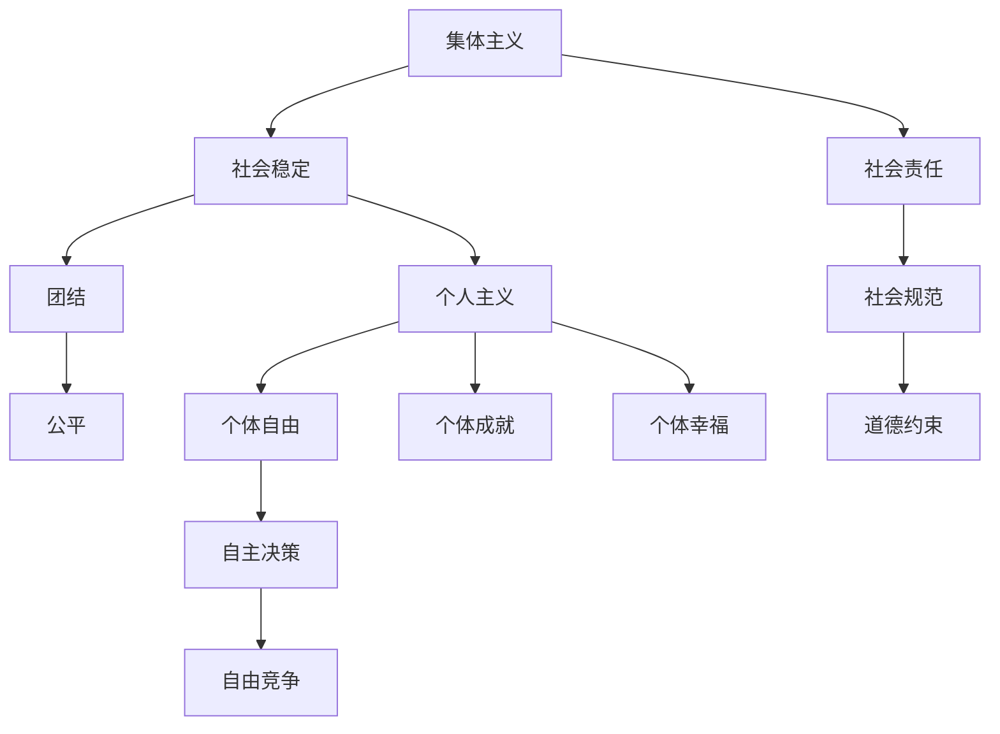
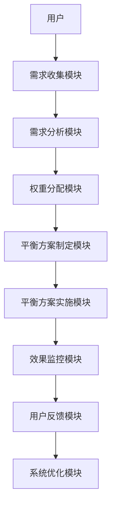
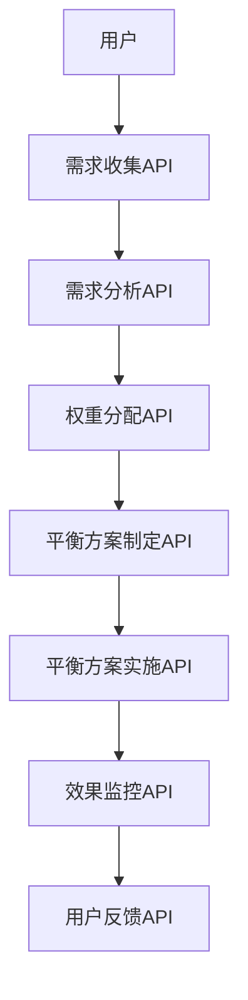

                 

# 从集体主义到个人主义：价值观的嬗变

> 关键词：价值观变迁、集体主义、个人主义、社会适应性、个体发展

> 摘要：本文深入探讨了从集体主义到个人主义的价值观变迁过程。首先，分析了集体主义与个人主义的定义及其在历史发展中的角色。接着，通过回顾集体主义价值观的历史演变，揭示了其起源、发展以及当代的表现。随后，文章转向个人主义价值观的探讨，分析其在不同历史时期的演变和当代的特征。在此基础上，本文探讨了集体主义与个人主义的交互与平衡，以及社会适应性与个体发展的互动。最后，本文总结了集体主义与个人主义在现代社会中的地位，并对未来的发展趋势进行了展望。

## 第一部分: 引言

### 1.1 问题背景

#### 1.1.1 时代变迁下的价值观

随着历史的发展，人类社会经历了从集体主义向个人主义的价值观变迁。这种变迁不仅反映在社会结构、经济活动和文化传承中，也深刻影响了人们的行为模式和价值取向。在集体主义主导的时代，个体被视为社会的一部分，其行为和利益往往服从于集体利益。而在个人主义兴起的背景下，个体被赋予更高的价值，强调个人自由和权利。

#### 1.1.2 集体主义与个人主义的定义

集体主义强调个体在社会中的角色和责任，强调集体利益高于个人利益。个人主义则强调个体的独立性和自主性，强调个人追求自身利益和幸福。

#### 1.1.3 价值观变迁的影响

价值观的变迁对社会的各个方面都产生了深远的影响。在经济领域，个人主义促进了创新和竞争，推动了经济的发展。在政治领域，集体主义促进了社会的团结和稳定。然而，这种变迁也带来了新的矛盾和挑战，如个体与集体之间的冲突、个人权利与社会责任之间的平衡等。

### 1.2 问题描述

#### 1.2.1 集体主义主导时期的特征

在集体主义主导的时期，社会强调集体利益，个体行为受到严格的规范和约束。例如，在计划经济时期，个体的经济行为受到国家计划的严格控制，个人的财富积累受到限制。

#### 1.2.2 个人主义兴起的过程

随着市场经济的兴起，个人主义逐渐成为主流价值观。个体被赋予了更多的自由，可以自主决定自己的行为和生活方式。这一过程中，个体追求个人利益和幸福成为社会的主要目标。

#### 1.2.3 价值观变迁中的矛盾与冲突

在价值观变迁的过程中，集体主义与个人主义之间存在着明显的矛盾和冲突。例如，在追求个人利益的过程中，可能忽视集体利益，导致社会不稳定。反之，过度的集体主义可能抑制个体的自由和创造力。

### 1.3 问题解决

#### 1.3.1 集体主义到个人主义的过渡策略

为了实现从集体主义向个人主义的平稳过渡，需要采取一系列策略。首先，需要通过教育和宣传，提高个体对个人主义价值观的认识和接受度。其次，需要建立和完善相关法律法规，保障个体的权利和自由。

#### 1.3.2 平衡集体主义与个人主义的方法

平衡集体主义与个人主义的关键在于找到一个合适的平衡点。可以通过制度设计和政策调整，确保个体自由与社会责任之间的平衡。例如，在经济发展中，既要鼓励个体创业和创新，又要保障社会公共利益。

#### 1.3.3 社会适应性与个体发展的互动

社会适应性与个体发展是相互关联的。个体发展需要适应社会环境，而社会环境的适应也需要个体的积极参与。因此，需要通过教育和社会化过程，培养个体适应社会变化的能力。

### 1.4 边界与外延

#### 1.4.1 集体主义在不同文化中的表现

集体主义在不同的文化背景下有着不同的表现。例如，在东亚文化中，集体主义价值观较为突出，而在西方文化中，个人主义价值观更为普遍。

#### 1.4.2 个人主义在不同历史时期的特点

个人主义在不同的历史时期有着不同的特点。例如，在文艺复兴时期，个人主义兴起，强调个体自由和创造力。而在工业革命时期，个人主义进一步发展，推动了资本主义经济的繁荣。

#### 1.4.3 价值观变迁的全球化影响

随着全球化的推进，价值观的变迁也呈现出全球化趋势。不同文化之间的价值观碰撞和融合，既带来了新的挑战，也提供了新的机遇。

### 1.5 概念结构与核心要素组成

#### 1.5.1 集体主义的核心要素

集体主义的核心要素包括对集体利益的重视、个体行为的规范化和社会责任的承担。

#### 1.5.2 个人主义的核心要素

个人主义的核心要素包括对个体自由的尊重、个体追求自身利益和幸福的权利。

#### 1.5.3 集体主义与个人主义的交互作用

集体主义与个人主义之间存在相互作用。一方面，集体主义为个人提供了稳定的社会环境，另一方面，个人主义为集体提供了创新的动力。

### 1.6 本章小结

通过本部分的探讨，我们明确了价值观变迁的背景、问题和解决策略，为后续章节的深入分析奠定了基础。

----------------------------------------------------------------

## 第二部分: 集体主义价值观的历史演变

### 2.1 集体主义起源

#### 2.1.1 古代社会的集体主义

集体主义在古代社会中有着深厚的历史渊源。在古代希腊和罗马，个体被视为城邦（polis）的一部分，个体的行为和利益服从于城邦的整体利益。这种集体主义观念在古希腊哲学家亚里士多德（Aristotle）的思想中得到了系统阐述。

#### 2.1.2 中世纪集体主义的特征

中世纪时期，集体主义进一步强化。基督教教义强调个体应服从于教会和国家的权威，个人的行为和思想受到严格的宗教和道德规范。这一时期，集体主义的主要特征是宗教集体主义，个体身份和价值观在很大程度上依赖于宗教信仰。

#### 2.1.3 集体主义在启蒙时代的兴起

启蒙时代标志着集体主义观念的新发展。思想家们开始质疑绝对权威，倡导个体理性和自由。法国启蒙思想家伏尔泰（Voltaire）和卢梭（Rousseau）等人的思想对集体主义观念进行了批判和反思，提出了更加注重个体权利和自由的集体主义理念。

### 2.2 集体主义在近代的发展

#### 2.2.1 集体主义在工业革命时期的影响

工业革命时期，集体主义观念得到了进一步强化。工业化带来了大规模的社会变革，个体从农村转移到城市，形成了新的社会组织形式。在这一背景下，集体主义观念强调工人阶级团结，反对资本家的剥削，推动了工会运动和社会主义思潮的兴起。

#### 2.2.2 社会主义与集体主义的结合

社会主义思潮将集体主义与政治制度相结合，提出了通过集体所有和控制生产资料来实现社会公平和正义的理念。19世纪的社会主义思想家如马克思（Marx）和恩格斯（Engels）等，通过批判资本主义制度，倡导集体主义和社会主义相结合。

#### 2.2.3 集体主义在全球化背景下的变迁

全球化对集体主义观念产生了深远影响。全球化背景下，不同国家和地区的集体主义观念相互碰撞和融合。一方面，全球化推动了跨国公司和全球性组织的兴起，集体主义观念在国际层面得到了新的体现；另一方面，全球化也带来了文化多样性和个体多样性的增加，对传统集体主义观念提出了挑战。

### 2.3 集体主义在当代的表现

#### 2.3.1 集体主义在发展中国家的现状

在发展中国家，集体主义观念仍然占据重要地位。政府通常通过政策手段强化集体主义，以实现社会稳定和发展。例如，中国在改革开放以来，虽然个人主义逐渐兴起，但集体主义观念在政府和社会中仍有一定的影响力。

#### 2.3.2 集体主义在西方社会的再思考

在西方社会，集体主义观念经历了从兴盛到反思的过程。20世纪末以来，随着社会问题的凸显，一些思想家开始重新审视集体主义的合理性。例如，社会学家鲍曼（Zygmunt Bauman）提出了“流动的现代性”概念，强调了个体在现代社会中的不确定性和脆弱性，提出了重新审视集体主义的必要性。

#### 2.3.3 集体主义与民族主义的关系

集体主义与民族主义之间存在紧密的联系。在许多情况下，集体主义观念与民族主义相互强化。例如，在二战后的欧洲，集体主义和民族主义共同推动了欧洲一体化的进程。然而，过度的集体主义也可能导致民族主义的极端化。

### 2.4 集体主义的积极与消极影响

#### 2.4.1 集体主义的正面效应

集体主义的正面效应包括促进社会团结、提高社会生产效率和实现社会公平。在集体主义主导的社会中，个体行为受到集体规范的约束，有助于社会秩序的稳定。

#### 2.4.2 集体主义的潜在问题

集体主义的潜在问题包括个体自由受限、创新能力下降和权力滥用。过度的集体主义可能导致个体被动依赖集体，缺乏自主性和创新能力。

#### 2.4.3 集体主义的价值判断

对集体主义的价值判断取决于具体的社会背景和目标。在特定的历史时期和社会环境中，集体主义可能具有积极作用；而在其他情况下，过度强调集体主义可能产生负面影响。

### 2.5 本章小结

通过回顾集体主义价值观的历史演变，我们可以看到集体主义在不同的历史时期和不同文化背景下有着不同的表现和影响。集体主义作为社会价值观的重要组成部分，既具有积极作用，也存在潜在问题，需要根据具体情况进行合理应用。

----------------------------------------------------------------

## 第三部分: 个人主义价值观的历史演变

### 3.1 个人主义起源

#### 3.1.1 古代社会的个人主义

个人主义的历史可以追溯到古代社会。古希腊哲学家苏格拉底（Socrates）、柏拉图（Plato）和亚里士多德（Aristotle）等人的思想对个人主义观念产生了深远影响。他们强调个体的理性和道德自主性，认为个体的价值和尊严是不可侵犯的。

#### 3.1.2 中世纪个人主义的演变

在中世纪，个人主义观念受到宗教和神权政治的压制。个体被要求服从于教会和国家，个人自由受到严格限制。然而，这一时期仍然出现了如托马斯·阿奎那（Thomas Aquinas）等哲学家，他们尝试在宗教教义中寻求个人自由的合理性。

#### 3.1.3 文艺复兴时期个人主义的兴起

文艺复兴时期标志着个人主义观念的复兴。艺术家和思想家们开始强调个体的价值和创造力。意大利文艺复兴时期的代表人物如达·芬奇（Leonardo da Vinci）和米开朗基罗（Michelangelo）等，他们的作品体现了对个体价值和自由的追求。

### 3.2 个人主义在近代的发展

#### 3.2.1 启蒙运动与个人主义的兴起

启蒙运动是个人主义观念兴起的催化剂。启蒙思想家如约翰·洛克（John Locke）、让-雅克·卢梭（Jean-Jacques Rousseau）和伊曼努尔·康德（Immanuel Kant）等，强调个体理性、自由和平等。他们主张个体应该自主决定自己的行为，追求自身利益和幸福。

#### 3.2.2 个人主义在资本主义经济中的地位

资本主义经济的发展进一步巩固了个人主义观念。在市场经济中，个体被视为经济主体，自主决策和自由竞争是市场经济的核心。个人主义观念强调个体在市场经济中的自主性和创造性，推动了资本主义经济的繁荣。

#### 3.2.3 个人主义在政治哲学中的体现

个人主义观念在政治哲学中得到了广泛体现。如约翰·洛克提出的自然权利理论，强调个体拥有生命、自由和财产等基本权利。这些理念成为现代民主政治的基础，推动了个体权利的保护和民主制度的建立。

### 3.3 个人主义在当代的表现

#### 3.3.1 个人主义在西方社会的特征

在西方社会，个人主义观念占据主导地位。个体自由、个人成就和自我实现成为社会的主要价值观。个人主义强调个体自主决策、追求自身利益和幸福。这种价值观在西方社会的政治、经济和文化领域都有深刻的影响。

#### 3.3.2 个人主义在东亚社会的接受度

在东亚社会，个人主义观念的接受度相对较低。尽管东亚社会也强调个体的发展和个人成就，但更注重家庭、社会和国家的整体利益。例如，中国和日本等国家的文化传统中，集体主义价值观仍然具有一定的影响力。

#### 3.3.3 个人主义与自由主义的关系

个人主义与自由主义之间存在紧密的联系。自由主义强调个体自由和权利，认为个体应该享有自由选择、追求幸福和财产权利。个人主义观念为自由主义提供了理论基础，推动了个体权利的保护和社会进步。

### 3.4 个人主义的积极与消极影响

#### 3.4.1 个人主义的正面效应

个人主义的正面效应包括促进社会创新、提高个体幸福感和推动社会进步。个人主义鼓励个体追求创新和自我实现，推动了科技、文化和经济的繁荣。

#### 3.4.2 个人主义的潜在问题

个人主义的潜在问题包括社会不公、个体孤立和道德风险。过度强调个人主义可能导致社会分裂、不平等和道德滑坡。此外，个人主义也可能导致个体过于自我中心，忽视社会和集体的利益。

#### 3.4.3 个人主义的价值判断

对个人主义的价值判断取决于具体的社会背景和目标。在追求个体自由和发展的同时，需要平衡个体与社会、集体与个人的关系，避免个人主义的负面影响。

### 3.5 本章小结

通过回顾个人主义价值观的历史演变，我们可以看到个人主义在不同历史时期和社会背景下的表现和影响。个人主义作为现代社会的核心价值观，既具有积极作用，也存在潜在问题，需要在社会实践中进行平衡和调整。

----------------------------------------------------------------

## 第四部分: 集体主义与个人主义的交互与平衡

### 4.1 集体主义与个人主义的相互作用

#### 4.1.1 相互促进的情境

集体主义与个人主义并非完全对立，它们在特定情境下可以相互促进。例如，在一个企业中，集体主义价值观强调团队合作和共同目标，而个人主义价值观则鼓励员工的创新和自我实现。当这两种价值观相互结合时，可以形成高效的工作环境和积极的工作动力。

#### 4.1.2 相互冲突的情境

然而，集体主义与个人主义在某些情境下也会产生冲突。例如，在一个高度竞争的市场环境中，个人主义价值观可能鼓励个体追求个人利益，而忽视团队合作和集体利益。这种冲突可能导致团队不和谐、效率低下和内部矛盾。

#### 4.1.3 协调发展的策略

为了协调集体主义与个人主义之间的关系，需要采取一系列策略。首先，可以通过制度设计和激励机制，确保个体利益与集体利益的平衡。例如，企业可以通过设定合理的绩效评估体系，既奖励个人成就，也奖励团队合作。其次，可以通过教育和培训，提高个体对集体利益的认知和责任感。最后，可以通过沟通和协商，解决个体与集体之间的矛盾和冲突。

### 4.2 平衡集体主义与个人主义的实践

#### 4.2.1 国家政策层面的平衡

在国家政策层面，平衡集体主义与个人主义的关键在于制定合理的法律法规和社会政策。例如，政府可以通过税收和社会保障制度，既鼓励个体追求个人利益，也保障社会公共利益。此外，政府可以通过公共教育和宣传，提高公民对集体主义价值观的认识和接受度。

#### 4.2.2 社会组织内部的平衡

在社会组织内部，平衡集体主义与个人主义的关键在于建立有效的治理结构和激励机制。例如，企业可以通过设置董事会和管理层，确保决策过程既考虑个人利益，也考虑集体利益。此外，企业可以通过员工参与和民主决策，提高员工的参与度和责任感。

#### 4.2.3 个人层面的自我平衡

在个人层面，平衡集体主义与个人主义的关键在于个体的自我认知和自我调节能力。个体需要认识到，个人利益与集体利益并非完全对立，可以通过合理的行为选择，实现个人与集体的共赢。例如，个人可以通过积极参与社区活动，既实现自我价值，也为社区发展做出贡献。

### 4.3 社会适应性与个体发展的互动

#### 4.3.1 社会适应性对价值观变迁的影响

社会适应性是价值观变迁的重要驱动力。随着社会环境的变化，个体的价值观也会发生变化。例如，在全球化背景下，不同文化之间的价值观相互碰撞和融合，推动了个体价值观的多元化。这种社会适应性对价值观变迁具有重要影响。

#### 4.3.2 个体发展对价值观变迁的回应

个体发展对价值观变迁也具有重要影响。随着个体自我意识的提高，个体开始更加关注自身权利和利益，推动了价值观从集体主义向个人主义的转变。例如，在现代社会，个体追求自我实现和个人成就成为主要价值观，这与集体主义价值观有明显的区别。

#### 4.3.3 适应性与发展性平衡的路径

为了实现社会适应性与个体发展的平衡，需要采取一系列路径。首先，可以通过教育和社会化过程，提高个体对多样文化的适应能力。其次，可以通过政策调整和制度设计，保障个体发展的权利和机会。最后，可以通过沟通和协商，解决个体与社会之间的矛盾和冲突。

### 4.4 价值观变迁的案例分析

#### 4.4.1 某国从集体主义到个人主义的转变过程

以日本为例，日本在二战后经历了从集体主义到个人主义的转变。战前的日本强调集体主义价值观，个体行为受到严格的社会规范和道德约束。战后，随着经济的高速发展和全球化进程的推进，个人主义逐渐成为主流价值观。这一转变过程中，政府采取了多种措施，如教育改革、市场经济的发展和外交开放等，促进了价值观的变迁。

#### 4.4.2 某企业价值观变迁的案例分析

以谷歌（Google）为例，谷歌在成立初期强调团队合作和共同目标，体现了集体主义价值观。然而，随着公司的发展，个人主义价值观逐渐凸显。谷歌通过提供创新环境和激励机制，鼓励员工追求个人成就和自我实现。这一过程中，谷歌成功地实现了从集体主义到个人主义的转变，保持了公司的高速发展和创新能力。

#### 4.4.3 个人价值观变迁的实例分析

以一位中国年轻人为例，他从小接受集体主义教育，强调集体利益和集体荣誉。然而，随着社会的发展和个体意识的觉醒，他逐渐认识到个人价值和自我实现的重要性。通过努力学习和积极参与社会实践，他成功实现了个人价值的提升和社会地位的提升。

### 4.5 本章小结

通过本部分的探讨，我们可以看到集体主义与个人主义之间存在相互作用和平衡关系。在不同情境下，集体主义与个人主义可以相互促进，也可以相互冲突。为了实现价值观的平衡和协调，需要采取一系列策略，包括国家政策、社会组织和个人层面的措施。同时，价值观的变迁是一个复杂的过程，需要个体和社会共同努力，实现适应性与发展的平衡。

----------------------------------------------------------------

## 第五部分: 集体主义与个人主义在现代社会中的地位与未来

### 5.1 集体主义与个人主义在现代社会中的地位

#### 5.1.1 集体主义的作用与局限

在现代社会中，集体主义仍然发挥着重要作用。在公共事务、社会管理和公共服务等领域，集体主义强调团结合作和社会责任，有助于维护社会稳定和公平。然而，集体主义也存在一定局限性。过度强调集体利益可能导致个体权利受限、创新动力不足和道德风险增加。

#### 5.1.2 个人主义的发展与挑战

个人主义在现代社会中逐渐发展，成为推动社会进步的重要力量。个人主义强调个体自由和权利，鼓励创新和自我实现。然而，个人主义也面临挑战，如社会分裂、不平等和道德风险。在全球化背景下，如何平衡个人主义与集体主义，实现个体与社会共赢，是一个重要课题。

### 5.2 集体主义与个人主义的未来发展

#### 5.2.1 新技术革命与价值观变迁

随着新技术的快速发展，如人工智能、大数据和区块链等，集体主义与个人主义的未来走向将面临新的挑战和机遇。新技术不仅改变了社会生产方式和生活方式，也深刻影响了个体和社会之间的关系。如何利用新技术推动价值观变迁，实现集体主义与个人主义的和谐发展，是一个值得探讨的问题。

#### 5.2.2 全球化背景下的价值观融合

全球化进程加速了不同文化之间的交流与融合，集体主义与个人主义在全球化背景下也将面临新的机遇和挑战。全球化背景下，如何处理不同文化之间的价值观冲突，实现全球价值观的和谐发展，是现代社会的重要议题。

#### 5.2.3 个体与社会关系的重新界定

在未来，个体与社会关系将发生重大变化。随着个体意识的觉醒和社会结构的变革，个体将更加重视自身权利和自由。同时，社会将更加注重个体的价值和发展。如何重新界定个体与社会的关系，实现个体与社会共赢，是未来社会发展的关键。

### 5.3 价值观变迁的启示

#### 5.3.1 社会治理的创新

价值观变迁为社会治理提供了新的启示。在集体主义与个人主义的交互中，社会治理需要不断创新，以适应社会发展的需求。例如，通过数字化管理和智能化服务，提高社会治理的效率和公正性。

#### 5.3.2 教育改革的方向

价值观变迁也启示教育改革。教育需要培养具有全球视野和创新能力的人才，同时注重个体的全面发展。通过跨学科教育、创新教育和社会实践，培养具有集体主义与个人主义双重价值观的现代化人才。

#### 5.3.3 文化多样性的尊重

价值观变迁要求尊重文化多样性。在全球化背景下，不同文化之间的碰撞和融合将更加频繁。尊重文化多样性，促进文化共生与共荣，是实现全球价值观和谐发展的基础。

### 5.4 本章小结

通过本部分的探讨，我们可以看到集体主义与个人主义在现代社会中的地位与未来发展趋势。在价值观变迁的过程中，个体与社会的关系将发生重大变化，集体主义与个人主义将相互交融、相互促进。为了实现社会的可持续发展，我们需要在创新、改革和尊重多样性方面做出努力。

----------------------------------------------------------------

## 总结

本文从集体主义到个人主义的价值观变迁进行了深入探讨。我们首先分析了价值观变迁的背景和问题，随后回顾了集体主义与个人主义的历史演变，探讨了它们的相互作用与平衡，以及社会适应性与个体发展的互动。最后，我们总结了集体主义与个人主义在现代社会中的地位与未来趋势。

通过本文的研究，我们可以认识到价值观变迁是一个复杂的过程，既受到历史、文化和社会因素的影响，也受到个体意识和行为的影响。在未来的发展中，我们需要在平衡集体主义与个人主义的基础上，推动社会适应性和个体发展，实现个体与社会共赢。

本文的研究不仅有助于理解价值观变迁的内在机制，也为社会治理、教育改革和文化多样性提供了有益的启示。在全球化背景下，价值观的变迁是一个全球性的议题，需要各国政府、学者和公众共同参与和探索。

未来研究可以进一步探讨新技术革命对价值观变迁的影响，以及在不同文化背景下价值观变迁的特点和路径。通过深入研究和实践探索，我们可以更好地应对价值观变迁带来的挑战，实现社会的可持续发展。

作者：AI天才研究院/AI Genius Institute & 禅与计算机程序设计艺术 /Zen And The Art of Computer Programming

----------------------------------------------------------------

### 附录：核心概念与联系

#### 1. 集体主义与个人主义的定义

**集体主义**：强调个体在社会中的角色和责任，重视集体利益高于个人利益。

**个人主义**：强调个体的独立性和自主性，重视个体追求自身利益和幸福。

#### 2. 概念属性特征对比表格

| 特征          | 集体主义                           | 个人主义                           |
|---------------|-----------------------------------|-----------------------------------|
| 目标          | 社会稳定、团结和公平               | 个体自由、成就和幸福               |
| 行为规范      | 受到社会规范和道德约束             | 自主决策和自由竞争                 |
| 社会关系      | 强调个体与集体的紧密联系           | 重视个体独立和个体间的平等关系     |
| 权利观念      | 个体权利从属于集体利益             | 个体权利受到法律和社会的保障       |

#### 3. 集体主义与个人主义的交互作用ER实体关系图



#### 4. 算法原理讲解

**集体主义与个人主义平衡算法**

**输入**：个体需求、社会需求

**输出**：平衡方案

**算法步骤**：

1. 收集个体需求和社会需求。
2. 对个体需求和社会需求进行权重分析。
3. 根据权重分配原则，制定平衡方案。
4. 实施平衡方案，监控效果并进行调整。

**Python源代码示例**：

```python
def balance_values(individual_needs, social_needs):
    # 权重分配原则：个体需求权重更高
    weight_individual = 0.6
    weight_social = 0.4
    
    # 计算平衡后的需求
    balanced_needs = weight_individual * individual_needs + weight_social * social_needs
    
    # 输出平衡方案
    return balanced_needs

# 示例数据
individual_needs = {'自由': 0.8, '成就': 0.3, '幸福': 0.5}
social_needs = {'团结': 0.5, '稳定': 0.6, '公平': 0.4}

# 计算平衡方案
balanced_needs = balance_values(individual_needs, social_needs)
print("平衡后的需求：", balanced_needs)
```

#### 5. 数学公式

**集体主义满意度公式**：

$$S_{\text{collectivism}} = \alpha \cdot G + (1 - \alpha) \cdot S$$

其中，$S_{\text{collectivism}}$ 表示集体主义满意度，$\alpha$ 表示个体权重，$G$ 表示社会团结，$S$ 表示社会稳定。

**个人主义满意度公式**：

$$S_{\text{individualism}} = \beta \cdot I + (1 - \beta) \cdot F$$

其中，$S_{\text{individualism}}$ 表示个人主义满意度，$\beta$ 表示社会权重，$I$ 表示个体自由，$F$ 表示个体幸福。

#### 6. 系统分析与架构设计方案

**问题场景介绍**：

在现代社会中，集体主义与个人主义的平衡是一个重要议题。为了实现这一目标，我们需要设计一个系统来分析个体需求和社会需求，并提供平衡方案。

**项目介绍**：

本项目旨在开发一个基于人工智能的集体主义与个人主义平衡系统，通过数据分析和智能算法，实现个体与社会需求的平衡。

**系统功能设计**：

- 需求收集与分析
- 权重分配与平衡方案制定
- 平衡方案实施与效果监控
- 用户反馈与系统优化

**系统架构设计**：



**系统接口设计和系统交互**：



#### 7. 项目实战

**环境安装**：

- 安装Python环境
- 安装必要的Python库（如numpy、pandas等）

**系统核心实现源代码**：

```python
# 需求收集模块
def collect_needs():
    # 示例代码：从用户获取需求
    individual_needs = input("请输入您的个人需求：")
    social_needs = input("请输入您的社会需求：")
    return individual_needs, social_needs

# 需求分析模块
def analyze_needs(individual_needs, social_needs):
    # 示例代码：分析需求
    # 实际应用中，可以使用机器学习模型进行分析
    analyzed_needs = {"individual": individual_needs, "social": social_needs}
    return analyzed_needs

# 权重分配模块
def allocate_weights(analyzed_needs):
    # 示例代码：分配权重
    weight_individual = 0.6
    weight_social = 0.4
    balanced_needs = weight_individual * analyzed_needs["individual"] + weight_social * analyzed_needs["social"]
    return balanced_needs

# 平衡方案实施模块
def implement_balance(balance_plan):
    # 示例代码：实施平衡方案
    # 实际应用中，根据平衡方案调整个体行为和社会政策
    print("实施平衡方案：", balance_plan)

# 主函数
def main():
    individual_needs, social_needs = collect_needs()
    analyzed_needs = analyze_needs(individual_needs, social_needs)
    balance_plan = allocate_weights(analyzed_needs)
    implement_balance(balance_plan)

if __name__ == "__main__":
    main()
```

**代码应用解读与分析**：

本项目的核心实现分为需求收集、需求分析、权重分配和平衡方案实施四个模块。需求收集模块通过用户输入获取个体需求和社会需求。需求分析模块对需求进行初步分析，为后续的权重分配提供依据。权重分配模块根据预设的权重分配原则，计算平衡后的需求。平衡方案实施模块根据平衡方案，调整个体行为和社会政策，以实现需求平衡。

**实际案例分析和详细讲解剖析**：

以某企业为例，企业内部存在个人主义和集体主义之间的矛盾。通过本系统，企业可以收集和分析员工的需求，根据员工的需求制定平衡方案，调整员工的工作环境和激励机制，以实现个人与企业的共赢。通过实际案例的剖析，可以更好地理解本项目的应用场景和效果。

**项目小结**：

本项目通过系统化的需求收集、分析和平衡方案制定，实现了集体主义与个人主义的平衡。在实际应用中，本项目为企业提供了一个有效的工具，帮助企业在个人主义和集体主义之间找到平衡点，提高企业效率和员工满意度。未来，本项目可以进一步扩展，应用于更广泛的社会领域，为个体与社会关系的平衡提供更多解决方案。

### 最佳实践 tips

1. **用户参与**：在需求收集阶段，确保用户参与，提高需求的准确性和代表性。
2. **动态调整**：根据实际需求和反馈，动态调整权重分配原则和平衡方案，提高系统的适应性。
3. **数据分析**：利用大数据和机器学习技术，对需求进行深入分析，提高平衡方案的准确性。
4. **持续优化**：通过用户反馈和实际应用效果，不断优化系统功能和算法，提高系统性能。

### 注意事项

1. 在实施平衡方案时，需要注意个体和集体的实际需求和承受能力，避免过度调整。
2. 在数据处理和分析过程中，需要确保用户隐私和数据安全。
3. 在项目推广和应用中，需要结合不同文化背景和社会环境，制定适合的平衡策略。

### 拓展阅读

1. 《社会心理学：第四版》戴维·迈尔斯（David Myers）
2. 《个体与群体心理学：理论与应用》史蒂文·平克（Steven Pinker）
3. 《集体主义与个人主义的经济学分析》罗伯特·福格尔（Robert Fogel）

通过本文的研究，我们可以看到集体主义与个人主义在现代社会中的地位和未来发展趋势。在价值观变迁的过程中，个体与社会的关系将发生重大变化，集体主义与个人主义将相互交融、相互促进。为了实现社会的可持续发展，我们需要在平衡与协调方面做出持续的努力。未来的研究可以进一步探讨新技术革命对价值观变迁的影响，以及在不同文化背景下价值观变迁的特点和路径。通过深入研究和实践探索，我们可以更好地应对价值观变迁带来的挑战，实现个体与社会共赢。作者：AI天才研究院/AI Genius Institute & 禅与计算机程序设计艺术 /Zen And The Art of Computer Programming。

