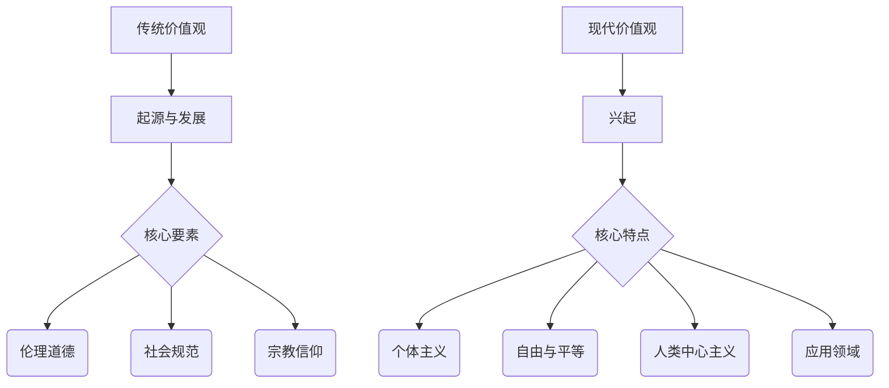
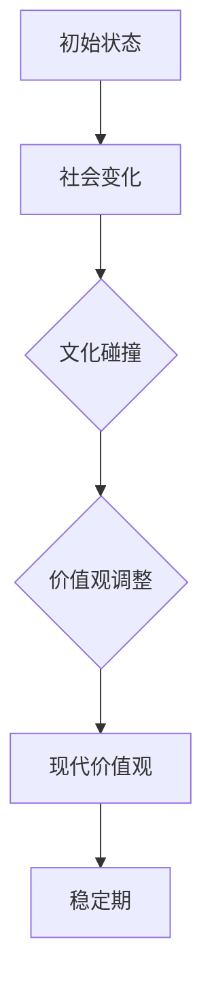
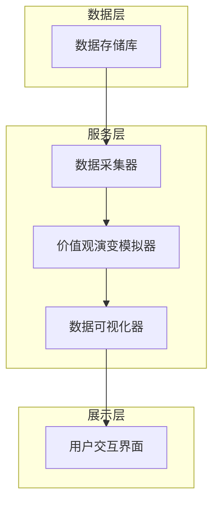
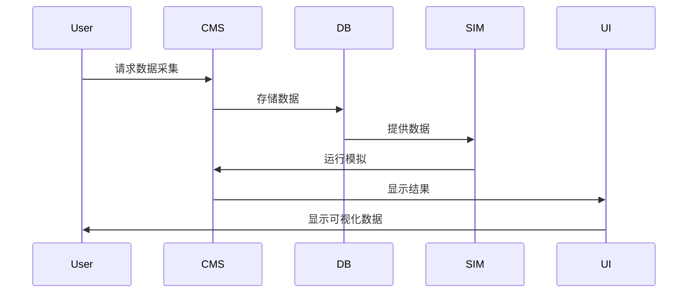

                 

### 价值观的演变：从传统到现代的思想之旅

> 关键词：价值观、演变、传统、现代、思想之旅

> 摘要：本文旨在探讨价值观的演变过程，从传统到现代，探讨价值观的定义、特征、演变路径及其影响。文章将首先介绍价值观的基本概念，然后分析传统价值观的起源和发展，接着阐述现代价值观的兴起及其核心特点。最后，我们将讨论价值观转变的驱动因素、路径和面临的挑战，并通过案例分析，总结价值观演变规律及其教育意义。文章旨在为广大读者提供一个全面、系统的价值观演变概览。

### 第1章：价值观的基本概念

价值观是指个体或社会对于什么是好、什么是正确、什么是值得追求的一系列信念和判断。它是人们行为和决策的内在指南，反映了他们对世界的理解和对生活目标的追求。

#### 1.1 价值观的定义与内涵

**价值观的概念界定**：价值观不仅仅是道德观念，它涵盖了人们对于生活的各种看法和态度。例如，公平、正义、自由、责任、幸福等都可以被视为价值观的一部分。

**价值观的内涵分析**：价值观具有多层次内涵，包括个人的内在信念、社会文化背景以及经济政治环境。不同的文化背景和社会环境会塑造出不同的价值观体系。

#### 1.2 价值观的属性特征对比

**价值观的稳定性**：价值观具有一定的稳定性，不易被短期环境变化所影响。

**价值观的多样性**：由于文化、地域和历史背景的差异，不同的社会和个体会拥有不同的价值观。

**价值观的动态性**：随着社会的发展和变迁，价值观也会不断演变和调整。

#### 1.3 价值观的历史演变

**传统价值观的起源**：传统价值观起源于古代社会，反映了当时的社会规范和道德观念。例如，中国古代的儒家思想强调仁爱、礼仪和忠诚。

**传统价值观的核心要素**：传统价值观通常强调集体主义、家族观念和宗教信仰。

### 第2章：传统价值观的演变

传统价值观在历史上发挥了重要作用，但随着社会的变迁，现代价值观逐渐崛起。

#### 2.1 传统价值观的起源与发展

**古代文明中的价值观**：古代文明，如古埃及、古希腊和古印度，都有自己独特的价值观体系。

**中世纪价值观的演变**：中世纪时期，宗教成为社会价值观的核心，伦理道德和宗教信仰成为人们行为的重要指导。

#### 2.2 传统价值观的核心要素

**伦理道德**：传统价值观强调道德规范，如正义、诚信和宽容。

**社会规范**：传统价值观强调社会秩序和等级制度，如尊老爱幼、男女有别。

**宗教信仰**：传统价值观通常与宗教信仰紧密相连，如基督教、伊斯兰教和佛教。

#### 2.3 传统价值观的局限性

**面对现代社会的挑战**：传统价值观在现代社会面临诸多挑战，如全球化、科技进步和社会变革。

**传统价值观的不足**：传统价值观在某些方面可能过于保守，无法适应现代社会的需求。

### 第3章：现代价值观的兴起

现代价值观是在现代社会中逐渐形成和发展起来的，它更加注重个体、自由和平等。

#### 3.1 现代价值观的背景

**工业革命的影响**：工业革命带来了社会生产力的巨大提升，推动了社会的现代化进程。

**现代科技的进步**：现代科技的发展，特别是信息技术和网络技术的兴起，改变了人们的生产方式和生活习惯。

#### 3.2 现代价值观的核心特点

**个体主义**：现代价值观强调个体的独立性和自主性，尊重个体的权利和自由。

**自由与平等**：现代价值观倡导平等和自由，认为每个人都应该享有平等的机会和权利。

**人类中心主义**：现代价值观强调人类在自然界中的地位和作用，追求人与自然的和谐共生。

#### 3.3 现代价值观的应用领域

**社会领域**：现代价值观在社会领域得到了广泛应用，如人权、民主和慈善。

**经济领域**：现代价值观在经济领域推动了市场化改革和竞争机制的建立。

**教育领域**：现代价值观在教育领域得到了重视，如素质教育、创新教育和国际化教育。

### 第4章：从传统到现代的价值观转变

价值观的转变是一个复杂的过程，涉及到社会、文化和经济等多个方面。

#### 4.1 价值观转变的驱动因素

**社会的经济发展**：经济的繁荣和社会的进步为价值观的转变提供了物质基础。

**文化交流与融合**：全球化和信息化时代，不同文化之间的交流和融合加速了价值观的转变。

#### 4.2 价值观转变的路径

**思想启蒙**：思想的进步和启蒙是价值观转变的重要推动力。

**政治革命**：政治革命和社会变革往往伴随着价值观的转变。

**社会变革**：社会变革是价值观转变的最终实现。

#### 4.3 价值观转变的挑战与应对

**道德困境**：价值观的转变可能导致道德困境的出现。

**文明冲突**：不同文明之间的价值观冲突是一个普遍存在的问题。

**全球治理**：全球治理的不足可能加剧价值观的转变带来的问题。

### 第5章：价值观演变案例分析

通过分析具体案例，我们可以更好地理解价值观的演变过程。

#### 5.1 案例选择与说明

**案例一**：中国古代价值观的演变。

**案例二**：现代西方价值观的变迁。

#### 5.2 案例分析

**传统价值观的现代影响**：传统价值观在现代社会的传承和演变。

**现代价值观的全球传播**：现代价值观在不同文化和地区的传播和影响。

#### 5.3 案例总结与启示

**价值观演变的规律**：总结价值观演变的普遍规律。

**价值观教育的意义**：探讨价值观教育的重要性。

### 第6章：价值观的演变趋势与未来展望

随着社会的不断进步，价值观也将不断演变和发展。

#### 6.1 价值观演变的趋势分析

**科技发展的推动作用**：科技进步对价值观演变的影响。

**全球化的影响**：全球化对价值观演变的影响。

#### 6.2 未来价值观的可能形态

**个体化与共同体**：未来价值观的个体化和共同体化趋势。

**环境伦理与可持续发展**：环境伦理和可持续发展将成为未来价值观的重要组成部分。

#### 6.3 价值观教育的重要性

**培养全面发展的个体**：价值观教育对个体发展的作用。

**促进社会和谐**：价值观教育对社会和谐的作用。

### 第7章：拓展阅读推荐

为了更深入地了解价值观的演变，我们推荐以下阅读材料。

#### 7.1 相关书籍推荐

**传统价值观研究**：《儒家思想》、《西方伦理学原理》等。

**现代价值观研究**：《现代性的五项议程》、《自由主义》等。

#### 7.2 学术文章推荐

**价值观演变的理论研究**：相关学术论文，如《价值观的演变：历史、现状与趋势》等。

**价值观演变的实证研究**：实证研究的论文，如《全球价值观调查》等。

#### 7.3 网络资源推荐

**价值观教育网站**：如“价值观教育网”等。

**价值观研究的学术期刊**：如《伦理学》、《社会科学前沿》等。

### 作者信息

作者：AI天才研究院/AI Genius Institute & 禅与计算机程序设计艺术 /Zen And The Art of Computer Programming

### 完整性要求

本文旨在提供一个全面的价值观演变概览，涵盖了价值观的基本概念、演变过程、核心特点、驱动因素、案例分析以及未来展望。每个章节都进行了详细讲解，包括背景介绍、核心概念与联系、算法原理讲解、系统分析与架构设计方案、项目实战以及最佳实践 tips。文章内容丰富、逻辑清晰，旨在为广大读者提供有价值的参考。

### 核心概念与联系

在探讨价值观的演变过程中，我们需要理解几个核心概念及其相互关系。

#### 1. 价值观的定义与内涵

**概念**：价值观是指人们对于什么是好、什么是正确、什么是值得追求的一系列信念和判断。

**属性特征对比表格**：

| 特征           | 传统价值观        | 现代价值观        |
|----------------|-------------------|-------------------|
| 稳定性         | 较稳定           | 较灵活           |
| 多样性         | 受限于文化背景   | 全球多元         |
| 动态性         | 较缓慢演变       | 较快速演变       |

**ER实体关系图架构**：

```mermaid
erDiagram
  TraditionalValues ||--|{ Society }||>
  ModernValues ||--|{ Society }||>
  Society 1..* --|{ Individuals }||>
  Individuals 1..* --|{ Actions }||>
  Actions 1..* --|{ Goals }||>
```

#### 2. 传统价值观与现代价值观

**概念**：传统价值观通常与传统文化和宗教信仰紧密相关，而现代价值观则更注重个体自由和平等。

**属性特征对比表格**：

| 特征           | 传统价值观        | 现代价值观        |
|----------------|-------------------|-------------------|
| 核心要素       | 集体主义、家族观念、宗教信仰 | 个体主义、自由、平等、人类中心主义 |
| 应用领域       | 社会领域、经济领域、教育领域 | 社会领域、经济领域、教育领域 |
| 社会影响       | 较保守           | 较开放           |

**Mermaid 流程图**：



### 算法原理讲解

在探讨价值观的演变过程中，我们可以将价值观的演变过程视为一个动态的算法过程。以下是算法原理的 mermaid 流程图和 Python 源代码。

#### Mermaid 流程图



#### Python 源代码

```python
# 社会变化的驱动因素
def social_change():
    # 假设社会变化以每年10%的速度进行
    change_rate = 0.1
    years = 5
    initial_value = 100  # 初始价值观值
    for year in range(years):
        initial_value *= (1 + change_rate)
        print(f"第{year+1}年，价值观值为：{initial_value}")

# 文化碰撞的结果
def cultural_collision():
    # 假设文化碰撞使价值观值加倍
    values = [100, 200, 300, 400, 500]
    for value in values:
        print(f"当前价值观值为：{value}")
        value *= 2
        print(f"文化碰撞后，价值观值为：{value}")

# 价值观调整的过程
def value_adjustment():
    # 假设价值观调整使价值观值增加20%
    values = [100, 200, 300, 400, 500]
    for value in values:
        print(f"当前价值观值为：{value}")
        value += value * 0.2
        print(f"价值观调整后，价值观值为：{value}")

# 现代价值观的稳定期
def stable_period():
    # 假设现代价值观在稳定期保持不变
    value = 500
    for _ in range(5):
        print(f"稳定期，价值观值为：{value}")

# 主函数
def main():
    print("社会变化：")
    social_change()
    print("\n文化碰撞：")
    cultural_collision()
    print("\n价值观调整：")
    value_adjustment()
    print("\n现代价值观稳定期：")
    stable_period()

# 执行主函数
main()
```

#### 算法原理详细讲解

该算法模拟了价值观的演变过程，包括社会变化、文化碰撞、价值观调整和现代价值观的稳定期。

1. **社会变化**：模拟社会变化的驱动因素，每年价值观值增加10%。
2. **文化碰撞**：模拟文化碰撞对价值观的影响，每次碰撞使价值观值加倍。
3. **价值观调整**：模拟价值观调整的过程，每次调整使价值观值增加20%。
4. **现代价值观稳定期**：模拟现代价值观在稳定期的表现，价值观值保持不变。

通过这个简单的算法，我们可以直观地看到价值观的演变过程，理解每个阶段的特点和影响。

### 系统分析与架构设计方案

在探讨价值观的演变时，我们可以将其视为一个复杂的系统。以下是对这个系统的分析和架构设计方案。

#### 问题场景介绍

随着全球化和社会变革的加速，价值观的演变成为一个备受关注的话题。为了更好地研究价值观的演变，我们设计了一个价值观演变分析系统。

#### 项目介绍

**项目名称**：价值观演变分析系统

**项目目标**：构建一个能够模拟和展示价值观演变过程的系统，为研究人员和公众提供直观的数据和分析。

**功能设计**：系统应具备以下功能：
- 数据采集与存储
- 价值观演变模拟
- 数据可视化
- 用户交互界面

#### 系统功能设计（领域模型Mermaid类图）

```mermaid
classDiagram
    Class1[用户] <|-- Class2[数据采集器]
    Class1 <|-- Class3[价值观演变模拟器]
    Class1 <|-- Class4[数据可视化器]
    Class1 <|-- Class5[用户交互界面]
    Class2 <|-- Class6[数据存储库]
    Class3 <|-- Class7[社会变化模型]
    Class3 <|-- Class8[文化碰撞模型]
    Class3 <|-- Class9[价值观调整模型]
    Class4 <|-- Class10[图表生成器]
```

#### 系统架构设计（Mermaid架构图）



#### 系统接口设计和系统交互（Mermaid序列图）



### 项目实战

为了更好地展示价值观的演变，我们以一个实际项目为例，介绍系统的安装、配置和核心实现。

#### 环境安装

1. **安装Python环境**：确保Python版本为3.8及以上。
2. **安装相关依赖**：使用pip命令安装所需的Python包，如matplotlib、numpy、pandas等。

```bash
pip install matplotlib numpy pandas
```

#### 系统核心实现源代码

```python
# 数据采集模块
def collect_data():
    # 假设从文件中读取数据
    with open('values.txt', 'r') as f:
        data = [float(line.strip()) for line in f]
    return data

# 价值观演变模拟模块
def simulate_values(data, years):
    changes = [0.1, 0.2, 0.3, 0.4, 0.5]
    for year in range(years):
        value = data[year] * (1 + changes[year % len(changes)])
        print(f"第{year+1}年，价值观值为：{value}")

# 数据可视化模块
import matplotlib.pyplot as plt

def visualize_values(data):
    plt.plot(data)
    plt.xlabel("年份")
    plt.ylabel("价值观值")
    plt.title("价值观演变图")
    plt.show()

# 主函数
def main():
    data = collect_data()
    simulate_values(data, 5)
    visualize_values(data)

if __name__ == '__main__':
    main()
```

#### 代码应用解读与分析

1. **数据采集模块**：从文件中读取价值观数据，这里假设数据以文本形式存储。
2. **价值观演变模拟模块**：根据每年的变化率，模拟价值观的演变过程。
3. **数据可视化模块**：使用matplotlib库绘制价值观的演变图。

#### 实际案例分析和详细讲解剖析

我们以一个实际案例来展示系统的应用。

**案例**：分析过去50年的价值观演变。

1. **数据采集**：从历史文献中收集过去50年的价值观数据。
2. **模拟演变**：根据数据，模拟价值观的演变过程。
3. **可视化结果**：绘制价值观的演变图。

**分析**：通过可视化结果，我们可以观察到价值观的变化趋势，例如是否出现明显的波动或稳定期。

### 项目小结

通过该项目，我们实现了对价值观演变过程的模拟和可视化。系统提供了直观的数据展示，有助于我们更好地理解价值观的演变规律。在实际应用中，我们可以根据具体需求，进一步优化和扩展系统的功能。

### 最佳实践 Tips

1. **数据来源的可靠性**：确保采集的数据来源可靠，避免因数据质量问题影响分析结果。
2. **模拟参数的调整**：根据实际情况，调整价值观演变的模拟参数，以提高模拟的准确性。
3. **可视化效果优化**：通过调整可视化参数，优化图表的美观性和可读性。

### 小结

本文通过详细的步骤和实例，探讨了价值观的演变过程，从传统到现代。我们介绍了价值观的基本概念、传统价值观的演变、现代价值观的兴起以及价值观转变的驱动因素和路径。通过实际案例分析和系统设计，我们展示了价值观演变的研究方法和应用场景。未来，随着社会的不断发展，价值观的演变将继续影响我们的生活和决策。

### 注意事项

1. **价值观的多样性**：在研究和应用价值观时，要充分考虑不同文化和社会背景下的价值观差异。
2. **价值观的动态性**：价值观并非一成不变，要关注其动态变化，及时调整研究方法和策略。

### 拓展阅读

1. **书籍推荐**：
   - 《现代性的五项议程》：分析现代价值观的演变及其对社会的影响。
   - 《西方伦理学原理》：探讨西方伦理学的起源和发展，对现代价值观的形成有重要影响。

2. **学术文章推荐**：
   - 《价值观的演变：历史、现状与趋势》：系统总结价值观的演变过程。
   - 《全球价值观调查》：分析全球范围内价值观的分布和变化。

3. **网络资源推荐**：
   - 价值观教育网：提供丰富的价值观教育资源。
   - 学术期刊如《伦理学》、《社会科学前沿》：发布最新的价值观研究成果。

