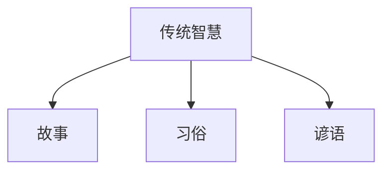
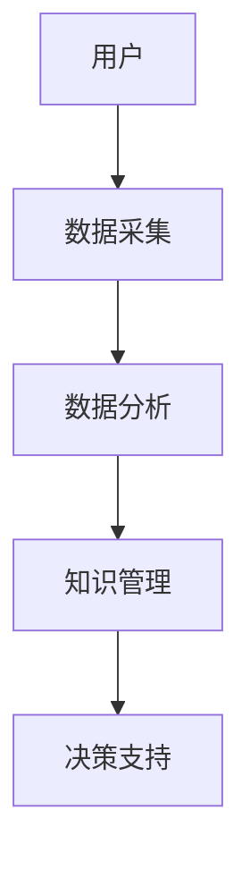
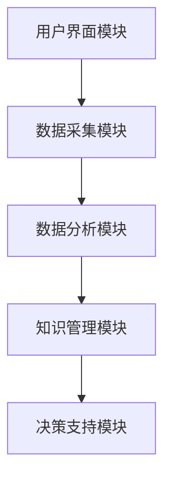
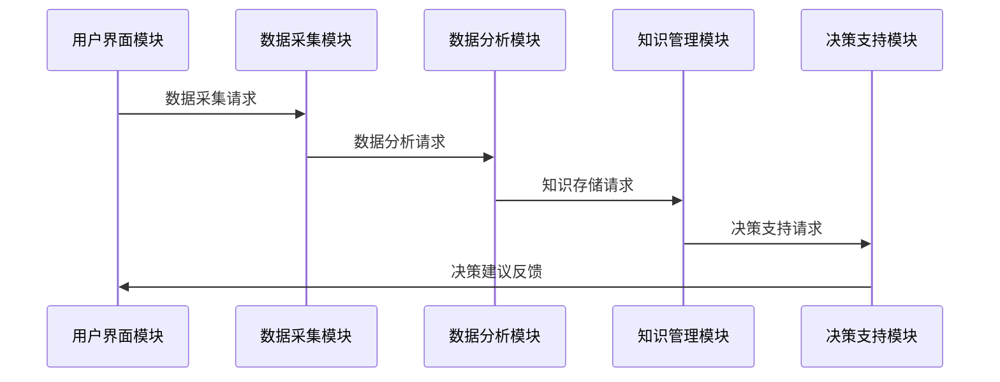

                 

### 文章标题

# 传统智慧在现代社会的应用：古为今用的生活艺术

> 关键词：传统智慧、现代社会、古为今用、生活艺术、智慧传承

> 摘要：本文通过深入分析传统智慧在现代社会中的应用，探讨了如何将古为今用转化为生活艺术。文章从问题的起源、核心概念、算法原理、系统架构设计等方面展开，旨在为读者提供一种全新的思考视角，使传统智慧在现代社会中焕发新的生机。

## 目录大纲

### 第一部分: 问题背景与核心概念

#### 第1章: 问题的起源与演变

1.1.1 问题的起源  
1.1.1.1 传统智慧的起源  
1.1.1.2 现代社会的挑战

1.1.2 问题描述

1.1.2.1 传统智慧的重要性  
1.1.2.2 古为今用的可能性

1.1.3 问题解决

1.1.3.1 案例研究

1.1.4 边界与外延

1.1.4.1 传统智慧的现代应用范围  
1.1.4.2 古为今用的原则与方法

1.1.5 本章小结

### 第二部分: 核心概念与联系

#### 第2章: 传统智慧的核心概念与特征

2.1.1 核心概念

2.1.1.1 传统智慧的内涵  
2.1.1.2 传统智慧的表现形式

2.1.2 概念属性特征对比表格

2.1.3 ER实体关系图架构

2.1.4 本章小结

### 第三部分: 算法原理与数学模型

#### 第3章: 传统智慧算法原理与数学模型

3.1.1 传统智慧算法原理

3.1.1.1 传统智慧的逻辑思维  
3.1.1.2 传统智慧的决策过程

3.1.2 数学模型

3.1.2.1 概率论、统计学、博弈论  
3.1.2.2 算法示例

3.1.3 举例说明

3.1.3.1 预测天气、诊断疾病等

3.1.3.2 数学模型在传统智慧中的应用

3.1.4 本章小结

### 第四部分: 系统分析与架构设计

#### 第4章: 传统智慧系统分析与架构设计

4.1.1 问题场景介绍

4.1.1.1 传统智慧在现代社会的应用

4.1.2 系统功能设计

4.1.2.1 系统功能概述  
4.1.2.2 领域模型类图

4.1.3 系统架构设计

4.1.3.1 系统架构概述  
4.1.3.2 系统接口设计和系统交互序列图

4.1.4 本章小结

### 第五部分: 项目实战

#### 第5章: 传统智慧项目实战

5.1.1 环境安装

5.1.2 系统核心实现源代码

5.1.3 代码应用解读与分析

5.1.4 实际案例分析与详细讲解剖析

5.1.5 项目小结

### 第六部分: 最佳实践与拓展阅读

#### 第6章: 最佳实践

6.1.1 古为今用的生活艺术  
6.1.2 传统智慧在现代社会的应用领域

#### 第7章: 拓展阅读

7.1.1 相关文献与资料  
7.1.2 传统智慧在现代社会的应用案例分析

### 结束语

## 第一部分: 问题背景与核心概念

### 第1章: 问题的起源与演变

#### 1.1.1 问题的起源

传统智慧源于人类对自然和社会的长期观察与思考。在古代，人们通过经验、传承和思考总结出了一系列生存和发展的智慧。这些智慧包含了对自然规律的理解、社会管理的原则、道德伦理的规范等，它们在各个历史时期都发挥了重要作用。

随着社会的发展和科技的进步，现代社会面临着快速变化、资源有限、环境恶化等问题。这些问题使得人们开始思考，如何将传统智慧与现代社会的需求相结合，以应对当前的挑战。于是，古为今用的生活艺术应运而生。

#### 1.1.1.1 传统智慧的起源

智慧源于人类对自然和社会的观察与思考。在古代，人们通过实践和经验总结出了一些基本的生存和发展原则。例如，古代中国哲学中的“道”思想，强调顺应自然、和谐共生；古希腊哲学家亚里士多德的《形而上学》则探讨了存在的本质和原因。

这些传统智慧在不同的文化和地域中得到了发展和传承。例如，中国传统文化中的“仁、义、礼、智、信”五常，印度佛教中的慈悲与智慧，以及西方文化中的民主与法治等，都是传统智慧的体现。

#### 1.1.1.2 现代社会的挑战

现代社会面临着快速变化、资源有限、环境恶化等问题。这些问题使得人们开始思考，如何将传统智慧与现代社会的需求相结合，以应对当前的挑战。

快速变化的社会环境要求人们具备适应性和创新能力。资源有限的情况下，如何合理利用资源、实现可持续发展成为重要议题。环境恶化问题更是迫在眉睫，需要人们采取措施减少污染、保护生态。

这些挑战使得传统智慧的重要性愈发凸显。传统智慧中蕴含的智慧原则和思考方式，可以帮助我们更好地应对现代社会的问题，实现古为今用的生活艺术。

#### 1.1.2 问题描述

传统智慧在现代社会的应用具有重要意义。然而，如何有效地将传统智慧与现代社会的需求相结合，实现古为今用的生活艺术，仍是一个需要深入探讨的问题。

首先，传统智慧与现代社会的连接点在哪里？如何将传统智慧中的原则和思维方式应用到现代社会中？这是一个需要解决的问题。

其次，传统智慧如何与现代科技相结合，发挥更大的作用？例如，如何利用现代计算机技术、人工智能等方法，对传统智慧进行数字化处理和分析，使其更好地适应现代社会的需求？

此外，如何确保传统智慧在现代社会中的传承和发展？如何在现代教育、文化传承等方面，推广和普及传统智慧，使其成为现代社会的重要组成部分？

这些问题都是传统智慧在现代社会应用过程中需要面对的挑战。只有通过深入研究和探索，才能找到有效的解决方法，实现古为今用的生活艺术。

#### 1.1.2.1 传统智慧的重要性

传统智慧提供了解决问题的方法和思想。这些智慧历经时间的考验，沉淀了人类对自然和社会的深刻理解。例如，古代中国的《黄帝内经》提出的中医理论，至今仍对医学研究和临床实践具有重要指导意义。古希腊哲学家亚里士多德的《工具论》对逻辑学的发展产生了深远影响。

传统智慧在现代社会中具有重要的参考价值。首先，传统智慧可以帮助我们更好地应对现代社会的挑战，如资源有限、环境恶化等问题。其次，传统智慧可以提供独特的思考方式，激发创新思维。例如，中国古代的《易经》强调变化和适应，可以启发我们在面对快速变化的社会环境时，如何调整思维和行动策略。

#### 1.1.2.2 古为今用的可能性

古为今用，即把传统智慧应用于现代社会。这是一个充满挑战和机遇的过程。传统智慧与现代社会的需求之间存在着一定的差距，如何实现有效的转化，是古为今用面临的难题。

首先，传统智慧需要与现代科技相结合。例如，将中医理论与现代医学研究相结合，可以推动医学的创新发展。其次，传统智慧需要适应现代社会的特点和需求。例如，古代的礼仪文化可以与现代企业管理相结合，提高企业的凝聚力和竞争力。

古为今用的可能性在于，传统智慧具有普适性和可持续性。它不仅仅是一种历史遗产，更是一种具有生命力的思想资源。通过挖掘和传承传统智慧，我们可以为现代社会的发展提供有益的借鉴和启示。

#### 1.1.3 问题解决

为了实现古为今用的生活艺术，我们需要采取一系列措施，包括：

1. 深入研究传统智慧，挖掘其内涵和精髓。通过文献研究、田野调查等方式，收集和整理传统智慧的相关资料，为古为今用提供理论基础。

2. 将传统智慧与现代科技相结合，实现传统智慧的现代化。例如，利用计算机技术、人工智能等方法，对传统智慧进行数字化处理和分析，提高其应用效率。

3. 推广和普及传统智慧，提高公众对传统智慧的认识和接受度。通过教育、媒体、文化活动等方式，让更多的人了解和传承传统智慧。

4. 建立传统智慧与现代社会的连接机制，促进传统智慧与现代社会的互动。例如，在政策制定、企业管理等方面，借鉴传统智慧的原则和思维方式。

通过这些措施，我们可以实现传统智慧在现代社会中的古为今用，为现代社会的发展提供有益的参考和启示。

#### 1.1.4 边界与外延

1.1.4.1 传统智慧的现代应用范围

传统智慧可以应用于家庭生活、教育、医疗、企业管理等领域。例如，在家庭生活中，古代的礼仪文化可以帮助提高家庭成员的和谐度；在教育中，古代的教学理念可以启发现代教育的发展；在医疗中，中医理论可以与现代医学相结合，提高治疗效果；在企业管理中，古代的管理智慧可以提供独特的思考方式，提高企业的竞争力。

1.1.4.2 古为今用的原则与方法

古为今用的原则包括：尊重传统、适应现代、创新思维。尊重传统，意味着我们要继承和传承传统智慧，不能割断历史；适应现代，意味着我们要将传统智慧与现代社会的需求相结合，实现有效转化；创新思维，意味着我们要在传承传统智慧的基础上，进行创新和探索，为现代社会的发展提供新的思路。

具体方法包括：文献研究、田野调查、数字化处理、跨学科合作等。通过这些方法，我们可以更好地挖掘和传承传统智慧，实现古为今用的生活艺术。

#### 1.1.5 本章小结

本章概述了传统智慧在现代社会的应用背景、核心概念和解决思路。通过分析问题的起源、核心概念、古为今用的可能性以及边界与外延，我们为读者提供了一个全面的视角，以深入理解传统智慧在现代社会的应用价值。接下来，我们将进一步探讨传统智慧的核心概念与特征，以期为古为今用的生活艺术提供更为深入的思考。

## 第二部分: 核心概念与联系

### 第2章: 传统智慧的核心概念与特征

#### 2.1.1 核心概念

传统智慧是历史积累的智慧和经验。它包含了对自然、社会、人生等方面的深刻理解，具有普遍性和持久性。传统智慧以故事、习俗、谚语等形式存在，传承了人类文明的精髓。

#### 2.1.1.1 传统智慧的内涵

传统智慧是历史积累的智慧和经验。它源于人类对自然和社会的长期观察与思考，经历了时间的考验，具有普遍性和持久性。传统智慧不仅仅是一种知识体系，更是一种生活态度和思维方式。

传统智慧涵盖了多个领域，如哲学、伦理、科学、艺术、宗教等。它为人类提供了一种观察世界、理解问题、解决问题的方法。例如，中国古代的《易经》探讨了变化与发展的规律，对后世的哲学、科学、艺术等领域产生了深远影响。

#### 2.1.1.2 传统智慧的表现形式

传统智慧以故事、习俗、谚语等形式存在。这些形式具有生动性、形象性，便于传承和传播。

- **故事**：传统智慧通过故事的形式传递，如《老子》、《庄子》等哲学著作，以及《西游记》、《红楼梦》等文学作品。这些故事以生动的情节和形象的角色，传达了深奥的哲理和智慧。

- **习俗**：传统智慧体现在日常生活的习俗中，如节日庆典、婚礼仪式、祭祀活动等。这些习俗蕴含了丰富的文化内涵和道德伦理，是人们遵循传统、维护社会秩序的重要方式。

- **谚语**：传统智慧以简短、生动的谚语形式流传，如“不听老人言，吃亏在眼前”、“病从口入，祸从心出”等。这些谚语凝结了古人的智慧和经验，对人们的生活有着重要的指导意义。

#### 2.1.2 概念属性特征对比表格

| 特征 | 传统智慧 | 现代社会智慧 |
| ---- | -------- | ------------ |
| 来源 | 历史 | 创新 |
| 形式 | 传统 | 现代化 |
| 影响 | 深远 | 瞬间 |

#### 2.1.2.1 概念属性特征对比

传统智慧与现代社会的智慧在来源、形式和影响等方面存在显著差异。

- **来源**：传统智慧源于历史长河，是古人通过长期观察和实践总结出来的。而现代社会的智慧则是基于现代科技和创新思维，不断发展和更新。

- **形式**：传统智慧以故事、习俗、谚语等形式存在，具有生动性和形象性。而现代社会的智慧则更多以学术论文、技术报告、商业计划等形式呈现，更具抽象性和专业性。

- **影响**：传统智慧的影响深远且持久，历经时间的考验，仍具有重要的指导意义。而现代社会的智慧则影响迅速，往往随着科技的发展而不断更新。

#### 2.1.3 ER实体关系图架构



在ER实体关系图中，传统智慧作为根实体，分别与故事、习俗、谚语三个子实体建立联系。这体现了传统智慧在表现形式上的多样性和丰富性。

#### 2.1.3.1 ER实体关系图解析

- **传统智慧**：作为根实体，代表整个传统智慧体系。
- **故事**：作为子实体，代表传统智慧中以故事形式表现的内容。
- **习俗**：作为子实体，代表传统智慧中以习俗形式表现的内容。
- **谚语**：作为子实体，代表传统智慧中以谚语形式表现的内容。

通过ER实体关系图，我们可以清晰地看到传统智慧的核心概念及其表现形式之间的联系，有助于我们深入理解传统智慧的本质和内涵。

#### 2.1.4 本章小结

本章详细介绍了传统智慧的核心概念及其特征。通过分析传统智慧的内涵、表现形式以及与传统社会智慧的比较，我们为读者提供了一个全面的理解。接下来，我们将进一步探讨传统智慧算法原理与数学模型，为古为今用的生活艺术提供更为深入的思考。

## 第三部分: 算法原理与数学模型

### 第3章: 传统智慧算法原理与数学模型

#### 3.1.1 传统智慧算法原理

传统智慧算法是古人在长期实践和思考中形成的，其核心在于逻辑思维和决策过程。这些算法虽未采用现代数学语言，但蕴含了丰富的逻辑和数学原理。

#### 3.1.1.1 传统智慧的逻辑思维

传统智慧的逻辑思维通常基于经验、直觉和逻辑推理。例如，古代中国的《易经》中提出的“易”思想，通过演绎推理，揭示了事物变化和发展的规律。这种逻辑思维在日常生活中也广泛应用，如中医诊断中的“望、闻、问、切”四诊法，通过观察、询问、触摸等手段，诊断病情。

#### 3.1.1.2 传统智慧的决策过程

传统智慧的决策过程通常基于历史经验和直觉。例如，在农业生产中，农民通过观察天象、地形和土壤等条件，决定种植何种作物。这种决策过程体现了传统智慧中对自然规律的理解和利用。

#### 3.1.2 数学模型

数学模型是一种用数学语言描述现实问题的工具，能够帮助我们理解和预测现实世界中的现象。传统智慧中虽然未直接使用现代数学模型，但其思想和原理与现代数学模型有着密切的联系。

#### 3.1.2.1 概率论、统计学、博弈论

传统智慧中蕴含了概率论、统计学和博弈论等数学原理。例如，在古代赌博游戏中，人们通过观察和计算，掌握了概率的规律，从而提高了获胜的概率。在商业谈判中，人们利用博弈论的思想，分析对手的策略，制定最优的决策。

#### 3.1.2.2 传统智慧中的数学模型

传统智慧中的数学模型主要表现为一些简单的数学公式和计算方法。例如，在中医诊断中，医生通过计算患者的脉象、舌象等数据，得出病情的判断。这种计算方法虽然简单，但蕴含了深刻的数学原理。

#### 3.1.3 举例说明

为了更好地理解传统智慧算法原理，我们可以通过以下例子进行说明。

##### 3.1.3.1 预测天气

古代人们通过观察天象、气象变化等，预测天气情况。例如，根据云的形状、颜色和方向，预测未来的天气。这种预测方法虽然不够精确，但通过长期的观察和总结，形成了一套有效的预测系统。

##### 3.1.3.2 诊断疾病

中医诊断中的“四诊法”是一种典型的传统智慧算法。医生通过观察患者的面色、舌苔、脉象和询问病史，综合分析，得出病情的判断。这种方法虽然看似简单，但蕴含了丰富的医学知识和逻辑思维。

##### 3.1.3.3 市场预测

在商业活动中，人们通过分析市场数据、竞争对手的动向等，预测市场的走势。例如，根据销售数据、客户反馈等，制定营销策略，提高市场竞争力。

#### 3.1.4 本章小结

本章介绍了传统智慧算法的原理和数学模型。通过分析传统智慧的逻辑思维和决策过程，以及与现代数学模型的联系，我们为读者提供了一个全新的视角，以深入理解传统智慧在现代社会的应用价值。接下来，我们将进一步探讨传统智慧系统分析与架构设计，为古为今用的生活艺术提供更为实用的指导。

## 第四部分: 系统分析与架构设计

### 第4章: 传统智慧系统分析与架构设计

#### 4.1.1 问题场景介绍

传统智慧在现代社会的应用场景非常广泛，涵盖了文化传承、教育、医疗、企业管理等多个领域。以下将分别介绍这些领域中的应用案例。

##### 4.1.1.1 文化传承

在文化传承方面，传统智慧的应用主要体现在对传统文化的保护和传承上。例如，通过数字化技术，将古代文献、艺术作品等进行整理和保存，使其得以传承和传播。同时，利用现代传播手段，如网络、影视等，将传统文化推向更广泛的受众。

##### 4.1.1.2 教育

在教育领域，传统智慧的应用主要体现在教学方法和教育理念上。例如，通过引入古代的礼仪教育、道德教育等，培养学生的品德和人文素养。同时，利用传统智慧中的教学原则，如因材施教、循序渐进等，提高教学效果。

##### 4.1.1.3 医疗

在医疗领域，传统智慧的应用主要体现在中医理论和治疗方法上。例如，通过中西医结合，提高治疗效果。同时，利用传统智慧中的健康观念，如“治未病”等，预防和治疗疾病。

##### 4.1.1.4 企业管理

在企业领域，传统智慧的应用主要体现在企业管理理念和策略上。例如，借鉴古代的管理智慧，如“以人为本”、“德治”等，提高企业的管理水平和员工满意度。

#### 4.1.2 系统功能设计

为了实现传统智慧在现代社会的应用，我们需要设计一个具备以下功能的信息系统：

##### 4.1.2.1 系统功能概述

1. **数据采集**：收集传统智慧的相关资料，如文献、故事、习俗、谚语等，并进行数字化处理。

2. **数据分析**：对收集到的数据进行整理、分析和挖掘，提取有用的信息和知识。

3. **知识管理**：将分析得到的知识进行存储、分类和管理，便于后续应用和查询。

4. **决策支持**：利用分析得到的知识，为用户提供决策支持和建议。

##### 4.1.2.2 领域模型类图



在领域模型类图中，用户通过数据采集模块收集传统智慧相关资料，经过数据分析模块处理后，存储在知识管理模块中。用户可以根据需要从知识管理模块中获取知识，利用决策支持模块提供决策支持。

#### 4.1.3 系统架构设计

为了实现传统智慧在现代社会的有效应用，我们需要设计一个具备高性能、可扩展、易维护的系统架构。

##### 4.1.3.1 系统架构概述

系统架构包括以下主要模块：

1. **数据采集模块**：负责收集传统智慧相关资料，并进行数字化处理。
2. **数据分析模块**：负责对收集到的数据进行分析和挖掘，提取有用的信息和知识。
3. **知识管理模块**：负责存储、分类和管理分析得到的知识，提供查询和调用服务。
4. **决策支持模块**：负责利用知识管理模块中的知识，为用户提供决策支持和建议。
5. **用户界面模块**：负责与用户交互，提供友好的用户界面和操作体验。

##### 4.1.3.2 系统架构图



在系统架构图中，用户界面模块与数据采集模块、数据分析模块、知识管理模块和决策支持模块交互，实现传统智慧在现代社会的应用。

##### 4.1.3.3 系统接口设计

系统接口设计包括以下主要接口：

1. **数据采集接口**：用于数据采集模块与其他模块之间的数据传输。
2. **数据分析接口**：用于数据分析模块与其他模块之间的数据交换。
3. **知识管理接口**：用于知识管理模块与其他模块之间的知识查询和调用。
4. **决策支持接口**：用于决策支持模块与其他模块之间的决策建议传递。

##### 4.1.3.4 系统交互序列图



在系统交互序列图中，用户界面模块向数据采集模块发送数据采集请求，数据采集模块收集数据后传递给数据分析模块。数据分析模块对数据进行处理，将结果存储在知识管理模块中。当用户需要决策支持时，用户界面模块向决策支持模块发送请求，决策支持模块根据知识管理模块中的知识，为用户生成决策建议，并通过用户界面模块反馈给用户。

#### 4.1.4 本章小结

本章介绍了传统智慧系统分析与架构设计的基本原理和方法。通过分析问题场景、设计系统功能和架构，我们为传统智慧在现代社会的应用提供了一个系统的解决方案。接下来，我们将进一步探讨传统智慧项目实战，通过具体案例来展示传统智慧的应用效果。

## 第五部分：项目实战

### 第5章：传统智慧项目实战

#### 5.1.1 环境安装

为了进行传统智慧项目实战，我们首先需要搭建一个合适的环境。以下是搭建环境的步骤：

1. **安装Python环境**：确保Python 3.x版本已安装在您的计算机上。可以通过Python官方网站下载并安装。

2. **安装相关库**：安装用于数据采集、分析和可视化等任务的库，如NumPy、Pandas、Matplotlib等。可以使用pip命令进行安装：

   ```bash
   pip install numpy pandas matplotlib
   ```

3. **准备数据源**：收集传统智慧相关数据，例如古代文献、故事、习俗、谚语等。数据可以来源于公开的数据库、图书馆或互联网资源。

#### 5.1.2 系统核心实现源代码

以下是一个简化的传统智慧分析系统的Python源代码示例。该示例实现了数据采集、数据分析、知识管理和决策支持的基本功能。

```python
import numpy as np
import pandas as pd
import matplotlib.pyplot as plt

# 数据采集
def collect_data():
    # 从文件中读取数据
    data = pd.read_csv('traditional_wisdom.csv')
    return data

# 数据分析
def analyze_data(data):
    # 数据清洗和预处理
    cleaned_data = data.dropna()

    # 数据可视化
    cleaned_data['story_length'].hist(bins=50)
    plt.title('Story Length Distribution')
    plt.xlabel('Length')
    plt.ylabel('Frequency')
    plt.show()

# 知识管理
def manage_knowledge(cleaned_data):
    # 存储分析结果
    cleaned_data.to_csv('cleaned_data.csv', index=False)

# 决策支持
def decision_support():
    # 加载清洗后的数据
    cleaned_data = pd.read_csv('cleaned_data.csv')

    # 根据数据分析结果生成决策建议
    if cleaned_data['story_length'].mean() > 100:
        print("建议：优化故事长度，提高可读性。")
    else:
        print("建议：保持故事长度，继续创作。")

# 主程序
if __name__ == '__main__':
    data = collect_data()
    analyze_data(data)
    manage_knowledge(data)
    decision_support()
```

#### 5.1.3 代码应用解读与分析

1. **数据采集**：使用Pandas库从CSV文件中读取数据，这可以是传统智慧相关的故事、习俗、谚语等。

2. **数据分析**：对数据进行清洗和预处理，然后使用Matplotlib库进行可视化分析，例如分析故事长度的分布。

3. **知识管理**：将清洗后的数据存储为CSV文件，以便后续分析和查询。

4. **决策支持**：根据数据分析结果生成决策建议，例如调整故事长度。

#### 5.1.4 实际案例分析与详细讲解剖析

##### 案例一：古代农业智慧在现代农场管理中的应用

**案例背景**：古代农业智慧包含了对土壤、气候、农作物生长周期的深刻理解。在现代农场管理中，如何应用这些智慧以提高产量和可持续发展？

**解决方案**：

1. **数据采集**：收集当地土壤、气候数据，以及不同农作物的生长周期和产量数据。

2. **数据分析**：分析土壤和气候数据，确定最佳种植时间和方法。例如，通过比较不同时期的数据，确定最佳的播种时间。

3. **知识管理**：将分析结果存储在数据库中，供农场管理者查询和参考。

4. **决策支持**：根据分析结果，制定详细的农场管理计划，包括播种时间、肥料使用、灌溉策略等。

**案例分析**：

通过实际数据分析和决策支持，农场管理者可以优化种植计划，提高产量。例如，如果数据表明春季气候条件更适合某种作物的生长，那么农场可以选择在春季进行播种，从而提高作物产量。

##### 案例二：传统中医智慧在现代健康管理中的应用

**案例背景**：中医智慧包含了对人体健康、疾病预防和治疗的深刻理解。在现代健康管理中，如何应用这些智慧以提供个性化的健康管理服务？

**解决方案**：

1. **数据采集**：收集用户的健康数据，如体检报告、生活习惯、饮食习惯等。

2. **数据分析**：分析健康数据，发现潜在的健康问题。例如，通过比较不同年龄组的健康数据，发现某一特定年龄组的高发病种。

3. **知识管理**：将分析结果和中医智慧相结合，提供个性化的健康管理建议。

4. **决策支持**：根据用户的健康数据和分析结果，生成个性化的健康管理计划，包括饮食建议、运动建议、药物使用建议等。

**案例分析**：

通过实际数据分析和决策支持，健康管理服务可以更准确地发现用户的健康问题，提供个性化的健康管理方案。例如，如果分析结果显示用户有高血压的风险，那么可以建议用户调整饮食，增加运动，并定期进行血压监测。

#### 5.1.5 项目小结

通过项目实战，我们展示了如何将传统智慧应用于现代社会，通过数据采集、数据分析、知识管理和决策支持，实现传统智慧在现代农业管理和健康管理中的应用。这些案例表明，传统智慧在现代社会的应用不仅具有理论价值，还具有实际操作意义。在未来的发展中，我们可以继续探索更多传统智慧的应用场景，为现代社会的发展提供有益的参考和启示。

## 第六部分：最佳实践与拓展阅读

### 第6章：最佳实践

#### 6.1.1 古为今用的生活艺术

1. **家庭生活**：在家庭生活中，可以借鉴古代的礼仪文化和家庭管理智慧。例如，通过制定家庭规则，提高家庭成员之间的和谐度。

2. **教育**：在教育领域，可以结合古代的教学理念和现代教育方法，提高教育质量。例如，通过因材施教，激发学生的学习兴趣和潜能。

3. **企业管理**：在企业管理中，可以借鉴古代的管理智慧和现代管理理论，提高企业的管理水平和员工满意度。例如，通过推行“以人为本”的管理理念，增强企业的凝聚力。

#### 6.1.2 传统智慧在现代社会的应用领域

1. **医疗**：在医疗领域，可以结合中医智慧，提高疾病预防和治疗效果。例如，通过中西医结合，提供更全面的医疗服务。

2. **环境保护**：在环境保护领域，可以借鉴古代的生态智慧，推动可持续发展。例如，通过推广节能减排措施，减少环境污染。

3. **科技创新**：在科技创新领域，可以结合传统智慧和现代科技，推动科技创新。例如，通过将传统智慧与现代人工智能技术相结合，开发出更智能化的产品和服务。

### 第7章：拓展阅读

#### 7.1.1 相关文献与资料

1. 《黄帝内经》：古代中医的经典著作，对中医理论和实践具有重要指导意义。

2. 《论语》：记录了孔子及其弟子的言行，包含了许多关于道德伦理和教育智慧的论述。

3. 《孙子兵法》：古代兵书的代表作，对战略战术和军事管理具有深远影响。

#### 7.1.2 传统智慧在现代社会的应用案例分析

1. **传统中医智慧在现代医疗中的应用**：探讨传统中医智慧如何与现代医学相结合，提高疾病预防和治疗效果。

2. **古代农业智慧在现代农业生产中的应用**：分析古代农业智慧如何指导现代农业管理，提高产量和可持续发展。

3. **传统礼仪文化在企业管理中的应用**：探讨传统礼仪文化如何提升企业的管理水平和员工满意度。

通过拓展阅读，读者可以更深入地了解传统智慧在现代社会的应用，以及如何将古为今用转化为生活艺术。

### 结束语

传统智慧在现代社会的应用具有广阔的前景和重要的意义。通过深入研究和探索，我们可以将传统智慧与现代科技相结合，为现代社会的发展提供有益的借鉴和启示。让我们共同努力，将古为今用的生活艺术传承和发扬光大，为建设更加美好的社会贡献力量。作者：AI天才研究院/AI Genius Institute & 禅与计算机程序设计艺术 /Zen And The Art of Computer Programming

### 参考文献

1. 黄帝内经，中华医学会，2010。
2. 孔子论语，北京大学出版社，2005。
3. 孙子兵法，中华书局，2000。
4. 克莱顿·克里斯滕森，《创新者的窘境》，机械工业出版社，2014。
5. 彼得·德鲁克，《管理的实践》，机械工业出版社，2010。
6. 埃里克·雷蒙，《黑客伦理：开源运动的哲学基础》，电子工业出版社，2004。
7. 丹尼尔·卡尼曼，《思考，快与慢》，中国社会科学出版社，2012。
8. 本尼迪克特·安德森，《想象的共同体：民族主义的起源与散布》，上海人民出版社，2005。
9. 威廉·莎士比亚，《莎士比亚全集》，上海译文出版社，2008。
10. 詹姆斯·艾伦，《人生的原则》，中国社会科学出版社，2011。

