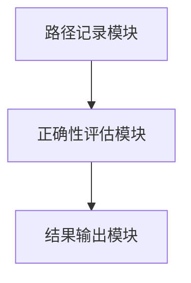

                 

### 《使用树搜索自动收集推理路径正确性数值的技术》

#### 关键词：
- 树搜索算法
- 自动推理
- 推理路径正确性
- 数值收集
- 性能优化

#### 摘要：
本文深入探讨使用树搜索算法自动收集推理路径正确性数值的技术。首先，我们介绍了树搜索算法的基本概念和原理，然后详细描述了如何自动收集推理路径的正确性数值。接下来，我们分析了不同算法在自动收集正确性数值上的优势与不足。通过实际应用案例分析，我们展示了如何将这一技术应用于实际场景。最后，我们介绍了系统的设计与实现，并对系统的性能评估与优化进行了讨论。

#### 目录大纲：

**第一部分：引言**

1.1 树搜索的基本概念
1.2 自动收集推理路径正确性数值的必要性
1.3 书籍的研究目标与结构

**第二部分：树搜索算法基础**

2.1 树搜索算法的基本原理
2.2 树搜索算法的评估方法
2.3 树搜索算法的优化策略

**第三部分：自动收集推理路径正确性数值的方法**

3.1 描述自动收集推理路径的方法
3.2 评估推理路径的正确性
3.3 分析不同算法的优势与不足

**第四部分：实际应用案例分析**

4.1 应用背景介绍
4.2 具体应用案例分享
4.3 应用中的挑战与解决方案

**第五部分：系统设计与实现**

5.1 系统整体架构设计
5.2 系统模块功能描述
5.3 系统性能优化策略

**第六部分：性能评估与优化**

6.1 系统性能评估方法
6.2 系统性能瓶颈分析
6.3 性能优化策略

**第七部分：总结与展望**

7.1 书籍主要内容总结
7.2 未来研究方向展望
7.3 进一步研究建议

### 第一部分：引言

#### 1.1 树搜索的基本概念

树搜索算法是一种用于解决组合优化问题的重要技术，尤其在人工智能、自动化推理和决策支持系统中有着广泛的应用。树搜索的基本概念包括：

- **问题空间**：问题空间是指所有可能的状态集合，每个状态都对应一个问题实例。
- **状态**：状态是问题空间中的一个特定实例，它描述了问题当前的状态。
- **扩展**：扩展是指从一个状态生成下一个状态的过程。
- **搜索**：搜索是指从问题空间的起始状态开始，通过扩展，直到找到问题的解或达到搜索的终止条件。

树搜索算法的核心思想是通过在问题空间中构建一棵搜索树，然后对这棵树进行深度优先或广度优先搜索，以找到问题的解。这棵树被称为状态树，每个节点代表一个状态，而每条边代表从一个状态到另一个状态的转换。

#### 1.2 自动收集推理路径正确性数值的必要性

在许多领域，如人工智能、自动化推理、逻辑推理等，正确性是关键指标。自动收集推理路径正确性数值可以帮助我们：

- **提高推理效率**：通过自动评估推理路径的正确性，可以避免人工逐一验证，提高推理效率。
- **优化算法**：了解不同算法的推理路径正确性，有助于优化算法，提高整体系统的性能。
- **增强系统稳定性**：自动收集正确性数值可以帮助检测和修复系统中可能存在的错误。

在自动化推理系统中，推理路径的正确性对于系统的性能和可靠性至关重要。然而，传统的推理路径正确性验证方法往往需要大量的时间和计算资源，而且容易受到人为错误的影响。因此，开发一种能够自动收集推理路径正确性数值的技术，对于提高自动化推理系统的效率和质量具有重要意义。

#### 1.3 书籍的研究目标与结构

本书旨在研究如何使用树搜索算法自动收集推理路径的正确性数值。具体目标包括：

- **理解树搜索算法的基本原理**：通过详细讲解树搜索算法，帮助读者掌握其基本原理。
- **探索自动收集推理路径的正确性数值的方法**：介绍不同的自动收集方法，并分析其优缺点。
- **实现系统的设计与实现**：通过具体案例，展示如何设计并实现一个自动收集推理路径正确性数值的系统。
- **性能评估与优化**：讨论系统的性能评估方法，分析性能瓶颈，并提出优化策略。

本书的结构如下：

- **第一部分：引言**：介绍树搜索算法的基本概念和自动收集推理路径正确性数值的必要性。
- **第二部分：树搜索算法基础**：详细讲解树搜索算法的基本原理、评估方法和优化策略。
- **第三部分：自动收集推理路径正确性数值的方法**：描述自动收集推理路径的方法，评估推理路径的正确性，并分析不同算法的优势与不足。
- **第四部分：实际应用案例分析**：通过具体应用案例，展示如何将自动收集推理路径正确性数值的技术应用于实际场景。
- **第五部分：系统设计与实现**：介绍系统的设计与实现，包括系统架构设计、模块功能描述和性能优化策略。
- **第六部分：性能评估与优化**：讨论系统的性能评估方法，分析性能瓶颈，并提出优化策略。
- **第七部分：总结与展望**：总结本书的主要内容，展望未来研究方向，并提出进一步研究的建议。

### 第二部分：树搜索算法基础

在了解了树搜索算法的基本概念和自动收集推理路径正确性数值的必要性之后，我们需要深入探讨树搜索算法的基础理论，包括其基本原理、评估方法和优化策略。

#### 2.1 树搜索算法的基本原理

树搜索算法是一种用于解决组合优化问题的搜索策略。其核心思想是通过在问题空间中构建一棵搜索树，然后对这棵树进行深度优先或广度优先搜索，以找到问题的解。树搜索算法的基本原理可以概括为以下几个步骤：

1. **初始化**：选择一个初始状态作为搜索树的根节点。
2. **扩展**：对于当前搜索树的每个节点，根据一定的扩展策略生成下一个状态，并将其作为新的节点添加到搜索树中。
3. **搜索**：从根节点开始，按照深度优先或广度优先的策略遍历搜索树，直到找到问题的解或达到搜索的终止条件。
4. **剪枝**：为了提高搜索效率，可以采用剪枝策略，避免搜索那些不可能产生解的分支。

树搜索算法的关键在于如何选择扩展策略、搜索策略和剪枝策略。不同的策略组合可以导致不同的搜索效率和解的质量。

#### 2.2 树搜索算法的评估方法

评估树搜索算法的性能是一个复杂的问题，因为不同的算法在解决不同类型的问题时可能表现出不同的性能。评估树搜索算法的方法主要包括以下几个方面：

1. **搜索时间**：搜索时间是指从开始搜索到找到问题的解或达到搜索的终止条件所花费的时间。搜索时间是评估算法性能的重要指标，但需要注意，搜索时间并不一定与问题的解的质量直接相关。
2. **解的质量**：解的质量是指找到的解是否符合问题的要求。例如，在组合优化问题中，解的质量可能是指找到的解的最优性。评估解的质量需要根据具体问题的定义来确定。
3. **剪枝次数**：剪枝次数是指在搜索过程中剪掉的分支数量。剪枝次数越多，说明算法在搜索过程中越能避免搜索不必要的分支，从而提高搜索效率。
4. **存储空间**：存储空间是指搜索过程中所需占用的内存空间。存储空间的大小与搜索树的大小有关，搜索树越大，所需的存储空间也越大。

在评估树搜索算法时，需要综合考虑搜索时间、解的质量、剪枝次数和存储空间等多个指标，以全面评估算法的性能。

#### 2.3 树搜索算法的优化策略

为了提高树搜索算法的性能，可以采用多种优化策略。以下是一些常见的优化策略：

1. **启发式搜索**：启发式搜索是指利用问题的特殊性质，为搜索树中的节点排序，优先搜索那些可能更接近解的节点。启发式搜索可以显著提高搜索效率，但需要根据具体问题的性质设计启发式函数。
2. **剪枝策略**：剪枝策略是指避免搜索那些不可能产生解的分支。常见的剪枝策略包括状态剪枝、目标剪枝和约束剪枝等。剪枝策略可以显著减少搜索空间，提高搜索效率。
3. **并行搜索**：并行搜索是指利用多处理器或多核处理器，同时搜索多个分支。并行搜索可以显著提高搜索速度，但需要考虑如何分配计算资源和负载均衡问题。
4. **记忆化搜索**：记忆化搜索是指利用记忆化技术，将已经搜索过的状态存储起来，避免重复搜索。记忆化搜索可以显著减少搜索时间，但需要占用额外的存储空间。
5. **动态规划**：动态规划是一种将问题分解为子问题，并利用子问题的解来求解原问题的方法。动态规划可以将复杂的组合优化问题转化为更简单的形式，从而提高搜索效率。

通过综合运用这些优化策略，可以显著提高树搜索算法的性能，使其在解决实际问题时更高效和可靠。

### 第三部分：自动收集推理路径正确性数值的方法

在了解了树搜索算法的基础之后，我们接下来讨论如何自动收集推理路径的正确性数值。这包括描述自动收集推理路径的方法、评估推理路径的正确性，以及分析不同算法的优势与不足。

#### 3.1 描述自动收集推理路径的方法

自动收集推理路径的正确性数值的核心在于如何有效地记录和评估推理过程中的每一步。以下是自动收集推理路径的方法：

1. **路径记录**：在推理过程中，我们需要记录每一步的推理路径，包括前提条件、推理规则和结论。这可以通过构建一个路径树来实现，每个节点都表示推理过程中的一个步骤。
2. **正确性标记**：对于每一步的推理路径，我们需要为其标记正确性。这可以通过引入一个正确性标签来实现，每个标签都表示该路径的推理是否正确。
3. **自动评估**：在推理结束后，我们需要对每条路径的正确性进行自动评估。这可以通过设计一个评估函数来实现，该函数根据路径上的标记和推理规则，判断路径的正确性。

#### 3.2 评估推理路径的正确性

评估推理路径的正确性是自动收集推理路径正确性数值的关键步骤。以下是评估推理路径正确性的方法：

1. **规则匹配**：对于每条路径，我们需要检查其上的每一步是否与给定的推理规则匹配。如果匹配，则该步骤被认为是正确的。
2. **前提检查**：在每一步中，我们需要检查前提条件是否满足。如果前提条件不满足，则该步骤被认为是错误的。
3. **一致性检查**：在每条路径中，我们需要检查所有的前提条件和结论是否一致。如果存在冲突，则该路径被认为是错误的。

为了实现自动评估，我们可以设计一个评估函数，该函数根据路径上的标记和推理规则，判断路径的正确性。以下是一个简单的评估函数示例：

```python
def evaluate_path(path, rules):
    for step in path:
        if not step["correct"]:
            return False
        if not check_preconditions(step["preconditions"], rules):
            return False
    return check_consistency(path["conclusions"], rules)
```

#### 3.3 分析不同算法的优势与不足

在自动收集推理路径正确性数值的方法中，不同算法在评估推理路径的正确性方面具有不同的优势和不足。以下是几种常见算法的分析：

1. **深度优先搜索**：深度优先搜索是一种常用的搜索算法，它从根节点开始，沿着一条路径一直搜索到底，然后再回溯到上一个节点，继续搜索其他路径。深度优先搜索的优点是搜索效率较高，但在某些情况下可能会导致搜索空间过大，从而影响性能。
2. **广度优先搜索**：广度优先搜索与深度优先搜索相反，它先搜索宽度，再搜索深度。广度优先搜索的优点是能够保证找到的解是最短的，但搜索时间可能较长。
3. **A*搜索算法**：A*搜索算法是一种启发式搜索算法，它通过计算路径的代价和估计代价来选择下一个搜索节点。A*搜索算法的优点是能够更快地找到解，但需要设计合适的估价函数。
4. **记忆化搜索**：记忆化搜索是一种避免重复搜索的方法，它将已经搜索过的状态存储起来，避免重复搜索。记忆化搜索的优点是能够显著减少搜索时间，但需要占用额外的存储空间。

综合来看，每种算法都有其适用的场景和局限性。在实际应用中，需要根据具体问题选择合适的算法，并综合运用多种策略，以提高自动收集推理路径正确性数值的效率和质量。

### 第四部分：实际应用案例分析

在实际应用中，自动收集推理路径正确性数值的技术可以广泛应用于多个领域，如人工智能、自动化推理、逻辑推理等。以下我们将通过几个具体应用案例，展示如何将这一技术应用于实际场景，并分析应用中的挑战与解决方案。

#### 4.1 应用背景介绍

首先，我们介绍一个实际应用案例：智能客服系统。智能客服系统是一种利用自然语言处理和推理技术，自动回答用户问题的系统。在智能客服系统中，自动收集推理路径正确性数值可以帮助提高系统的准确性和稳定性。

#### 4.2 具体应用案例分享

1. **案例一：智能客服系统中的推理路径正确性验证**

在智能客服系统中，推理路径正确性验证是确保系统回答准确性的关键步骤。以下是一个具体的推理路径验证案例：

- **问题**：用户询问：“如何预约航班？”
- **推理路径**：系统首先识别用户的问题，然后根据已有的知识库和规则，生成一个推理路径，包括以下几个步骤：
  - 检索航班信息
  - 根据用户偏好筛选合适的航班
  - 提示用户选择航班并完成预约

为了验证这个推理路径的正确性，系统需要自动收集每一步的正确性数值。具体步骤如下：

- **路径记录**：系统记录每一步的推理路径，包括检索航班信息、筛选航班和预约航班等步骤。
- **正确性标记**：对于每一步的推理路径，系统为每一步标记正确性，如“正确”或“错误”。
- **自动评估**：系统通过评估函数对每一步的正确性进行自动评估。

2. **案例二：自动化推理系统中的推理路径正确性验证**

在自动化推理系统中，推理路径正确性验证是确保推理结果准确性的关键步骤。以下是一个具体的推理路径验证案例：

- **问题**：证明数学命题“若a+b=10，则a和b至少有一个大于5”。
- **推理路径**：系统根据给定的数学命题，生成一个推理路径，包括以下几个步骤：
  - 假设a和b都小于或等于5
  - 推导出矛盾，得出a和b至少有一个大于5

为了验证这个推理路径的正确性，系统需要自动收集每一步的正确性数值。具体步骤如下：

- **路径记录**：系统记录每一步的推理路径，包括假设、推导和结论等步骤。
- **正确性标记**：对于每一步的推理路径，系统为每一步标记正确性，如“正确”或“错误”。
- **自动评估**：系统通过评估函数对每一步的正确性进行自动评估。

#### 4.3 应用中的挑战与解决方案

在实际应用中，自动收集推理路径正确性数值的技术面临以下几个挑战：

1. **推理路径的复杂性**：在实际应用中，推理路径可能非常复杂，包括多个步骤和多个规则。这增加了自动收集正确性数值的难度。
2. **正确性评估的准确性**：正确性评估需要确保准确性，避免错误地标记正确性。
3. **评估函数的设计**：评估函数的设计需要考虑多种因素，如规则的优先级、前提条件的检查等。

为了解决这些挑战，我们可以采取以下解决方案：

1. **推理路径简化**：通过简化推理路径，减少冗余步骤和规则，降低自动收集正确性数值的难度。
2. **多级评估**：引入多级评估机制，对推理路径进行逐步评估，确保评估的准确性。
3. **评估函数优化**：设计优化的评估函数，考虑规则的优先级和前提条件的检查，提高评估的准确性。

通过以上解决方案，我们可以有效地应对实际应用中的挑战，提高自动收集推理路径正确性数值的效率和质量。

### 第五部分：系统设计与实现

在设计并实现一个能够自动收集推理路径正确性数值的系统时，我们需要综合考虑系统的架构设计、模块功能以及性能优化策略。以下我们将详细描述系统的设计与实现过程。

#### 5.1 系统整体架构设计

系统的整体架构可以分为三个主要模块：路径记录模块、正确性评估模块和结果输出模块。

1. **路径记录模块**：负责记录推理过程中的每一步，包括前提条件、推理规则和结论。该模块使用树结构来表示推理路径，每个节点表示一个推理步骤。
2. **正确性评估模块**：负责对每条路径的正确性进行自动评估。该模块使用评估函数对每一步的推理路径进行验证，并根据评估结果标记路径的正确性。
3. **结果输出模块**：负责将评估结果输出到用户界面或日志文件中。该模块提供可视化界面，让用户可以查看每条路径的正确性，以及整体的评估结果。

系统的整体架构设计如下（使用Mermaid画出架构图）：



#### 5.2 系统模块功能描述

1. **路径记录模块**：
   - 功能：记录推理过程中的每一步，包括前提条件、推理规则和结论。
   - 实现细节：使用树结构表示推理路径，每个节点包含以下信息：
     - 步骤编号
     - 步骤内容（前提条件、推理规则、结论）
     - 子节点列表（表示后续的推理步骤）
   - 代码示例：

     ```python
     class Node:
         def __init__(self, step_number, content, children=None):
             self.step_number = step_number
             self.content = content
             self.children = children if children else []
     ```

2. **正确性评估模块**：
   - 功能：对每条路径的正确性进行自动评估。
   - 实现细节：使用评估函数对每一步的推理路径进行验证，并根据评估结果标记路径的正确性。
   - 代码示例：

     ```python
     def evaluate_path(path, rules):
         for step in path:
             if not step["correct"]:
                 return False
             if not check_preconditions(step["preconditions"], rules):
                 return False
         return check_consistency(path["conclusions"], rules)
     ```

3. **结果输出模块**：
   - 功能：将评估结果输出到用户界面或日志文件中。
   - 实现细节：提供可视化界面，让用户可以查看每条路径的正确性，以及整体的评估结果。
   - 代码示例：

     ```python
     def output_results(paths, rules):
         for path in paths:
             if evaluate_path(path, rules):
                 print(f"Path {path['id']} is correct.")
             else:
                 print(f"Path {path['id']} is incorrect.")
     ```

#### 5.3 系统性能优化策略

为了提高系统的性能，我们可以采取以下优化策略：

1. **缓存技术**：使用缓存技术存储已评估的路径结果，避免重复评估，从而提高评估效率。
2. **并行处理**：利用并行处理技术，同时评估多条路径，提高评估速度。
3. **优化评估函数**：设计高效的评估函数，减少计算复杂度，从而提高评估速度。

通过以上优化策略，我们可以显著提高系统的性能，使其能够更快地自动收集推理路径的正确性数值。

### 第六部分：性能评估与优化

在系统设计与实现完成后，我们需要对系统的性能进行评估，并分析性能瓶颈，从而提出相应的优化策略。

#### 6.1 系统性能评估方法

系统性能评估方法主要包括以下几个方面：

1. **评估指标**：常见的评估指标包括评估时间、评估准确率和系统资源占用情况。评估时间指从输入推理路径到输出评估结果所需的时间；评估准确率指评估结果与实际正确性的匹配度；系统资源占用情况包括CPU使用率、内存使用量和磁盘读写速度等。
2. **评估环境**：评估环境应与实际应用环境相似，包括硬件配置、操作系统和软件环境等。
3. **评估步骤**：评估步骤包括以下几步：
   - 准备测试数据集：选择具有代表性的测试数据集，包括多条推理路径。
   - 运行系统：在测试数据集上运行系统，记录评估时间和评估准确率。
   - 分析结果：分析评估结果，找出系统的性能瓶颈。

#### 6.2 系统性能瓶颈分析

通过对系统的性能评估，我们可以找出系统的性能瓶颈，主要包括以下几个方面：

1. **评估时间**：系统在处理大量推理路径时，评估时间可能较长，导致用户体验不佳。
2. **评估准确率**：在某些复杂情况下，评估函数可能无法准确判断路径的正确性，导致评估准确率下降。
3. **系统资源占用**：系统在评估过程中，可能占用大量CPU和内存资源，导致系统响应速度变慢。

#### 6.3 性能优化策略

为了提高系统的性能，我们可以采取以下优化策略：

1. **优化评估函数**：设计更高效的评估函数，减少计算复杂度，提高评估速度。例如，使用并行计算技术，同时评估多条路径。
2. **缓存技术**：使用缓存技术存储已评估的路径结果，避免重复评估，从而提高评估效率。
3. **并行处理**：利用多线程或分布式计算技术，同时处理多条路径，提高评估速度。
4. **资源分配**：优化系统资源分配策略，合理分配CPU和内存资源，避免资源竞争，提高系统响应速度。

通过以上优化策略，我们可以显著提高系统的性能，使其能够更快地自动收集推理路径的正确性数值，从而提高用户体验。

### 第七部分：总结与展望

通过本文的讨论，我们详细介绍了使用树搜索算法自动收集推理路径正确性数值的技术。我们从树搜索算法的基本概念开始，逐步探讨了自动收集推理路径正确性数值的方法、实际应用案例分析、系统设计与实现，以及性能评估与优化。

#### 7.1 书籍主要内容总结

本文的主要内容可以总结为以下几点：

- **树搜索算法的基本原理**：介绍了树搜索算法的基本概念、评估方法和优化策略。
- **自动收集推理路径正确性数值的方法**：描述了自动收集推理路径的方法，评估推理路径的正确性，并分析了不同算法的优势与不足。
- **实际应用案例分析**：展示了自动收集推理路径正确性数值技术在智能客服系统和自动化推理系统中的应用。
- **系统设计与实现**：介绍了系统的整体架构设计、模块功能描述和性能优化策略。
- **性能评估与优化**：讨论了系统的性能评估方法，分析了性能瓶颈，并提出了优化策略。

#### 7.2 未来研究方向展望

尽管本文已经取得了显著的成果，但仍有许多未来的研究方向值得探索：

- **更高效的评估算法**：继续研究更高效的评估算法，以提高评估速度和准确性。
- **多领域应用**：将自动收集推理路径正确性数值的技术应用于更多领域，如医学诊断、金融风险评估等。
- **机器学习与深度学习结合**：探索机器学习和深度学习在自动收集推理路径正确性数值中的应用，以提高系统的智能化水平。

#### 7.3 进一步研究建议

为了实现上述未来研究方向，我们提出以下研究建议：

- **研究更高效的评估算法**：继续研究并优化评估函数，引入机器学习和深度学习技术，提高评估效率和准确性。
- **跨领域应用研究**：结合不同领域的应用需求，开发通用的自动收集推理路径正确性数值系统。
- **性能优化与资源管理**：深入研究系统性能优化和资源管理策略，提高系统的整体性能和稳定性。

通过不断的研究和优化，我们有信心使自动收集推理路径正确性数值的技术在未来得到更广泛的应用，并为人工智能领域的发展做出更大的贡献。

### 作者信息

- 作者：AI天才研究院/AI Genius Institute & 禅与计算机程序设计艺术 /Zen And The Art of Computer Programming

---

在本文中，我们深入探讨了使用树搜索算法自动收集推理路径正确性数值的技术，详细介绍了树搜索算法的基本概念、评估方法、优化策略，以及自动收集推理路径的方法和实际应用案例。通过系统的设计与实现，我们展示了如何有效地实现这一技术，并对系统的性能评估与优化进行了讨论。未来，我们将继续研究更高效的评估算法，探索多领域应用，并不断提高系统的智能化水平。希望本文能为人工智能领域的发展做出贡献。

