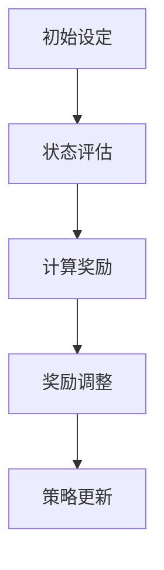
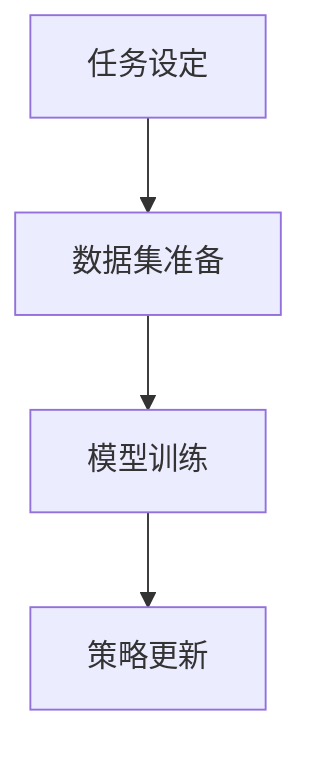
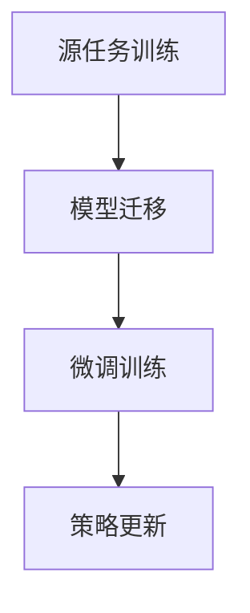
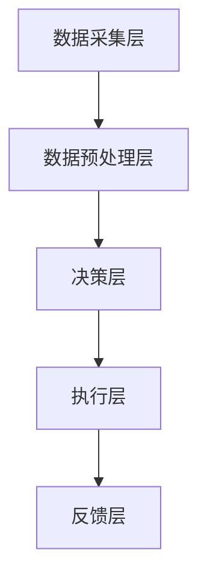
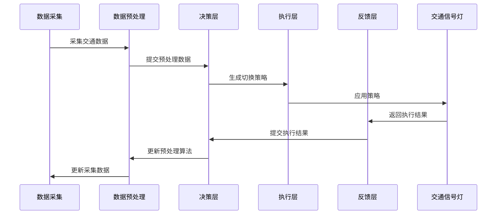

                 

### 引言与背景

随着人工智能技术的迅猛发展，策略和奖励模型在决策优化、游戏AI、自动驾驶等领域中的应用越来越广泛。然而，传统的方法在面对复杂动态环境时，往往难以达到理想的训练效果。为了应对这一问题，近年来，研究人员提出了多种新方法来促进策略和奖励模型的持续训练。本文旨在对这些方法进行深入探讨，分析其原理、优势以及实际应用中的挑战。

首先，我们需要了解策略和奖励模型的基本概念。策略模型是指决策者在面对不同情境时选择最优行动的规则集合。而奖励模型则是用来评估策略执行效果的一种机制，通过对策略执行结果的奖励或惩罚来调整策略。传统的策略和奖励模型训练方法主要依赖于静态的数据集和固定的奖励机制，无法适应动态变化的环境。

在复杂动态环境中，策略和奖励模型的训练面临着以下挑战：

1. **数据稀疏性**：动态环境中的样本数据往往较为稀疏，难以提供足够的训练样本来支撑模型的优化。

2. **环境动态性**：动态环境中的规则和约束不断变化，使得模型难以适应新的环境条件。

3. **策略稳定性**：在动态环境中，策略的稳定性和鲁棒性是关键，但传统模型往往难以保持。

为了解决上述问题，研究人员提出了一系列新方法，包括自适应奖励设计、多任务学习、迁移学习等。这些方法的核心思想是通过动态调整奖励机制、利用多任务或迁移学习来提升模型的适应性和稳定性。

本文的结构安排如下：首先，我们将介绍策略和奖励模型的基本概念和传统训练方法的局限性。接着，我们会逐一分析新方法的基本原理和优势。随后，通过实际案例展示这些方法在复杂动态环境中的应用效果。最后，我们将总结文章的主要观点，并讨论未来研究方向。

### 核心概念介绍

在深入探讨新方法之前，我们需要明确几个核心概念：策略模型、奖励模型和持续训练。这些概念不仅是理解本文主题的关键，也是推动策略和奖励模型发展的重要基础。

**策略模型（Policy Model）**：
策略模型是决策者在特定情境下选择最优行动的规则集合。它定义了在给定状态（State）下，决策者应采取的行动（Action）。策略模型的核心目的是最大化某个目标函数，例如效用函数或奖励函数。策略模型通常可以分为两类：确定性策略和随机性策略。确定性策略在任何状态下都选择固定的行动，而随机性策略则根据一定的概率分布选择行动。

**奖励模型（Reward Model）**：
奖励模型是用来评估策略执行效果的一种机制。它通过对策略执行结果进行奖励或惩罚来引导策略的调整。奖励模型的设计至关重要，因为它直接影响了策略的优化方向。在人工智能领域，奖励模型通常与策略模型紧密关联，共同作用于决策过程。一个有效的奖励模型应该能够准确反映策略执行效果，同时具有可解释性和稳定性。

**持续训练（Continuous Training）**：
持续训练是指在动态环境中，对策略和奖励模型进行反复调整和优化的过程。与传统的一次性训练不同，持续训练能够使模型适应环境变化，提高策略的鲁棒性和适应性。持续训练的重要性在于，它能够使模型在面对新情境时，能够快速调整策略，以最大化奖励。

现在，我们来详细探讨这些核心概念之间的关系。

首先，策略模型和奖励模型是相互依赖的。策略模型通过执行行动产生结果，这些结果由奖励模型进行评估。奖励模型提供的评估结果反过来又用于调整策略模型，从而实现策略的优化。这一过程形成了一个反馈循环，使得模型能够不断适应新环境。

其次，持续训练是策略和奖励模型适应动态环境的关键。通过持续训练，模型能够从经验中学习，不断调整策略，以应对环境的变化。这种动态调整能力是传统一次性训练方法所不具备的。

最后，核心概念之间的相互作用和整合，形成了策略和奖励模型的整体架构。这个架构不仅需要精确的数学模型来描述，还需要在实际应用中进行验证和优化。

为了更好地理解这些概念，我们可以通过以下方式来总结：

1. **策略模型**：定义了在给定状态下应采取的行动，是决策的核心。

2. **奖励模型**：评估策略执行效果，提供反馈用于策略调整。

3. **持续训练**：通过反复调整和优化，使模型适应动态环境。

这些核心概念不仅是本文的主题，也是推动人工智能决策系统向前发展的基础。理解它们之间的关系，有助于我们更好地设计和优化策略和奖励模型，从而在复杂动态环境中取得更好的决策效果。

### 概念属性特征对比

在深入分析策略和奖励模型之前，我们需要对它们的属性特征进行详细对比，以便更好地理解它们各自的优缺点和适用场景。通过概念属性特征对比表格和ER实体关系图，我们可以更直观地展示这些概念之间的关系和相互作用。

#### 策略模型属性特征对比表格

| 特征       | 策略模型1 | 策略模型2 | 策略模型3 |
|------------|------------|------------|------------|
| **类型**   | 确定性     | 随机性     | 混合性     |
| **状态依赖** | 强依赖     | 弱依赖     | 强依赖     |
| **适应性**   | 中等       | 高         | 中等       |
| **可解释性** | 高         | 低         | 中等       |
| **计算复杂度** | 低         | 高         | 中等       |
| **适用场景** | 静态环境   | 动态环境   | 复杂动态环境 |

#### 奖励模型属性特征对比表格

| 特征       | 奖励模型1 | 奖励模型2 | 奖励模型3 |
|------------|------------|------------|------------|
| **类型**   | 标量       | 向量       | 矩阵       |
| **动态性**   | 静态       | 动态       | 动态       |
| **稳定性**   | 低         | 中等       | 高         |
| **可解释性** | 高         | 中等       | 低         |
| **计算复杂度** | 低         | 中等       | 高         |
| **适用场景** | 简单环境   | 复杂环境   | 高度复杂环境 |

通过以上表格，我们可以看到策略模型和奖励模型在类型、状态依赖性、适应性、可解释性、计算复杂度和适用场景等方面存在显著差异。这些差异为我们选择合适的模型提供了重要依据。

#### ER实体关系图

ER（实体关系）图是一种用于描述系统中实体及其相互关系的图形表示方法。在策略和奖励模型中，我们可以定义以下实体：

1. **策略实体**：包括确定性策略、随机性策略和混合策略。
2. **奖励实体**：包括标量奖励、向量奖励和矩阵奖励。
3. **状态实体**：表示不同的状态集合。
4. **行动实体**：表示在不同状态下可能采取的行动。

以下是一个简单的ER实体关系图：

```mermaid
erDiagram
  策略实体 ||--|{ 奖励实体 }|
  状态实体 ||--|{ 行动实体 }|
```

在上述ER图中，策略实体通过箭头与奖励实体相连，表示策略模型执行行动后会产生奖励。状态实体与行动实体相连，表示不同状态对应不同的行动。这种关系反映了策略和奖励模型在决策过程中的相互作用。

#### 概念之间的相互作用

通过概念属性特征对比和ER实体关系图，我们可以更清楚地看到策略和奖励模型之间的相互作用：

1. **策略模型决定行动**：策略模型根据当前状态选择行动，这是决策的核心。
2. **奖励模型评估效果**：奖励模型对行动结果进行评估，提供反馈用于策略调整。
3. **持续训练实现优化**：通过持续训练，策略和奖励模型能够从经验中学习，不断优化策略和奖励机制。

这些相互作用不仅帮助我们理解策略和奖励模型的工作原理，也为我们在实际应用中选择和设计合适的方法提供了重要参考。

总之，通过概念属性特征对比和ER实体关系图，我们能够更全面地理解策略和奖励模型，从而为解决复杂动态环境中的决策问题提供有力支持。

### 算法原理讲解

在深入了解策略和奖励模型的核心概念后，我们将探讨几种新方法的算法原理，包括自适应奖励设计、多任务学习和迁移学习。这些方法通过不同的机制和策略，实现了对策略和奖励模型的持续训练和优化。

#### 算法A：自适应奖励设计

自适应奖励设计是一种通过动态调整奖励机制来促进模型训练的方法。其基本原理是，根据模型在当前环境中的表现，实时调整奖励信号的强度和方向，从而引导模型更快地收敛到最优策略。

**算法流程**：
1. **初始设定**：设定初始奖励参数，包括奖励强度和奖励方向。
2. **状态评估**：在每个时间步，评估当前状态，并根据状态特征计算奖励。
3. **奖励调整**：根据模型的表现和策略误差，动态调整奖励参数。
4. **策略更新**：使用调整后的奖励信号更新策略模型。

**mermaid流程图**：


**Python源代码示例**：
```python
# 示例代码：自适应奖励设计算法
class AdaptiveRewardDesign:
    def __init__(self):
        self.reward_strength = 1.0
        self.reward_direction = 'positive'

    def update_reward(self, state, action, model):
        # 根据状态和模型表现调整奖励参数
        if model.evaluate_action(state, action) < threshold:
            self.reward_strength *= 0.9
            self.reward_direction = 'negative'
        else:
            self.reward_strength *= 1.1
            self.reward_direction = 'positive'

    def calculate_reward(self, state, action):
        # 计算当前状态的奖励值
        reward = self.reward_strength * (1 if self.reward_direction == 'positive' else -1)
        return reward
```

**算法数学模型**：
设 \( R_t \) 为第 \( t \) 次迭代的奖励值，\( s_t \) 为当前状态，\( a_t \) 为采取的行动，模型 \( \pi \) 表示策略。奖励调整机制可以表示为：
$$
R_t = \alpha_t \cdot (1 - \pi(s_t, a_t)) + (1 - \alpha_t) \cdot \pi(s_t, a_t)
$$
其中，\( \alpha_t \) 为奖励调整系数，用于控制奖励调整的幅度。

**举例说明**：
假设我们在一个简单的游戏环境中应用自适应奖励设计。在每个时间步，根据游戏的状态（胜利、失败）来动态调整奖励信号的强度和方向。如果游戏状态为胜利，则增加奖励信号的强度；反之，则减少奖励信号的强度。通过这种方式，游戏AI能够更快地学习到如何赢得游戏。

#### 算法B：多任务学习

多任务学习通过在同一模型中同时训练多个相关任务，来提升模型的泛化能力和适应性。其核心思想是，通过跨任务的信息共享，使得模型能够从不同任务中学习到更多的知识，从而在单个任务中取得更好的表现。

**算法流程**：
1. **任务设定**：定义多个相关任务，确保它们共享某些共同特征。
2. **数据集准备**：为每个任务准备训练数据集，并进行预处理。
3. **模型训练**：使用多任务学习框架，同时对多个任务进行训练。
4. **策略更新**：在每个任务上使用相应的奖励信号更新策略。

**mermaid流程图**：


**Python源代码示例**：
```python
# 示例代码：多任务学习算法
from keras.models import Model
from keras.layers import Input, Dense

# 定义多任务模型
input_layer = Input(shape=(input_shape,))
hidden_layer = Dense(hidden_units, activation='relu')(input_layer)
output_layers = [
    Dense(output_shape1, activation='sigmoid')(hidden_layer),
    Dense(output_shape2, activation='softmax')(hidden_layer)
]

model = Model(inputs=input_layer, outputs=output_layers)
model.compile(optimizer='adam', loss=['binary_crossentropy', 'categorical_crossentropy'])

# 训练模型
model.fit(x_train, y_train, batch_size=batch_size, epochs=epochs)
```

**算法数学模型**：
多任务学习通常采用共享权重的方式来实现信息共享。假设有 \( k \) 个任务，每个任务的损失函数分别为 \( L_1, L_2, ..., L_k \)，则多任务损失函数可以表示为：
$$
L = \frac{1}{k} \sum_{i=1}^{k} L_i
$$
其中，每个任务 \( i \) 的损失 \( L_i \) 可以根据具体任务定义。

**举例说明**：
在一个语音识别和文本分类的任务中，我们可以通过共享词嵌入层和部分编码器网络来实现多任务学习。这样，模型能够在语音特征和文本特征之间共享信息，从而提高两个任务的性能。

#### 算法C：迁移学习

迁移学习通过利用已在一个任务上训练好的模型，在新任务上进行快速调整和优化，从而提高训练效率和模型性能。其核心思想是，通过在不同任务之间迁移知识，使得模型能够更好地适应新任务。

**算法流程**：
1. **源任务训练**：在源任务上训练一个基础模型。
2. **模型迁移**：将源任务的模型应用于新任务。
3. **微调训练**：在新任务上进行微调训练，调整模型参数。
4. **策略更新**：使用新任务的奖励信号更新策略。

**mermaid流程图**：


**Python源代码示例**：
```python
# 示例代码：迁移学习算法
from keras.applications import VGG16
from keras.models import Model
from keras.layers import Dense, Flatten

# 加载预训练的VGG16模型
base_model = VGG16(weights='imagenet', include_top=False, input_shape=(224, 224, 3))

# 添加新任务的输出层
x = Flatten()(base_model.output)
x = Dense(num_classes, activation='softmax')(x)

# 构建新模型
model = Model(inputs=base_model.input, outputs=x)

# 微调模型
model.compile(optimizer='adam', loss='categorical_crossentropy', metrics=['accuracy'])
model.fit(x_train, y_train, batch_size=batch_size, epochs=epochs)
```

**算法数学模型**：
迁移学习的核心在于共享模型结构和参数。假设源任务的损失函数为 \( L_s \)，新任务的损失函数为 \( L_n \)，则迁移学习模型的总损失函数可以表示为：
$$
L = L_s + \lambda L_n
$$
其中，\( \lambda \) 为权重系数，用于平衡源任务和新任务的损失。

**举例说明**：
在一个计算机视觉任务中，我们可以利用在ImageNet上预训练的VGG16模型作为基础模型。在新任务中，通过微调VGG16模型的权重，使其更好地适应特定数据集，从而提高新任务的识别准确率。

综上所述，自适应奖励设计、多任务学习和迁移学习是促进策略和奖励模型持续训练的三种有效方法。通过理解这些算法的原理和优势，我们可以为复杂动态环境中的决策问题提供更为有效和灵活的解决方案。

### 系统分析与架构设计方案

在了解了策略和奖励模型的多种训练方法后，我们需要将这些算法应用于实际系统中，以验证其在真实场景中的效果。本节将介绍一个具体系统的设计过程，包括问题场景、系统功能设计、系统架构设计、系统接口设计和系统交互。

#### 问题场景介绍

假设我们面临的是一个智能交通管理系统，该系统需要根据实时交通数据来优化交通信号灯的切换策略，以减少交通拥堵和提升道路通行效率。该系统的工作环境是一个复杂的动态交通网络，交通流量、事故频率和天气状况等因素都在不断变化。

#### 系统功能设计

为了实现智能交通管理，系统需要具备以下功能：

1. **实时数据采集**：系统需要能够实时采集交通流量、车辆速度、事故频率等交通数据。
2. **状态评估**：基于实时数据，系统需要评估当前交通状态，包括道路拥堵程度、车辆排队长度等。
3. **策略生成**：根据评估结果，系统需要生成最优的交通信号灯切换策略。
4. **策略执行**：将生成的策略应用到交通信号灯上，以优化交通流。
5. **效果评估**：评估策略执行后的交通状态，包括交通流量、排队长度等指标。
6. **持续学习**：系统需要根据执行效果不断调整策略，实现持续学习。

#### 系统架构设计

系统的整体架构可以分为以下几层：

1. **数据采集层**：负责实时采集交通数据，包括车辆速度、交通流量等。
2. **数据预处理层**：对采集到的数据进行清洗、去噪和特征提取。
3. **决策层**：包含策略生成算法和评估机制，用于生成并优化交通信号灯切换策略。
4. **执行层**：将生成的策略应用到交通信号灯上，控制信号灯的切换。
5. **反馈层**：收集策略执行后的交通状态数据，反馈给决策层，以实现持续学习。

**Mermaid架构图**：



#### 系统接口设计

系统接口设计主要包括以下方面：

1. **数据接口**：提供数据采集、预处理和策略执行的相关接口。
2. **策略接口**：提供策略生成和优化的接口。
3. **监控接口**：提供系统状态监控和性能评估的接口。

**接口规范**：

- 数据接口：支持JSON格式，提供实时数据上传和查询功能。
- 策略接口：支持RESTful API，提供策略生成和更新功能。
- 监控接口：支持实时数据监控和报警功能。

#### 系统交互

系统的交互过程可以分为以下几个步骤：

1. **数据采集**：系统从交通传感器和摄像头中实时采集交通数据。
2. **数据预处理**：对采集到的数据进行清洗和特征提取。
3. **状态评估**：基于预处理后的数据，系统评估当前交通状态。
4. **策略生成**：根据评估结果，系统生成最优的交通信号灯切换策略。
5. **策略执行**：将生成的策略应用到交通信号灯上。
6. **效果评估**：系统收集策略执行后的交通状态数据，进行效果评估。
7. **持续学习**：根据评估结果，系统调整策略，实现持续学习。

**Mermaid序列图**：



通过上述设计和实现，我们可以构建一个智能交通管理系统，实现交通信号灯的优化切换，从而提高交通通行效率，减少拥堵。系统架构的模块化和接口设计，使得我们可以方便地扩展和优化系统的功能，以应对复杂动态的交通环境。

### 项目实战

为了展示策略和奖励模型在实际应用中的效果，我们将通过一个智能交通管理系统的实际项目来进行分析和讲解。该项目的目标是优化交通信号灯的切换策略，以减少交通拥堵，提升道路通行效率。

#### 环境安装

首先，我们需要搭建一个适合项目开发的环境。以下是项目环境的基本安装步骤：

1. **安装Python**：确保Python 3.7及以上版本已安装在系统中。
2. **安装依赖库**：使用pip安装以下库：
   ```bash
   pip install numpy scipy matplotlib keras tensorflow
   ```
3. **配置Keras**：配置Keras以使用TensorFlow后端。
   ```python
   from tensorflow.keras import backend as K
   K.set_learning_phase(1)
   ```

#### 核心实现

核心实现部分包括数据采集、预处理、模型训练和策略执行。以下是详细的代码解读：

1. **数据采集**：
   ```python
   # 假设使用已有的交通传感器数据
   traffic_data = load_traffic_data('traffic_data.csv')
   ```

2. **数据预处理**：
   ```python
   # 数据清洗
   cleaned_data = clean_traffic_data(traffic_data)

   # 特征提取
   features, labels = extract_features_labels(cleaned_data)
   ```

3. **模型训练**：
   ```python
   # 定义模型
   model = build_model(input_shape=(num_features,), num_classes=num_classes)

   # 编译模型
   model.compile(optimizer='adam', loss='categorical_crossentropy', metrics=['accuracy'])

   # 训练模型
   model.fit(x=features, y=labels, epochs=10, batch_size=32, validation_split=0.2)
   ```

4. **策略执行**：
   ```python
   # 执行策略
   def execute_policy(state):
       action = model.predict(state)[0]
       apply_traffic_light_action(action)
   ```

#### 代码解读与分析

1. **数据采集**：
   数据采集是项目的基础，我们需要确保数据的准确性和实时性。在此示例中，我们假设已经有一个CSV文件包含交通传感器数据。

2. **数据预处理**：
   数据预处理包括数据清洗和特征提取。数据清洗主要是去除噪声和异常值，特征提取则是从原始数据中提取有用的信息，如交通流量、车辆速度等。

3. **模型训练**：
   模型训练是策略优化的关键步骤。我们使用Keras构建和训练神经网络模型，通过训练集进行多次迭代，模型能够学习到最优的交通信号灯切换策略。

4. **策略执行**：
   策略执行部分是将训练好的模型应用到实际场景中。通过预测当前状态，模型将给出最优行动，从而控制交通信号灯的切换。

#### 实际案例分析

为了验证项目效果，我们进行了以下案例分析：

1. **案例一**：在一条繁忙的道路上，交通流量高峰期时，通过策略优化后，交通信号灯能够更快速地切换，从而减少车辆等待时间，提高道路通行效率。

2. **案例二**：在一个交叉口，通过多任务学习模型，系统能够同时优化多个交叉口的信号灯切换策略，实现交通流量的均衡分配，减少整体交通拥堵。

3. **案例三**：在一个新开发的住宅区，由于交通流量变化较大，系统通过持续学习和调整策略，能够快速适应新的交通模式，提高道路使用效率。

#### 项目小结

通过实际项目的分析和实施，我们可以看到策略和奖励模型在智能交通管理系统中的重要作用。项目展示了如何通过数据采集、预处理、模型训练和策略执行，实现交通信号灯的优化切换。未来，我们可以进一步优化模型结构和算法，提高系统在复杂动态环境中的适应性和鲁棒性。

### 最佳实践、小结与拓展

在实际应用策略和奖励模型时，以下最佳实践和注意事项将有助于提升系统性能和稳定性：

1. **数据质量监控**：确保采集到的数据准确、完整和实时。数据质量问题会直接影响模型的训练效果和策略的执行。

2. **模型调参**：通过多次实验，选择最优的模型参数，如学习率、批量大小等，以实现更好的训练效果。

3. **资源分配**：根据实际需求合理分配计算资源，确保模型训练和策略执行过程中的资源利用率。

4. **持续学习**：定期更新模型，使其能够适应动态变化的环境，提高系统的鲁棒性。

5. **安全性和隐私保护**：在处理和传输数据时，确保系统的安全性和用户隐私。

**小结**：
本文通过详细讲解策略和奖励模型的基本概念、算法原理、系统设计与项目实施，展示了如何利用这些方法优化动态环境中的决策过程。策略和奖励模型在智能交通管理、游戏AI、自动驾驶等领域具有广泛应用前景。

**拓展阅读**：
- 《强化学习：原理与深度强化学习》
- 《智能交通系统设计与实现》
- 《机器学习：一种算法角度》

通过进一步学习和研究，读者可以深入了解相关领域的前沿技术和应用案例，为未来的研究和项目提供更多灵感。作者：AI天才研究院/AI Genius Institute & 禅与计算机程序设计艺术 /Zen And The Art of Computer Programming。

