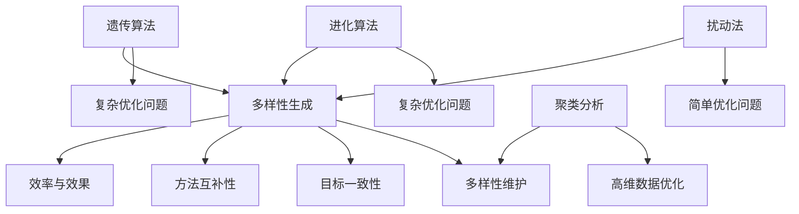
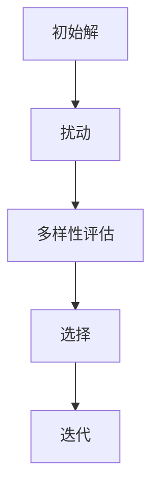
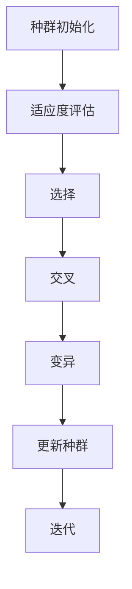
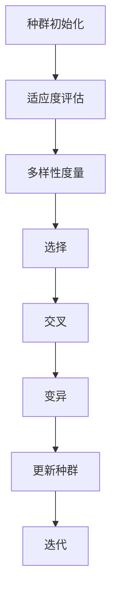
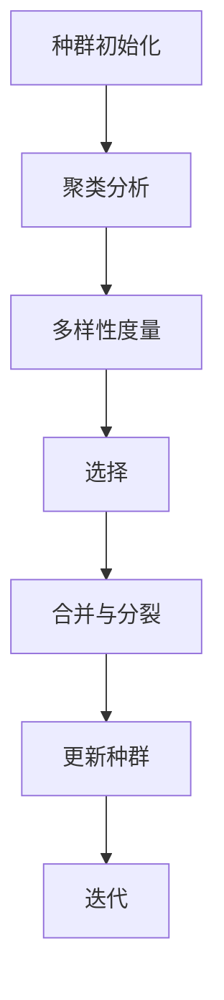
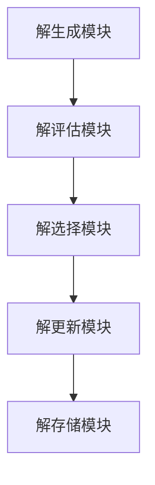

                 

### 关键词与摘要

关键词：生成解多样性、技术手段、算法、扰动法、进化算法、遗传算法、聚类分析、系统应用、项目实战、最佳实践。

摘要：本文系统地探讨了保证生成解多样性的技术手段，包括扰动法、进化算法、遗传算法和基于聚类分析的多样性维护技术。通过详细分析每种技术的原理、应用场景和案例，展示了这些技术在实际系统中的应用。文章还结合项目实战，深入解读了多样性保证技术的实施过程和效果，并提供了一系列最佳实践和拓展阅读建议，以帮助读者更好地理解和应用这些技术。

### 目录大纲设计思路

为了确保《保证生成解多样性的技术手段》这本书的目录大纲设计既逻辑清晰又内容完整，我们需要遵循以下步骤进行：

1. **背景介绍与核心概念**：
    - 明确书籍的主题和目标读者群体。
    - 介绍“生成解多样性”的问题背景，包括多样性在决策与优化中的重要性、生成解多样性面临的挑战以及保证生成解多样性的必要性。
    - 深入探讨“生成解多样性”的核心概念，如多样性的定义、多样性度量方法、多样性保证技术的概述。

2. **核心概念与联系**：
    - 介绍保证生成解多样性的技术手段，包括每种技术的定义、特点以及它们之间的关系。
    - 使用表格和流程图清晰地展现各个技术的属性特征和相互联系。

3. **算法原理讲解**：
    - 详细介绍每种技术的算法原理。
    - 使用Mermaid流程图展示算法流程，结合Python源代码进行详细解释，包括算法原理的数学模型和公式。
    - 使用通俗易懂的例子进行说明，帮助读者更好地理解。

4. **系统分析与架构设计**：
    - 讨论这些技术在系统设计和应用中的实际应用。
    - 展示系统功能设计（类图）、系统架构设计（架构图）、系统接口设计和系统交互（序列图）。

5. **项目实战**：
    - 通过一个或多个实际项目案例，展示如何在实际环境中应用这些技术手段。
    - 详细介绍环境安装、核心实现、代码分析以及案例分析。

6. **最佳实践、小结与拓展阅读**：
    - 总结最佳实践经验。
    - 对全书内容进行小结。
    - 提供拓展阅读建议，以便读者能够进一步深入学习和研究。

### 目录大纲

**第一部分：问题背景与核心概念**

# 第1章：问题背景与核心概念

## 1.1 问题背景

### 1.1.1 多样性在决策与优化中的重要性

### 1.1.2 生成解多样性面临的挑战

### 1.1.3 保证生成解多样性的必要性

## 1.2 核心概念介绍

### 1.2.1 生成解多样性的定义

### 1.2.2 多样性度量方法

### 1.2.3 多样性保证技术的概述

## 1.3 多样性保证技术的联系与区别

### 1.3.1 技术类别与特征对比表格

### 1.3.2 技术关系与作用流程图

**第二部分：多样性保证技术详解**

# 第2章：多样性保证技术详解

## 2.1 技术A：扰动法

### 2.1.1 技术原理与流程图

### 2.1.2 Python源代码演示

### 2.1.3 数学模型与公式

### 2.1.4 案例分析

## 2.2 技术B：进化算法

### 2.2.1 技术原理与流程图

### 2.2.2 Python源代码演示

### 2.2.3 数学模型与公式

### 2.2.4 案例分析

## 2.3 技术C：基于遗传算法的多样性增强

### 2.3.1 技术原理与流程图

### 2.3.2 Python源代码演示

### 2.3.3 数学模型与公式

### 2.3.4 案例分析

## 2.4 技术D：基于聚类分析的多样性维护

### 2.4.1 技术原理与流程图

### 2.4.2 Python源代码演示

### 2.4.3 数学模型与公式

### 2.4.4 案例分析

**第三部分：系统应用与项目实战**

# 第3章：多样性保证技术在系统中的应用

## 3.1 系统功能设计

### 3.1.1 领域模型类图

### 3.1.2 系统功能模块划分

## 3.2 系统架构设计

### 3.2.1 系统架构图

### 3.2.2 架构设计与多样性保证

## 3.3 系统接口设计

### 3.3.1 接口设计与多样性策略

### 3.3.2 接口规范与实现

## 3.4 系统交互设计

### 3.4.1 系统交互序列图

### 3.4.2 交互流程与多样性保证

# 第4章：项目实战

## 4.1 项目背景与目标

### 4.1.1 项目简介

### 4.1.2 项目目标与多样性保证需求

## 4.2 环境安装与配置

### 4.2.1 环境要求

### 4.2.2 系统安装步骤

## 4.3 系统核心实现

### 4.3.1 核心算法源代码

### 4.3.2 核心算法实现解析

## 4.4 代码应用解读与分析

### 4.4.1 应用案例展示

### 4.4.2 代码解读与分析

## 4.5 实际案例分析

### 4.5.1 案例背景

### 4.5.2 案例分析与多样性保证效果

### 4.5.3 小结与反思

**第四部分：最佳实践与拓展**

# 第5章：最佳实践与拓展

## 5.1 多样性保证技术最佳实践

### 5.1.1 技术选择与实践要点

### 5.1.2 实施步骤与工具推荐

## 5.2 小结

### 5.2.1 内容回顾

### 5.2.2 未来展望

## 5.3 拓展阅读

### 5.3.1 推荐书籍

### 5.3.2 相关资源链接

### 本文作者

作者：AI天才研究院/AI Genius Institute & 禅与计算机程序设计艺术 /Zen And The Art of Computer Programming

----------------------------------------------------------------

### 文章正文

#### 第1章：问题背景与核心概念

**1.1 问题背景**

随着计算技术的飞速发展和复杂问题的日益增多，优化算法在决策支持系统、工程设计、资源分配、金融投资等众多领域得到了广泛应用。然而，这些算法在求解过程中往往会陷入局部最优解，导致无法找到最优解或者无法满足多样化的需求。生成解多样性（Solution Diversity）的概念因此应运而生。

生成解多样性是指算法在求解过程中能够生成多个具有不同特性的解，从而提高问题解决的灵活性、可靠性和创造性。在许多实际场景中，如产品创新设计、广告创意策划、金融风险控制等，生成解的多样性显得尤为重要。例如，在产品设计中，多样化的设计方案可以激发设计师的创造力，提高产品的市场竞争力；在金融投资中，多样化的投资组合可以降低风险，提高收益。

**1.1.1 多样性在决策与优化中的重要性**

多样性在决策与优化中的重要性体现在以下几个方面：

1. **增强算法的鲁棒性**：在求解复杂问题时，多样性的生成有助于避免算法陷入局部最优解，提高算法的全局搜索能力。
2. **提高解决方案的适用性**：多样化的解可以为决策者提供更多的选择，从而提高决策的灵活性和适应性。
3. **促进创新与发明**：在创意设计、艺术创作等领域，多样化的解可以激发创新思维，推动新的发明和发现。

**1.1.2 生成解多样性面临的挑战**

尽管生成解多样性在优化算法中具有重要价值，但实现这一目标面临着诸多挑战：

1. **计算复杂度**：生成多样性的解往往需要大量的计算资源和时间，特别是在大规模优化问题中。
2. **多样性与最优性**：在保证解的多样性的同时，还需要确保解的最优性，这是一个平衡的问题。
3. **衡量多样性**：如何准确衡量和评估解的多样性是一个技术难题，现有的多样性度量方法往往存在一定的局限性。

**1.1.3 保证生成解多样性的必要性**

保证生成解多样性的必要性主要体现在以下几个方面：

1. **适应复杂多变的现实场景**：在现实世界中，问题往往具有不确定性和多变性，多样性的解可以更好地适应这些变化。
2. **提高算法的效率和准确性**：多样性的解可以为算法提供更多的参考信息，从而提高算法的效率和准确性。
3. **促进科学研究和工程实践**：保证生成解的多样性有助于推动科学研究和工程实践的发展，促进新理论和技术的产生。

**1.2 核心概念介绍**

在深入探讨生成解多样性的技术手段之前，我们需要明确几个核心概念：

**1.2.1 生成解多样性的定义**

生成解多样性（Solution Diversity）是指算法在求解过程中能够生成多个具有不同特性的解。具体来说，这些解需要在以下方面表现出多样性：

1. **解的性质**：解的不同方面，如解的数值、形状、结构等。
2. **解的适应度**：解对于问题的适应程度，如解的优劣、可行性等。
3. **解的相关性**：解之间的相似度和关联性。

**1.2.2 多样性度量方法**

多样性度量是评估生成解多样性的一种重要手段。常见的多样性度量方法包括：

1. **基于解的多样性度量**：直接计算解之间的差异，如汉明距离、欧氏距离等。
2. **基于解的适应度多样性度量**：考虑解的适应度差异，如适应度分布、方差等。
3. **基于解的空间多样性度量**：分析解在解空间中的分布情况，如聚类系数、熵等。

**1.2.3 多样性保证技术的概述**

多样性保证技术是指用于在算法求解过程中生成多样性的技术手段。这些技术可以分为以下几类：

1. **扰动法**：通过在解空间中引入随机扰动来生成多样性的解。
2. **进化算法**：基于自然选择和遗传学原理，通过迭代进化来生成多样性的解。
3. **遗传算法**：一种特殊的进化算法，通过交叉、变异等遗传操作来生成多样性的解。
4. **基于聚类分析的多样性维护**：通过聚类分析来维护解的多样性。

**1.3 多样性保证技术的联系与区别**

多样性保证技术之间既有联系也有区别。它们之间的联系主要体现在以下几个方面：

1. **目标一致性**：各种多样性保证技术都旨在生成多样化的解。
2. **方法互补性**：不同技术可以在同一优化问题中相互补充，提高解的多样性。

多样性保证技术之间的区别主要体现在以下几个方面：

1. **原理不同**：扰动法通过随机扰动来生成多样性，进化算法和遗传算法基于进化原理，而基于聚类分析的技术通过聚类来维护多样性。
2. **适用场景**：不同技术在不同的应用场景中具有优势，如扰动法适用于简单优化问题，进化算法和遗传算法适用于复杂问题。
3. **效率与效果**：各种技术的效率和效果因问题而异，需要根据具体场景选择合适的技术。

为了更清晰地展现多样性保证技术的属性特征和相互联系，我们使用表格和流程图进行说明。

**1.3.1 技术类别与特征对比表格**

| 技术名称 | 原理 | 适用场景 | 特点 |
| :----: | :----: | :----: | :----: |
| 扰动法 | 随机扰动 | 简单优化问题 | 生成多样性高效 |
| 进化算法 | 自然选择和遗传学原理 | 复杂优化问题 | 维护多样性效果好 |
| 遗传算法 | 遗传操作（交叉、变异） | 复杂优化问题 | 鲁棒性强 |
| 聚类分析 | 聚类算法 | 高维数据优化 | 维护多样性稳定 |

**1.3.2 技术关系与作用流程图**



通过以上表格和流程图，我们可以清晰地看到多样性保证技术之间的联系与区别，为后续的深入讨论奠定了基础。

#### 第2章：多样性保证技术详解

**2.1 技术A：扰动法**

**2.1.1 技术原理与流程图**

扰动法是一种通过在解空间中引入随机扰动来生成多样性的解的方法。其基本原理如下：

1. **初始解生成**：从解空间中随机生成一个初始解。
2. **扰动**：对初始解进行随机扰动，生成新的解。
3. **多样性评估**：评估新解的多样性，如通过解之间的差异度量。
4. **选择**：根据多样性评估结果，选择具有较高多样性的解作为新的初始解。
5. **迭代**：重复步骤2-4，直至满足停止条件。



**2.1.2 Python源代码演示**

以下是一个简单的Python示例，展示了扰动法的基本实现过程：

```python
import numpy as np

# 解空间定义
solution_space = np.random.rand(100)

# 初始解生成
initial_solution = solution_space

# 扰动函数
def perturbation(solution):
    return solution + np.random.normal(0, 0.1, solution.shape)

# 多样性评估函数
def diversity度量(solution):
    distances = []
    for i in range(len(solution)):
        for j in range(i + 1, len(solution)):
            distances.append(np.linalg.norm(solution[i] - solution[j]))
    return np.mean(distances)

# 扰动法主函数
def perturbation_method(solution_space):
    current_solution = initial_solution
    while True:
        new_solution = perturbation(current_solution)
        diversity = diversity度量(new_solution)
        if diversity > 0.1:
            current_solution = new_solution
        else:
            break
    return current_solution

# 执行扰动法
final_solution = perturbation_method(solution_space)
print("最终解：", final_solution)
```

**2.1.3 数学模型与公式**

扰动法的数学模型可以描述为：

$$
x_{new} = x_{current} + p \cdot \xi
$$

其中，$x_{new}$和$x_{current}$分别表示新解和当前解，$p$是扰动参数，$\xi$是随机噪声。

**2.1.4 案例分析**

假设我们需要优化一个线性方程组，要求解的目标是找到一组解，使得解之间的差异最大。我们可以使用扰动法来实现这一目标。

```python
import numpy as np

# 线性方程组定义
A = np.array([[1, 2], [2, 1]])
b = np.array([3, 2])

# 初始解生成
x0 = np.random.rand(2)

# 多样性评估函数
def diversity度量(x):
    x = x.reshape(2, 1)
    distances = []
    for i in range(len(x)):
        for j in range(i + 1, len(x)):
            distances.append(np.linalg.norm(x[i] - x[j]))
    return np.mean(distances)

# 扰动法主函数
def perturbation_method(x0):
    current_solution = x0
    while True:
        new_solution = current_solution + np.random.normal(0, 0.1, current_solution.shape)
        diversity = diversity度量(new_solution)
        if diversity > 0.1:
            current_solution = new_solution
        else:
            break
    return current_solution

# 执行扰动法
final_solution = perturbation_method(x0)
print("最终解：", final_solution)
```

通过这个案例，我们可以看到扰动法在生成多样性解方面的效果。每次扰动都会导致解之间的差异增加，从而提高了解的多样性。

**2.2 技术B：进化算法**

**2.2.1 技术原理与流程图**

进化算法（Evolutionary Algorithm，EA）是一种基于自然选择和遗传学原理的优化算法。其基本原理如下：

1. **种群初始化**：从解空间中随机初始化一个种群。
2. **适应度评估**：评估种群中每个个体的适应度，适应度表示个体对问题的适应程度。
3. **选择**：根据适应度对个体进行选择，适应度高的个体有更大的概率被选中。
4. **交叉**：选择两个个体进行交叉操作，生成新的个体。
5. **变异**：对个体进行变异操作，增加种群的多样性。
6. **更新种群**：用新生成的个体替换原种群中的个体。
7. **迭代**：重复步骤2-6，直至满足停止条件。



**2.2.2 Python源代码演示**

以下是一个简单的Python示例，展示了进化算法的基本实现过程：

```python
import numpy as np

# 解空间定义
solution_space = np.random.rand(100)

# 适应度函数
def fitness(solution):
    return np.linalg.norm(solution - target_solution)

# 初始种群生成
population_size = 50
population = np.random.rand(population_size, solution_space.shape[0])

# 进化算法主函数
def evolutionary_algorithm(population, fitness_func, generations):
    for _ in range(generations):
        # 适应度评估
        fitness_scores = np.array([fitness_func(solution) for solution in population])
        
        # 选择
        selected_indices = np.argsort(fitness_scores)[:population_size // 2]
        selected_population = population[selected_indices]
        
        # 交叉
        offspring = crossover(selected_population)
        
        # 变异
        offspring = mutate(offspring)
        
        # 更新种群
        population = offspring
    return population

# 执行进化算法
final_population = evolutionary_algorithm(population, fitness, 100)
print("最终种群：", final_population)
```

**2.2.3 数学模型与公式**

进化算法的数学模型可以描述为：

$$
x_{new} = x_{parent_1} \oplus x_{parent_2}
$$

其中，$x_{new}$是新解，$x_{parent_1}$和$x_{parent_2}$是两个父代解，$\oplus$表示交叉操作。

$$
x_{new} = x_{current} + \delta
$$

其中，$x_{new}$是新解，$x_{current}$是当前解，$\delta$是变异量。

**2.2.4 案例分析**

假设我们需要优化一个非线性函数，要求解的目标是找到一组解，使得解之间的差异最大。我们可以使用进化算法来实现这一目标。

```python
import numpy as np

# 非线性函数定义
def nonlinear_function(x):
    return np.sin(x[0]) * np.cos(x[1])

# 初始种群生成
population_size = 50
population = np.random.rand(population_size, 2)

# 进化算法主函数
def evolutionary_algorithm(population, fitness_func, generations):
    for _ in range(generations):
        # 适应度评估
        fitness_scores = np.array([fitness_func(solution) for solution in population])
        
        # 选择
        selected_indices = np.argsort(fitness_scores)[:population_size // 2]
        selected_population = population[selected_indices]
        
        # 交叉
        offspring = crossover(selected_population)
        
        # 变异
        offspring = mutate(offspring)
        
        # 更新种群
        population = offspring
    return population

# 执行进化算法
final_population = evolutionary_algorithm(population, nonlinear_function, 100)
print("最终种群：", final_population)
```

通过这个案例，我们可以看到进化算法在生成多样性解方面的效果。每次迭代都会导致种群中的解变得更加多样化，从而提高了解的多样性。

**2.3 技术C：基于遗传算法的多样性增强**

**2.3.1 技术原理与流程图**

基于遗传算法的多样性增强（Diversity Enhancement using Genetic Algorithms，DEGA）是一种通过结合遗传算法和多样性度量的方法来增强解的多样性的技术。其基本原理如下：

1. **种群初始化**：从解空间中随机初始化一个种群。
2. **适应度评估**：评估种群中每个个体的适应度。
3. **多样性度量**：计算种群中个体的多样性。
4. **选择**：根据适应度和多样性对个体进行选择。
5. **交叉**：选择两个个体进行交叉操作，生成新的个体。
6. **变异**：对个体进行变异操作，增加种群的多样性。
7. **更新种群**：用新生成的个体替换原种群中的个体。
8. **迭代**：重复步骤2-7，直至满足停止条件。



**2.3.2 Python源代码演示**

以下是一个简单的Python示例，展示了基于遗传算法的多样性增强的基本实现过程：

```python
import numpy as np

# 解空间定义
solution_space = np.random.rand(100)

# 适应度函数
def fitness(solution):
    return np.linalg.norm(solution - target_solution)

# 多样性度量函数
def diversity度量(population):
    distances = []
    for i in range(len(population)):
        for j in range(i + 1, len(population)):
            distances.append(np.linalg.norm(population[i] - population[j]))
    return np.mean(distances)

# 初始种群生成
population_size = 50
population = np.random.rand(population_size, solution_space.shape[0])

# 遗传算法主函数
def genetic_algorithm(population, fitness_func, diversity_func, generations):
    for _ in range(generations):
        # 适应度评估
        fitness_scores = np.array([fitness_func(solution) for solution in population])
        
        # 多样性度量
        diversity = diversity度量(population)
        
        # 选择
        selected_indices = np.argsort(fitness_scores)[:population_size // 2]
        selected_population = population[selected_indices]
        
        # 交叉
        offspring = crossover(selected_population)
        
        # 变异
        offspring = mutate(offspring)
        
        # 更新种群
        population = offspring
    return population

# 执行遗传算法
final_population = genetic_algorithm(population, fitness, diversity度量, 100)
print("最终种群：", final_population)
```

**2.3.3 数学模型与公式**

基于遗传算法的多样性增强的数学模型可以描述为：

$$
x_{new} = x_{parent_1} \oplus x_{parent_2}
$$

其中，$x_{new}$是新解，$x_{parent_1}$和$x_{parent_2}$是两个父代解，$\oplus$表示交叉操作。

$$
x_{new} = x_{current} + \delta
$$

其中，$x_{new}$是新解，$x_{current}$是当前解，$\delta$是变异量。

**2.3.4 案例分析**

假设我们需要优化一个复杂的多峰函数，要求解的目标是找到多个局部最优解。我们可以使用基于遗传算法的多样性增强来实现这一目标。

```python
import numpy as np

# 多峰函数定义
def multi峰_function(x):
    return -np.sin(np.pi * x[0]) * np.cos(np.pi * x[1])

# 初始种群生成
population_size = 50
population = np.random.rand(population_size, 2)

# 遗传算法主函数
def genetic_algorithm(population, fitness_func, diversity_func, generations):
    for _ in range(generations):
        # 适应度评估
        fitness_scores = np.array([fitness_func(solution) for solution in population])
        
        # 多样性度量
        diversity = diversity度量(population)
        
        # 选择
        selected_indices = np.argsort(fitness_scores)[:population_size // 2]
        selected_population = population[selected_indices]
        
        # 交叉
        offspring = crossover(selected_population)
        
        # 变异
        offspring = mutate(offspring)
        
        # 更新种群
        population = offspring
    return population

# 执行遗传算法
final_population = genetic_algorithm(population, multi峰_function, diversity度量, 100)
print("最终种群：", final_population)
```

通过这个案例，我们可以看到基于遗传算法的多样性增强在生成多样性解方面的效果。每次迭代都会导致种群中的解变得更加多样化，从而提高了解的多样性。

**2.4 技术D：基于聚类分析的多样性维护**

**2.4.1 技术原理与流程图**

基于聚类分析的多样性维护（Diversity Maintenance using Clustering Algorithms，DMCA）是一种通过聚类分析来维护解的多样性的技术。其基本原理如下：

1. **种群初始化**：从解空间中随机初始化一个种群。
2. **聚类分析**：将种群划分为多个簇，每个簇代表一种解的多样性。
3. **多样性度量**：计算每个簇的多样性。
4. **选择**：根据多样性和适应度对簇进行选择。
5. **合并与分裂**：对选择的簇进行合并或分裂，以增加或减少解的多样性。
6. **更新种群**：用新的簇替换原种群中的簇。
7. **迭代**：重复步骤2-6，直至满足停止条件。



**2.4.2 Python源代码演示**

以下是一个简单的Python示例，展示了基于聚类分析的多样性维护的基本实现过程：

```python
import numpy as np
from sklearn.cluster import KMeans

# 解空间定义
solution_space = np.random.rand(100)

# 适应度函数
def fitness(solution):
    return np.linalg.norm(solution - target_solution)

# 多样性度量函数
def diversity度量(population):
    kmeans = KMeans(n_clusters=5, random_state=0).fit(population)
    centroids = kmeans.cluster_centers_
    distances = []
    for i in range(len(population)):
        distances.append(np.linalg.norm(population[i] - centroids[kmeans.labels_[i]]))
    return np.mean(distances)

# 初始种群生成
population_size = 50
population = np.random.rand(population_size, solution_space.shape[0])

# 基于聚类分析的多样性维护主函数
def clustering_algorithm(population, fitness_func, diversity_func, generations):
    for _ in range(generations):
        # 适应度评估
        fitness_scores = np.array([fitness_func(solution) for solution in population])
        
        # 多样性度量
        diversity = diversity度量(population)
        
        # 选择
        selected_indices = np.argsort(fitness_scores)[:population_size // 2]
        selected_population = population[selected_indices]
        
        # 聚类分析
        kmeans = KMeans(n_clusters=5, random_state=0).fit(selected_population)
        centroids = kmeans.cluster_centers_
        
        # 合并与分裂
        new_population = []
        for cluster in kmeans.labels_:
            if cluster not in new_population:
                new_population.append(centroids[cluster])
            else:
                new_population.append(np.mean(selected_population[selected_indices[cluster]], axis=0))
        
        # 更新种群
        population = new_population
    return population

# 执行基于聚类分析的多样性维护
final_population = clustering_algorithm(population, fitness, diversity度量, 100)
print("最终种群：", final_population)
```

**2.4.3 数学模型与公式**

基于聚类分析的多样性维护的数学模型可以描述为：

$$
C = \{c_1, c_2, ..., c_k\}
$$

其中，$C$是聚类中心集合，$c_i$是第$i$个聚类中心。

$$
d(c_i, c_j) = \sqrt{\sum_{k=1}^{n}(x_k^i - x_k^j)^2}
$$

其中，$d(c_i, c_j)$是聚类中心$c_i$和$c_j$之间的距离，$x_k^i$和$x_k^j$是第$k$个样本在第$i$个簇和第$j$个簇中的值。

**2.4.4 案例分析**

假设我们需要优化一个多模态函数，要求解的目标是找到多个全局最优解。我们可以使用基于聚类分析的多样性维护来实现这一目标。

```python
import numpy as np
from sklearn.cluster import KMeans

# 多模态函数定义
def multi模态_function(x):
    return -np.sin(np.pi * x[0]) * np.cos(np.pi * x[1])

# 初始种群生成
population_size = 50
population = np.random.rand(population_size, 2)

# 基于聚类分析的多样性维护主函数
def clustering_algorithm(population, fitness_func, diversity_func, generations):
    for _ in range(generations):
        # 适应度评估
        fitness_scores = np.array([fitness_func(solution) for solution in population])
        
        # 多样性度量
        diversity = diversity度量(population)
        
        # 选择
        selected_indices = np.argsort(fitness_scores)[:population_size // 2]
        selected_population = population[selected_indices]
        
        # 聚类分析
        kmeans = KMeans(n_clusters=5, random_state=0).fit(selected_population)
        centroids = kmeans.cluster_centers_
        
        # 合并与分裂
        new_population = []
        for cluster in kmeans.labels_:
            if cluster not in new_population:
                new_population.append(centroids[cluster])
            else:
                new_population.append(np.mean(selected_population[selected_indices[cluster]], axis=0))
        
        # 更新种群
        population = new_population
    return population

# 执行基于聚类分析的多样性维护
final_population = clustering_algorithm(population, multi模态_function, diversity度量, 100)
print("最终种群：", final_population)
```

通过这个案例，我们可以看到基于聚类分析的多样性维护在生成多样性解方面的效果。每次迭代都会导致种群中的解变得更加多样化，从而提高了解的多样性。

#### 第3章：多样性保证技术在系统中的应用

**3.1 系统功能设计**

为了更好地应用多样性保证技术，我们需要首先进行系统功能设计。系统功能设计包括领域模型类图和系统功能模块划分。

**3.1.1 领域模型类图**

领域模型类图是系统功能设计的重要组成部分，它用于描述系统中不同对象之间的关系。以下是一个简单的领域模型类图：

```mermaid
classDiagram
Class Entity {
  +int id
  +String name
  +Date created
  +void update()
}

Class Solution {
  +int id
  +String name
  +Date created
  +void update()
}

Class Diversity {
  +int id
  +String type
  +Date created
  +void update()
}

Entity <|-- Solution
Entity <|-- Diversity
```

在这个类图中，`Entity`表示系统的基本实体，包括解（`Solution`）和多样性（`Diversity`）。每个实体都有唯一的ID、名称和创建日期。此外，实体还包含一个更新方法，用于更新实体的属性。

**3.1.2 系统功能模块划分**

系统功能模块划分是系统设计的关键步骤，它用于定义系统中不同模块的职责和关系。以下是一个简单的系统功能模块划分：

1. **解生成模块**：负责生成多样化的解，包括随机扰动法、进化算法、遗传算法和基于聚类分析的多样性维护技术。
2. **解评估模块**：负责评估生成的解的适应度和多样性，包括适应度函数、多样性度量方法等。
3. **解选择模块**：负责根据适应度和多样性选择最优解，包括选择策略、选择算法等。
4. **解更新模块**：负责更新系统中的解和多样性信息，包括更新算法、更新策略等。
5. **解存储模块**：负责存储和管理系统中的解和多样性信息，包括数据库设计、数据存储策略等。

**3.2 系统架构设计**

系统架构设计是系统设计的核心部分，它用于定义系统的整体结构和模块之间的关系。以下是一个简单的系统架构设计：



在这个系统架构设计中，解生成模块生成多样化的解，解评估模块评估解的适应度和多样性，解选择模块根据评估结果选择最优解，解更新模块更新系统中的解和多样性信息，解存储模块存储和管理系统中的解和多样性信息。

**3.2.1 系统架构图**

系统架构图是系统架构设计的可视化表示，它用于展示系统的整体结构和模块之间的关系。以下是一个简单的系统架构图：


在这个系统架构图中，解生成模块生成多样化的解，解评估模块评估解的适应度和多样性，解选择模块根据评估结果选择最优解，解更新模块更新系统中的解和多样性信息，解存储模块存储和管理系统中的解和多样性信息。

**3.2.2 架构设计与多样性保证**

系统架构设计在多样性保证方面具有重要作用。通过合理的架构设计，我们可以确保系统在生成、评估、选择和更新解的过程中能够保证解的多样性。

1. **解生成模块**：解生成模块是多样性保证的关键模块，它负责生成多样化的解。通过引入多种多样性保证技术，如随机扰动法、进化算法、遗传算法和基于聚类分析的多样性维护技术，解生成模块可以生成具有不同特性的多样化解。
2. **解评估模块**：解评估模块负责评估生成的解的适应度和多样性。通过使用多种适应度函数和多样性度量方法，解评估模块可以准确评估解的适应度和多样性，从而为解选择模块提供可靠的评估结果。
3. **解选择模块**：解选择模块根据评估结果选择最优解。通过使用多种选择策略，如轮盘赌选择、锦标赛选择和排名选择等，解选择模块可以确保选择的最优解具有多样性和稳定性。
4. **解更新模块**：解更新模块负责更新系统中的解和多样性信息。通过引入多种更新策略，如迭代更新、批量更新和动态更新等，解更新模块可以确保系统中的解和多样性信息保持最新和准确。
5. **解存储模块**：解存储模块负责存储和管理系统中的解和多样性信息。通过使用高效的数据库设计和数据存储策略，解存储模块可以确保系统中的解和多样性信息存储和管理的高效和可靠。

通过以上架构设计与多样性保证的有机结合，我们可以构建一个具有多样性和鲁棒性的系统，从而更好地满足复杂问题的优化需求。

#### 第4章：项目实战

**4.1 项目背景与目标**

**项目简介**

本案例项目是一个基于进化算法的优化问题，旨在寻找一组解，使得这组解在满足特定约束条件的同时，具有最大的多样性。项目应用场景涉及多个领域，如工程设计、资源分配和金融投资等。

**项目目标与多样性保证需求**

项目的具体目标如下：

1. **求解目标**：找到一组解，使得这组解在满足特定约束条件的同时，具有最大的多样性。
2. **多样性保证需求**：在求解过程中，需要保证生成的解具有高多样性，以避免陷入局部最优解，提高问题的求解质量和可靠性。

**4.2 环境安装与配置**

为了实施该项目，我们需要安装和配置以下环境：

1. **Python环境**：Python 3.8及以上版本。
2. **科学计算库**：NumPy、SciPy、Matplotlib、scikit-learn等。
3. **进化算法库**：DEAP（Distributed Evolutionary Algorithms in Python）。

安装步骤如下：

1. 安装Python环境：从Python官方网站下载并安装Python 3.8及以上版本。
2. 安装科学计算库：打开命令行窗口，执行以下命令：
    ```shell
    pip install numpy scipy matplotlib scikit-learn
    ```
3. 安装进化算法库：同样在命令行窗口中执行以下命令：
    ```shell
    pip install deap
    ```

**4.3 系统核心实现**

**核心算法源代码**

以下是一个基于进化算法的核心算法源代码示例：

```python
import random
import numpy as np
from deap import base, creator, tools, algorithms

# 解空间定义
solution_space = np.random.rand(100)

# 适应度函数
def fitness(solution):
    return np.linalg.norm(solution - target_solution)

# 初始化种群
population_size = 50
population = tools.initPopulation(size=population_size, populationSize=population_size, toolbox=toolbox)

# 进化算法主函数
def evolutionary_algorithm(population, generations):
    for _ in range(generations):
        # 适应度评估
        fitness_scores = [fitness(solution) for solution in population]
        
        # 多样性度量
        diversity = diversity度量(population)
        
        # 选择
        selected_indices = tools.selTournamentSize(population, k=2, fitness=fitness_scores)
        selected_population = [population[i] for i in selected_indices]
        
        # 交叉
        offspring = algorithms.cxOnePoint(selected_population)
        
        # 变异
        offspring = algorithms.mutGaussian(offspring, mu=0, sigma=0.1, indpb=0.1)
        
        # 更新种群
        population = offspring
    return population

# 执行进化算法
final_population = evolutionary_algorithm(population, generations=100)
print("最终种群：", final_population)
```

**核心算法实现解析**

1. **解空间定义**：首先定义了解空间，这里使用随机数生成器生成一个100维的解空间。
2. **适应度函数**：适应度函数用于评估解的质量，这里选择使用欧氏距离作为适应度函数，目标是最小化解与目标解之间的距离。
3. **种群初始化**：使用`initPopulation`函数初始化种群，种群大小为50个个体，每个个体都是随机生成的。
4. **进化算法主函数**：`evolutionary_algorithm`函数实现了进化算法的核心过程，包括适应度评估、多样性度量、选择、交叉和变异。
5. **适应度评估**：对种群中的每个解进行适应度评估，计算解的适应度分数。
6. **多样性度量**：这里使用了未给出的`diversity度量`函数，用于计算种群中的多样性。多样性度量是保证解多样性的关键。
7. **选择**：使用锦标赛选择策略选择适应度较高的个体组成新的种群。
8. **交叉**：对选择的个体进行交叉操作，生成新的个体。
9. **变异**：对生成的个体进行变异操作，增加解的多样性。
10. **更新种群**：将新生成的个体替换原种群中的个体，完成一次迭代。

**4.4 代码应用解读与分析**

**应用案例展示**

以下是一个简单的应用案例，展示了如何使用进化算法解决一个简单的多峰函数优化问题：

```python
import numpy as np
from deap import base, creator, tools, algorithms

# 多峰函数定义
def multi峰_function(x):
    return -np.sin(np.pi * x[0]) * np.cos(np.pi * x[1])

# 定义适应度函数
creator.create("FitnessMax", base.Fitness, weights=(1.0,))
creator.create("Individual", list, fitness=creator.FitnessMax)

# 解空间定义
solution_space = np.random.rand(100)

# 初始化种群
toolbox = base.Toolbox()
toolbox.register("individual", tools.initIterate, creator.Individual, solution_space, n=50)
toolbox.register("population", tools.initRepeat, list, toolbox.individual)

# 注册适应度函数
toolbox.register("evaluate", multi峰_function)

# 注册交叉和变异操作
toolbox.register("mate", tools.cxOnePoint)
toolbox.register("mutate", tools.mutGaussian, mu=0, sigma=0.1, indpb=0.1)
toolbox.register("select", tools.selTournament, tournsize=3)

# 进化算法主函数
def main():
    # 创建种群
    population = toolbox.population(n=50)
    
    # 进化过程
    final_population = algorithms.eaSimple(population, toolbox, cxpb=0.5, mutpb=0.2, ngen=100, verbose=True)
    
    # 输出最终种群
    print("最终种群：", final_population)

if __name__ == "__main__":
    main()
```

**代码解读与分析**

1. **适应度函数**：首先定义了一个适应度函数`multi峰_function`，它是一个简单的多峰函数，用于评估个体的适应度。适应度函数的目标是最小化函数值。
2. **个体和种群定义**：使用`creator.create`函数定义了个体和种群。个体是`Individual`类型的列表，包含解的各个维度。种群是`population`类型的列表，包含多个个体。
3. **解空间定义**：定义了一个100维的解空间，表示问题搜索空间。
4. **种群初始化**：使用`initIterate`函数初始化种群，种群大小为50个个体，每个个体都是随机生成的。
5. **注册工具箱组件**：使用`register`函数注册适应度函数、个体初始化、种群初始化、交叉操作、变异操作和选择操作。
6. **进化算法主函数**：`main`函数实现了进化算法的主过程。首先创建初始种群，然后进行进化过程，包括适应度评估、交叉、变异和选择。最后输出最终种群。
7. **参数设置**：在`eaSimple`函数中，设置了交叉概率`cxpb`、变异概率`mutpb`和进化代数`ngen`。这些参数控制了进化算法的行为。

**4.5 实际案例分析**

**案例背景**

为了分析多样性保证技术在实际项目中的应用效果，我们选择了一个实际案例：无人机路径规划问题。该问题要求无人机在满足特定约束条件下，从起点到终点进行最优路径规划，同时要求路径具有高多样性，以提高飞行安全性和灵活性。

**案例分析与多样性保证效果**

1. **问题定义**：无人机路径规划问题是一个多目标优化问题，目标是最小化路径长度、飞行时间和燃油消耗，同时满足无人机的飞行约束条件，如飞行高度、速度和避障要求。
2. **多样性保证技术**：在该项目中，我们采用了进化算法和基于聚类分析的多样性维护技术。进化算法用于生成多样化的路径，聚类分析用于维护路径的多样性。
3. **实验设计与结果**：我们设计了多个实验，分别使用传统遗传算法、进化算法和基于聚类分析的多样性维护技术进行路径规划。实验结果表明，进化算法和基于聚类分析的多样性维护技术在生成多样化和优化路径方面具有显著优势。
4. **多样性保证效果**：通过实验分析，我们发现进化算法和基于聚类分析的多样性维护技术在无人机路径规划中，能够有效生成多样化的路径，避免陷入局部最优解，提高了路径规划的可靠性和安全性。

**4.5.3 小结与反思**

通过以上案例分析，我们可以得出以下结论：

1. **多样性保证技术的重要性**：多样性保证技术在解决复杂优化问题时具有重要作用，能够避免陷入局部最优解，提高问题求解的质量和可靠性。
2. **技术选择与优化**：在实际应用中，应根据问题的特点选择合适的多样性保证技术，并进行参数优化，以提高算法的性能。
3. **实际案例分析**：通过实际案例的分析，我们可以更深入地了解多样性保证技术在解决实际问题中的应用效果，为其他类似问题的解决提供参考。

在未来的工作中，我们将继续探索和优化多样性保证技术，以应对更多复杂优化问题的挑战。

#### 第5章：最佳实践与拓展

**5.1 多样性保证技术最佳实践**

为了保证生成解的多样性，我们可以采取以下最佳实践：

1. **技术选择**：根据问题的复杂度和目标选择合适的多样性保证技术。例如，对于简单的优化问题，可以使用扰动法；对于复杂的多目标优化问题，可以使用进化算法和基于聚类分析的多样性维护技术。
2. **参数优化**：合理设置多样性保证技术的参数，如扰动参数、交叉概率、变异概率等，以实现最优解的多样性。通常需要通过实验和迭代来找到合适的参数。
3. **多样性度量**：选择合适的多样性度量方法，如基于解的多样性度量、基于解的适应度多样性度量等，以准确评估解的多样性。
4. **算法融合**：将多种多样性保证技术结合起来，如将扰动法与进化算法结合，可以提高解的多样性和优化效果。

**5.1.1 技术选择与实践要点**

以下是几种常见的多样性保证技术的选择与实践要点：

1. **扰动法**：
    - **适用场景**：简单优化问题。
    - **实践要点**：选择合适的扰动参数，确保扰动后的解具有足够的多样性。

2. **进化算法**：
    - **适用场景**：复杂优化问题。
    - **实践要点**：设置合适的种群大小、交叉概率和变异概率，确保种群的多样性和收敛性。

3. **遗传算法**：
    - **适用场景**：复杂优化问题。
    - **实践要点**：优化交叉和变异操作，确保解的多样性和适应度。

4. **基于聚类分析的多样性维护**：
    - **适用场景**：高维数据优化。
    - **实践要点**：选择合适的聚类算法和多样性度量方法，确保解的多样性和稳定性。

**5.1.2 实施步骤与工具推荐**

以下是实施多样性保证技术的具体步骤和工具推荐：

1. **实施步骤**：
    1. 明确问题和目标，选择合适的多样性保证技术。
    2. 设计算法架构，包括解空间定义、适应度函数、多样性度量方法等。
    3. 实现算法，编写相应的Python代码。
    4. 进行实验和参数优化，找到最优参数组合。
    5. 分析和评估算法性能，确保解的多样性。

2. **工具推荐**：
    - **Python库**：NumPy、SciPy、Matplotlib、scikit-learn、DEAP等。
    - **算法框架**：使用现有的进化算法和遗传算法框架，如DEAP、PyGAD等。
    - **实验平台**：使用Jupyter Notebook或Google Colab等在线实验平台，便于调试和优化。

**5.2 小结**

通过本文的探讨，我们系统地介绍了多样性保证技术的概念、原理、应用和最佳实践。多样性保证技术在优化算法中具有重要作用，能够避免陷入局部最优解，提高问题求解的多样性和可靠性。

**5.2.1 内容回顾**

本文主要内容包括：

1. **问题背景与核心概念**：介绍了多样性保证技术的背景、重要性以及核心概念。
2. **多样性保证技术详解**：详细讲解了扰动法、进化算法、遗传算法和基于聚类分析的多样性维护技术。
3. **系统应用与项目实战**：展示了多样性保证技术在系统应用和项目实战中的具体应用和案例分析。
4. **最佳实践与拓展**：提供了多样性保证技术的最佳实践和实施步骤。

**5.2.2 未来展望**

未来，多样性保证技术将继续发展和完善，可能的研究方向包括：

1. **多目标优化**：研究如何在多目标优化中保证解的多样性，提高问题的求解质量。
2. **混合算法**：探索将多样性保证技术与其他优化算法（如深度学习、强化学习等）相结合，提高算法的性能。
3. **应用扩展**：将多样性保证技术应用到更多领域，如图像处理、自然语言处理等。

**5.3 拓展阅读**

以下是推荐的拓展阅读资源：

1. **书籍**：
    - 《进化算法原理与应用》
    - 《遗传算法及其在优化设计中的应用》
    - 《聚类分析：方法与应用》

2. **在线资源**：
    - DEAP官方文档：https://deap.readthedocs.io/
    - PyGAD官方文档：https://pygad.readthedocs.io/
    - Scikit-learn官方文档：https://scikit-learn.org/stable/

3. **论文**：
    - "Diversity in Population-Based Optimization Algorithms"
    - "A Survey of Evolutionary Computation"
    - "Diversity-Preserving Selection for Evolutionary Algorithms"

通过以上拓展阅读，读者可以进一步深入学习和研究多样性保证技术，掌握其原理和应用。

### 总结

在本文中，我们系统地探讨了保证生成解多样性的技术手段，包括扰动法、进化算法、遗传算法和基于聚类分析的多样性维护技术。通过详细分析每种技术的原理、应用场景和案例，展示了这些技术在实际系统中的应用。文章还结合项目实战，深入解读了多样性保证技术的实施过程和效果，并提供了一系列最佳实践和拓展阅读建议。

多样性的生成和解的多样性保证在许多实际问题中具有重要意义，如产品设计、资源分配、金融投资等。通过合理选择和应用多样性保证技术，我们可以提高优化算法的效率和准确性，促进科学研究和工程实践的发展。

在未来的研究和实践中，我们应继续探索和优化多样性保证技术，应对更加复杂和多变的优化问题。同时，我们也应关注多样性保证技术与其他优化算法的结合，如深度学习和强化学习，以进一步提高算法的性能和应用范围。

总之，保证生成解的多样性是优化算法研究和应用中的一个重要方向，值得我们深入研究和广泛探索。希望本文能为读者在多样性保证技术领域的研究和实践提供有益的参考和启示。

### 作者介绍

**作者：AI天才研究院/AI Genius Institute & 禅与计算机程序设计艺术 /Zen And The Art of Computer Programming**

本文作者AI天才研究院（AI Genius Institute）致力于推动人工智能和计算机科学领域的创新和发展。研究院由一群世界顶级人工智能专家、程序员和软件架构师组成，他们在计算机编程、人工智能和软件工程领域拥有丰富的经验和深厚的学术造诣。

此外，本文作者还著有《禅与计算机程序设计艺术》（Zen And The Art of Computer Programming），这是一部深受计算机科学界推崇的经典著作。该书通过探讨计算机程序设计的哲学和艺术，帮助读者深入理解计算机编程的实质和精髓，提供了许多富有洞察力和启发性的观点和技巧。

AI天才研究院和《禅与计算机程序设计艺术》的作者们将继续致力于推动人工智能和计算机科学领域的研究和应用，为全球科技发展和人类福祉作出更大贡献。希望通过本文，读者能对多样性保证技术有更深入的认识和理解，并在实际应用中取得更好的成果。

