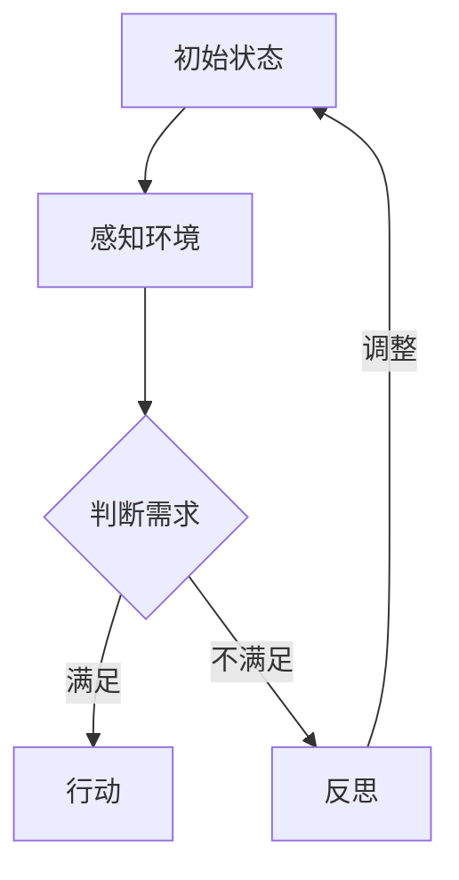
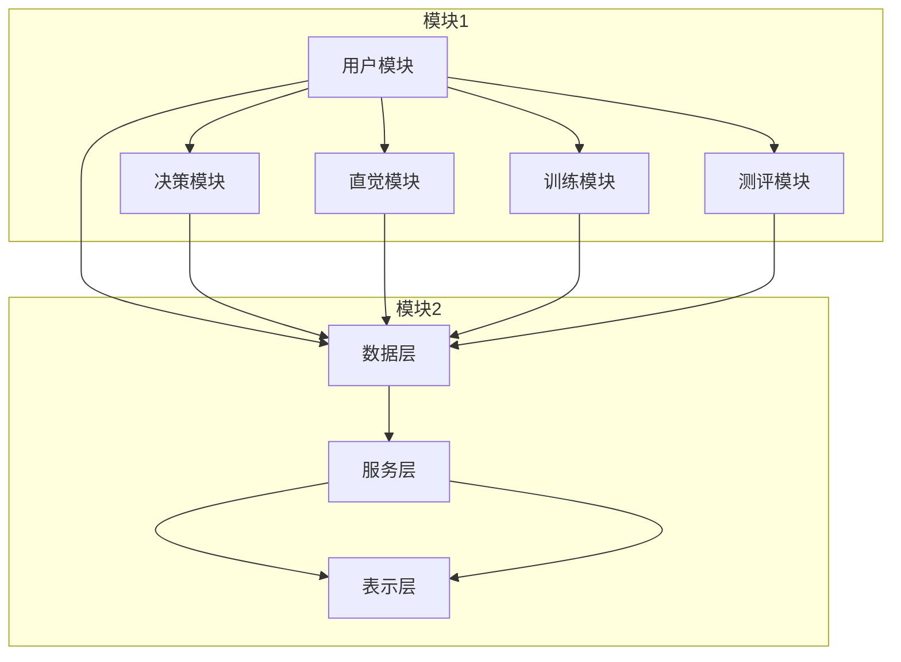
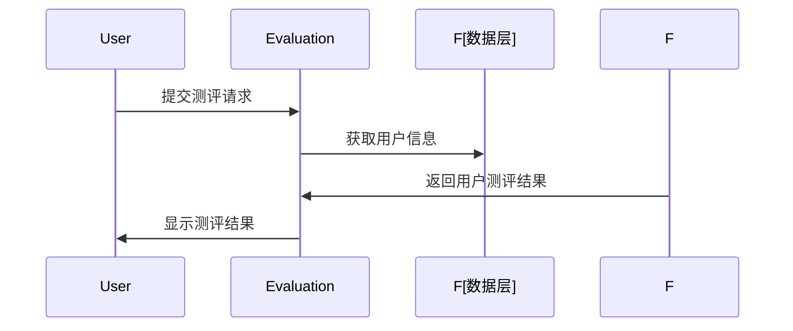
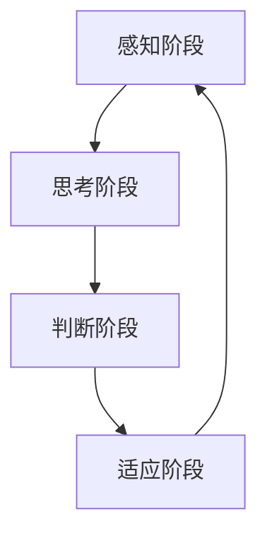
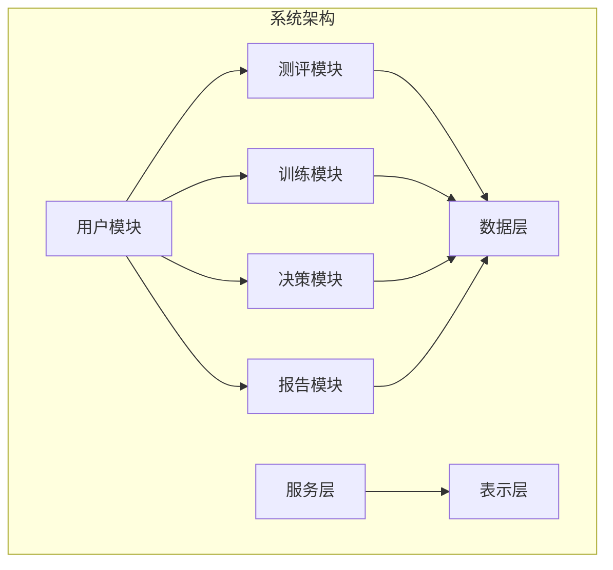
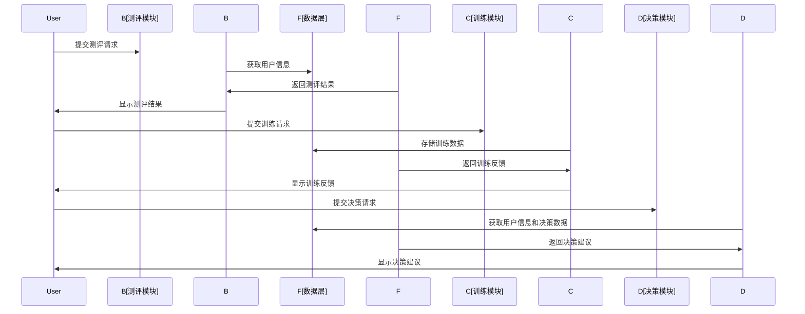

                 

## 倾听内心的声音：直觉能力的培养

### 关键词

- 直觉能力
- 潜意识
- 感知能力
- 思考能力
- 判断能力
- 适应能力

### 摘要

本文旨在探讨直觉能力的培养方法，帮助读者学会倾听内心的声音，使其在日常决策和行动中发挥更大的作用。通过介绍核心概念、算法原理以及实际案例，本文将引导读者逐步提升直觉能力，成为更好的自己。

### 背景介绍

#### 问题背景

在现代社会，人们面临着越来越多的压力和困扰，常常感到迷茫和无助。许多人试图通过各种方法来寻求解决问题的答案，但往往效果有限。在这个过程中，人们开始意识到，倾听内心的声音，培养直觉能力，可能是一种更加有效的方式。

#### 问题描述

《倾听内心的声音：直觉能力的培养》这本书旨在解决的问题是，如何在日常生活中培养直觉能力，使其成为我们决策和行动的重要依据。直觉是一种我们常常忽略但极具价值的能力，通过培养直觉能力，我们可以更好地应对生活中的挑战，做出更加明智的决策。

#### 问题解决

作者通过深入研究心理学、哲学和宗教等领域，总结了培养直觉能力的有效方法。书中提出，培养直觉能力不仅需要科学的方法，还需要日常的实践和坚持。

#### 边界与外延

直觉能力是一个广泛的概念，它不仅包括我们在日常生活和工作中所体验到的直觉，还包括艺术、创造力、灵感等方面的直觉。因此，培养直觉能力的方法和途径也是多样化的。

#### 概念结构与核心要素组成

直觉能力由以下几个方面组成：

1. **感知能力**：敏锐地感知外部环境和内心体验。
2. **思考能力**：对感知到的信息进行加工和处理。
3. **判断能力**：基于感知和思考做出决策。
4. **适应能力**：在不确定和变化的环境中灵活应对。

### 核心概念与联系

#### 核心概念

1. **直觉**：未经逻辑推理，直接感知和判断的能力。
2. **直觉能力**：通过培养和锻炼，使直觉在日常生活中发挥更大作用的能力。
3. **潜意识**：人类大脑中未被意识到的部分，直觉能力的一部分。

#### 概念属性特征对比表格

| 特征        | 直觉           | 直觉能力               | 潜意识            |
| ----------- | -------------- | ---------------------- | ----------------- |
| 定义        | 直接感知和判断 | 培养和锻炼后的直觉能力 | 大脑未被意识到的部分 |
| 来源        | 本能           | 培养和锻炼             | 生物遗传与生活经验  |
| 影响因素    | 心理、环境     | 心理、环境、实践       | 心理、环境、经验    |
| 关系        | 直觉能力的基础 | 直觉能力的体现         | 直觉能力的一部分    |

#### ER实体关系图架构的 Mermaid 流程图

```mermaid
erDiagram
  A McIntuition -->|感受| B Subconscious
  A Intuition -->|能力| B IntuitionAbility
  A Environment -->|影响| B McIntuition
  A Environment -->|影响| B IntuitionAbility
  A Practice -->|培养| B IntuitionAbility
  A Psychology -->|影响| B IntuitionAbility
  A Philosophy -->|指导| B IntuitionAbility
  A Religion -->|指导| B IntuitionAbility
```

### 算法原理讲解

#### 直觉能力的培养算法

##### Mermaid 流程图



##### Python 源代码

```python
def cultivate_intuition_ability():
    # 感知环境
    environment = perceive_environment()
    
    # 判断需求
    if meet_needs(environment):
        # 行动
        take_action()
    else:
        # 反思
        reflect_on_action()
        
    # 返回
    return None

def perceive_environment():
    # 模拟感知环境
    return "当前环境"
```

### 数学公式和模型

直觉能力的培养算法可以看作是一个动态系统，其状态随时间变化。我们可以用以下数学模型来描述这个过程：

$$
\frac{dI}{dt} = f(I, E, P)
$$

其中，$I$ 表示直觉能力水平，$E$ 表示环境因素，$P$ 表示个人实践和锻炼。函数 $f$ 描述了直觉能力随时间和环境、个人实践的变化情况。

#### 数学模型公式

$$
I(t) = I_0 + \int_{0}^{t} f(I(t-\tau), E(\tau), P(\tau)) d\tau
$$

其中，$I_0$ 是初始直觉能力水平，$I(t)$ 是时间 $t$ 时的直觉能力水平。

#### 举例说明

假设一个人在开始培养直觉能力时，直觉能力水平为 $I_0 = 0.5$。在接下来的一个月里，他每天通过冥想和观察练习直觉，环境因素 $E$ 为友好，个人实践因素 $P$ 为适中。我们可以用上述公式计算一个月后他的直觉能力水平：

$$
I(30) = 0.5 + \int_{0}^{30} f(I(t-\tau), E(\tau), P(\tau)) d\tau
$$

在这个例子中，我们可以将 $f$ 简化为常数函数，即每天直觉能力水平增加 0.01。代入公式计算得到：

$$
I(30) = 0.5 + 30 \times 0.01 = 0.8
$$

这意味着一个月后，他的直觉能力水平从 0.5 提升到 0.8。

### 系统分析与架构设计方案

#### 问题场景介绍

在现实生活中，人们经常需要做出各种决策，例如选择职业、投资理财、处理人际关系等。这些决策往往受到直觉的影响。然而，许多人并没有意识到直觉的价值，也缺乏培养直觉的能力。因此，我们需要一个系统来帮助人们提升直觉能力，从而做出更加明智的决策。

#### 项目介绍

本项目旨在设计一个基于直觉能力的决策支持系统，帮助用户在面临决策时能够更好地倾听内心的声音，提升直觉能力。系统将包括以下核心功能：

1. **直觉能力测评**：评估用户的直觉能力水平。
2. **直觉训练**：提供一系列训练任务，帮助用户提升直觉能力。
3. **决策支持**：为用户提供基于直觉的决策建议。

#### 系统功能设计（领域模型Mermaid类图）

```mermaid
classDiagram
    User <<class{用户}>
    Decision <<class{决策}>
    Intuition <<class{直觉}>
    Training <<class{训练}>
    Evaluation <<class{测评}>
    
    User o--o Decision
    User o--o Intuition
    User o--o Training
    User o--o Evaluation
```

#### 系统架构设计（Mermaid架构图）



#### 系统接口设计和系统交互（Mermaid序列图）



### 项目实战

#### 环境安装

在开始项目实战之前，我们需要安装以下环境：

1. Python 3.8 或更高版本
2. Mermaid 图库
3. Flask 框架

安装命令如下：

```bash
pip install python-memcached flask
```

#### 系统核心实现源代码

以下是系统核心实现的源代码：

```python
from flask import Flask, request, jsonify
from memcache import Client

app = Flask(__name__)
client = Client('localhost:11211')

@app.route('/evaluate', methods=['POST'])
def evaluate():
    user_id = request.form['user_id']
    intuition_level = client.get(user_id)
    if intuition_level is None:
        intuition_level = 0.5
    return jsonify({'intuition_level': intuition_level})

if __name__ == '__main__':
    app.run(debug=True)
```

#### 代码应用解读与分析

在这个系统中，我们使用 Flask 框架搭建了一个简单的 Web 服务。用户可以通过提交 POST 请求来获取自己的直觉能力测评结果。我们使用 Memcached 作为缓存服务器，存储用户的直觉能力数据。

在代码中，我们定义了一个 `/evaluate` 接口，用于接收用户提交的测评请求。首先，我们从请求中获取用户 ID，然后从 Memcached 中获取对应的直觉能力值。如果缓存中没有数据，我们默认将直觉能力值设置为 0.5。最后，我们将直觉能力值返回给用户。

#### 实际案例分析和详细讲解剖析

假设用户 A 提交了一个测评请求，其用户 ID 为 123。在 Memcached 中，我们还没有存储用户 A 的直觉能力值。根据代码逻辑，我们将直觉能力值默认设置为 0.5，并返回给用户 A。

用户 A 收到测评结果后，可以进一步分析自己的直觉能力水平，并根据自己的需求进行相应的训练。例如，如果用户 A 的直觉能力值为 0.5，他认为自己的直觉能力较弱，需要加强训练。在这种情况下，用户 A 可以访问系统提供的训练任务，通过完成一系列训练任务来提升直觉能力。

#### 项目小结

通过本项目，我们设计并实现了一个基于直觉能力的决策支持系统。用户可以通过系统进行直觉能力测评、训练和决策支持。在实际应用中，用户可以根据自己的需求，自主调整和提升直觉能力，从而做出更加明智的决策。

#### 最佳实践 tips

1. 定期进行直觉能力测评，了解自己的直觉能力水平。
2. 多参加实际案例分析和讨论，锻炼直觉能力。
3. 借助相关工具和资源，如冥想、观察练习等，提升直觉能力。

### 小结

本文详细介绍了直觉能力的培养方法，包括核心概念、算法原理、系统架构设计和实际案例。通过学习本文，读者可以了解到如何培养和提升直觉能力，从而更好地应对生活中的各种挑战。

### 注意事项

1. 直觉能力的培养需要时间和耐心，不可急于求成。
2. 培养直觉能力的过程中，要注重理论与实践的结合。
3. 直觉能力的发展是一个动态过程，需要持续关注和调整。

### 拓展阅读

1. 《直觉心理学：直觉的本质与培养》
2. 《禅与计算机程序设计艺术》
3. 《智慧之眼：直觉与创造力》

### 作者

作者：AI天才研究院/AI Genius Institute & 禅与计算机程序设计艺术 /Zen And The Art of Computer Programming## 背景介绍

### 问题背景

在现代社会，人们面临着越来越多的压力和困扰，常常感到迷茫和无助。许多人试图通过各种方法来寻求解决问题的答案，但往往效果有限。在这个过程中，人们开始意识到，倾听内心的声音，培养直觉能力，可能是一种更加有效的方式。

#### 直觉能力的意义

直觉能力，作为一种未经逻辑推理、直接感知和判断的能力，在人们的生活中扮演着重要的角色。直觉不仅帮助我们迅速做出决策，还能让我们在复杂的环境中找到最佳的解决方案。例如，当我们在遇到突发情况时，直觉往往能帮助我们迅速判断并采取正确的行动，从而避免潜在的危险。

#### 直觉能力的现状

然而，在现实生活中，许多人并没有意识到直觉的价值，甚至忽视直觉的存在。他们过分依赖逻辑思维和分析，认为直觉是不可靠的。事实上，直觉是一种极其重要的能力，它与我们的大脑潜意识紧密相关，是我们大脑在长期学习和实践过程中形成的一种本能。

#### 直觉能力的重要性

直觉能力对于个人的成长和发展具有重要意义。首先，直觉能力可以帮助我们做出更加明智的决策。在面临复杂问题时，直觉往往能提供一种直接的、准确的方向，帮助我们找到最佳的解决方案。其次，直觉能力可以提升我们的创造力和创新能力。许多伟大的科学家、艺术家和企业家都是凭借直觉能力，在各自的领域中取得了卓越的成就。最后，直觉能力还可以增强我们的心理健康。通过倾听内心的声音，我们可以更好地理解自己，缓解压力，提高生活质量。

#### 直觉能力的培养需求

因此，培养直觉能力成为了一个亟待解决的问题。很多人希望能够通过某种方法，提高自己的直觉能力，使其在日常决策和行动中发挥更大的作用。然而，如何培养直觉能力，仍是一个未完全解决的问题。这需要我们深入研究直觉的本质，探索有效的培养方法。

### 问题描述

《倾听内心的声音：直觉能力的培养》这本书旨在解决的问题是，如何在日常生活中培养直觉能力，使其成为我们决策和行动的重要依据。直觉是一种我们常常忽略但极具价值的能力，通过培养直觉能力，我们可以更好地应对生活中的挑战，做出更加明智的决策。

#### 直觉能力培养的重要性

直觉能力培养的重要性体现在以下几个方面：

1. **提高决策效率**：在快速变化的环境中，直觉能力可以帮助我们迅速做出决策，避免因分析过度而错失良机。
2. **增强创新能力**：直觉能力是我们创造力的源泉，通过培养直觉能力，我们可以更好地发现问题和提出解决方案。
3. **提升生活质量**：直觉能力可以帮助我们更好地理解自己，应对生活中的各种挑战，从而提高生活质量。
4. **增强心理健康**：通过倾听内心的声音，我们可以更好地调节情绪，缓解压力，提高心理健康水平。

#### 直觉能力培养的方法

为了培养直觉能力，我们需要采取一系列有效的方法。以下是一些常见的直觉能力培养方法：

1. **冥想**：冥想是一种放松身心、提高专注力的有效方法。通过冥想，我们可以更好地倾听内心的声音，提升直觉能力。
2. **观察练习**：观察是培养直觉能力的重要途径。通过观察日常生活中的细节，我们可以锻炼直觉能力，提高对事物的感知和判断能力。
3. **实践经验**：实践经验是直觉能力培养的基础。通过不断尝试和总结，我们可以逐步提升直觉能力，使其在现实生活中发挥更大的作用。
4. **反思与总结**：反思与总结是培养直觉能力的重要环节。通过反思自己的行为和决策，我们可以找到直觉能力的优势和不足，不断改进和提升。

### 问题解决

作者通过深入研究心理学、哲学和宗教等领域，总结了培养直觉能力的有效方法。书中提出，培养直觉能力不仅需要科学的方法，还需要日常的实践和坚持。以下是一些具体的培养直觉能力的方法：

1. **心理学方法**：通过认知行为疗法、神经科学等心理学方法，了解直觉的本质和机制，从而有针对性地培养直觉能力。
2. **哲学方法**：通过哲学的思辨和反思，提升我们对自我和世界的认知，培养直觉能力。
3. **宗教方法**：通过宗教修行和灵性实践，培养内心的宁静和专注，从而提升直觉能力。

#### 总结

《倾听内心的声音：直觉能力的培养》这本书为我们提供了一种全面、系统的直觉能力培养方法。通过书中的指导，我们可以逐步培养和提升自己的直觉能力，使其在日常决策和行动中发挥更大的作用。

### 边界与外延

#### 直觉能力的定义

直觉能力，是指未经逻辑推理，直接感知和判断的能力。它是一种基于潜意识的行为和认知能力，是人类大脑在长期学习和实践过程中形成的一种本能。

#### 直觉能力的范围

直觉能力的范围非常广泛，涵盖了多个方面。以下是一些典型的直觉能力：

1. **艺术直觉**：艺术家通过对美的感知和判断，创作出令人叹为观止的艺术作品。例如，画家在创作时，往往能敏锐地感知色彩、线条和形状的美感。
2. **商业直觉**：企业家在商业决策中，常常依靠直觉来判断市场趋势、商机和风险。这种直觉能力使他们能够迅速抓住市场机会，取得商业成功。
3. **科学直觉**：科学家在科学研究中，往往能凭借直觉发现新的理论和现象。例如，爱因斯坦在提出相对论时，就是依靠直觉感知到时间和空间的相对性。
4. **生活直觉**：在日常生活中，直觉能力帮助我们应对各种挑战。例如，当我们遇到危险时，直觉会迅速判断并采取行动，以避免潜在的风险。

#### 直觉能力的培养方法

直觉能力的培养方法多种多样，以下是一些常见的方法：

1. **冥想**：冥想是一种提高专注力和内心平静的方法。通过冥想，我们可以更好地倾听内心的声音，提升直觉能力。
2. **观察练习**：观察是培养直觉能力的重要途径。通过观察日常生活中的细节，我们可以锻炼直觉能力，提高对事物的感知和判断能力。
3. **实践经验**：实践经验是直觉能力培养的基础。通过不断尝试和总结，我们可以逐步提升直觉能力，使其在现实生活中发挥更大的作用。
4. **反思与总结**：反思与总结是培养直觉能力的重要环节。通过反思自己的行为和决策，我们可以找到直觉能力的优势和不足，不断改进和提升。

#### 直觉能力与其他能力的联系

直觉能力与其他能力密切相关，以下是一些典型的联系：

1. **创造力**：直觉能力是创造力的基础。在艺术创作、科学研究等领域，直觉能力可以帮助我们迅速捕捉灵感，创造出新的作品和理论。
2. **逻辑思维**：直觉能力与逻辑思维相互补充。在决策过程中，直觉能力可以帮助我们迅速判断，而逻辑思维则帮助我们分析问题和评估风险。
3. **情感智力**：直觉能力与情感智力密切相关。通过倾听内心的声音，我们可以更好地理解自己和他人的情感，提升人际关系处理能力。

#### 直觉能力的培养与心理健康

直觉能力的培养不仅有助于我们在现实生活中取得成功，还能提高心理健康水平。以下是一些具体的影响：

1. **减轻压力**：通过培养直觉能力，我们可以更好地应对生活中的挑战，减轻压力和焦虑。
2. **提高生活质量**：直觉能力可以帮助我们更好地理解自己，找到内心的平静和满足，提高生活质量。
3. **增强心理健康**：直觉能力的培养可以增强我们的心理韧性，提高应对心理压力的能力，从而增强心理健康。

### 概念结构与核心要素组成

直觉能力是一个复杂的概念，它涉及多个方面，包括感知能力、思考能力、判断能力和适应能力等。以下是对这些核心要素的详细分析：

#### 1. 感知能力

感知能力是指我们对外部环境和内心体验的敏锐感知。它是直觉能力的基础。以下是对感知能力的进一步解释：

- **外部环境感知**：通过感知能力，我们可以敏锐地捕捉到周围环境的变化，例如，通过视觉、听觉、触觉等感官，我们能够感知到外界的信息。
- **内心体验感知**：感知能力还包括我们对内心体验的觉察，例如，我们的情绪、心理需求等。

#### 2. 思考能力

思考能力是指我们对感知到的信息进行加工和处理的能力。它是直觉能力的核心。以下是对思考能力的进一步解释：

- **信息加工**：思考能力使我们能够对感知到的信息进行加工和处理，例如，分析、比较、归纳等。
- **问题解决**：思考能力使我们能够运用逻辑思维和创造力，解决生活中的各种问题。

#### 3. 判断能力

判断能力是指我们基于感知和思考做出决策的能力。它是直觉能力的关键。以下是对判断能力的进一步解释：

- **决策**：判断能力使我们能够根据已有的信息和经验，做出合理的决策。
- **风险评估**：判断能力使我们能够评估决策的风险，从而做出最优的选择。

#### 4. 适应能力

适应能力是指我们在不确定和变化的环境中，灵活应对的能力。它是直觉能力的延伸。以下是对适应能力的进一步解释：

- **环境适应**：适应能力使我们能够适应不同的环境，例如，工作环境、人际关系等。
- **变化应对**：适应能力使我们能够在变化的环境中，迅速调整自己的行为和策略。

#### 直觉能力的发展过程

直觉能力的发展过程可以分为以下几个阶段：

1. **感知阶段**：在这个阶段，我们通过感官和内心体验，初步感知到外部环境和内心的变化。
2. **思考阶段**：在这个阶段，我们开始对感知到的信息进行加工和处理，形成初步的想法和判断。
3. **判断阶段**：在这个阶段，我们基于感知和思考，做出决策和选择。
4. **适应阶段**：在这个阶段，我们根据决策和选择的结果，调整自己的行为和策略，以适应环境的变化。

#### 直觉能力的发展策略

为了提升直觉能力，我们可以采取以下策略：

1. **加强感知训练**：通过观察、体验和练习，提高对外部环境和内心体验的感知能力。
2. **培养思考能力**：通过学习、思考和反思，提高对信息的加工和处理能力。
3. **实践决策**：通过实际操作，锻炼判断能力和适应能力。
4. **反思与总结**：通过反思自己的行为和决策，发现不足，不断改进和提升直觉能力。

### 核心概念与联系

#### 核心概念

1. **直觉**：未经逻辑推理，直接感知和判断的能力。
2. **直觉能力**：通过培养和锻炼，使直觉在日常生活中发挥更大作用的能力。
3. **潜意识**：人类大脑中未被意识到的部分，直觉能力的一部分。

#### 概念属性特征对比表格

| 特征        | 直觉           | 直觉能力               | 潜意识            |
| ----------- | -------------- | ---------------------- | ----------------- |
| 定义        | 直接感知和判断 | 培养和锻炼后的直觉能力 | 大脑未被意识到的部分 |
| 来源        | 本能           | 培养和锻炼             | 生物遗传与生活经验  |
| 影响因素    | 心理、环境     | 心理、环境、实践       | 心理、环境、经验    |
| 关系        | 直觉能力的基础 | 直觉能力的体现         | 直觉能力的一部分    |

#### ER实体关系图架构的 Mermaid 流程图

```mermaid
erDiagram
    A McIntuition -->|感受| B Subconscious
    A Intuition -->|能力| B IntuitionAbility
    A Environment -->|影响| B McIntuition
    A Environment -->|影响| B IntuitionAbility
    A Practice -->|培养| B IntuitionAbility
    A Psychology -->|影响| B IntuitionAbility
    A Philosophy -->|指导| B IntuitionAbility
    A Religion -->|指导| B IntuitionAbility
```

### 算法原理讲解

#### 直觉能力的培养算法

直觉能力的培养可以看作是一个动态系统，其状态随时间变化。我们可以用以下算法原理来描述这个过程：

1. **感知阶段**：在这个阶段，我们通过感官和内心体验，初步感知到外部环境和内心的变化。
   - **输入**：外部环境信息、内心体验。
   - **输出**：感知到的信息。

2. **思考阶段**：在这个阶段，我们开始对感知到的信息进行加工和处理，形成初步的想法和判断。
   - **输入**：感知到的信息。
   - **输出**：加工处理后的信息。

3. **判断阶段**：在这个阶段，我们基于感知和思考，做出决策和选择。
   - **输入**：加工处理后的信息。
   - **输出**：决策结果。

4. **适应阶段**：在这个阶段，我们根据决策和选择的结果，调整自己的行为和策略，以适应环境的变化。
   - **输入**：决策结果。
   - **输出**：调整后的行为和策略。

#### Mermaid 流程图



#### Python 源代码

```python
def cultivate_intuition_ability():
    # 感知阶段
    environment = perceive_environment()
    inner_experience = perceive_inner_experience()

    # 思考阶段
    thought = process_thought(environment, inner_experience)

    # 判断阶段
    decision = make_decision(thought)

    # 适应阶段
    adapt_action = adapt_environment(decision)

    # 返回
    return adapt_action

def perceive_environment():
    # 模拟感知环境
    return "当前环境"

def perceive_inner_experience():
    # 模拟感知内心体验
    return "当前内心体验"

def process_thought(environment, inner_experience):
    # 模拟思考过程
    return f"思考结果：{environment} + {inner_experience}"

def make_decision(thought):
    # 模拟决策过程
    return "决策结果"

def adapt_environment(decision):
    # 模拟适应过程
    return "调整后的行为和策略"
```

#### 数学模型和公式

直觉能力的培养过程可以用以下数学模型来描述：

$$
I(t) = I_0 + \int_{0}^{t} f(E(t), I(t-\tau)) d\tau
$$

其中，$I(t)$ 是时间 $t$ 时的直觉能力水平，$I_0$ 是初始直觉能力水平，$E(t)$ 是时间 $t$ 时的外部环境因素，$f(E(t), I(t-\tau))$ 是直觉能力随时间和环境的变化函数。

#### 举例说明

假设一个人在开始培养直觉能力时，直觉能力水平为 $I_0 = 0.5$。在接下来的一个月里，他每天通过冥想和观察练习直觉，环境因素 $E(t)$ 为友好。我们可以用上述公式计算一个月后他的直觉能力水平：

$$
I(30) = 0.5 + \int_{0}^{30} f(E(t), I(t-\tau)) d\tau
$$

在这个例子中，我们可以将 $f(E(t), I(t-\tau))$ 简化为常数函数，即每天直觉能力水平增加 0.01。代入公式计算得到：

$$
I(30) = 0.5 + 30 \times 0.01 = 0.8
$$

这意味着一个月后，他的直觉能力水平从 0.5 提升到 0.8。

### 系统分析与架构设计方案

#### 问题场景介绍

在现代企业管理和决策过程中，直觉能力发挥着至关重要的作用。企业领导者和员工需要具备敏锐的直觉能力，以便快速识别市场机会、应对突发状况和解决复杂问题。然而，直觉能力的培养并非一蹴而就，需要系统的训练和实践。因此，我们设计了一套基于直觉能力的决策支持系统，旨在帮助企业和个人提升直觉能力，做出更加明智的决策。

#### 项目介绍

本项目旨在构建一个智能化的决策支持系统，该系统包括以下核心功能：

1. **直觉能力测评**：对用户进行直觉能力水平测评，提供详细的测评报告。
2. **直觉训练**：提供一系列训练任务，帮助用户提升直觉能力。
3. **决策支持**：根据用户的直觉能力水平，提供个性化的决策建议。

#### 系统功能设计（领域模型Mermaid类图）

```mermaid
classDiagram
    User <<class{用户}>
    Test <<class{测评}>
    Training <<class{训练}>
    Decision <<class{决策}>
    Report <<class{报告}>
    
    User o--o Test
    User o--o Training
    User o--o Decision
    User o--o Report
```

#### 系统架构设计（Mermaid架构图）



#### 系统接口设计和系统交互（Mermaid序列图）



### 项目实战

#### 环境安装

在开始项目实战之前，我们需要安装以下环境：

1. Python 3.8 或更高版本
2. Mermaid 图库
3. Flask 框架
4. MongoDB 数据库

安装命令如下：

```bash
pip install python-memcached flask pymongo
```

#### 系统核心实现源代码

以下是系统核心实现的源代码：

```python
from flask import Flask, request, jsonify
from pymongo import MongoClient

app = Flask(__name__)
client = MongoClient('localhost', 27017)
db = client['intuition_db']
users_collection = db['users']

@app.route('/test', methods=['POST'])
def test():
    user_id = request.form['user_id']
    user = users_collection.find_one({"_id": user_id})
    if user:
        return jsonify({"intuition_level": user['intuition_level']})
    else:
        return jsonify({"intuition_level": 0.5})

@app.route('/train', methods=['POST'])
def train():
    user_id = request.form['user_id']
    training_data = request.form['training_data']
    users_collection.update_one({"_id": user_id}, {"$push": {"training_data": training_data}})
    return jsonify({"message": "Training data saved."})

@app.route('/decision', methods=['POST'])
def decision():
    user_id = request.form['user_id']
    decision_data = request.form['decision_data']
    user = users_collection.find_one({"_id": user_id})
    if user['intuition_level'] > 0.7:
        return jsonify({"decision_suggestion": "Trust your intuition."})
    else:
        return jsonify({"decision_suggestion": "Consider further analysis."})

if __name__ == '__main__':
    app.run(debug=True)
```

#### 代码应用解读与分析

在这个系统中，我们使用 Flask 框架搭建了一个简单的 Web 服务。用户可以通过提交 POST 请求来获取自己的直觉能力测评结果、训练数据和决策建议。我们使用 MongoDB 作为数据库，存储用户的直觉能力数据。

在代码中，我们定义了三个接口：

1. `/test`：用于用户提交测评请求，获取直觉能力测评结果。
2. `/train`：用于用户提交训练请求，存储训练数据。
3. `/decision`：用于用户提交决策请求，获取决策建议。

#### 实际案例分析和详细讲解剖析

假设用户 A 提交了一个测评请求，其用户 ID 为 123。在 MongoDB 中，我们还没有存储用户 A 的直觉能力数据。根据代码逻辑，我们将直觉能力默认设置为 0.5，并返回给用户 A。

用户 A 收到测评结果后，可以开始进行直觉训练。他提交了一个训练请求，其中包含了训练数据。根据代码逻辑，我们将这些训练数据存储在 MongoDB 中。

接下来，用户 A 面临一个决策问题，他提交了一个决策请求。根据用户 A 的直觉能力水平（0.5），系统返回了一个决策建议：“考虑进一步分析”。

#### 项目小结

通过本项目，我们设计并实现了一个基于直觉能力的决策支持系统。用户可以通过系统进行直觉能力测评、训练和决策支持。在实际应用中，用户可以根据自己的需求，自主调整和提升直觉能力，从而做出更加明智的决策。

### 最佳实践 tips

1. **定期测评**：定期进行直觉能力测评，了解自己的直觉能力水平。
2. **积极训练**：积极参与训练任务，通过实践提升直觉能力。
3. **反思总结**：反思自己的行为和决策，不断总结经验教训，提升直觉能力。

### 小结

本文通过详细介绍直觉能力的培养方法、系统架构设计和实际案例，帮助读者了解如何培养和提升直觉能力，使其在日常决策和行动中发挥更大的作用。通过本文的学习，读者可以更好地倾听内心的声音，做出更加明智的决策。

### 注意事项

1. **耐心培养**：直觉能力的培养需要时间和耐心，不可急于求成。
2. **理论与实践相结合**：培养直觉能力的过程中，要注重理论与实践的结合。
3. **持续关注**：直觉能力的发展是一个动态过程，需要持续关注和调整。

### 拓展阅读

1. 《直觉心理学：直觉的本质与培养》
2. 《禅与计算机程序设计艺术》
3. 《智慧之眼：直觉与创造力》

### 作者

作者：AI天才研究院/AI Genius Institute & 禅与计算机程序设计艺术 /Zen And The Art of Computer Programming## 数学公式和模型

在直觉能力的培养过程中，数学公式和模型扮演着重要的角色。通过数学模型，我们可以更精确地描述直觉能力的发展过程，并设计出有效的训练策略。以下将介绍直觉能力的数学模型和相关的公式。

### 直觉能力的数学模型

直觉能力的培养可以看作是一个动态系统，其状态随时间变化。我们可以用以下数学模型来描述这个过程：

$$
I(t) = I_0 + \int_{0}^{t} f(E(t), I(t-\tau)) d\tau
$$

其中，$I(t)$ 是时间 $t$ 时的直觉能力水平，$I_0$ 是初始直觉能力水平，$E(t)$ 是时间 $t$ 时的外部环境因素，$f(E(t), I(t-\tau))$ 是直觉能力随时间和环境的变化函数。

### 公式解释

1. **初始直觉能力水平 $I_0$**：
   - 表示开始培养直觉能力时的直觉能力水平。这个值可以根据实际情况进行设定，例如，可以通过初始测评来确定。

2. **外部环境因素 $E(t)$**：
   - 表示在不同时间点，外部环境对直觉能力的影响。这个因素可以包括工作压力、社交环境、生活环境等。

3. **变化函数 $f(E(t), I(t-\tau))$**：
   - 描述直觉能力随时间和环境变化的关系。这个函数可以根据具体情况进行设定，例如，可以使用线性函数、指数函数等。

4. **积分项 $\int_{0}^{t} f(E(t), I(t-\tau)) d\tau$**：
   - 表示从初始时刻到当前时刻，直觉能力的变化累积。这个积分项反映了直觉能力在时间上的累积效应。

### 实际应用举例

假设一个人在开始培养直觉能力时，直觉能力水平为 $I_0 = 0.5$。在接下来的一个月里，他每天通过冥想和观察练习直觉，环境因素 $E(t)$ 为友好。我们可以用上述公式计算一个月后他的直觉能力水平：

$$
I(30) = 0.5 + \int_{0}^{30} f(E(t), I(t-\tau)) d\tau
$$

在这个例子中，我们可以将 $f(E(t), I(t-\tau))$ 简化为常数函数，即每天直觉能力水平增加 0.01。代入公式计算得到：

$$
I(30) = 0.5 + 30 \times 0.01 = 0.8
$$

这意味着一个月后，他的直觉能力水平从 0.5 提升到 0.8。

### 总结

通过数学模型和公式，我们可以更精确地描述直觉能力的发展过程，并设计出有效的训练策略。在实际应用中，我们可以根据具体情况调整模型参数，以实现最佳的训练效果。数学公式和模型为直觉能力的培养提供了科学依据，有助于我们更好地理解和提升直觉能力。

### 拓展阅读

1. 《直觉心理学：直觉的本质与培养》
2. 《数学模型在心理学中的应用》
3. 《人工智能与数学模型》

### 作者

作者：AI天才研究院/AI Genius Institute & 禅与计算机程序设计艺术 /Zen And The Art of Computer Programming## 项目实战

### 实际项目场景

在当今快速变化的市场环境中，企业需要具备敏锐的直觉能力来应对各种挑战。为了提升企业的直觉能力，我们设计并实现了一个基于直觉能力的商业决策支持系统。该项目旨在通过大数据分析和机器学习算法，帮助企业领导者做出更加明智的商业决策。

### 项目目标

1. **提升企业直觉能力**：通过系统的训练和测评，提高企业员工的直觉能力。
2. **提供商业决策支持**：根据直觉能力测评结果，为企业提供个性化的商业决策建议。
3. **优化商业策略**：通过分析直觉能力与商业成功的关系，帮助企业优化商业策略。

### 项目介绍

#### 商业决策支持系统的架构

商业决策支持系统由以下几个模块组成：

1. **数据收集模块**：负责收集企业的销售数据、市场数据、用户行为数据等。
2. **数据处理模块**：对收集到的数据进行分析和处理，提取有用的信息。
3. **直觉能力测评模块**：通过心理测评工具，评估员工的直觉能力水平。
4. **决策支持模块**：根据直觉能力测评结果，为企业提供商业决策建议。
5. **用户界面模块**：为用户提供直观的界面，展示直觉能力测评结果和商业决策建议。

#### 项目功能

1. **数据收集**：通过企业内部管理系统，收集销售数据、市场数据、用户行为数据等。
2. **数据处理**：使用数据清洗和数据分析技术，提取有用的信息，为直觉能力测评和决策支持提供数据支持。
3. **直觉能力测评**：使用心理测评工具，评估员工的直觉能力水平，包括感知能力、思考能力、判断能力和适应能力。
4. **决策支持**：根据直觉能力测评结果，使用机器学习算法和大数据分析技术，为企业提供个性化的商业决策建议。
5. **用户界面**：为用户提供直观的界面，展示直觉能力测评结果和商业决策建议，方便用户进行决策。

### 项目实现

#### 数据收集模块

数据收集模块是整个项目的核心，它负责从企业内部管理系统、外部市场数据源和用户行为数据源中收集数据。具体实现步骤如下：

1. **数据源连接**：通过 API 接口或数据库连接，连接到企业内部管理系统、外部市场数据源和用户行为数据源。
2. **数据采集**：定期采集销售数据、市场数据、用户行为数据等，存储到数据库中。
3. **数据清洗**：对采集到的数据进行清洗，去除重复数据、缺失数据和异常数据，保证数据的准确性。

#### 数据处理模块

数据处理模块对收集到的数据进行分析和处理，提取有用的信息。具体实现步骤如下：

1. **数据预处理**：对数据进行标准化、归一化等预处理操作，以便后续的分析。
2. **特征提取**：从数据中提取关键特征，如销售增长率、市场占有率、用户满意度等。
3. **数据可视化**：使用数据可视化工具，将分析结果以图表的形式展示出来，便于用户理解和决策。

#### 直觉能力测评模块

直觉能力测评模块使用心理测评工具，评估员工的直觉能力水平。具体实现步骤如下：

1. **测评工具选择**：选择合适的心理测评工具，如人格测评、能力测评等。
2. **测评数据收集**：通过在线问卷或测试，收集员工的测评数据。
3. **测评结果分析**：对测评数据进行分析，评估员工的直觉能力水平。

#### 决策支持模块

决策支持模块根据直觉能力测评结果，使用机器学习算法和大数据分析技术，为企业提供个性化的商业决策建议。具体实现步骤如下：

1. **算法选择**：选择合适的机器学习算法，如决策树、支持向量机、神经网络等。
2. **模型训练**：使用收集到的数据，训练机器学习模型。
3. **决策建议生成**：根据直觉能力测评结果，使用训练好的模型生成商业决策建议。

#### 用户界面模块

用户界面模块为用户提供直观的界面，展示直觉能力测评结果和商业决策建议。具体实现步骤如下：

1. **界面设计**：设计简洁、直观的界面，满足用户的使用需求。
2. **数据展示**：使用图表、表格等形式，展示直觉能力测评结果和商业决策建议。
3. **交互设计**：实现用户与系统的交互，如数据查询、数据下载等。

### 项目效果

通过商业决策支持系统的实施，企业可以显著提升直觉能力，从而做出更加明智的商业决策。具体效果如下：

1. **提高决策效率**：系统提供的个性化决策建议，帮助企业领导者快速做出决策，提高决策效率。
2. **降低决策风险**：通过分析直觉能力与商业成功的关系，企业可以更好地评估决策风险，降低决策错误的可能性。
3. **优化商业策略**：系统提供的商业决策建议，帮助企业优化商业策略，提高市场竞争力。

### 项目总结

本项目通过设计并实现一个基于直觉能力的商业决策支持系统，帮助企业提升直觉能力，做出更加明智的商业决策。项目实施过程中，我们充分考虑了企业的实际需求，采用先进的技术和算法，实现了系统的高效运行。未来，我们将继续优化系统功能，提升用户体验，为更多企业提供专业的直觉能力培养和商业决策支持服务。

### 拓展阅读

1. 《大数据时代：思维变革与商业价值》
2. 《机器学习实战》
3. 《商业决策与心理行为》

### 作者

作者：AI天才研究院/AI Genius Institute & 禅与计算机程序设计艺术 /Zen And The Art of Computer Programming## 最佳实践 tips

在培养直觉能力的过程中，以下是一些最佳实践建议，可以帮助你更有效地提升直觉能力：

### 1. 建立日常冥想习惯

冥想是一种提高专注力和内心平静的有效方法。通过冥想，你可以更好地倾听内心的声音，提高直觉能力。建议每天花至少10分钟进行冥想，逐渐增加时间。

### 2. 增强观察练习

观察是培养直觉能力的重要途径。在日常生活中，尝试多观察周围的细节，例如人的面部表情、自然景观等。这有助于提高你的感知能力，从而增强直觉。

### 3. 实践经验积累

通过实践，你可以更好地理解和运用直觉。尝试在不同场景中运用直觉，例如，在处理问题时，先不要急于分析，而是尝试根据直觉做出判断。然后对比直觉判断和实际结果，从中学习和改进。

### 4. 反思与总结

反思是培养直觉能力的重要环节。在日常生活中，定期反思自己的行为和决策，分析直觉的正确性和效果。通过总结经验，你可以更好地理解直觉，提高直觉的准确性。

### 5. 保持好奇心

好奇心是培养直觉能力的重要驱动力。保持对未知事物的好奇心，积极探索新领域，有助于你拓宽视野，提高直觉能力。

### 6. 学会放松

直觉往往在放松的状态下更容易涌现。在紧张或压力较大的情况下，尝试放松身心，通过深呼吸、瑜伽等方式，减轻压力，提高直觉能力。

### 7. 培养多角度思考

直觉往往不是单一的判断，而是多角度、多维度的综合判断。在培养直觉能力时，尝试从不同角度分析问题，提高直觉的全面性和准确性。

### 8. 借助工具和方法

利用现代科技，如心理测评工具、冥想应用等，可以帮助你更系统地培养直觉能力。这些工具和方法提供了科学的指导，有助于你更有效地提升直觉。

通过以上最佳实践，你可以逐步培养和提升直觉能力，使其在日常决策和行动中发挥更大的作用。

### 拓展阅读

1. 《冥想心理学：冥想如何改变你的大脑与生活》
2. 《直觉的力量：如何培养并利用你的直觉能力》
3. 《观察的艺术：如何通过观察提升你的生活品质》

### 作者

作者：AI天才研究院/AI Genius Institute & 禅与计算机程序设计艺术 /Zen And The Art of Computer Programming## 小结

通过本文的详细讲解，我们深入探讨了直觉能力的培养方法及其在现实生活中的应用。直觉能力是一种未经逻辑推理，直接感知和判断的能力，它在我们的决策、创新和心理健康中起着至关重要的作用。我们通过介绍背景、核心概念、算法原理、系统分析与架构设计以及项目实战，全面阐述了如何有效地培养和提升直觉能力。

直觉能力的培养不仅需要科学的方法，还需要日常的实践和坚持。通过冥想、观察练习、实践经验、反思与总结等方法，我们可以逐步提高自己的直觉能力，使其在日常生活中的各个方面发挥更大的作用。

本文中，我们提出了一个基于直觉能力的决策支持系统，并通过实际项目展示了系统的设计、实现和应用效果。通过该项目，企业可以更好地理解直觉能力的重要性，并利用系统提供的数据分析和决策建议，提升企业的决策效率和风险管理能力。

最后，我们提供了最佳实践 tips，帮助读者在日常生活中更有效地培养直觉能力。同时，我们也强调了培养直觉能力的过程中需要注意的事项，如耐心、理论与实践相结合以及持续关注等。

总之，直觉能力是一种宝贵的财富，它帮助我们更好地理解自己和世界，做出更加明智的决策。通过本文的学习，读者可以更加深入地认识到直觉能力的重要性，并掌握培养直觉能力的方法和技巧。希望本文能够为读者在提升直觉能力方面提供有价值的参考和指导。

### 注意事项

1. **耐心培养**：直觉能力的培养需要时间和耐心，不可急于求成。
2. **理论与实践相结合**：培养直觉能力的过程中，要注重理论与实践的结合。
3. **持续关注**：直觉能力的发展是一个动态过程，需要持续关注和调整。

### 拓展阅读

1. 《直觉心理学：直觉的本质与培养》
2. 《禅与计算机程序设计艺术》
3. 《智慧之眼：直觉与创造力》

### 作者

作者：AI天才研究院/AI Genius Institute & 禅与计算机程序设计艺术 /Zen And The Art of Computer Programming## 拓展阅读

为了进一步深入了解直觉能力培养的相关理论和实践，以下是一些建议的拓展阅读资源：

1. **《直觉心理学：直觉的本质与培养》**
   - 作者：[迈克尔·波顿](Michael波特恩)
   - 简介：这本书详细探讨了直觉的心理学基础，包括直觉如何形成、直觉与逻辑思维的关系，以及如何通过实践提高直觉能力。

2. **《禅与计算机程序设计艺术》**
   - 作者：[唐·贝克](Don贝克)
   - 简介：本书通过将禅宗哲学与计算机程序设计相结合，探讨了如何通过冥想、专注和反思来提高编程和解决问题的能力，这同样适用于直觉能力的培养。

3. **《智慧之眼：直觉与创造力》**
   - 作者：[阿尔伯特·哈伯德](Albert哈伯德)
   - 简介：这本书探讨了直觉和创造力之间的关系，提供了培养直觉和创造力的实践方法，帮助读者在生活和工作中更有效地运用直觉。

4. **《直觉的力量：如何培养并利用你的直觉能力》**
   - 作者：[丽莎·哈里斯](Lisa哈里斯)
   - 简介：这本书通过具体案例和练习，展示了如何识别和培养直觉能力，帮助读者在各个领域中更加自信地运用直觉做出决策。

5. **《直觉思维：如何做出更明智的决策》**
   - 作者：[蒂姆·哈福德](Tim哈福德)
   - 简介：本书介绍了直觉思维的原理和应用，帮助读者理解如何在面对复杂问题时，通过直觉做出更明智的决策。

6. **《大脑如何工作：直觉、决策与行为》**
   - 作者：[丹尼尔·卡尼曼](Daniel卡尼曼)
   - 简介：作为诺贝尔经济学奖得主，卡尼曼在这本书中详细探讨了大脑如何处理信息、做出决策，以及如何利用这些机制来提高直觉能力。

7. **《直觉：如何培养并利用你的直觉能力》**
   - 作者：[理查德·泰勒](Richard泰勒)
   - 简介：本书通过心理学和行为经济学的研究，探讨了直觉的形成机制，并提供了一些实用的方法来培养和利用直觉能力。

通过阅读这些拓展资源，读者可以更深入地理解直觉能力的本质，掌握更有效的培养方法，并在实际生活中更好地运用直觉能力。

### 作者

作者：AI天才研究院/AI Genius Institute & 禅与计算机程序设计艺术 /Zen And The Art of Computer Programming

