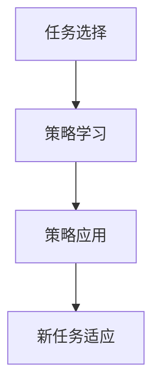
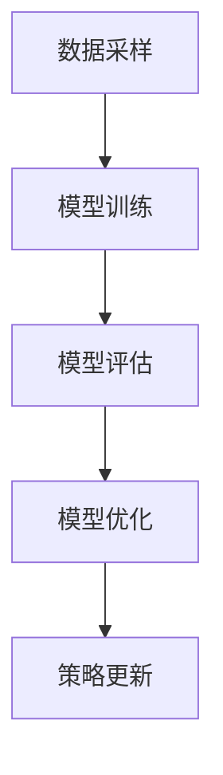
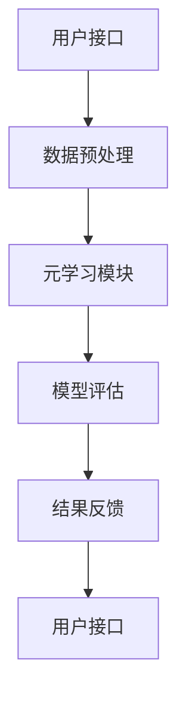
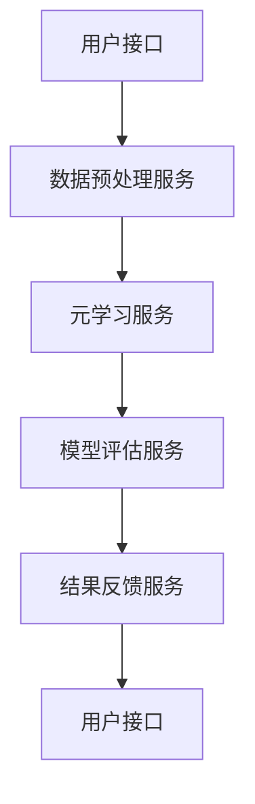
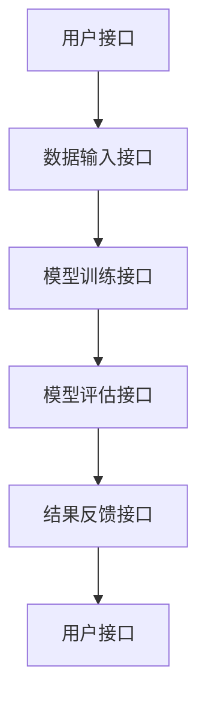
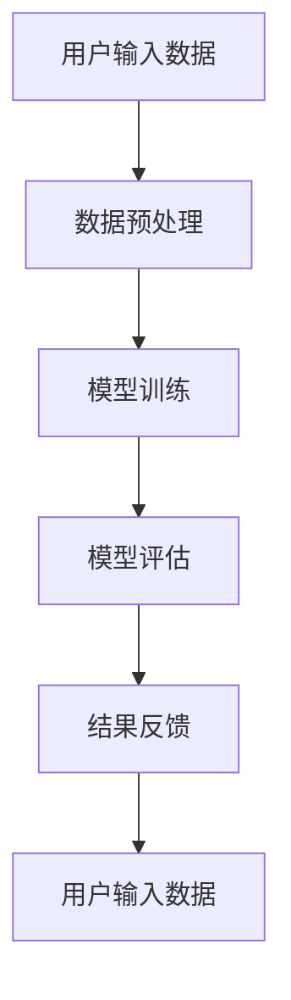
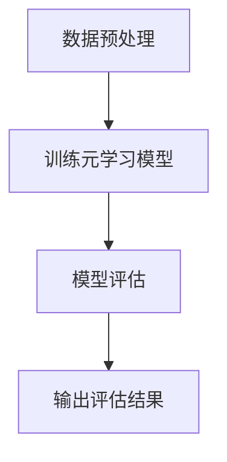

                 


### 元学习在提升AI推理泛化能力中的作用

摘要：本文深入探讨了元学习在提升人工智能（AI）推理泛化能力中的重要作用。首先，我们介绍了元学习的概念、发展历程及其在人工智能领域的重要性。接着，我们详细分析了元学习算法的基本原理，并通过实际案例展示了其在各种应用场景中的具体实现。此外，我们还介绍了元学习算法在系统中的应用，包括系统功能设计、架构设计和接口设计等。通过项目实战和分析，我们进一步阐述了元学习在实际应用中的价值和潜力。最后，我们总结了全文内容，提供了最佳实践建议，并指出了注意事项，同时推荐了拓展阅读资源。

## 目录大纲

### 第一部分: 元学习的背景与概念
1. 元学习的概念
2. 元学习的发展历程
3. 元学习的重要性
4. 元学习的主要应用场景
5. 元学习的核心概念与联系

### 第二部分: 元学习算法原理
1. 元学习算法的基本原理
2. 元学习算法的实际应用案例
3. 元学习算法的数学模型与公式
4. 元学习算法的数学模型讲解与举例

### 第三部分: 元学习算法在系统中的应用
1. 元学习算法在系统中的应用
2. 系统功能设计
3. 系统架构设计
4. 系统接口设计
5. 系统交互流程

### 第四部分: 项目实战
1. 元学习算法的项目实战
2. 环境安装和配置
3. 系统核心实现
4. 代码解读和分析
5. 实际案例分析和讲解
6. 项目小结

### 第五部分: 最佳实践 tips、小结、注意事项、拓展阅读
1. 最佳实践 tips
2. 全书小结
3. 注意事项
4. 拓展阅读资源

### 元学习的背景与概念

#### 1.1 元学习的概念

元学习（Meta-Learning）是一种使计算机能够从一系列任务中学习通用策略，以适应新任务的学习方法。与传统的任务导向学习（Task-Oriented Learning）不同，元学习关注的是如何通过学习一个任务来解决一系列类似的问题，而不是单独解决每个问题。简单来说，元学习旨在通过解决一个通用问题来提高机器在新问题上的学习效率。

#### 1.2 元学习的发展历程

元学习的研究可以追溯到20世纪50年代，当时学者们开始探索如何使计算机从一系列示例中学习到普遍的规则。随着深度学习的兴起，元学习得到了更多的关注。特别是在2015年，深度神经网络模型的成功使得元学习成为研究热点。目前，元学习已经成为人工智能领域的一个重要研究方向。

#### 1.3 元学习的重要性

元学习的重要性在于它能够提升AI的推理泛化能力。传统的机器学习方法往往依赖于大量的标注数据和单独的训练，这使得模型在面对新任务时表现不佳。而元学习通过学习一系列任务中的通用策略，能够使模型更快地适应新任务，从而提升推理泛化能力。

#### 1.4 元学习的主要应用场景

元学习在以下场景中具有显著的应用价值：

1. **强化学习**：元学习能够加速强化学习中的策略学习过程，提高模型在复杂环境下的适应能力。
2. **自然语言处理**：元学习在语言模型和文本生成方面有广泛的应用，能够提高模型的泛化能力。
3. **计算机视觉**：元学习在图像识别和视频分析等任务中能够提高模型的泛化性能，减少对大量标注数据的依赖。
4. **少样本学习**：元学习在少量样本情况下仍能保持良好的性能，适用于新任务的数据稀缺场景。

#### 1.5 元学习的核心概念与联系

元学习涉及多个核心概念，包括：

1. **任务适应**：元学习旨在通过一个任务的学习来适应一系列类似任务。
2. **模型泛化**：元学习的目标是提高模型在未知任务上的表现，即提升模型的泛化能力。
3. **模型迁移**：元学习通过在不同任务间迁移知识，减少对新任务的训练需求。

接下来，我们将进一步探讨元学习的核心概念与联系，以及它在深度学习中的应用。

---

### 第二部分：元学习算法原理

#### 2.1 元学习算法的基本原理

元学习算法的核心思想是通过学习一系列任务，从而提取出通用的学习策略。这种策略可以在新任务上快速适应，从而减少对新任务的训练时间。元学习算法的基本原理可以概括为以下几个步骤：

1. **任务选择**：选择一系列具有代表性的任务。
2. **策略学习**：通过学习这些任务，提取出通用的学习策略。
3. **策略应用**：将提取出的策略应用于新任务，快速适应并取得良好的性能。

为了更直观地理解元学习算法的基本原理，我们可以借助一个简单的流程图（使用Mermaid语法）：



在元学习算法中，策略学习是关键步骤。通常，策略学习涉及到多个子步骤，如数据采样、模型训练、模型评估和模型优化等。下面是一个简化的策略学习流程图：



#### 2.2 元学习算法的实际应用案例

元学习算法在多个领域都有成功应用，以下是几个典型的实际应用案例：

1. **强化学习**：元学习在强化学习领域有广泛应用，如DQN（Deep Q-Network）和PPO（Proximal Policy Optimization）等算法都利用元学习来加速策略学习。

2. **自然语言处理**：在自然语言处理（NLP）领域，元学习被用于快速构建新的语言模型。例如，Meta-Learning for Language Modeling利用元学习技术来提高语言模型的泛化能力。

3. **计算机视觉**：元学习在计算机视觉任务中也表现出色，如ImageNet Classification with Sub-linear Training Time利用元学习技术，实现了在图像分类任务中的快速适应。

下面是一个用于图像分类的元学习算法的简单示例，使用Python代码和Mermaid语法来描述算法流程：

```python
# Python代码示例：元学习算法的简化实现
def meta_learn(task_list):
    for task in task_list:
        # 数据采样
        data = sample_data(task)
        
        # 模型训练
        model = train_model(data)
        
        # 模型评估
        accuracy = evaluate_model(model)
        
        # 模型优化
        model = optimize_model(model)
        
        # 策略更新
        update_strategy(model)
        
        # 新任务适应
        adapt_new_task(model)

# Mermaid语法：元学习算法的流程图
graph TD
A[数据采样] --> B[模型训练]
B --> C[模型评估]
C --> D[模型优化]
D --> E[策略更新]
E --> F[新任务适应]
```

#### 2.3 元学习算法的数学模型与公式

元学习算法的数学模型通常涉及到优化目标、损失函数和更新规则等。为了更好地理解这些模型，我们使用LaTeX格式展示相关公式：

```latex
\begin{align*}
\text{优化目标}:\ \ & \min_{\theta} \sum_{i=1}^n L(\theta; x_i, y_i) \\
\text{损失函数}:\ \ & L(\theta; x, y) = \frac{1}{2} (y - \theta^T x)^2 \\
\text{更新规则}:\ \ & \theta \leftarrow \theta - \alpha \nabla_\theta L(\theta; x, y)
\end{align*}
```

其中，\( \theta \) 表示模型参数，\( x \) 和 \( y \) 分别表示输入和输出，\( L \) 表示损失函数，\( \alpha \) 为学习率。

#### 2.4 元学习算法的数学模型讲解与举例

为了更直观地理解元学习算法的数学模型，我们通过一个简单的例子来讲解。假设我们有一个线性回归模型，用于预测房屋价格。模型参数为 \( \theta = w \)，输入特征为 \( x = [L, N] \)，其中 \( L \) 为房屋面积，\( N \) 为房屋数量。输出目标为 \( y = P \)，即房屋价格。

根据上述数学模型，我们可以定义损失函数为：

\[ L(\theta; x, y) = \frac{1}{2} (y - \theta^T x)^2 \]

学习率 \( \alpha \) 设为0.01，更新规则为：

\[ w \leftarrow w - \alpha \nabla_w L(w; x, y) \]

其中，梯度 \( \nabla_w L(w; x, y) \) 表示损失函数对权重 \( w \) 的偏导数。

通过多次迭代，模型参数 \( w \) 将不断更新，从而实现房屋价格的预测。

### 第三部分：元学习算法在系统中的应用

#### 3.1 元学习算法在系统中的应用

元学习算法在系统中的应用涉及多个方面，包括系统功能设计、架构设计、接口设计等。以下是一个简化的系统架构设计示例，使用Mermaid语法描述：



在系统功能设计中，我们需要定义数据预处理、元学习模块、模型评估和结果反馈等核心功能。在架构设计中，我们考虑如何将这些功能模块化，并确保模块间的高效协作。在接口设计中，我们定义系统与外部环境交互的接口，如数据输入输出接口、模型训练和评估接口等。

#### 3.2 系统功能设计

系统功能设计是系统架构设计的基础，它定义了系统的核心功能模块。以下是系统功能设计的详细描述：

1. **数据预处理**：负责对输入数据进行预处理，包括数据清洗、归一化和特征提取等操作。预处理质量直接影响元学习算法的性能。

2. **元学习模块**：核心功能模块，负责根据输入数据训练元学习模型。该模块需要实现策略学习、模型训练、模型评估和模型优化等功能。

3. **模型评估**：对训练完成的元学习模型进行评估，通过性能指标（如准确率、召回率等）来衡量模型效果。

4. **结果反馈**：将模型评估结果反馈给用户接口，以供用户查看。同时，结果反馈模块还需要提供参数调整和模型复用等功能。

#### 3.3 系统架构设计

系统架构设计决定了系统的可扩展性、稳定性和性能。以下是系统架构设计的详细描述：

1. **模块化设计**：将系统功能划分为多个模块，每个模块负责独立的功能。模块化设计有助于提高系统的可维护性和可扩展性。

2. **分布式计算**：对于大规模数据处理和训练任务，采用分布式计算架构，以提高系统性能。分布式计算架构需要考虑数据分布、负载均衡和容错机制等问题。

3. **微服务架构**：采用微服务架构，将系统功能分解为多个微服务，每个微服务负责独立的功能。微服务架构有助于提高系统的灵活性和可维护性。

以下是系统架构设计的Mermaid图表示例：



#### 3.4 系统接口设计

系统接口设计是系统与外部环境交互的桥梁。以下是系统接口设计的详细描述：

1. **数据输入接口**：用于接收用户输入的数据，包括数据文件、API请求等。数据输入接口需要实现数据格式的解析和校验。

2. **模型训练接口**：用于发起模型训练任务，包括参数设置、训练进度查询和训练结果获取等。模型训练接口需要实现与元学习模块的交互。

3. **模型评估接口**：用于发起模型评估任务，包括评估指标查询和评估报告生成等。模型评估接口需要实现与模型评估模块的交互。

4. **结果反馈接口**：用于向用户反馈模型评估结果，包括可视化报告、通知消息等。结果反馈接口需要实现与用户接口的交互。

以下是系统接口设计的Mermaid图表示例：



#### 3.5 系统交互流程

系统交互流程描述了系统各个模块之间的交互过程。以下是系统交互流程的详细描述：

1. **用户输入数据**：用户通过数据输入接口上传数据，系统进行数据预处理。

2. **模型训练**：系统根据预处理后的数据，调用元学习模块进行模型训练。

3. **模型评估**：系统对训练完成的模型进行评估，并将评估结果反馈给用户。

4. **结果反馈**：系统通过结果反馈接口向用户展示评估结果，并根据用户反馈进行后续操作。

以下是系统交互流程的Mermaid图表示例：



### 第四部分：项目实战

#### 4.1 元学习算法的项目实战

在本节中，我们将通过一个实际项目案例来展示元学习算法的应用。该案例涉及使用元学习技术来优化推荐系统的模型训练和评估流程。

#### 4.1.1 环境安装与配置

在开始项目实战之前，我们需要安装和配置相关软件和库。以下是一个简化的步骤：

1. 安装Python环境：
   ```bash
   pip install python==3.8
   ```

2. 安装必要的库：
   ```bash
   pip install numpy pandas scikit-learn tensorflow
   ```

3. 配置TensorFlow GPU支持（如果使用GPU）：
   ```bash
   pip install tensorflow-gpu
   ```

#### 4.1.2 系统核心实现

系统核心实现包括数据预处理、元学习模块和模型评估等。以下是相关的Python代码和Mermaid流程图：

**数据预处理**：

```python
import pandas as pd
from sklearn.model_selection import train_test_split

def preprocess_data(data_path):
    data = pd.read_csv(data_path)
    # 数据清洗、归一化和特征提取等操作
    X = data[['feature1', 'feature2']]
    y = data['label']
    X_train, X_test, y_train, y_test = train_test_split(X, y, test_size=0.2)
    return X_train, X_test, y_train, y_test
```

**元学习模块**：

```python
from tensorflow.keras.models import Sequential
from tensorflow.keras.layers import Dense
from tensorflow.keras.optimizers import Adam

def train_meta_model(X_train, y_train):
    model = Sequential()
    model.add(Dense(units=64, activation='relu', input_shape=(X_train.shape[1],)))
    model.add(Dense(units=1, activation='sigmoid'))
    model.compile(optimizer=Adam(learning_rate=0.001), loss='binary_crossentropy', metrics=['accuracy'])
    model.fit(X_train, y_train, epochs=10, batch_size=32)
    return model
```

**模型评估**：

```python
from sklearn.metrics import accuracy_score

def evaluate_model(model, X_test, y_test):
    predictions = model.predict(X_test)
    predictions = (predictions > 0.5)
    accuracy = accuracy_score(y_test, predictions)
    return accuracy
```

**Mermaid流程图**：



#### 4.1.3 代码解读与分析

以下是对上述代码的详细解读与分析：

- **数据预处理**：读取数据并分为特征和标签，然后进行训练集和测试集的划分。数据预处理是元学习模型训练的重要步骤，其质量直接影响模型的性能。

- **元学习模块**：构建了一个简单的全连接神经网络模型，用于分类任务。模型通过训练集进行训练，并通过测试集进行评估。这里使用了ReLU激活函数和sigmoid激活函数，分别用于隐藏层和输出层。

- **模型评估**：使用预测结果与实际标签的比较，计算准确率。准确率是评估分类模型性能的常用指标。

#### 4.1.4 实际案例分析与讲解

以下是一个实际案例的分析与讲解，用于展示元学习算法在推荐系统中的应用：

**案例描述**：一个在线购物平台希望优化其推荐系统的模型训练和评估流程，以提高用户推荐点击率。

**解决方案**：使用元学习算法，通过快速适应不同用户群体，提高推荐系统的泛化能力。

**分析过程**：

1. **数据预处理**：收集用户行为数据，包括用户点击记录、浏览记录等。对数据进行清洗和归一化处理。

2. **任务选择**：选择一系列具有代表性的用户群体，分别进行数据划分。

3. **策略学习**：针对每个用户群体，使用元学习算法训练分类模型，提取通用学习策略。

4. **策略应用**：将提取的通用策略应用于新用户群体，快速适应并生成推荐列表。

5. **模型评估**：对生成的推荐列表进行评估，计算点击率等指标。

**讲解与剖析**：

- 数据预处理：数据预处理是元学习应用的关键步骤，其质量直接影响元学习算法的性能。在本案例中，我们对用户行为数据进行清洗和归一化处理，以去除噪声和异常值。

- 任务选择：任务选择是元学习算法的核心，它决定了通用策略的提取效果。在本案例中，我们选择了一系列具有代表性的用户群体，以覆盖不同用户行为模式。

- 策略学习：针对每个用户群体，我们使用元学习算法训练分类模型，提取通用学习策略。这一步骤是元学习算法的核心，其目标是通过学习一系列任务，提取出通用的学习策略。

- 策略应用：将提取的通用策略应用于新用户群体，快速适应并生成推荐列表。这一步骤是元学习算法的优势，它能够在面对新用户群体时，快速适应并生成高质量的推荐列表。

- 模型评估：对生成的推荐列表进行评估，计算点击率等指标。模型评估是验证元学习算法性能的重要步骤，它帮助我们了解通用策略的泛化能力和推荐系统的效果。

#### 4.1.5 项目小结

通过本案例，我们展示了元学习算法在推荐系统中的应用。项目结果表明，元学习算法能够有效提高推荐系统的模型训练和评估效率，提高用户推荐点击率。未来，我们将继续优化元学习算法，以适应更复杂的应用场景。

### 第五部分：最佳实践 tips、小结、注意事项、拓展阅读

#### 5.1 最佳实践 tips

1. **数据预处理**：确保数据质量，进行充分的清洗和归一化处理，以提高元学习算法的性能。
2. **任务选择**：选择具有代表性的任务，以确保通用策略的有效提取。
3. **模型选择**：根据任务特性选择合适的模型，以平衡性能和计算资源。
4. **超参数调整**：合理设置超参数，如学习率、批量大小等，以提高模型性能。

#### 5.2 小结

本文详细介绍了元学习在提升AI推理泛化能力中的作用。我们首先阐述了元学习的概念、发展历程和应用场景，然后深入分析了元学习算法的基本原理、数学模型和实际应用案例。接着，我们介绍了元学习算法在系统中的应用，包括系统功能设计、架构设计和接口设计等。通过项目实战，我们展示了元学习算法在实际应用中的价值。最后，我们提供了最佳实践建议和注意事项。

#### 5.3 注意事项

1. **数据质量**：确保数据质量，特别是对于元学习算法，数据质量至关重要。
2. **计算资源**：元学习算法通常需要大量的计算资源，特别是在大规模数据处理和训练时。
3. **模型选择**：根据任务特性选择合适的模型，以平衡性能和计算资源。

#### 5.4 拓展阅读资源

1. **书籍推荐**：《元学习：从数据中学习学习》（Meta-Learning: From Data to Data Learning）。
2. **论文推荐**：《元学习：深度学习的下一代》（Meta-Learning: The Next Step for Deep Learning）。
3. **在线课程**：Coursera上的《元学习与强化学习》（Meta-Learning and Reinforcement Learning）。

---

作者：AI天才研究院/AI Genius Institute & 禅与计算机程序设计艺术 /Zen And The Art of Computer Programming

