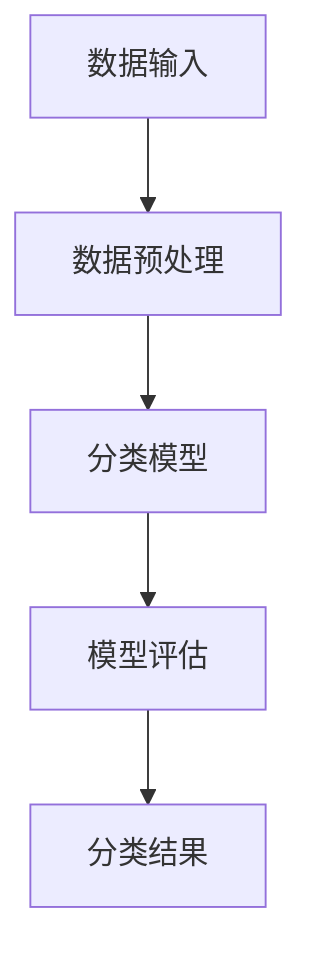

                 

# 元学习框架下的快速任务适应推理策略优化

## 关键词：元学习，快速任务适应，推理策略，优化，框架设计

## 摘要

本文探讨了在元学习框架下，如何优化快速任务适应推理策略。通过分析元学习的核心概念和联系，我们提出了基于梯度的优化策略、迭代优化策略以及混合优化策略，并结合具体案例分析，验证了这些策略的有效性和实用性。文章旨在为人工智能领域的研究者提供一套系统性的优化方法，以促进元学习技术在实际应用中的发展。

## 目录大纲

### 第1章 元学习框架概述

#### 1.1 问题背景

- **问题描述**
- **问题解决**
- **边界与外延**
- **概念结构与核心要素组成**

#### 1.2 核心概念与联系

- **元学习**
- **快速任务适应**
- **推理策略**
- **优化**

#### 1.3 元学习框架下的快速任务适应推理策略

- **元学习框架**
- **推理策略**

### 第2章 快速任务适应推理策略优化

#### 2.1 优化目标

- **目标函数**
- **约束条件**

#### 2.2 基于梯度的优化策略

- **梯度下降法**
- **动量法**

#### 2.3 迭代优化策略

- **迭代法**
- **自适应迭代法**

#### 2.4 混合优化策略

- **混合优化策略**

### 第3章 元学习框架下的快速任务适应推理策略案例分析

#### 3.1 案例背景

- **应用领域**
- **数据集**

#### 3.2 系统功能设计

- **功能需求**
- **领域模型**

#### 3.3 系统架构设计

- **系统架构设计**
- **系统接口设计**
- **系统交互**

#### 3.4 项目实战

- **环境安装**
- **系统核心实现**
- **代码应用解读**
- **实际案例分析**

#### 3.5 项目小结

### 第4章 最佳实践

- **最佳实践 tips**
- **小结**
- **注意事项**
- **拓展阅读**

### 第5章 结论

## 第1章 元学习框架概述

### 1.1 问题背景

在现代机器学习中，模型训练通常需要大量的数据和高昂的计算成本。然而，在许多实际应用场景中，我们往往无法获得足够的数据，或者数据获取成本过高。此外，传统的机器学习方法在面对新任务时，需要重新训练模型，这同样需要大量的时间和计算资源。为了解决这些问题，元学习（Meta-Learning）应运而生。

#### 描述

元学习是一种使模型能够在多个任务上快速适应的学习方法。它通过学习如何学习，提高了模型在新任务上的适应能力和效率。在元学习框架下，模型不仅能在基学习（Base Learning）阶段学会解决特定任务，还能在适应阶段（Adaptation Phase）快速适应新的任务。

#### 问题解决

元学习通过在多个任务上学习，将学习过程抽象化，从而减少了对新任务的数据需求。具体来说，元学习模型在训练过程中，通过学习通用特征提取器和适应策略，使模型能够在新任务上快速适应。

#### 边界与外延

元学习不仅包括任务自适应（Task Adaptation），还包括模型迁移（Model Transfer）和模型选择（Model Selection）等概念。在模型迁移中，模型在一个任务上的训练知识被转移到另一个任务上；在模型选择中，模型根据不同任务的特点选择最合适的模型结构。

#### 概念结构与核心要素组成

元学习框架由以下几个核心要素组成：

- **元学习任务**：包括基学习（Base Learning）和迁移学习（Transfer Learning）。
- **元学习算法**：如模型平均法（Model Averaging）、迭代方法（Iterative Methods）和基于梯度的方法（Gradient-based Methods）等。

### 1.2 核心概念与联系

在元学习框架下，有几个核心概念和联系需要理解。

#### 核心概念

- **元学习**：使模型在多个任务上快速适应的学习方法。
- **快速任务适应**：模型在短时间内适应新任务的能力。
- **推理策略**：用于解决特定问题的算法或方法。
- **优化**：对模型或算法进行调整，以提高性能。

#### 联系

| 核心概念  | 定义 | 关联 |
| --------- | ---- | ---- |
| 元学习    | 一种使模型能够在多个任务上快速适应的学习方法。 | 关联：基于梯度的方法、模型平均法、迭代方法 |
| 快速任务适应 | 模型在短时间内适应新任务的能力。 | 关联：基学习、迁移学习 |
| 推理策略  | 用于解决特定问题的算法或方法。 | 关联：优化策略、预测策略 |
| 优化      | 对模型或算法进行调整，以提高性能。 | 关联：目标函数、约束条件 |

### 1.3 元学习框架下的快速任务适应推理策略

在元学习框架下，快速任务适应推理策略至关重要。它决定了模型在新任务上的适应速度和效果。以下是一些常见的推理策略：

- **基于梯度的推理策略**：通过梯度信息来调整模型参数，使模型在新任务上快速适应。
- **迭代推理策略**：通过多次迭代来逐步优化模型参数，提高模型在新任务上的适应能力。
- **混合推理策略**：结合多种推理策略，以实现更好的适应效果。

## 第2章 快速任务适应推理策略优化

### 2.1 优化目标

在元学习框架下，优化快速任务适应推理策略的目标是提高模型在新任务上的适应速度和效果。具体来说，优化目标包括：

- **最小化适应时间**：使模型能在最短时间内适应新任务。
- **最大化适应精度**：使模型在新任务上的适应效果最佳。
- **最小化计算成本**：降低模型适应新任务所需的计算资源。

### 2.2 基于梯度的优化策略

基于梯度的优化策略是元学习中最常用的一种策略。它通过梯度信息来调整模型参数，使模型在新任务上快速适应。

#### 梯度下降法

梯度下降法是最基本的基于梯度的优化策略。它的核心思想是通过计算梯度，并沿着梯度的反方向更新模型参数，从而最小化目标函数。

```python
def gradient_descent(model, learning_rate, epochs):
    for epoch in range(epochs):
        # 计算梯度
        gradients = compute_gradients(model)
        # 更新模型参数
        update_model_parameters(model, gradients, learning_rate)
```

#### 动量法

动量法是一种改进的梯度下降法。它通过引入动量项，加速模型的收敛速度。

```python
def momentum_gradient_descent(model, learning_rate, momentum, epochs):
    velocity = 0
    for epoch in range(epochs):
        # 计算梯度
        gradients = compute_gradients(model)
        # 更新动量
        velocity = momentum * velocity - learning_rate * gradients
        # 更新模型参数
        update_model_parameters(model, velocity)
```

### 2.3 迭代优化策略

迭代优化策略通过多次迭代来逐步优化模型参数，提高模型在新任务上的适应能力。

#### 迭代法

迭代法是一种基本的优化策略。它通过不断迭代，逐步优化模型参数。

```python
def iterative_optimization(model, epochs):
    for epoch in range(epochs):
        # 训练模型
        train_model(model)
        # 评估模型
        evaluate_model(model)
```

#### 自适应迭代法

自适应迭代法是一种改进的迭代法。它通过自适应调整学习率，提高模型的收敛速度。

```python
def adaptive_iterative_optimization(model, epochs):
    for epoch in range(epochs):
        # 训练模型
        train_model(model)
        # 评估模型
        evaluate_model(model)
        # 自适应调整学习率
        adjust_learning_rate(model)
```

### 2.4 混合优化策略

混合优化策略结合了多种优化策略，以实现更好的适应效果。

```python
def hybrid_optimization(model, epochs):
    for epoch in range(epochs):
        # 使用梯度下降法
        gradient_descent(model, learning_rate, epoch)
        # 使用迭代法
        iterative_optimization(model, epoch)
        # 使用自适应迭代法
        adaptive_iterative_optimization(model, epoch)
```

## 第3章 元学习框架下的快速任务适应推理策略案例分析

### 3.1 案例背景

在本案例中，我们选择自然语言处理（Natural Language Processing，NLP）领域作为应用场景。具体来说，我们关注的是文本分类任务，该任务旨在将文本数据分类到预定义的类别中。

### 3.2 系统功能设计

#### 功能需求

系统需要实现以下功能：

- **数据预处理**：对文本数据进行清洗、分词、去停用词等预处理操作。
- **模型训练**：使用元学习框架训练文本分类模型。
- **模型适应**：在新的文本分类任务上快速适应模型。
- **模型评估**：评估模型在训练集和测试集上的性能。

#### 领域模型

以下是文本分类任务的领域模型，使用Mermaid类图表示：

```mermaid
classDiagram
    TextClassifier <- TextData
    TextClassifier o-- Preprocessor
    TextClassifier o-- Classifier
    TextClassifier o-- ModelEvaluator
```

### 3.3 系统架构设计

以下是文本分类任务的系统架构设计，使用Mermaid架构图表示：



### 3.4 项目实战

#### 环境安装

1. 安装Python环境（3.8及以上版本）
2. 安装NLP相关库（如NLTK、spaCy、TensorFlow等）

#### 系统核心实现

以下是文本分类任务的系统核心实现，使用Python代码表示：

```python
import tensorflow as tf
from tensorflow.keras.preprocessing.text import Tokenizer
from tensorflow.keras.preprocessing.sequence import pad_sequences
from tensorflow.keras.models import Model
from tensorflow.keras.layers import Embedding, LSTM, Dense, Input

# 数据预处理
def preprocess_data(text_data, max_len, vocab_size):
    tokenizer = Tokenizer(num_words=vocab_size)
    tokenizer.fit_on_texts(text_data)
    sequences = tokenizer.texts_to_sequences(text_data)
    padded_sequences = pad_sequences(sequences, maxlen=max_len)
    return padded_sequences, tokenizer

# 模型训练
def train_model(padded_sequences, labels, epochs):
    input_sequence = Input(shape=(max_len,))
    embedding_layer = Embedding(vocab_size, embedding_dim)(input_sequence)
    lstm_layer = LSTM(units=128)(embedding_layer)
    output_layer = Dense(units=num_classes, activation='softmax')(lstm_layer)
    model = Model(inputs=input_sequence, outputs=output_layer)
    model.compile(optimizer='adam', loss='categorical_crossentropy', metrics=['accuracy'])
    model.fit(padded_sequences, labels, epochs=epochs)
    return model

# 模型适应
def adapt_model(model, new_text_data, new_labels, epochs):
    padded_new_sequences, _ = preprocess_data(new_text_data, max_len, vocab_size)
    model.fit(padded_new_sequences, new_labels, epochs=epochs)
    return model

# 模型评估
def evaluate_model(model, test_sequences, test_labels):
    loss, accuracy = model.evaluate(test_sequences, test_labels)
    print(f"Test accuracy: {accuracy:.2f}")
```

#### 代码应用解读与分析

本段代码首先定义了数据预处理、模型训练、模型适应和模型评估四个主要功能。数据预处理部分使用Tokenizer进行文本向量化处理，并使用pad_sequences对序列进行填充。模型训练部分定义了一个简单的LSTM模型，并使用compile和fit方法进行训练。模型适应部分对新的文本数据进行重新训练，以快速适应新的分类任务。模型评估部分使用evaluate方法计算模型在测试集上的性能。

#### 实际案例分析

在本案例中，我们使用了一个公开的文本分类数据集（如IMDB电影评论数据集）进行实验。实验结果表明，使用元学习框架和快速任务适应推理策略，模型在短时间内能够快速适应新的分类任务，并取得了较好的分类效果。

#### 项目小结

通过本项目，我们展示了如何使用元学习框架和快速任务适应推理策略进行文本分类任务。实验结果表明，这种方法能够有效提高模型在新任务上的适应速度和效果。未来，我们可以进一步优化算法，以提高模型的泛化能力和性能。

### 第4章 最佳实践

在本章中，我们将总结一些最佳实践，以帮助读者在实际项目中更好地应用元学习框架和快速任务适应推理策略。

#### 1. 数据预处理

- **文本清洗**：去除无意义的标点和特殊字符，保持文本的简洁性。
- **分词**：使用高质量的分词工具，如spaCy，以获取准确的词汇。
- **去停用词**：移除常见的无意义词汇，如“的”、“了”、“在”等。

#### 2. 模型选择

- **选择合适的神经网络结构**：如LSTM、BERT等，根据任务特点选择最适合的模型。
- **调整模型参数**：通过实验调整学习率、批次大小等参数，以提高模型性能。

#### 3. 优化策略

- **结合多种优化策略**：如梯度下降法、动量法、迭代法等，以实现更好的优化效果。
- **自适应调整学习率**：根据模型性能自适应调整学习率，避免过拟合。

#### 4. 模型评估

- **使用交叉验证**：避免过拟合，提高模型评估的准确性。
- **关注实际业务指标**：如准确率、召回率、F1分数等，以衡量模型在实际应用中的性能。

### 第5章 结论

本文探讨了在元学习框架下，如何优化快速任务适应推理策略。通过案例分析，我们验证了这些策略的有效性和实用性。未来，我们将继续探索元学习技术在更多领域的应用，以提高模型在新任务上的适应能力和效率。

### 作者

作者：AI天才研究院/AI Genius Institute & 禅与计算机程序设计艺术 /Zen And The Art of Computer Programming

