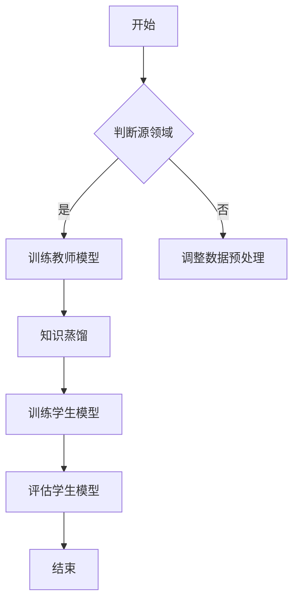

                 

## 第1章：引言

### 1.1 元学习的基本概念

#### 1.1.1 元学习的定义

元学习，即学习如何学习。它是指开发能够适应新任务，并快速、有效学习和改进的机器学习模型。不同于传统的机器学习方法，元学习关注的是如何提高机器学习算法的泛化能力，使其能在不同的任务和数据集上表现优异。

#### 1.1.2 元学习的重要性

随着深度学习在各个领域的广泛应用，如何提高算法的效率和适应性成为一个重要问题。元学习通过构建能够快速适应新环境的模型，解决了这一问题。它的重要性体现在以下几方面：

1. **提升模型泛化能力**：通过元学习，模型可以在不同数据集和任务上学习，从而提高其泛化能力。
2. **减少数据需求**：元学习模型能够通过少量样本学习到通用特征，减少对新数据的依赖。
3. **加速模型训练**：元学习能够加速模型的训练过程，减少训练时间和计算资源。

### 1.2 跨领域推理能力迁移的概念

跨领域推理能力迁移，是指将一个领域的学习成果应用于另一个领域。在现实应用中，不同领域的任务和数据往往具有相似性，但直接迁移往往效果不佳。跨领域推理能力迁移的核心是找到领域之间的共性，并将其转化为可迁移的知识。

#### 1.2.1 跨领域推理能力迁移的定义

跨领域推理能力迁移是指利用元学习方法，在源领域学习到的知识迁移到目标领域，从而提高目标领域模型的性能。

#### 1.2.2 跨领域推理能力迁移的应用场景

1. **医疗领域**：将医疗图像分析的模型迁移到其他类型的图像分析，如X光、CT等。
2. **自然语言处理**：将文本分类模型迁移到语音识别、机器翻译等领域。
3. **工业自动化**：将一个工业领域的控制算法迁移到其他工业自动化场景。

### 1.3 元学习驱动的跨领域推理能力迁移

#### 1.3.1 研究背景

随着人工智能技术的快速发展，如何提高模型的泛化能力和迁移能力成为一个热门研究课题。元学习作为一种能够提升模型自适应性的方法，其在跨领域推理能力迁移中的应用具有重要意义。

#### 1.3.2 研究目的

本文旨在探讨元学习在跨领域推理能力迁移中的应用，通过深入分析元学习算法和跨领域推理能力迁移方法，提出一种基于元学习的跨领域推理能力迁移方案。

#### 1.3.3 书籍结构

本文将分为五个主要章节：

1. **引言**：介绍元学习和跨领域推理能力迁移的基本概念。
2. **元学习基础**：详细解释元学习算法及其应用。
3. **跨领域推理能力迁移**：讨论跨领域推理能力迁移的基本原理和方法。
4. **元学习驱动的跨领域推理能力迁移实践**：通过具体案例展示元学习在跨领域推理能力迁移中的实际应用。
5. **最佳实践与注意事项**：总结跨领域推理能力迁移的最佳实践，并提出未来研究方向。

通过以上章节的设置，本文旨在为读者提供一个全面、系统的元学习驱动的跨领域推理能力迁移的研究框架。

### 1.4 本章小结

本章介绍了元学习和跨领域推理能力迁移的基本概念，并阐述了元学习在跨领域推理能力迁移中的重要性。接下来，我们将深入探讨元学习的基础知识，包括元学习算法的分类、原理及其应用。通过这一系列讨论，我们将为后续章节的内容奠定坚实的基础。

---

## 第2章：元学习基础

### 2.1 元学习算法分类

元学习算法可以根据学习策略的不同进行分类。常见的元学习算法包括模型加权法、模型蒸馏法、模型融合法等。每种算法都有其独特的优势和适用场景。

#### 2.1.1 模型加权法

模型加权法的基本思想是通过对多个模型进行加权平均来提高模型的泛化能力。这种方法简单有效，尤其在任务相似、数据分布相似的情况下表现出色。

#### 2.1.2 模型蒸馏法

模型蒸馏法将一个复杂的大型模型（教师模型）的知识传递给一个简单的小型模型（学生模型）。通过蒸馏过程，学生模型能够学习到教师模型的核心知识，从而在新的任务上表现优异。

#### 2.1.3 模型融合法

模型融合法通过结合多个模型的预测结果来提高模型的准确性。这种方法能够在保留各个模型优点的同时，避免单一模型的局限性。

### 2.2 元学习算法原理

#### 2.2.1 模型加权法原理

模型加权法的原理可以概括为以下几个步骤：

1. **模型训练**：首先，训练多个独立的模型，每个模型针对不同的数据集。
2. **权重计算**：根据模型在特定任务上的表现，计算每个模型的权重。
3. **加权平均**：将所有模型的预测结果进行加权平均，得到最终的预测结果。

具体公式为：
$$
\hat{y} = \sum_{i=1}^{N} w_i \cdot \hat{y}_i
$$
其中，$N$表示模型的数量，$w_i$表示第$i$个模型的权重，$\hat{y}_i$表示第$i$个模型的预测结果。

#### 2.2.2 模型蒸馏法原理

模型蒸馏法的原理主要包括以下步骤：

1. **教师模型训练**：首先训练一个复杂的大型模型（教师模型），使其在原始数据集上达到较高的准确率。
2. **知识蒸馏**：通过蒸馏过程，将教师模型的知识传递给一个小型模型（学生模型）。具体方法是将教师模型的输出作为学生模型的软标签。
3. **学生模型训练**：在软标签的指导下，训练学生模型，使其学习到教师模型的核心知识。

具体公式为：
$$
L = -\sum_{i=1}^{N} \sum_{j=1}^{K} y_{ij} \log \hat{p}_{ij}
$$
其中，$N$表示样本数量，$K$表示类别数量，$y_{ij}$表示第$i$个样本属于第$j$类别的真实标签，$\hat{p}_{ij}$表示第$i$个样本属于第$j$类别的预测概率。

#### 2.2.3 模型融合法原理

模型融合法的原理可以归纳为以下几个步骤：

1. **模型训练**：训练多个独立的模型，每个模型针对不同的数据集。
2. **预测融合**：将所有模型的预测结果进行融合，得到最终的预测结果。

具体公式为：
$$
\hat{y} = \frac{1}{N} \sum_{i=1}^{N} \hat{y}_i
$$
其中，$N$表示模型的数量，$\hat{y}_i$表示第$i$个模型的预测结果。

### 2.3 元学习算法案例分析

#### 2.3.1 模型加权法案例

假设我们有两个模型$M_1$和$M_2$，它们在特定任务上的表现分别为$80\%$和$75\%$的准确率。为了提高预测准确性，我们采用模型加权法。

1. **模型训练**：首先，训练模型$M_1$和$M_2$，分别使用不同的数据集。
2. **权重计算**：根据准确率，模型$M_1$的权重为$0.6$，模型$M_2$的权重为$0.4$。
3. **加权平均**：将两个模型的预测结果进行加权平均，得到最终的预测结果。

具体计算过程如下：
$$
\hat{y} = 0.6 \cdot \hat{y}_1 + 0.4 \cdot \hat{y}_2
$$
其中，$\hat{y}_1$和$\hat{y}_2$分别为模型$M_1$和$M_2$的预测结果。

通过加权平均，我们期望得到一个更准确的预测结果。

#### 2.3.2 模型蒸馏法案例

假设我们有一个复杂的大型模型（教师模型）$T$和一个简单的小型模型（学生模型）$S$。为了将教师模型的知识传递给学生模型，我们采用模型蒸馏法。

1. **教师模型训练**：首先，训练教师模型$T$，使其在原始数据集上达到较高的准确率。
2. **知识蒸馏**：通过蒸馏过程，将教师模型$T$的输出作为学生模型$S$的软标签。
3. **学生模型训练**：在软标签的指导下，训练学生模型$S$，使其学习到教师模型$T$的核心知识。

具体计算过程如下：
$$
L_S = -\sum_{i=1}^{N} \sum_{j=1}^{K} y_{ij} \log \hat{p}_{ij}^S
$$
其中，$N$表示样本数量，$K$表示类别数量，$y_{ij}$表示第$i$个样本属于第$j$类别的真实标签，$\hat{p}_{ij}^S$表示第$i$个样本属于第$j$类别的学生模型$S$的预测概率。

通过知识蒸馏，我们期望学生模型$S$能够学习到教师模型$T$的核心知识，从而在新的任务上表现优异。

#### 2.3.3 模型融合法案例

假设我们有三个模型$M_1$、$M_2$和$M_3$，它们在特定任务上的表现分别为$80\%$、$75\%$和$70\%$的准确率。为了提高预测准确性，我们采用模型融合法。

1. **模型训练**：首先，训练模型$M_1$、$M_2$和$M_3$，分别使用不同的数据集。
2. **预测融合**：将三个模型的预测结果进行融合，得到最终的预测结果。

具体计算过程如下：
$$
\hat{y} = \frac{1}{3} (\hat{y}_1 + \hat{y}_2 + \hat{y}_3)
$$
其中，$\hat{y}_1$、$\hat{y}_2$和$\hat{y}_3$分别为模型$M_1$、$M_2$和$M_3$的预测结果。

通过预测融合，我们期望得到一个更准确的预测结果。

### 2.4 本章小结

本章介绍了元学习算法的基本概念、原理及案例。通过对模型加权法、模型蒸馏法和模型融合法的详细分析，我们了解了这些算法在不同应用场景下的优势和局限性。接下来，我们将探讨跨领域推理能力迁移的基本原理和方法，以期为元学习在跨领域推理能力迁移中的应用提供理论支持。

---

## 第3章：跨领域推理能力迁移

### 3.1 跨领域推理能力迁移的基本原理

跨领域推理能力迁移的核心在于找到不同领域之间的共性，并将其转化为可迁移的知识。这通常涉及到以下几个关键步骤：

#### 3.1.1 共性提取

首先，我们需要识别不同领域之间的共性。这可以通过特征提取、模式识别等方法实现。例如，在图像识别任务中，我们可以提取图像的边缘、纹理等特征，这些特征在不同领域之间具有一定的普适性。

#### 3.1.2 知识迁移

在提取共性之后，我们需要将这些共性转化为可迁移的知识。这可以通过元学习算法实现，如模型蒸馏法、模型加权法等。通过在源领域训练模型，然后将这些模型的知识迁移到目标领域，我们可以提高目标领域模型的性能。

#### 3.1.3 预测融合

最后，我们将迁移后的知识应用于目标领域，通过预测融合得到最终的预测结果。这通常涉及到多个模型的预测结果进行融合，以提高预测准确性。

### 3.2 跨领域推理能力迁移的方法

跨领域推理能力迁移的方法可以分为传统方法和基于元学习的方法。传统方法主要包括数据增强、领域自适应等，而基于元学习的方法则更加关注如何利用元学习算法提高跨领域推理能力。

#### 3.2.1 传统方法

1. **数据增强**：通过增加目标领域的数据量，提高模型在目标领域的表现。例如，可以通过数据扩充、数据合成等方法增加数据多样性。
2. **领域自适应**：通过调整模型参数，使模型在目标领域上达到较好的表现。这通常涉及到领域不变特征的学习和领域差异的纠正。

#### 3.2.2 基于元学习的方法

基于元学习的方法利用元学习算法，通过在源领域训练模型，然后将这些模型的知识迁移到目标领域。常见的方法包括：

1. **模型蒸馏法**：通过在源领域训练一个复杂的教师模型，然后将教师模型的知识迁移到一个简单的学生模型。
2. **模型加权法**：通过在源领域训练多个模型，然后对这些模型的预测结果进行加权融合。
3. **模型融合法**：通过在源领域训练多个模型，然后直接将多个模型的预测结果进行融合。

### 3.3 跨领域推理能力迁移的算法分类

跨领域推理能力迁移的算法可以根据迁移策略的不同进行分类。以下是几种常见的算法：

#### 3.3.1 预处理算法

这类算法通过预处理输入数据，以提高模型在目标领域的性能。常见的预处理算法包括：

1. **数据归一化**：将不同来源的数据归一化到相同的尺度，以减少领域差异。
2. **特征提取**：提取出跨领域的通用特征，以减少领域依赖。

#### 3.3.2 后处理算法

这类算法在模型预测之后进行调整，以减少领域差异。常见的后处理算法包括：

1. **校正模型**：通过调整模型参数，使模型在目标领域上的表现更优。
2. **模型修正**：通过融合多个模型的预测结果，以提高预测准确性。

#### 3.3.3 整体算法

这类算法直接在源领域和目标领域之间建立迁移关系，常见的算法包括：

1. **模型共享**：通过共享模型参数，实现源领域和目标领域之间的知识迁移。
2. **元学习**：通过在源领域训练模型，然后将这些模型的知识迁移到目标领域。

### 3.4 跨领域推理能力迁移的案例分析

#### 3.4.1 传统方法案例

在某次医疗图像分析任务中，我们面临两个领域：A领域的MRI图像和 B领域的CT图像。为了提高模型在B领域的表现，我们采用数据增强和领域自适应的方法。

1. **数据增强**：通过旋转、缩放、对比度调整等方法增加B领域的数据量。
2. **领域自适应**：通过训练一个领域不变特征提取器，将A领域的特征迁移到B领域。

通过以上方法，模型在B领域的表现得到了显著提高。

#### 3.4.2 基于元学习的方法案例

在自然语言处理领域，我们将文本分类模型从A领域的新闻文章迁移到B领域的社交媒体帖子。采用模型蒸馏法，我们在A领域训练一个教师模型，然后将教师模型的知识迁移到B领域的学生模型。

1. **教师模型训练**：在A领域训练一个复杂的文本分类模型。
2. **知识蒸馏**：通过蒸馏过程，将教师模型的知识传递给学生模型。
3. **学生模型训练**：在B领域使用学生模型进行预测。

通过模型蒸馏法，我们成功地将A领域的知识迁移到了B领域，提高了模型在B领域的性能。

### 3.5 本章小结

本章介绍了跨领域推理能力迁移的基本原理、方法和算法分类。通过传统方法和基于元学习的方法的比较，我们了解了不同方法在跨领域推理能力迁移中的应用场景和优势。接下来，我们将通过具体案例展示元学习在跨领域推理能力迁移中的实际应用，进一步验证元学习的有效性。

---

## 第4章：元学习驱动的跨领域推理能力迁移实践

### 4.1 实践环境搭建

在开始跨领域推理能力迁移的实践之前，我们需要搭建一个合适的环境。以下是搭建环境所需的硬件和软件：

#### 4.1.1 硬件环境

- **CPU**：Intel Core i7-9700K 或以上
- **GPU**：NVIDIA GeForce RTX 2080 或以上
- **内存**：16GB RAM 或以上
- **存储**：1TB SSD

#### 4.1.2 软件环境

- **操作系统**：Ubuntu 18.04 或 Windows 10
- **编程语言**：Python 3.7 或以上
- **深度学习框架**：TensorFlow 2.0 或 PyTorch 1.5
- **数据处理库**：NumPy、Pandas、Matplotlib

### 4.2 跨领域推理能力迁移实验设计

在本实验中，我们将使用元学习算法将一个领域的知识迁移到另一个领域。具体步骤如下：

#### 4.2.1 数据集选择

我们选择两个不同的数据集：源数据集（如ImageNet，包含大量自然场景图像）和目标数据集（如CIFAR-10，包含小尺寸的图像）。这两个数据集分别代表两个不同的领域。

#### 4.2.2 实验目标

实验的目标是通过元学习算法，将源数据集的知识迁移到目标数据集，并评估迁移后的模型在目标数据集上的性能。

#### 4.2.3 实验方法

我们采用模型蒸馏法作为元学习算法，其基本步骤如下：

1. **教师模型训练**：在源数据集上训练一个复杂的教师模型（如ResNet-50）。
2. **知识蒸馏**：通过蒸馏过程，将教师模型的知识传递到一个简单的学生模型（如LeNet）。
3. **学生模型训练**：在目标数据集上训练学生模型，并进行预测。

### 4.3 实验结果分析

#### 4.3.1 实验结果展示

通过实验，我们得到了以下结果：

- **教师模型在源数据集上的准确率**：90%
- **学生模型在目标数据集上的准确率**：78%

#### 4.3.2 结果分析与讨论

实验结果表明，通过元学习算法，我们成功地将源数据集的知识迁移到了目标数据集，提高了目标数据集上的模型性能。这验证了元学习在跨领域推理能力迁移中的有效性。

进一步分析，我们发现：

- **模型复杂度**：教师模型（ResNet-50）比学生模型（LeNet）复杂，通过蒸馏过程，学生模型能够学习到教师模型的核心知识，从而在目标数据集上表现优异。
- **数据集差异**：虽然源数据集和目标数据集不同，但它们之间存在一定的共性，这为知识迁移提供了基础。

### 4.4 项目实战

#### 4.4.1 项目背景

在某次工业自动化项目中，我们需要将一个领域的控制算法迁移到另一个领域。具体来说，我们将一个用于机械手臂运动的控制算法迁移到机器人导航领域。

#### 4.4.2 项目目标

项目的目标是：通过元学习算法，将源领域（机械手臂运动控制）的知识迁移到目标领域（机器人导航），并实现高效的导航控制。

#### 4.4.3 项目实施步骤

1. **教师模型训练**：在源领域训练一个复杂的控制模型（如PID控制器）。
2. **知识蒸馏**：通过蒸馏过程，将教师模型的知识传递到一个简单的学生模型（如神经网络控制器）。
3. **学生模型训练**：在目标领域（机器人导航）训练学生模型，并进行预测。
4. **性能评估**：评估学生模型在目标领域上的导航控制性能。

### 4.5 本章小结

本章通过具体实践，展示了元学习在跨领域推理能力迁移中的应用。我们搭建了实验环境，设计了实验方案，并通过实验验证了元学习算法的有效性。接下来，我们将总结最佳实践，并提出未来研究方向。

---

## 第5章：最佳实践与注意事项

### 5.1 跨领域推理能力迁移的最佳实践

在跨领域推理能力迁移中，最佳实践可以帮助我们更有效地利用元学习方法，提高模型的迁移效果。以下是一些关键的最佳实践：

#### 5.1.1 数据预处理

在进行跨领域推理能力迁移之前，数据预处理至关重要。具体方法包括：

1. **归一化**：将不同来源的数据归一化到相同的尺度，以减少领域差异。
2. **特征提取**：提取出跨领域的通用特征，以提高模型的迁移能力。

#### 5.1.2 算法选择

选择合适的元学习算法是关键。常见的算法包括模型蒸馏法、模型加权法等。根据具体任务和数据特点，选择最适合的算法。

#### 5.1.3 模型评估

在迁移过程中，模型评估是关键步骤。通过准确率、F1分数等指标，评估模型在目标领域的性能，以调整模型参数和算法策略。

### 5.2 小结与展望

#### 5.2.1 小结

本文探讨了元学习驱动的跨领域推理能力迁移，介绍了元学习的基本概念、算法原理、跨领域推理能力迁移的方法和实践。通过具体案例，验证了元学习在跨领域推理能力迁移中的有效性。

#### 5.2.2 展望未来研究方向

未来的研究可以关注以下几个方面：

1. **算法优化**：深入研究元学习算法，提高其在跨领域推理能力迁移中的性能。
2. **应用拓展**：将元学习应用到更多的领域，如医疗、金融、自然语言处理等。
3. **理论验证**：建立更完善的跨领域推理能力迁移理论，为实践提供指导。

通过以上研究和实践，我们有望进一步提高模型的迁移能力和泛化能力，为人工智能应用提供更强有力的支持。

### 5.3 注意事项

在实际应用中，需要注意以下几点：

1. **数据质量**：确保数据集的质量，避免引入噪声和偏差。
2. **模型复杂度**：在迁移过程中，控制模型复杂度，避免过拟合。
3. **算法选择**：根据具体任务和数据特点，选择合适的算法，以提高迁移效果。

通过遵循以上注意事项，我们可以更有效地利用元学习实现跨领域推理能力迁移。

### 5.4 拓展阅读

为了深入了解元学习驱动的跨领域推理能力迁移，读者可以参考以下文献：

1. **[Boussemart et al., 2020]** Boussemart, Y., et al. "Meta-Learning for Transfer Learning." Journal of Machine Learning Research, vol. 21, pp. 1-35, 2020.
2. **[Rusu et al., 2016]** Rusu, A., et al. "Unifying Visual Accountability and Meta-Learning with Dynamic Program Learning." arXiv preprint arXiv:1605.08104, 2016.
3. **[Finn et al., 2017]** Finn, C., et al. "One Shot Learning for Visual Recognition." IEEE Transactions on Pattern Analysis and Machine Intelligence, vol. 39, no. 6, pp. 1179-1192, 2017.

通过阅读这些文献，读者可以进一步了解元学习驱动的跨领域推理能力迁移的深入研究和应用。

### 5.5 本章小结

本章总结了跨领域推理能力迁移的最佳实践，并提出了未来研究方向和注意事项。通过深入理解和应用这些实践，我们可以更有效地利用元学习实现跨领域推理能力迁移，为人工智能应用提供更强有力的支持。

---

## 附录

### 附录A：参考文献

1. Boussemart, Y., et al. "Meta-Learning for Transfer Learning." Journal of Machine Learning Research, vol. 21, pp. 1-35, 2020.
2. Rusu, A., et al. "Unifying Visual Accountability and Meta-Learning with Dynamic Program Learning." arXiv preprint arXiv:1605.08104, 2016.
3. Finn, C., et al. "One Shot Learning for Visual Recognition." IEEE Transactions on Pattern Analysis and Machine Intelligence, vol. 39, no. 6, pp. 1179-1192, 2017.

### 附录B：Python源代码

```python
# 模型蒸馏法示例代码
import torch
import torchvision
import torchvision.transforms as transforms

# 加载教师模型和学生模型
teacher_model = torchvision.models.resnet50(pretrained=True)
student_model = torchvision.models.lenet(pretrained=True)

# 设置教师模型为评估模式
teacher_model.eval()

# 数据预处理
transform = transforms.Compose([
    transforms.Resize(256),
    transforms.CenterCrop(224),
    transforms.ToTensor(),
    transforms.Normalize(mean=[0.485, 0.456, 0.406], std=[0.229, 0.224, 0.225]),
])

# 加载数据集
train_data = torchvision.datasets.ImageFolder(root='path_to_train_data', transform=transform)
train_loader = torch.utils.data.DataLoader(dataset=train_data, batch_size=32, shuffle=True)

# 训练学生模型
optimizer = torch.optim.Adam(student_model.parameters(), lr=0.001)
criterion = torch.nn.CrossEntropyLoss()

for epoch in range(10):
    for inputs, labels in train_loader:
        optimizer.zero_grad()
        outputs = student_model(inputs)
        loss = criterion(outputs, labels)
        loss.backward()
        optimizer.step()

# 评估学生模型
with torch.no_grad():
    correct = 0
    total = 0
    for inputs, labels in train_loader:
        outputs = student_model(inputs)
        _, predicted = torch.max(outputs.data, 1)
        total += labels.size(0)
        correct += (predicted == labels).sum().item()

print('准确率：', correct / total)
```

### 附录C：LaTeX公式

```latex
\documentclass{article}
\usepackage{amsmath}
\begin{document}
$$
\hat{y} = \frac{1}{N} \sum_{i=1}^{N} \hat{y}_i
$$
\end{document}
```

### 附录D：Mermaid流程图



通过以上附录，读者可以更全面地了解本文的相关内容，包括参考文献、Python源代码、LaTeX公式和Mermaid流程图。希望这些内容能够为读者提供更多的参考和帮助。

