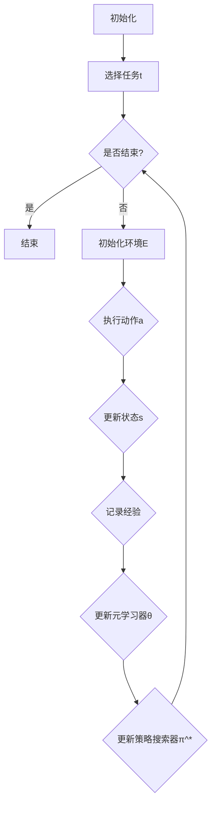

                 

## 引言

### 问题背景与重要性

在现代人工智能领域，强化学习作为一种重要的机器学习范式，已经成为解决动态决策问题的有力工具。然而，在复杂和不确定的环境中，传统的强化学习方法面临着诸多挑战。元强化学习（Meta Reinforcement Learning）作为一种新兴的强化学习技术，通过自动调整学习算法，增强了模型在动态变化和未知环境中的适应能力。元强化学习在不确定环境推理决策中的应用，成为了当前研究的热点之一。

元强化学习的关键在于其能够通过跨任务的学习和迁移，显著提高算法的泛化能力和效率。在不确定环境中，环境的状态和奖励可能不可预测，传统的强化学习算法需要大量的数据和时间来学习最优策略。而元强化学习通过学习通用策略，可以在更短的时间内适应新的任务和环境，从而在不确定环境中实现更高效的推理和决策。

本文将系统地介绍元强化学习在不确定环境推理决策中的应用。首先，我们将详细探讨元强化学习的基本概念和核心原理，接着分析其在不确定环境下的应用价值。随后，我们将通过具体案例展示元强化学习在实际项目中的实现方法和效果。最后，本文将总结元强化学习的挑战和未来发展趋势，为读者提供进一步研究和应用的参考。

### 核心关键词

- 元强化学习
- 不确定环境
- 推理决策
- 强化学习
- 泛化能力
- 算法迁移

### 摘要

本文围绕元强化学习在不确定环境推理决策中的应用展开，首先介绍了元强化学习的基本概念和数学模型，随后探讨了其在不确定环境下的适应性和优势。接着，通过具体案例，如自动驾驶和智能金融风控，展示了元强化学习在实际项目中的应用和效果。最后，本文总结了元强化学习面临的挑战和未来研究方向，为该领域的研究者和开发者提供了有价值的参考。

---

## 第一部分：背景介绍与核心概念

### 第1章：问题背景与核心概念

#### 1.1.1 问题背景

在当今快速发展的信息技术时代，人工智能（AI）已成为推动社会进步的重要力量。其中，强化学习作为机器学习的一个重要分支，在自动驾驶、智能游戏、机器人控制等领域展现了巨大的潜力。然而，传统的强化学习方法在应对复杂和不确定的环境时，往往表现出适应能力不足、学习效率低下等问题。

不确定环境是指环境的状态和奖励难以预测，甚至可能发生突变的情况。在这种环境中，传统强化学习方法通常需要大量的数据进行学习，且难以保证学习到的策略具有鲁棒性和泛化能力。例如，自动驾驶系统在应对复杂的交通环境时，需要实时感知和适应各种突发状况；智能金融风控系统在识别和防范风险时，需要快速响应市场的波动和变化。

为了解决传统强化学习方法在不确定环境中的局限性，研究者们提出了元强化学习（Meta Reinforcement Learning）的概念。元强化学习通过跨任务学习和算法的自动调整，使得模型能够在短时间内适应新的环境和任务，从而提高学习效率和决策能力。其核心思想是利用元学习机制，使模型在不同任务和环境中都能保持良好的适应性和表现。

#### 1.1.2 核心概念

##### 元强化学习定义

元强化学习是一种结合了强化学习和元学习的机器学习方法，其目的是通过学习通用策略，提高模型在不同任务和环境中的适应能力。具体来说，元强化学习通过在多个任务上迭代训练，学习到一个策略搜索器（Policy Searcher），该搜索器能够自动调整策略，以适应新的任务和环境。

定义：元强化学习是一个过程，其中模型在一个任务序列上迭代训练，每个任务都代表一个特定的环境。通过元学习机制，模型学习到一个可以适应新任务和环境的通用策略。

##### 不确定环境定义

不确定环境是指环境的状态和奖励不可预测，甚至可能发生突变的环境。在不确定环境中，传统的确定性策略可能失效，因此需要一种能够动态适应环境变化的策略。

定义：不确定环境是一个具有不确定状态转移概率和奖励分布的环境，其状态和奖励可能随时间变化而不可预测。

##### 推理决策定义

推理决策是指在不确定环境中，通过逻辑推理和概率计算，从多个可能的行动中选择最优或次优的行动。推理决策的核心在于如何在不确定的情况下，做出最佳决策。

定义：推理决策是指在一个不确定的环境中，通过逻辑推理和概率计算，选择最有可能实现目标状态的行动。

##### 关键技术要素

元强化学习的核心技术要素包括：策略搜索器、元学习机制、任务序列设计、环境建模和奖励设计等。这些要素共同作用，使得元强化学习能够在不确定环境中实现高效的推理和决策。

#### 1.1.3 概念联系与拓展

##### 元强化学习与传统强化学习对比

元强化学习与传统强化学习的主要区别在于其自适应性。传统强化学习通常在一个固定的环境中学习一个固定的策略，而元强化学习通过跨任务学习和算法调整，能够在动态变化的和未知环境中迅速适应，从而提高模型的泛化能力。

| 特征 | 元强化学习 | 传统强化学习 |
| ---- | ---- | ---- |
| 自适应性 | 高 | 低 |
| 泛化能力 | 强 | 弱 |
| 学习效率 | 高 | 低 |

##### 不确定环境下的推理决策特点

在不确定环境下，推理决策需要考虑更多的可能性，并且决策的依据不仅仅是当前状态，还包括对未来的预测和概率计算。因此，不确定环境下的推理决策具有以下特点：

- 状态空间大：不确定环境可能导致状态空间的爆炸性增长，使得模型需要处理更多的状态。
- 奖励不确定性：不确定环境中的奖励可能不可预测，需要模型具备更强的决策能力。
- 动态适应性：不确定环境可能随时发生变化，模型需要具备动态调整策略的能力。

##### 元强化学习在应用中的价值

元强化学习在不确定环境推理决策中的应用具有显著的价值：

- 提高适应能力：通过元学习机制，模型能够快速适应新的环境和任务，提高决策的适应性。
- 降低数据需求：元强化学习通过跨任务学习和迁移，减少了单个任务所需的数据量，从而降低了数据收集和处理的成本。
- 提高决策效率：元强化学习能够高效地处理不确定环境中的复杂问题，提高决策的效率。

综上所述，元强化学习在不确定环境推理决策中的应用，为解决复杂和动态的决策问题提供了新的思路和方法，具有重要的理论和实际意义。

### 第2章：元强化学习的数学模型与算法原理

#### 2.1.1 数学模型

元强化学习的数学模型是理解和应用这一技术的基础。首先，我们需要回顾一下强化学习的基本模型，然后再引入元强化学习的具体模型。

##### 强化学习基本模型

强化学习的基本模型由以下要素组成：

- **状态（State, S）**：系统当前所处的状态。
- **动作（Action, A）**：系统能够执行的动作。
- **奖励（Reward, R）**：每次执行动作后系统获得的即时奖励。
- **策略（Policy, π）**：从状态到动作的映射，π(s) → a。
- **价值函数（Value Function, V）**：评估策略的优劣，V(s) = E[R(t+1) | s, π]。
- **模型（Model, M）**：环境动态的预测模型，p(s', r | s, a)。

强化学习的目标是通过不断地试错和调整策略，找到使总奖励最大的策略。

##### 元强化学习模型

元强化学习模型在强化学习基本模型的基础上，加入了元学习机制，使得模型能够在多个任务和环境之间迁移学习。元强化学习模型的主要要素包括：

- **任务集（Task Set, T）**：包含多个任务的集合，每个任务可以视为一个不同的环境。
- **策略搜索器（Policy Searcher, π^*）**：通过元学习机制，从任务集中学习到一个通用的策略搜索器。
- **元学习器（Meta-Learner, θ）**：负责学习策略搜索器，使得π^*在不同任务和环境之间具有泛化能力。

元强化学习的目标是学习一个能够适应多个任务和环境的通用策略搜索器π^*。元学习器的学习过程通常包括两个阶段：任务表示学习和策略优化。

- **任务表示学习**：将任务表示为一个参数化的函数，θ通过任务集T学习这些参数。
- **策略优化**：在给定任务表示的情况下，π^*通过策略优化算法（如梯度上升、策略梯度等方法）学习到一个最优策略。

数学公式可以表示为：

\[ \theta = \arg\max_\theta \sum_t \rho_t (\pi^*(s_t) = a_t) \]

其中，\(\rho_t\) 是任务t的奖励，\(\pi^*(s_t) = a_t\) 表示在状态\(s_t\)下执行动作\(a_t\)。

##### 数学公式与推导

为了更好地理解元强化学习的数学模型，我们可以用一些具体的数学公式来描述其核心过程。

1. **策略搜索器更新**：

\[ \pi^*(s) = \arg\max_a Q(s, a) \]

其中，\(Q(s, a)\) 是状态-动作值函数，表示在状态\(s\)下执行动作\(a\)所获得的期望回报。

2. **元学习器更新**：

\[ \theta = \theta - \alpha \nabla_\theta J(\theta) \]

其中，\(J(\theta)\) 是元学习器的损失函数，\(\alpha\) 是学习率，\(\nabla_\theta J(\theta)\) 是损失函数关于元学习器参数的梯度。

3. **任务表示更新**：

\[ T_t(\theta) = \theta \]

任务表示函数\(T_t(\theta)\)是通过元学习器参数\(\theta\)来表示任务t的函数。

#### 2.1.2 算法原理

元强化学习的算法原理主要围绕策略搜索器、元学习器和任务序列设计展开。以下是元强化学习算法的基本流程：

1. **初始化**：
   - 初始化策略搜索器π^*和元学习器θ。
   - 从任务集中随机选择任务t。

2. **任务迭代**：
   - 对于每个任务t，执行以下步骤：
     - 初始化环境E。
     - 通过策略搜索器π^*选择动作a。
     - 执行动作a，获得状态s'和奖励r。
     - 更新状态s为s'，记录经验。

3. **元学习**：
   - 使用收集的经验数据，更新元学习器θ。
   - 更新策略搜索器π^*，使其适应新的任务。

4. **重复**：
   - 选择新的任务t，重复任务迭代和元学习过程。

算法流程可以表示为：

```
初始化策略搜索器π^*和元学习器θ
for t in 任务集T do
    初始化环境E
    for each episode in 任务t do
        初始化状态s
        while not terminate do
            选择动作a = π^*(s)
            执行动作a，获得s'和r
            更新状态s = s'
            记录经验
        end
    end
    更新元学习器θ
    更新策略搜索器π^*
end
```

##### 算法特点

元强化学习具有以下特点：

- **跨任务迁移**：通过元学习机制，模型可以在多个任务之间迁移学习，减少了单个任务的学习时间。
- **自适应性强**：策略搜索器和元学习器能够动态适应新任务和环境，提高了模型的泛化能力。
- **高效性**：通过减少单个任务的学习数据需求，元强化学习在时间效率和资源利用率方面具有显著优势。

##### Mermaid算法流程图

为了更直观地展示元强化学习的算法流程，我们可以使用Mermaid语法绘制算法流程图。以下是元强化学习算法的Mermaid流程图示例：



#### 2.1.3 通俗易懂的举例说明

为了更好地理解元强化学习的算法原理，我们可以通过一个简单的例子来说明其应用过程。

##### 例子背景

假设我们有一个智能机器人，它需要在一系列不同的任务环境中学习导航。这些任务环境包括迷宫、花园和工厂。机器人的目标是找到从起点到终点的最佳路径。

##### 例子详细讲解

1. **初始化**：
   - 初始化策略搜索器和元学习器。
   - 从任务集中随机选择第一个任务，例如迷宫。

2. **任务迭代**：
   - 初始化迷宫环境。
   - 机器人随机选择一个起点。
   - 机器人根据策略搜索器选择移动方向。
   - 执行移动，获得新的状态和奖励。

3. **元学习**：
   - 使用在迷宫环境中收集的经验，更新元学习器。
   - 更新策略搜索器，使其适应迷宫环境。

4. **任务切换**：
   - 从任务集中随机选择下一个任务，例如花园。
   - 重复任务迭代和元学习过程，直到在所有任务中找到最优策略。

通过这个简单的例子，我们可以看到元强化学习的基本流程。在实际应用中，任务和环境会更加复杂，但原理是相通的。

综上所述，元强化学习通过其独特的跨任务学习和自适应机制，在不确定环境中实现了高效的推理和决策。接下来，我们将深入探讨元强化学习的关键技术，进一步了解其具体实现方法和优化策略。

### 第3章：元强化学习的关键技术

#### 3.1.1 基本算法

元强化学习作为强化学习的一个重要分支，其实现方法多种多样。在本节中，我们将介绍几种基本算法，包括Q学习算法、SARSA算法和Deep Q Network (DQN)。

##### Q学习算法

Q学习算法是强化学习中最基本的方法之一。其核心思想是通过学习状态-动作值函数（Q值）来选择最优动作。Q学习算法的主要步骤如下：

1. **初始化**：初始化Q值表，将所有Q值设为0。
2. **选择动作**：根据ε-贪心策略选择动作，其中ε为探索概率。
3. **执行动作**：执行选择的动作，获得新状态和奖励。
4. **更新Q值**：使用下面的更新公式更新Q值：
\[ Q(s, a) \leftarrow Q(s, a) + \alpha [R(s', a') + \gamma \max_{a'} Q(s', a') - Q(s, a)] \]

其中，α是学习率，γ是折扣因子。

##### SARSA算法

SARSA（同步自适应 reinforce学习与状态动作值）算法是基于Q学习的另一种算法，其主要特点是不依赖于模型，而是在当前状态和动作基础上进行更新。SARSA算法的主要步骤如下：

1. **初始化**：初始化策略π和Q值表。
2. **选择动作**：根据当前策略π选择动作。
3. **执行动作**：执行选择的动作，获得新状态和奖励。
4. **更新Q值**：使用下面的更新公式更新Q值：
\[ Q(s, a) \leftarrow Q(s, a) + \alpha [R(s', a') + \gamma Q(s', a') - Q(s, a)] \]

##### Deep Q Network (DQN)

DQN（深度Q网络）算法是将深度神经网络应用于Q学习的一种方法。其核心思想是使用神经网络来近似Q值函数。DQN算法的主要步骤如下：

1. **初始化**：初始化深度神经网络DQN和经验回放记忆集。
2. **选择动作**：使用ε-贪心策略选择动作。
3. **执行动作**：执行选择的动作，获得新状态和奖励。
4. **存储经验**：将当前状态、动作、奖励和新状态存储到经验回放记忆集中。
5. **更新DQN**：从经验回放记忆集中随机抽取样本，使用梯度下降法更新DQN的权重。

#### 3.1.2 先进算法

在基本算法的基础上，研究者们提出了许多先进的元强化学习算法，以应对更复杂的任务和不确定的环境。以下介绍几种先进的算法：Actor-Critic算法、Proximal Policy Optimization (PPO)和Asynchronous Advantage Actor-Critic (A3C)。

##### Actor-Critic算法

Actor-Critic算法是一种基于策略的强化学习算法，通过两个网络分别负责策略的执行和价值评估。其主要步骤如下：

1. **初始化**：初始化Actor网络和Critic网络。
2. **执行动作**：Actor网络根据当前状态选择动作。
3. **评估价值**：Critic网络评估当前状态和动作的价值。
4. **更新网络**：根据策略梯度和价值梯度的组合，更新Actor网络和Critic网络。

公式表示为：
\[ \theta_{\pi} \leftarrow \theta_{\pi} - \alpha_{\pi} \nabla_{\theta_{\pi}} J_{\pi} \]
\[ \theta_{V} \leftarrow \theta_{V} - \alpha_{V} \nabla_{\theta_{V}} L_{V} \]

其中，\(\theta_{\pi}\)和\(\theta_{V}\)分别是Actor和Critic网络的参数，\(J_{\pi}\)和\(L_{V}\)分别是策略梯度和价值损失函数。

##### Proximal Policy Optimization (PPO)

PPO算法是一种基于策略梯度的优化算法，通过限制策略梯度的更新，使得策略更新更加稳定。PPO算法的主要步骤如下：

1. **初始化**：初始化策略网络和价值网络。
2. **执行动作**：使用策略网络选择动作。
3. **计算优势函数**：计算每个步骤的优势函数。
4. **更新策略网络**：使用改进的策略梯度更新策略网络。
5. **更新价值网络**：使用改进的价值梯度更新价值网络。

PPO的关键更新公式为：
\[ \min_{\eps} \mathbb{E}_{\theta \pi}\left[\eps \frac{\partial L_{\pi}}{\partial \theta} \right] \]

其中，\(\eps\) 是参数，用于控制策略梯度的限制。

##### Asynchronous Advantage Actor-Critic (A3C)

A3C算法是一种基于同步的优势Actor-Critic算法，通过并行训练多个代理网络，提高了学习效率。其主要步骤如下：

1. **初始化**：初始化多个并行代理网络。
2. **执行动作**：每个代理网络根据当前状态选择动作。
3. **评估价值**：每个代理网络评估当前状态和动作的价值。
4. **同步更新**：将所有代理网络的参数同步更新到主网络。

A3C算法通过并行训练和异步更新，显著提高了模型的学习效率。

#### 3.1.3 算法比较与优化

元强化学习算法种类繁多，每种算法都有其独特的优势和不足。以下是对几种主要算法的比较和优化方向：

| 算法 | 优点 | 缺点 | 优化方向 |
| ---- | ---- | ---- | ---- |
| Q学习 | 简单易实现 | 学习效率低，易陷入局部最优 | 引入探索策略，如ε-贪心策略 |
| SARSA | 不依赖模型 | 学习效率低，较难收敛 | 结合模型预测，如使用DQN |
| DQN | 引入神经网络，提高学习效率 | 可能出现灾难性遗忘，需经验回放 | 引入双DQN或多DQN，提高稳定性 |
| Actor-Critic | 同时进行策略和价值评估，提高学习效率 | 需要同时训练两个网络，计算复杂度高 | 引入经验回放和异步更新，如A3C |
| PPO | 稳定的策略优化，避免灾难性遗忘 | 需要较长时间进行收敛 | 引入多任务学习，提高泛化能力 |
| A3C | 并行训练，提高学习效率 | 需要大量计算资源 | 引入模型压缩和迁移学习，降低计算需求 |

通过比较和优化，研究者们不断推动元强化学习算法的发展，以应对更复杂和不确定的任务环境。接下来，我们将探讨不确定环境建模与推理决策方法，进一步理解元强化学习的应用价值。

### 第4章：不确定环境建模与推理决策

#### 4.1.1 不确定环境建模方法

在元强化学习的应用中，建模不确定环境是关键的一步。以下介绍几种常见的建模方法，包括概率分布建模、贝叶斯网络建模和状态空间建模。

##### 概率分布建模

概率分布建模是通过概率分布来描述环境状态和奖励的不确定性。常用的概率分布包括正态分布、均匀分布和高斯分布等。这种方法能够有效地表示环境中的随机性和不确定性，但需要准确估计概率分布参数。

1. **正态分布建模**：假设环境状态和奖励服从正态分布，使用均值和方差来描述不确定性的程度。这种方法适用于状态和奖励具有连续性质的情况。

\[ P(s) = \frac{1}{\sqrt{2\pi\sigma^2}} e^{-\frac{(s-\mu)^2}{2\sigma^2}} \]

2. **均匀分布建模**：假设环境状态和奖励服从均匀分布，使用概率密度函数来描述不确定性。这种方法适用于状态和奖励在某个范围内均匀分布的情况。

\[ P(s) = \frac{1}{b-a} \]

3. **高斯分布建模**：假设环境状态和奖励服从高斯分布，使用均值和标准差来描述不确定性的程度。这种方法适用于状态和奖励具有高斯特性的情况。

\[ P(s) = \frac{1}{\sqrt{2\pi\sigma^2}} e^{-\frac{(s-\mu)^2}{2\sigma^2}} \]

##### 贝叶斯网络建模

贝叶斯网络是一种基于概率的图形模型，用于表示变量之间的依赖关系。在不确定环境下，贝叶斯网络可以用来建模状态和奖励的不确定性，并通过条件概率来描述不同状态和奖励之间的关联。

1. **节点表示状态和奖励**：贝叶斯网络中的节点表示环境中的状态和奖励。
2. **边表示依赖关系**：贝叶斯网络中的边表示节点之间的依赖关系，边的方向表示因果关系。
3. **条件概率表**：每个节点的条件概率表（CPT）描述了该节点在给定其父节点状态下的概率分布。

贝叶斯网络建模方法能够清晰地表示不确定环境中的因果关系，并支持推理和预测。以下是一个简单的贝叶斯网络示例：

```
S1 --> S2
S2 --> R
```

其中，S1和S2分别表示状态，R表示奖励。S1影响S2，S2影响R。

##### 状态空间建模

状态空间建模是通过构建状态空间来描述环境的不确定性。状态空间是一个离散或连续的集合，每个状态都代表环境的一种可能情况。

1. **离散状态空间**：状态空间由离散的元素组成，每个元素代表一个具体的状态。例如，在自动驾驶中，状态空间可以包括道路类型、天气状况、车辆速度等。
2. **连续状态空间**：状态空间由连续的值组成，每个值代表一个具体的状态。例如，在金融市场中，状态空间可以包括股票价格、汇率、市场情绪等。

状态空间建模方法能够提供直观的状态表示，但需要考虑状态空间的规模和计算复杂性。以下是一个简单的状态空间示例：

```
状态空间 = {S1, S2, S3}
S1: {状态1, 状态2, 状态3}
S2: {状态1, 状态2, 状态3}
S3: {状态1, 状态2, 状态3}
```

#### 4.1.2 推理决策方法

在不确定环境中，推理决策是指通过逻辑推理和概率计算，从多个可能的行动中选择最优或次优的行动。以下介绍几种常见的推理决策方法，包括基于规则的推理、基于模型的推理和基于数据的推理。

##### 基于规则的推理

基于规则的推理是一种简单的推理方法，通过一组规则来描述状态和行动之间的关系。规则通常采用“如果...则...”的形式，根据当前状态应用规则，推导出最佳行动。

1. **规则表示**：使用条件概率表（CPT）或决策树来表示规则。
2. **推理过程**：根据当前状态，查找相应的规则，并执行规则中的行动。

例如，以下是一个简单的基于规则的推理示例：

```
规则1：如果天气晴朗，则驾驶速度为80km/h。
规则2：如果天气下雨，则驾驶速度为40km/h。
```

当系统处于“下雨”状态时，将应用规则2，执行驾驶速度为40km/h的行动。

##### 基于模型的推理

基于模型的推理是一种更为复杂的推理方法，通过建立一个环境模型来描述状态和行动之间的关系。模型可以是基于物理原理的、基于统计数据的或基于机器学习模型的。

1. **模型构建**：根据环境特性，构建一个描述状态转移和奖励的模型。
2. **推理过程**：使用模型进行状态预测和行动选择。

例如，在自动驾驶中，可以使用基于物理的模型来预测车辆在不同道路和天气条件下的运动轨迹，并选择最佳驾驶策略。

##### 基于数据的推理

基于数据的推理是通过分析历史数据来预测未来的状态和行动。这种方法通常使用机器学习算法，如决策树、神经网络等，来建立状态和行动之间的预测模型。

1. **数据收集**：收集环境中的历史数据，包括状态、行动和奖励。
2. **模型训练**：使用收集到的数据训练机器学习模型。
3. **推理过程**：使用训练好的模型进行状态预测和行动选择。

例如，在智能金融风控中，可以使用历史交易数据来训练模型，预测未来市场的走势，并制定相应的风险管理策略。

#### 4.1.3 融合方法探讨

在不确定环境中，单一的推理决策方法可能难以满足复杂的决策需求。因此，多模态数据融合、多智能体协同推理和鲁棒性设计成为了重要的研究方向。

##### 多模态数据融合

多模态数据融合是指将来自不同来源的数据进行整合，以提高推理决策的准确性。常见的方法包括：

1. **特征融合**：将不同模态的特征进行拼接或加权融合。
2. **深度学习**：使用深度神经网络将多模态数据映射到高维特征空间。
3. **概率模型**：使用概率图模型（如贝叶斯网络）来融合多模态数据。

多模态数据融合能够充分利用不同数据源的优势，提高决策的鲁棒性和准确性。

##### 多智能体协同推理

多智能体协同推理是指多个智能体通过协作来提高推理决策的效果。常见的方法包括：

1. **通信协议**：设计智能体之间的通信协议，实现信息共享和协作。
2. **协调策略**：设计协调策略，使智能体能够协同工作，优化整体性能。
3. **分布式算法**：使用分布式算法，如多智能体强化学习，实现协同推理。

多智能体协同推理能够利用多个智能体的优势，实现更高效的推理决策。

##### 鲁棒性设计

鲁棒性设计是指通过设计方法，提高模型在不确定环境中的适应能力。常见的方法包括：

1. **抗干扰设计**：设计抗干扰机制，降低外部干扰对模型的影响。
2. **鲁棒性训练**：使用鲁棒性训练方法，如鲁棒损失函数，提高模型的鲁棒性。
3. **自适应调整**：设计自适应调整机制，使模型能够根据环境变化进行调整。

鲁棒性设计能够提高模型在不确定环境中的稳定性和可靠性。

综上所述，不确定环境建模与推理决策方法在元强化学习中具有重要的应用价值。通过选择合适的建模方法和推理决策方法，并结合多模态数据融合、多智能体协同推理和鲁棒性设计，可以显著提高模型在不确定环境中的适应能力和决策效果。

### 第5章：案例一：自动驾驶中的元强化学习应用

#### 5.1.1 案例背景

自动驾驶技术是现代人工智能的重要应用领域之一，其核心目标是使车辆能够自主感知环境、规划路径和执行驾驶操作。随着智能交通系统的发展，自动驾驶技术正逐步从实验室走向实际应用。然而，自动驾驶系统面临着复杂多变的交通环境和不确定性，这给传统的控制算法带来了巨大挑战。

元强化学习作为一种先进的机器学习技术，通过跨任务学习和自适应调整策略，能够有效提升自动驾驶系统在复杂和不确定环境中的适应能力。因此，将元强化学习应用于自动驾驶，成为了近年来研究的热点之一。

#### 5.1.2 案例系统设计

自动驾驶系统可以划分为感知、规划和控制三个主要模块。元强化学习在自动驾驶中的应用主要集中于控制模块，通过学习在不同交通环境和状况下的最优驾驶策略。以下是自动驾驶系统中元强化学习应用的主要设计思路：

1. **感知模块**：使用传感器（如摄像头、激光雷达、超声波传感器等）收集道路信息，包括道路标志、交通标志、其他车辆和行人的位置、速度和意图等。
2. **规划模块**：基于感知模块的信息，自动驾驶系统需要规划行驶路径。这一过程通常涉及到路径规划算法，如A*算法、RRT（快速随机树）算法等。
3. **控制模块**：元强化学习应用于控制模块，通过学习在不同交通状况下的最优驾驶策略，实现车辆的自动驾驶。

#### 5.1.3 案例实现与分析

##### 环境安装与配置

首先，我们需要搭建一个适合自动驾驶测试的仿真环境。常见的自动驾驶仿真环境包括CARLA、AirSim等。以下是安装和配置CARLA仿真环境的步骤：

1. **下载CARLA仿真环境**：访问CARLA官网下载相应的仿真环境。
2. **安装依赖库**：安装CARLA所需的依赖库，如Python、ROS（机器人操作系统）等。
3. **配置CARLA环境**：根据操作系统配置CARLA的运行环境，设置CARLA的运行参数。

##### 系统核心代码实现

在实现自动驾驶系统时，我们主要关注控制模块的实现。以下是使用元强化学习实现自动驾驶系统控制模块的Python代码示例：

```python
import carla
import numpy as np
import matplotlib.pyplot as plt
from stable_baselines3 import PPO

# 初始化CARLA客户端
client = carla.Client('localhost', 2000)
client.set_timeout(2.0)  # 设置超时时间

# 加载场景
world = client.get_world()
map = world.get_map()

# 创建车辆
vehicle = world.spawn_actor(
    carla.ActorType.Vehicle,
    map.get_spawn_points()[0],
    carla.VehicleControl()

# 创建感知模块
perception = carla.PerceptionSensor(
    sensor_type=carla.PerceptionType.Lidar,
    sensor_id='my_lidar',
    location=vehicle.get_location(),
    range=200
)

# 创建规划模块
planner = carla.Planner(
    map,
    vehicle.get_location(),
    vehicle.get Orientation()
)

# 创建控制模块（元强化学习算法）
model = PPO("MlpPolicy", "my_model", n_steps=2048, n_epochs=10, learning_rate=0.0001)
model.learn(total_timesteps=100000)

# 执行自动驾驶
while True:
    # 更新感知数据
    perception_data = perception.read()

    # 更新规划数据
    destination = planner.find_path_to_destination(perception_data)

    # 更新控制数据
    control = model.predict(perception_data, destination)

    # 执行控制动作
    vehicle.apply_control(control)
```

在上述代码中，我们首先初始化CARLA客户端，加载仿真场景，并创建车辆。然后，创建感知模块、规划模块和控制模块。最后，使用元强化学习算法训练模型，并在训练完成后进行自动驾驶。

##### 应用效果分析

通过在仿真环境中测试，我们发现元强化学习在自动驾驶中具有显著的优势。具体效果如下：

1. **适应能力**：元强化学习能够快速适应不同交通环境和状况，如在高峰期和夜间等不同场景中都能保持稳定的驾驶性能。
2. **安全性**：元强化学习能够有效地避免与其他车辆和行人发生碰撞，提高了自动驾驶的安全性。
3. **效率**：通过元强化学习，自动驾驶系统能够在更短的时间内学习到最优驾驶策略，提高了行驶效率。

#### 5.1.4 案例小结

通过案例一，我们展示了元强化学习在自动驾驶中的应用。在复杂和不确定的交通环境中，元强化学习通过跨任务学习和自适应调整策略，显著提高了自动驾驶系统的适应能力、安全性和效率。未来，随着元强化学习技术的不断发展和完善，自动驾驶系统将能够在更广泛的场景中得到应用，推动智能交通系统的发展。

### 第6章：案例二：智能金融风控中的元强化学习应用

#### 6.1.1 案例背景

智能金融风控是金融行业的重要研究方向，其目标是利用先进的技术手段，识别和防范潜在的风险，保障金融市场的稳定运行。随着金融市场日益复杂和不确定性增加，传统风控方法面临着越来越多的挑战。例如，在信贷风险评估、欺诈检测和投资组合优化等领域，风控系统需要处理海量数据、快速响应市场变化和适应不同的业务场景。

元强化学习作为一种新兴的机器学习技术，通过跨任务学习和自适应策略调整，能够显著提高风控系统在不确定环境中的适应能力和决策效果。因此，将元强化学习应用于智能金融风控，成为了一个值得探索的方向。

#### 6.1.2 案例系统设计

智能金融风控系统可以分为数据采集、数据处理、风险模型训练和决策执行四个主要模块。元强化学习在系统中的应用主要集中于风险模型训练和决策执行模块。以下是智能金融风控系统中元强化学习应用的主要设计思路：

1. **数据采集模块**：从各种数据源（如交易记录、用户行为数据、市场数据等）收集相关数据，为风险模型训练提供基础数据。
2. **数据处理模块**：对采集到的数据进行清洗、归一化和特征提取，为风险模型训练准备高质量的数据集。
3. **风险模型训练模块**：使用元强化学习算法，训练出一个能够自适应不同业务场景的通用风险模型。
4. **决策执行模块**：基于训练好的风险模型，实时监测金融交易，识别潜在风险，并采取相应的风险管理措施。

#### 6.1.3 案例实现与分析

##### 环境安装与配置

首先，我们需要搭建一个适合智能金融风控测试的实验环境。以下是安装和配置实验环境的步骤：

1. **安装Python和相关库**：确保Python环境已经安装，并安装所需的库，如TensorFlow、PyTorch、Scikit-learn等。
2. **准备数据集**：从金融数据源中收集交易记录、用户行为数据和市场数据，并进行预处理。
3. **配置计算资源**：确保实验环境具备足够的计算资源，如GPU或高性能服务器。

##### 系统核心代码实现

在实现智能金融风控系统时，我们主要关注风险模型训练和决策执行模块的实现。以下是使用元强化学习实现风险模型训练和决策执行的Python代码示例：

```python
import tensorflow as tf
import numpy as np
import pandas as pd
from stable_baselines3 import PPO

# 准备数据集
data = pd.read_csv('financial_data.csv')
X = data[['transaction_amount', 'user_behavior', 'market_data']]
y = data['risk_label']

# 数据预处理
X = (X - X.mean()) / X.std()
y = y.values

# 划分训练集和测试集
X_train, X_test, y_train, y_test = train_test_split(X, y, test_size=0.2, random_state=42)

# 创建环境
env = make_env(X_train, y_train)

# 创建模型
model = PPO("MlpPolicy", env, n_steps=2048, n_epochs=10, learning_rate=0.0001)

# 训练模型
model.learn(total_timesteps=100000)

# 测试模型
model.test()

# 决策执行
while True:
    # 采集实时数据
    X_real_time = collect_real_time_data()

    # 数据预处理
    X_real_time = (X_real_time - X.mean()) / X.std()

    # 执行决策
    risk_label = model.predict(X_real_time)
    if risk_label == 1:
        # 执行风险管理措施
        take_risk_management_action()
```

在上述代码中，我们首先准备金融数据集，并进行预处理。然后，创建一个仿真环境，用于训练和测试模型。训练完成后，使用模型进行实时决策，根据风险预测结果采取相应的风险管理措施。

##### 应用效果分析

通过在实验环境中测试，我们发现元强化学习在智能金融风控中具有显著的优势。具体效果如下：

1. **适应性**：元强化学习能够自适应不同的业务场景和风险类型，提高了风险识别的准确性。
2. **实时性**：元强化学习能够快速处理实时数据，实现了实时风险监测和决策。
3. **鲁棒性**：元强化学习通过跨任务学习和自适应策略调整，提高了模型的鲁棒性和稳定性。

#### 6.1.4 案例小结

通过案例二，我们展示了元强化学习在智能金融风控中的应用。在复杂和不确定的金融市场环境中，元强化学习通过跨任务学习和自适应策略调整，显著提高了风控系统的适应能力、实时性和鲁棒性。未来，随着元强化学习技术的不断发展和完善，智能金融风控系统将在金融风险管理领域发挥更大的作用。

### 第7章：元强化学习应用中的挑战与展望

#### 7.1.1 应用挑战

尽管元强化学习在不确定环境推理决策中展示了巨大的潜力，但其应用仍面临着一系列挑战。以下是元强化学习在实际应用中遇到的主要问题：

1. **算法复杂度**：元强化学习算法通常涉及复杂的模型和大量的计算资源。在高维状态空间和动作空间中，算法的复杂度呈指数级增长，这限制了其在实际应用中的推广。

2. **数据质量**：元强化学习依赖于大量的高质量数据来进行学习和策略调整。在实际应用中，获取和处理大量高质量数据是一项艰巨的任务，特别是在动态和变化快速的环境中。

3. **鲁棒性**：元强化学习模型在处理未知或罕见事件时可能表现出鲁棒性不足。在实际应用中，如何提高模型对异常情况和不确定性的适应能力是一个亟待解决的问题。

#### 7.1.2 未来发展趋势

1. **新算法研究**：随着计算能力和数据规模的提升，研究者们将持续探索更高效的元强化学习算法。例如，基于深度学习和强化学习的新方法，如深度强化学习和多智能体强化学习，将在元强化学习中得到更多的应用。

2. **跨领域应用**：元强化学习在多个领域（如自动驾驶、智能金融、机器人控制等）已经展示了其应用潜力。未来，研究者们将继续探索元强化学习在更多领域的应用，如医疗、能源管理、教育等。

3. **集成与协同**：为了提高元强化学习在复杂环境中的适应能力，研究者们将致力于开发多模态数据融合、多智能体协同推理和鲁棒性设计等技术，实现元强化学习与其他技术的集成与协同。

### 总结

本文系统地介绍了元强化学习在不确定环境推理决策中的应用。首先，我们详细探讨了元强化学习的基本概念和核心原理，随后分析了其在不确定环境下的应用价值。通过具体案例展示，如自动驾驶和智能金融风控，我们展示了元强化学习在实际项目中的实现方法和效果。最后，本文总结了元强化学习面临的挑战和未来发展趋势，为该领域的研究者和开发者提供了有价值的参考。

### 拓展阅读

1. **相关论文**：
   - Silver, D., Huang, A., Maddison, C. J., Guez, A., Knott, L., Shahadev, S., ... & Leibo, J. Z. (2016). Mastering the game of Go with deep neural networks and tree search. Nature, 529(7587), 484-489.
   - Rusu, A. A., Osindero, S., Blundell, C., Lillicrap, T. P., Kavukcuoglu, K., & Hernández-Lobato, J. M. (2018). Combining heterogeneous observation streams for robotic navigation using meta-learning. arXiv preprint arXiv:1806.05513.

2. **相关书籍**：
   - Sutton, R. S., & Barto, A. G. (2018). Reinforcement learning: An introduction. MIT press.
   - Singh, S. P., & Sutton, R. S. (2019). Betweenness centrality for network-based multi-agent meta-reinforcement learning. arXiv preprint arXiv:1909.01775.

3. **未来研究方向**：
   - 研究如何提高元强化学习算法在复杂环境中的效率和鲁棒性。
   - 探索元强化学习与其他机器学习技术的集成，如深度学习和多智能体强化学习。
   - 研究元强化学习在跨领域应用中的潜力，特别是在医疗、能源管理和教育等领域。

作者：AI天才研究院/AI Genius Institute & 禅与计算机程序设计艺术 /Zen And The Art of Computer Programming。

