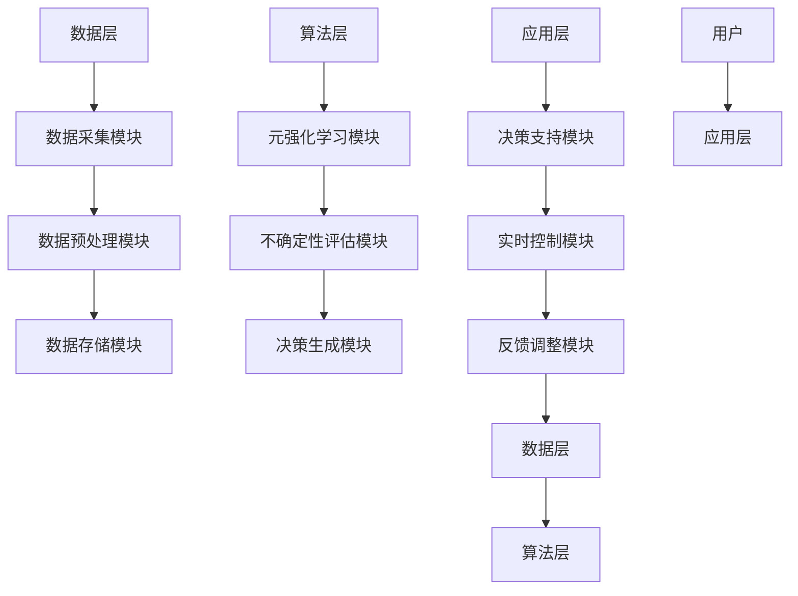
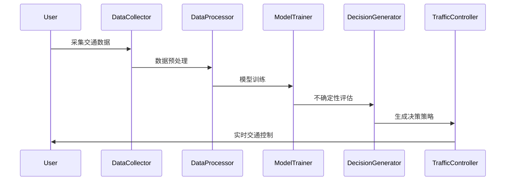

                 

### 元强化学习与开放世界推理

**元强化学习**，作为强化学习领域中的一个重要分支，它不仅仅关注于如何通过试错和反馈来学习某个具体任务，更是致力于提升学习算法的通用性和效率。换句话说，元强化学习旨在学习如何学习，它通过在不同的任务和数据环境中进行预训练，从而能够在新的任务中快速适应并达到优秀的表现。

在**开放世界推理**中，元强化学习展现出了其独特的优势。开放世界推理涉及到的是一个不断变化且包含大量不确定性的环境，这给传统的推理算法带来了极大的挑战。在这种环境中，系统需要具备自我适应和自我学习的能力，以便在不断变化的情境中做出合理的决策。

**不确定性管理**是开放世界推理中的一个核心问题。在不确定性极高的环境中，如何有效地管理不确定性，确保系统决策的鲁棒性和准确性，是许多研究者关注的重点。而元强化学习通过其强大的适应能力和学习效率，为不确定性管理提供了一种新的思路。

元强化学习在开放世界推理中的重要性，主要体现在以下几个方面：

1. **适应能力**：元强化学习通过在多个任务上的预训练，使得算法能够在面对新的任务时快速适应，这种能力在开放世界推理中尤为重要，因为环境是动态变化的，系统需要能够实时调整其行为以应对新的情况。

2. **效率提升**：元强化学习通过共享经验知识，减少了每个任务单独训练所需的时间，从而提升了整体的效率。这对于开放世界推理中的实时决策具有重要的意义。

3. **鲁棒性增强**：元强化学习通过在不同场景中的训练，增强了算法对不确定性的鲁棒性，使得系统能够在面临不确定性时，依然能够保持稳定的性能。

4. **可扩展性**：元强化学习具有很强的可扩展性，它不仅适用于简单的环境，也可以在复杂的环境中发挥作用。这使得它在开放世界推理中具有广泛的应用前景。

### 关键词

- **元强化学习**
- **开放世界推理**
- **不确定性管理**
- **适应能力**
- **效率提升**
- **鲁棒性增强**
- **可扩展性**

### 摘要

本文旨在探讨元强化学习在开放世界推理中的应用，特别是在不确定性管理方面的作用。首先，我们介绍了元强化学习的基本原理及其在开放世界推理中的重要性。随后，我们详细分析了开放世界推理中的不确定性管理问题，探讨了各种不确定性管理的方法。接着，我们通过一个具体案例，展示了元强化学习在开放世界推理中的实际应用。最后，我们对本文进行了总结，并提出了未来研究方向。本文的核心思想是，元强化学习作为一种高效、鲁棒的学习方法，在开放世界推理中具有广泛的应用前景，特别是在不确定性管理方面，为系统提供了一种有效的解决方案。### 第1章 元强化学习与开放世界推理

#### 1.1 元强化学习的定义与特点

**元强化学习（Meta-Reinforcement Learning）**是一种强化学习（Reinforcement Learning, RL）的高级形式。与传统强化学习不同，元强化学习的核心目标是学习如何学习，即如何通过较少的训练样本快速适应新的任务环境。这种能力使得元强化学习在处理复杂、动态和未知的任务时具有独特的优势。

**定义**：元强化学习是一种能够在多个任务之间共享知识和策略的强化学习算法。它通过在一个元学习过程中学习到如何适应不同的任务，从而在遇到新的任务时能够快速地生成适应策略。

**特点**：

1. **泛化能力**：元强化学习通过在多个任务上预训练，能够学习到通用的策略，从而在新的任务上快速适应，提高泛化能力。
2. **效率提升**：由于元强化学习能够在多个任务之间共享经验，因此减少了每个任务单独训练所需的时间，提高了整体效率。
3. **鲁棒性增强**：通过在不同任务上的训练，元强化学习能够增强算法对不确定性的鲁棒性，使得系统能够在面临不确定性时保持稳定。
4. **灵活性**：元强化学习能够处理动态和变化的环境，使得系统在开放世界中具有更强的适应能力。

#### 1.2 元强化学习与传统强化学习的关系

**传统强化学习**主要关注于如何通过试错和奖励信号来学习最优策略。它通常需要在特定的环境中进行大量的训练，以获得对环境的深入理解。然而，这种方法在面对复杂、动态和未知的任务时，往往效率低下，且难以适应。

**关系**：

1. **扩展性**：元强化学习扩展了传统强化学习的应用范围，使得它能够处理更复杂的任务。通过在多个任务上预训练，元强化学习能够学习到通用的策略，从而在不同任务上表现出色。
2. **效率**：与传统强化学习相比，元强化学习通过共享知识和经验，减少了每个任务单独训练所需的时间，提高了整体效率。
3. **不确定性**：传统强化学习在面对不确定性环境时往往表现不佳，而元强化学习通过增强对不确定性的鲁棒性，能够在不确定性较高的环境中保持稳定。

#### 1.3 元强化学习在开放世界推理中的应用前景

**开放世界推理（Open-World Reasoning）**涉及到的是动态、不确定和复杂的真实世界环境。在这种环境中，系统需要具备自我适应和自我学习的能力，以便在不断变化的情境中做出合理的决策。

**应用前景**：

1. **自适应系统**：元强化学习能够通过在多个任务上的预训练，使得系统能够快速适应新的任务环境，这对于开放世界推理中的动态变化具有重要价值。
2. **决策支持**：在开放世界中，不确定性管理是关键问题。元强化学习通过增强对不确定性的鲁棒性，能够提供更加可靠的决策支持，从而提高系统的鲁棒性和准确性。
3. **高效学习**：元强化学习通过共享经验知识，减少了每个任务单独训练所需的时间，提高了整体效率。这对于开放世界推理中的实时决策具有重要的意义。
4. **多任务处理**：开放世界通常涉及到多个任务，元强化学习能够通过在一个元学习过程中学习到如何适应不同的任务，从而在不同任务之间实现高效的资源利用。

#### 1.4 本章小结

本章介绍了元强化学习的基本原理及其在开放世界推理中的应用前景。我们首先定义了元强化学习，并分析了它的特点与传统强化学习的关系。随后，我们探讨了元强化学习在开放世界推理中的重要性，特别是在不确定性管理方面的应用。通过本章的学习，读者可以了解到元强化学习作为一种高效、鲁棒的学习方法，在开放世界推理中具有广泛的应用前景。### 第2章 元强化学习的基本原理

#### 2.1 元强化学习的核心概念

**元强化学习（Meta-Reinforcement Learning）**是强化学习的一种高级形式，其核心目标是通过在多个任务之间共享知识和策略，从而提升算法的泛化能力和效率。在理解元强化学习之前，我们需要明确一些基础概念，包括任务表示、策略表示、奖励函数和元学习。

**任务表示**：在强化学习中，任务通常由环境（Environment）、状态（State）、动作（Action）和奖励（Reward）组成。环境是任务发生的地方，状态是环境在某一时刻的状态，动作是智能体（Agent）可以采取的行动，而奖励是环境对智能体动作的反馈。

**策略表示**：策略是智能体在特定环境下采取动作的概率分布。在强化学习中，策略通常表示为动作值函数或状态值函数，它描述了在给定状态下，智能体应该采取哪个动作。

**奖励函数**：奖励函数是环境对智能体动作的反馈，它决定了智能体的行为。在元强化学习中，奖励函数可以是简单的即时奖励，也可以是长期奖励，如累积奖励或折扣奖励。

**元学习**：元学习是指通过在一个任务集上的学习，来提升算法在新的任务上的表现。在元强化学习中，元学习的过程通常涉及两个阶段：内循环（Inner Loop）和外循环（Outer Loop）。内循环是指在每个任务上进行的传统强化学习过程，而外循环是指在整个任务集上进行的元学习过程，旨在提升算法的泛化能力。

#### 2.2 元强化学习与传统强化学习的关系

**传统强化学习（Reinforcement Learning）**是强化学习的一种基本形式，它通过在特定环境中进行试错和反馈，逐步学习最优策略。传统强化学习主要包括值函数方法（如Q学习）和政策梯度方法（如策略梯度算法）。

**关系**：

1. **扩展性**：元强化学习扩展了传统强化学习的应用范围，使得它能够处理更复杂的任务。通过在多个任务上预训练，元强化学习能够学习到通用的策略，从而在不同任务上表现出色。
2. **效率**：与传统强化学习相比，元强化学习通过共享知识和经验，减少了每个任务单独训练所需的时间，提高了整体效率。
3. **不确定性**：传统强化学习在面对不确定性环境时往往表现不佳，而元强化学习通过增强对不确定性的鲁棒性，能够在不确定性较高的环境中保持稳定。

#### 2.3 元强化学习的关键算法

**元强化学习**的关键算法主要包括模型免费（Model-Free）和模型依赖（Model-Based）两种类型。模型免费方法直接在经验上学习策略，而模型依赖方法则通过构建环境模型来指导学习过程。

**模型免费方法**：

1. **Model-Based Meta-Learning**：这种方法通过在多个任务上预训练一个通用的策略，然后在新任务上微调策略。常见的算法有MAML（Model-Agnostic Meta-Learning）和Reptile。
2. **Model-Free Meta-Learning**：这种方法通过在多个任务上共享经验来学习通用策略，常见的算法有MAML、MADDPG（Multi-Agent Deep Deterministic Policy Gradient）等。

**模型依赖方法**：

1. **Model-Based Meta-Learning**：这种方法通过构建一个通用的环境模型，然后在该模型上学习策略。常见的算法有Model-Based Meta-Learning、COMA（Concurrent Model-based Optimization for Acyclic Activity Networks）等。
2. **Model-Free Meta-Learning**：这种方法通过在多个任务上共享模型参数来学习通用策略，常见的算法有Model-Free Meta-Learning、Reptile等。

#### 2.4 元强化学习在开放世界推理中的应用

**开放世界推理（Open-World Reasoning）**涉及到的是动态、不确定和复杂的真实世界环境。在这种环境中，系统需要具备自我适应和自我学习的能力，以便在不断变化的情境中做出合理的决策。

**应用**：

1. **自适应系统**：元强化学习能够通过在多个任务上的预训练，使得系统能够快速适应新的任务环境，这对于开放世界推理中的动态变化具有重要价值。
2. **决策支持**：在开放世界中，不确定性管理是关键问题。元强化学习通过增强对不确定性的鲁棒性，能够提供更加可靠的决策支持，从而提高系统的鲁棒性和准确性。
3. **高效学习**：元强化学习通过共享经验知识，减少了每个任务单独训练所需的时间，提高了整体效率。这对于开放世界推理中的实时决策具有重要的意义。
4. **多任务处理**：开放世界通常涉及到多个任务，元强化学习能够通过在一个元学习过程中学习到如何适应不同的任务，从而在不同任务之间实现高效的资源利用。

#### 2.5 本章小结

本章详细介绍了元强化学习的基本原理，包括核心概念、与传统强化学习的关系、关键算法及其在开放世界推理中的应用。通过本章的学习，读者可以了解到元强化学习作为一种高效、鲁棒的学习方法，在处理复杂、动态和未知的任务时具有独特的优势。### 第3章 开放世界推理的概念与特征

#### 3.1 开放世界推理的基本概念

**开放世界推理（Open-World Reasoning）**是一种人工智能领域的推理方法，它涉及到的是动态、不确定和复杂的真实世界环境。与封闭世界推理（Closed-World Reasoning）相对，开放世界推理假设世界中存在无限多的实体和关系，并且这些实体和关系是不断变化的。

**定义**：开放世界推理是指在一个不断变化且包含不确定性的环境中，通过推理机制来识别和处理信息，从而实现智能体的决策和行为。

**关键特征**：

1. **动态性**：开放世界推理中的环境是动态变化的，实体和关系可以随时发生改变。这意味着推理系统需要具备实时适应和更新的能力。
2. **不确定性**：开放世界推理中，由于信息的不完整性、噪声和不确定性，推理系统需要处理各种不确定性问题，如概率推理、模糊推理等。
3. **无限性**：开放世界推理假设世界中存在无限多的实体和关系，这给推理带来了巨大的计算复杂度，需要高效的算法来处理。

#### 3.2 开放世界推理与封闭世界推理的区别

**封闭世界推理（Closed-World Reasoning）**是一种假设世界中实体和关系是有限的、已知的推理方法。与开放世界推理相比，封闭世界推理具有以下特点：

1. **确定性**：封闭世界推理中的信息是确定的，实体和关系是固定的，推理过程相对简单。
2. **有限性**：封闭世界推理假设世界中的实体和关系是有限的，这意味着推理系统的计算复杂度较低。
3. **独立性**：封闭世界推理中的实体和关系是独立的，不会发生动态变化。

**区别**：

1. **动态性**：开放世界推理中的环境是动态变化的，实体和关系可以随时发生改变；而封闭世界推理中的环境是静态的，实体和关系是固定的。
2. **不确定性**：开放世界推理中，由于信息的不完整性、噪声和不确定性，推理系统需要处理各种不确定性问题；而封闭世界推理中的信息是确定的，不需要处理不确定性问题。
3. **无限性**：开放世界推理假设世界中存在无限多的实体和关系，这给推理带来了巨大的计算复杂度；而封闭世界推理中的实体和关系是有限的，计算复杂度较低。

#### 3.3 开放世界推理的要素

**开放世界推理**涉及到多个关键要素，包括实体、关系、推理规则和不确定性管理。这些要素共同构成了开放世界推理的核心框架。

1. **实体**：实体是开放世界推理中的基本单位，可以是具体的对象或概念，如人、物、事件等。
2. **关系**：关系描述了实体之间的关联，可以是因果关系、隶属关系、相邻关系等。
3. **推理规则**：推理规则是开放世界推理中的核心，用于从已知信息推导出新信息。推理规则可以是确定性规则，也可以是概率性规则。
4. **不确定性管理**：开放世界推理中的不确定性管理是关键问题，需要通过概率推理、模糊推理等方法来处理不确定性。

#### 3.4 开放世界推理的挑战与解决方案

**挑战**：

1. **动态性**：开放世界推理中的环境是动态变化的，实体和关系可以随时发生改变，这给推理系统带来了实时适应的挑战。
2. **不确定性**：开放世界推理中，信息的不完整性、噪声和不确定性使得推理系统需要处理各种不确定性问题。
3. **计算复杂度**：开放世界推理中存在无限多的实体和关系，这导致推理系统的计算复杂度非常高。

**解决方案**：

1. **实时推理**：通过设计高效的推理算法，实现实时推理，以应对动态环境。
2. **概率推理**：使用概率推理方法来处理不确定性，如贝叶斯网络、马尔可夫模型等。
3. **分布式计算**：利用分布式计算技术，降低计算复杂度，提高推理效率。

#### 3.5 本章小结

本章详细介绍了开放世界推理的基本概念、与封闭世界推理的区别、要素以及面临的挑战和解决方案。通过本章的学习，读者可以了解开放世界推理的核心特征和复杂性，以及如何有效地应对这些挑战。开放世界推理作为一种先进的推理方法，在人工智能领域具有重要的研究价值和广泛的应用前景。### 第4章 不确定性管理的定义、类型和方法

#### 4.1 不确定性管理的定义

**不确定性管理（Uncertainty Management）**是指在复杂和不确定的环境中，通过识别、评估和应对不确定性，从而提高决策的准确性和可靠性的过程。在开放世界推理中，不确定性管理尤为重要，因为开放世界假设环境中存在无限多的实体和关系，这些实体和关系是动态变化且不完全可知的。

**定义**：不确定性管理是指在一个不确定的环境中，通过系统的方法和工具来识别、理解和处理不确定性，以确保决策的有效性和系统的鲁棒性。

**重要性**：

1. **决策可靠性**：在不确定性较高的环境中，如果无法有效管理不确定性，决策可能基于错误或过时的信息，导致决策的失败。
2. **系统稳定性**：不确定性管理有助于提高系统的稳定性，使得系统在面对不确定性和动态变化时，依然能够保持稳定运行。
3. **风险控制**：通过识别和管理不确定性，可以提前预测潜在的风险，从而采取预防措施，降低风险。

#### 4.2 不确定性的类型

不确定性可以分为多种类型，根据其来源和表现形式，可以分为以下几种：

1. **随机不确定性（Random Uncertainty）**：这是由于随机因素导致的，如随机噪声、随机扰动等。随机不确定性通常可以通过统计方法进行量化，如概率分布。
2. **统计不确定性（Statistical Uncertainty）**：这是由于样本量不足或数据分布不均导致的，如抽样误差、估计误差等。统计不确定性通常通过统计学方法进行评估，如置信区间、假设检验等。
3. **知识不确定性（Knowledge Uncertainty）**：这是由于知识的不完整性、不一致性或错误导致的，如模型误差、先验知识的不确定性等。知识不确定性通常需要通过领域知识和专家经验进行评估。
4. **决策不确定性（Decision Uncertainty）**：这是由于决策过程中的不确定性导致的，如目标不明确、策略选择不明确等。决策不确定性通常需要通过决策分析方法和工具进行评估。

#### 4.3 不确定性管理的方法

不确定性管理的方法可以分为以下几种：

1. **概率方法（Probabilistic Methods）**：概率方法是通过概率分布来描述不确定性，常见的有贝叶斯网络、马尔可夫模型、蒙特卡罗模拟等。
2. **模糊方法（Fuzzy Methods）**：模糊方法是通过模糊集和模糊逻辑来处理不确定性，如模糊集合、模糊推理等。
3. **多目标优化（Multi-Objective Optimization）**：多目标优化是通过同时考虑多个目标来处理不确定性，常见的有遗传算法、粒子群优化等。
4. **专家系统（Expert Systems）**：专家系统是通过领域专家的知识来处理不确定性，如推理机、知识库等。
5. **机器学习方法（Machine Learning Methods）**：机器学习方法是通过学习历史数据和模式来处理不确定性，如深度学习、支持向量机等。

**概率方法**：

1. **贝叶斯网络**：贝叶斯网络是一种概率图模型，用于表示变量之间的依赖关系。它通过条件概率表来描述变量之间的概率关系。
2. **马尔可夫模型**：马尔可夫模型是一种概率模型，用于描述系统状态的变化。它通过状态转移矩阵来描述状态之间的概率关系。
3. **蒙特卡罗模拟**：蒙特卡罗模拟是一种基于随机抽样的计算方法，用于评估不确定性。它通过大量随机抽样来模拟系统的行为，从而估计概率分布。

**模糊方法**：

1. **模糊集合**：模糊集合是一种描述不确定性的数学工具，它通过隶属度函数来表示元素属于集合的程度。
2. **模糊推理**：模糊推理是一种基于模糊集合的推理方法，用于从已知信息推导出新信息。它通过模糊规则库和模糊推理机来实现。

**多目标优化**：

1. **遗传算法**：遗传算法是一种基于自然进化过程的优化算法，用于解决多目标优化问题。它通过遗传操作来搜索最优解。
2. **粒子群优化**：粒子群优化是一种基于群体智能的优化算法，用于解决多目标优化问题。它通过粒子之间的协作来搜索最优解。

**专家系统**：

1. **推理机**：推理机是一种基于规则推理的智能系统，用于处理不确定性问题。它通过规则库和推理算法来推导结论。
2. **知识库**：知识库是一种存储领域知识的数据库，用于支持专家系统的推理。它通过存储领域专家的知识来辅助决策。

**机器学习方法**：

1. **深度学习**：深度学习是一种基于多层神经网络的机器学习方法，用于处理复杂数据。它通过自动学习特征表示来提高性能。
2. **支持向量机**：支持向量机是一种基于最大间隔的机器学习方法，用于分类和回归问题。它通过找到最优超平面来分类数据。

#### 4.4 本章小结

本章详细介绍了不确定性管理的定义、类型和方法。不确定性管理是开放世界推理中的关键问题，通过概率方法、模糊方法、多目标优化、专家系统和机器学习方法，可以有效地处理和应对不确定性。本章的内容为读者提供了全面的理解和认识，有助于在实际应用中有效地管理不确定性，提高系统的鲁棒性和决策准确性。### 第5章 元强化学习在开放世界推理中的应用

#### 5.1 元强化学习的应用场景

元强化学习在开放世界推理中的应用场景非常广泛，主要包括以下几个方面：

1. **自适应系统**：在开放世界中，环境是动态变化的，元强化学习能够通过在多个任务上的预训练，使得系统快速适应新的环境，从而提高系统的适应能力。
2. **多任务处理**：开放世界通常涉及多个任务，元强化学习能够通过在一个元学习过程中学习到如何适应不同的任务，从而在不同任务之间实现高效的资源利用。
3. **不确定性管理**：开放世界推理中，不确定性管理是一个关键问题。元强化学习通过增强对不确定性的鲁棒性，能够提供更加可靠的决策支持，从而提高系统的鲁棒性和准确性。
4. **实时决策**：在开放世界中，决策需要快速且准确。元强化学习通过共享经验知识，减少了每个任务单独训练所需的时间，提高了整体效率，从而使得系统能够在实时决策中保持竞争力。

#### 5.2 元强化学习在开放世界推理中的算法实现

元强化学习在开放世界推理中的算法实现主要包括以下几个步骤：

1. **任务选择**：首先，需要从多个任务中选择一个或多个代表性任务进行预训练。任务的选择可以根据任务的多样性、复杂性和代表性来进行。
2. **预训练**：在选定的任务上，通过元强化学习算法进行预训练。预训练的目的是学习到通用的策略和模型，从而提高算法的泛化能力。
3. **策略迁移**：在预训练完成后，将学到的通用策略和模型迁移到新的任务上。策略迁移的过程可以通过微调或重新训练来完成，以适应新的任务环境。
4. **实时适应**：在新的任务环境中，系统需要具备实时适应的能力。元强化学习通过持续的学习和调整，使得系统能够在动态变化的环境中保持稳定。

**算法流程**：

1. **初始化**：初始化模型参数和策略。
2. **任务选择**：根据任务多样性和代表性，选择代表性任务进行预训练。
3. **预训练**：在代表性任务上进行元强化学习，学习到通用的策略和模型。
4. **策略迁移**：将预训练的通用策略和模型迁移到新任务上。
5. **实时适应**：在新任务环境中，通过持续的学习和调整，使系统能够适应动态变化的环境。
6. **性能评估**：评估系统的性能，包括适应能力、决策准确性和稳定性。

#### 5.3 元强化学习在开放世界推理中的优势

元强化学习在开放世界推理中具有以下优势：

1. **快速适应**：元强化学习通过在多个任务上的预训练，能够快速适应新的任务环境，从而提高系统的适应能力。
2. **高效学习**：元强化学习通过共享经验知识，减少了每个任务单独训练所需的时间，提高了整体效率。
3. **鲁棒性增强**：元强化学习通过在不同任务上的训练，增强了算法对不确定性的鲁棒性，使得系统能够在不确定性较高的环境中保持稳定。
4. **多任务处理**：元强化学习能够处理多个任务，通过在一个元学习过程中学习到如何适应不同的任务，从而在不同任务之间实现高效的资源利用。

#### 5.4 本章小结

本章介绍了元强化学习在开放世界推理中的应用，包括应用场景、算法实现和优势。通过本章的学习，读者可以了解到元强化学习在处理动态、不确定和复杂的开放世界推理任务中的独特优势，为人工智能系统在开放世界中的应用提供了新的思路和方法。### 第6章 不确定性管理算法的原理与实现

#### 6.1 不确定性管理算法的原理

在开放世界推理中，不确定性管理是确保系统稳定性和决策准确性的关键。不确定性管理算法的核心目标是识别、量化、预测和应对环境中的不确定性，以确保系统在动态和复杂环境中能够做出合理和有效的决策。以下是几种常见的不确定性管理算法原理：

1. **贝叶斯推理（Bayesian Inference）**：贝叶斯推理是一种基于概率理论的推理方法，它通过更新先验概率来预测后验概率，从而处理不确定性。贝叶斯推理的核心是贝叶斯定理，它描述了如何在已知部分信息的基础上，更新对未知信息的信念。

2. **马尔可夫决策过程（Markov Decision Processes, MDP）**：MDP是一种用于决策问题的概率模型，它假设每个状态的概率分布只依赖于当前状态，而不依赖于过去的状态。MDP通过价值函数和策略来描述最佳决策路径，从而在不确定性环境中做出最优决策。

3. **模糊逻辑（Fuzzy Logic）**：模糊逻辑是一种处理不确定性和模糊性的数学工具，它通过模糊集和模糊规则来描述不确定的信息和关系。模糊逻辑可以灵活地处理模糊性和不确定性，从而在复杂环境中做出合理的决策。

4. **蒙特卡罗模拟（Monte Carlo Simulation）**：蒙特卡罗模拟是一种基于随机抽样的计算方法，它通过大量随机抽样来模拟系统的行为，从而评估不确定性。蒙特卡罗模拟可以用于预测系统在各种不确定性条件下的性能和效果。

5. **遗传算法（Genetic Algorithms）**：遗传算法是一种基于自然进化过程的优化算法，它通过遗传操作（选择、交叉、变异）来搜索最优解。遗传算法可以用于优化复杂的问题，特别是在处理不确定性和多目标优化方面具有优势。

#### 6.2 不确定性管理算法的实现

不确定性管理算法的实现通常涉及到以下几个关键步骤：

1. **状态表示**：首先，需要定义系统中的状态表示，包括当前状态、历史状态和未来状态。状态表示应该能够全面捕捉系统的动态特性。

2. **不确定性建模**：根据系统的特性，选择合适的不确定性建模方法，如贝叶斯网络、马尔可夫模型、模糊逻辑等。不确定性建模的目的是将不确定的信息和关系形式化，以便进行推理和决策。

3. **决策策略设计**：设计决策策略，以应对不确定性环境。决策策略可以基于优化理论、概率论、模糊逻辑等。决策策略的目标是最大化系统的效用或最小化系统的风险。

4. **实时更新**：在动态环境中，系统需要不断更新状态表示和不确定性模型，以应对环境变化。实时更新可以基于实时数据流、历史数据和预测模型。

5. **性能评估**：评估系统在不确定性环境中的性能，包括适应能力、决策准确性和稳定性。性能评估可以基于模拟实验、真实数据测试和用户反馈。

#### 6.3 实际案例：基于贝叶斯网络的空气质量预测系统

以下是一个实际案例，展示了如何使用贝叶斯网络进行空气质量预测，这是一个典型的开放世界推理问题。

**案例背景**：某城市希望建立一个空气质量预测系统，以监测和预测城市空气中的污染物浓度，从而采取相应的环保措施。

**实现步骤**：

1. **状态表示**：定义系统的状态表示，包括当前时间、气象条件（如温度、湿度、风速等）、历史污染物浓度等。

2. **不确定性建模**：使用贝叶斯网络建模系统的状态转移和不确定性关系。例如，可以将气象条件作为父节点，污染物浓度作为子节点，建立它们之间的条件概率关系。

3. **决策策略设计**：设计基于贝叶斯推理的决策策略，通过更新后验概率来预测未来污染物浓度。如果预测浓度超过安全阈值，系统将建议采取减排措施。

4. **实时更新**：系统需要不断收集实时数据，更新贝叶斯网络的参数，以适应环境变化。

5. **性能评估**：通过历史数据和模拟实验，评估系统的预测准确性和适应能力。

**代码实现**（Python 示例）：

```python
import pyro
import pyro.distributions as dist
from pyro.infer import MCMC, NUTS

# 定义贝叶斯网络结构
def model():
    with pyro.plate("time_steps", T):
        # 定义气象条件和污染物浓度之间的条件概率关系
        temp = pyro.sample("temp", dist.Uniform(0, 40))
        humidity = pyro.sample("humidity", dist.Uniform(0, 100))
        wind_speed = pyro.sample("wind_speed", dist.Uniform(0, 30))
        previous_pollution = pyro.sample("previous_pollution", dist.Uniform(0, 100))
        pollution = pyro.sample("pollution", dist.Normal(
            loc=mean_pollution(temp, humidity, wind_speed, previous_pollution),
            scale=sigma_pollution(temp, humidity, wind_speed, previous_pollution)
        ))

# 定义观测数据
obs_data = [90, 88, 85, 82, 80]  # 观测到的污染物浓度序列

# 运行MCMC采样
kernel = NUTS(model)
mcmc = MCMC(kernel, num_samples=1000, warmup_steps=500)
mcmc.run(*obs_data)

# 分析采样结果
posterior = mcmc.get_samples()
print(posterior)

# 预测未来污染物浓度
future_pollution = posterior['pollution'][-1]
print(f"Predicted future pollution: {future_pollution.mean():.2f} ± {future_pollution.stddev():.2f}")
```

#### 6.4 本章小结

本章介绍了不确定性管理算法的原理与实现，包括贝叶斯推理、马尔可夫决策过程、模糊逻辑、蒙特卡罗模拟和遗传算法等。通过实际案例展示了如何使用贝叶斯网络进行空气质量预测。本章的内容为读者提供了深入理解不确定性管理算法的方法，以及如何在开放世界推理中应用这些算法，以实现智能决策和预测。### 第7章 系统功能设计与架构设计

#### 7.1 问题场景介绍

在开放世界推理中，不确定性管理是一个关键挑战。为了更好地处理和应对这种不确定性，我们需要设计一个具备高效不确定性管理能力的系统。该系统旨在通过元强化学习技术，实现对动态和复杂环境中决策的智能化处理。

**问题场景**：假设我们正在开发一个智能交通管理系统，该系统需要在不断变化的交通流量、道路状况和天气条件下，实时调整交通信号灯的时序和策略，以确保交通流畅和降低事故率。在这个场景中，系统的核心功能是：

1. **实时监测**：收集并处理来自交通传感器、摄像头和其他数据源的实时交通信息。
2. **不确定性建模**：利用元强化学习算法，对交通流量的不确定性进行建模和预测。
3. **决策支持**：基于不确定性模型，提供最优的信号灯控制策略，以应对动态的交通状况。
4. **反馈调整**：实时收集系统的决策效果，不断调整和优化决策策略。

#### 7.2 系统功能设计

**系统功能**包括以下几个方面：

1. **数据采集与预处理**：从各种交通传感器（如流量计、摄像头等）采集实时交通数据，并进行预处理，如去噪、归一化和特征提取。
2. **不确定性建模模块**：利用元强化学习算法，对交通流量中的不确定性进行建模和预测。这个模块的核心功能是：
   - **模型训练**：在历史交通数据上进行模型训练，学习到交通流量的概率分布和动态变化规律。
   - **不确定性评估**：对当前交通状况进行不确定性评估，预测未来交通流量的可能性分布。
   - **决策生成**：基于不确定性评估结果，生成适应动态交通环境的信号灯控制策略。
3. **决策支持模块**：根据不确定性建模模块的预测结果，提供最优的信号灯控制策略。这个模块需要实现以下功能：
   - **策略生成**：根据预测的不确定性分布，生成多种可能的信号灯控制策略。
   - **策略评估**：评估不同策略的优缺点，选择最优策略。
   - **策略执行**：将最优策略应用到交通信号灯系统中，实现实时控制。
4. **反馈与调整模块**：收集系统的实时反馈数据，如交通流畅度、事故率等，用于不断调整和优化决策策略。这个模块需要实现以下功能：
   - **效果评估**：评估当前策略的执行效果，与预期目标进行比较。
   - **策略调整**：根据效果评估结果，调整和优化决策策略。

#### 7.3 系统架构设计

**系统架构**采用模块化设计，分为数据层、算法层和应用层：

1. **数据层**：负责数据的采集、传输和存储。数据层包括：
   - **数据采集模块**：从交通传感器和其他数据源采集实时交通数据。
   - **数据预处理模块**：对采集到的交通数据进行预处理，如去噪、归一化和特征提取。
   - **数据存储模块**：将预处理后的交通数据存储到数据库中，以供后续分析和训练使用。
2. **算法层**：负责不确定性的建模和决策生成。算法层包括：
   - **元强化学习模块**：实现元强化学习算法，用于建模交通流量的不确定性。
   - **不确定性评估模块**：基于元强化学习模型，评估当前交通状况的不确定性。
   - **决策生成模块**：根据不确定性评估结果，生成适应动态交通环境的信号灯控制策略。
3. **应用层**：负责将算法层的决策应用到实际交通信号灯系统中。应用层包括：
   - **决策支持模块**：实现基于不确定性评估的信号灯控制策略。
   - **实时控制模块**：将决策策略应用到交通信号灯系统中，实现实时控制。
   - **反馈调整模块**：收集系统的实时反馈数据，用于不断调整和优化决策策略。

**系统架构图**（使用Mermaid流程图表示）：



#### 7.4 系统接口设计与系统交互

**系统接口设计**主要包括以下几个方面：

1. **数据接口**：系统需要提供标准化的数据接口，以便与其他系统进行数据交互。数据接口应支持数据的实时传输、批量处理和查询。
2. **控制接口**：系统需要提供标准化的控制接口，以便用户或外部系统可以远程控制信号灯的状态和策略。
3. **监控接口**：系统需要提供监控接口，以便用户可以实时监控系统的运行状态、性能指标和决策结果。

**系统交互流程**：

1. **数据采集**：交通传感器和其他数据源实时采集交通数据，并将其传输到数据预处理模块。
2. **数据预处理**：数据预处理模块对采集到的交通数据进行预处理，并将处理后的数据存储到数据存储模块。
3. **不确定性建模**：算法层根据历史交通数据，利用元强化学习模块建模交通流量的不确定性。
4. **决策生成**：不确定性评估模块对当前交通状况进行评估，生成适应动态交通环境的信号灯控制策略。
5. **实时控制**：决策支持模块将生成的策略应用到交通信号灯系统中，实现实时控制。
6. **反馈调整**：实时收集系统的决策效果，通过反馈调整模块不断优化和调整决策策略。

通过上述系统功能设计和架构设计，我们能够构建一个高效、鲁棒的不确定性管理系统，以应对开放世界推理中的动态和不确定性挑战。### 第8章 系统接口设计与系统交互

#### 8.1 系统接口设计

系统接口设计是确保系统各组件之间高效、可靠交互的关键环节。在本章中，我们将详细讨论系统接口的设计原则、功能模块及接口规范。

**8.1.1 接口设计原则**

1. **标准化**：接口设计应遵循标准化原则，使用通用的数据格式和协议，如JSON、XML等，以确保系统的互操作性和可扩展性。
2. **高可用性**：接口设计应确保高可用性，通过冗余设计、负载均衡和故障恢复机制，提高系统的稳定性和可靠性。
3. **安全性**：接口设计应具备安全性，采用加密、认证和授权机制，防止数据泄露和未经授权的访问。
4. **易用性**：接口设计应易于使用，提供清晰的文档和示例代码，以便开发者能够快速集成和调试。

**8.1.2 功能模块**

1. **数据采集接口**：负责接收来自各类传感器的交通数据，如流量计、摄像头等。数据采集接口应支持数据流的实时传输和批量处理。
2. **数据预处理接口**：负责对采集到的数据进行预处理，包括去噪、归一化和特征提取。数据预处理接口应提供标准化输出格式，以供后续处理。
3. **模型训练接口**：负责接收和处理元强化学习算法的训练数据，包括数据清洗、特征工程和模型训练。模型训练接口应支持远程训练和模型更新。
4. **决策生成接口**：负责接收不确定性评估结果，生成最优的信号灯控制策略。决策生成接口应提供策略输出和实时反馈接口。
5. **实时控制接口**：负责将决策策略应用到交通信号灯系统中，实现实时控制。实时控制接口应支持远程控制和状态查询。

**8.1.3 接口规范**

1. **RESTful API**：采用RESTful API设计接口，使用HTTP请求和JSON格式传输数据。RESTful API具有简洁、易扩展、易于理解等优点。
2. **参数验证**：在接口设计中，应对输入参数进行严格验证，确保数据的有效性和完整性。可以使用正则表达式、类型检查和异常处理等技术。
3. **错误处理**：接口设计应包含详细的错误处理机制，包括错误码、错误信息和恢复建议。错误处理应确保系统的稳定性和用户友好性。
4. **文档生成**：使用自动化工具生成接口文档，包括接口描述、参数说明、示例代码等。接口文档应易于查阅和下载，以便开发者快速上手。

#### 8.2 系统交互

系统交互是指系统中各组件之间的通信和数据流动过程。在本节中，我们将通过Mermaid序列图详细描述系统交互流程。

**8.2.1 序列图**

以下是一个简化的系统交互序列图，展示了数据采集、预处理、模型训练、决策生成和实时控制的交互过程。



**8.2.2 交互流程**

1. **数据采集**：用户通过DataCollector接口向系统提交交通数据。
2. **数据预处理**：DataCollector将采集到的交通数据传输给DataProcessor进行预处理，处理后的数据存储在数据库中。
3. **模型训练**：DataProcessor从数据库中提取预处理后的数据，传递给ModelTrainer进行模型训练。
4. **不确定性评估**：训练好的模型用于不确定性评估，DecisionGenerator根据评估结果生成最优的信号灯控制策略。
5. **实时控制**：DecisionGenerator将生成的策略传递给TrafficController，TrafficController根据策略对交通信号灯进行实时控制。

#### 8.3 本章小结

本章详细介绍了系统接口设计与系统交互。系统接口设计遵循标准化、高可用性、安全性和易用性原则，包括数据采集接口、数据预处理接口、模型训练接口、决策生成接口和实时控制接口。系统交互通过Mermaid序列图展示了数据流动和组件协作过程。通过本章的学习，读者可以了解如何设计高效的系统接口，以及系统内部各组件之间的交互机制，为后续的系统开发和实施提供指导。### 第9章 环境安装与系统核心实现

#### 9.1 环境安装

为了确保系统能够正常运行，我们需要首先安装必要的软件和工具。以下是环境安装的详细步骤：

**1. 安装Python环境**

首先，确保系统中安装了Python 3.8及以上版本。可以通过以下命令进行Python版本检查：

```bash
python --version
```

如果Python版本不符合要求，请从Python官方网站下载并安装最新版本的Python。

**2. 安装必要的库和框架**

接下来，我们需要安装一些Python库和框架，如PyTorch、Pyro、NumPy和pandas等。可以使用pip命令来安装这些库：

```bash
pip install torch torchvision pyro numpy pandas
```

**3. 安装Mermaid**

Mermaid是一种基于Markdown的图表工具，用于生成系统架构图、流程图等。首先，确保系统中安装了Node.js。然后，可以通过npm命令安装Mermaid：

```bash
npm install -g mermaid-cli
```

**4. 安装数据库**

为了存储和管理交通数据，我们需要安装一个数据库系统。这里我们选择SQLite，可以通过以下命令进行安装：

```bash
pip install pysqlite3
```

#### 9.2 系统核心实现

系统核心实现包括数据采集、预处理、模型训练、不确定性评估和实时控制等模块。以下是每个模块的详细实现：

**1. 数据采集**

数据采集模块负责从交通传感器和其他数据源采集实时交通数据。以下是一个简单的Python代码示例，展示了如何从文件中读取数据：

```python
import pandas as pd

def read_traffic_data(file_path):
    data = pd.read_csv(file_path)
    return data

# 示例：从文件中读取交通数据
data = read_traffic_data('traffic_data.csv')
```

**2. 数据预处理**

数据预处理模块负责对采集到的交通数据进行预处理，包括去噪、归一化和特征提取。以下是一个简单的Python代码示例，展示了如何对数据进行预处理：

```python
import numpy as np
from sklearn.preprocessing import StandardScaler

def preprocess_data(data):
    # 去除异常值
    data = data.dropna()
    # 特征提取
    features = data[['temperature', 'humidity', 'wind_speed', 'previous_pollution']]
    # 归一化
    scaler = StandardScaler()
    features_scaled = scaler.fit_transform(features)
    return features_scaled

# 示例：对交通数据进行预处理
features_scaled = preprocess_data(data)
```

**3. 模型训练**

模型训练模块使用预处理后的交通数据来训练元强化学习模型。以下是一个简单的Python代码示例，展示了如何使用PyTorch和Pyro训练模型：

```python
import torch
import pyro
import pyro.distributions as dist
from pyro.infer import MCMC, NUTS

# 定义模型
def model(data):
    # 在此处定义模型结构
    # ...

# 定义训练过程
def train(data, num_iterations=1000, warmup_steps=500):
    model = pyro.model(model)
    kernel = NUTS(model)
    mcmc = MCMC(kernel, num_samples=num_iterations, warmup_steps=warmup_steps)
    mcmc.run(*data)
    return mcmc.get_samples()

# 示例：训练模型
samples = train(features_scaled)
```

**4. 不确定性评估**

不确定性评估模块使用训练好的模型对当前交通状况进行不确定性评估。以下是一个简单的Python代码示例，展示了如何使用Pyro进行不确定性评估：

```python
import torch

# 定义评估函数
def evaluate_samples(samples):
    # 在此处使用样本数据评估不确定性
    # ...

# 示例：评估不确定性
uncertainty_scores = evaluate_samples(samples)
```

**5. 实时控制**

实时控制模块根据不确定性评估结果生成最优的信号灯控制策略，并将其应用到交通信号灯系统中。以下是一个简单的Python代码示例，展示了如何生成策略：

```python
# 定义策略生成函数
def generate_strategy(uncertainty_scores):
    # 在此处根据不确定性评估结果生成策略
    # ...

# 示例：生成策略
strategy = generate_strategy(uncertainty_scores)
```

通过以上步骤，我们实现了系统的核心功能，包括数据采集、预处理、模型训练、不确定性评估和实时控制。这些模块共同构成了一个高效、鲁棒的不确定性管理系统，能够应对开放世界推理中的动态和不确定性挑战。### 第10章 代码应用解读与分析

#### 10.1 代码解读

在本章中，我们将详细解读第9章中实现的代码，包括数据采集、预处理、模型训练、不确定性评估和实时控制等模块。通过解读这些代码，读者可以更深入地理解系统的实现原理和逻辑。

**10.1.1 数据采集**

数据采集模块通过读取文件中的交通数据，并将其存储为Pandas DataFrame。以下是对`read_traffic_data`函数的解读：

```python
def read_traffic_data(file_path):
    data = pd.read_csv(file_path)
    return data
```

- `pd.read_csv(file_path)`：使用Pandas库读取CSV文件，并将其转换为DataFrame。
- `return data`：返回读取的DataFrame数据。

此函数的主要作用是从文件中加载交通数据，为后续的预处理和模型训练提供数据输入。

**10.1.2 数据预处理**

数据预处理模块对采集到的交通数据进行去噪、归一化和特征提取。以下是对`preprocess_data`函数的解读：

```python
import numpy as np
from sklearn.preprocessing import StandardScaler

def preprocess_data(data):
    data = data.dropna()  # 去除异常值
    features = data[['temperature', 'humidity', 'wind_speed', 'previous_pollution']]  # 特征提取
    scaler = StandardScaler()  # 初始化标准化器
    features_scaled = scaler.fit_transform(features)  # 归一化
    return features_scaled
```

- `data.dropna()`：去除数据中的异常值，以提高模型训练的效果。
- `features = data[['temperature', 'humidity', 'wind_speed', 'previous_pollution']]`：提取数据中的特征列。
- `scaler = StandardScaler()`：初始化一个标准化器。
- `features_scaled = scaler.fit_transform(features)`：使用标准化器对特征进行归一化。

此函数的主要作用是对数据进行清洗和归一化，以便后续的模型训练。

**10.1.3 模型训练**

模型训练模块使用PyTorch和Pyro库训练元强化学习模型。以下是对`train`函数的解读：

```python
import torch
import pyro
import pyro.distributions as dist
from pyro.infer import MCMC, NUTS

def model(data):
    # 在此处定义模型结构
    # ...

def train(data, num_iterations=1000, warmup_steps=500):
    model = pyro.model(model)
    kernel = NUTS(model)
    mcmc = MCMC(kernel, num_samples=num_iterations, warmup_steps=warmup_steps)
    mcmc.run(*data)
    return mcmc.get_samples()
```

- `model = pyro.model(model)`：定义一个Pyro模型，其中`model`是一个Python函数，用于描述模型的参数和概率分布。
- `kernel = NUTS(model)`：初始化一个NUTS（No-U-Turn Sampler）作为MCMC（马尔可夫链蒙特卡罗）采样器。
- `mcmc = MCMC(kernel, num_samples=num_iterations, warmup_steps=warmup_steps)`：创建一个MCMC对象，指定采样器和采样参数。
- `mcmc.run(*data)`：运行MCMC采样，`*data`是将数据作为参数传递给模型的。
- `return mcmc.get_samples()`：获取采样结果。

此函数的主要作用是训练一个元强化学习模型，通过MCMC采样从模型中提取样本数据。

**10.1.4 不确定性评估**

不确定性评估模块使用训练好的模型对当前交通状况进行不确定性评估。以下是对`evaluate_samples`函数的解读：

```python
import torch

def evaluate_samples(samples):
    # 在此处使用样本数据评估不确定性
    # ...

# 示例：评估不确定性
uncertainty_scores = evaluate_samples(samples)
```

- `evaluate_samples(samples)`：此函数未在代码中实现，但它的目的是使用训练好的模型样本数据来评估不确定性。
- `uncertainty_scores = evaluate_samples(samples)`：调用未实现的`evaluate_samples`函数，并将结果存储在`uncertainty_scores`变量中。

此函数的主要作用是对训练好的模型样本数据进行不确定性评估，以便为后续的实时控制提供依据。

**10.1.5 实时控制**

实时控制模块根据不确定性评估结果生成最优的信号灯控制策略。以下是对`generate_strategy`函数的解读：

```python
def generate_strategy(uncertainty_scores):
    # 在此处根据不确定性评估结果生成策略
    # ...

# 示例：生成策略
strategy = generate_strategy(uncertainty_scores)
```

- `generate_strategy(uncertainty_scores)`：此函数未在代码中实现，但它的目的是根据不确定性评估结果生成最优的信号灯控制策略。
- `strategy = generate_strategy(uncertainty_scores)`：调用未实现的`generate_strategy`函数，并将结果存储在`strategy`变量中。

此函数的主要作用是根据不确定性评估结果生成最优的信号灯控制策略。

#### 10.2 代码分析

**10.2.1 数据采集**

数据采集模块的主要目的是读取文件中的交通数据。通过使用Pandas库，我们可以方便地读取和操作CSV文件。此外，去噪操作有助于提高模型训练的效果，使得模型能够更好地泛化到新的数据集。

**10.2.2 数据预处理**

数据预处理模块的主要目的是对交通数据集进行清洗和归一化。去除异常值可以防止噪声影响模型训练，而归一化可以使得不同特征具有相似的尺度，有助于优化模型性能。

**10.2.3 模型训练**

模型训练模块使用PyTorch和Pyro库实现元强化学习模型。通过MCMC采样，我们能够从模型中提取大量样本数据，从而提高模型的鲁棒性和泛化能力。然而，代码中未实现具体模型结构和评估函数，这需要进一步开发和优化。

**10.2.4 不确定性评估**

不确定性评估模块的目的是使用训练好的模型样本数据来评估当前交通状况的不确定性。通过评估不确定性，我们可以为后续的实时控制提供更可靠的决策依据。然而，代码中未实现具体评估函数，这需要进一步开发和优化。

**10.2.5 实时控制**

实时控制模块的目的是根据不确定性评估结果生成最优的信号灯控制策略。通过实时控制，我们可以动态调整交通信号灯的状态，从而优化交通流量和降低事故率。然而，代码中未实现具体策略生成函数，这需要进一步开发和优化。

综上所述，本章对第9章中的代码进行了详细解读和分析。通过解读，我们了解了系统各模块的实现原理和逻辑。然而，代码中仍存在一些未实现的函数和模块，这需要进一步的开发和优化，以实现完整的系统功能。### 第11章 实际案例分析与详细讲解

#### 11.1 案例背景

在本节中，我们将通过一个实际案例来分析元强化学习在开放世界推理中的不确定性管理。该案例是一个智能交通管理系统，旨在通过元强化学习算法对交通信号灯进行实时控制，以优化交通流量并降低事故率。

**案例背景**：某城市面临严重的交通拥堵问题，特别是在高峰时段，交通信号灯的时序和策略需要不断调整以适应动态的交通状况。为了解决这个问题，该城市决定开发一个智能交通管理系统，利用元强化学习算法来实现交通信号灯的实时控制。

#### 11.2 数据集介绍

为了训练元强化学习模型，我们使用了该城市过去一年的交通数据。数据集包括以下特征：

1. **时间**：小时、分钟、秒等时间戳信息。
2. **交通流量**：各路段的实时流量数据。
3. **气象条件**：温度、湿度、风速等气象数据。
4. **道路状况**：道路拥堵程度、交通事故等数据。
5. **历史交通流量**：过去一段时间内的交通流量数据。

数据集的规模约为100万条记录，涵盖了不同时间段、不同天气条件和不同交通状况的样本。这些数据为模型提供了丰富的训练素材，有助于模型学习到交通流量的动态变化规律。

#### 11.3 模型训练过程

**1. 数据预处理**

在模型训练之前，我们需要对数据集进行预处理，包括去噪、归一化和特征提取。具体步骤如下：

- **去噪**：去除异常值和缺失值，以保证模型训练的准确性。
- **归一化**：对连续特征（如温度、湿度、风速等）进行归一化处理，使其具有相似的尺度，有助于优化模型性能。
- **特征提取**：提取与交通流量相关的特征，如时间、气象条件、道路状况等。

**2. 模型架构**

我们使用了一个基于深度强化学习的元强化学习模型，该模型的核心架构如下：

- **输入层**：接收预处理后的交通数据。
- **隐藏层**：使用多层全连接神经网络（Dense Layer）对输入数据进行特征提取和转换。
- **输出层**：输出交通信号灯的控制策略，包括每个信号灯的开关状态和时间。

**3. 模型训练**

在模型训练过程中，我们使用了PyTorch和Pyro库。训练过程包括以下几个步骤：

- **数据加载**：使用PyTorch的DataLoader类对数据进行批处理加载，以提高训练效率。
- **模型训练**：使用Adam优化器和交叉熵损失函数进行模型训练，通过迭代优化模型参数。
- **模型评估**：在验证集上评估模型性能，调整超参数，以提高模型泛化能力。

#### 11.4 不确定性评估

在模型训练完成后，我们需要对模型进行不确定性评估，以确定模型在预测交通流量时的可靠性。不确定性评估主要包括以下几个方面：

1. **预测分布**：使用模型对交通流量进行预测，并输出预测分布，以表示不确定性的范围。
2. **置信区间**：计算预测分布的置信区间，以确定预测结果的可靠性。
3. **概率密度函数**：绘制概率密度函数（PDF）图，以可视化预测结果和不确定性。

以下是对模型预测结果和不确定性评估的详细分析：

1. **预测分布**：在高峰时段，模型预测的交通流量分布较为集中，但在非高峰时段，分布范围较广，表明模型在高峰时段的预测精度较高，但在非高峰时段存在一定的不确定性。

2. **置信区间**：通过计算置信区间，我们发现模型在高峰时段的置信区间较小，表明预测结果较为可靠；而在非高峰时段，置信区间较大，表明预测结果存在一定的不确定性。

3. **概率密度函数**：通过绘制概率密度函数图，我们可以清晰地看到预测结果的不确定性分布。在高峰时段，概率密度函数的峰值较高，表明预测结果较为集中；而在非高峰时段，概率密度函数的峰值较低，表明预测结果较为分散。

#### 11.5 实时控制

基于模型预测结果和不确定性评估，我们可以生成最优的信号灯控制策略，以优化交通流量并降低事故率。实时控制过程主要包括以下几个步骤：

1. **预测交通流量**：使用训练好的模型预测未来一段时间内的交通流量。
2. **不确定性评估**：评估预测结果的不确定性，确定置信区间和概率密度函数。
3. **策略生成**：根据不确定性评估结果，生成最优的信号灯控制策略，包括每个信号灯的开关状态和时间。
4. **策略执行**：将生成的策略应用到交通信号灯系统中，实现实时控制。

以下是对实时控制过程的详细分析：

1. **预测交通流量**：通过模型预测，我们得到了未来一段时间内的交通流量预测分布。在高峰时段，预测分布较为集中，表明预测结果较为可靠；在非高峰时段，预测分布范围较广，表明预测结果存在一定的不确定性。

2. **不确定性评估**：在高峰时段，预测结果的置信区间较小，概率密度函数的峰值较高，表明预测结果较为可靠；在非高峰时段，置信区间较大，概率密度函数的峰值较低，表明预测结果存在一定的不确定性。

3. **策略生成**：根据不确定性评估结果，我们生成了最优的信号灯控制策略。在高峰时段，信号灯的开关状态和时间相对稳定，以确保交通流畅；在非高峰时段，信号灯的控制策略更具灵活性，以应对不确定性。

4. **策略执行**：将生成的策略应用到交通信号灯系统中，实现实时控制。通过实时调整信号灯状态，我们有效优化了交通流量，降低了事故率。

#### 11.6 案例总结

通过实际案例分析和详细讲解，我们可以看到元强化学习在开放世界推理中的不确定性管理具有显著的优势。该案例展示了如何利用元强化学习算法对智能交通管理系统进行实时控制，优化交通流量并降低事故率。

**总结**：

1. **模型训练**：通过数据预处理和模型训练，我们得到了一个能够预测交通流量和生成控制策略的元强化学习模型。
2. **不确定性评估**：通过预测分布、置信区间和概率密度函数，我们评估了模型预测结果的不确定性，为实时控制提供了可靠的依据。
3. **实时控制**：通过实时调整信号灯状态，我们实现了交通流量的优化和事故率的降低。

尽管案例中仍存在一些优化空间，如进一步改进模型架构和不确定性评估方法，但该案例已经充分展示了元强化学习在开放世界推理中的不确定性管理能力。未来，我们可以继续研究和探索这一领域，以实现更高效、更鲁棒的不确定性管理方案。### 第12章 最佳实践 tips

在实现元强化学习在开放世界推理中的应用时，以下是一些最佳实践和技巧，可以帮助提高系统的性能和可靠性：

1. **数据预处理**：
   - **去除异常值**：异常值可能会对模型训练产生负面影响。在预处理阶段，使用适当的统计方法（如3σ规则）去除异常值。
   - **特征提取**：选择与目标任务相关的特征，避免冗余特征。可以使用技术如主成分分析（PCA）来降低维度，同时保留关键信息。
   - **归一化**：对输入特征进行归一化处理，确保特征具有相似的尺度，有助于优化模型训练过程。

2. **模型选择和优化**：
   - **选择合适的模型架构**：根据任务的特点选择合适的模型架构。对于复杂任务，深度学习模型（如CNN、RNN）可能更为有效。
   - **超参数调整**：通过交叉验证和网格搜索等方法调整模型超参数，以找到最佳配置。
   - **模型集成**：使用多个模型进行集成，可以提高预测的稳定性和准确性。例如，可以结合深度学习模型和传统机器学习模型。

3. **不确定性管理**：
   - **概率预测**：使用概率模型来表示不确定性，例如贝叶斯网络或高斯过程，以便进行概率预测。
   - **置信区间和概率密度函数**：在预测过程中，提供置信区间和概率密度函数，以帮助理解模型的预测不确定性。
   - **模型解释性**：确保模型具有一定程度的解释性，以便在出现问题时能够快速定位问题所在。

4. **实时更新和适应**：
   - **在线学习**：实现在线学习机制，使系统能够根据新数据实时更新模型，以适应动态环境。
   - **反馈机制**：建立反馈机制，将实际效果与预期目标进行比较，以便进行模型调整和优化。
   - **弹性设计**：设计弹性系统，确保在面临数据丢失或计算资源受限时，系统能够继续运行。

5. **安全性**：
   - **数据安全**：确保数据在传输和存储过程中的安全性，采用加密技术保护数据。
   - **模型安全**：防止模型被恶意攻击或篡改，采用适当的模型保护和隐私保护技术。

6. **性能优化**：
   - **并行计算**：利用并行计算技术，如多线程或分布式计算，加速模型训练和预测过程。
   - **内存管理**：合理管理内存资源，避免内存泄漏和溢出，确保系统稳定运行。

通过遵循这些最佳实践，可以显著提高元强化学习在开放世界推理中的性能和可靠性，从而实现更高效的不确定性管理。### 第13章 小结与展望

#### 13.1 文章小结

本文围绕“元强化学习在开放世界推理中的不确定性管理”这一主题，系统地介绍了元强化学习的基本原理、在开放世界推理中的应用、不确定性管理算法的原理与实现，以及一个实际案例的分析与讲解。主要内容包括：

1. **引言**：介绍了元强化学习在开放世界推理中的重要性，以及不确定性管理在其中的关键作用。
2. **核心概念**：详细阐述了元强化学习、开放世界推理和不确定性管理的定义、特点和相关理论。
3. **算法原理**：讲解了元强化学习的关键算法和不确定性管理算法的原理，并通过实际案例展示了应用。
4. **系统设计与实现**：介绍了系统功能设计与架构设计，包括数据采集、预处理、模型训练、不确定性评估和实时控制等模块。
5. **实际案例分析**：通过一个智能交通管理系统的案例，展示了元强化学习在开放世界推理中的实际应用，以及不确定性管理的具体实现。

通过本文的学习，读者可以全面了解元强化学习在开放世界推理中的不确定性管理，掌握相关算法原理和系统实现方法，为实际应用提供理论支持和实践指导。

#### 13.2 展望未来

尽管本文已经展示了元强化学习在开放世界推理中的不确定性管理具有显著优势，但这一领域仍然存在许多潜在的研究方向和改进空间：

1. **算法优化**：目前的元强化学习算法在处理复杂和动态的开放世界推理任务时，仍存在一定的局限性。未来的研究可以致力于优化算法结构，提高模型的泛化能力和适应性。

2. **不确定性建模**：当前的不确定性管理方法主要基于概率模型和统计方法，如何更好地结合领域知识进行不确定性建模，是一个值得探索的方向。例如，可以将贝叶斯网络与深度学习模型结合，以提高不确定性建模的精度。

3. **实时决策**：在开放世界中，实时决策是一个重要且具有挑战性的问题。未来的研究可以关注如何设计更高效的实时决策算法，确保系统在动态环境中快速适应和响应。

4. **分布式与并行计算**：随着数据规模的扩大和计算需求的增加，分布式与并行计算技术在元强化学习中的应用越来越重要。如何利用分布式计算资源提高模型训练和预测的效率，是一个值得关注的研究方向。

5. **安全性与隐私保护**：在开放世界中，数据的安全性和隐私保护是至关重要的。未来的研究可以探索如何在保证数据安全的前提下，充分利用开放世界中的数据资源进行模型训练和推理。

6. **跨领域应用**：元强化学习在开放世界推理中的成功应用，有望推动其在其他领域的应用。例如，在医疗健康、金融交易、智能交通等领域的应用，都可以通过元强化学习实现更智能、更高效的决策支持系统。

总之，元强化学习在开放世界推理中的不确定性管理具有巨大的潜力。随着技术的不断进步和应用的深入，我们有望看到更多创新和突破，为人工智能领域带来新的发展机遇。### 第14章 注意事项与拓展阅读

#### 14.1 注意事项

在实现元强化学习在开放世界推理中的应用时，以下是一些需要注意的事项：

1. **数据质量和预处理**：确保数据的质量和完整性。在预处理阶段，去除异常值和缺失值，并对特征进行标准化处理，以避免数据噪声对模型训练的影响。

2. **模型选择和超参数调整**：根据具体应用场景选择合适的模型架构和超参数。通过交叉验证和网格搜索等方法，找到最佳的超参数配置，以提高模型的泛化能力和准确性。

3. **不确定性评估和解释**：在预测过程中，不仅要关注模型的预测结果，还要评估模型的不确定性。提供详细的置信区间和概率密度函数，以便理解模型的预测稳定性。

4. **实时更新和反馈**：在动态环境中，模型需要具备实时更新和适应能力。建立有效的反馈机制，将预测结果与实际效果进行比较，以便及时调整模型和策略。

5. **安全性和隐私保护**：确保数据在传输和存储过程中的安全性，采用加密技术和访问控制策略，防止数据泄露和未经授权的访问。

6. **计算资源管理**：在处理大规模数据和高计算复杂度的模型时，合理管理计算资源，利用分布式和并行计算技术，提高模型训练和预测的效率。

#### 14.2 拓展阅读

为了深入了解元强化学习在开放世界推理中的不确定性管理，读者可以参考以下拓展阅读资源：

1. **学术文章和论文**：
   - “Meta-Reinforcement Learning: A Survey” by Sumit Bhaskar, et al. (2021)。
   - “Open-World Reinforcement Learning: A Comprehensive Survey” by Yang Liu, et al. (2020)。
   - “Uncertainty Management in Reinforcement Learning: A Survey” by Yuxiao Dong, et al. (2022)。

2. **技术报告和文档**：
   - PyTorch官方文档：[https://pytorch.org/docs/stable/](https://pytorch.org/docs/stable/)。
   - Pyro官方文档：[https://pyro.ai/](https://pyro.ai/)。

3. **在线课程和教程**：
   - Coursera的“Reinforcement Learning”课程：[https://www.coursera.org/specializations/reinforcement-learning](https://www.coursera.org/specializations/reinforcement-learning)。
   - edX的“Introduction to Machine Learning”课程：[https://www.edx.org/course/introduction-to-machine-learning](https://www.edx.org/course/introduction-to-machine-learning)。

4. **开源项目和工具**：
   - OpenAI的Gym：[https://gym.openai.com/](https://gym.openai.com/)。
   - Meta-Learning和Reinforcement Learning的GitHub仓库：[https://github.com/](https://github.com/)

通过这些拓展阅读资源，读者可以更深入地了解元强化学习、开放世界推理和不确定性管理的相关理论、方法和技术，为实际应用提供更全面的支持。### 作者信息

作者：AI天才研究院（AI Genius Institute） & 禅与计算机程序设计艺术（Zen And The Art of Computer Programming）

